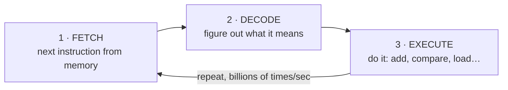
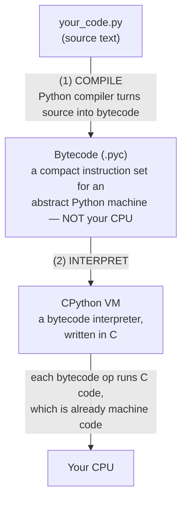
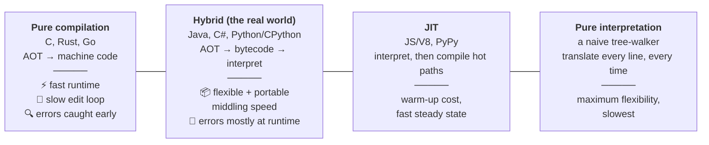

# M01 · Ch1 · §1 — From Source Code to a Running Program

> **Module:** How Computers & Operating Systems Work
> **Chapter:** The execution model
> **Section:** Compilation, interpretation, and what Python *actually* does
> **Status:** ✅ finalized 2026-06-08 — personalized with applied notes from our Q&A (see §10).

**Estimated study time:** 2–3 hours including reflection.
**Prerequisites:** You can read basic Python and a little C. No prior CS theory needed.

---

## Why this section exists (for *you*)

You write Python every day and ship it to AWS Lambda. You've felt these things without a model for *why*:

- Python "feels slow," yet your `numpy`/`torch`/LLM code is fast.
- A Lambda **cold start** is sluggish; a warm one is snappy.
- Heavy `import`s at the top of a handler cost you real latency.
- A `.pyc` file appears in `__pycache__/` and you've never thought about it.

Every one of those is the *execution model* leaking into your daily work. By the end of this section
you should be able to answer, precisely: **"When I run `python handler.py`, what actually happens, step
by step, from text on disk to electrons doing arithmetic?"** That question is the foundation the rest
of M01 (memory, concurrency, I/O, OS) builds on.

A physics analogy to hold onto: source code is like a *theoretical model on paper*. The CPU is the
*physical apparatus*. Between them sits an entire chain of translation — and just like in the lab, most
of your performance surprises live in that translation layer, not in the equations.

---

## 1. The core problem: text can't *do* anything

Your source file is just bytes — characters in a file. A CPU has no idea what `def`, `for`, or
`response = llm(prompt)` mean. A CPU understands exactly one language: **machine code** — numbers that
encode primitive operations. So *something* must translate your human-readable text into those numbers.

There are two classic strategies for that translation, and understanding their difference is the whole
game:

- **Compilation** — translate the *entire* program ahead of time into machine code, then run the result.
- **Interpretation** — translate-and-execute the program *one piece at a time*, as it runs.

Everything else ("Is Python compiled or interpreted?", "Why is C faster?", "What's a JIT?") is a
consequence of where a language sits between these two poles.

---

## 2. What the machine actually understands (just enough CPU)

You can't reason about compilation vs interpretation without knowing what they're translating *to*.
Here's the minimum mental model of a CPU — we'll go deeper in §4 (memory) and Ch1 §4 (I/O).

A CPU repeats one loop, billions of times a second — the **fetch–decode–execute cycle**:



- **Instructions** are tiny: "add these two numbers," "copy this value from memory to a register,"
  "if this is zero, jump to instruction #5021." That's the whole vocabulary. No "loops," no "functions,"
  no "strings" — those are abstractions *we* build on top.
- **Registers** are a handful of ultra-fast slots *inside* the CPU where the actual arithmetic happens.
  Think of them as the CPU's hands — it can only work on what it's holding.
- **Machine code** is the binary encoding of these instructions. **Assembly** is a human-readable
  one-to-one alias for machine code (e.g. `addq %rax, %rbx`). An **instruction set architecture (ISA)**
  — x86-64 (Intel/AMD) or ARM64 (Apple Silicon, AWS Graviton) — defines which instructions exist.

> **This already touches your work:** ISAs are *why* a Docker image built for `linux/amd64` won't run on
> an Apple Silicon Mac without emulation, and why AWS Graviton (ARM) Lambdas are cheaper but need
> ARM-compatible builds. Same source code, *different machine code*. We'll return to this in M09.

The takeaway: **the gap between `response = llm(prompt)` and "add %rax, %rbx" is enormous.** Who crosses
that gap, and *when*, is the difference between a compiler and an interpreter.

---

## 3. The two strategies

### 3a. Compilation (ahead-of-time)

A **compiler** reads your *entire* program and produces a machine-code file *before* it ever runs. C is
the canonical example:

```c
// add.c
int add(int a, int b) { return a + b; }
```

```bash
gcc -O2 -c add.c -o add.o      # compile to machine code, ahead of time
```

The `add.o` is now native machine code for your CPU's ISA. When you run it, the CPU executes it
*directly* — no translator stands in between.

**Consequences (the trade-offs that matter):**

| Property | Why |
|---|---|
| ⚡ **Fast at runtime** | No translation overhead during execution — the CPU runs raw instructions. |
| 🔍 **Whole-program optimization** | The compiler sees everything and can rearrange, inline, and delete code (`-O2` above). |
| 🧱 **Catches errors before running** | Type mismatches, undeclared variables → caught at *compile time*, not in production. |
| 🐌 **Slow edit→run loop** | You must recompile after every change. |
| 📦 **Not portable** | The output is tied to one ISA + OS. Build once per target (amd64, arm64, …). |

### 3b. Interpretation

An **interpreter** is itself a program that reads your source and *performs* it on the fly, statement by
statement. There's no separate machine-code file — the interpreter *is* the running thing, and your code
is its *input data*.

**Consequences — almost the mirror image:**

| Property | Why |
|---|---|
| 🔁 **Fast edit→run loop** | Just run it again; no compile step. |
| 📦 **Portable** | Ship the same source anywhere the interpreter exists. |
| 🐌 **Slower at runtime** | Every line pays a translation/dispatch cost *while running*. |
| 🐛 **Many errors surface only at runtime** | The interpreter doesn't see line 200 until it gets there. (This is exactly why your `Dict[str, Any]` typos blow up in production — foreshadowing M05.) |

### 3c. The crucial correction: it's a spectrum, not a binary

Here's the thing most people get wrong, and the single most important idea in this section:

> **"Compiled vs interpreted" is not a property of a language — it's a property of an *implementation*,
> and almost every modern language uses *both* in layers.**

C *can* be interpreted (there are C interpreters). Python *can* be compiled. What actually happens is
that real-world languages compile to an **intermediate representation (bytecode)** and then interpret
*that*. Which brings us to Python.

---

## 4. What Python *actually* does (CPython)

When people say "Python is interpreted," they're hiding two steps. Here's the real pipeline for
**CPython** (the standard implementation — the `python` binary you almost certainly use):



So Python **is compiled** — just not to machine code. It's compiled to **bytecode**: instructions for an
abstract "Python machine" (the CPython **Virtual Machine**). Then the VM — a big loop written in C —
*interprets* that bytecode, and *that C code* is what's actually been compiled to machine code.

You can see all of this directly. Open a Python REPL and run:

```python
import dis

def add(a, b):
    return a + b

dis.dis(add)
```

You'll see something like:

```
  2           RESUME                   0
  3           LOAD_FAST                0 (a)
              LOAD_FAST                1 (b)
              BINARY_OP                0 (+)
              RETURN_VALUE
```

**That is Python bytecode.** `LOAD_FAST` ("push a local variable onto a stack"), `BINARY_OP` ("add the
top two"), `RETURN_VALUE` — these are the instructions the CPython VM actually executes. Notice they're
*higher-level* than CPU instructions (they know about "local variables" and "+"), but *lower-level* than
your source. They're the in-between language.

### The `.pyc` mystery, solved

That `__pycache__/add.cpython-313.pyc` file you've seen? It's the **cached bytecode** from step (1). On
the next run, if the source hasn't changed, Python skips recompiling and loads the `.pyc` directly. It's
a startup optimization — and it's why the cache is keyed by Python version (`cpython-313`): bytecode is
not guaranteed stable across versions.

> **Connecting to your Lambda cold starts:** A cold start pays for (a) spinning up the runtime, (b)
> *importing your modules* — which means compiling their source to bytecode (or loading `.pyc`) **and
> executing all the top-level code** (every top-level `import boto3`, every module-level constant). This
> is precisely why the advice "do heavy imports lazily, inside the handler" works: you defer that
> compile-and-execute cost until it's actually needed, and warm invocations skip it entirely. You were
> already doing lazy imports in the chatbot service — now you know *what* you were saving.

---

## 5. Why this makes Python "slow" — and why your ML code isn't

Now the payoff. Why is a Python loop ~10–100× slower than the same loop in C?

Because for *every single operation*, the CPython VM does a lot of work that compiled C does once, ahead
of time:
- dispatch on the bytecode op (a big `switch`),
- figure out the runtime *types* of the operands (Python is dynamically typed — `a + b` could be ints,
  floats, strings, or your custom class; the VM must check *every time*),
- box/unbox objects (even an integer is a heap object with a header — more in §2 on memory),
- manage reference counts.

That per-operation overhead is the price of Python's flexibility and fast edit loop.

**So why is `numpy`/`torch`/your LLM inference fast?** Because the heavy work *isn't done in Python*. When
you call `numpy.dot(a, b)` or run a model, Python spends a few bytecode ops to hand a pointer to a big
array down into **precompiled C / Fortran / CUDA** code, which does the million multiply-adds at native
speed and hands one result back. Python is the *conductor*; the *orchestra* is compiled native code.

> **The practical heuristic this gives you:** Python is slow at *fine-grained* work (tight loops over
> individual elements) and perfectly fine as *glue* that orchestrates coarse-grained native operations.
> "Vectorize it" (push the loop down into numpy/torch) is the same idea as "don't let the conductor play
> every note." This intuition will pay off in M07 (architecture) and M13 (building with LLMs).

---

## 6. The third option: JIT compilation

If interpretation is flexible-but-slow and compilation is fast-but-rigid, can we get both? Yes — **JIT
(Just-In-Time) compilation**: start by interpreting, watch which code runs *a lot* ("hot" paths), and
compile *those* to machine code on the fly while the program runs.

You already rely on JITs without knowing it:
- **JavaScript V8** (Chrome, Node) is a JIT — it's why the JS in your `arena-concept-experiment`
  frontend is far faster than its "scripting language" reputation suggests. (More in M11.)
- **PyPy** is an alternative Python implementation with a JIT — often 5–10× faster than CPython for
  pure-Python loops.
- **CPython itself** gained an *experimental* JIT in 3.13 (and a separate experimental free-threaded /
  "no-GIL" build) — both maturing through 3.14. We'll treat the GIL properly in Ch1 §3 (concurrency);
  for now just file away: *the execution model is still actively evolving.*

JITs trade a warm-up cost (the first runs are slow while the engine profiles and compiles) for steady-
state speed — which, note, is *another* flavor of the cold-vs-warm pattern you see in Lambda.

---

## 7. The one-page mental model



*The arrow runs from "who translates everything up front" (left) to "who translates each line every time" (right).*

**The five things to remember:**
1. A CPU only runs **machine code**; everything else is translation on top of it.
2. **"Compiled vs interpreted" describes an *implementation*, not a language** — and it's a spectrum.
3. **CPython compiles your source to *bytecode*, then interprets that bytecode** in a C-based VM.
   (`dis.dis` lets you *see* the bytecode; `.pyc` *caches* it.)
4. Python is "slow" because of **per-operation interpreter overhead on dynamic types** — which is why
   pushing work into **native libraries** (numpy/torch) reclaims the speed.
5. **JIT** is the hybrid: interpret first, compile the hot paths later — trading warm-up for steady-state.

---

## 8. Check your understanding

Try these before our Q&A — jot a one-line answer to each. We'll dig into whichever ones are fuzzy.

1. In your own words: is Python "compiled," "interpreted," or both? Defend your answer in two sentences.
2. What exactly is in a `__pycache__/*.pyc` file, and what problem does it solve?
3. You have a pure-Python function summing a list of 10 million numbers in a `for` loop, and it's too
   slow. Give *two* fundamentally different ways to speed it up, and explain *which layer of the
   execution model* each one attacks.
4. Why can the same Python source run unchanged on your laptop and on a Graviton (ARM) Lambda, when a
   compiled C binary generally can't?
5. A teammate says "let's rewrite the hot loop in C." Under what circumstances is that worth it, and
   under what circumstances is it pointless? Tie your answer to §5.

## 9. Optional: get your hands dirty (10 min, no setup beyond Python)

```python
import dis, time

# (a) See the bytecode for something with a branch and a loop:
def classify(x):
    total = 0
    for i in range(x):
        if i % 2 == 0:
            total += i
    return total

dis.dis(classify)          # read the bytecode; find the loop and the branch

# (b) Feel the interpreter overhead vs a native library:
import statistics
data = list(range(10_000_000))

t = time.perf_counter()
s1 = sum(data)             # 'sum' is C-level, but still iterates Python objects
print("builtin sum:", time.perf_counter() - t)

# Try the same with numpy if available:
# import numpy as np; arr = np.arange(10_000_000)
# t = time.perf_counter(); s2 = int(arr.sum()); print("numpy sum:", time.perf_counter()-t)
```

Notice how `numpy.sum` (operating on a native contiguous array) compares to iterating Python objects.
Bring the numbers to our chat if anything surprises you.

---

## 10. Applied — captured from our session Q&A

These are the real-world threads we worked through on 2026-06-08, distilled here so you can re-derive
them later. Each is the execution model from §1–§6 hitting your actual AWS work.

### 10a. "My laptop is x86-64 — how can it build an *ARM* Lambda?" (ties to §2, ISAs)

Split "create a Lambda" into two things:
- **Deploying** (CDK/CLI) is just **API calls + config** — architecture-independent. Your laptop tells
  AWS "make a function, `Architectures: [arm64]`, here's the package." AWS runs it on its Graviton HW.
- **The code artifact** is where ISA matters:
  - **Pure Python is portable** — it isn't machine code; AWS's ARM-compiled interpreter runs your
    source/bytecode (this is exactly §1's "late translation" point).
  - **Native extensions are NOT portable** — `pydantic-core` (Rust), `psycopg`, `numpy` ship
    pre-compiled `.so` for one ISA. x86 wheels won't load on ARM → `invalid ELF header` /
    `ImportModuleError`.
- **How an x86 host produces ARM artifacts:** download pre-built `aarch64` wheels (a *download*, no
  execution), build under **QEMU-emulated Docker** (`--platform linux/arm64`; what CDK Docker bundling
  does), or **cross-compile** (a compiler's output ISA is independent of the host it runs on).
- **Principle:** *the architecture a binary runs on is set by the build target, not the build machine.*

### 10b. "Does Lambda support compiled languages? Is Python the bottleneck?" (ties to §5)

- Lambda is **polyglot**: managed runtimes (Python, Node, Java, .NET, Ruby), **custom runtime**
  (`provided.al2023` + a `bootstrap` binary → Go, **Rust**, **C/C++** via the Lambda Runtime API), or
  **container images** (anything, up to 10 GB). Go/Rust are native AOT — §1's left column.
- **But check the bottleneck first.** Your backends are **I/O-bound** — they spend ~95% of wall-clock
  *waiting* on the LLM, Postgres, S3, HF Hub. Python being slow *per CPU op* is irrelevant when the op
  is "await a 3s LLM call." Rust can't make the remote call faster. And the CPU-heavy bits you do run
  (Pydantic→Rust, JSON, crypto, numpy) are **already native** under Python (§5's conductor/orchestra).
- **Switch a language only when CPU-bound or cold-start-bound** — and even then, Lambda is
  per-function polyglot, so you'd rewrite *one* hot function, not the system.

### 10c. Cold-start latency — why "slow first hit, fast refresh" (ties to §1's import cost)

- A **cold start** = AWS provisions a container, then **INIT** (imports = compile-to-bytecode + run all
  top-level code), then opens resources (DB conn, secrets), *then* runs your handler. A **warm**
  invocation reuses all of that and jumps straight to the handler — your fast refresh.
- **Low traffic makes it worse, not better:** idle containers get reclaimed, so most real users hit a
  cold path. This was the arena leaderboard "UI hangs for seconds on first load" symptom.
- **Diagnose before fixing:** CloudWatch `REPORT` → `Init Duration` (cold-only). And beware a **dev DB
  that auto-pauses** (Aurora Serverless v2) — it produces the *same* symptom and no Lambda fix helps.

### 10d. Cold-start mitigations (full plan in `temp/arena-cold-start-latency-plan.md`)

- **Cache / precompute** the cacheable (e.g. leaderboard → scheduled job → S3/CloudFront): ms latency,
  ~$0, no cold start. Best for read-heavy, staleness-tolerant endpoints.
- **Trim init** (lazy imports, smaller package) — free; attacks INIT directly.
- **SnapStart** (supports Python): snapshot the initialized runtime → big cold-start cut, low cost,
  keeps Python. Re-init unique state (DB conns/RNG) in a restore hook.
- **Provisioned Concurrency**: keep N envs pre-warmed → cold start *eliminated*, but **ongoing $$**
  (~$9–11/mo for PC=2 @ 512 MB 24/7, x86; ~20% less on ARM; schedule it to cut cost). Use only where
  SnapStart isn't enough.
- **Frontend perceived performance** (loading skeletons + stale-while-revalidate via React Query/SWR) —
  so a slow response never *feels* like a freeze.
- **Architecture takeaway:** scale-to-zero serverless trades cold-start latency for cost; the answer is
  *cache the cacheable, warm the latency-critical, never block the UI on a network call.*

---

## References (optional, for depth)

- Python docs — `dis` module (the authoritative bytecode reference): https://docs.python.org/3/library/dis.html
- CPython internals, "Your Guide to the Python Interpreter" — Anthony Shaw (book) or his PyCon talks.
- "Compilers vs Interpreters" — Computerphile (YouTube), good 10-min visual primer.
- PEP 659 — Specializing Adaptive Interpreter (the groundwork behind CPython's recent speedups & JIT).

---

### What's next
✅ **Finalized 2026-06-08.** This section is marked done in `courses/plan.md`; §10 captures the applied
AWS threads from our discussion for future review. The next section (**§2 — the call stack**) builds
directly on the "instructions and registers" idea from §2 here.
