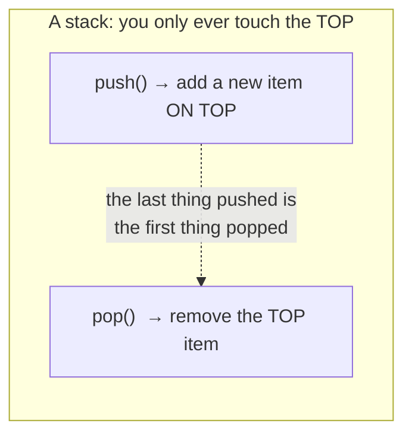
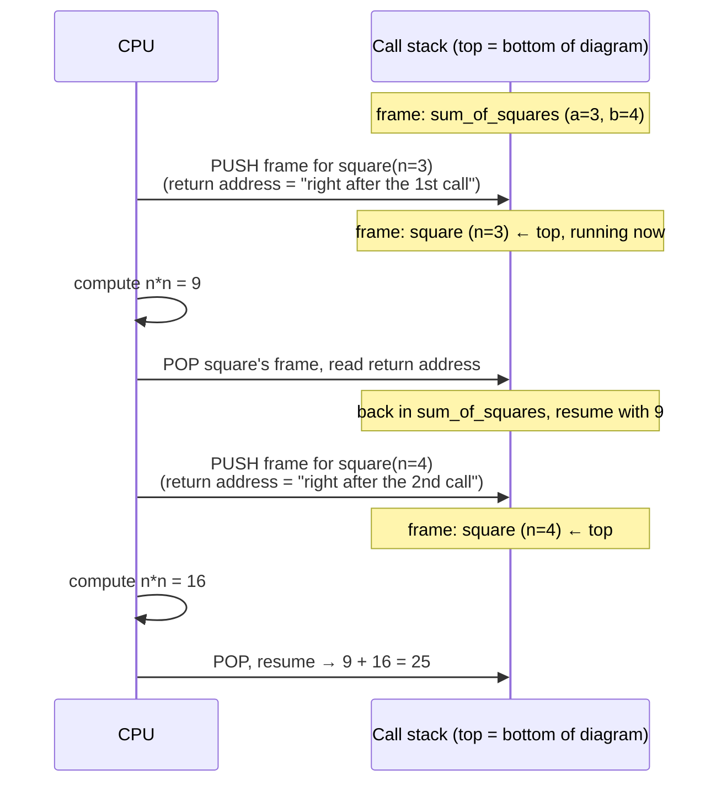
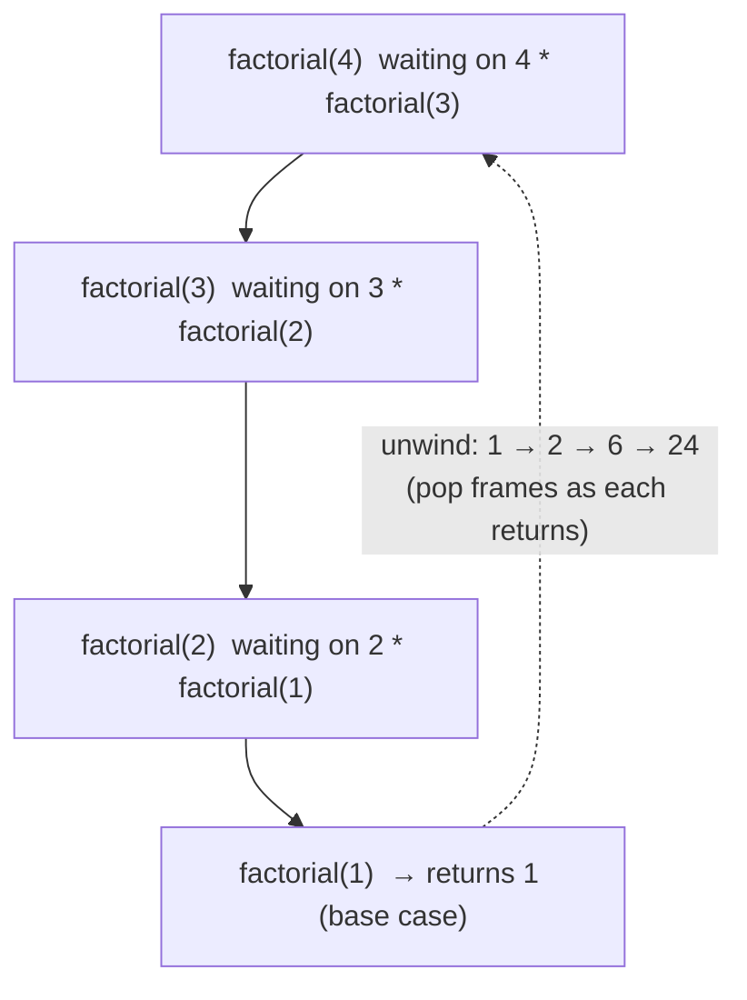
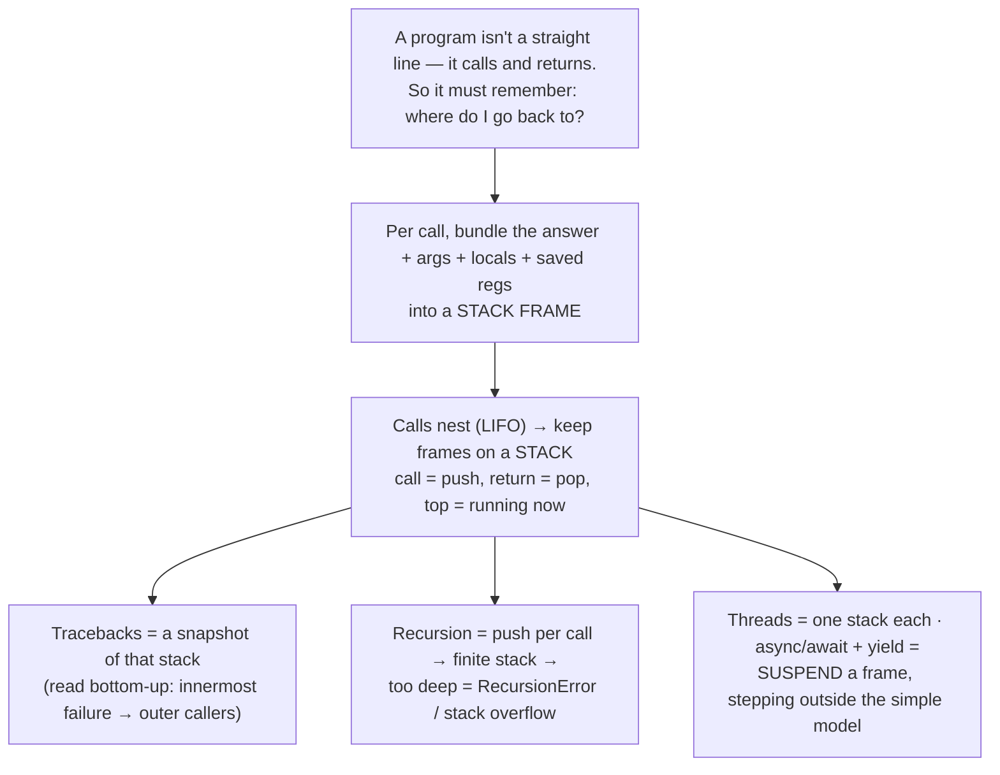

# M01 · Ch1 · §2 — The Call Stack

> **Module:** How Computers & Operating Systems Work
> **Chapter:** The execution model
> **Section:** The call stack — how a program keeps track of "where am I and how do I get back?"
> **Status:** 🔵 draft — generated 2026-06-08, pending our Q&A + finalize.

**Estimated study time:** 2–3 hours including reflection.
**Prerequisites:** §1 (you know a CPU runs machine-code *instructions* and works in *registers*).
You can read basic Python and a little C. No prior CS theory needed.

---

## Why this section exists (for *you*)

In §1 you learned the CPU runs one instruction after another. But real programs aren't a straight
line — they call functions, which call other functions, which return. So a question appears that the
fetch–decode–execute loop alone can't answer: **when a function finishes, how does the CPU know where
to go back to?** The answer is the **call stack**, and once you see it, a pile of your daily
experiences suddenly have a single explanation:

- A Python **traceback** is literally a printout of the call stack — top to bottom, who called whom.
  Reading them well is the single highest-leverage debugging skill you can have, and most people read
  them backwards.
- `RecursionError: maximum recursion depth exceeded` — you've hit this. It's the stack protecting
  itself.
- A **stack overflow** crash, and why a 10-million-deep recursion dies but a 10-million-iteration
  `for` loop doesn't.
- Why an exception raised deep in your `arena` pipeline can be *caught* three layers up — exceptions
  travel *up the stack*.
- Why `async def` functions have those confusing tracebacks that "skip" frames — coroutines don't use
  the call stack the way normal functions do (we'll foreshadow this; Ch1 §3 finishes it).

By the end you should be able to answer precisely: **"What exactly happens, in memory, when one
function calls another — and what is the data structure that makes return, recursion, local variables,
and exceptions all work?"**

A physics analogy: think of the call stack as your **lab notebook during a nested procedure**. Before
you start a sub-measurement you jot down where you were and what your settings were; when the
sub-measurement finishes you flip back to that page and resume. The stack is the machine doing exactly
that bookkeeping, automatically, millions of times a second.

---

## 1. The core problem: calling means you have to come back

Consider the most boring code imaginable:

```python
def square(n):
    return n * n

def sum_of_squares(a, b):
    return square(a) + square(b)   # call square TWICE, from two different spots

result = sum_of_squares(3, 4)
```

`square` is called twice, from two different points inside `sum_of_squares`. When `square` hits
`return`, the CPU must resume *at the exact instruction after the call that got us here* — and that's a
**different place** the second time. So "where do I return to?" is not fixed; it changes with every
call. The CPU needs somewhere to *remember* it.

It also needs to remember more than the return location:

- the **arguments** passed in (`n`),
- the function's **local variables**,
- and the caller's working state (register values) so they aren't clobbered while the callee runs.

All of that bookkeeping, *per call*, is a **stack frame** (also called an *activation record*). The
collection of all the active frames is the **call stack**.

---

## 2. Why a *stack* — the LIFO insight

Here's the elegant part. Function calls have a strict shape: **the last function you called is always
the first one to finish.** If `A` calls `B` and `B` calls `C`, then `C` must return before `B` can
continue, and `B` before `A`. Calls nest; they never cross.

That "last-in, first-out" (**LIFO**) ordering is *exactly* what a **stack** data structure gives you:



So the machine keeps the active frames in a region of memory used as a stack:

- **Calling** a function = **push** a new frame on top.
- **Returning** = **pop** the top frame off (and resume the one now exposed underneath).

You never need to reach into the middle. The function currently running is *always* the frame on top.
This is why the structure and the operation share a name — the **call stack** is a stack *because the
call/return discipline is inherently LIFO.* Nothing forced this; it falls out of how calls nest.

---

## 3. What a stack frame contains, and how call/return works

Let's make it concrete. The stack lives in your process's memory; the CPU keeps a special register, the
**stack pointer (SP)**, pointing at the current top. (Recall registers from §1 — the CPU's "hands.")

A single frame typically holds:

| In the frame | What it's for |
|---|---|
| **Return address** | The instruction to jump back to when this function returns — the answer to §1's question. |
| **Arguments** | The values passed in. |
| **Local variables** | Everything the function declares while running. |
| **Saved registers** | The caller's working values, parked so the callee can reuse those registers. |

Walking through `sum_of_squares(3, 4)` calling `square(3)`:



Notice the return address differs between the two calls — that's the whole point of §1. The same
`square` code, two different "come back to here" notes, because the frame stores the answer
*per call*.

At the machine level this is astonishingly cheap: a `call` instruction pushes the return address and
jumps; a `ret` instruction pops it and jumps back. Allocating a frame is usually just *subtracting from
the stack pointer* — bump a register, done. This cheapness matters later (§6, and Ch2 on memory):
**stack allocation is nearly free; heap allocation is not.**

### The convention question (a peek under the hood)

*Who* pushes the arguments and *who* cleans up — caller or callee, which registers, in what order — is
nailed down by a **calling convention** (part of the platform's ABI). It differs by ISA and OS (x86-64
System V on Linux vs Windows x64 vs ARM64). You'll almost never write this by hand, but it's *why* a
function compiled by one toolchain can call one compiled by another, and it's the same ISA/ABI story
from §1 that makes native wheels non-portable across architectures. File it away; M09/M10 will lean
on it.

---

## 4. Reading a traceback = reading the stack (your highest-leverage payoff)

This is the part that pays for the whole section. A Python **traceback is a snapshot of the call stack
at the moment something blew up** — printed from the *outermost* caller down to the *innermost* frame
where the exception actually fired.

```python
def square(n):
    return n * n            # <- the bug bites here: n is a string

def sum_of_squares(a, b):
    return square(a) + square(b)

sum_of_squares("3", 4)
```

```
Traceback (most recent call last):
  File "demo.py", line 7, in <module>
    sum_of_squares("3", 4)
  File "demo.py", line 5, in sum_of_squares
    return square(a) + square(b)
  File "demo.py", line 2, in square
    return n * n
TypeError: can't multiply sequence by non-int of type 'int'
```

Read it as a stack, and two rules make it effortless:

1. **"Most recent call last"** is Python telling you literally: the **bottom frame is the top of the
   stack** — the innermost place execution actually was. **Start reading at the bottom.** The last
   `File … line …` plus the error type/message is *what* broke and *where*. Everything above is the
   chain of *who called whom* to get there.
2. **The bottom is often not the file you should fix.** Here the crash is in `square`, but the *defect*
   is the `"3"` passed in at the top. The stack is your map for walking from symptom (bottom) up to
   cause (somewhere above). This is exactly how you'll triage a 30-frame traceback out of your arena
   pipeline.

> **For your AWS work:** in CloudWatch, a Lambda error logs this same stack — but interleaved with other
> log lines and JSON. The skill is identical: find the innermost frame (the real failure site), then
> walk *up* the frames through your handler → service → client layers to find which of *your* calls fed
> it bad input. We'll connect structured logging and request-scoped tracing in M09 (observability);
> the call stack is the raw material those tools format for you.

You can also inspect the live stack yourself:

```python
import traceback
def inner():
    traceback.print_stack()   # print the call stack WITHOUT an exception
def outer():
    inner()
outer()
```

That's the same data structure, on demand — useful when you want to answer "how did execution even get
*here*?" in a confusing async or callback flow.

---

## 5. Recursion, depth limits, and the stack overflow

Recursion is just a function calling *itself* — which means **push another frame** each time. Each
pending call holds its own frame (its own `n`, its own return address) until the base case lets them
unwind:

```python
def factorial(n):
    if n <= 1:            # base case: stop recursing
        return 1
    return n * factorial(n - 1)   # each call pushes a new frame
```

`factorial(4)` stacks four frames before any returns:



The stack is **finite** — a fixed-size memory region. Pile on too many frames and you run off the end:
a **stack overflow**, which at the OS level is a hard crash (segmentation fault). Two safety nets:

- **CPython sets a soft recursion limit** (default ~1000; see/raise it with `sys.getrecursionlimit()` /
  `setrecursionlimit()`). When you exceed it you get a clean **`RecursionError`** *before* the real OS
  stack overflows — a deliberate guardrail. Raising the limit too far just trades a catchable Python
  error for an uncatchable native crash.
- **Many languages optimize *tail calls*** (a recursive call in "return position" reuses the current
  frame instead of pushing a new one — constant stack). **Python deliberately does not** — Guido chose
  to keep full tracebacks over the optimization. The practical lesson: in Python, *deep recursion is a
  liability* — prefer a loop or an explicit stack/queue. (You'll see this again as a code-smell call in
  M04.)

> **The key contrast to lock in:** a `for` loop iterating 10 million times uses **one** frame, reused
> 10 million times — it never grows the stack. The *same* logic written as 10-million-deep recursion
> pushes 10 million frames and dies. Same result, completely different memory behavior. Loops trade
> stack growth for a counter; recursion trades clarity (sometimes) for stack depth.

---

## 6. Where Python keeps *its* stack (CPython specifics)

A subtlety that connects straight back to §1: there are really **two stacks layered here**, mirroring
the bytecode/VM idea.

- The **C call stack** — the native stack of the `python` process itself (the CPython VM is a C
  program, §1).
- **Python frame objects** — CPython represents each Python-level function call with its own *frame
  object* (`PyFrameObject`), holding your locals, the value stack for bytecode operands, and a pointer
  to the calling frame. The traceback in §4 is a walk over *these*.

Historically each Python call also consumed a chunk of the C stack, which is why deep Python recursion
could threaten the *native* stack. **CPython 3.11+ moved Python frames into a contiguous, heap-managed
data stack** and made calls cheaper and shallower on the C stack — part of the "Faster CPython" work
(same lineage as the 3.13 JIT you met in §1). The mental model still holds: *Python calls push frames,
returns pop them*; the implementation just got leaner.

You can *see* a frame object:

```python
import sys
def show():
    f = sys._getframe()
    print(f.f_code.co_name)        # 'show' — this frame's function
    print(f.f_back.f_code.co_name) # the caller's name — walk UP the stack
show()
```

`f_back` is the link from a frame to its caller — literally the "who called me" pointer that makes the
whole stack a chain. (Internals are version-specific and not for production, but they make the abstract
concrete.)

---

## 7. The crack in the model: async, threads, and generators

Everything above assumes one straight thread of execution with one stack. Three things in *your* daily
code bend that — flagged here, paid off later:

- **Threads:** each thread gets its **own** call stack (so each can be doing something different). A
  traceback is *per thread* — `faulthandler.dump_traceback_later` and thread dumps exist precisely
  because there's more than one stack. (Ch1 §3.)
- **`async def` / coroutines:** an `await` can **suspend** a function and pop back to the event loop
  *without* the function having returned — its state is saved off to the side (on the heap), not left
  on the native stack. That's why async tracebacks look "broken": the chain of `await`s isn't a plain
  call stack, and you sometimes need `Task` context to see the full path. Your arena pipeline's
  `asyncio` flow lives here. (Ch1 §3 explains the event loop properly; for now just know: *the call
  stack is a single-thread, synchronous abstraction, and `await` steps outside it.*)
- **Generators:** a `yield` similarly freezes a frame and resumes it later. Same idea — a frame that
  outlives the simple push/pop discipline.

The throughline: **the call stack is the model for *synchronous, single-threaded* execution.** It's
exactly correct there, and every concurrency feature you use is, in some sense, a scheme for having
*more than one* logical stack — or for *suspending* one. Holding the simple model crisply is what lets
the exceptions make sense later.

---

## 8. Stack vs heap (a one-paragraph bridge to Ch2)

You'll keep hearing "stack" paired with "heap," so plant the seed now. **The stack** holds frames —
short-lived, LIFO, automatically freed on return, and dirt-cheap (bump the stack pointer). **The heap**
holds objects that must outlive the call that made them, or whose size isn't known up front — allocated
explicitly, freed later (in Python, by the garbage collector). In CPython, a local variable lives in
the frame (stack-ish), but the *object* it points to (your dict, your list, even an int) lives on the
**heap**. That split — *names on the stack, objects on the heap* — is the entire subject of Ch1 §2
(Memory). For now: **stack = the bookkeeping of "where am I"; heap = "the stuff I'm working on."**

---

## 9. The one-page mental model



**The five things to remember:**
1. The call stack exists to answer **"where do I return to, and with what local state?"** — one
   **frame** per active call.
2. It's a **stack** because calls are **LIFO**: the last one called is the first to finish. Call =
   push, return = pop, the running function is always on top.
3. A **traceback is the call stack printed** — read it **bottom-up** (innermost failure first), then
   walk up to find the real cause.
4. **Recursion pushes a frame per call** on a finite stack → `RecursionError` / stack overflow; a
   **loop reuses one frame**. Python doesn't do tail-call optimization, so prefer loops for depth.
5. The call stack models **synchronous, single-threaded** execution. **Threads** = one stack each;
   **`async`/`await`/`yield`** = suspend a frame off to the side — the cracks Ch1 §3 widens.

---

## 10. Check your understanding

Jot a one-line answer to each before our Q&A — we'll dig into whichever are fuzzy.

1. In your own words, why is the call stack a *stack* and not, say, a queue or a list you index into?
2. You're handed a 25-line Python traceback from a CloudWatch log. Describe your *reading procedure* —
   where do you start, which direction do you move, and how do you tell "where it broke" from "what to
   fix"?
3. A pure-Python function that recurses 1,000,000 deep crashes; the equivalent `for` loop summing
   1,000,000 numbers is fine. Explain the difference in terms of frames.
4. Why does raising `sys.setrecursionlimit()` to a huge number *not* actually make deep recursion safe?
   What are you really trading?
5. Your async arena handler `await`s an LLM call and the traceback looks like it "skips" the middle of
   your pipeline. Using §7, explain why — what did `await` do to the stack?

## 11. Optional: get your hands dirty (10 min, just Python)

```python
import sys, traceback

# (a) Watch the stack grow and shrink. Print the depth at each level:
def depth():
    d = 0
    f = sys._getframe()
    while f:                       # walk f_back until there's no caller
        d += 1
        f = f.f_back
    return d

def a(): print("in a, depth =", depth())
def b(): print("in b, depth =", depth()); a()
def c(): print("in c, depth =", depth()); b()
c()                                # depths increase as frames stack

# (b) Feel the recursion limit (deliberately blow it, but catch it):
print("limit:", sys.getrecursionlimit())
def boom(n=0): return boom(n + 1)  # no base case
try:
    boom()
except RecursionError:
    print("caught RecursionError — the guardrail fired before a native crash")

# (c) Read a stack without an exception:
def inner(): traceback.print_stack()
def outer(): inner()
outer()                            # compare this printout to a real traceback
```

Bring anything surprising to our chat — especially how the depth numbers move in (a), and how (c)'s
printout maps onto the bottom-up reading rule from §4.

---

## References (optional, for depth)

- Python docs — `traceback` module: https://docs.python.org/3/library/traceback.html
- Python docs — `sys.setrecursionlimit` / `getrecursionlimit`: https://docs.python.org/3/library/sys.html
- "Faster CPython" — the 3.11+ frame/stack rework (background on §6): the PEP 659 / Faster CPython notes.
- Computerphile — "The Stack" / "Stack Overflow" short videos: good visual primers on push/pop & frames.
- (Deeper, optional) "Computer Systems: A Programmer's Perspective" (Bryant & O'Hallaron), ch. on
  procedures — the definitive machine-level treatment of frames and calling conventions.

---

### What's next
🔵 **Draft — generated 2026-06-08.** After our Q&A I'll personalize this (capturing the applied threads
from our discussion as a §12, the way §1 ended) and mark it ✅ in `courses/plan.md`. The next section
(**§3 — machine code & the CPU at a glance**) zooms back down to what those `call`/`ret` instructions
*are* at the silicon level, closing the loop from source (§1) through the stack (§2) to the metal.
