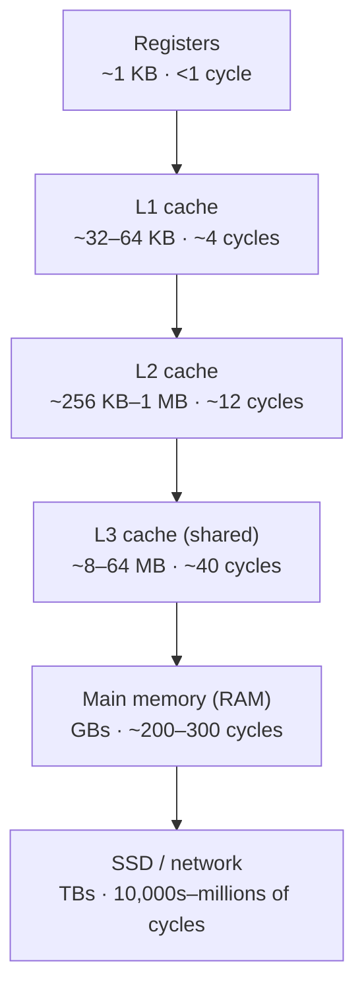
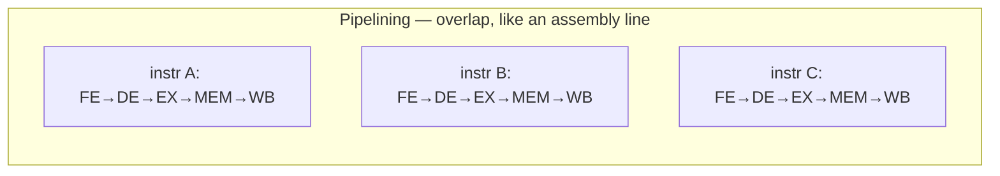
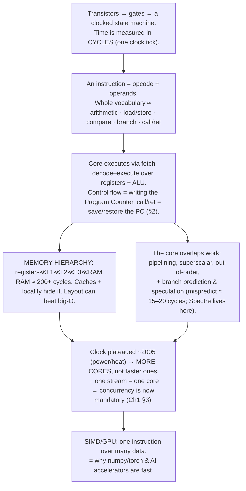

# M01 · Ch1 · §3 — Machine Code & the CPU at a Glance

> **Module:** How Computers & Operating Systems Work
> **Chapter:** The execution model
> **Section:** Machine code & the CPU — what `call`/`ret` and your arithmetic *actually are* at the silicon level
> **Status:** ✅ finalized 2026-06-09 — you knew most of the body already; the session ran almost
> entirely on *your* questions one layer past it (multi-core cache/register topology, GPU memory
> hierarchy, what CUDA actually is). §11 captures those threads in the form we worked them out.

**Estimated study time:** 2–3 hours including reflection.
**Prerequisites:** §1 (machine code, ISA, registers, the fetch–decode–execute loop) and §2 (the call
stack; `call`/`ret`). You can read basic Python and skim a little assembly — I'll always gloss it.

---

## Why this section exists (for *you*)

This is the floor of the stack. §1 took you from source text down to "machine code runs on a CPU"; §2
showed how `call`/`ret` and frames make functions work. This section opens the CPU itself and asks:
**when the machine "executes an instruction," what is physically happening, and why does that shape
everything above it?** You have an unfair advantage here — a PhD in applied physics and ten years in
semiconductor failure analysis. You already know the *device layer* (transistors, doping, the silicon).
What's been implicit is the **architecture layer** that sits between a transistor and `response =
llm(prompt)`. This section fills exactly that gap: from logic gates up to "why my code is fast or slow."

By the end, these everyday mysteries collapse into one model:

- Why `numpy`/`torch` run ~100× faster than the same loop in pure Python — it's **not** just "C is
  compiled" (§1's answer); it's **cache locality + SIMD**, and you'll see why.
- Why CPU clock speeds **stopped climbing around 2005** (~3–4 GHz) and the industry pivoted to *more
  cores* — which is the entire reason concurrency (Ch1 §3) became unavoidable rather than optional.
- Why a **cache miss** can cost more than a thousand arithmetic instructions, and why "big-O" sometimes
  loses to "the layout that the cache likes."
- What `call`/`ret` from §2 *are* as silicon — and why a mispredicted branch (an `if` that surprises
  the CPU) quietly throws away dozens of cycles of work.
- The faint thread connecting **Spectre/Meltdown** (M10 security) to a performance trick the CPU plays
  behind your back: speculative execution.

A physics framing to hold onto: you spent a career reasoning about a device whose *bulk behavior*
emerges from billions of identical small elements. A CPU is the same story one abstraction up — billions
of transistors arranged so that their collective switching *computes*. We're going to stay at the
"effective theory" level (architecture), the way you'd use a compact model instead of solving Poisson's
equation for every carrier.

---

## 1. From transistor to instruction (the one layer you can skim)

You know this floor better than I do, so just the bridge: a **transistor** is a voltage-controlled
switch. Wire a few together and you get a **logic gate** (AND/OR/NOT). Wire gates together and you get
two kinds of useful block:

- **Combinational logic** — output is a pure function of the inputs (an *adder* that turns two 64-bit
  numbers into their sum is just a big pile of gates).
- **Sequential logic** — has *memory*, driven by a **clock**: flip-flops/registers that hold a value
  until the next clock tick. This is what makes a CPU a *state machine* rather than a calculator.

The **clock** is the heartbeat: a square wave at some frequency (say 3 GHz = 3 billion ticks/second).
On each tick, the CPU's state advances — latch new values into registers, let the combinational logic
settle, latch again. **A "cycle" is one clock tick**, and it's the natural unit of time for everything
below. (Your semiconductor instinct is right: the ceiling on clock speed is fundamentally about how fast
you can switch transistors and dissipate the heat — we'll cash that out in §6.)

That's the whole bridge. From here up, we reason in terms of *instructions, registers, and cycles*, not
electrons — the same move as using a SPICE-free compact model.

---

## 2. What an instruction *is*, concretely

An instruction is a binary number that the CPU's **decoder** reads as "do this specific primitive
operation." It splits into fields — an **opcode** (which operation) and **operands** (which registers /
which memory address / an immediate constant). Example, in x86-64 assembly with its machine-code gloss:

```asm
addq %rax, %rbx     ; rbx = rbx + rax        (arithmetic, register→register)
movq (%rsi), %rax   ; load: rax = memory[rsi] (a LOAD from RAM)
movq %rax, (%rdi)   ; store: memory[rdi] = rax (a STORE to RAM)
cmpq $0, %rax       ; compare rax with 0, set flags
je   .L_done        ; if equal flag set, JUMP to label (a branch)
call square         ; push return addr, jump to square   (§2!)
ret                 ; pop return addr, jump back          (§2!)
```

Notice the entire vocabulary is roughly: **arithmetic/logic**, **load/store** (move between registers
and memory), **compare**, **branch/jump**, and **call/return**. That's it. Every program you've ever
run — your arena pipeline, Postgres, the Linux kernel — is *billions of these five kinds of thing*. The
richness is in the composition, not the primitives. (This is the same humbling realization as §1: there
are no "strings" or "functions" down here, only the abstractions we build.)

Two ISA philosophies, worth knowing because it's your AWS bill:

| | **CISC** (x86-64: Intel/AMD) | **RISC** (ARM64: Apple Silicon, AWS Graviton) |
|---|---|---|
| Instructions | Many, some complex/variable-length | Fewer, simple, fixed-length |
| Decode | Harder (CPU cracks them into micro-ops internally) | Simpler, cheaper to decode |
| Reputation | Legacy-rich, power-hungry | Power-efficient → cheaper, cooler |

The line has blurred (modern x86 chips translate CISC instructions into RISC-like *micro-ops*
internally), but the energy story is real and it's *why* Graviton Lambdas are cheaper per
request: ARM does the same work for fewer watts. Same source, different machine code — §1's portability
point, now with the "why it's cheaper" attached.

---

## 3. Inside the core: the datapath and the fetch–decode–execute loop, revisited

§1 gave you the loop as a black box. Here's what's *inside* doing each step:

<!-- DIAGRAM:START -->


<details>
<summary>Diagram source (Mermaid)</summary>


</details>
<!-- DIAGRAM:END -->

The cast:

- **Program Counter (PC / instruction pointer, `rip` on x86)** — a register holding the *address of the
  next instruction*. **Normal execution just increments it**; a **branch** or a `call`/`ret` is nothing
  more exotic than *writing a new value into the PC*. That's the deep idea: control flow *is* "what we
  put in the PC."
- **Register file** — the handful of named registers from §1 (`rax`, `rbx`, …). The CPU's hands; the
  fastest storage that exists (sub-nanosecond).
- **ALU (Arithmetic Logic Unit)** — the combinational adder/comparator/logic block from §1. Does the
  actual `+`, `&`, `<`.
- **Control unit** — the decoder; turns the opcode into the right internal switch settings.

Now connect it to §2 in one breath: **`call square`** = *push the current PC onto the stack (so `ret`
can find it), then write `square`'s address into the PC.* **`ret`** = *pop that saved address off the
stack and write it back into the PC.* The entire call-stack abstraction you built in §2 reduces, at this
layer, to **"save the PC, jump; later restore the PC, jump back."** The stack pointer is just another
register the CPU bumps. Nothing magic — it's PC arithmetic plus a memory convention.

---

## 4. The memory hierarchy — the single most important performance fact

Here is the thing that, once internalized, explains more real-world performance than anything else in
this course. **Not all memory is equally far away**, and the distances are *enormous*. The CPU is so
fast that RAM, from its point of view, is in another time zone.

<!-- DIAGRAM:START -->


<details>
<summary>Diagram source (Mermaid)</summary>



</details>
<!-- DIAGRAM:END -->

Read those cycle counts again. If a register access is "reach into your hand" (1 second), then:

| Level | ~cycles | Human-scale analogy (1 cycle ≈ 1 sec) |
|---|---|---|
| Register | <1 | now, in your hand |
| L1 | ~4 | a note on your desk (~4 s) |
| L2 | ~12 | a book on the shelf (~12 s) |
| L3 | ~40 | walk to the next room (~40 s) |
| **RAM** | **~200–300** | **drive across town (~4–5 min)** |
| SSD | ~100,000+ | a multi-day shipment |

**A RAM access can cost ~200+ cycles** — during which a modern core could have executed *hundreds* of
arithmetic instructions. So the CPU spends staggering effort *avoiding* RAM by keeping recently/soon-used
data in **caches** (small, fast, automatic copies). Two principles make caching work, both called
**locality**:

- **Temporal locality** — if you touched an address, you'll likely touch it again soon (keep it cached).
- **Spatial locality** — if you touched an address, you'll likely touch its *neighbors* soon. So the
  cache doesn't fetch one byte; it fetches a whole **cache line** (~64 bytes) at once.

A **cache hit** is ~4 cycles; a **cache miss** drags in a line from RAM at ~200. So the layout of your
data — *whether the next thing you need is already in the line you just pulled* — can dominate runtime.
This is the secret behind a fact you've lived but maybe not explained:

> **Why `numpy` crushes a Python loop, part 1 of 2.** A Python list of a million numbers is a million
> *pointers* scattered across the heap (each pointing to a boxed `int` object — Ch1 §2's "names on the
> stack, objects on the heap"). Walking it is a cache-miss minefield. A `numpy` array is **one
> contiguous block** of raw numbers — so each 64-byte line the CPU fetches brings in the *next several
> values you need*. Same algorithm, but one is cache-friendly and one is cache-hostile. (Part 2 is SIMD,
> §7.) Note this is a *different* lever than §1's "compiled vs interpreted" — they stack.

The actionable instinct: **contiguous, predictable, sequential access is fast; pointer-chasing and
random access are slow** — often by more than the big-O difference would suggest. You'll meet this again
in M03 (why B-tree indexes and sequential scans behave the way they do — disk has the same hierarchy
shape, just shifted).

---

## 5. How a core does more than one instruction at a time

Naively, one instruction per cycle. Real cores do *much* better by overlapping work — and the tricks
have direct consequences for your code's behavior.

**Pipelining.** The five stages in §3 (fetch, decode, execute, memory, write-back) use *different* parts
of the CPU. So like a factory line, while instruction A is in "execute," B can be in "decode," C in
"fetch." Steady-state throughput approaches **one instruction finished per cycle** even though each takes
several cycles end-to-end.

<!-- DIAGRAM:START -->


<details>
<summary>Diagram source (Mermaid)</summary>



</details>
<!-- DIAGRAM:END -->

**Superscalar + out-of-order.** Modern cores have *multiple* ALUs and can retire **several instructions
per cycle**, and they'll **reorder** instructions that don't depend on each other to keep all units busy
(then commit results in the original order so you never notice). The CPU is quietly a little scheduler.

**The catch — branches.** Pipelining needs to know *which instruction comes next*. But a branch
(`if`, loop test, the `je` in §2) isn't resolved until partway down the pipeline. So the CPU **guesses**
with a **branch predictor** (a learned history of "which way did this branch go last time") and
**speculatively executes** down the predicted path:

- **Predicted right** (the common case — predictors hit >95% on typical code): free, no stall.
- **Predicted wrong:** the CPU must **throw away** all the speculative work and refill the pipeline —
  a **branch misprediction penalty** of ~15–20 cycles.

The practical upshot: **predictable branches are nearly free; unpredictable ones are expensive.** A loop
that runs a million times is trivially predictable; a branch that flips randomly on data defeats the
predictor. This is why, occasionally, processing *sorted* data is faster than unsorted — same
instructions, but the branches became predictable. You won't micro-optimize this in Python (the
interpreter overhead dwarfs it), but it's the mechanism beneath "branchless code" and a lot of
performance folklore.

> **The security thread (M10 foreshadow):** speculative execution means the CPU *does work it might
> throw away* — and that work can leave traces in the cache. **Spectre** and **Meltdown** (2018) were
> the discovery that an attacker could *measure* those traces to read memory they shouldn't see. A
> performance trick became a confidentiality hole. We'll come back to it in M10; for now just register
> that "the CPU runs ahead speculatively" is a real, observable behavior, not a metaphor.

---

## 6. Why the clock stopped getting faster — and why you now have cores

For ~30 years, chips got faster mostly by **raising the clock** (and shrinking transistors —
Dennard scaling, which you know from the device side). Around **2004–2006 that wall hit**: power density.
Dynamic power scales roughly with frequency × voltage², and you can only push so many watts through a
few mm² before you can't remove the heat. (You've literally seen what excess current density does to
silicon.) Clocks plateaued around **3–4 GHz** and have basically stayed there.

The transistors kept coming (Moore's law had life left), so the industry spent them differently: instead
of one faster core, **put many cores on one die.** Your laptop and your Lambda runtime have 4, 8, 16+
cores. But here's the load-bearing consequence for everything you build:

> **More cores do nothing for a single sequential instruction stream.** A program that's one straight
> line of `call`/`ret`/arithmetic runs on **one** core and ignores the other fifteen. To use them, the
> program must be split into *multiple* streams that run at once — **concurrency and parallelism.**

That is *the* reason Ch1 §3 exists, and it ties straight to the threads you've already pulled on (§2
§12a): a thread is one instruction stream → one core at a time; the GIL serializes Python bytecode so
threads don't get you multi-core CPU parallelism; `multiprocessing` and native libraries that drop the
GIL do. The hardware stopped handing us free speed in ~2005, and **that** is why "make it concurrent" is
now a skill you have to own rather than a luxury. The free lunch is over; the kitchen gave you more
stoves instead of a hotter one.

---

## 7. SIMD and the GPU — why your AI workloads are a different animal

One more lever, and it's the one closest to your day job. Normal instructions are **SISD** — Single
Instruction, Single Data: `addq` adds *one* pair of numbers. But a CPU core also has **SIMD** units —
*Single Instruction, Multiple Data* — that apply one operation to a **whole vector** at once (e.g. add
eight pairs of floats in one instruction: SSE/AVX on x86, NEON on ARM).

> **Why `numpy` crushes a Python loop, part 2 of 2.** Beyond cache-friendliness (§4), `numpy`'s C
> kernels are **vectorized** — they issue SIMD instructions that chew through 4/8/16 array elements per
> instruction. Pure-Python `for x in list: total += x` does one boxed-int addition per *interpreter
> loop iteration* (thousands of cycles of overhead each, §1). Contiguous memory (§4) + SIMD (§7) +
> compiled-not-interpreted (§1) — three independent multipliers stacking — is the full answer to "why is
> the library 100× faster than my loop."

Now extrapolate. A **GPU** takes SIMD to its logical extreme: thousands of simple ALUs all running the
*same* operation on *different* data — "SIMT," massively parallel. Matrix multiply (the core of every
neural network) is *embarrassingly* parallel in exactly this way, which is why training and inference
live on GPUs/TPUs, not CPUs. You don't need the silicon details yet (M12 covers how models map onto this
hardware), but plant the flag: **the reason AI runs on accelerators is this section's punchline pushed to
the limit — when the *same* arithmetic must run over *enormous* uniform data, you want many tiny ALUs,
not a few clever ones.** The CPU optimizes latency for messy branchy code; the GPU optimizes throughput
for uniform numeric crunching. Different tools, same root question of "how do we get more arithmetic done
per unit time now that the clock won't budge."

---

## 8. The one-page mental model

<!-- DIAGRAM:START -->


<details>
<summary>Diagram source (Mermaid)</summary>



</details>
<!-- DIAGRAM:END -->

**The six things to remember:**
1. The CPU is a **clocked state machine**; the unit of time is the **cycle**, and the instruction
   vocabulary is tiny — arithmetic, load/store, compare, branch, `call`/`ret`. Everything is built from
   those.
2. **Control flow is just writing the Program Counter.** `call`/`ret` from §2 = save the PC and jump /
   restore the PC and jump back. No magic under the abstraction.
3. The **memory hierarchy** is the dominant performance fact: RAM is ~200+ cycles away, caches hide it,
   and **data layout / locality** can matter more than algorithmic big-O.
4. A core does **more than one instruction at a time** (pipeline, superscalar, out-of-order) by
   *guessing* branches; a **misprediction** throws the work away (~15–20 cycles) — and speculation is
   where Spectre-class bugs come from.
5. Clock speed **stopped scaling ~2005** (power/heat), so we got **more cores** — which is *the* reason
   concurrency (Ch1 §3) is mandatory: more cores do nothing for a single instruction stream.
6. **SIMD/GPU** = one instruction over many data → the real reason `numpy`/`torch` and AI hardware are
   fast (stacking on top of cache-locality and compiled-not-interpreted).

---

## 9. Check your understanding

Jot a one-line answer to each before our Q&A — we'll dig into whichever are fuzzy.

1. In terms of the Program Counter and the stack, describe what `call square` and the later `ret`
   actually do. (Tie §2 to §3.)
2. You have two functions that compute the same sum over a million numbers — one walks a Python `list`,
   one walks a `numpy` array. Name the **three independent** reasons the `numpy` version is faster, each
   from a different section (§1, §4, §7).
3. A colleague says "RAM is fast, it's basically instant." Push back quantitatively: roughly how many
   arithmetic instructions could a core run in the time of one RAM access, and what hides that cost?
4. Why did raising the clock frequency stop being the way chips get faster, and what's the direct
   consequence for how you have to *write* programs to use a modern CPU?
5. Explain how a branch misprediction wastes work, and give one reason processing **sorted** data can be
   faster than unsorted even when the instructions are identical.
6. (Stretch) In one sentence each: what problem is a **GPU** built to win at, and why is that the same
   idea as SIMD rather than the same idea as multicore?

## 10. Optional: get your hands dirty (15 min)

You don't need assembly tools — Python can *show* you the layers.

```python
# (a) See the cache/locality effect WITHOUT leaving Python.
#     numpy array (contiguous) vs Python list (pointer-chasing), same sum.
import numpy as np, time
n = 10_000_000
py = list(range(n))
nm = np.arange(n)

t = time.perf_counter(); s1 = sum(py);        print("python list:", time.perf_counter()-t, s1)
t = time.perf_counter(); s2 = int(nm.sum());  print("numpy array:", time.perf_counter()-t, s2)
# Expect numpy to win by ~50–100×. That gap = compiled (§1) + contiguous/cache (§4) + SIMD (§7).

# (b) See machine-ish code: Python's bytecode is the §1 layer; the REAL machine code
#     is one level below it. dis shows you the VM instructions your CPU's instructions implement.
import dis
def f(a, b):
    return a * b + 1
dis.dis(f)   # LOAD_FAST / BINARY_OP / RETURN_VALUE — the interpreter's "instruction set"

# (c) Count your cores — the things §6 says you must work to use.
import os
print("logical CPUs available:", os.cpu_count())
```

For the truly curious (no need to run): paste a tiny C function into <https://godbolt.org> (the Compiler
Explorer) and watch it compile to **actual x86-64 / ARM64 assembly** — you'll see the `push`/`mov`/
`add`/`call`/`ret` from this section and §2, for real, side by side with the source. Bring anything
surprising — especially the size of the gap in (a) — to our chat.

---

## 11. Applied — captured from our session Q&A

You already knew the section body, so the whole session was *you* pushing one layer past it — into how
multiple cores share state, how a GPU's hierarchy differs, and what CUDA actually is. Distilled here so
you can re-derive them.

### 11a. Multi-core: what's private vs shared (ties to §3, §4)

- **Registers — private per core**, and in fact per *hardware thread*. With **SMT/hyperthreading** one
  physical core holds **two full architectural register sets** (so two logical threads don't clobber
  each other's `rip`/`rax`) while *sharing the execution units* — which is why two hyperthreads ≠ 2×
  throughput.
- **Caches — split:** **L1 (and usually L2) are private** to each core; **L3 (the Last-Level Cache) is
  shared** across all cores on the die. Mental model: `registers · L1 · L2` dedicated → `L3 · RAM`
  shared. (Real chips vary — clustered L2, AMD's per-CCX L3 slices — but private-L1/L2, shared-LLC is
  right ~90% of the time.)

### 11b. Cache coherence — the consequence of private caches (ties to §4, foreshadows Ch3)

- If two cores each cache the same address privately and one writes, the other's copy is stale. Hardware
  fixes this *for you* with a **coherence protocol (MESI** and variants): cores **snoop** and
  **invalidate** each other's copies so software sees one coherent memory — but it's maintained by real
  bus/coherence traffic, not free.
- Two things this plants for **Ch3 (concurrency)**: (1) **False sharing** — two cores writing *different*
  variables that land in the *same 64-byte line* ping-pong that line via invalidations; fix is
  padding/alignment. (2) **Coherence ≠ ordering** — everyone eventually agrees on a *single* location's
  value, but the order writes to *different* locations become visible is the **memory-model** problem
  (atomics, fences; Python's **GIL** sidesteps much of it by letting only one thread touch objects).

### 11c. GPU memory hierarchy — same skeleton, inverted emphasis (ties to §4, §7)

- **Terminology first:** **SM (Streaming Multiprocessor) ≈ a CPU core** (an H100 has ~130); a **CUDA
  core = one ALU lane** (~128 per SM); a **warp = 32 threads in lockstep (SIMT)**. "16,000 CUDA cores" =
  ~130 real cores × ~128 lanes.
- **Same private→shared→DRAM ladder:** registers **private** (per-thread, partitioned from a *huge*
  ~256 KB register file); **L1 + Shared Memory private to each SM**; **L2 shared** across all SMs; then
  **VRAM** (HBM, ~3 TB/s on H100) shared by everything.
- **The inversion (the key insight):** a CPU hides RAM latency with **big caches + out-of-order**; a GPU
  hides it with **massive thread oversubscription** — thousands of threads resident at once (hence the
  giant register file), and when a warp stalls on VRAM the scheduler swaps to a ready warp at **zero
  context-switch cost** (all registers already resident). Term: **occupancy** — too many registers per
  thread → fewer resident warps → less latency hiding. So GPU caches are *small relative to compute*; it
  bets on bandwidth + parallelism, not on caching a working set.
- **Shared Memory ≠ a cache:** it's a **software-managed scratchpad** threads in a block explicitly stage
  VRAM data into (~100× faster than VRAM) — no clean CPU analogue (CPU caches are transparent).
- **Why it lands on your AI work:** fast matmul **tiles** into Shared Memory so values are reused
  (identical math, less data movement — §4's "layout beats big-O" at the limit); **FlashAttention** is
  exactly this trick for attention. And **LLM decode is usually memory-bandwidth-bound** (you stream
  billions of weights past half-idle cores) — which is why VRAM *bandwidth*, not just FLOPs, is the
  headline spec and why **quantization** (less to move) speeds inference. The compute-bound/memory-bound
  split is the framing for all GPU performance reasoning.

### 11d. What CUDA is — software, not hardware (ties to §1, §2)

- **CUDA is NVIDIA's proprietary software platform**, *not* hardware. The collision to keep straight:
  **"CUDA core" = a hardware ALU lane** (marketing); **"CUDA" = the software stack**.
- **The stack, top to bottom:** the CUDA C/C++ *language* extension (`__global__` kernels, `<<<...>>>`
  launch) → the `nvcc` *compiler* → the *runtime + libraries* (**cuBLAS**, **cuDNN**, NCCL — the fast
  kernels that actually matter) → the **driver** (the only genuinely "driver-like" layer, at the bottom,
  talking to silicon).
- **The §1 callback:** `nvcc` compiles kernels to **PTX** — a *virtual* GPU ISA (NVIDIA's bytecode) —
  and the **driver JIT-compiles PTX → SASS** (the real, per-generation, undocumented machine code) at
  run time. Same "portable IR + JIT" trick as CPython bytecode → native, one layer down; it's why an old
  CUDA binary still runs on a new GPU.
- **Name:** historically **"Compute Unified Device Architecture,"** but **NVIDIA dropped the expansion
  ~2007–08** — today it's just a brand name.
- **Can an NVIDIA GPU run other stacks? Yes at the top, no at the bottom.** Alternative *front ends*
  exist and run on NVIDIA — **OpenCL, Vulkan compute, SYCL, OpenACC, OpenAI's Triton, AMD's HIP** — but
  (1) the **driver is unavoidably NVIDIA's**, and (2) most of them still **compile down to PTX** and run
  through it. So they're alternative front ends, not an independent stack. In practice AI uses CUDA
  because cuBLAS/cuDNN + the PyTorch/TF ecosystem live there — the **"CUDA moat"** is *software* lock-in,
  not hardware. Your real path: `model.to("cuda")` → PyTorch → cuDNN/cuBLAS → runtime → driver JIT
  PTX→SASS → SMs.

---

## References (optional, for depth)

*(All links verified live 2026-06-09.)*

- **["Latency Numbers Every Programmer Should Know"](https://colin-scott.github.io/personal_website/research/interactive_latency.html)** —
  Colin Scott's interactive version of Jeff Dean's classic table; slide the year to watch the
  cache↔RAM↔disk gaps of §4 evolve. The single best feel for "how far away is RAM."
- **[Ben Eater — "Building an 8-bit computer from scratch"](https://eater.net/8bit)** — the §1–§3 bridge
  made physical: a working CPU built on breadboards from logic gates (clock, registers, ALU, program
  counter, control logic). Likely satisfying given your device background.
- **[godbolt.org — Compiler Explorer](https://godbolt.org/)** — paste C/C++/Rust, see the actual
  x86-64 / ARM64 assembly instantly. The best way to *see* the `push`/`mov`/`call`/`ret` of §2–§3.
- **[Computer Systems: A Programmer's Perspective (Bryant & O'Hallaron)](https://csapp.cs.cmu.edu/)** —
  the definitive treatment: chapters on machine-level representation, the memory hierarchy, and
  processor architecture cover this whole section in depth.
- **[Ulrich Drepper, "What Every Programmer Should Know About Memory" (2007, PDF)](https://www.akkadia.org/drepper/cpumemory.pdf)** —
  the deep dive on §4 (and the multi-core coherence we discussed) if caches grab you. Long but legendary.
- **[Meltdown & Spectre — official site](https://meltdownattack.com/)** (§5 aside; papers:
  [Meltdown](https://arxiv.org/abs/1801.01207) · [Spectre](https://arxiv.org/abs/1801.01203)) — readable
  overviews of how speculative execution became a confidentiality hole. We'll cover the security angle
  properly in M10, so optional now.

---

### What's next
✅ **Finalized 2026-06-09.** Marked done in `courses/plan.md`; §11 captures the multi-core topology,
GPU-hierarchy, and CUDA threads you drove the session into. This closes **Ch1** (the execution model):
source → bytecode/VM (§1) → the call stack (§2) → the silicon (§3). The big deferred thread — **why one
instruction stream uses one core, the GIL, false sharing/memory ordering, and how
`asyncio`/threads/processes actually share a CPU** — gets its full treatment in **M01 Ch3
(concurrency)**, which §11a–b now tee up directly. Per the Phase-1 plan, the next material steps sideways
to **M04 Ch1 (reading code well)** and **M12 Ch1 (how modern models work)** — though given how naturally
this session ran into GPU/CUDA internals, M12 Ch1 may be the more motivating next stop. Your call at the
next "prepare today's material."
