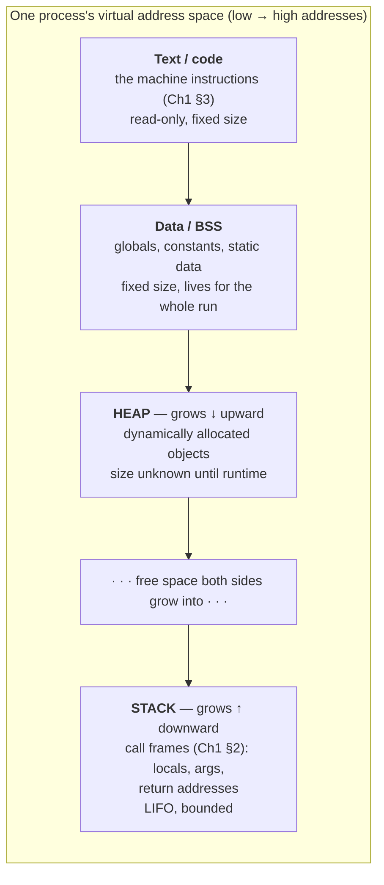
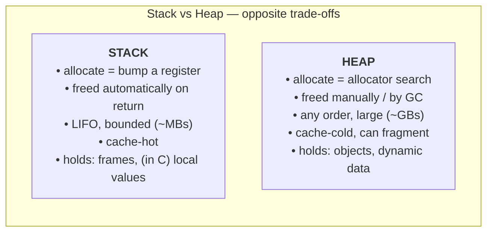
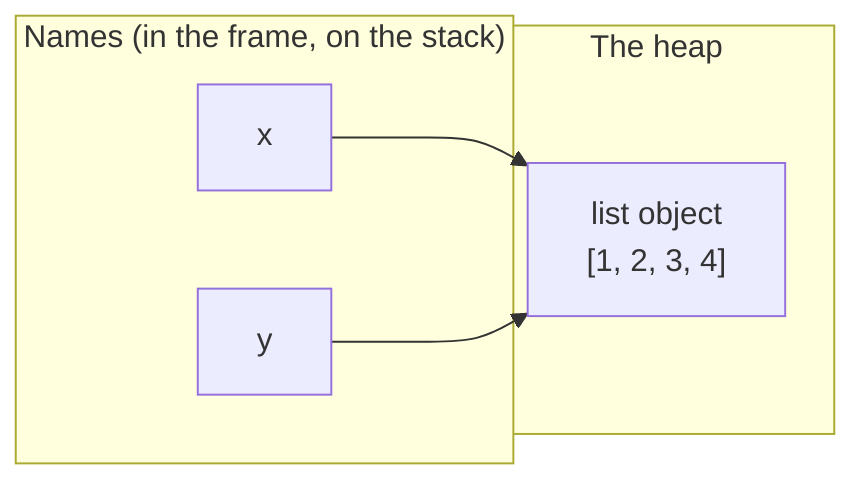
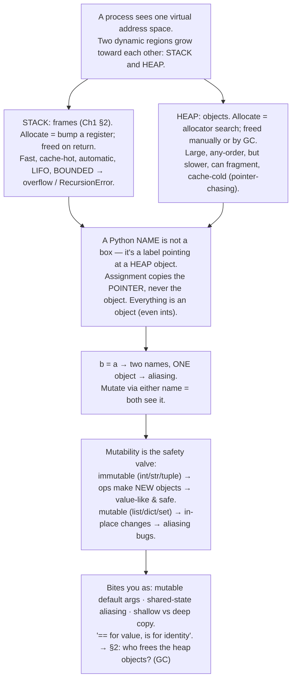

# M01 · Ch2 · §1 — The Address Space: Stack, Heap, and What a "Variable" Really Is

> **Module:** How Computers & Operating Systems Work
> **Chapter:** Memory
> **Section:** The process address space — stack vs heap, and the truth about Python names, values, and references
> **Status:** ✅ finalized 2026-06-12 — the body held up; the session ran almost entirely into a **software-design**
> thread the §6 aliasing material opened, which you drove from a linear pipeline all the way to **graph (LangGraph-style)
> state design**. §10 captures it: the best-practice pipeline skeleton (10b), the fixed-schema "can a step add a
> key?" answer + frozen-is-shallow gotcha (10c), and the **two-part state for complex graphs** — stable `Core` +
> open-but-typed `Artifacts` ("open values, closed shapes") with a full graph skeleton (10d). One example bug you
> caught (the small-int cache) is fixed in §5/§9. `dataclass`/`Protocol` queued as a reading + added to M05 Ch2 scope.

**Estimated study time:** 2–3 hours including reflection.
**Prerequisites:** Ch1 §2 (the call stack; frames; `call`/`ret`) and Ch1 §3 (the memory hierarchy;
registers≪L1≪L2≪L3≪RAM; the line *"a Python list is a million pointers scattered across the heap; a numpy
array is one contiguous block"*). This section pays off the IOU in that line: **what *is* the heap, what *is*
the stack, and why is a Python name a pointer in the first place?**

---

## Why this section exists (for *you*)

In Ch1 you went *down* the stack: source → bytecode → silicon. This chapter goes *sideways* into the one
resource every layer fights over — **memory** — and §1 lays the map the rest of the chapter (garbage
collection in §2, "out of memory" in §3) is drawn on.

Here's the thing worth being honest about: you write Python all day and it has *no visible memory model*.
There are no pointers, no `malloc`, no `free`, no `&x`. That convenience is exactly why a class of your bugs
is invisible to you until it bites — **aliasing, mutable shared state, the mutable-default-argument trap, "I
copied the dict but it still changed."** Every one of those is a memory-model fact wearing a disguise. By the
end of this section those bugs stop being spooky and become *predictable*, because you'll be able to draw
what's actually in memory.

A physics framing to carry, since it's served you before: think of the difference between an **intensive**
and an **extensive** description. C makes you track the extensive thing — the actual bytes, where they live,
who owns them, when they're freed. Python hands you an *effective theory*: "names refer to objects." That
effective theory is correct and usually sufficient — but like any effective theory it has a **domain of
validity**, and the bugs above are exactly the boundary where the abstraction leaks and you have to drop down
to the real picture. This section gives you both layers and the map between them.

By the end, these collapse into one model:

- Why `a = b` for two lists means *mutating `a` also mutates `b`* — but for two ints it doesn't.
- Why `def f(x, cache={}):` is one of the most famous footguns in Python, and why it's not a bug in Python at
  all once you see the memory.
- What a **stack overflow** physically is (you met it in §2 as deep recursion — now see the wall it hits).
- Why "passing a big object to a function is expensive in C but free in Python" — and why that's the *same*
  fact as the aliasing bug, not a different one.
- The groundwork for §2: if nobody frees heap objects in Python, **who does, and how does it know when?**

---

## 1. The map: a process's address space

When the OS launches your program, it hands the process the illusion of a single, private, contiguous block
of memory addressed from `0` up to a huge number — its **virtual address space**. (It's an illusion the
kernel maintains; the *real* RAM underneath is shared, paged, and scattered — that's an M01 Ch4 / OS story.
For now, trust the illusion; it's what your program sees.)

That space is carved into regions, and the two that matter for *how you write code* sit at opposite ends and
grow *toward each other*:



The whole section is really about the **heap** and the **stack**. The other two regions (your compiled code,
your globals/constants) are fixed-size and boring in the best way — allocated once, sized at load time, gone
when the process dies. The action is in the two dynamic regions, and they have *opposite personalities*.

---

## 2. The stack — fast, automatic, and bounded

You already know the stack's *behavior* from Ch1 §2: every function call pushes a **frame** (its locals,
arguments, and the return address); every return pops it; it's strictly **LIFO**. Now look at it as *memory*.

Allocating on the stack is almost free: there's a register, the **stack pointer**, that just points at the
current top. To "allocate" 200 bytes for a new frame, the CPU **subtracts 200 from the stack pointer** (it
grows downward) — one arithmetic instruction. To free the whole frame on return, it **adds 200 back**. No
search, no bookkeeping, no "find a free spot." That's why stack allocation is the fastest memory there is, and
why it's *automatic* — deallocation is not a decision anyone makes, it's a consequence of `ret`.

This buys three properties and one hard limit:

- **Speed** — bump a pointer; done. And because frames are reused constantly, the top of the stack is almost
  always hot in L1 cache (Ch1 §4) — a double win.
- **Automatic lifetime** — a local variable lives exactly as long as its frame. You cannot leak stack memory.
- **LIFO discipline** — you can only free the top. Which is the catch:
- **It's bounded.** The stack is a *fixed, smallish* region (commonly ~1–8 MB per thread). Nest function
  calls deep enough — or recurse without a base case — and the stack pointer runs off the end of the region
  into a guard page. That fault is **stack overflow**. In §2 you saw Python raise `RecursionError` *before*
  this happens — now you know what it's protecting you from: CPython caps the recursion depth (default ~1000)
  precisely so your Python frames never march the *native* C stack into the wall and hard-crash the
  interpreter. The limit is a railing in front of a real cliff.

> **The deep "why" behind the limit:** every Python call is implemented by a C call inside the interpreter, so
> a Python frame sits on top of one or more *real* C stack frames. The native stack is the bounded region in
> the map above. `sys.setrecursionlimit()` moves the railing; it does not move the cliff — set it too high and
> you trade a clean `RecursionError` for a `SIGSEGV` segfault. (This is also *why* tail-call optimization, the
> §2 thread you pulled on, matters: TCO reuses one frame instead of stacking N, so it never approaches the
> wall. Python deliberately doesn't do it; Scheme/Erlang make it the point.)

**What goes on the stack?** Frames and their contents. In C, that includes the *actual values* of local
variables — an `int x = 5;` is literally five-ish bytes living *in the frame*. Hold that thought, because in
Python it is **not** true, and that difference is the whole back half of this section.

---

## 3. The heap — flexible, long-lived, and not free

The stack can only hold things whose size and lifetime match the LIFO call pattern. But most real data doesn't:
a list that grows, an object returned from a function and used by the caller, a cache that outlives the
function that filled it, anything whose size isn't known until runtime. All of that lives on the **heap**.

The heap is a large region managed by an **allocator** (`malloc`/`free` in C; in Python, a layered allocator
called *pymalloc* that you never call directly). When you ask for memory, the allocator must **find** a free
chunk of the right size, mark it used, and hand back its address. When you're done, that chunk must be
returned. Compared to the stack's "subtract from a register," this is genuinely expensive work:

- **Allocation costs a search.** The allocator tracks free chunks (free lists, size classes) and has to pick
  one. Orders of magnitude slower than a stack bump — though pooled allocators like pymalloc amortize it hard
  for the small objects Python makes constantly.
- **Lifetime is not automatic.** A heap object lives until *something explicitly frees it*. In C, you. In
  Python/Java/Go, the **garbage collector** (the whole subject of §2). Get it wrong and you get the two
  classic failure modes: free too early → **dangling pointer / use-after-free** (a security catastrophe, → M10);
  never free → **memory leak** (→ §3, "out of memory").
- **It fragments.** Allocate and free chunks of varying sizes long enough and the free space becomes Swiss
  cheese — enough *total* free memory, but no single *contiguous* hole big enough for your next request. The
  stack, freeing only from the top, never fragments.
- **It's cache-cold.** Heap objects are scattered by address, so walking them is the *pointer-chasing*
  cache-miss minefield from Ch1 §4. **This is the other half of "why numpy beats a Python list"**: the list's
  elements are heap objects all over the address space; numpy's are one contiguous heap block. Same fact you
  met in §3, now you can see the heap underneath it.



Keep this table in your head; everything else in the chapter hangs off it.

---

## 4. The pivot: what a "variable" actually is

Now the conceptual core — and where Python diverges hard from the C mental model, in a way that explains your
bugs. The question is deceptively simple: **when you write `x = something`, what is `x`?**

There are two completely different answers, and most languages pick one.

### Model A — "a variable is a box" (value semantics: C, C++, Rust, Go structs, primitives in Java/JS)

```c
int x = 5;     // x IS a box in the current stack frame; the bytes 00000005 live there
int y = x;     // COPY the bytes into y's box. Two independent boxes, both holding 5.
y = 9;         // change y's box. x is still 5. They were never connected.
```

Here a variable *is* storage — a named location, usually in the stack frame, that *contains the value*.
Assignment **copies the bytes**. `x` and `y` are independent from birth. If the value is big (a 1 KB struct),
the copy genuinely moves 1 KB. To *share* instead of copy, C makes you ask explicitly with a **pointer**
(`int *p = &x;` — "`p` holds the address of `x`'s box").

### Model B — "a variable is a name tag tied to an object" (reference semantics: Python, and JS/Java for objects)

This is the one to internalize, because it's Python's *entire* model and it's invisible from the syntax.

In Python, **a name is not a box. It's a label, a sticky note, that points at an object living on the heap.**
The object holds the value; the name just *refers* to it. This is the single most clarifying sentence in the
language (it's Ned Batchelder's framing — reference below):

> **Names refer to values; values do not live in names.** Assignment never copies a value — it points a name
> at an object. `x = y` makes `x` and `y` two name tags on the *same* object.

```python
x = [1, 2, 3]    # create a list OBJECT on the heap; stick the name tag "x" on it
y = x            # do NOT copy the list. Stick a SECOND name tag "y" on the SAME object.
y.append(4)      # mutate the one shared object...
print(x)         # [1, 2, 3, 4]   ← x "changed" because x and y were always the same object
```



Two name tags, **one object**. There was never a second list to be out of sync with. Nothing copied. This is
not a quirk — it is *exactly the same machinery* as C's pointers, with the pointer-ness hidden: a Python name
is a pointer to a heap object, and assignment copies *the pointer*, never the pointee. The reason §3 could say
"a Python list is a million pointers" is that **every** Python value is a heap object reached by reference —
even a list's *elements* are pointers to other objects.

> **"Everything is an object" — and the part that surprises people: this includes integers.** `n = 5` does not
> put `5` in a box named `n`. It creates (or reuses) an `int` object holding `5` on the heap and points `n` at
> it. You can verify it: `(5).bit_length()` works because `5` is a real object with methods. The reason
> integers *feel* like value semantics is the next section.

---

## 5. Why this is invisible most of the time — mutability

If Python copies nothing and everything is shared, why doesn't `a = b; a += 1` corrupt `b` the way the list
example did? Because of one extra fact:

> **Rebinding a name ≠ mutating an object.** `x = ...` (assignment) re-points the name tag. `x.foo()` /
> `x[0] = ...` / `x += ...` *on a mutable object* changes the object in place.

And critically: **some objects can't be mutated at all.** `int`, `float`, `str`, `bytes`, `tuple`, `frozenset`
are **immutable** — there is no operation that changes them in place. So:

```python
a = 5
b = a        # b and a point at the same int object 5
a = a + 1    # 5 is immutable → this creates a NEW int object 6 and points a at it.
             # b's name tag never moved. b is still 5.
print(a, b)  # 6 5
```

There was no corruption because there was no mutation — `a + 1` couldn't change the `5` object even if it
wanted to, so it had to make a new one and rebind. **Immutable types give you value-like *behavior* on top of
reference *mechanics*.** That's why ints, strings, and tuples feel safe to pass around and lists/dicts/sets
feel dangerous: same memory model, opposite mutability.

This is the rule that resolves every "did it copy or share?" question:

| You did… | On a **mutable** object (list, dict, set, your custom class) | On an **immutable** object (int, str, tuple) |
|---|---|---|
| `b = a` | both names → same object; mutating via either is seen by both (**aliasing**) | both names → same object, but neither can mutate it, so it's harmless |
| `a = a + x` | new object made, `a` rebound, `b` unaffected | new object made, `a` rebound, `b` unaffected |
| `a += x` | **mutates in place** (`list.__iadd__`), `b` sees it | rebinds to a new object, `b` unaffected |

That last row is a genuine trap: `+=` does *different things* depending on mutability (`a += [1]` mutates a
list; `a += 1` rebinds an int). Same operator, two memory behaviors, decided by the type.

### `is` vs `==`, and the integer-cache gotcha

Two operators that look similar and ask different questions:

- `==` asks **"do these objects have equal value?"** (calls `__eq__`).
- `is` asks **"are these two names pointing at the literally same object?"** (same heap address — it's
  comparing `id(a) == id(b)`, and `id()` in CPython *is* the memory address).

You'll see `is` used correctly only for singletons: `x is None`, `x is True`. Misusing it for values exposes an
implementation detail that bites everyone once. Type these as **separate lines in the REPL** (this matters —
see the trap below):

```pycon
>>> a = 256
>>> b = 256
>>> a is b
True
>>> a = 257
>>> b = 257
>>> a is b
False        # (!) in CPython
```

CPython **pre-creates and caches the small ints −5..256** as shared singletons (a speed optimization — these
are constantly used). So `256` is always the *same* object; `257` gets freshly made each time. Nothing about
this is in the language spec — it's a CPython detail leaking through `is`.

> **The trap that makes this hard to demo (and worth understanding):** put it all on *one line* —
> `a = 257; b = 257; a is b` — and you get **`True`**, not `False`. That's a *second, different* sharing
> mechanism: a single line is compiled to one **code object**, and the compiler stores the literal `257` once
> in that object's constants table, so both `a` and `b` load the *same* constant. Separate REPL lines are
> separate compilations, so each makes its own `257`. So there are **two** ways Python ends up sharing an
> object behind your back — the *runtime* small-int cache (−5..256, always) and *compile-time* constant
> dedup (literals within one code object). Both are CPython implementation details; neither is something to
> rely on. (`257 is 257` won't even compile cleanly anymore — Python 3.8+ raises a `SyntaxWarning` for `is`
> against a literal, precisely because the answer is an implementation artifact.)

Lesson: **compare values with `==`; reserve `is` for identity/singletons** (`None`, `True`, sentinel objects).
And now you know `id()`, `is`, and both sharing mechanisms come from the same fact: names are pointers to
objects, and sometimes — at runtime *or* at compile time — the runtime hands two names the same object.

---

## 6. Where this actually bites *you*

This isn't trivia — it's a recurring shape of bug in exactly the kind of code you write (pipelines passing
`dict`s of state and config between steps). Three canonical ones:

**1. The mutable default argument — the famous one.**

```python
def add_event(event, log=[]):     # ← the default [] is created ONCE, at def time
    log.append(event)
    return log

add_event("a")     # ['a']
add_event("b")     # ['a', 'b']   ← surprise: the SAME list persists across calls
```

The default value object is created **once, when the `def` runs**, and lives on the heap for the life of the
function — every call that doesn't pass `log` reuses that one object. This isn't a Python bug; it's the
reference model being perfectly consistent (the default is just another name tag on one heap object). The fix
is the idiom you've seen without knowing why: `def add_event(event, log=None): log = log or []` — make a fresh
object *inside* the call. Worth grepping your pipelines for `=[]`, `={}`, `=set()` in signatures.

**2. Aliased shared state across pipeline steps.** If step A builds a `config` dict and passes it to steps B
and C, and B does `config["mode"] = "fast"`, **C sees it too** — they hold name tags on one object. Sometimes
that's the intent; often it's a spooky-action-at-a-distance bug where one step quietly reaches back and
changes another's input. This is the *same mechanism* as the environment-leakage case you described in M04 Ch1
(state managed at the wrong level, mutated where it shouldn't be) — now you can name the memory under it.

**3. "I copied it but it still changed" — shallow vs deep copy.** `b = a.copy()` (or `dict(a)`, `list(a)`,
`a[:]`) makes a **shallow** copy: a new outer object, but its elements are *the same nested objects* — new box,
same name tags inside. So `b = a.copy(); b["user"]["name"] = "x"` still mutates `a`'s nested dict. To break
*all* sharing you need `copy.deepcopy(a)`, which recursively rebuilds the whole object graph (and costs
accordingly). The decision "shallow or deep?" is just "how far down do I want to stop sharing?" — a question
that only makes sense once you see the object graph.

> **The unifying reframe:** "passing a huge object to a function is free in Python" (you pass one pointer, not
> a copy) and "mutating an argument leaks out to the caller" are **the same fact** stated as a feature and as a
> bug. C makes you choose copy-vs-share at every call (value vs pointer); Python always shares and lets
> *immutability* be your only built-in protection. That's the trade-off — and the reason `@dataclass(frozen=True)`,
> tuples-over-lists, and "don't mutate your inputs" are recommended discipline, not pedantry.

---

## 7. The one-page mental model



**Seven things to remember:**
1. A process has a **stack** (frames; fast; automatic; bounded) and a **heap** (objects; flexible; freed by GC;
   slower, fragments, cache-cold) growing toward each other.
2. **Stack allocation = bump the stack pointer; free = return.** Overflow it (deep/infinite recursion) and you
   hit a real wall — `RecursionError` is CPython's railing in front of it.
3. **Heap allocation costs a search and must be freed by someone.** That "someone" in Python is the GC (§2).
4. A **Python name is a pointer to a heap object**, not a box of bytes. Assignment copies the pointer.
   **Everything is an object**, integers included.
5. `b = a` makes **two names for one object** → **aliasing**. Mutate through either, both see it.
6. **Mutability is the only built-in protection.** Immutable types (int/str/tuple) behave value-like because
   operations can't change them in place and so produce new objects; mutable types don't.
7. The disguised bugs — **mutable default args, shared-state aliasing, shallow vs deep copy, `is` vs `==`** —
   are all this one model showing through.

---

## 8. Check your understanding

Jot a one-line answer to each before our Q&A — we'll dig into whichever are fuzzy.

1. In terms of the address-space map, what *physically* happens when a function is called and when it returns,
   and why can't you leak stack memory but you can leak heap memory?
2. `a = [1, 2]; b = a; b.append(3)`. What does `a` print, and *why*, in terms of names and objects? Now change
   line 1 to `a = (1, 2)` (a tuple) and `b.append` to `b = b + (3,)` — what does `a` print now, and what's the
   one-word difference?
3. Why is `def f(items=[]):` a bug-in-waiting? Where and when does that `[]` get created, and what's the
   standard fix?
4. You're told `numpy` beats a Python list partly because of "memory layout." Connect that to *this* section's
   heap picture (not just Ch1 §4's cache line) — what's different about *where the actual numbers live* in the
   two cases?
5. Typed as **separate REPL lines**, `a = 256; b = 256` gives `a is b → True` but `257` gives `False`. Explain
   both — and the twist: why does putting `a = 257; b = 257; a is b` on *one line* flip it back to `True`?
   What does all this reveal about `is`, and what should you use instead for comparing values?
6. (Stretch) C makes you choose value-vs-pointer at every assignment; Python always shares and gives you
   immutability instead. Name one concrete safety win and one concrete footgun that this trade buys you.

---

## 9. Optional: get your hands dirty (15 min)

Python can *show* you everything in this section.

```python
# (a) Names are pointers: id() is the heap address in CPython. Watch aliasing directly.
a = [1, 2, 3]
b = a
print(id(a), id(b), a is b)     # same address, same object
b.append(4)
print(a)                        # [1, 2, 3, 4] — one object, two names

# (b) Mutable vs immutable: same code shape, opposite outcome.
x = [1]; y = x; y += [2]; print("list:", x)   # [1, 2]  (in-place mutation, x sees it)
m = 1;   n = m; n += 2;    print("int :", m)   # 1       (rebind, m unaffected)

# (c) The famous footgun — run it and watch the default persist.
def add(event, log=[]):
    log.append(event); return log
print(add("a"), add("b"))       # ['a'] ['a', 'b']  — same list reused

# (d) The small-int cache leaking through `is`. NOTE: we force fresh objects with int(str)
#     to defeat compile-time constant dedup — otherwise the literals get shared and BOTH say True.
a = 257; b = int("257"); print("257 (not cached):", a is b)   # False — fresh object each time
c = 256; d = int("256"); print("256 (cached)    :", c is d)   # True  — shared small-int singleton

# (e) Shallow vs deep copy.
import copy
orig = {"user": {"name": "z"}}
shallow = orig.copy();           shallow["user"]["name"] = "X"; print("shallow leaked:", orig)
orig = {"user": {"name": "z"}}
deep = copy.deepcopy(orig);      deep["user"]["name"]    = "X"; print("deep isolated:", orig)

# (f) See the stack wall from §2, now that you know what it is.
import sys; print("recursion limit (the railing):", sys.getrecursionlimit())
def boom(n=0):
    return boom(n + 1)
# boom()   # uncomment → RecursionError, NOT a segfault, because of the limit. Try lowering it first.

# (g) How big is an object, really? (heap bookkeeping is visible)
print(sys.getsizeof(0), sys.getsizeof([]), sys.getsizeof([1, 2, 3]))
```

**Best single tool for this section:** paste any of the above into **[pythontutor.com](https://pythontutor.com/)**
and step through it — it *draws the names-and-objects diagram live*, frame by frame, exactly like the Mermaid
sketches above. For the aliasing and copy examples it's worth more than any explanation. Bring anything
surprising to our chat — especially whatever (b), (c), or (e) does that you didn't predict.

---

## 10. Applied — captured from our session Q&A

You knew the memory model; the session ran one layer *out* of it — first a clean stack question, then a long,
sharp **software-design** thread that the §6 aliasing material opened up. Distilled here so you can re-derive it.

### 10a. Do stack frames have the same size? (ties to §2, Ch1 §2)

**No — frame size varies by function.** Each frame is sized to *that* function's needs (its locals, the args it
passes on, saved registers, alignment padding), so `main`'s frame and a tiny `square(x)`'s frame differ.

- **C / native:** the size is normally **fixed per function, computed at compile time** — the prologue does
  `sub $N, %rsp` where `N` is that function's baked-in frame size; the epilogue adds it back (the §2
  save/restore, now with a number on it). The exception is **C99 variable-length arrays / `alloca()`**, where
  `N` is computed at runtime — and an attacker-controlled size can march `%rsp` off the end into the stack-overflow
  cliff, which is why many codebases ban them.
- **CPython:** a Python frame is itself a **heap object** (`PyFrameObject`); its size is quantized by the
  compiler's per-code-object `co_stacksize` + `co_nlocals` (more locals/deeper expressions → bigger frame). The
  callback to §4: those local slots hold **pointers to heap objects, not the values** — so a `list` local is one
  pointer whether the list has 3 or 3 million elements. That's *why* passing a huge object into a function costs
  nothing on the stack.

### 10b. Managing state in a pipeline — the design thread you drove (→ M04 decomposition)

This grew straight out of §6: if mutating a shared argument leaks across pipeline steps, what's the *right*
structure? You proposed two refinements and we pressure-tested each — the keeper principles:

1. **Your first instinct — make the pipeline a class, state on `self`, steps mutate via methods.** The catch:
   moving mutable state onto `self` makes the mutation **more implicit, not less** — `def step(self)` advertises
   nothing about what it reads or writes, and the step *ordering* becomes an invisible contract (**temporal
   coupling**). A class whose methods all read/write a shared mutable `self` is *globals with a smaller scope*.
   It's also a prime way a file grows into a 2,400-line monolith — your own documented gap, so worth naming.
2. **Your second refinement — a `PipeState` class with `read_state()` / `update_state(data)`.** Cleaner in two
   real ways (separated concern; one mutation choke-point), **but** `update_state(data)` that accepts arbitrary
   data is a **wide interface wearing a trench coat** — it guards no invariant, so it's a *shallow module*
   (Ousterhout, your 06-11 reading): indirection without hiding complexity. And `read_state()` returning the
   *live* object reopens the §1 aliasing hole unless it returns a copy/immutable view. The dataflow is still
   hidden; the disease is unchanged.
3. **The axis that actually matters is not `arg` vs `self` — it's explicit-and-returned vs
   implicit-and-mutated.** The principle we landed on: **flow immutable state through explicit signatures
   (`state -> new state`); inject set-once dependencies via `self`; never mutate in place.** A class earns
   mutable `self` only when it protects a **real invariant** behind a **semantic** interface (e.g.
   `TurnState.advance_to(phase)` rejecting illegal transitions) — *then* it's a deep module worth the layer.

#### The best-practice skeleton (the artifact you asked to keep)

> **Note:** this uses `@dataclass` and `typing.Protocol`, which you flagged as unfamiliar — both are
> **queued as a reading** and folded into **M05 Ch2** scope. Short version for now: `@dataclass` auto-generates
> `__init__`/`__repr__`/`__eq__` from typed field declarations (so the class below is just "a typed record");
> `frozen=True` makes instances **immutable** (assigning a field raises) — which is what kills the §1 aliasing
> bugs; `dataclasses.replace(obj, field=...)` returns a **new** instance with one field changed; `Protocol` is a
> structural type — "anything with this call signature counts as a `Step`," checked by the type checker.

```python
from dataclasses import dataclass, replace
from typing import Protocol
import logging

log = logging.getLogger(__name__)


# 1. FLOWING STATE — immutable. Each step returns a NEW state; nothing mutates in place.
#    frozen=True kills the §6 aliasing bugs; slots=True saves memory + catches typo'd attributes.
@dataclass(frozen=True, slots=True)
class State:
    raw_input: str
    cleaned: str | None = None
    result: dict | None = None
    # ... fields accumulate as steps fill them in


# 2. DEPENDENCIES — injected once, read-only for the whole run (dependency injection).
#    Clients, config, model handles live here — NOT on the flowing state.
@dataclass(frozen=True, slots=True)
class Deps:
    llm_client: object        # your provider client
    config: dict              # settings, thresholds, model names
    # ...


# 3. THE STEP CONTRACT — every step has the SAME shape, so the runner can wrap them
#    uniformly and the type checker enforces "state in, state out".
class Step(Protocol):
    __name__: str
    def __call__(self, state: State, deps: Deps) -> State: ...


# 4. STEPS — plain functions. Pure-ish: read what you need at the top (makes the real
#    dependency visible), return replace() with only what you PRODUCE.
#    Trivially unit-testable: call step(some_state, fake_deps), assert on the output.
def clean_input(state: State, deps: Deps) -> State:
    cleaned = state.raw_input.strip()        # ... real logic
    return replace(state, cleaned=cleaned)

def call_model(state: State, deps: Deps) -> State:
    assert state.cleaned is not None         # precondition: clean_input ran first
    result = ...                             # deps.llm_client.generate(state.cleaned)
    return replace(state, result=result)


# 5. THE RUNNER — the ONE place for cross-cutting concerns. Add timing, tracing,
#    retries, structured logging here and EVERY step gets it for free.
def run(steps: list[Step], state: State, deps: Deps) -> State:
    for step in steps:
        try:
            state = step(state, deps)        # ← reassigned, never mutated
            log.info("step.ok", extra={"step": step.__name__})
        except Exception:
            log.exception("step.failed", extra={"step": step.__name__})
            raise                            # add context; let it propagate (or return a Result)
    return state


# 6. ASSEMBLY — this list IS the readable, top-to-bottom trace of the pipeline.
PIPELINE: list[Step] = [
    clean_input,
    call_model,
    # parse_result, validate, ...
]

def main(raw: str, deps: Deps) -> State:
    return run(PIPELINE, State(raw_input=raw), deps)
```

**Why this shape (the review notes):**

- **Frozen `State`, returned not mutated** → the §1/§6 aliasing & mutable-default bugs become *impossible*, not
  merely discouraged. `replace()` is a cheap shallow copy; only changed fields differ.
- **`Deps` separate from `State`** → the *legit* use of "state on an object": config/clients are set once and
  read-only during the run. Flowing data stays explicit. This is the clean version of your class instinct.
- **Uniform `(State, Deps) -> State` steps** → a runner can wrap *every* step with one tracing/retry/logging
  block — the cure for the observability gap, in one place, not per-step boilerplate.
- **`PIPELINE` as a list** → you read the sequence top-to-bottom and see the whole dataflow; reordering is a line
  move and the type checker still enforces the `Step` contract.
- **Steps are functions** → testable in isolation with a fake `Deps`; no object graph to construct.

**The one trade-off to remember:** uniform `State -> State` steps buy composability + the free cross-cutting
wrapper, but a step's signature doesn't advertise *which* fields it reads (mitigate by destructuring needed
fields at the top, like `call_model`). If the pipeline is a **small fixed graph** rather than a long linear
chain, prefer **explicit wiring** (`cleaned = clean_input(raw, deps); result = call_model(cleaned, deps)`) —
heterogeneous signatures give maximum per-step contract clarity at the cost of the uniform runner. **Linear +
want uniform tracing/retry → list-of-steps. Small fixed graph + want maximum contract clarity → explicit
wiring.** Both beat mutating a shared `self`.

### 10c. Can a step add a *new* key to the state? (the schema question)

You asked this directly. **No — and that's the feature.** With `frozen=True, slots=True` there's no instance
`__dict__`, so an *undeclared* attribute can't be attached at all (even the lowest-level `object.__setattr__`
raises `AttributeError`; verified). The set of fields is fixed at class-definition time — which is the point:
`State` is a single typed contract, so you read the class and see *every* value that can ever flow through the
pipeline (vs a dict, where any step can write any key and you can't know the shape without reading all of them).

- **Right way to "add" data:** declare the field up front (`embeddings: list[float] | None = None`) and
  `replace()` it when a step produces it. "I want a field that isn't there" is a signal to *add it to the
  contract*, not to smuggle it in — a deliberate friction that keeps the state honest.
- **Escape hatch + the §1 gotcha:** if you add `extra: dict[str, Any] = field(default_factory=dict)`, remember
  **`frozen` is shallow** — it blocks *rebinding the attribute*, not *mutating the object it points at*. So
  `state.extra["k"] = v` silently works and reopens the §6 aliasing bug. Update it functionally instead:
  `replace(state, extra={**state.extra, "k": v})`. (`frozen` protects the names on the object, not the objects
  those names point to — the §4 "two name tags, one object" fact again.)
- If state is *fundamentally* open-ended (keys unknowable until runtime), a frozen dataclass is the wrong tool —
  reach for a dict or a Pydantic model with `extra="allow"` and accept losing the static contract.

### 10d. Scaling to a complex graph (LangGraph-style): the two-part state

You then pushed to the real target — a **graph** pipeline (branches + loops, à la LangGraph), where you argued
state needs two parts: **(1) stable data with a definite schema** (= `Core` above), and **(2) artifacts with
dynamic structure** — a loop step stashing things for later, shapes that evolve as features change, so a fixed
schema would keep breaking. Correct, and the resolving principle:

> **Open set of values, closed set of shapes — fix the *grammar*, not the *vocabulary*.** Don't pre-declare
> *which* artifacts exist (the vocabulary grows with features); *do* make each artifact a **typed record with
> provenance**, and give the container a **fixed, disciplined interface**. A new feature = a new `Artifact`
> subtype *beside its node* → purely additive, no central-schema edit, nothing breaks. A raw `dict[str, Any]`
> gives open membership but zero shape discipline — the god-object again.

Structurally this is LangGraph's **channels + reducers** (nodes return partial updates; a per-channel reducer
merges them; loops use an *append* reducer) — but here every artifact is a typed object carrying provenance,
which a loose `TypedDict` doesn't give you. The skeleton (verified — `frozen+slots` inheritance and loop
accumulation both run):

```python
from __future__ import annotations
from dataclasses import dataclass, field, replace
from typing import Protocol, Callable, Mapping
import logging

log = logging.getLogger(__name__)

# PART 1 — the stable CORE. Definite schema; the data you'd put in a DB row.
@dataclass(frozen=True, slots=True)
class Core:
    raw_input: str
    cleaned: str | None = None
    result: dict | None = None      # add fields here ONLY for stable, first-class data

# PART 2 — ARTIFACTS. Open set of values, closed set of shapes.
# A new feature = a new Artifact subtype next to its node. No central edit.
@dataclass(frozen=True, slots=True)
class Artifact:
    node: str                       # who produced it  → traceability
    iteration: int = 0              # loop pass (0 if not in a loop)

@dataclass(frozen=True, slots=True)
class RetrievedDocs(Artifact):
    docs: tuple[str, ...] = ()

@dataclass(frozen=True, slots=True)
class CritiqueNote(Artifact):
    score: float = 0.0
    note: str = ""

@dataclass(frozen=True, slots=True)
class Artifacts:
    """Immutable, namespaced, APPEND-ONLY store. Open membership, fixed interface.
    Append = a baked-in 'reducer' → loops accumulate. Functional updates only, so the
    §1 'frozen is shallow' trap can't bite (tuples are immutable; we rebuild the dict)."""
    _store: Mapping[str, tuple[Artifact, ...]] = field(default_factory=dict)
    def add(self, key: str, art: Artifact) -> Artifacts:
        prev = self._store.get(key, ())
        return Artifacts({**self._store, key: prev + (art,)})    # returns a NEW store
    def latest(self, key: str) -> Artifact | None:
        seq = self._store.get(key, ()); return seq[-1] if seq else None
    def all(self, key: str) -> tuple[Artifact, ...]:
        return self._store.get(key, ())

# THE STATE — two parts, two kinds of contract.
@dataclass(frozen=True, slots=True)
class State:
    core: Core
    artifacts: Artifacts = field(default_factory=Artifacts)

@dataclass(frozen=True, slots=True)
class Deps:                         # set-once dependencies (DI), read-only during the run
    llm_client: object
    config: dict

# THE GRAPH — nodes transform state; routers pick the next node (→ branches & loops).
END = "__end__"

class Node(Protocol):
    __name__: str
    def __call__(self, state: State, deps: Deps) -> State: ...

Router = Callable[[State], str]     # given state, return the next node's name (or END)

@dataclass(frozen=True, slots=True)
class Graph:
    nodes: Mapping[str, Node]
    edges: Mapping[str, Router]
    entry: str

def run(graph: Graph, state: State, deps: Deps, *, max_steps: int = 100) -> State:
    """max_steps is the loop GUARD — the graph cousin of the recursion limit (§2):
    a cyclic graph needs a termination railing just like recursion needs a base case."""
    current = graph.entry
    for step_no in range(max_steps):
        if current == END:
            return state
        try:
            state = graph.nodes[current](state, deps)        # ← reassigned, never mutated
            log.info("node.ok", extra={"node": current, "step": step_no})
        except Exception:
            log.exception("node.failed", extra={"node": current, "step": step_no})
            raise
        current = graph.edges[current](state)                # branch / loop / END
    raise RuntimeError(f"graph exceeded {max_steps} steps — non-terminating loop?")

# NODES & ROUTERS — a retrieve→critique loop that ACCUMULATES artifacts.
def retrieve(state: State, deps: Deps) -> State:
    it = len(state.artifacts.all("docs"))                    # iteration = passes so far
    docs = RetrievedDocs(node="retrieve", iteration=it, docs=(...,))
    return replace(state, artifacts=state.artifacts.add("docs", docs))

def critique(state: State, deps: Deps) -> State:
    latest_docs = state.artifacts.latest("docs")
    note = CritiqueNote(node="critique", score=..., note="...")
    return replace(state, artifacts=state.artifacts.add("critique", note))

def route_after_critique(state: State) -> str:
    last = state.artifacts.latest("critique")
    rounds = len(state.artifacts.all("critique"))
    if isinstance(last, CritiqueNote) and last.score < 0.7 and rounds < 3:
        return "retrieve"            # loop back — refine
    return END                       # good enough, or hit the round cap

GRAPH = Graph(
    nodes={"retrieve": retrieve, "critique": critique},
    edges={"retrieve": lambda s: "critique",                 # static edge
           "critique": route_after_critique},                # conditional edge (loop or end)
    entry="retrieve",
)

def main(raw: str, deps: Deps) -> State:
    return run(GRAPH, State(core=Core(raw_input=raw)), deps)
```

**Why this answers the two worries:**
- **"Feature change may break the schema"** — it can't, for artifacts. A new feature defines a new `Artifact`
  subclass beside its node and calls `artifacts.add(...)`; you never touch `Core` or `Artifacts`. Only promoting
  something *into* `Core` is a real schema change — and that should be deliberate.
- **"A loop step keeps artifacts for future use"** — the store is **append-only and provenance-stamped**, so
  pass *N* can read everything passes *0..N−1* produced (`artifacts.all("docs")`) and tell which pass made each
  (`.iteration`, `.node`). Accumulation that stays immutable.

**The discipline (all enforced by the types, not just advised):**
1. **Open membership, never open *shape*** — `add` takes an `Artifact`, not `Any`; the collection grows, the
   per-item type never degrades to soup. (Cost: `latest()`/`all()` return the base type, so consumers narrow
   with `isinstance` — cheap, and the checker helps.)
2. **Functional updates only** — `add` returns a *new* `Artifacts`; inner tuples are immutable → the §10c
   "frozen is shallow" trap has no mutable dict to poke.
3. **Loops need a guard** — `max_steps` is the direct analog of the recursion limit (§2): a cyclic graph with no
   termination spins forever the way unbounded recursion overflows the stack. Same failure shape, same railing.
4. **Provenance is mandatory** (`node`, `iteration`) → restores the traceability that mutating a shared dict
   destroyed: who wrote what, in which pass, reconstructable from state alone.

**Upgrade paths:** if artifact kinds need *different* merge semantics (not always append — "keep max score",
"overwrite"), generalize `add` to take a per-key **reducer** `Callable[[tuple, Artifact], tuple]` — that's
exactly LangGraph's channel model, a small change here. For untrusted/LLM-produced artifacts, swap the artifact
dataclasses for **Pydantic** models — same shape, runtime validation on construction (an M05 / M13-reliability
lever). This whole design is **M14 Ch2 (frameworks vs framework-less) / M07** territory — your framework-less
graph-lite pipeline lives in exactly this space, and we'll come back to it there.

---

## References (optional, for depth)

*(All links verified live 2026-06-12.)*

- **[Ned Batchelder — "Facts and Myths about Python names and values"](https://nedbatchelder.com/text/names.html)**
  — the single best treatment of §4–§5, by the author of coverage.py. The "names are not boxes" framing this
  section is built on. There's a companion PyCon talk if you prefer video. Read this one.
- **[Python Tutor (pythontutor.com)](https://pythontutor.com/)** — visualizes the stack/heap and names→objects
  graph as your code runs, step by step. The hands-on companion to §4–§6; use it on the snippets above.
- **[Python Language Reference — §3 "Data model"](https://docs.python.org/3/reference/datamodel.html)** — the
  authoritative source for "every object has an identity, a type, and a value," mutability, and `id()`/`is`.
  Dense but definitive; skim §3.1.
- **[Computer Systems: A Programmer's Perspective (Bryant & O'Hallaron)](https://csapp.cs.cmu.edu/)** — for the
  C-side, extensive picture of §1–§3 (the address space, stack frames, dynamic allocation, fragmentation). The
  chapters on virtual memory and dynamic memory allocation are the deep version of this section; pairs with the
  OS-internals story coming in M01 Ch4.
- **[Python docs — `dataclasses`](https://docs.python.org/3/library/dataclasses.html)** (§10b skeleton) — the
  reference for `@dataclass`, `frozen=True` (immutability), `slots=True`, and `replace()`. Skim now; the
  proper treatment is queued as a reading and folded into M05 Ch2.

---

### What's next
✅ **Finalized 2026-06-12.** Marked done in `courses/plan.md`; §10 captures the stack-frame-size answer and the
pipeline-design thread + skeleton. **`dataclass`/`Protocol` queued as a reading and added to M05 Ch2 scope** per
your flag. This section laid the **map** (stack vs heap) and the **pivot** (names are pointers to heap objects).
The two open IOUs it leaves are the rest of Chapter 2:
- **§2 — Garbage collection:** if heap objects must be freed by *someone* and Python never makes you do it, who
  does? CPython's **reference counting** (every object carries a count of name tags pointing at it; hits zero →
  freed instantly) **plus a cycle collector** for the case ref-counting can't handle (`a` and `b` referring to
  each other). This is also where the GIL from Ch1 re-enters — ref-count updates are why touching objects isn't
  thread-safe without it.
- **§3 — "Out of memory" for real:** what actually happens when the heap can't grow, the difference between a
  *leak* and *legitimately too much*, the OOM killer, and why a 16 GB model won't load on a 12 GB GPU.

Per the Phase-1 interleave, the parallel threads remain **M04 Ch1 §2 (tracing data flow)** on the SWE side and
**M12 Ch2 §2 (video — DiT/Sora)** on the AI side — say the word if you'd rather advance one of those next
instead of continuing M01 Ch2.
