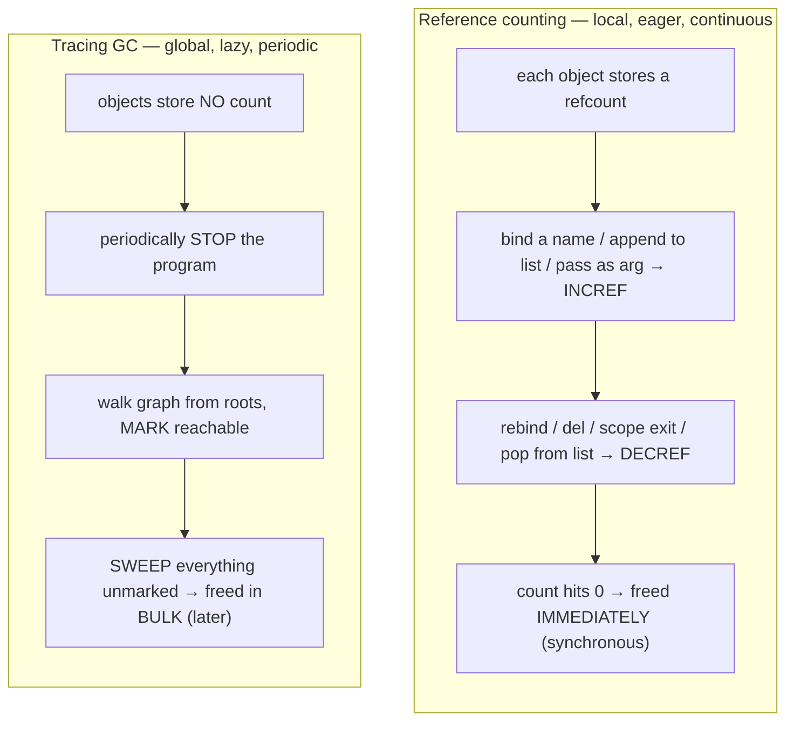
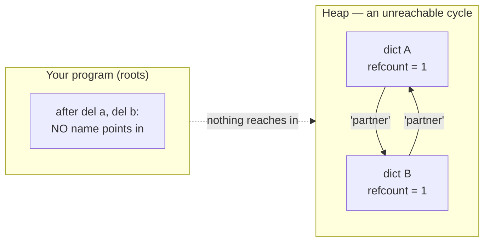
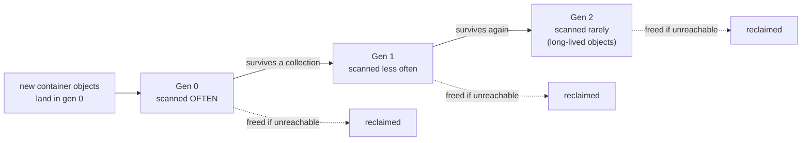
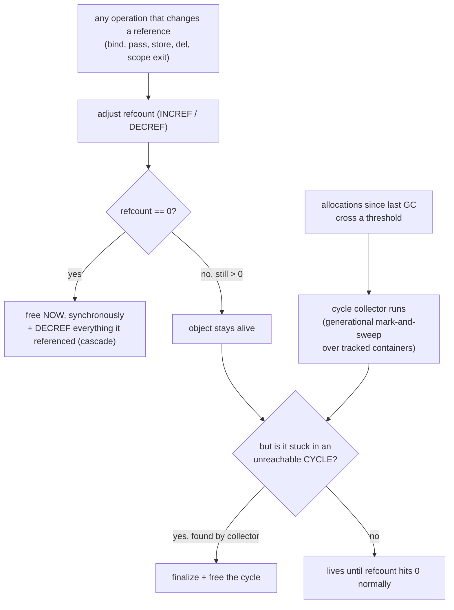
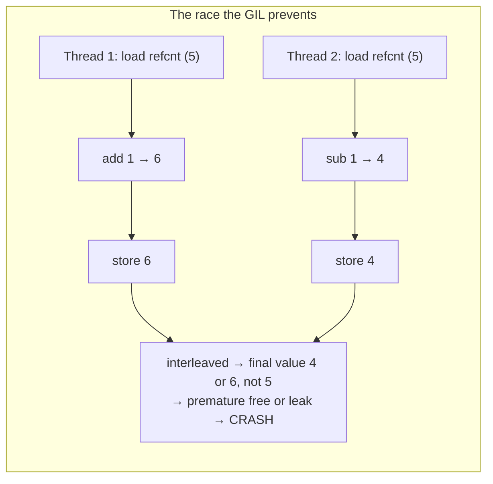

# M01 · Ch2 · §2 — Garbage Collection: Who Frees the Heap, and How It Knows When

> **Module:** How Computers & Operating Systems Work
> **Chapter:** Memory
> **Section:** Automatic memory management — CPython's reference counting, the cycle collector it needs, and why
> all of it is the deep reason the GIL exists.
> **Status:** ✅ **finalized 2026-06-13.** The body held up; the session was you pressure-testing the §7.2 rule
> ("use `with`, never the GC") against concrete code and a real fab-era image-processing leak — your signature mode,
> now aimed at the GC. §10 captures the two threads: **(10a)** resource-lifetime-vs-object-lifetime — `with` vs
> manual `close()` vs GC *from the GC's point of view* (answer: no GC difference; closing ≠ freeing); and **(10b)**
> the war story — why your `gc.collect()` fix was *also a diagnosis* (the leak must be cyclic), the count-vs-bytes
> threshold blindness that explains the "~10 images" crash, and **process isolation** as the robust "outlive the leak
> instead of cleaning it up" alternative.

**Estimated study time:** 2–3 hours including reflection.
**Prerequisites:** §1 of this chapter (stack vs heap; **a Python name is a pointer to a heap object**; assignment
copies the pointer; mutability; aliasing) and Ch1 §2 (the GIL kicker — "one thread, one instruction stream").
This section pays off the explicit IOU §1 left: *if heap objects must be freed by someone, and Python never makes
you call `free`, then **who frees them, and how does it know when?***

---

## Why this section exists (for *you*)

§1 ended on a cliffhanger. You now know the heap is where every Python object lives, and that — unlike the stack,
which frees itself on `ret` — heap memory **lives until something explicitly frees it**. In C that "something" is
you (`free(p)`), and getting it wrong gives the two classic disasters: free too early → use-after-free; never free
→ leak. Python makes neither mistake *for you*. So there is a mechanism, running constantly, invisibly, that you've
relied on every day without seeing. This section makes it visible.

Here's why it's worth your time specifically — three things it will change:

1. **You'll know when memory is actually freed**, which is not "when I'm done with it" and not "at `del`." This is
   the difference between a pipeline that holds 8 GB of intermediate tensors longer than you think and one that
   doesn't. For someone shipping LLM data pipelines, *when the last reference drops* is a latency-and-cost question,
   not trivia.
2. **You'll see the one bug class GC can't save you from — reference cycles — and where your own code makes them.**
   Your graph-pipeline design from §10 is directly relevant here, and the answer is a satisfying callback.
3. **You'll finally see the bottom of the GIL.** You already understand *what* the GIL does (serializes threads).
   This section shows *why CPython has one at all* — and the answer is **reference counting**, not "Python is old."
   That connection is the keystone, and it's why free-threaded Python (PEP 703, your frontier-level material) is so
   hard and so interesting. This is the layer past where most explanations stop.

A framing to carry, since the physics one served §1: garbage collection is a **conservation law with a bookkeeping
problem.** The invariant the runtime must preserve is *"memory reachable from your program stays alive; memory
unreachable from your program gets reclaimed."* "Reachable" is the conserved quantity. The whole design question is
just: **how do you cheaply detect when reachability drops to zero?** CPython answers it two ways at once — a fast
local approximation (reference counting) and a slower global correction (the cycle collector) for the case the
approximation gets wrong. Effective theory plus the correction term at the boundary where it breaks down — the same
shape as §1.

---

## 1. Two families of answer: counting vs. tracing

Across all garbage-collected languages there are really only two strategies, and CPython is unusual in using
**both at once**. Get the two archetypes straight first; everything else is detail.

**Reference counting (CPython's primary mechanism).** Every object carries a small integer: *how many references
point at it right now.* Bind a new name to it → increment. Drop a name → decrement. The instant the count hits
**zero**, nobody can reach the object, so it is freed **immediately**, right there, synchronously. No separate
"collector" runs; reclamation is woven into every assignment and every scope exit.

**Tracing garbage collection (Java, Go, JavaScript/V8, C#, PyPy).** Objects carry no count. Periodically a
collector *stops* and walks the object graph outward from a set of **roots** (globals, the stack, registers) —
marking everything it can reach. Anything it didn't reach is, by definition, unreachable → swept and freed in bulk.
This is **mark-and-sweep**, and it runs *later*, in batches, not at the moment of last use.

<!-- DIAGRAM:START -->


<details>
<summary>Diagram source (Mermaid)</summary>



</details>
<!-- DIAGRAM:END -->

The trade-off is sharp and worth memorizing, because it explains a lot of Python's behavior:

| | **Reference counting** (CPython) | **Tracing GC** (Java/Go/V8/PyPy) |
|---|---|---|
| **When is memory freed?** | Immediately, at the last `DECREF` to 0 — **deterministic** | Eventually, at the next collection — **non-deterministic timing** |
| **Pause behavior** | No big stop-the-world pause; cost is *smeared* across every operation | Periodic pauses (modern collectors make them tiny/concurrent, but they exist) |
| **Steady-state overhead** | High & constant — *every* refcount touch is work, even on hot loops | Low per-operation; you "pay" in batched collections |
| **Reference cycles** | **Cannot reclaim them** — needs a helper | Handled for free (a cycle simply isn't reached from roots) |
| **Thread safety of the counter** | Counter is shared mutable state → **needs a lock (the GIL)** or atomics | No per-object counter to race on |

That last row is the whole back half of this section. But first, the immediate consequence of "freed at the last
DECREF to 0":

> **In CPython, destruction is deterministic.** When the last reference to an object goes away, it is freed *then* —
> not "sometime soon." This is why so much Python code quietly relies on it (a file gets flushed when the last
> reference to it drops, a connection closes, a temporary 4 GB array is gone the instant the function returns). It
> is also a **portability trap**: PyPy and Jython use pure tracing GC, so that same code leaks file handles until
> the next collection. *Never* rely on refcount timing for resource cleanup — that's what `with` is for (§6).

---

## 2. Reference counting, concretely — watch the count move

The mechanism is almost embarrassingly simple. In CPython every object's C struct starts with a field
`ob_refcnt`. Two macros mutate it: `Py_INCREF` (count++) and `Py_DECREF` (count--; if it hit 0, deallocate). That's
it. The art is knowing *which Python operations* trigger them.

```python
import sys

a = [10, 20, 30]          # new list object; one reference ("a") → refcount 1
b = a                     # §1: a SECOND name tag on the SAME object → INCREF → refcount 2
container = [a]           # the list now holds a third reference → INCREF → refcount 3

print(sys.getrefcount(a)) # prints 4, not 3  ← see the gotcha below

del b                     # remove the name "b" → DECREF → refcount 2
container.pop()           # remove it from the list → DECREF → refcount 1
del a                     # remove the last name → DECREF → refcount 0 → FREED right here
```

References are created by **far more than `=`**: passing an object to a function (the parameter is a new
reference), inserting it into a list/dict/set, making it an attribute (`self.x = obj`), capturing it in a closure.
Each of those is an `INCREF`; the matching teardown (function returns, item removed, attribute reassigned, closure
dies) is a `DECREF`. You never write them — the interpreter does, on every single one of these events. *That* is the
"smeared cost" from the table: a tight Python loop touching objects is also a tight loop of integer
increment/decrement on refcounts.

> **The `getrefcount` gotcha (you'll hit this the moment you test it):** `sys.getrefcount(x)` reports **one higher**
> than you expect, because *calling it* binds `x` to its parameter — a temporary extra reference that exists for the
> duration of the call. So a freshly-made object with one name reports `2`. It's not a bug; it's the reference model
> being perfectly consistent (a function argument is a reference, §1). Newer Python (3.12+) also marks some objects
> **immortal** — see §6 — for which `getrefcount` returns a huge constant and never changes.

**The cascade.** When an object is freed, the interpreter `DECREF`s everything *it* referenced — which may drop
*those* to zero, freeing them too, recursively. So `del big_pipeline_state` can tear down a whole tree of objects in
one synchronous burst. (CPython uses a "trashcan" mechanism to keep that cascade from overflowing the *C* stack on
very deep structures — a direct callback to §1's stack-overflow cliff.) This is the elegant part of refcounting:
reclamation is precise, immediate, and proportional to what actually died.

---

## 3. The flaw refcounting can't fix: reference cycles

Reference counting has one fatal blind spot, and it's a logical one, not an implementation bug. Consider two
objects that point at **each other**:

```python
a = {}
b = {}
a["partner"] = b      # b's refcount: 2 (the name "b" + a's entry)
b["partner"] = a      # a's refcount: 2 (the name "a" + b's entry)

del a                 # a's refcount: 2 → 1   (b still points to it!)
del b                 # b's refcount: 2 → 1   (a still points to it!)
```

After both `del`s, **you** cannot reach either dict — there's no name pointing in from your program. They are
garbage. But each one's refcount is stuck at **1**, because they hold each other up. Refcounting only sees *local*
counts; it cannot tell that the two surviving references form a closed loop that nothing outside can enter. Pure
refcounting would **leak this forever.**

<!-- DIAGRAM:START -->


<details>
<summary>Diagram source (Mermaid)</summary>



</details>
<!-- DIAGRAM:END -->

This is not exotic. Cycles appear all the time in ordinary structures:

- **Parent ↔ child back-references**: a tree node holding `self.children` *and* each child holding `self.parent`.
- **Doubly-linked lists**: every node points to `prev` and `next`.
- **Caches / observer registries** that hold objects which hold the cache back.
- **A closure that captures a variable referring to the closure**, or an object whose method is stored as its own
  attribute.
- **Exception tracebacks**: a caught exception's traceback holds the frame, the frame holds local variables, and a
  local variable may be the exception — a cycle that pins an entire stack frame's worth of objects. (This is why
  `except ... as e:` deletes `e` at the end of the block, and why holding onto exceptions can leak surprisingly
  large graphs.)

So CPython needs a second mechanism whose *only job* is to find and break unreachable cycles. That's the cycle
collector — the thing people actually mean when they say "Python's garbage collector" (the `gc` module).

---

## 4. The cycle collector: a generational tracing GC bolted on

The `gc` module is a **tracing collector**, but a specialized one: it doesn't manage all memory (refcounting already
does that). It runs only to **catch the cycles refcounting misses**, and it only tracks *container* objects — things
that can hold references to other objects (lists, dicts, sets, instances, tuples-containing-containers). Objects that
*can't* form cycles — a plain `int`, a `str`, a `float` — are never tracked, because they can't be part of the
problem. That's already a big optimization.

**How it finds an unreachable cycle without roots-walking the whole heap.** The clever trick: for the set of tracked
objects, the collector makes a scratch copy of each refcount and then, for every reference *between tracked objects*,
**decrements the copy.** After this pass, an object's scratch count tells you how many references it has from
*outside* the tracked set. If an object's scratch count is **> 0**, something external (a name on your stack, a
global) still reaches it → it's alive, and so is everything reachable from it. If it's **0**, its only references
were internal — a candidate for collection. Anything left over with no external anchor is an unreachable cycle, and
it gets finalized and freed. (This is a mark-and-sweep variant; the full algorithm is in the reference below.)

**Generational, because most objects die young.** Running that scan over *all* container objects on every collection
would be expensive. So the collector exploits the **weak generational hypothesis** — empirically, *most objects die
very young* (the temporary you made two lines ago) and the few that survive a while tend to live long. It keeps three
**generations**:

<!-- DIAGRAM:START -->


<details>
<summary>Diagram source (Mermaid)</summary>



</details>
<!-- DIAGRAM:END -->

- New objects start in **gen 0**, scanned frequently and cheaply (it's small).
- Survive a gen-0 collection → promoted to **gen 1**; survive that → **gen 2**.
- Higher generations are scanned progressively less often, so the rare long-lived objects aren't re-examined
  constantly. You pay the most attention to the youngest objects, which is where almost all the garbage is.

**It's triggered by allocation pressure, not a clock.** The default thresholds are `(700, 10, 10)`: a gen-0
collection runs roughly after *allocations minus deallocations* exceeds 700 since the last one; gen 1 runs after 10
gen-0 collections; gen 2 after 10 of those. You can watch and tune this with `gc.get_count()`, `gc.get_threshold()`,
`gc.set_threshold()`, force a pass with `gc.collect()`, or switch it off with `gc.disable()`.

> **The "turn off the GC" trick you may have seen:** the cycle collector is the *only* part you can disable — refcounting is
> not optional and always runs. Some workloads (a big batch job that allocates a huge, long-lived structure once and
> never makes cycles) call `gc.disable()` to avoid pointless scans of objects that will never be collected anyway —
> Instagram famously did this to cut CPU. The risk: if your code *does* make cycles, disabling the collector turns
> them into leaks. It's a sharp tool, not a default.

---

## 5. The combined picture — and a callback to your graph pipeline

Put the two together and you have CPython's actual memory manager:

<!-- DIAGRAM:START -->


<details>
<summary>Diagram source (Mermaid)</summary>



</details>
<!-- DIAGRAM:END -->

Refcounting does ~99% of the work, instantly and precisely. The cycle collector is the periodic correction term that
mops up the one case refcounting provably can't.

**Now the callback you'll appreciate.** Remember your two-part graph-state design from §10d — frozen `Core` + an
append-only, immutable `Artifacts` store, state flowing `state -> new state` through nodes? Ask: *does that design
create reference cycles?* It (almost) **can't**. Immutable, functionally-updated, append-only structures form a
**DAG** (a directed *acyclic* graph): a new state points back at old artifacts, but old artifacts never point
forward at the new state — there's no way to close a loop when you can only build new nodes that reference existing
ones. So your immutable-dataflow discipline doesn't just kill the §1 aliasing bugs — it also keeps the cycle
collector nearly idle, because *you never manufacture the cycles it exists to clean up.* Cycles are a hallmark of
**mutable, bidirectional** structure (parent↔child, observer↔subject, node.prev↔node.next). The same design choice
that made your state honest also made it GC-cheap. Worth holding onto for M14/M07.

---

## 6. The keystone: why this *is* the GIL — and what free-threading changes

This is the section to push on, because it's where reference counting stops being a Python-trivia topic and becomes
**the** explanation for the single most-discussed fact about CPython. You already know *what* the GIL does. Here's
*why it must exist.*

**The argument, in three steps.**

1. `Py_INCREF` / `Py_DECREF` compile down to roughly `obj->ob_refcnt++` and `obj->ob_refcnt--`. That is a
   **read-modify-write** on a memory location, and it is **not atomic** — it's three operations (load, add, store).
2. `None`, `True`, small ints, interned strings, common type objects — these are referenced by *every* thread,
   constantly. So multiple threads are doing `ob_refcnt++` / `--` on the *same* counter all the time.
3. Two threads interleaving a non-atomic increment lose an update (classic lost-update race). A refcount that should
   be 5 becomes 4. One DECREF too many later → the object is **freed while still in use** → use-after-free → the
   interpreter crashes or corrupts memory. This isn't a rare race; with shared singletons it would be constant.

So CPython needs every refcount mutation to be serialized. The brute-force way to guarantee that is **one global
lock that a thread must hold to touch *any* Python object** — the Global Interpreter Lock. The GIL is not primarily
about your data structures; **it's the lock that makes reference counting thread-safe.** That's the bottom of it.

<!-- DIAGRAM:START -->


<details>
<summary>Diagram source (Mermaid)</summary>



</details>
<!-- DIAGRAM:END -->

This is why the GIL is so stubborn to remove: refcounting is woven into *every object access*, so the naive fix —
make every refcount a hardware atomic — would put an atomic operation on the hottest path in the interpreter and
slow down *single*-threaded code by tens of percent. For decades that tax was judged not worth it.

**What free-threaded CPython actually does (PEP 703 — your frontier layer).** The no-GIL build, experimental in 3.13
and supported from 3.14, doesn't wave the problem away — it attacks the refcounting cost directly with a stack of
techniques, all of which are "make most refcount operations *not* a contended atomic":

- **Immortal objects (PEP 683):** give `None`, `True`, `False`, small ints, interned strings a refcount pinned at a
  sentinel maximum. `INCREF`/`DECREF` on them become **no-ops** — they're never freed, so they never need a
  consistent count, so threads can touch them with zero synchronization. (This is also why, in 3.12+, `getrefcount`
  on `None` returns an enormous constant — you've seen the effect, now you know the cause.)
- **Biased reference counting:** each object has an **owning thread** that mutates a *local, non-atomic* count
  cheaply (the common case — most objects are only ever touched by their creator); *other* threads use a separate
  *shared, atomic* count. The two are reconciled when needed. You pay the atomic cost only for genuinely
  cross-thread-shared objects, not for everything.
- **Deferred reference counting** for some objects, and **mimalloc** for thread-safe allocation without a global
  allocator lock.

The conceptual payoff is the part to keep: **free-threading is fundamentally a *garbage-collection* engineering
problem, not a "remove a lock" problem.** The lock was a *symptom*; the disease is "refcounting needs a consistent
counter and threads make consistency expensive." Every trick in PEP 703 is a way to make the count consistent
without a global lock. That's the layer most discussions miss, and it's exactly the kind of thing your hardware/
systems instinct will enjoy interrogating (e.g. *what does biased refcounting cost when an object's access pattern
*changes* owner? what's the reconciliation protocol? — good questions for our chat).

**The practical knock-on:** in a free-threaded build the cycle collector also has to change (it can't rely on the
GIL to give it a quiet, consistent snapshot of the heap), which is why the no-GIL GC uses a stop-the-world pause
instead. The reference doc covers both builds side by side.

---

## 7. Where this bites *you* — the practitioner's takeaways

Not trivia. Concrete consequences for the pipelines you ship:

**1. `del` does not (necessarily) free.** `del x` removes the *name* `x` — one `DECREF`. The object is freed only if
that was the *last* reference. If it's also in a list, captured in a closure, or held by another name, `del` frees
nothing. The reframe from §1: `del` un-sticks one name tag; the object dies only when the *last* tag is gone.

**2. For resource cleanup, use `with`, never the garbage collector.** Because CPython frees deterministically, it's
tempting to lean on "the file closes when the object dies." Don't — it's a portability trap (§1's note: PyPy won't),
and even on CPython a stray reference (a cycle, a logged exception holding a frame) can delay it indefinitely. Files,
sockets, DB connections, locks → context managers (`with open(...) as f:`), which release on block exit regardless of
refcounts. `__del__` finalizers are **not** reliable cleanup hooks (uncertain timing; historically didn't run on
cycles at all before PEP 442; can resurrect objects). Treat `__del__` as a last-resort safety net, not a plan.

**3. Memory freed by Python is not always returned to the OS.** When objects die, CPython's allocator (pymalloc)
often keeps the freed memory in internal pools/arenas to satisfy *future* allocations fast, rather than handing it
back to the kernel. So your process's RSS (resident memory, what `top` shows) can stay high even after a big
structure is freed — the memory is free *to Python*, just not *to the OS*. This is normal, and it's why "I deleted
the data but the process is still huge" is usually not a leak. (A real leak is when *Python's own* live-object count
keeps climbing — see `tracemalloc` in §9.)

**4. The big-tensor / pipeline-state lesson.** A 4 GB intermediate array is freed the instant its last reference
drops — which is great, *if* you actually drop it. The usual accidental-retention culprits: it's still referenced by
an earlier pipeline-state object you kept around, captured in a closure or a logging call, or held by a module-level
cache. If you want a large object gone *now*, ensure no live reference remains (let the holding scope exit; don't
stash it in a long-lived dict). This is where your immutable `state -> new state` flow helps *and* hurts: it avoids
cycles, but if you keep every intermediate `state` in a list "for tracing," you keep every big field those states
reference alive too. Trace with summaries, not with the whole object.

**5. Caches should hold weak references.** A cache that holds normal (strong) references keeps its entries alive
forever — by definition the cache *is* a reference, so refcount never hits zero. If you want "cache it *if* it's
alive elsewhere, but don't keep it alive *just* for the cache," use `weakref` / `WeakValueDictionary`: a weak
reference doesn't increment the refcount, so the object can still die when all *strong* references drop, and the
cache entry quietly disappears. This is the right tool for big-object memoization and observer registries (and it
sidesteps a common cycle source, too).

**6. Cycles aren't a *bug*, but they delay reclamation.** A cycle is freed only on the next cycle-collector pass, not
immediately — so cyclic structures live longer than acyclic ones, and break determinism. If you have a hot,
short-lived structure that forms cycles (e.g. a parser building a tree with parent pointers), either break the cycle
explicitly when done (`node.parent = None`) or use `weakref` for the back-edge so the structure stays acyclic for the
refcounter. The general principle, straight from §5: **prefer acyclic, one-directional structure; make back-edges
weak.**

---

## 8. Check your understanding

Jot a one-line answer to each before our Q&A — we'll dig into whichever are fuzzy.

1. In CPython, *when exactly* is a heap object's memory reclaimed under reference counting? Name three different
   Python operations that cause an `INCREF` and three that cause a `DECREF`.
2. Why can't reference counting alone ever reclaim `a = {}; b = {}; a['x'] = b; b['x'] = a; del a; del b`? Draw what
   the refcounts are after the two `del`s, and say in one sentence what's true about reachability that the counts
   can't see.
3. What problem does the *cycle collector* solve that refcounting can't, and what does "generational" buy it? Why
   does it track lists/dicts/instances but not plain ints and strings?
4. State the causal chain from "reference counts are not atomic" to "CPython has a GIL." Then: name two distinct
   techniques PEP 703 uses to keep refcounting correct *without* a single global lock, and what each one optimizes.
5. Your colleague says "I call `del big_array` and `gc.collect()` but `top` still shows the process using 6 GB —
   it's a leak." Give two *non-leak* explanations consistent with everything above.
6. Why is `with open(path) as f:` the right way to manage a file, and "let the file object get garbage-collected"
   the wrong way — even though on CPython the latter *usually* works? What does "usually" depend on?
7. (Stretch / your wheelhouse) Connect this section to your §10d graph-state design: argue from first principles
   whether a frozen-dataclass + append-only-`Artifacts` pipeline can create reference cycles, and what that implies
   about how hard the cycle collector has to work on your code.

---

## 9. Optional: get your hands dirty (15–20 min)

Python can *show* you every claim in this section.

```python
import sys, gc, weakref

# (a) Watch the refcount move. Remember getrefcount adds 1 for its own argument.
obj = [1, 2, 3]
print("after creation:", sys.getrefcount(obj))   # 2  (name "obj" + the arg)
alias = obj
print("after alias:   ", sys.getrefcount(obj))    # 3
container = [obj]
print("after container:", sys.getrefcount(obj))   # 4
del alias; container.pop()
print("back to:        ", sys.getrefcount(obj))    # 2

# (b) Make an unreachable cycle and prove the cycle collector reclaims it.
class Node:
    def __del__(self): print("  freed:", self.name)
    def __init__(self, name): self.name = name; self.partner = None

gc.disable()                       # turn OFF the cycle collector to see the leak
a = Node("A"); b = Node("B")
a.partner = b; b.partner = a       # cycle
del a, b                           # no __del__ fires — they're leaked (refcount stuck at 1)
print("after del (gc off): nothing freed yet")
gc.enable()
print("collected:", gc.collect())  # forces a pass → 'freed: A' / 'freed: B' print here

# (c) Compare: a NON-cyclic object dies immediately on last del, no collector needed.
c = Node("C"); del c               # 'freed: C' prints INSTANTLY, before any gc pass

# (d) See the generational machinery.
print("counts:    ", gc.get_count())       # (gen0, gen1, gen2) since last collections
print("thresholds:", gc.get_threshold())   # (700, 10, 10) by default

# (e) Weak references: a cache that does NOT keep its value alive.
cache = weakref.WeakValueDictionary()
big = Node("BIG"); cache["k"] = big
print("in cache:", "k" in cache)            # True — but it's a WEAK ref
del big                                      # last STRONG ref gone → 'freed: BIG' prints
print("still cached?", "k" in cache)        # False — entry vanished with the object

# (f) Immortality (Python 3.12+): None's refcount is a pinned sentinel, not a real count.
print("None refcount:", sys.getrefcount(None))   # a huge constant — None is immortal
```

For real diagnosis, the two tools to know:
- **`tracemalloc`** (stdlib) — snapshots of *Python-level* allocations; diff two snapshots to find what's actually
  growing. This distinguishes a true leak (live objects climbing) from "RSS high but Python memory flat" (§7.3).
- **`gc.get_objects()` / `objgraph`** — when you suspect a cycle or a surprise reference keeping something alive,
  these let you find *what* still points at an object you expected to die.

Bring anything surprising to our chat — especially whatever (b) vs (c) does, and the `None` refcount in (f).

---

## 10. Applied — captured from our 2026-06-13 session

The body held; the session was you doing what you do — taking the section's prescriptions into contact with
**concrete code** and a **real production leak**, and pressure-testing them until the precise distinction fell out.
Two threads, distilled so you can re-derive them.

### 10a. `with` vs manual `close()` vs the GC — resource lifetime is *not* object lifetime

You started by stress-testing a snippet (appending the open file object to a list *inside* its `with` block), then
sharpened to the real question: **from the GC's point of view, what is the difference between `with open(path) as f:`
and `f = open(path); ...; f.close()`?**

The keeper: **from the GC's point of view there is none.** Both create exactly one heap file object; both leave the
name `f` *still bound* after the block (`with` is not `del`, and it introduces no new scope — `f` leaks into the
enclosing function scope either way); and in both the *object* is freed at the identical moment — when `f`'s last
reference drops, by reference counting (§2). **Neither `with` nor `close()` frees the object.**

The reframe you pulled out of that — the sentence to keep:

> **Closing is a *resource* operation; freeing is a *memory* operation — and the GC only ever does the second.**

Two orthogonal lifetimes, which the single name `f` made it tempting to conflate:

| | governed by | ends when |
|---|---|---|
| **resource** (open ↔ closed) | `with` / `close()` | block exit — deterministic, scope-bound |
| **object** (alive ↔ freed) | reference counting | last reference drops |

So after the close runs (implicitly in approach 1, explicitly in 2) you are left — in *both* — with a live, **closed**
file object on the heap until `f` is collected. That's exactly the `my_list.append(f)` trap restated: a *live
reference to a dead resource*. The trap isn't a GC bug; it's the two lifetimes diverging.

Where the two approaches *do* differ is **not GC at all** — it's **exception safety**: `with` desugars to
`try/finally`, so `close()` runs on *every* exit path (exception, `return`, `break`); the manual `close()` is skipped
if the logic raises. Pure resource-land. The garbage collector is not involved in the difference.

And that resolved why the section says *"use `with`, **never** the garbage collector"* — the rule targets a **third**
approach that *neither* of yours is: `f = open(path)` with **no close at all**, leaning on the finalizer
(`file.__del__`) to close the fd whenever the object eventually gets collected. *That* is "using the GC for cleanup":
non-deterministic timing, broken on PyPy/tracing GC, delayed indefinitely by any lingering reference (a cycle, a
logged traceback). Approaches 1 and 2 both *avoid* it; the choice between them is exception safety. So the rule isn't
"1 vs 2" — it's **"1-or-2, never 3."**

### 10b. The fab image-processing leak — your `gc.collect()` fix was also a *diagnosis*

You brought a real one: years ago in the fab, a colleague's custom image-processing script crashed after ~10 images
(a memory leak); you fixed it with a per-iteration `gc.collect()` and asked whether there's a better way **without
touching the leaking function.**

The first insight is that **your fix doubled as a diagnosis.** `gc.collect()` reclaims *only* cyclic garbage (§3). Had
the leak been a growing strong reference — a module-level cache, an unclosed fd, a C-level `malloc` — `gc.collect()`
would have done **nothing**. It *worked*, therefore the leak is **reference cycles created inside `process()`**, each
small cycle pinning a **huge** image buffer (§7.6: a tiny cycle holds a giant array hostage).

Why it crashed at ~10 images and not 10,000 — the §4 detail: the automatic collector triggers on object **count**
(the `700` gen-0 threshold), **not bytes**. Image work allocates a *handful* of *enormous* objects per image, so the
count threshold never trips before you exhaust *memory*. Your per-iteration `gc.collect()` is the brute-force
correction for that count-vs-bytes blindness.

Alternatives without touching `process()`, ranked by robustness:

1. **Tune, don't force** — `gc.set_threshold(50, 5, 5)` makes automatic collection fire sooner. **Weaker than what
   you already did**: still count-based, so it's guessing at the wrong variable and can still OOM on few-but-huge
   objects. Your explicit per-loop collect is the *more reliable* form of the same idea, not a worse one.
2. **Process isolation — the robust answer.** Run `process(image)` in a **child process**
   (`ProcessPoolExecutor(max_tasks_per_child=1)`, or `multiprocessing.Pool(maxtasksperchild=1)`); when the child
   exits, the OS reclaims **all** of its memory — *regardless of what kind of leak it is.* This is **strictly stronger
   than `gc.collect()`**, which only worked *because* the leak happened to be cyclic; process isolation survives a
   non-cyclic or C-level leak too. It's the standard production pattern for an un-fixable leaky worker (gunicorn
   `max_requests`, Celery `worker_max_tasks_per_child`). The one knob — `maxtasksperchild` — trades a memory ceiling
   against process-respawn + pickle overhead.

The principle you landed on:

> **`gc.collect()` *cleans up* a leak; process isolation *outlives* it.** When you can't touch the leaking code,
> don't reclaim the garbage — contain the leak in something the OS will reap.

A nice closing symmetry between the two threads: 10a is *"the GC won't free what you still reference"* (a reference
keeps an object alive longer than you meant); 10b is *"the GC can't free what refcounting can't reach"* (a cycle
keeps an object alive that nothing references). Both are the same lesson from opposite sides — **reclamation is
governed by reachability, and your job is to control what's reachable**, whether by dropping references (10a) or by
not building cycles / containing the blast radius (10b).

---

## References (optional, for depth)

*(All links verified live 2026-06-13.)*

- **[CPython `InternalDocs` — "Garbage collector design"](https://github.com/python/cpython/blob/main/InternalDocs/garbage_collector.md)**
  — the authoritative source, straight from the source tree. Covers reference counting, the cycle-detection
  algorithm (the scratch-refcount trick in §4), the generational scheme and thresholds, *and* the differences
  between the default and free-threaded builds. This is the one to read if you read one.
- **[Python docs — `gc` module](https://docs.python.org/3/library/gc.html)** — the practical interface: `collect()`,
  `disable()`, `get_count()`, `get_threshold()`, generations, debug flags. Pairs with §4 and the §9 exercises.
- **[Python docs — `weakref` module](https://docs.python.org/3/library/weakref.html)** — weak references,
  `WeakValueDictionary`/`WeakKeyDictionary`; the §7.5 cache lesson. Short and worth skimming.
- **[PEP 703 — Making the Global Interpreter Lock Optional in CPython](https://peps.python.org/pep-0703/)** — the
  free-threading design (accepted Oct 2023; experimental in 3.13, supported in 3.14). Biased reference counting,
  deferred RC, per-object locking, the cycle collector in a no-GIL world. The frontier layer for §6 — pitched right
  at your level.
- **[PEP 683 — Immortal Objects, Using a Fixed Refcount](https://peps.python.org/pep-0683/)** — the prerequisite
  trick behind §6's "immortal objects": why pinning `None`/`True`/small-ints' refcount makes their INCREF/DECREF
  free and unlocks no-GIL. Explains the `getrefcount(None)` mystery from §9(f).
- **[Computer Systems: A Programmer's Perspective (Bryant & O'Hallaron)](https://csapp.cs.cmu.edu/)** — for the
  language-agnostic GC chapter (mark-and-sweep, reachability, the dynamic-allocation picture under all of this).
  The C-side deep version, continuous with §1's heap material.

---

### What's next
✅ **Finalized 2026-06-13.** Marked done in `courses/plan.md`; §10 captures the `with`-vs-`close()`-vs-GC distinction
(10a) and the fab image-leak war story + process-isolation fix (10b). With §1 (the map + the pointer model) and §2
(who frees the heap) done, the last IOU in Chapter 2 is:
- **§3 — "Out of memory" for real:** what physically happens when the heap can't grow; the difference between a
  *leak* and *legitimately too much*; virtual memory, paging, and the **OOM killer**; and the concrete one you feel —
  *why a 16 GB model won't load on a 12 GB GPU*, and what "CUDA out of memory" is actually telling you. That section
  ties §1's address space + this section's allocator picture to the hardware limits you already reason about well.

Per the Phase-1 interleave, the parallel threads remain **M04 Ch1 §2 (tracing data flow)** on the SWE side and
**M12 Ch2 §2 (video — DiT/Sora)** on the AI side — say the word if you'd rather advance one of those instead of
finishing M01 Ch2 with §3.
