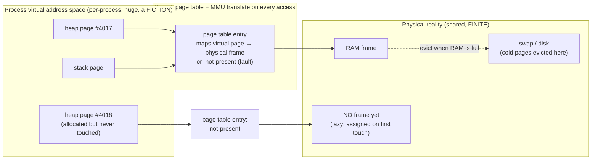
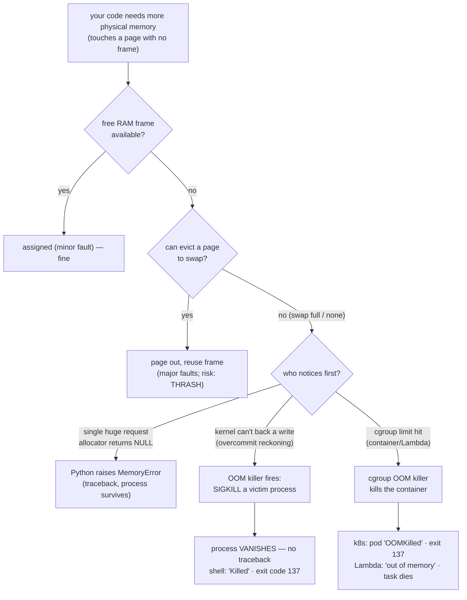
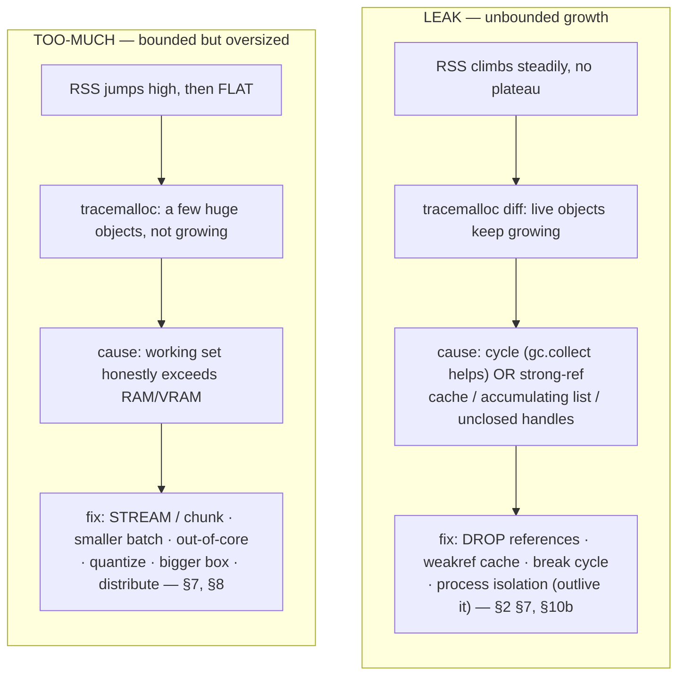
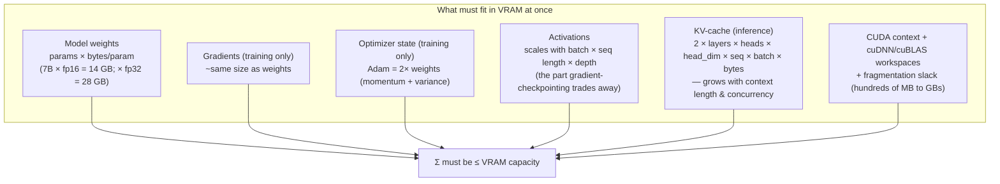

# M01 · Ch2 · §3 — "Out of Memory" for Real: Where the Infinite-Memory Abstraction Tears

> **Module:** How Computers & Operating Systems Work
> **Chapter:** Memory
> **Section:** What physically happens when memory runs out — virtual address space vs. physical RAM, paging
> and the OOM killer, leak vs. legitimately-too-much, the cgroup limit your cloud actually enforces, and the one
> you feel daily: *why a 16 GB model won't load on a 12 GB GPU, and what "CUDA out of memory" is really telling you.*
> **Status:** 🔵 **draft — 2026-06-14.** This is the study material for our session. The body is complete; §10
> ("Applied") is a placeholder I'll fill on **finalize** from whatever you drive the Q&A into — likely a real OOM
> you've hit (a Lambda dying with exit 137, a `CUDA out of memory` on a fine-tune, an RDS box thrashing). Bring one.

**Estimated study time:** 2–3 hours including reflection.
**Prerequisites:** §1 (the process **address space** as a map; stack vs. heap; the allocator searching the heap for
free space) and §2 (refcounting frees on the last `DECREF`; **pymalloc keeps freed memory in its own pools instead of
handing it back to the OS** → high RSS isn't always a leak; `tracemalloc` distinguishes a true leak from "RSS high,
Python-memory flat"). Also Ch1 §3 (the memory hierarchy; the **GPU** hierarchy — VRAM as a separate, smaller memory
space; memory-bound inference; the KV-cache VRAM cost you already reason about). This section discharges the last IOU
of Chapter 2: §1 gave you the map, §2 told you who cleans it up — **this one is what happens at the edges of the map,
the hard physical walls.**

---

## Why this section exists (for *you*)

Every section so far has quietly relied on a comfortable fiction: that memory is *there* when you ask for it. `a =
[0] * 10_000_000` just works; a 4 GB intermediate tensor just allocates; you never write `if (malloc failed)`. §1
even showed you a process believing it owns a vast address space all to itself. That fiction is the single most
important abstraction the OS sells you — and like every abstraction, **it leaks at the boundary.** This section is
about that boundary: the moment the machine can no longer keep the promise, and what each layer does when the promise
breaks.

Three things it will change for you specifically:

1. **You'll read the symptom correctly.** "Out of memory" is not one event — it's at least four, with four
   different signatures: a Python `MemoryError` traceback, a process that *vanishes* with `Killed` (exit 137), a
   container marked `OOMKilled` by Kubernetes, and `RuntimeError: CUDA out of memory`. Each points at a different
   layer and a different fix. Confusing them wastes hours. After this you'll glance at the signature and know which
   wall you hit.
2. **You'll finally know whether it's a leak or just too much** — the question that decides everything downstream.
   §2 gave you the tools (`tracemalloc`, the cycle-vs-strong-ref distinction, process isolation); this section gives
   you the *frame*: a **leak** is live memory climbing without bound; **legitimately-too-much** is a working set that
   honestly exceeds the box. The fixes don't overlap, and reaching for the wrong one is the classic time-sink.
3. **You'll understand the GPU wall from first principles** — the one that bites you most. "Why won't a 16 GB model
   fit on a 12 GB GPU, when it's *only 16 GB*?" and "what is `Tried to allocate 2.00 GiB` actually telling me when
   `nvidia-smi` says I have 3 GB free?" You already own the pieces (VRAM as a separate memory space, KV-cache
   scaling, quantization). This assembles them into a VRAM budget you can compute on the back of an envelope before
   you ever launch the job.

**The framing to carry** (the physics one again, since it's served us). §1's address space was a *map*; treat
physical RAM as the **territory**, and virtual memory as the **conformal map that's larger than the land it
describes.** The MMU redraws the map onto real ground page by page, on demand, lazily — and the whole system works
only because *most of the map is never walked at once* (your working set ≪ your address space). "Out of memory" is
the moment you try to stand on more territory than physically exists. Everything below — overcommit, paging, the OOM
killer, CUDA's allocator — is a different strategy for handling the instant the map outruns the land. **The
conserved quantity is physical frames; OOM is what happens when demand for the conserved quantity exceeds supply.**

---

## 1. The abstraction that's about to tear: virtual vs. physical memory

§1 showed each process a private, contiguous address space — its own stack, heap, code, all laid out in a clean map.
Here is the part §1 deferred: **that map is a fiction maintained by hardware, and it is deliberately bigger than the
RAM behind it.**

Two distinct things wear the word "memory":

- **Virtual address space** — the addresses *your process* sees and uses. On 64-bit, astronomically large
  (the kernel hands user space ~128 TB on x86-64 Linux), per-process, private. This is the map.
- **Physical RAM** — the actual DRAM chips, shared by *every* process and the kernel. Finite, small by comparison
  (your laptop's 16/32 GB). This is the territory.

Between them sits the **MMU** (memory management unit, in the CPU) walking **page tables** the kernel maintains.
Memory is handled in fixed **pages** (4 KB typically). Every memory access your program makes is a *virtual* address;
the MMU translates it to a *physical* frame via the page table, transparently, on every load and store. (This is the
same translation layer the TLB caches — a callback to Ch1 §3's hierarchy, one level up from the data caches.)

<!-- DIAGRAM:START -->


<details>
<summary>Diagram source (Mermaid)</summary>



</details>
<!-- DIAGRAM:END -->

The key consequence, and the seed of everything in this section:

> **A virtual page costs nothing physical until you *touch* it.** Allocating address space (extending the heap,
> `mmap`-ing a region) just edits the map — it reserves virtual addresses and marks them "not yet backed." A
> physical frame is assigned only on the **first read or write** to that page, via a *page fault* the kernel
> services. So your process can hold a 100 GB virtual address space while using 2 GB of real RAM. **Reserving memory
> and consuming memory are two different events, separated in time.** This is the single fact most "why did it OOM
> *there* and not where I allocated?" confusion comes from.

This is also why `top`/`htop` shows you two numbers and you must know which is which:

- **VIRT / VSZ** — total *virtual* address space the process has mapped. Often huge and mostly meaningless (it
  includes reserved-but-untouched regions, shared libraries, etc.). **Not what fills up RAM.**
- **RES / RSS** — *resident set size*: the physical frames actually backing the process right now. **This is the
  number that competes for real RAM**, and the one §2 warned you stays high because pymalloc hoards freed pages.

When people say a process "is using 8 GB," they mean RSS. OOM is fundamentally about the **sum of every process's
RSS** (plus the kernel's own use) exceeding physical RAM + swap.

---

## 2. The capacity hierarchy: RAM, swap, and paging

Ch1 §3 gave you the *speed* hierarchy (registers → L1/L2/L3 → RAM), each tier faster and smaller going up. There's a
second tier *below* RAM, and it's about **capacity, not speed**: **swap** (Linux) / the **page file** (Windows) —
a region of *disk* the kernel uses as overflow for RAM.

When physical RAM fills, the kernel doesn't immediately fail. It **pages**: it picks RAM frames holding pages that
haven't been used recently (an LRU-ish policy) and **evicts** them to swap, freeing the frame for whoever needs it
now. If the evicted page is touched again later, that access triggers a **major page fault** — the kernel must read
the page *back from disk* into a frame (possibly evicting another), then resume your program. Your code didn't
change; one memory access just went from ~100 ns (RAM) to ~10 ms (disk seek) — **~100,000× slower**, invisibly.

> **Two flavors of page fault, and the gulf between them.** A **minor fault** is the cheap, normal one from §1: the
> page is valid but not yet backed (first touch) or already in RAM but not yet mapped into this process — the kernel
> just hands over a frame, microseconds. A **major fault** is the expensive one: the page's data is *on disk*
> (swapped out, or a not-yet-read file mapping) and must be fetched. Minor faults are the machinery of lazy
> allocation working as designed; a *rising rate of major faults* is the early-warning siren that you're starting to
> page. (Watch `majflt/s` in `sar`, or the `pgmajfault` line in `/proc/vmstat`.)

**Thrashing — the failure mode before the failure mode.** When the *active* working set genuinely exceeds RAM, the
system pages out a frame only to need it back almost immediately, then pages out another to make room, in a vicious
cycle. The CPU spends nearly all its time waiting on disk; throughput collapses to near zero while the machine looks
"busy." This is **thrashing**, and on a box with generous swap it's often *worse* than a clean OOM kill — the
process doesn't die, it just slows by orders of magnitude and drags everything else down with it. (Your suspected
arena RDS auto-pause aside, this is a classic database-server death spiral: working set > buffer pool > RAM →
thrash.) It's also why many production boxes run with **little or no swap**: operators would rather a fast, clean
kill than a slow, ambiguous thrash. Kubernetes historically *disabled swap entirely* for exactly this reason —
predictable failure beats unpredictable degradation.

---

## 3. What `malloc` actually does — and why it (almost) never fails on Linux

Here's the subtlety that surprises careful people, and it directly explains the "vanished process" signature in §4.

When your program (or CPython's allocator under it — §2) needs heap memory, it ultimately asks the kernel via `brk`
(grow the heap) or `mmap` (map a fresh region). On Linux, by default, the kernel practices **overcommit**: it says
"yes" to far more memory than it physically has, *betting that you won't touch all of it.* The `malloc` returns a
valid pointer immediately — no physical frames assigned yet (§1). Frames get assigned lazily, page by page, as you
*write* to the memory (minor faults, §2).

This is usually a good bet — programs routinely reserve more than they use (sparse arrays, big-but-mostly-empty
buffers, the way `fork()` duplicates an address space copy-on-write). But it has a sharp edge:

> **On an overcommitting system, the allocation that "should have failed" succeeds — and the *write* fails instead,
> later, somewhere else entirely.** Because `malloc` returned non-NULL, your program happily proceeds, and only when
> it touches the page (and no physical frame can be found, and swap is full) does the reckoning come. But a page
> fault can't "return an error" to a single line of C the way `malloc` can — the program is mid-instruction. So the
> kernel can't politely tell *you* no. It invokes the **OOM killer** (§4) instead.

There are three overcommit policies on Linux (`/proc/sys/vm/overcommit_memory`): `0` heuristic (default — allow
"reasonable" overcommit, refuse the wildly-too-large), `1` always (never refuse — used by workloads like Redis that
`fork` for snapshots and rely on copy-on-write), `2` strict (never overcommit — `malloc` returns NULL once
commitments exceed RAM + swap × ratio, so you get clean failures but waste capacity). Most systems you'll meet run
`0`. **The practical upshot for you, a Python dev:** because of overcommit, your Python process is more likely to be
*killed from outside* (no traceback) than to see a clean `MemoryError` from inside — which is exactly the confusing
case §4 untangles.

---

## 4. The four signatures of "out of memory" — read them like a failure analyst

This is the heart of the practitioner skill. "Out of memory" presents as **four distinct symptoms**, and the
*signature tells you the layer.* Treat it like a failure-analysis decision tree — your home turf.

<!-- DIAGRAM:START -->


<details>
<summary>Diagram source (Mermaid)</summary>



</details>
<!-- DIAGRAM:END -->

**Signature 1 — `MemoryError` (a Python exception, with a traceback).** The CPython allocator asked for memory and
got NULL back, so it raised `MemoryError` *in-process*. You get a normal traceback pointing at the offending line.
This happens for a **single allocation too large to satisfy** (e.g. `np.zeros((100_000, 100_000))` — ~80 GB in one
request the allocator can't fulfill), or under strict-overcommit (§3 policy 2). The process is still alive and *could*
catch it — though catching `MemoryError` is rarely useful, since you're out of the one resource you'd need to recover.
**Signature: a traceback ending in `MemoryError`.** Layer: the allocator inside your process.

**Signature 2 — the OOM killer (process vanishes, no traceback).** This is the overcommit reckoning of §3. RAM and
swap are genuinely exhausted, a *write* can't be backed, and the kernel's **OOM killer** wakes up. It scans
processes, scores each by a heuristic (`oom_score`, roughly "how much would killing this free, weighted by badness"
— big-RSS processes score high, and you can bias it via `oom_score_adj`), picks a victim, and sends it **SIGKILL**
(signal 9 — uncatchable, no cleanup, no traceback). From your side the process simply *disappears*; the shell prints
`Killed`; the exit code is **137** (128 + 9). Crucially, **the victim need not be the process that exhausted memory**
— the kernel kills whoever scores worst, so your innocent web server can die because a batch job ate the RAM. You
find the evidence in the kernel log (`dmesg`, or `journalctl -k`): a line like `Out of memory: Killed process 1234
(python) total-vm:... anon-rss:...`. **Signature: `Killed` / exit 137 / nothing in *your* logs, everything in
`dmesg`.** Layer: the kernel, on behalf of the whole machine.

**Signature 3 — the cgroup OOM (your cloud reality).** In a container — Docker, ECS, Kubernetes, even Lambda — your
process doesn't see the host's RAM. It runs inside a **cgroup** (control group) with a *memory limit* the
orchestrator set (k8s `resources.limits.memory`, your Lambda's memory config, `docker run -m`). When the cgroup's
usage hits *its* limit — even with gigabytes free on the host — the **cgroup-scoped OOM killer** fires and kills a
process *in that group*. Kubernetes reports the pod as **`OOMKilled`** with exit code **137**; ECS shows
`OutOfMemoryError`; Lambda logs `Error: Runtime exited ... out of memory` and the invocation fails. **This is almost
certainly the OOM you'll meet most**, given you deploy to AWS. The mental correction: in the cloud, "out of memory"
usually means *"out of your allotted quota,"* not *"the machine ran out."* The fix is often one line of IaC (raise
the limit) — but only after you've confirmed it's legitimately-too-much and not a leak (§5), or you'll just buy a
bigger box that fills up more slowly. **Signature: `OOMKilled` / exit 137 in the orchestrator, host has RAM to
spare.** Layer: the cgroup, enforcing your config.

**Signature 4 — `CUDA out of memory` (a different memory space entirely).** This is signature 1's cousin but on the
GPU, and it's important enough — and different enough — to get its own section (§7). Short version: it's an
in-process exception (`torch.cuda.OutOfMemoryError` / `RuntimeError: CUDA out of memory`), with a traceback, raised
by the *CUDA allocator* when it can't find room in **VRAM** — a separate, smaller, mostly-non-swappable memory space
that the OS paging machinery above does **not** rescue. Layer: the GPU and its allocator.

> **The one-glance diagnostic, worth memorizing:**
> | You see… | It was… | Look in… |
> |---|---|---|
> | Traceback → `MemoryError` | a too-big single alloc, or strict overcommit | the traceback line |
> | `Killed`, exit 137, no traceback | the kernel OOM killer (host RAM exhausted) | `dmesg` / `journalctl -k` |
> | `OOMKilled`, exit 137, host fine | the **cgroup** limit (container/Lambda) | k8s events / Lambda logs / `docker inspect` |
> | `CUDA out of memory` traceback | the **GPU** allocator, VRAM full | the error's "allocated/reserved/free" line (§7) |

---

## 5. Leak vs. legitimately-too-much — the question that decides the fix

Before reaching for *any* fix, answer one question, because the two diagnoses have **disjoint** remedies and the
classic time-sink is treating one as the other. This is the §2 material, now elevated to a diagnostic stance.

**A leak:** live, reachable memory that grows **without bound** over time, for work that shouldn't need it. The
process's RSS (and, tellingly, its *Python-level live-object count*) climbs monotonically — request after request,
image after image (your fab war story, §2 10b), and never plateaus. The total is unbounded in time.

**Legitimately-too-much:** the *working set* of a single, honest unit of work genuinely exceeds the box — a 40 GB
join on a 32 GB machine, a batch size that doesn't fit, loading a 30 GB dataset into a dataframe at once. RSS jumps
to a high level and *stays* there (it's not growing — it's just too big). The total is bounded but exceeds capacity.

The discriminator is **shape over time, and `tracemalloc` (§2 §9)**:

<!-- DIAGRAM:START -->


<details>
<summary>Diagram source (Mermaid)</summary>



</details>
<!-- DIAGRAM:END -->

- **If RSS grows without bound** → leak. Now apply §2's sub-diagnosis: does `gc.collect()` reclaim it? *Yes* → it's a
  **reference cycle** (and your §10d immutable-DAG pipeline design is the reason your own code rarely makes them).
  *No* → it's a **strong-reference** leak: an accumulating list, a module-level cache that never evicts (→ `weakref`,
  §2 7.5), unclosed handles, or a C-extension leak. When you can't fix the leaking code, **process isolation**
  outlives it (§2 10b — `maxtasksperchild=1`, gunicorn `max_requests`). Note the cruel interaction: a slow leak in a
  cgroup is a **time bomb** — it works in dev, passes the demo, and gets `OOMKilled` at 3 a.m. three days into
  production once it finally crosses the limit.
- **If RSS jumps and plateaus** → too-much. No amount of `gc` or `weakref` helps; you must shrink the *working set*:
  **stream/chunk** instead of loading whole (read the dataframe in `chunksize=` pieces; iterate the file, don't
  `.read()` it); process **out-of-core** (Dask/Polars-streaming/`np.memmap`); reduce **batch size**; **quantize**
  (GPU, §7); or honestly provision a bigger box / distribute. The skill is recognizing that the fix is *algorithmic*
  (touch less at once), not *hygienic* (free more).

> **The reframe, in one line:** a leak is a *bug in time* (you keep what you should have dropped); too-much is a
> *bug in space* (you hold more at once than fits). §2 was about the first. Most of §7–§8 is about the second.

---

## 6. A subtlety you already half-know: freed ≠ returned to the OS

§2 §7.3 planted this; OOM is where it pays off. When Python frees objects, **pymalloc** keeps the memory in its own
arenas to serve future allocations, rather than returning it to the kernel — so your **RSS can stay high after a big
structure dies**, and the OS still counts those frames against you. Two consequences for OOM specifically:

1. **"I deleted the data but the process is still 6 GB" is usually not a leak** (the §2 colleague-quiz answer). The
   memory is free *to Python*, reusable for the next big array, just not handed back to the OS. It only becomes a
   real problem if you need that RAM for *something other than Python* on the same box.
2. **Fragmentation can cause OOM with "free" memory.** Allocators hand out memory in blocks; after lots of mixed-size
   alloc/free, the free space can be **fragmented** into pieces too small to satisfy a large contiguous request —
   so a 2 GB allocation fails even though 3 GB is "free" but scattered. This is rare in CPython for ordinary objects
   (pymalloc handles small objects in pools; large ones go straight to `mmap` and are returned on free), but it is
   **the dominant OOM cause on the GPU** (§7), where the caching allocator and large contiguous tensors make
   fragmentation a first-class failure mode. Same word "out of memory," but the cause is *geometry*, not *quantity*.

---

## 7. The GPU wall: why a 16 GB model won't fit on a 12 GB GPU, and what `CUDA out of memory` means

This is the one you feel, so we'll do it properly — and you already own every prerequisite (Ch1 §3's GPU hierarchy;
your KV-cache and quantization knowledge). The headline: **GPU memory is a different country.** The virtual-memory
machinery of §1–§4 — overcommit, demand paging, swap, the OOM killer — is the *CPU/host* story. VRAM plays by
harsher rules:

- **VRAM is separate and small.** It's the GPU's own HBM/GDDR (Ch1 §3), physically distinct from host RAM, typically
  *smaller* (12/24/80 GB) and far more contended.
- **There is (effectively) no swap.** By default the GPU does **not** page cold tensors to disk or host RAM the way
  the kernel pages RAM to swap. (CUDA *Unified Memory* can oversubscribe and migrate pages over PCIe/NVLink, but it's
  slow enough that most training/inference stacks don't rely on it.) So when VRAM is full, **it's full** — there's no
  graceful degradation tier beneath it. The wall is hard.
- **The error is in-process, with a traceback.** `torch.cuda.OutOfMemoryError: CUDA out of memory. Tried to allocate
  2.00 GiB. GPU 0 has a total capacity of 12.00 GiB of which 1.50 GiB is free. ... PyTorch reserved 9.80 GiB ...` —
  signature 4 from §4. The numbers in that line are the whole diagnosis (see below).

**Why "16 GB model on a 12 GB GPU" is the *easy* part — the real budget is much bigger than the weights.** People
read "16 GB" as the model size and expect it to fit on anything ≥ 16 GB. The weights are only the *first* line item.
What actually has to coexist in VRAM:

<!-- DIAGRAM:START -->


<details>
<summary>Diagram source (Mermaid)</summary>



</details>
<!-- DIAGRAM:END -->

So the arithmetic that actually governs the fit:

- **Inference of a 7B model.** Weights at fp16 ≈ **14 GB** already won't fit a 12 GB card — before a single token's
  KV-cache, before the CUDA context (~0.5–2 GB just to initialize). At fp32 it's 28 GB. This is why **quantization**
  (your wheelhouse — int8 ≈ 7 GB, int4/NF4 ≈ 3.5 GB) is the difference between "fits" and "doesn't," and why a "12 GB
  GPU" practically runs ~7B-class models only when quantized.
- **The KV-cache is the silent VRAM eater at inference** (you know this cost cold): it grows **linearly with context
  length × batch/concurrency**, so a model that loads fine OOMs at long context or under load — the weights were
  static, but the cache wasn't. This is the production OOM that surprises people: "it worked yesterday" → today
  someone sent a 100 K-token prompt or you raised concurrency.
- **Training is ~4× worse than inference for the same model**, because you also hold **gradients** (≈ 1× weights) and
  **optimizer state** (Adam = 2× weights for momentum + variance), plus **activations** for the backward pass (scales
  with batch × sequence × depth). A 7B fp16 model that *infers* in ~15 GB needs **~60–80 GB to fully fine-tune** with
  Adam — which is the entire reason for gradient checkpointing (recompute activations instead of storing them —
  trade compute for memory), ZeRO/FSDP sharding (split optimizer state across GPUs), LoRA/QLoRA (train tiny adapters,
  freeze the base), and mixed precision (your FP8/bf16 knowledge).

**What `Tried to allocate X. … Y free … Z reserved` is really telling you — including the fragmentation twist.**
PyTorch uses a **caching allocator** (the GPU analog of pymalloc, §2/§6): it grabs big VRAM blocks from CUDA and
sub-allocates tensors out of them, *reserving* more than is currently *allocated* so it can serve the next tensor
without a slow `cudaMalloc`. So the error distinguishes:

- **allocated** — VRAM actually holding live tensors right now;
- **reserved** — VRAM PyTorch has claimed from the driver (allocated + cached-free blocks);
- **free** — what's left on the device.

The frequent gotcha — **the GPU equivalent of §6's fragmentation OOM**: PyTorch says "tried to allocate 2 GiB, 3 GiB
free" and *still* fails, because that 3 GiB is fragmented across non-contiguous cached blocks and no single 2 GiB
contiguous span exists. The tensor needs contiguous VRAM; geometry, not quantity, kills you. Fixes that target *this*
specifically: `torch.cuda.empty_cache()` (return cached-but-unused blocks to the driver), and
`PYTORCH_CUDA_ALLOC_CONF=expandable_segments:True` (lets the allocator grow segments to fight fragmentation). For the
*quantity* problem, the levers are the ones above: smaller batch, shorter context / paged-KV (vLLM's PagedAttention
is literally "virtual memory for the KV-cache" — same idea as §1 paging, applied to VRAM), gradient checkpointing,
quantization, offloading, and sharding across GPUs.

> **The cross-section unification, worth holding:** vLLM's **PagedAttention** is §1's demand paging *reinvented for
> VRAM* — the KV-cache is split into fixed "pages," allocated on demand, mapped through an indirection table, so
> fragmentation drops and you can pack more concurrent sequences. The OS solved "fragmented + oversubscribed memory"
> in the 1960s; the LLM-serving world rediscovered the same answer in 2023. Once you see paging as the pattern, you
> see it everywhere capacity is scarce and contiguous allocation is expensive.

---

## 8. Where this bites *you* — the practitioner's playbook

Concrete, ranked, and mapped to the signatures above.

1. **First, read the signature, then diagnose — don't fix blind (§4).** Traceback-`MemoryError` ≠ `Killed`/137 ≠
   `OOMKilled` ≠ `CUDA out of memory`. Each names the layer. The single most common mistake is "bump the memory
   limit" applied to a *leak* — it just delays the same crash. **Always answer §5's leak-vs-too-much question first.**

2. **In the cloud, check the cgroup limit before blaming the host (§4 sig. 3).** Your Lambda/ECS/k8s OOMs are almost
   always the *cgroup* limit, not host RAM. The host having free memory is a red herring. Confirm with the
   orchestrator's `OOMKilled`/exit-137 signal, then decide: raise the limit (if legitimately-too-much) *or* fix the
   leak (if unbounded). Both are one-liners; picking wrong wastes the night.

3. **Watch the shape, not the snapshot.** A single `top` reading can't tell a leak from too-much — only the *trend*
   can. Graph RSS over time (or `tracemalloc` snapshot diffs, §2 §9). Flat-after-jump = too-much; ever-climbing =
   leak. This is your failure-analysis instinct: one measurement is noise, the time series is the signal.

4. **For too-much, the fix is "touch less at once," not "free more."** Stream/chunk inputs (`pandas` `chunksize`,
   iterate don't `.read()`), go out-of-core (Dask, Polars streaming, `np.memmap`), shrink batch size, paginate DB
   reads. Loading a 30 GB file into a 16 GB box will *never* work by tuning the GC — it's a working-set problem (§5).

5. **For GPU OOM, compute the budget *before* launching (§7).** params × bytes/param for weights; ×4 for full
   training with Adam; add KV-cache (grows with context × concurrency) for inference. If it doesn't pencil out, reach
   for the right lever: quantization (you know this), gradient checkpointing, LoRA/QLoRA, FSDP/ZeRO sharding, smaller
   batch, paged-KV serving (vLLM). And if it OOMs with "free" VRAM, suspect **fragmentation** → `empty_cache()` /
   `expandable_segments:True`, not a bigger card.

6. **Prefer a clean kill to a silent thrash (§2).** On a box that's chronically near the edge, *little/no swap* turns
   slow ambiguous thrashing into fast obvious OOM kills you can alert on. Surprising but standard ops wisdom (and why
   k8s disabled swap). Pair it with memory limits + alerting on RSS trend, so the crash is observable, not a 3 a.m.
   mystery.

7. **Make the leak die before it kills you (§2 10b carry-over).** If you can't fix a leaky worker, bound its lifetime
   — `maxtasksperchild=1`, gunicorn `max_requests`, a periodic recycle. Process isolation *outlives* a leak; it's
   strictly stronger than any in-process cleanup, and it works regardless of leak type (cyclic, strong-ref, or
   C-level). This is the same containment instinct you reached for in the fab.

---

## 9. Check your understanding

Jot a one-line answer to each before our Q&A — we'll dig into whichever are fuzzy.

1. Explain the difference between a process's **VIRT** and **RES** in `top`, and say which one "fills up RAM" and
   why a process can show 100 GB VIRT on a 16 GB machine without any problem.
2. On default-Linux, `p = malloc(8 GB)` succeeds even though you have 4 GB RAM and no swap, and the program crashes
   *later*. Walk the chain: why did `malloc` succeed, what physically happens when you start writing, and why does
   the failure show up as the process being *killed* rather than a clean error return?
3. Name the **four signatures** of "out of memory" and, for each, the *one place you'd look* to confirm it and the
   *layer* responsible.
4. You restart a service and over six hours its RSS climbs from 200 MB to 3 GB and it gets `OOMKilled`. A colleague
   says "give it more memory." Why is that probably the wrong first move, and what one measurement decides it? If it
   *is* a leak, what's the next sub-question (hint: §2) and how would you answer it?
5. Why won't a "16 GB" 7B model fit on a 12 GB GPU even for *inference* — list everything besides the weights that
   must coexist in VRAM. Then estimate, order-of-magnitude, the VRAM to **fully fine-tune** that same model with Adam,
   and explain the ~4× factor.
6. `CUDA out of memory. Tried to allocate 2.00 GiB … 3.00 GiB free.` How can it fail when more is free than it asked
   for? Name the cause and two things you'd try that target it specifically.
7. (Synthesis / your wheelhouse) Argue why vLLM's **PagedAttention** is "virtual memory for the KV-cache." Map each
   piece — pages, the indirection table, demand allocation, fragmentation reduction — onto the §1 paging mechanism,
   and say what problem it solves that a single contiguous KV-cache per sequence does not.

---

## 10. Optional: get your hands dirty (15–20 min)

The machine will *show* you every wall in this section. (Run the scarier ones in a VM/container you don't mind
crashing — especially anything that actually exhausts memory.)

```python
import os, resource, ctypes

# (a) Prove reserving ≠ consuming (§1, §3). A huge allocation that you never TOUCH costs ~no RAM.
big = bytearray(2 * 1024**3)        # reserve 2 GB of address space...
# ...watch RSS in `top`/`htop`: it does NOT jump by 2 GB yet on a lazy-zeroing system,
#    because the pages aren't faulted in until written.
for i in range(0, len(big), 4096):  # now TOUCH one byte per 4 KB page → faults frames in
    big[i] = 1                       # ...watch RSS climb 2 GB now. Touch is what costs.

# (b) Cap your own address space, then reproduce a CLEAN MemoryError (§4 sig. 1) safely.
#     RLIMIT_AS limits virtual memory; once exceeded, allocations raise MemoryError in-process.
soft, hard = resource.getrlimit(resource.RLIMIT_AS)
resource.setrlimit(resource.RLIMIT_AS, (512 * 1024**2, hard))   # cap at 512 MB
try:
    waste = bytearray(1024**3)      # ask for 1 GB → blocked by the cap
except MemoryError:
    print("caught a clean MemoryError — the in-process signature")  # process SURVIVES
```

```bash
# (c) See virtual vs resident with your own eyes (§1). VmSize = VIRT, VmRSS = RES.
grep -E 'VmSize|VmRSS|VmSwap' /proc/self/status

# (d) After an OOM kill, the evidence is in the KERNEL log, never in your app log (§4 sig. 2).
dmesg -T | grep -i -E 'killed process|out of memory'     # or: journalctl -k | grep -i oom

# (e) The container truth (§4 sig. 3): what limit does YOUR cgroup actually enforce?
cat /sys/fs/cgroup/memory.max            # cgroup v2: the byte ceiling (or 'max' = unlimited)
cat /sys/fs/cgroup/memory.current        # current usage counted against it
#   On a laptop these may say 'max'; on k8s/ECS/Lambda they're your real wall.
```

```python
# (f) GPU budget arithmetic (§7) — no GPU needed; this is just the back-of-envelope.
def vram_gb(params_billion, bytes_per_param, training=False):
    weights = params_billion * 1e9 * bytes_per_param / 1024**3
    if not training:
        return weights                      # + KV-cache + context in reality
    grads = weights                         # ≈ 1× weights
    adam  = 2 * weights                     # momentum + variance
    return weights + grads + adam           # + activations (batch×seq×depth) on top

print("7B fp16 inference (weights only):", round(vram_gb(7, 2), 1), "GB")   # ~13 → won't fit 12 GB
print("7B int4 inference (weights only):", round(vram_gb(7, 0.5), 1), "GB") # ~3.3 → fits, quantized
print("7B fp16 FULL fine-tune w/ Adam:  ", round(vram_gb(7, 2, True), 1), "GB")  # ~52 + activations
```

Bring anything surprising to our chat — especially what (a) does to RSS *before* vs *after* the touch loop, and
what your real deployment's `memory.max` in (e) turns out to be.

---

## 11. Applied — captured from our session

*(Placeholder — to be filled on **finalize**, from wherever you drive the Q&A. Likely landing spots, given your
history: a real OOM you've hit and want diagnosed by signature; a Lambda/ECS exit-137 you can now re-read as a cgroup
limit; a fine-tune that died with `CUDA out of memory` and the VRAM budget that explains it; or a thrashing
RDS/server story to pair with your fab image-leak war story from §2. We'll distill whatever you pressure-test into
the keepers, your way.)*

---

## References (optional, for depth)

*(Links to be re-verified live at finalize, per the repo's "references need valid links" rule.)*

- **[CSAPP — Virtual Memory chapter (Bryant & O'Hallaron)](https://csapp.cs.cmu.edu/)** — the language-agnostic
  foundation under §1–§3: address translation, the MMU/TLB, page tables, demand paging, and the allocator picture.
  Continuous with §1's heap material and Ch1 §3's hierarchy — the C-side deep version of this whole section.
- **[Linux kernel docs — Overcommit Accounting](https://docs.kernel.org/mm/overcommit-accounting.html)** — the
  authoritative description of the three `overcommit_memory` policies behind §3, and exactly when `malloc` will and
  won't refuse. Short and precise.
- **[Linux kernel docs — Concepts overview (the OOM killer & memory management)](https://docs.kernel.org/admin-guide/mm/concepts.html)**
  — the kernel's own account of physical/virtual memory, paging, and reclaim; pairs with §2 and §4's OOM-killer
  mechanics. (For the gory scoring detail, `mm/oom_kill.c` in the source tree.)
- **[Python docs — `tracemalloc`](https://docs.python.org/3/library/tracemalloc.html)** and
  **[`resource`](https://docs.python.org/3/library/resource.html)** — `tracemalloc` is the leak-vs-too-much
  discriminator from §5 (snapshot diffs); `resource.setrlimit(RLIMIT_AS, …)` lets you cap and *reproduce* a clean
  `MemoryError` on demand for the §10 exercise.
- **[PyTorch — CUDA semantics: Memory management](https://pytorch.org/docs/stable/notes/cuda.html#memory-management)**
  — the caching allocator, `allocated` vs `reserved`, `empty_cache()`, and `PYTORCH_CUDA_ALLOC_CONF`
  (`expandable_segments`) — the §7 fragmentation toolkit, from the source.
- **[Hugging Face — Model training anatomy (memory)](https://huggingface.co/docs/transformers/main/en/model_memory_anatomy)**
  — the VRAM budget breakdown of §7 (weights + gradients + optimizer + activations) with measured numbers; the
  reference for the ~4×-for-training factor.
- **[vLLM — PagedAttention / the paper "Efficient Memory Management for LLM Serving"](https://arxiv.org/abs/2309.06180)**
  — the §7 "virtual memory for the KV-cache" claim, straight from the source; read it as demand paging (§1) applied
  to VRAM. Right at your level.

---

### What's next
🔵 **Draft — 2026-06-14.** Marked in-progress in `courses/plan.md`. After our Q&A, say **"finalize"** and I'll fill
§11 from the session, re-verify the reference links live, and flip Ch2 to ✅ — **completing Chapter 2 (Memory)**: §1
the map, §2 who frees it, §3 the walls.

With Ch2 done, the Phase-1 interleave points three ways — your pick at the boundary:
- **M01 Ch3 — Processes, threads & concurrency** (the natural next CS step; it cashes in the GIL keystone from §2 §6
  and the "thread is one instruction stream" thread from Ch1 §2 — async/await, the GIL, parallelism vs concurrency,
  your `asyncio` usage explained).
- **M04 Ch1 §2 — Tracing data flow** (the SWE thread; pairs with your code-decomposition gap and reuses your pipeline
  code).
- **M12 Ch2 §2 — Video models (DiT/Sora)** (the AI thread — your strongest critique mode; the diversification note
  from 06-12 leans this way after a CS-heavy run).
