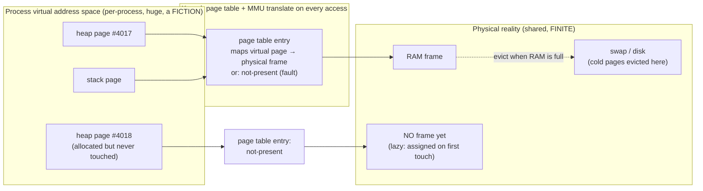
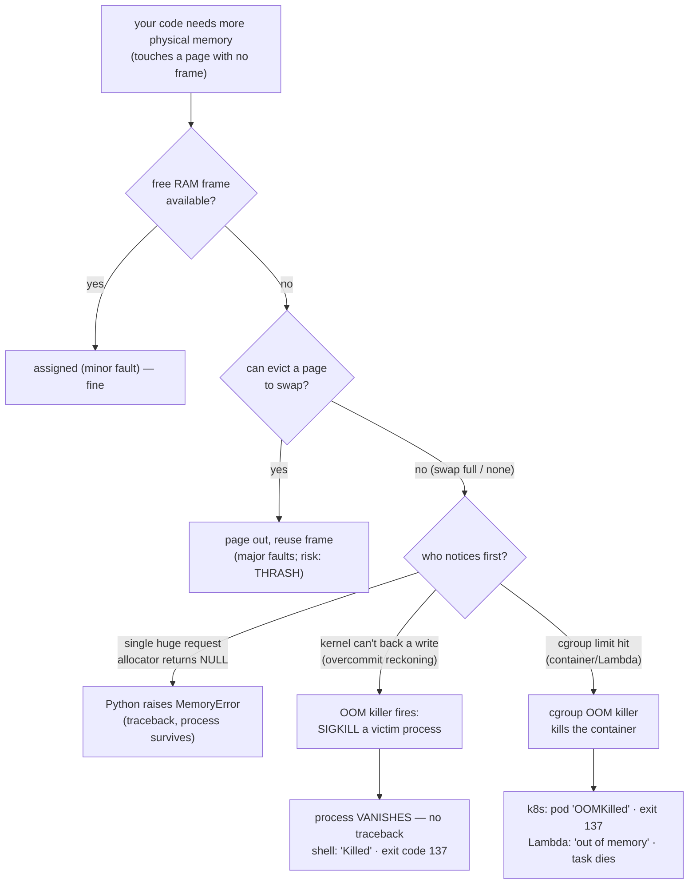
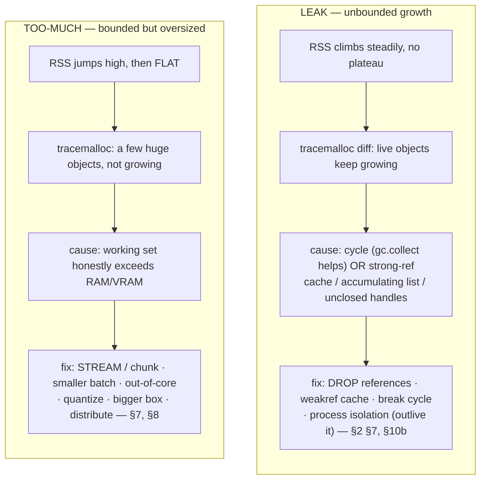
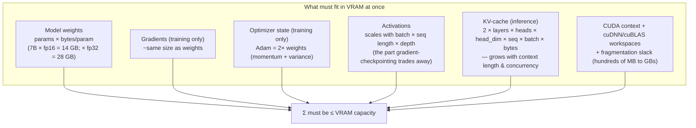

# M01 · Ch2 · §3 — "Out of Memory" for Real: Where the Infinite-Memory Abstraction Tears

> **Module:** How Computers & Operating Systems Work
> **Chapter:** Memory
> **Section:** What physically happens when memory runs out — virtual address space vs. physical RAM, paging
> and the OOM (out of memory) killer, leak vs. legitimately-too-much, the cgroup limit your cloud actually enforces, and the one
> you feel daily: *why a 16 GB model won't load on a 12 GB GPU, and what "CUDA (Compute Unified Device Architecture) out of memory" is really telling you.*
> **Status:** ✅ **finalized 2026-06-14.** The body held; the entire session was you taking §7/§9.7 into contact
> with **your own LLM-serving experience** — three threads, all of which turned out to be the *same* OS memory
> playbook (§1–§7) reappearing one layer up in inference serving. §11 captures them: **(11a)** PagedAttention — your
> "contiguous KV-cache is too huge to allocate" hypothesis caught the *smallest* of three wastes (external frag);
> the dominant one is **forced over-reservation** (internal fragmentation), and fixed-size blocks kill external frag
> *by construction*; **(11b)** vLLM `gpu_memory_utilization` — *not* paging cost; it's a **derating safety margin**
> against an under-estimated, variable peak (the semiconductor framing that landed); **(11c)** llama.cpp offload —
> **sequential, bandwidth-bound, and weights never move** (only ~8 KB activations cross PCIe). Pattern across all
> three: *don't move/duplicate/over-reserve the big thing.*

**Estimated study time:** 2–3 hours including reflection.
**Prerequisites:** §1 (the process **address space** as a map; stack vs. heap; the allocator searching the heap for
free space) and §2 (refcounting frees on the last `DECREF`; **pymalloc keeps freed memory in its own pools instead of
handing it back to the OS** → high RSS (resident set size) isn't always a leak; `tracemalloc` distinguishes a true leak from "RSS high,
Python-memory flat"). Also Ch1 §3 (the memory hierarchy; the **GPU** hierarchy — VRAM (video random-access memory) as a separate, smaller memory
space; memory-bound inference; the KV-cache VRAM cost you already reason about). This section discharges the last IOU
of Chapter 2: §1 gave you the map, §2 told you who cleans it up — **this one is what happens at the edges of the map,
the hard physical walls.**

---

## Why this section exists (for *you*)

Every section so far has quietly relied on a comfortable fiction: that memory is *there* when you ask for it. `a =
[0] * 10_000_000` just works; a 4 GB intermediate tensor just allocates; you never write `if (malloc failed)`. §1
even showed you a process believing it owns a vast address space all to itself. That fiction is the single most
important abstraction the OS sells you — and like every abstraction, **it leaks at the boundary.** This section is
about that boundary: the moment the machine can no longer keep the promise, and what each layer does when the promise
breaks.

Three things it will change for you specifically:

1. **You'll read the symptom correctly.** "Out of memory" is not one event — it's at least four, with four
   different signatures: a Python `MemoryError` traceback, a process that *vanishes* with `Killed` (exit 137), a
   container marked `OOMKilled` by Kubernetes, and `RuntimeError: CUDA out of memory`. Each points at a different
   layer and a different fix. Confusing them wastes hours. After this you'll glance at the signature and know which
   wall you hit.
2. **You'll finally know whether it's a leak or just too much** — the question that decides everything downstream.
   §2 gave you the tools (`tracemalloc`, the cycle-vs-strong-ref distinction, process isolation); this section gives
   you the *frame*: a **leak** is live memory climbing without bound; **legitimately-too-much** is a working set that
   honestly exceeds the box. The fixes don't overlap, and reaching for the wrong one is the classic time-sink.
3. **You'll understand the GPU wall from first principles** — the one that bites you most. "Why won't a 16 GB model
   fit on a 12 GB GPU, when it's *only 16 GB*?" and "what is `Tried to allocate 2.00 GiB` actually telling me when
   `nvidia-smi` says I have 3 GB free?" You already own the pieces (VRAM as a separate memory space, KV-cache
   scaling, quantization). This assembles them into a VRAM budget you can compute on the back of an envelope before
   you ever launch the job.

**The framing to carry** (the physics one again, since it's served us). §1's address space was a *map*; treat
physical RAM as the **territory**, and virtual memory as the **conformal map that's larger than the land it
describes.** The MMU (memory management unit) redraws the map onto real ground page by page, on demand, lazily — and the whole system works
only because *most of the map is never walked at once* (your working set ≪ your address space). "Out of memory" is
the moment you try to stand on more territory than physically exists. Everything below — overcommit, paging, the OOM
killer, CUDA's allocator — is a different strategy for handling the instant the map outruns the land. **The
conserved quantity is physical frames; OOM is what happens when demand for the conserved quantity exceeds supply.**

---

## 1. The abstraction that's about to tear: virtual vs. physical memory

<details>
<summary><b>Vocabulary for this section</b> — the address-translation machinery and the two "memory" numbers `top` shows (click to expand)</summary>

**Abbreviations**

| Short | Stands for | Meaning |
|---|---|---|
| **RAM** | random-access memory | the physical working memory of the machine |
| **DRAM** | dynamic random-access memory | the specific chip technology RAM is built from |
| **MMU** | memory management unit | the hardware block inside the CPU that translates virtual addresses to physical ones on every access |
| **TLB** | translation lookaside buffer | the small cache of recent address translations, so the MMU need not walk the page table every time |
| **CPU** | central processing unit | the processor |
| **OS** | operating system | the kernel and its services |
| **OOM** | out of memory | the condition where demand for physical memory exceeds supply |
| **VIRT / VSZ** | virtual size | total virtual address space a process has mapped — usually huge and mostly meaningless |
| **RES / RSS** | resident set size | the physical memory actually backing the process right now — the number that competes for RAM |
| **TB / GB / KB** | terabyte / gigabyte / kilobyte | a million, a thousand, and a thousandth of a megabyte respectively |
| **x86-64** | — | the 64-bit Intel/AMD instruction set most servers and laptops run |

**Terms**

| Term | Definition |
|---|---|
| **Virtual address space** | the private, contiguous-looking range of addresses one process sees — the map |
| **Physical RAM** | the actual chips, shared by every process and the kernel — the territory |
| **Kernel** | the core of the OS, which owns the physical memory and maintains the maps |
| **User space** | where your processes run, as opposed to inside the kernel |
| **Page** | the fixed-size unit memory is managed in, typically 4 KB |
| **Frame** | one page-sized slot of physical RAM; here the resource that actually runs out (not the same as §1's *stack frame*) |
| **Page table** | the kernel's per-process table mapping each virtual page to a physical frame, or marking it not-present |
| **Page table entry** | one row of that table |
| **Not-present** | a page that has been reserved in the map but has no physical frame behind it yet |
| **Page fault** | the hardware trap taken when a program touches a not-present page; the kernel services it and resumes the program |
| **Lazy (demand) allocation** | assigning a physical frame only on the first read or write to a page, not when the address space was reserved |
| **Touch** | to actually read or write a page, which is the event that costs physical memory |
| **`mmap`** | the system call that maps a region of address space, optionally backed by a file |
| **Swap** | disk space the kernel uses to hold pages evicted from RAM |
| **Evict** | write a page out to swap and reuse its frame for something else |
| **Shared library** | code loaded once and mapped into many processes; it inflates VIRT without costing each process its own RAM |
| **Resident** | currently held in physical RAM |
| **`top` / `htop`** | the interactive process monitors that display VIRT and RES |
| **pymalloc** | CPython's small-object allocator, which holds on to freed memory and so keeps RSS high (§2) |

</details>

§1 showed each process a private, contiguous address space — its own stack, heap, code, all laid out in a clean map.
Here is the part §1 deferred: **that map is a fiction maintained by hardware, and it is deliberately bigger than the
RAM behind it.**

Two distinct things wear the word "memory":

- **Virtual address space** — the addresses *your process* sees and uses. On 64-bit, astronomically large
  (the kernel hands user space ~128 TB on x86-64 Linux), per-process, private. This is the map.
- **Physical RAM** — the actual DRAM (dynamic random-access memory) chips, shared by *every* process and the kernel. Finite, small by comparison
  (your laptop's 16/32 GB). This is the territory.

Between them sits the **MMU** (memory management unit, in the CPU) walking **page tables** the kernel maintains.
Memory is handled in fixed **pages** (4 KB typically). Every memory access your program makes is a *virtual* address;
the MMU translates it to a *physical* frame via the page table, transparently, on every load and store. (This is the
same translation layer the TLB (translation lookaside buffer) caches — a callback to Ch1 §3's hierarchy, one level up from the data caches.)

<!-- DIAGRAM:START -->


<details>
<summary>Diagram source (Mermaid)</summary>


```mermaid
flowchart LR
    subgraph V["Process virtual address space (per-process, huge, a FICTION)"]
        direction TB
        VA["heap page #4017"]
        VB["heap page #4018<br/>(allocated but never touched)"]
        VC["stack page"]
    end
    subgraph K["Kernel: page table + MMU translate on every access"]
        PT["page table entry<br/>maps virtual page → physical frame<br/>or: not-present (fault)"]
    end
    subgraph P["Physical reality (shared, FINITE)"]
        direction TB
        RAM["RAM frame"]
        SWAP["swap / disk<br/>(cold pages evicted here)"]
        NONE["NO frame yet<br/>(lazy: assigned on first touch)"]
    end
    VA --> PT --> RAM
    VB --> PT2["page table entry:<br/>not-present"] --> NONE
    VC --> PT
    RAM -. "evict when RAM is full" .-> SWAP
```

</details>
<!-- DIAGRAM:END -->

The key consequence, and the seed of everything in this section:

> **A virtual page costs nothing physical until you *touch* it.** Allocating address space (extending the heap,
> `mmap`-ing a region) just edits the map — it reserves virtual addresses and marks them "not yet backed." A
> physical frame is assigned only on the **first read or write** to that page, via a *page fault* the kernel
> services. So your process can hold a 100 GB virtual address space while using 2 GB of real RAM. **Reserving memory
> and consuming memory are two different events, separated in time.** This is the single fact most "why did it OOM
> *there* and not where I allocated?" confusion comes from.

This is also why `top`/`htop` shows you two numbers and you must know which is which:

- **VIRT / VSZ** — total *virtual* address space the process has mapped. Often huge and mostly meaningless (it
  includes reserved-but-untouched regions, shared libraries, etc.). **Not what fills up RAM.**
- **RES / RSS** — *resident set size*: the physical frames actually backing the process right now. **This is the
  number that competes for real RAM**, and the one §2 warned you stays high because pymalloc hoards freed pages.

When people say a process "is using 8 GB," they mean RSS. OOM is fundamentally about the **sum of every process's
RSS** (plus the kernel's own use) exceeding physical RAM + swap.

---

## 2. The capacity hierarchy: RAM, swap, and paging

<details>
<summary><b>Vocabulary for this section</b> — swap, the two kinds of page fault, and thrashing (click to expand)</summary>

**Abbreviations**

| Short | Stands for | Meaning |
|---|---|---|
| **RAM** | random-access memory | physical working memory |
| **L1 / L2 / L3** | level-1, -2, -3 cache | the CPU's cache tiers, fastest and smallest first |
| **LRU** | least recently used | the eviction policy: throw out the page untouched for the longest |
| **CPU** | central processing unit | the processor, which sits idle while a page is fetched from disk |
| **ns / ms** | nanosecond / millisecond | a billionth and a thousandth of a second — the gap between a RAM access and a disk access |
| **OOM** | out of memory | the clean failure that many operators prefer to a slow thrash |
| **RDS** | Relational Database Service | AWS's managed database service |
| **k8s** | Kubernetes | the container orchestrator, which historically disabled swap outright |
| **`sar`** | system activity reporter | the Linux tool that reports per-second system statistics, including major faults |

**Terms**

| Term | Definition |
|---|---|
| **Capacity hierarchy** | the tier *below* RAM, chosen for size rather than speed — in contrast to Ch1's speed hierarchy above it |
| **Swap** | a region of disk the kernel uses as overflow for RAM (Linux); Windows calls it the **page file** |
| **Paging** | moving pages between RAM and swap to free frames for whoever needs them now |
| **Page** | the fixed-size unit memory is managed in, typically 4 KB |
| **Frame** | one page-sized slot of physical RAM |
| **Evict** | write a page out to swap and reuse its frame |
| **Page fault** | the trap taken when a program touches a page that is not currently mapped to a frame |
| **Minor fault** | the cheap fault: the page needs a frame (first touch) or is already in RAM but unmapped here; microseconds, no disk |
| **Major fault** | the expensive fault: the page's data is on disk and must be read back; milliseconds |
| **Lazy allocation** | assigning frames only on first touch — the mechanism whose normal operation produces minor faults |
| **File mapping** | a region of address space backed by a file, whose first touch is a major fault because the data must be read |
| **Disk seek** | the physical latency of fetching data from a spinning disk, roughly ten milliseconds |
| **Working set** | the set of pages a task actually needs resident to make progress |
| **Thrashing** | the working set exceeding RAM, so the system evicts a page and immediately needs it back; throughput collapses while the machine looks busy |
| **Death spiral** | the self-reinforcing version of that, as in a database whose buffer pool no longer fits in RAM |
| **Buffer pool** | a database's in-memory cache of data pages |
| **`majflt/s`** | `sar`'s major-faults-per-second column — the early-warning metric for paging |
| **`/proc/vmstat` / `pgmajfault`** | the kernel's statistics file and its cumulative major-fault counter |
| **Graceful degradation** | getting slower rather than failing — which swap provides, and which operators often do not want |
| **Clean kill** | an immediate, unambiguous OOM kill, preferred over a slow ambiguous thrash |

</details>

Ch1 §3 gave you the *speed* hierarchy (registers → L1/L2/L3 → RAM), each tier faster and smaller going up. There's a
second tier *below* RAM, and it's about **capacity, not speed**: **swap** (Linux) / the **page file** (Windows) —
a region of *disk* the kernel uses as overflow for RAM.

When physical RAM fills, the kernel doesn't immediately fail. It **pages**: it picks RAM frames holding pages that
haven't been used recently (an approximately least-recently-used (LRU) policy) and **evicts** them to swap, freeing the frame for whoever needs it
now. If the evicted page is touched again later, that access triggers a **major page fault** — the kernel must read
the page *back from disk* into a frame (possibly evicting another), then resume your program. Your code didn't
change; one memory access just went from ~100 ns (RAM) to ~10 ms (disk seek) — **~100,000× slower**, invisibly.

> **Two flavors of page fault, and the gulf between them.** A **minor fault** is the cheap, normal one from §1: the
> page is valid but not yet backed (first touch) or already in RAM but not yet mapped into this process — the kernel
> just hands over a frame, microseconds. A **major fault** is the expensive one: the page's data is *on disk*
> (swapped out, or a not-yet-read file mapping) and must be fetched. Minor faults are the machinery of lazy
> allocation working as designed; a *rising rate of major faults* is the early-warning siren that you're starting to
> page. (Watch `majflt/s` in `sar`, or the `pgmajfault` line in `/proc/vmstat`.)

**Thrashing — the failure mode before the failure mode.** When the *active* working set genuinely exceeds RAM, the
system pages out a frame only to need it back almost immediately, then pages out another to make room, in a vicious
cycle. The CPU spends nearly all its time waiting on disk; throughput collapses to near zero while the machine looks
"busy." This is **thrashing**, and on a box with generous swap it's often *worse* than a clean OOM kill — the
process doesn't die, it just slows by orders of magnitude and drags everything else down with it. (Your suspected
arena RDS auto-pause aside, this is a classic database-server death spiral: working set > buffer pool > RAM →
thrash.) It's also why many production boxes run with **little or no swap**: operators would rather a fast, clean
kill than a slow, ambiguous thrash. Kubernetes historically *disabled swap entirely* for exactly this reason —
predictable failure beats unpredictable degradation.

---

## 3. What `malloc` actually does — and why it (almost) never fails on Linux

<details>
<summary><b>Vocabulary for this section</b> — overcommit, the system calls beneath `malloc`, and the three policies (click to expand)</summary>

**Abbreviations**

| Short | Stands for | Meaning |
|---|---|---|
| **OOM** | out of memory | the condition where physical memory demand exceeds supply |
| **RAM** | random-access memory | physical working memory |
| **GB** | gigabyte | one thousand megabytes |
| **`brk`** | break | the system call that moves the top of the heap, growing or shrinking it |
| **`mmap`** | memory map | the system call that maps a fresh region of address space |
| **CoW** | copy-on-write | sharing pages between two processes until one writes, at which point that page is duplicated |

**Terms**

| Term | Definition |
|---|---|
| **`malloc`** | the C library call that returns a pointer to a newly allocated heap chunk |
| **Allocator** | the code that manages the heap and decides where a chunk comes from; CPython's is pymalloc, layered over `malloc` |
| **Heap** | the region for dynamically sized, dynamically lived data (§1) |
| **Kernel** | the OS core, which actually grants address space and physical frames |
| **Overcommit** | the kernel promising more memory than it physically has, betting the programs will not touch all of it |
| **`NULL`** | the zero pointer `malloc` returns when it cannot satisfy a request — the clean failure signal |
| **Physical frame** | one page-sized piece of real RAM |
| **Lazy assignment** | frames handed out only on first touch, page by page |
| **Minor fault** | the cheap page fault that merely hands over a frame, with no disk read |
| **Page fault** | the trap taken on touching a page with no mapping; it interrupts mid-instruction and so cannot return an error code to your line of source |
| **`fork()`** | the system call that duplicates a process; the copy shares the parent's pages copy-on-write instead of really copying them |
| **Copy-on-write** | pages shared until written, then duplicated — why `fork` looks like it doubles memory but usually does not |
| **Sparse array** | a large allocation of which only a small part is ever written |
| **Redis** | the in-memory data store that forks to take snapshots and therefore wants permissive overcommit |
| **Snapshot** | a point-in-time copy of in-memory data written to disk |
| **`/proc/sys/vm/overcommit_memory`** | the kernel tunable selecting the policy: `0` heuristic (default), `1` always allow, `2` strict |
| **Heuristic policy** | allow reasonable overcommit but refuse a wildly oversized single request |
| **Strict overcommit** | never promise more than RAM plus swap times a ratio; `malloc` then fails cleanly with `NULL` |
| **Commitment** | memory the kernel has promised, whether or not it has been touched |
| **OOM killer** | the kernel's last resort when a touch cannot be backed: pick a process and kill it (§4) |
| **`MemoryError`** | the Python exception raised when the in-process allocator gets `NULL` — the clean, catchable failure |
| **Traceback** | Python's printed stack of the call chain where an exception was raised |

</details>

Here's the subtlety that surprises careful people, and it directly explains the "vanished process" signature in §4.

When your program (or CPython's allocator under it — §2) needs heap memory, it ultimately asks the kernel via `brk`
(grow the heap) or `mmap` (map a fresh region). On Linux, by default, the kernel practices **overcommit**: it says
"yes" to far more memory than it physically has, *betting that you won't touch all of it.* The `malloc` returns a
valid pointer immediately — no physical frames assigned yet (§1). Frames get assigned lazily, page by page, as you
*write* to the memory (minor faults, §2).

This is usually a good bet — programs routinely reserve more than they use (sparse arrays, big-but-mostly-empty
buffers, the way `fork()` duplicates an address space copy-on-write). But it has a sharp edge:

> **On an overcommitting system, the allocation that "should have failed" succeeds — and the *write* fails instead,
> later, somewhere else entirely.** Because `malloc` returned non-NULL, your program happily proceeds, and only when
> it touches the page (and no physical frame can be found, and swap is full) does the reckoning come. But a page
> fault can't "return an error" to a single line of C the way `malloc` can — the program is mid-instruction. So the
> kernel can't politely tell *you* no. It invokes the **OOM killer** (§4) instead.

There are three overcommit policies on Linux (`/proc/sys/vm/overcommit_memory`): `0` heuristic (default — allow
"reasonable" overcommit, refuse the wildly-too-large), `1` always (never refuse — used by workloads like Redis that
`fork` for snapshots and rely on copy-on-write), `2` strict (never overcommit — `malloc` returns NULL once
commitments exceed RAM + swap × ratio, so you get clean failures but waste capacity). Most systems you'll meet run
`0`. **The practical upshot for you, a Python dev:** because of overcommit, your Python process is more likely to be
*killed from outside* (no traceback) than to see a clean `MemoryError` from inside — which is exactly the confusing
case §4 untangles.

---

## 4. The four signatures of "out of memory" — read them like a failure analyst

<details>
<summary><b>Vocabulary for this section</b> — the four failure signatures and every tool, signal and exit code they use (click to expand)</summary>

**Abbreviations**

| Short | Stands for | Meaning |
|---|---|---|
| **OOM** | out of memory | demand for physical memory exceeding supply |
| **RSS** | resident set size | the physical memory actually backing a process — the score the OOM killer mostly weighs |
| **RAM** | random-access memory | physical working memory |
| **cgroup** | control group | the Linux kernel feature that caps and accounts a group of processes' resources; how containers get memory limits |
| **k8s** | Kubernetes | the container orchestrator |
| **ECS** | Elastic Container Service | AWS's container orchestrator |
| **AWS** | Amazon Web Services | the cloud this learner deploys to |
| **IaC** | infrastructure as code | configuration such as a Terraform or Kubernetes manifest, where a memory limit is raised |
| **GPU** | graphics processing unit | the accelerator with its own separate memory |
| **VRAM** | video RAM | the GPU's own memory, separate from host RAM and not covered by the kernel's paging |
| **CUDA** | Compute Unified Device Architecture | NVIDIA's GPU programming platform |
| **SIGKILL** | signal kill (signal 9) | the uncatchable termination signal; a process given it cannot clean up or log |
| **GB / GiB** | gigabyte / gibibyte | a thousand megabytes; a gibibyte is the binary version, 1,024 mebibytes |

**Terms**

| Term | Definition |
|---|---|
| **Signature** | the observable shape of a failure, which tells you which layer produced it |
| **`MemoryError`** | the Python exception raised in-process when the CPython allocator gets `NULL`; comes with a traceback and the process survives |
| **Traceback** | the printed call chain locating the failing line |
| **Allocator** | the in-process code handing out heap memory |
| **`NULL`** | the zero pointer signalling an allocation could not be satisfied |
| **Overcommit** | the kernel promising memory it does not have, so the reckoning arrives at write time rather than allocation time (§3) |
| **Strict overcommit** | the policy under which `malloc` fails cleanly instead, producing signature 1 |
| **`np.zeros`** | the NumPy call that allocates a zero-filled array; a single huge one is the classic `MemoryError` trigger |
| **OOM killer** | the kernel routine that, when a write cannot be backed, picks a process and kills it to reclaim RAM |
| **`oom_score`** | the kernel's badness rating per process, weighted heavily by how much killing it would free |
| **`oom_score_adj`** | the per-process knob that biases that score up or down |
| **Victim** | the process the OOM killer chooses — **not necessarily the one that exhausted memory** |
| **Exit code 137** | 128 plus signal 9: the shell's way of reporting a SIGKILL, the fingerprint of an OOM kill |
| **`dmesg` / `journalctl -k`** | the commands that show the kernel log, where the OOM kill is recorded |
| **`total-vm` / `anon-rss`** | fields in that kernel log line: the victim's virtual size and its anonymous (non-file-backed) resident memory |
| **Container** | a process group packaged with its own filesystem view and resource limits |
| **Control group (cgroup)** | the kernel mechanism enforcing that memory limit; it has its own OOM killer scoped to the group |
| **Orchestrator** | the system that schedules containers and sets their limits — Kubernetes, ECS, Docker |
| **`resources.limits.memory`** | the Kubernetes field setting a container's memory cap |
| **`docker run -m`** | the Docker flag doing the same thing |
| **Pod** | Kubernetes' smallest deployable unit, one or more containers scheduled together |
| **`OOMKilled`** | the status Kubernetes reports when a container was killed by its cgroup limit |
| **Lambda** | AWS's serverless function service, whose memory is a per-function configuration |
| **Invocation** | one run of a Lambda function |
| **Quota** | your configured allotment, which in the cloud is what "out of memory" usually means |
| **Leak** | memory that grows without bound, the case where raising the limit only postpones the crash (§5) |
| **`torch.cuda.OutOfMemoryError`** | PyTorch's in-process exception when the CUDA allocator cannot find room in VRAM |
| **Non-swappable** | not eligible to be paged out to disk, which is the normal state of VRAM |
| **Page fault** | the trap on touching an unbacked page; it cannot report an error to one line of your source, which is why the kernel kills instead |

</details>

This is the heart of the practitioner skill. "Out of memory" presents as **four distinct symptoms**, and the
*signature tells you the layer.* Treat it like a failure-analysis decision tree — your home turf.

<!-- DIAGRAM:START -->


<details>
<summary>Diagram source (Mermaid)</summary>


```mermaid
flowchart TD
    NEED["your code needs more physical memory<br/>(touches a page with no frame)"] --> FRAME{"free RAM frame<br/>available?"}
    FRAME -- "yes" --> OK["assigned (minor fault) — fine"]
    FRAME -- "no" --> EVICT{"can evict a page<br/>to swap?"}
    EVICT -- "yes" --> PAGE["page out, reuse frame<br/>(major faults; risk: THRASH)"]
    EVICT -- "no (swap full / none)" --> WHO{"who notices first?"}
    WHO -- "single huge request<br/>allocator returns NULL" --> ME["Python raises MemoryError<br/>(traceback, process survives)"]
    WHO -- "kernel can't back a write<br/>(overcommit reckoning)" --> OOMK["OOM killer fires:<br/>SIGKILL a victim process"]
    OOMK --> SIG["process VANISHES — no traceback<br/>shell: 'Killed' · exit code 137"]
    WHO -- "cgroup limit hit<br/>(container/Lambda)" --> CG["cgroup OOM killer<br/>kills the container"]
    CG --> K8S["k8s: pod 'OOMKilled' · exit 137<br/>Lambda: 'out of memory' · task dies"]
```

</details>
<!-- DIAGRAM:END -->

**Signature 1 — `MemoryError` (a Python exception, with a traceback).** The CPython allocator asked for memory and
got NULL back, so it raised `MemoryError` *in-process*. You get a normal traceback pointing at the offending line.
This happens for a **single allocation too large to satisfy** (e.g. `np.zeros((100_000, 100_000))` — ~80 GB in one
request the allocator can't fulfill), or under strict-overcommit (§3 policy 2). The process is still alive and *could*
catch it — though catching `MemoryError` is rarely useful, since you're out of the one resource you'd need to recover.
**Signature: a traceback ending in `MemoryError`.** Layer: the allocator inside your process.

**Signature 2 — the OOM killer (process vanishes, no traceback).** This is the overcommit reckoning of §3. RAM and
swap are genuinely exhausted, a *write* can't be backed, and the kernel's **OOM killer** wakes up. It scans
processes, scores each by a heuristic (`oom_score`, roughly "how much would killing this free, weighted by badness"
— big-RSS processes score high, and you can bias it via `oom_score_adj`), picks a victim, and sends it **SIGKILL**
(signal 9 — uncatchable, no cleanup, no traceback). From your side the process simply *disappears*; the shell prints
`Killed`; the exit code is **137** (128 + 9). Crucially, **the victim need not be the process that exhausted memory**
— the kernel kills whoever scores worst, so your innocent web server can die because a batch job ate the RAM. You
find the evidence in the kernel log (`dmesg`, or `journalctl -k`): a line like `Out of memory: Killed process 1234
(python) total-vm:... anon-rss:...`. **Signature: `Killed` / exit 137 / nothing in *your* logs, everything in
`dmesg`.** Layer: the kernel, on behalf of the whole machine.

**Signature 3 — the cgroup OOM (your cloud reality).** In a container — Docker, ECS, Kubernetes, even Lambda — your
process doesn't see the host's RAM. It runs inside a **cgroup** (control group) with a *memory limit* the
orchestrator set (k8s `resources.limits.memory`, your Lambda's memory config, `docker run -m`). When the cgroup's
usage hits *its* limit — even with gigabytes free on the host — the **cgroup-scoped OOM killer** fires and kills a
process *in that group*. Kubernetes reports the pod as **`OOMKilled`** with exit code **137**; ECS shows
`OutOfMemoryError`; Lambda logs `Error: Runtime exited ... out of memory` and the invocation fails. **This is almost
certainly the OOM you'll meet most**, given you deploy to AWS. The mental correction: in the cloud, "out of memory"
usually means *"out of your allotted quota,"* not *"the machine ran out."* The fix is often one line of IaC (raise
the limit) — but only after you've confirmed it's legitimately-too-much and not a leak (§5), or you'll just buy a
bigger box that fills up more slowly. **Signature: `OOMKilled` / exit 137 in the orchestrator, host has RAM to
spare.** Layer: the cgroup, enforcing your config.

**Signature 4 — `CUDA out of memory` (a different memory space entirely).** This is signature 1's cousin but on the
GPU, and it's important enough — and different enough — to get its own section (§7). Short version: it's an
in-process exception (`torch.cuda.OutOfMemoryError` / `RuntimeError: CUDA out of memory`), with a traceback, raised
by the *CUDA allocator* when it can't find room in **VRAM** — a separate, smaller, mostly-non-swappable memory space
that the OS paging machinery above does **not** rescue. Layer: the GPU and its allocator.

> **The one-glance diagnostic, worth memorizing:**
> | You see… | It was… | Look in… |
> |---|---|---|
> | Traceback → `MemoryError` | a too-big single alloc, or strict overcommit | the traceback line |
> | `Killed`, exit 137, no traceback | the kernel OOM killer (host RAM exhausted) | `dmesg` / `journalctl -k` |
> | `OOMKilled`, exit 137, host fine | the **cgroup** limit (container/Lambda) | k8s events / Lambda logs / `docker inspect` |
> | `CUDA out of memory` traceback | the **GPU** allocator, VRAM full | the error's "allocated/reserved/free" line (§7) |

---

## 5. Leak vs. legitimately-too-much — the question that decides the fix

<details>
<summary><b>Vocabulary for this section</b> — the two diagnoses, the tools that tell them apart, and each one's fixes (click to expand)</summary>

**Abbreviations**

| Short | Stands for | Meaning |
|---|---|---|
| **RSS** | resident set size | the physical memory a process actually occupies; its *shape over time* is the discriminator here |
| **GC** | garbage collection / garbage collector | automatic reclaiming of unreachable memory; CPython's cycle collector is the `gc` module |
| **DAG** | directed acyclic graph | a graph with no loops, so its objects can never form a reference cycle |
| **RAM / VRAM** | random-access memory / video RAM | host memory; the GPU's own memory |
| **GB** | gigabyte | one thousand megabytes |
| **cgroup** | control group | the kernel-enforced memory limit a container runs under |
| **DB** | database | a datastore whose reads can be paginated to shrink the working set |

**Terms**

| Term | Definition |
|---|---|
| **Leak** | live, reachable memory that grows without bound over time for work that should not need it — a bug *in time* |
| **Legitimately-too-much** | one honest unit of work whose working set exceeds the machine — a bug *in space* |
| **Working set** | the memory a task actually needs resident at once to make progress |
| **Monotonic climb** | RSS rising steadily and never levelling off — the leak signature |
| **Plateau** | RSS jumping to a high level and then staying flat — the too-much signature |
| **`tracemalloc`** | the standard-library tool that records allocation sites, so snapshot diffs show which objects keep accumulating |
| **Snapshot diff** | comparing two `tracemalloc` captures to see what grew between them |
| **Live-object count** | how many Python objects are currently reachable — the Python-level evidence of a leak, as opposed to RSS |
| **Reference cycle** | objects referring to each other so refcounting alone never frees them; `gc.collect()` reclaiming the memory proves this is the cause |
| **`gc.collect()`** | forces a cycle-collection pass, and so doubles as a diagnostic |
| **Strong reference** | an ordinary reference, which keeps its target alive by definition |
| **`weakref`** | a reference that does not keep its target alive, the right kind for a cache |
| **Module-level cache** | a dict living for the whole process, a classic never-evicting retainer |
| **Evict** | drop an entry from a cache so its memory can be reclaimed |
| **Unclosed handle** | a file, socket or connection never released, each pinning kernel and user memory |
| **C-extension leak** | memory allocated by compiled code that Python's own tools cannot see or reclaim |
| **Process isolation** | bounding a worker's lifetime so the process dies before the leak does |
| **`maxtasksperchild`** | the `multiprocessing.Pool` option that retires a worker after a set number of tasks |
| **gunicorn `max_requests`** | the same idea for a web worker: recycle it after N requests |
| **Time bomb** | a slow leak inside a cgroup: harmless in dev, fatal days into production when it finally crosses the limit |
| **Stream / chunk** | process input a piece at a time instead of loading it whole |
| **`chunksize=`** | the pandas argument that reads a file in pieces rather than all at once |
| **Out-of-core** | computing on data larger than RAM by keeping most of it on disk |
| **Dask** | a Python library that executes array and dataframe work in out-of-core, parallel chunks |
| **Polars streaming** | Polars' execution mode that processes a query in batches rather than materialising everything |
| **`np.memmap`** | a NumPy array backed by a file on disk, paged in by the kernel as touched |
| **Batch size** | how many samples are processed at once; the most direct working-set knob in ML |
| **Quantize** | store weights at lower precision (int8, int4) to cut memory |
| **Dataframe** | a table-shaped in-memory data structure, as in pandas or Polars |
| **Distribute** | spread one workload across several machines so no single one must hold it all |

</details>

Before reaching for *any* fix, answer one question, because the two diagnoses have **disjoint** remedies and the
classic time-sink is treating one as the other. This is the §2 material, now elevated to a diagnostic stance.

**A leak:** live, reachable memory that grows **without bound** over time, for work that shouldn't need it. The
process's RSS (and, tellingly, its *Python-level live-object count*) climbs monotonically — request after request,
image after image (your fab war story, §2 10b), and never plateaus. The total is unbounded in time.

**Legitimately-too-much:** the *working set* of a single, honest unit of work genuinely exceeds the box — a 40 GB
join on a 32 GB machine, a batch size that doesn't fit, loading a 30 GB dataset into a dataframe at once. RSS jumps
to a high level and *stays* there (it's not growing — it's just too big). The total is bounded but exceeds capacity.

The discriminator is **shape over time, and `tracemalloc` (§2 §9)**:

<!-- DIAGRAM:START -->


<details>
<summary>Diagram source (Mermaid)</summary>


```mermaid
flowchart TB
    subgraph L["LEAK — unbounded growth"]
        direction TB
        L1["RSS climbs steadily, no plateau"]
        L2["tracemalloc diff: live objects keep growing"]
        L3["cause: cycle (gc.collect helps) OR strong-ref<br/>cache / accumulating list / unclosed handles"]
        L4["fix: DROP references · weakref cache · break cycle<br/>· process isolation (outlive it) — §2 §7, §10b"]
        L1 --> L2 --> L3 --> L4
    end
    subgraph T["TOO-MUCH — bounded but oversized"]
        direction TB
        T1["RSS jumps high, then FLAT"]
        T2["tracemalloc: a few huge objects, not growing"]
        T3["cause: working set honestly exceeds RAM/VRAM"]
        T4["fix: STREAM / chunk · smaller batch · out-of-core<br/>· quantize · bigger box · distribute — §7, §8"]
        T1 --> T2 --> T3 --> T4
    end
```

</details>
<!-- DIAGRAM:END -->

- **If RSS grows without bound** → leak. Now apply §2's sub-diagnosis: does `gc.collect()` reclaim it? *Yes* → it's a
  **reference cycle** (and your §10d immutable-DAG — directed acyclic graph — pipeline design is the reason your own code rarely makes them).
  *No* → it's a **strong-reference** leak: an accumulating list, a module-level cache that never evicts (→ `weakref`,
  §2 7.5), unclosed handles, or a C-extension leak. When you can't fix the leaking code, **process isolation**
  outlives it (§2 10b — `maxtasksperchild=1`, gunicorn `max_requests`). Note the cruel interaction: a slow leak in a
  cgroup is a **time bomb** — it works in dev, passes the demo, and gets `OOMKilled` at 3 a.m. three days into
  production once it finally crosses the limit.
- **If RSS jumps and plateaus** → too-much. No amount of `gc` or `weakref` helps; you must shrink the *working set*:
  **stream/chunk** instead of loading whole (read the dataframe in `chunksize=` pieces; iterate the file, don't
  `.read()` it); process **out-of-core** (Dask/Polars-streaming/`np.memmap`); reduce **batch size**; **quantize**
  (GPU, §7); or honestly provision a bigger box / distribute. The skill is recognizing that the fix is *algorithmic*
  (touch less at once), not *hygienic* (free more).

> **The reframe, in one line:** a leak is a *bug in time* (you keep what you should have dropped); too-much is a
> *bug in space* (you hold more at once than fits). §2 was about the first. Most of §7–§8 is about the second.

---

## 6. A subtlety you already half-know: freed ≠ returned to the OS

<details>
<summary><b>Vocabulary for this section</b> — arenas, and fragmentation as an out-of-memory cause with memory to spare (click to expand)</summary>

**Abbreviations**

| Short | Stands for | Meaning |
|---|---|---|
| **OS** | operating system | the kernel, which actually owns the physical frames |
| **RSS** | resident set size | the physical memory still charged to your process even after Python has freed the objects |
| **OOM** | out of memory | an allocation failing for want of memory |
| **GB** | gigabyte | one thousand megabytes |
| **GPU** | graphics processing unit | the accelerator whose allocator makes fragmentation a first-class failure |
| **RAM** | random-access memory | physical working memory |

**Terms**

| Term | Definition |
|---|---|
| **pymalloc** | CPython's small-object allocator, sitting between Python objects and the system allocator |
| **Arena** | a large block pymalloc obtains from the kernel once and then carves smaller allocations out of |
| **Pool** | a subdivision of an arena serving one size of object |
| **Block** | one unit of memory handed out by an allocator |
| **Freed to Python vs returned to the OS** | the distinction of this section: memory reusable by your process, versus memory given back to the kernel |
| **Kernel** | the OS core that accounts frames against your process regardless of whether Python considers them free |
| **Leak** | unbounded growth of live objects — which high-but-flat RSS after a delete is *not* |
| **Fragmentation** | free memory broken into pieces too small to satisfy a large request, even though the total would suffice |
| **Contiguous** | one unbroken run of addresses, which a single large allocation requires |
| **`mmap`** | the system call CPython uses for large allocations, which *are* returned to the kernel when freed |
| **Caching allocator** | one that holds freed blocks for reuse instead of returning them — pymalloc on the CPU, PyTorch's on the GPU |
| **Tensor** | a multi-dimensional numeric array; large ones need large contiguous spans, which is what fragmentation denies |
| **Geometry, not quantity** | the shape of the failure here: enough total free memory, wrong shape |

</details>

§2 §7.3 planted this; OOM is where it pays off. When Python frees objects, **pymalloc** keeps the memory in its own
arenas to serve future allocations, rather than returning it to the kernel — so your **RSS can stay high after a big
structure dies**, and the OS still counts those frames against you. Two consequences for OOM specifically:

1. **"I deleted the data but the process is still 6 GB" is usually not a leak** (the §2 colleague-quiz answer). The
   memory is free *to Python*, reusable for the next big array, just not handed back to the OS. It only becomes a
   real problem if you need that RAM for *something other than Python* on the same box.
2. **Fragmentation can cause OOM with "free" memory.** Allocators hand out memory in blocks; after lots of mixed-size
   alloc/free, the free space can be **fragmented** into pieces too small to satisfy a large contiguous request —
   so a 2 GB allocation fails even though 3 GB is "free" but scattered. This is rare in CPython for ordinary objects
   (pymalloc handles small objects in pools; large ones go straight to `mmap` and are returned on free), but it is
   **the dominant OOM cause on the GPU** (§7), where the caching allocator and large contiguous tensors make
   fragmentation a first-class failure mode. Same word "out of memory," but the cause is *geometry*, not *quantity*.

---

## 7. The GPU wall: why a 16 GB model won't fit on a 12 GB GPU, and what `CUDA out of memory` means

<details>
<summary><b>Vocabulary for this section</b> — the VRAM budget line by line, plus every precision, sharding and allocator term used (click to expand)</summary>

**Abbreviations**

| Short | Stands for | Meaning |
|---|---|---|
| **GPU** | graphics processing unit | the accelerator that holds the model and does the arithmetic |
| **VRAM** | video RAM | the GPU's own memory — separate from host RAM, smaller, and effectively unswappable |
| **HBM** | high-bandwidth memory | the stacked memory technology on datacentre GPUs |
| **GDDR** | graphics double data rate | the memory technology on consumer GPUs |
| **CUDA** | Compute Unified Device Architecture | NVIDIA's GPU platform, and the name in the error message |
| **PCIe** | Peripheral Component Interconnect Express | the bus connecting GPU to host, over which unified memory would have to migrate pages |
| **NVLink** | — | NVIDIA's faster GPU-to-GPU interconnect |
| **OOM** | out of memory | the allocation failure this section is about |
| **KV-cache** | key-value cache | the stored attention keys and values for tokens already generated, so they need not be recomputed |
| **fp32 / fp16 / bf16 / FP8** | 32-, 16-, brain-16- and 8-bit floating point | number formats; halving the bits roughly halves the weight memory |
| **int8 / int4 / NF4** | 8-bit integer / 4-bit integer / 4-bit NormalFloat | quantized weight formats, progressively smaller and lossier |
| **7B** | seven billion | the parameter count of the example model |
| **ZeRO** | Zero Redundancy Optimizer | DeepSpeed's scheme for splitting optimizer state, gradients and weights across GPUs |
| **FSDP** | Fully Sharded Data Parallel | PyTorch's equivalent sharding scheme |
| **LoRA / QLoRA** | Low-Rank Adaptation / quantized LoRA | fine-tuning small adapter matrices while the base weights stay frozen (and quantized) |
| **cuDNN / cuBLAS** | CUDA Deep Neural Network / Basic Linear Algebra Subprograms libraries | NVIDIA's kernel libraries, which reserve scratch workspaces in VRAM |
| **GB / GiB / MB** | gigabyte / gibibyte / megabyte | a thousand megabytes; the binary gigabyte; a million bytes |
| **RAM** | random-access memory | host memory, as distinct from VRAM |
| **LLM** | large language model | the kind of model whose serving this section describes |
| **vLLM** | — | the LLM inference server that introduced PagedAttention |
| **K** | thousand | as in a 100 K-token prompt |

**Terms**

| Term | Definition |
|---|---|
| **Demand paging** | assigning physical memory only when a page is touched — the host trick that VRAM does *not* give you |
| **Unified Memory** | CUDA's option to oversubscribe VRAM and migrate pages over PCIe; usually too slow to rely on |
| **Oversubscribe** | promise more memory than the device physically has |
| **Graceful degradation** | getting slower instead of failing; VRAM has no such tier, so the wall is hard |
| **Model weights** | the trained parameters; their size is parameter count times bytes per parameter |
| **Parameter** | one learned number in the model |
| **Gradients** | the per-parameter derivatives held during training, roughly the same size as the weights |
| **Optimizer state** | the extra per-parameter values an optimizer keeps; Adam keeps two, so about twice the weights |
| **Adam** | the standard optimizer, storing a momentum and a variance estimate per parameter |
| **Momentum / variance estimate** | Adam's two running averages of the gradient and its square |
| **Activations** | the intermediate outputs kept for the backward pass; they scale with batch size times sequence length times depth |
| **Backward pass** | the gradient-computing phase of training, which needs those activations |
| **Gradient checkpointing** | storing only some activations and recomputing the rest — trading compute for memory |
| **Sequence length (context length)** | how many tokens are in flight; the KV-cache grows linearly with it |
| **Batch size / concurrency** | how many samples or requests are processed at once; the KV-cache grows linearly with this too |
| **Head / head_dim / layers** | attention heads, the width of each, and the model's depth — the factors in the KV-cache size |
| **CUDA context** | the per-process GPU state created on initialization, costing roughly half a gigabyte to two gigabytes before any tensor |
| **Workspace** | scratch VRAM a kernel library reserves for its own working space |
| **Fragmentation slack** | VRAM effectively lost because free space is not in usable contiguous pieces |
| **Quantization** | storing weights in fewer bits to shrink them, at some accuracy cost |
| **Mixed precision** | training with lower-precision arithmetic and selectively higher-precision accumulation |
| **Sharding** | splitting one model's weights or optimizer state across several GPUs so no one device holds it all |
| **Adapter** | a small trainable matrix added beside a frozen weight matrix, as in LoRA |
| **Frozen (base weights)** | left unchanged during fine-tuning, so they need no gradients or optimizer state |
| **Caching allocator** | PyTorch's VRAM allocator, which claims big blocks from the driver and sub-allocates tensors from them |
| **`cudaMalloc`** | the driver call for VRAM, slow enough that PyTorch caches blocks to avoid it |
| **Allocated** | VRAM currently holding live tensors |
| **Reserved** | VRAM PyTorch has claimed from the driver — allocated plus its cached-free blocks |
| **Free** | what is left on the device, outside anything PyTorch has reserved |
| **Contiguous** | one unbroken span, which a tensor needs and which fragmented free space cannot provide |
| **`torch.cuda.empty_cache()`** | returns PyTorch's cached-but-unused blocks to the driver |
| **`PYTORCH_CUDA_ALLOC_CONF=expandable_segments:True`** | an allocator setting that lets segments grow, reducing fragmentation |
| **Offloading** | keeping part of the model in host RAM or on disk and bringing it to the GPU as needed |
| **PagedAttention** | vLLM's KV-cache scheme: fixed-size blocks allocated on demand and mapped through an indirection table — demand paging reinvented for VRAM |
| **Indirection table** | the lookup that maps logical positions to wherever their blocks physically sit, exactly as a page table does |
| **Token** | one unit of text the model processes; each generated token adds to the KV-cache |

</details>

This is the one you feel, so we'll do it properly — and you already own every prerequisite (Ch1 §3's GPU hierarchy;
your KV-cache and quantization knowledge). The headline: **GPU memory is a different country.** The virtual-memory
machinery of §1–§4 — overcommit, demand paging, swap, the OOM killer — is the *CPU/host* story. VRAM plays by
harsher rules:

- **VRAM is separate and small.** It's the GPU's own HBM (high-bandwidth memory) / GDDR (Ch1 §3), physically distinct from host RAM, typically
  *smaller* (12/24/80 GB) and far more contended.
- **There is (effectively) no swap.** By default the GPU does **not** page cold tensors to disk or host RAM the way
  the kernel pages RAM to swap. (CUDA *Unified Memory* can oversubscribe and migrate pages over PCIe/NVLink, but it's
  slow enough that most training/inference stacks don't rely on it.) So when VRAM is full, **it's full** — there's no
  graceful degradation tier beneath it. The wall is hard.
- **The error is in-process, with a traceback.** `torch.cuda.OutOfMemoryError: CUDA out of memory. Tried to allocate
  2.00 GiB. GPU 0 has a total capacity of 12.00 GiB of which 1.50 GiB is free. ... PyTorch reserved 9.80 GiB ...` —
  signature 4 from §4. The numbers in that line are the whole diagnosis (see below).

**Why "16 GB model on a 12 GB GPU" is the *easy* part — the real budget is much bigger than the weights.** People
read "16 GB" as the model size and expect it to fit on anything ≥ 16 GB. The weights are only the *first* line item.
What actually has to coexist in VRAM:

<!-- DIAGRAM:START -->


<details>
<summary>Diagram source (Mermaid)</summary>


```mermaid
flowchart TB
    subgraph BUDGET["What must fit in VRAM at once"]
        direction TB
        W["Model weights<br/>params × bytes/param<br/>(7B × fp16 = 14 GB; × fp32 = 28 GB)"]
        G["Gradients (training only)<br/>~same size as weights"]
        O["Optimizer state (training only)<br/>Adam = 2× weights (momentum + variance)"]
        A["Activations<br/>scales with batch × seq length × depth<br/>(the part gradient-checkpointing trades away)"]
        KV["KV-cache (inference)<br/>2 × layers × heads × head_dim × seq × batch × bytes<br/>— grows with context length & concurrency"]
        CTX["CUDA context + cuDNN/cuBLAS workspaces<br/>+ fragmentation slack (hundreds of MB to GBs)"]
    end
    W --> TOTAL["Σ must be ≤ VRAM capacity"]
    G --> TOTAL
    O --> TOTAL
    A --> TOTAL
    KV --> TOTAL
    CTX --> TOTAL
```

</details>
<!-- DIAGRAM:END -->

So the arithmetic that actually governs the fit:

- **Inference of a 7B model.** Weights at fp16 ≈ **14 GB** already won't fit a 12 GB card — before a single token's
  KV-cache, before the CUDA context (~0.5–2 GB just to initialize). At fp32 it's 28 GB. This is why **quantization**
  (your wheelhouse — int8 ≈ 7 GB, int4/NF4 ≈ 3.5 GB) is the difference between "fits" and "doesn't," and why a "12 GB
  GPU" practically runs ~7B-class models only when quantized.
- **The KV-cache is the silent VRAM eater at inference** (you know this cost cold): it grows **linearly with context
  length × batch/concurrency**, so a model that loads fine OOMs at long context or under load — the weights were
  static, but the cache wasn't. This is the production OOM that surprises people: "it worked yesterday" → today
  someone sent a 100 K-token prompt or you raised concurrency.
- **Training is ~4× worse than inference for the same model**, because you also hold **gradients** (≈ 1× weights) and
  **optimizer state** (Adam = 2× weights for momentum + variance), plus **activations** for the backward pass (scales
  with batch × sequence × depth). A 7B fp16 model that *infers* in ~15 GB needs **~60–80 GB to fully fine-tune** with
  Adam — which is the entire reason for gradient checkpointing (recompute activations instead of storing them —
  trade compute for memory), ZeRO/FSDP (Fully Sharded Data Parallel) sharding (split optimizer state across GPUs), LoRA/QLoRA (train tiny adapters,
  freeze the base), and mixed precision (your FP8/bf16 knowledge).

**What `Tried to allocate X. … Y free … Z reserved` is really telling you — including the fragmentation twist.**
PyTorch uses a **caching allocator** (the GPU analog of pymalloc, §2/§6): it grabs big VRAM blocks from CUDA and
sub-allocates tensors out of them, *reserving* more than is currently *allocated* so it can serve the next tensor
without a slow `cudaMalloc`. So the error distinguishes:

- **allocated** — VRAM actually holding live tensors right now;
- **reserved** — VRAM PyTorch has claimed from the driver (allocated + cached-free blocks);
- **free** — what's left on the device.

The frequent gotcha — **the GPU equivalent of §6's fragmentation OOM**: PyTorch says "tried to allocate 2 GiB, 3 GiB
free" and *still* fails, because that 3 GiB is fragmented across non-contiguous cached blocks and no single 2 GiB
contiguous span exists. The tensor needs contiguous VRAM; geometry, not quantity, kills you. Fixes that target *this*
specifically: `torch.cuda.empty_cache()` (return cached-but-unused blocks to the driver), and
`PYTORCH_CUDA_ALLOC_CONF=expandable_segments:True` (lets the allocator grow segments to fight fragmentation). For the
*quantity* problem, the levers are the ones above: smaller batch, shorter context / paged-KV (vLLM's PagedAttention
is literally "virtual memory for the KV-cache" — same idea as §1 paging, applied to VRAM), gradient checkpointing,
quantization, offloading, and sharding across GPUs.

> **The cross-section unification, worth holding:** vLLM's **PagedAttention** is §1's demand paging *reinvented for
> VRAM* — the KV-cache is split into fixed "pages," allocated on demand, mapped through an indirection table, so
> fragmentation drops and you can pack more concurrent sequences. The OS solved "fragmented + oversubscribed memory"
> in the 1960s; the LLM-serving world rediscovered the same answer in 2023. Once you see paging as the pattern, you
> see it everywhere capacity is scarce and contiguous allocation is expensive.

---

## 8. Where this bites *you* — the practitioner's playbook

<details>
<summary><b>Vocabulary for this section</b> — the playbook's tools, knobs and acronyms in one place (click to expand)</summary>

**Abbreviations**

| Short | Stands for | Meaning |
|---|---|---|
| **OOM** | out of memory | the failure being diagnosed |
| **RSS** | resident set size | the physical memory a process occupies; the series to graph, not the snapshot to read |
| **GC** | garbage collection | automatic reclaiming of unreachable memory — no help at all against a too-large working set |
| **RAM / VRAM** | random-access memory / video RAM | host memory; the GPU's own memory |
| **GPU** | graphics processing unit | the accelerator |
| **cgroup** | control group | the kernel-enforced memory limit a container runs under; the usual cloud OOM |
| **k8s** | Kubernetes | the container orchestrator |
| **ECS** | Elastic Container Service | AWS's container orchestrator |
| **DB** | database | a datastore whose reads can be paginated |
| **CUDA** | Compute Unified Device Architecture | NVIDIA's GPU platform |
| **KV-cache** | key-value cache | stored attention keys and values, growing with context length and concurrency |
| **LoRA / QLoRA** | Low-Rank Adaptation / quantized LoRA | fine-tuning small adapters instead of the whole model |
| **FSDP / ZeRO** | Fully Sharded Data Parallel / Zero Redundancy Optimizer | schemes that shard weights and optimizer state across GPUs |
| **GB** | gigabyte | one thousand megabytes |

**Terms**

| Term | Definition |
|---|---|
| **Signature** | the observable shape of the failure, which identifies the layer that produced it (§4) |
| **`MemoryError`** | the in-process Python exception with a traceback |
| **`Killed` / exit 137** | the kernel OOM killer's fingerprint: SIGKILL, no traceback |
| **`OOMKilled`** | the orchestrator's report that a container hit its cgroup limit |
| **`CUDA out of memory`** | the GPU allocator's in-process failure |
| **Leak** | memory growing without bound; raising the limit only postpones the crash |
| **Working set** | the memory one unit of work must hold at once |
| **Red herring** | here, the host having free RAM while your cgroup limit is what actually bound you |
| **`top`** | the process monitor; a single reading cannot distinguish a leak from too-much |
| **`tracemalloc`** | the allocation tracker whose snapshot diffs show what keeps growing |
| **Trend / time series** | the sequence of readings, which is where the leak signal lives |
| **Stream / chunk** | read and process input in pieces rather than whole |
| **`chunksize`** | the pandas argument that does this for file reads |
| **Out-of-core** | computing on data larger than RAM, keeping the bulk on disk |
| **Dask / Polars streaming / `np.memmap`** | three out-of-core tools: parallel chunked execution, batched query execution, and a disk-backed array |
| **Paginate** | fetch database rows a page at a time instead of all at once |
| **Batch size** | how many samples are processed together; the most direct memory knob |
| **Quantization** | lower-precision weights, trading accuracy for memory |
| **Gradient checkpointing** | recomputing activations instead of storing them |
| **Sharding** | splitting weights or optimizer state across several GPUs |
| **Paged-KV serving** | vLLM's PagedAttention — fixed-size, on-demand KV-cache blocks (§7) |
| **Fragmentation** | free memory in pieces too small for a large contiguous request — the OOM that happens with memory to spare |
| **`empty_cache()`** | returns PyTorch's cached-but-unused VRAM blocks to the driver |
| **`expandable_segments:True`** | the PyTorch allocator setting that lets segments grow, reducing fragmentation |
| **Swap** | disk used as overflow for RAM; less of it turns slow thrashing into a fast, clean kill |
| **Thrash** | the state where the machine spends nearly all its time paging instead of working |
| **Memory limit** | the configured cap that makes failure predictable and alertable |
| **Alerting on RSS trend** | watching the slope, not the value, so a leak is caught before it kills |
| **Process isolation** | bounding a worker's lifetime so it dies before the leak does |
| **`maxtasksperchild=1`** | retire a `multiprocessing` worker after a single task |
| **gunicorn `max_requests`** | recycle a web worker after N requests |
| **Recycle** | deliberately restart a worker to reset its memory |
| **Containment** | the general strategy of bounding a fault's blast radius rather than eliminating it |

</details>

Concrete, ranked, and mapped to the signatures above.

1. **First, read the signature, then diagnose — don't fix blind (§4).** Traceback-`MemoryError` ≠ `Killed`/137 ≠
   `OOMKilled` ≠ `CUDA out of memory`. Each names the layer. The single most common mistake is "bump the memory
   limit" applied to a *leak* — it just delays the same crash. **Always answer §5's leak-vs-too-much question first.**

2. **In the cloud, check the cgroup limit before blaming the host (§4 sig. 3).** Your Lambda/ECS/k8s OOMs are almost
   always the *cgroup* limit, not host RAM. The host having free memory is a red herring. Confirm with the
   orchestrator's `OOMKilled`/exit-137 signal, then decide: raise the limit (if legitimately-too-much) *or* fix the
   leak (if unbounded). Both are one-liners; picking wrong wastes the night.

3. **Watch the shape, not the snapshot.** A single `top` reading can't tell a leak from too-much — only the *trend*
   can. Graph RSS over time (or `tracemalloc` snapshot diffs, §2 §9). Flat-after-jump = too-much; ever-climbing =
   leak. This is your failure-analysis instinct: one measurement is noise, the time series is the signal.

4. **For too-much, the fix is "touch less at once," not "free more."** Stream/chunk inputs (`pandas` `chunksize`,
   iterate don't `.read()`), go out-of-core (Dask, Polars streaming, `np.memmap`), shrink batch size, paginate DB (database)
   reads. Loading a 30 GB file into a 16 GB box will *never* work by tuning the GC (garbage collection) — it's a working-set problem (§5).

5. **For GPU OOM, compute the budget *before* launching (§7).** params × bytes/param for weights; ×4 for full
   training with Adam; add KV-cache (grows with context × concurrency) for inference. If it doesn't pencil out, reach
   for the right lever: quantization (you know this), gradient checkpointing, LoRA/QLoRA, FSDP/ZeRO sharding, smaller
   batch, paged-KV serving (vLLM). And if it OOMs with "free" VRAM, suspect **fragmentation** → `empty_cache()` /
   `expandable_segments:True`, not a bigger card.

6. **Prefer a clean kill to a silent thrash (§2).** On a box that's chronically near the edge, *little/no swap* turns
   slow ambiguous thrashing into fast obvious OOM kills you can alert on. Surprising but standard ops wisdom (and why
   k8s disabled swap). Pair it with memory limits + alerting on RSS trend, so the crash is observable, not a 3 a.m.
   mystery.

7. **Make the leak die before it kills you (§2 10b carry-over).** If you can't fix a leaky worker, bound its lifetime
   — `maxtasksperchild=1`, gunicorn `max_requests`, a periodic recycle. Process isolation *outlives* a leak; it's
   strictly stronger than any in-process cleanup, and it works regardless of leak type (cyclic, strong-ref, or
   C-level). This is the same containment instinct you reached for in the fab.

---

## 9. Check your understanding

Jot a one-line answer to each before our Q&A — we'll dig into whichever are fuzzy.

1. Explain the difference between a process's **VIRT** and **RES** in `top`, and say which one "fills up RAM" and
   why a process can show 100 GB VIRT on a 16 GB machine without any problem.
2. On default-Linux, `p = malloc(8 GB)` succeeds even though you have 4 GB RAM and no swap, and the program crashes
   *later*. Walk the chain: why did `malloc` succeed, what physically happens when you start writing, and why does
   the failure show up as the process being *killed* rather than a clean error return?
3. Name the **four signatures** of "out of memory" and, for each, the *one place you'd look* to confirm it and the
   *layer* responsible.
4. You restart a service and over six hours its RSS climbs from 200 MB to 3 GB and it gets `OOMKilled`. A colleague
   says "give it more memory." Why is that probably the wrong first move, and what one measurement decides it? If it
   *is* a leak, what's the next sub-question (hint: §2) and how would you answer it?
5. Why won't a "16 GB" 7B model fit on a 12 GB GPU even for *inference* — list everything besides the weights that
   must coexist in VRAM. Then estimate, order-of-magnitude, the VRAM to **fully fine-tune** that same model with Adam,
   and explain the ~4× factor.
6. `CUDA out of memory. Tried to allocate 2.00 GiB … 3.00 GiB free.` How can it fail when more is free than it asked
   for? Name the cause and two things you'd try that target it specifically.
7. (Synthesis / your wheelhouse) Argue why vLLM's **PagedAttention** is "virtual memory for the KV-cache." Map each
   piece — pages, the indirection table, demand allocation, fragmentation reduction — onto the §1 paging mechanism,
   and say what problem it solves that a single contiguous KV-cache per sequence does not.

<details>
<summary>Answers</summary>

1. **VIRT/VSZ is the virtual address space the process has *mapped*; RES/RSS is the physical frames actually
   backing it right now — RSS is what fills RAM** (§1). The gap exists because **a virtual page costs nothing
   physical until you touch it**: allocating just edits the map and marks the pages not-present, and a frame is
   assigned only on the first read or write, via a minor page fault. So 100 GB VIRT on a 16 GB box is fine as long
   as the *touched* working set stays small — VIRT also counts shared libraries and reserved-but-untouched regions,
   which is why it's mostly a meaningless number to alert on.
2. **`malloc` succeeded because Linux overcommits** (§3): the kernel says yes to far more than it has, betting you
   won't touch it all, and hands back a valid pointer with **zero physical frames assigned**. As you write, each
   fresh page takes a minor fault and the kernel finds a frame; once RAM is full and there's no swap to evict into,
   there is no frame to give. **A page fault can't return an error to your line of C — the
   program is mid-instruction**, so the kernel has no polite way to say no. It invokes the **OOM killer**, which scores processes
   and sends the victim **SIGKILL** — uncatchable, no cleanup, no traceback. Hence `Killed` and exit code **137**
   (128 + 9), with the evidence only in `dmesg`/`journalctl -k`, never in your app log (§4 sig. 2).
3. **(1) `MemoryError` with a traceback** — look at the traceback line; layer: the **allocator inside your
   process** (a single too-big allocation, or strict overcommit). **(2) `Killed` / exit 137, no traceback** — look
   in `dmesg` or `journalctl -k`; layer: the **kernel**, on behalf of the whole machine. **(3) `OOMKilled` / exit
   137 while the host has RAM to spare** — look in the orchestrator's events (k8s), Lambda logs, or `docker
   inspect`; layer: the **cgroup**, enforcing the limit you configured. **(4) `CUDA out of memory` traceback** —
   look at the error's own allocated/reserved/free line; layer: the **GPU allocator**, VRAM full (§4, §7).
4. **Because the shape is a leak, and adding memory only buys a slower crash** (§5, §8.1): steady unbounded growth
   with no plateau is the leak signature, whereas legitimately-too-much jumps high and stays **flat**. The one
   measurement that decides it is the **trend, not a snapshot** — graph RSS over time, or diff `tracemalloc`
   snapshots for live-object growth (§2 §9); a single `top` reading cannot distinguish them. If it is a leak, the
   next sub-question is **"does `gc.collect()` reclaim it?"** — run a forced collection and watch RSS. *Yes* → it's
   a **reference cycle**; *no* → it's a **strong-reference** leak (accumulating list, never-evicting module cache,
   unclosed handles, C-extension). If you can't fix the code, **process isolation outlives it** (§2 §10b).
5. **Because the weights alone are already 14 GB at fp16 (7B × 2 bytes) — over the card before anything else** —
   and the weights are only the first line item (§7). Also resident: the **CUDA context** (≈0.5–2 GB just to
   initialize), cuDNN/cuBLAS workspaces, activations for the forward pass, **fragmentation slack**, and the
   **KV-cache**, which grows linearly with context length × batch/concurrency and is the silent eater that OOMs a
   model that loaded fine yesterday. **Full fine-tuning with Adam: ≈4× the weights ≈ 56 GB, call it 60–80 GB with
   activations.** The 4× is weights (1×) + **gradients** (≈1×) + **Adam optimizer state** (2×: momentum +
   variance), with activations on top — which is precisely why gradient checkpointing, ZeRO/FSDP sharding,
   LoRA/QLoRA and mixed precision exist.
6. **Fragmentation — the 3 GiB is free but scattered across non-contiguous cached blocks, and a tensor needs one
   contiguous span** (§6.2, §7). It's the GPU version of §6's allocator-geometry OOM: the cause is *geometry, not
   quantity*, which is why "buy a bigger card" is the wrong reflex. Two fixes that target this specifically:
   **`torch.cuda.empty_cache()`** (hand PyTorch's cached-but-unused blocks back to the driver) and
   **`PYTORCH_CUDA_ALLOC_CONF=expandable_segments:True`** (let the caching allocator grow segments rather than
   accumulate fixed ones). Quantity levers — smaller batch, shorter context, quantization — are a different problem.
7. **The mapping is one-to-one with §1: logical KV-cache = virtual address space · fixed-size KV blocks (default 16
   tokens) = physical frames · the block table = the page table · grab-a-block-when-you-fill-one = demand paging ·
   copy-on-write block sharing across beams/samples = shared `fork`ed pages** (§7, §11a). **But the problem it
   actually solves is *not* mainly external fragmentation** — that's the smallest of three wastes. A KV-cache grows
   one token per decode step to an *unknown* final length, so "must stay contiguous" forces you to **reserve
   `max_seq_len` up front** and then stop at token 60 of 2048: **internal fragmentation plus reservation slack is
   the dominant waste (prior systems put only ≈20–40% of KV memory to real token states)**. PagedAttention breaks
   **growth from contiguity**; external fragmentation then vanishes as a *side effect*, because when every unit is
   identical, any free block satisfies any request. The bonus a contiguous cache can't offer at all is **block
   sharing** — parallel sampling and beam search reuse the prompt's blocks instead of duplicating them.

</details>

---

## 10. Optional: get your hands dirty (15–20 min)

The machine will *show* you every wall in this section. (Run the scarier ones in a VM (virtual machine) or container you don't mind
crashing — especially anything that actually exhausts memory.)

```python
import os, resource, ctypes

# (a) Prove reserving ≠ consuming (§1, §3). A huge allocation that you never TOUCH costs ~no RAM.
big = bytearray(2 * 1024**3)        # reserve 2 GB of address space...
# ...watch RSS in `top`/`htop`: it does NOT jump by 2 GB yet on a lazy-zeroing system,
#    because the pages aren't faulted in until written.
for i in range(0, len(big), 4096):  # now TOUCH one byte per 4 KB page → faults frames in
    big[i] = 1                       # ...watch RSS climb 2 GB now. Touch is what costs.

# (b) Cap your own address space, then reproduce a CLEAN MemoryError (§4 sig. 1) safely.
#     RLIMIT_AS limits virtual memory; once exceeded, allocations raise MemoryError in-process.
soft, hard = resource.getrlimit(resource.RLIMIT_AS)
resource.setrlimit(resource.RLIMIT_AS, (512 * 1024**2, hard))   # cap at 512 MB
try:
    waste = bytearray(1024**3)      # ask for 1 GB → blocked by the cap
except MemoryError:
    print("caught a clean MemoryError — the in-process signature")  # process SURVIVES
```

```bash
# (c) See virtual vs resident with your own eyes (§1). VmSize = VIRT, VmRSS = RES.
grep -E 'VmSize|VmRSS|VmSwap' /proc/self/status

# (d) After an OOM kill, the evidence is in the KERNEL log, never in your app log (§4 sig. 2).
dmesg -T | grep -i -E 'killed process|out of memory'     # or: journalctl -k | grep -i oom

# (e) The container truth (§4 sig. 3): what limit does YOUR cgroup actually enforce?
cat /sys/fs/cgroup/memory.max            # cgroup v2: the byte ceiling (or 'max' = unlimited)
cat /sys/fs/cgroup/memory.current        # current usage counted against it
#   On a laptop these may say 'max'; on k8s/ECS/Lambda they're your real wall.
```

```python
# (f) GPU budget arithmetic (§7) — no GPU needed; this is just the back-of-envelope.
def vram_gb(params_billion, bytes_per_param, training=False):
    weights = params_billion * 1e9 * bytes_per_param / 1024**3
    if not training:
        return weights                      # + KV-cache + context in reality
    grads = weights                         # ≈ 1× weights
    adam  = 2 * weights                     # momentum + variance
    return weights + grads + adam           # + activations (batch×seq×depth) on top

print("7B fp16 inference (weights only):", round(vram_gb(7, 2), 1), "GB")   # ~13 → won't fit 12 GB
print("7B int4 inference (weights only):", round(vram_gb(7, 0.5), 1), "GB") # ~3.3 → fits, quantized
print("7B fp16 FULL fine-tune w/ Adam:  ", round(vram_gb(7, 2, True), 1), "GB")  # ~52 + activations
```

Bring anything surprising to our chat — especially what (a) does to RSS *before* vs *after* the touch loop, and
what your real deployment's `memory.max` in (e) turns out to be.

---

## 11. Applied — captured from our 2026-06-14 session

You never went near the CPU/host material — you took the section straight into **LLM (large language model) serving**, the part you've
actually operated (vLLM, llama.cpp), and pulled the *why* out of three rules-of-thumb you'd been handed. The
satisfying punchline, which only emerged at the end: **all three are the §1–§7 OS memory playbook reappearing one
abstraction up.** Distilled so you can re-derive them.

### 11a. PagedAttention — what a *contiguous* KV-cache actually wastes (Q9.7)

Your hypothesis: a single contiguous KV-cache is bad because it's "too huge to allocate → higher risk of no
contiguous VRAM chunk." That names **external fragmentation** (§6/§7's "free but not contiguous") — real, but the
**smallest** of three wastes, and mis-ranked. The correction:

**Table 1** — the sources of waste in a contiguous KV-cache, and which your hypothesis had.

| Waste in a contiguous-per-sequence KV-cache | Magnitude | In your hypothesis? |
|---|---|---|
| **Internal fragmentation** — reserve `max_seq_len` up front, use a fraction | **dominant (≈60–80%)** | missed |
| **Reservation slack** — slots for *this* request's future tokens, idle, unusable by others | large | missed |
| **External fragmentation** — gaps between big contiguous chunks | smallest | ✓ your point |

The crux you took away — **contiguity + dynamic growth forces reserve-for-the-worst-case.** A KV-cache grows one
token per decode step to an unknown final length; "must stay contiguous" means you can't let the next request sit
right behind you, so you reserve the whole `max_seq_len` block up front and then stop generating at token 60 of 2048.
Measured: prior systems put only ~20–40% of KV (key-value) memory to real token states. PagedAttention breaks **growth from
contiguity** — grab any free fixed-size block (default 16 tokens) on demand, indirect through a block table — so:

- **fixed-size blocks eliminate external fragmentation *by construction*** (the classic OS insight you'd half-
  reached-for: when every unit is identical, *any* free block satisfies *any* request — there's no "big enough span"
  to fail to find);
- on-demand blocks eliminate the over-reservation (the dominant waste);
- and the move opens a door your fragmentation framing couldn't predict — **block sharing via copy-on-write**
  (parallel sampling / beam search share the prompt's KV blocks instead of duplicating them).

The §1 mapping, confirmed: logical KV-cache = virtual address space · physical blocks = frames · block table = page
table · grab-on-fill = demand paging · CoW sharing = `fork`ed/shared pages.

> **Keeper:** the problem isn't "the chunk is too big to place" — it's "*contiguity forces you to reserve for the
> worst case.*" Stop needing a big contiguous chunk, and external fragmentation vanishes as a **side effect**, not
> the target.

### 11b. vLLM `gpu_memory_utilization` — it's *derating*, not paging cost

You'd been told to set it to 0.80–0.85, "just experience," and guessed the reason was that **paging isn't free**.
The correction is an axis error: PagedAttention's cost (block-table walk, gather of non-contiguous blocks) is
**compute/latency, paid *inside* the already-allocated pool** — kilobytes of block table, nanoseconds per step. It
can't explain holding back *bytes* of VRAM. Wrong currency.

What the knob actually is: a **ceiling.** vLLM pre-allocates the KV pool as `ratio × VRAM − weights − profiled-peak`,
where the peak is an **estimate** from one profiling forward pass. The `(1 − ratio)` slice is an **explicit safety
margin against a peak that is *variable* at serving time** — live batch composition (many long sequences hitting one
decode step), CUDA-graph capture, cuBLAS/cuDNN workspaces, allocator fragmentation, NCCL (NVIDIA Collective Communications Library) buffers under tensor
parallelism, other tenants on the card. Blow past it and there's **no swap to catch you** (§7): you get `CUDA out of
memory` and the **server crashes mid-serving**. It's two-sided — too high risks the crash, too low wastes the pool
(fewer concurrent requests, lower throughput) — hence a sweet spot, not "higher is better."

> **The framing that landed (your world):** this is **derating.** You run a component below its max rating because
> the real operating peak has variance and you want margin before catastrophic failure. `0.85` is derating the VRAM;
> the 15% isn't waste, it's the safety factor. "Just experience" decodes to: *the exact safe ceiling depends on
> model + GPU + traffic variance, so nobody derives it — they pick a conservative value that survives the bad days.*

### 11c. llama.cpp partial offload — sequential, bandwidth-bound, and the weights never move

You'd run `-ngl` offloading and noticed *low offload ratio ≈ tolerable*. The three questions, resolved:

1. **Offloaded blocks are computed purely on CPU** — compute follows the weights. (Granularity note: `-ngl` offloads
   whole decoder *blocks* — attention **+** FFN — not attention alone; `--override-tensor` is the tensor-level knob,
   used to push MoE (mixture-of-experts) expert FFNs (feed-forward networks) to CPU while keeping attention on GPU.)
2. **Sequential, not parallel.** The transformer is a dependency chain (block *i+1*'s input is block *i*'s output),
   so GPU blocks run, *then* CPU blocks — one device idle at a time. Latency is **additive**. And because decode is
   **memory-bandwidth-bound**, a CPU block is ~10–40× a GPU block (RAM ≈ 50–100 GB/s vs VRAM ≈ 0.5–3 TB/s) → a few
   CPU layers add little, but the penalty grows linearly with a big per-unit gap, so there's a **knee**: tolerable at
   low ratio, cliff at high ratio. That's exactly the curve you observed.
3. **Cross-bus traffic is tiny by design — the weights never move.** Each block's weights are pinned to one device at
   load; only the **activation vector** (~`hidden_dim` × 2 B ≈ 8 KB/token) crosses PCIe, at a contiguous split's
   1–2 boundaries, with KV staying local. Contrast the naïve alternative (stream a CPU layer's *weights* up each
   token = hundreds of MB over ~16–32 GB/s PCIe = fatal). Caveat you logged: this is the **decode** story; **prefill**
   is compute-bound, so CPU layers hurt more there in raw FLOPs ("first token slow, then fine").

> **Keeper:** move the *small* thing (activations, O(`d`) per token), never the *big* thing (weights, O(`d²`) per
> layer). The bus crossing is cheap *because the design refuses to put weights on it.*

### The thread tying all three together

Each rule-of-thumb is the OS memory playbook one level up:

- **PagedAttention** = §1 **demand paging + fixed-size frames** applied to the KV-cache (kills over-reservation *and*
  external fragmentation, enables sharing).
- **`gpu_memory_utilization`** = **derating against an unpredictable peak** because the GPU has **no swap tier**
  (§7) — the headroom is the missing safety net, made explicit.
- **Offloading** = **keep the big static thing put, ship only the small dynamic thing** — the same "don't move
  weights" instinct behind why §7's VRAM budget is dominated by the resident weights, not the traffic.

> **The unifying principle, your sentence to keep:** *don't move, duplicate, or over-reserve the big thing.* Make the
> scarce/contiguous/expensive resource into small fixed units, allocate them on demand, keep them where they are, and
> share them when you can. PagedAttention, derating, and offloading are three faces of it — and so are paging,
> pymalloc's pools (§2/§6), and copy-on-write `fork` (§3). Once you see it, LLM-serving memory stops being a bag of
> tricks and becomes the OS course you just took, re-skinned.

---

## References (optional, for depth)

*(All links verified live 2026-06-14.)*

- **[CSAPP — Virtual Memory chapter (Bryant & O'Hallaron)](https://csapp.cs.cmu.edu/)** — the language-agnostic
  foundation under §1–§3: address translation, the MMU/TLB, page tables, demand paging, and the allocator picture.
  Continuous with §1's heap material and Ch1 §3's hierarchy — the C-side deep version of this whole section.
- **[Linux kernel docs — Overcommit Accounting](https://docs.kernel.org/mm/overcommit-accounting.html)** — the
  authoritative description of the three `overcommit_memory` policies behind §3, and exactly when `malloc` will and
  won't refuse. Short and precise.
- **[Linux kernel docs — Concepts overview (the OOM killer & memory management)](https://docs.kernel.org/admin-guide/mm/concepts.html)**
  — the kernel's own account of physical/virtual memory, paging, and reclaim; pairs with §2 and §4's OOM-killer
  mechanics. (For the gory scoring detail, `mm/oom_kill.c` in the source tree.)
- **[Python docs — `tracemalloc`](https://docs.python.org/3/library/tracemalloc.html)** and
  **[`resource`](https://docs.python.org/3/library/resource.html)** — `tracemalloc` is the leak-vs-too-much
  discriminator from §5 (snapshot diffs); `resource.setrlimit(RLIMIT_AS, …)` lets you cap and *reproduce* a clean
  `MemoryError` on demand for the §10 exercise.
- **[PyTorch — CUDA semantics: Memory management](https://pytorch.org/docs/stable/notes/cuda.html#memory-management)**
  — the caching allocator, `allocated` vs `reserved`, `empty_cache()`, and `PYTORCH_CUDA_ALLOC_CONF`
  (`expandable_segments`) — the §7 fragmentation toolkit, from the source.
- **[Hugging Face — Model training anatomy (memory)](https://huggingface.co/docs/transformers/main/en/model_memory_anatomy)**
  — the VRAM budget breakdown of §7 (weights + gradients + optimizer + activations) with measured numbers; the
  reference for the ~4×-for-training factor.
- **[vLLM — PagedAttention / the paper "Efficient Memory Management for LLM Serving"](https://arxiv.org/abs/2309.06180)**
  — the §7 / §11a "virtual memory for the KV-cache" claim, straight from the source; read it as demand paging (§1)
  applied to VRAM, and note its memory-waste breakdown (the internal-vs-external fragmentation ranking). Right at
  your level.
- **[vLLM docs](https://docs.vllm.ai/en/latest/)** — for §11b: the `gpu_memory_utilization` engine arg (the ceiling
  that sizes the KV pool) and the conserving-memory guide. The operational companion to the paper.
- **[llama.cpp (ggml-org)](https://github.com/ggml-org/llama.cpp)** — for §11c: `--n-gpu-layers` (`-ngl`) layer
  offloading and `--override-tensor` (`-ot`) tensor placement; the README and `examples/` document the split. The
  ggml backend is where "compute follows the weights" and "only activations cross the bus" actually live.

---

### What's next
✅ **Finalized 2026-06-14 — and with it, Chapter 2 (Memory) is COMPLETE**: §1 the map (address space, the pointer
model), §2 who frees it (refcounting + cycle collector + the GIL (Global Interpreter Lock)), §3 the walls (OOM, paging, the VRAM budget). §11
captures the three LLM-serving threads you drove (PagedAttention waste-ranking · `gpu_memory_utilization` as
derating · llama.cpp offload mechanics) and the unifying principle — *don't move/duplicate/over-reserve the big
thing.* Links re-verified live; `courses/plan.md` flipped to ✅.

With Ch2 done, the Phase-1 interleave points three ways — your pick at the boundary:
- **M01 Ch3 — Processes, threads & concurrency** (the natural next computer-science step; it cashes in the GIL keystone from §2 §6
  and the "thread is one instruction stream" thread from Ch1 §2 — async/await, the GIL, parallelism vs concurrency,
  your `asyncio` usage explained).
- **M04 Ch1 §2 — Tracing data flow** (the software-engineering (SWE) thread; pairs with your code-decomposition gap and reuses your pipeline
  code).
- **M12 Ch2 §2 — Video models (DiT/Sora)** (the AI thread — your strongest critique mode; the diversification note
  from 06-12 leans this way after a CS-heavy run).
