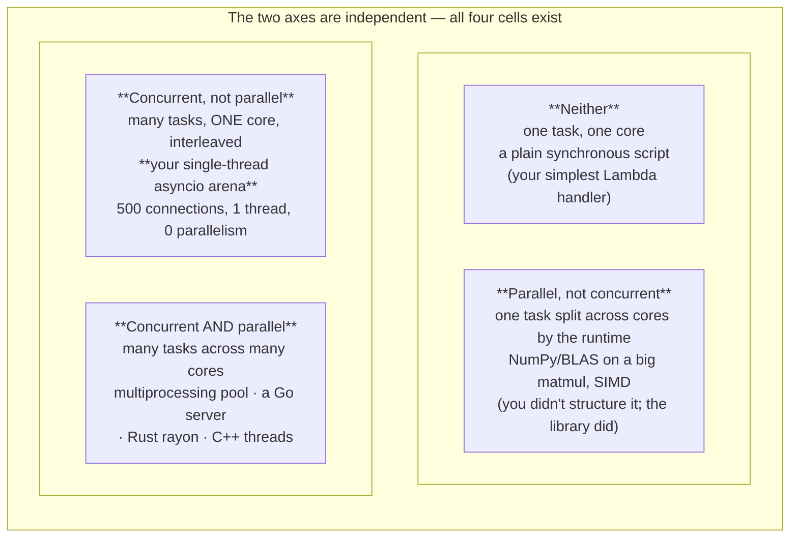
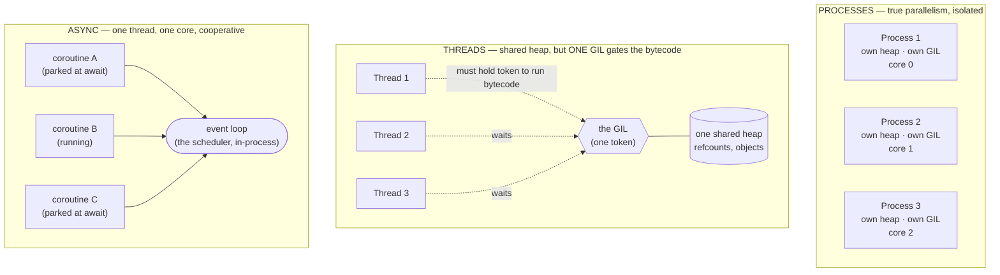
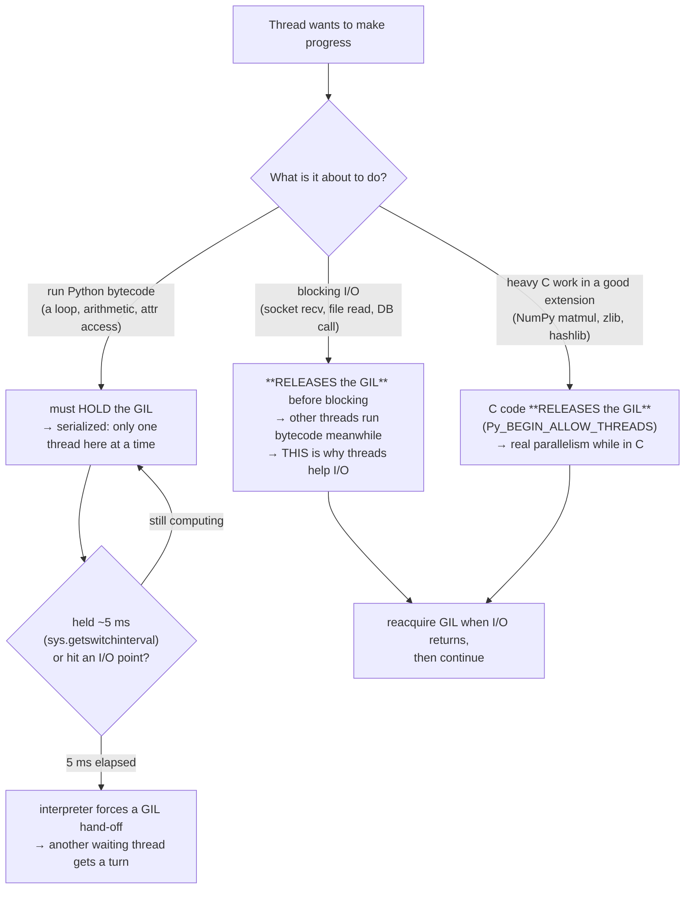
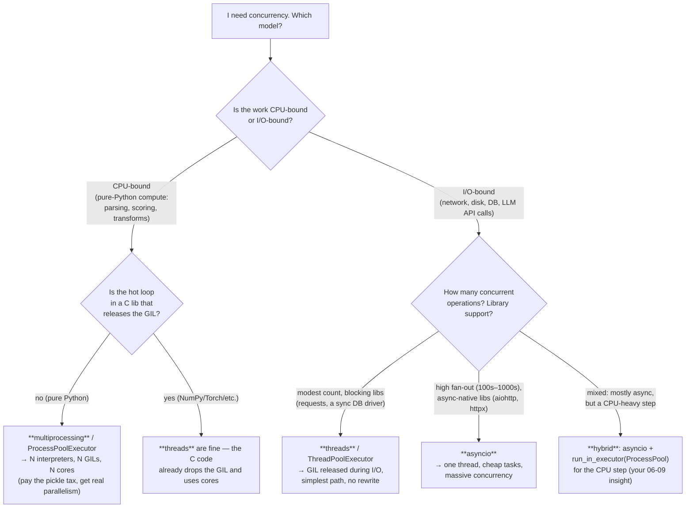

# M01 · Ch3 · §1 — Concurrency vs. Parallelism, and the Three Models: Processes, Threads, Async (and Why the GIL Sits in the Middle)

> **Module:** How Computers & Operating Systems Work
> **Chapter:** Processes, Threads & Concurrency
> **Section:** The two questions people fuse into one word — *are these things composed, or are they running at the same instant?* —
> and the three execution models that answer them differently: **processes**, **threads**, and **async**. The centrepiece is the
> **GIL**: why it exists (it's the bill for §2's refcounting), what it actually locks, the asymmetry that makes it harmless for I/O
> and fatal for CPU-bound threads, and how **free-threading** (PEP 703) is now paying it off.
> **Status:** 🔵 **DRAFT — prepared 2026-06-16.** Body written to your level: it does *not* re-teach async/await (you built that model
> in Ch1 §2) or the GIL-exists-because-of-refcounting keystone (Ch2 §2) — it **cashes them in** and pushes one layer past. §11
> (Applied) is a placeholder to fill from our Q&A. We Q&A, then you say *finalize*.

**Estimated study time:** 2–3 hours including reflection.
**Prerequisites — this section is built on three things you already own:**
- **Ch1 §2 (the call stack):** you worked out that *"one thread = one instruction stream"* (not "one stack"), that `await` is **not**
  concurrency (two sequential `await`s are just blocking calls; concurrency needs `gather`/`create_task`), and the async model itself —
  **one live native stack + N parked heap continuations the event loop swaps** (green threads); coroutine = single-use frame, Task =
  reusable result box. This section sits one level up from that.
- **Ch2 §2 (garbage collection):** the keystone — **refcounting is *why* the GIL exists**, because `ob_refcnt++`/`--` is not atomic.
  This section is where that keystone earns its keep. Also the PEP 703/683 endgame (immortal objects, biased refcounting) you saw there.
- **Ch1 §3 (the multicore mandate):** the clock wall → more cores not faster cores → "you must go parallel to use the machine," and the
  private-vs-shared cache topology (MESI, false sharing). The GIL is the software reason your Python *doesn't* cash that mandate in.

---

## Why this section exists (for *you*)

You already write concurrent code that works — `asyncio` in the arena, retries and idempotency across machines, the framework-less
pipeline. You reason about the GIL fluently. So this section is not here to teach you what a thread is. It's here to **make precise three
distinctions you currently hold as intuitions**, because the imprecision is exactly what produces the bugs and the wasted hardware:

1. **Concurrency ≠ parallelism, and they are *orthogonal axes*, not points on a line.** Most engineers collapse them into "doing more than
   one thing at once." Keeping them apart is what lets you say, in one breath, *why your single-threaded `asyncio` arena handles 500
   simultaneous connections (massive concurrency, zero parallelism) while a `ThreadPoolExecutor` doing CPU math uses one core (some
   concurrency, zero parallelism — the GIL).* Same machine, opposite reasons.
2. **The GIL is not "Python is slow" hand-waving — it's a specific lock with a specific scope, and the scope is the whole game.** You know
   it serializes. This section pins down *what it locks* (the bytecode interpreter, per-interpreter), *at what granularity* it lets go (a
   ~5 ms switch interval, **and** every blocking I/O call, **and** inside well-written C extensions), and therefore the one rule that
   predicts every "why didn't threading speed this up / why *did* it" outcome you'll ever hit.
3. **The decision — processes vs threads vs async — falls out of one question, and you can stop guessing.** *Is the work CPU-bound or
   I/O-bound?* answers it almost completely. You half-know this (the `run_in_executor(process_pool)` hybrid from your 06-09 reading was
   exactly right). This section gives you the full decision surface and the cost model under each box, so you choose deliberately, not by
   reflex.

**The framing to carry** (the physics lens again, since it keeps paying off). Think of it as **multiplexing**. A single CPU core running
ten "simultaneous" tasks is **time-division multiplexing** — one resource, sliced finely enough in time that all ten *appear* live, but at
every instant exactly one is executing. Ten cores running ten tasks is **space-division multiplexing** — genuinely parallel, ten resources
lit at once. *Concurrency is the time-multiplexing question* ("is the work structured so it *can* be interleaved?"); *parallelism is the
space question* ("do we have the physical units to run pieces at the same instant?"). The GIL is a contention limiter that forces the
Python-bytecode resource to stay **time-multiplexed even when space is available** — your eight cores sit dark not because the work can't be
split, but because a lock says only one may touch the interpreter at a time. Hold that picture; every box below is one cell of it.

---

## 1. Two different questions wearing one word

Rob Pike's one-liner is the cleanest definition in the field, and it's worth memorising verbatim:

> **Concurrency is about *dealing with* many things at once. Parallelism is about *doing* many things at once.**
> Concurrency is the **composition** of independently-executing tasks (a *structure* — a way of writing the program). Parallelism is the
> **simultaneous execution** of computations (an *execution property* — a thing the hardware does).

The trap is treating them as more-vs-less of the same quantity. They are **independent axes**:

- **Concurrency** is about the *program's structure*: have you broken the work into tasks that can make progress independently, in
  overlapping time windows, without each blocking the others? This is a property of your *code*. A single core can run highly concurrent
  code.
- **Parallelism** is about the *machine's execution*: are two or more pieces literally executing **in the same clock cycle**, on different
  cores/units? This is a property of the *hardware + runtime*. It requires multiple physical execution resources.

The 2×2 makes the independence concrete — and every cell is a real system you've touched:

<!-- DIAGRAM:START -->


<details>
<summary>Diagram source (Mermaid)</summary>



</details>
<!-- DIAGRAM:END -->

Two cells deserve a beat, because they're the ones that break the "it's all one slider" intuition:

- **Concurrent but not parallel** (bottom-left) is your arena under `asyncio`. One OS thread, one core, *zero* parallelism — and yet it
  juggles hundreds of in-flight WebSocket turns. The concurrency is real and valuable (nothing blocks waiting on a slow LLM call); the
  parallelism is zero. This is the cell people refuse to believe is useful until they've shipped it.
- **Parallel but not concurrent** (top-right) is a single `np.matmul` that BLAS fans across eight cores. *You* wrote one conceptual task —
  "multiply these matrices." You didn't structure any concurrency; the library found data-parallelism *inside* your one task and lit up the
  cores. The parallelism is real; the concurrency (in *your* code) is nil.

> **Why this matters for the rest of the section:** the GIL attacks exactly one cell. It does **not** stop you from being concurrent
> (bottom-left thrives). It stops *Python bytecode* from being parallel (it blocks the bottom-right cell *for pure-Python CPU work*). Pin
> the two axes apart now and the GIL stops being mysterious: it's a lock on the *parallel* axis that leaves the *concurrent* axis untouched.

---

## 2. The three models — and what each one actually costs

"Run things concurrently" has three implementations in the Python world, and they differ along axes that matter operationally: what the
*unit* of execution is, who *schedules* it, how much it *costs* to create and switch, how *isolated* the units are, and — the punchline —
**whether it can use more than one core**. Here is the whole comparison on one page; the rest of the section is just the consequences.

| | **Processes** (`multiprocessing`) | **Threads** (`threading`) | **Async** (`asyncio`) |
|---|---|---|---|
| **Unit** | OS process — own address space | OS thread — shared address space | coroutine — a parked frame on the heap (Ch1 §2) |
| **Scheduled by** | the OS kernel (preemptive) | the OS kernel (preemptive) | **the event loop, in your process** (cooperative) |
| **Memory model** | **isolated** — separate heaps; share via IPC/pickle | **shared** — one heap, all threads see it | **shared** — one thread, so trivially one heap |
| **Switch cost** | high (context switch + cache/TLB flush) | medium (kernel context switch) | **tiny** (a function return + loop bookkeeping) |
| **Create cost** | high (`fork`/spawn, new interpreter) | medium (~MB stack each) | **negligible** (an object) |
| **How many fit** | ~one per core, sensibly | hundreds–low thousands | **hundreds of thousands** |
| **Uses many cores?** | **YES — true parallelism** | **NO for Python bytecode (the GIL)** | **NO — one thread by design** |
| **Preemption** | yes — OS can interrupt anywhere | yes — OS can interrupt anywhere | **no — only at `await`** (cooperative) |
| **Failure blast radius** | one process dies, others fine | a crash/segfault can take the whole process | one bad `await`/exception in the loop |
| **Best for** | **CPU-bound** Python work | **I/O-bound** + blocking C calls that release the GIL | **I/O-bound at high fan-out** |

<!-- DIAGRAM:START -->


<details>
<summary>Diagram source (Mermaid)</summary>



</details>
<!-- DIAGRAM:END -->

Three things to read off this table, because they're the load-bearing facts:

1. **Processes are the only box with "YES" under parallelism.** Each process has its *own* interpreter and therefore its *own* GIL — so N
   processes genuinely run N streams of Python bytecode on N cores. The price is isolation: separate heaps mean you can't just share an
   object, you **pickle it across a pipe** (and unpicklable things — open sockets, lambdas, some closures — simply can't cross). This is the
   tax for true parallelism in CPython, and it's why `multiprocessing` feels heavier than it "should."
2. **Threads share everything and parallelize nothing (for Python).** All threads live in one address space — they see the same objects,
   the same module globals, the same heap. That makes communication free (no pickling) and **dangerous** (two threads mutating the same
   dict is a data race). And despite the shared address space and real OS threads, **two Python threads cannot execute bytecode at the same
   instant** — §3 is the whole reason.
3. **Async is a different category entirely — it's not "lighter threads," it's cooperative single-threaded scheduling.** There is one OS
   thread, one core, and the "scheduler" is the event loop *running inside your own process* (Ch1 §2: the loop swaps parked continuations).
   Nothing is preempted; a coroutine runs until it voluntarily yields at an `await`. That's the source of both its superpower (a switch
   costs almost nothing → hundreds of thousands of in-flight tasks) and its sharpest footgun (§4: one un-yielding call freezes *everyone*).

---

## 3. The GIL — the lock in the middle, finally pinned down

You already know the headline (Ch2 §2): **the GIL exists because CPython's reference counting is not thread-safe.** This is where we make
that exact and trace every consequence from it.

**Why it exists (the keystone, cashed in).** Every Python object carries a refcount (`ob_refcnt`); §2 showed it's incremented and
decremented constantly — *just reading* a variable touches refcounts. The increment is, at the machine level, a read-modify-write:
`load → add 1 → store`. On two cores with no lock, the classic lost-update race corrupts it: both read 5, both write 6, and now an object
with two references has a count of 6 instead of 7 → it gets freed one decref too early → **use-after-free, the worst class of memory bug.**
CPython's designers had two choices: (a) make *every* refcount operation atomic (an atomic add is far more expensive than a plain add, and
refcounting is *everywhere* — this would tax every single-threaded program heavily), or (b) **one big lock around the interpreter** so only
one thread ever touches refcounts at a time. They chose (b). The GIL is that lock. **It is the price of making the common case — one thread —
fast, paid by the rare case — many CPU threads — being unable to parallelize.** (Hold that trade-off; §5 is the story of finally getting
both.)

**What it actually locks — and what it does *not*.** The GIL is a single mutex (per *interpreter*) that a thread must **hold to execute
Python bytecode**. Not "to run code" — to run *Python bytecode in this interpreter*. That scoping is everything:

<!-- DIAGRAM:START -->


<details>
<summary>Diagram source (Mermaid)</summary>



</details>
<!-- DIAGRAM:END -->

- **Pure-Python CPU work holds the GIL.** A tight Python loop summing numbers holds the lock the whole time, handing it off only when the
  **switch interval** (default ~5 ms — `sys.getswitchinterval()`) forces a release so another thread can have a turn. Two such loops on two
  threads therefore **take turns on one core** — total time ≈ the same as running them one after another, plus switching overhead. **This is
  why threading does not speed up CPU-bound Python.** It's not that threads are fake; it's that the bytecode resource they need is behind a
  single token.
- **Blocking I/O releases the GIL.** Before a thread blocks on `socket.recv`, `file.read`, a DB round-trip — anything where the kernel will
  make it wait — CPython **drops the GIL**, lets other threads run, and reacquires it when the I/O completes. So while thread A waits 50 ms
  for a network reply, threads B and C run bytecode. **This is why threading *does* speed up I/O-bound work** even with the GIL: the lock is
  free exactly when you're not using the CPU anyway. The GIL was never the bottleneck for I/O; the network was.
- **Good C extensions release the GIL around heavy work.** NumPy, SciPy, `hashlib`, `zlib`, `lxml`, PyTorch — their hot loops are C/Fortran
  that explicitly drop the GIL (`Py_BEGIN_ALLOW_THREADS`) during the number-crunching, because that code touches no Python objects and needs
  no refcount protection. So a `ThreadPoolExecutor` *can* give you real multicore speedup — **but only for the time spent inside the C
  code**, not for the Python glue around it. This is the subtle box most people get wrong: "threading never parallelizes" is false; "threading
  never parallelizes *Python bytecode*" is the precise truth.

> **The one rule that predicts every outcome:** *threads in CPython parallelize only the work that runs with the GIL released* — i.e.
> blocking I/O and GIL-releasing C extensions. Pure-Python CPU work is serialized, full stop. Memorise that and you never again have to guess
> whether `threading` will help: ask "where does this spend its time, and does *that* hold the GIL?"

**A subtlety worth holding (ties back to Ch1 §3).** Even the ~5 ms hand-off isn't free, and on multicore it was historically *worse* than
you'd expect: pre-3.2 Python had a "GIL battle" where a CPU-bound thread and an I/O thread on different cores would thrash the lock,
*degrading* throughput below single-threaded. The modern GIL (Antoine Pitrou's rewrite) fixed the worst of it, but the lesson stands —
**a lock is a serialization point, and serialization points don't scale.** It's the software echo of the cache-coherence cost from Ch1 §3:
shared mutable state under contention is where parallelism goes to die, whether the contended thing is a cache line (MESI) or the
interpreter lock.

---

## 4. The decision that falls out: CPU-bound vs. I/O-bound

Here's the payoff. The agonising "processes or threads or async?" question is *mostly answered by one prior question* — **where does the
work spend its time?** — because §3 told you exactly what the GIL does in each case.

<!-- DIAGRAM:START -->


<details>
<summary>Diagram source (Mermaid)</summary>



</details>
<!-- DIAGRAM:END -->

Walk the branches with your own systems in mind:

- **CPU-bound, pure Python → processes.** Scoring a batch, parsing a million rows, a heavy transform that's all Python. Threads will *not*
  help (GIL); async will *not* help (it's one thread — async is for *waiting*, and CPU work never waits). You need separate interpreters:
  `ProcessPoolExecutor`. Accept the pickle tax and the fork cost; in return you get all the cores. *Cross-check from Ch2 §2:* this is the
  same `maxtasksperchild`/process-isolation machinery you reached for in the fab leak — processes are your hammer for both "use all cores"
  and "outlive a leak."
- **CPU-bound but the work is in NumPy/Torch → threads are fine, or just let the library parallelize.** The heavy lifting already runs with
  the GIL released and across cores; wrapping it in processes adds pickle overhead for no gain. (And your *real* CPU-bound AI work — model
  inference — is on the GPU, a different parallelism story entirely, Ch1 §3.)
- **I/O-bound, modest fan-out, blocking libraries → threads.** A few dozen concurrent HTTP calls with `requests`, or a synchronous DB
  driver. Threads release the GIL on each blocking call, so you get real overlap *and* you don't have to rewrite anything async. Simplest
  thing that works.
- **I/O-bound, high fan-out, async-native libraries → asyncio.** **This is the arena.** Hundreds–thousands of concurrent connections/turns,
  each mostly *waiting* on an LLM API or a socket. Threads would cost ~MB of stack each and bog down in context switches at that count;
  coroutines cost an object each. One thread, one core, enormous concurrency — exactly the bottom-left cell of §1.

**The hybrid is where your 06-09 insight lands precisely.** An `asyncio` service that mostly waits on I/O but has one CPU-heavy step (say,
a synchronous re-rank or a big pure-Python transform) has a problem: that step, run inline, **blocks the event loop** — and because async is
cooperative (§2, no preemption), blocking the loop freezes *every* in-flight coroutine, not just the one doing the work. The fix is to push
the CPU step *off* the loop with `loop.run_in_executor(process_pool, fn, ...)`: async owns the waiting, a **process** pool owns the
CPU-bound compute (threads wouldn't help — GIL). You re-derived this exact pattern from first principles in the reading session; here's the
mechanism under it.

> **The async footgun, stated sharply (your arena audit, flagged twice):** in cooperative scheduling, *the loop only switches at `await`.*
> So (a) **two sequential `await`s are not concurrent** — they're blocking calls in disguise (your Ch1 §2 realisation); to overlap them you
> need `asyncio.gather(...)`/`create_task`. And (b) **any call that doesn't `await` — a synchronous DB driver, a `time.sleep`, a tight
> Python loop, a blocking `boto3` call — stalls the entire event loop**, tanking p99 latency for *every* user while it runs. The audit to do:
> scan the arena's turn-handling for (1) serial `await`s that should be a single `gather`, and (2) any blocking call sitting directly on the
> loop that should be `await`ed (async client) or shoved into an executor.

---

## 5. Free-threading: the GIL keystone, finally paid off (PEP 703)

Everything above assumes the GIL. As of **Python 3.13**, that assumption is becoming optional — and the story is a direct continuation of
the PEP 703/683 thread you met in Ch2 §2, so it closes a loop rather than opening a new topic.

The problem was never "remove the lock" — it was **"remove the lock without breaking the refcounting that needed it"** (§3). A naïve removal
gives you the use-after-free races we started with. PEP 703's free-threaded build solves it on several fronts at once, and the two you
already saw in §2 are the load-bearing ones:

- **Immortal objects (PEP 683):** objects that live forever — `None`, `True`, `False`, small ints, interned strings, type objects — are
  marked with a sentinel refcount that is simply **never incremented or decremented**. Since the hottest, most-shared objects no longer
  touch their refcounts at all, the most-contended race just *disappears*. (You saw this in §2 framed as "no-GIL is a GC engineering
  problem.")
- **Biased reference counting:** split each refcount into a *local* count (owned by the object's creating thread, updated with cheap
  non-atomic ops — the common case) and a *shared* count (other threads, updated atomically). Most objects are only ever touched by their
  creator, so most refcount traffic stays cheap; only genuinely cross-thread sharing pays the atomic price. Plus per-object locks and a
  thread-safe allocator (`mimalloc`) for the container internals.

What it changes, and the honest caveats (the 3.14 free-threading HOWTO is candid about these):

- **It changes:** CPU-bound Python threads can *finally* run on multiple cores. The bottom-right cell of §1 opens up for pure Python — the
  `threading` row in §2's table flips from "NO" to "YES." The multicore mandate from Ch1 §3 becomes cashable without `multiprocessing`'s
  pickle tax.
- **The caveats (why it's not the default yet):** single-threaded code runs **somewhat slower** in the free-threaded build (biased
  refcounting and lost specialization aren't free — the exact trade-off the GIL was *avoiding*), C extensions must be rebuilt and audited for
  thread-safety (the ecosystem dependency that's blocked every prior attempt), and your own threaded Python is now exposed to **real data
  races** the GIL used to paper over — the shared-mutable-dict bug that "happened to work" under the GIL's coarse serialization can now
  corrupt. Free-threading doesn't make concurrency safe; it makes it *your* job, the way it always was in C, Java, Go.

> **The keeper:** the GIL was a *correctness* device (protect refcounts) that doubled as a *simplicity* device (single-threaded code never
> worries about races) at the cost of *parallelism* (no multicore Python bytecode). Free-threading keeps the correctness, surrenders some of
> the simplicity (and a little single-thread speed), and buys back the parallelism. It's the same conservation argument as everywhere in this
> course — you don't remove a constraint, you *move the cost*. Watch this land over the next few releases; for now, **assume the GIL in
> production** and let it decide your model per §4.

---

## 6. Where this bites *you* — the practitioner's playbook

Ranked, concrete, mapped to the sections above.

1. **Before reaching for a model, classify the work (§4).** One question — *CPU-bound or I/O-bound?* — eliminates two of the three options
   immediately. The most common waste is throwing `threading` at CPU-bound Python (no speedup, GIL) or `multiprocessing` at I/O-bound work
   (pickle tax for nothing). Don't guess; classify.
2. **Audit the arena for the two async footguns (§4).** (a) Serial `await`s that should be `asyncio.gather` — these silently serialize work
   you *think* is overlapping and inflate turn latency. (b) Any blocking call on the event loop (sync DB/`boto3`/`time.sleep`/heavy Python) —
   these freeze *all* connections, not one. This is your flagged audit; it's a latency win hiding in plain sight, and it relates directly to
   the cold-start/leaderboard latency concern in your `temp/` plan.
3. **"Threading didn't speed it up" → check where the time goes (§3).** If the hot path is pure Python, that's expected (GIL); move to
   processes. If it's in NumPy/Torch and *still* didn't speed up, suspect the C lib isn't releasing the GIL on *your* path, or you're
   actually memory-bandwidth-bound (Ch1 §3), not compute-bound.
4. **Shared mutable state across threads is a bug waiting for a scheduler (§3, §5).** The GIL makes single bytecode ops atomic but does
   **not** make *your* `read-modify-write` sequences atomic (e.g. `counter += 1` is several bytecodes — it can be interrupted mid-sequence).
   Use `queue.Queue`, locks, or — better — *don't share mutable state*; pass immutable messages (your §10d pipeline instinct from Ch2). Under
   free-threading (§5) this stops being theoretical.
5. **Reach for processes for both parallelism *and* isolation (§4, Ch2 §2).** The same `ProcessPoolExecutor`/`maxtasksperchild` tool gives
   you multicore CPU throughput *and* the leak-containment you used in the fab. One pattern, two payoffs.
6. **In serverless, remember each invocation is its own everything (Ch1 §1 callback).** A Lambda is a single process; concurrency across
   *requests* is the platform spinning up more *instances* (parallelism via processes-on-different-machines), not threads in one. Your
   in-process model choice (§4) is about concurrency *within* one invocation — and CPU-bound work there still wants a process pool or a
   compiled lib, not threads.

---

## 7. Check your understanding

Jot a one-line answer to each before our Q&A — and where I ask for a hypothesis, *commit to one* (that's how you learn fastest; we'll
re-rank it against the dominant mechanism together).

1. State the difference between **concurrency** and **parallelism** in one sentence each, then place each of these in the §1 2×2 and justify
   it: (a) your single-thread `asyncio` arena serving 500 connections; (b) `np.matmul` on a big array; (c) a `ProcessPoolExecutor` running
   pure-Python scoring; (d) a plain synchronous script.
2. **Why does the GIL exist?** Trace it from a specific memory-corruption scenario (use a refcount) to the design choice. Then: name the
   *cheaper-for-single-thread* property they were protecting by choosing one big lock over per-object atomics.
3. You run two functions on two threads. Predict the speedup vs. running them sequentially, for each: (a) both are tight pure-Python loops;
   (b) both are `requests.get` to a slow API; (c) both are `np.linalg.svd` on big matrices. Give the *mechanism* for each prediction, not
   just faster/slower.
4. A colleague says "Python threads are useless because of the GIL." Give the precise correction — the one rule from §3 that says exactly
   *when* threads parallelize and when they don't.
5. (Hypothesis) Your `asyncio` service' p99 latency spikes whenever a particular endpoint is hit, and *all* users feel it, not just callers
   of that endpoint. Propose the most likely cause in terms of cooperative scheduling, and the fix. (Then: how would you confirm it before
   changing code?)
6. You have a pipeline: fetch 200 URLs (I/O), then run a pure-Python parse+score on each result (CPU). Design the concurrency: which model
   for which phase, and why each *other* model is wrong for that phase. Where does `run_in_executor` go and which pool type does it wrap?
7. (Synthesis) Under **free-threading** (PEP 703), the `threading` row in §2's table flips to "uses many cores: YES." Name two things that
   get *worse* or *harder* as a result, and connect one of them back to the refcounting keystone from §2.

---

## 8. Optional: get your hands dirty (15–20 min)

The machine will *show* you the GIL. Run these and watch wall-clock time; the surprises are the point.

```python
import time, threading, multiprocessing
from concurrent.futures import ThreadPoolExecutor, ProcessPoolExecutor

def cpu_bound(n=40_000_000):          # pure-Python CPU work — holds the GIL
    x = 0
    for _ in range(n):
        x += 1
    return x

def timed(label, fn):
    t = time.perf_counter()
    fn()
    print(f"{label:28s} {time.perf_counter() - t:5.2f} s")

if __name__ == "__main__":            # the guard matters for multiprocessing (spawn re-imports)
    # (a) Baseline: two CPU tasks, one after another.
    timed("sequential x2", lambda: [cpu_bound(), cpu_bound()])

    # (b) Two THREADS. Prediction? With the GIL on pure-Python CPU work,
    #     this is ~the same as (a) (they take turns on one core) — sometimes WORSE (switch overhead).
    timed("2 threads (CPU-bound)",
          lambda: [t.join() for t in
                   [threading.Thread(target=cpu_bound) for _ in range(2)]
                   if not t.start()])

    # (c) Two PROCESSES. Now two interpreters, two GILs, two cores → ~2x faster than (a).
    with ProcessPoolExecutor(max_workers=2) as ex:
        timed("2 processes (CPU-bound)", lambda: list(ex.map(cpu_bound, [40_000_000]*2)))
```

```python
# (d) Now make the work I/O-bound (a sleep RELEASES the GIL, like a blocking syscall would).
#     Threads should now give ~2x — the GIL is free exactly while you wait.
import time, threading
def io_bound():
    time.sleep(1.0)                   # stands in for a network/DB call; releases the GIL
t = time.perf_counter()
ts = [threading.Thread(target=io_bound) for _ in range(8)]
[x.start() for x in ts]; [x.join() for x in ts]
print(f"8 threads, 1s sleep each: {time.perf_counter()-t:.2f} s  # ~1s, not 8s — overlap during the wait")
```

```bash
# (e) The two knobs you can actually see.
python -c "import sys; print('switch interval (s):', sys.getswitchinterval())"   # ~0.005
# Is your interpreter free-threaded (3.13+)? (returns False on a normal build)
python -c "import sys; print('GIL disabled build:', getattr(sys, '_is_gil_enabled', lambda: True)() is False)"
```

Bring the numbers to our chat — especially (b) vs (c) (the GIL made visible) and whether (b) came out *slower* than (a) on your machine
(the switch-overhead tell).

---

## 9. References (optional, for depth)

*(All links verified live 2026-06-16.)*

- **[Rob Pike — "Concurrency is not Parallelism" (Go blog summary + slides)](https://go.dev/blog/waza-talk)** — the §1 distinction at the
  source. Short, and the composition-vs-simultaneity framing is the cleanest in the field. (Slides linked from the post; the talk is the
  canonical reference for the two-axes idea.)
- **[Python wiki — Global Interpreter Lock](https://wiki.python.org/moin/GlobalInterpreterLock)** — the project's own account of *why* the
  GIL exists (CPython memory management isn't thread-safe), what runs outside it (I/O, NumPy), and why removing it is hard (the C-extension
  compatibility constraint). Pairs exactly with §3.
- **[Python docs — `threading`](https://docs.python.org/3/library/threading.html)**, **[`multiprocessing`](https://docs.python.org/3/library/multiprocessing.html)**,
  **[`asyncio`](https://docs.python.org/3/library/asyncio.html)**, and **[`concurrent.futures`](https://docs.python.org/3/library/concurrent.futures.html)**
  — the three models of §2 from the source. `concurrent.futures` is the unified `ThreadPoolExecutor`/`ProcessPoolExecutor` interface behind
  the §4 decision and the §8 exercise; the `asyncio` docs cover `gather`, `create_task`, and `run_in_executor` (the §4 hybrid).
- **[PEP 703 — Making the GIL Optional in CPython](https://peps.python.org/pep-0703/)** — the §5 free-threading design: biased reference
  counting, immortal objects, per-object locks, the single-thread-slowdown trade-off. Read it as the *resolution* of the §3 keystone —
  "keep the correctness, move the cost."
- **[Python docs — Free-threading HOWTO](https://docs.python.org/3/howto/free-threading-python.html)** — the practical 3.13+ companion to
  PEP 703: how to get a free-threaded build, how to detect one, and the honest list of current limitations (the §5 caveats).

---

### What's next
🔵 **DRAFT prepared 2026-06-16.** This section deliberately *builds on* rather than repeats Ch1 §2 (your async-stack model) and Ch2 §2
(refcounting → GIL); the new layer is the two-axes precision (§1), the per-case GIL scope (§3), the one decision rule (§4), and the
free-threading payoff (§5). After our Q&A I'll write **§11 (Applied)** from whatever you drive it into — likely the arena async audit and
your `run_in_executor` pattern — and flip `courses/plan.md` to ✅.

Natural follow-ons inside Ch3 (your pick at finalize):
- **Ch3 §2 — Async deeply / "your asyncio usage explained"** (the event loop, `gather` vs `create_task` vs `TaskGroup`, structured
  concurrency, cancellation, the arena audit made concrete — the obvious next step if §1's footguns grabbed you).
- **Ch3 §3 — Synchronization & races** (locks, queues, deadlock, the data races free-threading exposes — §5's "now it's your job").
- Or rotate scope per the interleave: **M04 Ch1 §2** (data-flow tracing, SWE) or **M12 Ch2 §2** (video models, AI).
