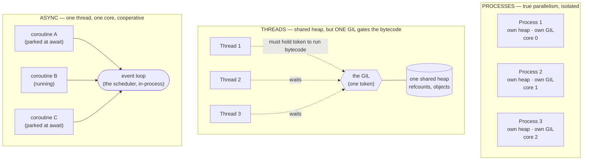
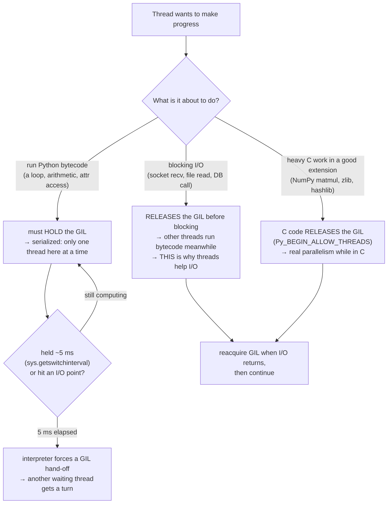
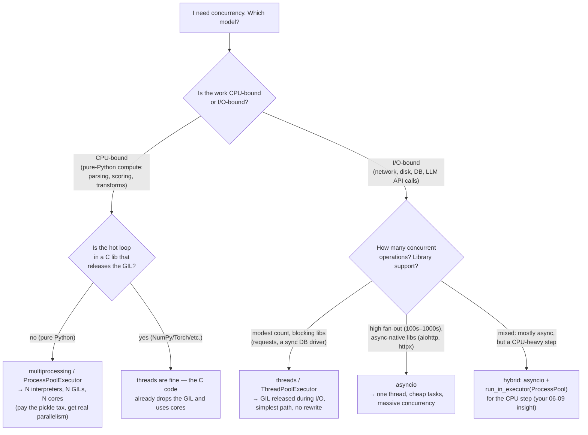

# M01 · Ch3 · §1 — Concurrency vs. Parallelism, and the Three Models: Processes, Threads, Async (and Why the GIL Sits in the Middle)

> **Module:** How Computers & Operating Systems Work
> **Chapter:** Processes, Threads & Concurrency
> **Section:** The two questions people fuse into one word — *are these things composed, or are they running at the same instant?* —
> and the three execution models that answer them differently: **processes**, **threads**, and **async**. The centrepiece is the
> **GIL (Global Interpreter Lock)**: why it exists (it's the bill for §2's refcounting), what it actually locks, the asymmetry that makes it harmless for I/O
> and fatal for CPU-bound threads, and how **free-threading** (PEP 703) is now paying it off.
> **Status:** ✅ **finalized 2026-06-16.** The body held at your level — you absorbed §1–§4 and spent the whole session **applying** them to
> an LLM-eval pipeline. §9 (Applied) captures the three threads you drove: **(9a)** "batch" is three mechanisms wearing one word
> (client fan-out / Batch API / continuous batching), and the `openai` chat "batch" you use *is* §1–§4 — I/O-bound async fan-out, ceiling =
> the rate limit not the GIL; **(9b)** the `asyncio.gather` failure mode — your scheduler model was right, but you fused two opposite "hangs":
> a task **parked on I/O** doesn't hang the thread (only `gather`'s *join* waits; results recoverable), vs a **blocking call** that freezes the
> loop (§4 footgun) — and the keeper that `return_exceptions` handles *errors* while **only a timeout handles silence**; **(9c)** parse/calc —
> the lever is *push the loop into C*, not thread-vs-process, and *"C library" ≠ "GIL released"* (numpy releases, JSON holds). Clean
> finalize at the natural stop.

**Estimated study time:** 2–3 hours including reflection.
**Prerequisites — this section is built on three things you already own:**
- **Ch1 §2 (the call stack):** you worked out that *"one thread = one instruction stream"* (not "one stack"), that `await` is **not**
  concurrency (two sequential `await`s are just blocking calls; concurrency needs `gather`/`create_task`), and the async model itself —
  **one live native stack + N parked heap continuations the event loop swaps** (green threads); coroutine = single-use frame, Task =
  reusable result box. This section sits one level up from that.
- **Ch2 §2 (garbage collection):** the keystone — **refcounting is *why* the GIL exists**, because `ob_refcnt++`/`--` is not atomic.
  This section is where that keystone earns its keep. Also the PEP 703/683 endgame (immortal objects, biased refcounting) you saw there.
- **Ch1 §3 (the multicore mandate):** the clock wall → more cores not faster cores → "you must go parallel to use the machine," and the
  private-vs-shared cache topology (MESI, false sharing). The GIL is the software reason your Python *doesn't* cash that mandate in.

---

## Why this section exists (for *you*)

You already write concurrent code that works — `asyncio` in the arena, retries and idempotency across machines, the framework-less
pipeline. You reason about the GIL fluently. So this section is not here to teach you what a thread is. It's here to **make precise three
distinctions you currently hold as intuitions**, because the imprecision is exactly what produces the bugs and the wasted hardware:

1. **Concurrency ≠ parallelism, and they are *orthogonal axes*, not points on a line.** Most engineers collapse them into "doing more than
   one thing at once." Keeping them apart is what lets you say, in one breath, *why your single-threaded `asyncio` arena handles 500
   simultaneous connections (massive concurrency, zero parallelism) while a `ThreadPoolExecutor` doing CPU math uses one core (some
   concurrency, zero parallelism — the GIL).* Same machine, opposite reasons.
2. **The GIL is not "Python is slow" hand-waving — it's a specific lock with a specific scope, and the scope is the whole game.** You know
   it serializes. This section pins down *what it locks* (the bytecode interpreter, per-interpreter), *at what granularity* it lets go (a
   ~5 ms switch interval, **and** every blocking I/O call, **and** inside well-written C extensions), and therefore the one rule that
   predicts every "why didn't threading speed this up / why *did* it" outcome you'll ever hit.
3. **The decision — processes vs threads vs async — falls out of one question, and you can stop guessing.** *Is the work CPU-bound or
   I/O-bound?* answers it almost completely. You half-know this (the `run_in_executor(process_pool)` hybrid from your 06-09 reading was
   exactly right). This section gives you the full decision surface and the cost model under each box, so you choose deliberately, not by
   reflex.

**The framing to carry** (the physics lens again, since it keeps paying off). Think of it as **multiplexing**. A single CPU core running
ten "simultaneous" tasks is **time-division multiplexing** — one resource, sliced finely enough in time that all ten *appear* live, but at
every instant exactly one is executing. Ten cores running ten tasks is **space-division multiplexing** — genuinely parallel, ten resources
lit at once. *Concurrency is the time-multiplexing question* ("is the work structured so it *can* be interleaved?"); *parallelism is the
space question* ("do we have the physical units to run pieces at the same instant?"). The GIL is a contention limiter that forces the
Python-bytecode resource to stay **time-multiplexed even when space is available** — your eight cores sit dark not because the work can't be
split, but because a lock says only one may touch the interpreter at a time. Hold that picture; every box below is one cell of it.

---

## 1. Two different questions wearing one word

<details>
<summary><b>Vocabulary for this section</b> — the two axes, and every model and library named in the 2×2 (click to expand)</summary>

**Abbreviations**

| Short | Stands for | Meaning |
|---|---|---|
| **GIL** | global interpreter lock | a lock inside CPython (the interpreter, **not** the OS) that lets only one thread execute Python bytecode at a time |
| **CPU** | central processing unit | the general-purpose processor; a **core** is one independent execution unit inside it |
| **SIMD** | single instruction, multiple data | one CPU instruction applied to several data values at once — parallelism inside a single instruction stream |
| **BLAS** | basic linear algebra subprograms | the standard low-level matrix/vector library that NumPy calls underneath; its implementations split one operation across cores |
| **OS** | operating system | the software that owns the hardware and schedules what runs on the CPU |

**Terms**

| Term | Definition |
|---|---|
| **Concurrency** | a property of your *program's structure*: the work is broken into tasks that can make progress in overlapping time windows without blocking each other |
| **Parallelism** | a property of the *execution*: two or more pieces are literally executing in the same clock cycle on different hardware units |
| **Composition (of tasks)** | writing the program as independently-executing pieces that the runtime interleaves — the structural side of concurrency |
| **Task** | one independently-progressing unit of work; here a generic word, not specifically `asyncio.Task` |
| **Execution unit / core** | one piece of hardware that can run an instruction stream; N cores is the hard ceiling on true parallelism |
| **Clock cycle** | one tick of the CPU's clock — the unit in which "at the same instant" is measured |
| **Thread** | one instruction stream inside a process, scheduled by the OS kernel |
| **Process** | a running program with its own private address space; separate processes share no memory by default |
| **Python bytecode** | the low-level instructions CPython compiles your source into and then executes — the resource the GIL gates |
| **`asyncio`** | Python's single-threaded cooperative concurrency library: one thread, one event loop, many parked coroutines |
| **Coroutine** | a function that can suspend itself at an `await` and be resumed later; parked state lives on the heap, not on a native stack |
| **`multiprocessing` pool** | a set of worker *processes*, each with its own interpreter and its own GIL, so Python code really does run on many cores |
| **Data parallelism** | the same operation applied to many data elements at once — what a library finds *inside* one of your tasks (`np.matmul`, SIMD) |
| **`np.matmul`** | NumPy's matrix multiply; it drops into BLAS/C and can use many cores without you writing any concurrency |
| **WebSocket** | a long-lived two-way network connection — the arena's per-user channel, mostly idle and therefore I/O-bound |
| **Synchronous script** | ordinary top-to-bottom code with no task composition: neither concurrent nor parallel |
| **Lambda (AWS)** | a serverless function invocation; each invocation is its own single process |
| **`rayon`** | a Rust library that runs data-parallel work across cores |

</details>

Rob Pike's one-liner is the cleanest definition in the field, and it's worth memorising verbatim:

> **Concurrency is about *dealing with* many things at once. Parallelism is about *doing* many things at once.**
> Concurrency is the **composition** of independently-executing tasks (a *structure* — a way of writing the program). Parallelism is the
> **simultaneous execution** of computations (an *execution property* — a thing the hardware does).

The trap is treating them as more-vs-less of the same quantity. They are **independent axes**:

- **Concurrency** is about the *program's structure*: have you broken the work into tasks that can make progress independently, in
  overlapping time windows, without each blocking the others? This is a property of your *code*. A single core can run highly concurrent
  code.
- **Parallelism** is about the *machine's execution*: are two or more pieces literally executing **in the same clock cycle**, on different
  cores/units? This is a property of the *hardware + runtime*. It requires multiple physical execution resources.

The 2×2 below makes the independence concrete — read the **rows** as *"did you structure concurrency?"* and the **columns** as *"is the
hardware running pieces at the same instant?"* Every cell is a real system you've touched:

|  | **Not parallel** — one execution unit at a time | **Parallel** — many units firing at once |
|---|---|---|
| **Not concurrent** — one task, no composition | **Neither** — a plain synchronous script (your simplest Lambda handler). | **Parallel, not concurrent** *(top-right)* — one task the *runtime* splits across cores: a `np.matmul`/BLAS call, SIMD (Single Instruction, Multiple Data). You wrote one conceptual task; the library found the parallelism. |
| **Concurrent** — many independently-progressing tasks | **Concurrent, not parallel** *(bottom-left)* — many tasks, **one** core, interleaved: **your single-thread `asyncio` arena** — 500 connections, 1 thread, 0 parallelism. | **Concurrent AND parallel** — many tasks across many cores: a `multiprocessing` pool, a Go server, Rust `rayon`, C++ threads. |

Two cells deserve a beat, because they're the ones that break the "it's all one slider" intuition:

- **Concurrent but not parallel** (bottom-left) is your arena under `asyncio`. One OS thread, one core, *zero* parallelism — and yet it
  juggles hundreds of in-flight WebSocket turns. The concurrency is real and valuable (nothing blocks waiting on a slow LLM call); the
  parallelism is zero. This is the cell people refuse to believe is useful until they've shipped it.
- **Parallel but not concurrent** (top-right) is a single `np.matmul` that BLAS (Basic Linear Algebra Subprograms) fans across eight cores. *You* wrote one conceptual task —
  "multiply these matrices." You didn't structure any concurrency; the library found data-parallelism *inside* your one task and lit up the
  cores. The parallelism is real; the concurrency (in *your* code) is nil.

> **Why this matters for the rest of the section:** the GIL attacks exactly one cell. It does **not** stop you from being concurrent
> (bottom-left thrives). It stops *Python bytecode* from being parallel (it blocks the bottom-right cell *for pure-Python CPU work*). Pin
> the two axes apart now and the GIL stops being mysterious: it's a lock on the *parallel* axis that leaves the *concurrent* axis untouched.

---

## 2. The three models — and what each one actually costs

<details>
<summary><b>Vocabulary for this section</b> — the cost-model vocabulary behind the three-column table (click to expand)</summary>

**Abbreviations**

| Short | Stands for | Meaning |
|---|---|---|
| **GIL** | global interpreter lock | CPython's one-thread-at-a-time lock on executing Python bytecode; a CPython construct, not a kernel one |
| **IPC** | inter-process communication | any mechanism (pipe, socket, shared memory, queue) by which isolated processes exchange data |
| **TLB** | translation lookaside buffer | the CPU's cache of virtual→physical address translations; switching address spaces can flush it, which is part of why process switches cost more |
| **OS** | operating system | the software layer that owns the CPU and decides which thread runs next |
| **CPU** | central processing unit | the processor; "CPU-bound" work is work limited by compute rather than waiting |
| **I/O** | input/output | reading or writing something outside the CPU — network, disk, database; "I/O-bound" work is limited by waiting |
| **MB** | megabyte | ~10⁶ bytes; the rough per-thread stack cost quoted in the table |

**Terms**

| Term | Definition |
|---|---|
| **Process** | a running program with its own address space, its own heap, and (in CPython) its own interpreter and its own GIL |
| **Thread** | one instruction stream inside a process; all threads of a process share one address space and one heap |
| **Address space** | the set of memory addresses a process can see; isolation between processes is exactly the fact that these do not overlap |
| **Heap** | the region where objects live; shared between threads of one process, never shared between processes by default |
| **Coroutine** | a suspendable function whose paused state is an object on the heap, resumed by the event loop — the unit of async |
| **Event loop** | the scheduler that lives *inside your own process* and decides which coroutine to resume next; it is not the kernel |
| **Kernel** | the core of the operating system — it schedules processes and threads, and knows nothing about the GIL or your event loop |
| **Preemptive scheduling** | the scheduler can interrupt a running unit at any instruction and switch to another |
| **Cooperative scheduling** | a running unit keeps the CPU until it *voluntarily* yields — in `asyncio`, only at an `await` |
| **Preemption** | being interrupted involuntarily; threads and processes are preempted, coroutines are not |
| **Context switch** | saving one execution unit's registers and state and loading another's — the direct cost of a switch |
| **Switch cost** | the total price of changing what is running, including the context switch plus cache and TLB effects |
| **`fork`** | creating a new process by cloning the current one (the child starts as a copy of the parent) |
| **spawn** | creating a new process by starting a fresh interpreter from scratch and re-importing — slower than `fork`, but safer with threads |
| **Pickle** | Python's object-serialization format; how objects are turned into bytes to cross a process boundary, and why some objects (sockets, lambdas) simply cannot cross |
| **Stack** | the per-thread memory holding call frames; roughly a megabyte each, which is why threads do not scale to hundreds of thousands |
| **Data race** | two flows touching the same memory concurrently with at least one writing, without coordination — the hazard the shared heap creates |
| **Blast radius** | how much of the system a single failure takes down |
| **Segfault** | a memory-access violation that kills the whole process — hence one bad thread can take every other thread with it |
| **CPU-bound** | work whose time is spent computing; it never waits, so more cores help and waiting-based concurrency does not |
| **I/O-bound** | work whose time is spent waiting on the network, disk or a database; overlapping the waits is the whole win |
| **Fan-out** | the number of operations you have in flight at the same time |

</details>

"Run things concurrently" has three implementations in the Python world, and they differ along axes that matter operationally: what the
*unit* of execution is, who *schedules* it, how much it *costs* to create and switch, how *isolated* the units are, and — the punchline —
**whether it can use more than one core**. Here is the whole comparison on one page; the rest of the section is just the consequences.

| | **Processes** (`multiprocessing`) | **Threads** (`threading`) | **Async** (`asyncio`) |
|---|---|---|---|
| **Unit** | OS process — own address space | OS thread — shared address space | coroutine — a parked frame on the heap (Ch1 §2) |
| **Scheduled by** | the OS kernel (preemptive) | the OS kernel (preemptive) | **the event loop, in your process** (cooperative) |
| **Memory model** | **isolated** — separate heaps; share via IPC/pickle | **shared** — one heap, all threads see it | **shared** — one thread, so trivially one heap |
| **Switch cost** | high (context switch + cache/TLB [translation lookaside buffer] flush) | medium (kernel context switch) | **tiny** (a function return + loop bookkeeping) |
| **Create cost** | high (`fork`/spawn, new interpreter) | medium (~MB stack each) | **negligible** (an object) |
| **How many fit** | ~one per core, sensibly | hundreds–low thousands | **hundreds of thousands** |
| **Uses many cores?** | **YES — true parallelism** | **NO for Python bytecode (the GIL)** | **NO — one thread by design** |
| **Preemption** | yes — OS can interrupt anywhere | yes — OS can interrupt anywhere | **no — only at `await`** (cooperative) |
| **Failure blast radius** | one process dies, others fine | a crash/segfault can take the whole process | one bad `await`/exception in the loop |
| **Best for** | **CPU-bound** Python work | **I/O-bound** + blocking C calls that release the GIL | **I/O-bound at high fan-out** |

<!-- DIAGRAM:START -->


<details>
<summary>Diagram source (Mermaid)</summary>


```mermaid
flowchart TB
    subgraph PROC["PROCESSES — true parallelism, isolated"]
        direction LR
        P1["Process 1<br/>own heap · own GIL<br/>core 0"]
        P2["Process 2<br/>own heap · own GIL<br/>core 1"]
        P3["Process 3<br/>own heap · own GIL<br/>core 2"]
    end
    subgraph THR["THREADS — shared heap, but ONE GIL gates the bytecode"]
        direction LR
        GIL{{"the GIL<br/>(one token)"}}
        T1["Thread 1"] -. "must hold token to run bytecode" .-> GIL
        T2["Thread 2"] -. waits .-> GIL
        T3["Thread 3"] -. waits .-> GIL
        HEAP[("one shared heap<br/>refcounts, objects")]
        GIL --- HEAP
    end
    subgraph ASYNC["ASYNC — one thread, one core, cooperative"]
        direction LR
        LOOP(["event loop<br/>(the scheduler, in-process)"])
        CO1["coroutine A<br/>(parked at await)"] --> LOOP
        CO2["coroutine B<br/>(running)"] --> LOOP
        CO3["coroutine C<br/>(parked at await)"] --> LOOP
    end
```

</details>
<!-- DIAGRAM:END -->

Three things to read off this table, because they're the load-bearing facts:

1. **Processes are the only box with "YES" under parallelism.** Each process has its *own* interpreter and therefore its *own* GIL — so N
   processes genuinely run N streams of Python bytecode on N cores. The price is isolation: separate heaps mean you can't just share an
   object, you **pickle it across a pipe** (and unpicklable things — open sockets, lambdas, some closures — simply can't cross). This is the
   tax for true parallelism in CPython, and it's why `multiprocessing` feels heavier than it "should."
2. **Threads share everything and parallelize nothing (for Python).** All threads live in one address space — they see the same objects,
   the same module globals, the same heap. That makes communication free (no pickling) and **dangerous** (two threads mutating the same
   dict is a data race). And despite the shared address space and real OS threads, **two Python threads cannot execute bytecode at the same
   instant** — §3 is the whole reason.
3. **Async is a different category entirely — it's not "lighter threads," it's cooperative single-threaded scheduling.** There is one OS
   thread, one core, and the "scheduler" is the event loop *running inside your own process* (Ch1 §2: the loop swaps parked continuations).
   Nothing is preempted; a coroutine runs until it voluntarily yields at an `await`. That's the source of both its superpower (a switch
   costs almost nothing → hundreds of thousands of in-flight tasks) and its sharpest footgun (§4: one un-yielding call freezes *everyone*).

---

## 3. The GIL — the lock in the middle, finally pinned down

<details>
<summary><b>Vocabulary for this section</b> — refcounting, the lock, and what releases it (click to expand)</summary>

**Abbreviations**

| Short | Stands for | Meaning |
|---|---|---|
| **GIL** | global interpreter lock | the mutex a CPython thread must hold to execute Python bytecode — one per *interpreter*, enforced by CPython itself; the kernel has no knowledge of it |
| **CPU** | central processing unit | the processor; "CPU work" here means computing rather than waiting |
| **I/O** | input/output | network, disk or database traffic — anything where the kernel makes the thread wait |
| **DB** | database | a data store reached over a connection, so a DB call is I/O |
| **ms** | millisecond | one thousandth of a second; the default GIL switch interval is about 5 ms |
| **MESI** | modified / exclusive / shared / invalid | the four states of a cache line in the standard cache-coherence protocol — Ch1 §3's hardware version of "contention kills parallelism" |

**Terms**

| Term | Definition |
|---|---|
| **Reference count (refcount)** | the per-object counter of how many references point at it; CPython frees the object when it hits zero |
| **`ob_refcnt`** | the actual C struct field holding that count on every Python object |
| **Read-modify-write** | an operation that loads a value, changes it, and stores it back — three machine steps, interruptible between them |
| **Lost update** | the classic race where two flows read the same old value and both write back, so one increment silently vanishes |
| **Use-after-free** | using memory that has already been freed — what an under-counted refcount causes, and among the worst classes of memory bug |
| **Atomic operation** | one that completes indivisibly from every other flow's point of view — no other flow can observe a half-done state |
| **Mutex** | mutual-exclusion lock: at most one holder at a time; the GIL is one |
| **Interpreter** | the CPython machinery that executes bytecode; the GIL is per-interpreter, so separate processes (and sub-interpreters) each have their own |
| **Python bytecode** | the instruction stream CPython actually executes — the exact resource the GIL serializes |
| **Switch interval** | the time (default ~5 ms, readable via `sys.getswitchinterval()`) after which a bytecode-running thread is forced to hand the GIL to a waiting thread |
| **GIL hand-off** | the forced release-and-reacquire at the end of a switch interval, giving another thread its turn |
| **Releasing the GIL** | CPython letting go of the lock around work that touches no Python objects — before blocking I/O, and inside good C extensions |
| **`Py_BEGIN_ALLOW_THREADS`** | the C macro an extension uses to release the GIL around number-crunching, paired with `Py_END_ALLOW_THREADS` to take it back; **the extension does this, not the OS** |
| **C extension** | a module whose hot code is compiled C/Fortran (NumPy, SciPy, `hashlib`, `zlib`, `lxml`, PyTorch) rather than Python bytecode |
| **`ThreadPoolExecutor`** | the standard-library pool of worker threads; it gives real multicore speedup only for the time spent with the GIL released |
| **Blocking I/O** | a call that parks the thread until the kernel has the data; CPython drops the GIL before parking and reacquires it on return |
| **Serialization point** | a place where concurrent flows must go one at a time — a hard ceiling on how well anything scales |
| **Contention** | many flows competing for the same lock or cache line, so time goes into waiting rather than working |
| **Cache coherence** | the hardware protocol keeping per-core caches consistent; its cost is the hardware analogue of GIL contention |
| **GIL battle (pre-3.2)** | the old thrashing behaviour where a CPU-bound and an I/O-bound thread on different cores repeatedly stole the lock from each other, dropping throughput below single-threaded; largely fixed by the modern GIL |

</details>

You already know the headline (Ch2 §2): **the GIL exists because CPython's reference counting is not thread-safe.** This is where we make
that exact and trace every consequence from it.

**Why it exists (the keystone, cashed in).** Every Python object carries a refcount (`ob_refcnt`); §2 showed it's incremented and
decremented constantly — *just reading* a variable touches refcounts. The increment is, at the machine level, a read-modify-write:
`load → add 1 → store`. On two cores with no lock, the classic lost-update race corrupts it: both read 5, both write 6, and now an object
with two references has a count of 6 instead of 7 → it gets freed one decref too early → **use-after-free, the worst class of memory bug.**
CPython's designers had two choices: (a) make *every* refcount operation atomic (an atomic add is far more expensive than a plain add, and
refcounting is *everywhere* — this would tax every single-threaded program heavily), or (b) **one big lock around the interpreter** so only
one thread ever touches refcounts at a time. They chose (b). The GIL is that lock. **It is the price of making the common case — one thread —
fast, paid by the rare case — many CPU threads — being unable to parallelize.** (Hold that trade-off; §5 is the story of finally getting
both.)

**What it actually locks — and what it does *not*.** The GIL is a single mutex (per *interpreter*) that a thread must **hold to execute
Python bytecode**. Not "to run code" — to run *Python bytecode in this interpreter*. That scoping is everything:

<!-- DIAGRAM:START -->


<details>
<summary>Diagram source (Mermaid)</summary>


```mermaid
flowchart TB
    START["Thread wants to make progress"] --> KIND{What is it about to do?}
    KIND -- "run Python bytecode<br/>(a loop, arithmetic, attr access)" --> HOLD["must HOLD the GIL<br/>→ serialized: only one thread here at a time"]
    KIND -- "blocking I/O<br/>(socket recv, file read, DB call)" --> REL1["RELEASES the GIL before blocking<br/>→ other threads run bytecode meanwhile<br/>→ THIS is why threads help I/O"]
    KIND -- "heavy C work in a good extension<br/>(NumPy matmul, zlib, hashlib)" --> REL2["C code RELEASES the GIL<br/>(Py_BEGIN_ALLOW_THREADS)<br/>→ real parallelism while in C"]
    HOLD --> SWITCH{"held ~5 ms<br/>(sys.getswitchinterval)<br/>or hit an I/O point?"}
    SWITCH -- "5 ms elapsed" --> YIELD["interpreter forces a GIL hand-off<br/>→ another waiting thread gets a turn"]
    SWITCH -- "still computing" --> HOLD
    REL1 --> REACQ["reacquire GIL when I/O returns,<br/>then continue"]
    REL2 --> REACQ
```

</details>
<!-- DIAGRAM:END -->

- **Pure-Python CPU work holds the GIL.** A tight Python loop summing numbers holds the lock the whole time, handing it off only when the
  **switch interval** (default ~5 ms — `sys.getswitchinterval()`) forces a release so another thread can have a turn. Two such loops on two
  threads therefore **take turns on one core** — total time ≈ the same as running them one after another, plus switching overhead. **This is
  why threading does not speed up CPU-bound Python.** It's not that threads are fake; it's that the bytecode resource they need is behind a
  single token.
- **Blocking I/O releases the GIL.** Before a thread blocks on `socket.recv`, `file.read`, a DB (database) round-trip — anything where the kernel will
  make it wait — CPython **drops the GIL**, lets other threads run, and reacquires it when the I/O completes. So while thread A waits 50 ms
  for a network reply, threads B and C run bytecode. **This is why threading *does* speed up I/O-bound work** even with the GIL: the lock is
  free exactly when you're not using the CPU anyway. The GIL was never the bottleneck for I/O; the network was.
- **Good C extensions release the GIL around heavy work.** NumPy, SciPy, `hashlib`, `zlib`, `lxml`, PyTorch — their hot loops are C/Fortran
  that explicitly drop the GIL (`Py_BEGIN_ALLOW_THREADS`) during the number-crunching, because that code touches no Python objects and needs
  no refcount protection. So a `ThreadPoolExecutor` *can* give you real multicore speedup — **but only for the time spent inside the C
  code**, not for the Python glue around it. This is the subtle box most people get wrong: "threading never parallelizes" is false; "threading
  never parallelizes *Python bytecode*" is the precise truth.

> **The one rule that predicts every outcome:** *threads in CPython parallelize only the work that runs with the GIL released* — i.e.
> blocking I/O and GIL-releasing C extensions. Pure-Python CPU work is serialized, full stop. Memorise that and you never again have to guess
> whether `threading` will help: ask "where does this spend its time, and does *that* hold the GIL?"

**A subtlety worth holding (ties back to Ch1 §3).** Even the ~5 ms hand-off isn't free, and on multicore it was historically *worse* than
you'd expect: pre-3.2 Python had a "GIL battle" where a CPU-bound thread and an I/O thread on different cores would thrash the lock,
*degrading* throughput below single-threaded. The modern GIL (Antoine Pitrou's rewrite) fixed the worst of it, but the lesson stands —
**a lock is a serialization point, and serialization points don't scale.** It's the software echo of the cache-coherence cost from Ch1 §3:
shared mutable state under contention is where parallelism goes to die, whether the contended thing is a cache line (MESI — Modified/Exclusive/Shared/Invalid) or the
interpreter lock.

---

## 4. The decision that falls out: CPU-bound vs. I/O-bound

<details>
<summary><b>Vocabulary for this section</b> — the decision tree, the hybrid, and the two async footguns (click to expand)</summary>

**Abbreviations**

| Short | Stands for | Meaning |
|---|---|---|
| **GIL** | global interpreter lock | CPython's lock on bytecode execution — the reason threads do not parallelize pure-Python compute |
| **CPU** | central processing unit | the processor; CPU-bound work is limited by it |
| **I/O** | input/output | network, disk or database traffic — work that consists of waiting |
| **DB** | database | a data store reached over a connection; a synchronous DB driver blocks the calling thread |
| **API** | application programming interface | here, a remote service you call over the network, such as an LLM endpoint |
| **LLM** | large language model | the remote model your calls wait on — from the program's view, pure I/O |
| **HTTP** | hypertext transfer protocol | the request/response protocol most of those calls use |
| **GPU** | graphics processing unit | the massively parallel accelerator that runs model inference — a different parallelism story from the GIL |
| **p99 latency** | 99th-percentile latency | the response time that 99% of requests beat — the metric a stalled event loop wrecks first |

**Terms**

| Term | Definition |
|---|---|
| **CPU-bound** | the work spends its time computing; only more cores (hence more processes, or GIL-releasing C) make it faster |
| **I/O-bound** | the work spends its time waiting; overlapping the waits is the whole win, and the GIL is free during them |
| **`ProcessPoolExecutor`** | a pool of worker *processes* — N interpreters, N GILs, N cores; the answer for pure-Python CPU work |
| **Pickle tax** | the serialization and copying cost of moving arguments and results across a process boundary |
| **Fork cost** | the price of creating a worker process in the first place |
| **`run_in_executor`** | the `asyncio` call that hands a blocking or CPU-heavy function to a thread or process pool so it does not run on the event loop |
| **Event loop** | the in-process scheduler that resumes coroutines; if something on it does not yield, nothing else in the program runs |
| **Cooperative scheduling** | the loop switches only when the running coroutine yields — there is no preemption to rescue you |
| **`await`** | the point at which a coroutine may suspend and let the loop run something else; the *only* switch point |
| **`asyncio.gather`** | runs several awaitables concurrently and waits for all of them — the way to actually overlap work |
| **`create_task`** | schedules a coroutine to run on the loop immediately, without waiting for it here |
| **Blocking call** | a call that returns only when the work is done and never yields to the loop — e.g. `time.sleep`, a sync DB driver, `boto3`, a tight Python loop |
| **Fan-out** | how many operations are in flight simultaneously; high fan-out is what pushes you from threads to `asyncio` |
| **Async-native library** | one written to be awaited (`aiohttp`, `httpx`) rather than to block, so it cooperates with the loop |
| **`boto3`** | the standard synchronous AWS SDK for Python — blocking, so it must not sit directly on an event loop |
| **Re-rank** | a scoring pass that reorders candidate results; here an example of a synchronous CPU-heavy step inside an async service |
| **Hybrid pattern** | `asyncio` owns the waiting while a process pool owns the CPU-bound step, joined by `run_in_executor` |
| **Context switch** | the cost of swapping which thread the OS runs; at thousands of threads it, plus stack memory, is what makes threads lose to coroutines |

</details>

Here's the payoff. The agonising "processes or threads or async?" question is *mostly answered by one prior question* — **where does the
work spend its time?** — because §3 told you exactly what the GIL does in each case.

<!-- DIAGRAM:START -->


<details>
<summary>Diagram source (Mermaid)</summary>


```mermaid
flowchart TD
    Q0["I need concurrency. Which model?"] --> Q1{"Is the work CPU-bound<br/>or I/O-bound?"}
    Q1 -- "CPU-bound<br/>(pure-Python compute:<br/>parsing, scoring, transforms)" --> CPU{"Is the hot loop<br/>in a C lib that<br/>releases the GIL?"}
    CPU -- "no (pure Python)" --> PROC["multiprocessing / ProcessPoolExecutor<br/>→ N interpreters, N GILs, N cores<br/>(pay the pickle tax, get real parallelism)"]
    CPU -- "yes (NumPy/Torch/etc.)" --> THRC["threads are fine — the C code<br/>already drops the GIL and uses cores"]
    Q1 -- "I/O-bound<br/>(network, disk, DB, LLM API calls)" --> Q2{"How many concurrent<br/>operations? Library support?"}
    Q2 -- "modest count, blocking libs<br/>(requests, a sync DB driver)" --> THR["threads / ThreadPoolExecutor<br/>→ GIL released during I/O,<br/>simplest path, no rewrite"]
    Q2 -- "high fan-out (100s–1000s),<br/>async-native libs (aiohttp, httpx)" --> ASY["asyncio<br/>→ one thread, cheap tasks,<br/>massive concurrency"]
    Q2 -- "mixed: mostly async,<br/>but a CPU-heavy step" --> HYB["hybrid: asyncio +<br/>run_in_executor(ProcessPool)<br/>for the CPU step (your 06-09 insight)"]
```

</details>
<!-- DIAGRAM:END -->

Walk the branches with your own systems in mind:

- **CPU-bound, pure Python → processes.** Scoring a batch, parsing a million rows, a heavy transform that's all Python. Threads will *not*
  help (GIL); async will *not* help (it's one thread — async is for *waiting*, and CPU work never waits). You need separate interpreters:
  `ProcessPoolExecutor`. Accept the pickle tax and the fork cost; in return you get all the cores. *Cross-check from Ch2 §2:* this is the
  same `maxtasksperchild`/process-isolation machinery you reached for in the fab leak — processes are your hammer for both "use all cores"
  and "outlive a leak."
- **CPU-bound but the work is in NumPy/Torch → threads are fine, or just let the library parallelize.** The heavy lifting already runs with
  the GIL released and across cores; wrapping it in processes adds pickle overhead for no gain. (And your *real* CPU-bound AI work — model
  inference — is on the GPU, a different parallelism story entirely, Ch1 §3.)
- **I/O-bound, modest fan-out, blocking libraries → threads.** A few dozen concurrent HTTP calls with `requests`, or a synchronous DB
  driver. Threads release the GIL on each blocking call, so you get real overlap *and* you don't have to rewrite anything async. Simplest
  thing that works.
- **I/O-bound, high fan-out, async-native libraries → asyncio.** **This is the arena.** Hundreds–thousands of concurrent connections/turns,
  each mostly *waiting* on an LLM (large language model) API or a socket. Threads would cost ~MB of stack each and bog down in context switches at that count;
  coroutines cost an object each. One thread, one core, enormous concurrency — exactly the bottom-left cell of §1.

**The hybrid is where your 06-09 insight lands precisely.** An `asyncio` service that mostly waits on I/O but has one CPU-heavy step (say,
a synchronous re-rank or a big pure-Python transform) has a problem: that step, run inline, **blocks the event loop** — and because async is
cooperative (§2, no preemption), blocking the loop freezes *every* in-flight coroutine, not just the one doing the work. The fix is to push
the CPU step *off* the loop with `loop.run_in_executor(process_pool, fn, ...)`: async owns the waiting, a **process** pool owns the
CPU-bound compute (threads wouldn't help — GIL). You re-derived this exact pattern from first principles in the reading session; here's the
mechanism under it.

> **The async footgun, stated sharply (your arena audit, flagged twice):** in cooperative scheduling, *the loop only switches at `await`.*
> So (a) **two sequential `await`s are not concurrent** — they're blocking calls in disguise (your Ch1 §2 realisation); to overlap them you
> need `asyncio.gather(...)`/`create_task`. And (b) **any call that doesn't `await` — a synchronous DB driver, a `time.sleep`, a tight
> Python loop, a blocking `boto3` call — stalls the entire event loop**, tanking p99 latency for *every* user while it runs. The audit to do:
> scan the arena's turn-handling for (1) serial `await`s that should be a single `gather`, and (2) any blocking call sitting directly on the
> loop that should be `await`ed (async client) or shoved into an executor.

---

## 5. Free-threading: the GIL keystone, finally paid off (PEP 703)

<details>
<summary><b>Vocabulary for this section</b> — PEP 703/683 machinery and the honest caveats (click to expand)</summary>

**Abbreviations**

| Short | Stands for | Meaning |
|---|---|---|
| **GIL** | global interpreter lock | the CPython lock this section is about removing; a CPython construct, never an OS one |
| **PEP** | Python enhancement proposal | the numbered design documents — PEP 703 is free-threading, PEP 683 is immortal objects |
| **CPU** | central processing unit | the processor; the point of free-threading is letting CPU-bound Python threads use several cores |
| **GC** | garbage collection | automatic reclamation of unreachable memory — refcounting plus the cycle collector in CPython |

**Terms**

| Term | Definition |
|---|---|
| **Free-threaded build** | a build of CPython (available from 3.13) compiled without the GIL, so Python threads can run bytecode on several cores |
| **Reference counting** | CPython's primary GC scheme: each object counts its references and is freed at zero — the thing the GIL was protecting |
| **Immortal object** | an object marked with a sentinel refcount that is never incremented or decremented — `None`, `True`, `False`, small ints, interned strings, type objects |
| **Interned string** | a string kept in a single shared instance so equal literals are the same object |
| **Biased reference counting** | splitting a refcount into a cheap non-atomic *local* count owned by the creating thread and an atomic *shared* count for everyone else |
| **Atomic operation** | one that no other thread can observe half-done; correct without a lock, but measurably more expensive than a plain add |
| **Per-object lock** | a fine-grained lock guarding one container's internals, replacing one global lock with many small ones |
| **`mimalloc`** | the thread-safe memory allocator the free-threaded build uses |
| **Specialization** | the adaptive interpreter's trick of rewriting hot bytecode into type-specific fast paths; some of it is lost without the GIL, costing single-thread speed |
| **C extension** | a compiled module; each one must be rebuilt and audited for thread-safety before it is safe without the GIL |
| **Thread-safety** | the property that concurrent use from several threads cannot corrupt state |
| **Data race** | two threads touching the same memory with at least one writing and no coordination — previously masked by the GIL's coarse serialization, now genuinely exposed |
| **Use-after-free** | using freed memory; what a naïvely un-protected refcount race produces |

</details>

Everything above assumes the GIL. As of **Python 3.13**, that assumption is becoming optional — and the story is a direct continuation of
the PEP 703/683 thread you met in Ch2 §2, so it closes a loop rather than opening a new topic.

The problem was never "remove the lock" — it was **"remove the lock without breaking the refcounting that needed it"** (§3). A naïve removal
gives you the use-after-free races we started with. PEP 703's free-threaded build solves it on several fronts at once, and the two you
already saw in §2 are the load-bearing ones:

- **Immortal objects (PEP 683):** objects that live forever — `None`, `True`, `False`, small ints, interned strings, type objects — are
  marked with a sentinel refcount that is simply **never incremented or decremented**. Since the hottest, most-shared objects no longer
  touch their refcounts at all, the most-contended race just *disappears*. (You saw this in §2 framed as "no-GIL is a GC engineering
  problem.")
- **Biased reference counting:** split each refcount into a *local* count (owned by the object's creating thread, updated with cheap
  non-atomic ops — the common case) and a *shared* count (other threads, updated atomically). Most objects are only ever touched by their
  creator, so most refcount traffic stays cheap; only genuinely cross-thread sharing pays the atomic price. Plus per-object locks and a
  thread-safe allocator (`mimalloc`) for the container internals.

What it changes, and the honest caveats (the 3.14 free-threading HOWTO is candid about these):

- **It changes:** CPU-bound Python threads can *finally* run on multiple cores. The bottom-right cell of §1 opens up for pure Python — the
  `threading` row in §2's table flips from "NO" to "YES." The multicore mandate from Ch1 §3 becomes cashable without `multiprocessing`'s
  pickle tax.
- **The caveats (why it's not the default yet):** single-threaded code runs **somewhat slower** in the free-threaded build (biased
  refcounting and lost specialization aren't free — the exact trade-off the GIL was *avoiding*), C extensions must be rebuilt and audited for
  thread-safety (the ecosystem dependency that's blocked every prior attempt), and your own threaded Python is now exposed to **real data
  races** the GIL used to paper over — the shared-mutable-dict bug that "happened to work" under the GIL's coarse serialization can now
  corrupt. Free-threading doesn't make concurrency safe; it makes it *your* job, the way it always was in C, Java, Go.

> **The keeper:** the GIL was a *correctness* device (protect refcounts) that doubled as a *simplicity* device (single-threaded code never
> worries about races) at the cost of *parallelism* (no multicore Python bytecode). Free-threading keeps the correctness, surrenders some of
> the simplicity (and a little single-thread speed), and buys back the parallelism. It's the same conservation argument as everywhere in this
> course — you don't remove a constraint, you *move the cost*. Watch this land over the next few releases; for now, **assume the GIL in
> production** and let it decide your model per §4.

---

## 6. Where this bites *you* — the practitioner's playbook

<details>
<summary><b>Vocabulary for this section</b> — every tool and failure mode named in the playbook (click to expand)</summary>

**Abbreviations**

| Short | Stands for | Meaning |
|---|---|---|
| **GIL** | global interpreter lock | CPython's lock on bytecode execution; it makes each single bytecode atomic but not your multi-step sequences |
| **CPU** | central processing unit | the processor; CPU-bound work is limited by compute |
| **I/O** | input/output | network, disk or database traffic — work that consists of waiting |
| **DB** | database | a data store reached over a connection; a synchronous driver blocks whatever calls it |

**Terms**

| Term | Definition |
|---|---|
| **CPU-bound** | time goes into computing — threads will not help in CPython, processes or GIL-releasing C will |
| **I/O-bound** | time goes into waiting — threads or `asyncio` help, processes just add a pickle tax |
| **`threading`** | the standard-library module for OS threads sharing one address space |
| **`multiprocessing`** | the module for worker processes with separate address spaces and separate GILs |
| **`asyncio.gather`** | the call that actually overlaps several awaitables; sequential `await`s do not overlap anything |
| **Event loop** | the in-process cooperative scheduler; a blocking call sitting on it freezes every connection, not just one |
| **Blocking call** | a call that never yields to the loop — a sync DB driver, `boto3`, `time.sleep`, or a tight Python loop |
| **Cold start** | the extra latency of a first request that has to initialize a fresh process or instance |
| **Memory-bandwidth-bound** | limited by how fast data moves between RAM and the CPU rather than by arithmetic — adding cores does not help |
| **Atomicity** | the property of completing indivisibly; `counter += 1` compiles to several bytecodes, so it is *not* atomic even under the GIL |
| **Read-modify-write** | load, change, store — the interruptible three-step shape behind that bug |
| **`queue.Queue`** | a thread-safe queue: the standard way to hand work between threads without sharing mutable state |
| **Lock** | a mutual-exclusion primitive making a critical section one-at-a-time |
| **Immutable message** | a value that cannot be changed after creation, so passing it between flows needs no coordination |
| **`ProcessPoolExecutor`** | pool of worker processes — buys both multicore throughput and failure/leak isolation |
| **`maxtasksperchild`** | the setting that retires a worker process after N tasks, so a leak inside it is discarded rather than accumulated |
| **Serverless** | a platform that runs your function per request and scales by starting more instances rather than more threads |
| **Invocation** | one execution of a serverless function; it is a single process, so in-process model choice still applies inside it |
| **Instance** | one live copy of the function environment the platform keeps around to serve invocations |

</details>

Ranked, concrete, mapped to the sections above.

1. **Before reaching for a model, classify the work (§4).** One question — *CPU-bound or I/O-bound?* — eliminates two of the three options
   immediately. The most common waste is throwing `threading` at CPU-bound Python (no speedup, GIL) or `multiprocessing` at I/O-bound work
   (pickle tax for nothing). Don't guess; classify.
2. **Audit the arena for the two async footguns (§4).** (a) Serial `await`s that should be `asyncio.gather` — these silently serialize work
   you *think* is overlapping and inflate turn latency. (b) Any blocking call on the event loop (sync DB/`boto3`/`time.sleep`/heavy Python) —
   these freeze *all* connections, not one. This is your flagged audit; it's a latency win hiding in plain sight, and it relates directly to
   the cold-start/leaderboard latency concern in your `temp/` plan.
3. **"Threading didn't speed it up" → check where the time goes (§3).** If the hot path is pure Python, that's expected (GIL); move to
   processes. If it's in NumPy/Torch and *still* didn't speed up, suspect the C lib isn't releasing the GIL on *your* path, or you're
   actually memory-bandwidth-bound (Ch1 §3), not compute-bound.
4. **Shared mutable state across threads is a bug waiting for a scheduler (§3, §5).** The GIL makes single bytecode ops atomic but does
   **not** make *your* `read-modify-write` sequences atomic (e.g. `counter += 1` is several bytecodes — it can be interrupted mid-sequence).
   Use `queue.Queue`, locks, or — better — *don't share mutable state*; pass immutable messages (your §10d pipeline instinct from Ch2). Under
   free-threading (§5) this stops being theoretical.
5. **Reach for processes for both parallelism *and* isolation (§4, Ch2 §2).** The same `ProcessPoolExecutor`/`maxtasksperchild` tool gives
   you multicore CPU throughput *and* the leak-containment you used in the fab. One pattern, two payoffs.
6. **In serverless, remember each invocation is its own everything (Ch1 §1 callback).** A Lambda is a single process; concurrency across
   *requests* is the platform spinning up more *instances* (parallelism via processes-on-different-machines), not threads in one. Your
   in-process model choice (§4) is about concurrency *within* one invocation — and CPU-bound work there still wants a process pool or a
   compiled lib, not threads.

---

## 7. Check your understanding

Jot a one-line answer to each before our Q&A — and where I ask for a hypothesis, *commit to one* (that's how you learn fastest; we'll
re-rank it against the dominant mechanism together).

1. State the difference between **concurrency** and **parallelism** in one sentence each, then place each of these in the §1 2×2 and justify
   it: (a) your single-thread `asyncio` arena serving 500 connections; (b) `np.matmul` on a big array; (c) a `ProcessPoolExecutor` running
   pure-Python scoring; (d) a plain synchronous script.
2. **Why does the GIL exist?** Trace it from a specific memory-corruption scenario (use a refcount) to the design choice. Then: name the
   *cheaper-for-single-thread* property they were protecting by choosing one big lock over per-object atomics.
3. You run two functions on two threads. Predict the speedup vs. running them sequentially, for each: (a) both are tight pure-Python loops;
   (b) both are `requests.get` to a slow API; (c) both are `np.linalg.svd` on big matrices. Give the *mechanism* for each prediction, not
   just faster/slower.
4. A colleague says "Python threads are useless because of the GIL." Give the precise correction — the one rule from §3 that says exactly
   *when* threads parallelize and when they don't.
5. (Hypothesis) Your `asyncio` service' p99 latency spikes whenever a particular endpoint is hit, and *all* users feel it, not just callers
   of that endpoint. Propose the most likely cause in terms of cooperative scheduling, and the fix. (Then: how would you confirm it before
   changing code?)
6. You have a pipeline: fetch 200 URLs (I/O), then run a pure-Python parse+score on each result (CPU). Design the concurrency: which model
   for which phase, and why each *other* model is wrong for that phase. Where does `run_in_executor` go and which pool type does it wrap?
7. (Synthesis) Under **free-threading** (PEP 703), the `threading` row in §2's table flips to "uses many cores: YES." Name two things that
   get *worse* or *harder* as a result, and connect one of them back to the refcounting keystone from §2.

<details>
<summary>Answers</summary>

1. **Concurrency is the *composition* of independently-executing tasks — a property of your code; parallelism is the *simultaneous
   execution* of computations — a property of the hardware and runtime.** They are orthogonal axes, not a slider (§1). (a) The arena is
   **concurrent, not parallel** (bottom-left): 500 in-flight turns, one thread, one core, zero simultaneity. (b) `np.matmul` is
   **parallel, not concurrent** (top-right): you wrote one conceptual task and BLAS found the data-parallelism *inside* it. (c) A
   `ProcessPoolExecutor` on pure-Python scoring is **concurrent AND parallel**: N interpreters, N GILs, N cores. (d) A plain synchronous
   script is **neither**.
2. **Because CPython's reference counting is not thread-safe** — the Ch2 §2 keystone cashed in (§3). `ob_refcnt` is incremented and
   decremented constantly, and at the machine level that is `load → add 1 → store`. Two cores with no lock both read 5 and both write 6,
   so an object that gained two references carries a count of 6 instead of 7, hits zero one decref early, and is freed while still
   referenced — **use-after-free**. The alternative was making every refcount operation atomic. The property they protected by choosing
   one big lock instead: **single-threaded speed** — a plain add is far cheaper than an atomic add, and refcounting is *everywhere*, so
   the common case (one thread) stays fast and the rare case (many CPU threads) pays by not parallelizing.
3. (a) **No speedup — roughly equal to sequential, and often slightly worse.** Pure-Python bytecode holds the GIL, so the two loops take
   turns on one core, handing off only when the switch interval (about 5 ms) forces a release, and you pay the switching overhead on top
   (§3). (b) **Close to 2x.** CPython drops the GIL before blocking on the socket, so the two waits overlap — the lock is free exactly
   when you are not using the CPU; the ceiling is the network, not the GIL. (c) **Close to 2x.** NumPy's SVD kernel is C/Fortran that
   explicitly releases the GIL (`Py_BEGIN_ALLOW_THREADS`) around the number-crunching, so you get real multicore parallelism — **but only
   for the time spent inside the C code**, not for the Python glue around it.
4. **The correction: threads in CPython parallelize exactly the work that runs with the GIL released — blocking I/O and GIL-releasing C
   extensions — and serialize everything else** (§3). So "threading never parallelizes" is false; **"threading never parallelizes *Python
   bytecode*"** is the precise truth. Threads are the simplest right answer for I/O-bound work with blocking libraries, and useless only
   for pure-Python CPU work. The per-library nuance from §9c completes it: *"C library" does not mean "GIL released"* — NumPy releases it,
   `json`/`orjson`/`pydantic` hold it because they spend their time building Python objects.
5. **Most likely: that endpoint contains a call that never `await`s — a synchronous database driver, a blocking `boto3` call,
   `time.sleep`, or a heavy pure-Python step — sitting directly on the event loop.** Async scheduling is cooperative (§2: no preemption,
   the loop switches only at `await`), so one un-yielding call freezes *every* in-flight coroutine, which is why all users feel it and not
   just that endpoint's callers (§4 footgun). Fix: an async client, or push the CPU step off the loop with
   `loop.run_in_executor(process_pool, ...)`. Confirm before touching code: measure **event-loop lag** — a heartbeat coroutine that
   `await`s a short sleep in a loop and records how late it actually wakes — and correlate the lag spikes with hits on that endpoint; then
   read the handler for calls with no `await` in front of them.
6. **Phase 1 (fetch 200 URLs) → `asyncio`; phase 2 (pure-Python parse+score) → a process pool.** Fetching is I/O-bound at high fan-out:
   coroutines cost an object each, whereas threads cost roughly a megabyte of stack apiece plus context switches at that count, and
   processes would pay the fork and pickle tax for work that is pure *waiting* (§4). Parse+score is pure-Python CPU: threads cannot help
   (the GIL serializes bytecode) and async cannot help (one thread — async is for waiting, and CPU work never waits), so you need
   separate interpreters. `run_in_executor` goes **inside the async phase**, wrapping a **`ProcessPoolExecutor`** —
   `await loop.run_in_executor(process_pool, parse_and_score, payload)` — so the CPU step never blocks the loop (§4, the hybrid). The §9c
   caveat first, though: push the parse into a C/Rust engine (`orjson`, `pydantic` v2) before reaching for processes, and only pay the
   pickle tax if a *single* item is long enough to stall the loop.
7. **(i) Single-threaded code runs somewhat slower, and (ii) your own threaded Python is exposed to real data races that the GIL's coarse
   serialization used to paper over** (§5). (i) connects straight back to the refcounting keystone: **biased reference counting** splits
   each refcount into a cheap thread-local count and an atomically-updated shared count, and immortal objects add their own checks — that
   per-refcount tax is *precisely* the cost the GIL was invented to avoid (§3), so removing the lock re-imports it. (ii) means the shared
   mutable dict that "happened to work" can now corrupt: free-threading does not make concurrency safe, it makes it your job. (A third, if
   you want it: every C extension must be rebuilt and audited for thread-safety — the ecosystem constraint that has blocked every prior
   attempt.)

</details>

---

## 8. Optional: get your hands dirty (15–20 min)

The machine will *show* you the GIL. Run these and watch wall-clock time; the surprises are the point.

```python
import time, threading, multiprocessing
from concurrent.futures import ThreadPoolExecutor, ProcessPoolExecutor

def cpu_bound(n=40_000_000):          # pure-Python CPU work — holds the GIL
    x = 0
    for _ in range(n):
        x += 1
    return x

def timed(label, fn):
    t = time.perf_counter()
    fn()
    print(f"{label:28s} {time.perf_counter() - t:5.2f} s")

if __name__ == "__main__":            # the guard matters for multiprocessing (spawn re-imports)
    # (a) Baseline: two CPU tasks, one after another.
    timed("sequential x2", lambda: [cpu_bound(), cpu_bound()])

    # (b) Two THREADS. Prediction? With the GIL on pure-Python CPU work,
    #     this is ~the same as (a) (they take turns on one core) — sometimes WORSE (switch overhead).
    timed("2 threads (CPU-bound)",
          lambda: [t.join() for t in
                   [threading.Thread(target=cpu_bound) for _ in range(2)]
                   if not t.start()])

    # (c) Two PROCESSES. Now two interpreters, two GILs, two cores → ~2x faster than (a).
    with ProcessPoolExecutor(max_workers=2) as ex:
        timed("2 processes (CPU-bound)", lambda: list(ex.map(cpu_bound, [40_000_000]*2)))
```

```python
# (d) Now make the work I/O-bound (a sleep RELEASES the GIL, like a blocking syscall would).
#     Threads should now give ~2x — the GIL is free exactly while you wait.
import time, threading
def io_bound():
    time.sleep(1.0)                   # stands in for a network/DB call; releases the GIL
t = time.perf_counter()
ts = [threading.Thread(target=io_bound) for _ in range(8)]
[x.start() for x in ts]; [x.join() for x in ts]
print(f"8 threads, 1s sleep each: {time.perf_counter()-t:.2f} s  # ~1s, not 8s — overlap during the wait")
```

```bash
# (e) The two knobs you can actually see.
python -c "import sys; print('switch interval (s):', sys.getswitchinterval())"   # ~0.005
# Is your interpreter free-threaded (3.13+)? (returns False on a normal build)
python -c "import sys; print('GIL disabled build:', getattr(sys, '_is_gil_enabled', lambda: True)() is False)"
```

Bring the numbers to our chat — especially (b) vs (c) (the GIL made visible) and whether (b) came out *slower* than (a) on your machine
(the switch-overhead tell).

---

## 9. Applied — captured from our 2026-06-16 session

You took the section straight into a concrete build: **an LLM-eval pipeline** (batch-generate → parse → batch-judge → parse → aggregate).
You never re-litigated the body — you absorbed it and spent the whole session applying §1–§4 to the pipeline's three concurrency
decisions. Same signature pattern as always: a sharp, mostly-right hypothesis that captured the real effect but **mis-ranked it against the
dominant mechanism**, corrected cleanly each time.

### 9a. "Batch inference via the `openai` library" — *which* batch? (§1–§4)

You accepted "it's concurrent" fast; the value was untangling that **"batch" is three different mechanisms wearing one word**, at three
layers:

| What gets called "batch" | Where the concurrency lives | What it is |
|---|---|---|
| **Client-side fan-out** | *your* process | N independent HTTP requests overlapped — `AsyncOpenAI` + `asyncio.gather` |
| **The Batch API** | the provider's job queue | an async *job* (upload JSONL, poll, ~50% cheaper, ≤24 h) |
| **Continuous batching** | the inference *server*'s GPU | many users' requests merged per forward pass |

The one you invoke for eval is **client-side fan-out**, and it *is* §1–§4 verbatim: the chat endpoint takes **one prompt per request** (only
*embeddings* take a list = true server-side batch), so "batch over chat" = fan out N requests. `AsyncOpenAI` → `httpx.AsyncClient` → one
event loop, one thread; each `create()` **`await`s the response, releasing the GIL** (§3); they overlap during the network wait and share a
connection pool. It lands in §1's **bottom-left cell** — massive concurrency, zero parallelism, the same shape as your arena. The re-rank you
took: **the ceiling isn't the GIL or your CPU — it's the provider rate limit** (your 06-09 reading again: "throughput ceiling is the rate
limit, not the client"), so production fan-out = **bounded concurrency (`Semaphore`) + backoff on 429**, not max concurrency. And the tie to
your 06-15 reading: your client fan-out and the server's **continuous batching** are two halves of one story — *you supply concurrency; the
server converts it to GPU efficiency* — the word "batch" doing double duty across the network boundary.

### 9b. The `asyncio.gather` failure mode — two different "hangs" (the core re-rank)

Your **scheduler** model was correct (a ready first-in-first-out (FIFO) `deque`; a task runs until it `await`s a *pending* future, then yields; I/O completion is
marshalled back onto the same ready queue). Your **failure** model fused two failures that behave oppositely:

- **Hang #1 — a task parked on I/O forever** (your scenario: "a response never comes"). Correction: this **does not hang the thread or the
  loop.** The loop keeps spinning; the other 999 tasks finish and their results sit **completed inside their Task objects.** The *only* thing
  stuck is **`gather`'s join barrier** — it resolves only when *every* child does — so your one collection point waits on the straggler while
  holding 999 finished results hostage. Nothing is lost; it's behind a join, fully recoverable.
- **Hang #2 — a task *blocking* the loop** (the §4 footgun): a sync/CPU call with no `await` (a sync DB driver, `time.sleep`, a heavy parse)
  *does* freeze all 1000, because cooperative scheduling never regains control. This is the real "thread hangs," and it lives in your **parse
  / aggregate** steps, not the inference await.

**The sharp keeper — two fixes for two failures, not interchangeable:** `return_exceptions=True` handles **errors** (a coroutine that
*raises* comes back as an exception object, index-aligned, batch completes); but for **silence** (no exception ever raised) it does nothing —
**only a timeout** converts an infinite wait into a catchable `TimeoutError`. For your exact scenario, the dominant fix is the **timeout**,
full stop — *"never `await` a network call without one,"* which is your Ousterhout **"define the error out of existence"**: make the infinite
hang unrepresentable rather than hope to detect it. Robust eval shape you landed on: `Semaphore` (rate limit) + per-request `asyncio.timeout`
+ **capture-don't-propagate** (return the exception) + persist via `as_completed` so a crash at item 998 doesn't cost the first 997 +
idempotent retry on the failed indices (your distributed-systems wheelhouse). `TaskGroup` is fail-fast (one error cancels siblings) — the
*wrong* policy for eval, where you want partial harvest.

### 9c. The CPU steps (parse, aggregate) — "push the loop into C," not "thread vs process"

Your strategic instinct was right: in this pipeline parse/calc are **negligible vs the network I/O** (Amdahl — optimizing ~1% of runtime), so
*usually no concurrency at all*. But your split — *math → C library, parsing → multiprocessing* — was inconsistent; both collapse to the
**same first move: push the hot loop into a C/Rust library before reaching for processes.**

- **Calc:** vectorize with numpy/pandas — but the dominant win isn't parallelism, it's removing **per-element Python interpreter overhead**
  (boxing, refcount churn, bytecode dispatch — §2/§3); your 06-10 Horace-He *overhead-bound* regime. BLAS thread-parallelism is a bonus that
  only fires on heavy linear algebra, which eval aggregation never reaches.
- **Parse:** "convert response to format" is mostly JSON parse + validation, which has C/Rust engines exactly like math has numpy — `json`
  (C-accelerated), `orjson` (Rust), `pydantic` v2 (Rust core), `lxml` (C). Multiprocessing is the **last** resort, for genuinely
  hand-rolled pure-Python parsing only.

**The GIL nuance that breaks "it's a C library, so no concurrency needed":** *"C library" ≠ "GIL released."* It depends on whether the C
touches Python objects. **numpy** kernels crunch raw floats → **release** the GIL (real parallelism). **json / orjson / pydantic** spend their
time *building Python objects* (dicts/models → refcounts → the §3 keystone) → **hold** the GIL (fast single-threaded, but threads won't
parallelize them). **lxml** releases it during parse. So your blanket claim is right in *effect* but for a mechanism that flips per library:
numpy removes the need *by parallelizing*; orjson/pydantic remove it *by being fast single-threaded.*

**The eval decision rule** (not "is parse CPU-bound?" but): *is a single parse long enough to stall the loop while other responses wait?* If
no (the normal sub-ms case) → parse **inline** in the coroutine, a brief GIL blip between awaits. If yes → `run_in_executor(ProcessPool…)`,
but mind the **pickle tax** (for a fast parse the IPC — inter-process communication — overhead exceeds the work → multiprocessing would be *slower*).

> **The ladder you keep (one rule for all CPU work in the pipeline):** (1) don't bother — it's dwarfed by the I/O; (2) push the loop into a
> C/Rust lib (numpy/pandas · orjson/pydantic/lxml) — kills interpreter overhead; (3) *only* if a single item stalls the loop →
> `ProcessPoolExecutor` via `run_in_executor` (threads won't help if the lib holds the GIL — most parsers do). The lever is *where the loop
> runs (Python vs C)*, and C buys **parallelism** only when it **drops the GIL** (numpy yes, JSON no).

*(Closing note: you learned `json` ships a C accelerator (`_json`) — you'd never looked because it was never your bottleneck, which is the
correct instinct; the surprise only matters the day a parser *does* show up hot, and now you know the first question is "does it release the
GIL?")*

---

## 10. References (optional, for depth)

*(All links verified live 2026-06-16.)*

- **[Rob Pike — "Concurrency is not Parallelism" (Go blog summary + slides)](https://go.dev/blog/waza-talk)** — the §1 distinction at the
  source. Short, and the composition-vs-simultaneity framing is the cleanest in the field. (Slides linked from the post; the talk is the
  canonical reference for the two-axes idea.)
- **[Python wiki — Global Interpreter Lock](https://wiki.python.org/moin/GlobalInterpreterLock)** — the project's own account of *why* the
  GIL exists (CPython memory management isn't thread-safe), what runs outside it (I/O, NumPy), and why removing it is hard (the C-extension
  compatibility constraint). Pairs exactly with §3.
- **[Python docs — `threading`](https://docs.python.org/3/library/threading.html)**, **[`multiprocessing`](https://docs.python.org/3/library/multiprocessing.html)**,
  **[`asyncio`](https://docs.python.org/3/library/asyncio.html)**, and **[`concurrent.futures`](https://docs.python.org/3/library/concurrent.futures.html)**
  — the three models of §2 from the source. `concurrent.futures` is the unified `ThreadPoolExecutor`/`ProcessPoolExecutor` interface behind
  the §4 decision and the §8 exercise; the `asyncio` docs cover `gather`, `create_task`, and `run_in_executor` (the §4 hybrid).
- **[PEP 703 — Making the GIL Optional in CPython](https://peps.python.org/pep-0703/)** — the §5 free-threading design: biased reference
  counting, immortal objects, per-object locks, the single-thread-slowdown trade-off. Read it as the *resolution* of the §3 keystone —
  "keep the correctness, move the cost."
- **[Python docs — Free-threading HOWTO](https://docs.python.org/3/howto/free-threading-python.html)** — the practical 3.13+ companion to
  PEP 703: how to get a free-threaded build, how to detect one, and the honest list of current limitations (the §5 caveats).

---

### What's next
✅ **Finalized 2026-06-16.** The body built on Ch1 §2 (your async-stack model) and Ch2 §2 (refcounting → GIL) rather than repeating them;
§9 (Applied) captures the LLM-eval-pipeline session — *which* "batch" you actually invoke (9a), the two-different-hangs failure model and
the timeout-vs-`return_exceptions` keeper (9b), and the "push the loop into C; C-lib ≠ GIL-released" ladder for the parse/aggregate steps
(9c). Links verified live; `courses/plan.md` Ch3 row flipped to §1 ✅.

You finalized at a natural stop, having pulled the section into your real eval-pipeline design — so the follow-on threads almost pick
themselves (your call at the next boundary):
- **Ch3 §2 — Async deeply** (the event loop, `gather` vs `create_task` vs `TaskGroup`, **cancellation** — how `asyncio.timeout` throws
  `CancelledError` *into* a stuck coroutine — and structured concurrency). Directly cashes 9b; the obvious next step if the failure modes
  grabbed you.
- **Ch3 §3 — Synchronization & races** (locks, queues, deadlock, the data races free-threading exposes — §5's "now it's your job").
- Or, since this was a fourth straight M01 day, **rotate scope** per the interleave: **M04 Ch1 §2** (data-flow tracing, software engineering — your clearest
  gap) or **M12 Ch2 §2** (video models, AI — your stated "all model types" goal).
