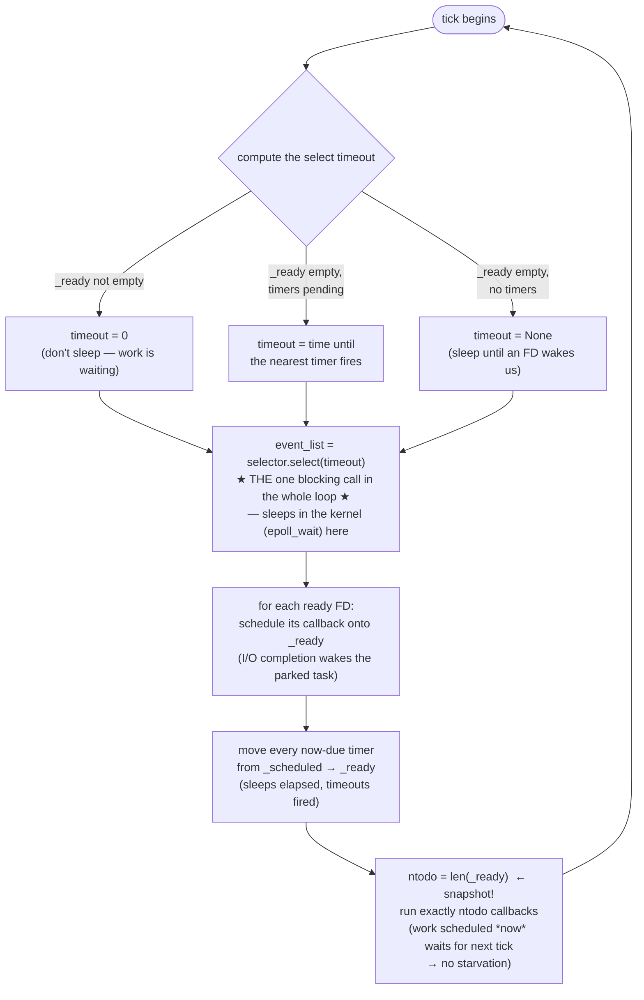
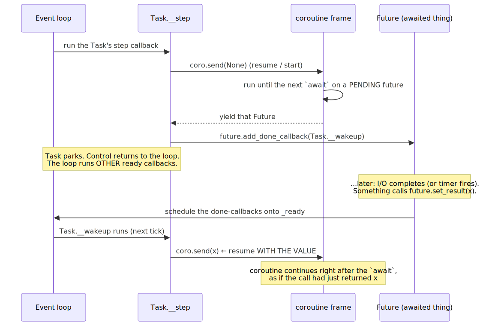
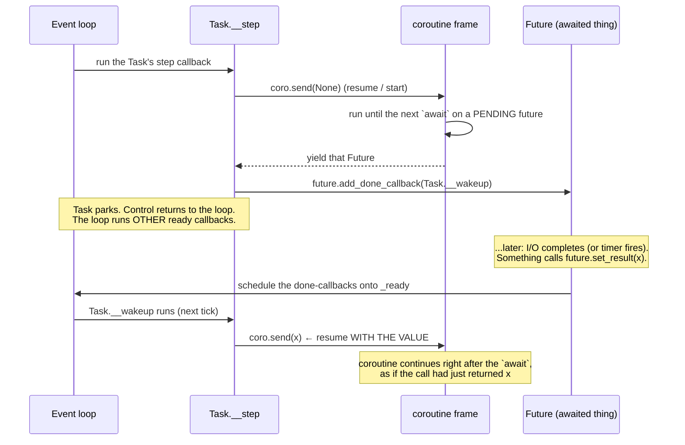
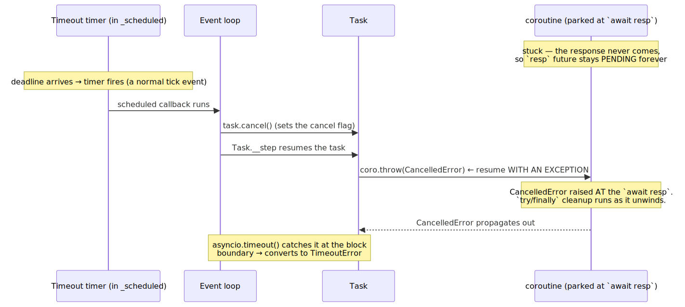
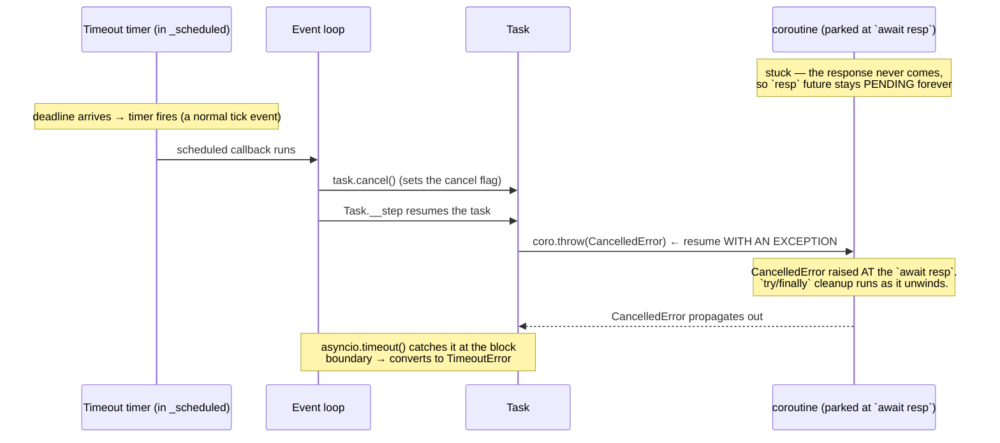

# M01 · Ch3 · §2 — Async, Deeply: The Event Loop, Tasks vs Coroutines vs Futures, Structured Concurrency, and Cancellation

> **Module:** How Computers & Operating Systems Work
> **Chapter:** Processes, Threads & Concurrency
> **Section:** One level under §1. §1 told you *which* model to pick (async for I/O-bound high fan-out) and *why* (the GIL is free
> while you wait). This section opens the async box and shows the machinery: **what the event loop actually does on each tick**, the
> **three things people lump together as "a coroutine"** (coroutine vs Future vs Task) and how a Task *drives* a coroutine, the
> **spawning primitives** (`await` vs `create_task` vs `gather` vs `as_completed` vs `TaskGroup`) and when each is right, **structured
> concurrency** (why `TaskGroup` exists and what the unstructured `go`-statement world cost us), and — the centrepiece, and the direct
> cash-in of your 06-16 session — **cancellation**: how it's an *exception injected into a parked coroutine*, why it only lands at an
> `await`, why `CancelledError` is a `BaseException` you must re-raise, and how `asyncio.timeout` is built entirely on top of it.
> **Status:** 🔵 **DRAFT — 2026-06-25.** Body pitched one level past §1, assuming you own the §1 GIL model and the Ch1 §2 async-stack
> model. We'll Q&A, then I'll finalize to fit how you actually think and capture the session in §11.

**Estimated study time:** 2–3 hours including reflection.

**Prerequisites — this section is built on three things you already own:**
- **Ch1 §2 (the call stack):** your own derivation that async is **one live native stack + N parked heap continuations the event loop
  swaps** (green threads); that a coroutine is a *single-use frame* and a Task is a *reusable result box*; and that **`await` is not
  concurrency** — two sequential `await`s are blocking calls in disguise. This section makes the "swap" mechanical.
- **Ch3 §1 (concurrency vs parallelism, the GIL):** async lives in §1's **bottom-left cell** — massive concurrency, *zero* parallelism,
  one thread, one core. The event loop never escapes the GIL because it never needs to: it's the scheduler *for one thread*.
- **The 06-16 Applied session (§1 §9b):** you drove the `asyncio.gather` failure model and landed the keeper *"`return_exceptions`
  handles errors; only a **timeout** handles silence."* §6 here is the mechanism under that keeper — *why* a timeout can break into a
  coroutine that a missing response left hanging forever.

---

## Why this section exists (for *you*)

You ship `asyncio` in production and reason about it fluently at the §1 level — CPU vs I/O, where the GIL is free, the bottom-left cell.
But three things you currently hold as *intuitions* are exactly the ones that produce the subtle async bugs, and they all live one layer
below where §1 stopped:

1. **You picture the event loop as "a thing that runs my coroutines," but not as a concrete loop with a `deque`, a heap, and exactly
   one blocking syscall per tick.** Once you can narrate one tick, every "why didn't this run / why did *that* starve / why is my p99
   spiking" question becomes mechanical instead of mysterious — you already started this in 9b ("a task parked on I/O doesn't hang the
   loop") and this section finishes it.
2. **You use `await`, `gather`, and `create_task` by feel.** This section pins down the *category difference*: `await` runs work
   **inside** the current task (sequential); `create_task`/`gather`/`TaskGroup` **spawn new tasks** (concurrent) — and the three spawners
   differ in exactly one axis that matters in production: **what happens to the siblings when one fails.**
3. **Cancellation is the part nearly everyone — including very good engineers — gets wrong, and it's the direct continuation of your 9b
   timeout insight.** You correctly concluded "only a timeout handles silence." The *why* is that a timeout is not a passive watchdog —
   it reaches **into** your stuck coroutine and *throws an exception at the suspended `await`*. Understanding that one mechanism explains
   why timeouts work, why they sometimes *don't* (a coroutine with no `await` to land on), why `except Exception` is safe but
   `except BaseException` is a bug, and why a `finally` that does cleanup during cancellation is a minefield.

**The one mechanism the whole section turns on.** Hold this and everything below is a corollary. A running coroutine makes progress until
it hits an `await` on something **not yet ready**; at that instant it **suspends** (saves its frame on the heap — Ch1 §2) and **yields
control back to the event loop**. The loop is now free to run other ready work. Later, when the awaited thing becomes ready, the loop
**resumes** the coroutine — and it resumes it in one of exactly two ways: by **sending in a value** (`coro.send(result)` — the normal
case, "your I/O returned this") or by **throwing in an exception** (`coro.throw(exc)` — the cancellation/timeout case, "stop waiting,
here's a `CancelledError` instead"). *Normal completion and cancellation are the same resume machinery with a different payload.* That
symmetry — **resume-with-a-value vs resume-with-an-exception** — is the spine of this section.

---

## 1. The event loop, one tick at a time

In §1 you said the loop is "the scheduler running inside your own process." True, but vague. Here is what it concretely *is* and what
one iteration (a **tick**) actually does. CPython's loop (`asyncio.base_events.BaseEventLoop`) holds three structures:

- **`_ready`** — a `collections.deque` of **callbacks ready to run right now** (each wrapped in a `Handle`). This is the run queue. A task
  that just became unblocked has its "resume me" callback sitting here.
- **`_scheduled`** — a **min-heap** of `TimerHandle`s ordered by *when* they should fire. Everything time-based lives here: `call_later`,
  `loop.call_at`, **`asyncio.sleep`**, and — the one that matters most for §6 — **every timeout's deadline**.
- **the selector** — `selectors.DefaultSelector`, which is `epoll` on Linux, `kqueue` on macOS, IOCP on Windows. This is the kernel's
  readiness oracle: you register "tell me when *this* socket is readable/writable," and the kernel watches the file descriptors for you.

One tick of `_run_once` is five steps, and the shape of it is the whole story:

<!-- DIAGRAM:START -->


<details>
<summary>Diagram source (Mermaid)</summary>



</details>
<!-- DIAGRAM:END -->

Four facts to read off this, because they answer real questions you've hit:

1. **There is exactly one blocking call per tick: `selector.select(timeout)`.** This is the *physical location* of "the loop is waiting on
   I/O." When 999 of your eval tasks are parked on network reads, the loop is sitting inside `epoll_wait` in the kernel, asleep,
   consuming **zero CPU** — and it wakes the instant *any* of those sockets has data. This is why one thread serves thousands of
   connections (§1 bottom-left): waiting is centralised into one kernel sleep, not one-thread-per-wait.
2. **The select timeout is computed from the timers.** If the nearest thing scheduled is an `asyncio.sleep(0.2)` or a timeout deadline
   200 ms out, the loop tells the kernel "wake me in at most 200 ms." So `asyncio.sleep` isn't a busy-wait — it's a timer in `_scheduled`
   that sets the kernel sleep length. (And `time.sleep` is a catastrophe here precisely because it sleeps the *thread*, not via the
   selector — the loop never reaches `select`, so nothing else runs. §1's footgun, now located exactly.)
3. **I/O completion and timer firing both do the same thing: push a callback onto `_ready`.** A socket becoming readable and a timeout
   deadline arriving are, to the loop, identical events — "schedule this resume." That unification is why a timeout can compete fairly
   with I/O: both are just entries in the run queue.
4. **The `ntodo` snapshot is a fairness guarantee.** The drain step records how many callbacks are ready *at the start* of the drain and
   runs only that many. Callbacks scheduled *during* the drain wait for the next tick. Without this, a task that re-schedules itself every
   time it runs could starve everything else forever. (This is the asyncio analog of the run-queue fairness an OS scheduler enforces —
   Ch1 §3's preemption, except here it's *cooperative*, so the loop can only be fair *between* callbacks, never *within* one. Which is the
   whole reason a single un-yielding callback freezes everyone — §6, §7.)

> **The keeper for §1:** "the loop waits on I/O" is literally "the loop is asleep inside `epoll_wait`, woken by the kernel when an FD is
> ready or the nearest timer is due." Concurrency without parallelism is *one thread alternating between sleeping in the kernel and
> draining a run queue.* There is no magic — there is a `deque`, a heap, and one syscall.

---

## 2. Coroutine vs Future vs Task — the three things people call "a coroutine"

You used these words interchangeably in 9b and mostly got away with it. They are three distinct objects, and the distinction is the
difference between *code that does nothing* and *code that's actually running*.

| | **Coroutine** | **Future** | **Task** |
|---|---|---|---|
| **What it is** | the object returned by calling an `async def` fn | a low-level "result box" with a state + done-callbacks | a `Future` subclass that **wraps and drives** a coroutine |
| **Created by** | calling `foo()` where `foo` is `async def` | libraries, rarely you (`loop.create_future()`) | `asyncio.create_task(coro)` / `ensure_future` |
| **Does it run on its own?** | **No** — inert until awaited or wrapped | N/A — it's a value holder, not code | **Yes** — scheduled on the loop the moment it's created |
| **Single-use?** | **Yes** — one frame, one `await` consumes it | — | reusable as a handle (await it, cancel it, query it) |
| **Mental model** | a *recipe* | a *mailbox* (will hold a result later) | a *running job* + the mailbox for its result |

The load-bearing facts:

- **A coroutine object is inert.** `foo()` for `async def foo` runs *nothing* — it builds a coroutine object (a paused frame) and hands it
  to you. This is why `foo()` without `await` is the classic "coroutine was never awaited" warning: you made the recipe and threw it away.
  (Contrast a normal function: `bar()` runs `bar`. `foo()` for a coroutine does *not* run `foo`.)
- **A Future is a result that isn't here yet** — `PENDING` → `FINISHED` (has a result or an exception) or `CANCELLED`, plus a list of
  done-callbacks to fire on resolution. You rarely make one; the machinery does (a network transport sets a Future's result when bytes
  arrive). It's the synchronisation primitive the whole system is built from.
- **A Task is the only one of the three that *runs your coroutine*.** A Task is a Future (so it *has* a result, you can `await` it, cancel
  it, ask if it's done) **plus** a driver loop that pumps the coroutine. Creating a Task **schedules it immediately** — it's the act of
  saying "loop, please start making this coroutine make progress."

**How a Task drives a coroutine — the await→park→wake cycle, mechanically.** This is the Ch1 §2 "swap" made concrete, and it's worth
seeing once at the `send`/`throw` level because §6 (cancellation) is just this picture with a different arrow:

<!-- DIAGRAM:START -->


<details>
<summary>Diagram source (Mermaid)</summary>



</details>
<!-- DIAGRAM:END -->

The single most useful thing to extract: **`await coro` does *not* create a Task.** It runs the awaited coroutine *inside the current
Task*, chaining frames — the current task simply doesn't proceed past the `await` until the inner thing is done. So two `await`s in a row
run **sequentially in one task**. To get *concurrency* you must create *more tasks* (`create_task`/`gather`/`TaskGroup`), which give the
loop more independently-resumable jobs to interleave. This is the precise, mechanical statement of your Ch1 §2 realisation — and it's the
#1 async performance bug in the wild: people `await` a list of coroutines in a loop and wonder why it's serial.

```python
# SERIAL — one task, two awaits back to back. Total ≈ a + b.
x = await fetch(url_a)
y = await fetch(url_b)

# CONCURRENT — two tasks, the loop interleaves them. Total ≈ max(a, b).
x, y = await asyncio.gather(fetch(url_a), fetch(url_b))
```

---

## 3. The spawning primitives — `gather`, `as_completed`, `wait`, `TaskGroup`

Once you accept "concurrency needs more than one task," the question is *how you spawn and collect them*, and asyncio gives you several
tools that look interchangeable but differ on the axes that bite in production: **ordering, error policy, and what happens to siblings
when one fails.**

| Primitive | Returns | Result order | On a child error | Siblings on error | Use it when |
|---|---|---|---|---|---|
| `await coro` | the value | — | propagates | — (no siblings) | the next step *depends on* this result |
| `create_task(coro)` | a `Task` (now) | — | stored on the Task until awaited | independent | fire-and-(carefully)-forget; you hold the handle |
| `gather(*aws)` | list, **input order** | input order | **first exception propagates to caller** | **keep running, orphaned** ⚠ | you want all results, order matters, all-or-nothing-ish |
| `gather(..., return_exceptions=True)` | list incl. exception objects | input order | captured as a result | all run to completion | **eval-harvest** — collect everything, inspect failures after (your 9b) |
| `as_completed(aws)` | iterator of futures | **completion order** | raised when you `await` that one | independent | stream/persist results as they finish (your 9b "don't lose 997") |
| `wait(aws, return_when=…)` | `(done, pending)` sets | — | **never raises** — you inspect | your choice (you cancel `pending`) | low-level control; "first to finish wins" races |
| `TaskGroup()` (3.11+) | — (`async with`) | — | **cancels all siblings**, raises `ExceptionGroup` | **cancelled** | all tasks must succeed together; fail-fast |

Three traps hide in that table:

- **`gather`'s default error policy is the surprising one.** When one child raises, `gather` propagates that exception to your `await`
  *immediately* — but it does **not cancel the other children**. They keep running as orphans, consuming connections and rate-limit
  budget, their results (or further exceptions) silently dropped. For a fan-out where a failure should stop the work, `gather` leaks; for
  an eval where you want *every* result regardless, you need `return_exceptions=True`. Neither default is "cancel siblings cleanly" —
  that's what `TaskGroup` added.
- **`return_exceptions=True` turns `gather` into "harvest mode"** — exactly the 9b policy. Every coroutine that raises comes back as an
  *exception object in the result list, index-aligned*, and the batch always completes. You then filter results from failures yourself.
  This is the right tool for an eval pass; `TaskGroup` (fail-fast) is the *wrong* one there.
- **`as_completed` is how you stop a straggler from holding 999 finished results hostage** (the 9b "join barrier" problem). Instead of one
  collection point that waits for *all* (`gather`), you consume results *as each finishes* and persist immediately — so a crash or a hang
  at item 998 costs you nothing already harvested.

---

## 4. Structured concurrency — why `TaskGroup` exists

`create_task` has a quiet design flaw that the industry took ~a decade to name. When you write `asyncio.create_task(work())` and move on,
you've created a job whose **lifetime is unbounded** (it can outlive the function that spawned it) and whose **errors have nowhere to go**
(if `work()` raises and nobody ever `await`s the task, the exception is *swallowed* — surfaced only as a "Task exception was never
retrieved" log line when the task is eventually garbage-collected, if you're watching logs at all). Nathaniel Smith's essay *"Notes on
structured concurrency, or: `go` statement considered harmful"* (the Trio project) made the analogy precise: **an unowned background task
is a `goto` across the call graph** — it breaks the discipline that makes ordinary code tractable, namely that a function call *returns to
its caller* and *propagates its errors upward*.

**Structured concurrency** restores that discipline. The rule: **every spawned task lives inside a lexical scope, and the scope does not
exit until all its children finish.** Tasks cannot outlive the block that created them; an error in any child propagates to the parent
block like a normal exception. Trio called the scope a *nursery*; asyncio adopted it in 3.11 as **`TaskGroup`**:

```python
# Unstructured (the "go statement"): lifetimes unbounded, errors can vanish.
t1 = asyncio.create_task(fetch(a))
t2 = asyncio.create_task(fetch(b))
# ... if fetch(b) raises and we never await t2, the error is swallowed.

# Structured: the `async with` block is a hard boundary.
async with asyncio.TaskGroup() as tg:
    tg.create_task(fetch(a))
    tg.create_task(fetch(b))
# Control does NOT pass this line until BOTH finish.
# If either raises: the other is CANCELLED, and an ExceptionGroup is raised here.
```

Two consequences worth holding:

- **Errors aggregate into an `ExceptionGroup` (PEP 654), caught with `except*`.** If two children fail, you don't lose one — `TaskGroup`
  raises an `ExceptionGroup` containing *both*, and the new `except* ValueError:` syntax lets you handle each type across the group. This
  is why `ExceptionGroup` was added to the language in 3.11: structured concurrency *needs* "more than one thing failed at once" to be a
  first-class idea.
- **`TaskGroup` is fail-fast by design**, which makes it the *wrong* tool for your eval harvest (9b) and the *right* tool for "fetch the
  user, their org, and their permissions — if any of the three fails the whole request is meaningless, cancel the rest." Match the policy
  to the job: **all-must-succeed → `TaskGroup`; collect-everything → `gather(return_exceptions=True)` or `as_completed`.**

---

## 5. Cancellation — the part everyone gets wrong (and the cash-in of 9b)

This is the section. Your 06-16 keeper was *"only a timeout handles silence."* Correct — and the mechanism behind it is the single most
misunderstood thing in asyncio. Get this and you can reason about every timeout, shutdown, and "task won't die" bug you'll ever hit.

**Cancellation is an exception injected into a parked coroutine — nothing more.** `task.cancel()` does **not** kill the task, stop a
thread, or interrupt a running line of code. It sets a flag so that the **next time the coroutine resumes from an `await`**, the loop
resumes it not with `coro.send(value)` but with **`coro.throw(CancelledError)`** — i.e. it *raises `CancelledError` at the exact `await`
where the coroutine is suspended.* From the coroutine's point of view, the `await` it was sitting on "returns" by raising. This is the
same resume machinery as §2's wake cycle, with the exception arrow instead of the value arrow:

<!-- DIAGRAM:START -->


<details>
<summary>Diagram source (Mermaid)</summary>



</details>
<!-- DIAGRAM:END -->

Now every property of cancellation falls out of "it's an injected exception":

- **Cancellation only lands at an `await`.** The exception is delivered *when the coroutine next resumes*. A coroutine spinning in a tight
  pure-Python loop, or stuck in a blocking C call, **never resumes** (it never yielded), so the `CancelledError` is queued but *cannot be
  delivered* — `task.cancel()` appears to do nothing until the code reaches a suspension point. **This is the same root cause as "blocking
  the loop" (§1, §7): no `await`, no yield, no cooperation, no cancellation.** A timeout on a CPU-bound coroutine is a timeout that never
  fires in time.
- **This is *why* a timeout breaks the 9b "silence" hang but `return_exceptions` can't.** When a response never comes, the coroutine is
  *parked at an `await`* (the well-behaved case from 9b — the loop is fine, only this one task is stuck). A timer in `_scheduled` is still
  scheduled; when its deadline arrives the loop fires it (§1 — timers compete fairly with I/O), it calls `task.cancel()`, and because the
  task **is** parked at an `await`, the `CancelledError` lands cleanly and unwinds the wait. `return_exceptions=True` can only catch an
  exception the coroutine *raises on its own*; silence raises nothing, so only an *externally injected* exception — a cancellation from a
  timeout — can end it. That's the mechanism your keeper was standing on.
- **`asyncio.timeout()` and `asyncio.wait_for()` are *built on* cancellation.** They schedule a timer; on expiry they `cancel()` the task
  running inside the block; they catch the resulting `CancelledError` at the boundary and re-raise it as `TimeoutError`. A timeout is not
  a passive watchdog that checks a clock — it is an active *"reach in and throw."* (3.11's `asyncio.timeout()` context manager is the
  modern form; `wait_for` is the older wrapper. Prefer `timeout` — it composes and nests correctly.)

**The rule that makes cancellation safe — and the bug that makes it the worst kind of unsafe:**

- **`CancelledError` inherits from `BaseException`, not `Exception`** (since Python 3.8 — deliberately). So a blanket `except Exception:`
  — your normal "catch errors, log, continue" — **does not** catch cancellation, which is correct: your error handling shouldn't
  accidentally suppress a shutdown. Good.
- **But if you *do* catch it** — in a `try/except CancelledError:` or a bare `except:` or `except BaseException:` for cleanup — **you must
  re-raise it.** Catch-and-don't-re-raise means the task *swallows its own cancellation*: the timeout fired, the exception was thrown in,
  and your code ate it and kept running. Now `asyncio.timeout` thinks it cancelled the task but the task is still going; shutdown hangs;
  "this task won't die" tickets get filed. The idiom:

  ```python
  try:
      await do_work()
  except asyncio.CancelledError:
      await cleanup()          # fine to clean up...
      raise                    # ...but you MUST re-raise, or cancellation is broken
  ```

- **`try/finally` runs during cancellation** — that's how you release locks/connections on the way out. But **awaiting inside a `finally`
  during cancellation is a minefield**: that `await` is *itself* a suspension point, so it can be cancelled too (a second timeout, a
  shutdown), cutting your cleanup short. For cleanup that absolutely must complete, wrap it in `asyncio.shield()` (which protects an inner
  awaitable from cancellation propagating in) — but know that `shield` only protects the *inner* task; the outer `await` still raises, and
  the shielded work keeps running detached. (3.11 added `Task.uncancel()` and a cancellation *count* so that nested timeouts don't confuse
  each other — an inner timeout firing no longer looks like the outer one to the outer block. You rarely call `uncancel` yourself; it's
  what makes nested `asyncio.timeout()` blocks correct.)

> **The keeper (the spine of the section, stated for cancellation):** *normal completion resumes a coroutine with a value; cancellation
> resumes it with an exception.* Both need the coroutine to be **parked at an `await`** to take effect — which is why cancellation and
> timeouts are powerless against un-yielding code, exactly as throughput is (the §1 footgun, now seen from the other side). Catch
> `CancelledError` only to clean up, and **always re-raise**, or you turn a cooperative shutdown into a hang.

---

## 6. The footgun gallery — real failure modes, ranked

Canonical async bugs, each one a corollary of §1–§5. The first three are the ones that bite even experienced people.

1. **Fire-and-forget tasks get garbage-collected mid-flight.** `asyncio.create_task(bg_work())` *without keeping a reference* is a live
   bug: **the event loop holds only a *weak* reference to tasks**, so if you don't keep a strong one, the garbage collector can destroy
   the task while it's still pending — `Task was destroyed but it is pending!` and the work silently never finishes. The documented idiom
   is to stash a strong ref and clear it on completion:
   ```python
   _background = set()
   def spawn(coro):
       t = asyncio.create_task(coro)
       _background.add(t)
       t.add_done_callback(_background.discard)   # keep a strong ref until it's done
   ```
2. **`gather` leaves siblings running on the first error (§3).** The exception reaches you, but the other coroutines keep consuming
   connections/budget as orphans. If a failure should stop the fan-out, use `TaskGroup` (cancels siblings); if it shouldn't, use
   `return_exceptions=True` (everyone finishes). The default is neither.
3. **Swallowing `CancelledError` (§5).** Catching it (often via an over-broad `except BaseException` or a bare `except:`) and not
   re-raising breaks cancellation and timeouts. Symptom: shutdown hangs, `asyncio.timeout` doesn't actually stop the work.
4. **Blocking the loop (§1, located in §1's tick).** A sync DB driver, `requests`, `time.sleep`, a heavy pure-Python parse, or a blocking
   `boto3` call sitting directly in a coroutine **never reaches `selector.select`** — so *every* other task starves until it returns,
   spiking p99 for all users (your 9b Hang #2). Fix: an async client (`httpx`/`aiohttp`/an async DB driver), `asyncio.sleep` not
   `time.sleep`, or push the CPU step to `loop.run_in_executor(process_pool, …)` (§1 §4 hybrid).
5. **Unretrieved task exceptions.** A backgrounded task that raises, with no one to `await` its result, logs *"Task exception was never
   retrieved"* only when it's GC'd — easy to miss entirely. Structured concurrency (`TaskGroup`) fixes this at the root: errors propagate
   to the block.
6. **`asyncio.run()` nesting / multiple loops.** `asyncio.run` creates *and closes* a fresh loop; you cannot call it from inside a running
   loop (`RuntimeError: asyncio.run() cannot be called from a running event loop`). Notably **Jupyter already runs a loop**, so `await` works
   at top level there but `asyncio.run(...)` does not — the `nest_asyncio` shim exists for exactly this. One loop per thread.

---

## 7. Where this bites *you* — the practitioner's playbook

Ranked, concrete, mapped to the sections — and aimed at the eval pipeline and the arena from §1's session.

1. **For the eval harness, the shape is now fully specified (§3, §5).** `Semaphore` (rate limit, 9a) + **per-request `asyncio.timeout`**
   (the only thing that ends silence, §5) + **capture-don't-propagate** (`gather(return_exceptions=True)` or `as_completed`, §3) +
   **persist via `as_completed`** so a hang at item 998 doesn't cost the first 997 + idempotent retry on failed indices. Do **not** use
   `TaskGroup` here — its fail-fast cancellation is the opposite of harvest.
2. **For the arena, audit for the three structural bugs (§5, §6).** (a) Any `create_task` whose handle you drop → potential GC-vanish; add
   the set+discard idiom. (b) Any blocking call on the loop → p99 killer; move to async client or executor. (c) Any
   `except CancelledError` / broad `except` without a `raise` → shutdown/timeout hang.
3. **Reach for `TaskGroup` as the default for "do N things, all must succeed" (§4).** It cancels stragglers on failure, aggregates errors,
   and bounds task lifetime to the block — three bugs designed out at once. Drop to raw `gather`/`create_task` only when you specifically
   need the unstructured behaviour (harvest mode, or a genuinely long-lived background task you own explicitly).
4. **Never `await` a network call without a timeout (§5).** This is the 9b keeper as a hard rule. A timeout is the only construct that can
   reach into a parked-forever coroutine and end it; without one, a single dead upstream connection parks a task for the lifetime of the
   process.
5. **When debugging "why is async slow / not concurrent," check for serial `await`s first (§2).** A loop of `await foo()` is sequential;
   the fix is `gather`/`TaskGroup`/`as_completed`. This is the most common async non-bug-bug — code that's *correct* but accidentally
   serial.
6. **Turn on `loop.set_debug(True)` / `PYTHONASYNCIODEBUG=1` in dev (§1, §6).** It warns on slow callbacks (a callback blocking the loop
   too long — your footgun #4 made visible), coroutines never awaited, and tasks destroyed while pending. Cheap early warning for exactly
   the bugs above.

---

## 8. Check your understanding

Jot a one-line answer to each before our Q&A — and where I ask for a hypothesis, *commit to one*; we'll re-rank it against the dominant
mechanism together (your signature mode).

1. Narrate **one tick** of the event loop in order, and answer: where, physically, is "the loop waiting on I/O"? What sets how long that
   wait lasts? Why does `time.sleep(1)` inside a coroutine break the whole loop, but `await asyncio.sleep(1)` doesn't?
2. Define **coroutine**, **Future**, and **Task** in one sentence each. Then: why does calling `foo()` (an `async def`) run *none* of
   `foo`'s body? And why do two `await`s in a row run *sequentially* even though async is "concurrent"?
3. You have 200 coroutines. Give the right collection primitive and justify it for: (a) you need every result and want failures reported
   per-item, not a crash; (b) all 200 must succeed or the whole job is meaningless; (c) you want to persist each result the instant it
   finishes so a late crash loses nothing. Name what `gather` (default) does to the *other 199* when #50 raises.
4. **(The core one.)** Explain what `task.cancel()` actually does — at the level of `send`/`throw`. Then explain *why* a timeout can end a
   coroutine that's hung waiting for a response that never comes, but `return_exceptions=True` cannot. Use the word "parked."
5. A coroutine is stuck in `while True: x += 1` (no `await`). You wrap it in `asyncio.timeout(5)`. Predict what happens at t=5s and explain
   the mechanism. (Hypothesis: does the timeout fire? does the task stop? when?)
6. A teammate writes `try: await work() except Exception: log(); return`. They say "this is safe, it won't swallow cancellation." Are they
   right? Now they change it to `except BaseException:`. What breaks, and what's the symptom in production?
7. (Synthesis) Why was `ExceptionGroup` / `except*` added to the language *at the same time* as `TaskGroup`? What problem in structured
   concurrency requires "more than one error at once" to be a first-class concept?

---

## 9. Optional: get your hands dirty (15–20 min)

Make the abstractions concrete. Watch the wall-clock and the order of prints — the surprises are the point.

```python
import asyncio, time

# (a) Serial awaits vs gather — the §2 lesson, timed.
async def work(name, secs):
    await asyncio.sleep(secs)          # stands in for an I/O wait; releases to the loop
    return f"{name} done"

async def serial():
    t = time.perf_counter()
    await work("A", 1); await work("B", 1)            # two awaits, one task
    print(f"serial:  {time.perf_counter()-t:.2f}s")   # ~2s

async def concurrent():
    t = time.perf_counter()
    await asyncio.gather(work("A", 1), work("B", 1))  # two tasks
    print(f"gather:  {time.perf_counter()-t:.2f}s")   # ~1s

asyncio.run(serial()); asyncio.run(concurrent())
```

```python
# (b) Cancellation is an injected exception. Watch it land AT the await, and watch finally run.
async def victim():
    try:
        print("victim: parking on a 10s wait")
        await asyncio.sleep(10)
    except asyncio.CancelledError:
        print("victim: CancelledError landed AT the await")
        raise                              # <-- comment this out and see the warning/hang behaviour change
    finally:
        print("victim: finally ran (cleanup happens during cancellation)")

async def main_cancel():
    t = asyncio.create_task(victim())
    await asyncio.sleep(0.5)
    t.cancel()                             # inject the exception
    try:
        await t
    except asyncio.CancelledError:
        print("main: task was cancelled")

asyncio.run(main_cancel())
```

```python
# (c) The §5 punchline: a timeout CANNOT cancel un-yielding code. (Ctrl-C it after a few seconds.)
async def cpu_stuck():
    x = 0
    while True:               # no await — never resumes — cancellation has nowhere to land
        x += 1

async def main_timeout():
    try:
        async with asyncio.timeout(2):
            await cpu_stuck()
    except TimeoutError:
        print("this line will NOT print in 2s — the timeout can't break in")

# asyncio.run(main_timeout())   # uncomment to feel the footgun; it hangs past 2s
```

```python
# (d) TaskGroup fail-fast vs gather harvest — same two coroutines, opposite outcomes.
async def ok():   await asyncio.sleep(0.2); return "ok"
async def boom(): await asyncio.sleep(0.1); raise ValueError("boom")

async def harvest():
    res = await asyncio.gather(ok(), boom(), return_exceptions=True)
    print("gather harvest:", res)          # ['ok' arrives, ValueError captured] — both finish

async def failfast():
    try:
        async with asyncio.TaskGroup() as tg:
            tg.create_task(ok()); tg.create_task(boom())
    except* ValueError as eg:
        print("TaskGroup failfast: ok() was cancelled, got", eg.exceptions)

asyncio.run(harvest()); asyncio.run(failfast())
```

Bring the numbers and the print-orders to our chat — especially (b) with and without the `raise` (the swallowed-cancellation bug made
visible), and (c) (the timeout that can't fire).

---

## 10. Applied — captured from our session

*(Placeholder — this is where I'll capture the threads you drive in our Q&A, the same way §9 of §1 captured the eval-pipeline session.
Likely seeds, given where §1 left off: cancellation during cleanup in the arena's shutdown path; whether your turn-handler has serial
`await`s that should be a `gather`; and the `TaskGroup`-vs-harvest choice for any fan-out in your real code.)*

---

## 11. References (optional, for depth)

*(All links verified live 2026-06-25.)*

- **[Python docs — `asyncio` Tasks & coroutines](https://docs.python.org/3/library/asyncio-task.html)** — the authoritative reference for
  `create_task`, `gather`, `as_completed`, `wait`, `TaskGroup`, `timeout`, `wait_for`, `shield`, and the cancellation contract. Read the
  "Task Cancellation" and "Timeouts" subsections alongside §5.
- **[Python docs — Event Loop](https://docs.python.org/3/library/asyncio-eventloop.html)** — the loop API (`call_later`, `call_at`,
  `run_in_executor`, `set_debug`) behind §1's tick. The selector/`run_forever` machinery lives here.
- **[Python docs — Developing with asyncio](https://docs.python.org/3/library/asyncio-dev.html)** — the official footgun list (§6):
  blocking the loop (the "Running Blocking Code" section → `run_in_executor`), debug mode (`loop.set_debug`, `PYTHONASYNCIODEBUG`, slow-callback
  logging), and the "never retrieved" warning. The strong-reference idiom for `create_task` (keep a set so the GC can't collect a pending task)
  is documented on the **[`create_task` reference](https://docs.python.org/3/library/asyncio-task.html#asyncio.create_task)** itself.
- **[Nathaniel J. Smith — "Notes on structured concurrency, or: `go` statement considered harmful"](https://vorpus.org/blog/notes-on-structured-concurrency-or-go-statement-considered-harmful/)**
  — the essay that named the §4 idea. The `go`-statement-as-`goto` argument and the nursery design that became `TaskGroup`. Essential
  background, not just trivia.
- **[Trio documentation](https://trio.readthedocs.io/en/stable/)** — the library that pioneered nurseries and the "cancellation scope"
  model asyncio later adopted; reading Trio's cancellation docs is the cleanest way to see §5's ideas in their native form.
- **[PEP 654 — Exception Groups and `except*`](https://peps.python.org/pep-0654/)** — *why* the language grew `ExceptionGroup` and `except*`
  (§4): structured concurrency needs "several tasks failed at once" as a first-class value.
- **[PEP 3156 — Asynchronous IO Support (the `asyncio` design)](https://peps.python.org/pep-3156/)** and
  **[PEP 492 — `async`/`await` syntax](https://peps.python.org/pep-0492/)** — the origin documents: PEP 3156 specifies the event-loop/Future
  model of §1–§2; PEP 492 is where coroutines became their own thing (§2's "inert recipe").

---

### What's next (after we finalize)
This section drops one level below §1 into the loop, the task model, and cancellation — and cashes the 9b timeout keeper into its
mechanism (§5). Natural follow-ons, your call at the boundary:
- **Ch3 §3 — Synchronization & races** (locks, `queue.Queue`/`asyncio.Queue`, deadlock, the data races free-threading exposes — §1 §5's
  "now it's your job"). The third leg of the chapter; pairs with the shared-mutable-state warning.
- **Ch3 §4 — *(if we add it)* the producer/consumer & backpressure patterns** that the queue primitives enable — straight into M07 scaling
  territory.
- Or **rotate scope** per the interleave (this would be a fifth M01 day if taken now): **M04 Ch2 §2** (refactoring in moves, SWE) or
  **M12 Ch2 §3** (audio/speech/TTS, AI — your "all model types" goal).
