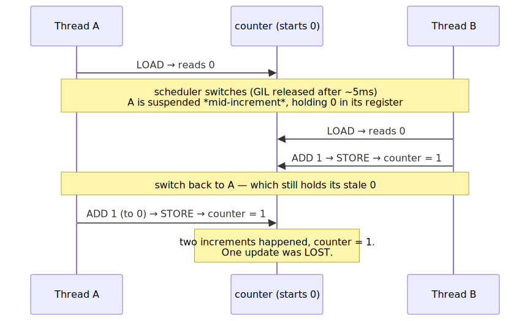
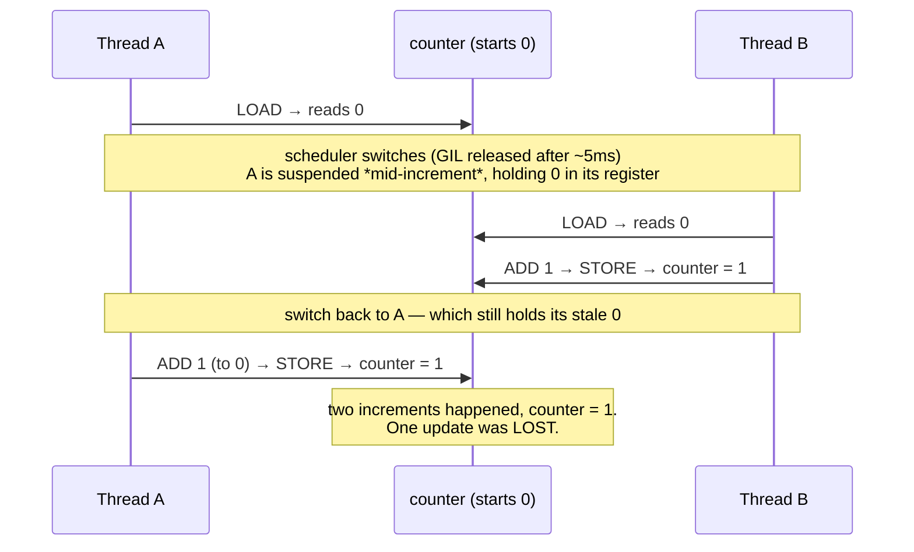
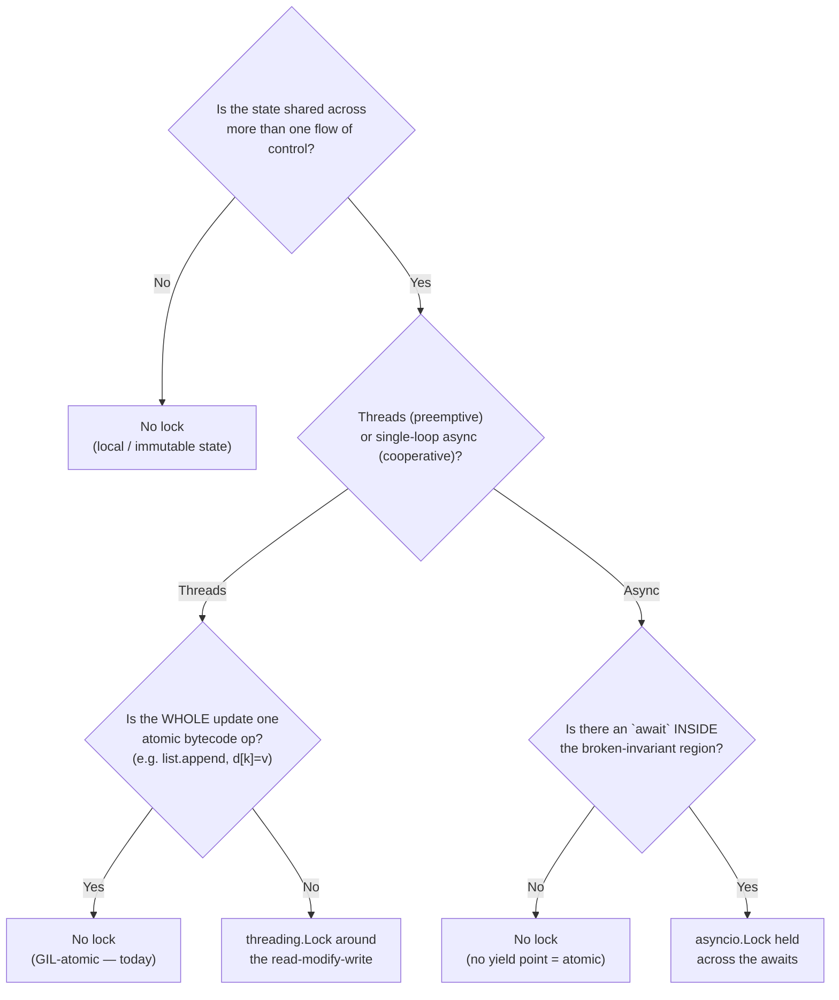
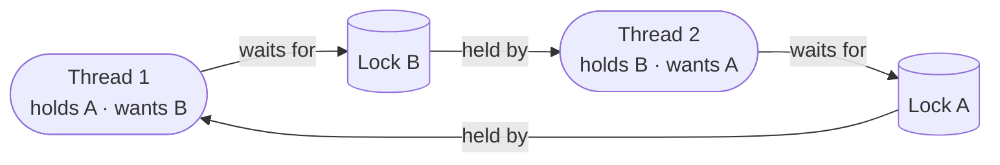

# M01 · Ch3 · §3 — Synchronization & Races: Atomicity, Locks, Deadlock, and the Primitives That Coordinate Shared State

> **Module:** How Computers & Operating Systems Work
> **Chapter:** Processes, Threads & Concurrency
> **Section:** The third leg of the chapter, and the one §1 promised you. §1 sorted the *models* (process / thread / async) and pinned
> down the GIL; §2 opened the async box (event loop, tasks, cancellation). Both left one thing as a warning rather than a mechanism:
> **the moment two flows of control touch the same mutable state, you have a coordination problem the language will not solve for you.**
> This section is that problem and its toolkit — what "atomic" actually means, why `x += 1` is a bug in two threads, why a *single-threaded*
> async program still sometimes needs a lock, the full primitive set (`Lock`/`RLock`/`Semaphore`/`Event`/`Condition`/`Barrier` and their
> `asyncio` twins), **deadlock** (the four conditions, lock ordering, the dining philosophers), and the escape hatch the rest of the
> industry reaches for first — *don't share memory, pass messages* (queues, the actor model).
> **Status:** ✅ **finalized 2026-06-26.** No questions on the body — you read it and returned a **design synthesis** (§11): a linear
> pipeline can't race (one flow of control), and **immutable state lets you scale to a concurrent graph without inheriting the lock
> problem** — the section's senior move, which you'd already half-derived back in Ch1 §2 §1. §11 captures it and sharpens the one residual
> care point (the fan-in/join: combine functionally + coordinate with structured concurrency, don't append into a shared mutable sink).
> This is the direct cash-in of **§1 §5** ("free-threading makes races *your* job") and **§2 §5** ("a yield point is the only place the
> world changes underneath you") — hold both; this section fuses them into one rule.

**Estimated study time:** 2–3 hours including reflection.

**Prerequisites — this section stands on the two you just finished:**
- **Ch3 §1 (the GIL, concurrency vs parallelism):** you know the GIL serialises *bytecode*, releases every ~5 ms and on I/O, and that
  free-threading (PEP 703) is coming to remove it. §1 said "when the GIL goes, data races become your problem." This section is *what that
  problem is* and *how you defend against it* — and it shows the races were **already there** in threaded code today; the GIL only hid the
  cheap ones.
- **Ch3 §2 (await = suspension):** your own keeper — *the coroutine only changes the world's view of its state at an `await`; between awaits
  it is atomic.* That single fact is the entire theory of async synchronisation: you need an `asyncio.Lock` **if and only if** your critical
  section contains an `await`. This section makes that precise and shows it is the *cooperative* mirror of the *preemptive* thread race.
- **Ch1 §3 §11 (cache coherence / memory ordering)** and **Ch1 §2 §1 (immutable pipeline state)** return as the two deep callbacks: the
  hardware reason synchronisation is more than "just take turns," and the design that makes the whole problem evaporate.

---

## Why this section exists (for *you*)

You have shipped concurrent code — `asyncio` fan-out, threaded I/O, multiprocess workers — and it mostly works. "Mostly" is the tell.
Concurrency bugs are the canonical *Heisenbug*: they pass every test on your laptop, survive code review, run clean for months, then
corrupt one row in production at 3 a.m. under load you never reproduced. They are not rare because they are unlikely; they are rare
**per run** and therefore certain **at scale** — a one-in-a-million interleaving happens many times a day in a service doing a million
things a day. The only defence is to reason about them *structurally* instead of testing for them, and that requires the vocabulary this
section builds.

Three specific gaps this closes:

1. **You half-believe "the GIL makes Python thread-safe."** It is the single most expensive misconception in Python concurrency. The GIL
   makes *individual bytecodes* atomic; it does **nothing** for the multi-bytecode operations you actually write (`+=`, `if k not in d:
   d[k]=…`, "read-modify-write" of any kind). You have probably written code that races today and gotten away with it because the window is
   small — and free-threading is about to widen every one of those windows. We make the rule exact.
2. **You reach for an `asyncio.Lock` by feel — or skip it by feel — and can't always say which is right.** After this section you will
   have a *one-question test* ("is there an `await` inside the critical section?") that answers it every time, and you'll understand why
   it's a completely different question from the threaded one.
3. **You know "deadlock" as a word, not as four named conditions you can break one at a time.** Deadlock is not bad luck; it is a precise
   structural property (Coffman's four conditions) and removing **any one** of them makes it impossible. Lock-ordering discipline — the fix
   that prevents nearly all real deadlocks — falls straight out of that, and you'll be able to audit code for it on sight.

**The one idea the whole section turns on.** A bug exists wherever an **invariant** — a truth your code relies on, like "this balance equals
the sum of these entries" — is **temporarily false** *and another flow of control can observe it while it's false.* Everything here is a way
to ensure that the window in which an invariant is broken is **invisible** to everyone else. Threads make that window appear *between any two
bytecodes* (preemptive); async makes it appear *at every `await`* (cooperative). Same disease, two schedulers — and the same cure: make the
broken-invariant region a **critical section** that only one flow can be inside at a time. Hold that and locks, atomics, and message-passing
are just three ways to buy it.

---

## 1. The root problem: shared mutable state + non-atomic operations

Take the most innocent line in programming:

```python
counter += 1
```

It looks like one step. It is **three**, and you can see them in the bytecode (`dis` is Ch1 §1's tool, returning here):

```
LOAD_FAST   counter     # 1. read the current value into a register
BINARY_OP   +           # 2. compute value + 1
STORE_FAST  counter     # 3. write the result back
```

This **read → modify → write** is the atom of nearly every concurrency bug. It is non-atomic: a scheduler can interrupt the running flow
*between* any two of those steps. If two threads both run `counter += 1` starting from `counter == 0`, a perfectly legal interleaving is:

<!-- DIAGRAM:START -->


<details>
<summary>Diagram source (Mermaid)</summary>



</details>
<!-- DIAGRAM:END -->

Two increments, final value `1`. This is the **lost update**, and run it on `range(1_000_000)` across two threads and you will reliably get
a final count *well under* 2,000,000. The work wasn't slow or wrong — it was *interleaved* at a point where an invariant ("my register holds
the current value of `counter`") had silently expired.

**Two distinctions you must keep separate** — they get conflated constantly:

- **Data race** (数据竞争): two flows access the *same memory*, at least one *writes*, and there is *no synchronisation* ordering them. In
  C/C++/Rust this is **undefined behaviour** — the compiler and CPU may legally tear the write, reorder it, or hoist it out of a loop, and
  your program can do literally anything. This is a *memory-safety* property.
- **Race condition** (竞态条件): a *correctness* bug whose outcome depends on timing/ordering. Broader than a data race — you can have one
  **even with perfectly atomic operations**. `if key not in cache: cache[key] = compute()` is a race condition (two threads both see "not
  in," both compute, one wins) even though each dict operation is individually atomic. *Check-then-act* and *read-modify-write* are the two
  classic shapes.

**Where the GIL actually sits in this** (the §1 cash-in, stated exactly):

- The GIL guarantees **one bytecode instruction executes without interruption** — the interpreter checks for a pending thread-switch
  *between* bytecodes, never inside one. So a *single* bytecode-level operation is atomic.
- **`list.append(x)`, `d[k] = v`, `x = y`** compile to a single atomic bytecode → safe across threads *for that one operation*.
- **`counter += 1`, `d[k] += 1`, `if k not in d: d[k] = …`, `list[i] = list[j]`** are *multiple* bytecodes → **not atomic** → race.
- The GIL is released **on a timer** (~5 ms, `sys.getswitchinterval()`) and **on every blocking I/O call** — *not* on a fixed number of
  bytecodes (that was true pre-3.2; it's time-based now). So you cannot reason "my operation is short, it won't be interrupted." It can be
  interrupted after *any* bytecode the moment the 5 ms timer is up.
- **Free-threading (3.13+, PEP 703)** removes the GIL entirely. CPython then adds *internal* per-object locks so that built-in containers
  don't *corrupt* (no segfault from a torn `list` resize) — but your *application-level* invariants get **zero** protection. Every `+=`,
  every check-then-act that was "probably fine because the window was tiny" now has a window as wide as true parallelism allows. **This is
  exactly the "now it's your job" §1 promised.** The races didn't appear; they became *reachable*.

> **The keeper for §1:** the GIL never made your *code* thread-safe — it made the *interpreter* memory-safe and made the *windows* small.
> "Small window" is not "no window." Correct concurrent code is correct *because of explicit synchronisation*, not because of the GIL — and
> code that only works because the GIL kept the window small is a latent bug with a deployment date.

---

## 2. The cure: atomicity, critical sections, and mutual exclusion

The fix for "an invariant is briefly false and others can see it" is to make the broken-invariant region **mutually exclusive**: only one
flow of control may be inside it at a time. That region is a **critical section** (临界区), and the device that enforces "one at a time" is a
**lock** / **mutex** (互斥锁 — *mut*ual *ex*clusion).

```python
import threading
lock = threading.Lock()
counter = 0

def increment():
    global counter
    with lock:            # acquire on enter, release on exit (even on exception)
        counter += 1      # the read-modify-write is now indivisible to other threads
```

`with lock:` is the same context-manager discipline you nailed in Ch1 §2 (`with` for resource lifetime): `__enter__` calls `lock.acquire()`
(blocking until it's free), `__exit__` calls `lock.release()` — *including* if the body raises, which is why you almost never call
`acquire`/`release` by hand (an exception between them leaks the lock forever → instant deadlock). A lock is a *baton*: exactly one runner
holds it; everyone else **blocks** (the OS de-schedules the waiting thread — Ch1 §3 — so a blocked thread burns no CPU) until it's dropped.

**What a lock costs, and the granularity dial.** A lock is not free even uncontended (an atomic compare-and-swap + a possible syscall to
park/wake a waiter). The real cost is **contention** (锁争用): when many threads want the same lock, they serialise — you've reintroduced the
exact sequential bottleneck concurrency was meant to remove (this is Amdahl's law biting; the locked region is the non-parallelisable
fraction). The dial you turn is **granularity**:

- **Coarse-grained** — one big lock around a whole structure. Simple, easy to reason about, *low* deadlock risk (one lock can't cycle), but
  *high* contention (everyone queues on it). The Python GIL itself is the ultimate coarse lock: one lock for the entire interpreter.
- **Fine-grained** — many small locks (one per bucket, per row, per node). *Low* contention (different threads touch different locks), but
  *complex* and the **main source of deadlock** (now you can hold one and want another). Java's `ConcurrentHashMap` famously lock-stripes its
  buckets; a database row-locks instead of table-locking for exactly this throughput reason (→ M03 Ch2, where this becomes MVCC and isolation
  levels).

The engineering tension is permanent: **coarse = safe but slow under contention; fine = fast but deadlock-prone and hard to reason about.**
Start coarse, measure, and only split a lock when profiling proves that lock is the bottleneck. (Premature fine-grained locking is one of
the great sources of subtle production deadlocks.)

**A note on `Lock` vs `RLock`.** A plain `threading.Lock` is **not reentrant**: if the thread that holds it tries to acquire it *again* (e.g.
a locked method calls another locked method on the same object), it **deadlocks against itself** — it's waiting for a lock only it can
release. `threading.RLock` (reentrant lock, 可重入锁) counts ownership: the same thread can acquire it $n$ times as long as it releases $n$
times. Use `RLock` when a locked code path can re-enter itself; but treat the *need* for it as a mild smell that your locking structure has
grown tangled.

---

## 3. The async twist: why single-threaded code still needs a lock

Here is the question that trips up good engineers, and the one §2 set you up to answer cold: **asyncio runs on one thread with no
parallelism (§1's bottom-left cell). So how can there possibly be a race? There's no second flow running at the same time.**

The answer is the §2 keeper turned into a theorem. There is no *parallel* execution, but there is *interleaving* — and interleaving is all a
race needs. In async, a coroutine runs **uninterrupted until it hits an `await`**; at that `await` it suspends and the event loop is free to
run *another* coroutine (§2 §1). So the danger points are not "between any two bytecodes" (that's the preemptive/threaded world) — they are
**exactly and only the `await`s.** Between awaits, your coroutine is *atomic by construction*: nothing else can run. The classic broken-bank
pattern:

```python
async def transfer(account, amount):
    balance = await account.read_balance()   # ← await #1: SUSPENDS here
    new = balance + amount                    # (purely local — atomic, safe)
    await account.write_balance(new)          # ← await #2: SUSPENDS here
```

Two concurrent `transfer(acct, 100)` tasks can interleave: Task A reads 0 and suspends at await #1; Task B runs, reads 0, writes 100; Task A
resumes holding its **stale 0**, writes 100. Final balance 100 instead of 200 — *the exact lost-update of §1, with `await` playing the role
the GIL-switch played in threads.* The invariant ("`balance` reflects all completed transfers") was false across the suspension, and the loop
let another task observe it.

The fix is `asyncio.Lock` — but note **why** it exists, because it's *not* the threading reason:

```python
lock = asyncio.Lock()
async def transfer(account, amount):
    async with lock:                          # held ACROSS both awaits
        balance = await account.read_balance()
        await account.write_balance(balance + amount)
```

This gives you the **one-question test** that settles every async-locking decision:

> **Is there an `await` inside the region where my invariant is temporarily broken?**
> **No `await` → no lock needed** (the region is already atomic — nothing can interleave). **Yes → you need an `asyncio.Lock`** to keep other
> coroutines out across the suspension.

This is why most async code needs *far fewer* locks than the equivalent threaded code: in threads *every* read-modify-write is a hazard; in
async only the ones that *straddle an `await`* are. A `self.counter += 1` with no `await` near it is **100% safe** in asyncio and **a race**
in threads. Same line, opposite verdicts — and the difference is the scheduler's nature (cooperative vs preemptive), which is the whole spine
of this chapter.

**Three hard caveats, because the symmetry tempts over-confidence:**

- **`asyncio.Lock` is NOT thread-safe.** It coordinates *coroutines on one loop*, full stop. If you have threads *and* async (e.g. a thread
  pool feeding an event loop), `asyncio.Lock` will not protect you across the thread boundary — you need a `threading.Lock`, or better,
  `loop.call_soon_threadsafe` / a queue to hand work *to* the loop. Mixing the two lock families is a rich source of bugs.
- **`asyncio.Lock` has no timeout argument and isn't reentrant** — wrap it in `asyncio.timeout()` (§2 §5) if you need a bounded wait, and
  never re-acquire it from within its own critical section.
- The whole analysis assumes the critical section **doesn't block the loop**. A synchronous `time.sleep` or heavy CPU loop inside the lock
  is still the §2 footgun (freezes *everyone*) — the lock just adds "and holds the lock while doing it."

<!-- DIAGRAM:START -->


<details>
<summary>Diagram source (Mermaid)</summary>



</details>
<!-- DIAGRAM:END -->

---

## 4. The full primitive toolkit

`Lock` is the floor. Real coordination — "wait until ready," "let $N$ through," "everyone meet here" — needs richer primitives. Each exists
in both `threading` (preemptive, thread-safe, may block the thread) and `asyncio` (cooperative, single-loop, `await`-able) flavours with the
**same name and almost the same API** — the difference is always *blocks the thread* vs *suspends the coroutine*.

| Primitive | What it coordinates | Mental model | Reach for it when |
|---|---|---|---|
| **`Lock` / `Mutex`** | mutual exclusion, 1 holder | a single baton | protect a read-modify-write critical section |
| **`RLock`** | mutual exclusion, reentrant | a baton you can re-grab | a locked path that re-enters itself (`threading` only) |
| **`Semaphore(n)`** | at most $n$ holders | a box of $n$ permits | rate-limit / cap concurrency (DB pool, API fan-out) |
| **`BoundedSemaphore(n)`** | as above + over-release guard | $n$ permits, can't exceed $n$ | same, but catch a `release()` bug as a crash not a leak |
| **`Event`** | one-bit broadcast flag | a starting gun everyone waits on | "config loaded," "shutdown requested" — one→many signal |
| **`Condition`** | wait-for-a-predicate + notify | a waiting room with a bell | producer/consumer, "wait until queue non-empty" |
| **`Barrier(n)`** | rendezvous of $n$ flows | a turnstile that opens at $n$ | phase sync — all workers finish step 1 before any starts step 2 |

The two you will actually reach for most, with the traps that matter:

**`Semaphore` — the concurrency cap.** A counter of permits; `acquire` takes one (blocking/suspending at zero), `release` returns one. This
is the *exact* tool for "run at most $K$ of these at once" — the rate-limited LLM fan-out from §2 §7, a database connection pool, "no more
than 10 in-flight uploads." A `Lock` is just a `Semaphore(1)` with an owner. Use **`BoundedSemaphore`** in production: a plain `Semaphore`
that you `release()` more times than you `acquire()` silently inflates its permit count (now your "cap of 10" admits 11, 12, …); the bounded
variant raises `ValueError` on the over-release so the *bug* surfaces instead of the *symptom* (a capacity limit that quietly stops limiting).

**`Condition` — wait for a state, not for a lock.** The subtle one, and the one whose canonical bug is worth memorising. A `Condition`
bundles a lock with a wait/notify mechanism so a flow can **release the lock and sleep until another flow says "the thing you're waiting for
changed,"** then re-acquire and re-check. The non-negotiable idiom is **wait in a `while` loop, never an `if`:**

```python
with condition:
    while not predicate():      # ← MUST be `while`, not `if`
        condition.wait()        # releases the lock + sleeps; re-acquires on wake
    consume()                   # predicate is now true AND we hold the lock
```

The `while` defends against two real phenomena: **spurious wakeups** (the OS may wake a waiter with no notify — permitted by POSIX, so
portable code must tolerate it) and, more importantly, the **lost-wakeup / stolen-condition** race — between your wake and your re-acquire,
a *third* flow can grab the lock and consume the item you were notified about, so the predicate is false again. An `if` checks once and
charges ahead on a stale assumption (a check-then-act race, §1, in disguise); the `while` re-checks under the lock and is correct. *If you
remember one thing about `Condition`, remember "always loop on the predicate."*

**`Event` vs `Condition`** — the easy confusion: `Event` is a one-bit, sticky, broadcast flag ("has X happened? — once set, stays set, wakes
everyone"); `Condition` is for waiting on an arbitrary *changing* predicate with the lock held. "Server is ready" → `Event`. "Queue has space
for my item" → `Condition` (or just a `Queue`, below).

---

## 5. Deadlock — not bad luck, four conditions

A **deadlock** (死锁 / TW 死結) is a set of flows each blocked forever waiting for a resource another holds, in a cycle. The two-lock case is
the whole story in miniature:

```python
# Thread 1                      # Thread 2
with lock_A:                    with lock_B:
    with lock_B:                    with lock_A:    # ← acquires in the OPPOSITE order
        ...                             ...
```

If Thread 1 grabs A and Thread 2 grabs B *before* either gets the second, each now waits for a lock the other holds, forever:

<!-- DIAGRAM:START -->


<details>
<summary>Diagram source (Mermaid)</summary>



</details>
<!-- DIAGRAM:END -->

The cycle in that graph **is** the deadlock — a *wait-for cycle*. Edsger Dijkstra's **dining philosophers** is the same picture with five
forks: five philosophers each grab their left fork, then all wait forever for their right — a five-node version of the two-node cycle above.

**Coffman's four conditions.** A deadlock requires **all four** simultaneously; break **any one** and deadlock is *impossible*. This is the
useful part — it turns "avoid deadlock" from a vibe into a checklist:

1. **Mutual exclusion** — the resource can't be shared (that's what a lock *is*). Hard to drop; sometimes you can (e.g. immutable/read-only
   data needs no exclusion → message-passing, §6).
2. **Hold-and-wait** — a flow holds one resource while waiting for another. Break it by acquiring **all** locks at once (try-acquire-all, back
   off and retry if you can't get the full set) so you never hold-while-waiting.
3. **No preemption** — a held lock can't be forcibly taken. Break it with **`acquire(timeout=…)`**: if you can't get the second lock in time,
   *release the first* and retry — voluntarily giving up breaks the "no preemption" leg. (Costs you a possible **livelock**, below.)
4. **Circular wait** — the wait-for graph has a cycle. **This is the one you actually break in practice, and it's almost free: impose a
   global lock-ordering** and always acquire locks in that order. If *everyone* takes A-before-B, the "Thread 2 takes B-before-A" branch
   can't exist, so no cycle can form. Order by any stable key — `id(lock)`, account number, a fixed hierarchy. The classic bank-transfer
   deadlock (`transfer(X→Y)` locks X then Y while `transfer(Y→X)` locks Y then X) dies instantly under "always lock the lower account-id
   first."

**Livelock** (活锁) — deadlock's mirror: flows aren't blocked, they're *busy*, but make no progress because they keep reacting to each
other. Two people stepping side-to-side in a corridor, both dodging the same way forever. The naïve timeout-and-retry fix for hold-and-wait
can cause it: two threads grab-A/grab-B, both fail the second, both release and retry *in lockstep*, repeat. The fix is the same one Ethernet
uses for collisions: **randomised backoff** — wait a random jitter before retrying so the lockstep breaks.

**Starvation** (饥饿) — a flow is *able* to run but never gets the resource because others keep jumping the queue (e.g. a stream of readers
starving a writer under a naïve reader-writer lock). The fix is **fairness** in the lock implementation (FIFO wait queues, writer-priority
policies).

**Why this is worse than it looks, and the practitioner's defence.** Deadlocks are interleaving-dependent, so they hide through testing and
strike under production load — and a deadlocked service doesn't crash (which alerts you), it **hangs** (which doesn't). Defences, in order of
power: **(1) lock ordering** — the discipline that prevents the circular-wait condition, your first and best tool; **(2) minimise lock
scope** — hold locks for the fewest lines possible and *never hold a lock across an `await` or an I/O call* if you can avoid it (a lock held
across a slow network call is a contention/deadlock magnet — this is the §3 caveat with teeth); **(3) timeouts** as a last-resort circuit
breaker so a deadlock degrades to a logged error instead of an infinite hang; and **(4) the real escape — don't share the mutable state at
all** (§6), which removes condition #1 at the root.

---

## 6. The escape hatch: don't share memory — pass messages

Every primitive so far defends shared mutable state. The most effective move is usually to **not share it.** Tony Hoare's CSP and the design
of Go crystallised the slogan:

> **"Do not communicate by sharing memory; instead, share memory by communicating."**

Instead of $N$ flows reaching into one structure behind a lock, give each flow its own private state and let them exchange **messages**
through a **queue** (队列 / TW 佇列). The queue's *own* internal locking is the only synchronisation, written once by experts and hidden — your
application code becomes lock-free at the level you reason about it. This is the single highest-leverage idea in the section.

**`queue.Queue` (threads) / `asyncio.Queue` (async)** — a thread-/loop-safe FIFO that *is* the producer/consumer pattern:

```python
# Threaded producer/consumer — note: ZERO explicit locks in your code.
q = queue.Queue(maxsize=100)        # maxsize → built-in BACK-PRESSURE

def producer():
    for item in source():
        q.put(item)                 # blocks if full → producer slows to consumer's pace

def consumer():
    while True:
        item = q.get()              # blocks if empty → consumer sleeps, no busy-wait
        process(item)
        q.task_done()
```

Two things this buys you for free, both of which you'd otherwise hand-build with a `Condition`:

- **Blocking/suspending coordination** — `get()` on an empty queue *waits* (no busy-poll, no CPU burn); `put()` on a full one waits too. The
  queue is a `Condition` with a nice API.
- **Back-pressure** (背压) — `maxsize` is the load-shedding knob. When consumers fall behind, `put` blocks and the *producer* slows down,
  rather than the queue growing unbounded until you OOM (Ch1 §2 §3 — the unbounded-queue memory blowup is a real and common outage). A
  bounded queue couples producer and consumer rates automatically. This idea scales straight up to your distributed systems: SQS, Kafka, and
  every message broker is this pattern across machines, and back-pressure is the central concern of M07 Ch2 (designing for scale).

**The actor model** (Erlang/Elixir, Akka) takes this to its logical end: state lives *inside* an actor that no one else can touch; you only
**send it messages**, which it processes one at a time. There is *no shared mutable state by construction*, so there are *no locks and no
data races* — Coffman condition #1 (mutual exclusion of shared state) is removed at the root because nothing is shared. (Erlang's "let it
crash" reliability and WhatsApp running millions of connections per node both rest on this.) You don't need Erlang to use the idea: a single
worker thread/task that owns a structure and serves all access via a queue *is* an actor, and it's often the cleanest fix for a
lock-tangled module.

**The deepest connection — back to Ch1 §2 §1.** Your immutable, append-only pipeline state — the design you derived in the memory chapter —
is the *same* escape: **if state is never mutated, there is no critical section, no lock, no race, no deadlock, ever.** Immutability and
message-passing are the two faces of "remove the shared mutable state," and they are why functional and actor-based concurrency sidestep this
entire section. The progression of the whole chapter is really: *§1–§5 teach you to defend shared mutable state; §6 teaches you that the
senior move is to arrange not to have any.*

---

## 7. The hardware floor: why "just take turns" isn't the whole story

One level under the locks (the Ch1 §3 §11 cash-in), so the abstraction isn't a black box. On real multi-core hardware, two deeper hazards
lurk beneath the logical race:

- **Reordering and visibility.** The CPU and compiler reorder memory operations for speed, and each core has its own cache (Ch1 §3 §11
  MESI). A write by core 1 may not be *visible* to core 2 for a while, and operations may appear *out of order* across cores. So even "take
  turns" needs a guarantee that when you release a lock, your writes are **published** (flushed/made visible) before the next acquirer reads.
  This is a **memory model**: a contract about what one thread is guaranteed to see of another's writes. A lock's acquire/release acts as a
  **memory barrier** (内存屏障) — it forces the ordering and visibility, which is *half of what you're paying for* when you take a lock (the
  other half being the mutual exclusion). C++11's `std::memory_order`, Java's `volatile` and the JMM, and Rust's `Ordering` are all this
  contract made explicit.
- **Atomics and the broken double-checked lock.** Hardware offers atomic instructions — **compare-and-swap (CAS)** is the king — that do
  read-modify-write *indivisibly* in one instruction, which is how lock-free data structures and the locks themselves are built. But naïve
  lock-free code is a minefield: the famous **double-checked locking** pattern (check a flag without a lock, then lock and check again to
  init a singleton) was *broken for a decade in Java* precisely because, without a memory barrier, a second thread could see the
  *non-null pointer* before it saw the *fully-constructed object* the pointer pointed at — a visibility bug, not a mutual-exclusion bug. The
  lesson that earns its place: **lock-free is an expert-only optimisation; reach for a lock or a queue, and leave CAS to the library
  authors.**

**Where Python sits in all this:** the GIL has historically given CPython a very strong, coarse memory model almost for free (one lock for
everything → few visibility surprises), which is part of *why* Python programmers rarely think about memory ordering. **Free-threading
removes that crutch** — another reason PEP 703 makes synchronisation "your job" in a way it wasn't before. The mechanisms in this section
(locks, queues) carry their memory barriers with them, so code written *with* them stays correct; code that leaned on the GIL's implicit
ordering is exactly what's at risk.

---

## 8. Where this bites *you* — the practitioner's playbook

Ranked, concrete, mapped to the sections.

1. **Default to a `Queue`, not a lock (§6).** When you catch yourself adding a second lock to a module, stop and ask whether a single owner +
   a queue removes the shared state instead. Most "I need finer locking" instincts are really "I should pass messages." Bounded queue =
   coordination + back-pressure + no deadlock in one move.
2. **In async, apply the one-question test before adding any lock (§3).** Is there an `await` inside the broken-invariant region? If no, the
   lock is *cargo-culted* — delete it (it only adds contention and a deadlock surface). If yes, you genuinely need `asyncio.Lock` and should
   hold it across the awaits. Most async code needs far fewer locks than people add.
3. **Audit threaded code for non-atomic read-modify-write and check-then-act (§1).** `counter += 1`, `d[k] += 1`, `if k not in cache:
   cache[k] = …`, `total = total + x` across threads are races *today* and louder under free-threading. Wrap them, or move the counter behind
   a single owner. (`collections.Counter` and friends are **not** atomic for `+=` either.)
4. **Enforce a global lock order wherever two locks can be held at once (§5).** This one discipline prevents almost every real deadlock.
   Write the order down (by `id`, by domain key, by layer) and never deviate. Lint for "lock acquired while holding another lock" if you can.
5. **Never hold a lock across I/O or an `await` you don't control (§5).** A lock spanning a network call serialises every other holder behind
   the slowest upstream and turns a slow dependency into a site-wide stall. Compute under the lock; do I/O outside it. (Read the value under
   the lock, release, do the slow thing, re-acquire to write — and re-check, because the world may have changed: the `Condition` `while`
   discipline, §4.)
6. **Use `BoundedSemaphore` for caps and `asyncio.timeout` around lock acquisition for liveness (§4, §5).** A capacity limit that can be
   over-released isn't a limit; a lock with no timeout is an infinite-hang waiting to happen under deadlock. Make both fail *loud and bounded*
   instead of *silent and forever*.

---

## 9. Check your understanding

Jot a one-line answer to each before our Q&A — and where I ask for a hypothesis, *commit to one*; we'll re-rank it against the dominant
mechanism together (your signature mode).

1. Two threads each run `counter += 1` a million times on a shared `counter`. The final value is reliably *less* than 2,000,000. Explain
   *exactly* why, at the bytecode level — and say precisely what role the GIL plays (does it prevent this? why not?).
2. State the difference between a **data race** and a **race condition** in one line each, and give an example of a race condition that uses
   *only* individually-atomic operations.
3. **(The core async one.)** A single-threaded `asyncio` program has no parallelism. Give the one-question test for whether a critical
   section needs an `asyncio.Lock`, and explain *why* that question — not "is the state shared?" — is the right one. Then: is `self.n += 1`
   with no nearby `await` a race in asyncio? In threads? Why the different answers?
4. You have `lock_A` and `lock_B`. Write the two-thread interleaving that deadlocks, then fix it with **two different** Coffman conditions —
   say which condition each fix breaks. Which fix would you ship, and why?
5. Why must `Condition.wait()` always sit inside a `while predicate_is_false` loop and never an `if`? Name *both* phenomena the `while`
   defends against, and which one is the real correctness bug (not just portability).
6. A teammate proposes splitting one coarse lock into 50 fine-grained locks "for performance." What does this *buy*, what does it *risk*, and
   what's the one discipline that must accompany it? When would you push back entirely and propose a queue instead?
7. (Synthesis) Explain, in terms of Coffman's four conditions and "shared mutable state," *why* the actor model and your immutable
   append-only pipeline state (Ch1 §2 §1) have **no** deadlocks and **no** data races by construction.

---

## 10. Optional: get your hands dirty (15–20 min)

Watch the numbers — the lost updates and the hang are the point.

```python
# (a) The lost-update race, made visible. Run it a few times — the answer changes.
import threading
counter = 0
def bump():
    global counter
    for _ in range(1_000_000):
        counter += 1                  # read-modify-write — NOT atomic

ts = [threading.Thread(target=bump) for _ in range(2)]
for t in ts: t.start()
for t in ts: t.join()
print(counter)                        # reliably < 2_000_000, and varies run to run

# Now wrap `counter += 1` in `with lock:` (lock = threading.Lock()) and watch it become exactly 2_000_000 — and slower.
```

```python
# (b) The async lost-update — same bug, single thread, no parallelism. The culprit is the `await`.
import asyncio
balance = 0
async def transfer(amount):
    global balance
    b = balance                       # read
    await asyncio.sleep(0)            # ← yield point: another task runs HERE
    balance = b + amount              # write a stale value

async def main():
    await asyncio.gather(*[transfer(100) for _ in range(100)])
    print(balance)                    # NOT 10_000 — interleaving at the await loses updates

asyncio.run(main())
# Fix: `async with asyncio.Lock():` around the read+await+write, and it becomes 10_000.
```

```python
# (c) Deadlock by lock-ordering violation. (Ctrl-C it — it hangs forever.)
import threading, time
A, B = threading.Lock(), threading.Lock()
def t1():
    with A: time.sleep(0.1); 
    with B: pass                      # A-then-B
def t2():
    with B: time.sleep(0.1);
    with A: pass                      # B-then-A  ← opposite order → cycle
# Run t1 and t2 as threads together; they deadlock.
# Fix: make BOTH acquire A before B (a global order) and the cycle is impossible.
```

```python
# (d) Producer/consumer with back-pressure — zero explicit locks in your code.
import queue, threading, time
q = queue.Queue(maxsize=5)            # small maxsize → producer feels back-pressure
def producer():
    for i in range(20):
        q.put(i); print("put", i)     # blocks when full → producer paces to consumer
def consumer():
    while True:
        i = q.get(); print("           got", i); time.sleep(0.2); q.task_done()
threading.Thread(target=producer).start()
threading.Thread(target=consumer, daemon=True).start()
# Watch "put" stall at 5-ahead: the bounded queue is coupling the two rates for you.
```

Bring the numbers to chat — especially (a)/(b) (the same lost update in two schedulers) and the moment in (d) where `put` starts stalling
(back-pressure you didn't write).

---

## 11. Applied — captured from our 2026-06-26 session

No questions this time — you read the material and returned a **design synthesis** instead, which is the more valuable outcome. You landed
exactly on the section's senior move (§6/§7), and it's worth recording precisely because it's the conclusion the whole section was built to
produce. Your three statements, and where each is exactly right (with one edge sharpened):

- **"My pipeline is linear, so there's no risk of racing."** ✅ Correct, and for the precise reason: a linear pipeline has **one flow of
  control** — step $N+1$ starts only after step $N$ returns, so there is never a *second* flow to observe a half-updated invariant. This is
  the top of the §3 decision tree ("is the state shared across more than one flow?" → **No** → no lock). Racing is a property of
  *concurrency over shared mutable state*, not of pipelines; a sequential pipeline has neither the concurrency nor (if you follow the next
  point) the shared mutable state.
- **"Keeping state immutable removes the racing concern even if I complicate the pipeline into a graph with concurrent edges."** ✅ This is
  the section's keeper, and you reached it independently. The mechanism, stated exactly: **a data race requires a *write* to shared memory
  (§1); if the flowing state is never mutated, there is no write to race on, so the entire §1–§5 lock apparatus becomes unnecessary** — no
  critical sections, no locks, no deadlock, by construction. Concurrent edges each *read* the shared immutable inputs (reads never race) and
  each *produce a new value*. This is the same design you derived back in Ch1 §2 §1 (the append-only, provenance-stamped state store), now
  with its concurrency payoff made explicit: **immutability is what lets you go linear → concurrent graph without inheriting the lock
  problem.**
- **The one edge to keep in view (not a correction — a sharpening):** immutability kills data races on the *flowing* state; the only place
  care remains in a concurrent graph is the **fan-in / join node** — the point where several concurrent edges' results are *combined*. Two
  clean rules keep it lock-free:
  1. **Merge functionally, into a new value.** If the join does `merged = reduce(combine, [r1, r2, r3])` over the immutable results each edge
     *returned*, you're still race-free — you created a new immutable value, mutated nothing shared. The trap is the opposite shape: $N$
     concurrent edges each `shared_list.append(...)` or `shared_dict[k] = ...` into **one shared mutable sink**. That sink is shared mutable
     state again, and the race is back — immutability of the *inputs* doesn't save a mutable *collector*. Return-and-reduce, don't
     append-to-shared.
  2. **The join is a *coordination* point, not a *locking* point.** "Wait for all incoming edges before combining" is **structured
     concurrency** (`asyncio.gather` / `TaskGroup`, §2 §3–§4), not a lock — you await the set of upstream tasks and reduce their returned
     values. So even the one remaining concern is solved with the §2 spawning primitives, not the §3 lock primitives. (And if edges fan out
     without bound, the concern that *does* remain is memory/back-pressure — §6 — which is a capacity-design question, not a correctness
     race.)
- **"I haven't needed multiple threads yet; I'll revisit if needed."** ✅ Sound triage, and consistent with §1's decision rule: your work is
  I/O-bound fan-out, where **async (one thread) is the right tool and threads buy nothing** (the GIL means threads don't parallelise your
  Python anyway). Threads earn their place only for CPU-bound parallelism (→ processes, usually) or blocking libraries with no async
  equivalent. Filing this away until a concrete need appears is correct — the material is here as reference for when a graph pipeline, a
  shared cache, or a genuine thread pool makes it load-bearing.

> **The keeper you leave with:** *the senior fix for racing is not a better lock — it's arranging not to have shared mutable state.*
> Immutability + return-and-reduce lets a pipeline scale from linear to a concurrent graph while keeping the whole §1–§5 apparatus off the
> table; the only residual care is the **join** (combine functionally, coordinate with structured concurrency) and **back-pressure** at
> unbounded fan-out. You already had the design (Ch1 §2 §1); this section named *why* it's also the concurrency-safety design.

---

## 12. Key terms (English · 大陆 简体 · 台灣 繁體)

⚠ marks a *genuine* terminology difference across the strait, not just simplified/traditional script — these are the ones that trip you up
reading across both.

| English | 大陆 (简体) | 台灣 (繁體) | Note |
|---|---|---|---|
| thread | 线程 | 執行緒 | ⚠ genuinely different word |
| process | 进程 | 行程 | ⚠ genuinely different word |
| concurrency | 并发 | 並行 / 並發 | ⚠ TW 並行 overlaps with "parallel"; disambiguate by context |
| parallelism | 并行 | 平行 | ⚠ note 并行 means *parallel* in CN but *concurrent* in TW — a real false-friend |
| lock / mutex | 锁 / 互斥锁 | 鎖 / 互斥鎖 | script only |
| semaphore | 信号量 | 號誌 / 號誌量 | ⚠ TW 號誌 (also "traffic signal") vs CN 信号量 |
| deadlock | 死锁 | 死結 / 死鎖 | ⚠ TW commonly 死結 |
| livelock | 活锁 | 活鎖 | script only |
| starvation | 饥饿 | 飢餓 | script only |
| race condition | 竞态条件 / 竞争条件 | 競態條件 / 競爭條件 | script only |
| critical section | 临界区 | 臨界區段 / 臨界區 | script only |
| atomic (operation) | 原子操作 | 原子操作 / 不可分割操作 | mostly shared |
| queue | 队列 | 佇列 | ⚠ genuinely different character choice |
| back-pressure | 背压 | 背壓 | script only |
| memory barrier / fence | 内存屏障 | 記憶體屏障 / 記憶體柵欄 | ⚠ 内存 ↔ 記憶體 (memory) is a recurring CN/TW split |

---

## 13. References (optional, for depth)

*(All links verified live 2026-06-26.)*

- **[Python docs — `threading`](https://docs.python.org/3/library/threading.html)** — the authoritative reference for `Lock`, `RLock`,
  `Semaphore`/`BoundedSemaphore`, `Event`, `Condition`, `Barrier`. Read the `Condition` section alongside §4 (the wait-in-a-loop idiom is
  spelled out there).
- **[Python docs — `asyncio` Synchronization Primitives](https://docs.python.org/3/library/asyncio-sync.html)** — the async twins (§3, §4),
  with the explicit warning that they are **not thread-safe**. The contrast with `threading` is the whole §3 lesson in two pages.
- **[Python docs — `queue`](https://docs.python.org/3/library/queue.html)** and
  **[`asyncio.Queue`](https://docs.python.org/3/library/asyncio-queue.html)** — the message-passing escape hatch (§6); note `maxsize` for
  back-pressure and `task_done`/`join` for completion tracking.
- **[Python `dis` — what's atomic](https://docs.python.org/3/faq/library.html#what-kinds-of-global-value-mutation-are-thread-safe)** — the
  official FAQ on which operations are thread-safe under the GIL and which are not (§1). The honest answer is "fewer than you think, and
  don't rely on it."
- **[PEP 703 — Making the GIL Optional](https://peps.python.org/pep-0703/)** — *why* free-threading turns these latent races into reachable
  ones (§1, §7), and how CPython keeps its built-in containers from corrupting without protecting your invariants.
- **[E. W. Dijkstra — "Cooperating Sequential Processes" (EWD123)](https://www.cs.utexas.edu/~EWD/transcriptions/EWD01xx/EWD123.html)** — the
  origin of semaphores and the dining-philosophers problem (§4, §5). Foundational and surprisingly readable.
- **[E. G. Coffman et al. — "System Deadlocks" (1971)](https://dl.acm.org/doi/10.1145/356586.356588)** — the paper that named the four
  conditions (§5). The checklist you'll actually use to break deadlocks comes from here.
- **[Rob Pike — "Share memory by communicating" (Go blog)](https://go.dev/blog/codelab-share)** and
  **[Hoare — "Communicating Sequential Processes" (1978)](https://dl.acm.org/doi/10.1145/359576.359585)** — the message-passing philosophy of
  §6, from the slogan to its theoretical root.
- **[Nathaniel J. Smith — "Notes on structured concurrency"](https://vorpus.org/blog/notes-on-structured-concurrency-or-go-statement-considered-harmful/)**
  — re-read from §2: structured concurrency (`TaskGroup`) is *also* a synchronisation discipline — it bounds *when* tasks can be running, which
  bounds *when* they can race.

---

### What's next
✅ **Finalized 2026-06-26.** This section fused §1's "the GIL hides cheap races" and §2's "the world only changes at an `await`" into one
theory of synchronisation: make the broken-invariant window mutually exclusive (locks/primitives), break a Coffman condition to kill
deadlock, or — the senior move — remove the shared mutable state entirely (queues, actors, immutability). §11 captures your design synthesis
(linear = no race; immutability scales a pipeline to a concurrent graph lock-free; the join is the one residual care point). **This completes
the planned Ch3** (§1 GIL/models · §2 async · §3 synchronisation) → `courses/plan.md` Ch3 row flips to ✅. Natural follow-ons, your call at
the next session:
- **Ch4 — I/O, syscalls & the kernel boundary** (blocking vs non-blocking I/O, what a syscall *is*, why I/O dominates latency — the layer
  under both §2's `epoll` and this section's "lock held across I/O"). The natural bottom-of-the-stack continuation of M01.
- **Rotate scope** per the interleave (this was a fifth straight M01 topic): **M04 Ch2 §2** (refactoring in moves, SWE) or **M12 Ch2 §3**
  (audio/speech/TTS, AI — your "all model types" goal).
- **Optional Ch3 §4 — Producer/consumer & back-pressure** if you later want the queue primitives (§6) taken into real pipeline/throughput
  design (→ M07 Ch2 scaling). Not required for Ch3 completeness; park it until a concurrent-graph pipeline makes it load-bearing (your own
  "revisit if needed").
