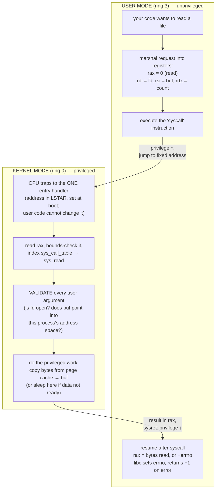

# M01 · Ch4 · §1 — The Kernel Boundary: User Mode, Kernel Mode & the System Call

> **Module:** How Computers & Operating Systems Work
> **Chapter:** I/O, Syscalls & the Kernel Boundary
> **Section:** The first section of Ch4, and the one the rest of the chapter stands on. Ch1–Ch3 stayed *inside* your process —
> instructions, the stack, memory, threads, the event loop. But your process can't actually touch the disk, the network card, the clock,
> or another process's memory. It can only **ask the kernel to**. This section is about that boundary: the two privilege modes a CPU runs
> in, what a **system call** actually is at the instruction level (a deliberate, guarded trap into the kernel — *not* a function call),
> what it costs and why, and the two engineering rules that fall straight out of the cost (**batch your syscalls**, and **park — don't
> spin — a task that's waiting**). It is the direct cash-in of every "the loop sleeps inside `epoll_wait`" / "one blocking syscall per
> tick" claim from Ch3 §2, and it sets up §2 (blocking vs non-blocking I/O) and §3 (why I/O dominates latency).
> **Status:** ✅ **finalized 2026-07-06.** The body held at your level and went untouched — you drove the whole session **past the edge
> of the material**, testing its *portability*: first "are syscalls the same on Windows and Linux?" (the section is written Linux-first), then
> "what's the difference between x86 and ARM, and why won't x86 Windows apps run on ARM Windows?" Both are your signature move — push one
> layer past the text — and both are comparative, your stated preference. §9 captures them; §1 now carries a short callout flagging what here
> is hardware-universal vs Linux-specific, because your first question showed the material shouldn't present the Linux vocabulary as if it
> were the whole story.

**Estimated study time:** 2–3 hours including reflection.

**Prerequisites — this section builds directly on things you already own:**
- **Ch1 §3 (machine code & the CPU):** the CPU executes one instruction stream; it has privileged operations (talking to devices,
  editing page tables). It also gives us the **Meltdown/Spectre** callback — speculation is *why* modern syscalls got more expensive.
- **Ch2 §1 & §3 (address space, paging, OOM):** every process has its own virtual address space and **cannot see** another's or the
  kernel's; demand paging and page faults are the machinery `mmap` reuses to turn file I/O into memory access. The kernel is the thing
  that *owns* the page tables you learned about.
- **Ch3 §2 (async, deeply):** you derived that the event loop's *one* blocking call per tick is `selector.select()` → `epoll_wait`, and
  that a task "parked on I/O" costs zero CPU. This section tells you what those actually **are**: syscalls. `epoll_wait` is a syscall; a
  blocking `read` is a syscall that puts your thread to sleep *in the kernel*; the GIL is released across them for exactly this reason.

---

## Why this section exists (for *you*)

You operate systems whose entire performance story is I/O — an async eval pipeline fanning out thousands of network calls, vLLM streaming
tokens, `llama.cpp` loading a multi-gigabyte weight file. You reason fluently one layer up (CPU-bound vs I/O-bound, where the GIL is free,
fan-out and back-pressure). But a set of facts you currently hold as *rules of thumb* all bottom out at one mechanism you haven't yet
made explicit:

- **"I/O releases the GIL"** — *why?* Because the thread isn't running your Python; it's blocked **inside the kernel**, and the kernel
  drops the GIL before it puts you to sleep.
- **"The event loop sleeps in `epoll_wait`"** — that's a **syscall**; the loop is a user-space scheduler whose one link to the outside
  world is a handful of syscalls.
- **"Buffered I/O is faster than reading a byte at a time"** — because each `read` is a *boundary crossing* with fixed overhead, and
  crossing it a million times to move a megabyte is the expensive way.
- **"`llama.cpp` mmaps the weights so load is cheap and the OS shares them across processes"** — that's the kernel turning file I/O into
  the demand-paging machinery of Ch2 §3.

Every one of those is the same idea wearing a different hat: **there is a hard, CPU-enforced line between your code and everything that
actually does I/O, and crossing it has rules and a price.** Once you can see the line, the chapter's later material — blocking models,
`epoll`, `io_uring`, latency budgets — stops being a list of APIs and becomes corollaries of one boundary.

**The one idea the whole section turns on.** Your program is deliberately *powerless*. It cannot execute the instructions that touch
hardware; the CPU will fault if it tries. All it can do is set up some arguments and execute one special instruction that says *"kernel,
take over — do this privileged thing for me, then give control back."* That transition — user → kernel → back — is the system call, and it
is the **only** door out of your process. Everything below is about that door: why it exists, how it's built so it can't be abused, what
it costs, and how good systems are shaped by that cost.

---

## 1. Two worlds: user mode and kernel mode

A modern CPU can execute in (at least) two **privilege levels**. On x86 they're called *rings*; the hardware offers four (ring 0–3) but
mainstream operating systems use exactly two of them:

- **Kernel mode (ring 0) — "supervisor" / privileged.** Code here may execute *every* instruction the CPU has: load the page-table base
  register (`CR3`), talk directly to device controllers, mask interrupts, halt the core, switch address spaces. The **kernel** runs here.
- **User mode (ring 3) — unprivileged.** Your process runs here. The *privileged* instructions are simply **not available**: attempt one
  and the CPU raises a fault (a **general-protection fault**), which the kernel turns into a signal — this is one way a process gets
  `SIGSEGV`/`SIGILL`. User mode can do arithmetic, move data between its own registers and its own memory, call its own functions — and
  that's it. It cannot reach outside its own virtual address space (Ch2 §1).

> **Is this Linux-only? What's universal vs what's just vocabulary (read this, then §9a).** This section is written Linux-first, but the
> *idea* is not Linux's — it's the **CPU's**. The two privilege levels, the `syscall`/`sysret` trap, the cost ladder, and the two rules
> (batch · park) are **hardware-enforced and identical on Windows and macOS** (and, on the same instruction set, on Intel and AMD alike).
> What *is* Linux-specific is the **vocabulary and one architectural choice**: the names (`sys_call_table`, `LSTAR`, `epoll`, `strace`,
> `/proc/cpuinfo`), and — the deep one — *where the stable contract lives.* On Linux the **syscall itself is the stable, public API** (call
> number 0 is `read` forever); on **Windows the syscall boundary is a private implementation detail** and the stable contract sits one layer
> up, in `ntdll.dll`/`kernel32.dll`. That single difference changes how you're *allowed* to call the kernel, and it's the thread you pulled
> first this session — the full comparison (including the `epoll` readiness model vs Windows' IOCP completion model) is in **§9a**.

Two things about this are worth pinning down, because they're commonly muddled:

**(a) The mode is a property of the CPU right now, not of "which program is running."** The very same core flips between ring 3 and ring 0
thousands of times a second. When your Python process calls `read()`, the *same hardware thread* transitions into ring 0, runs kernel
code, and transitions back — your process didn't stop being scheduled; it stepped through the door and came back. This is the distinction
that trips people up: **a mode switch is not a context switch.** A mode switch changes the CPU's privilege level (cheap-ish); a context
switch swaps *which process/thread* is running (expensive — §3).

**(b) The kernel is not "another process."** It has no PID; it isn't scheduled against your process. It's better pictured as a privileged
**library that lives in every process's address space** — mapped into the top of the virtual address range, but with its pages marked
*kernel-only* so ring-3 code faults if it even reads them. (Meltdown, §3, was a hardware bug that briefly let ring 3 read those
kernel-only pages via speculation — which is why the fix, KPTI, was to stop mapping them into user space at all.) When you make a syscall,
you're not "sending a message to the kernel process"; you're **entering privileged mode and running kernel code on your own CPU thread,
against kernel data structures.**

Why build the wall at all? Three reasons, all of which you've already met from the other side:

1. **Protection / isolation (Ch2).** If any program could write any memory or drive any device, one buggy process could corrupt every
   other and the OS itself. The wall is what makes "my process crashed" not mean "the machine crashed."
2. **Arbitration.** The disk, the NIC, physical RAM, the CPU cores — these are *shared*. Something has to decide who gets what and
   serialize access. Only privileged code can be trusted to do that fairly.
3. **A stable contract.** User code shouldn't have to know the difference between an NVMe SSD and a spinning disk and an NFS mount. The
   kernel hides all of that behind a *fixed, abstract interface* — `open`/`read`/`write`/`close` — the deepest, most durable "deep module"
   (M04 Ch2 §1) in the whole system. Unix's "everything is a file" is exactly this: one narrow interface over wildly different devices.

> **Physics-lens, used sparingly (it earns its place here):** think of the boundary like the guarded interface between a cleanroom and the
> outside. Inside (user mode) you handle only what you've been handed; you can't open the chase, touch the gas lines, or repipe the tool.
> To do any of that you file a request at the gowning airlock (the syscall), a qualified tech (the kernel) performs the privileged action
> under controlled conditions, and hands the result back through the same airlock. The airlock is deliberately the *only* way through, and
> it's deliberately a little slow — that's the safety property, not a bug.

---

## 2. What a system call actually *is* — a deliberate, guarded trap

Here is the part most explanations skip. A syscall is **not** "calling a kernel function." You cannot `call` a kernel address — those
pages are ring-0-only, and a `call` doesn't change privilege anyway. Instead a syscall is a **synchronous, intentional trap**: you execute
one special instruction that *simultaneously* raises the privilege level **and** jumps to a single fixed kernel entry point that you do not
choose. Walk the round trip on x86-64 (the calling convention is real and worth knowing):

1. **You (user mode) marshal the request into registers.** The **syscall number** goes in `rax` (e.g. `0` = `read`, `1` = `write`,
   `257` = `openat`). Up to six arguments go in `rdi, rsi, rdx, r10, r8, r9` — a file descriptor, a buffer pointer, a byte count, and so
   on. This is a *convention*, fixed by the kernel ABI, so both sides agree without a negotiation.
2. **You execute the `syscall` instruction.** This one instruction does the privileged transition: the CPU switches to ring 0, saves the
   return address and flags, and jumps to the address in a special register (`LSTAR` / `MSR_LSTAR`) that **the kernel set at boot** and
   user code cannot change. So you don't jump *wherever you like* into the kernel — you always land at the kernel's one **syscall entry
   handler**. (This single-entry design is the security property: the door has exactly one location, and the kernel controls it.)
3. **The kernel dispatches on the number.** The entry handler reads `rax`, bounds-checks it, and indexes the **system-call table**
   (`sys_call_table`) — an array of function pointers — to reach the actual implementation (`sys_read`, `sys_openat`, …). It **validates
   every argument** here, because they came from untrusted user space: is that file descriptor really open? Does that buffer pointer point
   into *your* address space and not the kernel's? (Skipping that check is a classic kernel-exploit primitive.)
4. **The kernel does the privileged work** — copies bytes from the page cache into your buffer, queues a DMA request to the NIC, reads the
   clock, whatever the call is. If the work can't complete immediately (the data isn't here yet), this is where a **blocking** call puts
   your thread to sleep — more in §5 and in §2.
5. **The kernel returns the result and drops back to user mode.** The return value (bytes read, or a negative error code) goes in `rax`;
   the kernel executes `sysret`, which restores ring 3 and your saved return address. You resume at the instruction after `syscall`.
6. **The C library turns a negative return into `errno`.** By convention the raw syscall returns `-errno` on failure (e.g. `-2` for
   `ENOENT`). The libc wrapper (§4) checks for that, stores the positive code in the thread-local `errno`, and returns `-1` to your code.
   That `errno` you check in C — and the `OSError`/`FileNotFoundError` Python raises — is this convention unwound.

<!-- DIAGRAM:START -->


<details>
<summary>Diagram source (Mermaid)</summary>



</details>
<!-- DIAGRAM:END -->

**The tell that a syscall ≠ a function call:** a function call jumps to an address *you* supply and stays at your privilege. A syscall
jumps to an address *the kernel* fixed, and it's the act of jumping there that *raises* your privilege. That asymmetry — you may enter, but
only through the one door, and only into code the other side wrote — is the entire safety model. (Historically the door was the software
interrupt `int 0x80`; modern CPUs added the dedicated `syscall`/`sysret` pair because it's much faster than a general interrupt.)

---

## 3. A syscall is not free — the cost ladder, and why it moved

Three kinds of "transfer control" show up constantly, and they differ in cost by orders of magnitude. Keeping them straight is what lets
you reason about performance instead of guessing:

| Transfer | Roughly | What actually happens |
|---|---|---|
| **Function call** (same process) | a few **ns** | push a frame, jump, return. No privilege change. The CPU stays hot — same registers, same cache, same TLB. |
| **System call** (round trip) | ~**0.1–1 µs** | privilege ↑, save/restore registers, run kernel entry+validation, privilege ↓. Same *thread*, but the kernel-entry path and any cache/TLB effects cost real cycles. |
| **Context switch** (thread/process) | ~**1–5 µs**, more for a process | a syscall's cost **plus** the scheduler picks another thread, swaps the register file and kernel stack, and — for a different *process* — reloads `CR3` and (partially) flushes the **TLB**, so the new process starts with cache/TLB misses. |

The figure makes the two gaps that matter concrete (log scale — every gridline is 100×):

<!-- FIGURE -->
![The latency landscape: a log-scale bar chart. Function call ≈2 ns and RAM read ≈100 ns sit on the CPU with no boundary; a system-call round trip ≈600 ns and a thread context switch ≈3 µs cross the kernel boundary; SSD random read ≈100 µs, same-datacentre round trip ≈500 µs, HDD seek ≈10 ms and an intercontinental internet round trip ≈150 ms are real devices past the boundary. Two annotations mark the gaps: a syscall is ≈300× a function call, so batch syscalls; device I/O is 150× to 250,000× a syscall, so park the waiting task rather than spin.](diagrams/01-the-kernel-boundary-and-syscalls-fig1.svg)

Read the whole chapter's engineering off this one picture:

- **A syscall is ~hundreds of times a plain function call.** That's why you never move data one byte per syscall. Reading a 1 MB file with
  a million 1-byte `read` calls pays the boundary a million times; one `read` of a big buffer pays it once. This is *exactly* why language
  runtimes wrap raw file descriptors in **buffered** I/O objects (Python's `open()` returns a `BufferedReader`; C's `fread` sits on a
  `FILE*` buffer): they call `read` in big chunks and hand you bytes from the buffer without crossing the line. **Rule 1: batch your
  boundary crossings.**
- **A device I/O is ~hundreds to hundreds-of-thousands of times a *syscall*.** An SSD read is ~100 µs; a cross-datacentre round trip
  ~500 µs; an intercontinental one ~150 **ms**. Next to those, the syscall overhead is a rounding error — which is the real content of "I/O
  dominates latency" (§3 of this chapter goes deeper). And it's *why the async model exists*: if a thread is going to wait 150 ms for a
  network reply, you must not let it hold a CPU (or a whole OS thread) doing nothing. You **park** it and run something else — cooperatively
  in one thread (asyncio, Ch3 §2) or by letting the kernel sleep the thread and schedule another. **Rule 2: park a waiting task; don't
  spin, and don't burn a thread per wait.**

**Why the syscall cost *moved* (the Meltdown/KPTI callback to Ch1 §3).** For decades a "null" syscall like `getpid` was ~100 ns. Then
**Meltdown** (2018) showed that ring-3 speculation could read the kernel pages mapped into every process. The fix — **KPTI** (Kernel Page
Table Isolation) — stopped mapping most kernel memory into user space, so **every** syscall now has to switch page tables *twice* (entry
and exit), each switch flushing TLB entries. On affected CPUs that multiplied syscall overhead by ~2–5×. This machine has KPTI active
(`/proc/cpuinfo` lists the `pti` flag), which is why the figure marks the syscall bar "KPTI era." The lesson is a clean loop back to Ch1:
**speculative execution wasn't just a micro-architecture curiosity — a hardware side-channel changed the cost of the single most common
boundary crossing in computing, and rippled up into how much syscall-batching matters.** (We meet the attack itself properly in M10.)

---

## 4. You never write `syscall` by hand — libc wrappers, and the vDSO trick

Two layers sit between your code and that instruction, and both are worth knowing because they explain things you'll actually see.

**The libc wrapper.** You don't emit the `syscall` instruction or load `rax` yourself. The C library provides a thin **wrapper function**
for each syscall — the C function `read()` is a few instructions that move arguments into the ABI registers, execute `syscall`, and
translate the `-errno` return into `errno` + `-1`. Your Python `os.read(fd, n)` calls CPython's C implementation, which calls libc `read`,
which does the trap. So the stack is: **your code → language runtime → libc wrapper → `syscall` instruction → kernel.** When you read a
traceback or an `strace`, "the syscall" is the bottom of that stack. (This is also why "is this function a syscall?" is often the wrong
question — `printf` is *not* a syscall; it formats into a user-space buffer and only calls the `write` syscall when the buffer flushes.
`malloc` is *not* a syscall; it hands out memory from a user-space pool and only calls `mmap`/`brk` when the pool needs to grow — Ch2 §3's
overcommit story lives right here.)

**The vDSO — a boundary crossing so common the kernel deleted it.** Some "syscalls" are read-only and blisteringly hot — `clock_gettime`,
`gettimeofday`, `getcpu`. Paying ~hundreds of ns to cross into the kernel *just to read the clock* is intolerable for code that timestamps
constantly. So the kernel maps a small, **read-only page of kernel-maintained data and code into every process** — the **vDSO** (virtual
dynamic shared object). The kernel keeps the current time updated in that page; `clock_gettime` in the vDSO just *reads user-accessible
memory* and returns, with **no ring transition at all**. It's the purest possible expression of Rule 1: the cheapest boundary crossing is
the one you don't make. (You can see it: `ldd` on almost any binary lists `linux-vdso.so.1` with no path — it has no file on disk; the
kernel injected it.)

---

## 5. Seeing them for real: `strace`

None of this is abstract — you can watch the boundary crossings of any program. `strace` uses the `ptrace` syscall to intercept and print
every syscall a process makes. Here is a real trace (captured on this machine) of a tiny Python program that reads a file and prints it —
filtered to the interesting lines:

```console
$ strace -e trace=openat,read,write,close \
    python3 -c "print(open('sample.txt').read().strip())"
...
openat(AT_FDCWD, "sample.txt", O_RDONLY|O_CLOEXEC) = 3      # open the file → fd 3
read(3, "hello from a file\n", 19)                 = 18      # one read pulls the whole file; got 18 B
read(3, "", 1)                                     = 0       # one more read → 0 = end of file
close(3)                                           = 0       # release the fd
write(1, "hello from a file\n", 18)                = 18      # print() → one write to fd 1 (stdout)
```

Everything you've read so far is visible in five lines (this is real output captured on this machine):

- **`openat(...) = 3`** — the return value `3` is a **file descriptor**: a small integer that is your process's *handle* to a kernel
  object. You never get the file itself; you get an index into the kernel's per-process open-file table. `0`, `1`, `2` are always stdin,
  stdout, stderr — which is why the `write` goes to fd `1`. (This handle-not-the-thing pattern is the same one as `epoll`'s fd in Ch3 §2.)
- **`read(3, ..., 19) = 18`** — `.read()` slurps the **whole file in a single syscall**: Python `stat`ed the file, saw 18 bytes, and asked
  for them in one go (the `19` is its read-to-EOF probe size). It did *not* read a byte at a time — that's **Rule 1 in action**. The
  follow-up `read(..., 1) = 0` is the kernel signalling end-of-file. (When Python *can't* know the size ahead — streaming a socket,
  iterating a large file line by line — it reads in fixed blocks instead, and you'll see `read(..., 8192)` calls: 8192 B is the default
  buffer, `io.DEFAULT_BUFFER_SIZE`. Same rule, different shape.)
- **`write(1, ..., 18)`** — your `print` bottomed out in exactly one `write` syscall to stdout. The string was formatted entirely in user
  space; only the final handoff crossed the boundary.

Two more `strace` habits worth having (both real output shapes you'll recognize):

- **`strace -c`** prints a *summary* — a table of which syscalls ran, how many times, and cumulative time. Run it on a slow program and the
  syscall eating the wall-clock is usually right at the top. It's the fastest "is this program I/O-bound, and on *what*?" check there is.
- A blocked process shows a syscall **with no return value yet** — e.g. `read(3,` or `epoll_wait(4,` sitting there with the cursor parked.
  That "hanging" line *is* your thread asleep in the kernel (§5 / §2). Seeing it is how you tell "stuck waiting on I/O" from "burning CPU in
  a loop" — the exact diagnosis your Ch3 §2 check-question 8.5 turned on, now visible from the outside.

---

## 6. Why this is the frame for the rest of the chapter

Everything in Ch4 is now a special case of "crossing the boundary":

- **§2 — Blocking vs non-blocking I/O.** A **blocking** `read` is a syscall that, if the data isn't ready, asks the kernel to *put your
  thread to sleep* (off the run queue, zero CPU) until it is — then wake it. **Non-blocking** I/O is the same syscall told "never sleep;
  if there's nothing, return `EAGAIN` immediately." **I/O multiplexing** (`select`/`poll`/**`epoll`**) is *one* syscall that sleeps on
  *many* file descriptors at once and wakes when any is ready — which is precisely `selector.select()` from Ch3 §2. You already know the
  *shape* (the loop's one blocking call); §2 fills in the model choices and why `epoll` beats `select` at scale (the C10k problem).
- **§3 — Why I/O dominates latency.** The right-hand side of this section's figure *is* §3's subject: the device latencies dwarf both
  compute and the boundary crossing, so total latency is set by how many device round trips you make and whether you overlap them — not by
  how fast your Python is. Latency budgets, batching, and pipelining all live here.
- **`mmap` — the boundary crossing you turn into memory.** `mmap` maps a file's bytes directly into your address space; after the one setup
  syscall, touching that memory faults pages in on demand (Ch2 §3's demand paging) instead of issuing `read` syscalls. This is exactly how
  **`llama.cpp` loads a multi-GB model**: `mmap` the weights, let the OS page them in as the forward pass touches them, and — because the
  mapping is backed by the shared **page cache** — *several* processes serving the same model share one physical copy in RAM. It trades the
  syscall-per-read model for the page-fault model; which one wins is a real §2/§3 trade-off, not a free lunch.

> **The keeper for the whole section.** Your process is a sealed room with exactly one door. The door (the syscall) is guarded (one fixed
> entry, every argument validated), it's *far* more expensive than moving around inside the room (so you go through it in big batches, not
> a thousand times), and on the far side lies everything slow (so when you must wait out there, you step aside and let someone else use the
> room). "Batch your crossings" and "park, don't spin" aren't two tips — they're the same fact about one boundary, seen from the two
> directions the rest of this chapter explores.

---

## 7. A note on the other doors (so the picture is complete)

A **syscall is a *synchronous, intentional* trap** — you asked for it. The CPU has two sibling mechanisms that use the *same* user→kernel
transition machinery but aren't syscalls, and naming them keeps the model clean:

- **Interrupts — asynchronous, external.** A device (NIC, disk, timer) raises an electrical signal; the CPU stops what it's doing, jumps
  into a kernel **interrupt handler**, services the device, and returns. This is *how the data you were waiting for actually arrives*: your
  blocking `read` sleeps, the disk finishes and fires an interrupt, the handler marks your data ready and wakes your thread. Interrupts are
  the kernel's side of the "park until ready" story in §5.
- **Exceptions / faults — synchronous, but *not* requested.** A **page fault** (Ch2 §3), a divide-by-zero, an illegal instruction: the CPU
  traps into the kernel mid-instruction because something needs handling. A page fault is often *benign* — it's how demand paging and
  `mmap` bring pages in — which is why "fault" here means "trap to the kernel," not "error."

All three — syscall, interrupt, fault — are doors from ring 3 to ring 0. The syscall is the one *you* open on purpose; the other two open
*for* you. Keeping the trio straight is most of understanding how an OS actually drives a machine.

---

## 8. Check your understanding

Bring your answers to our chat — especially where you have to *rank* the dominant effect, not just name a true one.

1. **Mode vs context.** A CPU core does a `read()` syscall for process P, then a moment later the scheduler switches to process Q. Which of
   those two transitions flushes the TLB, and why does that make it the more expensive one? (Tie it to Ch2's page tables.)
2. **The batching rule, quantified.** You must move a 10 MB file into your program. Estimate the boundary-crossing cost of doing it in
   1-byte reads vs 64 KB reads, using the figure's ~600 ns/syscall. Which term dominates the *total* time in each case — the crossings or
   the actual data movement — and what does that tell you about when batching even matters?
3. **`printf` is not a syscall — until it is.** Explain why a program that `printf`s in a tight loop can produce *no* `write` syscalls for a
   long time, then suddenly emit one. What user-space thing sits in between, and what event forces the crossing? (Bonus: why does piping
   the same program into `| cat` change *how often* it crosses?)
4. **The vDSO's whole point.** `clock_gettime` usually makes no ring transition. State the property of that call that makes this safe to do
   for `clock_gettime` but *not* for `read`. (What must be true of a call to serve it from a shared read-only page?)
5. **Reading the hang.** You `strace` a stuck process and see a lone `epoll_wait(6,` line with no return. A colleague `strace`s a *different*
   stuck process and sees no syscall line at all — just silence. Both programs "hang." Which one is a timeout's job to fix and which one
   isn't, and how does the strace output alone tell them apart? (This is 8.5 from Ch3 §2, now from the kernel side.)
6. **Why the GIL is free across I/O.** Put §5 and Ch3 together: when a Python thread is blocked in a `read` syscall, another Python thread
   can run. State *where* the GIL is released and *why the interpreter can safely release it there* (what is the blocked thread definitely
   **not** doing?).

---

## 9. Applied — captured from our 2026-07-06 session

You asked nothing about the body — you read it and immediately did the thing you always do: **pushed one layer past the text, and in the
direction the text was weakest.** The section is written Linux-first, so your first instinct was to test its *generality* ("is this the same
on Windows?"), and your second pulled the boundary all the way down to the silicon ("what's x86 vs ARM, and why won't an x86 Windows app run
on ARM Windows?"). Both are comparative questions — your stated preference — and together they draw the two portability lines that sit under
this whole chapter: **the OS line** (does the syscall look the same across kernels?) and **the ISA line** (does the compiled binary run on a
different CPU?). They're the right two questions, and they turn out to have opposite answers.

### 9a. Is the syscall the same on Windows and Linux? — separate the *hardware* from the *contract*

The keeper: **split what the CPU enforces from what the OS chose.** Everything in §1–§3 that comes from the *hardware* is identical
everywhere; everything that's a *name* or a *policy* is per-OS.

- **Identical, because it's the CPU, not the kernel:** the two privilege levels (ring 0 / ring 3; ARM calls them EL1/EL0), the
  `syscall`/`sysret` trap, the single fixed entry the kernel installs in `LSTAR`, the cost ladder (fn call ≪ syscall ≪ context switch), and
  the two rules (batch · park). **Even Meltdown/KPTI has a Windows twin** — Microsoft shipped the same page-table-isolation mitigation under
  the name **KVA Shadow**, with the same "syscalls got more expensive" effect. The §3 figure holds on all three OSes.
- **The deep divergence you pulled first — *where the stable contract lives*.** This is the one worth remembering:

  | | Linux | Windows |
  |---|---|---|
  | The stable, guaranteed ABI is at… | **the syscall boundary itself** | **a DLL layer *above* the syscall** |
  | Syscall #0 is `read`… | …forever — numbers are public and frozen ("we do not break userspace") | …**not guaranteed** — numbers change between Windows versions/builds |
  | Issue a raw syscall yourself? | Yes — Go's runtime does exactly this, no libc | **No** — you go through `ntdll.dll` / `kernel32.dll` |
  | The dispatch table is called… | `sys_call_table` | the **SSDT** (System Service Descriptor Table), private |

  On Linux, the narrow interface this section taught (`open`/`read`/`write`) *is* the durable contract. On Windows, `ReadFile` →
  `kernel32.dll` → `ntdll!NtReadFile` (the stub holding the `syscall` instruction) → kernel; the promise is at `ReadFile`, and the number
  underneath is an implementation detail that shifts under you. Consequences you can *see*: malware that hard-codes Windows syscall numbers
  breaks after an update; endpoint-security tools hook inside `ntdll` rather than the kernel table. macOS is the same shape — the stable ABI
  is `libSystem`, and Apple actively breaks direct syscalls (Go got bitten on Darwin and now routes through libc).
- **The second real difference — the I/O model (this is the one that touches your async work).** §6 forward-refs `epoll`, which is a
  **Linux** primitive and a **readiness** model ("tell me when the fd is *ready*, I'll do the read"). Windows was built around **IOCP (I/O
  Completion Ports)**, a **completion** model ("start the read, tell me when it's *done*, bytes already in my buffer"). Academic names:
  *reactor* vs *proactor*. You can see this leak into a tool you use daily — **`asyncio` picks a different event loop per OS**:
  `SelectorEventLoop` (epoll) on Linux, `ProactorEventLoop` (IOCP) on Windows, same `async`/`await` on top. And Linux's **`io_uring`** (§2's
  "modern answer") is Linux *adopting the completion model* — so the two designs are converging.
- **Cosmetic but worth a line:** the file-descriptor-as-small-int-handle idea maps to Windows **`HANDLE`s** (same "handle, not the thing"),
  but Unix's "**everything is a file**" (one `read` over files, sockets, pipes, even `epoll`) is a Unix *design choice*, much weaker on
  Windows (sockets go through Winsock, files through `ReadFile`). And tooling: `strace`→`ptrace` is Linux; Windows is ProcMon/ETW, macOS is
  `dtruss`/DTrace.

> **Keeper (9a):** *the syscall mechanism is hardware and therefore universal; the syscall **interface** is a per-OS contract, and the single
> biggest portability fact is that Linux freezes it at the syscall while Windows/macOS freeze it one layer up in a system DLL.* When you read
> "Linux-specific" in this section, it's almost always the **name** or the **stable-ABI location** that's specific — not the idea.

### 9b. x86 vs ARM, and why an x86 Windows app won't run on ARM Windows — the ISA is the binary's mother tongue

Then you pushed below the OS entirely, to the CPU. The keeper here is that **question 2 is a corollary of question "what is an ISA."**

**What actually differs (not just the CISC/RISC slogan).** They're different **ISAs** — the CPU's binary language — so the same `add` is
different *bytes* on each. The differences that carry weight:

| | x86-64 (Intel/AMD) | ARM (AArch64) |
|---|---|---|
| Instruction length | **variable, 1–15 bytes** | **fixed, 4 bytes** |
| Memory operands | arithmetic can touch memory directly | **load/store** — compute on registers only |
| Registers | 16 general-purpose | **31** (fewer spills) |
| Memory ordering | **strong (TSO)** | **weak / relaxed** |
| Vendors | two (Intel, AMD) | **licensed IP** — Apple, Qualcomm, **Amazon Graviton**, Ampere roll their own |

Three of those have mechanisms behind them, and two are callbacks you'd already earned:

- **Fixed vs variable length → the efficiency story, mechanically.** x86's variable length makes the *decoder* complex (you can't find
  instruction N+1 until you've decoded N) — power-hungry and hard to parallelize; ARM's fixed 4-byte instructions let you decode many in
  parallel (how Apple's M-series runs such a wide front-end). And the **CISC/RISC line is blurry**: modern x86 chips *decode into RISC-like
  micro-ops* internally, so the **ISA is the contract, not the microarchitecture** — a direct Ch1 §3 callback.
- **Memory ordering was the one that lit up for you (Ch3 §3 callback).** x86 is strongly ordered (mostly preserves your write order); ARM is
  weakly ordered and reorders aggressively unless you insert **memory barriers** (acquire/release, `dmb`). So **concurrent code with a latent
  data race that "worked" on x86 can start failing on ARM** — the §7 "hardware floor" of your synchronization section made real, and a
  genuine hazard when teams move server code to Graviton. Same lesson as Ch3: don't lean on incidental ordering; use real atomics/locks.

**Why the binary won't run — and the honest nuance.** A compiled `.exe` *is* machine code for one ISA; an ARM CPU can't decode x86 bytes, so
**natively it's impossible** — no chip runs both. But the true answer is "not *natively* — and emulation has limits," because Windows-on-ARM
ships an x86/x64 **emulator** (**Prism** on Windows 11 Copilot+ PCs, the same idea as Apple's **Rosetta 2**) that binary-translates x86 →
ARM at runtime. So the failures cluster where emulation *can't* reach — and naming them is the keeper:

1. **Kernel-mode code can't be emulated (the real killer).** A ring-0 **driver** (antivirus, VPN, anti-cheat) runs *beside* the ARM kernel;
   you can't splice an emulated x86 blob into ring 0. Needs a native ARM64 driver or it simply won't work.
2. **Performance cost** — translation is slower than native (Prism/Rosetta narrowed it, but you still pay); fine for an editor, painful for
   a game or compiler.
3. **You can't mix ISAs in one process** — a native ARM app can't load an x86 plugin/DLL into its address space (one ISA per address space),
   so extensible apps break at the plugin boundary.

**The tie-back to your world (Ch1 §1 callback).** You've lived the flip side on **AWS Lambda / Graviton**: you choose `x86_64` or `arm64`
and must **build for the target** — a container image is `linux/amd64` *or* `linux/arm64` (hence Docker `buildx` multi-arch manifests). And
notice *why Python travels cross-arch for free*: your `.py` isn't machine code, it's **arch-independent bytecode** — only the CPython
**interpreter** is compiled per-arch. The portability you get for nothing in Python is exactly the portability a compiled `.exe` lacks. The
exception is **native extensions** (numpy, anything with C) — those *are* machine code and must match the arch, which is why the odd
`pip install` grabs the wrong wheel on ARM.

> **Keeper (9b):** *native execution requires the same ISA — a binary speaks exactly one CPU's language; emulation (Prism/Rosetta) bridges
> **user-mode** code at a cost, but breaks at (a) ring-0 driver code, (b) performance-critical paths, and (c) mixing ISAs in one process.*
> And the reason interpreted/JIT'd runtimes dodge the whole problem is Ch1 §1: they ship arch-neutral bytecode over a per-arch engine.

*(Meta-note for both threads: these were open exploratory questions, not hypotheses to re-rank — consistent with how you work in
conceptual/systems domains. The value added was **structure and naming** (hardware-vs-contract; ISA-as-mother-tongue; the three emulation
failure modes) and wiring the answers back to material you already own — Ch3 §3 memory ordering, Ch1 §1 bytecode, your Graviton/Docker
practice. This whole session is really a **Ch1 §3 / Ch1 §5 trailer**; when we reach M01 Ch5 the OS-landscape comparison gets the full
treatment, and the x86/ARM memory-model hazard is worth reopening then.)*

---

## 10. References (optional, for depth)

*(All links verified live 2026-07-06.)*

- **[`man 2 syscall` — the calling convention](https://man7.org/linux/man-pages/man2/syscall.2.html)** — the authoritative per-architecture
  table of *which registers* carry the number and arguments (the x86-64 `rax`/`rdi`/`rsi`/… of §2). Short and worth reading once.
- **[`man 2 syscalls` — the full list](https://man7.org/linux/man-pages/man2/syscalls.2.html)** — every Linux system call, one line each.
  Skim it to feel how *narrow* the real interface to the kernel is (a few hundred calls run everything).
- **[`man 7 vdso` — the virtual dynamic shared object](https://man7.org/linux/man-pages/man7/vdso.7.html)** — the mechanism behind §4's
  "boundary crossing the kernel deleted." Explains which calls are accelerated and how the page is mapped.
- **[Julia Evans — the `strace` zine ("Spying on your programs with strace")](https://jvns.ca/blog/2015/04/14/strace-zine/)** and
  **["What problems do people solve with strace?"](https://jvns.ca/blog/2021/04/03/what-problems-do-people-solve-with-strace/)** — the
  clearest accessible writing on watching syscalls in the wild (§5); the friendly long form of "just run `strace` and look."
- **[Brendan Gregg — "KPTI/KAISER Meltdown Initial Performance Regressions"](https://www.brendangregg.com/blog/2018-02-09/kpti-kaiser-meltdown-performance.html)**
  — measured numbers for §3's "why the syscall cost moved," from someone who benchmarks this for a living. The syscall-heavy workloads are
  the ones that regressed most — the batching rule made visible.
- **["Latency Numbers Every Programmer Should Know" (Colin Scott's interactive version)](https://colin-scott.github.io/personal_website/research/interactive_latency.html)**
  — the source lineage of this section's figure (Jeff Dean / Peter Norvig), with the numbers animated over time so you can see SSDs and
  networks move.
- **[Michael Kerrisk, *The Linux Programming Interface*](https://man7.org/tlpi/)** — the reference book for this entire chapter; ch. 3
  ("System Programming Concepts") is the definitive long-form version of *this* section. The `man7.org` pages above are by the same author.
- **[Python docs — `os` low-level I/O (`os.open`/`os.read`/`os.write`)](https://docs.python.org/3/library/os.html#file-descriptor-operations)**
  — the thin Python layer sitting directly on the syscalls, below the buffered `open()`. Useful for seeing where the boundary is in your
  own code.

**For §9 (the portability threads you drove):**
- **[Microsoft Learn — "How x86 & x64 emulation work on Arm"](https://learn.microsoft.com/en-us/windows/arm/apps-on-arm-x86-emulation)** —
  the authoritative description of the Windows-on-ARM emulator (and Prism), including *why* kernel drivers must be native ARM64 (9b's real
  killer) and the mixed-ISA loading rule.
- **[j00ru — Windows System Call Tables](https://j00ru.vexillium.org/syscalls/nt/64/)** — the living proof of 9a's headline: the Windows
  syscall *numbers* tabulated per build, visibly changing across versions. This is why you call `ntdll`, not the number.
- **[Jeff Preshing — "Weak vs. Strong Memory Models"](https://preshing.com/20120930/weak-vs-strong-memory-models/)** — the clearest short
  treatment of the x86-TSO-vs-ARM-weak divide from 9b (and the Ch3 §3 hardware floor); read it before porting concurrent code to Graviton.

---

### What's next
✅ **Finalized 2026-07-06.** This section drew the line the whole chapter stands on: user vs kernel mode, the syscall as a guarded trap
(not a function call), its cost and the two rules that fall out (batch crossings · park a waiting task), and the `strace`/`mmap`/vDSO
reality — plus §9's two portability lines (the OS line: syscall mechanism universal, contract per-OS; the ISA line: a binary speaks one
CPU's language, emulation bridges only user-mode). Natural follow-ons, your call at the boundary:
- **Ch4 §2 — Blocking vs non-blocking I/O & multiplexing** (blocking / non-blocking / `select`·`poll`·`epoll` / `io_uring`; the C10k
  problem; the model your event loop actually uses). The direct continuation, and it cashes the `epoll_wait` thread from Ch3 §2.
- **Ch4 §3 — Why I/O dominates latency** (the right-hand side of this section's figure, made into latency budgets and pipelining).
- Or **rotate scope** per the interleave: **M04 Ch2 §2** (refactoring in moves, SWE) or **M12 Ch2 §3** (audio/speech/TTS, AI).

<!-- Bilingual key-terms table follows; see authoring-conventions §5. -->

## Key terms (English · 大陆简体 · 台灣繁體)

| English | 大陆 (简体) | 台灣 (繁體) | Note |
|---|---|---|---|
| kernel | 内核 | 核心 | ⚠ genuinely different words, not just script |
| system call | 系统调用 | 系統呼叫 | ⚠ 调用 vs 呼叫 (both = "call/invoke") |
| user mode / kernel mode | 用户态 / 内核态 | 使用者模式 / 核心模式 | ⚠ 大陆 uses 态 ("state"); 台灣 uses 模式 ("mode") |
| privilege level | 特权级 | 特權級 | script only |
| trap | 陷入 / 陷阱 | 陷阱 | 大陆 verb 陷入 ("to trap into"); noun 陷阱 both |
| system-call table | 系统调用表 | 系統呼叫表 | follows 调用/呼叫 |
| file descriptor | 文件描述符 | 檔案描述符 | ⚠ 文件 vs 檔案 (file); 描述符 usually shared |
| memory (RAM) | 内存 | 記憶體 | ⚠ genuinely different words |
| memory-mapped (mmap) | 内存映射 | 記憶體映射 | follows 内存/記憶體 |
| page fault | 缺页 (异常) | 缺頁 (例外) | script; and 异常 vs 例外 (exception) ⚠ |
| interrupt | 中断 | 中斷 | script only |
| context switch | 上下文切换 | 上下文切換 / 內容交換 | 上下文 shared; 台灣 also says 內容交換 |
| buffer | 缓冲区 | 緩衝區 | script only |
| blocking / non-blocking | 阻塞 / 非阻塞 | 阻塞 / 非阻塞 | shared |
| process | 进程 | 行程 | ⚠ genuinely different (from Ch3) |
| thread | 线程 | 執行緒 | ⚠ genuinely different (from Ch3) |
