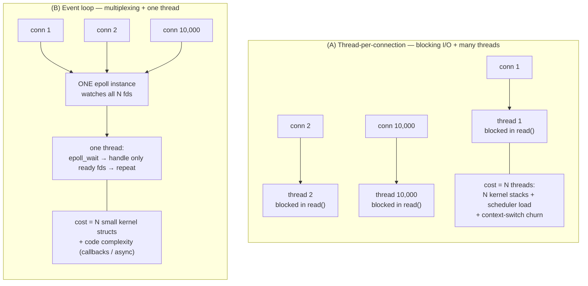
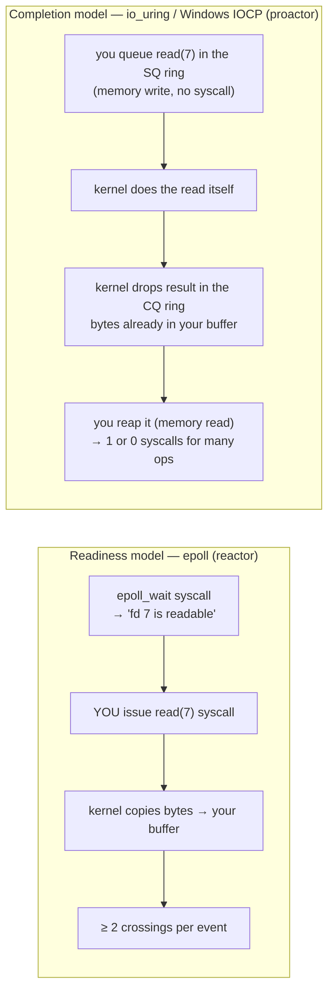

# M01 · Ch4 · §2 — Blocking vs Non-blocking I/O, and the Multiplexing Story: `select` → `poll` → `epoll` → `io_uring`

> **Module:** How Computers & Operating Systems Work
> **Chapter:** I/O, Syscalls & the Kernel Boundary
> **Section:** The payoff of §1. §1 said a blocking `read` is a syscall that *parks your thread in the kernel* until data arrives. That's
> fine for **one** connection. This section is about what happens when you have **ten thousand** — the question that shaped every network
> server and every async runtime you use. It walks the **five I/O models** (blocking · non-blocking · multiplexing · signal-driven ·
> asynchronous), the two **concurrency architectures** built on them (thread-per-connection vs the event loop), the **C10k problem** that
> forced the change, and the **`select` → `poll` → `epoll`** scaling story — then closes the loop to §9a by showing `io_uring` and Windows
> IOCP as the *completion* model. It is the direct cash-in of Ch3 §2's "the loop's one blocking call is `epoll_wait`."
> **Status:** 🔵 **draft** — prepared 2026-07-06. Body below; the Applied section (§9) and finalize come after our Q&A.

**Estimated study time:** 2–3 hours including reflection.

**Prerequisites — this section stands directly on:**
- **§1 (the kernel boundary):** a syscall is a guarded, costly trap; a **blocking** call asks the kernel to *sleep your thread* until it can
  finish; **batch your crossings** and **park a waiting task**. This section is those two rules applied to the hardest case — many waits at
  once. The §9a **readiness (reactor) vs completion (proactor)** split returns here as the `epoll`-vs-`io_uring`/IOCP distinction.
- **Ch3 §1–§2 (concurrency, async):** you derived that async is *one thread, massive concurrency, zero parallelism* (the bottom-left cell),
  that the event loop's **one blocking call per tick is `selector.select()` → `epoll_wait`**, and that a task "parked on I/O" costs zero CPU.
  This section is what's *under* that: what `epoll_wait` is, why it's the one call, and why it beats the alternatives at scale.
- **§1's GIL note:** a blocking I/O syscall **releases the GIL** because the thread is asleep in the kernel, not running bytecode. That's the
  fact that makes thread-per-connection *possible* in Python at all (§4) even though the GIL serializes CPU work.

---

## Why this section exists (for *you*)

You run two systems whose whole shape is decided by the material below, and you currently reason about them one level up from the mechanism:

- **Your async eval pipeline** fans out thousands of concurrent network calls from *one* thread. *Why does that work — why doesn't it need
  a thread per call?* Because underneath `asyncio` there is exactly one `epoll` instance and one `epoll_wait` syscall that watches all of
  them at once. This section is that "one `epoll_wait`."
- **Your LLM-serving stack** (vLLM behind FastAPI/uvicorn, etc.) holds thousands of concurrent HTTP/streaming connections per process. It
  does *not* spawn thousands of threads; it runs an event loop on `epoll`. The reason it can is the C10k story below.

The trap this section defuses: it's tempting to think "handle many connections" means "spawn many workers." For **I/O-bound** concurrency
that is the *wrong* default — the winning move is one worker that the kernel *notifies* when any of its thousands of connections is ready.
Getting the model right is the difference between a server that tops out at a few thousand connections and one that holds a million.

**The one idea the whole section turns on.** With one connection, "wait for I/O" is easy: call `read`, let the kernel sleep you (§1). With
*N* connections the question becomes *"how does one thread wait for N things at once without (a) burning a CPU polling them or (b) burning a
thread per thing?"* Every model below is an answer to exactly that question, and they line up on a single axis: **how much work does it take
to find out which of my N connections are ready?** Blocking makes you use N threads; naive non-blocking makes you spin; `select`/`poll` ask
the kernel but cost $O(n)$ per check; `epoll` makes the kernel *remember* your connections and hand back only the ready ones, $O(\text{ready})$;
`io_uring`/IOCP go further and do the read *for* you. Hold that axis — "cost to find the ready ones" — and the whole progression is
inevitable.

---

## 1. Any single I/O has two phases — and that's the whole taxonomy

Before the models, one distinction they're all built on. A `read` on a socket does **two** things, and they can block independently:

1. **Wait for data to be ready** — the bytes haven't arrived from the network yet. This is the long wait (the §1 figure's right-hand side:
   µs to ms).
2. **Copy the data** — once it's in the kernel's socket buffer, copy it across the boundary into your user-space buffer. This is short (a
   memory copy) but still costs CPU and, classically, still happens *in* the blocking call.

The five classic I/O models (the taxonomy from Stevens' *UNIX Network Programming*) are just the five ways to divide responsibility for
those two phases between you and the kernel:

| Model | Phase 1 (wait for ready) | Phase 2 (copy to user) | In one line |
|---|---|---|---|
| **Blocking** | thread sleeps in the kernel | thread sleeps in the kernel | the default; one thread is captive per in-flight I/O |
| **Non-blocking** (`O_NONBLOCK`) | returns `EAGAIN` immediately; **you** poll again | blocks briefly during copy | you spin asking "ready yet?" — wasteful alone |
| **I/O multiplexing** (`select`/`poll`/`epoll`) | **one call blocks on many fds**, wakes on the first ready | you then do the (non-blocking) read | one thread waits for thousands — the server model |
| **Signal-driven** (`SIGIO`) | kernel sends a signal when ready | you then read | rare; signals are awkward to compose |
| **Asynchronous** (POSIX AIO, **`io_uring`**, Windows IOCP) | kernel does it | **kernel does the copy too** | you submit, kernel delivers the finished bytes |

The load-bearing split is the last row against the rest. In the first four, *you* still perform the `read` yourself and your thread is
synchronously involved in phase 2 — these are **synchronous** models. Only the last hands **both** phases to the kernel and just notifies you
when the bytes are already in your buffer — the **asynchronous / completion** model. This is precisely the **readiness (reactor) vs
completion (proactor)** distinction you pulled out in §9a: `epoll` is readiness ("I'll tell you *when to* read"); `io_uring`/IOCP is
completion ("I'll tell you *that I read*"). Keep that filed — it's the last section.

---

## 2. Two architectures you can build, and the one that scales

Those models give you two fundamentally different ways to structure a server or client that handles many connections.

<!-- DIAGRAM:START -->

Diagram source (Mermaid)

<!-- DIAGRAM:END -->

**(A) Thread-per-connection.** One thread per client, each doing simple *blocking* reads/writes. The code is beautifully linear — every
thread reads like a synchronous script, no callbacks, no state machine. This is Apache's classic `prefork`/`worker` model, and it's genuinely
fine up to hundreds or low thousands of connections. Its costs, which you can now name precisely from earlier chapters:

- **Memory.** Each thread has its own stack — Linux defaults to **8 MB of *virtual* address space** per thread. Thanks to overcommit and
  demand paging (Ch2 §3), that's not 8 MB of RAM each — only the touched pages are resident — but the *kernel* structures (each thread's
  kernel stack, task struct) are real, and 10k threads is real memory plus real bookkeeping.
- **Scheduling.** The OS scheduler must now time-slice among thousands of threads; each **context switch** costs (§1's ladder: ~µs, plus
  cache/TLB churn). Most of those threads are *blocked* at any instant, but the ones that wake stampede the scheduler.
- **It doesn't get you parallelism you can use (in Python).** Under the GIL, threads don't run Python in parallel anyway (Ch3 §1) — they
  help *only* because a blocked I/O syscall releases the GIL (§1). So you pay the thread costs to buy concurrency you can get more cheaply.

**(B) The event loop.** *One* thread, *one* `epoll` instance watching all N connections, a loop that asks the kernel "which are ready?" and
services only those. This is **nginx, Redis, Node.js (via libuv), and Python's `asyncio`**. The per-connection cost collapses to a small
kernel data-structure entry; what you pay instead is **code complexity** — the linear script becomes callbacks or `async`/`await`, and one
un-yielding computation stalls *everyone* (Ch3 §2's "blocking the loop"). That trade — cheap concurrency for harder control flow — is the
whole reason `async` exists as a programming model.

> The pivot: thread-per-connection puts the "who's ready?" bookkeeping in the **OS scheduler** (expensive at scale); the event loop puts it
> in **one `epoll` call** (cheap at scale). Same job, moved to where it's cheaper.

---

## 3. The C10k problem — why this became urgent

In 1999 Dan Kegel named the **C10k problem**: how do you get a single server to handle **10,000 concurrent connections**? Hardware of the day
could easily *push the bytes* for 10k clients — the bottleneck was software, specifically the two things above: thread-per-connection ran out
of memory and drowned the scheduler, and the readiness-checking syscalls of the era (`select`/`poll`) cost $O(n)$ *per call* (§5), so just
*finding out who was ready* became the bottleneck as $n$ grew. The C10k answer was a full switch to **event-loop + a scalable readiness
primitive** — which is exactly what drove Linux's `epoll` (2002), BSD's `kqueue`, and the servers built on them. Today the same reasoning
runs at **C10M** (ten million), where even `epoll`'s per-event syscall overhead matters and you reach for `io_uring` and kernel-bypass — but
the shape of the argument is identical: *don't do $O(n)$ work to find the ready ones, and don't burn a thread per wait.*

---

## 4. `select` → `poll` → `epoll`: the scaling story (the mechanism)

All three answer the same question — *"of my N registered fds, which are ready right now?"* — and the difference is entirely in **how much
work that costs** and **who remembers the fd list.**

**`select` (1983).** You pass three **bitmask** sets (read/write/exception) sized to the highest fd number. The kernel scans *every* fd up to
that max, marks the ready ones, and returns. Three problems, all fatal at scale:
- **$O(n)$ every call** — the kernel walks all $n$ fds even if only one is ready.
- **`FD_SETSIZE = 1024`** — the bitmask is a fixed-size array; you cannot watch fd numbers ≥ 1024 without recompiling. A hard wall.
- **The set is *modified* in place**, so you must **rebuild all three sets before every call** — more $O(n)$ work in user space.

**`poll` (1986).** Replaces the bitmask with an **array of `struct pollfd { fd; events; revents; }`**. This removes the 1024 wall (the array
is any length) and separates "what I asked for" (`events`) from "what happened" (`revents`) so you needn't rebuild each call. But it's **still
$O(n)$**: you still pass the whole array in on every call, and the kernel still scans all $n$ to see who's ready. Better ergonomics, same
asymptotic cost.

**`epoll` (Linux 2.6, 2002).** The insight: *stop re-telling the kernel your fd list every call.* `epoll` is **stateful**, split into three
syscalls:
- **`epoll_create1()`** — make an epoll instance (itself an fd; §1's handle-not-the-thing again).
- **`epoll_ctl(ADD/MOD/DEL, fd)`** — register interest in an fd **once**. The kernel stores it in an internal structure (a red-black tree)
  and — crucially — attaches a **callback** to that fd so that *when it becomes ready*, the kernel moves it onto a **ready list**.
- **`epoll_wait()`** — return the fds from the **ready list**. This is $O(\text{number ready})$, **not** $O(n)$: the kernel already knows who's
  ready because the callbacks maintained the list as events happened. No scan.

That single change — the kernel *remembers* your interest set and *maintains* a ready list via per-fd callbacks — is why `epoll` is flat
while `select`/`poll` climb. The figure makes the gap concrete:

<!-- FIGURE -->
![Log-log plot of work per readiness-check call vs number of monitored connections. select and poll rise as a straight O(n) diagonal (the kernel rescans every registered fd on every call), while epoll is a flat O(ready) line (the kernel returns only the fds that fired). A vertical marker at 1024 shows select's FD_SETSIZE wall; a marker at 10,000 shows the C10k point, where select/poll do ~10,000 units of work per call while epoll does ~50. The caption stresses the fix isn't faster hardware — it's not rescanning idle connections.](diagrams/02-blocking-nonblocking-and-multiplexing-fig1.svg)

At 10k mostly-idle connections (the common case — most clients are between requests), `select`/`poll` do ~10,000 units of bookkeeping *per
loop iteration* to discover that maybe 50 are ready; `epoll` does ~50. The win isn't a faster CPU — it's **refusing to look at the idle
connections at all.** A compact comparison:

| | `select` | `poll` | `epoll` (Linux) / `kqueue` (BSD, macOS) |
|---|---|---|---|
| Cost per call | $O(n)$ | $O(n)$ | $O(\text{ready})$ |
| fd limit | `FD_SETSIZE` (1024) | none | none |
| Re-pass fd list each call? | yes (and rebuild) | yes | **no** — registered once with `epoll_ctl` |
| Portability | everywhere (POSIX) | everywhere (POSIX) | Linux-specific (`kqueue` = BSD/macOS; IOCP = Windows) |
| Used by | legacy / small $n$ | legacy / moderate $n$ | nginx, Redis, `asyncio`, libuv |

Note the portability row — this is §9a again: `select`/`poll` are portable POSIX; the *scalable* primitive is per-OS (`epoll` Linux,
`kqueue` macOS/BSD), which is exactly why cross-platform runtimes ship an abstraction layer (**libuv** for Node.js; Python's `selectors`
module picks the best backend per OS) rather than calling `epoll` directly.

**One sharp edge worth knowing: level-triggered vs edge-triggered.** `epoll` has two notification modes. **Level-triggered (LT, the default,
and what `poll` does):** `epoll_wait` keeps reporting an fd as ready *as long as* there's unread data — forgiving, you can read a little at a
time. **Edge-triggered (ET, `EPOLLET`):** it reports only on the *transition* to ready (the moment data arrives), and never again until more
arrives — so you **must** drain the socket in a non-blocking loop until `EAGAIN`, or you'll leave data unread and hang. ET means fewer
`epoll_wait` wake-ups (higher performance) at the cost of much easier bugs. **`asyncio` uses level-triggered**, which is the sane default;
the highest-tier servers use ET carefully. (If you ever see a hung connection that "should have data," a missed ET drain loop is a prime
suspect.)

---

## 5. The completion model: `io_uring` (and the tie back to Windows IOCP)

`epoll` fixed *finding* the ready fds, but it's still the **readiness** model, and it still pays §1's syscall tax: for every batch of ready
connections you make an `epoll_wait` syscall **and then** a `read` syscall for each — two crossings per served event, minimum. At C10M and for
storage I/O, that syscall overhead itself becomes the wall.

**`io_uring` (Linux 5.1, 2019)** attacks it with the *completion* model and §1's "batch your crossings" taken to the limit. You and the kernel
share **two ring buffers in mmap'd memory** (Ch2 §3's `mmap` returns): a **submission queue (SQ)** where you write I/O requests, and a
**completion queue (CQ)** where the kernel writes results. You:
1. write N requests into the SQ (just memory writes — **no syscall**),
2. make **one** `io_uring_enter` syscall to tell the kernel "go" (and with a polling mode, `SQPOLL`, even that can be skipped — a kernel
   thread watches the ring, so a busy server can submit and reap I/O with **zero syscalls**),
3. later read completed results out of the CQ (again, just memory reads) — and the kernel has **already done the reads**; the bytes are in
   your buffers.

<!-- DIAGRAM:START -->

Diagram source (Mermaid)

<!-- DIAGRAM:END -->

This is the exact model **Windows was built on from the start — IOCP (I/O Completion Ports)** — which is why, as you saw in §9a, `asyncio`
uses a `ProactorEventLoop` (IOCP) on Windows and a `SelectorEventLoop` (`epoll`) on Linux. Linux spent two decades on the readiness model and
`io_uring` is it **converging** onto completion. So the two OS families, which started at opposite ends (Linux readiness / Windows
completion), are meeting in the middle — and the vocabulary you now have (reactor vs proactor, readiness vs completion) is exactly what makes
that convergence legible.

> **The keeper for §5:** `epoll` removed the $O(n)$ *scan*; `io_uring` removes the *per-operation syscall*. Both are the same §1 instinct —
> stop paying the boundary crossing you don't need — applied at successive scales. Readiness says "tell me when I can act"; completion says
> "act for me and tell me when it's done."

---

## 6. Where your world actually sits

Assembling it against systems you run:

- **`asyncio` (your eval pipeline).** One thread, one `SelectorEventLoop` = one `epoll` instance, level-triggered. Every `await` on a socket
  registers its fd with `epoll_ctl`; the loop's single blocking call per tick is `epoll_wait` (Ch3 §2, now fully cashed); a ready fd wakes
  its parked coroutine. Your "thousands of concurrent calls from one thread" is **model (B)** with `epoll` underneath — no thread per call,
  because the kernel is doing the multiplexing.
- **Your LLM-serving front (uvicorn/FastAPI).** Same shape: an `asyncio`/`uvloop` event loop on `epoll` holds the many streaming HTTP
  connections; the GPU work is the CPU-bound part you keep *off* the loop (Ch3 §2's `run_in_executor`, or a separate worker/process). This is
  why one process serves many streams without many threads.
- **When you deliberately pick threads instead.** Model (A) still wins when the work behind each connection is a **blocking C library with no
  async version** (a synchronous DB driver, a blocking SDK) — you can't `await` it, so you run it in a thread pool where its blocking syscall
  releases the GIL (§1). "Async all the way down" only works if nothing in the stack blocks the loop.

---

## 7. Loose ends, so the picture is complete

- **This is about I/O concurrency, not CPU parallelism.** Multiplexing lets one thread *wait* for many things; it does nothing for
  CPU-bound work (Ch3 §1). An event loop pegged on computation still needs `run_in_executor` → threads/processes. Don't reach for `epoll` to
  speed up a hot loop.
- **Non-blocking ≠ multiplexing.** Setting `O_NONBLOCK` alone just turns "sleep" into "`EAGAIN`, try again" — which is a busy-wait if you
  loop on it. Non-blocking mode is the *partner* of multiplexing (you set fds non-blocking so that after `epoll_wait` says "ready" your
  `read` can't accidentally block, especially under edge-triggered), not a replacement for it.
- **`epoll` is a readiness primitive, not a magic "async file" API.** Classically it works for sockets, pipes, and other pollable fds but
  **not regular disk files** (a disk read is "always ready" and still blocks on the platter/SSD) — which is one reason `io_uring`, which does
  real async *disk* I/O, matters beyond just sockets.

> **The keeper for the whole section.** The question was never "how do I make one I/O fast" — it's "**how does one thread wait for thousands
> of I/Os without spinning or spawning?**" The answer evolved along one axis, *the cost to find (and finish) the ready ones*:
> blocking (a thread each) → non-blocking (spin) → `select`/`poll` (ask the kernel, $O(n)$) → `epoll` (kernel remembers and notifies,
> $O(\text{ready})$) → `io_uring`/IOCP (kernel does the I/O too). Every step is §1's two rules — *batch your crossings, park your waiters* —
> pushed one scale further.

---

## 8. Check your understanding

Bring your answers to our chat — especially where you have to *rank* the dominant cause, not just name a true one.

1. **Why not just add threads?** A colleague says "C10k is easy now — machines have plenty of RAM, just run 10,000 threads with blocking
   reads." Give the *two* distinct costs that argument ignores (one about the scheduler, one you can quantify from §1's ladder), and say why
   "plenty of RAM" partly misses the point (tie it to Ch2 §3 overcommit — what's actually scarce?).
2. **The $O(n)$ that hurts.** With 10,000 connections of which ~20 are active at any moment, explain precisely *what* `poll` does 10,000 units
   of on every call and *what* `epoll` does ~20 of — and where, physically, that saved work lives (user space? one syscall? the kernel's data
   structure?).
3. **`epoll_ctl` vs `epoll_wait`.** Why does splitting registration (`epoll_ctl`, once per fd) from waiting (`epoll_wait`, every loop) buy the
   $O(n) \to O(\text{ready})$ win? What does the kernel maintain *between* calls that `poll` cannot, and what mechanism keeps it updated?
4. **Edge-triggered footgun.** You switch a server from level-triggered to edge-triggered `epoll` for performance and now some connections
   occasionally "hang" with data sitting unread. What did the handler forget to do, and why did level-triggered hide the bug? (Connect to
   Ch3 §2's "diagnosing a stuck connection.")
5. **Readiness vs completion, applied.** Map each to §9a: (a) `epoll_wait` returns "fd 7 readable," you call `read(7)`; (b) `io_uring` hands
   you a completion with bytes already in your buffer. Which is reactor, which is proactor, and which one is Windows' *native* model? Then:
   why does `io_uring` reduce syscalls even when the number of I/Os is unchanged (§1's rule)?
6. **Your pipeline, precisely.** In one paragraph, trace what happens under the hood when your `asyncio` eval pipeline has 2,000 in-flight LLM
   API calls and one response arrives: from the socket becoming readable, through `epoll`, to the right coroutine resuming. Name the one
   blocking syscall the whole loop was sitting in.

---

## 9. Applied — captured from our session

*(Placeholder — filled on finalize with the threads you drive in Q&A.)*

---

## 10. References (optional, for depth)

*(All links verified live 2026-07-06.)*

- **[Dan Kegel — "The C10K problem"](http://www.kegel.com/c10k.html)** — the original 1999 write-up that named the problem and catalogued the
  I/O strategies (§3). A historical document, but the framing still structures the whole field.
- **[`man 7 epoll`](https://man7.org/linux/man-pages/man7/epoll.7.html)** and **[`man 2 epoll_ctl`](https://man7.org/linux/man-pages/man2/epoll_ctl.2.html)**
  — the authoritative description of the interest list, the ready list, and the level- vs edge-triggered semantics of §4. Read the
  "Level-triggered and edge-triggered" section alongside the ET footgun.
- **[`man 2 select`](https://man7.org/linux/man-pages/man2/select.2.html)** and **[`man 2 poll`](https://man7.org/linux/man-pages/man2/poll.2.html)**
  — the two older primitives; note in `select`'s "BUGS"/notes the `FD_SETSIZE` limit and the rebuild-every-call cost (§4).
- **[Julia Evans — "Async IO on Linux: select, poll, and epoll"](https://jvns.ca/blog/2017/06/03/async-io-on-linux--select--poll--and-epoll/)**
  — the clearest short, concrete walk through the three, with real `strace` output — the friendly companion to §4.
- **[`man 7 io_uring`](https://man7.org/linux/man-pages/man7/io_uring.7.html)** — the submission/completion ring model of §5 from the source.
- **["Efficient IO with io_uring" (Jens Axboe's design document)](https://kernel.dk/io_uring.pdf)** — the author's own explanation of *why*
  the shared-ring design removes the per-op syscall (§5). The definitive "what problem does this solve" read.
- **[Python docs — `selectors`](https://docs.python.org/3/library/selectors.html)** and
  **[`asyncio` event loop](https://docs.python.org/3/library/asyncio-eventloop.html)** — the `selectors` module is exactly the
  "pick `epoll`/`kqueue`/`select` per OS" abstraction of §4; `asyncio` sits on top (§6).
- **[Michael Kerrisk, *The Linux Programming Interface*](https://man7.org/tlpi/)** — ch. 63 ("Alternative I/O Models") is the definitive
  long-form version of this whole section, `select`/`poll`/`epoll` with full code.

---

### What's next
🔵 **Draft prepared 2026-07-06.** This section turned §1's "a blocking read parks your thread" into the many-connections story: the five I/O
models, thread-per-connection vs the event loop, C10k, the `select` → `poll` → `epoll` scaling win, and `io_uring`/IOCP as the completion
model (closing the §9a loop). Natural follow-ons, your call at the boundary:
- **Ch4 §3 — Why I/O dominates latency** (the right-hand side of §1's figure, made into latency budgets, tail latency, and pipelining — how
  many device round trips, and can you overlap them). The direct continuation and the last core piece of Ch4.
- **Ch4 §4 — *(if we add it)* zero-copy & the data path** (`sendfile`, `mmap` vs `read`, page cache, `O_DIRECT`) — how the *copy* half of §1's
  two phases gets optimized away.
- Or **rotate scope** per the interleave: **M04 Ch2 §2** (refactoring in moves, SWE) or **M12 Ch2 §3** (audio/speech/TTS, AI).

<!-- Bilingual key-terms table follows; see authoring-conventions §5. -->

## Key terms (English · 大陆简体 · 台灣繁體)

| English | 大陆 (简体) | 台灣 (繁體) | Note |
|---|---|---|---|
| blocking / non-blocking I/O | 阻塞 / 非阻塞 I/O | 阻塞 / 非阻塞 I/O | shared |
| I/O multiplexing | I/O 多路复用 | I/O 多工 | ⚠ 多路复用 vs 多工 (genuinely different) |
| event loop | 事件循环 | 事件迴圈 | ⚠ 循环 vs 迴圈 (loop) |
| readiness / completion model | 就绪 / 完成 模型 | 就緒 / 完成 模型 | script only |
| level-triggered / edge-triggered | 水平触发 / 边缘触发 | 水平觸發 / 邊緣觸發 | script only |
| file descriptor | 文件描述符 | 檔案描述符 | ⚠ 文件 vs 檔案 (file) |
| socket | 套接字 | 通訊端 / socket | ⚠ 套接字 (CN) vs 通訊端 (TW); TW often keeps "socket" |
| thread | 线程 | 執行緒 | ⚠ genuinely different (from Ch3) |
| ready list / interest list | 就绪列表 / 兴趣列表 | 就緒清單 / 興趣清單 | 列表 vs 清單 (list) |
| polling | 轮询 | 輪詢 | script only |
| kernel | 内核 | 核心 | ⚠ genuinely different (from §1) |
