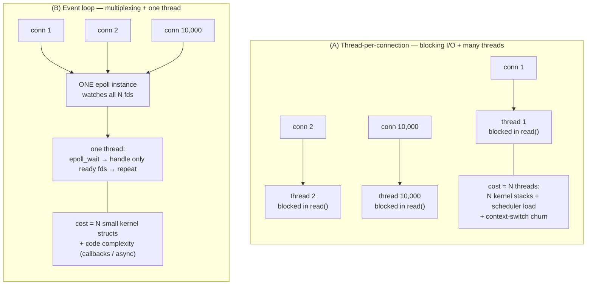
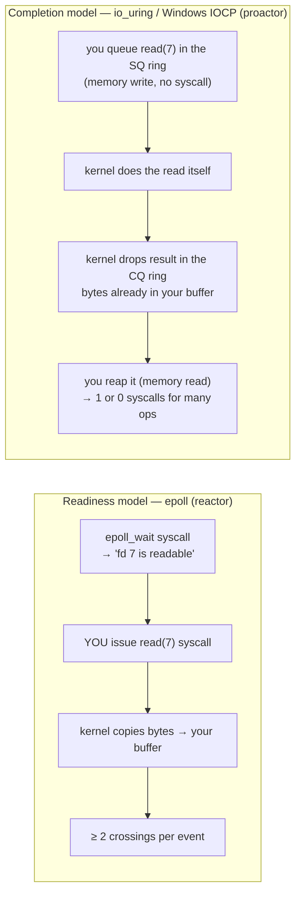
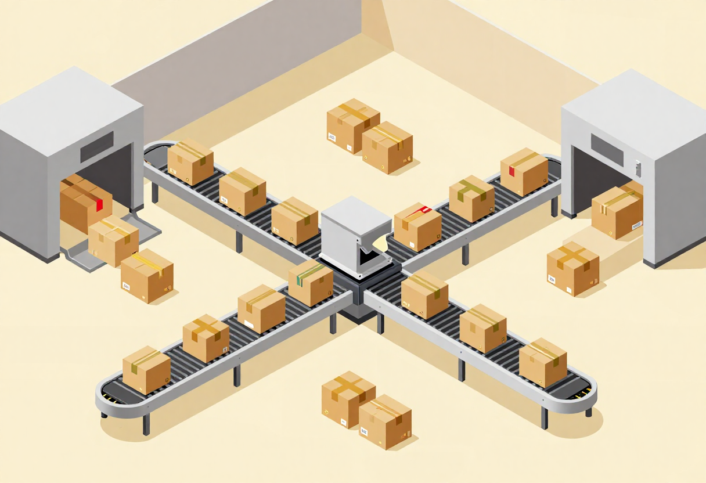

# M01 · Ch4 · §2 — Blocking vs Non-blocking I/O, and the Multiplexing Story: `select` → `poll` → `epoll` → `io_uring`

> **Module:** How Computers & Operating Systems Work
> **Chapter:** I/O, Syscalls & the Kernel Boundary
> **Section:** The payoff of §1. §1 said a blocking `read` is a syscall that *parks your thread in the kernel* until data arrives. That's
> fine for **one** connection. This section is about what happens when you have **ten thousand** — the question that shaped every network
> server and every async runtime you use. It walks the **five I/O models** (blocking · non-blocking · multiplexing · signal-driven ·
> asynchronous), the two **concurrency architectures** built on them (thread-per-connection vs the event loop), the **C10k problem** that
> forced the change, and the **`select` → `poll` → `epoll`** scaling story — then closes the loop to §9a by showing `io_uring` and Windows
> IOCP (I/O completion ports) as the *completion* model. It is the direct cash-in of Ch3 §2's "the loop's one blocking call is `epoll_wait`."
> **Status:** ✅ **finalized 2026-07-07.** The body held at your level and went untouched — the whole session was one thread into §5, the
> **`io_uring` completion model**, which you drove with a factory-and-two-warehouses analogy and two sharp mechanical predictions. Both were
> **well-ranked**: completions are *not* FIFO (out-of-order), and the user-space job is to *route* each completion to its waiter. §9 captures
> it, including the one genuine refinement (the completion dispatcher is intrinsic to the model and **orthogonal** to the zero-syscall knob)
> and a terminology alignment where "sort" meant *sortation/routing* — a demultiplex, which was right all along.

**Estimated study time:** 2–3 hours including reflection.

**Prerequisites — this section stands directly on:**
- **§1 (the kernel boundary):** a syscall is a guarded, costly trap; a **blocking** call asks the kernel to *sleep your thread* until it can
  finish; **batch your crossings** and **park a waiting task**. This section is those two rules applied to the hardest case — many waits at
  once. The §9a **readiness (reactor) vs completion (proactor)** split returns here as the `epoll`-vs-`io_uring`/IOCP distinction.
- **Ch3 §1–§2 (concurrency, async):** you derived that async is *one thread, massive concurrency, zero parallelism* (the bottom-left cell),
  that the event loop's **one blocking call per tick is `selector.select()` → `epoll_wait`**, and that a task "parked on I/O" costs zero CPU.
  This section is what's *under* that: what `epoll_wait` is, why it's the one call, and why it beats the alternatives at scale.
- **§1's GIL (Global Interpreter Lock) note:** a blocking I/O syscall **releases the GIL** because the thread is asleep in the kernel, not running bytecode. That's the
  fact that makes thread-per-connection *possible* in Python at all (§4) even though the GIL serializes CPU work.

---

## Why this section exists (for *you*)

You run two systems whose whole shape is decided by the material below, and you currently reason about them one level up from the mechanism:

- **Your async eval pipeline** fans out thousands of concurrent network calls from *one* thread. *Why does that work — why doesn't it need
  a thread per call?* Because underneath `asyncio` there is exactly one `epoll` instance and one `epoll_wait` syscall that watches all of
  them at once. This section is that "one `epoll_wait`."
- **Your LLM-serving stack** (vLLM behind FastAPI/uvicorn, etc.) holds thousands of concurrent HTTP/streaming connections per process. It
  does *not* spawn thousands of threads; it runs an event loop on `epoll`. The reason it can is the C10k story below.

The trap this section defuses: it's tempting to think "handle many connections" means "spawn many workers." For **I/O-bound** concurrency
that is the *wrong* default — the winning move is one worker that the kernel *notifies* when any of its thousands of connections is ready.
Getting the model right is the difference between a server that tops out at a few thousand connections and one that holds a million.

**The one idea the whole section turns on.** With one connection, "wait for I/O" is easy: call `read`, let the kernel sleep you (§1). With
*N* connections the question becomes *"how does one thread wait for N things at once without (a) burning a CPU polling them or (b) burning a
thread per thing?"* Every model below is an answer to exactly that question, and they line up on a single axis: **how much work does it take
to find out which of my N connections are ready?** Blocking makes you use N threads; naive non-blocking makes you spin; `select`/`poll` ask
the kernel but cost $O(n)$ per check; `epoll` makes the kernel *remember* your connections and hand back only the ready ones, $O(\text{ready})$;
`io_uring`/IOCP go further and do the read *for* you. Hold that axis — "cost to find the ready ones" — and the whole progression is
inevitable.

---

## 1. Any single I/O has two phases — and that's the whole taxonomy

<b>Vocabulary for this section</b> — terms and abbreviations — the two phases of an I/O and the five models (click to expand)

**Abbreviations**

| Short | Stands for | Meaning |
|---|---|---|
| **I/O** | input/output | any transfer to or from a device — here mostly a network socket |
| **fd** | file descriptor | the small integer handle naming an open kernel object (§1) |
| **AIO** | asynchronous I/O | the POSIX interface where the kernel performs the whole operation and tells you when it is done |
| **POSIX** | Portable Operating System Interface | the standard that defines the Unix-family system interfaces |
| **IOCP** | I/O completion ports | Windows' native completion-model I/O interface |
| **µs** | microsecond | one millionth of a second |
| **ms** | millisecond | one thousandth of a second |

**Terms**

| Term | Definition |
|---|---|
| **Phase 1 — wait for data to be ready** | the long wait: the bytes have not arrived from the network yet |
| **Phase 2 — copy the data** | the short part: moving bytes from the kernel's socket buffer across the boundary into your buffer |
| **Socket buffer** | the kernel-side memory where arriving network bytes accumulate until you read them |
| **Blocking** | your thread sleeps in the kernel for both phases — one thread captive per in-flight I/O |
| **Non-blocking (`O_NONBLOCK`)** | the descriptor mode where a call with nothing to give returns immediately instead of sleeping |
| **`EAGAIN`** | the error code returned by a non-blocking call meaning "nothing right now, ask again" |
| **Polling** | repeatedly asking "ready yet?" — wasteful when it is your own loop doing the asking |
| **I/O multiplexing** | one call that blocks on many descriptors at once and wakes on the first ready one |
| **`select` / `poll` / `epoll`** | the three multiplexing syscalls, in order of scalability (§4) |
| **Signal-driven I/O (`SIGIO`)** | the kernel sending a signal when a descriptor becomes ready; rare, awkward to compose |
| **Signal** | an asynchronous notification delivered to a process, interrupting whatever it was doing |
| **`io_uring`** | Linux's shared-ring completion interface (§5) |
| **Synchronous model** | any model where *you* still perform the read and your thread is involved in the copy |
| **Asynchronous / completion model** | the kernel performs both phases and notifies you once the bytes are already in your buffer |
| **Readiness model (reactor)** | "I will tell you *when to* read" — `epoll` |
| **Completion model (proactor)** | "I will tell you *that I read*" — `io_uring`, IOCP |
| **Stevens, *UNIX Network Programming*** | the reference book this five-model taxonomy comes from |

Before the models, one distinction they're all built on. A `read` on a socket does **two** things, and they can block independently:

1. **Wait for data to be ready** — the bytes haven't arrived from the network yet. This is the long wait (the §1 figure's right-hand side:
   µs to ms).
2. **Copy the data** — once it's in the kernel's socket buffer, copy it across the boundary into your user-space buffer. This is short (a
   memory copy) but still costs CPU and, classically, still happens *in* the blocking call.

The five classic I/O models (the taxonomy from Stevens' *UNIX Network Programming*) are just the five ways to divide responsibility for
those two phases between you and the kernel:

| Model | Phase 1 (wait for ready) | Phase 2 (copy to user) | In one line |
|---|---|---|---|
| **Blocking** | thread sleeps in the kernel | thread sleeps in the kernel | the default; one thread is captive per in-flight I/O |
| **Non-blocking** (`O_NONBLOCK`) | returns `EAGAIN` immediately; **you** poll again | blocks briefly during copy | you spin asking "ready yet?" — wasteful alone |
| **I/O multiplexing** (`select`/`poll`/`epoll`) | **one call blocks on many fds**, wakes on the first ready | you then do the (non-blocking) read | one thread waits for thousands — the server model |
| **Signal-driven** (`SIGIO`) | kernel sends a signal when ready | you then read | rare; signals are awkward to compose |
| **Asynchronous** (POSIX AIO [asynchronous I/O], **`io_uring`**, Windows IOCP) | kernel does it | **kernel does the copy too** | you submit, kernel delivers the finished bytes |

The load-bearing split is the last row against the rest. In the first four, *you* still perform the `read` yourself and your thread is
synchronously involved in phase 2 — these are **synchronous** models. Only the last hands **both** phases to the kernel and just notifies you
when the bytes are already in your buffer — the **asynchronous / completion** model. This is precisely the **readiness (reactor) vs
completion (proactor)** distinction you pulled out in §9a: `epoll` is readiness ("I'll tell you *when to* read"); `io_uring`/IOCP is
completion ("I'll tell you *that I read*"). Keep that filed — it's the last section.

---

## 2. Two architectures you can build, and the one that scales

<b>Vocabulary for this section</b> — terms and abbreviations — thread-per-connection versus the event loop (click to expand)

**Abbreviations**

| Short | Stands for | Meaning |
|---|---|---|
| **fd** | file descriptor | the small integer handle naming an open connection |
| **GIL** | Global Interpreter Lock | CPython's lock that lets only one thread run Python bytecode at a time; it is released around blocking I/O |
| **TLB** | translation lookaside buffer | the CPU's cache of address translations, partly lost on each context switch |
| **MB** | megabyte | one million bytes — a thread's default stack is 8 MB of *virtual* address space |
| **OS** | operating system | here specifically its thread scheduler |
| **I/O** | input/output | transfers to or from a device |

**Terms**

| Term | Definition |
|---|---|
| **Thread-per-connection** | one thread per client doing simple blocking reads and writes; linear code, costly at scale |
| **Event loop** | one thread that asks the kernel which of its many connections are ready and services only those |
| **`epoll` instance** | the kernel object that remembers your set of watched descriptors; itself named by an fd |
| **`epoll_wait`** | the single blocking call an event loop makes per tick |
| **Thread stack** | the per-thread memory for local variables and call frames; reserved as virtual address space, backed only where touched |
| **Overcommit** | the kernel handing out more virtual memory than it has physical RAM (Ch2 §3) |
| **Demand paging** | backing a page with physical memory only when it is first touched |
| **Resident** | actually present in physical RAM, as opposed to merely mapped |
| **Task struct** | the kernel's per-thread bookkeeping record — real memory, unlike untouched stack pages |
| **Kernel stack** | the small stack the kernel uses when executing on a thread's behalf; one per thread, always real |
| **Scheduler** | the kernel component deciding which runnable thread gets a core next |
| **Time-slice** | the slot of CPU time a thread gets before the scheduler may preempt it |
| **Context switch** | swapping which thread runs — roughly microseconds, plus cache and TLB churn (§1's ladder) |
| **Stampede** | many blocked threads waking at once and flooding the scheduler |
| **Concurrency** | many things in progress at once; distinct from **parallelism**, many things executing at the same instant |
| **`prefork` / `worker`** | Apache's classic process- and thread-per-connection modes |
| **nginx / Redis / Node.js / `asyncio`** | production event-loop systems; Node.js reaches the OS through **libuv** |
| **libuv** | the C library giving Node.js one event-loop interface over `epoll`, `kqueue` and IOCP |
| **Callbacks / `async`-`await`** | the two ways event-loop code expresses "continue here when this is ready" |
| **Blocking the loop** | one long non-yielding computation stalling every other connection on that thread (Ch3 §2) |

Those models give you two fundamentally different ways to structure a server or client that handles many connections.

<!-- DIAGRAM:START -->

Diagram source (Mermaid)

```mermaid
flowchart TB
    subgraph TPC["(A) Thread-per-connection  —  blocking I/O + many threads"]
        direction TB
        C1["conn 1"] --> T1["thread 1<br/>blocked in read()"]
        C2["conn 2"] --> T2["thread 2<br/>blocked in read()"]
        C3["conn 10,000"] --> T3["thread 10,000<br/>blocked in read()"]
        T1 --- COST1["cost = N threads:<br/>N kernel stacks + scheduler load<br/>+ context-switch churn"]
    end
    subgraph EL["(B) Event loop  —  multiplexing + one thread"]
        direction TB
        D1["conn 1"] --> EP["ONE epoll instance<br/>watches all N fds"]
        D2["conn 2"] --> EP
        D3["conn 10,000"] --> EP
        EP --> LOOP["one thread:<br/>epoll_wait → handle only ready fds → repeat"]
        LOOP --- COST2["cost = N small kernel structs<br/>+ code complexity (callbacks / async)"]
    end
```

<!-- DIAGRAM:END -->

**(A) Thread-per-connection.** One thread per client, each doing simple *blocking* reads/writes. The code is beautifully linear — every
thread reads like a synchronous script, no callbacks, no state machine. This is Apache's classic `prefork`/`worker` model, and it's genuinely
fine up to hundreds or low thousands of connections. Its costs, which you can now name precisely from earlier chapters:

- **Memory.** Each thread has its own stack — Linux defaults to **8 MB of *virtual* address space** per thread. Thanks to overcommit and
  demand paging (Ch2 §3), that's not 8 MB of RAM each — only the touched pages are resident — but the *kernel* structures (each thread's
  kernel stack, task struct) are real, and 10k threads is real memory plus real bookkeeping.
- **Scheduling.** The OS scheduler must now time-slice among thousands of threads; each **context switch** costs (§1's ladder: ~µs, plus
  cache/TLB [translation lookaside buffer] churn). Most of those threads are *blocked* at any instant, but the ones that wake stampede the scheduler.
- **It doesn't get you parallelism you can use (in Python).** Under the GIL, threads don't run Python in parallel anyway (Ch3 §1) — they
  help *only* because a blocked I/O syscall releases the GIL (§1). So you pay the thread costs to buy concurrency you can get more cheaply.

**(B) The event loop.** *One* thread, *one* `epoll` instance watching all N connections, a loop that asks the kernel "which are ready?" and
services only those. This is **nginx, Redis, Node.js (via libuv), and Python's `asyncio`**. The per-connection cost collapses to a small
kernel data-structure entry; what you pay instead is **code complexity** — the linear script becomes callbacks or `async`/`await`, and one
un-yielding computation stalls *everyone* (Ch3 §2's "blocking the loop"). That trade — cheap concurrency for harder control flow — is the
whole reason `async` exists as a programming model.

> The pivot: thread-per-connection puts the "who's ready?" bookkeeping in the **OS scheduler** (expensive at scale); the event loop puts it
> in **one `epoll` call** (cheap at scale). Same job, moved to where it's cheaper.

---

## 3. The C10k problem — why this became urgent

<b>Vocabulary for this section</b> — terms, abbreviations and the cost notation used in the argument (click to expand)

**Abbreviations**

| Short | Stands for | Meaning |
|---|---|---|
| **C10k** | ten thousand concurrent connections | Dan Kegel's 1999 challenge: one server, 10,000 clients at once |
| **C10M** | ten million concurrent connections | today's version of the same argument |
| **fd** | file descriptor | the small integer handle naming an open connection |
| **BSD** | Berkeley Software Distribution | the Unix family whose scalable readiness primitive is `kqueue` |
| **I/O** | input/output | transfers to or from a device |

**Symbols used in the formulas**

| Symbol | Reads as | Meaning |
|---|---|---|
| $n$ |  | the number of file descriptors registered for watching |
| $O(n)$ | "big-O of n" | the cost grows in proportion to the number watched — double the connections, double the work per call |

**Terms**

| Term | Definition |
|---|---|
| **C10k problem** | the software (not hardware) barrier to 10,000 concurrent connections: thread costs plus per-call readiness scanning |
| **Readiness-checking syscall** | a call that answers "which of my descriptors can I act on now?" — `select`, `poll`, `epoll` |
| **Readiness primitive** | the kernel facility that answers that question; scalable versions are per-OS |
| **`epoll`** | Linux's scalable readiness primitive, 2002 |
| **`kqueue`** | the BSD and macOS equivalent of `epoll` |
| **Kernel bypass** | driving the network card from user space to skip the kernel's path entirely — a C10M-era technique |
| **Event loop** | one thread servicing many connections, the architecture the C10k answer demanded (§2) |
| **Thread-per-connection** | the model C10k broke: too much memory and too much scheduler load |
| **Scheduler** | the kernel component choosing which thread runs next |

In 1999 Dan Kegel named the **C10k problem**: how do you get a single server to handle **10,000 concurrent connections**? Hardware of the day
could easily *push the bytes* for 10k clients — the bottleneck was software, specifically the two things above: thread-per-connection ran out
of memory and drowned the scheduler, and the readiness-checking syscalls of the era (`select`/`poll`) cost $O(n)$ *per call* (§5), so just
*finding out who was ready* became the bottleneck as $n$ grew. The C10k answer was a full switch to **event-loop + a scalable readiness
primitive** — which is exactly what drove Linux's `epoll` (2002), BSD's `kqueue`, and the servers built on them. Today the same reasoning
runs at **C10M** (ten million), where even `epoll`'s per-event syscall overhead matters and you reach for `io_uring` and kernel-bypass — but
the shape of the argument is identical: *don't do O(n) work to find the ready ones, and don't burn a thread per wait.*

---

## 4. `select` → `poll` → `epoll`: the scaling story (the mechanism)

<b>Vocabulary for this section</b> — terms, abbreviations and the cost notation for `select`, `poll` and `epoll` (click to expand)

**Abbreviations**

| Short | Stands for | Meaning |
|---|---|---|
| **fd** | file descriptor | the small integer handle naming an open connection |
| **`FD_SETSIZE`** | file-descriptor set size | the fixed 1024-entry limit on `select`'s bitmask — a hard wall you cannot pass without recompiling |
| **LT** | level-triggered | `epoll` keeps reporting a descriptor while unread data remains; the forgiving default |
| **ET** | edge-triggered (`EPOLLET`) | `epoll` reports only the transition to ready, so you must drain until `EAGAIN` |
| **POSIX** | Portable Operating System Interface | the standard that makes `select` and `poll` available everywhere |
| **BSD** | Berkeley Software Distribution | the Unix family providing `kqueue` |
| **IOCP** | I/O completion ports | the Windows equivalent, a completion rather than readiness interface (§5) |
| **I/O** | input/output | transfers to or from a device |

**Symbols used in the formulas**

| Symbol | Reads as | Meaning |
|---|---|---|
| $n$ |  | the number of file descriptors registered for watching |
| $O(n)$ | "big-O of n" | work proportional to every watched descriptor, ready or not — the kernel rescans them all |
| $O(\text{ready})$ | "big-O of ready" | work proportional only to the descriptors that actually fired, written $O(\text{number ready})$ in the text |

**Terms**

| Term | Definition |
|---|---|
| **`select` (1983)** | pass three bitmask sets each call; the kernel scans every descriptor up to the highest number |
| **Bitmask / fd set** | a fixed-size array of bits, one per descriptor number, marking which you care about |
| **Modified in place** | `select` overwrites your sets with the results, so you must rebuild all three before every call |
| **`poll` (1986)** | pass an array of `struct pollfd` instead; no 1024 limit, but the kernel still scans all of them |
| **`struct pollfd`** | one array entry holding `fd`, `events` (what you asked for) and `revents` (what happened) |
| **`epoll` (Linux 2.6, 2002)** | a *stateful* interface: register interest once, and let the kernel maintain a ready list |
| **`epoll_create1()`** | creates an epoll instance, itself named by a file descriptor |
| **`epoll_ctl(ADD/MOD/DEL, fd)`** | registers, changes or removes interest in one descriptor — done once, not per call |
| **`epoll_wait()`** | returns the descriptors from the ready list; cost scales with how many are ready, not how many are watched |
| **Red-black tree** | the balanced search structure the kernel keeps your registered descriptors in |
| **Callback** | the per-descriptor hook the kernel attaches so that becoming ready moves it onto the ready list |
| **Ready list** | the kernel-maintained list of descriptors that have fired since you last asked — why no scan is needed |
| **Level-triggered (LT)** | ready is reported as long as data remains unread; `asyncio`'s default and the sane one |
| **Edge-triggered (ET, `EPOLLET`)** | ready is reported only at the moment data arrives; fewer wake-ups, far easier to hang a connection |
| **Drain loop** | reading in a non-blocking loop until `EAGAIN`, which edge-triggered mode requires |
| **`EAGAIN`** | "nothing available right now" — the signal that a drain loop is finished |
| **Asymptotic cost** | how work grows as the number of connections grows, ignoring constant factors |
| **Portability** | `select`/`poll` are POSIX and everywhere; the scalable primitive is per-OS |
| **`kqueue`** | the BSD and macOS scalable readiness primitive |
| **libuv** | Node.js's abstraction layer choosing the right primitive per OS |
| **`selectors` module** | Python's equivalent: it picks the best backend available rather than calling `epoll` directly |
| **Log-log plot** | a chart where both axes are logarithmic, so a straight diagonal means proportional growth |

All three answer the same question — *"of my N registered fds, which are ready right now?"* — and the difference is entirely in **how much
work that costs** and **who remembers the fd list.**

**`select` (1983).** You pass three **bitmask** sets (read/write/exception) sized to the highest fd number. The kernel scans *every* fd up to
that max, marks the ready ones, and returns. Three problems, all fatal at scale:
- **$O(n)$ every call** — the kernel walks all $n$ fds even if only one is ready.
- **`FD_SETSIZE = 1024`** — the bitmask is a fixed-size array; you cannot watch fd numbers ≥ 1024 without recompiling. A hard wall.
- **The set is *modified* in place**, so you must **rebuild all three sets before every call** — more $O(n)$ work in user space.

**`poll` (1986).** Replaces the bitmask with an **array of `struct pollfd { fd; events; revents; }`**. This removes the 1024 wall (the array
is any length) and separates "what I asked for" (`events`) from "what happened" (`revents`) so you needn't rebuild each call. But it's **still
$O(n)$**: you still pass the whole array in on every call, and the kernel still scans all $n$ to see who's ready. Better ergonomics, same
asymptotic cost.

**`epoll` (Linux 2.6, 2002).** The insight: *stop re-telling the kernel your fd list every call.* `epoll` is **stateful**, split into three
syscalls:
- **`epoll_create1()`** — make an epoll instance (itself an fd; §1's handle-not-the-thing again).
- **`epoll_ctl(ADD/MOD/DEL, fd)`** — register interest in an fd **once**. The kernel stores it in an internal structure (a red-black tree)
  and — crucially — attaches a **callback** to that fd so that *when it becomes ready*, the kernel moves it onto a **ready list**.
- **`epoll_wait()`** — return the fds from the **ready list**. This is $O(\text{number ready})$, **not** $O(n)$: the kernel already knows who's
  ready because the callbacks maintained the list as events happened. No scan.

That single change — the kernel *remembers* your interest set and *maintains* a ready list via per-fd callbacks — is why `epoll` is flat
while `select`/`poll` climb. The figure makes the gap concrete:

<!-- FIGURE -->
![Log-log plot of work per readiness-check call vs number of monitored connections. select and poll rise as a straight O(n) diagonal (the kernel rescans every registered fd on every call), while epoll is a flat O(ready) line (the kernel returns only the fds that fired). A vertical marker at 1024 shows select's FD (file descriptor)_SETSIZE wall; a marker at 10,000 shows the C10k point, where select/poll do ~10,000 units of work per call while epoll does ~50. The caption stresses the fix isn't faster hardware — it's not rescanning idle connections.](diagrams/02-blocking-nonblocking-and-multiplexing-fig1.svg)

At 10k mostly-idle connections (the common case — most clients are between requests), `select`/`poll` do ~10,000 units of bookkeeping *per
loop iteration* to discover that maybe 50 are ready; `epoll` does ~50. The win isn't a faster CPU — it's **refusing to look at the idle
connections at all.** A compact comparison:

| | `select` | `poll` | `epoll` (Linux) / `kqueue` (BSD, macOS) |
|---|---|---|---|
| Cost per call | $O(n)$ | $O(n)$ | $O(\text{ready})$ |
| fd limit | `FD_SETSIZE` (1024) | none | none |
| Re-pass fd list each call? | yes (and rebuild) | yes | **no** — registered once with `epoll_ctl` |
| Portability | everywhere (POSIX) | everywhere (POSIX) | Linux-specific (`kqueue` = BSD/macOS; IOCP = Windows) |
| Used by | legacy / small $n$ | legacy / moderate $n$ | nginx, Redis, `asyncio`, libuv |

Note the portability row — this is §9a again: `select`/`poll` are portable POSIX (Portable Operating System Interface); the *scalable* primitive is per-OS (`epoll` Linux,
`kqueue` macOS/BSD), which is exactly why cross-platform runtimes ship an abstraction layer (**libuv** for Node.js; Python's `selectors`
module picks the best backend per OS) rather than calling `epoll` directly.

**One sharp edge worth knowing: level-triggered vs edge-triggered.** `epoll` has two notification modes. **Level-triggered (LT, the default,
and what `poll` does):** `epoll_wait` keeps reporting an fd as ready *as long as* there's unread data — forgiving, you can read a little at a
time. **Edge-triggered (ET, `EPOLLET`):** it reports only on the *transition* to ready (the moment data arrives), and never again until more
arrives — so you **must** drain the socket in a non-blocking loop until `EAGAIN`, or you'll leave data unread and hang. ET means fewer
`epoll_wait` wake-ups (higher performance) at the cost of much easier bugs. **`asyncio` uses level-triggered**, which is the sane default;
the highest-tier servers use ET carefully. (If you ever see a hung connection that "should have data," a missed ET drain loop is a prime
suspect.)

---

## 5. The completion model: `io_uring` (and the tie back to Windows IOCP)

<b>Vocabulary for this section</b> — terms, abbreviations and the cost notation for the completion model (click to expand)

**Abbreviations**

| Short | Stands for | Meaning |
|---|---|---|
| **SQ** | submission queue | the shared ring you write I/O requests into |
| **CQ** | completion queue | the shared ring the kernel writes finished results into |
| **`SQPOLL`** | submission-queue polling | the `io_uring` mode where a kernel thread watches the ring, so submitting needs no syscall at all |
| **IOCP** | I/O completion ports | Windows' native completion interface, the model `io_uring` converges on |
| **fd** | file descriptor | the small integer handle naming an open connection |
| **C10M** | ten million concurrent connections | the scale at which per-event syscall overhead itself becomes the wall |
| **I/O** | input/output | transfers to or from a device |

**Symbols used in the formulas**

| Symbol | Reads as | Meaning |
|---|---|---|
| $O(n)$ | "big-O of n" | work proportional to every watched descriptor — the scan `epoll` removed |

**Terms**

| Term | Definition |
|---|---|
| **Readiness model** | the kernel tells you *when you may* act, and you still issue the read yourself — `epoll` |
| **Completion model** | the kernel performs the operation and tells you it is *done*, bytes already in your buffer |
| **Syscall tax** | the fixed per-crossing cost of §1, paid at least twice per served event under readiness |
| **`io_uring` (Linux 5.1, 2019)** | the shared-ring interface that submits and reaps many operations with one syscall, or none |
| **Ring buffer** | a fixed-size circular queue, here mapped into memory shared by your process and the kernel |
| **`mmap`'d memory** | memory mapped into your address space, so writing the ring is a plain memory write with no boundary crossing |
| **`io_uring_enter`** | the one syscall that tells the kernel to process what you queued |
| **Kernel thread** | a thread belonging to the kernel itself; under `SQPOLL` one watches the submission ring for you |
| **Reap** | to read finished results out of the completion queue |
| **Reactor / proactor** | the design-pattern names for readiness and completion respectively |
| **`ProactorEventLoop`** | the `asyncio` loop used on Windows, built on IOCP |
| **`SelectorEventLoop`** | the `asyncio` loop used on Linux, built on `epoll` |
| **Storage I/O** | disk reads and writes, where `epoll` does not help and completion does |
| **Zero-syscall operation** | submitting and reaping purely through shared memory, with no crossing at all |

`epoll` fixed *finding* the ready fds, but it's still the **readiness** model, and it still pays §1's syscall tax: for every batch of ready
connections you make an `epoll_wait` syscall **and then** a `read` syscall for each — two crossings per served event, minimum. At C10M and for
storage I/O, that syscall overhead itself becomes the wall.

**`io_uring` (Linux 5.1, 2019)** attacks it with the *completion* model and §1's "batch your crossings" taken to the limit. You and the kernel
share **two ring buffers in mmap'd memory** (Ch2 §3's `mmap` returns): a **submission queue (SQ)** where you write I/O requests, and a
**completion queue (CQ)** where the kernel writes results. You:
1. write N requests into the SQ (just memory writes — **no syscall**),
2. make **one** `io_uring_enter` syscall to tell the kernel "go" (and with a polling mode, `SQPOLL`, even that can be skipped — a kernel
   thread watches the ring, so a busy server can submit and reap I/O with **zero syscalls**),
3. later read completed results out of the CQ (again, just memory reads) — and the kernel has **already done the reads**; the bytes are in
   your buffers.

<!-- DIAGRAM:START -->

Diagram source (Mermaid)

```mermaid
flowchart LR
    subgraph R["Readiness model  —  epoll (reactor)"]
        direction TB
        RA["epoll_wait syscall<br/>→ 'fd 7 is readable'"] --> RB["YOU issue read(7) syscall"]
        RB --> RC["kernel copies bytes → your buffer"]
        RC --> RD["≥ 2 crossings per event"]
    end
    subgraph C["Completion model  —  io_uring / Windows IOCP (proactor)"]
        direction TB
        CA["you queue read(7) in the SQ ring<br/>(memory write, no syscall)"] --> CB["kernel does the read itself"]
        CB --> CC["kernel drops result in the CQ ring<br/>bytes already in your buffer"]
        CC --> CD["you reap it (memory read)<br/>→ 1 or 0 syscalls for many ops"]
    end
```

<!-- DIAGRAM:END -->

This is the exact model **Windows was built on from the start — IOCP (I/O Completion Ports)** — which is why, as you saw in §9a, `asyncio`
uses a `ProactorEventLoop` (IOCP) on Windows and a `SelectorEventLoop` (`epoll`) on Linux. Linux spent two decades on the readiness model and
`io_uring` is it **converging** onto completion. So the two OS families, which started at opposite ends (Linux readiness / Windows
completion), are meeting in the middle — and the vocabulary you now have (reactor vs proactor, readiness vs completion) is exactly what makes
that convergence legible.

> **The keeper for §5:** `epoll` removed the $O(n)$ *scan*; `io_uring` removes the *per-operation syscall*. Both are the same §1 instinct —
> stop paying the boundary crossing you don't need — applied at successive scales. Readiness says "tell me when I can act"; completion says
> "act for me and tell me when it's done."

---

## 6. Where your world actually sits

<b>Vocabulary for this section</b> — terms and abbreviations — mapping the models onto systems you actually run (click to expand)

**Abbreviations**

| Short | Stands for | Meaning |
|---|---|---|
| **GIL** | Global Interpreter Lock | CPython's lock serializing bytecode execution; released while a thread blocks in an I/O syscall |
| **DB** | database | the store behind a query; a synchronous driver for one is the classic reason to use threads |
| **SDK** | software development kit | a vendor's client library, sometimes blocking with no async version |
| **LLM** | large language model | the model being served behind the event loop |
| **GPU** | graphics processing unit | the accelerator doing the model's compute — CPU-bound work you keep off the loop |
| **HTTP** | HyperText Transfer Protocol | the request/response protocol the streaming connections speak |
| **fd** | file descriptor | the small integer handle naming a socket |
| **I/O** | input/output | transfers to or from a device |

**Terms**

| Term | Definition |
|---|---|
| **`SelectorEventLoop`** | the `asyncio` event loop on Linux — one `epoll` instance, level-triggered |
| **`epoll` instance** | the kernel object remembering which descriptors this loop watches |
| **Level-triggered** | ready is re-reported while data remains unread; the forgiving default (§4) |
| **`epoll_ctl`** | the call registering a socket's descriptor with the loop's epoll instance |
| **`epoll_wait`** | the loop's single blocking call per tick |
| **Coroutine** | a function that can suspend at `await` and be resumed later by the loop |
| **Parked coroutine** | one suspended on I/O at zero CPU cost until its descriptor fires |
| **`uvloop`** | a faster drop-in `asyncio` loop implementation built on libuv |
| **uvicorn / FastAPI** | the Python server and framework running that loop in an LLM-serving front end |
| **`run_in_executor`** | the `asyncio` call that hands blocking or CPU-bound work to a thread or process pool so the loop keeps running |
| **Thread pool** | a fixed set of worker threads reused for blocking calls |
| **CPU-bound** | limited by computation rather than waiting — the part that must stay off the event loop |
| **Streaming connection** | a long-lived HTTP response delivered in pieces, e.g. tokens as they are generated |
| **Multiplexing** | one thread waiting on many connections at once, done by the kernel on its behalf |

Assembling it against systems you run:

- **`asyncio` (your eval pipeline).** One thread, one `SelectorEventLoop` = one `epoll` instance, level-triggered. Every `await` on a socket
  registers its fd with `epoll_ctl`; the loop's single blocking call per tick is `epoll_wait` (Ch3 §2, now fully cashed); a ready fd wakes
  its parked coroutine. Your "thousands of concurrent calls from one thread" is **model (B)** with `epoll` underneath — no thread per call,
  because the kernel is doing the multiplexing.
- **Your LLM-serving front (uvicorn/FastAPI).** Same shape: an `asyncio`/`uvloop` event loop on `epoll` holds the many streaming HTTP
  connections; the GPU work is the CPU-bound part you keep *off* the loop (Ch3 §2's `run_in_executor`, or a separate worker/process). This is
  why one process serves many streams without many threads.
- **When you deliberately pick threads instead.** Model (A) still wins when the work behind each connection is a **blocking C library with no
  async version** (a synchronous DB [database] driver, a blocking SDK — software development kit) — you can't `await` it, so you run it in a thread pool where its blocking syscall
  releases the GIL (§1). "Async all the way down" only works if nothing in the stack blocks the loop.

---

## 7. Loose ends, so the picture is complete

<b>Vocabulary for this section</b> — terms, abbreviations and the cost notation in the section keeper (click to expand)

**Abbreviations**

| Short | Stands for | Meaning |
|---|---|---|
| **fd** | file descriptor | the small integer handle naming an open kernel object |
| **SSD** | solid-state drive | flash storage; a read still takes real time even though the file is "always ready" |
| **IOCP** | I/O completion ports | Windows' completion-model I/O interface |
| **I/O** | input/output | transfers to or from a device |

**Symbols used in the formulas**

| Symbol | Reads as | Meaning |
|---|---|---|
| $O(n)$ | "big-O of n" | work proportional to every watched descriptor — what `select` and `poll` cost per call |
| $O(\text{ready})$ | "big-O of ready" | work proportional only to the descriptors that fired — what `epoll` costs |

**Terms**

| Term | Definition |
|---|---|
| **I/O concurrency** | many waits in flight at once; what multiplexing buys — *not* extra CPU throughput |
| **CPU parallelism** | actual simultaneous execution of computation, which needs threads or processes (Ch3 §1) |
| **`run_in_executor`** | the `asyncio` escape hatch sending CPU-bound work to a thread or process pool |
| **`O_NONBLOCK`** | the descriptor flag turning "sleep until ready" into "return `EAGAIN` now" |
| **`EAGAIN`** | "nothing available right now, try again" |
| **Busy-wait** | looping on a non-blocking call, burning CPU to discover nothing has changed |
| **Edge-triggered** | `epoll` mode reporting only the transition to ready; requires non-blocking descriptors and a drain loop |
| **Readiness primitive** | a facility that says *when you may act*, not one that acts for you |
| **Pollable fd** | a descriptor `epoll` can meaningfully watch — sockets, pipes, timers — as opposed to a regular disk file |
| **Regular file** | an ordinary file on disk, which reports "always ready" yet still blocks on the device |
| **`io_uring`** | the Linux completion interface, which does give real asynchronous *disk* I/O |
| **Batch your crossings** | §1's first rule: few large boundary crossings, not many small ones |
| **Park your waiters** | §1's second rule: a waiting task should hold neither a CPU nor a thread |

- **This is about I/O concurrency, not CPU parallelism.** Multiplexing lets one thread *wait* for many things; it does nothing for
  CPU-bound work (Ch3 §1). An event loop pegged on computation still needs `run_in_executor` → threads/processes. Don't reach for `epoll` to
  speed up a hot loop.
- **Non-blocking ≠ multiplexing.** Setting `O_NONBLOCK` alone just turns "sleep" into "`EAGAIN`, try again" — which is a busy-wait if you
  loop on it. Non-blocking mode is the *partner* of multiplexing (you set fds non-blocking so that after `epoll_wait` says "ready" your
  `read` can't accidentally block, especially under edge-triggered), not a replacement for it.
- **`epoll` is a readiness primitive, not a magic "async file" API.** Classically it works for sockets, pipes, and other pollable fds but
  **not regular disk files** (a disk read is "always ready" and still blocks on the platter/SSD — solid-state drive) — which is one reason `io_uring`, which does
  real async *disk* I/O, matters beyond just sockets.

> **The keeper for the whole section.** The question was never "how do I make one I/O fast" — it's "**how does one thread wait for thousands
> of I/Os without spinning or spawning?**" The answer evolved along one axis, *the cost to find (and finish) the ready ones*:
> blocking (a thread each) → non-blocking (spin) → `select`/`poll` (ask the kernel, `O(n)`) → `epoll` (kernel remembers and notifies,
> `O(ready)`) → `io_uring`/IOCP (kernel does the I/O too). Every step is §1's two rules — *batch your crossings, park your waiters* —
> pushed one scale further.

---

## 8. Check your understanding

Bring your answers to our chat — especially where you have to *rank* the dominant cause, not just name a true one.

1. **Why not just add threads?** A colleague says "C10k is easy now — machines have plenty of RAM, just run 10,000 threads with blocking
   reads." Give the *two* distinct costs that argument ignores (one about the scheduler, one you can quantify from §1's ladder), and say why
   "plenty of RAM" partly misses the point (tie it to Ch2 §3 overcommit — what's actually scarce?).
2. **The $O(n)$ that hurts.** With 10,000 connections of which ~20 are active at any moment, explain precisely *what* `poll` does 10,000 units
   of on every call and *what* `epoll` does ~20 of — and where, physically, that saved work lives (user space? one syscall? the kernel's data
   structure?).
3. **`epoll_ctl` vs `epoll_wait`.** Why does splitting registration (`epoll_ctl`, once per fd) from waiting (`epoll_wait`, every loop) buy the
   $O(n) \to O(\text{ready})$ win? What does the kernel maintain *between* calls that `poll` cannot, and what mechanism keeps it updated?
4. **Edge-triggered footgun.** You switch a server from level-triggered to edge-triggered `epoll` for performance and now some connections
   occasionally "hang" with data sitting unread. What did the handler forget to do, and why did level-triggered hide the bug? (Connect to
   Ch3 §2's "diagnosing a stuck connection.")
5. **Readiness vs completion, applied.** Map each to §9a: (a) `epoll_wait` returns "fd 7 readable," you call `read(7)`; (b) `io_uring` hands
   you a completion with bytes already in your buffer. Which is reactor, which is proactor, and which one is Windows' *native* model? Then:
   why does `io_uring` reduce syscalls even when the number of I/Os is unchanged (§1's rule)?
6. **Your pipeline, precisely.** In one paragraph, trace what happens under the hood when your `asyncio` eval pipeline has 2,000 in-flight LLM (large language model)
   API calls and one response arrives: from the socket becoming readable, through `epoll`, to the right coroutine resuming. Name the one
   blocking syscall the whole loop was sitting in.

Answers

1. **The two costs are scheduler pressure and context-switch time.** (i) The OS scheduler now has 10,000 runnable-or-blocked threads to
   track, and every batch of arriving packets wakes a stampede of them — the "who's ready?" bookkeeping has been dumped on the scheduler,
   which is §2's whole pivot. (ii) Quantified from §1's ladder: each **context switch is ≈1–5 µs** plus cache and TLB (translation
   lookaside buffer) churn, so a server doing even 100k wake-ups/sec is spending entire cores on switching rather than serving. "Plenty of
   RAM" misses the point because the 8 MB per-thread stack is *virtual* address space — overcommit and demand paging (Ch2 §3) mean it was
   never resident. What is actually scarce is **kernel-side structures** (a real kernel stack and task struct per thread) and **scheduler
   throughput**. And in Python the threads buy no parallelism anyway (Ch3 §1); they help only because a blocking syscall releases the GIL
   (Global Interpreter Lock).
2. **`poll` makes the kernel scan all 10,000 `struct pollfd` entries — and makes user space copy and re-walk all 10,000 — to discover the
   ≈20; `epoll_wait` returns ≈20 entries and the kernel scans nothing.** Physically the saved work lives in **the kernel's own data
   structure**: `epoll_ctl` registered each fd *once* into a red-black tree that persists between calls, so the interest list is neither
   re-copied across the boundary nor rescanned, and a per-fd callback appended the ≈20 ready fds to a **ready list** as their events
   actually happened. The work didn't get faster — it moved from $O(n)$ *per call* to $O(1)$ *per event* (§4).
3. **Because registration is what lets the kernel keep state between calls — and `poll` is stateless by construction.** `poll`'s fd array
   arrives with the call and dies with it, so the kernel must re-learn your interest set and rescan it every single time; there is nowhere
   for it to remember that fd 4,113 matters to you. `epoll_ctl` gives it that place: the **interest list** (a red-black tree) that survives
   across `epoll_wait` calls. The mechanism that keeps it current is the **per-fd callback** installed at registration, fired by the
   protocol/device layer the moment data arrives, which moves that fd onto the **ready list** — so `epoll_wait` is just "drain the list,"
   $O(\text{ready})$ (§4).
4. **The handler forgot to drain the socket in a non-blocking loop until `read` returns `EAGAIN`.** Edge-triggered reports only the
   *transition* to ready, so if you read once and leave bytes sitting in the kernel's socket buffer, no further arrival means no further
   event, and that data sits unread forever — the connection "hangs" with its payload already in the kernel. Level-triggered hid the bug
   because it re-reports an fd as ready *as long as unread data remains*, so the next loop iteration silently handed you another chance at
   the leftovers (§4). Diagnostically it looks exactly like Ch3 §2's stuck connection: the process is parked in `epoll_wait` with nothing
   to do while the bytes are already across.
5. **(a) is the reactor (readiness, `epoll`); (b) is the proactor (completion, `io_uring`); completion/IOCP (I/O completion ports) is
   Windows' native model** — which is why `asyncio` runs a `ProactorEventLoop` there and a `SelectorEventLoop` on Linux (§1 §9a, §5).
   `io_uring` cuts syscalls with the same number of I/Os because **submission and reaping are memory operations on the shared mmap'd
   rings**, not crossings: N requests are N writes into the SQ (submission queue) plus **one** `io_uring_enter` — or zero under `SQPOLL` —
   against readiness's floor of **two crossings per event** (`epoll_wait`, then a `read` each). Crossings per I/O went from ≥2 to ≤1/N.
   That is §1's Rule 1, batch your boundary crossings, taken to its limit.
6. **The loop was sitting in one blocking syscall: `epoll_wait`.** All 2,000 sockets were registered into the single `epoll` instance by
   `epoll_ctl` when each coroutine `await`ed, and each `await` parked its Task with zero CPU cost (Ch3 §2). A response arrives: the NIC
   raises an interrupt (§1 §7), the kernel copies the bytes into that socket's receive buffer and the fd's registered callback moves it
   onto the **ready list**, which wakes `epoll_wait`. It returns *just that one fd* (not 2,000 — $O(\text{ready})$), the `selectors` layer
   maps fd → the callback registered with it → the `Future` the coroutine is waiting on, the loop marks that Future done and schedules its
   Task, and the coroutine resumes at its `await` and performs the now-guaranteed-non-blocking `read`. The other 1,999 were never looked
   at.

---

## 9. Applied — captured from our 2026-07-07 session

The body held; you took the whole session into **§5's completion model** and built it up from an analogy — *the kernel is a factory, and the
two rings are a **raw-materials/inbox warehouse (SQ)** and a **finished-goods/outbox warehouse (CQ)**.* That picture is genuinely good, and
it *predicts* the mechanics once you add one part: the warehouses are **shared with the factory** (`mmap`'d memory both sides read/write), and
every item carries a **work-order ticket that travels with it and comes back stamped on the finished product** — which is exactly io_uring's
64-bit **`user_data`** field, set by you on each submission entry (SQE) and **copied verbatim** by the kernel onto the matching completion
entry (CQE).

*Your analogy, made concrete: the inbox dock (SQ) feeds tagged parcels past a scanner (the kernel reading `user_data`) that routes each to its
chute (the waiter it belongs to) and out the outbox dock (CQ) — a sortation/demultiplex, not a re-sort (§9b). — Illustration, generated locally
(ComfyUI + Z-Image Turbo).*

Image prompt (source of truth)

> Stylized isometric flat illustration of an automated parcel sortation hub inside a large warehouse: conveyor belts carrying identical parcels
> each marked with a small colored tag, a central scanner arch over the belt, parcels diverting down several chutes into different loading bays,
> an inbox loading dock on the left and an outbox loading dock on the right, warm industrial lighting, clean modern vector illustration style,
> no text, no words, no labels, high detail

### 9a. "From SQ to CQ, probably not FIFO" — correct, and well-ranked

Your first prediction: completions don't come back in submission order. **Right.** They arrive in **completion order** — submit a read from a
cold disk and a read that hits the page cache, and the cache read's CQE can land first. That's the *point* of the model (fast ops mustn't
queue behind slow ones), and your warehouse image already encodes it: the outbox belt doesn't care what order parcels arrive. (Two finer
points we noted: the kernel *consumes* the SQ in order, and ops may even *execute* concurrently/out of order — if op-2 must follow op-1 you
have to chain them explicitly with a link flag, `IOSQE_IO_LINK`; absent that, assume nothing about ordering.)

### 9b. "A sorter reads the tag and drops each package in the right bucket" — this *is* the mechanism (a demultiplex)

Your second prediction — user space needs "an orchestrator to **sort and deliver**" completions to the right client — was **also right**, once
we aligned on the word. You didn't mean *sort* in the algorithmic reorder-a-list sense; you meant **sortation**, the way a parcel hub scans
each package's barcode and a diverter pushes it down the chute for its destination. That is *exactly* the completion dispatcher: read
`user_data`, route the item to its waiter (the coroutine/callback/client). No reordering, **one scan per item, order-of-arrival irrelevant** —
your image nails it. Named precisely, the "sorter" is a **demultiplexer**: home turf for you — a hardware demux routes one input to one of N
outputs on a select line; here the select line is `user_data`, and a network switch does the identical thing with a destination address. So
matching a completion to its origin is an **$O(1)$** pointer-dereference/lookup, not a search — because the kernel echoes the tag back rather
than making you find it.

### 9c. The one genuine refinement: the sorters are staffed regardless of the zero-syscall knob

The only thing worth decoupling — and it fits the analogy cleanly — is that your sentence tied the router *to* "achieving zero syscall," and
they're **two independent stations**:

- **The sorters (completion dispatcher) are intrinsic to the completion model.** Any completion-model runtime always runs a reap-and-route
  loop — even Windows IOCP, even when it makes a syscall to wait. It exists whether or not you've eliminated syscalls.
- **Zero-syscall is a separate decision about the loading dock.** Normally you ring a bell (`io_uring_enter`) to tell the factory "new orders
  in the inbox"; with **`SQPOLL`** you instead **station a kernel thread that watches the inbox conveyor continuously**, so no bell is needed
  — and completions are visible by reading the shared CQ ring directly (a memory read, no syscall). The cost is that stationed worker: a
  **busy kernel thread trading a burning CPU core for eliminated boundary crossings** — a throughput-vs-efficiency *derating* dial (your
  semiconductor framing): right for a saturated server, wasteful for an idle one.

So both concepts you raised were real; they're just two stations in the same warehouse, not one mechanism.

### 9d. Callbacks worth keeping

- **It's the §9a (from §1) completion model, cross-OS.** Windows IOCP's `OVERLAPPED` pointer + completion key **are** `user_data`;
  `GetQueuedCompletionStatus` is `io_uring_wait_cqe`. Same tag-routing pattern, both OSes — which is why `asyncio` swaps a `ProactorEventLoop`
  (IOCP) for a `SelectorEventLoop` (`epoll`) and the *application* code doesn't change.
- **You've rediscovered how hardware already talks to the kernel.** SQ/CQ ring pairs with an echoed correlation tag is exactly the **NVMe**
  model — submission/completion queues in host memory, a doorbell register (the `io_uring_enter`/`SQPOLL` analog), and a **Command Identifier
  (CID)** the drive echoes on completion because it, too, finishes out of order. NICs use TX/RX descriptor rings the same way. io_uring
  deliberately mirrors the hardware queue design; your "factory with tickets" is, almost literally, a storage controller.
- **The dispatcher already exists in your stack.** In io_uring terms, `user_data` would point at the `asyncio` `Task`/`Future`, and "wake the
  right waiter" is what the event loop's completion step does — the same demux, one layer up. (And one more up: your LLM-eval fan-out matching
  2,000 responses back to their requests by an application-level `request_id` is the *identical* correlation-tag pattern at the app layer.)

> **Calibration note (refines the v21/v23 split).** On this *mechanistic* io_uring detail you were **well-calibrated, not mis-ranked** — both
> predictions held, and the residual work was *naming* (sortation = demultiplex) and *decoupling* (dispatcher ⟂ zero-syscall), not a
> dominant-cause re-rank. The useful refinement: your mis-rank tendency is specific to ranking **competing physical magnitudes**
> (fragmentation vs bandwidth, external vs internal waste) — *not* to mechanism reasoned through a **systems/logistics analogy**, which is a
> strength. Here you reasoned via the warehouse analogy and landed it. Part of my first-pass "re-rank" was me fighting your word *sort*, not
> your idea — logged so the pattern-read stays honest. **Teach-forward:** for mechanism questions, hand him the analogy and let him run it; the
> value you add is precise naming + decoupling bundled concepts, not correction.

---

## 10. References (optional, for depth)

*(All links verified live 2026-07-07.)*

- **[Dan Kegel — "The C10K problem"](http://www.kegel.com/c10k.html)** — the original 1999 write-up that named the problem and catalogued the
  I/O strategies (§3). A historical document, but the framing still structures the whole field.
- **[`man 7 epoll`](https://man7.org/linux/man-pages/man7/epoll.7.html)** and **[`man 2 epoll_ctl`](https://man7.org/linux/man-pages/man2/epoll_ctl.2.html)**
  — the authoritative description of the interest list, the ready list, and the level- vs edge-triggered semantics of §4. Read the
  "Level-triggered and edge-triggered" section alongside the ET footgun.
- **[`man 2 select`](https://man7.org/linux/man-pages/man2/select.2.html)** and **[`man 2 poll`](https://man7.org/linux/man-pages/man2/poll.2.html)**
  — the two older primitives; note in `select`'s "BUGS"/notes the `FD_SETSIZE` limit and the rebuild-every-call cost (§4).
- **[Julia Evans — "Async IO on Linux: select, poll, and epoll"](https://jvns.ca/blog/2017/06/03/async-io-on-linux--select--poll--and-epoll/)**
  — the clearest short, concrete walk through the three, with real `strace` output — the friendly companion to §4.
- **[`man 7 io_uring`](https://man7.org/linux/man-pages/man7/io_uring.7.html)** — the submission/completion ring model of §5 from the source.
- **["Efficient IO with io_uring" (Jens Axboe's design document)](https://kernel.dk/io_uring.pdf)** — the author's own explanation of *why*
  the shared-ring design removes the per-op syscall (§5). The definitive "what problem does this solve" read.
- **[Python docs — `selectors`](https://docs.python.org/3/library/selectors.html)** and
  **[`asyncio` event loop](https://docs.python.org/3/library/asyncio-eventloop.html)** — the `selectors` module is exactly the
  "pick `epoll`/`kqueue`/`select` per OS" abstraction of §4; `asyncio` sits on top (§6).
- **[Michael Kerrisk, *The Linux Programming Interface*](https://man7.org/tlpi/)** — ch. 63 ("Alternative I/O Models") is the definitive
  long-form version of this whole section, `select`/`poll`/`epoll` with full code.

---

### What's next
✅ **Finalized 2026-07-07.** This section turned §1's "a blocking read parks your thread" into the many-connections story: the five I/O
models, thread-per-connection vs the event loop, C10k, the `select` → `poll` → `epoll` scaling win, and `io_uring`/IOCP as the completion
model (closing the §9a loop). §9 captures the session's one thread — the io_uring completion model via your factory/two-warehouse analogy:
out-of-order completions matched by the echoed `user_data` tag (an $O(1)$ demultiplex, your "sorter reading the label"), and the completion
dispatcher decoupled from the zero-syscall `SQPOLL` knob. Natural follow-ons, your call at the boundary:
- **Ch4 §3 — Why I/O dominates latency** (the right-hand side of §1's figure, made into latency budgets, tail latency, and pipelining — how
  many device round trips, and can you overlap them). The direct continuation and the last core piece of Ch4.
- **Ch4 §4 — *(if we add it)* zero-copy & the data path** (`sendfile`, `mmap` vs `read`, page cache, `O_DIRECT`) — how the *copy* half of §1's
  two phases gets optimized away.
- Or **rotate scope** per the interleave: **M04 Ch2 §2** (refactoring in moves, SWE — software engineering) or **M12 Ch2 §3** (audio/speech/text-to-speech, AI).

<!-- Bilingual key-terms table follows; see authoring-conventions §5. -->

## Key terms (English · 大陆简体 · 台灣繁體)

| English | 大陆 (简体) | 台灣 (繁體) | Note |
|---|---|---|---|
| blocking / non-blocking I/O | 阻塞 / 非阻塞 I/O | 阻塞 / 非阻塞 I/O | shared |
| I/O multiplexing | I/O 多路复用 | I/O 多工 | ⚠ 多路复用 vs 多工 (genuinely different) |
| event loop | 事件循环 | 事件迴圈 | ⚠ 循环 vs 迴圈 (loop) |
| readiness / completion model | 就绪 / 完成 模型 | 就緒 / 完成 模型 | script only |
| level-triggered / edge-triggered | 水平触发 / 边缘触发 | 水平觸發 / 邊緣觸發 | script only |
| file descriptor | 文件描述符 | 檔案描述符 | ⚠ 文件 vs 檔案 (file) |
| socket | 套接字 | 通訊端 / socket | ⚠ 套接字 (CN) vs 通訊端 (TW); TW often keeps "socket" |
| thread | 线程 | 執行緒 | ⚠ genuinely different (from Ch3) |
| ready list / interest list | 就绪列表 / 兴趣列表 | 就緒清單 / 興趣清單 | 列表 vs 清單 (list) |
| polling | 轮询 | 輪詢 | script only |
| kernel | 内核 | 核心 | ⚠ genuinely different (from §1) |
