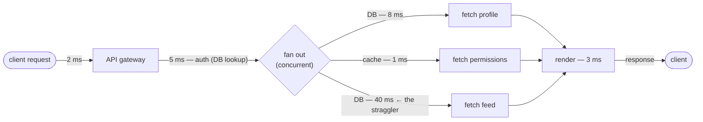

# M01 · Ch4 · §3 — Why I/O Dominates Latency: Round-Trips, Little's Law, the Four Levers, and the Tail at Scale

> **Module:** How Computers & Operating Systems Work
> **Chapter:** I/O, Syscalls & the Kernel Boundary
> **Section:** The capstone of Ch4's core. §1 drew the boundary and the cost ladder; §2 showed how one thread waits for many I/Os. This
> section takes the **right-hand side of §1's latency figure** — the device tier, µs to ms, that dwarfs everything else — and turns it into an
> engineering discipline: *why* a single request's time is set almost entirely by how many device round-trips it makes and whether they
> overlap; the **latency ≠ throughput** distinction and **Little's Law** that connects them; the **four levers** for fighting latency (fewer
> trips · overlap · move closer · hide); and the senior topic that decides real systems — **tail latency**, why averages lie, and how
> **fan-out amplifies the tail** (the direct explanation of why your 2,000-call eval batch finishes when the *slowest* call returns).
> **Status:** ✅ **finalized** 2026-07-12. Body prepared 2026-07-07; §9 (Applied) filled from the Q&A — a real serverless cold-start
> investigation used as a field test of the whole section (round-trips dominate, Little's Law inverted, the four levers, latency ≠ throughput).

**Estimated study time:** 2–3 hours including reflection.

**Prerequisites — this section stands directly on:**
- **§1 (the latency landscape):** the figure showing compute (ns) ≪ the syscall boundary (hundreds ns) ≪ device I/O (µs–ms). This section is
  that right-hand tier made into a way of reasoning. The "batch your crossings / park your waiters" rules reappear as latency *levers*.
- **§2 (multiplexing & the event loop):** overlapping many waits on one thread. §2 gave you the *mechanism* (`epoll`, the event loop); this
  section gives you the *why it matters* (Little's Law) and the *when it isn't enough* (the tail).
- **Ch3 §2 (async) + your keepers:** "two sequential `await`s are blocking calls" and "only a **timeout** handles silence." Both are latency
  results — the first is the serial-round-trip trap (§3 here), the second is tail-latency mitigation (§5 here).

---

## Why this section exists (for *you*)

You already feel this in your gut from ops, but haven't yet named the discipline:

- **Your eval pipeline's wall-clock is set by the slowest calls, not the average.** You fan out thousands of LLM API requests and the batch
  isn't done until the last one returns. That's not a quirk — it's **tail-at-scale**, and §5 gives you the math that says *why* it's
  unavoidable and what the mitigations are (your `as_completed` + timeout instincts from Ch3 §2 are exactly the right ones, and now you'll
  see why).
- **"Make it faster" almost never means "faster CPU."** For anything touching a DB, a cache, or a network, the time is *waiting*, and the
  wins come from **making fewer round-trips, overlapping them, or moving the data closer** — not from optimizing Python. This section is the
  map of where the time actually goes and which lever to pull.
- **LLM serving lives on both sides of the latency/throughput split.** Prefill vs decode, batching for throughput vs latency SLOs, streaming
  tokens to hide latency — all of it is this section's vocabulary. You've turned these knobs; here's the theory under them.

**The one idea the whole section turns on.** A modern CPU runs billions of instructions per second; a single network round-trip is
milliseconds. So **one avoidable round-trip costs more than millions of instructions** — the §1 figure's whole point. It follows that for any
I/O-bound request, *the count and arrangement of its device round-trips is the latency*, and your code's cleverness is a rounding error. Every
technique below is a way to change that count or that arrangement: do fewer trips, do them at the same time, do them against something closer,
or do them where the user can't see the wait.

---

## 1. The claim, made visceral

§1 gave the numbers; here's what they *mean* on a human scale. Take the classic trick (Brendan Gregg's): scale so that one CPU cycle
(≈ 1 ns of L1 access) becomes **1 second**. Then the rest of the hierarchy stretches to times you can feel:

| Operation | Real latency | If 1 ns = 1 second… |
|---|---|---|
| L1 cache reference | ~1 ns | **1 second** |
| Main memory (RAM) | ~100 ns | ~1.7 minutes |
| SSD random read (NVMe) | ~100 µs | **~1.2 days** |
| Round trip, same datacentre | ~500 µs | ~5.8 days |
| Disk (HDD) seek | ~10 ms | ~116 days |
| Round trip, intercontinental | ~150 ms | **~4.75 years** |

Read the table as an engineer: from the CPU's point of view, **going to the network is like a human waiting years for an answer.** A function
that would return "instantly" if its data were in RAM instead blocks for the CPU-equivalent of *days to years* the moment it has to ask the
disk or the network. That is the whole reason I/O dominates — and the reason §2's "don't burn a thread/CPU while you wait" is not an
optimization but a necessity. Everything else in this section is about not paying that wait more times than you must.

---

## 2. Three words people conflate: latency, throughput, bandwidth — and Little's Law

You cannot reason about performance until these are separate in your head:

- **Latency** — how long *one* operation takes, start to finish (e.g. one API call = 40 ms). The thing a *user* waits for.
- **Throughput** — how many operations *complete per unit time* (e.g. 5,000 requests/sec). The thing a *system* is rated by.
- **Bandwidth** — bytes moved per unit time (e.g. 10 Gbit/s). A special case of throughput, for data volume.

The trap is assuming they move together. They don't: **you can have terrible latency and enormous throughput at the same time**, and that is
exactly what §2's event loop buys you. A single request still takes 40 ms (latency unchanged), but by keeping thousands *in flight* the system
completes thousands per second (throughput high). The bridge between them is **Little's Law**, the one formula to keep:

$$L = \lambda \times W$$

where $L$ is the average number of requests *in flight* (concurrency), $\lambda$ is the throughput (arrivals/completions per second), and $W$
is the average latency each request spends in the system. Rearranged, $\lambda = L / W$: **throughput = concurrency ÷ latency.** This is the
whole theory of your fan-out in one line — if each LLM call takes $W = 2$ s and you want $\lambda = 500$ calls/s of throughput, you *must* keep
$L = \lambda W = 1000$ calls in flight at once. High per-call latency doesn't stop you reaching high throughput; it just sets *how much
concurrency* you need to get there. (And §2 is what makes holding 1,000 in flight cheap: one thread, one `epoll`, not 1,000 threads.)

> **Why "Little's Law"?** It's a *person*, not a comment on the law's size. The MIT operations researcher **John D. C. Little** published the
> first general proof in 1961 ("A Proof for the Queuing Formula $L = \lambda W$"). The relation had long been used as a rule of thumb, but Little
> showed it holds for almost *any* arrival pattern, service-time distribution, and queue discipline — and that sweeping generality is what earned
> it the status of a law and his name. (A small irony worth keeping: the "little" law is one of the most powerful results in all of queuing
> theory precisely because it assumes so little.)

> The keeper: **latency is a property of one request; throughput is a property of the system; Little's Law says the only way to keep high
> throughput despite high latency is to run enough requests concurrently.** Optimizing latency and optimizing throughput are *different jobs*
> with different levers — don't confuse a p99 problem with a capacity problem.

---

## 3. Where the time actually goes: serial round-trips and the critical path

Zoom into one request. Its latency is not "the code" — it's the **critical path**: the longest chain of *dependent* operations, each of which
must wait for the previous. The classic killers are all the same shape — **round-trips forced to happen one after another**:

- **The N+1 query problem.** An ORM loads a list of 100 items with one query, then lazily loads each item's author with a *separate* query —
  101 sequential DB round-trips where 2 would do. If each is 1 ms, that's 101 ms of pure waiting, none of it CPU. (The fix: one join or one
  batched `IN (...)` query — the "fewer trips" lever.)
- **Chatty APIs.** A request that calls service A, then uses A's result to call B, then B's to call C — three serial network RTTs. If they're
  cross-region (~150 ms each), that's ~450 ms before any work happens.
- **Sequential `await`s (your Ch1 §2 keeper).** `a = await fetch_x(); b = await fetch_y()` when `y` doesn't depend on `x` is a self-inflicted
  serial round-trip — you paid `W_x + W_y` when you could have paid `max` (§4).

The critical-path idea is what tells you *which* round-trip to optimize. Consider a request that authenticates, then fetches three things in
parallel, then renders:

<!-- DIAGRAM:START -->

Diagram source (Mermaid)

<!-- DIAGRAM:END -->

The total latency is $2 + 5 + \max(8, 1, 40) + 3 = 50$ ms, and the **critical path runs through the 40 ms feed query**. Two consequences that
separate a senior instinct from a junior one:

1. **Only the critical path counts.** Shaving the 1 ms permission cache to 0.5 ms changes the request latency by *nothing* — it isn't on the
   critical path. Effort spent off the critical path is wasted. Find the longest dependent chain first, always.
2. **Parallelizing helped, but the slowest branch still rules.** Fanning the three fetches out (concurrent, §2) already collapsed
   $8 + 1 + 40 = 49$ into $\max = 40$. The remaining win must come from the feed query itself — index it, cache it, or denormalize it.

---

## 4. The four levers for fighting latency

Every latency optimization is one of exactly four moves. Learn them as a checklist:

**Lever 1 — Fewer round-trips (the biggest one).** Since each trip costs a full device latency, *removing* trips beats speeding them up.
Batch (`IN (...)`, multi-get, bulk insert, GraphQL/BFF to collapse chatty calls), join instead of N+1, coalesce, and **cache** so the trip
never happens. This is the highest-leverage lever because it attacks the *count*, and count multiplies latency.

**Lever 2 — Overlap the round-trips (concurrency/pipelining).** If trips are independent, run them at once so total ≈ **max** instead of
**sum** — the §2 event-loop payoff, quantified:

<!-- FIGURE -->

Five 100-ish-ms calls take 525 ms serially and 130 ms concurrently — and note the concurrent total is exactly the **slowest single call**
(130 ms). That's the hinge into §5: once you overlap, your latency *becomes* the tail. (This is `asyncio.gather` / your fan-out; Little's Law
says the overlap is also what gives you throughput.)

**Lever 3 — Move the data closer (shorten the trip).** Each tier in the §1 hierarchy is orders of magnitude apart, so *promoting* data up a
tier is a huge win: RAM cache instead of disk, a read replica in-region instead of cross-region, a CDN edge instead of origin, colocating
services to turn a cross-region RTT into a same-datacentre one. "Closer" is measured in the §1 table's units — every tier you climb is a
10–1000× cut.

**Lever 4 — Hide the latency (do the wait where nobody's looking).** If you can't remove or shorten the wait, move it off the user's critical
path: **prefetch** likely-needed data before it's asked for; **stream** results so the user sees the first byte fast (your LLM
**token-by-token streaming** is exactly this — time-to-first-token hides total generation time); do work in the **background** / async after
responding; **speculate** (start the probable next step before you're sure). The wait still happens; the user just doesn't experience it.

> The checklist, in priority order for I/O-bound work: **can I make fewer trips? can I overlap them? can I move the data closer? can I hide
> the wait?** Reach for Lever 1 first — it's the only one that attacks the *number* of round-trips, and the number is what dominates.

---

## 5. Tail latency: averages lie, and fan-out amplifies the tail

This is the section that most separates people who've *operated* systems from those who've only built them — and it's the direct theory of
your eval pipeline.

**Averages lie; use percentiles.** A mean latency hides the shape of the distribution. What users and SLAs care about is the **tail**: p50
(median), p95, p99, p99.9. "p99 = 200 ms" means 1% of requests take *longer* than 200 ms. The tail is where timeouts, retries, angry users,
and cascading failures live — and it's routinely 10–100× the median because of GC pauses, cache misses, queueing, contention, a slow disk, a
noisy neighbour. **Report and alert on p99/p99.9, never the average.**

**The tail at scale — why rare slowness becomes the common case (Dean & Barroso, "The Tail at Scale").** Here is the result that explains your
pipeline. Suppose each backend call is fast 99% of the time (a healthy p99). If a single user request **fans out to $N$ backends and must wait
for all of them**, the probability it escapes *every* slow tail is $0.99^{N}$ — so the probability it hits **at least one** slow backend is
$1 - 0.99^{N}$:

<!-- FIGURE -->
![A semilog plot of P(a request waits on at least one slow backend) = 1 minus p to the N, against fan-out N from 1 to 1000, for three per-backend 'fast' probabilities: p99 (1% slow, red), p99.9 (0.1% slow, orange), p99.99 (0.01% slow, green). The red p99 curve rises steeply, passing a marked point at N=100 where 63% of requests hit at least one slow backend, and approaches 100% by N≈500. Each tenfold improvement in the per-backend tail shifts the curve right by about a decade of fan-out. A dashed line marks the 50%-of-requests-slow level.](diagrams/03-why-io-dominates-latency-fig1.svg)

At $N = 100$, $1 - 0.99^{100} \approx 0.63$: **63% of requests wait on at least one slow backend.** The per-server tail (a rare 1%) has become
the *typical* experience of the fanned-out request, because you took the **max of 100 samples** and the max of many samples lives in the tail.
This is why "our p99 per service is fine" is a trap the moment requests fan out — and it's *exactly* your eval batch: 2,000 concurrent LLM
calls, wait for all, and the batch's completion time is the **max of 2,000 draws** from the latency distribution. Your wall-clock is a tail
statistic, by construction. The figure's other lesson: each **10× improvement in the per-backend tail** (p99 → p99.9 → p99.99) buys roughly
**10× more fan-out** before the request-level tail explodes — which is why hyperscalers obsess over p99.9 of individual services.

**Tail-tolerance techniques (and why your instincts were right).**
- **Timeouts + retries** — cap the wait instead of letting one straggler hang the whole batch. Your Ch3 §2 keeper — *"only a timeout handles
  silence"* — is literally a tail-latency control: it converts an unbounded tail into a bounded one (at the cost of a retry).
- **Hedged / backup requests (Dean's trick).** Send the request to two replicas after a short delay (say, past p95) and take whichever
  answers first; cancel the other. You pay a few % extra load to cut the tail dramatically, because it's unlikely *both* replicas hit their
  tail at once ($0.01^{2} = 0.0001$). This is the fan-out math run in *your* favour.
- **`as_completed` / partial harvest (your instinct again).** Process results as they arrive rather than blocking on the slowest; combine with
  a timeout so the batch's wall-clock is bounded by the timeout, not the worst straggler.

> The keeper: **at fan-out, your latency is the *max* of your dependencies' latencies, so it's a tail statistic — optimize p99/p99.9 of the
> components, bound the tail with timeouts, and cut it with hedged requests.** The average was never the number that mattered.

---

## 6. Latency-bound vs bandwidth-bound (so you optimize the right thing)

One more distinction that decides which lever even applies, and it's a callback to your LLM-serving world. An I/O transfer is dominated by one
of two things:

- **Latency-bound (small transfers):** the payload is tiny, so the time is almost all *round-trip* — the fixed cost of asking. A 100-byte
  key-value get across a datacentre is ~all RTT. Here Levers 1–2 (fewer trips, overlap) are everything; a fatter pipe does nothing.
- **Bandwidth-bound (large transfers):** the payload is huge, so the time is *bytes ÷ bandwidth* and the RTT is negligible. Streaming a 10 GB
  file, or — your world — **LLM decode, which is memory-bandwidth-bound** (Ch2 §3: each token must stream the whole model's weights through
  the memory bus, so throughput is set by GB/s, not by round-trips). Here you optimize the *pipe* (bandwidth, batching to amortize weight
  reads), not the *trip count*.

The bridge concept (which M02 will deepen) is the **bandwidth-delay product** — to keep a fat, long pipe *full* you must have
$\text{bandwidth} \times \text{RTT}$ bytes in flight at once (this is why a high-bandwidth, high-latency link needs a large TCP window, and why
one TCP stream over a satellite link can feel slow despite huge bandwidth: latency starves the pipe). Diagnosing "is this latency-bound or
bandwidth-bound?" is the first question before you pick a lever — they have *opposite* fixes (fewer/overlapped trips vs a fatter pipe).

---

## 7. The keeper for the whole section

For anything that touches disk, cache, or network:

> **The latency is the round-trips.** One request's latency is the *critical path* — the longest chain of dependent round-trips — and each
> trip is worth millions of instructions (§1). You fight it in priority order: **fewer trips** (batch/cache/join), **overlap** them
> (concurrency — turns Σ into max), **move closer** (climb the §1 tier ladder), **hide** the wait (stream/prefetch). But the moment you
> overlap or fan out, your latency *becomes a tail statistic* — the max of many draws — so the number that matters is **p99/p99.9, not the
> average**, and the tools are timeouts (bound it) and hedged requests (cut it). Throughput is a separate axis: **Little's Law** says you buy
> it with concurrency, not by making any single request faster.

---

## 8. Check your understanding

Bring your answers to our chat — especially where you have to *rank* the dominant effect, not just name a true one.

1. **Little's Law, applied.** Your eval pipeline must sustain 400 LLM calls/sec, and each call averages 3 s end-to-end. How many calls must be
   in flight concurrently? If you cap concurrency at 300 (a semaphore), what's the *most* throughput you can get, and what happens to the
   arriving work? (Name which §2 mechanism holds those in flight cheaply.)
2. **Critical path.** In the §3 diagram, a teammate proposes caching the permission lookup (1 ms → 0.1 ms) and separately adding an index that
   cuts the feed query (40 ms → 12 ms). Rank the two by their effect on request latency, and state the rule you used. What's the request
   latency after the index fix?
3. **The tail, quantified.** A batch fans out to 200 backends, each with a 0.5% chance of being slow, and waits for all. Estimate the
   probability the batch hits at least one slow backend. Then: your teammate says "our backends are at p99.9 now, we're fine" — at what
   fan-out does that reassurance break (say, >50% of requests slow)?
4. **Sum vs max.** Explain, using fig 2, why overlapping five 100 ms calls gives ~130 ms and not ~100 ms or ~500 ms — and why the answer means
   "once you parallelize, optimize the *straggler*." Tie the 130 to §5.
5. **Latency- or bandwidth-bound?** Classify each and give its correct lever: (a) a health-check ping to 50 microservices; (b) copying a 5 GB
   model checkpoint between two nodes in one datacentre; (c) LLM token decode on a single GPU. Why would "add more bandwidth" help exactly one
   of them?
6. **Your pipeline's wall-clock.** In two sentences, explain to a colleague why your 2,000-call eval batch's total time barely improves when
   the *median* call gets faster, but improves a lot when you add a per-call timeout. Use the words *max*, *tail*, and *bound*.

---

## 9. Applied — a real cold-start investigation (from our session)

In Q&A you brought a latency investigation you'd run on a low-traffic production service — a serverless stack (AWS Lambda in front of an
always-on Postgres) where users complained pages felt slow. It turned out to be an almost perfect field test of this whole section, so here are
the durable lessons it teaches. (The point isn't the specific system; it's that the theory above is exactly what a real diagnosis looks like.)

### 9.1 "The latency is the round-trips" — confirmed in the wild (§1, §7)

The investigation's headline verdict was that the *database was never the bottleneck*: the actual SQL query on every slow page was ~30–95 ms.
The seconds of "slowness" were entirely **cold-start** cost — and when you break that cost down, every large piece is a **round-trip or a
one-time setup**, exactly the §1 claim:

<!-- FIGURE -->
![Horizontal stacked bar titled 'Anatomy of a cold serverless request (~3.6 s): the compute is a sliver, the I/O and setup are everything.' Five segments laid end to end along a wall-clock-time axis in milliseconds: container init / imports & page-in (1400 ms), init_db bootstrap / schema-seed check (1000 ms), first DB connect / TCP+TLS+auth (750 ms), Firebase cert fetch / one network round-trip (360 ms), and finally a tiny green DB-query segment (42 ms). An arrow points to the thin green sliver with the caption 'DB query — the actual work — is 42 ms: ~1% of the wait. Everything else is a round-trip or a one-time setup cost.' The figure makes visceral that the only compute slice is ~1% of the request; the rest is setup and network I/O.](diagrams/03-why-io-dominates-latency-fig3.svg)

Read it against §7's keeper: the compute is a rounding error, and the latency *is* the setup + round-trips. A junior instinct ("the DB is slow,
scale it up") would have optimized the 1% and left the 99% untouched — the same critical-path mistake as caching the 1 ms permission lookup in
§3. Finding *where the time goes first* is the entire discipline.

### 9.2 Little's Law, inverted: a cold start is the low-traffic corner (small $\lambda$) (§2)

Here's the conceptual twist the case surfaced. Your usual queuing worry is **too much** arrival rate — $\lambda$ so high the system saturates and
$W$ blows up. A serverless cold start is the *opposite* failure: $\lambda$ so **low** that the platform reclaims idle containers, so the *next*
arrival pays the full setup cost of fig 9.1. The standard fix — a "warmer" that pings the functions on a timer — is best understood through
Little's Law as **injecting synthetic arrivals** (a made-up $\lambda$): fake traffic that keeps a container (and its warm connection + cert
cache) alive so real requests never find it cold.

And Little's Law does more than name the problem — it *sizes* the fix. "Is one warm container enough?" isn't a guess; it's
$N_{\text{warm}} \approx \lambda_{\text{peak}} \times W$. If peak arrivals to an endpoint are $\lambda_{\text{peak}}$ and each holds a container
for $W$, that's the concurrency you must keep warm. The trap in the case was a page that **fans out** several calls to the same function at once
(§5): for that instant the required concurrency is $> 1$, so a one-container warmer still cold-starts the extras. Measure $\lambda_{\text{peak}}$
and $W$ from logs and let the law tell you the number, rather than warming "one and hoping."

### 9.3 The four levers, in production (§4)

Every fix in the investigation was one of the four levers — a clean checklist in the wild:

- **Lever 1 (fewer trips)** — the persistent-connection change: instead of a fresh `connect()` (TCP + TLS + auth handshake) *per query*, reuse
  one connection across all warm invocations. That's the ~750 ms slice in fig 9.1 paid **once** and amortized, not per request. Module-caching
  the auth certs is the same move applied to the ~360 ms cert fetch.
- **Lever 3 (move closer)** — the biggest win, and the cleanest: data that changes at most once a day (a leaderboard) was moved to a **static
  file in object storage**, so the read path touches *no Lambda and no DB at all*. This is "move closer" taken to its limit — the round-trip you
  don't make costs zero, which beats any amount of making it faster. Anything with that read-heavy, rarely-changing profile is a candidate.
- **Lever 4 (hide)** — a rarely-visited tab's data is **prefetched in the background** right after login, so the (cold-prone) call finishes
  before the user ever clicks. The wait still happens; it's just moved off the user's critical path.
- **Lever 2 (overlap)** was already in place — the page issues its calls concurrently. But note the §5 sting: overlapping calls *over cold
  containers* **amplifies the tail**, because each concurrent call may spin up and pay for its *own* cold start. Fan-out is a latency win only
  once the things you fan out to are warm.

### 9.4 `latency ≠ throughput` decides the *architecture*, not just the code (§2)

Finally, the forward-looking question: "if we get popular and get funding, do we move off Lambda onto servers?" The section's central
distinction answers it. **Cold-start latency is a low-traffic pathology** — it self-heals as $\lambda$ rises, because sustained traffic keeps
containers warm for free. So "we got popular" is precisely the *wrong* trigger to abandon serverless *for latency reasons*; the latency problem
evaporates on its own. The real reason to move to always-on servers is **cost at high utilization** (a server is only cheaper once it would be
busy most of the day) — a point on the *throughput/cost* axis, not the latency axis. Little's Law and the latency-vs-throughput split are what
keep those two axes from being confused, and confusing them is how teams over-build for a problem that traffic would have solved.

> **The applied keeper:** a real production system taught the same three things the theory did — (1) *measure where the time goes; it's the
> round-trips, not the compute*; (2) *pull the levers in order — fewer trips, move closer, hide the wait beat micro-optimizing the trip you
> already make*; and (3) *keep the latency axis separate from the throughput/cost axis*, because they move independently and often in opposite
> directions with traffic.

---

## 10. References (optional, for depth)

*(All links verified live 2026-07-07.)*

- **[Jeff Dean & Luiz André Barroso — "The Tail at Scale" (CACM 2013)](https://research.google/pubs/the-tail-at-scale/)** — the paper behind
  §5: why fan-out turns rare per-server slowness into common request slowness, and the tail-tolerance techniques (hedged/tied requests). The
  single most important read for anyone operating fan-out systems.
- **["Latency Numbers Every Programmer Should Know" (Colin Scott's interactive version)](https://colin-scott.github.io/personal_website/research/interactive_latency.html)**
  — the §1 hierarchy behind §1's table, animated over the years. Pair with Brendan Gregg's *Systems Performance* for the human-scale framing.
- **[Brendan Gregg — *Systems Performance* (site & resources)](https://www.brendangregg.com/systems-performance-2nd-edition-book.html)** — the
  reference for latency/throughput/utilization thinking, the USE method, and reading a latency distribution. The "if 1 ns = 1 s" scaling is
  his.
- **[Little's Law (overview)](https://en.wikipedia.org/wiki/Little%27s_law)** — the $L = \lambda W$ of §2; short and worth internalizing, then
  see any queueing-theory intro for the intuition (utilization → latency blow-up near saturation).
- **[Gil Tene — HdrHistogram](https://github.com/HdrHistogram/HdrHistogram)** — the project behind his well-known "How NOT to Measure Latency"
  talk: why averages and naive percentiles lie (the "coordinated omission" trap), and a tool for recording the *full* latency distribution
  across many orders of magnitude so you can actually see the tail (§5). Read the README's rationale.
- **[Use "tail latency" / percentiles — Brendan Gregg on latency heat maps](https://www.brendangregg.com/HeatMaps/latency.html)** — how to
  actually *see* a latency distribution and its tail, rather than trusting a single number.
- **[High Performance Browser Networking — Ilya Grigorik (free book), "Primer on Latency and Bandwidth"](https://hpbn.co/primer-on-latency-and-bandwidth/)**
  — the clearest treatment of latency vs bandwidth and the bandwidth-delay product (§6); the bridge into M02.

---

### What's next
✅ **Finalized 2026-07-12** (body prepared 2026-07-07). This section turned §1's device tier into a discipline: the round-trip as the unit of
latency, latency ≠ throughput (Little's Law), the critical path, the four levers, tail-at-scale, and latency- vs bandwidth-bound — and §9 closed
it by walking a real serverless cold-start investigation straight down that same ladder. With §1 (the boundary) and §2 (multiplexing), the
**core of Ch4 is complete.** Natural next steps, your call at the boundary:
- **Ch4 §4 — *(optional)* zero-copy & the data path** (`sendfile`, `mmap` vs `read`, the page cache, `O_DIRECT`) — how the *copy* half of §1's
  two phases gets optimized away; the bandwidth-bound counterpart to this section.
- **Close Ch4 and open M02 — Networking & the Web** (Ch4 §3 leaned on RTTs, TCP windows, the bandwidth-delay product — M02 Ch1 "how a request
  travels" is the natural continuation, and cashes the cross-region-RTT and BDP threads).
- Or **rotate scope** per the interleave: **M04 Ch2 §2** (refactoring in moves, SWE) or **M12 Ch2 §3** (audio/speech/TTS, AI).

<!-- Bilingual key-terms table follows; see authoring-conventions §5. -->

## Key terms (English · 大陆简体 · 台灣繁體)

| English | 大陆 (简体) | 台灣 (繁體) | Note |
|---|---|---|---|
| latency | 延迟 | 延遲 | script only |
| throughput | 吞吐量 | 吞吐量 | shared |
| bandwidth | 带宽 | 頻寬 | ⚠ genuinely different words |
| round trip (RTT) | 往返 (时延) | 往返 (時延) | script only |
| tail latency | 尾部延迟 | 尾端延遲 | 尾部 vs 尾端 (tail) |
| percentile | 百分位 | 百分位數 | 位 vs 位數 |
| critical path | 关键路径 | 關鍵路徑 | script only |
| concurrency | 并发 | 並發 | ⚠ 并 vs 並 (script); cf. 并行/並行 = parallelism |
| cache | 缓存 | 快取 | ⚠ genuinely different (缓存 vs 快取) |
| prefetch | 预取 | 預取 | script only |
| queue | 队列 | 佇列 | ⚠ genuinely different (from Ch3) |
| cold start | 冷启动 | 冷啟動 | script only (§9) |
| serverless | 无服务器 / Serverless | 無伺服器 / Serverless | 服务器↔伺服器 (server); English often kept |
