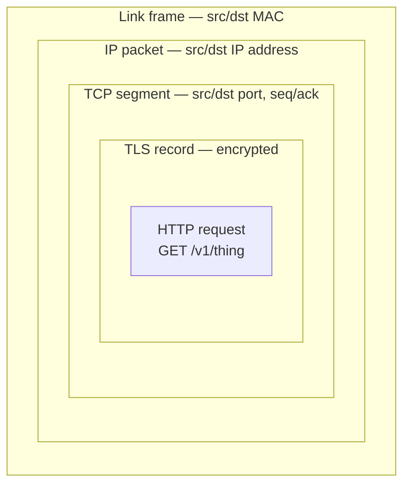
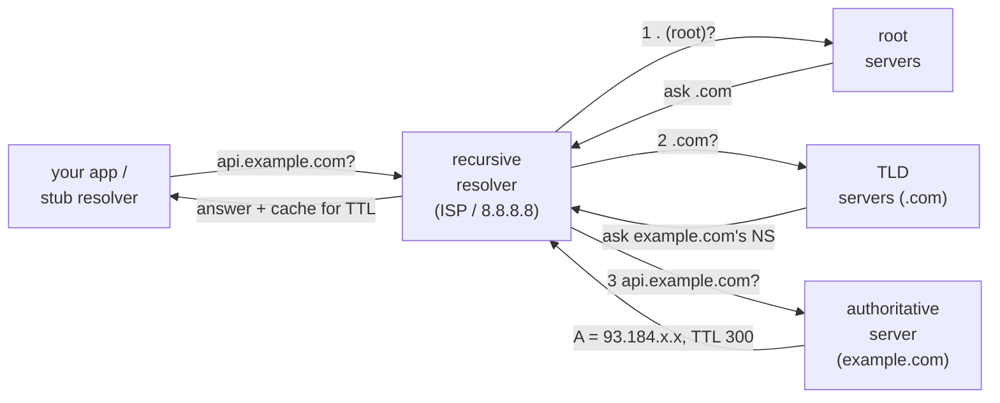
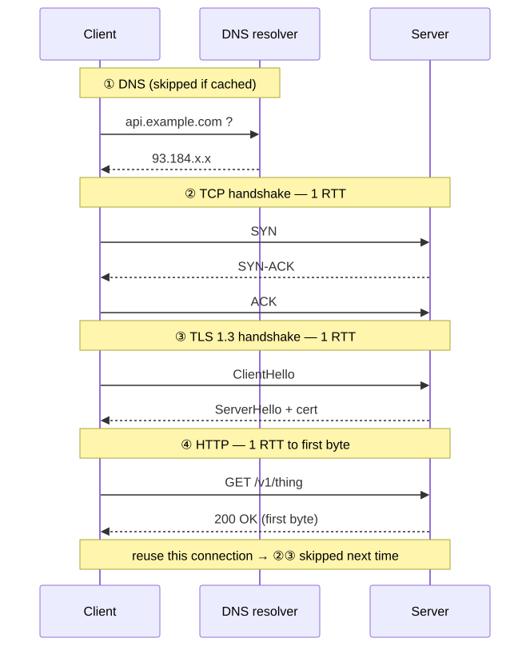
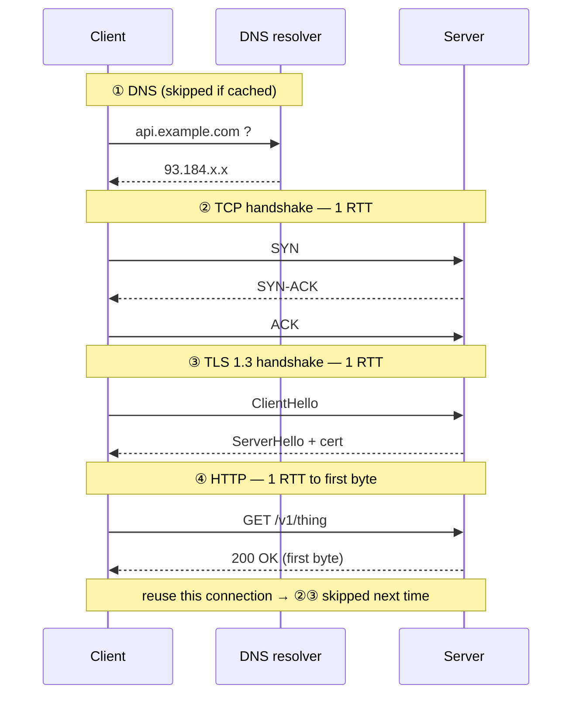

# M02 · Ch1 · §1 — How a Request Travels: the round-trips behind one `https://` call

> **Module:** Networking & The Web
> **Chapter:** The request lifecycle
> **Section:** What actually happens between typing a URL (or calling an API) and the first byte
> coming back — DNS, IP/routing, the TCP handshake, the TLS handshake, HTTP, and QUIC/HTTP-3 — all
> read as a **sequence of round-trips**, with a real latency budget on top.
> **Status:** ✅ finalized 2026-08-12 (body prepared 2026-08-04). Body went untouched; the Q&A drove
> the §2b IPv4/IPv6/NAT paragraph into a real-world thread — *IPv6's actual adoption status, why AWS
> bills for public IPv4, and whether an AWS backend can run purely on IPv6* — captured in **§11 Applied**.
> **Prerequisites:** M01 Ch4 §3 (why I/O dominates latency — the round-trip as the unit of latency,
> Little's Law, the four levers, latency ≠ bandwidth). This section *is* that chapter's payoff, one
> level up: the network path is where those round-trips actually live.

**Estimated study time:** 2.5–3 hours including the `curl`/`dig` hands-on.

---

## Why this section exists — and how it's pitched

You ship HTTP APIs, API Gateway, and WebSockets every day, and they work. This module's job is to
convert that working intuition into **mechanism you can budget and debug** — so that "the API is
slow" becomes "we're paying three extra round-trips because connections aren't being reused," and "it
works locally but not in prod" becomes "split-horizon DNS" or "an idle NAT dropped the socket."

M01 built the single machine from the bottom up (execution → memory → concurrency → I/O & syscalls).
This module connects machines. The organizing idea is the one you already earned in **M01 Ch4 §3**:

> **Latency is round-trips.** On a network path, almost nothing is computed — the time is spent
> waiting for signals to travel there and back. So the way to read *any* networked request is: **count
> the round-trips, price each one, and find which are on the critical path.**

We'll walk one `https://api.example.com/v1/thing` call from URL to first byte, layer by layer, and end
with a concrete latency budget that shows why the *handshakes*, not the data, dominate a first
request — and why connection reuse (which you already do) is the highest-leverage fix.

Because you work above this layer already, the pitch is **deep and comparative**, not "what is DNS."
The value is in the mechanism (why the handshake is 1 RTT, why HOL blocking exists), the real numbers
(the speed-of-light floor), the comparisons (TCP vs UDP vs QUIC, IPv4 vs IPv6), and the failure modes
you may have hit without naming.

---

## 1. The layered model — just enough

A networked request is built like a set of **nested envelopes**. Each layer wraps the layer above in
its own header, sends it, and the peer's matching layer unwraps it. This is **encapsulation**, and it
is the single structural idea that makes the whole stack comprehensible.

The industry uses two maps. The **OSI 7-layer model** is the vocabulary ("that's a layer-7 load
balancer," "a layer-4 proxy"); the **TCP/IP 4-layer model** is what the internet actually implements.
You need OSI only as *shared jargon*; reason with the TCP/IP four:

| TCP/IP layer | Job | Unit | Examples | "Address" it uses |
|---|---|---|---|---|
| **Application** | what the two programs say to each other | message | HTTP, gRPC, WebSocket, DNS | URL / path |
| **Transport** | deliver to the right *program*, reliably or not | segment / datagram | **TCP**, **UDP**, QUIC | port number |
| **Internet** | get a packet across networks to the right *host* | packet | **IP** (v4/v6), routing | IP address |
| **Link** | move bits across one physical hop | frame | Ethernet, Wi-Fi | MAC address |

<!-- DIAGRAM:START -->


<details>
<summary>Diagram source (Mermaid)</summary>



</details>
<!-- DIAGRAM:END -->

*Each layer adds its own header around the payload it's handed. Your `GET` is wrapped by TLS, then
TCP (which port? which byte-offset?), then IP (which host?), then the link frame (which next hop?).
The receiver unwraps in reverse. A "layer-N device" is one that reads down to layer N's header: a
switch reads the frame (L2), a router reads IP (L3), a load balancer reading ports is L4, one reading
the URL/`Host` header is L7.*

Two carry-overs from M04 land here exactly. **Layering is decomposition** (§1): each layer is a deep
module hiding its mechanism behind a narrow interface (TCP hands IP a packet; neither knows the
other's internals). And every layer is a **leaky abstraction** (M04 Ch2 §1 §7): TCP *sells* you a
reliable ordered byte stream, but packet loss leaks through as latency you can't see in the API — a
theme we'll hit repeatedly.

---

## 2. Names → addresses: DNS

You typed a name (`api.example.com`); IP routes to *numbers*. **DNS** (the Domain Name System) is the
distributed database that translates one to the other, and it's the **first round-trip of most
requests** — often an invisible latency source.

The resolution chain, first time (nothing cached):

<!-- DIAGRAM:START -->


<details>
<summary>Diagram source (Mermaid)</summary>



</details>
<!-- DIAGRAM:END -->

Mechanism worth owning:

- **It's a cache hierarchy, not a lookup every time.** Your OS caches, the browser caches, and above
  all the **recursive resolver** caches every answer for its **TTL** (time-to-live, seconds). The full
  root→TLD→authoritative walk happens only on a cold cache; the common case is a single \~1–20 ms hop
  to a nearby resolver, or a hit in local cache (≈ 0). *This is why a first request to a new host is
  slower — the cold DNS walk is a real, one-time round-trip tax*, exactly the cold-start shape from
  M01 Ch4 §9.
- **Record types you'll actually meet:** `A` (name → IPv4), `AAAA` (→ IPv6), `CNAME` (alias → another
  name — costs an extra resolution), `NS` (which servers are authoritative), `MX` (mail), `TXT`
  (SPF/verification). A CNAME chain to your CDN is common and each hop is latency.
- **Transport:** classic DNS rides **UDP** (one datagram each way — fast, no handshake; §5), falling
  back to TCP for large answers. Modern privacy variants **DoH/DoT** (DNS over HTTPS/TLS) wrap it in
  TLS — more secure, but now with a handshake cost.
- **Anycast** makes "the root servers" and public resolvers fast: the *same* IP is announced from many
  locations and routing sends you to the nearest. The same trick underlies CDNs (§7's "move closer").

**Failure modes ("it's always DNS," and it often is):** a stale record cached for its full TTL after
you cut over a service (why you *lower TTL before* a migration); **negative caching** (a `NXDOMAIN`
cached, so a just-created record "doesn't exist" for a while); and **split-horizon DNS** — the same
name resolving to a private address inside a VPC and a public one outside, the classic "works in prod,
not from my laptop" (and vice-versa).

---

## 2b. Finding the host: IP & routing (and why NAT complicates your WebSockets)

With an IP in hand, the packet has to *get there*. The **Internet layer (IP)** is a **best-effort,
connectionless** delivery service: it will try to move a packet toward its destination address and
makes **no promise** it arrives, arrives once, or arrives in order. (All the reliability you rely on
is added *above* it, by TCP — §4.)

- **The journey is hops.** Your packet goes to your default gateway, then router to router across
  autonomous systems, each making a **longest-prefix-match** forwarding decision on the destination IP
  and passing it on. `traceroute` (§10) shows you the actual chain. Every hop and every kilometre is
  latency (§3).
- **IPv4 vs IPv6 — a real comparison.** IPv4's \~4.3 billion addresses ran out; the two responses were
  **NAT** (Network Address Translation — many private hosts behind one public IP) and **IPv6**
  ($2^{128}$ addresses, so every device can have a public one). NAT is now everywhere, and it has a
  consequence that touches your daily work: a NATed host has **no stable, dialable public address**, so
  *inbound* connections don't just work — which is why peer-to-peer needs STUN/TURN and why **your
  server must accept the connection** (the client dials out). It also means a **NAT/firewall keeps a
  per-connection mapping with an idle timeout**, and when it silently drops an idle mapping, a
  long-lived **WebSocket** dies — the reason those connections need **heartbeats/keepalives** (a live
  anchor we'll return to in Ch4 real-time).

The takeaway for budgeting: the number of *hops* and the *distance* set a hard latency floor before
any protocol overhead — which §3 puts a number on.

> **The v4/v6 split is also an economics story.** Why does AWS hand almost everything an IPv4 address
> and *charge* you for a static one? Why is IPv6 still only \~half-deployed after 25 years — and can an
> AWS backend run *purely* on IPv6? That real-world thread is worked in **§11 Applied**.

---

## 3. The physics floor: distance is latency

Here is the number that reframes everything. Signals in fibre travel at about **two-thirds the speed
of light** — roughly $2\times10^{8}$ m/s. So a round trip has a **hard floor set by distance alone**,
before any software:

$$\text{RTT}_{\min} \approx \frac{2 \times \text{distance}}{\frac{2}{3}c}$$

- New York ↔ London (\~5,600 km): floor ≈ **56 ms** RTT. Real-world: \~70–80 ms.
- Singapore ↔ US-East (\~15,000 km): floor ≈ **150 ms** RTT. Real-world: \~200+ ms.
- Same data-centre / same region: **< 1 ms**.

You cannot beat this with a faster server or more bandwidth — it's geometry. It is the physical basis
of M01 Ch4's **"move closer"** lever (CDNs, edge, regional replicas) and of why **each extra
round-trip on a cross-ocean path costs \~150 ms**. Hold that number; it makes the next three sections
quantitative.

---

## 4. The reliable pipe: TCP

IP gives you unreliable packets; **TCP** turns them into the **reliable, ordered, byte-stream**
abstraction almost everything above assumes. It costs a round-trip up front and adds machinery you
should recognize.

**The 3-way handshake — one full RTT before any data:**

- Client → **SYN** (can we talk? here's my starting sequence number)
- Server → **SYN-ACK** (yes; here's mine)
- Client → **ACK** (got it) — and only now can the client send the HTTP request.

That's **1 RTT of pure setup** — \~150 ms on our cross-ocean path, spent before a single byte of your
request goes out. Remember it for the budget.

**What TCP adds on top of IP** (the reliability that leaks as latency):

- **Sequence numbers + ACKs + retransmission:** every byte is numbered; the receiver acknowledges;
  unacknowledged data is resent after a timeout. Loss → a retransmit wait → your "reliable stream"
  mysteriously stalls (the leak).
- **Flow control (sliding window):** the receiver advertises how much it can buffer, so a fast sender
  can't drown a slow receiver.
- **Congestion control (slow-start, `cwnd`):** TCP *ramps up* — it starts cautious and grows the
  in-flight window as ACKs return. Consequence: a brand-new connection is **slow for its first few
  round-trips**, which is *another* reason connection reuse wins (a warm connection has already ramped).
- **Head-of-line (HOL) blocking:** because the stream must be delivered *in order*, one lost segment
  stalls *everything* behind it, even bytes that already arrived. This is TCP's built-in limitation
  and the specific thing QUIC (§7) sets out to fix.

**TCP vs UDP — the fork.** **UDP** is the other transport: fire-and-forget datagrams, **no handshake,
no ordering, no retransmit, no congestion control** — just "send this packet, maybe it arrives." It
trades reliability for zero setup latency and no HOL blocking. Use TCP when you need every byte in
order (HTTP, databases); use UDP when you need speed and can tolerate/handle loss yourself (DNS,
real-time video/VoIP, games) — and, as we'll see, as the *foundation QUIC builds its own smarter
reliability on top of.*

---

## 5. Securing it: TLS (as a latency line-item)

Almost every request today is `https://`, so after TCP connects, client and server run a **TLS
handshake** to agree on keys before any HTTP flows. Full crypto detail is M02 Ch3 / M10; here it's a
**latency line-item**, and the version matters:

- **TLS 1.2:** \~**2 RTT** of handshake.
- **TLS 1.3** (the modern default): **1 RTT** — and **0-RTT resumption** for a host you've talked to
  recently (send early data on the first flight). A major reason the modern web feels faster.

So a **first** `https://` request to a **new** host, cold, pays, in order: **DNS** (≈1 round-trip if
uncached) **+ TCP** (1 RTT) **+ TLS** (1 RTT) **+ HTTP** (1 RTT for request→first byte). On our
cross-ocean path that's roughly **4 × 150 ms ≈ 600 ms before the first useful byte** — and the actual
data was one of those four. *That ratio is the whole point of this section.*

---

## 6. The whole journey, assembled

<!-- DIAGRAM:START -->


<details>
<summary>Diagram source (Mermaid)</summary>



</details>
<!-- DIAGRAM:END -->

Four sequential round-trips, three of which are *setup*. The dashed lesson: keep the connection open
(HTTP keep-alive) and the next request to the same host pays only step ④.

---

## 7. QUIC & HTTP/3 — the modern reshuffle

QUIC is what you get when you take the previous three sections seriously and ask "why are TCP and TLS
*two* separate handshakes, and why does one lost packet stall unrelated streams?" It's the transport
behind **HTTP/3**, and it's worth knowing because it's now a large fraction of real web traffic.

- **Built on UDP**, QUIC re-implements reliability, ordering, and congestion control *itself* — in
  user space — so it can evolve without waiting for OS kernels.
- **Merged connection + crypto setup: 1-RTT** (often **0-RTT** on resumption) to a *secure* connection,
  because it folds the TLS 1.3 handshake into the transport handshake — collapsing steps ② and ③ into
  one.
- **No cross-stream HOL blocking:** QUIC has independent streams, so a lost packet stalls only *its*
  stream, not the others (the fix for TCP's §4 limitation — decisive when a page pulls many objects).
- **Connection migration:** a connection is identified by an ID, not the IP+port 4-tuple, so it
  *survives* a network change (Wi-Fi → cellular) without re-handshaking — a real mobile win.

The pattern to notice: HTTP/1.1 → HTTP/2 (multiplexing over one TCP connection, but still one
TCP-level HOL queue) → HTTP/3 (QUIC, per-stream independence). Each step attacks **round-trips and
head-of-line blocking** — the two themes of this whole section.

---

## 8. The latency budget — put numbers on it

This is the payoff figure: the same first-byte cost, broken into its round-trips, for three real
scenarios. It makes M01 Ch4's abstractions ("count the round-trips," "amortize setup," "move closer")
concrete.

<!-- FIGURE:fig1 -->
![Grouped horizontal stacked bars of 'time to first byte,' broken into four phases — DNS, TCP handshake, TLS 1.3 handshake, and HTTP request-to-first-byte. Bar 1 'Same-region, cold' totals about 12 ms (all phases tiny). Bar 2 'Cross-ocean, cold' totals about 520 ms, made of four roughly-equal ~150 ms segments (a small DNS piece plus TCP, TLS, and HTTP each ~160 ms) — three of the four segments are setup. Bar 3 'Cross-ocean, warm (keep-alive + DNS cached)' totals about 160 ms: DNS, TCP, and TLS collapse to zero and only the single HTTP round-trip remains. The figure shows that on a long path the handshakes dominate a first request and that connection reuse removes three of the four round-trips.](diagrams/01-how-a-request-travels-fig1.svg)

Read off the levers (all four from M01 Ch4 §3, now concrete):

- **Fewer round-trips.** Reuse connections (HTTP keep-alive) so DNS+TCP+TLS are paid **once**, not per
  request — the jump from bar 2 to bar 3, \~520 ms → \~160 ms, for free. TLS 1.3 / 0-RTT and HTTP/2
  multiplexing cut more. *This is the single highest-leverage web-latency fix, and it's the same
  connection-reuse move you already applied to the arena cold-start.*
- **Move closer.** A CDN/edge PoP near the user shrinks every RTT — it attacks the \~150 ms *unit
  cost*, turning bar 2 into bar 1. It's the only lever that beats the §3 physics floor (by shortening
  the distance).
- **Overlap & hide.** Fire independent requests concurrently (they share the warm connection), prefetch
  DNS/connections, and stream so first paint doesn't wait for the whole body.

---

## 9. Check your understanding

1. A colleague says "our API is slow, let's buy more bandwidth." The payload is 4 KB and the client is
   cross-ocean from the server. Why is bandwidth almost certainly the wrong lever, and what does the
   §8 budget say to look at instead?
2. Put the round-trips of a **first** `https://` GET to a **new** host in order, and say which one
   carries the actual application data. Then say which of them a **reused** connection skips.
3. What is head-of-line blocking in TCP, why does it happen, and how does QUIC/HTTP-3 avoid it?
4. You cut a service over to a new IP; some users hit the old box for hours. Name the DNS mechanism
   responsible and the one thing you should have done *before* the cutover.
5. A WebSocket that's idle for a few minutes keeps dropping in production but never on your local
   machine. Give the most likely network-layer cause and the standard mitigation.
6. Why is a brand-new TCP connection slow for its first few round-trips even on a fast link — and how
   does that reinforce the case for connection reuse?

<details>
<summary>Answers</summary>

1. Because the time is **round-trips, not bytes** (M01 Ch4 §3: latency ≠ bandwidth). A 4 KB body fits
   in a packet or two; on a \~150 ms-RTT path the cost is the **four sequential round-trips** (DNS, TCP,
   TLS, HTTP), \~600 ms cold — bandwidth changes none of them. Look at **eliminating round-trips**:
   connection reuse / keep-alive, TLS 1.3 + resumption, and a CDN/edge to cut the RTT unit cost.
2. Order: **DNS → TCP handshake → TLS handshake → HTTP request/response**. Only the **HTTP** step
   carries application data; the first three are setup. A **reused (keep-alive) connection skips DNS
   (cached), TCP, and TLS** — paying only the HTTP round-trip.
3. TCP guarantees **in-order** delivery of one byte stream, so if a segment is lost, every byte that
   arrived *after* it must wait in the buffer until the missing one is retransmitted — one loss stalls
   everything behind it. QUIC (HTTP/3) runs **independent streams** over UDP, so a loss stalls only its
   own stream; the others proceed.
4. **TTL-based caching** in resolvers held the old `A` record for its full TTL. Before the cutover you
   should have **lowered the record's TTL** (well ahead of time) so caches expire quickly, then changed
   the record — and raised the TTL back afterward.
5. A **NAT/firewall idle timeout** silently dropped the connection's mapping (locally there's no NAT
   between you and the server). Mitigation: **application-level heartbeats / keepalive pings** (or
   TCP keepalive) to keep the mapping alive — Ch4 real-time revisits this.
6. **TCP slow-start:** congestion control starts with a small window and grows it as ACKs return, so
   throughput ramps over the first few RTTs regardless of link speed. A **reused** connection has
   already ramped (and skipped the handshakes), so it's faster from the first byte — another reason to
   keep connections warm.

</details>

---

## 10. Optional: get your hands dirty (30–40 min) — watch the round-trips

Make the invisible round-trips visible on your own machine.

1. **The DNS walk:** `dig +trace api.github.com` — watch it descend root → TLD → authoritative. Then
   `dig api.github.com` twice and compare the reported query time (the second is cache-warm). Look at
   the TTL.
2. **The phase breakdown of one request** — the single most useful command here:
   ```bash
   curl -w "dns:%{time_namelookup}s  tcp:%{time_connect}s  tls:%{time_appconnect}s  ttfb:%{time_starttransfer}s  total:%{time_total}s\n" \
        -o /dev/null -s https://api.github.com
   ```
   The numbers are **cumulative** — DNS, then +TCP, then +TLS, then +time-to-first-byte. Subtract
   adjacent values to get each phase. Run it twice: the second is warmer. This is §8's budget for a
   real host.
3. **The hops:** `traceroute api.github.com` (or `mtr api.github.com` for a live, loss-annotated
   view). Count the hops and watch latency climb with distance.
4. **Reuse in action:** `curl -v https://api.github.com https://api.github.com` (two URLs, one
   command) and look for `Re-using existing connection` on the second — the handshakes vanish.
5. **In the browser:** DevTools → Network → click a request → *Timing* tab shows the exact same
   DNS/Connic/TLS/TTFB waterfall for real page loads.

Deliverable: the four phase numbers for one cold and one warm request, and a one-line note on which
phase dominated and why.

---

## 11. Applied — the IPv6 question: adoption status, and why AWS bills you for IPv4

A reader question pushed §2b past the protocol into the real-world economics: *what is IPv6's actual
status? On AWS almost everything gets an IPv4 address, and a static IPv4 now costs extra — so can a
backend run purely on IPv6?* The answer is a useful map of where the transition really stands, and it
turns the abstract "IPv4 ran out" into a live architecture-and-cost decision.

**Adoption is split down the middle — and split by *side* of the connection.** The best public gauge,
Google's measurement of how many of its users arrive over IPv6, sits around **45–50%** in the
mid-2020s and climbs a few points a year. But the halves are lopsided by *who* you are: **eyeball and
mobile networks moved** (T-Mobile US runs IPv6-only internally with 464XLAT; large mobile carriers are
v6-heavy), while **enterprise and cloud *infrastructure* lag**. That asymmetry is exactly what you see
on AWS — the client side of the world is half-v6, the server side you build on is still v4-first.

**Why AWS shows IPv4 everywhere — and started charging for it.** A VPC is IPv4-first by design; IPv6
is opt-in (a dual-stack or IPv6-only subnet you enable deliberately), so every default template hands
out v4. Meanwhile IPv4 addresses became a *traded commodity* after exhaustion — a single address
trades for tens of dollars (roughly 30–60) and rising. So on **1 February 2024 AWS began charging
about 0.005 dollars per hour (\~3.6 dollars a month) for every public IPv4 address** — in-use ones too,
not just idle Elastic IPs — while **IPv6 addresses are free**. The price gap is a deliberate stick: it
prices in the real scarcity and nudges you toward v6. Your "pay extra for a static IPv4" is that
charge.

**Why IPv6 hasn't simply won** (the structural answer, deepening §2b):

1. **No backward compatibility.** A v6-only host cannot talk directly to a v4-only host — different
   wire formats. So you can't incrementally upgrade; through the whole transition you run *both* stacks
   (dual-stack), which is more work, not less. There's no individual first-mover reward, only a
   collective one — the single fact that keeps a 25-year-old protocol stuck at half.
2. **NAT defused the crisis.** Carrier-grade NAT let whole networks share one public v4 (the §2b NAT
   again), removing the scarcity urgency that would otherwise have forced migration.
3. **Chicken-and-egg → permanent dual-stack.** Content won't go v6-*only* while eyeballs are v4; ISPs
   keep v4 while content is v4. The stable equilibrium is dual-stack everywhere, not a switchover.

**Where v6 *does* win: when you personally run out of addresses.** Meta's data-center network has been
**IPv6-only since \~2015** — not ideology, but because they exhausted even *private* v4 space
(`10.0.0.0/8` is only about 16 million addresses; a hyperscaler blows through it). That's the tell for
the whole story: adoption follows real scarcity, and most people don't feel it.

**So — can an AWS backend run purely on IPv6?** The honest split, and the practical target:

- **Internal / east-west: yes.** IPv6-only subnets for compute, databases, and service-to-service
  traffic work today and shed the v4 charges.
- **Public ingress: no.** A v6-only endpoint is *unreachable* to the \~half of clients (and most
  corporate/guest networks) still on v4-only — you'd be silently invisible to them. Keep a **thin
  dual-stack edge** (CloudFront, an ALB, or API Gateway) that terminates client IPv4 and forwards to
  the IPv6-only backend, concentrating v4 into a few *shared* edge addresses instead of one per
  instance.
- **Egress is the catch people miss.** An IPv6-only backend also can't *reach* IPv4-only destinations —
  and many third-party APIs still publish no `AAAA` record (quite possibly some of the LLM providers a
  backend calls). AWS's fix is **NAT64 + DNS64**: Route 53 Resolver synthesizes an `AAAA`, the NAT
  Gateway translates the traffic to v4 on the way out — the mirror image of the dual-stack edge.

**Keeper:** *"purely IPv6, zero IPv4 anywhere" is not achievable for an app that both serves and calls
the public internet — but "**IPv6-only servers + a thin dual-stack edge + a NAT64 escape hatch**" is,
and it is precisely the cost-smart target the AWS pricing is steering you toward.* The whole IPv4→IPv6
saga in one line: **a protocol with no backward-compatibility, whose forcing function (scarcity) was
softened by NAT — so it migrates only where someone actually hits the wall.**

---

## Key terms (English · 大陆 简体 · 台灣 繁體)

| English | 大陆 (简体) | 台灣 (繁體) | Note |
|---|---|---|---|
| Network | 网络 | 網路 | ⚠ genuine split: 网络 (mainland) ↔ 網路 (Taiwan) |
| Protocol | 协议 | 協定 / 通訊協定 | ⚠ genuine split: 协议 ↔ 協定 |
| Server | 服务器 | 伺服器 | ⚠ genuine split: 服务器 ↔ 伺服器 |
| Packet | 数据包 | 封包 | ⚠ genuine split: 数据包 ↔ 封包 |
| Router | 路由器 | 路由器 | same |
| Handshake | 握手 | 握手 | same |
| Latency | 延迟 | 延遲 | script only |
| Bandwidth | 带宽 | 頻寬 | ⚠ genuine split: 带宽 ↔ 頻寬 |
| Round-trip time (RTT) | 往返时延 | 來回時間 / 往返時間 | ⚠ 往返时延 ↔ 來回時間 |
| Domain name resolution | 域名解析 | 網域名稱解析 | ⚠ 域名 ↔ 網域名稱 |
| Cache | 缓存 | 快取 | ⚠ genuine split: 缓存 ↔ 快取 |
| Port | 端口 | 連接埠 | ⚠ genuine split: 端口 ↔ 連接埠 |
| Encapsulation | 封装 | 封裝 | script only |
| Dual-stack (IPv4+IPv6) | 双栈 | 雙協定堆疊 / 雙堆疊 | ⚠ 双栈 ↔ 雙(協定)堆疊 (§11) |
| Address exhaustion | 地址耗尽 | 位址耗盡 | ⚠ genuine split: 地址 (mainland) ↔ 位址 (Taiwan) |

---

## References

- Cloudflare Learning Center — accessible, accurate primers on each piece:
  *What is DNS?* <https://www.cloudflare.com/learning/dns/what-is-dns/> ·
  *TLS handshake* <https://www.cloudflare.com/learning/ssl/what-happens-in-a-tls-handshake/> ·
  *What is QUIC / HTTP-3?* <https://www.cloudflare.com/learning/performance/what-is-http3/>
- High Performance Browser Networking, Ilya Grigorik (free online) — the definitive deep treatment of
  latency, TCP, TLS, HTTP/2. <https://hpbn.co/>
- The speed-of-light latency floor, illustrated — <https://hpbn.co/primer-on-latency-and-bandwidth/>
- IETF: TLS 1.3 (RFC 8446, 1-RTT/0-RTT) <https://datatracker.ietf.org/doc/html/rfc8446> ·
  QUIC (RFC 9000) <https://datatracker.ietf.org/doc/html/rfc9000> ·
  HTTP/3 (RFC 9114) <https://datatracker.ietf.org/doc/html/rfc9114>
- `curl` timing variables (`-w`) — <https://curl.se/docs/manpage.html#-w>

### What's next

This opens M02. Natural continuations inside the module:
- **Ch2 — HTTP deeply:** methods, status codes, headers, idempotency, caching, content negotiation —
  the application-layer message that step ④ above carries.
- **Ch3 — TLS & secure transport:** what the §5 handshake actually agrees on (certificates, the key
  exchange), deepened — and the bridge into M10 (security).
- **Ch4 — Real-time:** REST vs WebSockets vs SSE vs long-polling, and the NAT-idle-timeout/heartbeat
  story from §2b in full — closest to your arena work.

Or rotate scope: **M04 Ch3 (design patterns)** is teed up from Ch2, or **M01 Ch5** (OS landscape)
closes M01.
