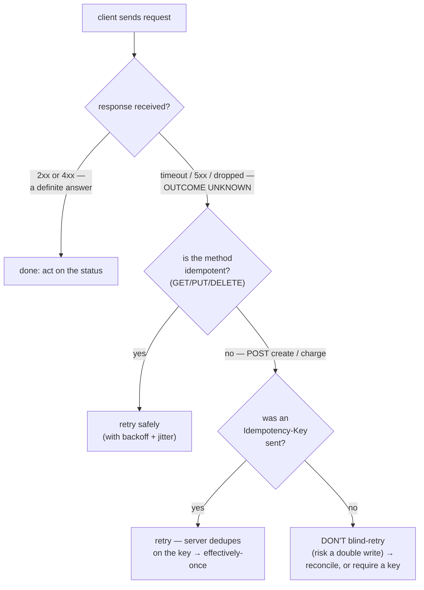
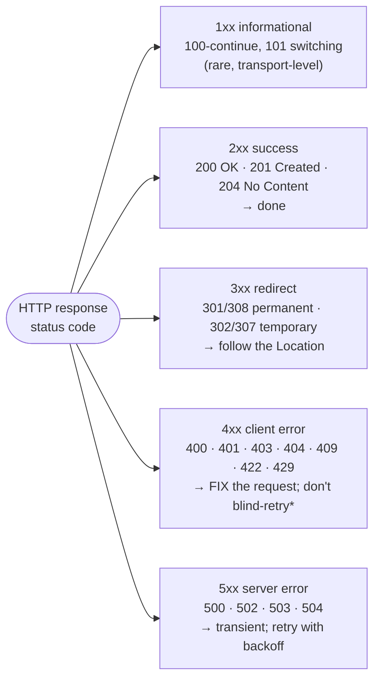

# M02 · Ch2 · §1 — HTTP Semantics: methods, status codes, and the idempotency contract that makes retries safe

> **Module:** Networking & The Web
> **Chapter:** HTTP deeply
> **Section:** HTTP as a **uniform interface** — the small fixed vocabulary of methods and status codes,
> the three properties (safe · idempotent · cacheable) that govern how every cache, proxy, crawler, and
> retry loop treats a request, and the idempotency-key move that makes a non-idempotent write safe to
> retry. The application-layer message that §1's step ④ (the HTTP round-trip) actually carries.
> **Status:** ✅ finalized 2026-08-20 (body prepared 2026-08-12). Body went untouched; the session was
> **three real-world threads**, each sparked by his AWS practice and driven to the underlying principle —
> *HTTP API vs REST API* (the AWS API Gateway naming collision), *why the browser enforces the CORS
> (Cross-Origin Resource Sharing) `OPTIONS` preflight*, and *the client-trust boundary* (what if the browser is malicious?). Captured in
> **§10 Applied**.
> **Prerequisites:** M02 Ch1 §1 (how a request travels — HTTP rides on the TCP/TLS (Transport Layer
> Security) connection you now
> know how to budget). Useful: your own experience with retries/idempotency in distributed systems,
> which this section gives the precise HTTP vocabulary for.

**Estimated study time:** 2.5–3 hours including the `curl` hands-on.

---

## Why this section exists — and how it's pitched

You write HTTP endpoints every day and they work. The thing worth extracting is that "it works" rests on
a **contract almost nobody reads but everybody depends on**: HTTP defines a small, fixed set of methods
and status codes with *agreed semantics*, and that agreement is exactly what lets a CDN (Content Delivery Network), a browser, a
corporate proxy, a load balancer, and your client's retry loop all make correct decisions about your
traffic **without knowing anything about your application.** Get the semantics right and the whole
ecosystem cooperates for free; get them wrong and you get double-charges, cache poisoning, crawlers
deleting your data, and retries that make outages worse.

So this section is pitched at the layer where it becomes an **API-design and reliability decision**, not
a syntax lesson. The spine is three properties — **safe, idempotent, cacheable** — and the payoff is the
one that touches your distributed-systems work most directly: **idempotency is what makes a retry safe**,
and there's a precise move (the idempotency key) to extend that safety to operations that don't have it
by nature.

> HTTP is the **uniform interface** of the web (the "UI" in REST). Its power is not richness — it's the
> *opposite*: a deliberately tiny, universal vocabulary whose meaning is fixed, so that intermediaries
> can act on it generically. The constraint is the feature. *(What REST adds beyond HTTP — and why an
> "HTTP API" is not automatically a "REST API," including the AWS API Gateway naming collision — is §10a.)*

---

## 1. Stateless, and a uniform interface

<details>
<summary><b>Vocabulary for this section</b> — the two design choices, and every header shown in the example messages (click to expand)</summary>

**Abbreviations**

| Short | Stands for | Meaning |
|---|---|---|
| **HTTP** | HyperText Transfer Protocol | the application protocol this chapter is about |
| **URL** | uniform resource locator | the address that names a resource |
| **API** | application programming interface | the machine-facing interface a service exposes |
| **JSON** | JavaScript Object Notation | the usual text format for API bodies, seen here as `application/json` |
| **REST** | Representational State Transfer | an architectural style layered on top of HTTP; not the same thing as "an HTTP API" |

**Terms**

| Term | Definition |
|---|---|
| **Stateless** | the protocol keeps no memory between requests; each request carries everything the server needs |
| **Session** | a notion of an ongoing conversation — *not* an HTTP concept; it is reconstructed each request from a cookie or token |
| **Cookie** | a small value the browser stores and sends back on later requests, commonly used to carry identity |
| **Token** | a credential string (often in `Authorization`) that identifies the caller on every single request |
| **Horizontally scalable** | able to grow by adding more identical servers, which statelessness is what makes possible |
| **Load balancer** | the device that spreads requests across those servers; safe to do only because any server can take any request |
| **Uniform interface** | the fixed, small set of methods that applies to every resource, so intermediaries can act generically |
| **Resource** | the thing a URL names — the noun a method acts on |
| **Method (verb)** | `GET`, `POST`, `PUT`, `PATCH`, `DELETE`, `HEAD`, `OPTIONS` — what you want done to the resource |
| **Representation** | the concrete bytes in the body that stand for the resource — JSON, HTML, an image |
| **Request line** | the first line of a request: method, target and version |
| **Status line** | the first line of a response: version, status code and reason phrase |
| **Header** | one line of key/value metadata about the message |
| **Body** | the optional payload after the blank line |
| **Intermediary** | any box between client and server — proxy, cache, load balancer — that acts on the message without understanding your domain |
| **`Host`** | the header naming which site the request is for |
| **`Authorization`** | the header carrying the caller's credential, e.g. `Bearer <token>` |
| **`Idempotency-Key`** | a client-generated key letting the server recognise a retry of the same operation (§3) |
| **`Content-Type`** | the header declaring the media type of the body |
| **`Content-Length`** | the header declaring the body's size in bytes |
| **`Location`** | the response header giving the URL of the newly created (or redirected-to) resource |
| **`ETag`** | a validator token identifying a specific version of a resource (Ch2 §2) |
| **`201 Created`** | the status code meaning the request succeeded and created a new resource |
| **Cache** | a store that keeps a response and serves it again instead of asking the server |

</details>

Two design choices shape everything below.

**HTTP is stateless.** Each request carries everything the server needs to process it; the protocol keeps
no memory between requests. There is no "session" at the HTTP layer — what looks like one is reconstructed
each time from a cookie or a token *in the request*. Why this matters: statelessness is what makes the web
**horizontally scalable** — any server behind a load balancer can handle any request, because none of them
hold client-specific state in the connection (the M07 scaling payoff, and the reason your Lambda/API
Gateway model works at all). The cost is that identity/context must travel *in every message* (cookies,
`Authorization` tokens), which is why those headers exist.

**HTTP is a uniform interface.** Instead of every service inventing its own verbs, HTTP gives you a fixed
handful — `GET`, `POST`, `PUT`, `PATCH`, `DELETE`, `HEAD`, `OPTIONS` — applied to *resources* named by
URLs. The uniformity is the whole point: a cache knows a `GET` is reusable and a `DELETE` is not, without
understanding your domain. An HTTP message is dead simple by design:

```http
POST /v1/charges HTTP/1.1            ← request line: method, target, version
Host: api.example.com                ← headers: metadata (routing, auth, content, caching)
Authorization: Bearer sk_live_…
Idempotency-Key: a1b2c3-…
Content-Type: application/json
Content-Length: 27

{"amount": 500, "cur": "usd"}        ← body (optional): the representation
```
```http
HTTP/1.1 201 Created                 ← status line: version, status code, reason
Content-Type: application/json
Location: /v1/charges/ch_123
ETag: "9e1f…"

{"id": "ch_123", "amount": 500}
```

That's it: a line, some headers, a blank line, an optional body — same shape in both directions. All the
sophistication is in the *semantics* of the method and status code, which is what the rest of the section
is about.

---

## 2. The three properties that govern everything: safe · idempotent · cacheable

<details>
<summary><b>Vocabulary for this section</b> — the three properties, the methods in the table, and the infrastructure that keys off them (click to expand)</summary>

**Abbreviations**

| Short | Stands for | Meaning |
|---|---|---|
| **CORS** | Cross-Origin Resource Sharing | the browser rules for calling a different origin, whose preflight uses `OPTIONS` |
| **HTTP** | HyperText Transfer Protocol | the protocol defining these properties |
| **URL** | uniform resource locator | the address the method is applied to |
| **N** | (a count) | "doing it N times" — an arbitrary number of repeats |

**Terms**

| Term | Definition |
|---|---|
| **Safe** | the method has no intended side effect — it only reads. `GET`, `HEAD`, `OPTIONS` |
| **Idempotent** | doing it many times has the same effect as doing it once. `GET`, `PUT`, `DELETE` |
| **Cacheable** | the response may be stored and reused for a later equivalent request |
| **Side effect** | any change to server state caused by handling the request |
| **`GET`** | read a resource |
| **`HEAD`** | read only the headers a `GET` would return, with no body |
| **`OPTIONS`** | ask what may be done at this URL; also the CORS preflight |
| **`PUT`** | create-or-replace the resource at a URL the client chose |
| **`DELETE`** | remove a resource |
| **`POST`** | create something, or process something, with the server deciding the URL |
| **`PATCH`** | apply a partial change to a resource |
| **Prefetch** | a browser fetching a link in advance, unprompted — legitimate only because `GET` is safe |
| **Crawler** | a search-engine robot that follows links automatically, for the same reason |
| **`404`** | the status code meaning the resource is not there |
| **Revalidation** | asking the server whether a stored copy is still good, instead of refetching it (Ch2 §2) |
| **`ETag`** | a validator token identifying a specific version of a resource |
| **`Cache-Control`** | the header stating how long and by whom a response may be cached |
| **State** | what the server holds after the request — the thing idempotency is a claim about, not the response |

</details>

Every method is defined by three yes/no properties. These are not trivia — each one licenses a *different*
piece of infrastructure to do something on your behalf.

| Method | Safe (read-only) | Idempotent (repeat = same effect) | Cacheable | Typical use |
|---|---|---|---|---|
| `GET` | ✅ | ✅ | ✅ | read a resource |
| `HEAD` | ✅ | ✅ | ✅ | read just the headers |
| `OPTIONS` | ✅ | ✅ | ❌ | capabilities / CORS preflight |
| `PUT` | ❌ | ✅ | ❌ | create-or-**replace** at a known URL |
| `DELETE` | ❌ | ✅ | ❌ | remove a resource |
| `POST` | ❌ | ❌ | ⚠ rarely | create / process / "do a thing" |
| `PATCH` | ❌ | ❌ (usually) | ❌ | **partial** update |

- **Safe = no intended side effect** (read-only). GET/HEAD/OPTIONS. This is a *promise to the ecosystem*:
  because they're safe, browsers **prefetch** them, crawlers **follow** them, and caches **store** them,
  all without asking. Which is why the single most classic web disaster is **a state change behind a
  GET** — an admin panel with `GET /posts/42/delete` links, and then a search-engine crawler (or the
  browser's link prefetcher) methodically deletes every row by "reading" the page. Safe is a contract you
  must not break.
- **Idempotent = doing it N times has the same effect as doing it once.** GET/PUT/DELETE are; POST/PATCH
  generally aren't. `PUT /users/42 {…}` sets the resource to that value — run it five times, same result.
  `DELETE /users/42` — deleted once, still deleted (the *state* is idempotent even if the second call
  returns 404). This is the property that makes **retries safe**, and it's the heart of §3.
- **Cacheable = a response may be stored and reused** (GET/HEAD by default; the full mechanics — ETags,
  `Cache-Control`, revalidation — are §2 of this chapter).

The mental model: **safe** governs who may call it *unprompted*; **idempotent** governs whether it's safe
to call it *again*; **cacheable** governs whether the *answer* can be reused. Different questions, different
infrastructure keys off each.

---

## 3. Idempotency, deeply — the property that makes retries safe

<details>
<summary><b>Vocabulary for this section</b> — the ambiguous-timeout problem and the idempotency-key pattern (click to expand)</summary>

**Abbreviations**

| Short | Stands for | Meaning |
|---|---|---|
| **UUID** | universally unique identifier | a 128-bit random identifier, the usual form of an idempotency key |
| **TTL** | time to live | how long the server keeps a recorded key before forgetting it |
| **TCP** | Transmission Control Protocol | the transport whose connection can drop mid-request |
| **2xx / 4xx / 5xx** | the 200-, 400- and 500-numbered status classes | success · client error · server error |
| **IETF** | Internet Engineering Task Force | the body that standardises internet protocols, including HTTP |
| **HTTP** | HyperText Transfer Protocol | the protocol in question |

**Terms**

| Term | Definition |
|---|---|
| **Idempotent** | repeating the operation leaves the system in the same **state** as doing it once — a claim about state, not about the response |
| **Ambiguous timeout** | the client got no answer, and cannot tell "never arrived" from "succeeded but the response was lost" |
| **Retry** | sending the same request again after a failure |
| **Blind retry** | retrying without knowing whether the first attempt took effect — dangerous for a non-idempotent operation |
| **Backoff** | waiting longer before each successive retry |
| **Jitter** | adding randomness to that wait so many clients do not retry in lockstep |
| **Idempotency key** | a client-generated value, identical across retries of one logical operation, that the server dedupes on |
| **Dedupe** | recognising a repeat by its key and returning the stored result instead of doing the work again |
| **At-least-once delivery** | a delivery guarantee where a message may arrive more than once, never zero times |
| **Effectively-once** | the observable result of at-least-once delivery plus an idempotent handler: the work happens once |
| **Logical operation** | one business intent ("charge this customer once"), as opposed to one network request |
| **Reconcile** | checking after the fact whether the operation actually took effect, when you cannot safely retry |
| **`POST /charges`** | the canonical non-idempotent operation: each call creates a new charge |
| **`404`** | "not there" — the answer a second `DELETE` may give, while still being idempotent in state |
| **`5xx`** | a server-side error, generally transient and therefore retryable |
| **State convergence** | designing so repeated attempts end at the same state, rather than trying to make responses identical |

</details>

This is the section's core, and it's your territory (retries, at-least-once delivery, effectively-once).
HTTP gives it a precise home.

**The fundamental problem: a timeout is ambiguous.** When a client sends a request and the connection
times out (or returns a 5xx, or the TCP link drops), the client is in an epistemically nasty spot: **it
cannot tell whether the request never arrived, or whether it arrived, succeeded, and only the *response*
was lost.** Those two cases demand opposite actions — retry vs don't-retry — and the client can't
distinguish them.

Idempotency dissolves the dilemma. If the operation is idempotent, **you don't need to know** which case
you're in — just retry. Worst case, the server does the same harmless thing twice. That's why the design
rule is: *use the idempotent method when you can.* A "set the shipping address to X" is naturally a `PUT`
(idempotent) — retry freely. A "delete order 42" is `DELETE` — retry freely.

<!-- DIAGRAM:START -->


<details>
<summary>Diagram source (Mermaid)</summary>



</details>
<!-- DIAGRAM:END -->

**The move for operations that aren't naturally idempotent: the idempotency key.** `POST /charges`
creates a *new* charge each time — blind-retry it and you double-charge the customer. You make it safe by
having the client generate a unique **`Idempotency-Key`** (a UUID — universally unique identifier) per logical operation and send it on
the request *and every retry of it*. The server records the key with the result; a repeat of the same key
returns the **stored** result instead of doing the work again. This is exactly **at-least-once delivery +
an idempotent handler = effectively-once processing** — the distributed-systems pattern you already use,
now with its standard HTTP spelling (it's Stripe's well-known API design, and it's spreading into the
IETF (Internet Engineering Task Force) as a standard header). The key points worth holding:

- The **client** owns the key (it must be stable across retries of the *same* intent, and different for a
  genuinely new one).
- The **server** dedupes on it, typically with a TTL, storing the response so the retry is byte-identical.
- It converts an unsafe retry into a safe one *without* changing the operation's meaning — the senior fix.

> Keeper: **idempotency is not about the method returning the same *response* — it's about the system
> reaching the same *state*.** A second `DELETE` returning `404` is still idempotent: the world is in the
> same state either way. Design for state-convergence, not response-equality.

---

## 4. Choosing the method — the real design decisions

<details>
<summary><b>Vocabulary for this section</b> — the method trade-offs and the CORS preflight vocabulary (click to expand)</summary>

**Abbreviations**

| Short | Stands for | Meaning |
|---|---|---|
| **CORS** | Cross-Origin Resource Sharing | the browser rules governing requests to a different origin |
| **URL** | uniform resource locator | the address naming the resource |
| **API** | application programming interface | the service interface being designed |
| **JSON** | JavaScript Object Notation | the body format; JSON-Patch is a standard way to express partial changes |
| **L7** | layer 7 | a device that reads the application-layer message, i.e. the HTTP request itself |
| **HTTP** | HyperText Transfer Protocol | the protocol |

**Terms**

| Term | Definition |
|---|---|
| **`POST`** | "process this, or create something, and *you* choose the URL" — not idempotent |
| **`PUT`** | "make the resource at *this* URL equal to this representation" — idempotent, client-chosen URL |
| **`PATCH`** | apply a partial change; usually **not** idempotent, so it needs the same retry care as `POST` |
| **`GET`** | read only — never use it for anything that changes state |
| **`OPTIONS`** | ask what is allowed at this URL; the method the browser uses for a preflight |
| **Replace vs partial update** | `PUT` overwrites the whole resource, so fields you omit are cleared; `PATCH` touches only what you send |
| **JSON-Patch** | a format describing a change as a list of operations; an "append" operation makes it non-idempotent |
| **Idempotency key** | a client-supplied value that makes a `POST` safe to retry (§3) |
| **`201`** | "created" — the success code for a `POST` that minted a new resource |
| **`Location`** | the response header giving the URL of that new resource |
| **Origin** | the scheme, host and port of a page; two URLs differing in any of the three are different origins |
| **Cross-origin request** | a request from a page on one origin to a different origin |
| **Preflight** | the automatic `OPTIONS` request a browser sends first, asking whether the real request is permitted |
| **Simple request** | a cross-origin request plain enough that the browser sends it without a preflight |
| **`Access-Control-Allow-*`** | the response headers by which a server states which origins, methods and headers it permits |
| **`curl`** | a command-line HTTP client; it is not a browser, so no CORS rules apply to it |
| **Crawler** | an automated link-follower — the reason a state-changing `GET` is a disaster (§2) |

</details>

The verbs encode intent; picking the right one is an API-design call with real consequences.

- **`POST` vs `PUT`.** `POST` = "process this / create something, *you* decide the URL" — **not**
  idempotent (each call is a new thing). `PUT` = "make the resource at *this* URL equal to this
  representation" — idempotent, client-chosen URL. If the client can name the resource (e.g.
  `PUT /users/42/settings`), prefer `PUT` and get retry-safety for free; if the server mints the id
  (`POST /orders` → `201` + `Location`), it's a `POST` and you reach for an idempotency key.
- **`PUT` vs `PATCH`.** `PUT` **replaces** the whole resource (omitted fields are cleared); `PATCH`
  applies a **partial** change. Using `PUT` when you meant `PATCH` silently wipes fields the client didn't
  send — a real data-loss bug. `PATCH` is usually *not* idempotent (e.g. a JSON-Patch "append"), so it
  needs the same retry care as `POST`.
- **`GET` with side effects: never.** (See §2's crawler disaster.) If it changes state, it is not a `GET`.
- **`OPTIONS` and CORS (Cross-Origin Resource Sharing) preflight.** The browser mechanism you'll meet in frontend work: before a
  "non-simple" cross-origin request, the browser sends an automatic `OPTIONS` **preflight** asking the
  server which origins/methods/headers are allowed; only if the response's `Access-Control-Allow-*`
  headers permit it does the real request go. It's `OPTIONS` doing its "what can I do here?" job. (Ties
  back to M02 Ch1's L7 devices reading the request.) *The full why — the threat model, why `curl` is
  exempt, simple-vs-preflighted requests, and what happens if the browser itself is malicious — is worked
  in §10b–§10c.*

---

## 5. Status codes — a semantic protocol clients act on

<details>
<summary><b>Vocabulary for this section</b> — every status class and every individual code named below (click to expand)</summary>

**Abbreviations**

| Short | Stands for | Meaning |
|---|---|---|
| **1xx / 2xx / 3xx / 4xx / 5xx** | the five status classes | informational · success · redirect · client error · server error |
| **HTTP** | HyperText Transfer Protocol | the protocol defining the codes |
| **API** | application programming interface | the service whose responses these are |
| **JSON** | JavaScript Object Notation | the body format in the "`200` with an error inside" anti-pattern |

**Terms**

| Term | Definition |
|---|---|
| **Status code** | a three-digit machine-readable verdict that clients, caches, proxies and monitoring all branch on |
| **`100 Continue`** | an interim answer telling a client it may go ahead and send the body |
| **`101 Switching Protocols`** | the response that hands the connection over to another protocol, e.g. WebSocket |
| **`200 OK`** | success, with a body |
| **`201 Created`** | success, and a new resource now exists — normally with a `Location` header |
| **`204 No Content`** | success, and there is deliberately nothing to return |
| **`301` / `308`** | permanent redirect — `308` additionally preserves the method and body |
| **`302` / `307`** | temporary redirect — `307` additionally preserves the method and body |
| **`400 Bad Request`** | the request is malformed |
| **`401 Unauthorized`** | *unauthenticated* — the server does not know who you are; log in |
| **`403 Forbidden`** | *unauthorized* — it knows who you are and you may not do this |
| **`404 Not Found`** | there is no such resource |
| **`408 Request Timeout`** | the server gave up waiting for the request; may be worth retrying |
| **`409 Conflict`** | the request clashes with the resource's current state — an edit collision, or a duplicate idempotency key still in flight |
| **`422 Unprocessable Content`** | well-formed but semantically invalid — a validation failure |
| **`429 Too Many Requests`** | rate-limited; retry later, guided by `Retry-After` |
| **`500 Internal Server Error`** | the server failed in an unspecified way |
| **`502 Bad Gateway`** | a proxy got an invalid answer from the server behind it |
| **`503 Service Unavailable`** | the server is temporarily unable to handle the request |
| **`504 Gateway Timeout`** | a proxy waited for the server behind it and gave up |
| **`Location`** | the header a redirect (or a `201`) uses to name the URL to go to |
| **`Retry-After`** | the header saying how long to wait before trying again, in seconds or as a date |
| **Method mangling** | old clients turning a redirected `POST` into a `GET`, discarding the body — what `307`/`308` were created to stop |
| **Exponential backoff** | doubling the wait between successive retries |
| **Jitter** | randomising that wait so clients do not retry in lockstep |
| **Transient** | a failure likely to go away on its own, so retrying makes sense |
| **Health check** | an automated probe that decides whether a server is fit to receive traffic — it reads the status code |
| **Idempotency key** | a client-supplied value that makes a repeat safe (§3) |

</details>

The status code is not decoration; it's a **machine-readable verdict** that clients, proxies, caches, and
your monitoring all branch on. Five classes, each with a default meaning:

<!-- DIAGRAM:START -->


<details>
<summary>Diagram source (Mermaid)</summary>



</details>
<!-- DIAGRAM:END -->

The distinctions that actually bite in API work:

- **201 vs 200 vs 204.** `201 Created` (+ a `Location` header) for a successful create; `204 No Content`
  for a success with nothing to return (a `DELETE`, a `PUT` that doesn't echo). Precision here lets
  clients skip parsing an empty body.
- **301/308 vs 302/307 — and the method-mangling trap.** Permanent (`301`/`308`) vs temporary
  (`302`/`307`). The historical mess: old clients, on a `301`/`302` after a `POST`, would **change the
  method to `GET`** on the redirect (dropping your body). `307`/`308` were introduced precisely to say
  "redirect but **preserve the method and body**." If you redirect a `POST`, use `307`/`308`.
- **The 4xx family carries precise meaning:** `400` malformed · `401` *unauthenticated* (who are you?) ·
  `403` *unauthorized* (I know you, you can't) · `404` absent · `409` conflict (edit collision, or a
  duplicate idempotency key mid-flight) · `422` well-formed but semantically invalid (validation) · `429`
  rate-limited.
- **The retry semantics are encoded in the class** — this is the operational payoff:
  - **4xx → do not blind-retry.** It's your request that's wrong; retrying sends the identical bad request
    and just adds load. *Fix it.* (The one exception marked `*`: **`429`**, and sometimes `408`, mean
    "try again later" — honor the **`Retry-After`** header.)
  - **5xx / timeouts → transient, retry** — but only with **exponential backoff + jitter**, and only if
    the operation is idempotent or carries an idempotency key (§3). `503 Service Unavailable` may also
    send `Retry-After`.
- **The cardinal sin: `200 OK` with an error in the body.** `{"ok": false, "error": "..."}` under a `200`
  breaks *everything downstream that reads status instead of parsing your body*: caches store the
  "success," retries never fire, load balancers count it healthy, dashboards show green during an outage.
  Make the status code tell the truth; the ecosystem is listening to it, not your JSON.

---

## 6. Headers — the extensible metadata channel

<details>
<summary><b>Vocabulary for this section</b> — every header in the category table, and the ideas behind them (click to expand)</summary>

**Abbreviations**

| Short | Stands for | Meaning |
|---|---|---|
| **HTTP** | HyperText Transfer Protocol | the protocol whose headers these are |
| **IP** | Internet Protocol | the network address many sites can share thanks to `Host` |
| **IPv4** | Internet Protocol version 4 | the 32-bit address format whose scarcity makes sharing necessary |
| **L7** | layer 7 | a device that reads the HTTP message itself, e.g. to route on `Host` |
| **`br`** | Brotli | a compression algorithm, alongside `gzip` |
| **ID** | identifier | as in `X-Request-Id` |
| **URL** | uniform resource locator | the address of the resource |

**Terms**

| Term | Definition |
|---|---|
| **Header** | a key/value line of metadata about the message — the open-ended half of HTTP's vocabulary |
| **`Content-Type`** | what the body *is*, as a media type such as `application/json` |
| **`Content-Length`** | the body's size in bytes |
| **`Content-Encoding`** | how the body was compressed, e.g. `gzip` or `br` |
| **`Accept`** | what media types the client is willing to receive |
| **`Accept-Language`** | what human languages the client prefers |
| **`Accept-Encoding`** | what compressions the client can decode |
| **Content negotiation** | the client stating preferences and the server picking a representation (Ch2 §3) |
| **`Cache-Control`** | how long and by whom the response may be cached |
| **`ETag`** | a validator token identifying a specific version of a resource |
| **`If-None-Match`** | the request header carrying an `ETag` back, asking "has it changed?" |
| **`Last-Modified`** | the timestamp validator — when the resource last changed |
| **Revalidation** | checking with the server whether a stored copy is still usable |
| **`Authorization`** | who is asking, e.g. `Bearer <token>` |
| **`Bearer` token** | a credential where merely holding the string is the proof — so it must be kept secret |
| **`Cookie`** | client-stored state sent back on each request; the other way a stateless protocol carries identity |
| **`Host`** | which site on a shared IP this request is for — what makes name-based virtual hosting and L7 routing work |
| **Virtual host** | one of many sites served from a single IP address, distinguished by `Host` |
| **`Idempotency-Key`** | the dedupe key from §3 |
| **`X-Request-Id`** | a per-request identifier used to correlate log lines across services |
| **`traceparent`** | the standard header carrying distributed-tracing context from one service to the next |
| **Distributed tracing** | stitching one request's path across many services into a single timeline |

</details>

If methods and status codes are the fixed vocabulary, **headers are the open-ended one** — key/value
metadata that carries everything the message *is not* (the body) but the infrastructure needs to *know*.
The categories worth having a map of:

| Category | Examples | What it controls |
|---|---|---|
| **Representation** | `Content-Type`, `Content-Length`, `Content-Encoding` | what the body *is* and how it's encoded (`gzip`/`br`) |
| **Content negotiation** | `Accept`, `Accept-Language`, `Accept-Encoding` | client says what it *wants*; server picks a representation (Ch2 §3) |
| **Caching / conditional** | `Cache-Control`, `ETag`, `If-None-Match`, `Last-Modified` | whether/how long to cache; revalidation (Ch2 §2) |
| **Authentication** | `Authorization: Bearer …`, `Cookie` | who's asking — the state a stateless protocol carries per-message (§1) |
| **Routing** | `Host` | which virtual host on a shared IP — the header that makes name-based hosting (and L7 routing) work; callback to Ch1 §1 |
| **Idempotency / tracing** | `Idempotency-Key`, `X-Request-Id`, `traceparent` | dedupe (§3); correlate a request across services (your Langfuse/observability world) |

Two things to internalize: `Host` is the header that lets thousands of sites share one IP (the L7 load
balancer reads it to route — and it's why IPv4 scarcity from Ch1 §1 §11 didn't force one-IP-per-site); and
`Authorization`/`Cookie` are how a *stateless* protocol still "knows who you are" — the state rides in the
message, every time, by design.

---

## 7. Failure modes — the decision checklist

<details>
<summary><b>Vocabulary for this section</b> — the terms behind each failure mode in the checklist (click to expand)</summary>

**Abbreviations**

| Short | Stands for | Meaning |
|---|---|---|
| **4xx / 5xx** | the 400- and 500-numbered status classes | client error · server error |
| **HTTP** | HyperText Transfer Protocol | the protocol |

**Terms**

| Term | Definition |
|---|---|
| **Safe method** | one with no intended side effect — `GET`, `HEAD`, `OPTIONS`; never mutate on one |
| **Crawler / prefetcher** | automated agents that issue `GET`s unprompted, and so will trigger anything hidden behind one |
| **Blind retry** | resending without knowing whether the first attempt took effect |
| **Idempotency key** | a client-supplied value that makes a `POST` retry-safe (§3) |
| **Double write** | the same effect applied twice because a retry was not deduped — e.g. a double charge |
| **`200` with an error body** | returning success while the payload says failure; it lies to caches, retries, health checks and dashboards |
| **Health check** | an automated probe that reads the status code to decide if a server is healthy |
| **`301` / `302`** | permanent and temporary redirects that historically flip a `POST` into a `GET` |
| **`307` / `308`** | the redirects that preserve the method and the body |
| **`PUT` vs `PATCH`** | full replacement (omitted fields cleared — data loss) versus partial update |
| **Backoff** | waiting progressively longer between retries |
| **`429`** | rate-limited — retry later, per `Retry-After` |
| **`503`** | service temporarily unavailable — may also carry `Retry-After` |
| **`Retry-After`** | the header stating how long to wait before retrying |
| **`401` (unauthenticated)** | the server does not know who you are — the client should log in |
| **`403` (unauthorized)** | the server knows who you are and refuses — re-authenticating will not help |
| **Deterministically wrong** | a request that will fail identically every time, so retrying it only adds load |

</details>

The section as a set of real-world calls, most of which you'll recognize the moment they're named:

- **State change behind a `GET`** → a crawler or prefetcher triggers it. *Never* mutate on a safe method.
- **Blind-retrying a `POST`** → double-charge / double-write. Use an idempotent method, or an
  **idempotency key** (§3).
- **`200` with an error body** → breaks caches, retries, health checks, dashboards. *Status must tell the
  truth.*
- **Redirecting a `POST` with `301`/`302`** → the method flips to `GET` and the body vanishes. Use
  `307`/`308`.
- **`PUT` when you meant `PATCH`** → omitted fields silently cleared (data loss).
- **Retrying a `4xx`** → wasted load; the request is deterministically wrong. Only retry `5xx`/timeouts
  (with backoff), and `429`/`503` per `Retry-After`.
- **`401` vs `403` confusion** → tell "log in" (`401`) apart from "you may not" (`403`); clients act
  differently (re-auth vs give up).

---

## 8. Check your understanding

1. A client sends `POST /payments`, the connection times out, and it sees no response. Should it retry?
   What single mechanism makes the honest answer "yes, safely," and why is the timeout the crux?
2. Why is `DELETE` considered idempotent even though the first call returns `200` and the second returns
   `404`? State the precise definition you're using.
3. Your teammate returns `200 OK` with `{"success": false}` for validation errors "so the frontend can
   parse it uniformly." Give two distinct pieces of infrastructure this breaks, and the correct status
   code for a validation failure.
4. When is `PUT` the better choice than `POST` for creating a resource, and what reliability property do
   you get for free by choosing it?
5. A service redirects a `POST /login` with `302`. Users report the login "does nothing." What's the
   mechanism, and which status code fixes it?
6. Give the retry rule as a function of status class: what do you do on `4xx`, on `5xx`/timeout, and on
   `429`?

<details>
<summary>Answers</summary>

1. Not by blind retry — a `POST` isn't idempotent, so a retry could create a **second** payment. The
   mechanism that makes it safe is an **`Idempotency-Key`** sent on the original *and* the retry: the
   server dedupes on it and returns the stored result, giving effectively-once. The timeout is the crux
   because it's **ambiguous** — the client cannot tell "request lost" (retry needed) from "response lost"
   (retry would duplicate); idempotency removes the need to know which happened.
2. Because idempotent is defined by **end state**, not response: after `DELETE /x`, the resource is gone;
   after a second `DELETE /x`, it's *still* gone — the system reached the same state regardless of how
   many times you called it. The differing status codes (`200` then `404`) don't change the state, so the
   operation is idempotent.
3. It breaks (any two of): **caches** (they store the "success," serving stale errors), **client retry
   logic** (a `200` never triggers a retry, so transient failures aren't retried), **load balancers /
   health checks** (count it healthy during an outage), **monitoring/alerting** (dashboards stay green).
   A validation failure should be **`422`** (well-formed but semantically invalid) or `400`.
4. When the **client can name the resource** (choose its URL/id), e.g. `PUT /users/42/settings`. Because
   `PUT` is **idempotent**, you get **safe retries** for free — no idempotency key needed — whereas a
   server-assigned-id `POST` create is not idempotent.
5. On a `302` after a `POST`, many clients **rewrite the method to `GET`** and drop the request body, so
   the credentials never reach the handler. Use **`307`** (temporary, method-preserving) — or `308` if
   permanent — to keep it a `POST` with its body.
6. **`4xx`:** don't retry — the request is deterministically wrong; fix it (exception: `429`/`408` =
   retry later). **`5xx`/timeout:** transient — retry with **exponential backoff + jitter**, but only if
   idempotent or carrying an idempotency key. **`429`:** you're rate-limited — back off and retry, honoring
   the **`Retry-After`** header.

</details>

---

## 9. Optional: get your hands dirty (25–35 min)

See the semantics on the wire.

1. **Status + headers:** `curl -i https://api.github.com` — read the status line, `Content-Type`,
   `Cache-Control`, `ETag`, and the rate-limit headers. Then `curl -I` (a `HEAD`) — same headers, no body.
2. **Methods:** `curl -i -X POST https://httpbin.org/post -d '{"a":1}' -H 'content-type: application/json'`
   and try `PUT`/`PATCH`/`DELETE` against `httpbin.org` to see how each echoes back.
3. **A redirect chain:** `curl -i http://github.com` (note the `301` to `https://`), then `curl -iL` to
   follow it. Watch the `Location` header do the work.
4. **Preflight:** `curl -i -X OPTIONS https://api.github.com -H 'Access-Control-Request-Method: GET' -H 'Origin: https://example.com'`
   and read the `Access-Control-Allow-*` response.
5. **Idempotency thought experiment (no code):** sketch the server logic for `Idempotency-Key` — where do
   you store the key, what do you return on a replay, what TTL, and what happens if two identical keys
   arrive *concurrently* (hint: `409`, or a lock)? This is the design, not the syntax.

Deliverable: for one real API you use, note which methods it exposes, whether it supports idempotency
keys, and one status code it returns that you'd previously ignored.

---

## 10. Applied — three questions from the session (all sparked by AWS)

The body went untouched; the session was three threads, each starting from an **AWS-shaped confusion**
and driving down to the principle underneath — the pattern where abstract material lands hardest once it
meets a system you actually run and a real decision.

### 10a. "HTTP API" vs "REST API" — a category error, and an AWS naming collision

The confusion is real and common, and it dissolves once you see the two words aren't the same *kind* of
thing:

- **HTTP is a protocol; REST is an architectural *style*** (Roy Fielding, 2000) implemented *over* a
  protocol. So they don't compete: **"HTTP API" is the superset; a "REST API" is one disciplined way of
  using HTTP.** Every REST API is an HTTP API; most HTTP APIs aren't strictly REST.
- REST's load-bearing constraint is the **uniform interface** — which is *exactly* what §1–§6 taught:
  resources named by URIs (nouns), methods and status codes used with their real semantics,
  self-descriptive messages — plus **HATEOAS** (responses embed links to what you can do next), the one
  constraint almost nobody ships.
- The practical ruler is the **Richardson Maturity Model**: **L0** HTTP as an RPC (Remote Procedure Call) tunnel (one endpoint,
  all `POST`) → **L1** resources → **L2** proper methods + status codes → **L3** hypermedia. **Almost every
  real-world "REST API" is Level 2** — precisely this section's contract — and L3 ("true" REST) is rare.
  GitHub and Stripe are polished L2.
- REST is only *one* style over HTTP; the siblings — **RPC** (gRPC), **GraphQL**, **SOAP** — all ride
  HTTP too and are not REST. The taxonomy is *HTTP API* (umbrella) → *REST / RPC (Remote Procedure Call) / GraphQL / SOAP*.
- **The actual source of the confusion, named:** **AWS API Gateway offers two product types literally
  called "REST API" and "HTTP API,"** and that dropdown is a **cost/feature tier**, *not* the
  architectural distinction: the "REST API" product is older and fuller-featured (API keys, usage plans,
  request validation, WAF — Web Application Firewall), the "HTTP API" product is newer, lower-latency, and cheaper — and **both build
  perfectly ordinary Level-2 "RESTish" APIs.** AWS's "REST API" is not more RESTful than its "HTTP API."
  Keeper: *AWS product names borrow concept words and collide with them — read the product docs, not the
  name.*

### 10b. Why the browser enforces the CORS `OPTIONS` preflight

The puzzle he brought: `curl` hits the API fine, but the browser fails until an `OPTIONS` method is added;
he'd read "browser safety feature" and it felt cosmetic on the backend. The reframe that resolves it:

> **CORS does not protect your backend. It protects the *user's logged-in sessions on other sites* — and
> it lives in the browser because the browser is the only party with both the danger and the knowledge.**

- **Why `curl` is exempt and the browser isn't:** `curl` has no *ambient authority* and no victim — it
  sends only what you tell it, to a server you chose. A **browser carries the user's cookies for every
  site AND runs untrusted JavaScript from every site visited.** The threat is `evil.com`'s script calling
  `bank.com` with *your* cookie automatically attached.
- **Same-Origin Policy (SOP)** is default-closed: JS (JavaScript) may not *read* responses from a different origin.
  **CORS is the server's opt-in *relaxation* of that wall**, via `Access-Control-Allow-*` headers — it
  opens a hole, it doesn't add a restriction.
- **Why enforcement must be in the browser:** to the server, three requests are identical HTTP —
  legit-app JS (JavaScript), `evil.com` JS, and `curl`. Only the **browser** knows the *origin of the calling script*
  and holds the credentials, so only the browser can gate on it. Your backend just **publishes a
  permission slip** (the headers); that's why it feels like backend busywork — you aren't enforcing
  anything and aren't the one being protected.
- **Why the *extra* `OPTIONS` request (preflight):** the browser splits requests in two. **"Simple"**
  ones (`GET`/`POST` with form-style bodies) go straight out and the browser just **withholds the
  response** if CORS disallows it — fine, because a plain HTML `<form>` could already send them (not a new
  power). **"Non-simple"** ones (`PUT`/`DELETE`/`PATCH`, `Authorization`, `Content-Type: application/json`)
  are a *new* capability that never existed pre-`fetch`, and can be **irreversible** (a cross-origin
  `DELETE`). You can't "send it then hide the reply" — the delete already happened. So the browser
  **asks first** with `OPTIONS`, and sends the real request only if the server allows it. Keeper:
  *preflight gates exactly the requests that are both a new power and possibly irreversible, checking
  permission before any side effect.*
- **Your AWS fix, explained:** your API uses `Authorization`/JSON/`PUT`/`DELETE` → all preflight triggers,
  so the browser demands an `OPTIONS` answer first. "Enable CORS" in API Gateway auto-creates a **mock
  `OPTIONS`** returning the `Access-Control-Allow-*` headers — that's the method you added. The classic
  follow-on gotcha: the **real** `GET`/`POST` response *also* needs `Access-Control-Allow-Origin`, or the
  browser blocks it even after the preflight passes.

### 10c. The client-trust boundary — "what if the browser is malicious?"

He then pushed to the sharp edge: *if CORS relies on the browser, a malicious browser can just ignore it —
is there a guard?* He's exactly right, and the answer reveals the real trust model. He **re-derived a
foundational security principle from first principles.**

- **There is no browser-side guard, by design** — because the question mis-identifies the victim. A
  malicious browser only endangers **its own user** (who is already fully compromised — such a browser
  reads passwords, keystrokes, everything). It cannot reach *other* people's sessions, and it gains
  **nothing at your server** that `curl` doesn't. CORS was never protecting the server.
- **The principle:** *never trust the client. A control that runs on the (possibly attacker-controlled)
  client is not a security boundary — the boundary is the server.* CORS/SOP is a **favor to the honest
  user**, layered on top of the real defenses, which assume a hostile client: **server-side
  authentication + authorization on every request**, and **CSRF (cross-site request forgery) defenses** (`SameSite` cookies, CSRF
  tokens). None of those depend on the browser being honest.
- **The one technical "verify it's a genuine browser" mechanism is remote attestation** — the client
  cryptographically proves it's an unmodified browser on genuine hardware. It's real and shipping in
  **native mobile apps** (Android **Play Integrity**, Apple **App Attest**), but for the **open web it was
  deliberately rejected**: Google's **Web Environment Integrity** proposal was withdrawn in 2023 after an
  antitrust / open-web backlash — the web chose *trust no client, secure the server, keep the client open*
  over policing which browser you may run. (This loops straight back to **reading #13**, where the keeper
  was that attestation *lost politically, not technically*.)
- Keeper: **client-side controls protect the client's *user*; they are never a wall against the client's
  *owner*. The wall is always at the server.** This whole arc is a trailer for **M10 (security)**.

---

## Key terms (English · 大陆 简体 · 台灣 繁體)

| English | 大陆 (简体) | 台灣 (繁體) | Note |
|---|---|---|---|
| Idempotent | 幂等 | 冪等 | ⚠ 幂 vs 冪 script only; the retry-safety property |
| Method / verb | 方法 | 方法 | same |
| Status code | 状态码 | 狀態碼 | script only |
| Header | 报头 / 首部 | 標頭 | ⚠ 报头/首部 (mainland) ↔ 標頭 (Taiwan) |
| Request / Response | 请求 / 响应 | 請求 / 回應 | ⚠ 响应 (mainland) ↔ 回應 (Taiwan) |
| Stateless | 无状态 | 無狀態 | script only |
| Redirect | 重定向 | 重新導向 | ⚠ genuine split: 重定向 ↔ 重新導向 |
| Cache | 缓存 | 快取 | ⚠ genuine split (from Ch1) |
| Rate limit | 限流 / 速率限制 | 速率限制 | 限流 common in mainland eng-speak |
| Payload / body | 负载 / 报文体 | 酬載 / 主體 | ⚠ 负载 ↔ 酬載 |
| Same-origin policy / CORS | 同源策略 / 跨源资源共享 | 同源政策 / 跨來源資源共享 | ⚠ 源 ↔ 來源; 策略 ↔ 政策 (§10b) |
| Preflight (request) | 预检 | 預檢 | script only; the `OPTIONS` probe |
| REST / architectural style | 表述性状态转移 / 架构风格 | 表述性狀態轉移 / 架構風格 | REST rarely translated in practice (§10a) |
| Remote attestation | 远程认证 / 远程证明 | 遠端認證 / 遠端證明 | ⚠ 远程 ↔ 遠端 (§10c) |

---

## References

- MDN — HTTP overview, methods, status codes, headers (the practical reference):
  <https://developer.mozilla.org/en-US/docs/Web/HTTP> ·
  methods <https://developer.mozilla.org/en-US/docs/Web/HTTP/Methods> ·
  status <https://developer.mozilla.org/en-US/docs/Web/HTTP/Status>
- RFC 9110 — *HTTP Semantics* (the current authoritative spec; safe/idempotent/cacheable definitions) —
  <https://www.rfc-editor.org/rfc/rfc9110.html>
- IETF (Internet Engineering Task Force) draft — *The Idempotency-Key HTTP Header Field* (standardizing the Stripe pattern) —
  <https://datatracker.ietf.org/doc/draft-ietf-httpapi-idempotency-key-header/>
- Stripe — *Idempotent requests* (the canonical real-world design) —
  <https://docs.stripe.com/api/idempotent_requests>
- MDN — *CORS* and the preflight `OPTIONS` mechanism —
  <https://developer.mozilla.org/en-US/docs/Web/HTTP/CORS>

### What's next

Continuing Ch2 (HTTP deeply):
- **§2 — Caching & conditional requests:** `Cache-Control`, `ETag`/`If-None-Match`, `Last-Modified`,
  revalidation and the `304` round-trip saver, and the browser/CDN/proxy cache hierarchy — the mechanics
  behind the "cacheable" column here and the biggest latency lever after Ch1's connection reuse.
- **§3 — Content negotiation & the HTTP versions:** `Accept*` negotiation, compression, and how HTTP/1.1
  → HTTP/2 (multiplexing) → HTTP/3 (QUIC — Quick UDP Internet Connections — from Ch1 §1 §7) change the *delivery* without changing these
  semantics.

Or rotate: **Ch3 (TLS)** deepens Ch1 §1 §5, **Ch4 (real-time)** is closest to your WebSocket work, or
**M04 Ch3 (design patterns)** / **M01 Ch5 (OS landscape)**.
