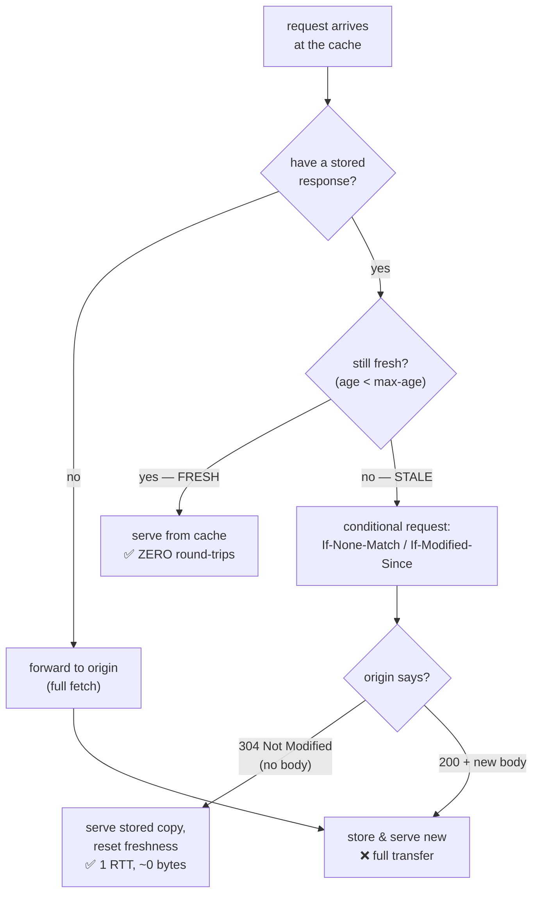
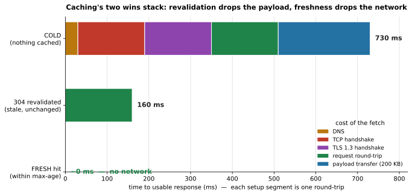
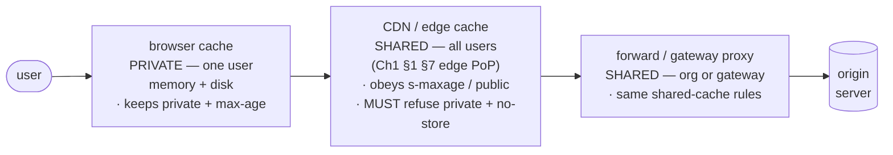
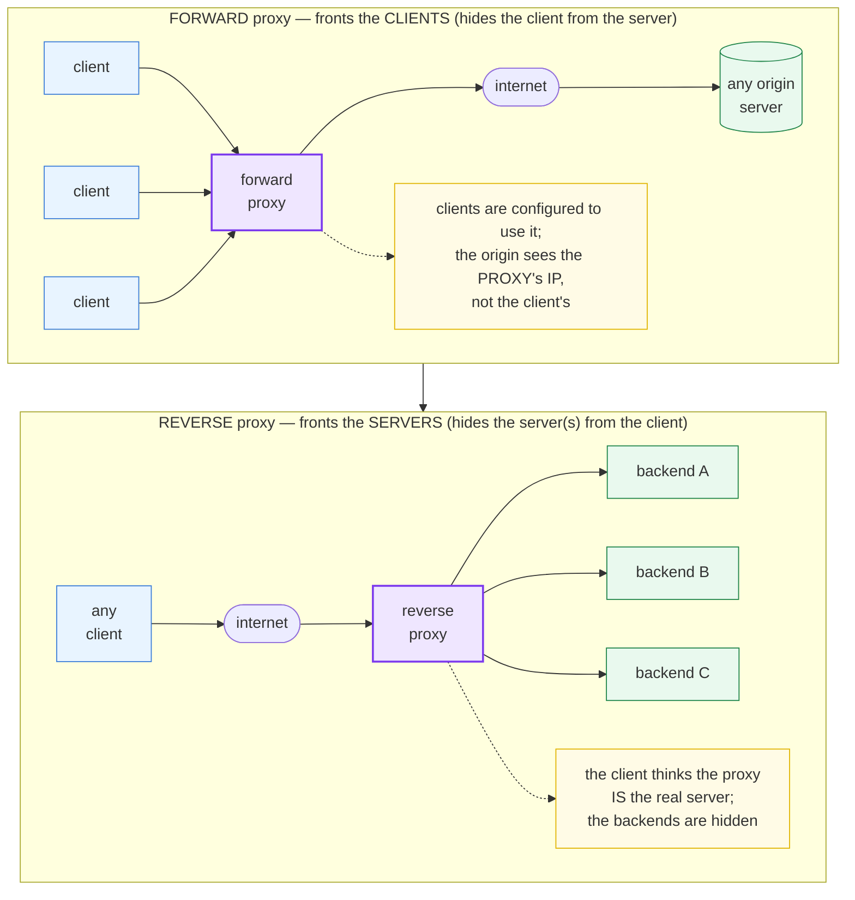

# M02 · Ch2 · §2 — Caching & conditional requests: freshness, validators, and the 304 that saves a round-trip

> **Module:** Networking & The Web
> **Chapter:** HTTP deeply
> **Section:** The mechanics behind the **"cacheable"** column from §1 — how `Cache-Control` grants a
> response a *lifetime*, how `ETag`/`Last-Modified` let a client **revalidate** a stale copy in one cheap
> round-trip (the `304 Not Modified` that ships no body), the **private → shared (CDN — Content Delivery
> Network — or proxy)** cache
> hierarchy the response travels through, and the *second* use of the same conditional machinery —
> **optimistic concurrency** (`If-Match` → `412`), which is the precise fix for §1's `409` edit-collision.
> Caching is the **biggest latency lever after Ch1's connection reuse**: the fastest request is the one you
> never send.
> **Status:** ✅ finalized 2026-08-26 (body prepared 2026-08-20). No questions on the main content — the
> body landed. The session was **one adjacent question he flagged from the diagrams**: *what is a reverse
> proxy?* (§2's "shared cache" and "forward/gateway proxy" boxes named it without defining it). Captured in
> **§11 Applied**, because it's a building block M07/M08 will *use* but not teach in depth — and it closes
> the loop on the shared-cache hierarchy he'd just read.
> **Prerequisites:** M02 Ch2 §1 (safe/idempotent/**cacheable**, status codes incl. `304`/`409`, the headers
> map). Useful: M02 Ch1 §1 (the latency budget — DNS, TCP, TLS (Transport Layer Security)
> and transfer — that a cache hit erases) and
> Ch1 §1 §7 (CDNs / edge).

**Estimated study time:** 2.5–3 hours including the `curl` hands-on.

---

## Why this section exists — and how it's pitched

Every response in §1 carried a hidden question the ecosystem was waiting to ask: *can I reuse this, and
for how long?* Caching is HTTP's answer, and it is the highest-leverage performance feature the protocol
has. Ch1 gave you the latency budget — a fresh request pays for DNS, a TCP handshake, a TLS (Transport Layer Security) handshake, and
transfer, and none of it beats the speed of light. **A cache hit erases that entire budget.** The fastest
possible request is the one that never leaves the machine; the second fastest is the one that goes out,
learns "nothing changed," and comes back with an empty body in a single round-trip.

So this section is pitched where caching becomes an **architecture and correctness decision**, not a
header you copy from Stack Overflow. Two things make it worth real attention:

1. **Caching is correctness-critical, not just performance.** A wrong `Cache-Control` doesn't make things
   slow — it serves **stale or private data to the wrong person**. A CDN (Content Delivery Network) that caches a logged-in user's
   dashboard and hands it to the next visitor is a real, shipped class of breach. Getting the *directives*
   right is a security decision.
2. **Two mechanisms, one machine.** The same conditional-request machinery (`If-None-Match` / `If-Match`
   against an `ETag`) does double duty: **cache revalidation** (save a round-trip) *and* **optimistic
   concurrency control** (prevent a lost update). Learning it once buys both — and the second is the clean
   fix for the `409 Conflict` you met in §1.

The spine: a cache answers **two** questions — *is my copy still fresh?* (answerable with **no network**)
and, if not, *has it actually changed?* (answerable with a **cheap** network round-trip). Freshness is
`Cache-Control`; the cheap check is the **conditional request** and its `304`.

---

## 1. The two questions every cache answers

<details>
<summary><b>Vocabulary for this section</b> — the freshness/validation vocabulary and the headers and codes it uses (click to expand)</summary>

**Abbreviations**

| Short | Stands for | Meaning |
|---|---|---|
| **HTTP** | HyperText Transfer Protocol | the protocol whose caching rules these are |
| **RTT** | round-trip time | the time for a request to reach the origin and its reply to return |
| **CDN** | content delivery network | a globally distributed shared cache serving content from near the user |
| **URL** | uniform resource locator | the address a cache normally keys its stored copies by |
| **ms** | milliseconds | thousandths of a second |

**Terms**

| Term | Definition |
|---|---|
| **Cache** | a store sitting between client and origin that keeps past responses and may serve them again |
| **Origin** | the authoritative server that actually produces the response — the end of the chain |
| **Freshness** | stage 1: the stored copy is still inside its allowed lifetime, so it is served with **no network at all** |
| **Validation** | stage 2: the copy is stale, so the cache asks the origin whether it is still current — **one round-trip, almost no bytes** |
| **Stale** | past its allowed lifetime; not necessarily wrong, just no longer known to be current |
| **Lifetime** | how long a response may be considered fresh, normally from `max-age` |
| **`Cache-Control`** | the header carrying the caching instructions |
| **`max-age`** | the directive giving the freshness lifetime in seconds |
| **`Expires`** | the older, absolute-date form of the same idea |
| **Conditional request** | a request that says "I already have this version — only send a body if it changed" |
| **`304 Not Modified`** | the origin's answer meaning "your copy is still good"; it carries **no body**, which is the whole point |
| **`200`** | the origin's answer meaning "here is a new body" — the full transfer |
| **`If-None-Match`** | the request header carrying the version token the client holds |
| **`If-Modified-Since`** | the timestamp form of the same question |
| **Cold** | nothing cached yet, so the full fetch is paid |
| **Revalidated** | stale but confirmed unchanged — the middle case |
| **Fresh hit** | served straight from the cache with zero round-trips |
| **Connection reuse** | keeping a connection open between requests (Ch1) — the other big latency lever, which stacks with caching |

</details>

A cache sits between a client and an origin and holds past responses. When a request comes in, it runs a
two-stage decision — and the whole chapter hangs off these two stages:

- **Stage 1 — Freshness (no network).** "Do I have a copy, and is it still within its allowed lifetime?"
  If yes, the cache serves it **immediately**, without contacting the origin at all. Zero round-trips. This
  is the big win. The lifetime comes from `Cache-Control: max-age` (or the older `Expires`).
- **Stage 2 — Validation (one cheap round-trip).** If the copy exists but is **stale** (past its
  lifetime), the cache doesn't throw it away and refetch blindly. It asks the origin a **conditional
  question**: "I have *this* version — is it still current?" If the origin says **`304 Not Modified`**, the
  cache re-uses its stored copy (and resets its freshness) — and crucially, **the `304` carries no body**,
  so you pay one round-trip's latency but transfer almost nothing. Only if the origin says `200` with a new
  body do you pay the full transfer.

The distinction is the thing to hold: **freshness avoids the network entirely; validation avoids the
*payload*.** Both are wins over a naive refetch, and they stack in that order.

<!-- DIAGRAM:START -->


<details>
<summary>Diagram source (Mermaid)</summary>



</details>
<!-- DIAGRAM:END -->

The payoff is a latency cliff. Here is the same logical fetch in its three states — cold (nothing cached),
revalidated (stale but unchanged → `304`), and fresh (served from cache) — against a realistic
intercontinental round-trip:

<!-- FIGURE:START -->


**Figure 1** — the same fetch in three cache states — cold, 304-revalidated, and a fresh hit.
<!-- FIGURE:END -->

*The middle bar is the `304` win — the round-trip you still pay, minus the payload you don't. The right bar
is the freshness win — no network at all. This is why caching is the biggest lever after Ch1's connection
reuse: the two combine, and both attack the round-trip, which is the part you cannot speed up.*

---

## 2. `Cache-Control` — the freshness contract

<details>
<summary><b>Vocabulary for this section</b> — every `Cache-Control` directive in the table, plus the four traps (click to expand)</summary>

**Abbreviations**

| Short | Stands for | Meaning |
|---|---|---|
| **CDN** | content delivery network | a globally distributed shared cache close to users |
| **HTTP** | HyperText Transfer Protocol | the protocol defining these directives |
| **N** | (a number of seconds) | the value in `max-age=N`, `s-maxage=N`, `stale-while-revalidate=N` |
| **s** | seconds | the unit of every lifetime here |

**Terms**

| Term | Definition |
|---|---|
| **`Cache-Control`** | the header that governs caching; sent on responses as instructions, sometimes on requests as an override |
| **Directive** | one comma-separated instruction inside that header |
| **`max-age=N`** | fresh for N seconds after it was fetched — the primary freshness knob |
| **`s-maxage=N`** | `max-age` for **shared** caches only, overriding `max-age` there |
| **`no-cache`** | you **may** store it, but you must revalidate before every reuse — it does **not** mean "don't cache" |
| **`no-store`** | never write it to any cache at all — this is the directive that means "don't cache" |
| **`private`** | only the end user's own browser may store it; about **ownership**, not secrecy |
| **`public`** | any cache may store it, even a response that would not normally be cacheable |
| **`must-revalidate`** | once stale, it may not be served at all without a successful revalidation |
| **`immutable`** | this body will never change for its whole lifetime — do not revalidate even on a reload |
| **`stale-while-revalidate=N`** | keep serving the stale copy for up to N seconds while refreshing in the background |
| **Shared cache** | a cache serving many users — a CDN edge or a proxy |
| **Private cache** | a cache serving exactly one user — the browser's own store |
| **Revalidate** | ask the origin whether the stored copy is still current |
| **Stale** | past its freshness lifetime |
| **`Age`** | the response header saying how many seconds a shared cache has already held this object |
| **Heuristic freshness** | a cache guessing a lifetime when no explicit directive was given, often from `Last-Modified` |
| **`Last-Modified`** | the timestamp of the resource's last change, used as a validator and as the basis of that guess |
| **Fingerprinted asset** | a file whose URL contains a hash of its contents, so it can safely be marked `immutable` |
| **Security control** | the framing this section urges for `Cache-Control` on personalised responses — a wrong directive leaks data, not just performance |

</details>

`Cache-Control` is the header that governs everything. It appears on **responses** (the server's caching
instructions) and sometimes on **requests** (the client overriding). The directives that carry their
weight:

**Table 1** — the `Cache-Control` directives, what each means, and when to reach for it.

| Directive | Meaning | When you reach for it |
|---|---|---|
| `max-age=N` | fresh for `N` seconds (relative to when it was fetched) | the primary freshness knob |
| `s-maxage=N` | `max-age` **for shared caches only** (CDN/proxy) — overrides `max-age` there | let a CDN hold it longer than the browser |
| `no-cache` | **may** store, but must **revalidate** before every reuse | dynamic content that changes unpredictably |
| `no-store` | **never** store, anywhere | secrets, banking pages, personal data |
| `private` | only the **browser** may cache it, not shared caches | per-user responses (a logged-in dashboard) |
| `public` | any cache may store it, even normally-uncacheable responses | shared static assets |
| `must-revalidate` | once stale, you **may not** serve it — revalidate or fail | correctness-critical data |
| `immutable` | won't change for its whole lifetime; don't even revalidate on reload | fingerprinted static assets |
| `stale-while-revalidate=N` | serve stale for up to `N`s **while** refreshing in the background | hide revalidation latency from the user |

Four traps worth burning in, because their names lie:

- **`no-cache` does *not* mean "don't cache."** It means "cache it, but **always revalidate** before you
  reuse it" — i.e. always run Stage 2. The directive that means *don't store at all* is **`no-store`**.
  This is the single most-confused pair in HTTP.
- **`private` is about *ownership*, not secrecy.** It says "only the end-user's own browser may keep this,"
  which is exactly what you want for a personalized page — and the directive whose *absence* causes the
  classic CDN breach: a per-user response with no `private` (or worse, a `public`) that a shared cache
  stores and serves to the next user. **When in doubt on a personalized or authenticated response, mark it
  `private, no-store`.**
- **`max-age` is measured from the response's *age*, not wall-clock.** A shared cache tracks how long it
  has held the object (the `Age` header you'll see on CDN responses); `max-age=60` means "reusable until its
  age exceeds 60 s," so an object already 45 s old in the CDN is only fresh for 15 s more.
- **No `Cache-Control`? The cache may still cache it — heuristically.** Absent explicit directives, a cache
  is *allowed* to guess a freshness lifetime (commonly from `Last-Modified` — the "it hasn't changed in a
  year, so it's probably good for a while" heuristic). "I didn't set a header" is **not** "it won't be
  cached." Be explicit; silence is a policy you didn't choose.

> Keeper: **caching bugs are usually not "too slow" — they're "wrong data to the wrong person, or stale
> data forever."** Treat `Cache-Control` on any per-user or sensitive response as a security control, and
> set it explicitly rather than inheriting a default you never read.

---

## 3. Validators & the conditional request — how `304` saves the round-trip

<details>
<summary><b>Vocabulary for this section</b> — validators, the conditional exchange, and strong vs weak (click to expand)</summary>

**Abbreviations**

| Short | Stands for | Meaning |
|---|---|---|
| **`ETag`** | entity tag | an opaque server-chosen version identifier for the current representation |
| **RTT** | round-trip time | the time for a request and its reply |
| **KB** | kilobytes | thousands of bytes |
| **ms** | milliseconds | thousandths of a second |
| **`W/`** | weak | the prefix marking an `ETag` as a weak validator |
| **`mtime`** | modification time | a file's last-modified timestamp, the usual source of `Last-Modified` |
| **HTTP** | HyperText Transfer Protocol | the protocol |
| **CSS** | Cascading Style Sheets | the stylesheet format in the worked example |

**Terms**

| Term | Definition |
|---|---|
| **Validator** | a cheap fingerprint of a version, which the client echoes back so the origin can say "changed" or "unchanged" |
| **`ETag`** | the version-token validator, e.g. `"9e1f-a83c"`; opaque — the client never interprets it |
| **Opaque** | meaningless to the client by design, so the server can change how it is computed without breaking anyone |
| **`If-None-Match`** | the request header echoing an `ETag`: "send a body only if the version differs" |
| **`Last-Modified`** | the timestamp validator — when the resource last changed |
| **`If-Modified-Since`** | the request header echoing that timestamp |
| **`304 Not Modified`** | unchanged; reuse your stored copy — and no body is sent |
| **`200`** | changed; here is the new body and a new `ETag` |
| **Representation** | the concrete bytes that stand for the resource right now |
| **Strong validator** | one that changes if even a single byte changes — an `ETag` with no `W/` prefix |
| **Weak validator** | `W/"..."` — promises only *semantic* equivalence, not byte-identity |
| **Semantically equivalent** | the user would see the same thing, though the bytes may differ (a different compression level, a changed comment) |
| **Byte-range request** | asking for part of a file; needs a **strong** validator so the pieces are known to come from one version |
| **Stale** | past its freshness lifetime, which is what triggers the conditional request |
| **`Cache-Control: max-age`** | the freshness lifetime the `304` can reset |
| **Uniform interface** | the discipline of acting on the contract rather than the content — why an opaque `ETag` works |

</details>

When a copy goes stale, the cache needs to ask "has this actually changed?" without re-downloading it. It
needs a cheap **fingerprint** of the version it holds. HTTP has two, called **validators**:

- **`ETag` (entity tag)** — an opaque server-chosen version id for the current representation, e.g.
  `ETag: "9e1f-a83c"`. The client stores it and echoes it back in **`If-None-Match`**. The origin compares:
  same tag → **`304 Not Modified`** (no body); different → `200` with the new body and a new `ETag`. ETags
  are the **strong, precise** validator — they catch a change even if it happened within the same second,
  and even a change-then-change-back-to-a-different-byte.
- **`Last-Modified`** — a timestamp; the client echoes it in **`If-Modified-Since`**. Cheaper for the
  server to produce (often just a file mtime) but **coarse**: one-second resolution, and it can't tell "the
  content is byte-identical but the file was touched." It's the fallback when an `ETag` is expensive.

The flow, concretely — a browser re-checking a stale stylesheet:

```http
GET /app.css HTTP/1.1
Host: example.com
If-None-Match: "9e1f-a83c"          ← "I have version 9e1f-a83c; only send a body if it changed"
```
```http
HTTP/1.1 304 Not Modified            ← unchanged — reuse your copy
ETag: "9e1f-a83c"
Cache-Control: max-age=3600          ← and here's a fresh lifetime
                                     ← (no body — this is the whole point)
```

That exchange is one round-trip and a few hundred bytes, versus re-downloading the whole asset. On a
250 ms intercontinental RTT (round-trip time) it turns a "download 200 KB" into "confirm and move on."

**Strong vs weak ETags.** A validator prefixed `W/` (`ETag: W/"abc"`) is **weak** — it promises the two
representations are *semantically equivalent*, not byte-identical (e.g. same content, different gzip level
or a changed timestamp comment). Weak validators are fine for caching (does the user see the same thing?)
but **must not** be used for the byte-range and concurrency uses in §5, which need exact identity. Strong
validators (no `W/`) mean byte-for-byte identical.

> Keeper: an **`ETag` is a version number the client doesn't have to understand** — opaque by design, so
> the server can compute it however it likes (a hash, a revision id, a row version) and change that scheme
> later without breaking a single client. That opacity is the same "uniform interface" discipline from §1:
> the client acts on the *contract* (echo it back), not the *content*.

---

## 4. The cache hierarchy — private vs shared, and where each lives

<details>
<summary><b>Vocabulary for this section</b> — every box in the cache chain, and the two production caching patterns (click to expand)</summary>

**Abbreviations**

| Short | Stands for | Meaning |
|---|---|---|
| **CDN** | content delivery network | a globally distributed shared cache close to users |
| **PoP** | point of presence | one physical CDN location |
| **ALB** | Application Load Balancer | AWS's layer-7 load balancer; a reverse proxy |
| **AWS** | Amazon Web Services | the cloud provider behind ALB, CloudFront and API Gateway |
| **API** | application programming interface | the machine-facing service interface |
| **SPA** | single-page application | a web app that loads once and then updates in the browser |
| **HTML** | HyperText Markup Language | the document format of `index.html` |
| **URL** | uniform resource locator | the address a cache keys on |
| **HTTP** | HyperText Transfer Protocol | the protocol |

**Terms**

| Term | Definition |
|---|---|
| **Private cache** | the browser's own store, serving exactly one user — so it may keep `private` responses |
| **Shared cache** | one cache serving many users: a CDN edge, a reverse proxy, a corporate forward proxy |
| **Forward proxy** | a proxy the *client* goes through, on the client's side of the network |
| **Reverse proxy** | a proxy that sits in front of the *origin* and answers on its behalf — ALB, CloudFront and API Gateway all are (§11) |
| **Edge** | a cache location close to users rather than close to the origin |
| **Origin** | the authoritative server the chain eventually reaches |
| **`private`** | only the end user's browser may store this |
| **`public`** | any cache may store this |
| **`no-store`** | never store it anywhere |
| **`s-maxage`** | the shared-cache-only freshness lifetime, tunable independently of `max-age` |
| **`max-age=0, s-maxage=600`** | "browsers, always revalidate; CDN, hold it ten minutes" — a common split |
| **`immutable`** | never revalidate; this URL's content will not change |
| **Fingerprinting** | putting a content hash in the filename (`app.9e1f2a.css`) so the URL *is* the version |
| **Content hash** | a short digest of the file's bytes, which changes whenever the bytes do |
| **`no-cache`** | store it, but revalidate before every reuse — what `index.html` typically gets so deploys are picked up at once |
| **`ETag`** | the validator that makes revalidation cheap |
| **Invalidation** | removing a cached copy before its lifetime expires — the hard problem fingerprinting sidesteps (§7) |
| **Cache breach** | a shared cache storing one user's response and serving it to another |

</details>

A response doesn't hit one cache; it passes through a **chain**, and the split between **private** and
**shared** caches is the one that governs both performance and safety.

<!-- DIAGRAM:START -->


<details>
<summary>Diagram source (Mermaid)</summary>



</details>
<!-- DIAGRAM:END -->

- **Private cache = the browser's own store**, serving exactly one user. It's allowed to keep `private`
  responses (that user's data) because there's no one to leak them to. It's also what a page reload,
  back-button, and `immutable` assets hit first.
- **Shared cache = a CDN edge (Ch1 §1 §7), a reverse proxy in front of your origin, or a corporate forward
  proxy** — one cache serving *many* users. *(What a **reverse proxy** actually is — and why your ALB (Application Load
  Balancer), CloudFront, and API Gateway are all reverse proxies — is §11.)* This is where the leverage is (one origin fetch serves
  thousands) **and** where the danger is: a shared cache must **never** store a `private` or `no-store`
  response, because its next hit could be a different person. `s-maxage` lets you tune shared-cache lifetime
  independently — e.g. `max-age=0, s-maxage=600` says "browsers, always revalidate; CDN, hold it 10
  minutes," a common pattern for content that's the same for everyone but changes centrally.

The hierarchy is why the two big performance patterns exist:

- **Static assets → fingerprint the URL + cache forever.** Build tools emit `app.9e1f2a.css` (a content
  hash in the filename) and serve it with `Cache-Control: public, max-age=31536000, immutable`. The URL
  *is* the version, so it never needs revalidation; a new build produces a new URL. This is how SPAs get
  near-instant repeat loads. (It also sidesteps the invalidation problem — see §7.)
- **HTML / API responses → short or zero freshness + revalidation.** The `index.html` that references those
  fingerprinted assets is itself `no-cache` (always revalidate), so a deploy is picked up immediately while
  the heavy assets stay cached. Short-max-age + `ETag` gives you "fast when unchanged, correct when it
  changes."

---

## 5. The *other* use of conditional requests — optimistic concurrency (the `409` fix)

<details>
<summary><b>Vocabulary for this section</b> — the lost-update problem and the full family of precondition headers (click to expand)</summary>

**Abbreviations**

| Short | Stands for | Meaning |
|---|---|---|
| **`ETag`** | entity tag | the opaque version token the whole mechanism turns on |
| **OCC** | optimistic concurrency control | proceeding without locks and checking the version at write time |
| **CAS** | compare-and-swap | the low-level primitive this is the HTTP spelling of: write only if the value is still what I read |
| **HTTP** | HyperText Transfer Protocol | the protocol |
| **JSON** | JavaScript Object Notation | the body format in the example |

**Terms**

| Term | Definition |
|---|---|
| **Lost update** | two clients read the same version, both write, and the second silently overwrites the first |
| **Precondition** | a condition attached to a request; if it fails, the request is not carried out |
| **`If-Match`** | "act only if the resource is still the version I read" — the write-side precondition |
| **`If-None-Match`** | "act only if the version is *not* one I already have" — the read-side one, used for revalidation |
| **`If-None-Match: *`** | "create only if nothing exists at this URL yet" — a race-free create |
| **`If-Unmodified-Since`** | the timestamp form of `If-Match` |
| **`If-Modified-Since`** | the timestamp form of `If-None-Match` |
| **`412 Precondition Failed`** | the precondition did not hold, so the write was **rejected, not applied** |
| **`409 Conflict`** | the request clashes with the resource's current state — the symptom `If-Match` prevents |
| **`200` / `204`** | success with a body / success with deliberately no body — what a successful conditional `PUT` returns |
| **Optimistic concurrency control** | assume conflicts are rare, do not lock, and catch the rare collision at write time |
| **Pessimistic locking** | the opposite: take a lock up front so no one else can write while you hold it |
| **Compare-and-swap** | update only if the current value equals the one you read — the same idea one layer down |
| **Read-heavy workload** | one with far more reads than writes, where optimistic control scales much better |
| **Merge** | reconciling your edit with the version that won, after a `412` |
| **Validator** | the version fingerprint (`ETag` or `Last-Modified`) every one of these headers is built on |

</details>

Here is the section's "two mechanisms, one machine" payoff, and the part that connects straight back to
§1. The same `ETag` machinery solves a completely different problem: the **lost update**.

**The problem.** Two clients both `GET /doc/42` (both receive `ETag: "v7"`), both edit, both `PUT` their
version back. Naively, the second write silently clobbers the first — a **lost update**. This is exactly
the `409 Conflict` scenario named in §1, and now you have the tool to prevent it.

**The fix — `If-Match` + `412`.** The client sends its write *conditionally*: "apply this **only if** the
resource is still the version I read."

```http
PUT /doc/42 HTTP/1.1
If-Match: "v7"                       ← "only if it's still v7"
Content-Type: application/json

{...edited...}
```

- If the current version is still `"v7"`, the write applies and the server returns `200`/`204` with a new
  `ETag: "v8"`.
- If someone else already wrote `"v8"`, the precondition fails and the server returns **`412 Precondition
  Failed`** — the write is *rejected*, not applied. The client re-reads, merges, and retries.

This is **optimistic concurrency control**: no locks, no held transactions — you assume conflicts are rare,
proceed freely, and let the version-check catch the rare collision at write time. It's the HTTP-native
spelling of a `compare-and-swap`, and it scales far better than pessimistic locking for the read-heavy,
occasionally-conflicting workloads the web is full of.

The full family of preconditions (all reusing validators):

**Table 2** — the conditional-request headers, what each one asks, and its primary use.

| Header | Asks | Primary use |
|---|---|---|
| `If-None-Match` | "send body only if the version is **not** one I have" | **cache revalidation** (§3); also `If-None-Match: *` = "create only if absent" |
| `If-Match` | "act only if the version **is** the one I have" | **optimistic concurrency** on writes (this section) |
| `If-Modified-Since` | timestamp form of `If-None-Match` | cache revalidation fallback |
| `If-Unmodified-Since` | timestamp form of `If-Match` | concurrency fallback |

> Keeper: **the conditional request is one primitive — "act only if the version matches" — pointed at two
> problems.** Aimed at a *read*, it saves a round-trip (`304`). Aimed at a *write*, it prevents a lost
> update (`412`). `If-None-Match: *` even gives you a race-free "create only if it doesn't exist yet." Learn
> the validator once; you've learned caching *and* concurrency.

---

## 6. `Vary` — caching when the response depends on the request

<details>
<summary><b>Vocabulary for this section</b> — cache keys, variants, and the two symmetrical `Vary` failures (click to expand)</summary>

**Abbreviations**

| Short | Stands for | Meaning |
|---|---|---|
| **URL** | uniform resource locator | the address a cache keys stored responses by, before `Vary` extends the key |
| **HTTP** | HyperText Transfer Protocol | the protocol |
| **JSON** | JavaScript Object Notation | one possible representation of the same resource |
| **HTML** | HyperText Markup Language | another one |
| **gzip** | GNU zip | a common compression format for response bodies |

**Terms**

| Term | Definition |
|---|---|
| **Cache key** | what a cache looks a stored response up by — the URL, plus any headers named in `Vary` |
| **`Vary`** | the response header listing which *request* headers the content depends on |
| **Variant** | one of several different bodies the same URL can legitimately return |
| **Content negotiation** | the client stating preferences and the server picking a variant (Ch2 §3) |
| **`Accept-Encoding`** | the request header saying which compressions the client can decode |
| **`Accept-Language`** | the request header giving the client's preferred human languages |
| **`Accept`** | the request header giving the client's preferred media types |
| **`User-Agent`** | the request header identifying the client software — nearly unique per client, so a terrible thing to vary on |
| **`Cookie`** | the request header carrying per-user state — varying on it means "cache per user", i.e. never shared |
| **High cardinality** | having very many distinct values, which is what makes a `Vary` header destroy the hit rate |
| **Hit rate** | the fraction of requests a cache can answer itself; fragmenting the key collapses it |
| **Correctness bug** | too few headers in `Vary` — the wrong variant is served |
| **Performance bug** | too many headers in `Vary` — the cache fragments and stops helping |

</details>

A subtlety that bites hard in practice: a cache keys stored responses **by URL**. But the *same URL* can
legitimately return *different* bodies depending on request headers — a gzipped body for a client that sent
`Accept-Encoding: gzip`, English vs French for different `Accept-Language`, JSON vs HTML for different
`Accept` (the content negotiation of §3). If the cache ignores that, it will hand a gzipped body to a
client that can't decompress it, or French to an English reader.

**`Vary` is the fix: it tells the cache "this response also depends on these request headers."**
`Vary: Accept-Encoding` means "store a *separate* cached entry per `Accept-Encoding` value." The cache key
becomes *URL + the named headers*.

The failure modes are symmetrical and both real:

- **Forgot `Vary`** → the cache serves the wrong variant (gzip to a non-gzip client → garbage; wrong
  language). A correctness bug.
- **`Vary: User-Agent` (or anything high-cardinality)** → nearly every request has a unique value, so the
  cache stores a separate copy per user-agent string and the **hit rate collapses to near zero**. A
  performance bug that looks like "caching isn't working." `Vary: Cookie` is the classic accidental
  cache-killer — it means "cache per distinct cookie," i.e. per user, i.e. never shared.

> Keeper: **`Vary` lists exactly the request headers your response content depends on — no more, no less.**
> Too few is a correctness bug (wrong variant served); too many is a performance bug (cache fragmented to
> uselessness).

---

## 7. Invalidation — the genuinely hard problem, and how the web ducks it

<details>
<summary><b>Vocabulary for this section</b> — invalidation strategies and the terms that describe their limits (click to expand)</summary>

**Abbreviations**

| Short | Stands for | Meaning |
|---|---|---|
| **CDN** | content delivery network | a globally distributed shared cache, and the only place an active purge is available |
| **API** | application programming interface | how a purge is normally triggered |
| **URL** | uniform resource locator | the address whose stability or instability is the whole question here |
| **HTTP** | HyperText Transfer Protocol | the protocol |

**Terms**

| Term | Definition |
|---|---|
| **Invalidation** | removing or replacing a cached copy **before** its freshness lifetime expires |
| **Versioned URL / fingerprinting** | changing the URL whenever the content changes, so there is nothing to invalidate — the dominant web strategy |
| **Immutable content** | a body that will never change under that URL, which is what makes the versioned-URL trick safe |
| **Active purge** | explicitly telling a CDN to evict an object, via `PURGE` or a provider API |
| **`PURGE`** | the non-standard method some CDNs accept to evict an object |
| **Eventually consistent** | the effect spreads over seconds to minutes rather than applying everywhere at once |
| **Edge** | one of the many CDN locations a purge has to reach |
| **Purge lag** | the delay between asking for eviction and every edge actually honouring it |
| **Stable URL** | an address that must keep working while its content changes — the case fingerprinting cannot serve |
| **`max-age`** | the freshness lifetime; kept large for immutable assets and small for mutable ones |
| **`no-cache`** | store but always revalidate — the strongest option short of not caching |
| **`ETag`** | the validator that makes short-freshness revalidation cheap |
| **Revalidation** | one cheap round-trip to confirm a copy is still current |
| **Mutability** | whether a resource's content can change under a fixed URL — the axis this section says to split your caching policy along |
| **`private` / `no-store`** | the directives for per-user and sensitive responses, which barely get cached at all |

</details>

> *"There are only two hard things in Computer Science: cache invalidation and naming things."* — Phil
> Karlton

The joke is load-bearing. Freshness lets you cache; the hard part is *un*-caching something that changed
**before** its lifetime expired — because a cache you can't reach (a browser on someone's laptop, a CDN
edge on another continent) is holding a copy you can no longer recall. HTTP gives you a few real tools and
one dominant strategy:

- **Don't invalidate — version the URL (the dominant web strategy).** This is why fingerprinting from §4
  wins: if the URL changes whenever the content does (`app.9e1f2a.css`), **there is nothing to invalidate**
  — the old URL simply stops being requested. You sidestep the hard problem entirely by making every
  version immutable and uniquely named. Most production static-asset caching is this and only this.
- **Active purge (CDN-specific).** CDNs expose an API to explicitly evict an object (`PURGE`, or a
  dashboard/API call). Necessary for content that *must* change under a stable URL (a news article at a
  permanent link), but it's **eventually consistent and per-CDN** — a purge takes seconds-to-minutes to
  reach every edge, so treat it as "hurry it up," not "guaranteed instant recall."
- **Short freshness + revalidation for the mutable stuff.** For anything that changes under a fixed URL and
  can't tolerate purge lag, keep `max-age` small (or `no-cache`) and lean on cheap `ETag` revalidation —
  you accept one round-trip per check in exchange for never serving badly-stale data.

The design rule that falls out: **split your content by mutability.** Immutable, fingerprinted assets get
`max-age` of a year; mutable resources under stable URLs get short freshness + revalidation; per-user and
sensitive responses get `private`/`no-store` and are barely cached at all. One `Cache-Control` policy for
the whole site is always wrong for part of it.

---

## 8. Failure modes — the decision checklist

<details>
<summary><b>Vocabulary for this section</b> — the terms and headers behind each failure mode listed (click to expand)</summary>

**Abbreviations**

| Short | Stands for | Meaning |
|---|---|---|
| **HTTP** | HyperText Transfer Protocol | the protocol |
| **CDN** | content delivery network | the shared cache most of these failures happen in |
| **gzip** | GNU zip | a common body compression, and the classic `Vary` casualty |

**Terms**

| Term | Definition |
|---|---|
| **Shared cache** | a cache serving many users, where a personalised response becomes a data breach |
| **`private`** | only the end user's own browser may store this response |
| **`public`** | any cache may store it — dangerous on anything per-user |
| **`no-store`** | never store it anywhere; the right directive for secrets |
| **`no-cache`** | store it but always revalidate — **not** "don't store", the most confused pair in HTTP |
| **Heuristic caching** | a cache inventing a freshness lifetime because you set no `Cache-Control` at all |
| **`Cache-Control`** | the header that should always be set explicitly rather than defaulted |
| **`Vary`** | the response header naming which request headers the body depends on |
| **`Accept-Encoding`** | the compression preference header — the one most often missing from `Vary` |
| **`Cookie` / `User-Agent`** | high-cardinality headers whose presence in `Vary` drives the hit rate to nearly zero |
| **Hit rate** | the fraction of requests the cache answers itself |
| **`If-Match`** | the precondition that makes a `PUT` fail rather than clobber a newer version |
| **`412 Precondition Failed`** | the response when it does fail — the signal to re-read, merge and retry |
| **Lost update** | one client's write silently overwritten by another's |
| **`200 OK`** | success — dangerous when a stale cached one masks a backend that is now failing |
| **Stale** | past its freshness lifetime |
| **`Set-Cookie`** | the response header that issues a credential; caching it in a shared cache replays one user's session to others |
| **Strip / deny at the shared layer** | configuring the CDN or reverse proxy to refuse to store such responses at all |

</details>

The real-world calls, most of which you'll recognize once named:

- **Per-user response cached by a shared cache** → user A sees user B's dashboard. *The* caching breach.
  Mark personalized/authenticated responses **`private`** (and sensitive ones `no-store`); never let them
  go out `public` or bare.
- **`no-cache` vs `no-store` confusion** → you wrote `no-cache` meaning "don't store" and secrets got
  stored (and revalidated). Use **`no-store`** to mean *never store*.
- **No `Cache-Control` at all** → a heuristic cache guesses a lifetime and serves your dynamic API response
  stale for hours. **Be explicit.**
- **Forgot `Vary: Accept-Encoding`** → a gzipped body served to a client that requested none → decode
  errors / garbage. Set `Vary` to exactly the negotiated headers.
- **`Vary: Cookie` / `Vary: User-Agent`** → cache fragments per user → hit rate ≈ 0; "caching does
  nothing." Vary only on what the content truly depends on.
- **Blind `PUT` with no `If-Match`** → concurrent edits silently lose the earlier one. Use `If-Match` + a
  `412` retry loop for anything two clients can edit.
- **`200 OK` served from cache during an outage** — the flip side of §1's "status must tell the truth":
  cache the *truthful* status; a stale `200` cached from before a backend failed can mask the failure.
- **Caching a `Set-Cookie`** → a shared cache stores one user's session cookie and replays it to others.
  Never cache responses that set credentials; strip/deny at the shared layer.

---

## 9. Check your understanding

1. A response is stale in the cache. Describe the two possible outcomes of the conditional request the
   cache now makes, and for each, what is transferred over the wire.
2. Your colleague sets `Cache-Control: no-cache` on the endpoint that returns a user's bank balance,
   "so it's never cached." What did they actually get, and what did they mean to write?
3. A CDN is caching your logged-in users' account pages and serving them to other visitors. Name the
   directive that was missing and the one that would have hardened it further.
4. `ETag` vs `Last-Modified`: give one thing an `ETag` catches that `Last-Modified` cannot, and one reason
   a server might still prefer `Last-Modified`.
5. Two users edit the same document and both `PUT`. Describe the exact request header and the exact status
   code that turn a silent lost-update into a safe, detectable conflict — and name the concurrency strategy.
6. An engineer sets `Vary: User-Agent` "to be safe." What breaks, and why is it a *performance* bug rather
   than a correctness one?
7. Why does content-hash fingerprinting a filename (`app.9e1f2a.css`) let you set a one-year `max-age`
   without ever needing to invalidate?

<details>
<summary>Answers</summary>

1. Either **`304 Not Modified`** — the origin confirms the stored copy is current; **only headers are
   transferred, no body** — and the cache serves its existing copy and resets freshness. Or **`200 OK` with
   a new body** — the content changed; the **full new representation plus a new `ETag`** is transferred and
   stored. The point is that the *stale* case still usually costs only one round-trip and near-zero bytes.
2. They got **"store it, but revalidate before every reuse"** — the balance *is* cached (in the browser,
   and potentially a proxy), just re-checked each time. They meant **`no-store`** (never write it to any
   cache). For a bank balance you'd typically want **`no-store, private`**.
3. Missing **`private`** (which forbids *shared* caches from storing it); harden further with **`no-store`**
   for the truly sensitive fields. The account page is per-user, so a shared/CDN cache must never hold it.
4. `ETag` catches a change that **kept the same `Last-Modified` timestamp** — e.g. two edits within the
   same one-second resolution, or a change-and-change-back to different bytes; it's an exact
   content/version fingerprint. A server might still prefer `Last-Modified` because it's **cheap to produce**
   (a file mtime, no hashing of the body) when precise validation isn't needed.
5. Header **`If-Match: "<etag the client read>"`**; status **`412 Precondition Failed`** when the current
   version no longer matches (so the second writer is rejected and told to re-read/merge/retry, rather than
   clobbering). The strategy is **optimistic concurrency control** (a compare-and-swap over HTTP).
6. The cache now stores a **separate entry per distinct `User-Agent` string** — and there are effectively
   unlimited UA (user-agent) strings — so the **hit rate collapses** and almost every request goes to origin. It's a
   *performance* bug because every client still gets a *correct* response (the content didn't actually
   depend on UA (user-agent)); it's just that caching stopped helping.
7. Because the **URL changes whenever the content changes** (the hash is derived from the bytes), an old
   URL's content is *immutable by construction* — it will never mean anything different — so a copy cached
   forever can never be wrong. A new build emits a new filename; the old one simply stops being requested.
   **Nothing needs invalidating** because nothing under a given URL ever changes.

</details>

---

## 10. Optional: get your hands dirty (25–35 min)

See caching on the wire.

1. **Read the caching headers:** `curl -i https://www.google.com` — note `Cache-Control`, and on a static
   asset (`curl -I https://www.gstatic.com/…` or any CDN-served `.css`/`.js`) look for `Cache-Control`,
   `ETag`, `Age`, and often `immutable`.
2. **See a `304` yourself:** `curl -i https://api.github.com` and copy its `ETag`, then re-request with
   `curl -i https://api.github.com -H 'If-None-Match: "<that-etag>"'` — you should get **`304 Not
   Modified`** with no body. That is the round-trip saver in one command.
3. **`Last-Modified` path:** find a response with `Last-Modified`, then re-request with
   `-H 'If-Modified-Since: <that date>'` and watch for the `304`.
4. **Watch a CDN's `Age` climb:** `curl -sI https://cdnjs.cloudflare.com/…` (any library asset) twice a few
   seconds apart and compare the `Age` header — you're watching a shared cache count how long it has held
   the object toward its `max-age`.
5. **Concurrency thought experiment (no code):** sketch the server logic for an `If-Match` write — where
   does the current `ETag` come from, what do you return on a match vs a mismatch, and how does the client's
   retry loop merge after a `412`? Then contrast with a pessimistic lock: what does each cost under high
   read / low write?

Deliverable: for one real API or site you use, record its `Cache-Control` on (a) an HTML/API response and
(b) a static asset, and explain in one line why they differ.

---

## 11. Applied — what is a reverse proxy? (the box the diagrams named but didn't define)

No questions on the caching content — it landed. The one thing he flagged was **adjacent**: §4's diagram
put a "**shared cache** = … a **reverse proxy** in front of your origin" and a "**forward/gateway proxy**"
on the page without ever saying what either *is*. It's worth pinning here, because it's a building block
that **M07 (designing for scale) and M08 (cloud networking) will *use* rather than teach** — and once named,
it retro-explains the whole §4 hierarchy and four things he runs on AWS.

### The one distinction that matters: which side it fronts

A **proxy** is an intermediary that sits in the middle of a connection and relays it. *Forward* vs *reverse*
tells you **whose side it's on** — that's the entire concept.

- **Forward proxy** — fronts the **clients**. Clients are configured to point at it; it represents *them* to
  the outside world, and the origin server sees the *proxy's* IP, not the client's. This is the corporate
  egress proxy — the "forward/gateway proxy" box in §4's diagram.
- **Reverse proxy** — fronts the **servers**. Clients are *not* configured for it and usually don't know
  it's there: they resolve your hostname, connect, and believe they've reached your application, while the
  proxy quietly forwards each request to one of the real backends behind it. It's "reverse" because it's the
  mirror image — same interception, opposite side.

<!-- DIAGRAM:START -->


<details>
<summary>Diagram source (Mermaid)</summary>



</details>
<!-- DIAGRAM:END -->

**The tell — *who is hidden?*** Forward proxy hides the client from the server. Reverse proxy hides the
server(s) from the client.

### Why you put one in front of an origin

A reverse proxy is where you **consolidate every cross-cutting job** so the backends can stay dumb and
identical. Give one box the public address and let it handle:

- **TLS termination** — decrypt HTTPS once at the edge (it holds the cert), speak plain HTTP to backends on
  the trusted internal network. Your Lambda/app never touches the handshake. *(The practical home of Ch3.)*
- **Load balancing** — spread requests across N identical backends. This is *why §1 hammered statelessness*:
  because HTTP carries all state per-request, any backend can serve any request, so the proxy is free to
  pick one. Statelessness is the property that makes the reverse proxy possible.
- **Caching** — and here's the loop back to this section: **§4's "shared cache" *is* a reverse proxy doing
  the caching job.** An nginx with `proxy_cache`, or a CDN edge, is a reverse proxy holding
  `Cache-Control`/`ETag`-governed copies so the origin never sees the repeat request.
- **Routing / virtual hosting** — read the `Host` header or path (L7, Ch1 §1) and send `/api/*`, `/static/*`,
  or different hostnames to different backends — all behind **one public IP and one certificate** (the
  direct answer to Ch1 §1 §11's IPv4 scarcity: one address fronts thousands of sites).
- **Security & resilience** — hide the origin's real IP, absorb/deflect DDoS (distributed denial-of-service)
  attacks, run a WAF (Web Application Firewall), enforce rate
  limits, offload auth-token checks at the edge, add retries and circuit-breaking.

### He already runs four of them

The payoff that makes it click — these AWS pieces are **the same idea specialized for one job each**:

**Table 3** — the reverse proxies he already runs, and the job each one specialises in.

| What he runs | The reverse-proxy job it specializes in |
|---|---|
| **AWS API Gateway** (front of Lambda) | API concerns: routing, auth, rate limiting, request validation. His `curl` hits the gateway; *it* invokes the function. |
| **Application Load Balancer (ALB)** | spreading traffic across backend targets (L7 — reads path/host) |
| **CloudFront** | **caching, geographically distributed** — a CDN *is* a reverse proxy at edge PoPs worldwide (Ch1 §1 §7 + §4's shared cache) |
| **nginx / HAProxy / Envoy / Caddy** | the general-purpose ones you run yourself; a k8s **ingress controller** is this inside a cluster |

So **"load balancer," "API gateway," and "CDN" are not alternatives to a reverse proxy — they *are* reverse
proxies**, each tuned for one of the jobs above (and real products blur the lines: CloudFront caches *and*
routes; an ALB (Application Load Balancer) balances *and* terminates TLS).

> Keeper: **a forward proxy fronts the client (represents the requester); a reverse proxy fronts the server
> (represents the origin).** Everything he deploys as a load balancer, API gateway, or CDN is a reverse
> proxy specialized for one job — a single public front door that lets the backends stay stateless,
> identical, and hidden. This is the concept M07 Ch2 (scale) and M08 Ch2 (cloud networking) will build on.

---

## Key terms (English · 大陆 简体 · 台灣 繁體)

| English | 大陆 (简体) | 台灣 (繁體) | Note |
|---|---|---|---|
| Cache | 缓存 | 快取 | ⚠ genuine split (carried from Ch1) |
| Cache hit / miss | 命中 / 未命中 | 命中 / 未命中 | same |
| Freshness | 新鲜度 / 有效期 | 新鮮度 / 有效期 | the `max-age` lifetime |
| Revalidation | 重新验证 | 重新驗證 | script only; the `304` check |
| Validator | 校验器 | 驗證器 | ⚠ 校验 ↔ 驗證; `ETag`/`Last-Modified` |
| Entity tag (ETag) | 实体标签 | 實體標籤 | opaque version id; usually left as "ETag" |
| Conditional request | 条件请求 | 條件請求 | script only |
| Stale | 陈旧 / 过期 | 陳舊 / 過期 | past its freshness lifetime |
| Shared / private cache | 共享 / 私有缓存 | 共享 / 私有快取 | the hierarchy split (§4) |
| Content delivery network (CDN) | 内容分发网络 | 內容傳遞網路 | ⚠ 分发网络 ↔ 傳遞網路 (from Ch1 §1 §7) |
| Optimistic concurrency control | 乐观并发控制 | 樂觀並行控制 | ⚠ 并发 ↔ 並行; the `If-Match`/`412` fix (§5) |
| Lost update | 丢失更新 / 更新丢失 | 遺失更新 | the write-clobber §5 prevents |
| Invalidation | 失效 / 缓存失效 | 失效 / 快取失效 | the hard problem (§7) |
| Cache busting / fingerprinting | 缓存刷新 / 指纹化 | 快取破除 / 指紋化 | the content-hash URL trick |
| Reverse proxy | 反向代理 | 反向代理 | fronts the *server(s)* (§11) |
| Forward proxy | 正向代理 | 正向代理 | fronts the *client(s)*; ⚠ 正向 (mainland) also 前向 |
| Load balancer | 负载均衡器 | 負載平衡器 | ⚠ 均衡 ↔ 平衡; a reverse proxy specialized for load (§11) |

---

## References

- MDN — *HTTP caching* (the practical, current reference; freshness, validators, the hierarchy):
  <https://developer.mozilla.org/en-US/docs/Web/HTTP/Caching>
- MDN — *`Cache-Control`* (every directive, with the `no-cache`/`no-store` distinction) —
  <https://developer.mozilla.org/en-US/docs/Web/HTTP/Headers/Cache-Control>
- MDN — *Conditional requests* (`ETag`, `If-None-Match`, `If-Match`, `304`/`412`) —
  <https://developer.mozilla.org/en-US/docs/Web/HTTP/Conditional_requests>
- RFC 9111 — *HTTP Caching* (the authoritative spec; freshness model, shared vs private, `Vary`) —
  <https://www.rfc-editor.org/rfc/rfc9111.html>
- RFC 9110 §13 — *Conditional Requests* (the precondition semantics, `412`) —
  <https://www.rfc-editor.org/rfc/rfc9110.html#name-conditional-requests>
- Google web.dev — *HTTP caching* (the fingerprint-and-cache-forever strategy, worked) —
  <https://web.dev/articles/http-cache>

### What's next

Continuing Ch2 (HTTP deeply):
- **§3 — Content negotiation & the HTTP versions:** the `Accept*` negotiation that `Vary` here keys off,
  compression, and how HTTP/1.1 → HTTP/2 (multiplexing) → HTTP/3 (QUIC — Quick UDP Internet
  Connections — from Ch1 §1 §7) change the *delivery*
  of everything in §1–§2 without changing the semantics. Closes the chapter.

Or rotate: **Ch3 (TLS)** deepens Ch1 §1 §5, **Ch4 (real-time)** is closest to your WebSocket work, or
**M04 Ch3 (design patterns)** / **M01 Ch5 (OS landscape)**.
