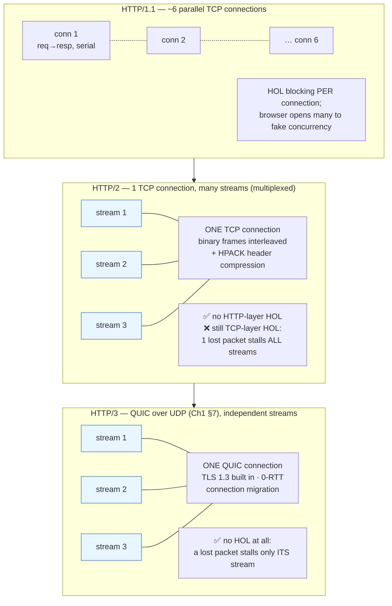

# M02 · Ch2 · §3 — Content negotiation & the HTTP versions: the same semantics, delivered better

> **Module:** Networking & The Web
> **Chapter:** HTTP deeply
> **Section:** The two remaining pieces that close the chapter. First, **content negotiation** — how a
> client says *what representation it wants* (`Accept`, `Accept-Language`, `Accept-Encoding`) and the server
> picks one, with **compression** as the highest-value case and the `Vary` header (from §2) as the piece
> that keeps caching correct. Second, **the HTTP versions** — how HTTP/1.1 → HTTP/2 → HTTP/3 change the
> *delivery* of everything in §1–§2 (the wire encoding, and how many requests share a connection) **without
> changing a single method, status code, or caching rule.** The load-bearing idea: **semantics are constant;
> only the transport evolves.**
> **Status:** ✅ finalized 2026-09-02 (body prepared 2026-08-26). No questions on the body — it landed.
> The session was **two threads he drove from §4's claim that the version is a delivery concern**:
> *"we only type `http://` in the address bar — where is the HTTP version selected?"*, and then his own
> conclusion, *"so as a web-app developer I don't need to care much about the version, right?"* — which is
> **right for application code and wrong for delivery architecture.** Both captured in **§11 Applied**,
> with the negotiation mechanisms verified live on the wire.
> **Prerequisites:** M02 Ch2 §1 (methods/status/headers — the *semantics* that stay fixed) and §2 (`Vary`,
> the cache that negotiation must not break). Leans hard on M02 Ch1: §1 (the round-trip latency budget and
> TCP head-of-line blocking), §5 (TLS — Transport Layer Security — 1.3), and §7
> (QUIC — Quick UDP Internet Connections — and HTTP-3, first met there) — this section is where
> those pay off.

**Estimated study time:** 2.5–3 hours including the `curl --http2 / --http3` hands-on.

---

## Why this section exists — and how it's pitched

You've now got HTTP's *semantics* end to end: the method/status/header vocabulary (§1) and the caching
contract (§2). Two things are left, and they share a theme — **they're about *delivery*, not meaning.**

1. **Content negotiation** answers "the same resource can have several *representations* — which one does
   this client get?" Your API can return JSON or CSV, English or French, gzip'd or raw, from **one URL** —
   the client asks with `Accept*` headers and the server chooses. This is the machinery behind the `Vary`
   header you met in §2, and its highest-value instance — **compression** — is one of the biggest
   bandwidth wins on the web.
2. **The HTTP versions** are the part most engineers half-know. The critical framing, and the reason this
   closes the chapter cleanly: **HTTP/1.1, HTTP/2, and HTTP/3 do not change HTTP's semantics at all.** Same
   `GET`, same `404`, same `Cache-Control`, same idempotency. What changes is the **wire format** (text vs
   binary) and **how many requests can share one connection** (the concurrency model). RFC 9110 (§1's
   spec) is deliberately *version-independent* for exactly this reason. So everything you already learned
   survives every version bump — you're only learning a faster pipe.

The spine: **one resource, many representations, negotiated by headers** — then **one semantics, three
transports, each fixing the last one's bottleneck.** By the end, the whole "why is HTTP/2 / HTTP/3 faster?"
question resolves into one word: **head-of-line blocking**, attacked at a lower layer each time.

---

## 1. Content negotiation — one URL, many representations

<details>
<summary><b>Vocabulary for this section</b> — the negotiation headers, the media types, and the status codes involved (click to expand)</summary>

**Abbreviations**

| Short | Stands for | Meaning |
|---|---|---|
| **REST** | Representational State Transfer | the architectural style behind "a URL names a resource, and you send a representation of it" |
| **URL** | uniform resource locator | the address that names the resource |
| **JSON** | JavaScript Object Notation | a text data format, `application/json` |
| **CSV** | comma-separated values | a tabular text format, `text/csv` |
| **HTML** | HyperText Markup Language | the document format, `text/html` |
| **WebP** | (a format name) | a modern image format, `image/webp` |
| **`br`** | Brotli | a compression algorithm |
| **gzip** | GNU zip | the universally supported compression algorithm |
| **zstd** | Zstandard | a newer, fast compression algorithm |
| **UTF-8** | 8-bit Unicode Transformation Format | the character encoding the web has standardised on |
| **`en` / `fr` / `fr-CH` / `zh-Hans`** | English / French / Swiss French / Simplified Chinese | language tags: a language, optionally a region or script |
| **HTTP** | HyperText Transfer Protocol | the protocol |

**Terms**

| Term | Definition |
|---|---|
| **Resource** | the thing a URL names, independent of any particular format |
| **Representation** | the concrete bytes sent to stand for that resource — JSON or CSV, English or French, compressed or not |
| **Content negotiation** | client and server agreeing which representation to use, without inventing separate URLs |
| **Server-driven (proactive) negotiation** | the client sends preferences, the server chooses — what the web actually runs on |
| **Agent-driven negotiation** | the server lists the options and the client picks; rare |
| **`Accept`** | the request header giving preferred media types |
| **`Accept-Language`** | the request header giving preferred human languages |
| **`Accept-Encoding`** | the request header giving acceptable compressions |
| **`Accept-Charset`** | the request header giving acceptable character sets; largely obsolete |
| **`Content-Type`** | the response header stating the media type actually sent |
| **`Content-Language`** | the response header stating the language actually sent |
| **`Content-Encoding`** | the response header stating the compression actually applied |
| **Media type** | the format label, e.g. `application/json` — also called a MIME type |
| **`Vary`** | the response header naming which request headers the chosen representation depended on, so caches key correctly |
| **Cache key** | what a cache looks a stored response up by: the URL plus everything in `Vary` |
| **`;q=`** | the quality-value suffix expressing relative preference (§2) |
| **`406 Not Acceptable`** | the honest status when the server can satisfy none of the client's acceptable options |
| **`300 Multiple Choices`** | the status used by the rare agent-driven style to hand the client a list |
| **`200 OK`** | success, with the negotiated representation in the body |

</details>

A core REST idea (§1's §10a) is that a URL names a **resource**, and what travels on the wire is a
**representation** of it. The same `/report/42` can legitimately be delivered as JSON or CSV, in English or
French, gzip'd or raw. **Content negotiation** is how client and server agree on which representation,
*without* inventing separate URLs like `/report/42.json?lang=fr`.

The mechanism is **server-driven (proactive) negotiation**: the client sends its preferences as `Accept*`
request headers, the server picks the best representation it can produce, sends it, and — critically —
echoes **which dimension it varied on** in the `Vary` response header (§2), so caches key correctly.

| Request header | Client is asking for… | Server answers with |
|---|---|---|
| `Accept` | a **media type** — `application/json`, `text/html`, `text/csv`, `image/webp` | `Content-Type` |
| `Accept-Language` | a **natural language** — `en`, `fr-CH`, `zh-Hans` | `Content-Language` |
| `Accept-Encoding` | a **compression** — `gzip`, `br`, `zstd` | `Content-Encoding` |
| `Accept-Charset` | a character set (largely obsolete — everything is UTF-8 now) | (part of `Content-Type`) |

```http
GET /report/42 HTTP/1.1
Accept: application/json, text/csv;q=0.8, */*;q=0.1
Accept-Language: fr-CH, fr;q=0.9, en;q=0.5
Accept-Encoding: br, gzip;q=0.9
```
```http
HTTP/1.1 200 OK
Content-Type: application/json
Content-Language: fr
Content-Encoding: br
Vary: Accept, Accept-Language, Accept-Encoding    ← the cache key now includes these
```

If the server can satisfy *none* of the acceptable options, the honest status is **`406 Not Acceptable`**
(in practice many servers just return their default instead — a pragmatic violation). There's also a rarer
**agent-driven** style (the server returns `300 Multiple Choices` and lets the client pick), but proactive
negotiation is what the web runs on.

---

## 2. Quality values — the preference algorithm

<details>
<summary><b>Vocabulary for this section</b> — the q-value notation, the wildcards, and the `identity` special case (click to expand)</summary>

**Abbreviations**

| Short | Stands for | Meaning |
|---|---|---|
| **`q`** | quality | the weight in `;q=0.8`, expressing relative preference |
| **JSON** | JavaScript Object Notation | one candidate media type |
| **CSV** | comma-separated values | another candidate media type |
| **HTTP** | HyperText Transfer Protocol | the protocol |

**Terms**

| Term | Definition |
|---|---|
| **`q=1`** | the default and highest preference — "this is what I want" |
| **`q=0.8`** | a lesser but still acceptable option — "80% as welcome" |
| **`q=0`** | an explicit rejection — "do not send me this" |
| **`*/*`** | the media-type wildcard: any type at all |
| **`*`** | the same wildcard for a language or an encoding |
| **Quality value** | a number from 0 to 1 attached to an option, giving its relative preference; the default is 1 |
| **Dimension / axis** | one negotiable property — media type, language, or encoding — each negotiated independently |
| **Most specific acceptable match** | the server's selection rule: prefer the narrowest matching option with the highest q-value, among those it can actually produce |
| **Wildcard** | `*/*` or `*`, meaning "anything is acceptable" — which is what most browsers send |
| **`identity`** | the "no compression at all" encoding; implicitly acceptable unless explicitly refused with `identity;q=0` |
| **`Accept`** | the media-type preference header |
| **`Accept-Language`** | the language preference header |
| **`Accept-Encoding`** | the compression preference header |
| **`Vary`** | the response header you owe for every axis you actually negotiated on |
| **Shared cache** | a cache serving many users, which will serve the wrong variant if `Vary` is missing |
| **Preference, not contract** | negotiation expresses what the client would like; it does not bind the server to any particular answer |

</details>

The `;q=` weights above are **quality values**: a number from `0` to `1` (default `1`) expressing relative
preference. `Accept: application/json, text/csv;q=0.8` means "JSON ideally; CSV is 80% as welcome; nothing
else." A `q=0` explicitly *rejects* an option.

The server's job is to compute, over each dimension, the **most specific acceptable match with the highest
q-value**, subject to what it can actually produce. Two subtleties that bite:

- **`*/*` (or `*` for language/encoding) is the wildcard**, and browsers send it — `Accept: */*` means
  "anything." That's why a server that *only* consults `Accept` for strict content-typing will still get a
  catch-all from most clients; negotiation is a *preference*, not a contract.
- **`Accept-Encoding` has an implicit `identity`** (no compression) that's always acceptable unless you
  send `identity;q=0` — which is how a client says "you *must* compress or fail."

The reason q-values matter to you: they're the input to the `Vary` correctness problem from §2. The moment
your response depends on `Accept-Language`, you **must** emit `Vary: Accept-Language`, or a shared cache
serves French to an English reader. Negotiation and caching are the same problem viewed from two ends.

---

## 3. Compression — the negotiation that pays for itself

<details>
<summary><b>Vocabulary for this section</b> — the codecs, and the end-to-end vs hop-by-hop distinction (click to expand)</summary>

**Abbreviations**

| Short | Stands for | Meaning |
|---|---|---|
| **`br`** | Brotli | the best-ratio text compressor, near-universal over HTTPS |
| **gzip** | GNU zip | the universal fallback compressor |
| **zstd** | Zstandard | a newer, fast compressor gaining ground |
| **HTML / CSS / JSON** | HyperText Markup Language / Cascading Style Sheets / JavaScript Object Notation | the text formats that compress dramatically |
| **JPEG / PNG / WebP / MP4** | image and video formats | already-compressed media that should be passed through untouched |
| **HTTPS** | HTTP Secure | HTTP carried inside TLS |
| **CPU** | central processing unit | the compute that compression burns |
| **`ETag`** | entity tag | the version token that fingerprints the representation — including its `Content-Encoding` |
| **HTTP** | HyperText Transfer Protocol | the protocol |

**Terms**

| Term | Definition |
|---|---|
| **Codec** | a specific compression algorithm the two sides can agree on |
| **`Accept-Encoding`** | the request header listing which codecs the client can decode |
| **`Content-Encoding`** | the response header naming the codec actually used — an **end-to-end** property of the representation |
| **`Transfer-Encoding: chunked`** | a **hop-by-hop** framing of the message, used to stream a body whose length is not known in advance |
| **End-to-end** | a property of the representation itself, meaningful from origin to client and covered by the `ETag` |
| **Hop-by-hop** | a property of one connection only, which each intermediary may undo and redo |
| **Entropy-coded** | already compressed to near its information-theoretic limit — which is why re-compressing it gains nothing |
| **`Vary: Accept-Encoding`** | the obligation that comes with compressing: without it a cache serves a Brotli body to a gzip-only client |
| **Variant** | one of the several bodies the same URL may return |
| **Shared cache** | a cache serving many users, where the wrong variant reaches the wrong person |
| **Transfer time** | the part of latency spent moving bytes, which is what compression attacks |

</details>

`Accept-Encoding` / `Content-Encoding` is content negotiation's highest-leverage case, so it's worth its
own treatment. Text compresses dramatically — HTML, CSS, JavaScript and JSON routinely shrink **70–90%** — and that
shrinkage comes straight off transfer time, the blue bar in §2's latency figure.

- **The codecs, in order of modern preference:** **Brotli (`br`)** — best ratio for text, now near-universal
  over HTTPS; **gzip** — the universal fallback, supported everywhere; **zstd** — newer, fast, gaining
  ground. A server picks the best one the client's `Accept-Encoding` allows.
- **Don't compress the already-compressed.** JPEG/PNG/WebP, MP4, and `.zip`/`.gz` payloads are already
  entropy-coded; running gzip over them burns CPU for \~0% gain (occasionally *negative*). Compress text;
  pass binary media through.
- **The `Vary: Accept-Encoding` obligation (from §2).** A cache that stores a `br` body and serves it to a
  client that only sent `Accept-Encoding: gzip` hands over undecodable bytes. Compression **requires** the
  `Vary` — this is the single most common real caching-plus-negotiation bug.
- **`Content-Encoding` vs `Transfer-Encoding`.** `Content-Encoding: br` is an **end-to-end** property of
  the *representation* (it's what the resource *is*, and it's what an `ETag` fingerprints). `Transfer-Encoding:
  chunked` is a **hop-by-hop** framing of the *message* for streaming a body of unknown length — a different
  layer. Conflating them is a classic interview stumble; the tell is *end-to-end (content) vs hop-by-hop
  (transfer)*.

> Keeper: **compression is just content negotiation on the `Accept-Encoding` axis** — and the instant you
> negotiate *any* axis, you owe the matching `Vary`, or the shared cache from §2 serves the wrong variant.

---

## 4. The versions change the *delivery*, never the *meaning*

<details>
<summary><b>Vocabulary for this section</b> — semantics vs wire format, and the head-of-line idea the versions chase (click to expand)</summary>

**Abbreviations**

| Short | Stands for | Meaning |
|---|---|---|
| **HTTP/1.1, HTTP/2, HTTP/3** | HyperText Transfer Protocol versions | the three wire formats in use |
| **RFC** | Request for Comments | an IETF standards document; RFC 9110 specifies HTTP's version-independent semantics |
| **IETF** | Internet Engineering Task Force | the body that publishes those documents |
| **HOL** | head-of-line | the blocking pattern where one stalled item holds up everything queued behind it |
| **ASCII** | American Standard Code for Information Interchange | the plain-text encoding HTTP/1.1 messages are written in |
| **URL** | uniform resource locator | the address — which, notably, never carries the version |

**Terms**

| Term | Definition |
|---|---|
| **HTTP semantics** | methods, status codes, headers, idempotency and caching — the *meaning*, identical across all versions |
| **Wire format** | how a message is serialised: readable text lines, or binary frames |
| **Frame** | one binary unit of a HTTP/2 or HTTP/3 message |
| **Concurrency model** | how many requests may be in flight on one connection, and how independent they are |
| **In-flight** | sent but not yet answered |
| **Head-of-line blocking** | one slow or lost item at the front of a queue stalling everything behind it, even work that is ready |
| **Layer** | the level at which the blocking happens — HTTP in 1.1, TCP in 2, nowhere in 3 |
| **`Cache-Control: max-age=60`** | an example of a semantic that behaves identically over all three versions |

</details>

Here's the framing that makes the rest of the section easy, and that closes the chapter. Everything in
§1–§2 — methods, status codes, headers, idempotency, caching — is **HTTP semantics**, specified in RFC 9110
**independently of any version**. The version (HTTP/1.1, /2, /3) governs only two things:

1. **The wire format** — is a request serialized as ASCII text, or as binary frames?
2. **The concurrency model** — how many in-flight requests can share one connection, and how independent
   they are.

That's it. A `GET /x` that returns `200` with `Cache-Control: max-age=60` behaves *identically* over all
three; the bytes on the wire and the number of round-trips differ, the meaning does not. So the entire
"which HTTP version and why" story reduces to a single evolving problem — **head-of-line (HOL) blocking**:
*a queue where one slow item stalls everything behind it.* Each version pushes that blocking down a layer
until it's gone.

*If the version isn't in the URL and you never write version-specific code, then **who chooses it, and when** —
and does it ever reach your desk as an application developer? Both are worked in §11a–§11b.*

---

## 5. HTTP/1.0 → 1.1: persistent connections, and the wall

<details>
<summary><b>Vocabulary for this section</b> — persistent connections, pipelining, and the browser workarounds (click to expand)</summary>

**Abbreviations**

| Short | Stands for | Meaning |
|---|---|---|
| **HTTP/1.0, HTTP/1.1** | HyperText Transfer Protocol versions | the pre-persistent and persistent text-based versions |
| **HTTP/2** | HyperText Transfer Protocol version 2 | the multiplexed version built to remove this section's workaround |
| **TCP** | Transmission Control Protocol | the reliable transport each connection is |
| **TLS** | Transport Layer Security | the encryption handshake paid on top of it |
| **HOL** | head-of-line | one slow item stalling everything queued behind it |
| **IPv4** | Internet Protocol version 4 | the address format whose scarcity made name-based virtual hosting necessary |

**Terms**

| Term | Definition |
|---|---|
| **Persistent connection** | one kept open across several requests, so the handshake is paid once — the HTTP/1.1 default |
| **`Connection: keep-alive`** | the header that requests or confirms that behaviour |
| **Handshake** | the TCP (and TLS) setup exchange paid before any data flows |
| **Amortize** | spread a one-off cost across many later requests |
| **Warm connection** | one already open and already ramped up, hence faster than a fresh one |
| **Serial** | strictly one at a time: request, wait for the full response, then the next |
| **Pipelining** | sending the next request before the previous response arrives; specified in 1.1 but effectively dead |
| **In-order responses** | the rule that killed pipelining: replies must come back in request order, so one slow reply blocks ready ones |
| **Head-of-line blocking at the HTTP layer** | exactly that stall — the problem HTTP/2 removes |
| **Parallel connections** | a browser opening about six TCP connections per origin to fake concurrency |
| **Origin** | scheme, host and port taken together — the unit that per-origin connection limits apply to |
| **Domain sharding** | spreading assets across extra hostnames to get past that per-origin limit; an anti-pattern under HTTP/2 |
| **Congestion-control state** | the per-connection ramp-up each extra connection has to build from scratch |
| **`Host`** | the header HTTP/1.1 added, letting many sites share one IP address |
| **Name-based virtual hosting** | serving many sites from one IP, distinguished by `Host` |
| **Chunked transfer** | sending a body in pieces when its total length is not known up front |
| **Multiplex** | carry several requests concurrently on one connection — what 1.1 cannot do |

</details>

- **HTTP/1.0** opened a **fresh TCP (and later TLS) connection per request** — pay the whole Ch1 §1
  handshake budget for *every* file on a page. Catastrophic once pages had dozens of assets.
- **HTTP/1.1** made connections **persistent by default** (`Connection: keep-alive`): reuse one warm
  connection for many sequential requests, amortizing the handshake — the "connection reuse" win Ch1 §1
  called the biggest lever. It also added `Host` (name-based virtual hosting — Ch1 §11's IPv4 answer),
  chunked transfer, and the caching machinery of §2.
- **But requests on a 1.1 connection are still strictly serial** — request, wait for full response, next.
  **Pipelining** (send the next request before the first response arrives) was specified but is effectively
  dead: it forced responses back **in order**, so one slow response blocked all the ready ones behind it —
  **HOL (head-of-line) blocking at the HTTP layer.** Browsers worked around it by opening **\~6 parallel TCP connections per
  origin** (and "domain sharding" across extra hostnames for more) — brute force that multiplies handshakes
  and congestion-control state.

That workaround — many connections because one can't multiplex — is exactly the problem HTTP/2 was built to
remove.

<!-- DIAGRAM:START -->


<details>
<summary>Diagram source (Mermaid)</summary>



</details>
<!-- DIAGRAM:END -->

---

## 6. HTTP/2: one connection, many streams

<details>
<summary><b>Vocabulary for this section</b> — framing, streams, HPACK, server push, and the flaw left behind (click to expand)</summary>

**Abbreviations**

| Short | Stands for | Meaning |
|---|---|---|
| **HTTP/2** | HyperText Transfer Protocol version 2 | the 2015 binary, multiplexed version |
| **SPDY** | (a name, pronounced "speedy") | Google's experimental protocol that HTTP/2 grew out of |
| **HPACK** | header compression for HTTP/2 | the scheme that sends repeated headers once and refers back to them |
| **HOL** | head-of-line | one stalled item holding up everything behind it |
| **TCP** | Transmission Control Protocol | the single connection all HTTP/2 streams still share |
| **ASCII** | American Standard Code for Information Interchange | the text encoding HTTP/2 replaces with binary |
| **API** | application programming interface | header-heavy traffic, where HPACK pays off most |
| **HTTP/3** | HyperText Transfer Protocol version 3 | the version that fixes the flaw left here |

**Terms**

| Term | Definition |
|---|---|
| **Binary framing** | messages carried as binary frames rather than text lines — cheaper and unambiguous to parse |
| **Frame** | one binary unit; frames from different streams interleave on the wire |
| **Stream** | one request-and-response pair, as an independent sequence inside the connection |
| **Multiplexing** | interleaving many streams over a single connection so they progress concurrently |
| **Header compression** | sending repeated header values once and referencing them thereafter |
| **`User-Agent` / `Cookie` / `Accept*`** | the repetitive headers HPACK is aimed at |
| **Server push** | the server sending resources the client never asked for; shipped, then removed in practice |
| **`103 Early Hints`** | the status that replaced push's useful part — telling the client what to fetch, rather than sending it |
| **Domain sharding** | the HTTP/1.1 workaround that becomes an anti-pattern here, since it fragments the one connection |
| **In-order byte delivery** | TCP's guarantee — and the reason a single lost packet stalls every stream above it |
| **TCP head-of-line blocking** | the remaining flaw: one lost packet blocks all multiplexed streams, even those whose data arrived |
| **Retransmission** | resending the lost packet, which is what everything is waiting on |
| **Lossy network** | one where packets are dropped often — mobile links especially, where this flaw can make HTTP/2 worse than HTTP/1.1 |

</details>

HTTP/2 (2015, born from Google's experimental SPDY protocol) keeps every HTTP semantic and rewrites the transport:

- **Binary framing.** Messages become binary **frames** instead of ASCII text — cheaper and unambiguous to
  parse (no more header-line edge cases).
- **Multiplexing over one connection.** Many concurrent **streams** interleave their frames on a **single
  TCP connection**. Request 3's response can arrive while requests 1 and 2 are still in flight — **the
  HTTP-layer HOL blocking of 1.1 is gone**, and with it the need for 6 connections and domain sharding
  (which becomes an *anti-pattern* under HTTP/2 — it defeats the single-connection design).
- **Header compression (HPACK).** Repeated headers (cookies, `User-Agent`, `Accept*`) are sent once and
  referenced, not re-sent verbatim on every request — a real saving on header-heavy API traffic.
- **Server push** (server sends resources unrequested) shipped but is **deprecated/removed in practice** —
  it guessed wrong too often and fought the cache; `103 Early Hints` replaced its useful part.

**The remaining flaw — TCP head-of-line blocking.** All those streams still ride **one TCP connection**, and
TCP guarantees *in-order* byte delivery. So if a single packet is lost, TCP stalls **every** stream until
it's retransmitted — even streams whose data already arrived. On a clean network HTTP/2 is a clear win; on a
lossy/mobile one it can be *worse* than HTTP/1.1's independent connections. The blocking moved from the HTTP
layer down to the **TCP** layer — which is where HTTP/3 goes to kill it.

---

## 7. HTTP/3 + QUIC: no head-of-line blocking left

<details>
<summary><b>Vocabulary for this section</b> — QUIC's properties, and the fallback negotiation (click to expand)</summary>

**Abbreviations**

| Short | Stands for | Meaning |
|---|---|---|
| **HTTP/3** | HyperText Transfer Protocol version 3 | the 2022 version that runs over QUIC |
| **QUIC** | (a name, not an acronym) | the transport built on UDP that carries its own reliability, ordering and encryption |
| **UDP** | User Datagram Protocol | the bare datagram transport QUIC is built on |
| **TCP** | Transmission Control Protocol | the transport HTTP/2 uses, and the source of its remaining blocking |
| **TLS** | Transport Layer Security | the encryption protocol; TLS 1.3 is folded into QUIC's own handshake |
| **RTT** | round-trip time | the time for a message and its reply |
| **0-RTT** | zero round-trip time | resumption that needs no extra handshake round-trip |
| **HOL** | head-of-line | one stalled item holding up everything behind it |
| **ALPN** | Application-Layer Protocol Negotiation | the TLS extension in which client and server agree which HTTP version to speak |
| **`Alt-Svc`** | alternative service | the response header by which a server advertises that it is also reachable over HTTP/3 |
| **CPU** | central processing unit | the compute cost of QUIC's per-packet encryption |

**Terms**

| Term | Definition |
|---|---|
| **Stream** | one independent request-and-response sequence — in QUIC, understood by the *transport* itself |
| **Independent streams** | a lost packet stalls only its own stream; the others keep flowing |
| **Head-of-line blocking** | the stall this version finally removes at every layer |
| **Transport handshake** | the setup exchange QUIC merges with the TLS handshake, giving roughly one round-trip to a secure connection |
| **Resumption** | reusing key material from a recent session so a repeat visit costs no handshake round-trip |
| **Connection migration** | the connection surviving a change of network, because it is identified by an ID |
| **Connection ID** | QUIC's identifier for a connection, used instead of addresses |
| **4-tuple** | source IP, source port, destination IP, destination port — how TCP identifies a connection, which is why changing network breaks it |
| **Fallback** | using HTTP/2 over TCP when QUIC is blocked or unavailable |
| **Firewall blocking** | some corporate networks drop or throttle UDP, which is why the fallback is needed |
| **Lossy / mobile link** | a network with frequent packet loss and network changes — where HTTP/3 helps most |
| **Semantics** | the meaning of methods, codes and headers — unchanged throughout all three versions |

</details>

HTTP/3 (2022) keeps HTTP/2's semantics and multiplexing but **replaces the transport underneath**: instead
of TCP+TLS (Transport Layer Security) it runs on **QUIC** (your Ch1 §7 acquaintance), a transport built on **UDP**.

- **Streams are independent at the transport layer.** QUIC understands streams *itself*, so a lost packet
  stalls **only the stream it belonged to** — the others keep flowing. **TCP head-of-line blocking is gone.**
  This is the whole point of HTTP/3, and why it shines on lossy/mobile links.
- **TLS 1.3 is built in.** QUIC integrates the Ch1 §5 handshake into the transport handshake, so connection
  setup is **\~1 RTT** (and **0-RTT** resumption for repeat visits) — fewer round-trips than TCP-then-TLS.
- **Connection migration.** A QUIC connection is identified by a connection ID, not the 4-tuple of IPs and
  ports, so it **survives a network change** — walk from Wi-Fi to cellular and the connection (and your
  downloads) continue without a new handshake. Impossible with TCP.
- **Cost:** it's UDP, so some corporate firewalls block or throttle it, and per-packet crypto/CPU is
  higher; clients therefore keep HTTP/2-over-TCP as a fallback (negotiated via `Alt-Svc` / TLS ALPN — Application-Layer
  Protocol Negotiation, worked in §11a).

The three-line summary you can keep: **HTTP/1.1** = one request at a time per connection (HTTP-layer HOL) →
**HTTP/2** = many streams on one TCP connection (fixes HTTP-layer HOL, leaves TCP HOL) → **HTTP/3** = many
streams on QUIC/UDP (fixes TCP HOL too, plus 1-RTT/0-RTT setup and connection migration). **Same semantics
throughout.**

---

## 8. What to actually do — the decision checklist

<details>
<summary><b>Vocabulary for this section</b> — the terms behind each recommendation (click to expand)</summary>

**Abbreviations**

| Short | Stands for | Meaning |
|---|---|---|
| **`br`** | Brotli | the preferred text compressor |
| **gzip** | GNU zip | the universal fallback compressor |
| **HTTP/2 / HTTP/3** | HyperText Transfer Protocol versions 2 and 3 | the multiplexed versions to enable |
| **ALB** | Application Load Balancer | AWS's layer-7 load balancer |
| **CloudFront** | (a product name) | AWS's CDN |
| **CDN** | content delivery network | a distributed cache and edge terminator |
| **nginx** | (a product name) | a widely used web server and reverse proxy |
| **TCP** | Transmission Control Protocol | the transport HTTP/2 rides |
| **HOL** | head-of-line | one stalled item holding up everything behind it |

**Terms**

| Term | Definition |
|---|---|
| **`Vary`** | the response header naming every request header the chosen representation depended on |
| **Negotiated axis** | one dimension you actually varied on — media type, language or encoding — each of which owes a `Vary` entry |
| **Shared cache** | a cache serving many users, which serves the wrong variant if `Vary` is incomplete |
| **`406 Not Acceptable`** | the honest status when nothing the client accepts can be produced |
| **`422 Unprocessable Content`** | well-formed but semantically invalid — a validation failure |
| **Silent default** | quietly returning your own format instead of saying you could not satisfy `Accept` |
| **Domain sharding** | spreading assets over extra hostnames; an HTTP/1.1 workaround that *hurts* under HTTP/2 and HTTP/3 |
| **Inlining** | embedding assets inside the HTML to avoid extra requests; the same kind of obsolete workaround |
| **Edge** | the CDN or load balancer that terminates the connection and negotiates the HTTP version on your behalf |
| **Tail latency** | the slowest few percent of requests — what HTTP/3 improves, rather than the average |
| **Connection migration** | a connection surviving a network change, a resilience win on mobile |
| **`Content-Encoding`** | end-to-end: what the representation *is*, and part of what an `ETag` fingerprints |
| **`Transfer-Encoding`** | hop-by-hop: how the message is framed on one connection |

</details>

- **Turn on compression, correctly.** Serve `br` (fall back to `gzip`) for text; **don't** compress
  already-compressed media; **always** send `Vary: Accept-Encoding`. This is the cheapest big latency win
  after caching.
- **Emit `Vary` for every axis you negotiate.** Language, encoding, media type — each negotiated dimension
  is a required `Vary` entry, or the shared cache serves the wrong variant (§2).
- **Prefer `422`/proper status over silent defaults**, and return **`406`** honestly when you genuinely
  can't satisfy `Accept` (or document that you default — just do it deliberately).
- **Enable HTTP/2 (and HTTP/3 where your edge supports it) — and then STOP domain-sharding.** Sharding and
  inlining were HTTP/1.1 workarounds; under HTTP/2/3 they *hurt* by fragmenting the single multiplexed
  connection. Let the edge (CloudFront, an ALB — Application Load
  Balancer — or nginx) negotiate the version; your app semantics don't change.
- **Expect HTTP/3 to help most on mobile/lossy networks**, least on clean low-loss links. It's a
  tail-latency and resilience win (no TCP HOL, connection migration), not a magic universal speedup.
- **Don't confuse `Content-Encoding` (end-to-end, part of the representation/`ETag`) with `Transfer-Encoding`
  (hop-by-hop framing).**

---

## 9. Check your understanding

1. A client sends `Accept: application/json, text/csv;q=0.8` and the server can only produce CSV and XML (Extensible Markup Language).
   What does it send, what's the "honest" status if it refuses, and what header must appear so a cache
   doesn't mis-serve?
2. Your API gzip-compresses responses but you forgot one header, and users behind a shared proxy
   intermittently get garbled bytes. Which header, and why does the bug depend on the *proxy*?
3. State the one-sentence difference between HTTP semantics and an HTTP version, and give one example of
   each that stays constant vs changes going 1.1 → 2 → 3.
4. HTTP/2 multiplexes many streams over one connection, yet a user on a lossy mobile link sees it perform
   *worse* than HTTP/1.1's six connections. What is the mechanism, and which version fixes it and how?
5. Why is "domain sharding" a best practice under HTTP/1.1 but an anti-pattern under HTTP/2?
6. Name two things HTTP/3 gets from running on QUIC that are impossible over TCP.

<details>
<summary>Answers</summary>

1. It sends **CSV** (the acceptable option with the highest q-value among what it can produce; XML wasn't
   listed so it's not acceptable). If it refuses, the honest status is **`406 Not Acceptable`**. It must
   send **`Vary: Accept`** (the dimension it negotiated) so a shared cache keys on it and doesn't hand CSV
   to a JSON-wanting client.
2. **`Vary: Accept-Encoding`.** Without it, a **shared** cache stores the gzip'd body under the bare URL and
   later serves those compressed bytes to a client that sent no (or a different) `Accept-Encoding` and so
   won't decode them. It depends on the proxy because a shared cache is the thing reusing one stored variant
   across clients with different `Accept-Encoding` — a private browser cache reuses only for the same client.
3. **Semantics = what a message *means* (methods, status codes, headers, caching), fixed across versions;
   a version = how the message is *delivered* (wire format + connection concurrency).** Constant example:
   `GET`/`404`/`Cache-Control` behave identically in all three. Changing example: the wire format (ASCII
   text in 1.1 → binary frames in 2/3) and multiplexing (serial → one-TCP many-streams → QUIC independent
   streams).
4. **TCP head-of-line blocking:** all HTTP/2 streams share one TCP connection, and TCP delivers bytes
   strictly in order, so a single lost packet stalls *every* stream until retransmission — whereas
   HTTP/1.1's six independent connections only stall the one that lost a packet. **HTTP/3 fixes it** by
   running on **QUIC (over UDP)**, which tracks streams itself so a lost packet stalls only *its* stream.
5. Under HTTP/1.1 each origin is limited to \~6 serial connections, so spreading assets across extra
   hostnames buys *more parallel connections* — a real win. Under HTTP/2 a single connection multiplexes
   unlimited streams, so sharding just **fragments that one optimized connection** into several (extra
   handshakes, separate congestion control, no shared HPACK) — it hurts.
6. Any two of: **(a)** killing **TCP head-of-line blocking** (independent streams — a lost packet stalls only
   its stream); **(b)** **connection migration** (the connection is a connection-ID, not an IP/port 4-tuple,
   so it survives Wi-Fi→cellular); **(c)** **1-RTT / 0-RTT** setup with **TLS 1.3 built into** the transport
   handshake (vs TCP-then-TLS round-trips).

</details>

---

## 10. Optional: get your hands dirty (20–30 min)

See negotiation and versions on the wire.

1. **Compression + `Vary`:** `curl -s -H 'Accept-Encoding: br,gzip' -D - https://www.cloudflare.com -o /dev/null`
   — read `Content-Encoding` and `Vary` in the response headers. Then drop the header and watch
   `Content-Encoding` disappear.
2. **Language negotiation:** find a site that localizes, and compare
   `curl -s -H 'Accept-Language: fr' -D - <url> -o /dev/null` vs `-H 'Accept-Language: en'` — look for
   `Content-Language` and `Vary: Accept-Language`.
3. **Versions:** `curl -sI --http2 https://www.google.com` (note the `HTTP/2` status line), then
   `curl -sI --http3 https://www.google.com` if your `curl` has HTTP/3 (`curl --version` lists `HTTP3`).
   Compare with `--http1.1`.
4. **q-values:** `curl -s -H 'Accept: text/csv;q=0.9, application/json' -D - <a content-negotiating API>`
   and see which representation wins.
5. **Thought experiment (no code):** you enable HTTP/2 on your CDN (Content Delivery Network) and also keep your old HTTP/1.1
   domain-sharding (assets split across `static1/2/3.example.com`). Sketch why page load might *not* improve
   — and could regress — and what you'd change.

Deliverable: for one site you use, record its negotiated `Content-Encoding`, whether it sends
`Vary: Accept-Encoding`, and which HTTP version it served you.

---

## 11. Applied — two questions from the session

The body landed with no questions; both threads came off §4's claim that *the version is a delivery concern,
not a semantic one.* He pushed on the two things that claim leaves open: **who picks the version**, and
**whether it ever reaches an application developer.**

### 11a. "We only type `http://` in the address bar — where is the HTTP version selected?"

A genuinely sharp observation: **the version is never in the URL, and there is no syntax for it.** You
cannot write `http2://`. The scheme selects the **port and whether TLS is used** (80 plaintext / 443
encrypted) — not the version. So the choice happens invisibly at connection setup, in up to three places.
(All four transcripts below were taken live on the wire while answering.)

**1 — DNS, the newest and cheapest path (`HTTPS` resource record).** The lookup you were already doing
(Ch1 §1's first round-trip) can carry the answer:

```console
$ dig +short -t HTTPS cloudflare.com
1 . alpn="h3,h2" ipv4hint=104.16.132.229 ...
$ dig +short -t HTTPS www.google.com
1 . alpn="h2,h3"
```

The `HTTPS` RR (resource record, of the SVCB — Service Binding — family) advertises supported protocols in DNS — Cloudflare listing `h3` first,
Google `h2` first — so the browser can know *before it connects*, at zero extra cost.

**2 — The TLS handshake: ALPN (Application-Layer Protocol Negotiation). This is where it actually gets decided.** In the ClientHello the client
lists what it speaks; the server picks one and echoes it back:

```console
* ALPN: curl offers h2,http/1.1
* ALPN: server accepted h2
* using HTTP/2
> GET / HTTP/2
```

Force the offer down and the server obligingly agrees — same URL, different version:

```console
* ALPN: curl offers http/1.1
* ALPN: server accepted http/1.1
```

The elegant part: **ALPN rides inside the TLS handshake you are already paying for** (Ch1 §5), so version
negotiation costs **zero extra round-trips**.

**3 — The `Alt-Svc` response header, for discovering HTTP/3.** HTTP/3 *cannot* be ALPN-negotiated on a
first visit, because QUIC is **UDP** — you would already have to be speaking it. So the server advertises
it over the existing HTTP/2 connection:

```console
HTTP/2 200
alt-svc: h3=":443"; ma=86400
```

"I am also reachable as `h3` on 443 — remember that for 24 hours." The browser then uses HTTP/3 for
*subsequent* connections (Chrome also races a QUIC attempt against TCP). With the DNS `HTTPS` record above,
it can go straight to h3 on the very first connection.

**So what does typing `http://` actually get you?** No TLS means **no ALPN and no negotiation at all** — the
version is simply asserted in the request line, and it is always HTTP/1.1:

```console
* Connected to www.cloudflare.com port 80
> GET / HTTP/1.1
< HTTP/1.1 301 Moved Permanently
< Location: https://www.cloudflare.com/
```

**Browsers never speak HTTP/2 or HTTP/3 over plaintext.** The spec does define `h2c` (cleartext HTTP/2 via
the `Upgrade:` header), but **no major browser ever implemented it** — so `http://` means HTTP/1.1, full
stop. In practice you are then redirected to `https://` (or HSTS — HTTP Strict Transport Security — or the browser's HTTPS-First mode upgrades
you before a packet leaves), and the real negotiation happens on that second, encrypted connection.

> A neat historical echo, and a **trailer for Ch4**: the `Upgrade:` header mechanism that *failed* for
> cleartext HTTP/2 is the very one **WebSockets** still use to switch protocols — answered with `101
> Switching Protocols`, the 1xx class from §1 that looked like trivia. Same door, different guest.

**Why it is designed this way** — and this is §4's thesis restated: **a URL names a *resource*; the version
merely *delivers* it.** If the version lived in the URL, every link would break the day a server upgraded,
and caches would fragment per version. Keeping it in the connection is exactly what let HTTP/1.1 → 2 → 3
roll out without changing a single link, method, status code, or `Cache-Control` rule.

*To watch it yourself:* DevTools → Network → right-click the column headers → enable **Protocol** (shows
`http/1.1`, `h2`, `h3` per request).

### 11b. "So as a web-app developer, I don't need to care much about the version, right?"

His own conclusion from 11a — and **mostly right, for exactly the reason §4 argues.** But the boundary is
not "app dev vs infra"; it is **application code vs delivery architecture**, and he owns part of the second.

**Where the instinct is exactly right — you never write version-specific application code.** Handlers,
routes, `GET`/`404`/`Cache-Control`/`If-Match`/idempotency-key logic: byte-identical across 1.1, 2 and 3.
That is *why* RFC 9110 is version-independent, and why the upgrade is a config flag at the edge rather than
a migration. You will genuinely never branch on "if HTTP/2."

**Where it still lands on your desk — the honest refinement:**

1. **Un-learning the HTTP/1.1 workarounds — a frontend/build decision, not an infra one.** The 1.1-era
   performance playbook is actively harmful under h2/h3 and nobody in infra will fix it for you:
   **domain sharding** fragments the single multiplexed connection (delete it); **aggressive concatenation
   and inlining** (`data:` URIs, one mega-bundle, CSS sprites) existed to dodge per-request cost that
   multiplexing removed. The nuance: bundling still helps *compression ratio* and JavaScript parse cost, so don't
   swing to 500 tiny files — but finer-grained files now buy far better **cache granularity** (one changed
   module invalidates one file, not the bundle — §2's fingerprinting).
2. **Concurrency assumptions invert.** HTTP/1.1's \~6-connection ceiling was an *accidental rate limiter* on
   your backend. Under HTTP/2 one client can open \~100 concurrent streams on a single connection — your
   own capacity planning and rate limiting are now the only thing standing there.
3. **Real-time — the sharpest leak, and closest to your work (Ch4).** **SSE (Server-Sent Events) was crippled under HTTP/1.1**:
   each event stream consumed one of the \~6 per-origin connections, so a few open tabs starved the site.
   Under HTTP/2 it is one stream among many and that constraint essentially vanishes — **the version
   changes whether SSE (Server-Sent Events) is a viable design at all.** Meanwhile **WebSockets do not multiplex over HTTP/2** by
   default (RFC 8441 exists; support is uneven), so a WebSocket still occupies a whole connection either
   way; and **gRPC mandates HTTP/2** — choose that framework and you have chosen a version.
4. **Header and cookie weight.** HPACK compresses repeated headers on h2/h3, but oversized cookies still
   cost you on 1.1 and can trip **`431 Request Header Fields Too Large`**. Keeping headers small is
   application-side.
5. **The AWS configuration you actually own.** Client→CloudFront/ALB may be h2/h3 while **ALB (Application Load Balancer)→your target
   commonly still speaks HTTP/1.1** (the target group's protocol version is a setting — HTTP1/HTTP2/gRPC).
   So "we enabled HTTP/2" may describe only the first hop. That is usually your IaC, not someone else's.
6. **Debugging.** *"Slow only on mobile"* → TCP head-of-line blocking under h2, fixed by h3. *"Works for me,
   broken on the corporate VPN (virtual private network)"* → HTTP/3's UDP blocked, falling back to h2. You cannot diagnose either
   without the model in §5–§7.

> Keeper: **the version never changes what you *write*; it changes what you should *stop doing*, what
> concurrency you may *assume*, and a couple of real-time *design* choices.** §4's "semantics are constant"
> holds at the layer you code — which makes this a textbook **leaky abstraction**: the leak surfaces
> precisely at the performance/architecture boundary, which is where you sit as an architect rather than a
> handler-author.

---

## Key terms (English · 大陆 简体 · 台灣 繁體)

| English | 大陆 (简体) | 台灣 (繁體) | Note |
|---|---|---|---|
| Content negotiation | 内容协商 | 內容協商 | script only |
| Representation | 表示 / 表述 | 表示 / 表述 | the bytes a URL's resource is delivered as (§1 §10a) |
| Media type (MIME) | 媒体类型 | 媒體類型 | `application/json` etc. |
| Quality value (q-value) | 质量值 / 权重 | 品質值 / 權重 | ⚠ 质量 ↔ 品質; the `;q=` preference |
| Compression | 压缩 | 壓縮 | script only |
| Multiplexing | 多路复用 | 多工 / 多路複用 | ⚠ genuine split: 复用 ↔ 多工 |
| Stream | 流 | 串流 | ⚠ 流 ↔ 串流; an HTTP/2/3 stream |
| Head-of-line blocking | 队头阻塞 | 隊頭阻塞 | ⚠ 队 ↔ 隊; the chapter's through-line |
| Persistent connection / keep-alive | 持久连接 / 长连接 | 持久連線 / 長連線 | ⚠ 连接 ↔ 連線 |
| Binary framing | 二进制分帧 | 二進位分幀 | ⚠ 进制 ↔ 進位 |
| Connection migration | 连接迁移 | 連線遷移 | QUIC's Wi-Fi→cellular survival |
| ALPN (protocol negotiation) | 应用层协议协商 | 應用層協定協商 | ⚠ 协议 ↔ 協定; the TLS extension that picks the version (§11a) |
| Cleartext / plaintext | 明文 | 明文 | same; `http://` = no TLS → no ALPN → HTTP/1.1 |
| Leaky abstraction | 抽象泄漏 | 抽象洩漏 | script only; the §11b keeper |

---

## References

- MDN — *Content negotiation* (proactive/reactive, the `Accept*` headers, `Vary`) —
  <https://developer.mozilla.org/en-US/docs/Web/HTTP/Content_negotiation>
- MDN — *Evolution of HTTP* (0.9 → 1.1 → 2 → 3, the clearest narrative) —
  <https://developer.mozilla.org/en-US/docs/Web/HTTP/Evolution_of_HTTP>
- RFC 9110 §12 — *Content Negotiation* (the authoritative semantics; version-independent by design) —
  <https://www.rfc-editor.org/rfc/rfc9110.html#name-content-negotiation>
- RFC 9113 — *HTTP/2* (binary framing, streams, HPACK) — <https://www.rfc-editor.org/rfc/rfc9113.html> ·
  RFC 9114 — *HTTP/3* — <https://www.rfc-editor.org/rfc/rfc9114.html> ·
  RFC 9000 — *QUIC* — <https://www.rfc-editor.org/rfc/rfc9000.html>
- Cloudflare — *HTTP/3 & QUIC: the road to faster, more reliable web* (accessible, with the HOL-blocking
  diagrams) — <https://blog.cloudflare.com/http3-the-past-present-and-future/>

### What's next

This **closes Ch2 (HTTP deeply)** — §1 semantics, §2 caching, §3 negotiation + versions. The natural next
steps:
- **Ch3 — TLS & secure transport:** deepens Ch1 §5 (what HTTPS actually guarantees, certificates, the
  handshake conceptually) — and it's the "TLS termination" job your §2/§11 reverse proxy performs.
- **Ch4 — Real-time:** REST vs WebSockets vs SSE vs long-polling — **closest to your arena/WebSocket work**,
  and it builds directly on the connection model (§5–§7 here) and Ch1's NAT (Network Address Translation) idle-timeout note.

Or rotate out of M02: **M04 Ch3 (design patterns)**, **M03 (databases/storage)**, or **M01 Ch5 (OS
landscape)**.
