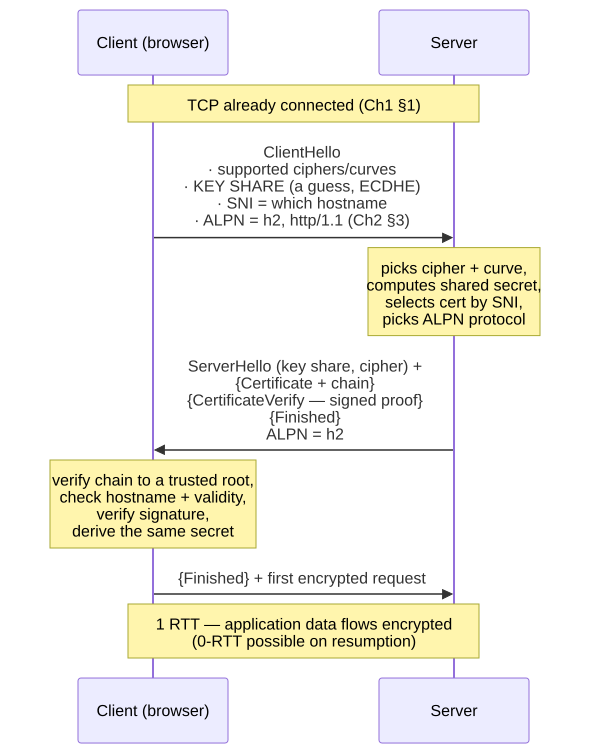
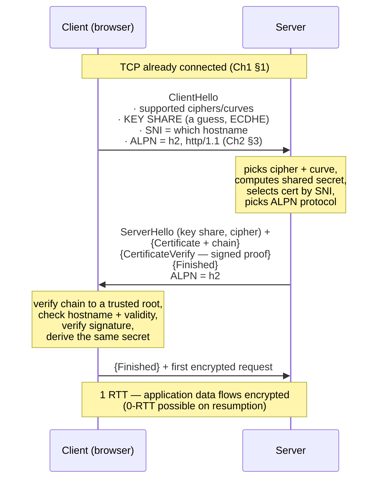
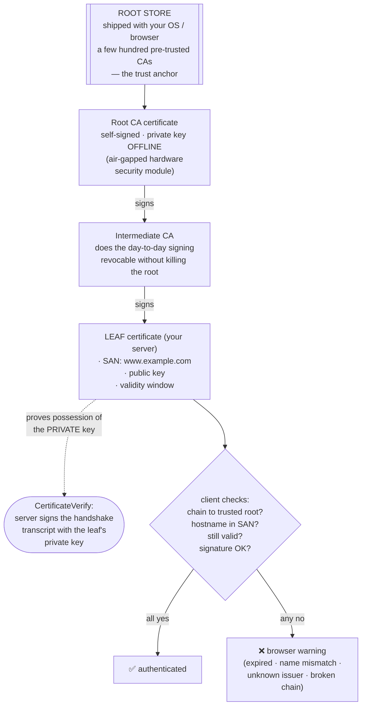
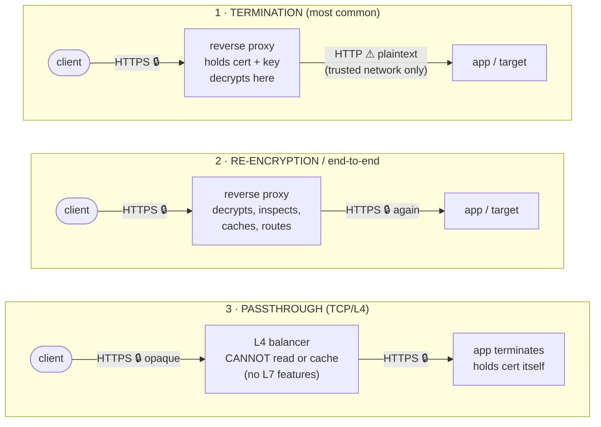

# M02 · Ch3 · §1 — What HTTPS actually guarantees: three properties, one handshake, and a chain of trust

> **Module:** Networking & The Web
> **Chapter:** TLS & secure transport
> **Section:** Opens Ch3 by paying off a debt the last two chapters kept running up. HTTPS is HTTP over
> **TLS** (Transport Layer Security), and TLS buys you exactly **three** things — **confidentiality**, **integrity**, and
> **authentication** — plus a fourth that people wrongly assume. This section works the **TLS (Transport Layer Security) 1.3
> handshake** step by step (the 1-RTT — one-round-trip — line-item from Ch1 §5, and the place Ch2 §3's
> **ALPN** (Application-Layer Protocol Negotiation) version negotiation actually rides), the **certificate chain of trust** that makes authentication possible and is
> also its weakest link, and **where TLS terminates** — the first job of the reverse proxy from Ch2 §2 §11.
> **Status:** ✅ finalized 2026-09-05 (body prepared 2026-09-02). No questions on the body — it landed. The
> session was **two questions driven straight out of §4's chain of trust**: he restated §1's authentication
> guarantee in his own words (*"if the certificate is compromised, an attacker can impersonate
> `www.example.com`"* — right in outcome, imprecise in mechanism), then asked the operational question §4
> leaves open: *"from the server's side, how can they know their private key has leaked?"* **§11** works
> both — the certificate-is-public / key-is-secret split, the three distinct meanings of "compromised", and
> the finding that **both obvious defences (revocation and detection) are broken**, which is the real reason
> certificate lifetimes keep shrinking.
> **Prerequisites:** M02 Ch1 §1 (the handshake round-trip budget) and §5 (TLS as a 1-RTT line-item — this
> section opens that box). Ch2 §2 §11 (reverse proxy — TLS termination is its job) and Ch2 §3 §11a (ALPN,
> which lives inside the handshake below). Deeper crypto internals are **M03 Ch2**; this section teaches
> only as much as the protocol needs.

**Estimated study time:** 3–3.5 hours including the `openssl` hands-on.

---

## Why this section exists — and how it's pitched

Three separate promises across this module all land here:

- **Ch1 §5** treated the TLS handshake as *one round-trip on the latency budget* and deferred the contents.
- **Ch2 §2 §11** said a reverse proxy's first job is **TLS termination** — without saying what is being
  terminated.
- **Ch2 §3 §11a** found that HTTP version negotiation (**ALPN**) happens *inside the TLS handshake*, which
  is why it costs zero extra round-trips.

So this is the box-opening. And it's pitched as a **trust-model** section rather than a cryptography
lesson, because that's where the real engineering decisions are. The mathematics of AES (Advanced Encryption Standard) and ECDHE (Elliptic Curve Diffie-Hellman Ephemeral) is M03
Ch2's job; what you need here is: **what does the padlock actually promise, what does it conspicuously
*not* promise, who has to be trusted for any of it to work, and where in your own architecture does the
encrypted channel begin and end.** Those four questions are where TLS bugs and TLS outages actually come
from — not from broken ciphers.

One framing to carry through: **TLS solves a channel problem, not an application problem.** It secures
*bytes in transit between two endpoints*. It says nothing about whether your endpoints are trustworthy,
whether your app has an injection bug, or whether the person holding the other end is who you'd like — a
direct continuation of Ch2 §1 §10c's *never trust the client; the boundary is the server.*

---

## 1. The three guarantees — and the fourth thing people assume

When a browser shows `https://` and a padlock, TLS is asserting exactly three properties about the channel:

| Guarantee | Plain-English claim | Broken without it |
|---|---|---|
| **Confidentiality** | nobody on the path can *read* the traffic | the café Wi-Fi, your ISP (Internet Service Provider), or a transit provider reads your session cookie |
| **Integrity** | nobody on the path can *modify* the traffic undetected | an ISP injects ads; an attacker flips a byte in your JSON |
| **Authentication** | the server is *really* the domain in the address bar | you complete a perfect handshake — with an impostor |

**Authentication is the load-bearing one, and the one people skip.** Confidentiality and integrity alone
are worthless: an attacker who intercepts your connection can offer *their own* encrypted channel and read
everything in plaintext at their end. Encryption without identity just means you have a private
conversation with someone you can't name. Everything in §4 (certificates) exists to solve **that**, and it
is the only part of TLS that depends on trusting third parties.

**The fourth thing people wrongly assume: "HTTPS means the site is safe."** It does not. HTTPS says the
*channel* to `evil-phishing-site.com` is confidential, intact, and genuinely terminating at
`evil-phishing-site.com`. Phishing sites overwhelmingly have valid certificates — free, automated DV (Domain Validated) certs
(§4) are available to anyone, attackers included. The padlock is a statement about the **pipe**, never
about the **peer's intentions** or the application's quality.

> Keeper: **TLS authenticates the *name*, not the *virtue*.** It proves you're talking to the holder of
> `example.com`; whether `example.com` deserves your credit card is entirely outside its scope.

---

## 2. Just enough cryptography (the protocol's working parts)

You need three primitives and one trick. (M03 Ch2 does the real treatment; this is the working set.)

- **Symmetric encryption** (AES-GCM — Advanced Encryption Standard in Galois/Counter Mode — or ChaCha20-Poly1305) — one shared key encrypts *and* decrypts. **Fast**,
  good for bulk data. Problem: both sides must already share a secret.
- **Asymmetric / public-key cryptography** (RSA — Rivest-Shamir-Adleman — or elliptic curves) — a **key pair**: the public key can be
  shouted from the rooftops; the private key never leaves the server. What one key does, only the other
  undoes. **Slow**, but it solves the "we've never met" problem, and it enables **signatures** (sign with
  the private key → anyone can verify with the public key → proof of possession).
- **Cryptographic hashing + AEAD** (Authenticated Encryption with Associated Data) — a hash (SHA-256, a Secure
  Hash Algorithm variant) is a one-way fingerprint; combined into an
  **authenticated encryption** mode (the Galois/Counter Mode or Poly1305 part), it gives you integrity *and*
  confidentiality in one operation, so a tampered message fails to decrypt rather than decrypting to
  garbage.

**The trick that makes TLS work — the hybrid scheme.** Public-key crypto is too slow for a video stream;
symmetric crypto can't bootstrap trust between strangers. So TLS uses **asymmetric crypto once, to agree a
fresh symmetric key**, then encrypts the whole session symmetrically with that key. Slow handshake, fast
session. Every "how does HTTPS work" answer is a variation on this sentence.

The key agreement itself is a **Diffie-Hellman exchange** (specifically **ECDHE**, elliptic-curve
ephemeral): both sides publicly exchange values from which each can compute the *same* shared secret, while
an eavesdropper who saw the entire exchange **cannot**. It's the genuinely surprising piece of mathematics
in the stack — two parties shouting across a room and ending up with a shared secret the room doesn't know.
The **E** (ephemeral) matters enormously, and §5 explains why.

---

## 3. The TLS 1.3 handshake, step by step

TLS 1.3 (RFC 8446, 2018) reduced the handshake to **one round-trip** — the Ch1 §5 line-item — largely by
making the client *guess* the key-exchange parameters up front instead of asking first.

<!-- DIAGRAM:START -->

Diagram source (Mermaid)

<!-- DIAGRAM:END -->

Walking the steps, because each one maps to a failure mode later:

1. **ClientHello.** The client offers its supported cipher suites and curves — **and optimistically sends a
   key share** (its half of the ECDHE exchange) for the curve it expects the server to pick. It also sends
   two extensions that matter to you: **SNI** (*Server Name Indication* — "I want `www.example.com`"),
   which is how one IP can host many HTTPS sites (the TLS-layer counterpart of Ch1's `Host` header), and
   **ALPN (Application-Layer Protocol Negotiation)** — the list of application protocols, which is exactly where Ch2 §3 §11a's HTTP version gets
   chosen.
2. **Server side.** The server picks a cipher and curve, sends **its** key share, and can now compute the
   shared secret. It selects **which certificate to present based on SNI (Server Name Indication)**, and picks the ALPN protocol.
3. **Certificate + CertificateVerify.** The server sends its **certificate chain** (§4) and then a
   **signature over the handshake transcript** using the private key belonging to that certificate. This is
   the actual proof of identity: anyone can *copy* a public certificate, but only the true holder of the
   private key can produce this signature. **The certificate claims; the signature proves.**
4. **Client verification** — four checks, each a real-world outage when it fails: does the chain lead to a
   **root the client already trusts**? does the certificate actually **cover this hostname** (SAN)? is it
   **within its validity window** (and not revoked)? does the **signature verify**?
5. **Finished + application data.** Both sides confirm, and the first HTTP request goes out encrypted — one
   round-trip after the client started.

**0-RTT resumption, and its sharp edge.** On a return visit the client can send application data in its
*very first* packet using a pre-shared key from the previous session — **zero** round-trips. The catch:
0-RTT data has no freshness guarantee and can be **replayed** by an attacker who captured it. So it must
only carry **safe, idempotent** requests (Ch2 §1's vocabulary, doing real work here) — never a `POST` that
charges a card. This is one of the cleanest examples of why §1's idempotency taxonomy was worth learning.

> Keeper: TLS 1.3's speed comes from **guessing well**. The client bets on the key-exchange parameters in
> its first message; if the bet is right the handshake completes in 1 RTT (round-trip time), and only a bad guess costs an
> extra trip (a `HelloRetryRequest`).

---

## 4. Certificates and the chain of trust

A **certificate** is a small signed document binding **an identity (a domain name) to a public key**, with
a validity period — signed by someone else. That's all. Its power comes entirely from **who signed it**.

- **The chain.** Your server's **leaf** certificate is signed by an **intermediate Certificate Authority (CA)**, which is signed by
  a **root** CA. The client walks that chain upward until it reaches a root it *already* trusts.
- **The trust anchor is a list shipped with your device.** Your OS and browser carry a **root store** — a
  few hundred pre-installed root CA (Certificate Authority) certificates. Trust doesn't come from the network; it comes from that
  bundled list, curated by Apple/Microsoft/Mozilla/Google. **This is the foundation of the whole system:
  authentication works because you already trust a list of strangers your vendor chose.**
- **Roots stay offline; intermediates do the work.** Root private keys live in air-gapped hardware; they
  sign a handful of intermediates, which sign millions of leaves. If an intermediate is compromised it can
  be revoked without invalidating the root — a deliberate blast-radius design (and the reason a server must
  send the **full chain**, not just its leaf; a missing intermediate is a classic misconfiguration that
  works in browsers with cached intermediates and fails in `curl`/mobile).
- **What's *in* the leaf.** The **Subject Alternative Name (SAN)** list is the authoritative field for
  which hostnames it covers (the old `CN` is legacy). Wildcards (`*.example.com`) cover one label only.
- **Validation levels — and why only one matters.** **DV** (Domain Validated) proves only "whoever got this
  cert controlled the domain." **OV** (Organization Validation) and **EV** (Extended Validation)
  additionally vet the legal organization — OV confirms the company exists as a legal entity, EV adds an
  audited check of its premises, operational history and an authorized signatory. Browsers **stopped
  giving EV any special UI** (the green company name is gone), so in practice **DV is the web**, and this
  is precisely why HTTPS cannot vouch for a site's honesty (§1's fourth point).
- **Automation changed everything.** **Let's Encrypt** made DV certificates **free and automated** via the
  **ACME** (Automated Certificate Management Environment) protocol, taking HTTPS from a paid annual chore to a default. Consequence: certificate lifetimes
  are shrinking (Let's Encrypt issues **90-day** certs; the industry cap fell to **398 days** in 2020 and
  the trend is shorter still) on the logic that **short-lived + automated beats long-lived + revocable** —
  because revocation, as below, barely works.

<!-- DIAGRAM:START -->

Diagram source (Mermaid)

<!-- DIAGRAM:END -->

**The weak link is the CA system itself.** Any of those hundreds of trusted CAs can issue a certificate for
*any* domain — including yours. That's not theoretical:

- **DigiNotar (2011)** was compromised and issued **rogue certificates for `*.google.com`**, used to
  intercept Iranian users' Gmail. The CA was distrusted and went bankrupt.
- **Symantec** was found to have mis-issued repeatedly; Google **distrusted its entire CA business**
  (2017–18), forcing a mass re-issuance across the web.

The mitigation is **Certificate Transparency (CT)**: every issued certificate must be logged to public,
append-only logs, and Chrome refuses certificates that aren't. It doesn't *prevent* mis-issuance — it makes
it **publicly detectable**, so a domain owner can monitor the logs and catch a rogue certificate for their
own name. A reputational/audit fix for a structural trust problem.

**Revocation, honestly.** If a private key leaks you want to invalidate the certificate — but Certificate Revocation
Lists (CRLs) are huge and **OCSP** (Online Certificate Status Protocol) checks are a privacy leak and a latency hit, and browsers **soft-fail** them (if the OCSP
responder is unreachable, they proceed). So revocation is unreliable in practice, which is exactly the
argument for the **short-lifetime** direction above: a 90-day certificate that expires on its own is a
better safety property than a 2-year certificate you hope you can revoke.

---

## 5. Forward secrecy — and what TLS 1.3 deleted

**Forward secrecy** is the property that **recording today's encrypted traffic is useless even if the
server's private key leaks tomorrow.**

In older TLS you could do **RSA key transport**: the client encrypted the session key with the server's
public key. Simple — and catastrophic in hindsight, because the session key was recoverable from the
*private key alone*. An adversary could store years of traffic and decrypt all of it retroactively the day
they obtained (or subpoenaed, or stole) that one key.

**ECDHE fixes this by being ephemeral:** a *fresh* key pair per connection, discarded afterwards. The
server's long-term private key is used only to **sign** (prove identity), never to encrypt the session key.
So the session secret exists nowhere durable, and past sessions stay unreadable forever.

**TLS 1.3 made this mandatory** — it **removed RSA key transport and static Diffie-Hellman entirely**, along
with renegotiation, compression (the CRIME attack), and a long list of weak ciphers (RC4, 3DES, MD5/SHA-1,
Cipher Block Chaining (CBC) mode constructions). This is the rare protocol revision that got *smaller*, and it's the deeper lesson:
**most TLS vulnerabilities were in optional legacy features and downgrade paths, not in the strong
primitives.** BEAST, CRIME, POODLE, FREAK, Logjam, DROWN were nearly all "negotiate the peer down to
something old." TLS 1.3's defence was **deleting the options.**

> Keeper: **TLS 1.3 got safer by removing choices, not by adding strength.** Configurability was the
> attack surface — a design lesson that generalizes far past cryptography (and echoes M04's decomposition
> theme: fewer knobs, fewer wrong states).

---

## 6. What HTTPS does *not* protect

The honest boundary of the guarantee — and the part that produces bad security assumptions:

- **It does not hide *who* you're talking to.** The **hostname leaks** twice: in plaintext **DNS** (Ch1 §1)
  and in the **SNI** field of the ClientHello, which is sent *before* encryption exists. Your ISP (Internet Service Provider) can't read
  your Gmail, but it knows you connected to Gmail. Fixes are rolling out — **DoH/DoT** (DNS over HTTPS / DNS over TLS) for DNS, and
  **Encrypted Client Hello (ECH)** for SNI — but the hostname is historically visible.
- **It does not hide traffic *shape*.** Packet sizes, timing, and volumes remain visible, and **traffic
  analysis** can infer which page you loaded or which video you streamed from those patterns alone.
- **It does not protect either endpoint.** A compromised server, a malicious browser extension, a
  keylogger, or a leaked database are all completely outside TLS's scope. It's a **channel** guarantee.
  This is Ch2 §1 §10c restated: TLS delivers your bytes safely *to the server* — it says nothing about the
  client's honesty or the server's competence.
- **It does not stop TLS-terminating middleboxes you've been made to trust.** Corporate MITM (man-in-the-middle) proxies and
  antivirus work by installing **their own root CA** on your machine, then re-signing every site's
  certificate. Because the root store *is* the trust anchor (§4), this is undetectable to the browser — the
  padlock still shows. Whoever controls your root store controls what "authenticated" means.
- **It does not make your application secure.** Injection, broken authorization, XSS (cross-site scripting), CSRF (cross-site request forgery), secrets in the
  repo — untouched (M10's territory). HTTPS is table stakes, not a security programme.

---

## 7. Where TLS terminates — the reverse-proxy job, and the hop you own

This is where the section meets your architecture, and it's Ch2 §2 §11's TLS-termination job made concrete.
**Termination** means the point where the encrypted connection is decrypted. That point is almost never
your application process — it's the edge (CloudFront, an Application Load Balancer (ALB), nginx, API Gateway), which holds the
certificate and private key. Three arrangements, with real trade-offs:

<!-- DIAGRAM:START -->

Diagram source (Mermaid)

<!-- DIAGRAM:END -->

1. **Termination at the edge (the default).** The proxy decrypts; the hop to your app is plain HTTP over a
   private network. **Why:** the edge can now do every job from Ch2 §2 §11 — cache (it must read the body),
   route on path/headers (L7 — application layer), compress, run a WAF (Web Application Firewall) — and you manage **one** certificate instead of many.
   **Cost:** that internal hop is plaintext, so it's only acceptable if the network between them is
   genuinely trusted.
2. **Re-encryption ("end-to-end").** The proxy decrypts, does its L7 work, then opens a *second* TLS
   connection to the backend. You keep the edge features *and* encrypt the internal hop. Costs extra CPU
   and a second certificate to manage. **This is the right setting for regulated or zero-trust
   environments** — and note it's still not "end-to-end" in the cryptographic sense: the proxy sees
   plaintext in the middle, by design.
3. **Passthrough (L4).** The balancer forwards TCP bytes without decrypting; your app terminates TLS
   itself. Maximum secrecy, **but you lose every L7 capability** — no caching, no header routing, no WAF (Web Application Firewall),
   no HTTP/2 termination — because the balancer can't see inside. Choose it when the backend must be the
   only holder of plaintext.

**The hop you own — the direct callback to Ch2 §3 §11b.** "We enabled HTTPS" usually describes only
client→edge. The edge→target hop is a **separate setting** (and on an ALB, so is the target's protocol
version). The classic real-world footgun is Cloudflare's **"Flexible SSL"** mode (SSL — Secure Sockets Layer — being TLS's
predecessor, a name that survives in product branding): browser→Cloudflare is
encrypted and the padlock appears, while **Cloudflare→origin is plain HTTP over the open internet** — a
site that looks secure and isn't. Know which of the three arrangements you're running, per hop.

**mTLS (mutual TLS), briefly.** Everything above authenticates the *server* to the client. **mTLS** adds
the reverse: the **client** also presents a certificate, and the server verifies it. Rare on the public web
(you can't issue certificates to the world), standard for **service-to-service** traffic inside a cluster
or mesh — it's how a zero-trust network gets cryptographic identity per service instead of trusting the
network. This is one genuine, structural answer to Ch2 §1 §10c's "never trust the client": you can't
authenticate an anonymous public browser, but you *can* authenticate your own services.

---

## 8. Failure modes — the decision checklist

Nearly every TLS incident is operational, not cryptographic:

- **Expired certificate** → hard browser error and a total outage. The canonical class of self-inflicted
  incident (it has taken down mobile networks, Teams, LinkedIn, Spotify). **Automate renewal (ACME) and
  alert on expiry well ahead** — never diarise it.
- **Incomplete chain (missing intermediate)** → "works in my browser" (which cached the intermediate from
  another site) but fails in `curl`, on mobile, and in server-to-server calls. **Always test with a cold
  client**, e.g. `openssl s_client`.
- **Hostname mismatch** → the SAN doesn't cover the name used (bare domain vs `www`, or a wildcard used
  more than one label deep).
- **Clock skew** → a wrong client clock makes valid certificates look expired/not-yet-valid. A recurring
  embedded/Internet-of-Things (IoT) and continuous-integration (CI) container failure.
- **Mixed content** → an HTTPS page pulling `http://` subresources; browsers block them, so the page
  silently half-loads.
- **No HSTS (HTTP Strict Transport Security) / plaintext first hop** → the initial `http://` request is interceptable before the redirect
  (Ch2 §3 §11a). Send **`Strict-Transport-Security`** so the browser refuses plaintext for your domain
  afterwards; consider the preload list.
- **Certificate pinning, applied naively** → you pin a certificate, rotate it, and **brick every deployed
  client**. Pin to a CA/public key with backup pins and short expiry, or don't pin.
- **Trusting `curl -k` / disabled verification** → `-k` (or `verify=False`) turns off exactly the
  authentication that makes the other two guarantees meaningful. Fine for a one-off debug against your own
  box; **never** in shipped code — it converts HTTPS into "encrypted to somebody."
- **Terminating TLS then forgetting the internal hop** → §7's Flexible-SSL footgun.
- **Ancient protocol versions enabled** → TLS 1.0/1.1 are deprecated; the downgrade paths are where the
  historical attacks live (§5). Serve **1.2 and 1.3** only.

---

## 9. Check your understanding

1. Name TLS's three guarantees, and explain why confidentiality and integrity are close to worthless
   without the third.
2. A site presents a perfectly valid certificate and the padlock appears — yet it's a phishing site
   harvesting passwords. Explain precisely why TLS is not violated here, and which validation level made
   this cheap.
3. Why does TLS use *both* asymmetric and symmetric cryptography instead of picking one? Name what each is
   used for in the handshake.
4. What is forward secrecy, which handshake mechanism provides it, and what old mechanism did TLS 1.3
   delete to guarantee it?
5. Your certificate works in Chrome but server-to-server calls from a container fail verification. What's
   the most likely misconfiguration, and why does the browser hide it?
6. An attacker records your entire HTTPS session today and steals the server's private key next year. What
   can they decrypt, and why?
7. Your ALB (Application Load Balancer) terminates TLS and forwards plain HTTP to your app. State one concrete capability this buys you
   and one risk it creates — then say what you'd change in a zero-trust environment.
8. Why must 0-RTT resumption data be restricted to idempotent requests?

Answers

1. **Confidentiality** (no one on the path can read), **integrity** (no one can modify undetected),
   **authentication** (the peer really is that domain). Without authentication an interceptor simply
   terminates *their own* perfectly encrypted connection with you and reads everything in the clear at
   their end — you'd have a confidential, tamper-proof channel to the attacker. Encryption without identity
   secures a conversation with an unknown party.
2. TLS's claim is only that the channel is confidential, intact, and terminating at **the domain in the
   address bar** — which it is; the domain is genuinely the attacker's. TLS authenticates the *name*, not
   the operator's honesty. **DV** (Domain Validated) certificates — free and automated via ACME/Let's
   Encrypt — made this trivially cheap, and browsers no longer surface EV distinctions.
3. Asymmetric crypto solves trust between strangers but is **slow**; symmetric is **fast** but needs a
   pre-shared key. So TLS uses asymmetric operations **once** — an **ECDHE key agreement** to derive a
   fresh shared secret, plus a **signature** (`CertificateVerify`) proving the server holds the
   certificate's private key — then encrypts the entire session **symmetrically** (AES-GCM/ChaCha20) with
   that derived key.
4. **Forward secrecy:** recorded traffic stays undecryptable even if the server's long-term private key
   later leaks. Provided by **ECDHE** — an *ephemeral* key pair per connection, discarded after use, so the
   session secret is never recoverable from the long-term key. TLS 1.3 **removed RSA key transport** (and
   static DH), where the session key *was* recoverable from the private key alone.
5. An **incomplete chain** — the server isn't sending the **intermediate** certificate. Chrome often has
   the intermediate cached from visiting other sites (or fetches it), so it silently completes the chain; a
   cold client like a container's `curl` or SDK (software development kit) has no cache and fails. Test with `openssl s_client` against a
   clean environment.
6. **Nothing**, assuming TLS 1.3 (or any ECDHE suite): the session key came from an **ephemeral** key pair
   that was destroyed, and the long-term key only *signed* the handshake. That's forward secrecy. Under the
   old RSA key-transport mode they could have decrypted the whole recording.
7. **Buys:** the edge can read the plaintext, so it can **cache** (Ch2 §2), route on path/headers (L7),
   compress, and run a WAF — plus you manage one certificate. **Risk:** the ALB→app hop is **plaintext**,
   so anyone with access to that network segment can read traffic. In a zero-trust setup switch to
   **re-encryption** (HTTPS to the target as well), and for internal service-to-service traffic consider
   **mTLS** so both ends are cryptographically identified.
8. Because 0-RTT data carries **no freshness/liveness guarantee** and can be **captured and replayed** by
   an attacker. A replayed **safe/idempotent** request (a `GET`) changes nothing; a replayed non-idempotent
   one (a `POST` that charges a card) executes twice — Ch2 §1's idempotency contract doing real work.

---

## 10. Optional: get your hands dirty (30–40 min)

Look inside a real handshake.

1. **The whole handshake verbosely:** `curl -v https://www.cloudflare.com -o /dev/null` — find the TLS
   version, the negotiated cipher, the **ALPN** exchange (Ch2 §3 §11a), and the certificate summary.
2. **Inspect the chain with a cold client:**
   `openssl s_client -connect example.com:443 -servername example.com -showcerts </dev/null`
   — read the chain from leaf to root, and note `Verify return code`. The `-servername` flag *is* **SNI**;
   drop it and watch a multi-tenant host serve a different (or wrong) certificate.
3. **Read the leaf's fields:**
   `openssl s_client -connect example.com:443 -servername example.com </dev/null 2>/dev/null | openssl x509 -noout -subject -issuer -dates -ext subjectAltName`
   — confirm the **SAN** list, issuer, and the validity window (and how many days you have left).
4. **Break it deliberately:** visit `https://expired.badssl.com`, `https://wrong.host.badssl.com`,
   `https://self-signed.badssl.com`, `https://incomplete-chain.badssl.com` and match each browser error to
   one of §4's four client checks. (badssl.com exists exactly for this.)
5. **See a middlebox / root store:** list your trusted roots (`ls /etc/ssl/certs | head`, or the OS
   keychain) and count them. Reflect on §6: that list is the entire trust anchor.
6. **Thought experiment (no code):** for one service you run, write down which of §7's three termination
   arrangements each hop uses, who holds the private key, and which hops carry plaintext.

Deliverable: for one of your own endpoints, record the TLS version, cipher, ALPN result, certificate issuer
and days-to-expiry, and the termination arrangement per hop.

---

## 11. Applied — two questions from the session

The body landed with no questions; both threads came off **§4 (the chain of trust)** and both were the
*same* move — taking the section's claim and asking what it costs. He first restated §1's authentication
guarantee in his own words, then immediately asked the operational question that §4 leaves open: **if
detection is the defence, who does the detecting, and can they?**

### 11a. "The certificate proves the destination is real — so if the certificate is compromised, an attacker can impersonate `www.example.com`. Correct?"

**Right in outcome, and the imprecision is the interesting part.** "The certificate is compromised" collapses
three different failures that have different attackers, different blast radii, and different defences.

**The certificate is public — it cannot be stolen.** It is served in plaintext to every visitor during the
handshake (§3), and since **Certificate Transparency** (§4) every certificate ever issued is published in
append-only logs that anyone can search. Copying a certificate gets an attacker nothing.

What proves identity is the **private key**, which never leaves the server. §3's handshake splits the job in
two, and the split is the whole answer:

| Message | Role |
|---|---|
| `Certificate` | The CA's signed **claim**: "the holder of this public key controls `www.example.com`." |
| `CertificateVerify` | The server's live **proof** that it holds the matching private key — it signs the transcript of *this* handshake. |

An attacker holding the certificate but not the key gets stuck at the second message. So the precise
statement is: **whoever holds the private key can be `www.example.com`.**

**The three failures that "compromised" actually names:**

| What breaks | What the attacker gets | Detectable? |
|---|---|---|
| **The server's private key is stolen** | Impersonation of that one site, until the certificate expires | Barely — the certificate is genuine, and Certificate Transparency shows nothing unusual |
| **A CA mis-issues** (DigiNotar, §4) | A *different but perfectly valid* certificate for the same name, with a key the attacker chose | Yes, now — the rogue certificate must appear in the Certificate Transparency logs |
| **The client's root store is poisoned** (corporate middlebox, malware) | Certificates for *any* site, on that machine | Not by the site — only by inspecting the local trust store (§6) |

Row two is the severe one, and it is exactly why §4 calls the chain of trust *"also its weakest link."* The
attacker never touches `example.com`'s servers at all. They obtain a valid credential for a name they do
not control, and every browser accepts it, because **the browser trusts the CA, not the site**. One weak CA
anywhere in the root store — DigiNotar was Dutch — breaks every site on the internet. That asymmetry is
the structural flaw Certificate Transparency was built to patch: it cannot *prevent* mis-issuance, but it
makes it **loud**.

**Two things the credential alone does not buy:**

- **They still need your traffic.** A stolen key is a credential, not a position on the network. To use it
  they must also make you connect to them — DNS hijack, BGP (Border Gateway Protocol) hijack, hostile Wi-Fi, a compromised resolver.
  This is why key theft and network attacks are almost always reported together, and why §6's "HTTPS does
  not hide *who* you are talking to" and this section are two halves of one threat model.
- **Past traffic stays safe.** §5's forward secrecy means the session keys came from an ephemeral **ECDHE**
  exchange, not from the certificate key. An attacker who steals the key today cannot decrypt traffic they
  recorded last year — they can only impersonate *going forward*. That is precisely what TLS 1.3 bought by
  deleting RSA key transport.

**One correction to "the real one."** The certificate proves control of the **name**, never the honesty of
the **operator**. `paypa1-secure.com` can obtain a valid DV (Domain Validated) certificate in about thirty
seconds, and the padlock looks identical. HTTPS tells you *you are talking to whoever controls the name in
the address bar, with nobody in between* — which is §1's third guarantee stated exactly, and §1's **fourth
thing people wrongly assume** stated as its shadow.

### 11b. "From the server's side, how can they know their private key has leaked?"

**Usually they cannot — and that fact is load-bearing for the whole design.**

Copying a private key leaves **no trace**. No log entry, no state change, nothing measurably different on
the server; the file is still there afterwards. This is the asymmetry that makes secrets unlike objects:
stealing a secret does not remove it. Everything below follows from accepting that.

**The detection channels that exist — all of them indirect:**

| Channel | What it actually catches | Limit |
|---|---|---|
| **Certificate Transparency monitoring** — subscribe to the logs for your own domains, alert on any certificate you did not request | **CA mis-issuance** (row two of 11a) | Blind to key theft: a thief with your key reuses *your* certificate and never asks a CA for anything |
| **Finding the intrusion that carried it out** | Exfiltration alerts, a key in a backup or a pushed container image, a laptop with a copy | Finds the breach, not the key — and only if the breach is found at all |
| **Traffic that should exist and doesn't** | Sessions an attacker serves never reach your access logs | Negative and noisy: a regional traffic dip, a CDN (Content Delivery Network) / origin count mismatch, unreproducible user reports |
| **Someone tells you** | A researcher, a CA, a browser vendor, law enforcement | Uncomfortably often the real discovery path |
| **HSM (Hardware Security Module) audit trail** | Signing operations are counted and logged; a rate far above your traffic is a genuine alarm | Requires the key to have been in an HSM to begin with |

**Heartbleed (2014) is the archetype.** The bug let an attacker read server memory, possibly including the
private key — and left **no way to determine whether any particular key had actually been read**. The
entire internet re-keyed on the *assumption* that it had. That is what "cannot detect" looks like at scale.

**So the real answer is architectural — you engineer so you never need to detect it:**

- **Make the key non-extractable.** In an **HSM** or a cloud **KMS** (Key Management Service) the key is
  generated inside the device and never emitted. The server can ask it to *sign*; it cannot ask for the
  key. An attacker with root gets a **signing oracle for as long as they hold the box** — bad, but bounded,
  and it ends when you evict them. A copied key file does not end.
- **Keep certificate lifetimes short.** A stolen key is only worth anything while its certificate still
  validates. Ninety days (Let's Encrypt) already bounds the damage without depending on detection *or* on
  revocation, and the CA/Browser Forum is driving toward roughly 47 days by 2029.
- **Automate renewal so rotation is routine.** ACME makes "fresh key, fresh certificate" a cron job instead
  of a change-management ticket — and that is what makes re-keying **on suspicion** possible. If rotation is
  a scary manual ritual you will not do it on suspicion, and suspicion is all you are ever going to have.
- **Rely on forward secrecy** (§5) so a leak never reaches recorded past traffic.
- **Assume compromise after any relevant intrusion.** Re-key first; confirmation is not coming.

**The keeper, and it reframes §4 and §8.** Certificate security does not rest on catching theft or on
revoking credentials. **Revocation barely works** (§4: CRLs are huge, OCSP is a privacy and latency cost,
browsers soft-fail it) and **detection barely works** (this section). Both of the obvious defences are
broken, and the system holds anyway — because the *exposure window* is short and the key is hard to
extract. That is the honest reason certificate lifetimes keep shrinking, and it is the reason a **manual**
certificate process is a security problem and not merely an operational chore.

---

## Key terms (English · 大陆 简体 · 台灣 繁體)

| English | 大陆 (简体) | 台灣 (繁體) | Note |
|---|---|---|---|
| Encryption | 加密 | 加密 | same |
| Symmetric / asymmetric | 对称 / 非对称 | 對稱 / 非對稱 | script only |
| Public / private key | 公钥 / 私钥 | 公開金鑰 / 私密金鑰 | ⚠ genuine split: 密钥 ↔ 金鑰 |
| Key exchange / agreement | 密钥交换 | 金鑰交換 | ⚠ 密钥 ↔ 金鑰 (ECDHE) |
| Certificate | 证书 | 憑證 | ⚠ genuine split: 证书 ↔ 憑證 |
| Certificate Authority (CA) | 证书颁发机构 | 憑證授權中心 | ⚠ genuine split |
| Chain of trust / root store | 信任链 / 根证书库 | 信任鏈 / 根憑證存放區 | the trust anchor (§4) |
| Signature | 签名 | 簽章 | ⚠ 签名 ↔ 簽章 |
| Hash | 哈希 / 散列 | 雜湊 | ⚠ genuine split: 哈希 ↔ 雜湊 |
| Handshake | 握手 | 握手 | same (from Ch1) |
| Forward secrecy | 前向保密 | 前向保密 / 完全前向保密 | the §5 property |
| Man-in-the-middle (MITM) | 中间人攻击 | 中間人攻擊 | script only |
| TLS termination | TLS 终止 / 卸载 | TLS 終止 / 卸載 | the reverse-proxy job (§7) |
| Mutual TLS (mTLS) | 双向 TLS | 雙向 TLS | client also presents a cert (§7) |
| Revocation | 吊销 / 撤销 | 撤銷 | ⚠ 吊销 common in mainland |
| Domain / Organization / Extended Validation (DV/OV/EV) | 域名 / 组织 / 扩展验证 | 網域 / 組織 / 延伸驗證 | ⚠ 域名 ↔ 網域; only DV matters in browsers now (§4) |
| Certificate Transparency (CT) | 证书透明度 | 憑證透明度 | public append-only logs; makes mis-issuance *loud* (§4, §11a) |
| Hardware Security Module (HSM) | 硬件安全模块 | 硬體安全模組 | ⚠ 模块 ↔ 模組; holds a **non-extractable** key (§11b) |
| Key rotation / re-keying | 密钥轮换 | 金鑰輪替 | ⚠ 密钥 ↔ 金鑰; 轮换 ↔ 輪替 (§11b) |

---

## References

- MDN — *Transport Layer Security* and *A brief history of TLS* (the practical orientation) —
  <https://developer.mozilla.org/en-US/docs/Web/Security/Transport_Layer_Security>
- Cloudflare Learning — *What is TLS?* / *What happens in a TLS handshake?* (clearest diagrams of the 1.3
  flow) — <https://www.cloudflare.com/learning/ssl/what-happens-in-a-tls-handshake/>
- RFC 8446 — *The Transport Layer Security (TLS) Protocol Version 1.3* (authoritative; the "removed
  features" list in §1.2 is worth reading for §5) — <https://www.rfc-editor.org/rfc/rfc8446.html>
- Let's Encrypt — *How it works* + the ACME (Automated Certificate Management Environment) protocol (why HTTPS became free and automated) —
  <https://letsencrypt.org/how-it-works/>
- Certificate Transparency — <https://certificate.transparency.dev/> · and **badssl.com** for the
  deliberately-broken test endpoints in §10 — <https://badssl.com/>
- Mozilla — *Server Side TLS* configuration guidance (what to actually enable/disable, §8) —
  <https://wiki.mozilla.org/Security/Server_Side_TLS>

### What's next

Continuing Ch3 (TLS & secure transport):
- **§2 — TLS in operation:** certificate lifecycle and automation (ACME, AWS Certificate Manager — ACM), HSTS (HTTP Strict Transport Security) and the
  preload list, cipher/version policy, mTLS for service-to-service, debugging TLS failures, and the
  performance side (session resumption, 0-RTT, OCSP stapling, where handshake cost actually lands).

Or move on: **Ch4 — Real-time** (REST vs WebSockets vs SSE — Server-Sent Events — vs long-polling) is the closest to your
arena/WebSocket work and was already teed up by Ch2 §3 §11b's SSE-versus-WebSocket trade-off. Deeper
cryptography — hashing vs encryption, signing, key management — is **M03 Ch2**; the application-security
programme HTTPS explicitly does *not* give you is **M10**.
