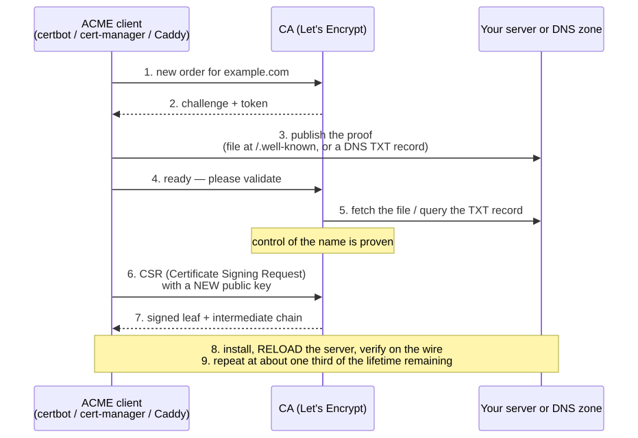
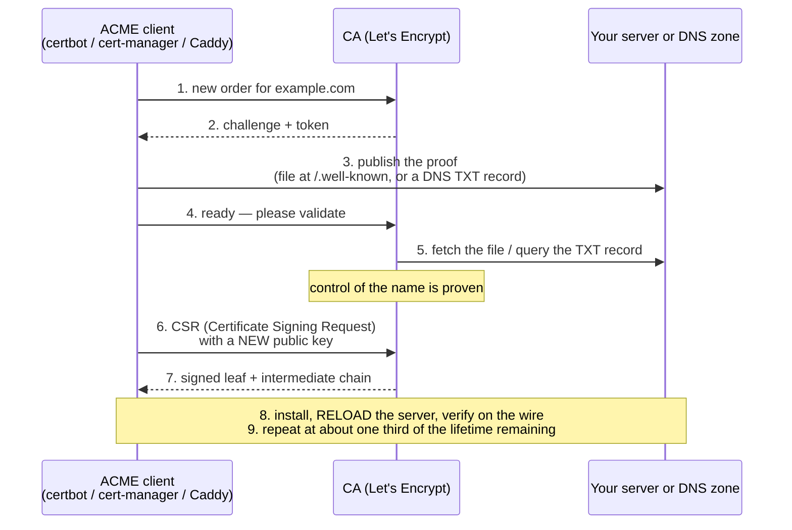
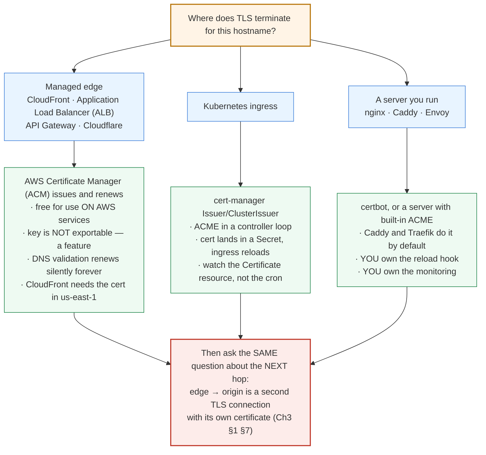
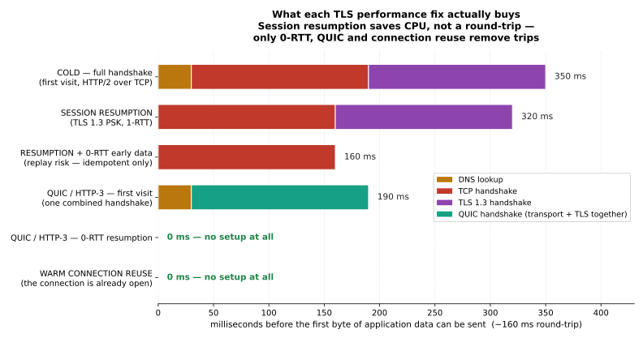
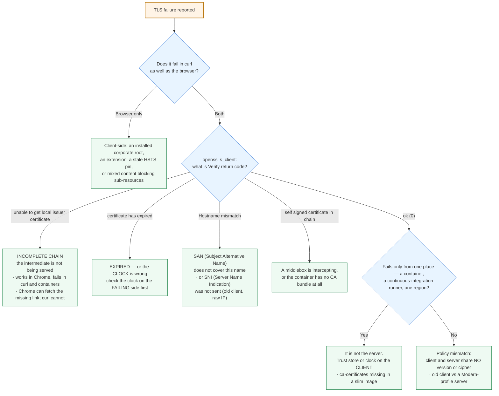

# M02 · Ch3 · §2 — TLS in operation: renewal, policy, performance, and the 3 a.m. failure

> **Module:** Networking & The Web
> **Chapter:** TLS & secure transport
> **Section:** §1 was the **trust model** — what HTTPS guarantees and why. This section is the **operations**:
> the certificate **lifecycle** (why the industry replaced "renew it annually" with an automated loop, and
> what **ACME** — Automated Certificate Management Environment — actually does on the wire), **HSTS** (HTTP
> Strict Transport Security) and the preload list, **version and cipher policy** you can defend, the
> **performance** side (session resumption, **0-RTT** — zero round-trip time — early data, **OCSP** — Online
> Certificate Status Protocol — stapling, and which of these actually removes a round-trip), **mTLS** (mutual
> TLS) between your own services, and a **debugging method** for the failure that takes production down.
> The load-bearing idea, inherited straight from §1 §11b: **certificate security rests on a short exposure
> window, not on detection or revocation — so automation is a security control, not a convenience.**
> **Status:** ✅ finalized 2026-09-16 (body prepared 2026-09-05). No questions on the body — it landed.
> The session was **one thread, aimed straight at §4's "one-way door" warning**: having accepted that
> *removal* from the preload list must ship in a browser release and then reach users, he turned the same
> propagation lag around and pointed it at the other end — *"what happens if `preload` is already in the
> header but a user has not yet upgraded to a browser carrying the new list?"* **§12** works it: the
> `preload` token is **consent, not a mechanism**, so adding it is **purely additive** and a stale browser
> is never worse off — while the same lag in the *removal* direction enforces a rule you have already
> revoked, against users you cannot reach. Plus the second pin people forget: the per-user dynamic HSTS
> cache, which no list removal touches.
> **Prerequisites:** §1 of this chapter (the three guarantees, the handshake, the chain of trust, the three
> termination arrangements) — this section assumes all of it. Ch1 §1 and §5 for the round-trip budget the
> performance section spends. Ch2 §1's idempotency taxonomy returns, load-bearing, in §6.

**Estimated study time:** 3–3.5 hours including the hands-on.

---

## Why this section exists — and how it's pitched

Almost nobody is taken down by cryptography. They are taken down by **a certificate that expired on a
Sunday**, by **a chain that works in Chrome and fails inside a container**, by **an HSTS header with
`preload` on it that they cannot take back**, and by **a TLS policy nobody has revisited since 2019**.

§1 ended on a finding worth restating, because this whole section is its consequence: **revocation barely
works and detection barely works.** What actually keeps the system standing is that the **exposure window is
short** and the key is **hard to extract**. Both of those are operational properties. That reframes
everything below — automated renewal is not devops hygiene you do because manual renewal is annoying. It is
the mechanism that makes the security model true.

So this section is pitched as **the operator's half of §1**. Where §1 asked *what does this guarantee*, this
one asks *what do I have to run, and what will break*.

---

## 1. The lifecycle is the unit, not the certificate

The instinct is to think of a certificate as a **thing you obtain**. Operationally it is a **loop you run**:

```
generate key pair → prove control of the name → receive signed certificate
   → deploy it to every termination point → renew well before expiry → repeat
```

Every incident is a break in that loop, and they are worth naming separately because they have different
fixes:

| Break | What it looks like | The fix |
|---|---|---|
| Nobody renewed | Site down, browser interstitial, and it is **always** a weekend | Automation with monitoring on top |
| Renewed but not deployed | New certificate in the store, old one still being served | Reload/restart step in the same automation |
| Deployed to *one* termination point | Works via the CDN, broken on the direct origin hostname | Inventory every hop that terminates TLS (§1 §7) |
| Renewal automation broke silently | Fine until the day it expires | Alert on **days-to-expiry**, never on "did the job exit 0" |

That last row is the one to internalize. **Monitor the property, not the process.** A renewal cron job that
has been failing for 80 days looks identical to one that has been working, right up until it doesn't. The
check that catches it is the one that connects to the live endpoint and asks *how many days are left*.

**Why certificate lifetimes keep shrinking.** Certificates were once issued for 3–5 years. The CA/Browser
Forum has driven that down repeatedly — 825 days, then 398 days (2020), and a ratified schedule takes it to
**roughly 47 days by 2029**. Each cut was resisted by operators and pushed by browser vendors, and the
argument was always §1 §11b's: since a compromised key cannot be reliably detected *or* revoked, the only
control left is **how long a stolen key stays useful**. The side effect is the real point — **at 47 days,
manual renewal is not merely tedious, it is impossible**, which forces the automation that also fixes the
expiry outages. Shortening lifetimes was a way of making everyone automate.

> **The mental shift:** a long-lived certificate is not "one less thing to do." It is a **longer window in
> which a leak you cannot detect remains exploitable**, plus an annual manual ritual you will eventually
> forget. Short + automated is strictly safer on both counts.

---

## 2. ACME — how automated issuance actually works

**ACME** (Automated Certificate Management Environment, RFC 8555) is the protocol behind Let's Encrypt and
now most other CAs (Certificate Authorities). It automates exactly the step that used to require a human: **proving you control the
name**.

The proof is a **challenge**. The CA says *"if you really control `example.com`, make this specific thing
appear where only its controller could put it."* Three challenge types matter:

| Challenge | What you must do | Use it when |
|---|---|---|
| **`http-01`** | Serve a token at `http://example.com/.well-known/acme-challenge/<token>` | The simplest case: a public web server on port 80 |
| **`dns-01`** | Publish a `TXT` record at `_acme-challenge.example.com` | **Wildcards** (`*.example.com`) — this is the only option — and hosts with no public port 80 |
| **`tls-alpn-01`** | Answer a TLS handshake on port 443 with a special **ALPN** protocol | Port 443 only; used by proxies that already own the socket |

<!-- DIAGRAM:START -->


<details>
<summary>Diagram source (Mermaid)</summary>



</details>
<!-- DIAGRAM:END -->

**Four things worth noticing in that flow:**

1. **The private key never goes to the CA.** Step 6 sends a **CSR** (Certificate Signing Request) containing
   the *public* key and a self-signature proving you hold the private one. This is §1's claim/proof split
   showing up again at issuance time.
2. **The CA validates from the public internet.** `http-01` fails behind a VPN (virtual private network), a firewall, or an
   allowlist — a common first-time surprise. `dns-01` does not, which is one reason it is the more robust
   default for anything internal.
3. **`dns-01` requires giving the client credentials to your DNS zone.** That is a real privilege to hand
   out; scope the API token to the `_acme-challenge` records if the provider allows it.
4. **Step 8 is where teams actually fail.** Obtaining the certificate is not deploying it. A renewal that
   writes new files but never reloads nginx leaves the old certificate in memory until something restarts —
   possibly weeks later, possibly after expiry.

**Renew at about one third of the lifetime remaining, not at the last minute** — 30 days out on a 90-day
certificate. That is not superstition: it buys you **many retries**, so a CA outage, a rate limit, or a
broken deploy costs you an alert instead of an incident.

---

## 3. Who owns the renewal — mapping §1's termination points

§1 §7 established that TLS terminates *somewhere*, and possibly more than once. Renewal ownership follows
termination exactly — and the branch you land in decides how much of §1 you have to run yourself
(a managed edge such as CloudFront or an **ALB** — Application Load Balancer — runs most of it for you): **whoever terminates TLS must hold a valid certificate and must renew it.**

<!-- DIAGRAM:START -->


<details>
<summary>Diagram source (Mermaid)</summary>



</details>
<!-- DIAGRAM:END -->

**The managed option is usually correct, and the reason is §1 §11b.** ACM (AWS Certificate Manager) will not
let you export the private key for certificates it issues for AWS services. That reads as a limitation and
is in fact the strongest available property: **a key you cannot export is a key that cannot be copied off
the box** — the same argument as an HSM (Hardware Security Module), delivered as a default. You give up
portability and gain non-extractability. For an origin you control end-to-end, that is a good trade.

**The trap that survives all three branches** is the red box: **each termination point is a separate
certificate with a separate expiry.** The classic outage is a perfectly renewed edge certificate in front of
an origin certificate that expired — and if the edge is configured to not verify the origin (Cloudflare's
"Flexible"/"Full" modes, §1 §7's footgun), it may not even fail loudly. It just quietly stops being secure.

---

## 4. HSTS — closing the gap before the first HTTPS request

There is a hole §1 did not close. A user types `example.com`. The browser has no scheme, so it tries
**`http://`** first, and your server answers `301 → https://`. The redirect works — but **that first request
went out in plaintext**, and an attacker on the path can intercept it and simply never let the upgrade
happen (**SSL (Secure Sockets Layer) stripping**). Everything §1 promised is bypassed by never starting TLS at all.

**HSTS (HTTP Strict Transport Security)** closes it with one response header:

```http
Strict-Transport-Security: max-age=31536000; includeSubDomains; preload
```

It means: *for the next `max-age` seconds, never speak plaintext to this host again.* The browser rewrites
`http://` to `https://` **internally, before any packet leaves**, and it **refuses click-through** on
certificate errors for this host — no "Advanced → Proceed anyway."

Three directives, three distinct commitments:

- **`max-age`** — how long the browser remembers. One year (31536000) is standard. Start small (a few
  minutes) while you verify, then raise it.
- **`includeSubDomains`** — covers every subdomain, including ones you forgot. This is what breaks people:
  an internal `legacy.example.com` still on plaintext becomes unreachable in every browser that has seen the
  header.
- **`preload`** — see below. **This one is close to irreversible.**

**The trust-on-first-use gap, and the preload list.** HSTS only protects a browser that has *already seen the
header at least once*. The genuine first visit is still exposed. The fix is the **HSTS preload list**: a set
of hostnames **compiled into the browser binary** (Chrome maintains it; Firefox, Safari and Edge consume it),
so the browser refuses plaintext to your domain **before it has ever contacted you**.

> **Preload is a one-way door, and this is the single most important operational warning in the section.**
> Getting on takes weeks. Getting *off* takes **months** — the removal has to ship in a browser release and
> then reach users, and old browser builds keep enforcing it for as long as they exist. Requirements: a valid
> certificate, redirect all HTTP to HTTPS, serve the header on the apex with `includeSubDomains` and
> `max-age` of at least one year, and every subdomain must be HTTPS-capable — **forever**. Do not add
> `preload` to a header "to be thorough." Add it when you have decided, deliberately, that this domain and
> everything under it is HTTPS-only permanently.

**Related headers, briefly** (each gets real treatment in **M10**): `Content-Security-Policy` with
`upgrade-insecure-requests` for **mixed content** — the sub-resource loaded over `http://` inside an HTTPS
page, which browsers block and which is a common cause of "the page half-works"; and `Expect-CT`, now
retired, since Certificate Transparency enforcement became unconditional.

---

## 5. Version and cipher policy — a decision you can defend

Two knobs, and §1's lesson applies to both: **TLS 1.3 got safer by removing choices**, so your policy should
remove choices too.

**Protocol versions:**

| Version | Status | What to do |
|---|---|---|
| SSL 2.0 / 3.0 | Broken (POODLE) | Disabled; has been for years |
| TLS 1.0 / 1.1 | Deprecated (RFC 8996, 2021); browsers removed support in 2020 | **Disable**, unless a specific legacy client forces otherwise |
| **TLS 1.2** | Fine **with a good cipher list** | Keep — still needed by some clients and libraries |
| **TLS 1.3** | Preferred | Enable everywhere; prefer it |

**Ciphers.** In TLS 1.2 the cipher suite names a whole bundle (key exchange, authentication, bulk cipher,
MAC — Message Authentication Code) and the list is long, ordered, and full of traps. In **TLS 1.3 the
problem largely disappeared**: only five suites exist, all **AEAD** (Authenticated Encryption with Associated
Data), all forward-secret, and key exchange is negotiated separately. The version upgrade *is* the cipher
cleanup.

**Do not hand-write a cipher string.** Use **Mozilla's Server Side TLS** generator, which publishes three
maintained profiles:

- **Modern** — TLS 1.3 only. Correct for internal services and APIs with known clients.
- **Intermediate** — TLS 1.2 + 1.3, forward-secret suites only. **The default for a public website.**
- **Old** — only if you have a documented, named client that forces it. It has a stated cost.

The judgment is not "which ciphers are good" — that question has a maintained answer you should copy. The
judgment is **which client population you must serve**, and that is a product decision. Pick the profile,
record *why* in the repo next to the config, and re-check it yearly.

**Where this bites in your world:** an API served only to your own frontend and backend can be **Modern /
TLS 1.3 only** with no cost at all. A public marketing site cannot. Different endpoints on the same domain
can legitimately have different profiles.

---

## 6. Performance — which fixes actually remove a round-trip

§1 priced the TLS 1.3 handshake at **one round-trip** on top of TCP's one. On the cross-ocean path from
Ch1 §1 that is real money. Three mechanisms are sold as the fix, and **they are not equivalent**.

<!-- FIGURE:START -->


<details>
<summary>Figure source (matplotlib)</summary>

`diagrams/02-tls-in-operation-figures.py` — same 160 ms round-trip as Ch1 §1, Ch2 §2 and Ch3 §1, so all four
figures are directly comparable.

</details>
<!-- FIGURE:END -->

**Session resumption (TLS 1.3 PSK — Pre-Shared Key).** After a successful handshake the server issues one or
more **session tickets**. On a later connection the client presents a ticket and both sides skip the
certificate exchange and the signature. Read the second bar carefully: **it is still a 1-RTT handshake.**
Resumption removes the **CPU** cost — the asymmetric signature and verification, which is the expensive part
on a busy server — and shrinks the bytes on the wire. It does **not** remove the round-trip. This is the
most commonly overstated TLS optimization, and the figure exists to make the point stick.

- Operational note: with multiple servers behind a load balancer, tickets only work if all of them share the
  **ticket encryption key** — and that key must itself be **rotated** (typically daily). A ticket key that is
  never rotated undermines forward secrecy (§1 §5) for resumed sessions, because one stolen key decrypts a
  long history of them. This is a genuine, quiet, real-world defect.

**0-RTT early data.** The client sends application data **with** the ClientHello, using a key derived from
the previous session. Setup cost goes to zero. The catch is the one §1 already taught: **early data is
replayable.** An on-path attacker can capture and re-send it, and the server cannot distinguish the copy.
So the rule is **Ch2 §1's taxonomy, doing load-bearing work**: 0-RTT may carry **idempotent** requests only —
`GET`, `HEAD` — and never a `POST` that charges a card. This is why it is off by default in most stacks, and
why enabling it is an application-level decision, not a server-config one.

**QUIC / HTTP/3.** The structurally better answer, and Ch2 §3 already set it up: QUIC **merges the transport
and cryptographic handshakes into the same round-trip**, so a first visit costs *one* trip instead of two,
and resumption costs zero. The gain is not a tuning parameter — it is the protocol design.

**OCSP stapling.** §1 noted that OCSP is a privacy leak and a latency hit and that browsers soft-fail it.
**Stapling** fixes the first two: *your server* fetches the signed freshness proof from the CA periodically
and **staples** it into the handshake, so the client never contacts the CA. It costs the client nothing.
Enable it — but know the failure mode: if your server cannot reach the responder and you have also enabled
**`must-staple`** on the certificate, clients now **hard-fail**. That is a stronger security posture and a
genuine availability risk, which is why `must-staple` stays rare.

**And the honest hierarchy:** look again at the last bar. **The connection you never had to open costs
nothing at all.** Keep-alive, connection pooling, and HTTP/2 or HTTP/3 multiplexing beat every handshake
optimization on this list — which is exactly Lever 1 from M01 Ch4 §3 (*amortize the setup*), and exactly what
the cold-start investigation in that section found. **Handshake tuning is what you do after connection reuse,
not instead of it.**

---

## 7. mTLS — authenticating your own services

§1 introduced **mTLS** (mutual TLS): the client also presents a certificate, so **both** ends are
authenticated. Normal TLS authenticates the server to the client only.

**Where it belongs.** Between **your own services**. It is the one structural answer to Ch2 §1 §10c's
*never trust the client*: you cannot authenticate the public — anyone can install your certificate — but you
absolutely can authenticate a service you deploy. Service A holds a certificate saying *"I am the checkout
service"*; service B verifies it against an **internal CA** and rejects everything else. Compare that to a
shared API key in an environment variable: the key is a bearer token that works from anywhere it leaks, does
not expire, and appears in logs.

**Where it does not belong.** Public-facing user authentication. Client certificate provisioning to real
users is an enrolment and support burden that has failed every time it has been tried at consumer scale
(browser UX for selecting a client certificate is genuinely bad). Sessions, tokens and OAuth — **M10 Ch3** —
are the answer there.

**The hard part is not the handshake; it is rotation.** Now *every service* has a certificate lifecycle from
§1, with short lifetimes, and there are hundreds of them. This is precisely the problem **service meshes**
(Istio, Linkerd) and **SPIFFE/SPIRE** exist to solve: an internal CA plus a sidecar or agent that issues,
rotates (often hourly), and verifies identities automatically. If you find yourself hand-managing service
certificates, the tooling gap is the signal, not the effort.

**A useful middle position** for a small system: run mTLS on the internal hop only (the load balancer to
origin hop from §1 §7), with an internal CA, and keep public traffic on ordinary TLS plus tokens.

---

## 8. Debugging TLS failures — a method, not a list

Almost every TLS failure is one of six things. The value is in **isolating which one before changing
anything**, because the symptoms overlap badly.

<!-- DIAGRAM:START -->


<details>
<summary>Diagram source (Mermaid)</summary>



</details>
<!-- DIAGRAM:END -->

**The two commands that answer almost everything:**

```console
$ openssl s_client -connect example.com:443 -servername example.com </dev/null
$ curl -vI https://example.com
```

**And the four rules that shorten every one of these investigations:**

1. **"Works in Chrome" proves nothing about your chain.** Chrome and Safari can fetch a missing
   intermediate on their own (via the leaf's Authority Information Access field); `curl`, Java, Go, Python
   and most containers **cannot**. An incomplete chain is therefore invisible in a browser and fatal
   everywhere else. **Test with `openssl`/`curl`, not with your browser.**
2. **Check the clock on the side that is failing.** A container with drifted time reports *expired* for a
   perfectly valid certificate. It looks like a certificate problem and is not.
3. **Slim base images ship no CA bundle.** `alpine`, `distroless` and `scratch` need `ca-certificates`
   installed explicitly. The error says *self-signed certificate in chain* even though nothing is
   self-signed — the client has **no root store at all** (§1 §4: the root store *is* the trust anchor).
4. **`curl -k` and `verify=False` are for the diagnosis, never the fix.** They disable §1's third
   guarantee — authentication — and therefore silently disable the other two. Every one of them in shipped
   code is a permanent, invisible MITM (man-in-the-middle) hole. Find them and remove them; they are usually
   a five-year-old debugging shortcut.

---

## 9. Failure modes — the operational checklist

| # | Failure | Why it happens | What to do |
|---|---|---|---|
| 1 | **Expiry outage** | Manual renewal, or automation that broke silently | Automate with ACME; **alert on days-to-expiry from the live endpoint**, at 21 and 7 days |
| 2 | **Renewed, not reloaded** | New file on disk, old certificate in memory | Reload hook inside the renewal job; verify on the wire afterwards |
| 3 | **One hop forgotten** | Edge renewed, origin not (§3) | Inventory every termination point; monitor each hostname separately |
| 4 | **Incomplete chain** | Intermediate not served | Test with `openssl`, never only a browser (§8) |
| 5 | **`preload` added casually** | Copied a "best practice" header | Treat preload as permanent; never ship it without a decision |
| 6 | **`includeSubDomains` breaks internal hosts** | A plaintext legacy subdomain | Audit every subdomain **before** adding the directive |
| 7 | **Ticket key never rotated** | Default config, multi-server deployment | Rotate ticket keys daily; it is a forward-secrecy hole (§6) |
| 8 | **0-RTT enabled globally** | Turned on as a "speed" setting | Restrict to idempotent methods, or leave it off (§6) |
| 9 | **`must-staple` + unreachable responder** | Stronger posture, harder failure | Only with monitoring on the stapling path |
| 10 | **Legacy TLS still enabled** | Config never revisited | Mozilla Intermediate as the floor; recheck yearly (§5) |
| 11 | **Verification disabled in code** | A debugging shortcut that shipped | Grep for `-k`, `verify=False`, `InsecureSkipVerify`, `rejectUnauthorized: false` |
| 12 | **Wildcard certificate everywhere** | Convenient single certificate | One key compromise covers every subdomain; prefer per-service certificates where automation allows |

---

## 10. Check your understanding

1. Certificate lifetimes are heading toward roughly 47 days. Give the **security** argument and the
   **operational** argument, and explain why the second is arguably the intended effect.
2. Your renewal cron job has exited 0 every night for three months, and the site went down this morning on
   an expired certificate. What are two distinct things that could have happened, and what single monitoring
   change catches both?
3. Why is `dns-01` the only challenge type that can issue a wildcard certificate, and what privilege does
   using it require you to hand over?
4. A colleague adds `preload` to the HSTS header during a security review. What do you say, and what
   specifically must be true before it is safe?
5. Session resumption is described in a blog post as "removing a round-trip." Correct the claim precisely,
   and state what resumption *does* save.
6. Under what conditions is 0-RTT early data safe, and which chapter's taxonomy answers that question?
7. A service works from your laptop and fails inside a slim container with *self-signed certificate in
   chain*, although nothing in the chain is self-signed. What is happening, and which §1 concept explains it?
8. Your API is consumed only by your own frontend and your own backend jobs. Which Mozilla profile should it
   use, and why is the answer different for the marketing site on the same domain?
9. Why is mTLS a good answer for service-to-service authentication and a poor one for end users — and what
   is the hard part of running it?
10. An edge certificate is auto-renewed and healthy, but the origin certificate expired last week and no
    alarm fired. Give one configuration that would make this fail loudly and one that would hide it.

<details>
<summary>Answers</summary>

1. **Security:** a compromised private key can be neither reliably **detected** (§1 §11b) nor reliably
   **revoked** (CRLs — Certificate Revocation Lists — are huge, and OCSP is soft-failed), so the only remaining control is **how long a stolen
   key stays useful** — and that is exactly the certificate's lifetime. **Operational:** at 47 days manual
   renewal is not merely tedious, it is **impossible** — roughly eight renewals a year per hostname.
   That is arguably the intended effect: shortening lifetimes is how the ecosystem **forces automation**,
   and automation then also eliminates the expiry outages that manual processes cause. The security
   argument justifies it; the forced automation is the larger practical win.
2. Two distinct failures: **(a)** the job renewed the certificate but never **reloaded** the server, so the
   old certificate stayed in memory; **(b)** the job "succeeded" while the *renewal itself* failed — a CA
   rate limit, a failed challenge, or a write to the wrong path — because the exit code reflects the script
   running, not the certificate being valid. The single change that catches both: **stop monitoring the
   process and monitor the property** — connect to the **live endpoint** and alert on **days-to-expiry**
   (at 21 and 7 days). That check is blind to how the certificate got there, which is precisely why it
   catches every way the loop can break.
3. A wildcard covers **arbitrary, unbounded subdomain names**. `http-01` and `tls-alpn-01` prove control of
   **one specific host** by answering on it — and you cannot answer on *every* name matching
   `*.example.com`, because the set is infinite and unknown. `dns-01` instead proves control of the
   **zone** by publishing a `TXT` record at `_acme-challenge.example.com`, and zone control is exactly the
   authority a wildcard represents. The privilege required: **write access to your DNS zone**, handed to
   the ACME client — a significant credential. Scope the API token to the `_acme-challenge` records if
   the provider supports it.
4. **Say: take it back out unless we are making a deliberate, permanent decision.** `preload` is a
   **one-way door** — entry takes weeks, removal takes **months**, because it has to ship in a browser
   release and reach users, and old browser builds keep enforcing it regardless. What must be true first:
   a valid certificate; **all** HTTP redirected to HTTPS; the header served on the **apex** with
   `includeSubDomains` and `max-age` of at least one year; and **every subdomain HTTPS-capable, forever** —
   including internal and legacy ones nobody has audited. The failure mode is that a plaintext
   `legacy.example.com` becomes unreachable in every browser, and you cannot quickly undo it.
5. **Precise correction:** TLS 1.3 session resumption is **still a 1-RTT handshake** — the client sends a
   PSK (Pre-Shared Key) identity in the ClientHello and waits for the server's response before sending
   application data. It removes **no round-trip**. What it *does* save is the **asymmetric work**: no
   certificate is transmitted, and no signature is generated or verified — which is the expensive part on a
   busy server — plus a meaningful number of bytes. So it is a **CPU and bandwidth** optimization, not a
   latency one. The mechanisms that genuinely remove trips are **0-RTT**, **QUIC**, and **keeping the
   connection open**.
6. Safe **only when the request is idempotent** — `GET`, `HEAD`, or anything else whose repetition is
   harmless — because early data carries no liveness guarantee and can be **captured and replayed**, and
   the server cannot distinguish the replay from the original. The taxonomy that answers it is **Ch2 §1's
   safe / idempotent / cacheable** classification: this is a case where a piece of HTTP *semantics* decides
   whether a *transport* feature may be turned on, which is why enabling 0-RTT is an application decision
   rather than a server-config toggle.
7. The container has **no root store at all** — slim images (`alpine`, `distroless`, `scratch`) ship
   without `ca-certificates`. With no trusted roots, chain-building terminates at a certificate that
   nothing vouches for, and OpenSSL reports that as *self-signed certificate in chain*; the error blames
   the server for a condition the **client** is in. The §1 concept: **the root store shipped with the
   client is the trust anchor** — trust does not come from the network, so a client with an empty anchor
   set can verify nothing. Fix by installing `ca-certificates` in the image.
8. The internal API can be **Modern** — **TLS 1.3 only** — at **zero cost**, because you control every
   client and can upgrade them; you get the shortest, safest configuration with the fewest negotiable
   options (§1's *TLS 1.3 got safer by removing choices*). The marketing site cannot: its client
   population is **the public**, including old Android devices, corporate middleboxes and embedded
   browsers, so it needs **Intermediate** (TLS 1.2 + 1.3, forward-secret suites only). The difference is
   not technical taste — it is **which client population you are obliged to serve**, which is a product
   decision. Two endpoints on the same domain can legitimately hold different profiles.
9. **Good for services** because you can actually provision and rotate credentials for something you
   deploy: service A proves *"I am the checkout service"* cryptographically, and B rejects everything else
   — strictly better than a shared API key, which is a bearer token that works from anywhere it leaks,
   never expires, and shows up in logs. It is the one structural answer to Ch2 §1 §10c's *never trust the
   client*: you cannot authenticate the public, but you can authenticate your own code. **Poor for end
   users** because certificate enrolment, device changes and recovery are a support burden, and browser UX
   for choosing a client certificate is genuinely bad — sessions/tokens/OAuth (M10 Ch3) are the answer
   there. **The hard part is rotation**, not the handshake: every service now carries §1's full lifecycle
   at short lifetimes, times hundreds of services — which is exactly what service meshes (Istio, Linkerd)
   and SPIFFE/SPIRE exist to automate.
10. **Fails loudly:** configure the edge to **verify the origin certificate** (full/strict origin TLS, or
    re-encryption with verification enabled) — the origin's expiry then breaks the edge→origin hop
    immediately and visibly; add a **separate expiry monitor per termination point**, targeting the origin
    hostname directly rather than the public one. **Hides it:** any mode where the edge does **not**
    verify the origin — Cloudflare "Flexible" (edge→origin in **plaintext**) or "Full" without validation,
    or an ALB target group with verification off. The padlock keeps showing, users see nothing, and the
    hop has quietly stopped being authenticated — the §1 §7 footgun, with the added twist that the
    *failure of a security property produced no failure of the service*, so nothing pages you.

</details>

---

## 11. Optional: get your hands dirty (40–50 min)

1. **Inventory your own expiries.** For every hostname you operate, print days remaining:
   ```console
   $ echo | openssl s_client -connect example.com:443 -servername example.com 2>/dev/null \
       | openssl x509 -noout -enddate
   ```
   Wrap it in a loop over a hostname list. This is the monitoring check from §1 in ten lines.
2. **Prove the chain is complete** — the browser cannot tell you this:
   ```console
   $ curl -vI https://example.com 2>&1 | grep -i "SSL certificate verify"
   $ openssl s_client -connect example.com:443 -servername example.com </dev/null 2>/dev/null | grep "Verify return code"
   ```
   Then try `https://incomplete-chain.badssl.com` with both `curl` and a browser and watch them **disagree**.
3. **Observe resumption on the wire.** Run `openssl s_client -connect example.com:443 -servername example.com
   -reconnect </dev/null 2>&1 | grep -i "reused\|New,"` and count how many handshakes say *Reused*.
4. **Read your own HSTS posture.** `curl -sI https://example.com | grep -i strict` — check `max-age`, and
   decide honestly whether `includeSubDomains` is currently true of every subdomain you own.
5. **Break a container's trust store.** In a `python:3-alpine` container, `pip install requests` and fetch an
   HTTPS URL with and without `ca-certificates` installed. Read the error text carefully — it will accuse the
   server of something the client is guilty of.
6. **Check your policy.** Run one of your endpoints through **SSL Labs** (public) or `testssl.sh` (works
   internally) and compare the result against the Mozilla profile you *intended* to be on.

Deliverable: a one-page runbook for one service — every hostname that terminates TLS, who renews each, the
current expiry, the Mozilla profile in force, and the alert that would page you 21 days early.

---

## 12. Applied — the question from the session

One thread, and it went straight at the **one-way door** warning in §4. Having accepted that removal from
the preload list has to ship in a browser release and then reach users, he turned the same lag around and
pointed it at the *other* end: **"what happens if `preload` is already in the header, but a user hasn't yet
upgraded to a browser release that carries the new list?"**

It is the right question to ask of any claim that rests on client-side propagation, and the answer is the
opposite of the intuition: **nothing bad happens, and the asymmetry between the two directions is the whole
lesson.**

### 12a. The `preload` token does nothing on its own

**No browser acts on the token.** It is **consent, not a mechanism** — `hstspreload.org` requires it so a
domain cannot be submitted by someone who does not control it, and so your intent is recorded in the header
itself rather than only in a form. The enforcement lives entirely in the **list compiled into the browser
binary** (§4).

So for a user whose browser predates your list entry:

| | In that user's browser |
|---|---|
| Static preload entry for your domain | **Absent** — no first-visit protection |
| `max-age` and `includeSubDomains` from your header | **Fully honored**, as ordinary dynamic HSTS |

They land in exactly the trust-on-first-use case §4 describes. The first request can still leave as
plaintext and is strippable; but once they have received the header over HTTPS **even once**, the browser
pins the domain for `max-age` and refuses click-through on certificate errors. That is precisely the
protection they would have had if you had never added `preload` at all.

**Adding `preload` is purely additive.** A lagging browser is never *worse off* for it — it simply has not
yet gained the extra first-visit coverage. The token costs a stale client nothing.

### 12b. The lag only hurts in the other direction — and that is why §4 is worded as it is

The two directions are not mirror images, and this is the part worth carrying:

- **Getting on:** the lag costs you a **benefit you do not have yet**. Harmless, and it resolves itself.
- **Getting off:** the lag keeps enforcing **a rule you have already revoked**. Removal ships in a new
  browser release, and every user still on an older build goes on refusing plaintext to your domain with
  **no channel by which you can reach them**. You cannot serve a header that says *never mind*, because a
  preloaded entry is enforced **whether or not you send a header at all** — that is the entire point of
  preloading, and it is exactly what makes it unrevocable.

For most consumer Chrome installs that lag is weeks, since it auto-updates. **The tail is what bites:**
enterprise-pinned builds, abandoned installs, and embedded webviews on old mobile devices.

### 12c. The second pin, which is the one people forget

Even once you are off the static list you are still not clear, because **two independent mechanisms** hold
you, and list removal only touches one:

1. the **static list** compiled into the binary, and
2. the **dynamic HSTS cache** in each individual browser — written from your own header, good for the full
   `max-age` you advertised.

If you advertised a year, then everyone who visited you carries a year of pinning that no list removal
affects. To genuinely unwind you must serve `Strict-Transport-Security: max-age=0` **over working HTTPS**
for at least as long as the old `max-age`, so that each returning visitor's cached entry is overwritten —
and **a user who never returns during that window stays pinned indefinitely.**

**The keeper, and it generalizes past HSTS.** The recovery path *depends on users coming back to you* —
which is exactly what you have lost control of if the thing you are trying to undo is what broke their
access. That circularity is why §4's rule is **decide before you ship it**, not *ship it and revisit*: a
control whose rollback requires the cooperation of the people it is currently locking out is not really
reversible, however documented the removal procedure looks. It is the same shape as §1 §11b's finding —
when the defence you are relying on (there: revocation and detection; here: removal) does not work in
practice, what actually protects you is **not entering the bad state in the first place**.

---

## Key terms (English · 大陆 简体 · 台灣 繁體)

| English | 大陆 (简体) | 台灣 (繁體) | Note |
|---|---|---|---|
| Certificate lifecycle / renewal | 证书生命周期 / 续期 | 憑證生命週期 / 更新 | ⚠ 证书 ↔ 憑證; 续期 ↔ 更新 |
| Certificate Signing Request (CSR) | 证书签名请求 | 憑證簽章請求 | ⚠ 签名 ↔ 簽章 (§2) |
| Challenge (ACME) | 质询 / 验证挑战 | 質詢 / 驗證挑戰 | proof of name control (§2) |
| Wildcard certificate | 通配符证书 | 萬用字元憑證 | ⚠ genuine split: 通配符 ↔ 萬用字元 |
| HTTP Strict Transport Security (HSTS) | HTTP 严格传输安全 | HTTP 嚴格傳輸安全 | script only (§4) |
| Preload list | 预加载列表 | 預載清單 | ⚠ 列表 ↔ 清單; near-irreversible (§4) |
| SSL stripping | SSL 剥离攻击 | SSL 剝離攻擊 | the attack HSTS closes (§4) |
| Mixed content | 混合内容 | 混合內容 | script only |
| Cipher suite | 密码套件 | 密碼套件 | ⚠ 密码 ↔ 密碼 |
| Session resumption / ticket | 会话恢复 / 会话票据 | 工作階段恢復 / 票證 | ⚠ genuine split: 会话 ↔ 工作階段 |
| Zero round-trip time (0-RTT) / early data | 零往返 / 早期数据 | 零往返 / 提前資料 | ⚠ 数据 ↔ 資料; replayable (§6) |
| OCSP stapling | OCSP 装订 | OCSP 裝訂 | server fetches the freshness proof (§6) |
| Mutual TLS (mTLS) | 双向 TLS | 雙向 TLS | service-to-service (§7) |
| Trust store / CA bundle | 信任库 / 根证书包 | 信任存放區 / 根憑證套件 | ⚠ genuine split (§8) |
| Runbook | 运行手册 / 应急手册 | 維運手冊 | ⚠ 运维 ↔ 維運 |
| Trust on first use (TOFU) | 首次使用信任 | 首次使用信任 | the gap preload closes (§4, §12a) |
| Dynamic vs static (preloaded) HSTS | 动态 / 静态（预载）HSTS | 動態 / 靜態（預載）HSTS | ⚠ 预载 ↔ 預載; two independent pins (§12c) |

---

## References

- RFC 8555 — *Automatic Certificate Management Environment (ACME)* (the protocol in §2) —
  <https://www.rfc-editor.org/rfc/rfc8555.html>
- Let's Encrypt — *Challenge Types* (the clearest comparison of `http-01` / `dns-01` / `tls-alpn-01`) —
  <https://letsencrypt.org/docs/challenge-types/>
- Mozilla — *Server Side TLS* + the configuration generator (the §5 profiles you should copy rather than
  hand-write) — <https://wiki.mozilla.org/Security/Server_Side_TLS> ·
  <https://ssl-config.mozilla.org/>
- MDN — *Strict-Transport-Security* (§4, including the preload caveats) —
  <https://developer.mozilla.org/en-US/docs/Web/HTTP/Headers/Strict-Transport-Security>
- **hstspreload.org** — the submission form and, importantly, the removal process — read both before
  shipping `preload` — <https://hstspreload.org/>
- Cloudflare Learning — *What is 0-RTT?* and the replay-attack discussion (§6) —
  <https://www.cloudflare.com/learning/ssl/what-happens-in-a-tls-handshake/>
- AWS — *AWS Certificate Manager* user guide (§3: managed renewal, the non-exportable key, and the
  us-east-1 requirement for CloudFront) — <https://docs.aws.amazon.com/acm/latest/userguide/acm-overview.html>
- cert-manager — the Kubernetes ACME controller (§3) — <https://cert-manager.io/docs/>
- SPIFFE — workload identity, the rotation answer in §7 — <https://spiffe.io/docs/latest/spiffe-about/overview/>
- **testssl.sh** (works against internal endpoints, unlike SSL Labs) — <https://testssl.sh/>

### What's next

This closes the operational half of TLS. **Ch3 is complete** with §1 (the trust model) and §2 (running it).

Next in the module: **Ch4 — Real-time: REST vs WebSockets vs SSE (Server-Sent Events) vs long-polling** —
the closest chapter to your arena work, teed up twice already (Ch2 §3 §11b's SSE-versus-WebSocket trade-off,
and Ch2 §1's request/response model as the thing real-time protocols depart from).

Deferred deliberately, with a pointer so nothing is silently dropped: **cryptography internals** (hashing vs
encryption, signing, key management, and what an HSM actually does) are **M03 Ch2**; **authentication and
authorization** (sessions, JWT — JSON Web Token — OAuth/OIDC — OpenID Connect — API keys, and RBAC — role-based access control) — the application-security programme that HTTPS
explicitly does *not* give you — is **M10 Ch3**; and **CSP (Content Security Policy), mixed content and the browser security model**
are **M10** as well.
