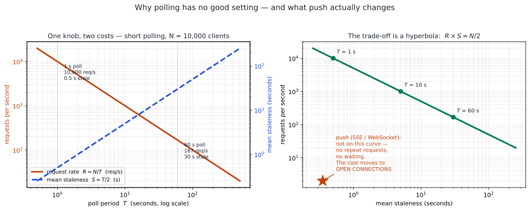
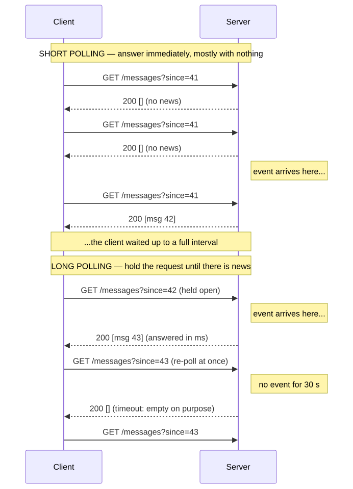
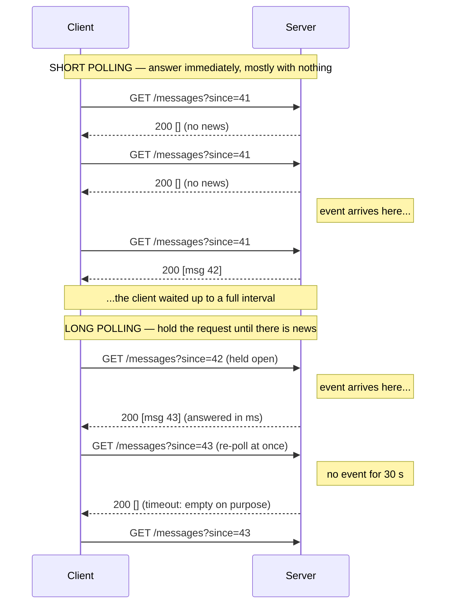
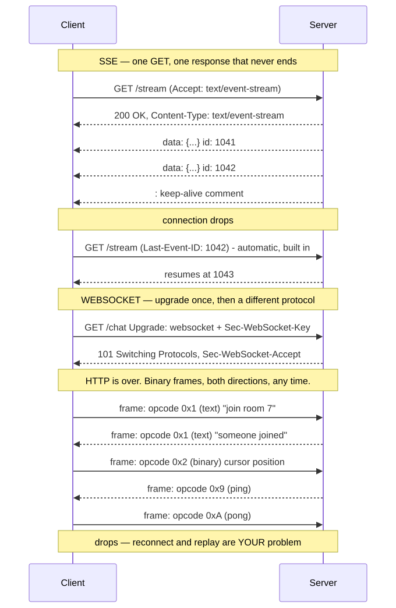
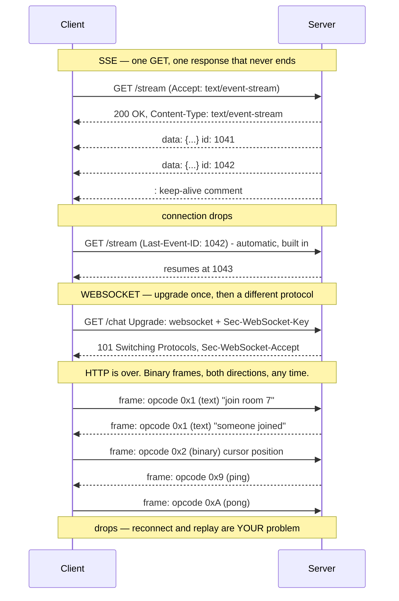
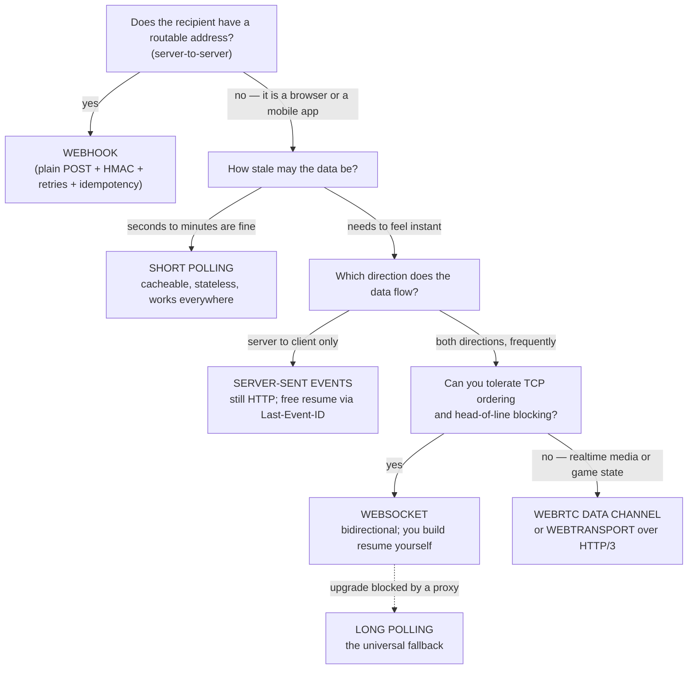

# M02 · Ch4 · §1 — Pushing data to the client: polling, long-polling, SSE and WebSockets

> **Module:** Networking & The Web
> **Chapter:** Real-time — REST vs WebSockets vs SSE (Server-Sent Events) vs long-polling
> **Section:** This chapter opens on the one thing HTTP (HyperText Transfer Protocol) was designed *not*
> to do: **let the server speak first.** Ch2 taught the request/response contract — a client asks, a server
> answers, and the server has no way to start a conversation. Every real-time feature you have ever used is
> a workaround for that single asymmetry. This section is the **mechanism and the choice**: the four
> techniques on the wire (**short polling**, **long polling**, **SSE** — Server-Sent Events — and
> **WebSocket**), the three that sit off the main axis (**webhooks**, **WebRTC** — Web Real-Time
> Communication — data channels, and **WebTransport**), what each actually costs, and a decision procedure
> you can defend. §2 will take the one that is hard — running a stateful, long-lived connection fleet at
> scale — and go at it properly.
> **Status:** ✅ finalized 2026-09-27 (body prepared 2026-09-16). The session was **one thread, and it went
> straight at the strongest claim in the section** — §4's "reconnection-with-resume is built into the protocol."
> He brought a real symptom from his own arena (**WebSocket token streaming; refresh the page mid-stream and the
> turn's tokens are gone until the finished response is re-fetched**) and asked whether SSE would fix it. It would
> not, and working out *why* sharpened the body: **`Last-Event-ID` resumes a dropped CONNECTION, not a reloaded
> PAGE**, and underneath that, **no transport can replay what the server never stored.** §4 and §9 were corrected
> accordingly — the original wording was true but over-promised — and **§12** works the whole thread, including
> the second failure he had not seen (the orphaned turn writing to a dead `connectionId`) and the AWS constraint
> that makes "just switch to SSE" a migration rather than a swap.
> **Prerequisites:** Ch1 §1 (the round-trip budget — the numbers in §2 are spent against it); **Ch2 §1**
> (safe/idempotent/cacheable, and statelessness as the thing that buys horizontal scale — §8 is where that
> bill finally comes due); **Ch2 §3** (HTTP/1.1 vs HTTP/2 vs HTTP/3, connection limits and multiplexing —
> load-bearing in §4 and §5); **Ch3 §1 §7** (where TLS — Transport Layer Security — terminates, because a
> proxy that reads your bytes is also a proxy that can buffer them, which is §9's most common outage).

**Estimated study time:** 3–3.5 hours including the hands-on.

---

## Why this section exists — and how it's pitched

You already ship real-time. You have API Gateway WebSocket routes in production and you have watched tokens
stream out of a model one at a time. So this section is not "here is a cool thing called WebSockets." It is
pitched at the level where the engineering decisions actually live, and it has three jobs.

**One: make the four mechanisms concrete on the wire**, because the differences that matter are byte-level.
Whether a proxy can buffer you, whether a reconnect can resume, whether you can send a bearer token, whether
compression helps or hurts — none of that is visible from the JavaScript API, and all of it is visible from
the frames.

**Two: replace "WebSockets are the real-time one" with a decision procedure.** WebSocket is the most capable
and the most expensive of the four, and it is chosen by default far more often than it is chosen correctly.
The single most useful fact in this section is that **the dominant real-time workload of the current AI era —
streaming model output — is served over SSE, not WebSocket**, and that this is the right call, not a legacy
compromise.

**Three: name the architectural bill.** Ch2 §1 taught that HTTP's statelessness is what makes horizontal
scaling trivial: any server can answer any request, so you scale by adding boxes behind a load balancer.
**A long-lived connection revokes that property.** It pins one client to one process for minutes or hours.
Everything that is hard about real-time — deploys, fan-out, idle timeouts, backpressure, capacity planning —
descends from that one revocation, and §8 is where we make it explicit. That is the thread §2 picks up.

---

## 1. The asymmetry: HTTP has no way for the server to speak first

<details>
<summary><b>Vocabulary for this section</b> — terms and abbreviations used below (click to expand)</summary>

**Abbreviations**

| Short | Stands for | Meaning |
|---|---|---|
| **HTTP** | HyperText Transfer Protocol | the request/response protocol of the web |
| **NAT** | Network Address Translation | the router function that lets many private devices share one public address — and which leaves a browser with no address anyone can dial |
| **SSE** | Server-Sent Events | a one-way server-to-client stream carried inside an ordinary HTTP response |
| **RFC** | Request for Comments | the internet standards document series; WebSocket is RFC 6455 |
| **API** | application programming interface | here, the browser's `EventSource` interface |

**Terms**

| Term | Definition |
|---|---|
| **Request/response** | HTTP's governing shape: the client opens the connection, asks, and receives exactly one answer |
| **Server-initiated event** | something that happens at the server which the client has no way to learn about on its own |
| **Routable address** | a public address another machine can connect to; browsers normally have none |
| **Listening port** | a port on which a process accepts inbound connections; browsers have none |
| **Polling** | the client asking repeatedly on a timer |
| **Comet** | the 2006 umbrella name for long-polling and hidden-iframe streaming, used by the original Gmail and Google Talk |
| **Hidden-iframe streaming** | an early trick that kept an invisible frame's response open to push data into the page |
| **`EventSource`** | the browser API that consumes an SSE stream, standardised in HTML5 |
| **WebSocket** | the first genuinely bidirectional web transport, standardised in 2011 |
| **WebTransport** | the newest option, running over HTTP/3 |
| **Bidirectional** | either side may send at any time, without being asked |

</details>

Strip HTTP down to its governing shape and you get one sentence: **the client opens the connection, the
client sends a request, the server sends exactly one response.** There is no verb for "server has news."
There is no address at which a server could reach a browser even if there were — the browser is almost
always behind **NAT** (Network Address Translation, Ch1 §1) and a firewall, with no routable address and no
listening port. The asymmetry is not an oversight; it is what makes the web scale and what makes it safe to
run a browser on a laptop in a coffee shop.

But the applications people want are full of server-initiated events:

- a chat message someone else sent;
- a price tick, a match score, a sensor reading;
- "your build finished", "your payment cleared", "your document was edited by someone else";
- a language model emitting its 340th token;
- a turn ending in a multiplayer game.

In every one of these the **event originates at the server** and the client has no way to know it happened.
So the whole of real-time on the web is four answers to one question: *given that only the client can
initiate, how do we get server-originated data to the client promptly?*

Three of the four answers are the same trick with different amounts of patience — **the client asks
anyway.** The fourth changes the protocol.

Historically this went: naive polling (1995 onwards) → **Comet** (the 2006 umbrella name for long-polling
and hidden-iframe streaming, which is how the original Gmail and Google Talk pushed updates) → **SSE**,
standardized in HTML5 as the `EventSource` API → **WebSocket**, RFC 6455 in 2011, the first time the web
platform got a genuine bidirectional pipe. **WebTransport** over HTTP/3 is the fifth and newest, and §6
covers where it fits.

---

## 2. Short polling — and the arithmetic that makes it a real choice

<details>
<summary><b>Vocabulary for this section</b> — terms, abbreviations and every symbol in the formulas (click to expand)</summary>

**Abbreviations**

| Short | Stands for | Meaning |
|---|---|---|
| **HTTP** | HyperText Transfer Protocol | the request/response protocol of the web |
| **CDN** | Content Delivery Network | a distributed cache near users; can serve a polled endpoint without touching your origin |
| **ETag** | entity tag | a response header identifying a version of a resource, so an unchanged one can be answered cheaply |
| **`304`** | `304 Not Modified` | the response saying nothing changed — a few hundred bytes instead of a body |
| **`GET`** | (an HTTP method) | the read request; safe, idempotent and cacheable |
| **API** | application programming interface | the endpoint being polled |

**Symbols used in the formulas**

| Symbol | Reads as | Meaning |
|---|---|---|
| $N$ | "big N" | the number of concurrent clients polling |
| $T$ | "big T" | the poll period in seconds — the one knob you control |
| $R$ | "big R" | the resulting request rate, in requests per second |
| $S$ | "big S" | the mean staleness in seconds — how old the client's data is on average |
| $R = N/T$ | "R equals N over T" | request rate: more clients or a shorter period means more requests |
| $S = T/2$ | "S equals T over two" | mean staleness: an event lands at a random moment in the interval, so it waits half of one on average |
| $R \times S = N/2$ | "R times S equals N over two" | the product is fixed by the client count — tuning $T$ moves you along the curve, never off it |

**Terms**

| Term | Definition |
|---|---|
| **Short polling** | the client asks again on a fixed timer and the server answers immediately, usually with nothing |
| **Poll interval / poll period** | the wait between one request and the next |
| **Staleness** | how old the data the client is showing can be |
| **Cursor** | a marker such as `?since=41` telling the server where the client got to, so only newer items come back |
| **Cacheable** | a response that can be reused for another request or another client |
| **Idempotent** | a request whose repetition changes nothing further |
| **Stateless** | no server-side memory tied to a particular client between requests — what lets you add identical servers freely |
| **Middlebox** | any device on the path that inspects or alters traffic — a proxy, firewall or corporate gateway |
| **`max-age`** | the cache header saying how long a response may be reused |
| **Origin** | your own backend, behind any cache or CDN |
| **Hyperbola** | the curve traced when two quantities multiply to a constant — the shape of the polling trade-off |
| **Synchronization** | independent clients drifting into firing at the same instant, turning steady load into spikes |
| **Jitter** | adding a small random amount to each interval so clients spread out |
| **Thundering herd** | many clients doing the same thing at the same moment and overwhelming the server |

</details>

**The mechanism.** The client sets a timer and issues an ordinary request every $T$ seconds: `GET
/api/messages?since=<cursor>`. The server answers immediately, with new data or with nothing. That is the
entire design. It is plain Ch2 HTTP: cacheable, idempotent, stateless, retriable, debuggable with `curl`,
and it works through every proxy, firewall and corporate middlebox on earth.

**The cost, exactly.** With $N$ concurrent clients polling every $T$ seconds, and events arriving
independently of the timer:

$$R = \frac{N}{T} \quad \text{requests per second}, \qquad S = \frac{T}{2} \quad \text{mean staleness (seconds)}$$

The staleness figure is worth deriving rather than accepting: an event lands at a uniformly random moment
inside a poll interval, so on average it waits half an interval, and in the worst case a full one.

The two quantities move in opposite directions and their **product is fixed**:

$$R \times S = \frac{N}{2}$$

This is the shape of the whole technique, so it is worth looking at rather than reading:



**Figure 1** — the polling trade-off drawn as actual curves — request rate against staleness.

*Left: with 10,000 clients, the one knob you control — the poll period — sets two costs that move opposite ways. Right:
the same data plotted against itself — every short-polling design is a point on one hyperbola. Push is not
a better point on that curve; it leaves the curve, and the cost reappears somewhere else (open connections).
Figure drawn from the formulas above; source in `diagrams/01-push-vs-poll-figures.py`.*

Read the numbers off it, because they decide real arguments. Ten thousand clients at a 1-second poll is
**10,000 requests per second** — a serious fleet, for a half-second of freshness. The same clients at
60 seconds cost **167 requests per second**, which is nothing, for half a minute of staleness. There is no
setting that is good at both, and **no amount of tuning moves you off the curve.** That is the honest case
for and against polling in one figure.

**When short polling is genuinely the right answer** — and it is, more often than its reputation suggests:

- **Staleness tolerance is measured in seconds or minutes.** A build-status badge, a billing dashboard, a
  nightly-job monitor. Nobody is harmed by 30 seconds.
- **Client count is small or bounded.** An internal admin tool with 40 users polling every 5 seconds is
  8 requests per second. Do not build a connection fleet for that.
- **Responses are cacheable.** This is the underrated one. A polled endpoint that is the *same answer for
  everyone* — a leaderboard, a status page, a price — can be served from a CDN (Content Delivery Network)
  edge with a short `max-age` and never touch your origin at all. Ch2 §2's machinery applies in full, and
  `ETag` + `304 Not Modified` makes the no-news case a few hundred bytes. Push has no equivalent: a pushed
  update is inherently per-connection and inherently uncacheable.
- **You need it to work everywhere, including through hostile middleboxes**, with no fallback logic.

**The failure mode to know:** polling clients **synchronize**. Clients that all started at a deploy, or all
woke from a phone's batched timer alarm, fire together — so your traffic is not a smooth 167 requests per
second, it is a spike every 60 seconds. The fix is one line: **jitter the interval** (`T * (0.85 + 0.3 *
random())`). This is the same thundering-herd problem that returns in §9 for reconnects, and it is the
single most common way a "low-load" polling design takes down its own origin.

---

## 3. Long polling — the hanging GET

<details>
<summary><b>Vocabulary for this section</b> — terms and abbreviations used below (click to expand)</summary>

**Abbreviations**

| Short | Stands for | Meaning |
|---|---|---|
| **HTTP** | HyperText Transfer Protocol | the request/response protocol of the web |
| **SQS** | Simple Queue Service | AWS's managed message queue; its long polling is exactly this mechanism |
| **C10K** | "connection ten thousand" | the classic problem of holding ten thousand concurrent connections on one machine |
| **I/O** | input/output | reading and writing to sockets and files; blocking versus non-blocking I/O is the distinction that made long polling viable |
| **API** | application programming interface | here, the Kubernetes API whose `watch` uses this shape |
| **`GET`** | (an HTTP method) | the read request being held open — hence "hanging GET" |

**Terms**

| Term | Definition |
|---|---|
| **Long polling** | the client sends an ordinary request and the server holds it open, answering only when there is news or when a timeout expires |
| **Hanging GET** | the same thing named after the held-open request |
| **Waiter** | a client registered on the server as awaiting news |
| **Timeout** | the point, typically 20 to 60 seconds, at which the server answers with nothing so the connection does not die of neglect |
| **Re-poll** | the client immediately sending the next request after receiving a response |
| **Thread-per-request** | the older server model where each in-flight request occupies one operating-system thread; fatal for held-open connections |
| **Async / non-blocking server** | a server that suspends a waiting connection cheaply instead of tying up a thread — `asyncio`, Node.js, Go, nginx |
| **Event loop** | the single-threaded scheduler that drives an async server |
| **`epoll` / `kqueue`** | the Linux and BSD kernel interfaces that let one thread watch thousands of sockets at once |
| **Coroutine** | a suspended function an async runtime resumes when its socket becomes ready |
| **Cursor** | the `?since=43` marker that lets the server replay anything the client missed between responses |
| **`ReceiveMessage` / `WaitTimeSeconds`** | the AWS SQS call and parameter that hold the request open rather than returning empty |
| **Socket.IO** | a client/server library that falls back to long polling when a WebSocket upgrade is blocked |
| **Fallback transport** | the mechanism used when the preferred one is unavailable |
| **Kubernetes `watch`** | the control-plane streaming API that uses a hanging request plus a resource-version cursor |
| **Reverse proxy** | a server in front of your application; its read timeout is what most often kills a hanging request |
| **`proxy_read_timeout`** | nginx's limit on how long it will wait for the upstream to respond |

</details>

**The mechanism.** The client sends the same request, but the server **does not answer.** It holds the
request open — registering the client as a waiter — and responds only when there is data, or when a timeout
(typically 20–60 seconds) expires. The client receives the response and **immediately sends the next
request.** From the network's point of view this is still ordinary HTTP request/response; from the
application's point of view the server now pushes, with latency close to zero.

<!-- DIAGRAM:START -->


<details>
<summary>Diagram source (Mermaid)</summary>



</details>
<!-- DIAGRAM:END -->

**What it costs.** Latency drops to roughly the network round-trip, and the request rate collapses to
roughly one request per client per message (plus one per timeout window). But you have paid three prices:

1. **A held-open connection per waiting client.** This is the real one, and it is the moment the
   architecture changes. Under the classic thread-per-request server this was fatal — 10,000 waiting clients
   meant 10,000 blocked threads — which is exactly why long polling and the **C10K problem** ("can one box hold ten thousand concurrent
   connections?" — M01 Ch4 §2's `epoll`/`kqueue` event-loop machinery) grew up together. On an async server (`asyncio`, Node.js, Go,
   nginx) a waiting connection is cheap: a socket, a small buffer, and a suspended coroutine. **The move
   from blocking to non-blocking I/O is what made long polling viable**, and you have already studied the
   mechanism — this is what it was for.
2. **A gap between responses.** Between the server answering and the client's next request landing, there is
   a window — a round-trip wide — in which the client is **not connected**. An event arriving in that window
   must be buffered by the server, or it is lost. This is why every correct long-polling design carries a
   **cursor** (`?since=43`): the client tells the server where it got to, and the server replays anything
   newer. Without a cursor, long polling silently drops messages under load, which is precisely when you
   least want it to.
3. **Intermediaries with opinions.** A reverse proxy with a 30-second `proxy_read_timeout` will kill your
   60-second hanging request. This is §9 material and it is where most long-polling bugs actually come from.

**Do not write it off as a legacy hack.** Long polling is alive in three places you already touch:

- **AWS SQS (Simple Queue Service) long polling** is literally this: `ReceiveMessage` with
  `WaitTimeSeconds=20` holds the call open rather than returning an empty page. AWS's own documentation
  recommends it over short polling, for exactly the cost reason in §2's figure. You have been using long
  polling on the server side for years.
- **Socket.IO** and similar libraries use it as the **fallback transport** when a WebSocket upgrade is
  blocked by a corporate proxy.
- **The Kubernetes API's `watch`** and many control-plane APIs use a hanging-GET-shaped stream with a
  resource-version cursor — the same cursor idea as (2).

---

## 4. Server-Sent Events — one response that never ends

<details>
<summary><b>Vocabulary for this section</b> — wire-format fields, terms and abbreviations used below (click to expand)</summary>

**Abbreviations**

| Short | Stands for | Meaning |
|---|---|---|
| **SSE** | Server-Sent Events | one ordinary HTTP response that never ends, carrying a stream of text records |
| **HTTP** | HyperText Transfer Protocol | the request/response protocol of the web |
| **UTF-8** | Unicode Transformation Format, 8-bit | the text encoding SSE requires; binary must be base64-encoded first |
| **LLM** | Large Language Model | the token-streaming workload that made SSE the busiest real-time transport in use |
| **SDK** | software development kit | a vendor's client library; LLM SDKs parse the event-stream format under the hood |
| **API** | application programming interface | here, `EventSource` and `fetch` |
| **TLS** | Transport Layer Security | the encryption layer, usually terminated at the load balancer |
| **`GET`** | (an HTTP method) | the single request that opens the stream |

**Terms**

| Term | Definition |
|---|---|
| **`text/event-stream`** | the content type that marks a response as an SSE stream |
| **Chunked transfer encoding** | the HTTP/1.1 mechanism for sending a body of unknown length in pieces |
| **Flush** | forcing written bytes out to the client instead of holding them in a buffer |
| **Record / event** | one block of the stream, ended by a blank line |
| **`data:`** | the payload field; several `data:` lines in one record are joined with newlines |
| **`event:`** | a named event type, so one stream can carry several kinds of message |
| **`id:`** | the field the browser remembers so it can resume after a drop |
| **`retry:`** | the server telling the client how many milliseconds to wait before reconnecting |
| **Comment line** | a line starting with `:` — ignored by the parser, and the usual way to send a keep-alive heartbeat |
| **Heartbeat / keep-alive** | traffic sent purely to stop an idle timeout closing a healthy connection |
| **`Last-Event-ID`** | the request header the browser sends on reconnect, naming the last record it saw — SSE's built-in resume request. **It covers a dropped connection, not a page reload, and only works if the server buffered the missed records** |
| **JavaScript context** | the page's live script environment; a reload destroys it, taking `EventSource`'s in-memory last-seen `id` with it |
| **`sessionStorage`** | per-tab browser storage that survives a reload — where you must keep the cursor yourself if you want resume across a refresh |
| **`EventSource`** | the built-in browser client for SSE; automatic reconnect and resume, but **it cannot set request headers** |
| **`withCredentials`** | the `EventSource` option that makes it send cookies cross-origin |
| **`Authorization: Bearer`** | the standard token header — the one `EventSource` cannot send |
| **`fetch` + `ReadableStream`** | the modern workaround: make the request yourself, stream the body, and parse the format by hand |
| **Base64** | an encoding that carries binary as text, costing about 33 percent in size |
| **Multiplexing** | carrying many concurrent streams over one connection, as HTTP/2 does — which removes SSE's connection-limit problem |
| **Six-connection limit** | a browser's cap of about six simultaneous HTTP/1.1 connections per origin; an open SSE stream permanently consumes one per tab |
| **Origin** | here, the scheme-plus-host-plus-port a browser counts connections against |
| **Buffering proxy** | an intermediary that holds the response body until it looks complete, which destroys a stream |

</details>

**The mechanism.** The client makes one ordinary `GET`. The server responds `200 OK` with
`Content-Type: text/event-stream` and then **just never finishes the body.** It writes a small text record
each time there is news, flushing as it goes. Under HTTP/1.1 this uses chunked transfer encoding; under
HTTP/2 and HTTP/3 it is simply a stream that stays open. There is no new protocol, no upgrade, no second
port — it is a response body that takes hours to send.

The wire format is deliberately trivial. Records are separated by a blank line, fields by a colon:

```
event: token
data: {"text":" archi"}
id: 1041

data: {"text":"tecture"}
id: 1042

: this is a comment — keep-alive heartbeats are sent as bare comment lines

retry: 5000
```

Four field names, and each earns its place:

- **`data:`** — the payload. Multiple `data:` lines in one record are joined with newlines, which is how you
  send a multi-line message without escaping.
- **`event:`** — a named event type, so one stream can carry several kinds of message and the client can
  register separate handlers.
- **`id:`** — **the field that makes SSE more than a formatted stream.** The browser remembers the last `id`
  it saw, and when the connection drops it reconnects automatically and sends the header
  **`Last-Event-ID: 1042`**. The server resumes from there. Nothing else in this section gives you that for
  free — with WebSocket you design, build and debug it yourself, every time.

  **Be precise about what this buys, because the obvious reading is too generous** (this is the §12 thread, and
  it is worth having before you make a transport decision on the strength of this bullet). Two limits:

  - **It resumes a dropped *connection*, not a reloaded *page*.** The last-seen `id` lives in the
    `EventSource` object's memory. A refresh destroys the JavaScript context, so the new `EventSource` starts
    with no memory and sends no `Last-Event-ID`. To survive a reload you must persist the cursor yourself
    (`sessionStorage`) and send it back — which is the same work you would do on a WebSocket.
  - **Resume of any kind requires the server to still HAVE the missed records.** `Last-Event-ID` is a
    *request* to replay; something must be able to answer it. If the server streamed each record straight to
    a socket and kept nothing, the header arrives and there is nothing to send. **SSE standardizes the
    protocol half of resume and says nothing about the storage half**, and the storage half is the part that
    is actually hard.
- **`retry:`** — the server tells the client how long to wait before reconnecting.

**What you get.** It is HTTP all the way down, so **everything from Ch2 and Ch3 still applies**: your
existing authentication, `gzip`, HTTP/2 multiplexing, the reverse proxy, the observability, the `curl`
debugging. It is one-directional (server → client) and **text only** (UTF-8; binary must be base64-encoded,
costing about 33 percent in size).

**The three real gotchas**, all of which will bite you in production:

1. **The browser's built-in `EventSource` cannot set request headers.** No `Authorization: Bearer …`. It
   only sends cookies (and only with `withCredentials`). This is a genuine API defect, and the standard
   answer in modern codebases is to not use `EventSource` at all: use the `fetch` API with a streaming
   `ReadableStream` body and parse the event-stream format yourself — which is what libraries like
   `@microsoft/fetch-event-source` exist to do, and what every LLM (Large Language Model) client SDK (software development kit)
   does under the hood. You then also have to re-implement the auto-reconnect and `Last-Event-ID` handling that
   `EventSource` gave you.
2. **Under HTTP/1.1 a browser allows only \~6 connections per origin** (Ch2 §3). An open SSE stream consumes
   one of them *permanently*, per tab. Open the app in four tabs and the rest of the site stalls. **Under
   HTTP/2 this evaporates** — the stream is one multiplexed stream among hundreds on one connection. In
   practice: SSE over HTTP/1.1 is a trap; SSE over HTTP/2 is excellent. Since you terminate TLS at a
   load balancer that speaks HTTP/2, you are usually fine — but check the hop *behind* it too (the Ch2 §3
   §11b finding: the frontend hop and the backend hop are negotiated separately).
3. **A buffering proxy defeats the whole thing.** See §9 — it is the number-one SSE outage.

**Why this is the most important mechanism in the chapter right now.** Token streaming from a large
language model is unidirectional, text, and needs resumable delivery. That is the SSE specification
verbatim. The OpenAI, Anthropic and Google streaming APIs are all `text/event-stream`; ChatGPT's and
Claude's web interfaces stream over SSE. **The biggest real-time workload of the AI era chose the simplest
real-time transport**, because the traffic is one-way and reusing HTTP was worth more than a bidirectional
pipe nobody needed. When you next reach for a WebSocket, this is the comparison to make first.

---

## 5. WebSocket — leaving HTTP behind

<details>
<summary><b>Vocabulary for this section</b> — handshake headers, frame terms and abbreviations used below (click to expand)</summary>

**Abbreviations**

| Short | Stands for | Meaning |
|---|---|---|
| **TCP** | Transmission Control Protocol | the reliable ordered byte stream the connection runs on and keeps using after the upgrade |
| **TLS** | Transport Layer Security | the encryption layer; a WebSocket on port 443 reuses the same TLS session |
| **HTTP** | HyperText Transfer Protocol | the request/response protocol of the web |
| **RFC** | Request for Comments | the standards series; WebSocket is RFC 6455 and Extended CONNECT is RFC 8441 |
| **SHA-1** | Secure Hash Algorithm 1 | the hash used to compute `Sec-WebSocket-Accept`; a public fixed-string hash, therefore not a credential |
| **XOR** | exclusive or | the bitwise operation used to mask client-to-server frames |
| **L7** | layer 7 | the application layer; a proxy loses layer-7 visibility once the connection is no longer HTTP |
| **SDK** | software development kit | a vendor client library; most smuggle the token in `Sec-WebSocket-Protocol` |
| **MQTT** | Message Queuing Telemetry Transport | one of the named subprotocols a WebSocket can negotiate |
| **CRIME / BREACH** | (attack names) | compression-oracle attacks — the reason not to compress a stream mixing attacker-controlled and secret data |

**Terms**

| Term | Definition |
|---|---|
| **Upgrade handshake** | the ordinary HTTP request carrying `Upgrade: websocket` that asks to switch protocols |
| **`101 Switching Protocols`** | the status code accepting that switch — after it, the connection is no longer HTTP |
| **`Sec-WebSocket-Key`** | a random client value echoed back in transformed form; a confused-intermediary guard, not a credential |
| **`Sec-WebSocket-Accept`** | the server's transformed echo, proving it understood the protocol rather than replaying a cached `101` |
| **`Sec-WebSocket-Version`** | the protocol version, currently 13 |
| **`Sec-WebSocket-Protocol`** | negotiates an application-level subprotocol — and is the one header the browser API lets you populate |
| **Subprotocol** | an agreed message layer on top of the raw pipe, e.g. `graphql-transport-ws`, `wamp.2.json`, `mqtt` — WebSocket itself gives you no schema, routing, correlation or errors |
| **Frame** | one WebSocket message unit; its header is 2 to 14 bytes against several hundred for HTTP headers |
| **Opcode** | the frame-type field — `0x1` text, `0x2` binary, `0x9` ping, `0xA` pong |
| **Ping / pong frames** | the built-in heartbeat, used to keep an idle connection alive and to detect a dead peer |
| **Masking** | exclusive-or'ing each client-to-server frame with a per-frame random 32-bit key; not confidentiality, since the key travels in the frame |
| **Cache-poisoning attack** | tricking an old proxy into reading crafted payload bytes as a new HTTP request and caching the result for other users — what masking prevents |
| **Transparent proxy** | an intermediary the client is unaware of, which may believe it is carrying HTTP |
| **`permessage-deflate`** | the optional compression extension; costs memory per connection (historically around 300 KB of zlib window) and is unsafe on mixed-secret streams |
| **Extension** | an optional capability negotiated during the handshake |
| **Query-string token** | putting a credential in the URL, where it lands in access logs, proxy logs and browser history — use a short-lived single-use ticket instead |
| **Ticket** | a short-lived single-use credential exchanged for a real session once the connection is open |
| **Reconnect and replay** | re-establishing after a drop and re-delivering missed messages — entirely your problem with WebSocket |
| **Sequence number** | an application-level counter that lets a client say where it got to, reinventing `Last-Event-ID` |
| **Extended CONNECT** | the RFC 8441 mechanism for tunnelling WebSocket over an HTTP/2 stream, since HTTP/2 has no `Upgrade` header |
| **Observability** | being able to see what a system is doing; a single opaque connection gives you far less than per-request metrics |

</details>

**The mechanism.** The client sends an ordinary HTTP request carrying upgrade headers:

```
GET /chat HTTP/1.1
Host: example.com
Upgrade: websocket
Connection: Upgrade
Sec-WebSocket-Key: dGhlIHNhbXBsZSBub25jZQ==
Sec-WebSocket-Version: 13
Sec-WebSocket-Protocol: chat.v2
Origin: https://example.com
```

The server answers **`101 Switching Protocols`** — the one status code in Ch2 §1's taxonomy that you never
otherwise meet:

```
HTTP/1.1 101 Switching Protocols
Upgrade: websocket
Connection: Upgrade
Sec-WebSocket-Accept: s3pPLMBiTxaQ9kYGzzhZRbK+xOo=
Sec-WebSocket-Protocol: chat.v2
```

**And from that byte onward it is not HTTP.** The same TCP (Transmission Control Protocol) connection, the
same port 443, the same TLS session — carrying a completely different, binary, bidirectional, message-framed
protocol. No methods, no status codes, no headers, no caching, no request/response pairing at all. Either
side may send a message at any time, and neither is obliged to answer.

<!-- DIAGRAM:START -->


<details>
<summary>Diagram source (Mermaid)</summary>



</details>
<!-- DIAGRAM:END -->

**The handshake details worth knowing**, because two of them are security answers and one is a gotcha:

- **`Sec-WebSocket-Accept` is not authentication and not cryptography.** The server takes the client's
  `Sec-WebSocket-Key`, appends a fixed magic string from the RFC, takes `SHA-1`, and base64-encodes it. It
  proves only that the responder **understood the WebSocket protocol** rather than being a cache or a
  middlebox replaying an old `101`. It is a confused-intermediary guard, not a credential. (A public,
  fixed-string hash cannot be a credential — the §1-of-Ch3 point about what a secret is, re-applied.)
- **Client-to-server frames are XOR-masked — exclusive-or'd — with a per-frame random 32-bit key** — mandatory, and the reason
  a WebSocket frame header is that odd shape. This is also not confidentiality (the key travels in the same
  frame). It exists to stop **cache-poisoning attacks on transparent proxies**: without masking, a malicious
  page could craft a payload that an old proxy reads as a *new HTTP request*, poisoning the cache for other
  users. Masking makes the bytes on the wire unpredictable, so they cannot be pre-arranged to look like
  HTTP. **Note the pattern** — both of these defences exist because a long-lived, non-HTTP stream runs
  through infrastructure that believes it is carrying HTTP.
- **`Sec-WebSocket-Protocol`** negotiates an application-level subprotocol (a name both sides agree on,
  e.g. `graphql-transport-ws`, `wamp.2.json`, `mqtt`). WebSocket gives you a pipe and *no* message
  semantics — no schema, no routing, no request/response correlation, no errors. A subprotocol is where you
  put those back, and if you do not choose one you will invent a worse one.
- **Compression is an extension**, `permessage-deflate`. It is off unless negotiated, it costs memory per
  connection (a zlib window, historically \~300 KB per connection at default settings — a real capacity
  problem at scale), and **it must not be enabled on a stream that mixes attacker-controlled and secret
  data** — that is the CRIME/BREACH compression-oracle family from Ch3 §1.
- **The gotcha: the browser `WebSocket` constructor also cannot set headers.** Same defect as `EventSource`.
  The two workarounds are both ugly: put the token in the **query string** (where it lands in access logs,
  proxy logs and browser history — a real credential-leak path; if you do this, use a short-lived
  single-use ticket, never the session token), or smuggle it in the **`Sec-WebSocket-Protocol` header**,
  which is the trick most SDKs use because it is the one header the API does let you populate.

**What WebSocket gives you that nothing else does:** genuine **bidirectional, low-overhead, unordered-by-you
messaging**. A frame header is 2–14 bytes against several hundred bytes of HTTP headers per polled request,
so for chatty small messages the efficiency gap is enormous. Client-to-server messages need no new request.
Latency is one network trip and nothing else.

**What it takes back:**

- **Reconnect and replay are entirely yours.** No `Last-Event-ID`, no cursor, no standard. Every production
  WebSocket app eventually grows a sequence number, a server-side buffer and a resume handshake — i.e.
  reinvents the thing SSE ships in four bytes.
- **It is not HTTP, so your HTTP tooling stops working.** No status codes to alert on, no caching, no
  content negotiation, no `curl`, and a reverse proxy can no longer make L7 (layer-7) routing decisions
  about individual messages — it sees one opaque connection. Observability is the most underestimated cost:
  your metrics go from "requests, by route, by status" to "one long connection", and you have to build
  message-level telemetry from scratch.
- **Over HTTP/2 it needs a separate mechanism.** The `Upgrade` header does not exist in HTTP/2. RFC 8441
  defines **Extended CONNECT** to tunnel WebSocket over an HTTP/2 stream, and browser and server support is
  real but not universal — which means WebSocket frequently forces a **separate HTTP/1.1 connection**
  alongside your multiplexed HTTP/2 one.

---

## 6. The three that sit off the main axis

<details>
<summary><b>Vocabulary for this section</b> — terms and abbreviations used below (click to expand)</summary>

**Abbreviations**

| Short | Stands for | Meaning |
|---|---|---|
| **HMAC** | Hash-based Message Authentication Code | a keyed fingerprint over a message body, used to prove a webhook really came from the sender |
| **SCTP** | Stream Control Transmission Protocol | the message-oriented transport a WebRTC data channel runs on |
| **DTLS** | Datagram Transport Layer Security | TLS adapted for unreliable datagrams |
| **UDP** | User Datagram Protocol | the unreliable, unordered transport underneath |
| **ICE** | Interactive Connectivity Establishment | the procedure for finding a working path between two peers behind NAT |
| **STUN** | Session Traversal Utilities for NAT | a server that tells a peer its own public address |
| **TURN** | Traversal Using Relays around NAT | a relay used when a direct peer-to-peer path cannot be found |
| **NAT** | Network Address Translation | the router function that hides devices behind one public address |
| **QUIC** | (a protocol name) | the UDP-based transport under HTTP/3, with independent streams and connection migration |
| **HTTP/2** | HyperText Transfer Protocol version 2 | the multiplexed version of HTTP; gRPC streaming rides it |
| **HTTP/3** | HyperText Transfer Protocol version 3 | HTTP over QUIC; WebTransport rides it |
| **gRPC** | (Google's remote procedure call framework) | a schema-driven RPC system with streaming, excellent between your own services |
| **MQTT** | Message Queuing Telemetry Transport | the publish/subscribe protocol that dominates device messaging |
| **IoT** | Internet of Things | networked devices and sensors — MQTT's home ground |
| **TCP** | Transmission Control Protocol | the ordered reliable transport everything on the main axis rides |
| **URL** | Uniform Resource Locator | the address a webhook recipient registers |
| **`POST`** | (an HTTP method) | the ordinary write request a webhook actually is |

**Terms**

| Term | Definition |
|---|---|
| **Webhook** | the notifying server making an ordinary HTTP request to a URL the recipient registered — the right answer when the recipient is itself a server |
| **At-least-once delivery** | a guarantee that a message will arrive, possibly more than once — so the receiver must be idempotent |
| **Idempotency key** | a client-supplied identifier letting a receiver recognise and discard a duplicate |
| **Retries with backoff** | re-attempting a failed delivery after progressively longer waits |
| **Signature verification** | checking the sender's HMAC over the body, because a webhook endpoint is publicly reachable |
| **Replay protection** | rejecting a captured-and-resent request, usually via a signed timestamp |
| **Head-of-line blocking** | one lost packet stalling every message queued behind it, because TCP insists on delivering in order |
| **`RTCDataChannel`** | WebRTC's arbitrary-data channel, which can be configured unreliable and unordered |
| **Unreliable delivery** | lost packets are not retransmitted — correct when only the newest value matters |
| **Unordered delivery** | messages may arrive out of order, removing head-of-line blocking |
| **Peer-to-peer** | a direct connection between two clients that does not pass through your server |
| **NAT traversal** | the work of establishing that direct path despite both peers being behind routers |
| **Signalling channel** | the side channel (usually a WebSocket) the two peers use to exchange connection details before the direct path exists |
| **WebTransport** | the HTTP/3-based successor offering multiple independent streams and unreliable datagrams |
| **Datagram** | a single self-contained packet with no delivery or ordering guarantee |
| **Connection migration** | QUIC keeping a session alive when the client's network address changes, e.g. Wi-Fi to cellular |
| **`grpc-web`** | the shim that lets a browser speak a subset of gRPC; notably cannot do client-streaming |
| **Publish/subscribe** | a pattern where senders publish to topics and any number of subscribers receive |

</details>

The four above answer "how does a *browser* get server-originated data." Three more mechanisms answer
neighbouring questions, and choosing the wrong axis is a common design error.

**Webhooks — when the "client" is another server.** If the recipient has a routable address and can accept
inbound connections, the asymmetry of §1 does not exist: the notifying server simply makes an HTTP request
to a URL the recipient registered. Stripe, GitHub, Slack and Twilio all push this way. **This is the correct
answer for server-to-server events and it is not a real-time-transport question at all** — it is an ordinary
`POST` with delivery guarantees. It brings its own agenda, all of which is Ch2 material you already have:
**at-least-once delivery** (so the receiver must be idempotent — Ch2 §1's idempotency key, doing exactly the
job it was designed for), **retries with backoff**, **signature verification** (an HMAC — Hash-based Message
Authentication Code — over the body, because the endpoint is public), and **replay protection** via a
timestamp. A frequent architecture mistake is building a WebSocket between two of your own backend services
when a webhook, or a queue, is the simpler and more durable answer.

**WebRTC data channels — when you need to leave TCP behind.** Everything above rides TCP, which means
**head-of-line blocking**: one lost packet stalls every message behind it, because TCP guarantees ordered
delivery. For a multiplayer game's position updates that guarantee is actively harmful — you want the
*newest* position, and a retransmitted 200-millisecond-old one is worthless. WebRTC's `RTCDataChannel` rides
SCTP (Stream Control Transmission Protocol) over DTLS (Datagram Transport Layer Security) over UDP (User
Datagram Protocol) and lets you choose **unreliable and/or unordered** delivery, plus **peer-to-peer**
connectivity that skips your server entirely. The price is real: NAT traversal via ICE/STUN/TURN
(Interactive Connectivity Establishment / Session Traversal Utilities for NAT / Traversal Using Relays
around NAT), a signalling channel you must build anyway (usually a WebSocket), and substantially more
complexity. Right for voice, video, screen sharing and twitch-latency games; wrong for almost everything
else.

**WebTransport — the successor, over HTTP/3.** WebTransport runs over QUIC (Ch2 §3) and offers what
WebSocket offers plus what it lacks: **multiple independent streams** on one connection (so no head-of-line
blocking between them) and **unreliable datagrams**, with QUIC's connection migration so a phone switching
from Wi-Fi to cellular keeps the session. It is shipping in Chromium-based browsers, with Firefox support
arriving and Safari behind; server support is thinner. **Know it exists and know the axis it moves on**
(head-of-line blocking and stream independence), but WebSocket remains the default for the next few years.

Two more you will meet by name: **gRPC streaming** (server-, client- and bidirectional streams over HTTP/2 —
excellent between your own services, but a browser cannot speak it without the `grpc-web` shim, which itself
cannot do client-streaming), and **MQTT** (Message Queuing Telemetry Transport — the publish/subscribe
protocol that dominates IoT (Internet of Things), commonly tunnelled over WebSocket to reach browsers).

---

## 7. Choosing — the decision procedure

<details>
<summary><b>Vocabulary for this section</b> — terms, abbreviations and the symbols in the comparison table (click to expand)</summary>

**Abbreviations**

| Short | Stands for | Meaning |
|---|---|---|
| **SSE** | Server-Sent Events | a server-to-client stream inside an ordinary HTTP response |
| **HTTP** | HyperText Transfer Protocol | the request/response protocol of the web |
| **HMAC** | Hash-based Message Authentication Code | the keyed signature on a webhook body |
| **CDN** | Content Delivery Network | a distributed cache; only the pollable option can use one |
| **TCP** | Transmission Control Protocol | the ordered transport whose head-of-line blocking is the last question in the procedure |
| **HTTP/3** | HyperText Transfer Protocol version 3 | HTTP over QUIC, where WebTransport lives |
| **LLM** | Large Language Model | the token-streaming workload SSE fits exactly |
| **`POST`** | (an HTTP method) | the ordinary upstream request that pairs with a downstream SSE stream |

**Symbols used in the formulas**

| Symbol | Reads as | Meaning |
|---|---|---|
| $T$ | "big T" | the poll period in seconds, from §2 |
| $T/2$ | "T over two" | mean short-polling latency — half an interval on average |
| $N$ | "big N" | the number of concurrent clients |

**Terms**

| Term | Definition |
|---|---|
| **Staleness** | how old the displayed data may be — write it down as a number before choosing anything |
| **Short polling** | ask again on a timer; cacheable, stateless, works everywhere |
| **Long polling** | the server holds the request open until there is news; the universal fallback |
| **Server-Sent Events** | one never-ending HTTP response, server to client only, with built-in resume |
| **WebSocket** | a bidirectional non-HTTP pipe after a one-time upgrade; you build resume yourself |
| **WebRTC data channel** | peer-to-peer, optionally unreliable and unordered; for media and twitch-latency games |
| **WebTransport** | the HTTP/3 successor with independent streams and datagrams |
| **Webhook** | a plain `POST` to an address the recipient registered; the answer when the recipient is a server |
| **Routable address** | a public address that can accept an inbound connection |
| **Head-of-line blocking** | one lost packet stalling everything queued behind it under TCP's ordering guarantee |
| **Cursor** | a client-held marker of where it got to, so a reconnect can replay what was missed |
| **`Last-Event-ID`** | SSE's built-in resume header — what you give up by choosing WebSocket for one-way data |
| **Subprotocol trick** | smuggling a credential in `Sec-WebSocket-Protocol`, because the browser API allows no other header |
| **Per-message overhead** | the bytes of framing each message carries — full HTTP headers versus roughly 10 bytes for SSE and 2 to 14 for a WebSocket frame |
| **Event loop** | the async server model every held-open mechanism requires |
| **Fallback transport** | what a library switches to when the preferred one is blocked |

</details>

Answer four questions in order. The first one you answer "yes" to is your answer.

<!-- DIAGRAM:START -->


<details>
<summary>Diagram source (Mermaid)</summary>



</details>
<!-- DIAGRAM:END -->

The comparison behind the flowchart:

**Table 1** — short polling, long polling, SSE and WebSocket compared across the dimensions that decide the choice.

| | Short polling | Long polling | SSE | WebSocket |
|---|---|---|---|---|
| **Direction** | client-initiated | client-initiated | server → client | both, any time |
| **Latency** | up to $T$; mean $T/2$ | one round-trip | one round-trip | one round-trip |
| **Still HTTP?** | yes | yes | yes | only the handshake |
| **Per-message overhead** | full headers | full headers | \~10 bytes | 2–14 bytes |
| **Open connections** | none between polls | one per waiting client | one per client | one per client |
| **Cacheable / CDN-able** | **yes** | no | no | no |
| **Auto-reconnect + resume** | trivially (cursor) | you add a cursor | **built in** (`Last-Event-ID`) — for a dropped connection, and only if the server buffered | **you build it** |
| **Binary payloads** | yes | yes | base64 only | yes, natively |
| **Custom auth header from a browser** | yes | yes | no (use `fetch`) | no (subprotocol trick) |
| **Proxy / firewall friendliness** | perfect | good | good (watch buffering) | occasionally blocked |
| **Server model required** | anything | async / event loop | async / event loop | async / event loop |
| **Typical fit** | dashboards, status, low $N$ | fallback transport, queue reads | **LLM token streams**, notifications, live feeds, progress | chat, collaborative editing, games, trading |

Three heuristics that settle most arguments:

- **If the data only flows one way, choosing WebSocket costs you `Last-Event-ID` and buys you nothing.**
  Check the direction before the capability.
- **"We might need bidirectional later" is not a reason.** A client that occasionally needs to send
  something can send it with an ordinary `POST` on the side. **SSE downstream plus `POST` upstream** is a
  legitimate, common and underrated architecture — it is bidirectional at the application level while
  staying entirely within HTTP.
- **Pick the mechanism your freshness requirement demands, not the one your ambition suggests.** Write the
  acceptable staleness down as a number first. Most of the time somebody says "real-time" and means "within
  about five seconds", and §2's figure prices that at almost nothing.

---

## 8. The bill: a long-lived connection revokes statelessness

<details>
<summary><b>Vocabulary for this section</b> — terms, abbreviations and the symbol in the text (click to expand)</summary>

**Abbreviations**

| Short | Stands for | Meaning |
|---|---|---|
| **HTTP** | HyperText Transfer Protocol | the request/response protocol of the web |
| **ALB** | Application Load Balancer | AWS's layer-7 load balancer; its default idle timeout is 60 seconds |
| **TLS** | Transport Layer Security | the encryption layer; its per-connection session state is part of the memory bill |
| **CPU** | central processing unit | idle connections cost almost none of it — memory is the constraint |
| **TCP** | Transmission Control Protocol | its flow control is what stops the socket accepting writes when a client falls behind |
| **SSE** | Server-Sent Events | shares every one of these costs with long polling and WebSocket |

**Symbols used in the formulas**

| Symbol | Reads as | Meaning |
|---|---|---|
| $M$ | "big M" | the number of identical stateless servers behind a load balancer — the thing you change to scale |

**Terms**

| Term | Definition |
|---|---|
| **Statelessness** | no server-side memory tied to a client between requests — the property that buys horizontal scaling |
| **Horizontal scaling** | adding more identical servers rather than bigger ones |
| **Sticky connection** | a client bound to one specific server process for the life of its connection |
| **Rolling deploy** | replacing instances a few at a time; invisible for stateless HTTP, and disconnects everyone on a connection fleet |
| **Connection fleet** | the tier of servers holding long-lived connections |
| **Thundering herd** | every disconnected client reconnecting at once, which can stop new instances ever becoming healthy |
| **Exponential backoff with jitter** | waiting progressively longer plus a random amount before each retry — load-bearing here, not optional |
| **Fan-out** | delivering one incoming message to many connected recipients |
| **Backplane** | a shared bus between your own servers — Redis pub/sub, a message queue, a connection registry — needed because connections are sticky |
| **Pub/sub** | publish/subscribe messaging, the usual backplane shape |
| **Connection registry** | a shared record of which server currently holds which client |
| **Idle timeout** | a middlebox closing a connection with no traffic in either direction for some period; 60 seconds on an ALB by default |
| **Heartbeat** | traffic sent solely to defeat that timeout — WebSocket ping/pong frames or SSE comment lines, tuned below the smallest timeout on the path |
| **`permessage-deflate`** | WebSocket's compression extension; raises per-connection memory substantially |
| **Backpressure** | what you do when a client cannot consume as fast as you produce — buffer, drop oldest, coalesce to latest value, or disconnect. **Not choosing is choosing 'buffer forever'** |
| **Flow control** | TCP's mechanism for stopping a sender that is outrunning the receiver; it stalls your writes rather than solving the problem |
| **Coalesce to latest value** | discarding superseded updates and sending only the newest — the right policy for tickers and positions |
| **Autoscaling metric** | the number your scaler reacts to; requests per second measures the wrong thing for a connection fleet |

</details>

This is the architectural payoff of the section, and the reason §2 of this chapter exists.

Ch2 §1 made the case that HTTP's **statelessness** is what buys horizontal scaling: because no request
depends on which box handled the last one, you can put $M$ identical servers behind a load balancer and
scale by changing $M$. Restarts are cheap, deploys are rolling, health checks just work, and capacity is
measured in requests per second.

**Every mechanism from §3 onwards revokes that**, because a client is now bound to **one specific process**
for the life of the connection. Five consequences follow directly, and they are the entire difficulty of
real-time systems:

1. **Capacity is measured in connections, not requests.** Ten thousand idle WebSockets cost almost no CPU
   and a meaningful amount of memory (socket buffers, TLS session state, application state per connection —
   commonly tens to hundreds of kilobytes each, and much more if `permessage-deflate` is on). You plan
   capacity against a completely different number, and your autoscaling metric (requests per second) is now
   measuring the wrong thing entirely.
2. **Deploys drop every connection.** A rolling deploy of a stateless HTTP service is invisible. The same
   deploy on a connection fleet disconnects everyone attached to each replaced instance — and if they all
   reconnect at once you have a **thundering herd** that can prevent the new instances from ever becoming
   healthy. Jittered exponential backoff on the client is not optional here; it is load-bearing.
3. **Fan-out needs a backplane.** User A's message arrives at instance 3. User B is connected to instance 7.
   Instance 3 has no way to reach B. You now need a shared bus — Redis pub/sub, a message queue, a shared
   connection registry — between your own servers, purely because connections are sticky. **This is the
   single biggest hidden cost of choosing WebSocket**, and it appears the moment you scale past one box.
4. **Idle connections get killed by things you did not configure.** An AWS Application Load Balancer's
   default idle timeout is **60 seconds of no traffic in either direction**. A perfectly healthy WebSocket
   with nothing to say for 61 seconds is closed under you. Hence heartbeats — WebSocket ping/pong frames, or
   SSE comment lines — which must be tuned *below* the smallest timeout anywhere on the path. There are
   usually three: the client, the load balancer, and the origin server.
5. **Backpressure becomes your problem.** In request/response, a slow client slows one response. On a push
   stream, a client that cannot keep up makes the *server* accumulate an unbounded outbound queue — and the
   failure mode is your server running out of memory because of somebody's bad hotel Wi-Fi. TCP's own flow
   control will stop the socket accepting writes; what your application does at that point (buffer forever,
   drop oldest, coalesce to latest-value, or disconnect the client) is a design decision you must make
   deliberately. **Not making it is the same as choosing "buffer forever".**

Notice that **none of these five are about the protocol.** They are all about statefulness. Long polling,
SSE and WebSocket share every one of them, in the same shape. That is why the interesting engineering in
real-time is not "which transport" — it is what §2 of this chapter covers.

---

## 9. Failure modes — the operational checklist

<details>
<summary><b>Vocabulary for this section</b> — terms, headers and abbreviations used below (click to expand)</summary>

**Abbreviations**

| Short | Stands for | Meaning |
|---|---|---|
| **SSE** | Server-Sent Events | the mechanism a buffering proxy most often breaks |
| **CDN** | Content Delivery Network | some also buffer response bodies |
| **QUIC** | (a protocol name) | the HTTP/3 transport whose connection migration survives a network change |
| **TCP** | Transmission Control Protocol | a connection is bound to an address pair, so changing network kills it |
| **IP** | Internet Protocol | the address that changes when a phone moves from Wi-Fi to cellular |
| **HTTP/1.1** | HyperText Transfer Protocol version 1.1 | the version with the roughly six-connections-per-origin browser limit |
| **HTTP/2** | HyperText Transfer Protocol version 2 | the multiplexed version that removes that limit |

**Terms**

| Term | Definition |
|---|---|
| **Buffering proxy** | an intermediary holding the response body until it looks complete; converts a stream into a delayed batch |
| **`proxy_buffering`** | the nginx setting, **on** by default, that causes exactly that — turn it off for streaming locations |
| **`X-Accel-Buffering: no`** | a response header the application can send to tell nginx not to buffer this response |
| **Compression middleware** | `gzip` and friends, which buffer to build a compression window and so batch your stream |
| **Idle timeout** | a middlebox closing a connection with no traffic for some period; the tell is deaths at a suspiciously round interval |
| **Heartbeat** | traffic sent purely to defeat an idle timeout — ping/pong frames or SSE comment lines |
| **Reconnect storm** | every client reconnecting simultaneously after a deploy or a network blip |
| **Exponential backoff with jitter** | progressively longer waits plus randomness, with a cap, so clients do not return in lockstep |
| **`retry:`** | the SSE field letting the server slow clients down from its own side during an incident |
| **Cursor / sequence number** | the client's marker of where it got to; without one, messages are lost exactly when the network is worst |
| **Duplicate delivery** | the other side of replay-from-cursor — the consumer must be idempotent |
| **Idempotent** | safe to process more than once with no additional effect |
| **Six-connection limit** | the browser's per-origin cap under HTTP/1.1; one open stream per tab exhausts it |
| **Query-string credential** | a token in the URL, which lands in access logs, proxy logs and browser history |
| **Single-use ticket** | a short-lived credential exchanged for the real session once the connection is open |
| **`Connection: Upgrade`** | the header some corporate proxies and older load balancers strip, killing the WebSocket handshake |
| **Fallback ladder** | the ordered list of alternative transports to try when the preferred one is blocked |
| **Backpressure policy** | your explicit decision about what to do with a client that cannot keep up |
| **Connection migration** | QUIC's ability to keep a session across a client address change |
| **Stale connection handle** | a producer still holding the identity of a connection the client has already replaced by reconnecting |
| **`GoneException`** | the AWS API Gateway error returned when you post to a `connectionId` that no longer exists — the tell for a stale handle |
| **Close code** | the numeric reason a WebSocket connection ended — one of the few signals available after the `101` |
| **`101`** | `101 Switching Protocols` — after it there are no status codes left to alert on |

</details>

The things that actually take real-time features down, roughly in order of how often they do it.

- **A buffering proxy swallows the stream.** The classic SSE outage: everything works locally, then behind
  nginx the client receives nothing for 30 seconds and then all the events at once. `proxy_buffering` is
  **on** by default and nginx is waiting for a response body that never ends. Fix: `proxy_buffering off;`
  for that location, or have the application send **`X-Accel-Buffering: no`**. The same trap exists in
  Apache, in some CDNs, and — worst — in **compression middleware**: `gzip` buffers to get a decent
  compression window, which quietly converts your stream into a batch. Symptom to recognise: *correct data,
  arriving in clumps, delayed.*
- **An idle timeout kills a healthy connection.** See §8 (4). Symptom: connections die at a suspiciously
  round interval (60 s, 120 s, 300 s). Diagnose by looking for the *period*, then find the middlebox that
  owns that number. Add heartbeats below it.
- **Reconnect storms after a deploy or a network blip.** Every client reconnects at once; the fleet cannot
  come up. Fix: exponential backoff **with jitter**, a cap, and ideally a server-issued `retry:` value so
  you can slow clients down from the server side during an incident.
- **Messages lost across a reconnect.** The gap of §3 (2). If your design has no cursor or sequence number,
  it loses messages exactly when the network is worst. Two cases that look alike and are not: a **dropped
  connection**, which SSE's `Last-Event-ID` handles for you *provided the server buffered the records*, and a
  **page reload**, which no transport handles because the client's cursor died with the JavaScript context
  (§4, §12). Test both by killing the connection mid-stream **and by hitting refresh mid-stream** — not by
  reading the code.
- **A stale connection handle after a reconnect.** The subtler half of the same failure, and the one people
  do not look for: when a client reconnects it gets a **new** connection identity, while the code producing
  the stream still holds the old one. The producer keeps writing into a dead connection — on API Gateway
  WebSockets it will be collecting `GoneException` — so the client is attached and still receives nothing for
  the rest of that unit of work. The tell is *"reconnect works, but only the next message shows up."*
- **Duplicate delivery on resume.** The other half of the same coin: replay-from-cursor means a client can
  see a message twice. The consumer must be idempotent — Ch2 §1's rule, arriving in a new place.
- **The HTTP/1.1 six-connection limit.** Multiple tabs, one origin, one stream each, and the site stops
  loading. Check whether the hop actually negotiated HTTP/2 rather than assuming it.
- **Credentials in the query string.** The WebSocket header workaround of §5 puts a token into every access
  log, proxy log and browser-history entry on the path. Use a single-use, short-lived ticket exchanged for
  the real session after the connection opens.
- **`Upgrade` blocked or stripped.** Some corporate proxies and older load balancers do not pass
  `Connection: Upgrade`, so the handshake fails and never recovers. This is why the fallback ladder in the
  §7 flowchart exists. Note that you cannot detect this from your own network.
- **No backpressure policy.** §8 (5). The tell is a slow, unexplained memory climb on the connection tier
  that correlates with client count, not with traffic.
- **Mobile networks change addresses.** Moving from Wi-Fi to cellular changes the client's IP address, which
  kills a TCP connection dead. Handle it as an ordinary reconnect (and note this is exactly the case QUIC's
  connection migration was designed for — Ch2 §3).
- **Nothing is observable.** After the `101` there are no status codes. If you have not deliberately built
  metrics for *connections open*, *connection lifetime*, *messages per second*, *disconnect reason* and
  *close codes*, you are flying blind — and the default dashboards will look healthy the entire time.

---

## 10. Check your understanding

1. A colleague proposes WebSockets for a page that shows the live status of a long-running batch job:
   the server sends progress updates, the user only watches. What do you recommend, and what specifically
   does the WebSocket choice cost here?
2. You have 50,000 clients and a requirement of "updates within 10 seconds." What is the short-polling
   request rate, and what single property of the response would decide whether that number is alarming?
3. Why does long polling need a cursor such as `?since=43`, when the connection is held open precisely so
   that nothing is missed?
4. `Sec-WebSocket-Accept` is computed with SHA-1 over the client's key plus a fixed string from the RFC.
   Why is this not authentication, and what is it actually for?
5. An SSE endpoint works perfectly in local development. Deployed behind nginx, the browser receives
   nothing for about 30 seconds and then every event at once. What is happening, and what are the two
   places you would look?
6. Why is streaming a language model's tokens a better fit for SSE than for WebSocket, given that
   WebSocket is the more capable protocol?
7. Your chat service runs on eight instances behind a load balancer. User A (on instance 3) sends a message
   to user B (on instance 7). Why does this not work by default, and what class of component fixes it?
8. Your connection-tier memory grows steadily through the day and is not explained by traffic volume.
   Connection count is flat. What is the most likely cause, and what decision was probably never made?

<details>
<summary>Answers</summary>

1. **Recommend SSE.** The flow is strictly server → client, which is the §7 direction test. Choosing
   WebSocket costs you three concrete things: **automatic reconnection with `Last-Event-ID` resume**, which
   you would now have to design, build and test yourself (§5); **your existing HTTP tooling** — auth
   middleware, `curl`, per-request metrics and status-code alerting all stop applying after the `101`; and
   **HTTP/2 multiplexing**, since WebSocket usually forces a separate HTTP/1.1 connection. It buys you a
   client→server channel that this feature never uses. If the user later needs a "cancel" button, an
   ordinary `POST` handles it — the SSE-down/`POST`-up pattern in §7.
2. The request rate is $R = N/T = 50{,}000/10$, i.e. **5,000 requests per second**, with a mean staleness of
   5 seconds (§2). The
   deciding property is **whether the response is cacheable** — i.e. whether it is the same answer for every
   client. A shared payload (a status page, a leaderboard, a price) can be served from a CDN edge with a
   short `max-age`, so the origin sees a handful of requests per second regardless of $N$, and Ch2 §2's
   `ETag`/`304 Not Modified` makes even a cache miss nearly free. A per-user payload cannot be cached, and
   then 5,000 requests per second is 5,000 authenticated database-touching requests per second — a real
   fleet, and the point at which push starts to pay.
3. Because the connection is **not** held open continuously — it is held open *between* responses (§3). Once
   the server answers, the client must send a **new** request, and for one round-trip it is not connected at
   all. Any event arriving in that window is missed unless the server can replay it, and the cursor is what
   tells the server where the client got to. The gap is widest exactly when traffic is heaviest, because
   messages arrive more often than the re-poll can complete.
4. It is not authentication because **the input and the algorithm are entirely public** — the magic string
   is printed in RFC 6455 and the key is sent in the clear, so anyone can compute the response. A value that
   requires no secret cannot prove identity (Ch3 §1's distinction between a public certificate and the
   private key that proves possession). Its actual job is to prove that the responder **understood the
   WebSocket handshake** rather than being a cache or a middlebox replaying a stale `101` response — a
   confused-intermediary guard, in the same family as the mandatory client-side frame masking in §5.
5. **A buffering intermediary** (§9). nginx's `proxy_buffering` is on by default and it is waiting to
   accumulate a response body that, by design, never ends; the flush happens only when its buffer fills or
   the read timeout expires — hence "nothing, then everything, then a disconnect at a round number of
   seconds." The two places to look: **the reverse-proxy buffering settings** (`proxy_buffering off;`, or
   send `X-Accel-Buffering: no` from the application) and **any compression middleware** in the chain, since
   `gzip` buffers to build a compression window and produces the identical symptom. A CDN in front can do
   the same thing.
6. Because the fit is decided by the traffic shape, not by capability (§4, §7). Token streaming is
   **unidirectional, text, and needs to survive a dropped connection** — which is the SSE specification
   almost word for word, and `Last-Event-ID` gives resumption for free where WebSocket would make you build
   it. Staying inside HTTP also keeps authentication, HTTP/2 multiplexing, proxies and observability
   working unchanged. WebSocket's extra capability — a low-overhead client→server channel — is not used by
   a request that consists of one prompt: that prompt is just a `POST`. This is why the major model APIs all
   stream over `text/event-stream`.
7. Because a long-lived connection **pins a client to one process** (§8, consequence 3): instance 3 holds a
   socket to A and has no socket to B, and no way to reach instance 7's memory. The component class that
   fixes it is a **backplane** — a shared pub/sub bus or message broker (Redis pub/sub, NATS, Kafka, or a
   managed service like API Gateway WebSockets' management API backed by a connection registry) that every
   instance publishes to and subscribes from. This is the largest hidden cost of choosing WebSocket, and it
   appears the moment you run more than one instance.
8. **Missing backpressure policy** (§8, consequence 5; §9). Flat connection count with rising memory points
   at per-connection outbound queues growing — clients that cannot drain as fast as you produce, so the
   server buffers on their behalf. TCP flow control stops the socket accepting writes, and the application
   quietly accumulates the rest. The decision never made is **what to do when a client falls behind**:
   buffer without limit (the default you get by not choosing), drop the oldest messages, coalesce to a
   latest-value-only update, or disconnect the client and let it resume from a cursor. For state-like data
   (a price, a cursor position) coalescing is usually right; for event-like data (chat) a bounded buffer
   plus disconnect-and-resume is usually right.

</details>

---

## 11. Optional: get your hands dirty (40–50 min)

Everything here is `curl` and a browser console — no project setup.

**1. Watch an SSE stream arrive, record by record.** `curl` will show you the raw event-stream format that
§4 describes:

```sh
curl -N https://stream.wikimedia.org/v2/stream/recentchange | head -c 3000
```

That is Wikipedia's live edit feed, a genuine public SSE endpoint. `-N` disables curl's own buffering — note
that you needed a flag to stop *curl* buffering, which is the §9 failure mode in miniature. Look for the
`event:`, `id:` and `data:` fields and the blank-line separators.

**2. Prove the resume mechanism exists.** Kill the command above, take the last `id` you saw, and check
whether a `Last-Event-ID` header is honoured:

```sh
curl -N -H "Last-Event-ID: <paste the id>" https://stream.wikimedia.org/v2/stream/recentchange | head -c 1000
```

**3. Perform a WebSocket handshake by hand** and watch the `101`:

```sh
curl -i -N \
  -H "Connection: Upgrade" \
  -H "Upgrade: websocket" \
  -H "Sec-WebSocket-Version: 13" \
  -H "Sec-WebSocket-Key: dGhlIHNhbXBsZSBub25jZQ==" \
  https://echo.websocket.org/
```

You should get `HTTP/1.1 101 Switching Protocols` and a `Sec-WebSocket-Accept` header. Now verify §5's claim
that it is a public computation — the expected value for that exact key is
`s3pPLMBiTxaQ9kYGzzhZRbK+xOo=`, and you can produce it yourself:

```sh
printf 'dGhlIHNhbXBsZSBub25jZQ==258EAFA5-E914-47DA-95CA-C5AB0DC85B11' \
  | openssl dgst -binary -sha1 | base64
```

If your output matches the server's header, you have just demonstrated that anyone can compute it, which is
the whole of answer 4 above.

**4. Compare the two in the browser.** Open the developer tools Network tab on any site that streams, filter
by `WS`, and look at the **Messages** sub-tab — note that you see frames, with no status codes and no
headers, and compare that to what a normal request row shows you. This is the observability cost in §5,
made visible.

**5. Measure the polling curve on yourself.** Pick any app you keep open all day, open the Network tab, sort
by name, and find the request that repeats. Read its interval off the timestamps. Then compute what that
interval costs the vendor at their user count using $R = N/T$ — the answer is usually startling, and it is
often *why* the vendor chose 30 seconds rather than 5.

---

## 12. Applied — the question from the session

You brought a live symptom from your own arena and a proposed fix:

> *"My Arena is using WebSockets to stream the model responses, is SSE a better option? Currently if user
> refresh the page during streaming, they lose the previous tokens in the current turn. They can only see the
> full response when streaming is done and the response is re-fetched. Can SSE solve this issue?"*

The answer is **no**, and the reason is worth more than the answer: the question bundles together two things
this section had let look like one. **Choosing a transport** and **being able to resume** are independent, and
§4's wording invited exactly this conflation — which is why the body above now carries the correction.

### 12a. `Last-Event-ID` resumes a connection, not a page

The first reading of §4 is that SSE ships the feature you are missing. It does not, because **a refresh is not
a reconnect.**

The last-seen `id` lives in the memory of the `EventSource` object. A page reload tears down the JavaScript
context and builds a new one, so the replacement `EventSource` has no memory of anything and sends no
`Last-Event-ID` header. What SSE automates is the case where *the page survives and the connection does not* —
a Wi-Fi blip, a load-balancer idle timeout, a laptop waking up. That is a genuinely useful case and WebSocket
makes you hand-build it. It is not your case.

To resume across a reload, on any transport, you have to persist the cursor somewhere that outlives the
context — `sessionStorage` — and send it back yourself. At that point SSE's free mechanism is not doing the
work; your code is.

### 12b. The real blocker: nothing can replay what was never stored

This is the load-bearing finding, and it generalises well past your bug.

`Last-Event-ID` is a **request to replay**. It presumes something on the server can answer it. If the
generator wrote each token straight into a socket and kept nothing, then the header arrives, the server looks
for records after 1042, finds no records at all, and the stream simply carries on from wherever generation has
reached. **The protocol half of resume is standardized; the storage half is not, and the storage half is the
entire difficulty.**

The proof that transport is not the variable here is sitting in your browser: **ChatGPT and Claude both stream
over SSE *and* survive a mid-stream refresh.** If SSE were sufficient, that would be evidence for it. But an
SSE app with no server-side buffer loses tokens on reload exactly the way yours does — the survival comes from
persisting the in-progress generation, which is a storage decision that would work identically over your
existing WebSocket.

**The general form, worth keeping:** *resumability is a property of what the server stores, not of how the
bytes travel.* A transport can standardize how the client asks. Only your storage can make the answer exist.

### 12c. The second failure, which you had not named: the orphaned turn

Your own description contains a diagnosis you did not claim — *"they can only see the full response when
streaming is done and the response is re-fetched."* So **the finished response is already persisted; the
partial one is not.** The generation writes to a connection, and only to a connection. That is a smaller gap
than "we have no persistence" and it means the fix is smaller than it sounds.

But there is a second failure underneath it, and it is the one that makes the symptom worse than a simple gap.
On refresh the WebSocket closes and the client reconnects **with a new `connectionId`**. Whatever is driving
that turn still holds the old one. For the remainder of the turn it is posting to a dead connection and
collecting `GoneException`, so the reconnected client would not receive the *remaining* tokens either — even
though it is connected and healthy. **The turn is orphaned from the moment of reload, not merely gapped during
it.** This is now §9's "stale connection handle" bullet, and it is why the user waits for the re-fetch rather
than seeing the stream pick up.

### 12d. The fix, on the transport you already have

The shape is one sentence: **make the store the stream, and demote the connection to a notification channel.**

1. **A stable `turnId`, and a monotonic `seq` on every chunk.**
2. **Append each chunk to a shared store as it is generated** — Redis with a time-to-live, or DynamoDB, keyed
   `turnId → [seq, text]`. You already persist the finished answer; this persists it incrementally instead of
   once at the end. The rule is that the generator **never writes only to a socket.**
3. **The client sends `{turnId, lastSeq}` on connect and on reconnect.** The server replays everything after
   `lastSeq`, then attaches to live.
4. **The client keeps `lastSeq` per turn in `sessionStorage`**, so a refresh resumes instead of restarting.

The one real subtlety is the **replay/live race**: chunks produced between "finished replaying history" and
"attached to live" fall in a hole. Two standard answers — subscribe first, buffer live chunks in memory,
replay history, then flush the buffer de-duplicating on `seq`; or remove the race entirely by having the
socket carry only *"turn X has data through seq N"* and letting the client read payloads from the store. The
second costs more round-trips and is much harder to get wrong.

Note what this buys beyond the bug: **a turn can now complete correctly with no client connected at all.**
That is the property you actually want, and it is the §8 lesson arriving as a design rule — once the work is
independent of the connection, the connection stops being a thing that can fail your business logic.

**The 20-minute partial fix**, if you want the worst of the symptom gone before the real one lands: write the
accumulated text to `sessionStorage` as it arrives and rehydrate on load. That restores **what the user had
already seen**, which removes the blank-screen shock. It cannot fill the gap generated during the reload and
it does nothing about 12c. Cosmetic, cheap, and it composes with the real fix.

### 12e. So should the arena move to SSE anyway?

A separate question, and the honest answer is *probably not on the strength of this bug*.

**Table 2** — the arena's actual decision, with the bug removed from the argument.

| Consideration | Which way it points |
|---|---|
| The token stream in isolation — one-way, text | **SSE**, on §7's direction test |
| Other arena traffic — turn submission, presence, another participant's actions | **WebSocket**, if any of it is genuinely server-pushed and bidirectional |
| The refresh bug | **Neither** — it is the §12d storage change, on either transport |
| Migration cost on AWS | **WebSocket**, by a wide margin (below) |

The migration cost deserves its own note, because it is the kind of constraint that is invisible until you
have committed. **API Gateway buffers Lambda responses; it does not stream them** — on either the REST or the
HTTP API. Lambda response streaming is a **Function URL** feature, using the `RESPONSE_STREAM` invoke mode. So
"serve SSE instead" on your stack tends to mean moving that path onto a Function URL behind CloudFront, or
onto Fargate behind an Application Load Balancer, each with its own authentication, CORS (Cross-Origin
Resource Sharing) and observability story. That is an architectural change, not a transport swap. *(This is a
fast-moving corner of AWS — confirm against current documentation before planning around it.)*

**The order that follows:** build the persist-and-resume layer first, on the transport you already run. If
that work reveals the WebSocket is carrying nothing but tokens, the SSE case becomes strong on its own merits
— and you will by then already own the cursor that makes the switch cheap.

---

## Key terms (English · 大陆 简体 · 台灣 繁體)

| English | 大陆 (简体) | 台灣 (繁體) | Note |
|---|---|---|---|
| Polling | 轮询 | 輪詢 | |
| Long polling | 长轮询 | 長輪詢 | |
| Server-Sent Events (SSE) | 服务器发送事件 | 伺服器發送事件 | ⚠ 服务器 ↔ **伺服器** — a genuine term split for "server" |
| WebSocket | 网络套接字 / WebSocket | 網路套接字 / WebSocket | ⚠ 网络 ↔ **網路**; the English name is used in practice on both sides |
| Socket | 套接字 | 通訊端 / 插槽 | ⚠ genuinely different words |
| Push (server push) | 推送 | 推播 | ⚠ 推送 ↔ **推播** — different word, not just script |
| Full-duplex / bidirectional | 全双工 / 双向 | 全雙工 / 雙向 | |
| Latency | 延迟 | 延遲 | |
| Staleness | 数据陈旧度 | 資料陳舊度 | ⚠ 数据 ↔ **資料** — the standard split for "data" |
| Handshake | 握手 | 握手 | |
| Upgrade (protocol) | 协议升级 | 協定升級 | ⚠ 协议 ↔ **協定** for "protocol" |
| Frame | 帧 | 訊框 | ⚠ genuinely different words |
| Heartbeat / keep-alive | 心跳 / 保活 | 心跳 / 保持連線 | |
| Backpressure | 背压 | 背壓 | |
| Fan-out | 扇出 | 扇出 | |
| Thundering herd | 惊群效应 | 驚群效應 | |
| Webhook | 网络钩子 / Webhook | 網路鉤子 / Webhook | English name dominates in practice |
| Idempotent | 幂等 | 冪等 | |
| Reverse proxy | 反向代理 | 反向代理 | |
| Buffering | 缓冲 | 緩衝 | |
| Head-of-line blocking | 队头阻塞 | 隊頭阻塞 | |
| Cursor / offset | 游标 / 偏移量 | 游標 / 偏移量 | |
| Stateless | 无状态 | 無狀態 | |
| Resume / breakpoint resume | 断点续传 | 斷點續傳 | the term used for resuming an interrupted transfer on both sides |
| Replay | 重放 / 回放 | 重播 / 回放 | |
| Sequence number | 序列号 | 序號 | ⚠ 号 ↔ **號**, and 台灣 usually drops the 列 |
| Persistence (to storage) | 持久化 | 持久化 | |
| Race condition | 竞态条件 | 競爭條件 | ⚠ genuinely different wording, not just script |
| Deduplication | 去重 | 去重複 | |
| Refresh / reload (a page) | 刷新 | 重新整理 | ⚠ genuinely different words — a common cross-strait trip-up |
| Time-to-live (TTL) | 生存时间 | 存活時間 | |

---

## References

- MDN — *Using server-sent events* (the `EventSource` API, the wire format, and the reconnection rules
  in §4) — <https://developer.mozilla.org/en-US/docs/Web/API/Server-sent_events/Using_server-sent_events>
- WHATWG (Web Hypertext Application Technology Working Group) HTML Standard — *Server-sent events* (the normative definition of the `text/event-stream` format,
  `Last-Event-ID` and `retry:`) — <https://html.spec.whatwg.org/multipage/server-sent-events.html>
- RFC 6455 — *The WebSocket Protocol* (the handshake, the framing, and §10's security considerations, which
  explain the masking rule in §5) — <https://www.rfc-editor.org/rfc/rfc6455>
- RFC 8441 — *Bootstrapping WebSockets with HTTP/2* (Extended CONNECT, §5's HTTP/2 problem) —
  <https://www.rfc-editor.org/rfc/rfc8441>
- MDN — *The WebSocket API* and the *Writing WebSocket servers* guide (a readable walk through the frame
  layout) — <https://developer.mozilla.org/en-US/docs/Web/API/WebSockets_API> ·
  <https://developer.mozilla.org/en-US/docs/Web/API/WebSockets_API/Writing_WebSocket_servers>
- Ably — *WebSockets vs Server-Sent Events* and *Long polling: the comprehensive guide* (the clearest
  vendor-neutral write-ups of the trade-offs in §7) —
  <https://ably.com/topic/server-sent-events> · <https://ably.com/topic/long-polling>
- AWS — *Amazon SQS short and long polling* (the §3 example you already use) —
  <https://docs.aws.amazon.com/AWSSimpleQueueService/latest/SQSDeveloperGuide/sqs-short-and-long-polling.html>
- AWS — *Application Load Balancer connection idle timeout* (the 60-second default in §8) —
  <https://docs.aws.amazon.com/elasticloadbalancing/application/load-balancer-update-attributes.html>
- nginx — *ngx_http_proxy_module*, `proxy_buffering` and `X-Accel-Buffering` (the §9 outage) —
  <https://nginx.org/en/docs/http/ngx_http_proxy_module.html#proxy_buffering>
- Anthropic — *Streaming Messages* (a production `text/event-stream` API; read the event types against
  §4's field list) — <https://docs.anthropic.com/en/docs/build-with-claude/streaming>
- MDN — *`MessageEvent.lastEventId`* (the §12a limit, in the specification's own terms: the value lives on
  the event, and the `EventSource` that remembers it dies with the page) —
  <https://developer.mozilla.org/en-US/docs/Web/API/MessageEvent/lastEventId>
- AWS — *Configuring a Lambda function to stream responses* (the §12e constraint: response streaming is a
  Function URL capability) —
  <https://docs.aws.amazon.com/lambda/latest/dg/configuration-response-streaming.html>
- AWS — *Use API Gateway to invoke a Lambda function* / WebSocket API quotas (§12c's `GoneException` and the
  connection limits a real-time fleet runs into) —
  <https://docs.aws.amazon.com/apigateway/latest/developerguide/limits.html>
- W3C — *WebTransport* (the §6 successor, over HTTP/3) — <https://w3c.github.io/webtransport/>
- Alex Russell — *Comet: Low Latency Data for the Browser* (2006), the post that named the technique —
  <https://infrequently.org/2006/03/comet-low-latency-data-for-the-browser/>

### What's next

**§2 — Running a real-time system: connection fleets, fan-out and delivery guarantees.** This section
chose a transport; §2 takes the five consequences in §8 and works them properly — and it now opens on §12's
finding, because *resumability is a property of what the server stores* is the thesis that whole section
needs: the backplane patterns
(pub/sub, sharded registries, and what a managed service like API Gateway WebSockets actually does for you),
presence and reconnect-resume design, delivery semantics (at-most-once vs at-least-once vs
effectively-once — Ch2 §1's idempotency key, now at stream scale), backpressure strategies, and how you
deploy a fleet of stateful connections without dropping everyone.

Deferred deliberately, with pointers so nothing is silently dropped: **queues and event-driven architecture
as a system style** are **M07 Ch1**; **WebSocket authentication and authorization** (the token-in-query-string
problem of §5, done properly) is **M10 Ch3**; and **the browser-side event loop** that actually dispatches
these messages is **M11 Ch1**.
