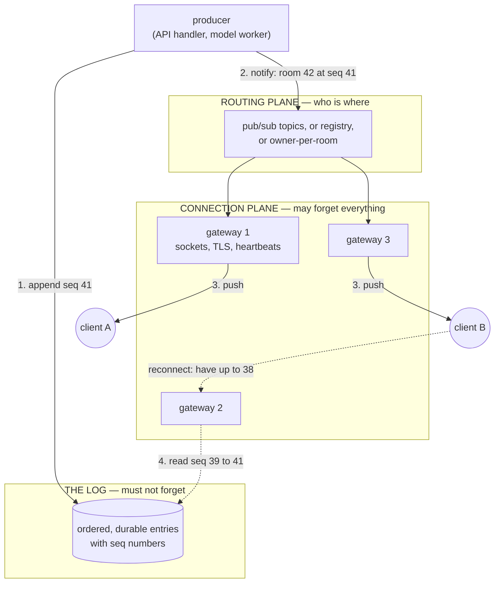
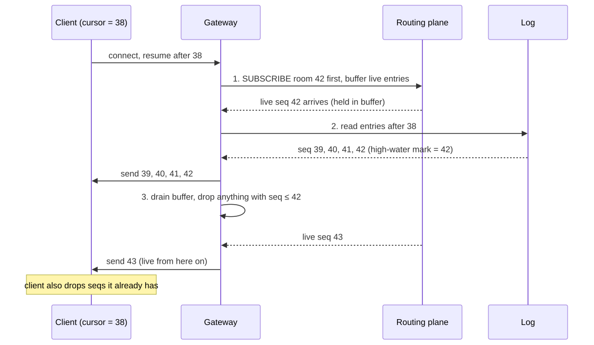
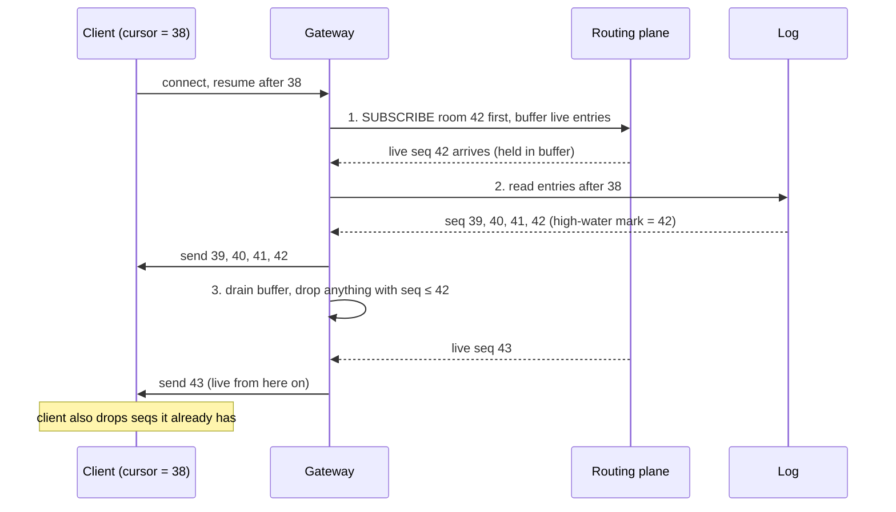
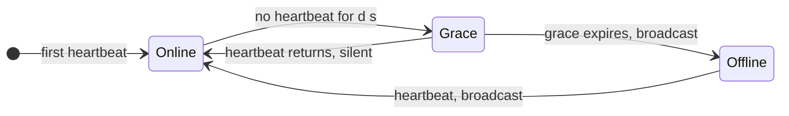

# M02 · Ch4 · §2 — Running a real-time system: connection fleets, fan-out and delivery guarantees

> **Module:** Networking & The Web
> **Chapter:** Real-time — REST vs WebSockets vs SSE (Server-Sent Events) vs long-polling
> **Section:** Ch4 §1 chose a transport and ended on a bill: **a long-lived connection revokes HTTP's
> statelessness, and five hard things follow** (Ch4 §1 §8). This section pays that bill. It opens on the
> finding from Ch4 §1 §12 — **resumability is a property of what the server stores, not of how the bytes
> travel** — and builds the whole architecture out from it: the three planes every real-time system has
> (connections, routing, the log), how each one scales and fails, what delivery guarantees you can actually
> offer, how presence works when disconnects are not reliably reported, what to do with a client that cannot
> keep up, and how to deploy a fleet of stateful connections without knocking everyone off at once.
> **Status:** 🔵 PREPARED 2026-09-27 — body written, awaiting your read and the Q&A.
> **Prerequisites:** **Ch4 §1** (the four transports; §8's five consequences are this section's table of
> contents; §12's arena thread is its thesis); **Ch2 §1** (idempotency keys — §4 re-uses them at stream
> scale); **M01 Ch4 §2** (event loops and non-blocking I/O — why one process can hold a million idle
> sockets); **M01 Ch3 §3** (races — §5's replay/live race is one).

**Estimated study time:** 3–3.5 hours including the hands-on.

---

## Why this section exists — and how it's pitched

Choosing SSE or WebSocket is a one-afternoon decision. Running the thing is not. Every serious real-time
outage story — the chat service that could not come back after a deploy, the presence indicator that showed
people online for hours after they left, the memory leak that turned out to be one hotel's Wi-Fi — is about
**state held by connections**, not about the protocol on the wire.

So this section is pitched at the architecture, and it has one organizing idea that you already met in
concrete form. In Ch4 §1 §12 your arena question — *would SSE fix the refresh-mid-stream bug?* — came back
**no**, because no transport can replay what the server never stored. That was a specific finding about one
app. Here it becomes the design principle for the whole field:

> **Put every piece of state that must survive in a place that survives. The connection is the one place
> that does not.**

Everything below is that sentence applied, plane by plane. The pitch is the usual one for you — mechanism
first, real systems named, numbers attached with their units — and it leans on well-documented production
architectures (Slack, Discord, WhatsApp, Figma, LinkedIn) rather than invented examples, because they are
where each failure mode was actually found.

---

## 1. The thesis: three planes, and only one of them may forget

<details>
<summary><b>Vocabulary for this section</b> — terms and abbreviations used below (click to expand)</summary>

**Abbreviations**

| Short | Stands for | Meaning |
|---|---|---|
| **SSE** | Server-Sent Events | a one-way server-to-client stream inside an ordinary HTTP response (Ch4 §1 §4) |
| **HTTP** | HyperText Transfer Protocol | the request/response protocol of the web |
| **TLS** | Transport Layer Security | the encryption layer; usually terminated at the connection plane |
| **AWS** | Amazon Web Services | Amazon's cloud |
| **API** | application programming interface | here, API Gateway's WebSocket product and its `@connections` management interface |

**Terms**

| Term | Definition |
|---|---|
| **Plane** | one layer of responsibility in the architecture; here three: connection, routing, log |
| **Connection plane** | the servers that hold client sockets and do nothing else important — the one plane allowed to lose state |
| **Routing plane** | whatever decides which connection-plane server should receive a message for a given recipient or room — pub/sub, a registry, or owner processes |
| **Log** | the durable, ordered record of what happened (messages, tokens, edits), each entry with a sequence number — the source of truth |
| **Backplane** | the shared bus between your own servers that the routing plane is usually built from |
| **Source of truth** | the one place whose contents win when two copies disagree |
| **Consistent hashing** | a way to assign keys (channel ids) to servers so that adding or removing one server moves only a small fraction of keys |
| **Owner process** | one process that holds all live state for one room or document, so all its traffic goes through one place |
| **`connectionId`** | API Gateway's identifier for one client WebSocket; the handle a backend uses to push to it |
| **Durable Object** | Cloudflare's single-instance stateful object, commonly used as a per-room owner |

</details>

Draw any production real-time system and, however it is labelled, it resolves into **three planes**:

1. **The connection plane** — servers that terminate client sockets (and usually TLS — Transport Layer
   Security), authenticate, keep
   the heartbeat going, and push bytes out. Slack calls these **Gateway Servers**; on AWS the managed
   version is **API Gateway WebSockets**; in Socket.IO it is each Node.js process.
2. **The routing plane** — the thing that answers *"a message for room 42 was produced on server A; which
   connection servers hold room 42's members?"* It is a pub/sub bus, a connection registry, or a set of
   **owner processes** found by consistent hashing.
3. **The log** — the durable, ordered record of what happened: chat messages, document edits, a model's
   tokens. Every entry carries a **sequence number**. It lives in a database or a stream (Postgres, DynamoDB,
   Kafka, Redis Streams) — not in any process's memory.

<!-- DIAGRAM:START -->


<details>
<summary>Diagram source (Mermaid)</summary>



</details>
<!-- DIAGRAM:END -->

**Figure 1** — the three planes of a real-time system; the solid path is live delivery, the dotted path is a
reconnecting client recovering from the log.

Now apply the thesis. **The connection plane is the only plane whose state is allowed to vanish** — and it
will vanish, on every deploy, crash, network blip, mobile handover, and (on API Gateway) every two hours
regardless. So nothing may live *only* there. The routing plane holds soft state that can be rebuilt (who is
subscribed to what). The log holds the hard state. A reconnecting client never asks the connection plane
"what did I miss?"; it asks the log.

That is exactly the structure you arrived at in Ch4 §1 §12d for the arena — *make the store the stream,
demote the connection to a notification channel* — and it is not a special fix. It is what every system
that survives at scale converged on:

**Table 1** — five well-documented production systems mapped onto the three planes.

| System | Connection plane | Routing plane | Log / source of truth |
|---|---|---|---|
| **Slack** (2023 write-up) | Gateway Servers hold WebSockets, deployed across regions | Channel Servers, each owning a slice of channels by **consistent hashing** (about 16 million channels per host at peak); a failed one is replaced in under 20 seconds | the Webapp and its databases; Channel Servers keep only "some amount of history" in memory |
| **Discord** (2017 write-up) | a session process per connected user (Elixir) | one **guild process** per server-community, found by consistent hashing; fans out to sessions | persisted message store behind the guild |
| **Figma** (2019 write-up) | WebSockets to a server cluster | **one process per open document**, which every editor of that document connects to | the document store; the process is a live cache of it |
| **API Gateway WebSockets + DynamoDB** (your stack) | fully managed by AWS; you get a `connectionId` | **you build it**: a table mapping `connectionId` ↔ user/room, and code that posts to each one | **you build it** — and Ch4 §1 §12 was what happens when it is missing |
| **Cloudflare Durable Objects** | managed by Cloudflare's edge; sockets stay open even while your object is evicted from memory ("hibernation") | one Durable Object per room, addressed by name | the object's attached storage |

The two rows that matter most for you are the last two, because they show what "managed" does and does not
mean. **A managed connection plane gives you the first column and nothing else.** API Gateway will hold a
million sockets for you, but the routing table and the log are still your problem — which is why "we use
API Gateway, so scaling is handled" is true about exactly one-third of the system.

---

## 2. The connection plane: capacity is counted in connections

<details>
<summary><b>Vocabulary for this section</b> — terms, abbreviations and every symbol in the formulas (click to expand)</summary>

**Abbreviations**

| Short | Stands for | Meaning |
|---|---|---|
| **C10K** | "10,000 concurrent connections" | Dan Kegel's 1999 name for the problem of one server holding ten thousand clients |
| **RAM** | random-access memory | the resource idle connections actually consume |
| **CPU** | central processing unit | idle connections use almost none of it |
| **TCP** | Transmission Control Protocol | each connection is identified by a four-part address tuple |
| **IP** | Internet Protocol | the address part of that tuple |
| **ALB** | Application Load Balancer | AWS's layer-7 load balancer |
| **RPS** | requests per second | the autoscaling metric that measures the wrong thing for a connection fleet |
| **KB / GB** | kilobyte / gigabyte | $10^{3}$ and $10^{9}$ bytes |
| **OS** | operating system | here, the kernel's per-process and per-address limits |

**Symbols used in the formulas**

| Symbol | Reads as | Meaning |
|---|---|---|
| $L$ | "L" | the average number of connections open at once (concurrent connections) |
| $\lambda$ | "lambda" | the rate at which new connections arrive, in connections per second |
| $W$ | "W" | the average lifetime of one connection, in seconds |
| $m$ | "m" | memory per connection, in bytes — socket buffers plus TLS state plus your application's per-connection state |
| $M_{\text{avail}}$ | "M available" | the memory one server can give to connections |
| $N$ | "N" | the number of connected clients |

**Terms**

| Term | Definition |
|---|---|
| **Little's law** | $L = \lambda W$: in any stable system, the average number inside equals arrival rate times average time spent inside |
| **File descriptor** | the kernel handle a process holds for each open socket or file; capped per process by `ulimit -n` |
| **Ephemeral port** | the temporary local port the kernel assigns to an outbound connection; on Linux drawn from 32768–60999 by default |
| **Four-tuple** | (source IP, source port, destination IP, destination port) — what uniquely identifies a TCP connection |
| **Port exhaustion** | running out of ephemeral ports for one destination, so new outbound connections fail |
| **Least outstanding requests** | a load-balancer policy that sends new work to the target with the fewest in-progress requests; ALB uses it to place WebSockets |
| **Rebalancing** | deliberately moving connections off overloaded servers, usually by asking some clients to reconnect |
| **Scale-in** | removing servers — which, on a connection fleet, is a forced disconnect for everyone on them |

</details>

**Counting.** The number that sizes a connection fleet is not requests per second but **concurrent
connections**, and the cleanest way to get it is **Little's law** from queueing theory:

$$L = \lambda W$$

— the average number of open connections $L$ equals the arrival rate of new connections $\lambda$ times their
average lifetime $W$. AWS uses exactly this to explain why API Gateway WebSockets has no concurrent-connection
quota: the default quota is **500 new connections per second** per account per Region, the maximum
connection duration is **two hours** ($W \leq 7200$ s), so the ceiling is $500 \times 7200 = 3{,}600{,}000$
concurrent connections. Read that the other way round and it becomes an operational fact you need: **with
$N$ clients and a two-hour cap, you have a permanent background reconnect rate of at least $N / 7200$ per
second**, about 14 per second for 100,000 clients, even on a perfect day.

**What a connection costs.** An idle connection costs almost no CPU and a definite amount of memory $m$:
kernel socket buffers, TLS session state, and whatever your framework keeps per connection (a Socket.IO
socket object, an Elixir process, a Python coroutine and its frames). The capacity of one box is roughly

$$N_{\max} \approx \frac{M_{\text{avail}}}{m}$$

and the famous data points tell you what $m$ can be pushed to when someone tries:

- **WhatsApp, January 2012:** **2,277,845** open sockets on one server — FreeBSD, Erlang, 24 cores and about
  100 GB of RAM — "with plenty of CPU and memory to spare". That is under about 45 KB per connection *all-in*.
- **Phoenix (Elixir), November 2015:** **2 million** WebSocket connections on one 40-core, 128 GB box, each
  subscribed to a channel and receiving broadcasts — about 64 KB per connection at most. It was stopped by
  a configured limit, not by memory.

The general lesson is **M01 Ch4 §2 cashed out**: an event-loop server (Erlang, Go, Node.js, Python `asyncio`)
holds an idle connection as a small data structure, not a thread, which is why the C10K problem (ten thousand
concurrent connections) that Dan Kegel named in 1999 is now a one-million-connection routine. Your own $m$ is
almost always dominated by *your* per-connection state, not the kernel's — compression contexts
(`permessage-deflate`, Ch4 §1 §8), buffered outbound messages (§7), and cached user objects.

**The limits that bite before memory does.** These are the ones that surprise people, because they are
*count* limits, not size limits:

- **File descriptors.** Every socket is a file descriptor, and the default per-process limit on many Linux
  systems is **1,024**. The Phoenix team's first run topped out at exactly 1,000 connections for this
  reason, and the fix was `ulimit -n` plus the system-wide `fs.file-max`. Symptom: *"accept failed: too many
  open files"* at a suspiciously round number.
- **Ephemeral ports, on the proxy's side.** A TCP connection is identified by its four-tuple (source IP,
  source port, destination IP, destination port). When a reverse proxy or load balancer opens connections
  **to one backend address and port**, three of the four are fixed — only its own source port varies — and
  Linux draws those from **32768–60999 by default: 28,232 ports**. So one proxy IP can hold at most about
  28,000 simultaneous connections to one backend `ip:port`. For short HTTP requests this never matters;
  for a fleet of hour-long WebSockets proxied one-to-one, it is a hard wall. Fixes: more backend ports or
  IPs, more proxy source IPs, or a proxy that multiplexes. (The same wall is why load *generators* need many
  machines — the Phoenix benchmark used dozens of client boxes, each configured for 64,000 users.)
- **The front door's admission rate.** API Gateway's 500 new connections per second is a *rate*, and it is
  the number that decides how fast you recover from a mass disconnect — §8 and Figure 5.

**Load balancing does not rebalance.** Here is the failure mode that catches people who have only run
stateless services. An ALB (Application Load Balancer) places a new WebSocket on the target with the **fewest
outstanding requests** (AWS documents this explicitly), and then the connection stays there for its whole
life. So when a fleet is overloaded and the autoscaler adds three new instances, **the existing connections
do not move**: the new instances receive only *new* connections, and the hot ones stay hot until natural
churn drains them — which, for long-lived connections, may be hours. Scaling out does not relieve load; it
only stops load getting worse. The fixes are all deliberate:

- **Shed on purpose.** When an instance is above its target, it closes a small random fraction of its
  connections with a "please reconnect" close code (§8) and lets the load balancer place them elsewhere.
- **Cap connection lifetime.** A maximum lifetime (API Gateway imposes two hours; many teams choose 30–60
  minutes on their own fleets) turns natural churn into a slow, continuous rebalancer.
- **Autoscale on the right number** — connections per instance and memory, not RPS (requests per second) — and remember that
  **scale-in is a deploy**: removing an instance disconnects everyone on it, so it needs the same draining
  as §8.

---

## 3. The routing plane: fan-out and the backplane

<details>
<summary><b>Vocabulary for this section</b> — terms, abbreviations and every symbol in the formulas (click to expand)</summary>

**Abbreviations**

| Short | Stands for | Meaning |
|---|---|---|
| **NATS** | (a product name) | a lightweight open-source messaging system with subject-based pub/sub |
| **HTTPS** | HTTP Secure | HTTP over TLS; each `@connections` post from your backend is one HTTPS call |
| **PID** | process identifier | here, an Erlang process's address, which Discord's Manifold groups by node |

**Symbols used in the formulas**

| Symbol | Reads as | Meaning |
|---|---|---|
| $D$ | "D" | deliveries per second — individual pushes to individual connections |
| $r$ | "r" | messages per second produced into one room |
| $k$ | "k" | the number of connected members of that room |
| $M$ | "big M" | the number of connection-plane servers |

**Terms**

| Term | Definition |
|---|---|
| **Fan-out** | turning one produced message into one delivery per recipient connection |
| **Pub/sub** | publish/subscribe: producers publish to a topic, and every current subscriber receives a copy |
| **Topic / channel / subject** | the name a message is published under; NATS calls it a subject, Redis a channel |
| **Broadcast bus** | a backplane where every server receives every message and filters locally |
| **Connection registry** | a table recording which connection belongs to which user or room, and where it lives |
| **Hot room** | one room so large or busy that its fan-out dominates the whole system — the real-time version of a hot key |
| **At-most-once** | a delivery guarantee meaning a message is delivered once or not at all — never retried |
| **Redis Streams** | Redis's persistent, append-only log type, as opposed to its fire-and-forget pub/sub |
| **Adapter** | Socket.IO's name for the pluggable backplane between its server processes |
| **Connection state recovery** | Socket.IO's feature for replaying missed packets after a brief disconnect |
| **Manifold** | Discord's open-source library that batches fan-out per remote node |

</details>

Once connections are sticky, one produced message has to reach $k$ recipients spread across $M$ servers,
and the cost you are actually paying is the number of individual pushes:

$$D = r \times k$$

A 10,000-member live room producing 5 messages per second is **50,000 deliveries per second** — from a room
whose producer side looks trivial. This multiplication is the defining cost of real-time, and there are four
standard ways to organize it.

**Table 2** — the four routing-plane patterns, what each costs, and where each breaks.

| Pattern | How a message reaches the right servers | Cost that grows | Breaks when | Real example |
|---|---|---|---|---|
| **Broadcast bus** | every server subscribes to everything and discards what its clients do not need | every server receives *all* traffic: backplane load $\propto$ total message rate $\times M$ | the fleet grows — adding servers makes every server busier | a naive single Redis channel shared by all rooms |
| **Topic-filtered pub/sub** | each server subscribes only to the topics its own clients are in | subscription churn as clients join and leave rooms | one hot topic still reaches every server that has one member | Socket.IO's Redis adapter; NATS subjects |
| **Owner per room** (consistent hashing) | one process owns the room; it knows exactly which gateways hold members and sends each one copy | the owner's CPU for hot rooms | one room outgrows one owner process | Slack Channel Servers; Discord guild processes; Figma per-document processes |
| **Registry + direct send** | a table maps room → connection ids; the producer posts to each id | one API call **per recipient** — $D$ calls, not $M$ | rooms get large; the producer becomes a loop of $k$ HTTPS calls | API Gateway WebSockets + DynamoDB |

Two real-world lessons sit behind that table.

**Batch by server, not by recipient.** Discord hit the owner pattern's limit when big guilds made one guild
process send to tens of thousands of session processes. Their fix, **Manifold**, groups the recipients by the
node they live on and sends **one message per node**, which then fans out locally — so the owner's work
scales with the number of *servers* involved, not the number of *users*. That is the same move as the
difference between the last two rows of Table 2, and it is why the registry-plus-direct-send pattern on API
Gateway gets expensive for big rooms: there is no "one call per gateway" option, so a message to $k$ members
is $k$ separate posts from your backend.

**The backplane is not the log.** This is where §1's thesis bites hardest, and the documentation says it
outright. Redis's own docs: **"Redis' Pub/Sub exhibits *at-most-once* message delivery semantics."** A
subscriber that is disconnected — for a network blip, a restart, a deploy — when a message is published
simply never receives it; nothing is stored. Redis *Streams*, by contrast, are persisted and support
at-least-once. And the most instructive line in the whole ecosystem is in Socket.IO's documentation of its
**connection state recovery** feature, which replays missed packets after a short disconnect: it works with
the in-memory adapter, the Redis *Streams* adapter and the MongoDB adapter, but **not** with the plain Redis
adapter, because — in their words — *"persisting the packets is not compatible with the Redis PUB/SUB
mechanism."* That is Ch4 §1 §12's finding, written by someone else about their own product: **a backplane
that does not store cannot support resume, whatever the transport above it does.**

The practical shape, therefore: **use pub/sub to say "something happened in room 42, up to seq 41", and use
the log to say what.** If a notification is lost, the next one — or the client's own reconnect — carries a
higher sequence number, the gap is visible, and the client fills it from the log (§5). Pub/sub may lose
notifications; the design stays correct because it never relied on them for content.

---

## 4. Delivery semantics: what you can actually promise

<details>
<summary><b>Vocabulary for this section</b> — terms and abbreviations used below (click to expand)</summary>

**Abbreviations**

| Short | Stands for | Meaning |
|---|---|---|
| **TCP** | Transmission Control Protocol | its acknowledgements confirm bytes reached the other kernel — not your application |
| **ACK** | acknowledgement | a message confirming receipt; at which layer it is sent is the whole question |
| **EOS** | exactly-once semantics | Kafka's name for exactly-once processing inside its own read-process-write transactions |
| **UI** | user interface | the screen, which is where "delivered" finally means something to a person |

**Terms**

| Term | Definition |
|---|---|
| **At-most-once** | send once, never retry: no duplicates, but messages can be lost |
| **At-least-once** | store, retry until acknowledged: nothing is lost, but duplicates are possible |
| **Exactly-once delivery** | each message arrives once and only once — impossible over an unreliable network, for the reason in the text |
| **Effectively-once** | at-least-once delivery plus an idempotent consumer: duplicates arrive but have no additional effect — what "exactly-once" means in practice |
| **Idempotent consumer** | a receiver that recognizes a repeat (by message id or sequence number) and ignores it |
| **Two Generals problem** | the classic proof that two parties over a lossy channel can never be sure they agree |
| **Application-level acknowledgement** | an acknowledgement sent by your code after it has processed a message — the only kind that means "handled" |
| **Sequence number (seq)** | a per-stream counter, increasing by one per entry, that gives order and makes gaps visible |
| **Per-stream ordering** | order guaranteed within one room or conversation, but not across them |
| **Gap detection** | the client noticing that seq 42 is missing because 43 arrived, and fetching 42 |
| **Single writer** | the design where one process assigns sequence numbers for a stream, so they cannot collide |
| **Atomic counter** | a database operation that increments and returns a number in one indivisible step, usable as a sequence allocator |

</details>

**Three guarantees, one impossibility.** Every delivery promise is one of these, and it is worth being
exact about which one a system gives, because vendors are not always exact about it:

**Table 3** — the three delivery guarantees, the mechanism each needs, and its failure signature.

| Guarantee | Mechanism | What goes wrong | Where you see it |
|---|---|---|---|
| **At-most-once** | send, do not store, do not retry | a message sent during a disconnect is gone | Redis pub/sub; Socket.IO's default; a WebSocket `send()` with no log behind it |
| **At-least-once** | store the message, retry until an acknowledgement arrives | the acknowledgement is lost, so the sender retries, so the receiver sees it twice | SSE with `Last-Event-ID` over a buffered log; Kafka consumers; webhooks |
| **Effectively-once** | at-least-once **plus** an idempotent consumer that drops repeats by id or seq | nothing — provided the consumer's dedupe state survives as long as retries can | every system that credibly claims "exactly-once" |

**Why exactly-once delivery cannot exist.** The argument is short and worth owning. The sender sends a
message and waits for an acknowledgement. The acknowledgement does not come. The sender cannot tell apart
*"the message was lost"* from *"the message arrived and the acknowledgement was lost"* — both look identical
from its side. If it resends, it risks a duplicate (at-least-once); if it does not, it risks a loss
(at-most-once). No protocol escapes this, because any extra confirmation message can itself be lost; it is
the **Two Generals problem**. What systems that advertise exactly-once really provide is **effectively-once
processing**: at-least-once delivery with deduplication at the receiver. Kafka's well-known "exactly-once
semantics" is precisely this — idempotent producers plus transactions — and it holds *within Kafka's own
read-process-write loop*, not across the internet to a browser.

So the practical rule is Ch2 §1's idempotency key, now at stream scale: **give every entry an identity (a
sequence number per stream is the best kind), deliver at-least-once, and make the client drop anything with a
seq it has already applied.** A duplicate then costs nothing, and you can retry freely.

**Which acknowledgement?** A subtle trap: *"the send succeeded"* can mean four different things, and only the
last is what a user cares about.

1. Your `socket.send()` returned — the bytes are in your process's outbound buffer.
2. The kernel sent them and TCP received an ACK — the bytes are in the *client's kernel*.
3. The client's JavaScript processed the message.
4. The user interface rendered it.

TCP's acknowledgement is level 2. A tab that is frozen in the background, a client that crashes before
processing, a proxy that ACKs on the client's behalf — all of these pass level 2 and fail level 3. **If you
need to know a client has a message, the client must tell you, in your own protocol**: an application-level
acknowledgement ("I have applied up to seq 57"), or — cheaper and nearly always sufficient — the client's
cursor presented on reconnect, which acknowledges everything before it in one number.

**Ordering is per stream, and it needs one allocator.** Sequence numbers give you order *within* one stream
(one room, one conversation, one model turn). Guaranteeing order *across* streams — globally — requires every
event to pass through one serialization point, which is exactly the bottleneck the routing plane exists to
avoid; almost no product needs it. What *is* needed is that one stream's sequence numbers never collide or go
backwards, which means **one writer per stream** (the owner process of §3's owner pattern) or an **atomic
counter** in the database (a DynamoDB atomic `ADD`, or a conditional write that fails if the seq already
exists). Two workers each doing "read the max seq, add one, write" will eventually both write seq 58 — a race
straight out of M01 Ch3 §3.

---

## 5. Resume, in full

<details>
<summary><b>Vocabulary for this section</b> — terms and abbreviations used below (click to expand)</summary>

**Abbreviations**

| Short | Stands for | Meaning |
|---|---|---|
| **SSE** | Server-Sent Events | its `Last-Event-ID` header is a built-in cursor for dropped connections |
| **LLM** | large language model | its token stream is a short-lived log, one entry per chunk |
| **TTL** | time to live | how long a stored entry is kept before it expires |

**Terms**

| Term | Definition |
|---|---|
| **Cursor** | the last sequence number a client has applied; presented on reconnect as "send me everything after this" |
| **Retention window** | how far back the log keeps entries available for replay |
| **Resync** | the fallback when a cursor is older than retention: send a fresh snapshot, then continue live |
| **Snapshot** | the current state as a whole (the room's last 50 messages, the document), rather than the list of changes |
| **Replay / live race** | the window during reconnection where an entry can be missed or duplicated between reading history and receiving live pushes |
| **High-water mark** | the highest seq included in the replay; live entries at or below it are discarded as duplicates |
| **`sessionStorage`** | per-tab browser storage that survives a page reload but not closing the tab |
| **`auto.offset.reset`** | Kafka's setting for what a consumer does when its saved offset no longer exists — Kafka's version of the resync decision |

</details>

With the log in place, resume is a small protocol. It has three parts, and the third is the one people get
wrong.

**Part 1 — the cursor.** The client keeps the highest seq it has applied **per stream**, and presents it on
every (re)connection: `{"resume": {"room": 42, "after": 38}}`. For SSE this can be `Last-Event-ID`, with the
limit Ch4 §1 §12a found — it survives a dropped connection, not a reloaded page — so if resume must survive a
reload, the cursor goes in `sessionStorage` (or is recomputed from what the page re-fetches) and is sent
explicitly.

**Part 2 — the retention decision.** The log will not keep everything forever. So the server must answer two
different requests differently: *"after 38"* when the log still has 39 onwards is a **replay**; *"after 38"*
when retention starts at 1,200 is a **resync** — the server must say so explicitly (`{"resync": true}`) and
send a snapshot instead. Every mature system has this branch: Socket.IO's recovery tells the client whether
recovery succeeded (the `recovered` flag) and treats a session as unrecoverable once it has been away longer
than a configured `maxDisconnectionDuration` (the documentation's example uses two minutes); Kafka has
`auto.offset.reset` for a consumer whose offset has aged out. **The dangerous design is the one with no
resync branch**, which quietly replays "whatever is left" and presents a hole as if it were continuity.

**Part 3 — the replay/live race.** The client reconnects. The server must send it (a) the history after its
cursor and (b) new entries as they are produced. If it reads history first and subscribes second, an entry
produced in between is in neither — **lost**. If it subscribes first and reads second, an entry may be in
both — **duplicated**. The standard answer is the second order plus a de-duplicating seam:

<!-- DIAGRAM:START -->


<details>
<summary>Diagram source (Mermaid)</summary>



</details>
<!-- DIAGRAM:END -->

**Figure 2** — resuming without a gap or a duplicate: subscribe first, replay second, and discard live entries
at or below the replay's high-water mark.

Subscribe first, so nothing produced during the replay can be missed; replay up to a high-water mark; drain
the buffered live entries while discarding everything at or below it. Because the client also discards seqs
it has already applied (§4), even a sloppy server seam produces duplicates rather than holes — and duplicates
are free. **This is why the sequence number carries so much weight: it turns every race in this section from
"possible data loss" into "possible harmless duplicate".**

**The model-streaming case.** Ch4 §1 §12d applied this to one LLM (large language model) turn: the turn is a short-lived log
(`turnId`, seq per chunk, appended as generated, retention of minutes to hours), the connection only carries
notifications, and a reconnecting client asks for `{turnId, lastSeq}`. Nothing about that design is specific
to model output — it is Parts 1–3 with a small retention window. Its most important property also generalizes:
**the unit of work completes correctly with no client connected at all.** If a design cannot say that, some
state is living on the connection.

---

## 6. Presence: soft state and the unreliable goodbye

<details>
<summary><b>Vocabulary for this section</b> — terms and abbreviations used below (click to expand)</summary>

**Abbreviations**

| Short | Stands for | Meaning |
|---|---|---|
| **TTL** | time to live | how long an "online" record stays valid without a fresh heartbeat |
| **AWS** | Amazon Web Services | whose documentation calls <code>&#36;disconnect</code> a best-effort event |

**Symbols used in the formulas**

| Symbol | Reads as | Meaning |
|---|---|---|
| $d$ | "d" | the heartbeat interval, in seconds — LinkedIn's own name for it |
| $k$ | "k" | here, the number of people watching one user's presence |

**Terms**

| Term | Definition |
|---|---|
| **Presence** | whether a user is currently online (and sometimes where, or on which device) |
| **Soft state** | state that expires on its own unless refreshed, so a missed update corrects itself |
| **Hard state** | state that stays until explicitly changed — the wrong model for presence |
| **<code>&#36;disconnect</code>** | API Gateway's route invoked after a connection closes — documented as best-effort, not guaranteed |
| **Ghost presence** | a user shown online long after they left, because the goodbye event was never delivered |
| **Heartbeat** | a periodic "still here" signal; its absence, not a goodbye, is what marks a user offline |
| **Grace period** | the delay between the last heartbeat and declaring the user offline, to absorb short network drops |
| **Flapping** | presence toggling online/offline rapidly on a bad connection, spamming every watcher |
| **Debounce** | suppressing a change until it has persisted for some time |
| **Delayed trigger** | LinkedIn's name for a per-user timer that fires later to check whether a heartbeat arrived |
| **Multi-device presence** | a user is online if **any** of their connections is — the union, not the latest |
| **Visibility-scoped subscription** | subscribing only to the presence of users currently on screen |

</details>

"Show a green dot when someone is online" is the feature that teaches people distributed systems, because
it depends on an event that cannot be relied upon: **the goodbye.**

A client that closes its tab politely sends a WebSocket close frame. A client whose laptop lid shuts, whose
phone enters a tunnel, whose process is killed, or whose NAT (Network Address Translation) mapping silently
expires sends **nothing**. On the server side, a gateway that crashes cannot report the disconnects of the
thousands of sockets it was holding. AWS says it plainly about API Gateway: *"<code>&#36;disconnect</code> is
a best-effort event. API Gateway will try its best to deliver the <code>&#36;disconnect</code> event to your
integration, but it cannot guarantee delivery."* So a presence system built as *set online on connect, set
offline on disconnect* is **hard state driven by an unreliable event**, and its failure mode is **ghost
presence**: users shown online for hours after they left, which is exactly the bug most first versions ship
with.

The fix is to invert the model. **Presence is soft state: "online" is a record with an expiry, kept alive by
heartbeats, and "offline" is what happens when the heartbeats stop.** LinkedIn's presence platform (2018
write-up) is the canonical description: the real-time platform emits a heartbeat for each connected member
every $d$ seconds; as long as one arrives every $d$ seconds, the member is online; and a **delayed trigger** per
online member fires later to check whether the stored heartbeat is still fresh — if not, the member goes
offline and the change is published. The goodbye becomes an optimization (go offline *sooner* when it does
arrive), not a requirement.

<!-- DIAGRAM:START -->


<details>
<summary>Diagram source (Mermaid)</summary>



</details>
<!-- DIAGRAM:END -->

**Figure 3** — presence as soft state: each heartbeat within $d$ seconds keeps a user online silently, a
missed beat only starts a grace period, and only a sustained absence is broadcast as offline (a clean close on
the user's last device may skip straight to offline as a fast path).

Three refinements separate a presence system that works from one that merely runs:

- **Grace period and debounce.** A phone on a train drops and rejoins every few seconds. Broadcasting each
  flip turns one bad connection into a storm of updates to everyone who can see that user. Hold the
  *offline* transition for a grace period, and broadcast only transitions that persist.
- **Multi-device union.** A user with a laptop and a phone is online if **either** is connected. Presence is
  therefore keyed by user with a *set* of live connections, and "offline" means the set became empty — not
  that one connection closed.
- **Presence is the biggest fan-out you have.** Every status change goes to every watcher: a user with $k$
  people who can see them generates $k$ deliveries per transition, and transitions happen every time anyone
  opens or closes a laptop. This is why large systems **scope subscriptions to visibility** — you receive
  presence only for the users currently on your screen — and **coalesce** (§7): if someone flipped three
  times while you were not looking, you need only the final state.

---

## 7. Backpressure: the client that cannot keep up

<details>
<summary><b>Vocabulary for this section</b> — terms and abbreviations used below (click to expand)</summary>

**Abbreviations**

| Short | Stands for | Meaning |
|---|---|---|
| **TCP** | Transmission Control Protocol | its flow control stops accepting writes when the receiver falls behind |
| **MB** | megabyte | in Redis's configuration, `mb` means $1024^{2}$ bytes, so `32mb` is 33,554,432 |
| **NATS** | (a product name) | the messaging system whose server disconnects slow consumers |
| **Wi-Fi** | (a trade name for wireless LAN) | the canonical source of a stalled client |

**Terms**

| Term | Definition |
|---|---|
| **Backpressure** | the signal, and your response to it, when a consumer cannot keep up with a producer |
| **Outbound queue** | the per-connection buffer of messages waiting to be written to the socket |
| **Flow control** | TCP's mechanism that stops a sender outrunning the receiver — it stalls your writes, it does not decide anything |
| **Send buffer** | the kernel's per-socket buffer between your writes and the network |
| **`bufferedAmount`** | the browser WebSocket property reporting bytes queued but not yet sent — the client-side view of the same queue |
| **Unbounded buffer** | queueing without limit — the default you get by not choosing |
| **Bounded buffer + disconnect** | queueing up to a cap, then closing the connection so the client resumes from the log |
| **Drop oldest** | discarding the oldest queued messages to keep memory bounded — silent loss |
| **Coalesce to latest** | keeping only the newest value per key, because older values are superseded |
| **Slow consumer** | a subscriber that drains more slowly than messages arrive; NATS's and Redis's term for the client they will disconnect |
| **`client-output-buffer-limit`** | Redis's per-client-class output limit; for pub/sub clients the default is a hard 32 MB, or 8 MB sustained for 60 seconds |
| **Dead-but-open** | a connection whose client has stopped reading but which nobody has closed |
| **Event vs state data** | events must each be seen (chat messages); state only needs its latest value (a price, a cursor position) |

</details>

Ch4 §1 §8 stated the problem: on a push stream, a client that drains more slowly than you produce makes
**your server** hold the difference. TCP's flow control will stop the socket accepting writes once the kernel
send buffer fills; everything after that queues in your process, per connection, until you decide otherwise.
Figure 4 draws the four decisions for one client whose network stalls for 30 seconds:


**Figure 4** — one slow client under the four backpressure policies (plus the dead-but-open case), with a
producer at 20 messages per second and a client that drains up to 40 per second except during a 30-second stall.

*Drawn from a simple queue model with those rates; source in `diagrams/02-running-a-real-time-system-figures.py`.*

Read the figure policy by policy:

- **Unbounded buffer** (thick orange) survives this stall — 600 messages queued, drained 30 seconds after the
  network returns — and that is exactly why it ships: it works in every test. The dotted line is why it
  fails in production. A client that has **stopped reading but whose connection is still open** (a
  backgrounded tab, a half-dead mobile link that still ACKs keepalives, a bug) never drains, and its queue
  grows at the full producer rate forever. Multiply by a few hundred such clients and you have §9's
  signature: *memory climbing with connection count, not with traffic.*
- **Drop oldest** (blue) bounds memory and **silently loses** 400 messages. Acceptable only for data where
  loss is harmless and newer entries supersede older ones — and then coalescing is usually better.
- **Bounded buffer + disconnect** (green) caps memory at 200 messages, then closes the connection. This looks
  brutal and is usually the right answer for **event** data — *provided the log exists*. The client reconnects
  when its network recovers, presents its cursor, and replays the 400 messages from the log (§5), which is
  cheap to serve and costs the connection plane nothing while the client is away. **Disconnecting a slow
  client is only safe in a system that can resume; that is the dependency between this section's parts.**
- **Coalesce to latest** (dashed) keeps at most one pending value per key. It is the correct policy for
  **state** data — a price, a position, a cursor, a presence status, a progress bar — where the client only
  ever wants the newest value, and a queue of stale values is pure waste.

**Table 4** — choosing a backpressure policy by the kind of data on the stream.

| Data on the stream | Example | Policy | Why |
|---|---|---|---|
| **Events that must each be seen** | chat messages, document edits, model tokens | bounded buffer + disconnect, resume from the log | nothing may be lost, and the log makes disconnection lossless |
| **State where only the latest matters** | prices, positions, presence, progress, cursors | coalesce to latest value per key | older values are superseded; queuing them is waste |
| **Ephemeral hints** | "typing…" indicators, live cursors in a shared editor | drop | a late hint is worse than none |
| **Anything, when you have not decided** | — | unbounded buffer | the default, and the source of the slow memory leak |

This is not an exotic policy area; the infrastructure you already use made these decisions for itself. Redis
disconnects a pub/sub subscriber whose output buffer exceeds **32 MB**, or stays above **8 MB for 60
seconds** — `client-output-buffer-limit pubsub 32mb 8mb 60` in the default configuration. The NATS server, when
a client cannot drain its socket within the per-client write deadline, **closes the connection** (and NATS
distinguishes this server-side "slow consumer" disconnect from the client-library-side kind, which drops
individual messages and keeps the connection). Both chose *bounded + disconnect*, for the same reason you
should: a message broker that buffered forever on behalf of its slowest subscriber would fall over.

The browser has the mirror-image problem for **upstream** traffic: `WebSocket.send()` never blocks, it queues,
and `bufferedAmount` tells you how many bytes are waiting. A client uploading faster than its link should
watch it — which is the same decision, made on the other side.

---

## 8. Deploying a stateful fleet without dropping everyone

<details>
<summary><b>Vocabulary for this section</b> — terms, abbreviations and every symbol in the formulas (click to expand)</summary>

**Abbreviations**

| Short | Stands for | Meaning |
|---|---|---|
| **ALB** | Application Load Balancer | AWS's layer-7 load balancer; its deregistration delay defaults to 300 seconds |
| **IANA** | Internet Assigned Numbers Authority | keeps the registry of WebSocket close codes |
| **SIGTERM / SIGKILL** | signal terminate / signal kill | the polite and the unconditional process-termination signals an orchestrator sends |
| **TLS** | Transport Layer Security | each reconnect pays a new handshake, which is why rejected reconnects are not free |

**Symbols used in the formulas**

| Symbol | Reads as | Meaning |
|---|---|---|
| $N$ | "N" | the number of clients that must reconnect |
| $C$ | "C" | the front door's admission capacity, in new connections per second |
| $W_{\text{drain}}$ | "W drain" | the time window over which a draining server asks its clients to leave |
| $k$ | "k" | here, the retry attempt number: 0 for the first retry, 1 for the second, and so on |

**Terms**

| Term | Definition |
|---|---|
| **Draining** | stopping new connections to a server while letting existing ones finish or move gradually |
| **Deregistration delay** | how long an AWS load balancer keeps a removed target's existing connections before cutting them |
| **Close code** | the numeric reason in a WebSocket close frame |
| **`1001 Going Away`** | the close code for a server going down or a page navigating away |
| **`1012 Service Restart`** | the close code telling the client the service is restarting and it should reconnect |
| **`1013 Try Again Later`** | the close code telling the client to come back later — useful under overload |
| **Grace period (termination)** | how long an orchestrator waits between SIGTERM and SIGKILL; must exceed the drain window |
| **Reconnect storm** | every disconnected client trying to reconnect at once |
| **Exponential backoff** | doubling the wait after each failed attempt, up to a cap |
| **Full jitter** | choosing each wait uniformly at random between zero and the backoff value, so clients spread out |
| **Lockstep** | clients retrying at the same instants because they share a schedule — what jitter destroys |
| **Hibernation** | Cloudflare's feature where sockets stay open at the edge while the object behind them is evicted and later rebuilt |

</details>

A rolling deploy of a stateless service is invisible. On a connection fleet, every replaced instance
disconnects everyone attached to it (Ch4 §1 §8). There are three things you can control about that: **how
fast** clients are asked to leave, **how** they come back, and **how often** the connection plane is deployed
at all.

**Drain, do not kill.** A graceful shutdown of a connection server has three steps:

1. **Stop accepting.** Fail the health check or deregister from the load balancer, so no *new* connections
   arrive. An ALB then keeps existing connections to that target for the **deregistration delay — 300 seconds
   by default** — before cutting them.
2. **Ask clients to leave, gradually.** Over a drain window $W_{\text{drain}}$, close connections in small
   batches with a close code that means *reconnect somewhere else*: **`1012 Service Restart`** or
   **`1001 Going Away`** (both in the IANA — Internet Assigned Numbers Authority — close-code registry).
   Spreading $N$ clients over the window turns an instant spike into a rate of $N / W_{\text{drain}}$: 20,000
   connections drained over 120 seconds is about 167 reconnects per second instead of 20,000 in the same
   second. Your client library must treat these codes as "reconnect now, with resume", not as errors.
3. **Exit before you are killed.** Kubernetes, Amazon ECS (Elastic Container Service) and friends send
   SIGTERM (the polite terminate signal), wait a termination grace period, then SIGKILL (the unconditional
   one). **The grace period must be longer than the drain window**, or the orchestrator converts your careful
   drain into the hard kill you were avoiding — a mismatch that is easy to ship because the defaults (often
   30 seconds) are far shorter than a sensible drain.

**Come back with jitter.** Clients that were disconnected together will retry together unless something
separates them. Figure 5 simulates 60,000 clients reconnecting through a front door that admits 500 per
second — API Gateway's default quota — under three retry policies:

![Two panels. Left: connection attempts per second on a log scale over 300 seconds; fixed one-second retries hold near 50,000 per second for two minutes, exponential backoff without jitter shows tall synchronized spikes at 1, 3, 7, 15, 31, 63 seconds and beyond, and full jitter decays smoothly below the 500-per-second capacity line. Right: percentage of clients reconnected over 600 seconds; fixed retry and full jitter both reach 100 percent near the 120-second floor, while backoff without jitter reaches only 17 percent after 600 seconds.](diagrams/02-running-a-real-time-system-fig1.svg)

**Figure 5** — a reconnect storm simulated: 60,000 clients, a front door admitting 500 per second, and three
client retry policies.

*Simulated with 0.1-second bins and a small natural timing spread on every attempt; source in
`diagrams/02-running-a-real-time-system-figures.py`.*

Three lessons, and the first one is humbling:

- **Nothing beats $N / C$.** With 60,000 clients and 500 admissions per second, recovery takes at least
  **120 seconds** whatever the clients do. Jitter does not make recovery faster than capacity allows. If
  120 seconds of degraded service after every incident is unacceptable, the fix is capacity (a higher quota,
  more gateways) or fewer simultaneous disconnects (draining) — not a cleverer client.
- **Backoff without jitter is the catastrophic one** (blue). Clients disconnected together fail together,
  double their wait together, and return together: synchronized spikes at 1, 3, 7, 15, 31, 63 seconds, each
  one far above capacity, each admitting only what fits through the door in that instant. After ten minutes
  only 17% are back. This is the result Marc Brooker's 2015 AWS Architecture Blog post made famous, and it is
  counter-intuitive: **exponential backoff alone preserves the synchronization; jitter is what destroys it.**
- **Fixed fast retries reach everyone about as fast as jitter — at 100 times the load** (orange). In this
  model a rejected attempt is free, so the only visible cost is 50,000 attempts per second hammering a door
  rated for 500. In reality a rejected attempt is not free: it costs a TCP and TLS handshake, maybe an
  authorizer invocation, maybe a database lookup — so that load eats into the very capacity it is waiting
  for, and the real curve is worse than the drawn one. Full jitter (green) delivers the same recovery time
  with the offered load falling below capacity within about 100 seconds.

The client recipe is therefore short: on a disconnect, wait `random(0, min(cap, base × 2^k))` before attempt
$k$ (full jitter), honour a server-provided retry hint if there is one (SSE's `retry:`, a `1013 Try Again
Later` close), resume from the cursor, and never retry in a tight loop.

**Deploy the connection plane rarely.** The most effective deploy strategy is structural: **split the
connection plane from the business logic, make the connection plane thin, and deploy it seldom.** Slack's
Gateway Servers do little but hold sockets and subscriptions; the logic lives behind them and deploys
without touching a single connection. The managed products are this idea sold as a service — and it is the
most under-appreciated property of the stack you already use: **deploying the Lambda behind API Gateway
WebSockets does not disconnect anyone**, because AWS holds the sockets and your code only ever sees events.
Cloudflare's hibernation goes one step further: the Durable Object behind a socket can be evicted from memory
entirely while *"clients remain connected to the Cloudflare network,"* and is rebuilt from storage when the
next message arrives — which works only because its state was put somewhere that survives. §1's thesis again.

---

## 9. Build, rent, or buy

<details>
<summary><b>Vocabulary for this section</b> — terms and abbreviations used below (click to expand)</summary>

**Abbreviations**

| Short | Stands for | Meaning |
|---|---|---|
| **AWS** | Amazon Web Services | Amazon's cloud; API Gateway WebSockets is its managed connection plane |
| **SDK** | software development kit | the client library a real-time vendor ships, which usually implements reconnect and resume |
| **DO** | Durable Object | Cloudflare's single-instance stateful object |
| **SLA** | service-level agreement | a vendor's contractual availability promise |

**Terms**

| Term | Definition |
|---|---|
| **Self-hosted** | you run the servers: all three planes are yours to build and operate |
| **Managed connection plane** | a cloud product that holds the sockets for you; routing and the log stay yours |
| **Full-service real-time platform** | a vendor that provides connections, routing and some message history as one product |
| **Database-as-real-time** | a database that pushes changes to subscribed clients, so the log and the delivery are the same product |
| **Replay window** | how far back a vendor's history lets a reconnecting client recover — the number to check before trusting "reliable delivery" |

</details>

With the three planes in hand, the product landscape stops being a list of brands and becomes a question:
**which planes does this take off my hands, and which does it leave?**

**Table 5** — the real-time product landscape, sorted by which of the three planes each option provides.

| Option | Connection plane | Routing plane | Log / replay | You still own |
|---|---|---|---|---|
| **Self-hosted framework** — Socket.IO, Phoenix Channels, Centrifugo, a hand-rolled `asyncio`/Go server | yours | yours (with an adapter: Redis, NATS, Postgres) | yours — and check the adapter supports it (Socket.IO's plain Redis adapter does not) | everything, including §2's limits and §8's deploys |
| **Managed connection plane** — API Gateway WebSockets, Azure Web PubSub | **theirs** | partly theirs (varies: API Gateway gives only per-connection posting) | yours | the registry, fan-out cost, the log, resume, presence |
| **Stateful edge objects** — Cloudflare Durable Objects | theirs | theirs (one object per room, addressed by name) | yours, but co-located with the object's storage | the protocol, resume logic, per-room limits |
| **Full-service platform** — Ably, Pusher, PubNub and similar | theirs | theirs (channels) | theirs, within a **replay window** you must check | your data model, idempotent clients, auth integration |
| **Database-as-real-time** — Firebase / Firestore listeners, Supabase Realtime | theirs | theirs (query or table subscriptions) | **the database is the log** | schema, query costs, and fit — it works when your events are rows |

Two judgments to take from it:

- **"Managed" usually means the connection plane only.** That is the most valuable plane to outsource —
  it is where §2's count limits, §8's deploys and the TLS termination live — but it is one of three. The
  routing table, the log and resume are still yours on API Gateway, which is precisely the part the arena's
  refresh bug lived in.
- **The database-as-real-time products are §1's thesis sold as a product.** They get resume right by
  construction, because the thing that pushes to you *is* the store. When your real-time data is naturally
  rows in a table (a feed, a document, a task list), they remove the entire problem class. When it is not (a
  token stream, a game tick), you fight the model.

For full-service vendors, the question that separates them is not throughput but **"how long is the replay
window, and what does the SDK do when my client is outside it?"** — which is Part 2 of §5 asked of someone
else's system.

---

## 10. Failure modes — the operational checklist

<details>
<summary><b>Vocabulary for this section</b> — terms and abbreviations used below (click to expand)</summary>

**Abbreviations**

| Short | Stands for | Meaning |
|---|---|---|
| **ALB** | Application Load Balancer | places each WebSocket once and never moves it |
| **TCP** | Transmission Control Protocol | its four-tuple limit is behind port exhaustion |
| **OOM** | out of memory | the end state of an unbounded outbound queue |
| **TTL** | time to live | how long an "online" record stays valid without a fresh heartbeat |

**Terms**

| Term | Definition |
|---|---|
| **Hot instance** | a server carrying far more connections than its peers, which scaling out does not relieve |
| **Ghost presence** | users shown online after they left, from trusting a disconnect event |
| **Silent gap** | messages missing after a resume that the client cannot detect, because nothing marked the hole |
| **Split sequence** | two writers assigning the same seq in one stream |
| **Hard kill** | SIGKILL before a drain finishes — the draining you designed never ran |
| **Hot room** | one room whose fan-out dominates the fleet |

</details>

Ch4 §1 §9 listed the transport-level failures (buffering proxies, idle timeouts, the six-connection limit).
These are the ones that appear once the system is a fleet:

- **Scaling out does not relieve the hot instances.** Existing connections never move (§2). The tell: new
  instances sit nearly idle while the old ones stay at their limit. Fix: deliberate shedding, a capped
  connection lifetime.
- **"Too many open files" at a round number.** The file-descriptor limit (§2), usually 1,024. Raise `ulimit
  -n` in the service definition, not in your shell.
- **New connections fail at about 28,000 per proxy.** Ephemeral-port exhaustion between a proxy and one
  backend `ip:port` (§2). The tell is the number itself.
- **Messages vanish during a subscriber restart.** An at-most-once backplane (§3). Pub/sub carried content
  instead of notifications. Fix: content in the log, notifications on the bus, gap detection on the client.
- **Resume produces a silent gap.** The cursor was older than retention and the server replayed "what was
  left" with no resync signal (§5). Test it by disconnecting a client for longer than retention.
- **Duplicates after every reconnect.** The replay/live seam (§5) without de-duplication. Harmless if the client
  drops seen seqs; a visible bug if it does not.
- **Two messages share a seq.** A split sequence from read-max-then-write in two workers (§4). Use one writer
  per stream or an atomic counter.
- **Ghost presence.** Presence set by <code>&#36;disconnect</code>, which is best-effort (§6). Fix:
  heartbeats with a TTL (time to live).
- **Presence storms.** Flapping clients broadcasting every transition (§6). Fix: grace period, debounce,
  visibility-scoped subscriptions.
- **Memory climbs with connection count, not traffic.** Unbounded outbound queues on dead-but-open clients
  (§7). Fix: a bounded buffer plus disconnect, and heartbeats that detect clients which stopped reading.
- **The fleet cannot come back after an incident.** A reconnect storm without jitter (§8, Figure 5), or a
  recovery time that simply equals $N / C$ and nobody had computed it.
- **The drain never happened.** The orchestrator's termination grace period was shorter than the drain window,
  so every deploy was a hard kill (§8).
- **One room takes down its owner.** A hot room outgrowing one owner process (§3). Fix: batch fan-out per
  gateway, or split the room's delivery across relays.

---

## 11. Check your understanding

1. Your API Gateway WebSocket app has 90,000 connected clients on an ordinary day. Using only the documented
   quotas, what minimum reconnect rate do you see even when nothing goes wrong, and how long would it take all
   90,000 to come back after a total disconnect?
2. A teammate says: "We moved to API Gateway WebSockets, so real-time scaling is handled." Which of the three
   planes is that true for, and name two things that remain your problem.
3. Your chat backplane is Redis pub/sub. During a deploy, messages sent in a two-second window are missing for
   some users forever. Why, and what is the smallest design change that fixes it without replacing Redis?
4. A vendor advertises "exactly-once delivery to every client." What are they almost certainly providing, and
   what must *your* client do for the claim to hold?
5. A reconnecting client's gateway reads the log first and then subscribes to live updates. What goes wrong,
   and what is the correct order plus the extra step that makes it safe?
6. Your presence feature shows some users online for hours after they closed their laptops. What design
   assumption caused it, and what replaces it?
7. For each stream, choose a backpressure policy and justify it in one line: (a) a live stock price; (b) chat
   messages; (c) "Alice is typing…"; (d) a language model's tokens for one turn.
8. After a deploy, 60,000 clients reconnect with exponential backoff but no jitter, and the fleet takes over
   ten minutes to recover even though its capacity should allow about two. Explain the mechanism, and what
   the recovery time would be with full jitter.
9. The autoscaler added four instances an hour ago during a traffic spike, but the original instances are
   still near their connection limit and the new ones are nearly empty. What is happening, and what are two
   ways to fix it?
10. Why is "disconnect the slow client" a reasonable backpressure policy in one system and a data-loss bug in
    another? What single property decides which?

<details>
<summary><b>Answers</b></summary>

1. **About 12.5 reconnects per second at minimum, and at least 180 seconds to recover from a total
   disconnect.** The two-hour maximum connection duration means every connection is recycled at least every
   7,200 seconds, so $90{,}000 / 7200 = 12.5$ per second is the floor of background churn (§2, Little's law).
   Recovery is bounded by the admission rate: $N / C = 90{,}000 / 500 = 180$ seconds at the default quota
   of 500 new connections per second, whatever the clients do (§8). A higher quota is the only way to lower
   that floor.
2. **Only the connection plane.** API Gateway holds the sockets, TLS and heartbeats (§1, Table 1). You still
   own the **routing plane** — the registry mapping users and rooms to `connectionId`s, and the per-recipient
   fan-out cost, since each push is a separate call (§3, Table 2) — and **the log**, with resume, retention
   and resync (§5). Presence is also yours, and <code>&#36;disconnect</code> being best-effort makes it harder (§6).
3. **Redis pub/sub is at-most-once: a subscriber that is disconnected when a message is published never
   receives it** (§3 — the Redis docs state this directly). Gateways restarting during the deploy were
   unsubscribed for those two seconds. The smallest fix: **store every message in a log with a per-room
   sequence number, keep pub/sub for notifications only, and have clients fill gaps from the log** — detecting
   the gap by seq and fetching the missing range (§4, §5). Redis Streams can serve as that log if you want to
   stay on Redis; Socket.IO users would switch from the Redis adapter to the Redis Streams adapter for exactly
   this reason.
4. **At-least-once delivery plus deduplication — effectively-once.** Exactly-once delivery is impossible,
   because a sender cannot distinguish a lost message from a lost acknowledgement (the Two Generals problem,
   §4). For the claim to hold, **your client must be idempotent**: drop any message whose id or sequence
   number it has already applied, and keep that record for at least as long as retries can happen.
5. **An entry produced between the history read and the subscription is lost — it is in neither.** The
   correct order is **subscribe first (buffering live entries), then read history up to a high-water mark,
   then drain the buffer discarding anything at or below that mark** (§5, Figure 2). The client also discards
   seqs it has already applied, so any remaining seam error becomes a harmless duplicate instead of a hole.
6. **The assumption that disconnects are reliably reported** — presence was hard state set by a disconnect
   event. Laptops closing, networks dropping and gateways crashing send no goodbye, and API Gateway documents
   <code>&#36;disconnect</code> as best-effort (§6). **Replace it with soft state:** online is a record kept alive by
   heartbeats with a TTL (time to live), offline is declared when heartbeats stop for longer than a grace period, and the
   clean-close event is only a fast path.
7. (a) **Coalesce to latest** — only the newest price matters; stale prices are waste. (b) **Bounded buffer
   plus disconnect, resume from the log** — every message must be seen, and the log makes disconnection
   lossless. (c) **Drop** — a late typing indicator is worse than none. (d) **Bounded buffer plus disconnect,
   resume from the turn's log** — tokens are events that must each be seen, and Ch4 §1 §12d's turn log makes
   resume possible; the model's output rate is also low enough that the cap is rarely reached (§7, Table 4).
8. **Backoff without jitter keeps the clients in lockstep.** They failed together, so they compute the same
   waits and return together — spikes at 1, 3, 7, 15, 31, 63 seconds, each far above capacity, each admitting
   only what fits in that instant, while capacity sits idle between spikes (§8, Figure 5; only 17% back after
   600 seconds in the simulation). With **full jitter** the attempts spread out, capacity stays saturated,
   and recovery approaches the hard floor $N / C = 120$ seconds.
9. **Long-lived connections never move once placed**, so new instances only receive new connections while
   the old ones keep theirs (§2). Scaling out stopped the growth but relieved nothing. Fixes: **shed on
   purpose** — overloaded instances close a small random fraction with a reconnect close code so the load
   balancer places those clients elsewhere — and **cap connection lifetime** so natural churn rebalances
   continuously. (Autoscaling on connections per instance rather than requests per second also helps it
   react to the right signal.)
10. **The deciding property is whether the system can resume from a durable log.** With a log, per-stream
    sequence numbers and cursors, a disconnected slow client reconnects later and replays everything it
    missed — disconnection costs nothing and protects the server's memory (§7, Figure 4). Without a log, the
    queued messages die with the connection, so the same policy is silent data loss. This is §1's thesis in
    one sentence: only the connection plane may forget.

</details>

---

## 12. Optional: get your hands dirty (45–60 min)

Everything here needs only Docker (for Redis) and the repo's Python environment.

**1. Watch at-most-once happen.** Start Redis and open two terminals:

```sh
docker run -d --name rt-redis -p 6379:6379 redis:7
# terminal A
docker exec -it rt-redis redis-cli SUBSCRIBE room:42
# terminal B
docker exec -it rt-redis redis-cli PUBLISH room:42 "hello"
```

Terminal A prints `hello`. Now stop terminal A (Ctrl-C), publish three more messages from B, and subscribe
again. They are gone — nothing was stored. `PUBLISH` even returns the number of subscribers that received each
message; watch it drop to `0`. That integer is at-most-once, in one number.

**2. Now do it with a log.** Same Redis, using a stream:

```sh
docker exec -it rt-redis redis-cli XADD room:42:log '*' msg one
docker exec -it rt-redis redis-cli XADD room:42:log '*' msg two
docker exec -it rt-redis redis-cli XADD room:42:log '*' msg three
docker exec -it rt-redis redis-cli XRANGE room:42:log - +
```

Each entry has an id like `1727400000000-0` — a sequence number. Copy the id of `one` and read everything after
it, which is exactly the resume request of §5:

```sh
docker exec -it rt-redis redis-cli XREAD COUNT 10 STREAMS room:42:log <id-of-one>
```

Then try <code>XREAD BLOCK 0 STREAMS room:42:log '&#36;'</code> in one terminal and `XADD` from another —
that is **long polling** (Ch4 §1 §3), built into a database command.

**3. Read a broker's backpressure policy.** `docker exec -it rt-redis redis-cli CONFIG GET
client-output-buffer-limit` — find the `pubsub 33554432 8388608 60` part and translate it back into §7's words.

**4. Break the reconnect storm yourself.** Open `diagrams/02-running-a-real-time-system-figures.py`, change `C`
(try 2,000, the quota you might request), `BASE`, or `CAP`, or add AWS's "equal jitter" variant
(`delay/2 + random(0, delay/2)`), and re-run it with the repo's `.venv/bin/python`. Predict the right-hand panel
before you look.

**5. Price your own fleet.** For any real-time feature you run or plan, write down $N$ (peak connected
clients), $W$ (average connection lifetime), the front door's $C$, and the largest room size $k$ with its
message rate $r$. Compute $L = \lambda W$, the recovery floor $N / C$, and the worst-case fan-out $D = r
\times k$. Most teams have never written these three numbers down, and one of them is usually a surprise.

---

## Key terms (English · 大陆 简体 · 台灣 繁體)

| English | 大陆 (简体) | 台灣 (繁體) | Note |
|---|---|---|---|
| Connection (network) | 连接 | 連線 | ⚠ 连接 ↔ **連線** — a genuine word split for a network connection |
| Load balancer | 负载均衡器 | 負載平衡器 | ⚠ 均衡 ↔ **平衡** |
| Publish/subscribe (pub/sub) | 发布/订阅 | 發布/訂閱 | |
| Message queue | 消息队列 | 訊息佇列 | ⚠ 消息 ↔ **訊息**, 队列 ↔ **佇列** — both halves differ |
| Consistent hashing | 一致性哈希 | 一致性雜湊 | ⚠ 哈希 ↔ **雜湊** for "hash" |
| Backplane | 背板 | 背板 | |
| Fan-out | 扇出 | 扇出 | |
| Stateful / stateless | 有状态 / 无状态 | 有狀態 / 無狀態 | |
| Log (append-only) | 日志 | 日誌 | |
| Sequence number | 序列号 | 序號 | ⚠ 号 ↔ **號**, and 台灣 usually drops the 列 |
| Offset / cursor | 偏移量 / 游标 | 偏移量 / 游標 | |
| Snapshot | 快照 | 快照 | |
| Retention period | 保留期 | 保留期限 | |
| At-most-once | 至多一次 / 最多一次 | 至多一次 / 最多一次 | |
| At-least-once | 至少一次 | 至少一次 | |
| Exactly-once | 恰好一次 / 精确一次 | 恰好一次 / 精確一次 | "effectively-once" has no settled Chinese term on either side; the English is used |
| Idempotency | 幂等性 | 冪等性 | |
| Deduplication | 去重 | 去重複 | |
| Acknowledgement (ACK) | 确认 | 確認 | |
| Presence (online status) | 在线状态 | 線上狀態 | ⚠ 在线 ↔ **線上** — different word order, a common trip-up |
| Heartbeat | 心跳 | 心跳 | |
| Backpressure | 背压 | 背壓 | |
| Slow consumer | 慢消费者 | 慢速消費者 | |
| Rolling deploy | 滚动部署 | 滾動部署 | |
| Connection draining | 连接耗尽 | 連線耗盡 | ⚠ 连接 ↔ **連線** again; both are the AWS console terms |
| Exponential backoff | 指数退避 | 指數退避 | |
| Jitter | 抖动 | 抖動 | |
| Thundering herd | 惊群效应 | 驚群效應 | |
| File descriptor | 文件描述符 | 檔案描述符 | ⚠ 文件 ↔ **檔案** for "file" |
| Port | 端口 | 連接埠 | ⚠ genuinely different words |
| Ephemeral port | 临时端口 | 臨時連接埠 | ⚠ follows the "port" split |
| Little's law | 利特尔法则 | 利特爾法則 | transliterations vary on both sides; "Little's law" in English is common in technical writing |
| Hot spot / hot key | 热点 | 熱點 | |

---

## References

- Slack Engineering — *Real-time Messaging* (2023): Gateway Servers, Channel Servers by consistent hashing,
  the 16-million-channels-per-host and under-20-second replacement figures in §1 —
  <https://slack.engineering/real-time-messaging/>
- Discord — *How Discord Scaled Elixir to 5,000,000 Concurrent Users* (2017): guild processes, session
  processes, and Manifold's per-node batching in §3 —
  <https://discord.com/blog/how-discord-scaled-elixir-to-5-000-000-concurrent-users>
- Figma — *How Figma's multiplayer technology works* (2019): one server process per open document —
  <https://www.figma.com/blog/how-figmas-multiplayer-technology-works/>
- LinkedIn Engineering — *Now You See Me, Now You Don't: LinkedIn's Real-Time Presence Platform* (2018): the
  heartbeat every $d$ seconds and the delayed-trigger design in §6 —
  <https://www.linkedin.com/blog/engineering/product-design/now-you-see-me-now-you-dont-linkedins-real-time-presence-platf>
- WhatsApp — *1 million is so 2011* (2012): 2,277,845 sockets on one FreeBSD/Erlang server —
  <https://blog.whatsapp.com/1-million-is-so-2011>
- Phoenix — *The Road to 2 Million Websocket Connections in Phoenix* (2015): the `ulimit` wall at 1,000 and the
  2-million result on one 128 GB box — <https://www.phoenixframework.org/blog/the-road-to-2-million-websocket-connections>
- Dan Kegel — *The C10K problem* (1999) — <http://www.kegel.com/c10k.html>
- Marc Brooker, AWS Architecture Blog — *Exponential Backoff And Jitter* (2015): the source of Figure 5's
  lesson — <https://aws.amazon.com/blogs/architecture/exponential-backoff-and-jitter/>
- AWS — *Amazon API Gateway quotas for configuring and running a WebSocket API* (500 new connections per
  second, two-hour duration, 10-minute idle timeout, 32 KB frames, and the Little's-law example in §2) —
  <https://docs.aws.amazon.com/apigateway/latest/developerguide/apigateway-execution-service-websocket-limits-table.html>
- AWS — *<code>&#36;connect</code> and <code>&#36;disconnect</code> routes* (the "best-effort event" wording in §6) —
  <https://docs.aws.amazon.com/apigateway/latest/developerguide/apigateway-websocket-api-route-keys-connect-disconnect.html>
- AWS — *Edit target group attributes for your Application Load Balancer* (300-second deregistration delay;
  WebSockets placed by least outstanding requests) —
  <https://docs.aws.amazon.com/elasticloadbalancing/latest/application/edit-target-group-attributes.html>
- IANA — *WebSocket Protocol Registries* (close codes `1001`, `1012`, `1013`) —
  <https://www.iana.org/assignments/websocket/websocket.xhtml>
- Redis — *Pub/Sub* ("at-most-once message delivery semantics") and *Redis Streams* —
  <https://redis.io/docs/latest/develop/pubsub/> · <https://redis.io/docs/latest/develop/data-types/streams/>
- Redis — the default `redis.conf` (`client-output-buffer-limit pubsub 32mb 8mb 60`) —
  <https://raw.githubusercontent.com/redis/redis/unstable/redis.conf>
- NATS — *Slow Consumers* (server-side disconnect versus client-side drop) —
  <https://docs.nats.io/running-a-nats-service/nats_admin/slow_consumers>
- Socket.IO — *Delivery guarantees* (at-most-once by default) and *Connection state recovery* (the adapter
  compatibility table quoted in §3) — <https://socket.io/docs/v4/delivery-guarantees> ·
  <https://socket.io/docs/v4/connection-state-recovery>
- Cloudflare — *Durable Objects: Use WebSockets* (hibernation: sockets stay connected while the object is
  evicted) — <https://developers.cloudflare.com/durable-objects/best-practices/websockets/>
- Tyler Treat — *You Cannot Have Exactly-Once Delivery* (the argument in §4, at essay length) —
  <https://bravenewgeek.com/you-cannot-have-exactly-once-delivery/>
- Confluent — *Exactly-once Semantics is Possible: Here's How Apache Kafka Does it* (effectively-once inside
  one system) — <https://www.confluent.io/blog/exactly-once-semantics-are-possible-heres-how-apache-kafka-does-it/>
- Linux kernel documentation — *IP Sysctl* (`ip_local_port_range`, default 32768–60999) —
  <https://www.kernel.org/doc/html/latest/networking/ip-sysctl.html>
- MDN — *`WebSocket.bufferedAmount`* — <https://developer.mozilla.org/en-US/docs/Web/API/WebSocket/bufferedAmount>

### What's next

**This section closes Ch4 and, with it, M02.** The module went from one request's round-trips (Ch1) through
HTTP's contract (Ch2) and its security (Ch3) to the place where that contract is deliberately broken (Ch4).

Deferred deliberately, with pointers so nothing is silently dropped: **queues, logs and event-driven
architecture as a system style** — Kafka, event sourcing, and the log as a design centre rather than a resume
buffer — are **M07 Ch1**; **capacity planning and cost** for fleets like these are **M07 Ch4** and **M08 Ch5**;
**observability for connection fleets** (the connections-open, lifetime, disconnect-reason and close-code
metrics Ch4 §1 §9 listed) is **M09 Ch4**; **WebSocket authentication and authorization** is **M10 Ch3**; and
**transactions and atomic counters** — the database side of §4's single-writer rule — are **M03 Ch2**.
