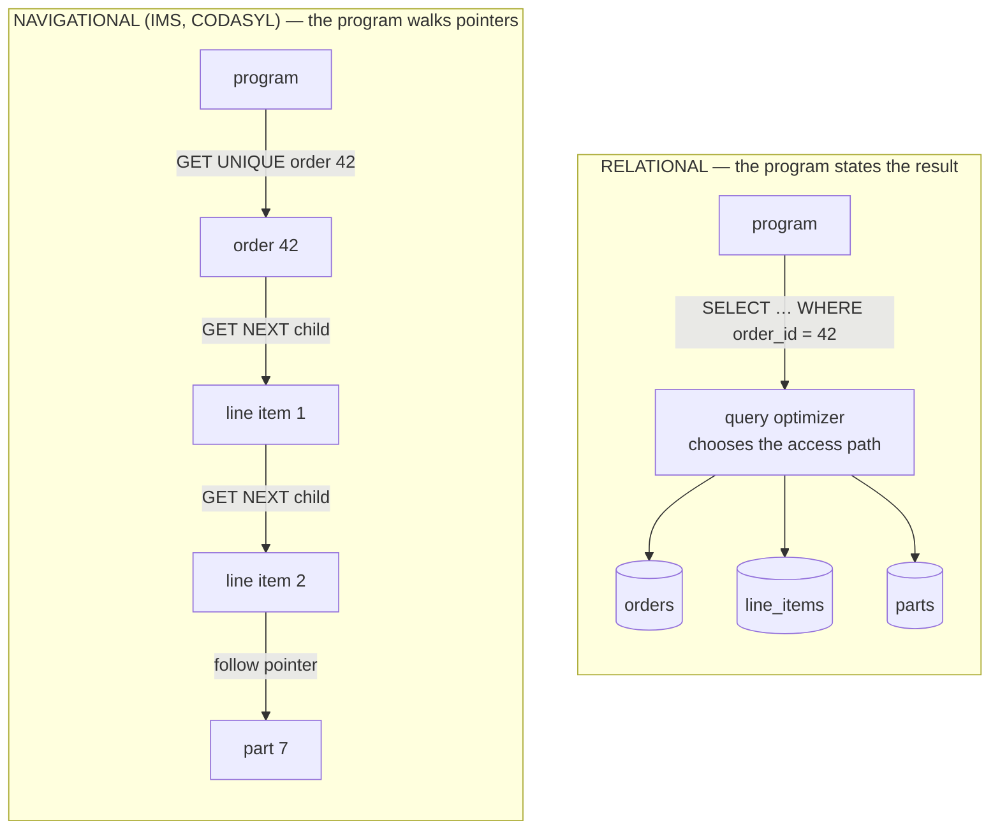
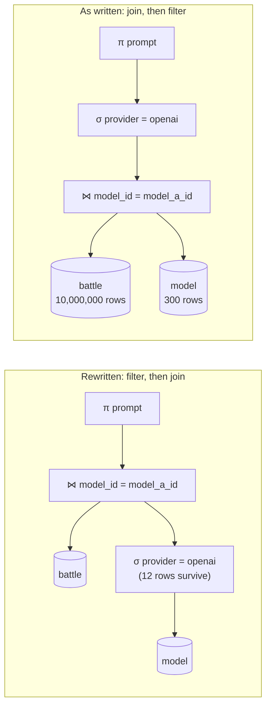
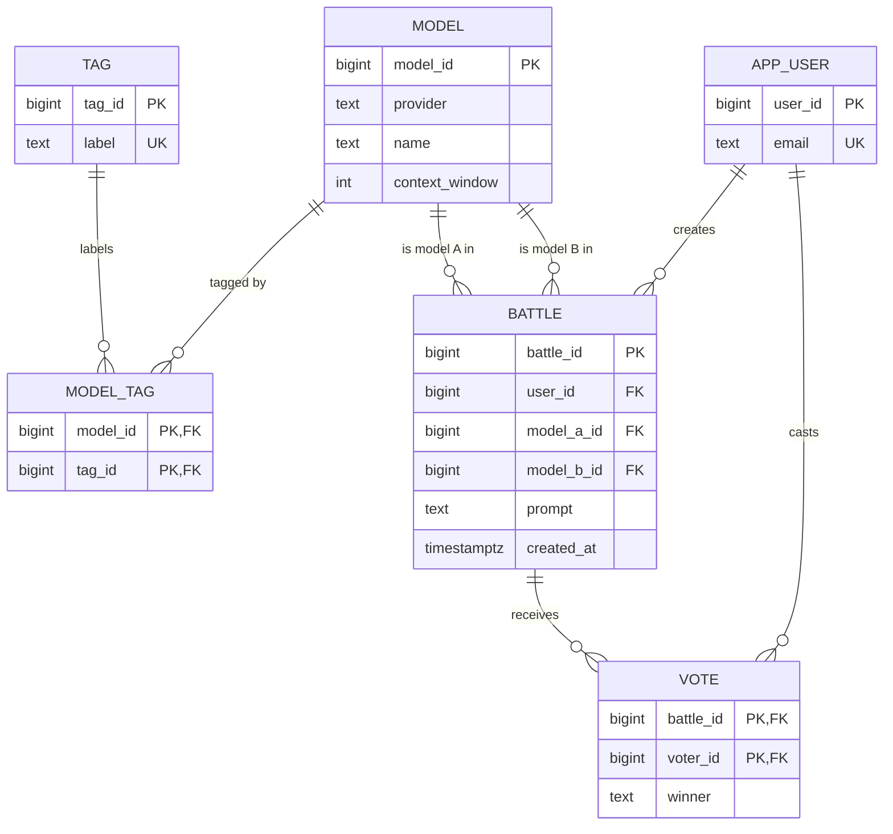

# M03 · Ch1 · §1 — The relational model: relations, keys, constraints and the algebra under SQL

> **Module:** Databases & Storage (from first principles)
> **Chapter:** The relational model from the ground up — relations, keys, normalization, how a query is planned and
> executed, B-tree indexes
> **Section:** This opens the module on the idea every relational database is built on, and it is deliberately **not a
> SQL (Structured Query Language) tutorial** — you write SQL already. It is the layer *under* the syntax: what a
> relation actually is (and the three ways a SQL table is not one), what a key guarantees and how to choose one, why
> constraints are a correctness tool rather than paperwork, how `NULL` breaks ordinary logic, the small algebra that
> every query compiles into, and how to model relationships without the four classic anti-patterns. Ch1 §2 builds
> normalization on this; Ch1 §3 shows how the algebra becomes an execution plan; Ch1 §4 opens the B-tree index.
> **Status:** ✅ finalized 2026-10-05 (body prepared 2026-09-28) — **opens M03.** One question, on §9's checklist: *"Do
> you mean the foreign-key column in the parent table should be indexed? What is actually happening when a column is
> indexed?"* — answered and measured on PostgreSQL 18 in §12 (it is the **child** table; 2,859 ms → 0.26 ms). It also
> corrected the body: "a cascade locks a table" is Oracle's behaviour, not PostgreSQL's (§9 reworded).
> **Prerequisites:** none inside the module. Helpful: **M01 Ch3 §3** (races — §4 and §5 turn on one), **M02 Ch2 §1**
> (idempotency keys, which are a unique constraint in disguise), and the 2026-06-26 reading on storage engines, which
> compared B-trees with LSM (log-structured merge) trees one layer *below* this section.

**Estimated study time:** 3–3.5 hours including the hands-on.

---

## Why this section exists — and how it's pitched

You flagged it yourself on the 2026-06-26 reading: isolation levels were hard to follow **"without a database-design
background"**, and you parked them for M03 Ch2. That was the right call, and this section is the background. You can
write parameterized SQL, you have run Postgres in production, and you just sized a database by its connection count
(M02 Ch4 §2 §13). What you have not had is the model underneath — and it matters, for three reasons.

**One: the relational model is the reason SQL is declarative.** You say *what* rows you want; the database decides
*how* to get them. That single separation — Codd called it **data independence** — is why the same query keeps
working after someone adds an index, why an optimizer exists at all (Ch1 §3), and why the pre-relational
databases it replaced are now museum pieces.

**Two: most data bugs are modeling bugs, not query bugs.** Double-counted revenue, orphaned rows, duplicate users, a
`NOT IN` that silently returns nothing — each comes from a gap between what the schema permits and what the
application assumes. The fix is almost never a cleverer query. It is a key, a constraint, or a different table
shape.

**Three: it is the vocabulary for the rest of the module.** Normalization, joins, query plans, transactions and
isolation are all defined in terms of relations, keys and constraints. Get these exact and Ch2's isolation anomalies
stop being mysterious.

The running example throughout is a small **head-to-head model-evaluation service** — users compare two models'
answers and vote — because its relationships are rich enough to show every idea: two references to the same table,
a many-to-many relationship, and a business rule that belongs in the database rather than in code.

---

## 1. Before Codd: why the relational model was a revolution

<details>
<summary><b>Vocabulary for this section</b> — terms and abbreviations used below (click to expand)</summary>

**Abbreviations**

| Short | Stands for | Meaning |
|---|---|---|
| **IMS** | Information Management System | IBM's hierarchical database, descended from a 1968 system built to track Apollo parts |
| **CODASYL** | Conference on Data Systems Languages | the committee that standardized the 1960s–70s network database model |
| **DBMS** | database management system | the software that stores, queries and protects a database |
| **SQL** | Structured Query Language | the standard relational query language, from IBM's System R project |
| **CACM** | Communications of the ACM (Association for Computing Machinery) | the journal that published Codd's 1970 paper |

**Terms**

| Term | Definition |
|---|---|
| **Navigational database** | a database queried by following stored pointers from record to record; the program encodes the access path |
| **Hierarchical model** | records arranged as a tree of parent and child segments (IMS) |
| **Network model** | records linked in a general graph of owner–member sets (CODASYL) |
| **Access path** | the specific route — which index, which pointer chain, which order — used to reach the data |
| **Data independence** | changing how data is physically stored or indexed without changing the programs that query it — Codd's central goal |
| **Declarative** | stating the result you want rather than the steps to produce it |
| **Query optimizer** | the component that chooses an access path for a declarative query |
| **Relational model** | Codd's model: all data as relations (sets of tuples), queried by operations on relations |

</details>

On 14 August 1968, at Rockwell's space division in Downey, California, IBM's Information Control System — the
precursor of **IMS** (Information Management System) — ran for the first time, tracking the bill of materials for the
Apollo spacecraft. It worked, and it shaped a decade of databases. IMS stored records as a **hierarchy** (a part
contains sub-parts), and the **CODASYL** (Conference on Data Systems Languages) network model generalized that into a
graph of linked records. Both were **navigational**: a program found data by starting at a record and *following
pointers* — "get the first child of this order, then the next sibling, then its parent."

That design has one crippling property: **the access path lives in the application.** A program written to walk
order → line-item → part breaks, or must be rewritten, when someone wants to ask the question the other way (which
orders contain this part?), or when the physical layout changes for performance. Every query was also an algorithm,
and every reorganization of storage was a change to every program.

In 1970 Edgar F. Codd, at IBM's San Jose lab, published *A Relational Model of Data for Large Shared Data Banks* in
**CACM** (Communications of the ACM). Its first sentence states the goal: users "should be protected from having to
know how the data is organized in the machine." His proposal:

- **Represent all data as relations** — plain tables of values — with no pointers visible to the user. A connection
  between two records is expressed by a *shared value* (a customer id appearing in both), not by a stored link.
- **Query with operations on whole relations** — select, project, join — that describe the *result*, not the route.
- **Let the system choose the access path.** Indexes and physical layout become the database's private business,
  changeable without touching a single query.

<!-- DIAGRAM:START -->


<details>
<summary>Diagram source (Mermaid)</summary>



</details>
<!-- DIAGRAM:END -->

**Figure 1** — navigational versus relational access: in the first the program encodes the route through stored
pointers; in the second it states the result and the database chooses the route.

This is **data independence**, and it is the idea to hold on to for the rest of the module. It is why the relational
model needed an **optimizer** (IBM's System R and Berkeley's Ingres built the first ones in the mid-1970s, and SQL came
out of System R), why the same SQL survives a new index, and why Ch1 §3 can exist. It also explains a
pattern you will see again in Ch3: **document databases reintroduce the hierarchy** — an order document containing its
line items — and with it the old trade-off. Reading the data along the hierarchy is fast; asking the other way round is
hard.

Fifty-six years later the idea still dominates:


**Figure 2** — database popularity by system and by model, from the DB-Engines Ranking for September 2026.

*Real data from db-engines.com, read 2026-09-28; source in `diagrams/01-relations-keys-and-constraints-figures.py`.
DB-Engines measures popularity — web mentions, search interest, job postings, Q&A and social activity — not
installations or data volume, so read it as mindshare.*

Two things in that figure are worth a sentence each. Relational systems hold about **71%** of the total score and
eight of the top ten places. And most of the non-relational leaders are labelled **multi-model**: they have been
adding relational features (SQL dialects, joins, transactions) rather than the other way round. That convergence is a
Ch3 theme.

---

## 2. The vocabulary, exactly: relations, tuples, attributes — and where SQL tables differ

<details>
<summary><b>Vocabulary for this section</b> — terms, abbreviations and every symbol in the formulas (click to expand)</summary>

**Abbreviations**

| Short | Stands for | Meaning |
|---|---|---|
| **SQL** | Structured Query Language | whose tables are *bags* of rows, not sets |
| **ID** | identifier | a value used to name one row |

**Symbols used in the formulas**

| Symbol | Reads as | Meaning |
|---|---|---|
| $R$ | "R" | a relation |
| $A_{1}, \dots, A_{n}$ | "A-one to A-n" | the attributes (column names) of a relation |
| $D_{i}$ | "D-i" | the domain — the set of allowed values — of attribute $A_{i}$ |
| $\times$ | "times" | the Cartesian product: every combination of one element from each set |
| $\subseteq$ | "is a subset of" | every element of the left is also in the right |
| $t$ | "t" | one tuple (one row) |

**Terms**

| Term | Definition |
|---|---|
| **Relation** | a named set of tuples that all share one heading — what SQL loosely calls a table |
| **Tuple** | one element of a relation: a value for every attribute — a row |
| **Attribute** | a named column, with a domain |
| **Domain** | the set of values an attribute may take — roughly its type plus constraints |
| **Heading** | the set of attribute names and domains; the relation's "shape" |
| **Body** | the set of tuples currently in the relation |
| **Degree** | the number of attributes |
| **Cardinality** | the number of tuples |
| **Set semantics** | no duplicates and no order — the relational model's rule |
| **Bag (multiset) semantics** | duplicates allowed — what SQL actually does |
| **`DISTINCT`** | the SQL keyword that removes duplicate rows from a result |
| **Keyset pagination** | paging by "rows after the last key seen" rather than by `OFFSET`; stable and fast |

</details>

In the relational model a **relation** $R$ over attributes $A_{1}, \dots, A_{n}$ with domains $D_{1}, \dots, D_{n}$ is a
**set of tuples**, each tuple giving one value from each domain:

$$R \subseteq D_{1} \times D_{2} \times \cdots \times D_{n}$$

That one line carries three properties that SQL tables **do not** have, and each has a real consequence:

**Table 1** — three properties of a mathematical relation that a SQL table lacks, and the bug each gap produces.

| Relation (the model) | SQL table (the product) | The consequence you will meet |
|---|---|---|
| **No duplicate tuples** — it is a set | duplicate rows are allowed unless a key forbids them | two identical rows cannot be told apart, updated or deleted individually; `SELECT` returns duplicates you then have to `DISTINCT` away |
| **No order of tuples** | no order either — but it *looks* ordered, because results often come back in insertion order | code that relies on "the order rows come back" breaks when the planner changes plan; `LIMIT 10` without `ORDER BY` is an arbitrary ten; `LIMIT … OFFSET` paging without a total order skips and repeats rows |
| **No order of attributes** — they are named | columns have a position, and `SELECT *` and `INSERT … VALUES (…)` without a column list depend on it | adding or reordering a column silently shifts data into the wrong fields |

The first row is the important one. **A SQL table without a key is a bag, and a bag is not a relation** — which is why
the next section exists. The second row is a failure mode you have likely met without naming it: an API that pages with
`ORDER BY created_at LIMIT 20 OFFSET 40` repeats or skips rows whenever two rows share a `created_at`, because ties have
no defined order. The fix is a total order — `ORDER BY created_at, id` — and, better, **keyset pagination** (`WHERE
(created_at, id) > (:last_created_at, :last_id)`), which is stable under inserts and does not scan skipped rows.

Our example's first relation, in SQL:

```sql
CREATE TABLE model (
    model_id        bigint GENERATED ALWAYS AS IDENTITY PRIMARY KEY,
    provider        text    NOT NULL,
    name            text    NOT NULL,
    context_window  integer NOT NULL CHECK (context_window > 0),
    UNIQUE (provider, name)
);
```

Its heading is `(model_id, provider, name, context_window)`, with domains such as "positive integers" for
`context_window` — expressed in SQL as a type plus a `CHECK`. Its degree is 4. Its body is whatever rows exist now.

---

## 3. Keys: what makes a row identifiable

<details>
<summary><b>Vocabulary for this section</b> — terms, abbreviations and every symbol in the formulas (click to expand)</summary>

**Abbreviations**

| Short | Stands for | Meaning |
|---|---|---|
| **PK** | primary key | the candidate key chosen as a table's main identifier |
| **UUID** | universally unique identifier | a 128-bit identifier; version 4 is random, version 7 is time-ordered |
| **RFC** | Request for Comments | the internet standards series; RFC 9562 defines UUID versions 1–8 |
| **IDOR** | insecure direct object reference | the vulnerability of fetching another user's object just by changing an id in the request |
| **ISBN** | International Standard Book Number | a classic "natural" key that turned out not to be unique or stable |

**Symbols used in the formulas**

| Symbol | Reads as | Meaning |
|---|---|---|
| $K$ | "K" | a set of attributes being tested as a key |
| $t_{1}, t_{2}$ | "t-one, t-two" | two tuples of the same relation |
| $t[K]$ | "t restricted to K" | the values tuple $t$ has for the attributes in $K$ |
| $\Rightarrow$ | "implies" | if the left holds, the right holds |

**Terms**

| Term | Definition |
|---|---|
| **Superkey** | any set of attributes whose values are never shared by two different rows |
| **Candidate key** | a minimal superkey — remove any attribute and it stops being unique |
| **Primary key** | the candidate key chosen as the main identifier; unique and not null |
| **Alternate key** | a candidate key that was not chosen as primary — still enforce it with `UNIQUE` |
| **Composite key** | a key made of more than one attribute |
| **Natural key** | a key made of real-world data (an email, an ISBN, a provider plus model name) |
| **Surrogate key** | a key with no meaning outside the database — an identity number or UUID |
| **Identity column** | a column whose value the database generates from a sequence |
| **Enumeration** | guessing valid ids by counting — the risk of exposing sequential ids |

</details>

A **superkey** of a relation is any set of attributes $K$ that no two distinct tuples share:

$$t_{1}[K] = t_{2}[K] \Rightarrow t_{1} = t_{2}$$

A **candidate key** is a *minimal* superkey: drop any attribute and uniqueness fails. In `model`, both `(model_id)` and
`(provider, name)` are candidate keys; `(model_id, name)` is a superkey but not a candidate key, because `model_id`
alone already suffices. One candidate key is chosen as the **primary key**; the others are **alternate keys** — and
**an alternate key you do not declare is a duplicate waiting to happen.** That is the single most common key mistake in
real schemas:

> A table with a surrogate primary key and no `UNIQUE` on its natural key permits two rows for the same real thing.
> `model_id` 17 and `model_id` 94 can both be `('openai', 'gpt-4o')`, the database is perfectly happy, and every count,
> leaderboard and join over that model is now split in two. The surrogate key made rows *identifiable*; it did nothing to
> make the *things* unique.

**Natural or surrogate?** It is a real trade-off, not a style preference:

**Table 2** — natural versus surrogate primary keys.

| | Natural key (email, ISBN, provider + name) | Surrogate key (identity number, UUID) |
|---|---|---|
| **Meaning** | carries real-world meaning | meaningless by design |
| **Stability** | changes when the world changes — people change emails, ISBNs get reissued, a provider renames a model | never needs to change |
| **Uniqueness** | often *assumed* unique and isn't: shared family emails, ISBNs reused by publishers | unique by construction |
| **Size in foreign keys** | every referencing table copies the whole natural value | 8 bytes (bigint) or 16 (UUID) |
| **Duplicate protection** | built in | **none** — you must also add `UNIQUE` on the natural key |

The defensible default for application tables is: **a surrogate primary key, plus `UNIQUE` on every natural candidate
key.** You get stable, compact references *and* the protection against duplicates. Natural keys remain the right
primary key for small, genuinely stable code tables (ISO — International Organization for Standardization — country
codes, currency codes) and for the association tables of §8.

**Which surrogate?** Three options, with consequences that reach into Ch1 §4:

- **`bigint` identity** — compact, sequential, cheap to index. Two costs: ids are **guessable** (a client that sees
  `/battles/1041` can try `/battles/1040` — the IDOR, insecure direct object reference, class of bug, which is an
  authorization failure the id merely makes easy; M10 Ch3), and they must be generated by one sequence, which matters
  when rows are created in several places at once.
- **UUID version 4** — 128 random bits: unguessable and generatable anywhere without coordination. Its cost is
  physical: random values scatter inserts across the whole primary-key index, so every insert touches a different
  page. On a large table that means far more page writes and cache misses than a sequential key — Ch1 §4's B-tree
  discussion shows why.
- **UUID version 7** (RFC 9562, 2024) — a 48-bit millisecond timestamp followed by random bits: generatable anywhere,
  unguessable enough for most purposes, and **roughly sequential**, so inserts land at the end of the index like a
  `bigint`. PostgreSQL 18 generates them natively with `uuidv7()`. For new systems that need distributed id generation,
  it is usually the right choice. (It does leak creation time, which occasionally matters.)

---

## 4. Foreign keys: relationships the database can enforce

<details>
<summary><b>Vocabulary for this section</b> — terms and abbreviations used below (click to expand)</summary>

**Abbreviations**

| Short | Stands for | Meaning |
|---|---|---|
| **FK** | foreign key | a constraint that values in one table must exist as a key in another |
| **PK** | primary key | the key being referenced |
| **ORM** | object–relational mapper | a library (SQLAlchemy, Django ORM) that maps rows to objects |

**Terms**

| Term | Definition |
|---|---|
| **Foreign key** | a column (or columns) whose values must match a candidate key in the referenced table |
| **Referencing (child) table** | the table holding the foreign key |
| **Referenced (parent) table** | the table whose key is pointed to |
| **Referential integrity** | the guarantee that every foreign-key value points at a row that exists |
| **Orphan row** | a child row whose parent no longer exists — impossible with a foreign key, common without one |
| **`ON DELETE CASCADE`** | deleting the parent deletes its children automatically |
| **`ON DELETE RESTRICT` / `NO ACTION`** | deleting a parent that still has children fails (the default is `NO ACTION`, checked at the end of the statement) |
| **`ON DELETE SET NULL`** | deleting the parent sets the children's foreign key to `NULL` |
| **Check-then-act race** | reading that a condition holds, then acting on it, while another transaction changes it in between |
| **Sequential scan** | reading every row of a table because no index can answer the question |
| **Soft delete** | marking a row deleted (`deleted_at`) instead of removing it — which foreign keys do not understand |

</details>

The relationships in our example are expressed by shared values, exactly as Codd proposed:

```sql
CREATE TABLE app_user (
    user_id  bigint GENERATED ALWAYS AS IDENTITY PRIMARY KEY,
    email    text NOT NULL UNIQUE
);

CREATE TABLE battle (
    battle_id   bigint GENERATED ALWAYS AS IDENTITY PRIMARY KEY,
    user_id     bigint NOT NULL REFERENCES app_user (user_id),
    model_a_id  bigint NOT NULL REFERENCES model (model_id),
    model_b_id  bigint NOT NULL REFERENCES model (model_id),
    prompt      text   NOT NULL,
    created_at  timestamptz NOT NULL DEFAULT now(),
    CHECK (model_a_id <> model_b_id)
);
```

A **foreign key** says: every value in `battle.user_id` must exist as a `user_id` in `app_user`. The database then
refuses, at write time, any insert or update that would violate it, and any delete of a user who still has battles.
That guarantee is **referential integrity**, and it removes a whole category of bug — the **orphan row** pointing at
nothing — which otherwise surfaces much later as a join that silently drops rows, or as a `None` in the middle of an
API response.

**"We check it in the application" does not work.** The common alternative is for the code to check that the parent
exists and then insert the child. That is a **check-then-act race** (M01 Ch3 §3): between the check and the insert,
another transaction can delete the parent. The window is small and the bug is real, and it appears under load, which is
exactly when you are least able to debug it. A foreign key is checked **inside** the database with the right locking,
so the race cannot occur. The same argument applies to every constraint in §5.

**Choosing the delete behaviour is a product decision, not a default:**

**Table 3** — what each `ON DELETE` action does, and when it is right.

| Action | Deleting the parent… | Right when | Failure mode |
|---|---|---|---|
| `NO ACTION` / `RESTRICT` (default) | fails while children exist | the children are valuable records — votes, invoices, audit rows | none; it forces you to decide explicitly |
| `CASCADE` | deletes all children, recursively | the children are *parts* of the parent and meaningless without it (a battle's votes) | one careless `DELETE` on a top-level row removes a tree of data; cascades chain through several tables |
| `SET NULL` | keeps children, blanks the reference | the relationship is optional and history should survive (the user who *created* a shared prompt) | the column must be nullable, and `NULL` has the costs of §6 |

**The performance trap PostgreSQL documents and many people miss:** declaring a foreign key **does not create an index
on the referencing column.** The PostgreSQL manual says so directly. The referenced side always has one (it is a key);
the referencing side has one only if you create it. Without it, every delete or key update on the parent must find the
children by a **sequential scan** of the child table — so deleting one user from a table with ten million battles reads
ten million rows, and a cascade does it once per level. The rule of thumb: **index every foreign-key column** unless you
have measured that you do not need to (`CREATE INDEX ON battle (user_id);`). §12 measures the difference on ten million
rows and explains what the index physically is.

Two honest caveats. Very high-write systems sometimes drop foreign keys for throughput, and sharded databases often
cannot enforce them across shards (Ch4) — both are deliberate trades, made knowing that integrity then becomes a batch
job's problem. And **soft deletes** (`deleted_at` set, row kept) are invisible to foreign keys: the parent is "deleted"
to the application and still present to the database, so the constraint protects nothing. If you soft-delete, decide
what children should see.

---

## 5. Constraints: make the bad state unrepresentable

<details>
<summary><b>Vocabulary for this section</b> — terms and abbreviations used below (click to expand)</summary>

**Abbreviations**

| Short | Stands for | Meaning |
|---|---|---|
| **DDL** | data definition language | the SQL statements that define schema — `CREATE`, `ALTER` |
| **GiST** | Generalized Search Tree | a PostgreSQL index type that supports overlap tests, used by exclusion constraints |

**Terms**

| Term | Definition |
|---|---|
| **Constraint** | a rule the database enforces on every write |
| **`NOT NULL`** | the column must have a value |
| **`UNIQUE`** | no two rows share these values (with `NULL` handling, §6) |
| **`CHECK`** | a boolean condition every row must satisfy |
| **Exclusion constraint** | PostgreSQL's generalization of `UNIQUE`: no two rows may satisfy a given operator together, such as "time ranges overlap" |
| **Partial unique index** | a unique index over only the rows matching a `WHERE` clause — "at most one *active* row per user" |
| **Invariant** | a rule that must always hold about the data |
| **Idempotency key** | a client-chosen unique id that makes a retried request safe (M02 Ch2 §1) — enforced by a unique constraint |
| **Unrepresentable state** | a data state the schema makes impossible to store, rather than merely unlikely |

</details>

The previous section's argument generalizes into the most useful design principle in this module: **every invariant
that the database can enforce, it should enforce.** Application checks run in one process, at one moment, and race
against every other process; a constraint runs inside the database, on every write, from every client — including the
migration script, the admin console and the next service someone writes in a different language.

**Table 4** — the constraint toolbox, with a real invariant each one enforces in the example.

| Constraint | Invariant it enforces | Example |
|---|---|---|
| `NOT NULL` | this fact always exists | a battle always has a prompt |
| `UNIQUE` | no two rows describe the same thing | one row per `(provider, name)`; one account per email |
| `CHECK` | a row-level rule | `context_window > 0`; `model_a_id <> model_b_id` |
| `FOREIGN KEY` | the referenced thing exists | every battle's user exists |
| **Partial unique index** | uniqueness among some rows only | `CREATE UNIQUE INDEX ON battle (user_id) WHERE status = 'open';` — at most one open battle per user |
| **Exclusion constraint** | no two rows conflict under an operator | no two bookings of one GPU overlap in time: `EXCLUDE USING gist (gpu_id WITH =, during WITH &&)` |
| `UNIQUE` on a client token | a retried request is applied once | `UNIQUE (idempotency_key)` — M02 Ch2 §1's pattern is this constraint |

The last two rows deserve a comment. The **partial unique index** and the **exclusion constraint** are how you make a
rule like "one open battle per user" or "no double-booking" impossible to violate. They are the database-native answer to
exactly the problems people usually solve with an advisory lock around check-then-insert code. A lock *serializes the
check*; a constraint makes *the bad state unrepresentable* — and when a conflict happens, the second writer gets a clean
unique-violation error it can handle, rather than a lock it may forget to take. Ch2 returns to this choice when it
compares locks, `SELECT … FOR UPDATE`, `SERIALIZABLE` and constraints.

Two practical notes. Constraint errors are **named**, so name them (`CONSTRAINT battle_distinct_models CHECK (…)`) and
map the name to a clear API error rather than a 500. And adding a constraint to a large existing table can lock or scan
it; PostgreSQL lets you add a foreign key or check as `NOT VALID` and `VALIDATE` it separately — a migration concern
worth knowing exists.

---

## 6. `NULL` and three-valued logic

<details>
<summary><b>Vocabulary for this section</b> — terms, abbreviations and every symbol in the formulas (click to expand)</summary>

**Abbreviations**

| Short | Stands for | Meaning |
|---|---|---|
| **3VL** | three-valued logic | logic with TRUE, FALSE and UNKNOWN |
| **SQL** | Structured Query Language | whose `NULL` means "no value here" |

**Symbols used in the formulas**

| Symbol | Reads as | Meaning |
|---|---|---|
| $\wedge$ | "and" | logical conjunction |
| $\vee$ | "or" | logical disjunction |
| $\neg$ | "not" | logical negation |

**Terms**

| Term | Definition |
|---|---|
| **`NULL`** | a marker for a missing or inapplicable value — not a value, and not equal to anything, including itself |
| **UNKNOWN** | the third truth value, produced by any comparison involving `NULL` |
| **`IS NULL` / `IS NOT NULL`** | the only correct tests for `NULL` |
| **`IS DISTINCT FROM`** | a comparison that treats two `NULL`s as equal and never returns UNKNOWN |
| **`COALESCE`** | returns its first non-`NULL` argument — a way to supply a default |
| **Anti-join** | "rows in A with no match in B" — `NOT EXISTS`, or a `LEFT JOIN … WHERE b.key IS NULL` |
| **`NULLS NOT DISTINCT`** | the PostgreSQL 15+ clause that makes a unique constraint treat `NULL`s as equal |

</details>

`NULL` means "there is no value here" — unknown, or not applicable. It is not zero, not an empty string, and **not equal
to anything, including another `NULL`**. So a comparison involving `NULL` is neither true nor false; it is **UNKNOWN**,
and SQL's logic has three values instead of two:

**Table 5** — three-valued logic: how `AND`, `OR` and `NOT` combine TRUE, FALSE and UNKNOWN.

| $p$ | $q$ | $p \wedge q$ | $p \vee q$ | $\neg p$ |
|---|---|---|---|---|
| TRUE | UNKNOWN | UNKNOWN | TRUE | FALSE |
| FALSE | UNKNOWN | FALSE | UNKNOWN | TRUE |
| UNKNOWN | UNKNOWN | UNKNOWN | UNKNOWN | UNKNOWN |

The rule that turns this into bugs: **`WHERE` keeps a row only when its condition is TRUE** — UNKNOWN is discarded along
with FALSE. Five consequences, each of which ships regularly:

1. **`= NULL` matches nothing.** `WHERE deleted_at = NULL` returns no rows, ever; the comparison is UNKNOWN for every row.
   Use `IS NULL`.
2. **`NOT IN` with a `NULL` in the list returns nothing.** `WHERE user_id NOT IN (SELECT user_id FROM banned)` — if a
   single `banned.user_id` is `NULL`, then for every row the test includes "`user_id <> NULL`", which is UNKNOWN, so the
   whole `NOT IN` is at best UNKNOWN and **no row qualifies**. The query does not error; it silently returns an empty
   result. The PostgreSQL wiki's *Don't Do This* page lists it for exactly this reason. Write the anti-join as `NOT
   EXISTS (SELECT 1 FROM banned b WHERE b.user_id = u.user_id)`, which has no such trap.
3. **Negating a condition does not give you the other rows.** `WHERE score > 5` and `WHERE NOT (score > 5)` together do
   not cover the table: rows with a `NULL` score are in neither.
4. **Aggregates skip `NULL`s, and `COUNT` has two meanings.** `COUNT(*)` counts rows; `COUNT(score)` counts non-null
   scores; `AVG(score)` averages only the non-null ones — which is a different number from "treat missing as zero".
5. **`UNIQUE` allows many `NULL`s.** Because two `NULL`s are not equal, a unique column accepts any number of them.
   Usually that is what you want (many users with no phone number); when it is not, PostgreSQL 15 added `UNIQUE NULLS NOT
   DISTINCT`.

The design conclusion is short: **`NOT NULL` is the default you should reach for**, and every nullable column should be
nullable on purpose, with a clear meaning for its `NULL`. When you genuinely need to compare possibly-null values, `IS
DISTINCT FROM` gives you ordinary two-valued equality. (Codd himself later proposed *two* kinds of null — "missing but
applicable" and "inapplicable" — precisely because one marker carries two meanings. SQL kept one.)

---

## 7. The relational algebra: what every query compiles into

<details>
<summary><b>Vocabulary for this section</b> — terms, abbreviations and every symbol in the formulas (click to expand)</summary>

**Abbreviations**

| Short | Stands for | Meaning |
|---|---|---|
| **SQL** | Structured Query Language | a declarative surface over the algebra |
| **CTE** | common table expression | a named sub-query introduced with `WITH` |

**Symbols used in the formulas**

| Symbol | Reads as | Meaning |
|---|---|---|
| $\sigma_{c}(R)$ | "sigma c of R" | **selection**: the tuples of $R$ satisfying condition $c$ (SQL `WHERE`) |
| $\pi_{A}(R)$ | "pi A of R" | **projection**: $R$ reduced to the attributes in $A$ (SQL's `SELECT` list) |
| $R \times S$ | "R times S" | **Cartesian product**: every pairing of a tuple of $R$ with a tuple of $S$ |
| $R \cup S$ | "R union S" | tuples in either relation (same heading required) |
| $R - S$ | "R minus S" | tuples in $R$ but not in $S$ |
| $\rho_{x}(R)$ | "rho x of R" | **rename**: $R$ under a new name — how a table is joined to itself |
| $R \bowtie_{c} S$ | "R join S on c" | **join**: $\sigma_{c}(R \times S)$ — pairs satisfying $c$ |
| $\lvert R \rvert$ | "size of R" | the cardinality — number of tuples |

**Terms**

| Term | Definition |
|---|---|
| **Relational algebra** | the small set of operations on relations that every relational query can be expressed in |
| **Closure** | every operation takes relations and returns a relation, so operations compose freely |
| **Operator tree** | a query drawn as a tree of algebra operations, leaves being tables |
| **Equivalence rule** | a rewrite that produces the same result, such as pushing a selection below a join |
| **Inner join** | only pairs that match |
| **Left outer join** | every row of the left, with the right's columns `NULL` where nothing matches |
| **Semi-join** | rows of the left that have at least one match — `EXISTS` |
| **Anti-join** | rows of the left that have no match — `NOT EXISTS` |
| **Fan-out** | a join multiplying rows because one left row matches many right rows |
| **Logical processing order** | the order in which a `SELECT`'s clauses are defined to apply, which differs from the order they are written |

</details>

Codd's second contribution was to show that a handful of operations on relations are enough to express any query. Six
are primitive:

- **Selection** $\sigma_{c}(R)$ — keep the tuples satisfying $c$. (SQL's `WHERE`; the name clash with SQL's `SELECT`
  keyword is an unfortunate historical accident.)
- **Projection** $\pi_{A}(R)$ — keep only the attributes in $A$. (SQL's select list.)
- **Cartesian product** $R \times S$ — pair every tuple of $R$ with every tuple of $S$, so $\lvert R \times S \rvert =
  \lvert R \rvert \cdot \lvert S \rvert$.
- **Union** $R \cup S$ and **difference** $R - S$ — for relations with the same heading.
- **Rename** $\rho_{x}(R)$ — needed to use one relation twice, as our `battle` does with `model`.

Everything else is derived. The **join** is a product followed by a selection, $R \bowtie_{c} S = \sigma_{c}(R \times
S)$ — which is why a join with a forgotten condition returns $\lvert R \rvert \cdot \lvert S \rvert$ rows.

The key property is **closure**: each operation takes relations and returns a relation, so they compose like arithmetic.
That is what makes a query an **expression** the database can rewrite. Take "prompts in battles involving any
OpenAI model":

```sql
SELECT b.prompt
FROM battle b
JOIN model m ON m.model_id = b.model_a_id
WHERE m.provider = 'openai';
```

Its algebra, written directly from the SQL, is
$\pi_{\text{prompt}}\left(\sigma_{\text{provider} = \text{openai}}\left(\text{battle} \bowtie \text{model}\right)\right)$ —
join everything, then filter. An equivalent expression pushes the selection *below* the join:
$\pi_{\text{prompt}}\left(\text{battle} \bowtie \sigma_{\text{provider} = \text{openai}}(\text{model})\right)$ — filter
the small table first, then join only the survivors. Same result, often vastly less work:

<!-- DIAGRAM:START -->


<details>
<summary>Diagram source (Mermaid)</summary>



</details>
<!-- DIAGRAM:END -->

**Figure 3** — the same query as two operator trees: pushing the selection below the join filters 300 models to 12
before joining, and produces an identical result.

This is the whole foundation of **query optimization**, and it is only possible because the query is declarative. The
optimizer enumerates equivalent trees using rules like this one, estimates the cost of each, and picks the cheapest —
which is Ch1 §3. The navigational databases of §1 could not do this, because a program's pointer walk *is*
its execution plan.

**Two SQL behaviours the algebra explains.**

**The clauses do not run in the order you write them.** A `SELECT` is defined to apply `FROM` and `JOIN` first, then
`WHERE`, `GROUP BY`, `HAVING`, then the select list, then `DISTINCT`, `ORDER BY` and `LIMIT`. That is why a column alias
defined in the select list cannot be used in `WHERE` (it does not exist yet) but can be used in `ORDER BY`; and why
`HAVING` filters groups where `WHERE` filters rows.

**Join fan-out double-counts.** This is the most common *silent* wrong answer in analytical SQL. Suppose we add
`vote(battle_id, voter_id, winner)` and `flag(battle_id, reason)`, and ask for each user's number of votes received and
flags received:

```sql
SELECT b.user_id, count(v.*) AS votes, count(f.*) AS flags
FROM battle b
LEFT JOIN vote v ON v.battle_id = b.battle_id
LEFT JOIN flag f ON f.battle_id = b.battle_id
GROUP BY b.user_id;
```

A battle with 3 votes and 2 flags joins into $3 \times 2 = 6$ rows before grouping, so it reports **6 votes and 6
flags**. Nothing errors. The fix is to aggregate each one-to-many relationship **separately** (two sub-queries or CTEs,
each grouped by battle, then joined) — or, for a single relationship, to check that the join cannot multiply rows. The
general rule: **joining two independent one-to-many relationships from the same parent always multiplies.** Knowing the
algebra — a join is a product, filtered — is what makes this obvious rather than surprising.

Finally, three join shapes worth naming because they have different algebra and different plans: **inner** (matching
pairs only), **left outer** (all left rows, `NULL`-padded), and the **semi-join** and **anti-join** — "has at least
one" and "has none" — which you write as `EXISTS` and `NOT EXISTS`. They return each left row at most once, so they
**cannot fan out**, which makes them the right tool whenever the question is "whether", not "which".

---

## 8. Modelling relationships — and the four anti-patterns

<details>
<summary><b>Vocabulary for this section</b> — terms and abbreviations used below (click to expand)</summary>

**Abbreviations**

| Short | Stands for | Meaning |
|---|---|---|
| **ER** | entity–relationship | the diagramming style for things and the relationships between them |
| **EAV** | entity–attribute–value | the anti-pattern of storing every attribute as a row of (entity, name, value) |
| **1NF** | first normal form | every attribute holds one atomic value — the subject of Ch1 §2 |
| **JSON / JSONB** | JavaScript Object Notation / its binary PostgreSQL form | a document-shaped value stored in one column |
| **FK** | foreign key | the enforcement that polymorphic associations cannot have |

**Terms**

| Term | Definition |
|---|---|
| **Cardinality (of a relationship)** | how many of each side may relate: one-to-one, one-to-many, many-to-many |
| **One-to-many** | one parent, many children — a foreign key on the "many" side |
| **Many-to-many** | expressed with a junction table holding two foreign keys |
| **Junction (association) table** | a table whose rows are pairs of keys, with a composite primary key |
| **Polymorphic association** | one column pair (`target_type`, `target_id`) pointing at different tables — which no foreign key can enforce |
| **Multi-valued column** | a list stored inside one column (`'nlp,code,math'`) |
| **Atomic value** | a value the database treats as indivisible for querying and constraints |

</details>

Every relationship between two kinds of thing has a **cardinality**, and each has one standard shape:

- **One-to-many** — a user has many battles. Put a foreign key on the "many" side (`battle.user_id`). Never the reverse:
  a parent cannot hold a list of children in one column.
- **Many-to-many** — a model has many tags, a tag applies to many models. Neither side can hold the foreign key, so the
  relationship becomes its own **junction table**, whose rows are pairs of keys and whose primary key is the pair.
- **One-to-one** — a user has at most one profile. A foreign key that is *also* `UNIQUE` (or the child's primary key
  doubling as the foreign key). Often a sign the two could be one table, unless one side is large, optional or
  differently secured.
- **Two relationships to the same table** — a battle references `model` twice. Two foreign keys, and in queries two
  copies of the table under different names: the algebra's rename, $\rho$.

The whole example, as an entity–relationship diagram:

<!-- DIAGRAM:START -->


<details>
<summary>Diagram source (Mermaid)</summary>



</details>
<!-- DIAGRAM:END -->

**Figure 4** — the running example as an entity–relationship diagram: two foreign keys from `BATTLE` to `MODEL`, a
junction table for the many-to-many tag relationship, and `VOTE` keyed by the pair (battle, voter) so each voter votes
once per battle.

Note what `VOTE`'s composite primary key does. It is not decoration: **`PRIMARY KEY (battle_id, voter_id)` is the rule
"one vote per voter per battle", enforced.** That is §5's principle, applied by the choice of key.

**The four anti-patterns** — each stores a relationship in a way the database cannot see, and so cannot enforce or
index. Bill Karwin's *SQL Antipatterns* is the standard catalogue.

**Table 6** — four common relationship anti-patterns, what breaks, and the standard fix.

| Anti-pattern | Looks like | What breaks | Fix |
|---|---|---|---|
| **Multi-valued column** | `model.tags = 'nlp,code,math'` | no foreign key to real tags; "models tagged `code`" needs string matching and cannot use an index properly; renaming a tag means rewriting strings; violates first normal form (Ch1 §2) | a junction table |
| **Entity–attribute–value** | `attribute(entity_id, name, value text)` for everything | no types (every value is text), no `NOT NULL`, no `CHECK`, no foreign keys; reconstructing one entity takes one join per attribute | real columns; for genuinely open-ended attributes, a `jsonb` column |
| **Polymorphic association** | `comment(target_type, target_id)` pointing at models *or* battles | a foreign key can reference only one table, so `target_id` can point at nothing | one nullable foreign key per target with a `CHECK` that exactly one is set, or one junction table per target |
| **Repeated columns** | `tag1`, `tag2`, `tag3` | a fourth tag needs a migration; "has tag X" must check every column | a junction table |

**When JSON is the right answer.** `jsonb` is not an anti-pattern; it is a tool with a boundary. It is right for data that
is **genuinely schemaless to the database** — a provider's raw response payload, per-integration settings, sparse
attributes you display but never join on or constrain. It is wrong for anything you will filter on regularly, join
on, aggregate, or need to keep consistent, because every guarantee in §3–§5 stops at the column's edge. A useful test:
*if a field inside the JSON ever appears in a `WHERE`, `JOIN` or `GROUP BY`, it probably wants to be a column.*

---

## 9. Failure modes — the modelling checklist

<details>
<summary><b>Vocabulary for this section</b> — terms and abbreviations used below (click to expand)</summary>

**Abbreviations**

| Short | Stands for | Meaning |
|---|---|---|
| **FK** | foreign key | a reference the database enforces |
| **UUID** | universally unique identifier | whose version 4 form scatters inserts |
| **IDOR** | insecure direct object reference | fetching another user's object by editing an id |

**Terms**

| Term | Definition |
|---|---|
| **Silent wrong answer** | a query that succeeds and returns an incorrect result — the most expensive kind of data bug |
| **Missing alternate key** | a natural key that exists in the world but has no `UNIQUE` constraint |
| **Unindexed foreign key** | a foreign-key column with no index, making parent deletes scan the child table |
| **Implicit order** | code relying on the order rows happen to come back in |

</details>

- **Duplicate "things" under different ids.** A surrogate key with no `UNIQUE` on the natural key (§3). The tell:
  leaderboards or counts that are split between two rows with the same name.
- **Orphan rows.** Relationships checked in application code instead of with a foreign key (§4) — a check-then-act
  race. The tell: joins that drop rows, and `None` where a parent should be.
- **Deleting one parent takes seconds.** An unindexed foreign-key column on the *child* table (§4, §12). The tell: in
  `EXPLAIN ANALYZE` of a `DELETE` on the parent, a large `Trigger for constraint …_fkey` time — the child-table scan
  runs inside that trigger, so it does not appear as a plan node.
- **A business rule violated "impossibly".** An invariant enforced only in code, raced by a second worker (§5). Fix:
  `UNIQUE`, a partial unique index, `CHECK` or an exclusion constraint.
- **An anti-join returns nothing.** `NOT IN` against a sub-query containing a `NULL` (§6). Use `NOT EXISTS`.
- **Counts or sums that are too large.** Join fan-out across two one-to-many relationships (§7). Aggregate separately.
- **Pages that repeat or skip rows.** `LIMIT … OFFSET` without a total order (§2). Add a tiebreaker, or use keyset
  pagination.
- **Data landing in the wrong column after a migration.** Positional `INSERT … VALUES` or `SELECT *` (§2). Always name
  columns.
- **Insert throughput collapsing as a table grows.** Random UUID version 4 primary keys scattering writes across the index
  (§3; the mechanism is Ch1 §4). Consider UUID version 7 or an identity column.
- **Other users' objects fetched by editing an id.** Sequential ids make enumeration trivial, but the bug is the
  missing authorization check (§3; M10 Ch3).
- **A tag, category or attribute nobody can query.** A multi-valued column, EAV or a polymorphic association (§8).

---

## 10. Check your understanding

1. What did Codd mean by **data independence**, and which later component of every relational database only exists
   because of it?
2. Give two ways a SQL table differs from a mathematical relation, and the concrete bug each difference can cause.
3. In `model(model_id, provider, name, context_window)`, list the candidate keys. Why is `(model_id, name)` not one?
4. A teammate's `users` table has `id bigint PRIMARY KEY` and an `email` column with no other constraint. What can go
   wrong, and what one-line change fixes it?
5. "We don't need foreign keys; the service checks the parent exists before inserting." What is wrong with this, even
   if the service is bug-free?
6. Deleting one row from `app_user` takes eight seconds on a large database. What is the most likely cause, and how do
   you confirm and fix it?
7. `SELECT * FROM users WHERE id NOT IN (SELECT user_id FROM banned)` returns zero rows, although most users are not
   banned. Why, and how should it be written?
8. Write the relational algebra for "names of models that have been model A in at least one battle", and say which SQL
   form expresses it without any risk of duplicates.
9. A report joins `battle` to both `vote` and `flag` and shows every battle with far more votes than it has. What is
   happening, and what is the fix?
10. When is a `jsonb` column the right design, and what is a quick test for when a field inside it should become a real
    column?

<details>
<summary><b>Answers</b></summary>

1. **Data independence means applications are insulated from how data is physically stored and accessed**, so storage
   and indexing can change without rewriting queries (§1). It is why relational databases have a **query optimizer**:
   because the query states only the result, something must choose the access path — impossible in navigational
   databases, where the program's pointer walk *was* the plan (§1, §7; Ch1 §3).
2. Any two of three (§2, Table 1). **Duplicates:** a table without a key can hold identical rows, which cannot be
   addressed individually and inflate results. **Row order:** tables have no order, so `LIMIT` without `ORDER BY`, or
   `OFFSET` paging with ties in the sort key, returns arbitrary, skipped or repeated rows. **Column position:** positional
   `INSERT … VALUES` or `SELECT *` breaks when a column is added or reordered.
3. **`(model_id)` and `(provider, name)`** (§3). `(model_id, name)` is a superkey — it is unique — but not *minimal*,
   because `model_id` alone is already unique; a candidate key must lose uniqueness if any attribute is removed.
4. **Two accounts can exist for the same email**, since the surrogate key makes rows identifiable but does nothing to
   stop duplicate *things* (§3). Fix: `ALTER TABLE users ADD UNIQUE (email);` — declare the alternate key. (Decide first
   how to treat case: `UNIQUE (lower(email))` as a unique index if `A@x.com` and `a@x.com` are the same person.)
5. **It is a check-then-act race** (§4; M01 Ch3 §3): between the service's check and its insert, another transaction
   can delete the parent, leaving an orphan. The service being bug-free does not help, because the bug is in the
   interleaving of two correct programs. A foreign key is checked inside the database with proper locking, and it also
   protects against every *other* writer — migrations, scripts, other services.
6. **An unindexed foreign-key column in a child table** (§4). The delete must check or cascade to children, and without
   an index on the referencing column that means a sequential scan of the child table (once per referencing table, and
   once per cascade level). Confirm with `EXPLAIN ANALYZE DELETE …` (inside a transaction you roll back) and look for a
   large `Trigger for constraint …_fkey` time — the child scan runs inside that trigger (§12 measures it); fix with `CREATE INDEX ON child (parent_id);`. PostgreSQL
   documents that foreign keys do not create this index automatically.
7. **At least one `banned.user_id` is `NULL`** (§6). `x NOT IN (…, NULL)` includes `x <> NULL`, which is UNKNOWN, so no
   row's condition is TRUE and `WHERE` keeps nothing — silently. Write it as `SELECT * FROM users u WHERE NOT EXISTS
   (SELECT 1 FROM banned b WHERE b.user_id = u.id)`, which is unaffected by `NULL`s (and state the column list rather
   than `SELECT *`, per §2).
8. $\pi_{\text{name}}\left(\text{model} \bowtie_{c} \text{battle}\right)$, where the join condition $c$ is
   `model.model_id = battle.model_a_id` — join,
   then project (§7). Because the relational model uses sets, the projection has no duplicates; SQL's plain `JOIN`
   would return a model once **per battle**. The SQL that matches the algebra is a **semi-join**: `SELECT name FROM model
   m WHERE EXISTS (SELECT 1 FROM battle b WHERE b.model_a_id = m.model_id)` — each model at most once, no `DISTINCT`
   needed.
9. **Join fan-out** (§7): a battle with $v$ votes and $f$ flags becomes $v \times f$ rows before grouping, so both counts
   are multiplied. Fix: aggregate each one-to-many relationship **separately** — a sub-query or CTE counting votes per
   battle and another counting flags per battle — then join those per-battle results.
10. **`jsonb` is right for data that is genuinely schemaless to the database** — raw provider payloads, per-integration
    settings, sparse display-only attributes — which you never constrain, join or aggregate (§8). The test: **if a field
    inside it appears in a `WHERE`, `JOIN` or `GROUP BY`, or needs a constraint, it should probably be a column**,
    because keys, foreign keys and checks all stop at the column's edge.

</details>

---

## 11. Optional: get your hands dirty (45–60 min)

Everything here needs Docker and `psql`. Start a throwaway PostgreSQL 18:

```sh
docker run -d --name m03 -e POSTGRES_PASSWORD=pw -p 5433:5432 postgres:18
docker exec -it m03 psql -U postgres
```

**1. Build the schema.** Paste the `model`, `app_user` and `battle` definitions from §2 and §4, and add a vote table:

```sql
CREATE TABLE vote (
    battle_id bigint NOT NULL REFERENCES battle (battle_id) ON DELETE CASCADE,
    voter_id  bigint NOT NULL REFERENCES app_user (user_id),
    winner    text   NOT NULL CHECK (winner IN ('a', 'b', 'tie')),
    PRIMARY KEY (battle_id, voter_id)
);
```

Now try to break each rule and read the error: insert a battle whose two models are the same; insert a second vote by
the same voter on the same battle; insert a battle for a user id that does not exist; delete a user who has a battle.
Each error names its constraint — that name is what an API should map to a clean response.

**2. Watch `NOT IN` fail silently.**

```sql
CREATE TABLE banned (user_id bigint);
INSERT INTO app_user (email) VALUES ('a@x.com'), ('b@x.com'), ('c@x.com');
INSERT INTO banned VALUES (1), (NULL);
SELECT email FROM app_user WHERE user_id NOT IN (SELECT user_id FROM banned);                 -- 0 rows
SELECT email FROM app_user u WHERE NOT EXISTS (SELECT 1 FROM banned b WHERE b.user_id = u.user_id);  -- 2 rows
SELECT NULL = NULL, NULL IS NULL, NULL IS DISTINCT FROM NULL;
```

**3. Find the unindexed foreign key.** Generate a million battles and time a user delete before and after indexing:

```sql
INSERT INTO model (provider, name, context_window) VALUES ('p', 'm1', 8192), ('p', 'm2', 8192);
INSERT INTO battle (user_id, model_a_id, model_b_id, prompt)
SELECT 2 + (g % 2), 1, 2, 'p' FROM generate_series(1, 1000000) g;
INSERT INTO app_user (email) VALUES ('d@x.com');                  -- user 4, no battles
\timing on
BEGIN; DELETE FROM app_user WHERE user_id = 4; ROLLBACK;           -- still checks battle.user_id
CREATE INDEX ON battle (user_id);
BEGIN; DELETE FROM app_user WHERE user_id = 4; ROLLBACK;
```

The first delete has to scan a million rows to prove user 4 has no battles; the second answers from the index. That
gap, multiplied by table size, is §4's trap.

**4. Reproduce fan-out.** Add three votes and create a `flag` table with two flags for one battle, then run §7's two-join
query and the per-relationship version side by side, and compare the numbers.

**5. Feel the difference between UUID versions.** `SELECT uuidv4(), uuidv7() FROM generate_series(1, 5);` — look at how
the version 7 values share a prefix and increase. Ch1 §4 explains why that prefix matters to the index.

When you are done: `docker rm -f m03`.

---

## 12. Applied — which table gets the index, and what an index physically is

*(The session, 2026-10-05. He read §9's bullet "Deleting one parent takes seconds… an unindexed foreign-key column"
and asked: "Do you mean the foreign-key column in the parent table should be indexed? What is actually happening when
a column is indexed?" The numbers below were measured on PostgreSQL 18 for this answer, not estimated.)*

### 12a. The index goes on the child — the parent already has one

The question is natural, because "foreign-key column" does not say which table. It is the column the `REFERENCES`
clause is written on, and that lives in the **child**:

```
app_user  (parent)                      battle  (child)
user_id   PRIMARY KEY  ◄──────────────  user_id   REFERENCES app_user (user_id)
  └─ indexed automatically: a key         └─ NOT indexed, unless you write
     always gets a unique index              CREATE INDEX ON battle (user_id);
```

- **The parent side is always indexed.** PostgreSQL only lets a foreign key reference a `PRIMARY KEY` or `UNIQUE`
  column, and both create a unique index. That is why *inserting* a battle — "does user 4 exist?" — is always fast.
- **The child side is indexed only if you create one.** The PostgreSQL manual says so in its section on foreign keys.
  **MySQL's InnoDB engine is the exception:** it requires an index on the referencing columns and creates one
  automatically. People who learned on MySQL therefore never meet this trap — until they move to PostgreSQL.

**Why a parent delete reads the child at all.** `DELETE FROM app_user WHERE user_id = 4` cannot finish until the
database knows which battles reference user 4: with `NO ACTION` or `RESTRICT` it must prove there are none, and with
`CASCADE` it must find them all to delete them. PostgreSQL implements this as a system trigger that runs, roughly,
`SELECT 1 FROM battle WHERE user_id = 4 FOR KEY SHARE`. Without an index on `battle.user_id`, that query has one
possible plan: read the whole table.

### 12b. What the index is

A PostgreSQL table — the **heap** — stores rows in 8 KB pages in **no useful order**. Finding the rows with
`user_id = 4` in the heap means reading every page.

An **index** is a second, separate structure stored beside the table. The default kind is a **B-tree**: a sorted copy
of the indexed column's values, each paired with a pointer to its row's physical location (a page number and a slot
within the page, together called a **TID**, tuple identifier). The sorted values are arranged as a shallow tree of
pages:

```
                 B-tree on battle (user_id)                  heap: the table itself, unordered
                  ┌──────────────────────┐
     root         │  ..  |  50,000  |  ..│                   page 0      (b=1,  user=2) (b=2, user=3) …
                  └───┬──────────┬───────┘                   page 1      …
     internal   ┌─────┴───┐  ┌───┴─────┐                     …
                │ 1..300  │  │ 301..   │  …                  page 78,113 (b=…, user=4) …
                └────┬────┘  └─────────┘                     …
     leaf       user 4 → (page 0, slot 7), (page 78,113, slot 3), …   ──►  fetch only those pages
```

**A lookup** descends from the root to one leaf, comparing the search value at each level, and then reads only the
heap pages the leaf points to. Because each page holds hundreds of entries, the tree stays very shallow: its depth
grows as $\log n$ with a base in the hundreds, so a lookup costs $O(\log n)$ page reads instead of the $O(n)$ of a
full scan. Ch1 §4 opens the structure properly — the page layout, splits, and why random UUIDs hurt it.

**The cost is paid on writes.** The index is a copy that must stay in step with the table: every `INSERT` into
`battle` also inserts an index entry, every `DELETE` eventually removes one, an `UPDATE` that changes `user_id` does
both, and the index occupies disk and memory. That is why you do not index every column — only the ones you search by.
A foreign-key column nearly always is one: apart from the delete check, "show me this user's battles" is probably the
most common query on the table, and every join between the two tables matches on that same column.

### 12c. Measured: ten million battles

The schema of §4, PostgreSQL 18 in Docker on a laptop: 100,000 users, 10 million battles (100 per user), then
`EXPLAIN ANALYZE` of deleting a user who has **no** battles — the cheapest possible case, since nothing cascades.

**Table 7** — the same parent delete before and after `CREATE INDEX ON battle (user_id)`.

| | Without the index | With the index |
|---|---|---|
| `Trigger for constraint battle_user_id_fkey` time | **2,859 ms** | **0.26 ms** |
| What the trigger did | read all 192,308 heap pages (1.5 GB) | descended a 3-level B-tree to one leaf |
| Size of what it reads | the whole table | the index is 8,366 pages (65 MB); the lookup touches about 3 |

Three things in that output are worth knowing:

- **The slow part is invisible in the plan tree.** The plan shows only a fast scan of `app_user`; the child-table scan
  runs inside the foreign-key trigger and appears as one line, `Trigger for constraint …: time=2858.763`. Anyone
  looking for a `Seq Scan on battle` node will not find it — which is why §9's tell now names the trigger line.
- **The factor is about 11,000, and it grows with the child table.** The unindexed cost is proportional to the number
  of battles; the indexed cost is proportional to the depth of the tree — 3 levels here, and one more level only each
  time the table grows a few hundred times. One delete taking three seconds is an annoyance; a nightly job deleting 10,000 expired users becomes
  eight hours.
- **This index is a quarter the size of the primary key's.** The primary-key index on the same table is 27,421 pages
  (214 MB) because every `battle_id` is distinct. Each `user_id` value appears 100 times, and since version 13
  PostgreSQL B-trees store a repeated value once with a list of row pointers (**deduplication**). An index on a
  low-distinct foreign-key column is cheaper than intuition suggests.

### 12d. A correction to the body: PostgreSQL does not lock the child table

§9 originally said an unindexed foreign key means "a cascade locks a table". That is **Oracle's** behaviour, stated
in its documentation: when the child's foreign-key column has no index and a parent key is deleted or updated,
Oracle takes a **full table lock on the child**, so other sessions can still read the child table but cannot modify it
until the statement completes. That is where the "unindexed foreign keys lock tables" folklore comes from, and it is
true there.

**PostgreSQL locks rows, not the table.** Its trigger locks only the child rows it finds (`FOR KEY SHARE`), and the
delete locks the parent row. What hurts is **duration**: the scan makes the delete's transaction last seconds instead
of microseconds, and anything that needs the same rows — a new battle being inserted for user 4, say — waits for the
whole of it. Under load that queueing can *look* like a table lock, but writers touching other users are unaffected.
§9's bullet now says only what is true for PostgreSQL.

### 12e. What the session teaches

- **"Which table?" is the first question for any column-level rule.** A foreign key has two ends; the guarantee lives
  at one and the cost at the other. The index you are told to add is on the end you write the constraint on.
- **An index is a sorted copy plus pointers, bought with write cost.** Every indexing decision in Ch1 §4 and M03 Ch4 is
  that trade: reads by a column you search, against inserts and updates paying to keep the copy current.
- **Measure in the database you run.** The same advice — "unindexed foreign keys lock tables" — is a fact in Oracle and
  folklore in PostgreSQL, and only one of them is the system you operate.

---

## Key terms (English · 大陆 简体 · 台灣 繁體)

| English | 大陆 (简体) | 台灣 (繁體) | Note |
|---|---|---|---|
| Database | 数据库 | 資料庫 | ⚠ 数据 ↔ **資料** — the standard split for "data" |
| Relational database | 关系型数据库 | 關聯式資料庫 | ⚠ 关系 ↔ **關聯** — genuinely different words for "relational" |
| Relation (table) | 关系 / 表 | 關聯 / 資料表 | |
| Tuple | 元组 | 值組 / 元組 | ⚠ 台灣 textbooks often use 值組 |
| Attribute | 属性 | 屬性 | |
| Row | 行 | 列 | ⚠ **a reversal**: 大陆 行 = row, 列 = column; 台灣 列 = row, 行 = column — the classic cross-strait trap |
| Column | 列 | 欄 / 行 | ⚠ see the row above; 欄位 is common in 台灣 for "field" |
| Primary key | 主键 | 主鍵 | |
| Foreign key | 外键 | 外鍵 | |
| Candidate key | 候选键 | 候選鍵 | |
| Natural key / surrogate key | 自然键 / 代理键 | 自然鍵 / 代理鍵 | |
| Constraint | 约束 | 約束 / 限制條件 | |
| Referential integrity | 参照完整性 | 參考完整性 | ⚠ 参照 ↔ **參考** |
| Null value | 空值 | 空值 | |
| Three-valued logic | 三值逻辑 | 三值邏輯 | |
| Relational algebra | 关系代数 | 關聯代數 | ⚠ follows the 关系 ↔ 關聯 split |
| Selection / projection | 选择 / 投影 | 選取 / 投影 | ⚠ 选择 ↔ **選取** |
| Join | 连接 | 聯結 / 合併 | ⚠ genuinely different words |
| Cartesian product | 笛卡尔积 | 笛卡兒積 | ⚠ transliteration differs |
| Query | 查询 | 查詢 | |
| Query optimizer | 查询优化器 | 查詢最佳化工具 | ⚠ 优化 ↔ **最佳化** — a common split |
| Schema | 模式 / 架构 | 結構描述 | ⚠ genuinely different; Microsoft's 台灣 documentation uses 結構描述 |
| Data independence | 数据独立性 | 資料獨立性 | |
| Normalization | 规范化 | 正規化 | ⚠ genuinely different words |
| Cascade delete | 级联删除 | 串聯刪除 | ⚠ 级联 ↔ **串聯** |
| Junction table | 关联表 | 關聯表 / 聯結資料表 | |
| Index | 索引 | 索引 | |
| Pagination | 分页 | 分頁 | |

---

## References

- E. F. Codd — *A Relational Model of Data for Large Shared Data Banks*, Communications of the ACM 13(6), 1970 — the
  paper this section is built on; its first page states the data-independence goal quoted in §1 —
  <https://doi.org/10.1145/362384.362685> · readable copy: <https://www.seas.upenn.edu/~zives/03f/cis550/codd.pdf>
- IBM — *Information Management System* (history): the Apollo bill-of-materials system and its first run on
  14 August 1968 — <https://www.ibm.com/history/information-management-system>
- DB-Engines — *DB-Engines Ranking* and *Ranking by database model* (September 2026 data behind Figure 2) —
  <https://db-engines.com/en/ranking> · <https://db-engines.com/en/ranking_categories>
- PostgreSQL documentation — *Constraints* (check, not-null, unique with `NULLS NOT DISTINCT`, primary and foreign keys,
  and the note that foreign keys do not index the referencing columns; exclusion constraints) —
  <https://www.postgresql.org/docs/current/ddl-constraints.html>
- PostgreSQL documentation — *Comparison Functions and Operators* (`IS NULL`, `IS DISTINCT FROM`) —
  <https://www.postgresql.org/docs/current/functions-comparison.html>
- PostgreSQL documentation — *SELECT* (the clause processing order in §7) —
  <https://www.postgresql.org/docs/current/sql-select.html>
- PostgreSQL documentation — *UUID Functions* (`uuidv4()` and the version 7 `uuidv7()`) —
  <https://www.postgresql.org/docs/current/functions-uuid.html>
- PostgreSQL documentation — *B-Tree Indexes* (structure and deduplication, used in §12) —
  <https://www.postgresql.org/docs/current/btree.html>
- Oracle — *Database Concepts*, "Locks and Foreign Keys" (the full child-table lock with an unindexed foreign key,
  §12d) — <https://docs.oracle.com/en/database/oracle/oracle-database/23/cncpt/data-concurrency-and-consistency.html>
- MySQL documentation — *FOREIGN KEY Constraints* (InnoDB creates the referencing-side index automatically) —
  <https://dev.mysql.com/doc/refman/8.4/en/create-table-foreign-keys.html>
- PostgreSQL wiki — *Don't Do This* (including "Don't use `NOT IN`") — <https://wiki.postgresql.org/wiki/Don't_Do_This>
- RFC 9562 — *Universally Unique IDentifiers (UUIDs)* (version 7's time-ordered layout) —
  <https://www.rfc-editor.org/rfc/rfc9562>
- Bill Karwin — *SQL Antipatterns, Volume 1* (Pragmatic Bookshelf): multi-valued columns, EAV, polymorphic
  associations and the rest of Table 6 — <https://pragprog.com/titles/bksap1/sql-antipatterns-volume-1/>

### What's next

**Ch1 §2 — Normalization: designing tables that cannot contradict themselves.** This section showed keys and
constraints enforcing rules *within* a row and *between* tables. Ch1 §2 asks which table shapes make redundancy — and
therefore update anomalies — impossible: functional dependencies, the normal forms through Boyce–Codd, and when to
denormalize on purpose. Then Ch1 §3 (how the algebra of §7 becomes an execution plan, and how to read one) and Ch1 §4
(the B-tree index, where §3's UUID and §4's foreign-key traps get their mechanism).
