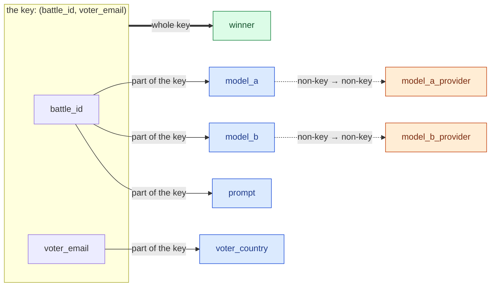

# M03 · Ch1 · §2 — Normalization: designing tables that cannot contradict themselves

> **Module:** Databases & Storage (from first principles)
> **Chapter:** The relational model from the ground up — relations, keys, normalization, how a query is planned and
> executed, B-tree indexes
> **Section:** Ch1 §1 gave you keys and constraints, which enforce rules *inside* a row and *between* tables. This
> section asks the question underneath them: **which table shapes let the same fact be stored twice**, and therefore let
> the two copies disagree? It defines the tool that answers it — the **functional dependency** — and walks the normal
> forms as what they really are: a list of the specific ways a table can repeat itself, each with the decomposition that
> removes it. It then does the part textbooks often skip: **when to put the redundancy back on purpose**, and the rules
> that keep a deliberate copy from becoming a bug.
> **Status:** ✅ finalized 2026-10-09 (body prepared 2026-10-05). One question, on §8: *"normalization makes reads
> expensive and materialized view is a solution. But cache (either inside DB or at API level) is another solution,
> right? Show me the criteria on solution selection."* — answered in §12: PostgreSQL has no result cache (only pages),
> MySQL removed its query cache in 8.0, and the choice between a materialized view, an application cache and an HTTP
> cache comes down to eight ordered criteria, led by staleness tolerance and how many distinct results there are.
> **Prerequisites:** **Ch1 §1** (keys, foreign keys, constraints, the relational algebra — especially projection and
> join). Helpful: M01 Ch3 §3 (races), because §8's counters are a race waiting to happen.

**Estimated study time:** 3–3.5 hours including the hands-on.

---

## Why this section exists — and how it's pitched

Normalization has a reputation as the dullest part of a database course: a ladder of forms with Roman-numeral names,
learned for an exam and then forgotten. That reputation is earned by the way it is usually taught — as definitions
first, purpose later. Taught the other way round, it is one of the most practical ideas in the module.

**The purpose, in one sentence: a fact stored in two places can become two different facts.** If a model's provider is
written on every vote row, then renaming the provider means rewriting every one of those rows — and any row the update
misses now says something different from the rest. Nothing errors. The database holds a contradiction, and every query
that reads it returns whichever version it happens to touch. Normalization is the discipline of finding every place a
table *can* do that, and changing the shape so it *cannot*.

You already do much of this by instinct; Ch1 §1's schema was normalized without saying so. What this section adds is:

- **A test you can run instead of an instinct.** Functional dependencies let you prove a design is free of a whole class
  of anomaly, or point at the exact column that is not.
- **The cases instinct gets wrong.** A table can satisfy every rule you have heard of and still repeat itself (§5, §7),
  and a decomposition can quietly *add* rows that were never true (§6).
- **The judgment for the other direction.** Real systems are full of deliberate redundancy — counters, leaderboards,
  cached timelines, analytics tables. §8 separates the copies that are safe from the ones that drift, using real
  systems' choices, and §8's measured figure shows what each direction costs.

The running example continues from Ch1 §1: the head-to-head model-evaluation service. This time it starts where many
real projects start — **one wide table someone exported from a spreadsheet** — and normalizes it until it becomes
Ch1 §1's schema.

---

## 1. The problem: one fact, many copies

<details>
<summary><b>Vocabulary for this section</b> — terms and abbreviations used below (click to expand)</summary>

**Abbreviations**

| Short | Stands for | Meaning |
|---|---|---|
| **SQL** | Structured Query Language | the standard relational query language |
| **CSV** | comma-separated values | a plain-text table format, the usual spreadsheet export |

**Terms**

| Term | Definition |
|---|---|
| **Redundancy** | the same fact recorded in more than one place, so the copies can disagree |
| **Anomaly** | a modification (insert, update or delete) whose correct result the table shape makes hard or impossible |
| **Update anomaly** | changing one fact requires changing many rows; missing any leaves a contradiction |
| **Insertion anomaly** | a fact cannot be recorded until an unrelated fact exists to share its row |
| **Deletion anomaly** | deleting one fact destroys another fact that happened to live in the same row |
| **Wide table** | one table holding the attributes of several different things — here votes, battles, voters and models |
| **Decomposition** | replacing one table by several smaller ones (projections of it) that can be joined back |

</details>

Here is the vote sheet. Each row is one vote: a voter compared the answers of two models to one prompt and picked a
winner. Its key is `(battle_id, voter_email)` — a voter votes at most once per battle.


**Figure 1** — the vote sheet, with every cell that restates a fact already in the table shaded by the dependency that
makes it redundant: 20 of its 54 cells.

Only the `winner` column is purely a fact about *a vote*. Everything else is a fact about something else — the battle,
the voter, or a model — copied onto each vote. That one observation produces three distinct failures, which Codd's
1971 paper on further normalization described as undesirable insertion, update and deletion dependencies:

**Table 1** — the three anomalies, shown on the vote sheet.

| Anomaly | On the vote sheet | Why the shape causes it |
|---|---|---|
| **Update** | Bluefin rebrands to "Bluefin Labs". Every row mentioning `heron-70b` — in *either* model column — must change. An update that fixes `model_a_provider` and forgets `model_b_provider` leaves the model with two providers. | the provider is stated once per *vote*, not once per *model* |
| **Insertion** | A new model is onboarded with its provider, but nobody has voted on it yet. There is nowhere to write "`swift-3b` is made by Tern" — every row needs a battle and a voter, and the key cannot be `NULL`. | the model's facts can only exist as part of a vote |
| **Deletion** | Battle 3 is removed as spam. `dev@x.com` voted only there, so their country — a fact about a *person* — vanishes with it. | the voter's facts only exist as part of a vote |

The hands-on (§11) runs the update anomaly on these six rows: an update that touches one column pair produces a model
with two different providers in a single `SELECT DISTINCT`. At scale it is not hypothetical; Figure 4 (§8) times the
correct version of that update on a million-vote table, and it rewrites 332,088 rows to change one fact.

**Notice what the update anomaly is not.** It is not a performance problem that a faster disk fixes, and it is not a
bug in any one query. Every individual `UPDATE` is correct. The defect is that the *table shape* makes "change this
fact" a multi-row operation, so correctness depends on every writer, forever, remembering every place the fact lives —
including columns added after they wrote their code. A schema that makes the fact live in one row removes the
requirement entirely.

**The fix, stated once and then justified for the rest of the section:** split the table so that each fact about each
thing is stated exactly once —

```
vote   (battle_id, voter_email, winner)                 -- a fact about a vote
battle (battle_id, model_a, model_b, prompt)            -- facts about a battle
voter  (voter_email, voter_country)                     -- facts about a voter
model  (model, provider)                                -- facts about a model
```

That is Ch1 §1's schema. The rest of this section is about *how you would have found it* without already knowing it,
how you prove the split loses nothing, and when not to do it.

---

## 2. Functional dependencies: the tool that finds redundancy

<details>
<summary><b>Vocabulary for this section</b> — terms, abbreviations and every symbol in the formulas (click to expand)</summary>

**Abbreviations**

| Short | Stands for | Meaning |
|---|---|---|
| **FD** | functional dependency | a rule that one set of columns determines another |

**Symbols used in the formulas**

| Symbol | Reads as | Meaning |
|---|---|---|
| $X \to Y$ | "X determines Y" / "Y depends on X" | any two rows that agree on columns $X$ also agree on columns $Y$ |
| $t_{1}, t_{2}$ | "t-one, t-two" | two arbitrary rows (tuples) of the table |
| $t[X]$ | "t on X" | row $t$ restricted to the columns in $X$ |
| $XY$ | "X Y" | the union of the column sets $X$ and $Y$ — written side by side, by convention |
| $X^{+}$ | "the closure of X" | every column that $X$ determines, directly or through a chain |
| $\subseteq$ | "is a subset of" | every column on the left is also on the right |
| $B, U, C, W, T$ | — | shorthand for `battle_id`, voter email (the **U**ser), voter country, `winner`, prompt **T**ext |
| $M_{a}, M_{b}, P_{a}, P_{b}$ | "M-a", "P-b" … | `model_a`, `model_b`, `model_a_provider`, `model_b_provider` |

**Terms**

| Term | Definition |
|---|---|
| **Determinant** | the left-hand side of a functional dependency |
| **Trivial dependency** | $X \to Y$ where $Y \subseteq X$ — true of every table, so it says nothing |
| **Armstrong's axioms** | three inference rules from which every implied dependency can be derived |
| **Closure** | the set of all columns a given set determines |
| **Superkey** | a set of columns whose closure is every column of the table |
| **Candidate key** | a minimal superkey — remove any column and it stops being one (Ch1 §1 §3) |
| **Prime attribute** | a column that belongs to at least one candidate key |
| **Non-prime attribute** | a column that belongs to no candidate key |

</details>

A **functional dependency** $X \to Y$ holds in a table when any two rows that agree on the columns $X$ must also agree
on the columns $Y$:

$$t_{1}[X] = t_{2}[X] \implies t_{1}[Y] = t_{2}[Y]$$

Read it as "X determines Y": once you know $X$, there is only one possible $Y$. A key is the extreme case — a key
determines every column. Using the shorthand in the vocabulary block, the vote sheet's dependencies are:

- $BU \to W$ — the battle and the voter together determine the winner (the fact about a vote);
- $B \to M_{a} M_{b} T$ — the battle alone determines its two models and its prompt;
- $U \to C$ — the voter alone determines their country;
- $M_{a} \to P_{a}$ and $M_{b} \to P_{b}$ — a model determines its provider.

<!-- DIAGRAM:START -->


<details>
<summary>Diagram source (Mermaid)</summary>



</details>
<!-- DIAGRAM:END -->

**Figure 2** — the vote sheet's functional dependencies: only `winner` depends on the whole key (green); five columns
depend on part of it (blue, §4's second normal form); two depend on another non-key column (orange, §4's third).

Figure 2 is the whole diagnosis in one picture. Every arrow that does not start at the full key is a fact about
something other than a vote, which is exactly the set of cells Figure 1 shaded.

### 2a. Dependencies are facts about the world, not about the data

This is the single most important point in the section, and the one most often got wrong. **You cannot discover
functional dependencies by looking at rows.** Six rows in which every voter has one country *are consistent with*
$U \to C$; they do not establish it. Perhaps the product lets a user change country, or holds two passports' worth of
locale. Whether $U \to C$ holds is a **business rule**: a decision about what the data means, made by someone who knows
the domain, and enforced by the schema from then on.

Tools that "infer the schema" from a sample are doing exactly the unsafe thing — they find dependencies that happen to
hold today. The classic real-world trap is postal geography: in a sample of addresses, a postal code nearly always
determines one city, until it does not, and a schema that made `postcode` determine `city` cannot store the address
that breaks the pattern. Ask "is this *always* true, by definition?" — not "is it true in this data?"

This also tells you why normalization is a design activity rather than an algorithm you run on a database. The
algorithms in this section are exact, but their input — the list of dependencies — is a model of the business, and
getting it right is the design.

### 2b. Deriving what a set of dependencies implies

Given some dependencies, others follow. If $B \to M_{a}$ and $M_{a} \to P_{a}$, then $B \to P_{a}$ — the battle
determines its first model's provider, through the model. In 1974 William Armstrong gave three rules from which every
implied dependency can be derived:

- **Reflexivity:** if $Y \subseteq X$ then $X \to Y$ (the trivial dependencies);
- **Augmentation:** if $X \to Y$ then $XZ \to YZ$ for any $Z$;
- **Transitivity:** if $X \to Y$ and $Y \to Z$ then $X \to Z$.

In practice you rarely apply the axioms one at a time. You compute a **closure**: start from a set of columns, and
repeatedly add any column that a known dependency lets you reach, until nothing changes. For the vote sheet, starting
from the key:

- **start** with $B$ and $U$;
- **add** $W$, $M_{a}$, $M_{b}$, $T$ and $C$, using $BU \to W$, $B \to M_{a} M_{b} T$ and $U \to C$;
- **add** $P_{a}$ and $P_{b}$, using $M_{a} \to P_{a}$ and $M_{b} \to P_{b}$ — and nothing further can be added.

So $\lbrace B, U \rbrace^{+}$ is all nine columns: $BU$ is a superkey; and neither $B$ nor $U$ alone reaches every
column, so $BU$ is minimal — a **candidate key**. The closure is the workhorse of everything that follows: "is $X$ a
key?" means "is $X^{+}$ every column?", and each normal form below is a condition on which determinants are allowed to
have which closures.

### 2c. The dependency a wide table cannot even state

Look again at the model columns. The business rule is "a model has one provider" — but the vote sheet stores models in
**two** columns, and a functional dependency relates columns, not values. $M_{a} \to P_{a}$ and $M_{b} \to P_{b}$ are
two separate dependencies; neither says that `heron-70b` in `model_a` and `heron-70b` in `model_b` must have the same
provider. So the sheet can hold `(heron-70b, Bluefin)` in one column pair and `(heron-70b, Bluefin Labs)` in the other
**without violating any dependency it has** — which is exactly the contradiction the hands-on produces.

This is Ch1 §1 §8's **repeated-columns** anti-pattern seen from the dependency side: splitting one kind of thing across
`_a` and `_b` columns hides the rule from the theory as well as from the database. The decomposition fixes it, because
in the `model` table there is one column of models and the rule becomes the plain key `model → provider`.

---

## 3. First normal form: one value per cell

<details>
<summary><b>Vocabulary for this section</b> — terms and abbreviations used below (click to expand)</summary>

**Abbreviations**

| Short | Stands for | Meaning |
|---|---|---|
| **1NF** | first normal form | every cell holds a single value of its column's type; no repeating groups |
| **JSON** | JavaScript Object Notation | a text format for nested objects and arrays |
| **jsonb** | JSON, binary | PostgreSQL's parsed, indexable JSON column type |
| **GIN** | Generalized Inverted Index | a PostgreSQL index type that indexes the elements inside arrays and `jsonb` values |

**Terms**

| Term | Definition |
|---|---|
| **Atomic value** | a value the database treats as a single unit — it never needs to look inside it to answer your queries |
| **Repeating group** | several values of the same kind packed into one row — a list in a cell, or columns `tag1`, `tag2`, `tag3` |
| **Multi-valued column** | a cell holding a list (`'nlp,code,math'`) — Ch1 §1 §8's first anti-pattern |

</details>

**First normal form** (1NF) asks that every cell hold exactly one value of its column's type, with no **repeating
groups** — no list of tags in a string, and no `tag1`, `tag2`, `tag3` columns. Every other normal form assumes it.

The rule sounds absolute and is not, because "one value" depends on what you need to do with the value. A timestamp
has a year inside it; a string has characters; nobody calls `created_at` a violation of first normal form. Chris Date,
the most careful writer on the model, concludes that **atomicity is relative to the operations you need**: a value is
atomic if the database never has to look inside it to answer your queries or enforce your rules. That gives a working
test instead of a slogan:

- **`'nlp,code,math'` in a `tags` column fails it** the moment anyone asks "which models are tagged `code`?" or "rename
  the tag `nlp`" or "every tag must exist in the tag list" — each needs the database to see inside the string, and it
  cannot do so with an ordinary index or a foreign key. That is a repeating group, and the fix is a junction table
  (Ch1 §1 §8).
- **A `jsonb` column (PostgreSQL's binary JSON — JavaScript Object Notation — type) holding a provider's raw API
  response passes it** — if you store it, return it whole and never
  filter or join on its insides. The moment you add `WHERE response->>'finish_reason' = 'length'` to a hot query, you
  are looking inside it, and you are back to deciding whether that field deserves a column.
- **A PostgreSQL array of embedding floats passes it** for the same reason: the database treats the vector as one value
  to store and hand to a distance function, not as 1,536 separate facts.

PostgreSQL makes the middle ground workable: a **GIN** (Generalized Inverted Index) can index the elements of an array
or the keys of a `jsonb` document, so "contains tag `code`" can be fast. What no index gives you is a **foreign key or
a uniqueness rule on the elements** — the database still cannot promise that every tag exists, or that a tag appears
once. That is the real price of a list in a cell, and it is a correctness price, not a speed one.

**First normal form in SQL (Structured Query Language) has two further clauses that Ch1 §1 §2 already covered:** a
true relation has no duplicate rows and no meaningful row order. SQL tables permit both. Date counts them as
violations; most textbooks do not. The practical upshot is the same either way — declare a key on every table, and
never depend on the order rows come back in without an `ORDER BY`.

---

## 4. Second and third normal form: "the key, the whole key, and nothing but the key"

<details>
<summary><b>Vocabulary for this section</b> — terms, abbreviations and every symbol in the formulas (click to expand)</summary>

**Abbreviations**

| Short | Stands for | Meaning |
|---|---|---|
| **2NF** | second normal form | no non-prime column depends on part of a candidate key |
| **3NF** | third normal form | no non-prime column depends on anything other than a whole candidate key |

**Symbols used in the formulas**

| Symbol | Reads as | Meaning |
|---|---|---|
| $X \to A$ | "X determines A" | any two rows agreeing on $X$ agree on column $A$ |
| $B, U, C, W, T$ | — | `battle_id`, voter email, voter country, `winner`, prompt text |
| $M_{a}, P_{a}$ | "M-a", "P-a" | `model_a` and `model_a_provider` (likewise with $b$) |

**Terms**

| Term | Definition |
|---|---|
| **Composite key** | a key made of more than one column, like `(battle_id, voter_email)` |
| **Partial dependency** | a non-prime column determined by only part of a composite key — what 2NF forbids |
| **Transitive dependency** | a non-prime column determined by another non-prime column, and so only indirectly by the key — what 3NF forbids |
| **Prime / non-prime attribute** | a column that is / is not part of some candidate key |
| **Projection** | keeping only some columns of a table (and removing duplicate rows) — Ch1 §1 §7 |

</details>

Codd defined the second and third normal forms in 1971. William Kent's 1983 summary is still the best one-line version:
**every non-key column must give a fact about the key, the whole key, and nothing but the key.** The two forms are the
last two clauses.

**Second normal form (2NF) — "the whole key."** No non-prime column may depend on *part* of a candidate key. It only
bites when a key is composite, which is exactly the vote sheet's situation: $B \to M_{a} M_{b} T$ and $U \to C$ are
**partial dependencies** — each column is determined by half of the key. The fix is to move each partial dependency
into its own table, keyed by the part that determines it:

```
vote_sheet (battle_id, voter_email, voter_country, model_a, model_a_provider, model_b, model_b_provider, prompt, winner)
   ↓ move B → (model_a, model_b, prompt, the providers that ride along) and U → voter_country out
vote   (battle_id, voter_email, winner)
battle (battle_id, model_a, model_a_provider, model_b, model_b_provider, prompt)
voter  (voter_email, voter_country)
```

Each of those tables is in second normal form. `battle`, however, still repeats each model's provider once per battle
the model takes part in.

**Third normal form (3NF) — "nothing but the key."** No non-prime column may depend on another non-prime column. In
`battle`, $M_{a} \to P_{a}$ is a **transitive dependency**: the key determines the model, and the model determines the
provider, so the provider depends on the key only *through* something that is not a key. Move it out:

```
battle (battle_id, model_a, model_b, prompt)
model  (model, provider)
```

and the two `_provider` columns collapse into one fact per model — which also repairs §2c's unstatable rule. The four
tables are now Ch1 §1's schema, and every non-key column in them is a fact about the whole key of its own table and
nothing else.

The precise definition of third normal form, which matters for §5, is: **for every non-trivial dependency $X \to A$,
either $X$ is a superkey or $A$ is a prime attribute.** The escape clause — "or $A$ is prime" — is the one gap in third
normal form, and it is the whole subject of the next section.

**A practical check that needs no theory.** For each non-key column, ask: *"if I changed this value, what thing in the
world would have changed?"* If the answer names something other than the thing the row is about — a battle's prompt on
a vote row, a model's provider on a battle row — the column belongs in that other thing's table.

---

## 5. Boyce–Codd normal form: when third normal form is not enough

<details>
<summary><b>Vocabulary for this section</b> — terms, abbreviations and every symbol in the formulas (click to expand)</summary>

**Abbreviations**

| Short | Stands for | Meaning |
|---|---|---|
| **BCNF** | Boyce–Codd normal form | every determinant of a non-trivial dependency is a superkey |
| **3NF** | third normal form | as BCNF, except a dependency may determine a prime attribute from a non-key |

**Symbols used in the formulas**

| Symbol | Reads as | Meaning |
|---|---|---|
| $X \to Y$ | "X determines Y" | rows agreeing on $X$ agree on $Y$ |
| $M, K, N$ | — | in this section's example: **M**odel, benchmar**K**, a**N**notator |

**Terms**

| Term | Definition |
|---|---|
| **Determinant** | the left-hand side of a dependency |
| **Overlapping candidate keys** | two candidate keys that share a column — the only situation where 3NF and BCNF differ |
| **Dependency preservation** | every original dependency can still be checked inside a single table after decomposing |
| **Constraint-guarded redundancy** | a duplicated value that a constraint forces to agree with its source, so it cannot contradict it |

</details>

Raymond Boyce and Codd tightened the definition in 1974. **Boyce–Codd normal form** (BCNF) drops third normal form's
escape clause: **for every non-trivial dependency $X \to Y$, $X$ must be a superkey.** Any determinant that is not a
key is a violation, whatever it determines.

The two forms differ only when a table has **overlapping candidate keys**, which is why most schemas never meet the
difference. When they do, it looks like this. The evaluation team assigns human annotators to grade models on
benchmarks, under two rules:

1. Each annotator is trained on exactly one benchmark: $N \to K$.
2. Each model is graded on each benchmark by exactly one annotator: $MK \to N$.

**Table 2** — the assignment table, in third normal form but not Boyce–Codd normal form.

| model ($M$) | benchmark ($K$) | annotator ($N$) |
|---|---|---|
| orca-7b | bench-math | dewi |
| heron-70b | bench-math | dewi |
| kite-8b | bench-math | farid |
| orca-7b | bench-code | eko |

The candidate keys are $MK$ (rule 2) and $MN$ (an annotator implies their benchmark, so model plus annotator fixes the
row). Every column is part of some key, so every column is prime, and the table passes third normal form vacuously.
But $N \to K$ has a determinant — the annotator — that is not a key, and the redundancy is right there: "dewi grades
`bench-math`" is stated twice. Retrain dewi on another benchmark and you must update both rows, or the table says she
grades two benchmarks, breaking rule 1.

**The textbook fix** is to decompose on the offending dependency:

```
annotator  (annotator, benchmark)        -- N → K, keyed by N
assignment (model, annotator)            -- key MN
```

Both tables are in Boyce–Codd normal form, and the decomposition is lossless (§6). **But rule 2 has gone missing.** "One
annotator per model per benchmark" mentions the model, the benchmark and the annotator together, and no single table
holds all three any more. Nothing stops you assigning `orca-7b` to both dewi and farid, who both grade `bench-math`.
To enforce rule 2 now you need a trigger or a check in application code — and Ch1 §1 §4 explained why the latter is a
race.

**This is a real, proven trade-off, not a failure of imagination:** some tables have no decomposition into Boyce–Codd
normal form that keeps every dependency checkable within one table. Third normal form, by contrast, can always be
reached with every dependency preserved (§6). That is the textbook reason third normal form is the usual target.

**The practical way out keeps the redundancy and takes away its ability to contradict.** Store the benchmark on the
assignment, and make a composite foreign key force it to match the annotator's:

```sql
CREATE TABLE annotator (
    annotator text PRIMARY KEY,
    benchmark text NOT NULL,
    UNIQUE (annotator, benchmark)                 -- the target of the composite reference below
);

CREATE TABLE assignment (
    model     text NOT NULL,
    benchmark text NOT NULL,
    annotator text NOT NULL,
    PRIMARY KEY (model, benchmark),                -- rule 2, enforced
    FOREIGN KEY (annotator, benchmark) REFERENCES annotator (annotator, benchmark)   -- rule 1, enforced
);
```

`assignment` is still not in Boyce–Codd normal form — $N \to K$ still holds inside it with a non-key determinant — but
the copy of the benchmark **cannot disagree with its source**: an insert pairing farid with `bench-code` fails the
foreign key, and retraining dewi is refused while she has assignments (or cascades, if you declare
`ON UPDATE CASCADE`). The hands-on (§11) runs both failures. **Redundancy that a constraint forces to agree is not an
anomaly.** Keep this idea — it is also the safe form of most deliberate denormalization in §8.

---

## 6. Decomposing safely: lossless joins and preserved dependencies

<details>
<summary><b>Vocabulary for this section</b> — terms, abbreviations and every symbol in the formulas (click to expand)</summary>

**Abbreviations**

| Short | Stands for | Meaning |
|---|---|---|
| **BCNF** | Boyce–Codd normal form | every determinant is a superkey |
| **3NF** | third normal form | every non-prime column depends on whole candidate keys only |

**Symbols used in the formulas**

| Symbol | Reads as | Meaning |
|---|---|---|
| $R$ | "R" | the original table (relation) |
| $R_{1}, R_{2}$ | "R-one, R-two" | the two tables it is split into — each a projection of $R$ |
| $\pi_{X}(R)$ | "pi X of R" | projection: the distinct rows of $R$ restricted to the columns $X$ (Ch1 §1 §7) |
| $\bowtie$ | "natural join" | join on all columns with the same name (Ch1 §1 §7) |
| $\cap$ | "intersect" | the columns the two tables have in common |
| $X \to Y$ | "X determines Y" | a functional dependency |

**Terms**

| Term | Definition |
|---|---|
| **Lossless-join decomposition** | a split whose tables, joined back, give exactly the original rows — no more, no fewer |
| **Spurious tuple** | a row the rejoin produces that was never in the original table |
| **Dependency preservation** | every original dependency can still be enforced within a single one of the new tables |
| **Heath's theorem** | splitting on a dependency $X \to Y$ — into $XY$ and $X$ plus the rest — is always lossless |
| **3NF synthesis** | an algorithm that builds a lossless, dependency-preserving 3NF schema directly from a set of dependencies |

</details>

Normalizing means **decomposing**: replacing a table by several projections of it. Two properties decide whether a
decomposition is safe, and they are worth knowing by name because each one fails in a recognizable way.

### 6a. Lossless join: the split must not invent rows

A decomposition is **lossless** if joining the pieces back gives exactly the original table. The surprising failure is
not that rows go missing — projections never lose a row's values — but that **the rejoin adds rows that were never
true**, called **spurious tuples**.

Split the vote sheet carelessly, on a column that determines nothing — say into `(battle_id, voter_country)` and
`(voter_country, voter_email, winner)`. The rejoin matches rows by country, so every voter from Singapore is paired with
every battle that had *any* Singaporean voter. On the six rows of Figure 1 the rejoin returns **10 rows, not 6**; four
are votes nobody cast. The hands-on reproduces it, and the four invented votes would all be counted in any leaderboard
computed from the rejoined data. **Lossiness is invisible from inside either piece** — each looks perfectly reasonable;
only the join shows the damage.

The test is short. A split of $R$ into $R_{1}$ and $R_{2}$ is lossless if and only if the shared columns determine one
side:

$$R_{1} \cap R_{2} \to R_{1} \quad \text{or} \quad R_{1} \cap R_{2} \to R_{2}$$

In words: **the columns you join on must be a key of at least one of the pieces.** Splitting the vote sheet into
`vote` and `voter` joins on `voter_email`, which is the key of `voter`, so it is lossless. Splitting on
`voter_country` joins on a column that is a key of neither, so it is not. This is **Heath's theorem** (1971) in
practice: if $X \to Y$ holds, the split

$$R = \pi_{XY}(R) \bowtie \pi_{XZ}(R)$$

is always lossless, where $Z$ is every column not in $X$ or $Y$. Every split in §4 and §5 was made on a dependency in
exactly this way, which is why none of them invented a row.

**The connection to Ch1 §1 §7's fan-out bug** is direct: a join on a column that is not a key on either side multiplies
rows. Fan-out double-counts rows that exist; a lossy decomposition fabricates rows that do not. Both come from joining
on a non-key.

### 6b. Dependency preservation: every rule must stay checkable

A decomposition **preserves dependencies** if every original dependency can still be enforced *inside one table* — as
a key, a unique constraint or a foreign key — after the split. §5 showed the failure: decomposing the assignment table
into Boyce–Codd normal form left rule 2 spanning two tables, where no ordinary constraint can reach it.

**Table 3** — what each target normal form guarantees about decomposition.

| Target | Lossless join | Dependency preservation | Remaining redundancy |
|---|---|---|---|
| **3NF**, by synthesis | always achievable | always achievable | possible, only in the overlapping-key case of §5 |
| **BCNF**, by decomposition | always achievable | **not always** achievable | none from functional dependencies |

The constructive result behind the first row is **3NF synthesis** (Bernstein, 1976): take a minimal set of
dependencies, make one table per determinant holding that determinant and everything it determines, and add a table
holding a candidate key if none of them contains one. The result is always in third normal form, always lossless, and
preserves every dependency. You will rarely run it by hand, but it is the reason a designer can promise third normal
form without trade-offs, and why Boyce–Codd normal form is a "where you can" target.

---

## 7. Beyond BCNF: independent facts, and the rare fifth form

<details>
<summary><b>Vocabulary for this section</b> — terms, abbreviations and every symbol in the formulas (click to expand)</summary>

**Abbreviations**

| Short | Stands for | Meaning |
|---|---|---|
| **4NF** | fourth normal form | no non-trivial multivalued dependency except on a superkey |
| **5NF** | fifth normal form (also PJ/NF, project–join normal form) | no join dependency except those implied by the keys |
| **MVD** | multivalued dependency | a rule that one column's set of values is independent of another's, given a third |
| **BCNF** | Boyce–Codd normal form | every determinant is a superkey |

**Symbols used in the formulas**

| Symbol | Reads as | Meaning |
|---|---|---|
| $X \twoheadrightarrow Y$ | "X multi-determines Y" | for each $X$, the set of $Y$ values is independent of the other columns |
| $M, S, L$ | — | in this section's example: **M**odel, **S**kill (capability), **L**anguage |

**Terms**

| Term | Definition |
|---|---|
| **Multivalued dependency** | for a given model, its set of skills does not depend on which language you look at, and vice versa |
| **Independent multi-valued facts** | two lists about one thing that have nothing to do with each other — a model's skills and its languages |
| **Join dependency** | a table equals the join of several of its projections — the generalization behind 5NF |
| **Cartesian product** | every pairing of two sets (Ch1 §1 §7) |

</details>

Functional dependencies say "one value". Some redundancy comes from **sets** of values instead, and Boyce–Codd normal
form cannot see it.

**Fourth normal form.** The catalogue records, for each model, the skills it supports and the languages it supports,
and someone designs one table for both:

**Table 4** — independent skills and languages in one table: every combination must be stored.

| model | skill | language |
|---|---|---|
| orca-7b | code | English |
| orca-7b | code | Malay |
| orca-7b | code | Thai |
| orca-7b | math | English |
| orca-7b | math | Malay |
| orca-7b | math | Thai |

The skills and the languages have nothing to do with each other, so the only consistent way to store them together is
the full **Cartesian product** — 2 skills × 3 languages = 6 rows to say five facts. Add Vietnamese and you must insert
two rows, one per skill; add a third skill and you must insert three. Miss one and the table claims a combination
matters ("`orca-7b` does math in Malay but not in Thai") when it never did.

There is no functional dependency here — no column determines another — so the table is in Boyce–Codd normal form (its
only key is all three columns). What it has is a **multivalued dependency**, $M \twoheadrightarrow S$ (and therefore
$M \twoheadrightarrow L$): for a given model, the set of skills is the same whatever language you look at. Ronald
Fagin defined **fourth normal form** (4NF) in 1977: no non-trivial multivalued dependency unless its left side is a
superkey. The fix is the one you would choose anyway — two tables, `model_skill (model, skill)` and
`model_language (model, language)` — and Kent's 1983 guide uses the same shape (employees, skills and languages) as
its example. **This is the one beyond-BCNF problem worth checking for in everyday design.** It is the same root cause
as Ch1 §1 §7's join fan-out: two independent one-to-many relationships crossed in a single result, except here the
crossing has been *stored*.

**Fifth normal form** (5NF; Fagin, 1979) covers the remaining case: a table that equals the join of **three or more**
of its projections but not of any two. The standard example is a cyclic business rule — "if a provider offers a model,
and the model runs in a region, and the provider operates in that region, then the provider offers that model in that
region" — under which the three-column table is pure redundancy over its three pairwise tables. Such rules are rare,
and most practitioners go a career without needing to decompose for one. Know that it exists, and recognize the shape
when a three-way junction table can be reconstructed from its pairs.

Figure 3 puts the ladder together, using the usual abbreviations — 1NF to 5NF, with BCNF for Boyce–Codd — and its
footnote's OLTP (online transaction processing) means the operational workload of many small reads and writes.


**Figure 3** — the normal forms nest: every table in an inner form is also in every outer one, and each ring forbids
one more kind of redundancy.

---

## 8. Denormalizing on purpose

<details>
<summary><b>Vocabulary for this section</b> — terms and abbreviations used below (click to expand)</summary>

**Abbreviations**

| Short | Stands for | Meaning |
|---|---|---|
| **OLTP** | online transaction processing | the operational workload: many small reads and writes, each touching a few rows |

**Terms**

| Term | Definition |
|---|---|
| **Denormalization** | deliberately storing a fact more than once, usually to make a read cheaper |
| **Source of truth** | the one place a fact is authoritatively stored; every copy is derived from it |
| **Derived data** | a value computed from other stored data — a count, a sum, a rating, a cached join |
| **Historical fact** | a value as it was at a moment (the price paid, the model version run) — not a copy of the current value |
| **Materialized view** | a stored query result the database can refresh on command |
| **Generated column** | a column the database computes from other columns of the same row on every write |
| **Read model** | a copy of data shaped for one read path, rebuilt from the source of truth |
| **Online Elo rating** | a rating nudged up or down after each game, so its value depends on the order games arrive in |
| **Bradley–Terry model** | a statistical model that turns pairwise wins into ratings, fitted over all results at once by maximum likelihood |
| **Fan-out on write** | doing the work of a read at write time — e.g. pushing each new post into every follower's stored timeline |
| **Star schema** | an analytics layout: a central fact table of events joined to wide, denormalized dimension tables |
| **Drift** | a derived copy that has silently stopped matching its source |

</details>

Normalization optimizes one thing: **each fact has one home, so changes are cheap and contradictions impossible**. That
is the right default for the operational database. It is not free, and the cost is paid by reads, which must join the
pieces back together.

![Bar chart on a log scale comparing a wide one-table vote sheet with the normalized four-table schema on PostgreSQL 18 with one million votes. Changing one model's provider: 3,176.69 milliseconds rewriting 332,088 rows in the wide table, versus 0.02 milliseconds and one row normalized, about 160,000 times faster. Wins per provider over all votes: 75.26 milliseconds wide with no joins, versus 145.62 milliseconds normalized with two joins. Fetching one battle with its votes: 0.02 versus 0.19 milliseconds.](diagrams/02-normalization-fig4.svg)

**Figure 4** — both directions measured on PostgreSQL 18 with a million votes: normalizing makes a change of fact
about 160,000 times cheaper, and makes a full-table analytical read about twice as expensive.

Figure 4 is the trade in miniature. The normalized schema changes a fact in one row; the wide table rewrites a third of
a million rows to do the same, and is correct only if every writer remembers both column pairs. In the other
direction, the wide table answers "wins per provider" without a join, and does it in half the time. A point read is
under a millisecond either way. **The general shape holds far beyond this example: normalization buys write
correctness and pays in read work.** Denormalization is the decision to pay the other way for one specific read — and
it is a fine decision when it is made deliberately, with the rules below.

### 8a. First, what is *not* denormalization: historical facts

The most expensive normalization mistake runs the other way: **normalizing away a fact that was true at a moment.** An
invoice line that stores only `product_id` and computes its price by joining to the *current* `product.price` will
change every past invoice the day the price changes. The price on the invoice is not a copy of the product's price; it
is a different fact — *the price this customer was charged on this date* — and it belongs on the invoice line.

The evaluation service has the same trap. If `battle` stores only `model_a` and joins to `model` for the version, then
upgrading `orca-7b` silently rewrites which weights every past battle was run against, and every historical win rate
becomes a claim about a model that did not exist at the time. **Store the version the battle actually ran.** Ask of any
"copied" column: *if the source changes later, should this change too?* If not, it was never a copy.

### 8b. Derived data, done safely

Most deliberate denormalization is **derived data**: a value computed from facts stored elsewhere, kept so a hot read
need not recompute it. Real systems are full of it:

- **Stack Exchange** publishes its data-dump schema, and it is a catalogue of derived counters: each post row carries
  `Score`, `AnswerCount` and `CommentCount`, each user row `Reputation`, and each tag row a `Count` — all computable
  from the votes, posts and comments tables, all stored so a question page never counts.
- **Chatbot Arena**, the public model leaderboard, is a derived read model over crowd votes (more than 240,000 by its
  2024 paper). Its history is instructive: it began with an **online Elo** rating, updated incrementally after each
  vote, and in December 2023 moved to fitting a **Bradley–Terry** model over all votes at once by maximum likelihood,
  noting the online ratings' "considerable variability" — online Elo depends on the *order* votes arrive in, while the
  batch fit is a pure function of the vote table. The leaderboard became a value you can **rebuild from the source of
  truth** at any time, and get the same answer.
- **Twitter's home timeline**, as described in 2013, was a cached read model built by **fan-out on write**: each new
  tweet was inserted into the stored timeline (a list in a Redis cluster, capped at 800 entries) of every follower, so
  the roughly 300,000 timeline reads per second against about 6,000 writes per second were answered without a join.
  Accounts with huge follower counts made that fan-out slow, and the design moved toward doing more work at read time
  for them — the same trade as Figure 4, rebalanced by measurement.
- **Analytics star schemas** denormalize on principle. Kimball's dimensional-modelling guidance describes dimension
  tables as "wide, flat denormalized tables": an analytics store is written by a batch load and read by large scans,
  so the update anomalies that normalization prevents barely arise, while the joins it would require are paid on every
  query.

What makes these safe is not that they avoid redundancy; it is that each copy obeys a few rules.

**Table 5** — the rules that keep a deliberate copy from becoming a bug.

| Rule | What it means | What breaks without it |
|---|---|---|
| **One source of truth** | every derived value names the table it comes from; nothing writes to the copy directly | two writers update the copy and the source independently, and they diverge with no way to say which is right |
| **Rebuildable** | the copy can be recomputed from the source at any time and give the same answer | drift is permanent: once a counter is wrong, nothing can say what it should be |
| **An explicit refresh path** | the same transaction, a trigger, a materialized-view refresh, or a consumer of a change log — and a known staleness bound | the copy is "usually updated" by whichever code paths remembered to |
| **Reconciliation** | a periodic job recomputes and compares, and alerts on a difference | drift is discovered by a user, long after its cause |
| **Prefer what the database maintains** | a generated column, a materialized view or a constraint-guarded copy (§5) over hand-written sync code | the copy's correctness depends on every future writer |

PostgreSQL offers three tools that put the refresh path inside the database:

- **Generated columns** (`GENERATED ALWAYS AS (…)`) — computed from other columns of the *same row*: `STORED` computes
  on every write, and `VIRTUAL` — new in PostgreSQL 18, and its default — computes on read. Safe by construction, but
  limited to one row.
- **Materialized views** — a stored query result, refreshed with `REFRESH MATERIALIZED VIEW`. Staleness is exactly
  "since the last refresh", which you control; the `CONCURRENTLY` option refreshes without blocking readers but
  requires a unique index on the view.
- **Triggers or same-transaction updates** — immediate, but now every write pays the cost, and a hot counter row
  becomes a contention point that every writer locks.

**The counter race deserves a warning of its own.** `UPDATE post SET answer_count = answer_count + 1` is safe, because
the database reads and writes in one statement. Reading the count into the application, adding one, and writing it
back is a **lost update** — two concurrent answers both read 4 and both write 5. It is M01 Ch3 §3's check-then-act race
again, and M03 Ch2 explains exactly which isolation levels prevent it.

### 8c. Documents: denormalization as the default

Document databases invert the default. MongoDB's data-modelling documentation states the principle directly: "data
that's accessed together should be stored together" — embed a battle's votes inside the battle document, and a read
needs no join at all. That is denormalization chosen up front, with the same trade as Figure 4: cheap reads along the
path you designed for, and anomalies on every other path (a voter's country embedded in a thousand battle documents is
the vote sheet again). M03 Ch3 takes the document model seriously and shows when that trade is right.

---

## 9. Failure modes — the normalization checklist

<details>
<summary><b>Vocabulary for this section</b> — terms and abbreviations used below (click to expand)</summary>

**Abbreviations**

| Short | Stands for | Meaning |
|---|---|---|
| **BCNF** | Boyce–Codd normal form | every determinant is a superkey |
| **4NF** | fourth normal form | no independent multi-valued facts in one table |

**Terms**

| Term | Definition |
|---|---|
| **Drift** | a derived copy that no longer matches its source |
| **Spurious tuple** | a row produced by a rejoin that was never in the original data |
| **Over-normalization** | splitting tables further than any dependency requires, paying joins for no correctness gain |
| **Lost update** | two concurrent read-modify-write cycles where the second overwrites the first |

</details>

- **One thing with two spellings.** A provider, category or country stored on many rows, edited in some (§1). The tell:
  `SELECT DISTINCT` on a column that should have one value per thing returns several. Move the fact to the thing's own
  table.
- **Data you cannot record yet.** "We can't add the model until someone votes on it" (§1, insertion anomaly). The tell:
  placeholder rows, fake votes, or a nullable key column. The fact belongs in its own table.
- **Data that vanished with something unrelated.** Deleting spam battles also deleted the only record of a voter (§1,
  deletion anomaly).
- **The same thing in two columns.** `model_a` / `model_b`, `home_team` / `away_team`, `sender` / `recipient` — the rule
  "a model has one provider" cannot be stated across the pair (§2c). Look the attributes up through one table.
- **A schema inferred from sample data.** Dependencies that held in the export and were never true by definition (§2a).
  The tell: the first real record that breaks the pattern cannot be stored.
- **Lists in cells that the business filters on.** Tags or roles in a string or array, when anyone needs to query,
  rename or validate them (§3). A junction table.
- **A rule that can only be checked across tables.** Usually a decomposition that did not preserve a dependency (§5,
  §6b). Either keep a constraint-guarded copy (§5), or accept the trigger and test it.
- **A rejoin with more rows than the original.** A lossy decomposition — the join column is not a key of either piece
  (§6a). Joins on a non-key fabricate rows.
- **Combinations nobody meant.** Two independent lists in one table, so adding to one means inserting a row per item
  of the other (§7, 4NF). Split them.
- **Past records that changed by themselves.** A historical fact normalized into a join on current data — invoices
  re-priced, battles re-attributed to a newer model version (§8a). Store the value as it was.
- **A counter, rating or cache that is wrong and nobody can say by how much.** A derived copy without a source of truth,
  a rebuild path or a reconciliation job (§8b), or a counter updated by read-modify-write in the application (a lost
  update).
- **Five joins to show one screen, for no rule.** Over-normalization — splitting a one-to-one attribute set into its own
  table, or a lookup table for a value with no attributes of its own. Normalize to remove *redundancy*, not to
  maximize table count.

---

## 10. Check your understanding

1. In one sentence, what problem does normalization solve? Why is it not a performance technique?
2. Name the three anomalies, and give one example of each on the vote sheet.
3. A colleague runs a profiling tool on a production table and it reports that `postcode → city` holds in all 2 million
   rows. They propose making `postcode` the key of a new `postcode_city` table. What do you say?
4. A table `order_line(order_id, line_no, product_id, product_name, quantity)` has key `(order_id, line_no)`, and
   `product_id → product_name`. Which normal form does it violate, and what is the fix?
5. A table `enrolment(student_id, course_id, student_name, grade)` has key `(student_id, course_id)`. Which normal form
   does `student_name` violate, and why does that form only ever matter for composite keys?
6. Explain why the annotator assignment table in §5 is in third normal form but not in Boyce–Codd normal form. What do
   you lose if you decompose it into BCNF, and how does the composite-foreign-key design get it back?
7. You split `R(A, B, C)` into `R1(A, B)` and `R2(B, C)`. Under what condition is this lossless? Give the failure you
   see if it is not.
8. A `model_capability(model, skill, language)` table lists every skill a model has against every language it supports.
   Which normal form does it violate, which kind of dependency causes it, and what is the fix?
9. An invoice line stores `unit_price`, copied from `product.price` at the moment of sale. A reviewer flags it as
   denormalization and asks you to replace it with a join. Should you?
10. Your service keeps `battle_count` on each `model` row and increments it in application code:
    `n = SELECT battle_count …; UPDATE model SET battle_count = n + 1 …`. Give two distinct ways it ends up wrong, and
    the design that prevents both.

<details>
<summary>Answers</summary>

1. **It removes the possibility of one fact being stored in two places, so the copies can never disagree** (§1). It
   is not a performance technique because its target is correctness under modification: Figure 4 (§8) shows a
   normalized schema can be *slower* to read. Faster updates of a single fact are a side effect of storing it once.
2. **Update, insertion and deletion anomalies** (§1, Table 1). Update: renaming Bluefin's brand requires changing
   every row that mentions `heron-70b` in either column, and missing one leaves two providers. Insertion: a new model
   cannot be recorded with its provider until someone votes on it. Deletion: removing battle 3 erases `dev@x.com`'s
   country, because that voter has no other row.
3. **The tool showed that the dependency holds in today's data, not that it is true** (§2a). Ask the domain owner
   whether a postal code *by definition* has one city; in many countries it does not (codes cross municipal
   boundaries, and boundaries move). If it is not a rule of the world, the schema must allow the exception, and making
   `postcode` a key would make the first such address unstorable. Dependencies are business rules, not statistics.
4. **Third normal form** (§4): `product_name` depends on `product_id`, a non-key column — a transitive dependency.
   (It is in second normal form, since `product_name` does not depend on part of the key.) Move it to
   `product(product_id, product_name)` and keep `product_id` on the line as a foreign key. If the name *at the time of
   sale* matters — on a printed receipt — store that separately as a historical fact (§8a).
5. **Second normal form** (§4): `student_name` depends on `student_id`, which is only part of the key — a partial
   dependency. Second normal form forbids dependence on *part* of a candidate key, and a single-column key has no
   proper part other than the empty set, so a table whose candidate keys are all single columns is automatically in
   second normal form (given first).
6. **Every column is part of some candidate key** — $MK$ and $MN$ — so every column is prime, and third normal form's
   "or the right side is prime" clause excuses $N \to K$ (§5). Boyce–Codd normal form has no such clause: $N$ is a
   determinant and not a superkey. Decomposing into `annotator(N, K)` and `assignment(M, N)` loses rule 2, $MK \to N$,
   because no single table holds all three columns (§6b). The composite-foreign-key design keeps `benchmark` on the
   assignment so the primary key `(model, benchmark)` enforces rule 2, and the foreign key `(annotator, benchmark)`
   forces the copy to agree with the annotator's benchmark — redundancy that cannot contradict.
7. **It is lossless if and only if the shared column `B` determines one side** — $B \to A$ or $B \to C$, i.e. `B` is
   a key of `R1` or of `R2` (§6a). If not, the rejoin pairs every `A` that appeared with a given `B` with every `C`
   that appeared with it, producing **spurious tuples**: more rows than the original, some of them never true. §11's
   step 3 gets 10 rows back from 6.
8. **Fourth normal form** (§7), through a **multivalued dependency** $M \twoheadrightarrow S$ (equivalently
   $M \twoheadrightarrow L$): skills and languages are independent, so the table must store their full Cartesian
   product. It is in BCNF, since no column determines another. Split into `model_skill(model, skill)` and
   `model_language(model, language)`.
9. **No — it is a historical fact, not a copy** (§8a). The price the customer paid on that date is a different fact
   from the product's current price; replacing it with a join would re-price every past invoice when the price
   changes. The test: if the source changes later, should this value change too? Here it must not.
10. **Two failures** (§8b): (a) a **lost update** — two concurrent battles both read `n = 41` and both write 42, so
    one increment vanishes (M01 Ch3 §3, M03 Ch2); and (b) **drift** — any code path that creates or deletes battles
    without running the increment (a bulk import, a cascade delete, a migration) leaves the count permanently wrong,
    with no way to tell. Prevent the first by making the increment atomic in the database
    (`UPDATE model SET battle_count = battle_count + 1 WHERE …`, in the same transaction as the insert). Prevent the
    second by treating the count as derived data: one source of truth (`battle`), rebuildable
    (`SELECT count(*) … GROUP BY model`), refreshed by a path the database owns (a trigger or a materialized view),
    and reconciled periodically — or simply count with an index until a measurement says you need the copy.

</details>

---

## 11. Optional: get your hands dirty (45–60 min)

Everything here needs Docker and `psql`. Start a throwaway PostgreSQL 18:

```sh
docker run -d --name m03n -e POSTGRES_PASSWORD=pw -p 5433:5432 postgres:18
docker exec -it m03n psql -U postgres
```

**1. Load the vote sheet of Figure 1.**

```sql
CREATE TABLE vote_sheet (
    battle_id int, voter_email text, voter_country text,
    model_a text, model_a_provider text, model_b text, model_b_provider text,
    prompt text, winner text,
    PRIMARY KEY (battle_id, voter_email)
);
INSERT INTO vote_sheet VALUES
 (1, 'ana@x.com', 'SG', 'orca-7b',   'Northwind', 'heron-70b', 'Bluefin',   'Translate to Malay',  'a'),
 (1, 'ben@x.com', 'MY', 'orca-7b',   'Northwind', 'heron-70b', 'Bluefin',   'Translate to Malay',  'tie'),
 (2, 'ana@x.com', 'SG', 'heron-70b', 'Bluefin',   'kite-8b',   'Tern',      'Summarise this memo', 'b'),
 (2, 'cai@x.com', 'ID', 'heron-70b', 'Bluefin',   'kite-8b',   'Tern',      'Summarise this memo', 'b'),
 (3, 'ben@x.com', 'MY', 'kite-8b',   'Tern',      'orca-7b',   'Northwind', 'Write a pantun',      'a'),
 (3, 'dev@x.com', 'TH', 'kite-8b',   'Tern',      'orca-7b',   'Northwind', 'Write a pantun',      'b');
```

**2. Cause each anomaly.** Rebrand Bluefin in only one column pair, and look at what the table now says:

```sql
UPDATE vote_sheet SET model_a_provider = 'Bluefin Labs' WHERE model_a = 'heron-70b';
SELECT DISTINCT model, provider FROM (
    SELECT model_a AS model, model_a_provider AS provider FROM vote_sheet
    UNION ALL
    SELECT model_b, model_b_provider FROM vote_sheet) s
WHERE model = 'heron-70b';                                    -- two providers for one model
BEGIN; DELETE FROM vote_sheet WHERE battle_id = 3;
SELECT count(*) FROM vote_sheet WHERE voter_email = 'dev@x.com';   -- 0: dev's country is gone
ROLLBACK;
```

Then try to record a model nobody has voted on yet, and notice there is no row you could write that would not invent a
vote.

**3. A lossy decomposition, then a lossless one.** Split on a non-key and count the rejoin:

```sql
CREATE TABLE l1 AS SELECT DISTINCT battle_id, voter_country FROM vote_sheet;
CREATE TABLE l2 AS SELECT DISTINCT voter_country, voter_email, winner FROM vote_sheet;
SELECT count(*) FROM l1 JOIN l2 USING (voter_country);                 -- 10, not 6
(SELECT battle_id, voter_email, winner FROM l1 JOIN l2 USING (voter_country))
EXCEPT
(SELECT battle_id, voter_email, winner FROM vote_sheet);               -- the four votes nobody cast
```

Now do it properly. Build `model`, `voter`, `battle` and `vote` from the sheet with `INSERT … SELECT DISTINCT`, with
keys and foreign keys as in Ch1 §1. Rejoin all four and check the result against the sheet with `EXCEPT` in **both**
directions — both must return zero rows. (Undo step 2's rebrand first, or `model` will refuse the second provider for
`heron-70b` — which is the point.)

**4. The constraint-guarded copy of §5.** Create `annotator` and `assignment` exactly as in §5, then:

```sql
INSERT INTO annotator VALUES ('dewi', 'bench-math'), ('eko', 'bench-code'), ('farid', 'bench-math');
INSERT INTO assignment VALUES ('orca-7b', 'bench-math', 'dewi');     -- fine
INSERT INTO assignment VALUES ('kite-8b', 'bench-math', 'eko');      -- foreign key: eko does not grade bench-math
INSERT INTO assignment VALUES ('orca-7b', 'bench-math', 'farid');    -- primary key: orca-7b already has a bench-math grader
UPDATE annotator SET benchmark = 'bench-code' WHERE annotator = 'dewi';   -- refused while dewi has assignments
```

Each failure is one of §5's rules being enforced by a constraint rather than by code.

**5. A materialized leaderboard.** On your normalized tables:

```sql
CREATE MATERIALIZED VIEW provider_wins AS
SELECT m.provider, count(*) AS wins
FROM vote v
JOIN battle b USING (battle_id)
JOIN model m ON m.model = CASE v.winner WHEN 'a' THEN b.model_a ELSE b.model_b END
WHERE v.winner <> 'tie'
GROUP BY m.provider;
CREATE UNIQUE INDEX ON provider_wins (provider);
```

Insert a new vote, select from the view (unchanged — it is stale), then `REFRESH MATERIALIZED VIEW CONCURRENTLY
provider_wins;` and select again. The view is derived data with an explicit refresh path and a staleness bound you
choose (§8b), and dropping and recreating it loses nothing.

When you are done: `docker rm -f m03n`.

---

## 12. Applied — materialized view or cache? The selection criteria

*(The session, 2026-10-09. He read §8 and asked: "I understand that normalization makes reads expensive and
materialized view is a solution. But cache (either inside DB or at API level) is another solution, right? Show me the
criteria on solution selection." Yes — and the answer starts by correcting what "a cache inside the database" does.)*

### 12a. There is no result cache inside PostgreSQL

PostgreSQL caches **data pages** in memory (`shared_buffers`), not **query results**. A cached page saves the disk read,
but the join and the aggregation still run in full on every execution. Figure 4's 146 ms read was already served almost
entirely from memory; nearly all of it was join and aggregation work, and a bigger page cache would not have touched it.

MySQL did once have a result cache, and its history is the argument against one. MySQL's query cache stored the result
of each `SELECT` and threw away every cached result for a table whenever that table changed. Under concurrent writes the
invalidation itself became the bottleneck, and MySQL **removed the query cache in version 8.0**, saying it "has serious
scalability issues and it can easily become a severe bottleneck." So the real options are three:

- **precompute inside the database** — a materialized view, a summary table, a trigger-maintained column;
- **cache outside it** — in-process memory, Redis, an HTTP or CDN (content delivery network) cache;
- **make the query itself cheaper** — an index, a better plan (Ch1 §3), a read replica.

### 12b. What actually differs

**Table 6** — a materialized view, an application cache and an HTTP cache, side by side.

| | Materialized view / summary table | Application cache (in-process, Redis) | HTTP / CDN cache |
|---|---|---|---|
| **What is stored** | one precomputed result over **all** the data | a result per request key, filled lazily | whole responses, per URL |
| **When it is filled** | on refresh — scheduled, or triggered by writes | on the first miss of each key | on the first request for each URL |
| **Staleness** | until the next refresh — a bound you choose | until the TTL (time to live) expires or the key is invalidated | until the TTL expires; purges are slow and coarse |
| **Cost of a refresh** | PostgreSQL recomputes the **whole** view, so it grows with total data | one query per missed key | one request per missed URL |
| **Queryable with SQL afterwards?** | **yes** — it is a table: index it, filter it, join it | no — an opaque value behind a key | no |
| **Sees your own write at once?** | no, unless refreshed in the same transaction | no, unless your write invalidates the key | no |
| **Typical failure** | the refresh grows slower as the data grows | stampede on a miss, stale data after a missed invalidation, cold start | a stale response served to everyone |
| **Who keeps it correct** | the database | **your code, on every write path** | the TTL, plus your purge calls |

### 12c. The criteria, in the order to ask them

1. **Is the read still slow once it is indexed and planned properly?** Fix the query first — Ch1 §3 and §4. Many "we need
   a cache" reads are one missing index. Cache only what is slow when the query is right.
2. **How stale may the answer be?** This decides more than anything else. **Zero** (a balance, a permission, "did my
   vote count?"): no cache — make the query fast, or maintain the derived value in the **same transaction** as the write
   (§8b). **Seconds to minutes** (leaderboards, dashboards, counts): a materialized view or a TTL cache. **Hours**
   (reports): a scheduled refresh, or a separate analytics store.
3. **Is the result shared by everyone or different per request?** **Few distinct results read by everyone** — one
   leaderboard, a top-ten list — suit a **materialized view**: computed once for all readers, with no hit rate to worry
   about. **Many distinct results with a hot subset** — a model's page, a user's profile — suit a **key-based cache**; a
   view would have to precompute every key, cold ones included. **A different result every time** — search with
   arbitrary filters — gets almost no hits; make the query fast instead.
4. **What hit rate will it get?** A cache only saves time on hits. With hit rate $h$, the expected read time is
   $t \approx h \cdot t_{\text{cache}} + (1 - h) \cdot t_{\text{db}}$, and frequent writes force invalidations that
   push $h$ down. When data changes about as often as it is read, a cache
   mostly adds a network round trip to every miss.
5. **How expensive is the full recompute compared with the refresh interval?** A materialized view recomputes
   *everything*, which suits aggregates over large data refreshed every minute or more. When the full recompute itself
   gets too slow, switch to a **summary table updated incrementally** in the write transaction (`wins = wins + 1`).
6. **How many write paths would have to invalidate it?** Every path that changes the source must invalidate the cache —
   the API, bulk imports, migrations, cascade deletes. If you cannot list them all, prefer what the database maintains
   (a materialized view, a trigger, a generated column), or a short TTL that caps the damage. This is Table 5's last rule
   applied to caches.
7. **Will you need SQL over the result?** If you will filter, sort or join the precomputed data, it must live in the
   database as a view or summary table; a cache value can only be fetched by its key.
8. **What happens when it is empty?** After a deploy, a Redis restart, or the expiry of a hot key, can the database take
   every request missing at once? If not, you need **request coalescing** (one recompute per key while the others wait),
   jittered TTLs, or a pre-warmed view. It is the thundering-herd shape of M02 Ch4 §2's reconnect storm.

### 12d. Applied to the evaluation service

**Table 7** — one choice per read path, with the criterion that decided it.

| Read | Choice | Deciding criterion |
|---|---|---|
| Global leaderboard | **materialized view** refreshed every 1–5 minutes with `CONCURRENTLY` — or a Bradley–Terry fit written to a table by a job | one result shared by all; minutes of staleness acceptable; rebuildable from the votes |
| A model's detail page | **application cache** with a short TTL, plus an HTTP `Cache-Control` header | many keys, a hot subset, staleness acceptable; invalidate on edit |
| "My battles" history | **no cache** — an index on `vote (voter_email)` | different per user, and the user must see their new vote at once |
| "Was my vote recorded?" | **no cache** — read the source | read-your-own-writes is the whole point |
| Battle count shown on every model | **summary column** updated atomically in the vote transaction, plus a nightly reconciliation | must be exact and cheap; incremental beats a full recompute |

### 12e. What the session teaches

- **A cache and a materialized view are both derived data,** so all five of Table 5's rules apply to both. What differs
  is **who refreshes the copy, at what granularity, and whether SQL can still reach it.**
- **Freshness first, sharing second.** Most of the decision falls out of two questions — how stale may it be, and how many
  distinct answers are there — before performance enters at all.
- **The cheapest cache is the query you fixed.** Criterion 1 comes first because a correct index removes the need for a
  copy, and a copy you never create can never drift.

---

## Key terms (English · 大陆 简体 · 台灣 繁體)

| English | 大陆 (简体) | 台灣 (繁體) | Note |
|---|---|---|---|
| Normalization | 规范化 | 正規化 | ⚠ genuinely different words |
| Normal form | 范式 | 正規形式 / 正規化形式 | ⚠ 第三范式 ↔ **第三正規化** (3NF) |
| Denormalization | 反规范化 | 反正規化 | ⚠ follows the split above |
| Functional dependency | 函数依赖 | 函數相依 / 功能相依 | ⚠ 依赖 ↔ **相依** |
| Multivalued dependency | 多值依赖 | 多值相依 | ⚠ same split |
| Closure (of attributes) | 闭包 | 閉包 / 封閉性 | |
| Candidate key | 候选键 | 候選鍵 | |
| Prime attribute | 主属性 | 主要屬性 / 鍵屬性 | |
| Partial dependency | 部分依赖 | 部分相依 | |
| Transitive dependency | 传递依赖 | 遞移相依 | ⚠ 传递 ↔ **遞移** |
| Update / insertion / deletion anomaly | 更新 / 插入 / 删除异常 | 更新 / 新增 / 刪除異常 | ⚠ 插入 ↔ **新增** |
| Redundancy | 冗余 | 冗餘 / 重複 | |
| Decomposition | 分解 | 分解 | |
| Lossless-join decomposition | 无损连接分解 | 無損失合併分解 | ⚠ follows Ch1 §1's 连接 ↔ 合併 split |
| Dependency preservation | 依赖保持 | 相依保存 | |
| Materialized view | 物化视图 | 具體化檢視 | ⚠ genuinely different; Microsoft's 台灣 documentation uses 具體化檢視 |
| Derived data | 派生数据 | 衍生資料 | ⚠ 派生 ↔ **衍生**, 数据 ↔ **資料** |
| Source of truth | 唯一可信来源 | 單一事實來源 | |
| Star schema | 星型模式 | 星型結構描述 | ⚠ schema: 模式 ↔ **結構描述** |
| Fact table / dimension table | 事实表 / 维度表 | 事實資料表 / 維度資料表 | |
| Cache / cache invalidation | 缓存 / 缓存失效 | 快取 / 快取失效 | ⚠ 缓存 ↔ **快取** — a very common split |
| Hit rate | 命中率 | 命中率 | |

---

## References

- E. F. Codd — *Further Normalization of the Data Base Relational Model*, IBM Research Report RJ909 (1971), published
  in R. Rustin (ed.), *Data Base Systems*, Prentice-Hall, 1972 — the paper that defines 2NF, 3NF and the update
  anomalies; summarized with references in <https://en.wikipedia.org/wiki/Third_normal_form>
- E. F. Codd — *Recent Investigations in Relational Data Base Systems*, International Federation for Information
  Processing (IFIP) Congress 1974 — Boyce–Codd normal form; see
  <https://en.wikipedia.org/wiki/Boyce%E2%80%93Codd_normal_form> for the definition, the overlapping-key example and
  the dependency-preservation result
- W. W. Armstrong — *Dependency Structures of Data Base Relationships*, IFIP Congress 1974 — the inference rules of
  §2b
- R. Fagin — *Multivalued Dependencies and a New Normal Form for Relational Databases*, Association for Computing
  Machinery (ACM) Transactions on Database Systems 2(3), 1977 — fourth normal form —
  <https://doi.org/10.1145/320557.320571>
- W. Kent — *A Simple Guide to Five Normal Forms in Relational Database Theory*, Communications of the ACM 26(2),
  1983 — "the key, the whole key, and nothing but the key", and the employee–skill–language example behind §7 —
  <https://doi.org/10.1145/358024.358054> · readable copy: <http://www.bkent.net/Doc/simple5.htm>
- Wikipedia — *Database normalization* (the normal forms side by side, with Heath's theorem and Bernstein's 3NF
  synthesis) — <https://en.wikipedia.org/wiki/Database_normalization>
- Stack Exchange — *Data dump readme* (the `Posts`, `Users` and `Tags` schemas with their stored counters, §8b) —
  <https://archive.org/download/stackexchange/readme.txt>
- W.-L. Chiang et al. — *Chatbot Arena: An Open Platform for Evaluating LLMs by Human Preference*, 2024 —
  <https://arxiv.org/abs/2403.04132> · and LMSYS — *Chatbot Arena: New models & Elo system update* (7 December 2023,
  the move from online Elo to Bradley–Terry) — <https://lmsys.org/blog/2023-12-07-leaderboard/>
- High Scalability — *The Architecture Twitter Uses to Deal with 150M Active Users, 300K QPS…* (2013, summarizing
  Raffi Krikorian's "Timelines at Scale" talk: fan-out on write, Redis timelines capped at 800) —
  <https://highscalability.com/the-architecture-twitter-uses-to-deal-with-150m-active-users/>
- Kimball Group — *Dimension Table Structure* ("wide, flat denormalized tables") —
  <https://www.kimballgroup.com/data-warehouse-business-intelligence-resources/kimball-techniques/dimensional-modeling-techniques/dimension-table-structure/>
- MongoDB documentation — *Data Modeling* ("data that's accessed together should be stored together") —
  <https://www.mongodb.com/docs/manual/data-modeling/>
- PostgreSQL documentation — *Materialized Views* and *REFRESH MATERIALIZED VIEW* (`CONCURRENTLY` and its
  unique-index requirement) — <https://www.postgresql.org/docs/current/rules-materializedviews.html> ·
  <https://www.postgresql.org/docs/current/sql-refreshmaterializedview.html>
- MySQL — *MySQL 8.0: Retiring Support for the Query Cache* (Matt Lord, 30 May 2017; §12a) —
  <https://dev.mysql.com/blog-archive/mysql-8-0-retiring-support-for-the-query-cache/>
- PostgreSQL documentation — *Generated Columns* —
  <https://www.postgresql.org/docs/current/ddl-generated-columns.html>

### What's next

**Ch1 §3 — How a query is planned and executed.** This section and Ch1 §1 have been about what the schema *means*.
Ch1 §3 is about what the database *does* with a query against it: how the relational algebra of Ch1 §1 §7 becomes a tree
of physical operators, how the planner chooses between a sequential scan and an index, between nested-loop, hash and
merge joins, and why its choice depends on row-count estimates — which is how Figure 4's two-join read came to cost
146 ms, and how to read `EXPLAIN ANALYZE` to find out why. Then Ch1 §4 opens the B-tree index itself.