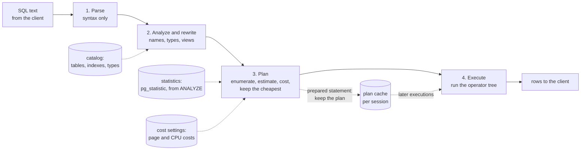
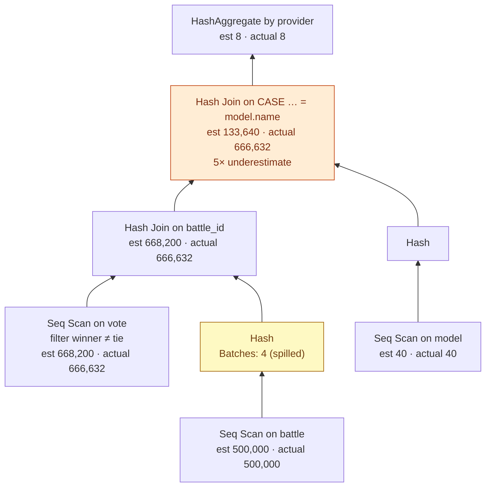

# M03 · Ch1 · §3 — How a query is planned and executed: reading the plan the database chose

> **Module:** Databases & Storage (from first principles)
> **Chapter:** The relational model from the ground up — relations, keys, normalization, how a query is planned and
> executed, B-tree indexes
> **Section:** Ch1 §1 promised that SQL (Structured Query Language) is declarative — you say *what*, the database decides *how* — and Ch1 §2 §12
> made "is the query still slow once it is planned properly?" the first question before any cache. This section opens
> the box. It follows a query from text to rows; shows the executor as a tree of small operators; teaches you to read
> `EXPLAIN ANALYZE` line by line on a real plan; explains how the planner estimates row counts and costs, and exactly
> where those estimates go wrong; and measures, on PostgreSQL 18, when an index beats a full scan, which of the three
> join algorithms wins at which size, and what a single bad estimate costs — 22 seconds instead of 147 milliseconds.
> **Status:** 🔵 PREPARED 2026-10-09 — body written, awaiting your read and the Q&A.
> **Prerequisites:** **Ch1 §1** (the relational algebra of §7 — this section is where it becomes physical) and **Ch1 §2**
> (its Figure 4 query is the worked example here). Ch1 §1 §12 met a B-tree in passing; Ch1 §4 opens it properly.

**Estimated study time:** 3.5–4 hours including the hands-on.

---

## Why this section exists — and how it's pitched

Every claim about database performance you will ever evaluate — "add an index", "denormalize this", "that join is
slow", "put a cache in front" — is a claim about **which plan the database runs**. Without the plan you are guessing,
and the guesses are often wrong in a specific direction: people add indexes the planner will never use, cache queries
that one statistics command would have fixed, and blame the database for a plan that their own query text forced.

The plan is not hidden. Every relational database will show you the one it chose and, with `EXPLAIN ANALYZE`, what
actually happened when it ran. Reading one is a skill of maybe an afternoon, and it pays back for the rest of your
career. That is the goal: by the end you should be able to take any slow query, get its plan, and say **which operator
the time went into and why the planner chose it.**

Three things make this section different from a generic tutorial:

- **Everything is measured.** The plans are real PostgreSQL 18 output, and the three figures that compare methods were
  produced by forcing each method in turn and timing it. Where the planner's choice was *not* the fastest — it happens,
  and the figures mark it — the section says so.
- **It follows one query from Ch1 §2.** The leaderboard query from Ch1 §2's Figure 4 took 146 ms there. Here you will
  read its plan, find a 5× misestimate inside it, and see which of three plausible fixes actually helped.
- **It is built around the main way plans go wrong.** The cost model is rarely the problem; **the row-count estimate
  is**. §5 and §8 show how estimates are made, the one assumption that breaks them, and what fixes it.

Throughout, the plans were captured with `max_parallel_workers_per_gather = 0`, which turns off parallel query so plans
stay small enough to read; §3 shows what parallelism changes. The data was memory-resident, as a working set usually is
on a well-sized server.

---

## 1. From SQL text to rows: the four stages

<details>
<summary><b>Vocabulary for this section</b> — terms and abbreviations used below (click to expand)</summary>

**Abbreviations**

| Short | Stands for | Meaning |
|---|---|---|
| **SQL** | Structured Query Language | the declarative query language |
| **ORM** | object-relational mapper | a library that generates SQL from objects, e.g. SQLAlchemy |

**Terms**

| Term | Definition |
|---|---|
| **Parser** | turns SQL text into a syntax tree and rejects malformed SQL |
| **Analyzer** | resolves names against the catalog — which table, which column, which type, which function |
| **Rewriter** | applies rules, notably expanding views into their defining queries |
| **Planner / optimizer** | chooses one physical plan among the many that compute the same result |
| **Executor** | runs the chosen plan and produces rows |
| **Plan** | a tree of physical operators — scans, joins, sorts, aggregates — that computes the query |
| **Catalog** | the database's own tables describing tables, columns, indexes, types and statistics |
| **Prepared statement** | a query parsed and analyzed once, then executed many times with different parameter values |
| **Custom plan / generic plan** | a plan made for this execution's parameter values / one plan reused for any values |

</details>

A query passes through four stages between your driver sending text and rows coming back.

<!-- DIAGRAM:START -->


<details>
<summary>Diagram source (Mermaid)</summary>



</details>
<!-- DIAGRAM:END -->

**Figure 1** — the four stages of a query; the planner is the only stage that makes choices, and it makes them from the
statistics and the cost settings, not from the data itself.

1. **Parse.** The text becomes a syntax tree. Only grammar is checked here: a misspelled keyword fails, a misspelled
   column name does not yet.
2. **Analyze and rewrite.** Names are resolved against the **catalog** — `vote` becomes a specific table, `winner` a
   specific column of type `text`, `count` a specific aggregate function. Views are expanded into their definitions,
   which is why querying a view costs exactly what querying its definition costs.
3. **Plan.** The planner generates alternative ways to compute the result — which access path for each table, which
   join algorithm, which join order — estimates how many rows each step produces, converts that into a cost, and keeps
   the cheapest. It never looks at your data during this stage; it looks at **statistics about** your data (§5).
4. **Execute.** The executor runs the plan tree (§2) and streams rows to the client.

**Planning has a cost of its own,** usually a fraction of a millisecond — `Planning Time: 0.267 ms` in the leaderboard
plan of §3. That is negligible for a 300 ms report and not negligible for a 0.05 ms primary-key lookup run 20,000 times
a second, which is why databases offer **prepared statements**: parse and analyze once, then execute many times.

**Prepared statements bring a trap worth knowing early.** PostgreSQL's documented rule (with the default
`plan_cache_mode = auto`) is that the first five executions of a prepared statement each get a **custom plan** made for
their actual parameter values; after that, the server builds a **generic plan** that ignores the values, and switches
to it if its estimated cost is not much worse than the average custom plan. That is a good bet when every value
behaves alike. It is a bad bet with **skewed data**: in Ch1 §2's dataset `model-1` appears in 18.5% of vote rows and
`model-40` in 0.7%, and the right plan for one is a full scan while for the other it is an index. A generic plan picks
one shape for both. The symptom is a query that is fast in `psql` and slow from the application — because the
application's driver or ORM (object-relational mapper) prepared it — and the fix is
`plan_cache_mode = force_custom_plan` for that statement or session, at the price of planning every time.

---

## 2. The executor: a tree of small operators

<details>
<summary><b>Vocabulary for this section</b> — terms and abbreviations used below (click to expand)</summary>

**Terms**

| Term | Definition |
|---|---|
| **Operator / plan node** | one step of a plan — a scan, a join, a sort, an aggregate — that consumes rows from its children and produces rows |
| **Iterator (Volcano) model** | every operator offers "give me the next row"; the root pulls, and each operator pulls from its children |
| **Pipelined operator** | produces output rows while still consuming input — a filter, a nested loop, the probe side of a hash join |
| **Blocking operator** | must consume all of an input before producing its first row — a sort, a hash build, a hash aggregate |
| **Startup cost** | the work done before an operator can emit its first row |
| **Heap** | the table's own storage, in 8 KB pages, rows in no useful order (Ch1 §1 §12) |
| **Visibility map** | a per-page bit saying "every row here is visible to everyone", which lets an index-only scan skip the heap |
| **work_mem** | the memory one sort or hash operator may use before spilling to temporary files (default 4 MB) |

</details>

The plan the executor runs is a **tree**: leaves read tables, inner nodes combine or transform rows, and the root hands
rows to the client. PostgreSQL, like most relational engines, runs it in the **iterator model** that Goetz Graefe
described for the Volcano system in 1994: every operator implements one call, *next row*. The root asks its child for a
row, which asks its children, and so on down to a scan that reads a page. Rows flow up one at a time.

This gives every operator a simple contract and lets the planner snap them together in any shape. It also explains two
things you will see in every plan:

- **Pipelined versus blocking operators.** A filter or a nested loop can emit a row as soon as it has one. A **sort**
  cannot emit anything until it has seen its whole input, and neither can the **build side of a hash join** or a **hash
  aggregate**. A plan whose blocking operators sit low in the tree has to finish most of its work before the first row
  appears.
- **Why `LIMIT` can be so fast or so slow.** `LIMIT 10` stops pulling after ten rows. Over a pipelined plan that is
  cheap — the scan stops early. Over a plan with a sort under it, all the sorting has already happened. The planner
  knows this, which is why every plan node reports two costs, **startup** and **total** (§3).

**Table 1** — the operators you will meet in nearly every plan, what each does, and its cost shape.

| Operator | What it does | Cost grows with | Blocking? |
|---|---|---|---|
| **Seq Scan** | reads every page of the table in order, applies any filter | table size, whatever the filter keeps | no |
| **Index Scan** | walks the index to matching entries, fetches each row from the heap | rows matched × (random page reads unless the table is ordered like the index) | no |
| **Index Only Scan** | answers from the index alone, visiting the heap only for pages not marked all-visible | rows matched | no |
| **Bitmap Heap Scan** (with **Bitmap Index Scan**) | collects matching row locations from one or more indexes into a bitmap, then reads the heap pages **in physical order** | pages touched, each once | builds the bitmap first |
| **Nested Loop** | for each outer row, runs the inner side (ideally an index lookup) | outer rows × cost of one inner lookup | no |
| **Hash Join** | builds a hash table on one input, probes it with each row of the other | sum of both inputs; spills to disk past `work_mem` | the build side |
| **Merge Join** | walks two inputs that are sorted on the join key, in step | sum of both inputs, plus any sort needed | only if it must sort |
| **Sort** | orders its input; in memory up to `work_mem`, then an external merge sort on disk | input size × log of input size | **yes** |
| **HashAggregate / GroupAggregate** | groups and aggregates, by hashing or over sorted input | input size | HashAggregate: **yes** |
| **Limit** | stops after N rows | N, if the plan below is pipelined | no |
| **Materialize / Memoize** | caches an inner input so rescans are cheap (Memoize caches per distinct key) | inner size | first pass |

The three scans are §6's subject and the three joins are §7's. The rest of this section is about reading a real tree.

---

## 3. Reading `EXPLAIN ANALYZE`: one real plan, line by line

<details>
<summary><b>Vocabulary for this section</b> — terms and abbreviations used below (click to expand)</summary>

**Abbreviations**

| Short | Stands for | Meaning |
|---|---|---|
| **JIT** | just-in-time compilation | PostgreSQL compiling expressions to machine code for expensive queries (on by default above a cost of 100,000) |

**Terms**

| Term | Definition |
|---|---|
| **`EXPLAIN`** | shows the chosen plan and its *estimates*, without running the query |
| **`EXPLAIN ANALYZE`** | runs the query and shows estimates and *actuals* side by side |
| **cost=a..b** | estimated startup cost .. total cost, in the planner's units (§4) — not milliseconds |
| **rows** | estimated rows per execution of this node (in the first parentheses) / actual rows per loop (in the second) |
| **loops** | how many times the node was executed; multiply per-loop time and rows by it |
| **width** | estimated average row size in bytes |
| **Buffers: shared hit / read** | pages found in PostgreSQL's buffer cache / pages that had to be read in |
| **temp read / written** | pages spilled to temporary files because an operator exceeded `work_mem` |
| **Batches** | how many parts a hash table was split into to fit `work_mem`; more than 1 means it spilled |
| **Misestimate** | a node whose estimated rows differ from its actual rows by a large factor |
| **Parallel query** | splitting one query's scan and join work across several worker processes |

</details>

Here is the leaderboard query from Ch1 §2's Figure 4 — wins per provider over a million votes — and its plan,
captured with `EXPLAIN (ANALYZE, BUFFERS)` on PostgreSQL 18. (In version 18 `BUFFERS` is included automatically with
`ANALYZE`; it is written out here for older versions.)

```sql
SELECT m.provider, count(*) AS wins
FROM vote v
JOIN battle b USING (battle_id)
JOIN model m ON m.name = CASE v.winner WHEN 'a' THEN b.model_a ELSE b.model_b END
WHERE v.winner <> 'tie'
GROUP BY m.provider;
```

```
HashAggregate  (cost=53197.61..53197.69 rows=8 width=19) (actual time=392.608..392.612 rows=8.00 loops=1)
  Group Key: m.provider
  ->  Hash Join  (cost=21874.90..52529.41 rows=133640 width=11) (actual time=70.943..339.230 rows=666632.00 loops=1)
        Hash Cond: (CASE v.winner WHEN 'a'::text THEN b.model_a ELSE b.model_b END = m.name)
        ->  Hash Join  (cost=21873.00..50649.04 rows=668200 width=18) (actual time=70.925..266.000 rows=666632.00 loops=1)
              Hash Cond: (v.battle_id = b.battle_id)
              Buffers: shared hit=14063, temp read=3453 written=3453
              ->  Seq Scan on vote v  (cost=0.00..18870.00 rows=668200 width=6) (actual time=0.003..47.388 rows=666632.00 loops=1)
                    Filter: (winner <> 'tie'::text)
                    Rows Removed by Filter: 333368
              ->  Hash  (cost=12693.00..12693.00 rows=500000 width=20) (actual time=70.852..70.854 rows=500000.00 loops=1)
                    Buckets: 131072  Batches: 4  Memory Usage: 7473kB
                    ->  Seq Scan on battle b  (cost=0.00..12693.00 rows=500000 width=20) (actual time=0.003..22.184 rows=500000.00 loops=1)
        ->  Hash  (cost=1.40..1.40 rows=40 width=19) (actual time=0.014..0.014 rows=40.00 loops=1)
              ->  Seq Scan on model m  (cost=0.00..1.40 rows=40 width=19) (actual time=0.006..0.008 rows=40.00 loops=1)
Planning Time: 0.267 ms
Execution Time: 392.658 ms
```

(Lightly trimmed: some `Buffers` lines are omitted.) The same plan as a tree, with the one line that matters marked:

<!-- DIAGRAM:START -->


<details>
<summary>Diagram source (Mermaid)</summary>



</details>
<!-- DIAGRAM:END -->

**Figure 2** — the leaderboard plan as a tree, read from the leaves up: the estimate is right everywhere except the
join on the `CASE` expression, where it is five times too low.

**How to read it, in five habits:**

1. **Read from the inside out.** The most indented lines run first. Here: scan `vote` and scan `battle`, hash `battle`,
   join them, join the result to `model`, aggregate. Each `->` is a child of the line above it at lower indentation.
2. **Separate the estimate from the actual.** The first parentheses are the planner's prediction, the second are what
   happened. **`cost` is not time** — it is in the planner's own units (§4) — so compare `rows` with `rows`, and read
   time only from `actual time`.
3. **Hunt for the biggest estimate-versus-actual gap.** The scan of `vote` predicted 668,200 rows and got 666,632 —
   excellent. The outer hash join predicted **133,640** and got **666,632**, five times more. That gap is the most
   important line in any plan, because every choice above it was made for the wrong number of rows. Here nothing above
   it depended much on the count, so it did no harm; §8 shows a case where the same kind of gap costs 150×.
4. **Find where the time goes.** `actual time=start..end` is cumulative: a node's time includes its children's. The
   outer join ends at 339 ms and the inner one at 266 ms, so about 73 ms went into the outer join's own work and about
   53 ms into the aggregate on top. The two scans, at 47 ms and 22 ms, are cheap.
5. **Multiply by `loops`.** Times and row counts are **per execution**. A node inside a nested loop may say
   `actual time=0.009 rows=1 loops=200000` — that is 1.8 seconds and 200,000 rows, not 9 microseconds. Forgetting this is
   the most common misreading of a plan.

**Why the planner got the `CASE` join wrong.** It keeps statistics on columns, not on expressions. For
`CASE … END = m.name` it has no distribution to consult, so it falls back to a generic guess, and the guess was 5× low.
This is a general rule worth remembering: **wrapping a column in an expression hides it from the statistics**, and §6
shows it also hides it from the index.

**What the `Batches: 4` line did and did not cost.** The hash of 500,000 battles needed more than the default 4 MB
`work_mem`, so it was split into four batches and spilled to temporary files — `temp read=3453 written=3453`. The
textbook reflex is to raise `work_mem`. Measured over 15 runs each, raising it to 16 MB or 64 MB removed the spill and
did **not** make the query faster (330–370 ms in every case, within run-to-run noise): the temporary files were served
from the operating system's cache, and the time was CPU work on 666,632 rows either way. What did help was the setting
turned off here for readability: with **two parallel workers** the same query took **132 ms**, which is where Ch1 §2's
146 ms came from. **A plan tells you where the work is; a measurement tells you which change removes it.** A spill
line is a hypothesis, not a verdict.

---

## 4. The cost model: how the planner prices a plan

<details>
<summary><b>Vocabulary for this section</b> — terms, abbreviations and every symbol in the formulas (click to expand)</summary>

**Abbreviations**

| Short | Stands for | Meaning |
|---|---|---|
| **CPU** | central processing unit | the processor; here, the per-row computation part of a cost |
| **I/O** | input/output | reading and writing pages |
| **SSD** | solid-state drive | flash storage, where a random read costs little more than a sequential one |

**Symbols used in the formulas**

| Symbol | Reads as | Meaning |
|---|---|---|
| $C$ | "C" | estimated cost of a plan node, in the planner's units |
| $p$ | "p" | number of pages the node reads |
| $n$ | "n" | number of rows the node processes |
| $k$ | "k" | number of operator evaluations per row — for example, one comparison in a filter |
| $c_{\text{seq}}$ | "c-seq" | `seq_page_cost`, cost of reading one page sequentially — the unit, default 1 |
| $c_{\text{rand}}$ | "c-rand" | `random_page_cost`, cost of reading one page at a random position, default 4 |
| $c_{\text{tuple}}$ | "c-tuple" | `cpu_tuple_cost`, cost of processing one row, default 0.01 |
| $c_{\text{op}}$ | "c-op" | `cpu_operator_cost`, cost of one operator or function call, default 0.0025 |

**Terms**

| Term | Definition |
|---|---|
| **Cost unit** | the planner's currency, anchored so that one sequential page read costs 1; not a unit of time |
| **Cost constant** | a setting that prices one kind of work — a page read, a row, an operator call |
| **Correlation** | how closely a column's order matches the rows' physical order, from −1 to 1 |

</details>

The planner cannot run every candidate plan to see which is fastest, so it **prices** each one with a formula. The
unit is anchored to one sequential page read; everything else is priced relative to it. For a sequential scan with a
filter, the formula is simple:

$$C_{\text{seq scan}} = p \cdot c_{\text{seq}} + n \cdot (c_{\text{tuple}} + k \cdot c_{\text{op}})$$

You can check it against a real plan. The 5,000,000-row table used in §6 has a sequential scan, with one comparison
per row, priced at `cost=0.00..139429.91`. With the defaults:

$$139429.91 = p \cdot 1 + 5000000 \cdot (0.01 + 1 \cdot 0.0025) = p + 62500$$

so $p = 76929.91$ pages — the table occupies about 76,930 pages of 8 KB, about 600 MB, which is exactly what the
catalog says. The cost model is not a black box: it is arithmetic on page counts, row estimates and five constants.

**Table 2** — PostgreSQL's cost constants, their defaults, and what each assumes.

| Setting | Default | Prices | The assumption baked in |
|---|---|---|---|
| `seq_page_cost` | 1.0 | one page read in physical order | the unit |
| `random_page_cost` | 4.0 | one page read at a random position | a random read costs four sequential ones — a compromise for spinning disks with some caching |
| `cpu_tuple_cost` | 0.01 | processing one row | a row is a hundredth of a page read |
| `cpu_index_tuple_cost` | 0.005 | processing one index entry | half a row |
| `cpu_operator_cost` | 0.0025 | one operator or function call | a quarter of a row |
| `effective_cache_size` | 4 GB | not a cost; the planner's belief about how much data the OS and PostgreSQL cache together | larger values make repeated index access look cheaper |

Two consequences follow, and both matter in §6:

- **An index scan's cost depends on physical order.** Fetching 10,000 rows through an index means up to 10,000
  random page reads if the matching rows are scattered, but perhaps 100 sequential ones if they sit together. The
  planner interpolates between those two extremes using the column's **correlation** statistic (§5).
- **The constants describe hardware, and the defaults describe old hardware.** On solid-state drives (SSDs) or with the working set in
  memory, a random read costs little more than a sequential one, and many installations set `random_page_cost` near
  1.1. §6 measures what that changes — it fixes some choices and breaks others.

**What the cost model is not good at** is anything the formula does not contain: CPU cache effects, contention with
other queries, the speed of a particular function. That is why the planner can price two plans correctly in its own
units and still order them wrongly in milliseconds — §7's join measurements contain two such cases. But in practice
the formula is rarely the biggest source of error. **The biggest source is $n$: the estimated number of rows**, which
feeds every term. That is the next section.

---

## 5. Statistics and cardinality estimation: where row counts come from

<details>
<summary><b>Vocabulary for this section</b> — terms, abbreviations and every symbol in the formulas (click to expand)</summary>

**Abbreviations**

| Short | Stands for | Meaning |
|---|---|---|
| **MCV** | most common values | the list of a column's most frequent values, with their frequencies |

**Symbols used in the formulas**

| Symbol | Reads as | Meaning |
|---|---|---|
| $N$ | "N" | rows in the table |
| $s(A)$ | "s of A" | selectivity of condition $A$ — the fraction of rows it keeps, from 0 to 1 |
| $A \wedge B$ | "A and B" | both conditions hold |
| $\hat{n}$ | "n-hat" | the estimated number of rows a step produces |

**Terms**

| Term | Definition |
|---|---|
| **Cardinality** | the number of rows a plan step produces |
| **Selectivity** | the fraction of rows a condition keeps |
| **`ANALYZE`** | the command that samples a table and stores per-column statistics; autovacuum runs it automatically after enough changes |
| **Statistics target** | how much detail `ANALYZE` keeps per column (default 100) — the length of the MCV list and histogram, and the sample size |
| **`null_frac`** | fraction of a column's values that are `NULL` |
| **`n_distinct`** | estimated number of distinct values (negative values mean a fraction of the row count) |
| **Histogram** | bucket boundaries dividing the non-MCV values into equal-population ranges, used for range conditions |
| **Independence assumption** | estimating a conjunction by multiplying the selectivities of its parts |
| **Extended statistics** | statistics on combinations of columns, created with `CREATE STATISTICS` |
| **Functional dependency statistic** | measures how far one column determines another (Ch1 §2 §2), so the planner stops multiplying |

</details>

The planner estimates every step's row count from **statistics**, which `ANALYZE` gathers from a random sample of each
table and stores in the catalog; you can read them in the `pg_stats` view. Per column it keeps the fraction of `NULL`s,
the number of distinct values, a **most-common-values (MCV) list** with each value's frequency, a **histogram** of the
remaining values for range conditions, and the **correlation** between the column's order and the physical row order.
The amount of detail is set by the **statistics target** (default 100), and the largest target among the columns being
analyzed also sets how many rows are sampled.

From these, single conditions are estimated well. In Ch1 §2's vote sheet, `ANALYZE` recorded `model-1` in the MCV list
with frequency 0.18497, so `WHERE model_a = 'model-1'` on a million rows is estimated at 185,900 rows; the actual count
was 185,482 — off by 0.2%. A range condition uses the histogram the same way.

**The problem is combining conditions.** For `WHERE A AND B`, the planner by default assumes the two conditions are
**independent** and multiplies:

$$\hat{n} = N \cdot s(A) \cdot s(B)$$

That is right for unrelated columns and badly wrong for related ones — and related columns are exactly what Ch1 §2
taught you to recognize: a functional dependency **is** a failure of independence. The vote sheet stores a model and
its provider side by side, and the model determines the provider:

**Table 3** — correlated columns, before and after extended statistics (PostgreSQL 18, 1,000,000 rows).

| Condition | Estimated (default) | Actual | Estimated after `CREATE STATISTICS` |
|---|---|---|---|
| `model_a = 'model-1'` | 185,900 | 185,482 | 184,967 |
| `model_a_provider = 'provider-2'` | 249,833 | 247,874 | — |
| `model_a = 'model-1' AND model_a_provider = 'provider-2'` (always true together) | **46,444** — 4× low | 185,482 | **184,967** |
| `model_a = 'model-1' AND model_a_provider = 'provider-3'` (never true together) | **31,200** | **0** | **1** |

The default estimate for the third row is the multiplication: $1000000 \cdot 0.1859 \cdot 0.2498 \approx 46444$. The
planner has no way to know that knowing the model already tells you the provider. The fix is to tell it:

```sql
CREATE STATISTICS vote_sheet_model_provider (dependencies, mcv)
    ON model_a, model_a_provider FROM vote_sheet;
ANALYZE vote_sheet;
```

`dependencies` records how strongly one column determines the other; `mcv` records the most common *combinations*.
After it, both estimates are right. **Extended statistics are opt-in** — PostgreSQL never creates them for you, because
the number of possible column combinations is enormous — so they are the tool to reach for whenever a plan shows a
multi-condition filter with a large misestimate. §8 shows a case where getting this right is the difference between 22
seconds and 147 milliseconds, and where one kind of extended statistic worked and the other did not.

**Errors compound through joins.** A join's estimated output is built from its inputs' estimates, so a 4× error on a
filter becomes the input to the next join's estimate, and so on up the tree. Leis and colleagues measured this across
real systems in 2015 ("How Good Are Query Optimizers, Really?"): every cardinality estimator they tested — PostgreSQL's
and four others — routinely produced large errors, the errors **grew exponentially with the number of joins**, and the
systems **systematically underestimated** multi-join results. Underestimates are the dangerous direction, because they
make plans that are cheap for small inputs, like nested loops, look attractive.

---

## 6. Access paths: when an index helps, measured

<details>
<summary><b>Vocabulary for this section</b> — terms and abbreviations used below (click to expand)</summary>

**Abbreviations**

| Short | Stands for | Meaning |
|---|---|---|
| **SSD** | solid-state drive | flash storage with cheap random reads |

**Terms**

| Term | Definition |
|---|---|
| **Access path** | how one table is read: a sequential scan, an index scan, an index-only scan or a bitmap scan |
| **Crossover** | the selectivity at which one access path stops being faster than another |
| **Correlation (statistic)** | how closely a column's sorted order matches the physical order of rows; 1 means rows sit on disk in index order |
| **Sargable** | a condition the database can answer with an index — the column appears bare on one side (from "search argument") |
| **Expression index** | an index on the result of an expression, such as `lower(email)`, so a condition on that expression is sargable |

</details>

The rule of thumb "an index makes lookups fast" is true only for queries that want **few** rows. Each row fetched
through an index can cost a random page read, so beyond some fraction of the table it is cheaper to read every page in
order and throw most rows away. Where that crossover sits depends on one thing most people never consider: **how the
matching rows are laid out on disk.**

To measure it, a 5,000,000-row table (about 600 MB, held in memory) was given two indexed integer columns. Column `r`
holds random values, so its index order has nothing to do with the physical order (correlation 0). Column `c` is the
row number divided by five, so rows sit on disk in exactly index order (correlation 1). The query
`SELECT sum(length(pad)) FROM t WHERE <column> < k` was run across selectivities from one row in a million to every
row, forcing each access method in turn, and the planner's own choice was recorded.

![Two log-log line charts of query time against the percentage of five million rows selected, for a sequential scan, an index scan and a bitmap heap scan. Left, for a randomly ordered column: the sequential scan is flat at about 135 milliseconds; the index and bitmap scans rise from 0.02 milliseconds and cross it between 3 and 10 percent; at 100 percent the index scan takes 3.6 seconds. Circles mark the planner's choice, which is an index or bitmap scan up to 10 percent and a sequential scan from 30 percent. Right, for a column stored in index order: the index scan stays faster than the sequential scan up to 30 percent.](diagrams/03-query-planning-fig3.svg)

**Figure 3** — measured access-path crossover on PostgreSQL 18: with rows in random order an index stops paying
between 3% and 10% of the table; with the same rows in index order it still wins at 30%. Circles mark the planner's
choice.

Read it from left to right:

- **The sequential scan is flat** at about 135 ms: it reads all 76,930 pages whatever the condition, and only the
  filtering work grows (to 656 ms at 100%, when every row also has to be summed).
- **The index scan starts at 0.02 ms** — 6,000 times faster for a handful of rows — and its cost grows with the number of
  rows it fetches. On the random column it is still faster at 3% (124 ms against 154 ms) and much slower at 10% (360 ms
  against 196 ms), so it crosses the sequential scan **between 3% and 10%**, and it reaches 3.6 seconds when asked for
  everything: five million scattered heap fetches.
- **The bitmap scan is the middle path.** It collects every matching row's location first, then visits each heap page
  once, in physical order. It tracks the index scan at low selectivity, beats it beyond a few percent, and stays
  closer to the sequential scan at the top. That is why PostgreSQL chose it across most of the left panel.
- **Physical order moves the crossover tenfold.** On the right, every matching row for a range sits on consecutive
  pages, so an index scan reads them nearly sequentially, and it still beats the full scan at 30%. Same table size,
  same query, same index type — only the correlation differs. This is the mechanism behind Ch1 §1 §3's advice on
  ordered keys and behind `CLUSTER`, which rewrites a table in an index's order; Ch1 §4 returns to it.

**The planner's choices were good but not perfect.** It never picked a badly wrong method. At low selectivity its
choice was the fastest or within a fraction of a millisecond of it. Its largest misses were at the crossovers, where
the alternatives are close: at 3% on the random column it picked the bitmap scan (154 ms) over the index scan (124 ms),
and at 10% the bitmap scan (220 ms) over the sequential scan (196 ms). That is the cost model doing its job
approximately, as designed — and a reminder that "the planner chose it" is not proof that it is fastest.

**Tuning the cost constants trades errors rather than removing them.** With the data in memory, the default
`random_page_cost = 4` overprices random reads. Setting it to 1.1, a common recommendation for SSDs, changed the
planner's choices in both directions: it now picked the fastest join in both cases where it had picked wrong (§7), and
it **also** started choosing a plain index scan at 10% selectivity on the random column — which measured 360 ms
against the sequential scan's 196 ms. Change a constant to match your hardware, then re-check the plans that matter.

### 6a. Sargability: when the index exists and cannot be used

An index on `r` can answer `WHERE r = 4242` because the column stands alone on one side of the comparison — the
condition is **sargable**. Wrap the column in anything and it no longer is:

**Table 4** — the same lookup written three ways, on the 5,000,000-row table with an index on `r` (seven matching rows).

| Condition | Plan | Median time |
|---|---|---|
| `r = 4242` | Index Only Scan, `Index Cond: (r = 4242)` | **0.022 ms** |
| `r + 0 = 4242` | Index Only Scan over the **whole** index, `Filter: ((r + 0) = 4242)` | **251 ms** |
| `r::text = '4242'` | Index Only Scan over the whole index, `Filter: ((r)::text = '4242')` | **369 ms** |

Note how deceptive the slow plans look: they still say "Index Only Scan". The tell is the word **`Filter`** where the
fast plan says **`Index Cond`** — the index is being read end to end as a compact copy of the column, not searched.
The same thing happens with `WHERE lower(email) = …`, with `WHERE created_at::date = …`, with an integer column
compared against a parameter the driver sent as `numeric` (PostgreSQL casts the column, not the parameter), and with
a function applied to a column for timezone conversion. The fixes are to
move the computation to the other side (`created_at >= d AND created_at < d + 1`), to fix the type at the source, or
to create an **expression index** on exactly the expression you filter by (`CREATE INDEX ON users (lower(email))`).

---

## 7. Join algorithms and join order

<details>
<summary><b>Vocabulary for this section</b> — terms and abbreviations used below (click to expand)</summary>

**Abbreviations**

| Short | Stands for | Meaning |
|---|---|---|
| **GEQO** | genetic query optimizer | PostgreSQL's randomized join-order search, used for 12 or more tables |

**Terms**

| Term | Definition |
|---|---|
| **Outer / inner input** | the two sides of a join; a nested loop runs the inner side once per outer row |
| **Build / probe side** | the hash join input loaded into a hash table / the input streamed against it |
| **Join order** | the sequence in which tables are joined; for $n$ tables the number of orders grows faster than exponentially |
| **`join_collapse_limit`** | how many tables the planner will reorder freely in one search (default 8) |
| **Equi-join** | a join on equality of columns; hash and merge joins need one |

</details>

Every join between two inputs can be computed three ways, and each wins somewhere.

- **Nested loop.** For each outer row, look up matching inner rows. With an index on the inner join column, each
  lookup is a short B-tree descent, so the cost is roughly *outer rows × one lookup*. Unbeatable for small outer inputs;
  the only algorithm that works for non-equality joins.
- **Hash join.** Read one input (ideally the smaller) into an in-memory hash table keyed on the join column, then
  stream the other through it. The cost is roughly *the size of both inputs*, no index needed, but it must read the
  whole build side before producing anything, and it spills to disk past `work_mem`.
- **Merge join.** Walk both inputs in join-key order, advancing whichever side is behind. The cost is *the size of
  both inputs*, plus sorting either one if it is not already ordered — so it shines when indexes deliver both sides
  sorted, and for very large inputs.

To measure the crossovers, an outer table of random foreign ids was joined to the 5,000,000-row table through its
primary key, varying the number of outer rows from 1 to 1,000,000 and forcing each algorithm in turn.

![Log-log line chart of join time against the number of outer rows, from 1 to 1,000,000, for nested loop, hash join and merge join. The nested loop rises from 0.05 milliseconds to 2.4 seconds; the hash join is roughly flat at 160 to 300 milliseconds until it reaches 1.3 seconds at a million rows; the merge join is flat at 220 to 360 milliseconds and reaches 740 milliseconds at a million rows. Circles mark the planner's choices: nested loop up to 10,000 rows, and hash join at 100,000 and 1,000,000 rows, where nested loop and merge join respectively were faster.](diagrams/03-query-planning-fig4.svg)

**Figure 4** — measured join algorithms on PostgreSQL 18: nested loop wins by orders of magnitude for small outer
inputs, and at the two largest sizes the planner's choice (hash join) was not the fastest. Circles mark its choices.

What the measurements say:

- **For up to 10,000 outer rows the nested loop wins by a factor of 8 to 3,000** — 0.05 ms against 158 ms for one
  row. The hash join has to read the whole 5,000,000-row table to build or probe; the nested loop touches a few pages
  per outer row. This is why OLTP queries — online transaction processing, the many small queries an application
  makes — should almost always run as nested loops over indexes, and why a plan that switches one of them to a hash
  join is worth investigating.
- **At 100,000 outer rows the planner picked the hash join (295 ms) when the nested loop was faster (249 ms)**, and at
  1,000,000 it picked the hash join (1,347 ms) when the merge join was much faster (740 ms). Its estimates of the row
  counts were correct here; the error was in the **cost model** — `random_page_cost = 4` priced the nested loop's and
  the merge join's index reads as if they came from a disk, when they came from memory. With
  `random_page_cost = 1.1` it chose the nested loop at 100,000 rows (268 ms) and the merge join at 1,000,000 (797 ms):
  both fastest, at the price §6 described.

### 7a. Join order: the search the planner actually does

For two tables there are two orders. For $n$ tables the number of possible join trees grows faster than exponentially,
and the cost of different orders can differ by orders of magnitude, because a good order shrinks intermediate results
early. The approach every major relational database still uses comes from IBM's System R, described by Patricia
Selinger and colleagues in 1979: **dynamic programming** over subsets of tables — find the cheapest way to join every
pair, then build the cheapest way to join every set of three from those, and so on — keeping, for each subset, the
cheapest plan for each useful sort order of the result.

That search is exact but its cost grows exponentially, so PostgreSQL bounds it. It reorders explicit `JOIN`s freely
only up to **`join_collapse_limit` = 8** tables at a time, and switches from dynamic programming to the randomized
**genetic query optimizer** at **`geqo_threshold` = 12** tables. A generated query joining 15 tables — common from ORMs
and reporting tools — is therefore planned by a randomized search whose plan can change between runs. If a large join
is unstable, these two settings are where to look.

---

## 8. When the plan is wrong — and how to fix it

<details>
<summary><b>Vocabulary for this section</b> — terms and abbreviations used below (click to expand)</summary>

**Abbreviations**

| Short | Stands for | Meaning |
|---|---|---|
| **MCV** | most common values | a statistic listing the most frequent values or value combinations |
| **CTE** | common table expression | a named sub-query introduced with `WITH` |
| **ORM** | object-relational mapper | a library that generates SQL from objects |

**Terms**

| Term | Definition |
|---|---|
| **Cardinality misestimate** | a large gap between a plan node's estimated and actual row counts |
| **Stale statistics** | statistics gathered before the data changed substantially — after a bulk load, typically |
| **Optimizer hint** | an instruction embedded in a query telling the planner which plan to use; core PostgreSQL has none |
| **`pg_stat_statements`** | an extension that records execution statistics for every distinct query shape |
| **`auto_explain`** | a module that logs the plans of queries slower than a threshold, as they run in production |

</details>

### 8a. One misestimate, measured: 22 seconds against 147 milliseconds

Here is the failure Leis and colleagues describe, reproduced. An events table of 5,000,000 rows has three columns —
`region`, `shard`, `rack` — that always hold the same value (think of a placement scheme where each implies the
others), each with 1,000 distinct values. The query joins the events in one placement to a 100,000-row table of tags
that has no index on the join column:

```sql
SELECT count(*) FROM ev JOIN tag ON tag.ev_id = ev.id
WHERE ev.region = 7 AND ev.shard = 7 AND ev.rack = 7;
```

The true number of matching events is 5,000. Multiplying three independent selectivities of 1/1,000 gives
$5000000 \cdot 10^{-9}$, which the planner rounds up to **1 row**. For one outer row the cheapest join is a nested loop
that scans the tag table once — so that is the plan:

```
Nested Loop  (cost=0.00..117398.00 rows=1 width=0) (actual time=22135.086..22135.087 rows=0.00 loops=1)
  Join Filter: (ev.id = tag.ev_id)
  Rows Removed by Join Filter: 500000000
  ->  Seq Scan on ev  (cost=0.00..114572.00 rows=1 width=4) (actual time=2.826..156.914 rows=5000.00 loops=1)
        Filter: ((region = 7) AND (shard = 7) AND (rack = 7))
  ->  Seq Scan on tag  (cost=0.00..1576.00 rows=100000 width=4) (actual time=0.000..2.093 rows=100000.00 loops=5000)
Execution Time: 22144.202 ms
```

`rows=1` against `rows=5000.00`, and below it `loops=5000`: the "scan once" plan scanned the tag table five thousand
times and compared **500 million** pairs. Four ways to fix it, measured:

**Table 5** — the same query under four kinds of statistics (PostgreSQL 18).

| Statistics on `ev` | Estimated rows | Plan chosen | Time |
|---|---|---|---|
| per-column only (the default) | 1 | Nested Loop, inner Seq Scan × 5,000 | **22,144 ms** |
| `CREATE STATISTICS … (dependencies, mcv)` at the default target | 1 | the same | 21,959 ms |
| `CREATE STATISTICS … (dependencies)` only | 4,973 | Hash Join | **147 ms** |
| `(dependencies, mcv)` with `ALTER STATISTICS … SET STATISTICS 1000` | 5,000 | not run — estimate checked only | — |

The second row is the instructive one. With both kinds of extended statistics, the **multi-column MCV list** took
precedence, and at the default target it holds only 100 of the 1,000 combinations that exist; the combination
`(7, 7, 7)` was not among them, so the estimate stayed at 1. Statistics on dependencies alone, or an MCV list long
enough to hold every combination, fixed it. The general lesson is not "always use `dependencies`" — it is **after you
create statistics, re-run `EXPLAIN` and check that the estimate actually moved.** A fix you did not verify is a guess.

### 8b. The usual causes of a bad plan

**Table 6** — the causes of most bad plans, how each shows up in `EXPLAIN ANALYZE`, and the fix.

| Cause | What you see | Fix |
|---|---|---|
| **Correlated conditions** (§5, §8a) | a multi-condition filter estimated far too low | `CREATE STATISTICS`, then verify the estimate |
| **Stale statistics** | estimates wildly off after a bulk load, a mass delete or a new partition, before autovacuum's `ANALYZE` has run | `ANALYZE` the table as the last step of every bulk load |
| **Skewed values and too few statistics** | good estimates for common values, bad ones for rare values (or the reverse) | raise the column's target: `ALTER TABLE … ALTER COLUMN … SET STATISTICS 1000` |
| **Expressions on columns** (§3, §6a) | `Filter` where you expected `Index Cond`; a default-guess estimate | rewrite the condition, fix the type, or add an expression index |
| **Generic plan for a prepared statement** (§1) | fast in `psql`, slow from the application, for some parameter values only | `plan_cache_mode = force_custom_plan` for that statement |
| **`LIMIT` over a sorted scan** | a tiny `LIMIT` expected to stop early, but the matching rows are rare and the scan reads the whole index | an index that matches both the filter and the order, or remove the bet |
| **Cost constants that do not match the hardware** (§6, §7) | correct row estimates, and still the slower plan | adjust `random_page_cost` and `effective_cache_size`, then re-check |
| **Too many joined tables** (§7a) | plans that change between runs for the same query | raise `join_collapse_limit` or `geqo_threshold` with care, or simplify the query |

Two things are deliberately missing from the fixes column. **Optimizer hints:** core PostgreSQL has none, by design —
the project's position is that a hint freezes a plan that will be wrong when the data changes, and fixing the estimate
fixes every query that depends on it. (The `pg_hint_plan` extension exists for emergencies.) And **`WITH` as an
optimization fence:** before version 12 a common table expression was always computed separately, which people used to
force a plan; since 12 it is inlined unless you write `MATERIALIZED`, so old advice about CTEs is often obsolete.

### 8c. Finding the slow queries in the first place

`EXPLAIN` explains one query you already suspect. In production you need to find which ones to suspect:

- **`pg_stat_statements`** groups executions by query shape and records calls, total and mean time, and rows. Sort by
  *total* time, not mean: a 2 ms query called a million times an hour matters more than a 2-second report run once.
- **`auto_explain`** logs the plan of any statement slower than a threshold, **as it actually ran** — with the real
  parameter values and the real statistics at that moment, which is often the only way to catch a generic-plan or
  stale-statistics problem that will not reproduce later.

---

## 9. Failure modes — the query-plan checklist

<details>
<summary><b>Vocabulary for this section</b> — terms and abbreviations used below (click to expand)</summary>

**Abbreviations**

| Short | Stands for | Meaning |
|---|---|---|
| **ORM** | object-relational mapper | a library that generates SQL from objects |
| **CTE** | common table expression | a named sub-query introduced with `WITH` |

**Terms**

| Term | Definition |
|---|---|
| **Misestimate** | estimated and actual rows differ by a large factor |
| **Sargable** | a condition an index can answer, with the column bare on one side |
| **Spill** | an operator exceeding `work_mem` and writing to temporary files |
| **Generic plan** | a cached plan reused for any parameter values |

</details>

- **Reading `cost` as time.** It is in planner units. Compare `rows` to `rows`, and take time only from `actual time`.
- **Forgetting `loops`.** A per-loop time of microseconds inside a loop of 200,000 is seconds (§3).
- **Trusting `EXPLAIN` without `ANALYZE`.** The estimate is the planner's belief; the problem is usually that the
  belief is wrong. Run `EXPLAIN ANALYZE` — inside a transaction you roll back, for anything that writes.
- **An index that "should be used" and is not.** Often correct: the query wants too many rows, or the rows are
  scattered (§6). Check the selectivity before forcing anything.
- **An index that exists and is read end to end.** `Filter` instead of `Index Cond` — a non-sargable condition (§6a).
- **A nested loop over a large actual row count.** Almost always an underestimate on the outer side (§8a). Find the
  node whose `rows` estimate is too low and fix the statistics.
- **Fast in `psql`, slow in the application.** A generic plan from a prepared statement, or different settings per
  connection (§1).
- **A plan that went bad after a data load.** Stale statistics; `ANALYZE` after bulk loads (§8b).
- **Chasing a spill line.** `Batches` above 1 or `temp written` is a hypothesis; measure before tuning `work_mem`, which
  is allocated per operator per query and can exhaust memory under concurrency (§3).
- **Changing a cost constant to fix one query.** It changes every plan; re-check the important ones (§6).
- **Creating extended statistics and not checking.** In §8a one kind fixed the estimate and the other did not.
- **Benchmarking on a cold or tiny dataset.** A plan on 1,000 rows is not the plan on 10 million; plans change shape at
  the crossovers in Figures 3 and 4.

---

## 10. Check your understanding

1. Name the four stages a query passes through. At which stage are the choices made, and what does that stage look at
   instead of the data?
2. A plan node shows `(cost=0.43..8.45 rows=1 width=93) (actual time=0.009..0.010 rows=1.00 loops=40000)`. How long did
   this node take in total, and how many rows did it produce?
3. A sequential scan of a table with a one-comparison filter is priced at `cost=0.00..23334.00`, and the table has
   1,000,000 rows. Using the default cost constants, how many pages does the table occupy?
4. Why does `WHERE country = 'SG' AND city = 'Singapore'` tend to be underestimated, and what is the fix?
5. In Figure 3, why does the index scan beat the sequential scan up to 30% of rows on one column but only up to 3% on the
   other, when the table and the query are identical?
6. A colleague says "the planner isn't using my index on `created_at`, so the planner is broken." The query is
   `WHERE created_at::date = '2026-10-01'`. What do you look for in the plan, and what is the fix?
7. When is a nested loop join the best choice, and what plan symptom tells you one has been chosen wrongly?
8. Explain why the plan in §8a scanned the tag table 5,000 times when it expected to scan it once.
9. After a nightly bulk load of 2 million rows, a dashboard query is slow for the first hour each morning and fine
   afterwards. What is the likely cause and the fix?
10. A query is fast when you run it in `psql` with a literal value and slow when the application runs it. Give the
    likely mechanism and how you would confirm it.

<details>
<summary>Answers</summary>

1. **Parse, analyze and rewrite, plan, execute** (§1, Figure 1). Choices are made only in **planning**, which looks at
   **statistics about the data** — gathered by `ANALYZE` — and the **cost constants**, never at the data itself. That
   is why stale or missing statistics produce bad plans on perfectly good data.
2. **About 0.4 seconds and 40,000 rows** (§3, habit 5). The times and rows are per loop: 0.010 ms × 40,000 ≈ 400 ms,
   and 1 row × 40,000 = 40,000 rows. A node like this is typically the inner index lookup of a nested loop.
3. **10,834 pages** (§4). The cost is $p + n \cdot (0.01 + 0.0025)$ with $n = 1000000$, so
   $23334 = p + 12500$ and $p = 10834$ pages — about 85 MB at 8 KB per page.
4. **The planner multiplies the two selectivities as if the conditions were independent** (§5), but the city almost
   determines the country — a functional dependency (Ch1 §2 §2). The product is far too small. Create extended
   statistics on the pair — `CREATE STATISTICS … (dependencies) ON country, city FROM …`, then `ANALYZE` — and
   re-run `EXPLAIN` to confirm the estimate moved (§8a).
5. **Physical order** (§6). On the randomly ordered column every matching row is on a different page, so an index scan
   pays roughly one random page read per row and soon exceeds reading the whole table in order. On the column whose
   rows sit on disk in index order, the matching rows are on consecutive pages, so the index scan reads them almost
   sequentially and stays cheaper far longer. The planner models this with the **correlation** statistic.
6. **Look for `Filter` where you would expect `Index Cond`** (§6a). The cast `created_at::date` wraps the column, so
   the condition is not sargable: the index cannot be searched for it. Rewrite it as a range on the bare column —
   `created_at >= '2026-10-01' AND created_at < '2026-10-02'` — or create an expression index on the exact
   expression. The planner is behaving correctly.
7. **When the outer input is small and the inner side has an index on the join column** (§7, Figure 4) — up to
   about 10,000 outer rows in the measurement, where it beat a hash join by 8× to 3,000×. The symptom of a wrong
   choice is a nested loop whose outer side shows a **much larger actual `rows` than estimated**, often with a large
   `loops` count on an inner sequential scan (§8a).
8. **The planner estimated 1 matching event and there were 5,000** (§8a). Multiplying three independent selectivities
   of 1/1,000 gave an estimate rounded up to one row, and for one outer row a nested loop that scans the inner table
   once is the cheapest plan. The executor ran the inner side once per *actual* outer row: 5,000 scans and 500 million
   comparisons, 22 seconds. A correct estimate (from dependency statistics) produced a hash join in 147 ms.
9. **Stale statistics** (§8b). Until autovacuum's `ANALYZE` notices the change and runs, the planner plans against the
   old row counts and distributions; once it runs, plans recover. Make `ANALYZE <table>` the final step of the bulk
   load, so the statistics are fresh before the first query.
10. **A generic plan for a prepared statement** (§1, §8b). The driver or ORM prepares the statement; after five
    executions PostgreSQL may switch to a generic plan that ignores the parameter value, which is wrong for skewed
    values. Confirm by running `PREPARE` and `EXPLAIN EXECUTE` with the same value more than five times, or with
    `EXPLAIN (GENERIC_PLAN)` (PostgreSQL 16 and later), or by capturing the production plan with `auto_explain`;
    fix with `plan_cache_mode = force_custom_plan` for that statement.

</details>

---

## 11. Optional: get your hands dirty (60–75 min)

Everything here needs Docker and `psql`. Start PostgreSQL 18 with enough memory to hold the tables, and turn off
parallel query in your session so plans stay readable:

```sh
docker run -d --name m03q --shm-size=1g -e POSTGRES_PASSWORD=pw postgres:18 -c shared_buffers=2GB
docker exec -it m03q psql -U postgres
```

```sql
SET max_parallel_workers_per_gather = 0;
\timing on
```

**1. Watch the access-path crossover.** Build the table of §6 and find the crossover yourself:

```sql
CREATE TABLE t AS
SELECT g AS id, floor(random() * 1000000)::int AS r, (g / 5)::int AS c, repeat('x', 80) AS pad
FROM generate_series(1, 5000000) g;
CREATE INDEX ON t (r);
CREATE INDEX ON t (c);
VACUUM ANALYZE t;
SELECT attname, correlation FROM pg_stats WHERE tablename = 't' AND attname IN ('r', 'c');

EXPLAIN ANALYZE SELECT sum(length(pad)) FROM t WHERE r < 10000;    -- 1%
EXPLAIN ANALYZE SELECT sum(length(pad)) FROM t WHERE r < 100000;   -- 10%
SET enable_bitmapscan = off; SET enable_seqscan = off;
EXPLAIN ANALYZE SELECT sum(length(pad)) FROM t WHERE r < 100000;   -- force the index scan
RESET enable_bitmapscan; RESET enable_seqscan;
EXPLAIN ANALYZE SELECT sum(length(pad)) FROM t WHERE c < 300000;   -- 30%, ordered column
```

Check the sequential-scan cost against §4's formula using `SELECT relpages FROM pg_class WHERE relname = 't'`.

**2. Make the planner wrong, then right.** Build §8a's tables and run the query:

```sql
CREATE TABLE ev AS
SELECT g AS id, g % 1000 AS region, g % 1000 AS shard, g % 1000 AS rack FROM generate_series(1, 5000000) g;
CREATE TABLE tag AS SELECT g AS ev_id, 'tag' || g AS label FROM generate_series(1, 5000000, 50) g;
VACUUM ANALYZE ev; VACUUM ANALYZE tag;
SET statement_timeout = '60s';
EXPLAIN ANALYZE SELECT count(*) FROM ev JOIN tag ON tag.ev_id = ev.id
WHERE ev.region = 7 AND ev.shard = 7 AND ev.rack = 7;
```

Find the node whose estimate is wrong. Then try each row of Table 5 — `CREATE STATISTICS`, `ANALYZE ev`, re-run — and
confirm which one moves the estimate. (`DROP STATISTICS` between attempts.)

**3. Break sargability.** On `t`, compare `WHERE r = 4242`, `WHERE r + 0 = 4242` and `WHERE r::text = '4242'`, and find
`Index Cond` versus `Filter` in each plan.

**4. Catch a generic plan.** Build a table where 90% of rows share one value, prepare a statement, and run it with a
rare value six times, then once with the common value:

```sql
CREATE TABLE sk AS SELECT g AS id, CASE WHEN g % 100 < 90 THEN 0 ELSE g END AS v, repeat('x', 80) AS pad
FROM generate_series(1, 2000000) g;
CREATE INDEX ON sk (v); ANALYZE sk;
PREPARE q(int) AS SELECT count(*), sum(length(pad)) FROM sk WHERE v = $1;
EXPLAIN EXECUTE q(12345);   -- six times: a custom Index Scan, estimated 60 rows
EXPLAIN EXECUTE q(0);       -- once: a custom Seq Scan, estimated 1,798,764 rows
EXPLAIN ANALYZE EXECUTE q(0);   -- now: the GENERIC plan
SET plan_cache_mode = force_custom_plan;
EXPLAIN ANALYZE EXECUTE q(0);
```

On PostgreSQL 18 the third statement switches to the generic plan — an Index Scan estimated at **596 rows** that
actually returns **1,800,000**. (The expensive custom plan for `q(0)` raised the running average custom cost, which
made the generic plan look cheap by comparison — exactly the comparison §1 describes.) On this in-memory table the
time difference is small, 342 ms against 316 ms, but the estimate is off by a factor of 3,000, and inside a join that
estimate would decide the plan above it.

**5. Read a real plan you care about.** Take the slowest query in a project of yours, run `EXPLAIN (ANALYZE, BUFFERS)`
on a copy of realistic data, and write down three things: the node with the largest estimate-versus-actual gap, the
node where most of the time goes, and whether either one is the same node.

When you are done: `docker rm -f m03q`.

---

## Key terms (English · 大陆 简体 · 台灣 繁體)

| English | 大陆 (简体) | 台灣 (繁體) | Note |
|---|---|---|---|
| Query planner / optimizer | 查询规划器 / 查询优化器 | 查詢規劃器 / 查詢最佳化工具 | ⚠ 优化 ↔ **最佳化** |
| Execution plan | 执行计划 | 執行計畫 | ⚠ 计划 ↔ **計畫** |
| Cost model | 代价模型 / 成本模型 | 成本模型 | ⚠ 代价 is the common 大陆 database term |
| Cardinality estimation | 基数估计 | 基數估計 | |
| Selectivity | 选择率 | 選擇性 | ⚠ different endings |
| Statistics | 统计信息 | 統計資訊 | ⚠ 信息 ↔ **資訊** |
| Histogram | 直方图 | 直方圖 | |
| Sequential scan | 顺序扫描 / 全表扫描 | 循序掃描 / 全表掃描 | ⚠ 顺序 ↔ **循序** |
| Index scan | 索引扫描 | 索引掃描 | |
| Nested loop join | 嵌套循环连接 | 巢狀迴圈聯結 | ⚠ 嵌套循环 ↔ **巢狀迴圈** |
| Hash join | 哈希连接 | 雜湊聯結 | ⚠ 哈希 ↔ **雜湊** — a very common split |
| Merge join | 归并连接 / 合并连接 | 合併聯結 | |
| Join order | 连接顺序 | 聯結順序 | |
| Dynamic programming | 动态规划 | 動態規劃 | |
| Prepared statement | 预处理语句 / 预编译语句 | 預備陳述式 | ⚠ genuinely different; 陳述式 is Microsoft's 台灣 term for "statement" |
| Correlation | 相关性 | 相關性 | |
| Sargable | 可利用索引的（谓词） | 可使用索引的（述詞） | no settled term in either; ⚠ 谓词 ↔ **述詞** (predicate) |

---

## References

- PostgreSQL documentation — *Using EXPLAIN* (reading plans, the sequential-scan cost arithmetic of §4, `loops`) —
  <https://www.postgresql.org/docs/current/using-explain.html> · and *EXPLAIN* (Buffers included automatically with
  `ANALYZE` in version 18) — <https://www.postgresql.org/docs/current/sql-explain.html>
- PostgreSQL documentation — *Statistics Used by the Planner* (single-column statistics, extended statistics:
  functional dependencies, n-distinct counts, multivariate MCV lists) —
  <https://www.postgresql.org/docs/current/planner-stats.html> · *Row Estimation Examples* —
  <https://www.postgresql.org/docs/current/row-estimation-examples.html>
- PostgreSQL documentation — *Query Planning* configuration (cost constants, `join_collapse_limit`, `geqo_threshold`,
  `plan_cache_mode`) — <https://www.postgresql.org/docs/current/runtime-config-query.html>
- PostgreSQL documentation — *PREPARE* (the first-five-executions rule for generic plans) —
  <https://www.postgresql.org/docs/current/sql-prepare.html>
- PostgreSQL documentation — *ANALYZE* (random sampling; the statistics target sets the sample size) —
  <https://www.postgresql.org/docs/current/sql-analyze.html> · *CREATE STATISTICS* —
  <https://www.postgresql.org/docs/current/sql-createstatistics.html>
- PostgreSQL documentation — *pg_stat_statements* and *auto_explain* —
  <https://www.postgresql.org/docs/current/pgstatstatements.html> ·
  <https://www.postgresql.org/docs/current/auto-explain.html>
- G. Graefe — *Volcano — An Extensible and Parallel Query Evaluation System*, Institute of Electrical and Electronics
  Engineers (IEEE) Transactions on Knowledge and Data Engineering 6(1), 1994 — the iterator model of §2 —
  <https://doi.org/10.1109/69.273032>
- P. G. Selinger et al. — *Access Path Selection in a Relational Database Management System*, ACM SIGMOD (Association
  for Computing Machinery, Special Interest Group on Management of Data) 1979 — System R's cost-based optimizer and
  dynamic-programming join ordering (§7a) — <https://doi.org/10.1145/582095.582099>
- V. Leis et al. — *How Good Are Query Optimizers, Really?*, Proceedings of the Very Large Data Bases (VLDB) Endowment
  9(3), 2015 — estimation errors that grow exponentially with joins, and systematic underestimation (§5, §8) —
  <https://www.vldb.org/pvldb/vol9/p204-leis.pdf>
- `pg_hint_plan` — the optimizer-hint extension mentioned in §8b — <https://github.com/ossc-db/pg_hint_plan>

### What's next

**Ch1 §4 — The B-tree index.** This section treated an index as a black box with a cost: a few page reads per lookup,
one random heap fetch per row unless the table is in index order. Ch1 §4 opens the box — the page layout of a B-tree,
how a lookup descends it, how inserts split pages, why the tree stays three or four levels deep at any realistic size,
why random UUIDs (Ch1 §1 §3) scatter inserts across it, and how multi-column indexes, covering indexes, partial
indexes and expression indexes change which queries it can answer. It closes Ch1.
