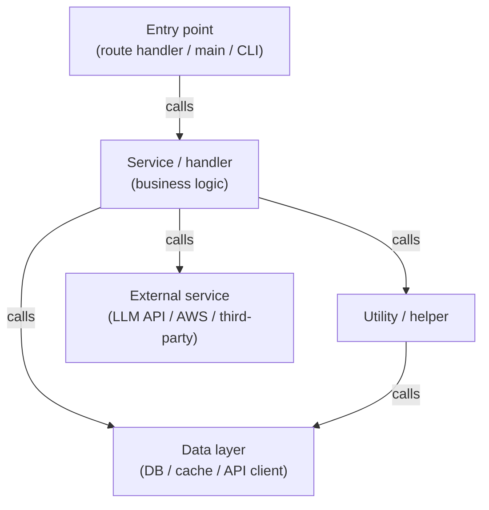
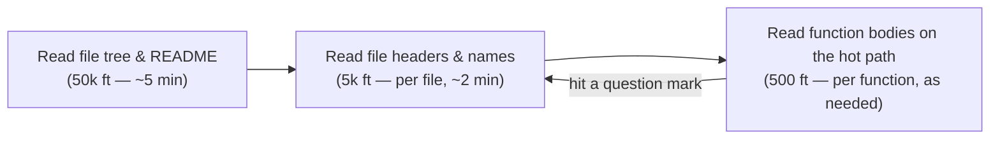
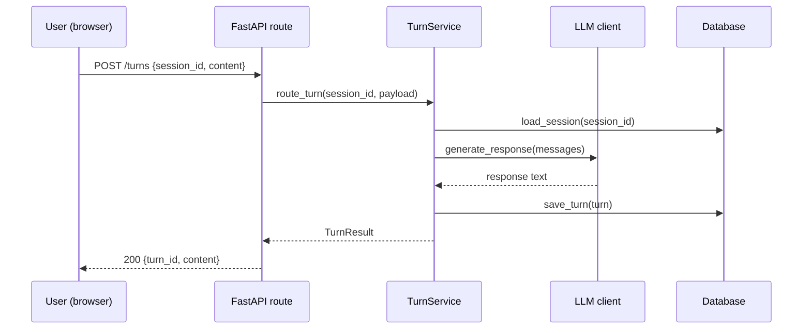
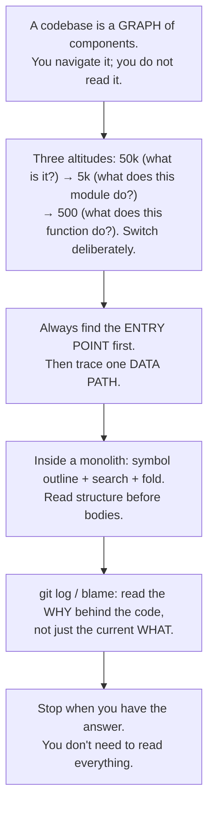

# M04 · Ch1 · §1 — Navigating an Unfamiliar Codebase

> **Module:** Writing Code That Lasts
> **Chapter:** Reading Code Well
> **Section:** Navigating an unfamiliar codebase — how to orient fast, trace data flow, and not drown
> **Status:** ✅ finalized 2026-06-10 — you already used most strategies; session confirmed git as
> the main gap. Two real cases added in §11: environment leakage in a multi-step pipeline (Case 1)
> and understanding-driven refactoring + copy-paste inheritance in an eval repo (Case 2).

**Estimated study time:** 2–3 hours including reflection.
**Prerequisites:** none formal, but M01 Ch1 (especially §1 bytecode and §3 the datapath) gives useful
vocabulary — "execution" and "call stack" come up.

---

## Why this section exists (for *you*)

You have a superpower and a gap that go together. The superpower: you vibe-code with AI agents and
ship real systems. The gap: when **someone else's code** (or your own three months later) lands in
front of you, there is no clear entry point. You have two files that are 2,400+ and 3,200+ lines long.
Even you don't navigate those by reading top to bottom — you probably grep, scroll, get lost.

This section builds the **mental model and the systematic moves** that experienced engineers use to get
their bearings in any unfamiliar codebase in under an hour. It is not about memorising the code — it is
about knowing *which question to ask next* so you are never stuck spinning.

By the end you'll have a repeatable strategy for:
- orientating to a repo in ~10 minutes without reading a single function body
- tracing where a request or a piece of data *actually goes* (data flow)
- navigating a monolith file without drowning (directly applicable to `ArenaPage.jsx`)
- using `git` and your IDE as reading tools, not just writing tools

The physics analogy that might resonate: reading a codebase is like reading an unknown circuit. You do
not probe every node — you find the rails (power/ground = entry points), identify the main blocks
(subsystems), and *then* trace the signal path of interest. You read the schematic, not the PCB copper.

---

## 1. The mental model: a codebase is a graph, not a document

The single biggest mistake novice readers make is treating source code as a document to read
*linearly*. A codebase is a **directed graph** of components (files, modules, classes, functions) with
edges that are *calls*. Most of the time you only need to traverse a small sub-graph — the path that
a specific input travels to produce a specific output.



You do not read the whole graph. You find the *path* from the edge (a user action, an HTTP request, a
cron job trigger) to the leaf that does the real work, and you read that path. Everything else is
context you load only when you hit a question mark.

---

## 2. The three altitudes — never start at ground level

Reading code at the wrong altitude wastes enormous time. Good readers switch altitude deliberately.

### 50,000 ft — what is this project and what are its moving parts?

**Goal:** a mental map in ~5 minutes, without reading any function bodies.

Moves:
1. **Read the file tree.** A directory structure is documentation. A `routes/`, `services/`,
   `models/`, `db/` layout tells you more in 10 seconds than 10 minutes of reading functions.
2. **Read `README.md` or equivalent.** Even bad ones say what the thing does.
3. **Read top-level config files.** `package.json` `scripts:`, `pyproject.toml` entry-points,
   `Makefile`, `Dockerfile` — these name the *executable surfaces* of the project: what commands run
   it, test it, build it.
4. **Count files and lines per directory** (a fast `find . -name "*.py" | head -30` or IDE file
   tree). This tells you where the *mass* of the code is — which is usually where the complexity is.

At this altitude you want one sentence per "block": *"routes/ is the HTTP layer, services/ has the
business logic, models/ is the DB schema."* You are drawing the schematic, not reading the gates.

### 5,000 ft — what does this module/file do, and what does it expose?

**Goal:** understand the *contract* of a file without reading its internals.

Moves:
1. **Read the file header** — imports tell you dependencies (what it calls); exports tell you what it
   offers callers.
2. **Read function/class names only** — scan for them without reading bodies. Names are the
   highest-density information in well-written code. A function called `validate_turn_submission` does
   exactly what it says; a function called `process` might do anything — that's a smell you'll learn
   to notice (M04 Ch4).
3. **Read docstrings / type signatures.** Types are machine-verified documentation. A signature like
   `def route_turn(session_id: UUID, payload: TurnPayload) -> TurnResult` tells you the contract
   without the body.

After this altitude you know: *"This file is responsible for X, it calls Y and Z, it exposes A and B
to its callers."*

### 500 ft — what does this specific function do?

Only now do you read function bodies — and only the ones on the path you are tracing. The rest you
treat as black boxes defined by their name and signature.

Moves:
1. **Follow one path.** If you are tracing a user's arena turn submission, start at the route handler
   and follow *only the happy path* first. The error branches and edge cases are second.
2. **Read control flow before arithmetic.** Understand the `if`/`for`/`while` skeleton before you read
   what the inner computation actually does. You are building a flow diagram, not a spreadsheet.
3. **Name what each block does in one sentence** (mentally or literally). If you cannot, that is the
   question to ask next — not "let me read five more lines."



The arrows go *both ways*: when a 500 ft detail raises a question ("what is this type?"), you zoom
back to 5k to find the definition, answer it, and zoom back in. Experienced readers oscillate constantly.

---

## 3. Finding the entry point — the most important first move

Before you can trace anything, you need to know where execution *starts* for the scenario you care
about. There is almost always a small set of entry points; once you have one, the graph opens up.

**Common entry point patterns:**

| Project type | What to look for |
|---|---|
| Python CLI / script | `if __name__ == "__main__":` block; `[tool.poetry.scripts]` in pyproject.toml |
| FastAPI / Flask app | `@app.get("/...")`, `@router.post("/...")` — the route decorators |
| Celery / background worker | `@celery.task` decorated functions |
| React SPA | The file imported by `index.tsx` / `main.tsx`; top-level router (React Router `<Route>`) |
| Next.js | `pages/` or `app/` directory — each file is a route |
| Lambda handler | `def handler(event, context):` |
| GitHub Actions / cron | `.github/workflows/*.yml` — the `jobs:` block |

**Practical move:** grep or IDE-search for the decorator / keyword pattern for your project type. In
your arena codebase, for instance, `grep -r "@router\." --include="*.py" .` finds every FastAPI
endpoint in seconds.

---

## 4. Data flow tracing — follow the data, not the code

The most powerful reading technique is to pick *one unit of data* — a user request, a message, a DB
row — and trace exactly what happens to it from entry to exit. You are not reading the whole
codebase; you are reading one path through it.

**The protocol:**

1. **Name the scenario.** "A user submits an arena turn." "A message arrives in the queue." Be
   specific — a named scenario has a clear entry point.
2. **Find the entry point** (§3 above).
3. **Read the entry function signature.** What data does it receive? Name the object and its type.
4. **Follow the first call.** What does the function immediately call or delegate to? That is the
   next node in the graph. Do not read the rest of the entry function yet.
5. **Repeat** — at each node, note what data goes in and what comes out. You are building a mental
   sequence diagram:



You do not need to read every function to draw this diagram. You need to *name* each hop. When a hop
is opaque (the function name does not tell you what it does), that is the node you drill into.

6. **Stop when you have what you need.** You do not need to trace every branch. The goal is the
   specific answer you came for — not a complete map.

---

## 5. Navigating a monolith file

This is directly applicable to your situation. A 2,400-line Python file or a 3,200-line JSX file is
not qualitatively different from a smaller file — it just has more nodes in the local graph. The
same altitude approach applies, but the file itself becomes the project:

**Step 1 — build a skeleton (50k ft inside the file).** Most IDEs and editors (VS Code) have a
**symbol outline** or breadcrumbs panel: it lists every function/class/component in the file. Open
it. This gives you the full table of contents in seconds. In your terminal:

```bash
# Python: list all top-level function/class definitions
grep -n "^def \|^class \|^async def " courses/process_no_waiting.py | head -60

# JavaScript/JSX: list component/function/const definitions
grep -n "^function \|^const \|^export " src/ArenaPage.jsx | head -60
```

**Step 2 — find the top-level structure.** In a React component file like `ArenaPage.jsx`, the
bottom of the file (or the `export default`) tells you what the root component is. Reading from the
export *upward* gives you the composition: which sub-components it uses. In a Python service file
the entry point is usually the public functions; the private helpers (`_name`) are implementation
details.

**Step 3 — search, do not scroll.** Use `Ctrl+F` / IDE search for the specific symbol you are
hunting. If you're tracing what happens when a turn is submitted, search for the submit handler name
— not for the general area of the file.

**Step 4 — use code folding.** Most IDEs let you fold (collapse) function bodies. Fold everything,
then unfold only the functions on your path. This is the 500 ft → 50k ft toggle, applied inside one
file.

---

## 6. Git as a reading tool

Source code shows you the *current state*; `git` shows you the *history of decisions* — often more
informative.

**Key moves:**

```bash
# Who changed this file most recently, and why?
git log --oneline -10 -- path/to/file.py

# What changed in a specific commit? (Read the change itself)
git show <commit-hash>

# Who wrote which lines? (blame lets you find the commit for any line)
git blame path/to/file.py

# When was a specific function introduced?
git log -S "def validate_turn" --oneline
```

**What to do with this:** when a function is confusing, `git log` the file. The commit message often
says *why* the code is the way it is (a bug fix, a constraint from an external system, a workaround).
The code says *what*; the history says *why*. In M04 Ch4 we'll go deep on "good commits as
documentation" — plant the flag now that commits are a reading tool, not just a save mechanism.

---

## 7. The five things you always reach for first

A cheat sheet you can apply immediately:

1. **File tree + README** — draw the schematic (50k ft).
2. **Entry points** — find the door before tracing the path.
3. **Function names + signatures** — read the contract, not the body.
4. **Follow one unit of data** — pick a scenario, build a sequence diagram in your head.
5. **`git log` when confused** — the history answers the *why*.

Everything else — reading a specific function body, understanding a class hierarchy, decoding a
complex regex — comes *after* you have oriented with these five.

---

## 8. The one-page mental model



**The six things to carry:**
1. Code is a **graph**; read a *path*, not a document.
2. **Three altitudes** — always start at 50k, zoom in deliberately; zoom back out when confused.
3. **Entry points first** — find where execution starts for *your scenario* before tracing anything.
4. **Data flow trace** — pick one unit of data; follow it from entry to output.
5. **Monolith strategies** — symbol outline, grep for definitions, fold + unfold, search don't scroll.
6. **Git is a reading tool** — `git log`, `git blame`, `git show` answer the *why* the code says *what*.

---

## 9. Check your understanding

Before our Q&A, jot a one-line answer to each:

1. You open an unfamiliar Python repo. List your first three moves *before* you read any function
   body. What are you trying to find out at each step?
2. What is the difference between "reading a codebase" and "reading a specific path through a
   codebase"? Why does the distinction matter when the file is 2,000+ lines?
3. You are debugging a bug where arena turns are not saving correctly to the database. Describe the
   *exact sequence* of moves you would take to trace the turn from the HTTP request to the DB write —
   without reading the whole file.
4. A function in your codebase is confusing and the name gives no clue. What would you try *before*
   reading the function body line by line?
5. (Stretch) In React's component model, what is the equivalent of an "entry point"? How does the
   component tree structure tell you where rendering starts?

---

## 10. Optional: get your hands dirty (20 min)

Pick either of your two repos and apply the protocol once.

**Part A — build the 50k ft map (5 min)**

```bash
# From your repo root — get a sense of scale and structure
find . -name "*.py" -not -path "*/node_modules/*" -not -path "*/.venv/*" | \
  xargs wc -l 2>/dev/null | sort -rn | head -20

# For JS/JSX
find . -name "*.jsx" -o -name "*.tsx" | grep -v node_modules | \
  xargs wc -l 2>/dev/null | sort -rn | head -20
```

This gives you the file-size distribution — where the code mass lives.

**Part B — extract the skeleton of a monolith (5 min)**

Pick your largest file and run:

```bash
# Python
grep -n "^def \|^async def \|^class " <your_big_file.py>

# JSX/TSX
grep -n "^const \|^function \|^export \|^  const " <ArenaPage.jsx> | head -80
```

You should be able to, in one pass, name the "blocks" of the file without reading any body.

**Part C — trace one path (10 min)**

Pick one user action you know the app supports (e.g., submitting a turn, viewing the leaderboard).
Starting from the route or component that handles it, trace it three hops deep — just function
names and "calls what" — and draw the path as a simple list:

```
entry: POST /api/turns (routes/turns.py:42)
  → TurnService.route_turn() (services/turn_service.py:108)
    → db.save_turn() (db/turns.py:55)
```

Three hops takes about 10 minutes and gives you a real picture of the structure. Bring anything
surprising to our Q&A.

---

## 11. Applied — from your own experience

You came to this session already using most of the strategies. The session surfaced two real cases that
add texture the theory alone cannot give.

### Case 1 — pipeline fragility from environment leakage

A colleague vibe-coded a multi-step data pipeline, developing each step independently. It ran on his
machine but broke on others. Root cause: some steps used relative paths; others hardcoded absolute
paths. Each step assumed its own working-directory context instead of receiving paths as explicit
inputs from a shared config.

**The technique that found it:** data-flow tracing (§4), applied to artifact files rather than
in-memory objects. You followed the JSON files that each step wrote and the next step read, and found
where the path assumptions diverged. Same move as tracing a user request through a service — just
the "data" was files on disk.

**The pattern it names:** **environment leakage** — configuration (paths, environment variables,
resource locations) embedded inside individual steps instead of managed at a higher level. The fix is
a shared config that all steps read from. This principle has a formal name in the **twelve-factor app**
methodology (factor 3: store config in the environment, not in code). We'll cover this properly in
M09 DevOps; you've already paid the tuition.

**The broader lesson you drew:** settings, resource paths, and environment variables must be managed
at one level above the steps that use them. Steps should receive their environment; they should not
assume it.

### Case 2 — understanding-driven refactoring in an eval repo

You were onboarded to a poorly documented eval repo (no docstrings, no type hints, minimal comments)
and needed to add a new dataset/eval. Two moves stand out.

**First move — add scaffolding before reading.** Your first PR used a Cursor agent to add docstrings,
type hints, and comments to the existing code *before* you tried to understand it. This is a
sophisticated technique: you generated the map the codebase should have had, then used that map to
navigate. Most engineers either struggle through unreadable code or ask someone. You created the
reading infrastructure first, then read. This is a real technique — sometimes called
**understanding-driven refactoring** — and it scales well with AI agents precisely because generating
documentation from code is something they do reliably.

**Second move — orient + trace a similar example.** After the scaffolding PR, you used exactly the
two-pronged approach from §1:
1. Start from `main` → understand the overall pipeline (orchestration → inference → evaluation).
2. Find an existing eval similar to yours → trace it as a worked example.

This is the fastest path in any "add to an existing system" task: understand the shape, find the
closest existing example, follow it.

**What you found — copy-paste inheritance.** Class A was nominally a child of class B (which many
other classes also used as a base), but the file that defined A had *copied* B's implementation
instead of importing it. This is called **copy-paste inheritance** (or accidental duplication): it
looks like inheritance from the outside but behaves like a fork. The danger is silent divergence —
when B is fixed or updated, A's copy does not change. Your instinct to refactor it before building
on top was exactly right. Building a new eval on a diverged copy of B would have been invisible
tech debt from day one.

**The sequence you used** — orient → find problems → fix problems → add your own work — is more
disciplined than most developers follow, and it paid off: when the refactored code ran smoothly, you
had real confidence to add your new eval.

---

## References

*(Links verified 2026-06-10.)*

- **["How to Read Code" — Embedded Artistry blog](https://embeddedartistry.com/fieldmanual-terms/reading-code/)** —
  practical strategies from a deeply experienced engineer; short and opinionated.
- **["The Art of Reading Code" — Stripe's technical blog](https://stripe.com/blog/reading-stripe-codebase)** —
  Stripe on how they onboard engineers to a large codebase; real techniques from industrial practice.
- **["Your IDE as a reading tool: 10 moves every developer should know"](https://www.jetbrains.com/idea/guide/tips/)** —
  JetBrains IntelliJ/PyCharm tips; most apply to VS Code too (jump to def, find usages, call hierarchy). The
  VS Code equivalent guide: [VS Code navigation docs](https://code.visualstudio.com/docs/editor/editingevolved).
- **[git-blame documentation](https://git-scm.com/docs/git-blame)** and
  **[git-log documentation](https://git-scm.com/docs/git-log)** — the two git reading tools. The
  `-S <string>` flag for `git log` ("pickaxe") is especially useful and underused.
- **[M04 Ch2 (next section) — Decomposition]** — once you can *read* a codebase and see its
  structure, the natural next question is "what would I change?" That's Ch2's territory.

---

### What's next

✅ **Finalized 2026-06-10.** Marked done in `courses/plan.md`. The main gap this session surfaced is
**git as a reading and history tool** — you want a concept + feature survey, not command memorization.
A dedicated reading entry is queued for an upcoming day.

Upcoming course steps (Phase 1):
- **M04 Ch1 §2 (Tracing data flow in depth)** — sequence diagrams, async call traces, debugging by
  reading rather than by `print`.
- **M12 Ch1 (How modern models work)** — the Phase 1 parallel track; especially motivated by the GPU
  thread from M01 Ch1 §3.
