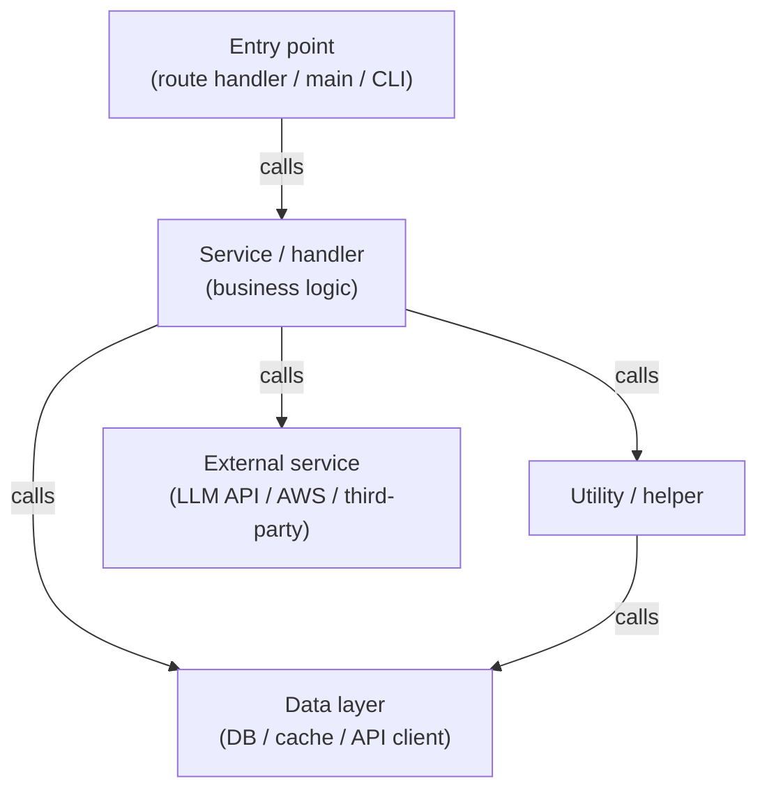
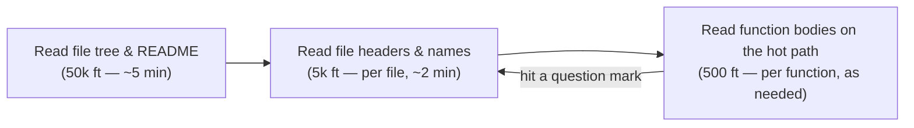
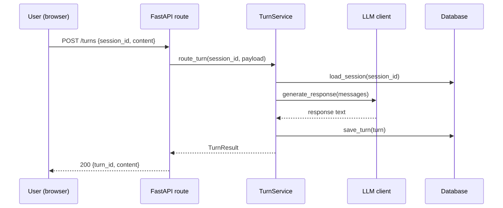
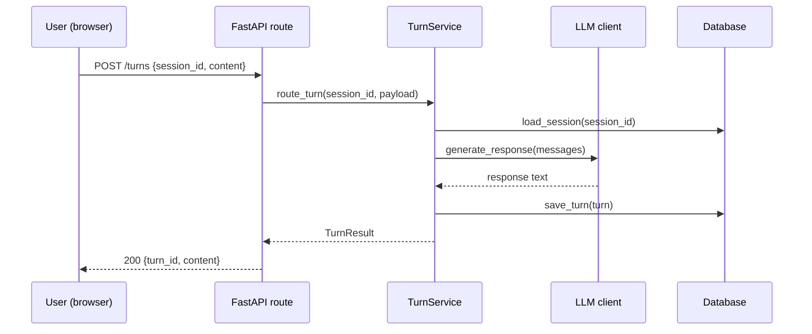
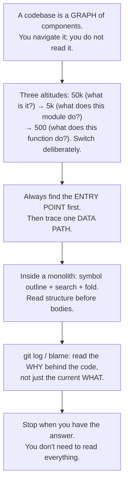

# M04 · Ch1 · §1 — Navigating an Unfamiliar Codebase

> **Module:** Writing Code That Lasts
> **Chapter:** Reading Code Well
> **Section:** Navigating an unfamiliar codebase — how to orient fast, trace data flow, and not drown
> **Status:** ✅ finalized 2026-06-10 — you already used most strategies; session confirmed git as
> the main gap. Two real cases added in §11: environment leakage in a multi-step pipeline (Case 1)
> and understanding-driven refactoring + copy-paste inheritance in an eval repo (Case 2).

**Estimated study time:** 2–3 hours including reflection.
**Prerequisites:** none formal, but M01 Ch1 (especially §1 bytecode and §3 the datapath) gives useful
vocabulary — "execution" and "call stack" come up.

---

## Why this section exists (for *you*)

You have a superpower and a gap that go together. The superpower: you vibe-code with AI agents and
ship real systems. The gap: when **someone else's code** (or your own three months later) lands in
front of you, there is no clear entry point. You have two files that are 2,400+ and 3,200+ lines long.
Even you don't navigate those by reading top to bottom — you probably grep, scroll, get lost.

This section builds the **mental model and the systematic moves** that experienced engineers use to get
their bearings in any unfamiliar codebase in under an hour. It is not about memorising the code — it is
about knowing *which question to ask next* so you are never stuck spinning.

By the end you'll have a repeatable strategy for:
- orientating to a repo in ~10 minutes without reading a single function body
- tracing where a request or a piece of data *actually goes* (data flow)
- navigating a monolith file without drowning (directly applicable to `ArenaPage.jsx`)
- using `git` and your IDE as reading tools, not just writing tools

The physics analogy that might resonate: reading a codebase is like reading an unknown circuit. You do
not probe every node — you find the rails (power/ground = entry points), identify the main blocks
(subsystems), and *then* trace the signal path of interest. You read the schematic, not the PCB (printed circuit board) copper.

---

## 1. The mental model: a codebase is a graph, not a document

<details>
<summary><b>Vocabulary for this section</b> — every term and named idea used below (click to expand)</summary>

**Abbreviations**

| Short | Stands for | Meaning |
|---|---|---|
| **API** | application programming interface | the set of calls one piece of software offers another |
| **AWS** | Amazon Web Services | Amazon's cloud platform |
| **CLI** | command-line interface | a program you drive by typing a command in a terminal |
| **DB** | database | the store the data layer talks to |
| **HTTP** | hypertext transfer protocol | the request/response protocol the web runs on |
| **LLM** | large language model | the kind of AI model called here as an external service |

**Terms**

| Term | Definition |
|---|---|
| **Codebase** | all the source code of a project, taken together |
| **Directed graph** | a set of nodes joined by one-way arrows; here the nodes are code units and the arrows are calls |
| **Node** | one component in that graph — a file, module, class or function |
| **Edge** | one arrow between nodes; in this model, "A calls B" |
| **Sub-graph** | a small part of the whole graph — the only part you usually need to read |
| **Traverse** | to walk the graph by following its edges |
| **Module** | a unit of code with a name and a boundary (in Python, a `.py` file) |
| **Entry point** | the place execution starts for a given scenario — a route handler, `main`, a CLI command |
| **Route handler** | the function a web framework runs when a particular URL is requested |
| **Cron job** | a task the system runs automatically on a schedule |
| **Business logic** | the code that implements the rules of the product, as opposed to plumbing |
| **Utility / helper** | a small support function called by the real work |
| **Data layer** | the code that talks to the database, cache or an external API on everyone else's behalf |
| **Cache** | a fast store of previously-computed or previously-fetched results |
| **API client** | code that calls somebody else's service over the network |
| **External service** | anything outside your process that you call over a network |
| **Leaf** | a node with no outgoing calls — where the actual work usually happens |
| **Hot path** | the specific chain of calls that a scenario you care about actually runs |

</details>

The single biggest mistake novice readers make is treating source code as a document to read
*linearly*. A codebase is a **directed graph** of components (files, modules, classes, functions) with
edges that are *calls*. Most of the time you only need to traverse a small sub-graph — the path that
a specific input travels to produce a specific output.

<!-- DIAGRAM:START -->


<details>
<summary>Diagram source (Mermaid)</summary>


```mermaid
flowchart TD
    EP["Entry point<br/>(route handler / main / CLI)"]
    S1["Service / handler<br/>(business logic)"]
    S2["Utility / helper"]
    DB["Data layer<br/>(DB / cache / API client)"]
    EXT["External service<br/>(LLM API / AWS / third-party)"]

    EP -->|"calls"| S1
    S1 -->|"calls"| S2
    S1 -->|"calls"| DB
    S1 -->|"calls"| EXT
    S2 -->|"calls"| DB
```

</details>
<!-- DIAGRAM:END -->

You do not read the whole graph. You find the *path* from the edge (a user action, an HTTP request, a
cron job trigger) to the leaf that does the real work, and you read that path. Everything else is
context you load only when you hit a question mark.

---

## 2. The three altitudes — never start at ground level

<details>
<summary><b>Vocabulary for this section</b> — the altitude vocabulary and every tool named below (click to expand)</summary>

**Abbreviations**

| Short | Stands for | Meaning |
|---|---|---|
| **API** | application programming interface | what a module offers its callers |
| **DB** | database | the persistent store |
| **HTTP** | hypertext transfer protocol | the protocol the "HTTP layer" speaks |
| **IDE** | integrated development environment | a code editor with navigation, search and refactoring built in (VS Code, PyCharm) |
| **ft** | feet | used metaphorically for reading altitude — 50,000 ft is a whole-project view, 500 ft one function |
| **UUID** | universally unique identifier | a 128-bit identifier used as a key, seen in the example signature |

**Terms**

| Term | Definition |
|---|---|
| **Altitude** | how zoomed-out your reading is: whole project, one file, or one function |
| **File tree** | the directory structure of a repository, read as documentation of its parts |
| **README** | the top-level file that says what the project is and how to run it |
| **Config file** | a file that declares how a project is built and run — `package.json`, `pyproject.toml`, `Makefile`, `Dockerfile` |
| **`package.json` scripts** | the named commands (`start`, `test`, `build`) a JavaScript project can run |
| **`pyproject.toml` entry-points** | the declared commands a Python package installs |
| **Makefile** | a file of named build/test/run recipes |
| **Dockerfile** | the recipe that builds a container image — it names how the project actually starts |
| **Executable surface** | the set of commands that run, test or build the project |
| **Contract** | what a file or function promises its callers: its name, parameters, return type and errors |
| **Interface** | the visible face of a unit — the part a caller must know |
| **Import** | a declaration that this file depends on another |
| **Export** | a name a file deliberately makes available to other files |
| **Docstring** | the documentation string attached to a function, class or module |
| **Type signature** | the declared input and output types of a function — machine-checked documentation |
| **Schema** | the declared shape of stored data — the tables and columns |
| **Happy path** | the run in which nothing goes wrong; read it before the error branches |
| **Control flow** | the `if`/`for`/`while` skeleton of a function, as opposed to the arithmetic inside it |
| **Black box** | a unit you deliberately do not open, trusting its name and signature |
| **Smell** | a surface sign that something is probably badly structured underneath |
| **Oscillate** | to move deliberately back and forth between altitudes as questions arise |

</details>

Reading code at the wrong altitude wastes enormous time. Good readers switch altitude deliberately.

### 50,000 ft — what is this project and what are its moving parts?

**Goal:** a mental map in ~5 minutes, without reading any function bodies.

Moves:
1. **Read the file tree.** A directory structure is documentation. A `routes/`, `services/`,
   `models/`, `db/` layout tells you more in 10 seconds than 10 minutes of reading functions.
2. **Read `README.md` or equivalent.** Even bad ones say what the thing does.
3. **Read top-level config files.** `package.json` `scripts:`, `pyproject.toml` entry-points,
   `Makefile`, `Dockerfile` — these name the *executable surfaces* of the project: what commands run
   it, test it, build it.
4. **Count files and lines per directory** (a fast `find . -name "*.py" | head -30` or IDE file
   tree). This tells you where the *mass* of the code is — which is usually where the complexity is.

At this altitude you want one sentence per "block": *"routes/ is the HTTP layer, services/ has the
business logic, models/ is the DB (database) schema."* You are drawing the schematic, not reading the gates.

### 5,000 ft — what does this module/file do, and what does it expose?

**Goal:** understand the *contract* of a file without reading its internals.

Moves:
1. **Read the file header** — imports tell you dependencies (what it calls); exports tell you what it
   offers callers.
2. **Read function/class names only** — scan for them without reading bodies. Names are the
   highest-density information in well-written code. A function called `validate_turn_submission` does
   exactly what it says; a function called `process` might do anything — that's a smell you'll learn
   to notice (M04 Ch4).
3. **Read docstrings / type signatures.** Types are machine-verified documentation. A signature like
   `def route_turn(session_id: UUID, payload: TurnPayload) -> TurnResult` tells you the contract
   without the body.

After this altitude you know: *"This file is responsible for X, it calls Y and Z, it exposes A and B
to its callers."*

### 500 ft — what does this specific function do?

Only now do you read function bodies — and only the ones on the path you are tracing. The rest you
treat as black boxes defined by their name and signature.

Moves:
1. **Follow one path.** If you are tracing a user's arena turn submission, start at the route handler
   and follow *only the happy path* first. The error branches and edge cases are second.
2. **Read control flow before arithmetic.** Understand the `if`/`for`/`while` skeleton before you read
   what the inner computation actually does. You are building a flow diagram, not a spreadsheet.
3. **Name what each block does in one sentence** (mentally or literally). If you cannot, that is the
   question to ask next — not "let me read five more lines."

<!-- DIAGRAM:START -->


<details>
<summary>Diagram source (Mermaid)</summary>


```mermaid
flowchart LR
    R["Read file tree &amp; README<br/>(50k ft — ~5 min)"]
    R --> M["Read file headers &amp; names<br/>(5k ft — per file, ~2 min)"]
    M --> F["Read function bodies on the hot path<br/>(500 ft — per function, as needed)"]
    F -->|"hit a question mark"| M
```

</details>
<!-- DIAGRAM:END -->

The arrows go *both ways*: when a 500 ft detail raises a question ("what is this type?"), you zoom
back to 5k to find the definition, answer it, and zoom back in. Experienced readers oscillate constantly.

---

## 3. Finding the entry point — the most important first move

<details>
<summary><b>Vocabulary for this section</b> — entry-point vocabulary and the frameworks named below (click to expand)</summary>

**Abbreviations**

| Short | Stands for | Meaning |
|---|---|---|
| **API** | application programming interface | here, the set of HTTP endpoints a web app exposes |
| **CLI** | command-line interface | a program run by typing a command |
| **SPA** | single-page application | a web app that loads once and re-renders in the browser instead of fetching new pages |
| **YAML** | YAML Ain't Markup Language | the indentation-based config format GitHub Actions workflows are written in |

**Terms**

| Term | Definition |
|---|---|
| **Entry point** | where execution begins for the scenario you are tracing |
| **Decorator** | in Python, an `@name` annotation attached to a function that registers or wraps it |
| **Route decorator** | a decorator that binds a function to a URL, e.g. `@app.get("/...")` — the entry point of a web request |
| **FastAPI / Flask** | Python web frameworks; both declare endpoints with route decorators |
| **Celery** | a Python task queue; `@celery.task` functions run in a background worker |
| **Background worker** | a process that picks jobs off a queue and runs them outside the request cycle |
| **React Router** | the library that maps URLs to components in a React single-page application |
| **Next.js** | a React framework where each file under `pages/` or `app/` *is* a route |
| **Lambda handler** | the `handler(event, context)` function an AWS Lambda function starts at |
| **GitHub Actions** | GitHub's automation system; workflows live in `.github/workflows/*.yml` |
| **Cron** | a schedule expression that triggers a job at fixed times |
| **`if __name__ == "__main__":`** | the Python idiom marking the code that runs when a file is executed directly |
| **`[tool.poetry.scripts]`** | the `pyproject.toml` table declaring the commands a Python package installs |
| **`grep`** | the command-line text search tool used to find those patterns fast |

</details>

Before you can trace anything, you need to know where execution *starts* for the scenario you care
about. There is almost always a small set of entry points; once you have one, the graph opens up.

**Common entry point patterns:**

| Project type | What to look for |
|---|---|
| Python CLI / script | `if __name__ == "__main__":` block; `[tool.poetry.scripts]` in pyproject.toml |
| FastAPI / Flask app | `@app.get("/...")`, `@router.post("/...")` — the route decorators |
| Celery / background worker | `@celery.task` decorated functions |
| React SPA (single-page application) | The file imported by `index.tsx` / `main.tsx`; top-level router (React Router `<Route>`) |
| Next.js | `pages/` or `app/` directory — each file is a route |
| Lambda handler | `def handler(event, context):` |
| GitHub Actions / cron | `.github/workflows/*.yml` — the `jobs:` block |

**Practical move:** grep or IDE-search for the decorator / keyword pattern for your project type. In
your arena codebase, for instance, `grep -r "@router\." --include="*.py" .` finds every FastAPI
endpoint in seconds.

---

## 4. Data flow tracing — follow the data, not the code

<details>
<summary><b>Vocabulary for this section</b> — the data-flow tracing protocol and its terms (click to expand)</summary>

**Abbreviations**

| Short | Stands for | Meaning |
|---|---|---|
| **API** | application programming interface | here, the web endpoint layer in the diagram |
| **DB** | database | the persistent store in the trace |
| **LLM** | large language model | the external model the service calls |

**Terms**

| Term | Definition |
|---|---|
| **Data flow tracing** | picking one unit of data and following exactly what happens to it from entry to exit |
| **Scenario** | a named, specific thing that happens ("a user submits a turn") — specific enough to have one entry point |
| **Entry point** | the function where execution starts for that scenario |
| **Signature** | the declared parameters and return type of a function — what data goes in and comes out |
| **Delegate** | to hand the work on to another function rather than doing it here |
| **Hop** | one step from node to node in the trace |
| **Opaque** | a hop whose name does not tell you what it does — the one worth opening |
| **Sequence diagram** | a diagram showing participants as columns and messages between them as arrows over time |
| **Queue** | a buffer that holds messages until a worker picks them up |
| **Branch** | an alternative path through the code (error handling, edge cases) that you trace only if you need it |

</details>

The most powerful reading technique is to pick *one unit of data* — a user request, a message, a DB
row — and trace exactly what happens to it from entry to exit. You are not reading the whole
codebase; you are reading one path through it.

**The protocol:**

1. **Name the scenario.** "A user submits an arena turn." "A message arrives in the queue." Be
   specific — a named scenario has a clear entry point.
2. **Find the entry point** (§3 above).
3. **Read the entry function signature.** What data does it receive? Name the object and its type.
4. **Follow the first call.** What does the function immediately call or delegate to? That is the
   next node in the graph. Do not read the rest of the entry function yet.
5. **Repeat** — at each node, note what data goes in and what comes out. You are building a mental
   sequence diagram:

<!-- DIAGRAM:START -->


<details>
<summary>Diagram source (Mermaid)</summary>


```mermaid
sequenceDiagram
    participant U as User (browser)
    participant API as FastAPI route
    participant Svc as TurnService
    participant LLM as LLM client
    participant DB as Database

    U->>API: POST /turns {session_id, content}
    API->>Svc: route_turn(session_id, payload)
    Svc->>DB: load_session(session_id)
    Svc->>LLM: generate_response(messages)
    LLM-->>Svc: response text
    Svc->>DB: save_turn(turn)
    Svc-->>API: TurnResult
    API-->>U: 200 {turn_id, content}
```

</details>
<!-- DIAGRAM:END -->

You do not need to read every function to draw this diagram. You need to *name* each hop. When a hop
is opaque (the function name does not tell you what it does), that is the node you drill into.

6. **Stop when you have what you need.** You do not need to trace every branch. The goal is the
   specific answer you came for — not a complete map.

---

## 5. Navigating a monolith file

<details>
<summary><b>Vocabulary for this section</b> — monolith-file navigation terms and editor features (click to expand)</summary>

**Abbreviations**

| Short | Stands for | Meaning |
|---|---|---|
| **IDE** | integrated development environment | an editor with navigation and search built in |
| **JSX** | JavaScript XML | React's syntax for writing markup inside JavaScript; a `.jsx` file |
| **VS Code** | Visual Studio Code | the editor named as an example |

**Terms**

| Term | Definition |
|---|---|
| **Monolith file** | a single very large source file — thousands of lines with many units inside it |
| **Local graph** | the call graph formed by the units *inside* one file |
| **Symbol** | a named thing in code — a function, class, constant or component |
| **Symbol outline** | the editor panel listing every symbol in the open file — a table of contents |
| **Breadcrumbs** | the editor strip showing which function or class the cursor is currently inside |
| **Code folding** | collapsing function bodies in the editor so only the structure shows |
| **`export default`** | the JavaScript declaration naming the file's main exported thing — in React, the root component |
| **Root component** | the top component of a file's tree; reading upward from it reveals the composition |
| **Composition** | which sub-components a component is built out of |
| **Public function** | a function intended for callers outside the file |
| **Private helper** | an internal function, marked in Python by a leading underscore (`_name`) |
| **Submit handler** | the function that runs when a user submits a form — a typical trace starting point |

</details>

This is directly applicable to your situation. A 2,400-line Python file or a 3,200-line JSX (JavaScript XML) file is
not qualitatively different from a smaller file — it just has more nodes in the local graph. The
same altitude approach applies, but the file itself becomes the project:

**Step 1 — build a skeleton (50k ft inside the file).** Most IDEs and editors (VS Code) have a
**symbol outline** or breadcrumbs panel: it lists every function/class/component in the file. Open
it. This gives you the full table of contents in seconds. In your terminal:

```bash
# Python: list all top-level function/class definitions
grep -n "^def \|^class \|^async def " courses/process_no_waiting.py | head -60

# JavaScript/JSX: list component/function/const definitions
grep -n "^function \|^const \|^export " src/ArenaPage.jsx | head -60
```

**Step 2 — find the top-level structure.** In a React component file like `ArenaPage.jsx`, the
bottom of the file (or the `export default`) tells you what the root component is. Reading from the
export *upward* gives you the composition: which sub-components it uses. In a Python service file
the entry point is usually the public functions; the private helpers (`_name`) are implementation
details.

**Step 3 — search, do not scroll.** Use `Ctrl+F` / IDE search for the specific symbol you are
hunting. If you're tracing what happens when a turn is submitted, search for the submit handler name
— not for the general area of the file.

**Step 4 — use code folding.** Most IDEs let you fold (collapse) function bodies. Fold everything,
then unfold only the functions on your path. This is the 500 ft → 50k ft toggle, applied inside one
file.

---

## 6. Git as a reading tool

<details>
<summary><b>Vocabulary for this section</b> — the git commands used as reading tools (click to expand)</summary>

**Terms**

| Term | Definition |
|---|---|
| **Commit** | one recorded change to the repository, with a message explaining it |
| **Commit hash** | the identifier of a commit, used to refer to it in commands |
| **Commit message** | the prose attached to a commit — often the only record of *why* a change was made |
| **`git log`** | lists the commits, optionally restricted to one file, newest first |
| **`--oneline`** | the flag that prints one compact line per commit |
| **`git show`** | prints one commit's message and its full diff |
| **Diff** | the line-by-line difference a commit introduced |
| **`git blame`** | annotates each line of a file with the commit that last changed it |
| **`git log -S`** | the "pickaxe" search — finds the commits where a given string was added or removed, e.g. when a function first appeared |
| **History** | the accumulated record of decisions; source shows the *what*, history shows the *why* |
| **Workaround** | code written to accommodate an external constraint rather than to express the design |

</details>

Source code shows you the *current state*; `git` shows you the *history of decisions* — often more
informative.

**Key moves:**

```bash
# Who changed this file most recently, and why?
git log --oneline -10 -- path/to/file.py

# What changed in a specific commit? (Read the change itself)
git show <commit-hash>

# Who wrote which lines? (blame lets you find the commit for any line)
git blame path/to/file.py

# When was a specific function introduced?
git log -S "def validate_turn" --oneline
```

**What to do with this:** when a function is confusing, `git log` the file. The commit message often
says *why* the code is the way it is (a bug fix, a constraint from an external system, a workaround).
The code says *what*; the history says *why*. In M04 Ch4 we'll go deep on "good commits as
documentation" — plant the flag now that commits are a reading tool, not just a save mechanism.

---

## 7. The five things you always reach for first

<details>
<summary><b>Vocabulary for this section</b> — the five first moves, restated as terms (click to expand)</summary>

**Terms**

| Term | Definition |
|---|---|
| **File tree** | the directory structure, read as a map of the project's parts |
| **README** | the top-level description of what the project is and how to run it |
| **Schematic** | the metaphor for a whole-project overview: blocks and connections, not gate-level detail |
| **Entry point** | where execution starts for the scenario you care about — find the door before tracing the path |
| **Signature** | the parameters and return type of a function; the contract you read instead of the body |
| **Contract** | what a unit promises its callers, independent of how it does it |
| **Unit of data** | one concrete thing — a request, a message, a row — whose journey you follow |
| **Sequence diagram** | participants as columns, messages as arrows over time; the mental artifact of a data-flow trace |
| **`git log`** | the command that shows a file's commit history, answering *why* the code is as it is |
| **Class hierarchy** | the inheritance relationships between classes — detail you decode after orienting, not before |

</details>

A cheat sheet you can apply immediately:

1. **File tree + README** — draw the schematic (50k ft).
2. **Entry points** — find the door before tracing the path.
3. **Function names + signatures** — read the contract, not the body.
4. **Follow one unit of data** — pick a scenario, build a sequence diagram in your head.
5. **`git log` when confused** — the history answers the *why*.

Everything else — reading a specific function body, understanding a class hierarchy, decoding a
complex regex — comes *after* you have oriented with these five.

---

## 8. The one-page mental model

<!-- DIAGRAM:START -->


<details>
<summary>Diagram source (Mermaid)</summary>


```mermaid
flowchart TD
    A["A codebase is a GRAPH of components.<br/>You navigate it; you do not read it."]
    A --> B["Three altitudes: 50k (what is it?) → 5k (what does this module do?)<br/>→ 500 (what does this function do?). Switch deliberately."]
    B --> C["Always find the ENTRY POINT first.<br/>Then trace one DATA PATH."]
    C --> D["Inside a monolith: symbol outline + search + fold.<br/>Read structure before bodies."]
    D --> E["git log / blame: read the WHY behind the code,<br/>not just the current WHAT."]
    E --> F["Stop when you have the answer.<br/>You don't need to read everything."]
```

</details>
<!-- DIAGRAM:END -->

**The six things to carry:**
1. Code is a **graph**; read a *path*, not a document.
2. **Three altitudes** — always start at 50k, zoom in deliberately; zoom back out when confused.
3. **Entry points first** — find where execution starts for *your scenario* before tracing anything.
4. **Data flow trace** — pick one unit of data; follow it from entry to output.
5. **Monolith strategies** — symbol outline, grep for definitions, fold + unfold, search don't scroll.
6. **Git is a reading tool** — `git log`, `git blame`, `git show` answer the *why* the code says *what*.

---

## 9. Check your understanding

Before our Q&A, jot a one-line answer to each:

1. You open an unfamiliar Python repo. List your first three moves *before* you read any function
   body. What are you trying to find out at each step?
2. What is the difference between "reading a codebase" and "reading a specific path through a
   codebase"? Why does the distinction matter when the file is 2,000+ lines?
3. You are debugging a bug where arena turns are not saving correctly to the database. Describe the
   *exact sequence* of moves you would take to trace the turn from the HTTP request to the DB write —
   without reading the whole file.
4. A function in your codebase is confusing and the name gives no clue. What would you try *before*
   reading the function body line by line?
5. (Stretch) In React's component model, what is the equivalent of an "entry point"? How does the
   component tree structure tell you where rendering starts?

<details>
<summary>Answers</summary>

1. **File tree → README → top-level config**, in that order, all at 50k ft (§2). The tree tells you the
   *block diagram* — a `routes/ services/ models/` layout names the subsystems in ten seconds. The
   README tells you what the thing is *for*, even when it's a bad README. The config files
   (`pyproject.toml`, `Makefile`, `Dockerfile`, `package.json` scripts) name the **executable surfaces**
   — the commands that run, test and build it, which is where you'll find entry points next. A fourth
   move that costs nothing: `wc -l` per file to find where the **code mass** sits (§10 Part A), because
   mass is usually where the complexity is.
2. Reading a codebase is trying to build a **complete map**; reading a path is traversing **one
   sub-graph** from an entry point to the leaf that does the work (§1). The distinction is the whole
   method: a codebase is a directed graph of calls, and you only ever need the path a specific input
   travels. At 2,000+ lines the difference is between a week and twenty minutes — the file has more
   nodes but not a different structure (§5), so you use the symbol outline and search to jump straight
   onto the path instead of scrolling past 1,900 irrelevant lines. It also tells you when to **stop**:
   you're done when you have the answer you came for (§4 step 6), not when you've read everything.
3. **Entry point first, then one data-flow trace, then git** (§3, §4, §6). Concretely: (a) name the
   scenario — "a user submits an arena turn and it should land in the DB"; (b) find the entry point with
   `grep -r "@router\." --include="*.py" .` and pick the turn-submission route; (c) read that handler's
   *signature* only — what payload comes in, what type; (d) follow the **first call** it delegates to
   (e.g. `TurnService.route_turn`), not the rest of the handler; (e) repeat hop by hop, noting data in /
   data out, until you reach the actual write (`db.save_turn`); (f) now you have a 3-hop sequence
   diagram, and the bug is at whichever hop the data you expected isn't the data that arrived. If the
   write *looks* right, `git log -- db/turns.py` for the recent change that broke it.
4. **Read the callers and the history before the body** (§2 5k ft, §6). In order: the type signature and
   docstring — the machine-verified contract, which often answers the question outright; then *find
   usages* — what callers pass in and what they do with the result tells you the function's job from the
   outside; then `git log -S "def the_function" --oneline` and `git blame` to find the commit that
   introduced it, because the commit message says **why** it exists (a bug fix, an external constraint,
   a workaround) where the code only says what. A name that gives no clue — `process`, `handle` — is
   itself the smell flagged in §2 and picked up in M04 Ch4.
5. **The root component rendered by `index.tsx` / `main.tsx`** — that call (`createRoot(...).render(<App/>)`)
   is where rendering starts, and the top-level router (`<Route>` definitions) is the second-level entry
   table, one entry per URL, exactly like route decorators in FastAPI (§3). Inside a single monolith
   component file the local equivalent is the **`export default`** at the bottom: read from the export
   *upward* and the composition falls out — the root component names its children, which name theirs,
   and that JSX nesting **is** the component tree (§5 Step 2). React's tree is a graph like any other:
   find the root, then trace only the branch that handles your scenario.

</details>

---

## 10. Optional: get your hands dirty (20 min)

Pick either of your two repos and apply the protocol once.

**Part A — build the 50k ft map (5 min)**

```bash
# From your repo root — get a sense of scale and structure
find . -name "*.py" -not -path "*/node_modules/*" -not -path "*/.venv/*" | \
  xargs wc -l 2>/dev/null | sort -rn | head -20

# For JS/JSX
find . -name "*.jsx" -o -name "*.tsx" | grep -v node_modules | \
  xargs wc -l 2>/dev/null | sort -rn | head -20
```

This gives you the file-size distribution — where the code mass lives.

**Part B — extract the skeleton of a monolith (5 min)**

Pick your largest file and run:

```bash
# Python
grep -n "^def \|^async def \|^class " <your_big_file.py>

# JSX/TSX
grep -n "^const \|^function \|^export \|^  const " <ArenaPage.jsx> | head -80
```

You should be able to, in one pass, name the "blocks" of the file without reading any body.

**Part C — trace one path (10 min)**

Pick one user action you know the app supports (e.g., submitting a turn, viewing the leaderboard).
Starting from the route or component that handles it, trace it three hops deep — just function
names and "calls what" — and draw the path as a simple list:

```
entry: POST /api/turns (routes/turns.py:42)
  → TurnService.route_turn() (services/turn_service.py:108)
    → db.save_turn() (db/turns.py:55)
```

Three hops takes about 10 minutes and gives you a real picture of the structure. Bring anything
surprising to our Q&A.

---

## 11. Applied — from your own experience

You came to this session already using most of the strategies. The session surfaced two real cases that
add texture the theory alone cannot give.

### Case 1 — pipeline fragility from environment leakage

A colleague vibe-coded a multi-step data pipeline, developing each step independently. It ran on his
machine but broke on others. Root cause: some steps used relative paths; others hardcoded absolute
paths. Each step assumed its own working-directory context instead of receiving paths as explicit
inputs from a shared config.

**The technique that found it:** data-flow tracing (§4), applied to artifact files rather than
in-memory objects. You followed the JSON files that each step wrote and the next step read, and found
where the path assumptions diverged. Same move as tracing a user request through a service — just
the "data" was files on disk.

**The pattern it names:** **environment leakage** — configuration (paths, environment variables,
resource locations) embedded inside individual steps instead of managed at a higher level. The fix is
a shared config that all steps read from. This principle has a formal name in the **twelve-factor app**
methodology (factor 3: store config in the environment, not in code). We'll cover this properly in
M09 DevOps; you've already paid the tuition.

**The broader lesson you drew:** settings, resource paths, and environment variables must be managed
at one level above the steps that use them. Steps should receive their environment; they should not
assume it.

### Case 2 — understanding-driven refactoring in an eval repo

You were onboarded to a poorly documented eval repo (no docstrings, no type hints, minimal comments)
and needed to add a new dataset/eval. Two moves stand out.

**First move — add scaffolding before reading.** Your first PR used a Cursor agent to add docstrings,
type hints, and comments to the existing code *before* you tried to understand it. This is a
sophisticated technique: you generated the map the codebase should have had, then used that map to
navigate. Most engineers either struggle through unreadable code or ask someone. You created the
reading infrastructure first, then read. This is a real technique — sometimes called
**understanding-driven refactoring** — and it scales well with AI agents precisely because generating
documentation from code is something they do reliably.

**Second move — orient + trace a similar example.** After the scaffolding PR, you used exactly the
two-pronged approach from §1:
1. Start from `main` → understand the overall pipeline (orchestration → inference → evaluation).
2. Find an existing eval similar to yours → trace it as a worked example.

This is the fastest path in any "add to an existing system" task: understand the shape, find the
closest existing example, follow it.

**What you found — copy-paste inheritance.** Class A was nominally a child of class B (which many
other classes also used as a base), but the file that defined A had *copied* B's implementation
instead of importing it. This is called **copy-paste inheritance** (or accidental duplication): it
looks like inheritance from the outside but behaves like a fork. The danger is silent divergence —
when B is fixed or updated, A's copy does not change. Your instinct to refactor it before building
on top was exactly right. Building a new eval on a diverged copy of B would have been invisible
tech debt from day one.

**The sequence you used** — orient → find problems → fix problems → add your own work — is more
disciplined than most developers follow, and it paid off: when the refactored code ran smoothly, you
had real confidence to add your new eval.

---

## References

*(Links verified 2026-06-10.)*

- **["How to Read Code" — Embedded Artistry blog](https://embeddedartistry.com/fieldmanual-terms/reading-code/)** —
  practical strategies from a deeply experienced engineer; short and opinionated.
- **["The Art of Reading Code" — Stripe's technical blog](https://stripe.com/blog/reading-stripe-codebase)** —
  Stripe on how they onboard engineers to a large codebase; real techniques from industrial practice.
- **["Your IDE as a reading tool: 10 moves every developer should know"](https://www.jetbrains.com/idea/guide/tips/)** —
  JetBrains IntelliJ/PyCharm tips; most apply to VS Code too (jump to def, find usages, call hierarchy). The
  VS Code equivalent guide: [VS Code navigation docs](https://code.visualstudio.com/docs/editor/editingevolved).
- **[git-blame documentation](https://git-scm.com/docs/git-blame)** and
  **[git-log documentation](https://git-scm.com/docs/git-log)** — the two git reading tools. The
  `-S <string>` flag for `git log` ("pickaxe") is especially useful and underused.
- **[M04 Ch2 (next section) — Decomposition]** — once you can *read* a codebase and see its
  structure, the natural next question is "what would I change?" That's Ch2's territory.

---

### What's next

✅ **Finalized 2026-06-10.** Marked done in `courses/plan.md`. The main gap this session surfaced is
**git as a reading and history tool** — you want a concept + feature survey, not command memorization.
A dedicated reading entry is queued for an upcoming day.

Upcoming course steps (Phase 1):
- **M04 Ch1 §2 (Tracing data flow in depth)** — sequence diagrams, async call traces, debugging by
  reading rather than by `print`.
- **M12 Ch1 (How modern models work)** — the Phase 1 parallel track; especially motivated by the GPU
  thread from M01 Ch1 §3.
