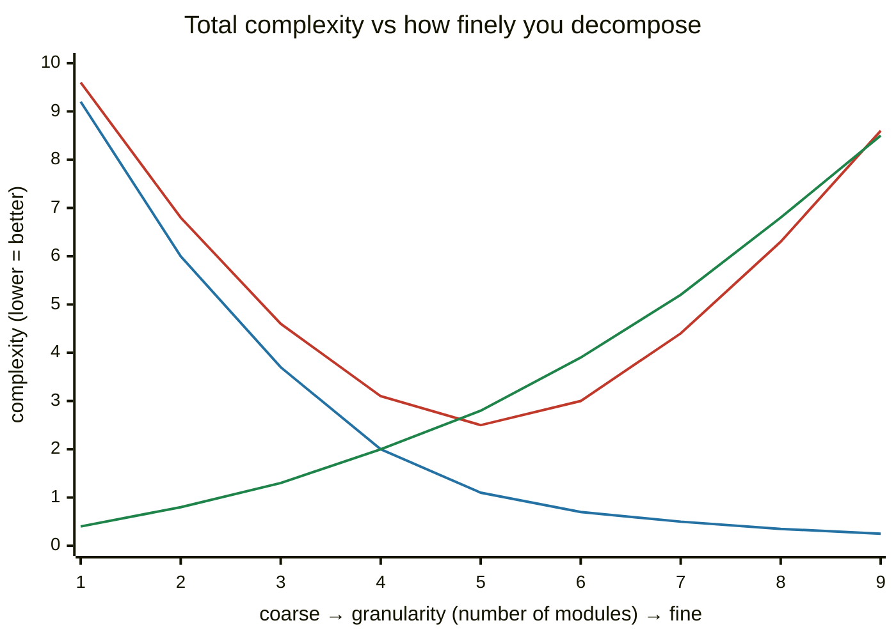
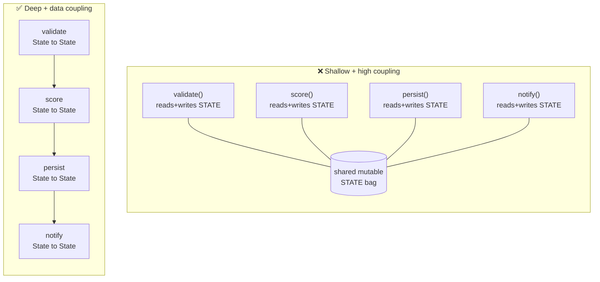

# M04 · Ch2 · §1 — Cohesion, Coupling & Module Depth: what actually makes a boundary good

> **Module:** Writing Code That Lasts
> **Chapter:** Decomposition
> **Section:** The real metric for a good boundary — cohesion, coupling, and module *depth* (not file length)
> **Status:** ✅ finalized 2026-06-18. Examples are drawn from well-known real-world systems and named
> failure modes (Unix I/O, Go's `io.Reader`, Java's stream wrappers, Spolsky's leaky abstractions,
> the Segment / Prime Video microservice reversals). §11 works a complete design case — organizing a
> linear pipeline of independent steps — from a Q&A in this session.

**Estimated study time:** 2–3 hours including reflection.
**Prerequisites:** none formal. Useful vocabulary: M04 Ch1 §1 (a codebase is a graph) and the
*Philosophy of Software Design* primer from the 2026-06-11 reading.

---

## Why this section exists

Decomposition is the single skill that most separates code that lasts from code that rots. Every other
topic in this module — reading code, design patterns, naming — is downstream of one question: **where do
you draw the boundaries, and what makes a boundary good?** Get it right and a system stays changeable
for years. Get it wrong and it calcifies into something nobody dares touch, regardless of how clever any
individual function is.

Here is the trap this section disarms. When a file feels "too big," the reflex is to **split it** — chop
it into smaller files, or hoist the state onto a class and mutate it through methods. **Splitting is not
decomposition.** You can take one 2,000-line mess and turn it into ten 200-line messes that are *harder*
to understand than the original, because the mess is now also smeared across ten files with tangled
wires between them. Smaller is not the goal; *less to know* is the goal.

So before any refactoring technique, you need the **metric** — the thing that tells you whether a
boundary earns its keep. This section gives you three lenses that turn out to be one idea:

- **Cohesion** — does a module do *one* thing?
- **Coupling** — how entangled is it with the *others*?
- **Module depth** — how much functionality does it hide behind how small an interface?

Get these right and "where do I draw the line" stops being taste and becomes a judgement you can defend.

---

## 1. The wrong metric: "decomposition = smaller files"

Kill the bad mental model first, because it's the one that produces monoliths *and* the bad fixes for
them.

A module — a function, a class, a file, a service; any unit with a boundary — has two parts:

- an **interface**: what a caller must know to use it (its name, parameters, return type, the
  exceptions it throws, the order you must call things in, the global state it touches);
- an **implementation**: everything inside that the caller does *not* need to know.

The entire point of a boundary is that the interface is **much smaller** than the implementation. You
write `list.sort()` — one call — and never think about Timsort's galloping merge underneath. The cost to
*use* it is tiny; the work it does *for* you is large. That gap is the whole value.

"Split the big file into small files" optimises the wrong variable. It reduces lines-per-file (a number
nobody experiences) while often *increasing* the total size of all the interfaces (the thing every
reader pays for). If pulling out a helper means callers now have to understand its five parameters, its
call-ordering rules, and the three places it reaches back into shared state — you added a boundary and
hid *nothing* behind it. You paid the cost of an interface and got no abstraction back.

> The number that matters is not "lines per file." It is **how much you can ignore while still using
> the thing correctly.**

---

## 2. What you're actually fighting: complexity

Ousterhout's framing is the sharpest definition: **complexity is anything about the structure of a
system that makes it hard to understand or modify.** It shows up as three concrete symptoms — learn to
name them, because "this feels messy" is not actionable and these are:

| Symptom | What it is | A real-world shape of it |
|---|---|---|
| **Change amplification** | a simple change touches many places | **Y2K**: storing years as two digits was one decision, repeated across millions of lines — changing it cost an estimated \$300B+ globally |
| **Cognitive load** | you must hold a lot in your head to make *any* change safely | a function with 15 positional parameters, or config read from a global half a file away from where it's used |
| **Unknown unknowns** | it's not even clear *what* you must know to change safely — the worst one | a global mutable setting (process-wide locale/timezone, a monkeypatched method) silently changes behaviour in a distant, unrelated module |

The third is the killer, and it's the one good decomposition exists to defeat. Change amplification
wastes your time; unknown unknowns produce *bugs you can't predict*. A well-decomposed system has the
property that **to change one thing, you only need to understand one thing** — the boundary tells you
exactly what you can ignore.

Complexity is also **incremental**: no single line creates it. It accretes — a special case here, a
shared variable there — until one day the file is unmaintainable. No one decision looks like the
problem, which is precisely why this is a *discipline*, not a one-time cleanup.

---

## 3. Cohesion — does this module do one thing?

**Cohesion** measures how strongly the things *inside* a module belong together. High cohesion = the
module has one clear job and everything in it serves that job. Low cohesion = it's a grab-bag.

There's a classic ladder from worst to best. You don't need to memorise the names, but you should be
able to *smell* where a module sits:

| Cohesion (worst → best) | The members are grouped because… | Smell |
|---|---|---|
| **Coincidental** | …no reason; someone dumped them together (`utils.py`, `helpers.py`) | the junk drawer |
| **Logical** | …they're the same *technical category* (all "validators", all "I/O functions") | a `do(type, ...)` that switches on a kind flag |
| **Temporal** | …they happen at the same *time* (`init()` doing ten unrelated setups) | "…and then we also…" |
| **Sequential** | …one's output is the next one's input | getting warm |
| **Functional** | …they all collaborate on **one** well-defined task | the goal ✅ |

The most common real-world version of *logical* cohesion is **package-by-layer**: a codebase split into
`controllers/`, `services/`, `repositories/` — grouped by technical role. To add one feature you edit a
file in each layer, and no single directory tells you what the app *does*. The alternative,
**package-by-feature** (`billing/`, `auth/`, `search/`, each holding its own controller + service +
repo), groups by what changes together. Same lesson one level up from functions: organise by *purpose*,
not by *technical type*. (Fowler lays out the trade-off in *PresentationDomainDataLayering* — there are
real cases for layering, but "by layer" as the default is the smell.) We work a concrete instance of
this — a pipeline grouped by I/O-vs-CPU — end-to-end in §11.

A practical test: **describe the module in one sentence with no "and."** If you need "and" — "this
validates the request *and* writes to the database *and* formats the response" — cohesion is low and
there are that-many modules trying to get out.

---

## 4. Coupling — how entangled are the modules?

**Coupling** measures dependency *between* modules: if I change module A, how likely am I to have to
change module B? Low coupling is the goal — modules you can understand, change, and test in isolation.

Again a worst→best ladder. The axis that matters: **how much does B need to know about A's
internals?**

| Coupling (worst → best) | B depends on A's… | Example |
|---|---|---|
| **Content** | …internals directly — reaches in and pokes A's data | `b.config._cache["key"] = ...` |
| **Common / global** | …shared mutable global state | both read/write a module-level `STATE` dict |
| **Control** | …a flag B passes to tell A *how* to behave | `render(thing, mode="legacy")` with a big `if mode` inside |
| **Stamp** | …a big object, of which it uses two fields | passing the whole `request` to get `request.user_id` |
| **Data** | …a few explicit parameters and a return value | `score(turn) -> Score` ✅ |

**Common coupling** is the one that quietly wrecks systems, because it *feels* convenient. The textbook
case is the **global variable**, or its respectable-looking cousins — a shared mutable singleton, a
process-wide config object, a module-level cache that several functions read and write. Everything can
reach the shared thing, so any module can break any other through it, in an execution order you cannot
read off the code. The cure is to make the dependency *visible in the signature*: pass what a function
needs as parameters and return what it produces, so the wiring is the call graph, not a hidden bag of
state. That's **data coupling** — the best kind — and it's the difference between a bug you can localise
and one you can't.

### The decomposition U-curve

Here's the part that defeats "split into smaller files." Coupling is *why* there's a sweet spot. As you
break a system into more modules:

- **too few modules** (the god-object / monolith): everything is internal, so coupling is "free" inside
  the blob — but cohesion is terrible and the blob is one giant unknown-unknown;
- **too many modules** (over-decomposition): each piece is tiny, but they're so interdependent that
  understanding *anything* means chasing calls across fifteen files. You converted internal mess into
  **inter-module coupling**, which is worse — it's spread out and wired together.

Total complexity is the sum of *within-module* complexity (falls as you split) and *between-module*
complexity (rises as you split). Their sum is a **U**:

<!-- DIAGRAM:START -->


<details>
<summary>Diagram source (Mermaid)</summary>



</details>
<!-- DIAGRAM:END -->

*Red = total complexity (what you experience). Blue = within-module complexity (falls as you split).
Green = between-module coupling (rises as you split). A god-object sits at the far **left**; reflexive
over-splitting ("one class per everything") slides you to the far **right** — past the minimum, where
coupling dominates. The skill is landing in the **valley**, and the valley's location is set by cohesion
and coupling, not by a line count.*

This is also the answer to "how small should a function be?" — small enough that it does one thing
(cohesion), large enough that its interface earns its keep (the next idea).

---

## 5. Module depth — the one idea that unifies the others

This is the concept to walk away with. Ousterhout's measure of a *good* module is its **depth**:

$$\text{depth} \approx \frac{\text{functionality hidden inside}}{\text{cost of the interface}}$$

- A **deep module** has a *small* interface in front of a *large* implementation. The canonical example
  is the **Unix file abstraction**: `open`, `read`, `write`, `close` — four calls — sit in front of
  filesystems, pipes, sockets, terminals, and device drivers. A handful of verbs, an ocean of
  implementation. Go's `io.Reader` is even starker — *one* method, `Read(p []byte)`, and the entire
  standard library composes around it. Python's `requests.get(url)` hides connection pooling, TLS,
  redirects, chunked encoding, and retries behind one line. Huge numerator, tiny denominator.
- A **shallow module** has an interface nearly as complex as its implementation. It makes you learn
  about as much to *call* it as to do the work yourself. Ousterhout's own example is Java's stream
  stack: to read a file you write
  `new BufferedReader(new InputStreamReader(new FileInputStream(path)))` — three classes, and the
  *caller* must know to add buffering or eat a syscall per byte. The decomposition is real but the
  boundaries hide nothing; the common case isn't handled, it's *exposed*.

The depth ratio is what makes cohesion and coupling *cash out*. High cohesion shrinks the interface (one
job → one clear entry point). Low coupling shrinks it too (fewer wires poking through). A deep module is
simply what you get when cohesion is high and coupling is low — the same property viewed from the
caller's side.

It also gives you a precise way to catch a *bad* small module. Consider a one-line method like
`update_state(self, data)` that just does `self._state.update(data)`. It's short, but it's **maximally
shallow**: the interface is no simpler than the operation it wraps (`dict.update`), it accepts anything
and guarantees nothing, so it hides no decision. That's *negative* depth — it adds a boundary and
subtracts nothing from what the caller must know. Shortness is not depth.

> A blunt heuristic: if a method's body is about as long and complex as the call site that uses it, and
> it doesn't make a *decision* the caller would otherwise have to make, it's probably a shallow
> pass-through. Inline it or make it earn its boundary.

The deep counterpart of the shallow `update_state` is the pattern in §11: a step with the signature
`def step(state: State, deps: Deps) -> State`. The interface is one line and tells you everything —
*here is what I read, here is what I produce* — while the implementation can be as rich as it needs to
be. **Narrow door, big room.**

---

## 6. The two structures, side by side

Same functionality, two decompositions. The **❌ panel** is shallow modules + high coupling (thin
wrappers all reaching into one shared state bag); the **✅ panel** is deep modules + data coupling (each
does one job behind a narrow interface, state flows explicitly). Look at the wiring — a dense hub on one
side, a clean linear chain on the other. That wiring *is* the coupling.

<!-- DIAGRAM:START -->


<details>
<summary>Diagram source (Mermaid)</summary>



</details>
<!-- DIAGRAM:END -->

In the ❌ panel, *any* step can break *any* other through the shared bag, in an order you can't read off
the code — every box is wired to the hub, so the dependency graph is dense and invisible. In the ✅
panel, the dependencies are exactly the arrows you see: linear, explicit, each step's contract is its
signature. The ✅ version is testable in isolation (hand a step a `State`, check the `State` it returns);
the ❌ version is not (you must reconstruct the whole bag to test one step). **That difference is the
entire return on getting the boundary right.**

---

## 7. Information hiding & leaky abstractions

The mechanism underneath "deep" is **information hiding**: a module's job is to *encapsulate a design
decision* so it can change without callers noticing — the storage format, the retry policy, the wire
protocol, the scoring formula.

The failure mode is the **leaky abstraction** (Joel Spolsky's law: *all non-trivial abstractions, to
some degree, are leaky*). The interface forces the caller to know the very thing it was supposed to hide.
Real ones you've almost certainly hit without naming:

- **TCP over IP.** TCP sells you a reliable, ordered byte stream over an unreliable packet network. The
  abstraction holds — until packet loss spikes and your "reliable stream" mysteriously stalls. The
  unreliability leaks through as *latency* you can't see in the API.
- **ORMs and SQL.** An ORM hides the database behind objects — until a loop over `user.orders`
  silently fires one query per user (the **N+1 problem**) and the only fix is to understand the SQL the
  abstraction was hiding. The query planner leaks too: the same `SELECT` is fast or catastrophic
  depending on an index you can't see from the query.
- **Network file systems.** NFS makes a remote disk look local — until the network is slow and every
  `open()` blocks in ways a local file never would.
- **Storage-specific errors.** A `get_user(id)` that raises `KeyError` leaks that it's backed by a dict;
  swap it for SQL and it raises something else, so callers end up depending on the *implementation*.
  (This is where the reading's **"define errors out of existence"** keeper pays off: a deep interface
  returns `None` or a typed `UserResult`, hiding the storage choice entirely.)

The point isn't that leaks are avoidable — Spolsky's law says they're not, fully. It's that a *deep*
module leaks rarely and in the rare case; a *shallow* one leaks in the common case, which is just an
un-abstraction with extra steps. A quick litmus: **if I swapped the implementation for a totally
different one (dict → Postgres, in-memory → HTTP), how many call sites would break?** Zero is the goal;
every break is a leak you're paying interest on.

---

## 8. When *not* to decompose — and the failure modes at the far wall

Decomposition has a cost, and the U-curve has a right-hand wall. Don't sprint past the valley. These are
the failure modes of *too much* structure — the ones that bite teams who learned "split things up" as a
rule rather than a judgement:

- **Don't split what's read together.** If two pieces of code are *always* read and changed together, a
  boundary between them just adds a wire to trace. Information and the code that uses it want to live
  together; a boundary in the wrong place is *negative* value.
- **Classitis** — the belief that more, smaller classes are automatically better. The internet's running
  jokes are real artifacts: Spring's actual `AbstractSingletonProxyFactoryBean`, and
  *FizzBuzzEnterpriseEdition* (a parody repo that solves FizzBuzz across dozens of classes and
  interfaces). Both are shallow-module sprawl — interfaces stacked on interfaces that each hide nothing.
- **Premature microservices.** This is the U-curve's right wall at architecture scale, and it has famous
  casualties. **Segment** consolidated 100+ microservices *back* into a monolith in 2018 because the
  inter-service coupling (shared libraries, per-service ops, distributed failures) cost more than the
  isolation bought. **Amazon Prime Video** (2023) moved a serverless/microservice media-monitoring
  pipeline back to a monolith and cut cost ~90%, because the data shuffled *between* the tiny services
  dwarfed the work inside them. Fowler's *MonolithFirst* is the rule of thumb: earn your boundaries by
  living with the code, don't guess them up front.
- **Don't decompose on speculation.** "We might need to swap this later" → a plugin architecture for a
  thing that never changes. Decompose around boundaries that *actually* shift (you learn them by changing
  the code), not ones you imagine might.
- **Temporal coupling can be a reason to merge.** If step B genuinely cannot run before step A, hiding
  that ordering behind two innocent-looking public methods is *worse* than one method that does both in
  the right order. Make the dependency impossible to get wrong.

The goal is never "maximum modules." It's the **valley**: the fewest boundaries that each hide a real
decision behind a narrow interface.

---

## 9. Check your understanding

1. A colleague "cleans up" a 2,000-line file by cutting it into ten 200-line files, each calling the
   next and all sharing a module-level `STATE` dict. On the U-curve, which direction did they move, and
   did total complexity go up or down? Name the coupling type they introduced.
2. Why is a one-line `update_state(data: dict)` that does `self._state.update(data)` a *shallow*
   interface? What single property would make a one-line method *deep* instead?
3. A function is declared `def get_config(key, *, env=None, default=None, cast=None, reload=False)`.
   Which cohesion/coupling smell do `cast` and `reload` hint at, and what's the deeper alternative?
4. Give the one-sentence test for low cohesion, and the one-sentence test for a leaky abstraction.
5. `score()` currently reads `STATE["turn"]` and writes `STATE["result"]`. Rewrite its *signature* (not
   body) to convert common coupling into data coupling. What does the new signature let you do that the
   old one didn't?

<details>
<summary>Answers</summary>

1. **Right**, past the valley — toward over-decomposition. Total complexity likely went **up**: they
   traded within-module size for **common coupling** (the shared `STATE`) plus call-chain control flow.
   Ten shallow modules wired through a global bag is the right-hand wall of the U-curve.
2. Because the *interface* is no simpler than the *operation* — it accepts anything and guarantees
   nothing, so it hides no decision and the caller learns nothing they could ignore. A one-line method
   is **deep** when it *makes a decision the caller would otherwise have to make* (picks the storage key,
   validates an invariant, normalises an error) — a small interface over real behaviour, however short.
3. **Control coupling** (flags telling the function *how* to behave → a big `if` inside) plus **low
   cohesion** (it's doing several jobs). Deeper: separate functions, or push policy to the caller and
   keep `get_config(key) -> Value` narrow.
4. Low cohesion: **you can't describe the module in one sentence without "and."** Leaky abstraction:
   **swapping the implementation for a different one would break the callers.**
5. `def score(state: State) -> State` (or `def score(turn: Turn) -> Score`). It makes the dependency
   explicit in the signature, removes the hidden ordering, and lets you **test the step in isolation** —
   hand it a `State`/`Turn`, assert on what it returns, no global setup.

</details>

---

## 10. Optional: get your hands dirty (20–30 min)

Pick any large function — from a codebase you work in, or an open-source one you're curious about — and
do a *paper* decomposition. No code changes; the editing comes in §2–§3. This is the diagnostic skill.

1. **Name the tasks.** Read it top to bottom once and write each *distinct task* it does, one line each,
   no "and." Stop when you have the list. (Expect 4–8.)
2. **Spot the shared bag.** Find every variable read or written across more than ~2 of those tasks. That
   set *is* the coupling — what a clean decomposition has to turn into explicit parameters and returns.
3. **Draw the two structures** from §6: the current shared-state version, and a deep-module version
   where each task is `state in → state out`. Count arrows crossing boundaries in each.
4. **Find one leaky abstraction** — a helper whose interface forces the caller to know something it
   should hide (a returned mutable object, a storage-specific exception, a `mode=` flag).
5. **Find one boundary you should *not* draw** — two chunks always read and changed together. Note why
   merging beats splitting there.

The deliverable is the *map*: the task list, the shared-state set, and the two diagrams. That map is what
every later refactoring step executes against.

---

## 11. Applied — organizing a pipeline of independent steps

A clean design case that exercises every idea above. The setup (common in data/ML and request-handling
systems): a pipeline runs **several independent steps in a fixed linear order**. The steps split into
two kinds — some **wait on a third-party service** (I/O-bound), some **don't** (CPU-only).

**The tempting wrong move.** Group the files by that technical kind: one module for the waiting steps,
one for the non-waiting steps; drop each new step into whichever matches. It feels tidy, but it's
**logical cohesion** (§3) — the same anti-pattern as package-by-layer. The functions in "the I/O module"
don't collaborate on one task; they merely share an execution property. To find the scoring step you
first have to know whether it waits — the lookup axis is backwards.

**Why "one file per step" isn't the fix either.** Splitting each function into its own file changes the
*granularity* without changing the *organizing principle*. On the U-curve you slide right without moving
toward the valley. The dissatisfaction is the right instinct (§1): file count was never the lever.

**The real diagnosis: two axes were conflated.** File placement was answering two unrelated questions at
once:

| Axis | What it is | Where it belongs |
|---|---|---|
| **What a step does** | its purpose / domain | the *organizing axis* for source code (group by cohesion) |
| **Whether it waits on I/O** | a runtime/scheduling property | the step's *interface* + the *runner* — not the directory |

"I/O-bound" is something the **scheduler** cares about, not something a reader hunting for business logic
cares about. Store it in the type system, where it can be acted on — not the filesystem, where it can't.

**The layout that falls out:**

```
turn_pipeline/
    contract.py     # the ONE shared shape: Step Protocol, State, Deps
    pipeline.py     # PIPELINE = ordered registry: names, order, I/O flag   ← the short "catalog"
    runner.py       # the ONE place that knows await-vs-call / fan-out
    steps/          # one cohesive module per step — signature lives WITH its body
        check_safety.py     # I/O  (async)
        score_turn.py       # CPU
        save_result.py      # I/O
```

```python
# contract.py — one definition, no duplication
class Step(Protocol):
    name: str
    io_bound: bool
    def run(self, state: State, deps: Deps) -> State | Awaitable[State]: ...

# pipeline.py — the catalog: every step at a glance, order explicit
from .steps import check_safety, score_turn, save_result
PIPELINE: list[Step] = [check_safety, score_turn, save_result]

# steps/score_turn.py — interface and implementation TOGETHER
class ScoreTurn:
    name = "score_turn"
    io_bound = False
    def run(self, state: State, deps: Deps) -> State:
        ...   # the actual logic
```

**Why this is three deep modules, not a shallow split.** A natural counter-proposal is a
`process_interface.py` holding every step's signature, with bodies in a separate `process_logic/` folder
— the C `.h`/`.c` split. In Python that's an **anti-pattern**: the signature already lives on the
function, so re-stating it elsewhere is duplication (every signature change becomes a two-file edit that
*will* drift), and it separates each step's interface from its body — exactly the leaky/shallow boundary
of §7. The lesson worth keeping: **an "interface file" is not a list of signatures.** What earns a shared
file is the *one contract every step shares* (`contract.py`) and the *catalog that wires them*
(`pipeline.py`). A per-function signature is inseparable from its function and stays with it.

**The bonus that the right interface unlocks.** Because the steps are *independent* and the I/O-ness now
lives in the interface, the runner — the single place that cares — can do more than dispatch. Independent
waiting steps shouldn't be `await`ed one-by-one; they should **fan out concurrently**:

```python
io  = [s for s in PIPELINE if s.io_bound]
cpu = [s for s in PIPELINE if not s.io_bound]
results = await asyncio.gather(*(s.run(state, deps) for s in io))   # independent → parallel
```

The very property that was mis-stored as a *file boundary* becomes, once it's in the type, a *scheduling
lever*. That's the section in one example: organise by cohesion, hide the runtime property behind a deep
interface, and let one runner own the coupling.

---

## References

- John Ousterhout, *A Philosophy of Software Design* — complexity, deep modules, information hiding; the
  source of the depth framing and the Java-streams shallow-module example.
  <https://web.stanford.edu/~ouster/cgi-bin/aposd.php>
- Joel Spolsky, *The Law of Leaky Abstractions* —
  <https://www.joelonsoftware.com/2002/11/11/the-law-of-leaky-abstractions/>
- Martin Fowler, *PresentationDomainDataLayering* (the by-layer vs by-feature trade-off) —
  <https://martinfowler.com/bliki/PresentationDomainDataLayering.html>
- Martin Fowler, *MonolithFirst* (earn your service boundaries) —
  <https://martinfowler.com/bliki/MonolithFirst.html>
- Alexandra Noonan / Segment, *Goodbye Microservices: From 100s of problem children to 1 superstar* —
  <https://segment.com/blog/goodbye-microservices/>
- Prime Video Tech, *Scaling up the Prime Video monitoring service and reducing costs by 90%* —
  <https://www.primevideotech.com/video-streaming/scaling-up-the-prime-video-audio-video-monitoring-service-and-reducing-costs-by-90>
- *FizzBuzzEnterpriseEdition* (classitis, as parody) —
  <https://github.com/EnterpriseQualityCoding/FizzBuzzEnterpriseEdition>
- Wikipedia, *Cohesion (computer science)* — <https://en.wikipedia.org/wiki/Cohesion_(computer_science)>
- Wikipedia, *Coupling (computer programming)* —
  <https://en.wikipedia.org/wiki/Coupling_(computer_programming)>
- Martin Fowler, *Reducing Coupling* — <https://martinfowler.com/ieeeSoftware/coupling.pdf>

### What's next

Two natural continuations inside Ch2:
- **§2 — Refactoring a monolith, in moves:** the actual mechanics — extract function, introduce parameter
  object, replace shared state with returned values, sprout/wrap — applied to a real long function using
  the map from §10.
- **§3 — Boundaries between modules and files:** packages, layering, dependency direction, package-by-
  feature in practice.

Or rotate scope to the AI thread: **M12 Ch2 §2, video models** is queued.
