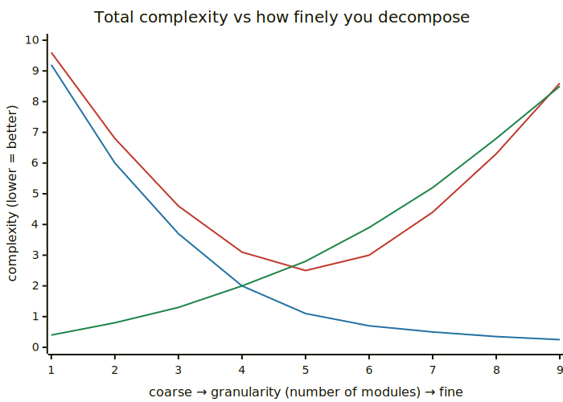
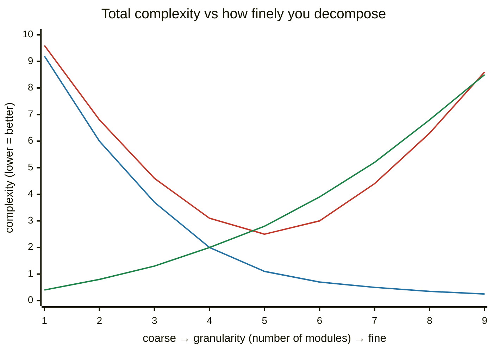
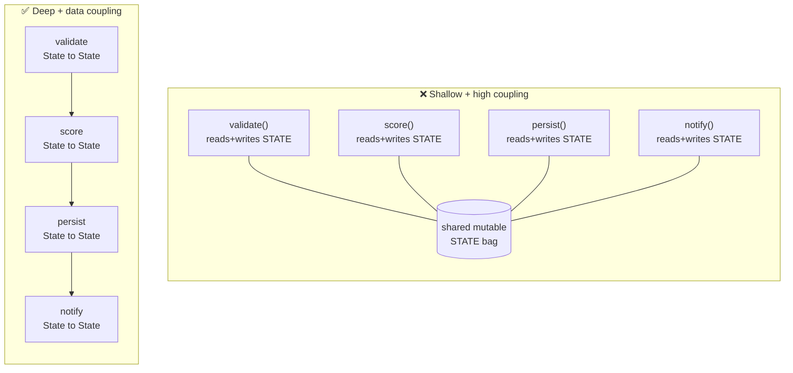

# M04 · Ch2 · §1 — Cohesion, Coupling & Module Depth: what actually makes a boundary good

> **Module:** Writing Code That Lasts
> **Chapter:** Decomposition
> **Section:** The real metric for a good boundary — cohesion, coupling, and module *depth* (not file length)
> **Status:** 🔵 in progress — drafted 2026-06-18. This is the conceptual core of your clearest gap.
> It deliberately reuses the **pipeline-state design thread** you drove in M01 Ch2 §1 (the `PipeState`
> shallow-module diagnosis) and the **Ousterhout vocabulary** (deep/shallow modules) you primed on in
> the 2026-06-11 reading, so it builds on language you already own.

**Estimated study time:** 2–3 hours including reflection.
**Prerequisites:** none formal. Strong tailwinds: M04 Ch1 §1 (a codebase is a graph), M01 Ch2 §1 §10
(your pipeline-state design arc — we extend it here), and the *Philosophy of Software Design* primer
from the 2026-06-11 reading.

---

## Why this section exists (for *you*)

This is the centre of gravity of your whole upskilling plan. The survey of your repos found two files —
`process_no_waiting.py` at **2,434 lines** and `ArenaPage.jsx` at **3,270 lines** — and decomposition
is named as your *clearest, most actionable gap*. Everything in this chapter exists to fix that.

But here is the trap, and you walked right up to its edge in our M01 Ch2 §1 session. When you feel a
file is "too big," the instinct is to **split it** — chop it into smaller files, or pull the state onto
a class and mutate it through methods. You proposed exactly that (`PipeState` with `read_state()` /
`update_state(data)`), and we found it made things *worse*: it turned explicit data flow into implicit
mutation. **Splitting is not decomposition.** You can take one 2,400-line mess and turn it into twelve
200-line messes that are *harder* to understand than the original, because now the mess is also spread
across twelve files with tangled wires between them.

So before any refactoring technique, you need the **metric** — the thing that tells you whether a
boundary is good or bad. This section gives you three lenses that are really one idea:

- **Cohesion** — does a module do *one* thing?
- **Coupling** — how entangled is it with the *others*?
- **Module depth** — how much functionality does it hide behind how small an interface?

Get these right and "where do I draw the line" stops being taste and becomes a judgement you can defend.

---

## 1. The wrong metric: "decomposition = smaller files"

Let's kill the bad mental model first, because it's the one that produces your monoliths *and* would
produce the bad fix.

A module — a function, a class, a file, a service; any unit with a boundary — has two parts:

- an **interface**: what a caller must know to use it (its name, parameters, return type, the
  exceptions it throws, the order you must call things in, the global state it touches);
- an **implementation**: everything inside that the caller does *not* need to know.

The entire point of a boundary is that the interface is **much smaller** than the implementation. You
learn `list.sort()` — one line — and never think about Timsort's galloping merge underneath. The cost
you pay to *use* it is tiny; the work it does *for* you is large. That gap is the whole value.

"Split the big file into small files" optimises the wrong variable. It reduces lines-per-file (a number
nobody experiences) while often *increasing* the total size of all the interfaces (the thing every
reader pays for). If pulling out a helper means callers now have to understand the helper's five
parameters, its call-ordering rules, and the three places it reaches back into shared state — you added
a boundary and hid *nothing* behind it. You paid the cost of an interface and got no abstraction back.

> The number that matters is not "lines per file." It is **how much you can ignore while still using
> the thing correctly.**

---

## 2. What you're actually fighting: complexity

Ousterhout's framing (your 2026-06-11 reading) is the sharpest definition: **complexity is anything
about the structure of a system that makes it hard to understand or modify.** It shows up as three
concrete symptoms — learn to name them, because "this feels messy" is not actionable and these are:

| Symptom | What it feels like | Your monoliths |
|---|---|---|
| **Change amplification** | a simple change touches many places | change the turn-scoring rule → edit it in 6 spots in `process_no_waiting.py` |
| **Cognitive load** | you must hold a lot in your head to make *any* change safely | "what does line 1,900 assume about the dict built on line 300?" |
| **Unknown unknowns** | it's not even clear *what* you must know to change it safely — the worst one | you change one branch and a feature three screens away silently breaks |

The third is the killer, and it's the one good decomposition exists to defeat. Change amplification
wastes your time; unknown unknowns produce *bugs you can't predict*. A well-decomposed system has the
property that **to change one thing, you only need to understand one thing** — the boundary tells you
exactly what you can ignore.

Complexity is also **incremental**: no single line creates it. It accretes — a special case here, a
shared variable there — until one day the file is 2,400 lines and nobody dares touch it. That's why
this is a *discipline*, not a one-time cleanup.

---

## 3. Cohesion — does this module do one thing?

**Cohesion** measures how strongly the things *inside* a module belong together. High cohesion = the
module has one clear job and everything in it serves that job. Low cohesion = it's a grab-bag.

There's a classic ladder from worst to best. You don't need to memorise the names, but you should be
able to *smell* where a module sits:

| Cohesion (worst → best) | The module's members are grouped because… | Smell |
|---|---|---|
| **Coincidental** | …no reason; someone dumped them together (`utils.py`) | the junk drawer |
| **Logical** | …they're the same *category* (all "validation", all "handlers") | a switch on a "type" flag doing unrelated work |
| **Temporal** | …they happen at the same *time* (`init()` doing ten unrelated setups) | "and then we also…" |
| **Sequential** | …one's output is the next one's input | getting warm |
| **Functional** | …they all collaborate on **one** well-defined task | the goal ✅ |

`process_no_waiting.py` is almost certainly **coincidental/temporal** at the top level: it's "all the
stuff that happens when we process a turn," which is a *time* grouping, not a *task* grouping. The fix
isn't to cut it at line 1,200; it's to find the handful of genuinely-separate *tasks* hiding inside
(validate input, score the turn, persist the result, notify) and give each its own functionally-cohesive
home.

A practical test: **describe the module in one sentence with no "and."** If you need "and" — "this
validates the request *and* writes to the database *and* formats the response" — cohesion is low and
there are that-many modules trying to get out.

---

## 4. Coupling — how entangled are the modules?

**Coupling** measures dependency *between* modules: if I change module A, how likely am I to have to
change module B? Low coupling is the goal — modules you can understand, change, and test in isolation.

Again a worst→best ladder. The axis that matters: **how much does B need to know about A's
internals?**

| Coupling (worst → best) | B depends on A's… | Example |
|---|---|---|
| **Content** | …internals directly — reaches in and pokes A's data | `b.config._cache["key"] = ...` |
| **Common / global** | …shared mutable global state | both read/write a module-level `STATE` dict |
| **Control** | …a flag B passes to tell A *how* to behave | `render(thing, mode="legacy")` with a big `if mode` inside |
| **Stamp** | …a big object, of which it uses two fields | passing the whole `request` to get `request.user_id` |
| **Data** | …a few explicit parameters and a return value | `score(turn) -> Score` | ✅ |

Two of these are exactly the smells from your `PipeState` proposal. Putting state on `self` and mutating
it through `update_state(data)` is **common coupling** — every step shares one mutable bag of state, so
any step can be broken by any other step's writes, in an order you can't see. That's why we landed on
*explicit, immutable data flow*: a step takes a typed `State` in and returns a new one out (**data
coupling**, the best kind), so the dependency is visible in the signature and nothing acts at a distance.

### The decomposition U-curve

Here's the part that defeats "split into smaller files." Coupling is *why* there's a sweet spot. As you
break a system into more modules:

- **too few modules** (the monolith): everything is internal, so coupling is "free" inside the blob —
  but cohesion is terrible and the blob is one giant unknown-unknown;
- **too many modules** (over-decomposition): each piece is tiny, but they're so interdependent that
  understanding *anything* means chasing calls across fifteen files. You've converted internal mess
  into **inter-module coupling**, which is worse — it's spread out and wired together.

Total complexity is the sum of *within-module* complexity (falls as you split) and *between-module*
complexity (rises as you split). Their sum is a **U**:

<!-- DIAGRAM:START -->


<details>
<summary>Diagram source (Mermaid)</summary>



</details>
<!-- DIAGRAM:END -->

*Red = total complexity (what you experience). Blue = within-module complexity (falls as you split).
Green = between-module coupling (rises as you split). Your monoliths sit at the far **left**; "split it
into twelve files without thinking about boundaries" slides you toward the far **right** — past the
minimum, where coupling dominates. The skill is landing in the **valley**, and the valley's location is
set by cohesion and coupling, not by a line count.*

This is also the answer to "how small should a function be?" — small enough that it does one thing
(cohesion), large enough that its interface earns its keep (the next idea).

---

## 5. Module depth — the one idea that unifies the others

This is the concept to walk away with. Ousterhout's measure of a *good* module is its **depth**:

$$\text{depth} \;\approx\; \frac{\text{functionality hidden inside}}{\text{cost of the interface}}$$

- A **deep module** has a *small* interface in front of a *large* implementation. `dict[key]` hides
  hashing, bucket arrays, collision resolution, and dynamic resizing behind two characters. Huge
  numerator, tiny denominator. You get a lot and pay almost nothing.
- A **shallow module** has an interface nearly as complex as its implementation. It makes you learn
  about as much to *call* it as you'd need to just *do the work yourself*. The boundary costs more than
  it saves.

The depth ratio is what makes cohesion and coupling *cash out*. High cohesion shrinks the interface (one
job → one clear entry point). Low coupling shrinks it too (fewer wires poking through). A deep module is
simply what you get when cohesion is high and coupling is low — it's the same property viewed from the
caller's side.

And it explains, precisely, what was wrong with `PipeState`:

```python
class PipeState:
    def read_state(self):          # returns the live mutable bag
        return self._state
    def update_state(self, data):  # merges anything into the bag
        self._state.update(data)
```

`update_state(data)` is a **maximally shallow** interface: it accepts *anything* and guarantees
*nothing*. The interface (`update_state`) is no simpler than the operation (`dict.update`) — it's a
one-line method wrapping a one-line builtin, so it adds a boundary and hides no decision. Worse,
`read_state()` hands back the live object, so callers can mutate through it — the abstraction leaks on
both sides. Negative depth: it *added* interface and *subtracted* clarity.

The deep version is the skeleton we built: a `frozen` dataclass `State` (the data, with a real schema),
steps with the signature `def step(state: State, deps: Deps) -> State`, and a runner that threads state
through them. The interface of each step is one line and tells you everything — *here is what I read,
here is what I produce* — while the implementation can be as rich as it needs to be. **Narrow door,
big room.**

> A blunt heuristic: if a method's body is about as long and complex as the call site that uses it,
> and it doesn't make a *decision* the caller would otherwise have to make, it's probably a shallow
> pass-through. Inline it or make it earn its boundary.

---

## 6. The classic two structures, side by side

Same functionality, two decompositions. The **❌ panel** is shallow modules + high coupling (thin
wrappers all reaching into one shared state bag); the **✅ panel** is deep modules + data coupling (each
does one job behind a narrow interface, state flows explicitly). Look at the wiring — a dense hub on one
side, a clean linear chain on the other. That wiring *is* the coupling.

<!-- DIAGRAM:START -->


<details>
<summary>Diagram source (Mermaid)</summary>



</details>
<!-- DIAGRAM:END -->

In the ❌ panel, *any* step can break *any* other through the shared bag, in an order you can't read off
the code — every box is wired to the hub, so the dependency graph is dense and invisible. In the ✅
panel, the dependencies are exactly the arrows you see: linear, explicit, each step's contract is its
signature. The ✅ version is testable in isolation (hand a step a `State`, check the `State` it returns);
the ❌ version is not (you must reconstruct the whole bag to test one step). **That difference is the
entire return on getting the boundary right.**

---

## 7. Information hiding & leaky abstractions

The mechanism underneath "deep" is **information hiding**: a module's job is to *encapsulate a design
decision* so that the decision can change without callers noticing. A good module hides a "what if we
need to change X later" — the storage format, the retry policy, the wire protocol, the scoring formula.

The failure mode is the **leaky abstraction**: an interface that forces the caller to know the thing it
was supposed to hide.

- `read_state()` returning the live dict leaks the fact that state is a mutable dict.
- A `get_user(id)` that throws `KeyError` on a missing row leaks that it's backed by a dict; the same
  function over SQL would throw something else — so callers now depend on the *implementation*, not the
  *interface*. (This is exactly your **"define errors out of existence"** keeper from the reading: a
  deep interface might return `None` or a typed `UserResult`, hiding the storage choice entirely.)
- Control-coupling flags (`render(x, mode="legacy")`) leak internal branches into the signature.

A quick litmus: **if I swapped the implementation for a totally different one (dict → Postgres,
in-memory → HTTP), how many call sites would break?** Zero is the goal. Every break is a leak you're
paying interest on.

---

## 8. When *not* to decompose

Decomposition has a cost, and the U-curve has a right-hand wall. Don't sprint past the valley.

- **Don't split what's read together.** If two pieces of code are *always* read and changed together,
  a boundary between them just adds a wire you have to trace. Ousterhout: information and the code that
  uses it want to live together. A boundary in the wrong place is *negative* value.
- **Beware "classitis"** — the belief that more, smaller classes are automatically better. A class that
  exists only to hold one method and pass data through is usually a shallow module; a plain function is
  deeper.
- **Don't decompose on speculation.** "We might need to swap this later" → you build a plugin
  architecture for a thing that never changes. Decompose around the boundaries that *actually* shift
  (you'll learn them by changing the code), not the ones you imagine might.
- **Temporal coupling is a real reason to merge.** If step B genuinely cannot run without step A having
  run first, hiding that ordering behind two innocent-looking public methods is *worse* than one method
  that does both in the right order. Make the dependency impossible to get wrong.

The goal is never "maximum modules." It's the **valley**: the fewest boundaries that each hide a real
decision behind a narrow interface.

---

## 9. Check your understanding

1. A colleague "cleans up" a 2,000-line file by cutting it into ten 200-line files, each calling the
   next and all sharing a module-level `STATE` dict. On the U-curve, which direction did they move, and
   did total complexity go up or down? Name the coupling type they introduced.
2. Why is `update_state(data: dict)` a *shallow* interface even though it's only one line of code?
   What single property would make a one-line method *deep* instead?
3. You have `def get_config(key, *, env=None, default=None, cast=None, reload=False)`. Which cohesion/
   coupling smell do the `cast` and `reload` flags hint at, and what's the deeper alternative?
4. Give the one-sentence test for low cohesion, and the one-sentence test for a leaky abstraction.
5. Your `score()` step currently reads `STATE["turn"]` and writes `STATE["result"]`. Rewrite its
   *signature* (not body) to convert common coupling into data coupling. What does the new signature let
   you do that the old one didn't?

<details>
<summary>Answers</summary>

1. **Right**, past the valley — toward over-decomposition. Total complexity likely went **up**: they
   traded within-module size for **common coupling** (the shared `STATE`) plus call-chain control flow.
   Ten shallow modules wired through a global bag is the right-hand wall of the U-curve.
2. Because the *interface* is no simpler than the *operation* — it accepts anything and guarantees
   nothing, so it hides no decision and the caller learns nothing they could ignore. A one-line method
   is **deep** when it *makes a decision the caller would otherwise have to make* (e.g. picks the
   storage key, validates an invariant, normalises an error) — i.e. it has a small interface over real
   behaviour, however short.
3. They smell of **control coupling** (flags telling the function *how* to behave → a big `if` inside)
   and **low cohesion** (it's doing several jobs). Deeper: separate functions, or push the policy to the
   caller and keep `get_config(key) -> Value` narrow.
4. Low cohesion: **you can't describe the module in one sentence without "and."** Leaky abstraction:
   **swapping the implementation for a different one would break the callers.**
5. `def score(state: State) -> State` (or `def score(turn: Turn) -> Score`). It makes the dependency
   explicit in the signature, removes the hidden ordering, and lets you **test the step in isolation** —
   hand it a `State`/`Turn`, assert on what it returns, no global setup.

</details>

---

## 10. Optional: get your hands dirty (20–30 min)

Pick **`process_no_waiting.py`** (or any monolith you have) and do a *paper* decomposition — no code
changes, just the analysis. This is the skill; the editing comes in §2–§3.

1. **Name the tasks.** Read the function top to bottom once and write down each *distinct task* it does,
   one line each, no "and." Stop when you have the list. (Expect 4–8.)
2. **Spot the shared bag.** Find every variable that's read or written across more than ~2 of those
   tasks. That set *is* your coupling — it's what a clean decomposition has to turn into explicit
   parameters and returns.
3. **Draw the two structures** from §6 for *your* code: the current shared-state version, and a
   deep-module version where each task is `state in → state out`. Count arrows crossing boundaries in
   each.
4. **Find one leaky abstraction** — a helper whose interface forces the caller to know something it
   should hide (a returned mutable object, a raised storage-specific exception, a `mode=` flag).
5. **Find one boundary you should *not* draw** — two chunks that are always read and changed together.
   Note why merging beats splitting there.

You don't have to refactor anything. The deliverable is the *map*: the task list, the shared-state set,
and the two diagrams. That map is what every later refactoring step executes against.

---

## 11. References

- John Ousterhout, *A Philosophy of Software Design* — chapters on complexity, deep modules, and
  information hiding. The source of the "depth" framing and your shared vocabulary.
  <https://web.stanford.edu/~ouster/cgi-bin/aposd.php>
- Martin Fowler, *Reducing Coupling* — <https://martinfowler.com/ieeeSoftware/coupling.pdf>
- Wikipedia, *Cohesion (computer science)* — the cohesion ladder, named.
  <https://en.wikipedia.org/wiki/Cohesion_(computer_science)>
- Wikipedia, *Coupling (computer programming)* — the coupling ladder, named.
  <https://en.wikipedia.org/wiki/Coupling_(computer_programming)>
- Joel Spolsky, *The Law of Leaky Abstractions* — <https://www.joelonsoftware.com/2002/11/11/the-law-of-leaky-abstractions/>

### What's next

Two natural continuations inside Ch2:
- **§2 — Refactoring a monolith, in moves:** the actual mechanics — extract function, introduce
  parameter object, replace shared state with returned values, sprout/wrap — applied step by step to
  `process_no_waiting.py` using the map you build in §10.
- **§3 — Boundaries between modules and files:** packages, layering, dependency direction, and where the
  seams in *your* repos should fall.

Or rotate scope: you've now had a string of M01 days plus this SWE turn — the AI thread (**M12 Ch2 §2,
video models**) is queued and is your strongest critique mode.
