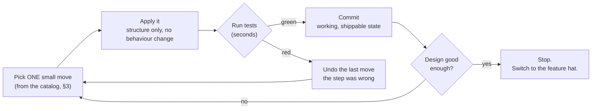
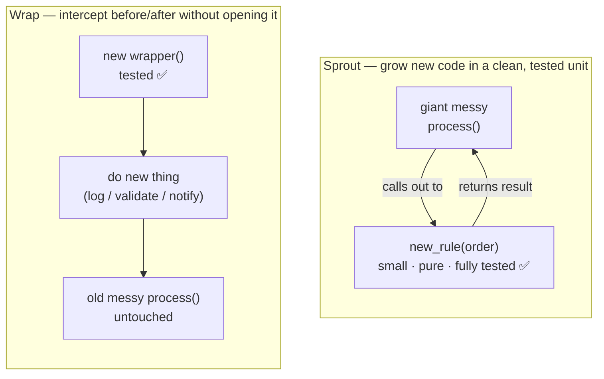
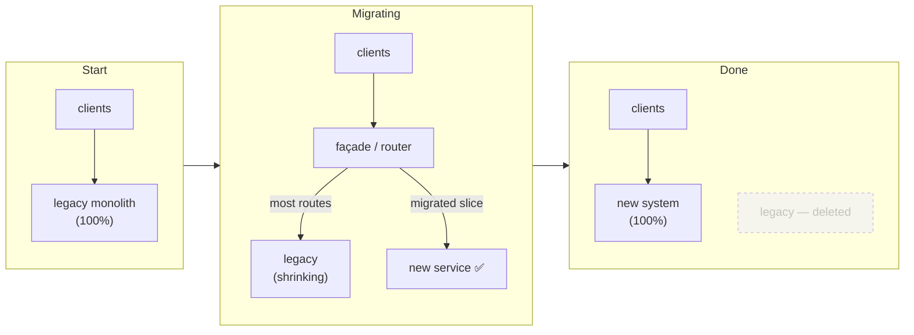

# M04 · Ch2 · §2 — Refactoring a Monolith, in Moves: the mechanics of getting from mess to deep modules

> **Module:** Writing Code That Lasts
> **Chapter:** Decomposition
> **Section:** The actual mechanics — behaviour-preserving moves, the safety net, working without tests,
> Sprout/Wrap, Strangler Fig, and how to drive an AI agent through a refactor without breaking things.
> **Status:** ✅ finalized 2026-07-30 (body prepared 2026-07-24). He agreed with the strategy and the technique with no
> questions on the mechanics; the whole session drove the §7 AI-agent warning one layer deeper —
> *do the coding harnesses actually enforce this discipline?* — captured in §10 Applied, which
> ends in a concrete artifact: a user-level Claude Code `refactor` skill that operationalizes this
> section's protocol.
> **Prerequisites:** M04 Ch2 §1 (cohesion, coupling, module depth — the *metric* this section executes
> against). The §1 "paper decomposition" map (its §10) is the input to the workflow here.

**Estimated study time:** 2–3 hours including the worked example.

---

## Why this section exists

§1 gave you the **destination**: deep modules — a narrow interface over a large implementation, high
cohesion, data coupling, state that flows explicitly instead of festering in a shared bag. It also gave
you the **map**: read a big function, name its tasks, find the shared state, draw the two structures.

This section is the **road**. Knowing that a 2,000-line function *should* become five deep modules does
not tell you how to get there without breaking it on the way. The gap between "I can see the better
design" and "I safely transformed the code into it" is exactly where most refactors die — either they
never start (too risky), or they turn into a rewrite that introduces a fresh crop of bugs and stalls for
three months.

The craft has a precise shape, and it is learnable. It is a **vocabulary of small, individually-safe
moves**, applied in sequence, each one verified before the next. The headline idea, which took the
industry a decade to internalise:

> **You do not refactor by rewriting. You refactor by applying a series of behaviour-preserving
> transformations, each small enough to verify, so the code is working and shippable after *every single
> step*.**

That discipline is what lets you improve a monolith you don't fully understand, on a system that must
stay live, without a scary "big merge" at the end. Everything below is in service of it.

---

## 1. What "refactoring" actually means (and what it doesn't)

The word gets used loosely to mean "I changed some code and it's nicer now." Fowler's definition is
narrower and load-bearing:

> **Refactoring is a change to the *internal structure* of software that makes it easier to understand
> and cheaper to modify *without changing its observable behaviour*.**

The two words that carry the weight are **observable behaviour**. A refactoring is a transformation where
the code does *exactly* what it did before — same outputs, same side effects, same errors — but is
structured better. If the behaviour changed, it was not a refactoring; it was a *change*, and it needs to
be reviewed and tested as one.

This gives you the single most important rule in the whole discipline, Kent Beck's **Two Hats**:

- When you wear the **refactoring hat**, you change structure and add no functionality. Tests stay green
  the entire time; if one goes red, your last move was wrong — undo it.
- When you wear the **feature hat**, you add or change behaviour, and you don't restructure.
- **You never wear both hats at once.**

Why this matters so much: the two activities have opposite risk profiles. A behaviour-preserving move can
be verified mechanically (did the tests stay green?). A behaviour change requires judgement about whether
the *new* behaviour is correct. Mix them and you lose the ability to tell which category a bug came from —
you can no longer trust "the tests pass" to mean "I didn't break anything," because you also *meant* to
change things. Almost every "the refactor introduced a bug" horror story is really "we changed behaviour
while restructuring and couldn't tell." Keep the hats separate and the horror story can't happen: any
red test during refactoring points at the last structural move, which you just made and can immediately
undo.

The corollary — Beck's other famous line, and the mental model for the whole workflow:

> *"For each desired change, make the change easy (warning: this may be hard), then make the easy
> change."*

Refactoring is the "make the change easy" step. You reshape the code — hats off, behaviour frozen — until
the feature you actually want becomes a small, obvious edit. Then you switch hats and make that small
edit. This is why refactoring is not a separate "cleanup project" you beg your manager for; it's the
thing you do *right before* a feature, to the part of the code that feature touches.

---

## 2. The safety net — and what to do when you don't have one

The whole method rests on one assumption: **after each move, you can quickly and reliably tell whether
behaviour changed.** The standard instrument for that is a **test suite** you can run in seconds. Green
after the move = behaviour preserved = keep going. Red = undo the last move. That fast feedback loop is
what makes hundreds of tiny steps practical instead of terrifying.

<!-- DIAGRAM:START -->


<details>
<summary>Diagram source (Mermaid)</summary>



</details>
<!-- DIAGRAM:END -->

The loop is the method. Note two things: the steps are **small** (so a red is unambiguous — it can only be
the one move you just made), and you **commit on green** (so you can always retreat to a known-good state
and never build a tower of unverified changes).

### But your tests are sparse or absent — the legacy-code reality

Here's the honest problem, and it's the one most real refactoring happens inside of. Michael Feathers, in
*Working Effectively with Legacy Code*, gives the deliberately provocative definition that reframes the
whole thing:

> **Legacy code is simply code without tests.**

Not old code, not bad code — *untested* code. Because without tests you have no safety net, so you cannot
refactor safely, so the code ossifies: you're afraid to touch it, so it never improves, so it stays
scary. That's the trap. The way out is not "write a full test suite first" (you often can't — the code
isn't testable *because* it's tangled, which is the chicken-and-egg of legacy work). The way out is a
smaller, sharper tool:

**Characterization tests (a.k.a. pinning tests / golden-master tests).** A characterization test does
*not* assert what the code *should* do. It asserts what the code *currently does*, whatever that is —
bugs and all. You run the messy function with representative inputs, capture the exact outputs it
produces today, and freeze them as the expected values. You are not testing for correctness; you are
**pinning the current behaviour in place** so that your refactoring moves can be checked against it.

The technique for writing one when you don't know what the code does:

1. Call the function with a realistic input inside a test.
2. Assert it equals something you *know is wrong* — e.g. `assert result == "PIN ME"`.
3. Run it. The test fails and the failure message tells you the *actual* value the code produced.
4. Paste that actual value in as the expected value. The test now passes and pins current behaviour.

Repeat across a handful of inputs that exercise the branches you can see, and you have a net — crude, but
enough to refactor under. This is the move that turns "I can't touch this" into "I can start."

**Seams (Feathers).** The other legacy problem: you can't even *call* the messy function in a test
because it reaches out to a real database, a network service, the clock, the filesystem. A **seam** is a
place where you can change behaviour without editing the code at that place — a point where you can slip
in a test double. In §1's language this is exactly what **data coupling** buys you: a function that takes
its dependencies as parameters (`def process(order, db, emailer)`) has seams by construction — you pass
fakes in a test. A function that reaches for a global `db` or does `Emailer()` inside itself has *no*
seam, and your first structural move is often to *create* one (pass the dependency in instead of
constructing it) precisely so you can pin the behaviour. Note the loop: better decomposition (§1) is what
makes code testable, and tests are what make decomposition safe. The two skills unlock each other.

> **The disciplined legacy-refactoring order:** (1) find/create a seam so you can call the code in a
> harness; (2) pin current behaviour with characterization tests; (3) *now* refactor in small verified
> moves; (4) once the code is decomposed and testable, replace the crude golden-master pins with real
> unit tests of the clean pieces. Steps 3–4 are the reward; steps 1–2 are the price of admission, and
> skipping them is how refactors turn into outages.

---

## 3. The catalog of moves — a vocabulary, mapped to what each one fixes

Fowler's *Refactoring* is, at its core, a **catalog** — a named list of small transformations, each with
a mechanical step-by-step recipe. You do not need to memorise the catalog; you need to know that it
*exists*, that the moves have names (naming them is how you think and communicate about them), and
roughly which move attacks which §1 symptom. Here are the ones that carry 90% of real work, grouped by
the problem they solve.

| Move | What you do | Which §1 problem it fixes |
|---|---|---|
| **Extract Function** | pull a cohesive chunk of a long function into its own named function | change amplification, low cohesion; the workhorse move |
| **Inline Function** | the reverse — fold a shallow pass-through back into its caller | *negative*-depth shallow modules (§1 §5) |
| **Extract Variable** | give a complex sub-expression a name via a local variable | cognitive load; makes intent readable |
| **Replace Temp with Query** | turn a local temp into a small function so extracted code doesn't depend on ordering | temporal coupling inside a function |
| **Introduce Parameter Object** | bundle a clump of args that always travel together into one typed object | long parameter lists; data clumps |
| **Preserve Whole Object** | pass the object instead of three fields yanked out of it | (use with care — can *create* stamp coupling, §1) |
| **Split Phase** | separate code that does two things in sequence into two stages with a clear data hand-off | low cohesion; the "…and then…" smell |
| **Replace shared state with return value** | stop mutating a shared bag; return what you computed and let the caller wire it | **common coupling → data coupling** (the big one) |
| **Move Function / Field** | relocate a function to the module it actually belongs with | feature envy; misplaced cohesion |
| **Replace Conditional with Polymorphism** | swap a sprawling `if type == …` for a type per case | control coupling; the `do(kind, …)` smell |

Two things to notice. First, **every move is small and reversible** — each maps to an undo. Second, the
column on the right is just §1's failure modes. The catalog is not arbitrary; it's the set of legal moves
that walk you *down the U-curve toward the valley*. Refactoring is §1's theory executed one safe step at a
time.

A worked sequence of these appears in §6. The point of the table now is that when you look at a mess and
think "this is doing three things and sharing a dict," you should be able to reach for the *named* moves —
Split Phase, then Extract Function ×3, then Replace shared state with return value — instead of freehand
rewriting. Named moves are small, verifiable, and reviewable; a freehand rewrite is none of those.

---

## 4. Attacking a monolith you can't hold in your head — Sprout and Wrap

Extract-and-clean assumes you can understand the function well enough to carve it. Sometimes you can't —
it's 2,000 lines, you need to add *one* feature today, and fully comprehending it first is neither
possible nor worth it. Feathers gives two moves for exactly this: ways to add new, clean, *tested* code
to a monster **without first untangling the monster.**

<!-- DIAGRAM:START -->


<details>
<summary>Diagram source (Mermaid)</summary>



</details>
<!-- DIAGRAM:END -->

- **Sprout Method / Sprout Class.** You need new behaviour. Instead of threading it into the tangle, you
  write it as a **new, cohesive, fully-tested** function or class, and call out to it from the one spot in
  the monolith where it's needed. The monster gains a single clean call site; the new logic is born
  correct and covered. Over time, sprouts are where the *good* version of the system accumulates.
- **Wrap Method / Wrap Class.** You need to do something *before or after* an existing operation (log it,
  validate the input, fire a notification, add a cache) but the operation itself is untouchable. You
  rename the old thing and put a new, tested method in front of it that calls the old one. You've added
  behaviour at a seam without opening the box.

The strategic point: **you don't have to boil the ocean.** You are allowed to leave the swamp mostly as
it is and still ship clean, tested code around and into it. Combined with the **Boy Scout Rule** — *leave
the code a little cleaner than you found it* — every task becomes a small, opportunistic improvement to
the part you were touching anyway. Fowler calls this **opportunistic refactoring** ("comprehension
refactoring": when you finally understand a gnarly bit, encode that understanding by cleaning it, so the
next person gets your insight for free) and contrasts it with rarer **planned refactoring**. Most durable
codebases got that way through a thousand opportunistic cleanups, not one heroic rewrite.

---

## 5. The one you must resist — the Big Rewrite

The most expensive mistake in this whole area is refusing to refactor and reaching instead for the
**ground-up rewrite**: "this code is hopeless, let's throw it away and build it fresh." It is emotionally
seductive (green field! no legacy!) and it is, in Joel Spolsky's words, *"the single worst strategic
mistake that any software company can make."*

The canonical casualty is **Netscape**: in the late 1990s they rewrote their browser engine from scratch
for version 6. It took roughly three years, during which they shipped almost nothing while Internet
Explorer ate the market — a collapse many trace directly to that decision. Spolsky's *Things You Should
Never Do, Part I* (2000) is the essay; the argument holds up two decades later.

Why rewrites fail so reliably:

- **You throw away accumulated knowledge.** That ugly function is ugly partly because it encodes years of
  bug fixes, edge cases, and hard-won lessons — the weird `if` that handles a real customer's real data.
  A rewrite starts by *deleting all of that* and rediscovering it the hard way, one production incident
  at a time. The mess is partly *scar tissue*, and scar tissue is knowledge.
- **You get no working software for a long time.** Refactoring keeps the system shippable after every
  step (§2). A rewrite gives you nothing runnable until it's "done," and meanwhile the old system still
  needs features, so you're maintaining two things and racing a moving target.
- **The new one grows its own mess.** Nothing about a fresh start prevents the *next* monolith; without
  the discipline of this section, you just re-earn the swamp in a new language.

The mature alternative at system scale is the **Strangler Fig** pattern (Fowler's name, after the vine
that grows around a tree and gradually replaces it): you build the new system *around* the old one, route
one slice of traffic/functionality at a time to the new implementation, and shrink the old system
incrementally until it can be deleted. It's the same small-verified-steps philosophy as function-level
refactoring, lifted to architecture — and it keeps you live and shippable the entire way.

<!-- DIAGRAM:START -->


<details>
<summary>Diagram source (Mermaid)</summary>



</details>
<!-- DIAGRAM:END -->

> Rule of thumb: **refactor the code you have; strangle the system you must replace; rewrite from scratch
> almost never — and only something small, well-understood, and behind a stable interface.**

---

## 6. Worked example — a monolith to deep modules, move by move

Let's make it concrete. Here is a compact but genuinely tangled function — the kind that starts at 30
lines and grows to 300. It validates, computes, applies rules, persists, and notifies, all in one flow,
mutating and reusing locals as it goes. (Nothing here is anyone's production code — it's a distilled
composite of the shape §1's map targets.)

```python
def process_order(order, db, emailer):
    if not order["items"]:
        raise ValueError("empty order")
    total = 0
    for it in order["items"]:
        if it["qty"] <= 0:
            raise ValueError("bad qty")
        total += it["price"] * it["qty"]
    if order["customer"]["tier"] == "gold":       # discount policy, inline
        total = total * 0.9
    rate = 0.09 if order["region"] == "CA" else 0.0   # tax policy, inline
    total = total + total * rate                   # 'total' now means grand total — reused/mutated
    db.execute("INSERT INTO orders (id, amount) VALUES (?, ?)",
               (order["id"], total))
    emailer.send(order["customer"]["email"], f"Your total is {total}")
    return total
```

Read it with §1's eyes: it does **five** things (the "and" test fails hard — validate *and* total *and*
discount *and* tax *and* persist *and* notify), and the local `total` is a **shared mutable bag** in
miniature — it's reused to mean subtotal, then discounted subtotal, then grand total, so you can't extract
any middle piece without untangling what `total` means at that line. That variable reuse is precisely what
blocks extraction.

**Step 0 — pin it.** Before touching anything, write characterization tests (§2). `process_order` already
takes `db` and `emailer` as parameters — it has **seams** — so we pass fakes and pin the outputs:

```python
def test_pins_gold_ca_order():
    db, emailer = FakeDB(), FakeEmailer()
    result = process_order(GOLD_CA_ORDER, db, emailer)
    assert result == 98.1                       # pinned: whatever it produces today
    assert db.rows == [("o-1", 98.1)]
    assert emailer.sent == [("g@x.com", "Your total is 98.1")]
```

Now every move below is checked against green.

**Step 1 — Extract Variable / stop reusing `total`.** Give each meaning its own name. This is the move
that *unblocks* everything else:

```python
subtotal = sum(it["price"] * it["qty"] for it in order["items"])
discounted = subtotal * 0.9 if order["customer"]["tier"] == "gold" else subtotal
rate = 0.09 if order["region"] == "CA" else 0.0
grand_total = discounted + discounted * rate
```

Tests green. Behaviour identical; the values now have distinct, honest names.

**Step 2 — Extract Function per task.** Each cohesive chunk becomes a named, pure function — a deep module
in the making (§1 §5): narrow signature, real decision inside.

```python
def validate(order) -> None: ...
def subtotal(items) -> float:        return sum(i["price"] * i["qty"] for i in items)
def apply_discount(amount, tier) -> float:  return amount * 0.9 if tier == "gold" else amount
def tax_for(region) -> float:        return 0.09 if region == "CA" else 0.0
```

Run tests after *each* extraction, not after all four. Green each time.

**Step 3 — Split Phase.** Separate the **pure computation** (validate → price the order) from the
**effects** (persist, notify). This is the highest-value move: it cleaves the function along the line
that matters most — the part that's a pure function of its inputs (trivially testable, no seams needed)
from the part that talks to the world (needs fakes).

```python
def price_order(order) -> float:          # PURE: no db, no emailer, no I/O
    validate(order)
    sub = subtotal(order["items"])
    disc = apply_discount(sub, order["customer"]["tier"])
    return disc + disc * tax_for(order["region"])

def process_order(order, db, emailer) -> float:   # thin runner: owns the effects
    grand_total = price_order(order)
    db.execute("INSERT INTO orders (id, amount) VALUES (?, ?)", (order["id"], grand_total))
    emailer.send(order["customer"]["email"], f"Your total is {grand_total}")
    return grand_total
```

Look at what §1 predicted, now realised: `process_order` shrank to a **deep, thin runner** that owns
coupling to the outside world in *one* place, and `price_order` is a **pure core** you can test with no
fakes at all (`assert price_order(GOLD_CA_ORDER) == 98.1`). The discount and tax *policies* are now single
functions you can change — or, when a third tier or a second tax region shows up, swap for a table or a
strategy object (Replace Conditional with Polymorphism) — without reading the persistence code. We walked
the U-curve from the monolith at the far left down into the valley, and every intermediate state was
green and shippable.

Notice we never wore the feature hat. We changed *nothing* about what the code does — same total, same
row, same email. That's what makes it a refactoring, and that's why it was safe.

---

## 7. Refactoring with an AI agent — the workflow that keeps you safe

You work primarily by driving AI agents, and refactoring is one of the things they're genuinely good at —
*if* you impose the discipline of this section on them, because their default behaviour violates it.

**The core hazard: an agent will happily wear both hats at once.** Ask "clean up this function" and a
model will often rewrite it wholesale — and silently "fix" a bug, drop an edge case it judged
unnecessary, or change an error type — all mixed into one large diff. That's the §1/§2 nightmare: a
behaviour change disguised as a refactoring, in a diff too big to audit. The model is not being
malicious; "make it nicer" *invites* both hats. Your job is to constrain it back to one.

The workflow that works:

- **Pin first, and make the agent do it.** "Before changing anything, write characterization tests that
  capture current behaviour, including current bugs. Run them; show me green." Now you both have the net,
  and *the tests are the contract* the subsequent refactor must not break. This single step converts
  "trust the model" into "verify the model."
- **Name the move; keep the diff small.** Instead of "refactor this," say "**Extract Function** for the
  tax calculation only" or "**Split Phase**: separate the pure pricing from the persistence, no other
  changes." Small named moves produce small reviewable diffs where a behaviour change would stick out.
  This is the same reason the moves are small for humans — a small diff makes an unintended change
  *visible*.
- **Green between every move, commit on green.** Same loop as §2's diagram. Have the agent run the tests
  after each move and stop if any go red. Commit each green step so you can bisect and retreat.
- **Read the diff as a behaviour question, not a style question.** Your review question is not "is this
  prettier?" — it's the refactoring question: **"does this change observable behaviour anywhere?"** Watch
  specifically for the model's favourite silent changes: an added/removed edge-case branch, a changed
  exception type, `==` vs `is`, a reordered side effect, a defaulted parameter, a "helpfully" fixed bug
  that your characterization test is now (correctly) failing on. If a test goes red, the agent changed
  behaviour — decide *deliberately*, with the feature hat on, whether that change is wanted; don't let it
  ride along inside a "cleanup."
- **Then let the agent do the tedious part at scale.** Once behaviour is pinned and the moves are named,
  agents are excellent at the mechanical, repetitive execution — applying the same extraction across
  twenty call sites, renaming consistently, updating imports. That's the sweet spot: *you* own the design
  and the hat discipline; the agent owns the typing.

The meta-point ties back to this course's whole premise — your goal is to **read and judge** code, not
hand-write it. Refactoring with an agent is a pure exercise of that skill: the agent proposes the
transformation, and you supply the two things it lacks — the *judgement* of which move and where (§1), and
the *discipline* that keeps behaviour frozen while structure changes (§2). Hold those two and the agent is
a force multiplier; drop them and it's an efficient way to ship a subtle regression.

---

## 8. Check your understanding

1. A teammate says "I refactored the payment module and fixed a rounding bug while I was in there." What's
   wrong with that sentence, in the vocabulary of this section — and what should they have done instead?
2. You need to refactor a 1,500-line function that reads from a global `DB` connection and calls an email
   service constructed inside itself. You have zero tests. What are your first two moves, in order, and
   why can't you start with "Extract Function"?
3. What is a characterization test, and how is it different from a normal unit test? Why would you
   deliberately pin a value you *know* is wrong?
4. In the §6 example, why was "stop reusing the `total` variable" (Step 1) the move that unblocked the
   others? Which §1 concept does a reused-and-mutated local resemble?
5. Your manager wants to "rewrite the legacy billing service from scratch — it's too messy to fix." Give
   the two strongest reasons to push back and name the incremental pattern you'd propose instead.
6. You ask an AI agent to "clean up this function" and it returns a 200-line diff that's tidier and all
   your existing tests pass. Why is "tests pass" *not* sufficient assurance here, and what should you have
   asked for instead?

<details>
<summary>Answers</summary>

1. They wore **both hats at once** — a refactoring (structure) and a behaviour change (the bug fix) in one
   change. Now nobody can tell whether any other difference in that diff was intended, and "tests pass"
   no longer means "behaviour preserved" because they *meant* to change behaviour. They should have
   refactored first (hats off, tests green throughout, commit), then switched to the feature hat and
   fixed the rounding bug as a separate, separately-tested change.
2. **(1)** Create a **seam**: pass the `db` connection and the emailer in as parameters (or otherwise make
   them injectable) so you can substitute fakes. **(2)** Write **characterization tests** through that
   seam to pin current behaviour. Only then can you Extract Function — because Extract Function is only
   *safe* if you can verify behaviour didn't change after each extraction, and you have no way to verify
   that until the code is callable in a harness and its current behaviour is pinned.
3. A characterization/pinning test asserts what the code **currently does** (bugs included), not what it
   *should* do — its purpose is to freeze current behaviour so refactoring moves can be checked against
   it, not to judge correctness. You pin a known-wrong value on purpose as a *technique* to discover the
   actual output: the test fails and reports the real value, which you then paste in as expected. The
   correctness conversation happens later, with the feature hat on.
4. Because `total` was **reused and mutated** to mean three different things (subtotal → discounted →
   grand total), any attempt to extract a middle chunk would have to disentangle which meaning `total`
   held at that line. Giving each meaning its own name removed that hidden temporal dependency, after
   which each chunk was independently extractable. A reused-and-mutated local is a **shared mutable
   bag / common coupling** (§1) in miniature — several logical steps entangled through one piece of
   mutable state.
5. **(a)** A rewrite throws away accumulated knowledge — the odd branches are encoded bug fixes and edge
   cases (scar tissue = knowledge); you'll rediscover them as production incidents. **(b)** You get no
   working, shippable software for a long time while the old system still needs maintenance, so you
   maintain two things and race a moving target (the Netscape outcome). Propose the **Strangler Fig**:
   stand a router/façade in front, migrate one slice at a time to the new implementation, shrink the
   legacy until it can be deleted — staying live throughout.
6. Passing *existing* tests only proves you didn't break what was already covered — and legacy code is
   under-tested by definition, so most behaviour isn't covered. The agent may have wearing both hats:
   silently changed an edge case, an exception type, or a side-effect ordering that no test touches. You
   should have asked it to (a) **pin current behaviour with characterization tests first**, (b) apply one
   **named, small move at a time** with green between each, and (c) keep the diff small enough that a
   behaviour change would be *visible* in review — so your read of the diff can answer the only question
   that matters: "does observable behaviour change anywhere?"

</details>

---

## 9. Optional: get your hands dirty (30–45 min)

Take the paper decomposition map you produced in §1's §10 (or make one now for any ugly function) and
*execute* it — but do it under the discipline, because the discipline is the skill:

1. **Find or create a seam.** Can you call the function in a test at all? If it reaches for a global or
   constructs a dependency internally, your first move is to pass that dependency in.
2. **Pin it.** Write 3–5 characterization tests using the "assert a wrong value, read the real one, paste
   it back" trick. Cover the branches you can see.
3. **One named move at a time.** Work down your map: Extract Variable to kill reused temps, Extract
   Function per task, Split Phase to separate pure computation from effects. **Run the tests after every
   single move.** If one goes red, undo — don't debug forward.
4. **Commit on each green.** Notice that you are never more than one small step from a working state.
5. **Reflect:** which move gave the biggest drop in complexity for the least risk? (It's almost always
   Split Phase — separating the pure core from the effectful shell.) That's the move to reach for first
   next time.

If you want to feel the AI-assisted version: drive an agent through the *same* steps with the §7
constraints ("pin first, one named move, green between each, small diffs"), and separately ask a fresh
agent to just "clean up this function" in one shot. Diff the two results and look for the behaviour
changes the one-shot version smuggled in. That contrast is the lesson of this section in a single
experiment.

---

## 10. Applied — does the harness enforce this? Where the discipline actually lives

You agreed with the strategy and had no questions on the technique — so the session went where the
real uncertainty was: **§7 says *you* must impose this discipline on the AI agent; but the agent runs
inside a harness (Claude Code, Cursor, Codex) that injects its own system instructions before your
message. Do those built-in instructions already contain the refactoring strategy?** The answer is a
useful piece of "how the tools actually work," and it sharpens §7 into something actionable.

**Short answer: no — not as an explicit refactoring doctrine.** The built-in system instructions of
these harnesses are overwhelmingly about **operational safety and tool-use hygiene**, not
**software-engineering methodology**. This is checkable, not a guess: running *inside* Claude Code
for this session, its own visible operating instructions contain things like *"write code that reads
like the surrounding code,"* *"report outcomes faithfully — if tests fail, say so,"* prefer a
surgical edit over a wholesale rewrite, confirm before hard-to-reverse actions, commit only when
asked — plus the existence of quality *skills* (`/simplify`, `/code-review`). Those are **ingredients**
that overlap with this section (match style, minimal edits, run and honestly report tests, keep diffs
reviewable), but they are framed as "be a careful tool user," **not** "here is how to refactor." The
load-bearing doctrine — the **Two Hats**, **pin behaviour before touching legacy**, **one named move
per green step** — is simply not there. (Cursor's and Codex's system prompts aren't officially
published — what circulates is leaked/reverse-engineered and version-specific — but from what's public
they share the same *character*: "make it runnable," "never leave the code broken," "don't revert the
user's changes," minimal diffs. Operational, not methodological.)

**The mental model that resolves it — three layers, and the harness is only one.** When an agent
refactors well or badly, the behaviour comes from one of three places:

| Layer | What it is | Carries the refactoring strategy? |
|---|---|---|
| **System prompt** (the harness) | injected before your message; proprietary; changes often | **Mostly no** — operational rules, not methodology |
| **Post-training** (the model's weights) | what it absorbed from Fowler/Feathers/millions of diffs | **Yes, but as a *soft disposition*** — it *knows* the strategy and often applies it unprompted, but the tendency **degrades under pressure** ("just clean this up" on a big vague task → a large mixed-hat diff) |
| **Project instructions** (yours) | `CLAUDE.md`, `.cursor/rules`, `AGENTS.md`, custom skills | **Only if you put it there** — the deterministic lever |

So §7's warning is real not because the harness tells the agent to be reckless, but because
**nothing in the harness *stops* it**, and the model's own good instinct is probabilistic, not a
guaranteed protocol — and it's weakest exactly on the large, under-specified refactor where the
stakes are highest. The harness gives the agent *capability and safety rails*; it does not supply
*your engineering judgment*. That gap is the one you fill.

**The actionable upshot: encode the doctrine in the layer you control.** If you want an agent to
follow this strategy *by default* rather than only when you remember to ask for it, write it into the
project-instructions layer. The same lever exists across tools — `CLAUDE.md` (Claude Code),
`.cursor/rules` (Cursor), `AGENTS.md` (Codex) — which is the whole point: the discipline is *yours*
to supply, so supply it once in a form every agent reads.

**What we built from this (the session's artifact).** Rather than a per-repo note, we captured the
protocol as a **reusable, user-level Claude Code skill** — `~/.claude/skills/refactor/` — available
across *all* projects. It operationalizes exactly this section for the agent as *actor* (not reader):
the Two Hats as the one non-negotiable rule; the green-per-step loop with *undo, never fix-forward* on
red; **establish a safety net first**, and when tests are sparse, **pin behaviour with
characterization tests + create seams before refactoring** (§2); **refuse the unverifiable refactor**
and the **ground-up rewrite**, offering Sprout/Wrap or Strangler Fig instead; and a *review mode* that
asks the only question that matters — *does observable behaviour change anywhere?* A skill's
`description` is what makes the agent reach for it (it triggers on "refactor / decompose / clean up /
this file is too big" and deliberately stays distinct from `/simplify` and `/code-review`); the body
is the protocol; detailed material (the move catalog, the legacy-without-tests playbook) lives in
`references/` and loads on demand. The equivalent Cursor skill (`.cursor/rules`) is the natural port —
same doctrine, Cursor's format.

**The through-line.** This is the course's premise made literal: your job with an AI agent is to
supply *judgment* (which move, where — §1) and *discipline* (keep behaviour frozen while structure
changes — §2), because the tool supplies neither by default. Writing the doctrine down once — as
project instructions or a skill — is how you stop re-supplying it by hand every session, and how you
turn "the model usually does the right thing" into "the model is *told* to."

---

## Key terms (English · 大陆 简体 · 台灣 繁體)

| English | 大陆 (简体) | 台灣 (繁體) | Note |
|---|---|---|---|
| Refactoring | 重构 | 重構 | |
| Behaviour-preserving | 保持行为不变 | 保持行為不變 | the defining property |
| Technical debt | 技术债 / 技术债务 | 技術債 | ⚠ 债 vs 債 script only |
| Legacy code | 遗留代码 | 遺留程式碼 | ⚠ 代码 (mainland) vs 程式碼 (Taiwan) — genuine term split |
| Code / source code | 代码 | 程式碼 | ⚠ recurring split: 大陆 代码 ↔ 台灣 程式碼 |
| Test / unit test | 测试 / 单元测试 | 測試 / 單元測試 | |
| Characterization test | 特征测试 | 特徵測試 | a.k.a. pinning / golden-master test |
| Test double / mock | 测试替身 / 模拟对象 | 測試替身 / 模擬物件 | ⚠ 对象 (mainland) ↔ 物件 (Taiwan) for "object" |
| Dependency injection | 依赖注入 | 相依性注入 | ⚠ 依赖 ↔ 相依 |
| Seam | 接缝 | 接縫 | Feathers' term for a substitution point |
| Coupling / Cohesion | 耦合 / 内聚 | 耦合 / 內聚 | from §1 |
| System prompt / instructions | 系统提示词 / 系统指令 | 系統提示詞 / 系統指令 | the harness-injected context (§10) |
| Behaviour (observable) | 行为 | 行為 | ⚠ 为 vs 為 script only; the invariant a refactor preserves |

---

## References

- Martin Fowler, *Refactoring: Improving the Design of Existing Code* (2nd ed., 2018) — the definition,
  the Two Hats, and the move catalog (Extract Function, Split Phase, Introduce Parameter Object, …).
  <https://martinfowler.com/books/refactoring.html> · catalog: <https://refactoring.com/catalog/>
- Michael Feathers, *Working Effectively with Legacy Code* (2004) — "legacy code is code without tests,"
  characterization tests, seams, Sprout/Wrap.
  <https://www.oreilly.com/library/view/working-effectively-with/0131177052/>
- Kent Beck — the Two Hats (in Fowler's *Refactoring*) and *"make the change easy, then make the easy
  change"* — <https://twitter.com/KentBeck/status/250733358307500032>
- Joel Spolsky, *Things You Should Never Do, Part I* (the Netscape rewrite) —
  <https://www.joelonsoftware.com/2000/04/06/things-you-should-never-do-part-i/>
- Martin Fowler, *StranglerFigApplication* —
  <https://martinfowler.com/bliki/StranglerFigApplication.html>
- Martin Fowler, *OpportunisticRefactoring* (comprehension refactoring; the Boy Scout Rule) —
  <https://martinfowler.com/bliki/OpportunisticRefactoring.html>
- Martin Fowler, *Workflows of Refactoring* (opportunistic vs planned; refactoring in small steps) —
  <https://martinfowler.com/articles/workflowsOfRefactoring/>

### What's next

Two natural continuations inside Ch2:
- **§3 — Boundaries between modules and files:** packages, layering vs package-by-feature, dependency
  direction, and where the seams of §2 become the module edges of a whole codebase.
- Then **Ch3 — Design patterns you'll actually meet** (strategy/factory/adapter/DI) — several of which
  showed up here as the *targets* of a refactoring (Replace Conditional with Polymorphism → strategy).

Or rotate scope: the SWE thread pairs well with **M06 (Testing)** now that characterization tests and
seams are on the table, or continue systems with **M01 Ch5** / **M02 Networking**.
