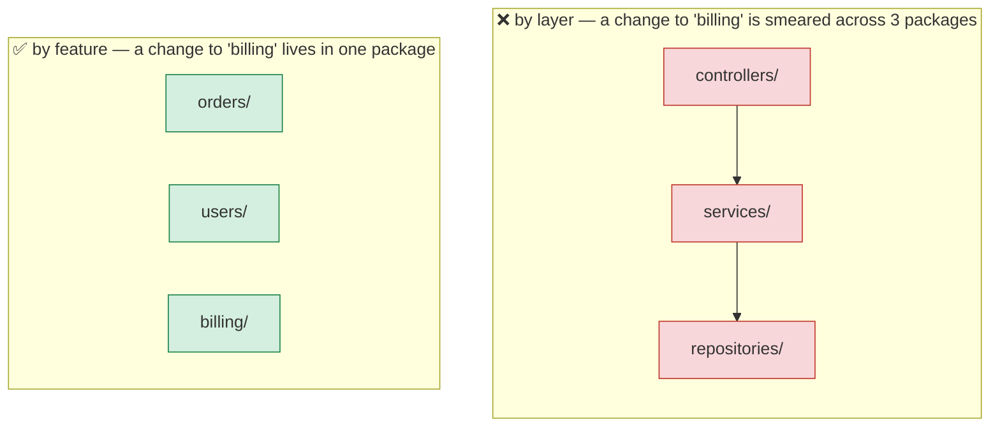
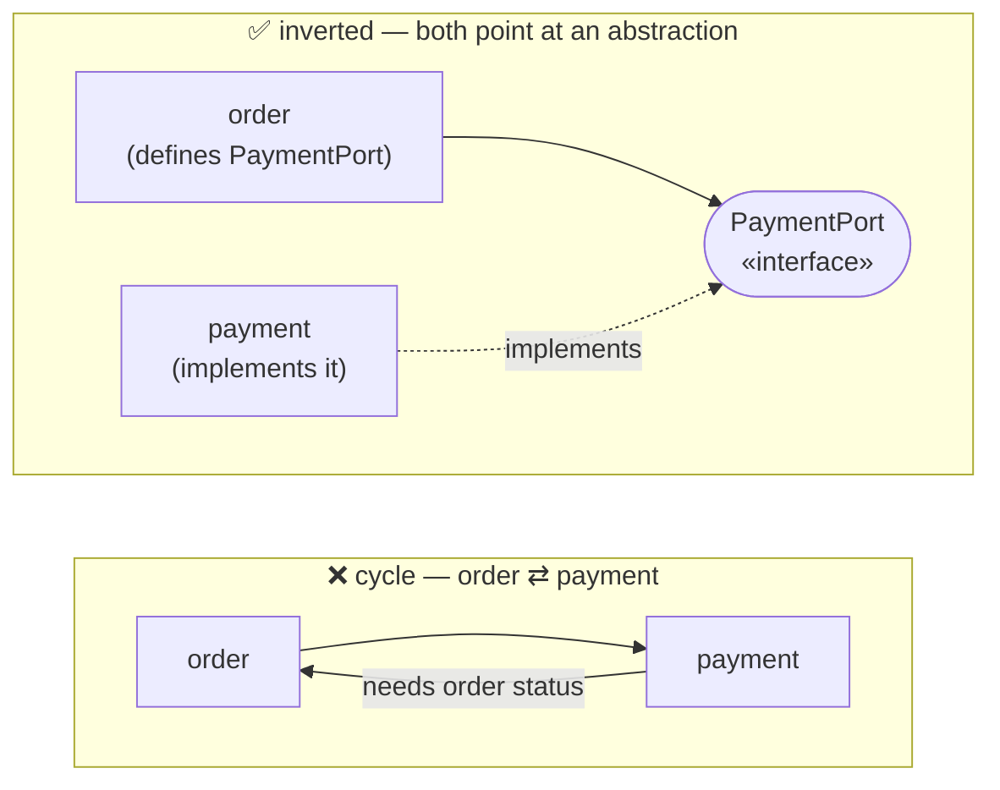
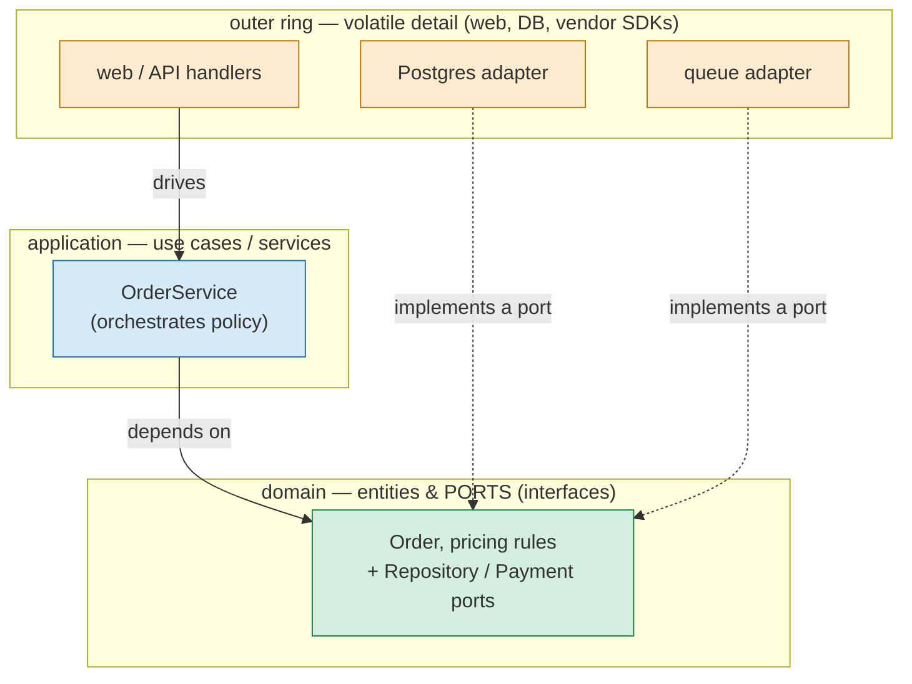

# M04 · Ch2 · §3 — Boundaries Between Modules & Files: dependency direction, layering vs features, and the shape of the graph

> **Module:** Writing Code That Lasts
> **Chapter:** Decomposition
> **Section:** Zooming out from the function to the codebase — how to organize modules/packages,
> which way dependencies should point, package-by-layer vs package-by-feature, keeping the import
> graph acyclic, and dependency inversion. Where §2's *seams* become permanent *module edges*.
> **Status:** ✅ finalized 2026-08-04 (body prepared 2026-07-30). Body went **untouched** — he had no
> questions (as with §2's mechanics: this is software-engineering decomposition doctrine he largely already owns, absorbed
> as reference). This section **closes the core of Ch2 (Decomposition)**: §1 the metric, §2 the moves,
> §3 the boundaries.
> **Prerequisites:** §1 (cohesion, coupling, module depth) and §2 (the refactoring moves + seams).
> This section applies the same cohesion/coupling ideas one level up, where a genuinely new concern
> appears: the *direction and shape* of dependencies between modules.

**Estimated study time:** 2–3 hours including the hands-on graph exercise.

---

## Why this section exists

§1 and §2 lived *inside a file*: make a function cohesive, hide decisions behind a narrow interface,
move state through signatures. This section zooms out to the whole codebase — the level where you
decide what goes in which **file**, which files form a **module/package**, and which packages may
depend on which others.

Here is the crucial thing that changes when you zoom out. Inside a function, "coupling" is a fuzzy
quality. Between modules, coupling becomes a **concrete, directed graph** — module A `import`s module
B, or it doesn't — and that graph has properties you can *see and measure*: Is it acyclic? Which way
do the arrows point? Which nodes does everything depend on? Those properties decide whether the
codebase stays understandable and changeable at scale, or curdles into a "big ball of mud" where
every file transitively needs every other.

So §3 is about the **arrows**, not the boxes. Three questions organize it:

1. **How do I group files into modules/packages** so each has one clear job? (cohesion, one level up)
2. **Which way should the dependencies point** — and why is a *cycle* poison? (the new concern)
3. **How do I keep high-level policy from depending on low-level detail** so the important code stays
   stable while the volatile edges churn? (dependency inversion)

The payoff idea, stated up front:

> A healthy codebase's dependency graph is a **DAG (directed acyclic graph) that points from the volatile toward the stable**:
> details depend on policy, not the reverse. Boundaries go where the arrows want to be few, one-way,
> and crossing a narrow interface — exactly the seams §2 taught you to create.

---

## 1. What a module boundary actually is

<details>
<summary><b>Vocabulary for this section</b> — what a module boundary is in each language named below (click to expand)</summary>

**Abbreviations**

| Short | Stands for | Meaning |
|---|---|---|
| **API** | application programming interface | the set of names a package deliberately offers its callers |
| **JS/TS** | JavaScript / TypeScript | the two languages treated together here; a file is a module in both |

**Terms**

| Term | Definition |
|---|---|
| **Module** | any unit with a public face and a hidden inside; at this scale it is a file or a directory |
| **Package** | a directory-level module — in Python a directory with an `__init__.py`, in Go a directory, in Java a declared `package` |
| **Namespace** | the naming scope a module creates, so `orders.service` cannot collide with `users.service` |
| **Public API** | the names a package exports; what you re-export in `__init__.py` is what callers should import |
| **`__init__.py`** | the file that makes a Python directory a package and defines what it re-exports |
| **Import** | a declaration that this module depends on another — the concrete dependency edge |
| **Dependency edge** | one arrow in the graph: module A imports module B |
| **Package-private** | visible inside the package but not outside it — Java's default access |
| **Capitalization as access modifier** | Go's rule that an exported name starts with a capital letter |
| **`internal/`** | Go's special directory the compiler refuses to let outside packages import — a language-enforced boundary |
| **Barrel file** | a JS/TS `index.ts` that re-exports a directory's contents to define its public surface |
| **Fat barrel** | a barrel that re-exports everything, so the package hides nothing and becomes a hub |
| **Kitchen-sink `__init__.py`** | the Python equivalent of a fat barrel |
| **Deep module** | §1's idea one level up: a small public API in front of many internal files |
| **Hub** | a module that everything else depends on |
| **Contract** | an exported name you will pay to change; un-exported internals are free to churn |

</details>

A **module** is any unit with a public face and a hidden inside — but at this scale it has a
*physical* form (files and directories) and a *logical* form (a namespace and its public API).

- In **Python**, a `.py` file is a module; a directory with an `__init__.py` is a **package**. The
  package's `__init__.py` is its **public API**: what you re-export there is what callers should
  import; everything else is "inside." `import`s *are* the dependency edges.
- In **Java**, a `package` is the unit and `public`/package-private control the face. In **Go**, a
  directory is a package and **capitalization** is the access modifier — plus the special `internal/`
  directory the *compiler* refuses to let outside packages import (a language-enforced boundary). In
  **JS/TS (JavaScript/TypeScript)**, a file is a module and an `index.ts` "barrel" often defines the package's public surface.

The lesson from §1 scales exactly: a good package is **deep** — a small public API (a few exported
names) in front of a large implementation (many internal files). The failure mode also scales: a
package that re-exports *everything* (a fat barrel file, a kitchen-sink `__init__.py`) has an
interface as big as its implementation. It hides nothing, and — worse, as we'll see — it becomes a
hub every other package binds to.

> **Public API at package scale:** decide deliberately what a package exports. The exported names are
> a contract you'll pay to change; the un-exported internals are free to churn. If everything is
> exported, everything is contract, and you've lost the ability to change anything safely.

---

## 2. Grouping files: package-by-layer vs package-by-feature

<details>
<summary><b>Vocabulary for this section</b> — the two packaging strategies and the frameworks that embody them (click to expand)</summary>

**Terms**

| Term | Definition |
|---|---|
| **Package-by-layer** | grouping files by technical role: `controllers/`, `services/`, `repositories/` |
| **Package-by-feature** | grouping files by what changes together — the domain concept: `orders/`, `users/`, `billing/` |
| **Controller** | the code that receives a request and dispatches it |
| **Service** | the code holding the business rules for a feature |
| **Repository** | the code that reads and writes the store for a feature |
| **Logical cohesion** | §1's rung where members are grouped by technical category rather than purpose — what by-layer is |
| **Domain** | the business concepts the system is about, as opposed to the framework it is built on |
| **Change locality** | the decisive test: when you change one feature, how many packages do you touch? |
| **Smear** | one conceptual change spread across several packages |
| **Screaming architecture** | Robert Martin's idea that your top-level directories should announce what the system *does*, not which framework it uses |
| ***PresentationDomainDataLayering*** | Fowler's article setting out when layering genuinely is the right choice |
| **Feature slice** | one vertical package holding all the layers of a single feature |
| **Ruby on Rails** | the framework whose `app/controllers`, `app/models`, `app/views` layout is package-by-layer |
| **Django app** | Django's unit of feature-level packaging, closer to a feature slice |
| **Default versus deliberate choice** | by-feature should be the default; by-layer should be chosen on purpose, not by reflex |

</details>

This is the first big decision and the most common place teams get it wrong. §1 named the trap as
*logical cohesion*; here it takes its full-scale form.

**Package-by-layer** groups files by their *technical role*:

```
src/
  controllers/   order_controller.py   user_controller.py   billing_controller.py
  services/      order_service.py      user_service.py      billing_service.py
  repositories/  order_repo.py         user_repo.py         billing_repo.py
```

**Package-by-feature** groups files by *what changes together* — the domain concept:

```
src/
  orders/    controller.py  service.py  repo.py
  users/     controller.py  service.py  repo.py
  billing/   controller.py  service.py  repo.py
```

<!-- DIAGRAM:START -->


<details>
<summary>Diagram source (Mermaid)</summary>



</details>
<!-- DIAGRAM:END -->

The decisive test is **change locality**: when you add or modify the *billing* feature, how many
packages do you touch? By-layer, you edit a file in *every* layer for one feature — the change is
smeared across the tree, and no directory tells you what the app *does* (the directories scream the
*framework*, not the *domain*). By-feature, the change is contained in `billing/`, and the top-level
tree reads like the product. Robert Martin calls this **screaming architecture**: your top-level
directories should announce "this is a billing system," not "this is a Spring app."

**When layering is still right.** By-layer isn't *always* wrong — Fowler's *PresentationDomainDataLayering*
lays out the real cases: a small app, a team genuinely organized by technical specialty, or a strict
architectural rule you want the directory structure to enforce. The point is that **by-feature should
be the default** and by-layer a deliberate choice, not the reflex. Most real systems do **both**:
features at the top level, and *within* a large feature, a little layering. The rule of thumb:
**"package by feature, layer within a feature only when the feature is big enough to need it."**

Real framework contrast you've likely met: Ruby on **Rails** ships package-by-layer
(`app/controllers`, `app/models`, `app/views`) — famously convenient at small scale, famously smeared
at large scale. Django's *app* concept and most modern service templates push toward feature slices.
Neither is "correct"; they're different bets on where change will concentrate.

---

## 3. The new concern: dependency **direction** and the acyclic rule

<details>
<summary><b>Vocabulary for this section</b> — dependency direction, cycles, and the principle that forbids them (click to expand)</summary>

**Abbreviations**

| Short | Stands for | Meaning |
|---|---|---|
| **ADP** | Acyclic Dependencies Principle | the rule that the package dependency graph must contain no cycles |
| **DAG** | directed acyclic graph | a graph of one-way arrows with no cycle — what a healthy dependency graph is |

**Terms**

| Term | Definition |
|---|---|
| **Directed graph** | nodes joined by one-way arrows; here packages joined by imports |
| **Dependency direction** | which way an import arrow points — A imports B, not the reverse |
| **Acyclic Dependencies Principle** | the package dependency graph must be a DAG: no package may depend, directly or transitively, on itself |
| **Cycle** | A depends on B which depends back on A |
| **Transitive dependency** | a dependency reached through other dependencies: A imports B imports C, so A depends on C |
| **Strongly-connected component** | a set of nodes that can all reach each other — a cycle's true extent, and the real unit you must reason about |
| **Cohesion** | how well a module holds together; inside a cycle it is a lie, because the modules are really one |
| **Seam** | a place to substitute an implementation; a cycle prevents one because no acyclic sub-piece can be pulled out |
| **Independent deployment** | releasing one package or service without releasing the others — impossible across a cycle |
| **Circular import** | Python's concrete symptom of a cycle: `ImportError: cannot import name X` |
| **Deferred / local import** | moving an import inside a function to silence a circular-import error — a workaround that hides the cycle rather than fixing it |
| **Extract the shared thing downward** | the first cycle-breaking move: put what entangles A and B into a third, lower module both depend on |
| **Leaf module** | one that depends on nothing else — the stable bottom of the graph |
| **Move Function / Field** | §2's catalog move, applied here to whole modules |
| **Dependency inversion** | the second cycle-breaking move: define the interface in the high-level module's world and have the low-level one implement it, flipping the arrow |
| **Port** | such an interface, owned by the module that needs the capability |

</details>

Inside a function there are no "cycles." Between modules, the import graph is a **directed graph**,
and its single most important health property is:

> **The Acyclic Dependencies Principle (ADP):** the dependency graph of packages must be a **DAG** —
> no cycles.

A cycle is when `A` depends on `B` which (directly or transitively) depends back on `A`. Why it's
poison — and these are the failure modes, not abstractions:

- **You can't understand one without the whole cluster.** In a cycle, `A`, `B`, `C` are effectively
  *one* module wearing three names. To reason about `A` you must hold `B` and `C` too. Cohesion is a
  lie; the real unit is the whole strongly-connected component.
- **You can't test or reuse one in isolation.** Importing `A` drags in `B` and `C`. The seam you'd
  need (§2) can't exist because there's no acyclic sub-piece to pull out.
- **You can't build or deploy them independently.** At package/library scale, a cycle means two
  "separate" packages must be versioned and released together — they aren't separate.
- **The concrete symptom in Python:** the dreaded `ImportError: cannot import name X (most likely due
  to a circular import)`. That error is not a Python quirk to work around with a local/deferred
  import — it's the language *telling you your dependency graph has a cycle*. The deferred-import
  "fix" hides the smell; the real fix is to break the cycle.

### How to break a cycle

Two moves, in order of preference:

1. **Extract the shared thing downward.** If `A` and `B` both need type `T` (or a helper), and that's
   what entangles them, move `T` into a *third*, lower module `C` that both depend on. `A → C ← B`.
   The cycle is gone and `C` is a stable leaf. (This is *Move Function/Field* from §2, applied to
   modules.)
2. **Invert the dependency with an interface** (next section). When `A` (high-level) needs something
   `B` (low-level) does, but `B` shouldn't be depended on, define the *interface* in `A`'s world and
   have `B` implement it. The import arrow flips.

<!-- DIAGRAM:START -->


<details>
<summary>Diagram source (Mermaid)</summary>



</details>
<!-- DIAGRAM:END -->

---

## 4. Which way should the arrows point? Stability & dependency inversion

<details>
<summary><b>Vocabulary for this section</b> — stability, dependency inversion, and the architectures built on them (click to expand)</summary>

**Abbreviations**

| Short | Stands for | Meaning |
|---|---|---|
| **DIP** | Dependency Inversion Principle | high-level policy must not depend on low-level detail; both depend on an abstraction |
| **SDK** | software development kit | a vendor-supplied library — a typical volatile detail |
| **DAG** | directed acyclic graph | a dependency graph with no cycles; necessary but not sufficient — it can still point the wrong way |

**Terms**

| Term | Definition |
|---|---|
| **Stable module** | one that many things depend on and that itself depends on little, so changing it is expensive and it is kept still |
| **Volatile module** | one that changes often — a UI widget, a vendor SDK, a database adapter |
| **Stable Dependencies Principle** | dependencies should flow from volatile to stable, never the reverse |
| **Dependency Inversion Principle** | high-level policy and low-level detail should both depend on an abstraction owned by the policy side |
| **High-level policy** | the business rules — the important, slow-changing code |
| **Low-level detail** | the mechanisms: a specific database, web framework or vendor client |
| **Abstraction** | the interface both sides agree on, so neither depends on the other directly |
| **Port** | an interface defined by the domain describing a capability it needs (`OrderRepository`, `PaymentPort`) |
| **Adapter** | a low-level module that implements a port for one concrete technology |
| **`Protocol`** | Python's structural interface: a class satisfies it by having the right methods, with no inheritance required |
| **Structural typing** | satisfying an interface by shape rather than by declaring you implement it |
| **Dependency injection** | passing the implementation in from outside rather than constructing it inside — which also creates a seam |
| **Seam** | §2's term: a place where you can substitute an implementation without editing the code there |
| **Hexagonal Architecture** | Alistair Cockburn's architecture in which the domain sits at the centre and all technology plugs in through ports |
| **Ports and Adapters** | the other name for the same architecture, after its two roles |
| **Clean Architecture** | Robert Martin's layered formulation of the same idea |
| **Dependency Rule** | Clean Architecture's rule that source-code dependencies always point inward, toward higher-level policy |
| **Postgres / DynamoDB** | two concrete databases; swapping one for the other is the litmus test that no domain code changes |
| **Litmus test** | §1's check: swap the implementation and count the broken call sites — zero is the goal |

</details>

Acyclic is necessary but not sufficient — a DAG can still point the *wrong way*. Two principles set
the direction.

**Stable Dependencies Principle — depend in the direction of stability.** A module is "stable" if
lots of things depend on it and it depends on little (changing it is expensive, so it's kept still);
"volatile" if it changes often. Dependencies should flow **from volatile to stable**: the things that
change often may depend on the things that rarely change, *never the reverse*. If a stable, widely-used
core module imports a volatile detail (a specific UI widget, a vendor SDK — software development kit), then every change to that
volatile detail threatens the core — you've wired the whole system to the most fickle part of it.

**Dependency Inversion Principle (DIP) — high-level policy must not depend on low-level detail; both
depend on an abstraction.** This is the one that feels backwards the first time and then reorganizes
how you see every system. The naive arrow points the wrong way:

```python
# ❌ business logic imports the detail — the important code depends on the fickle code
from infra.postgres import PostgresClient          # order_service now knows about Postgres
class OrderService:
    def __init__(self): self.db = PostgresClient()  # and constructs it — no seam either (§2)
```

Invert it: the high-level module *owns the interface it needs*; the low-level module *implements* it.

```python
# ✅ domain defines the port; infra depends on the domain, not vice versa
# domain/ports.py  (stable, high-level)
class OrderRepository(Protocol):
    def save(self, order: Order) -> None: ...
    def get(self, id: str) -> Order | None: ...

# domain/order_service.py     depends only on the Protocol above
class OrderService:
    def __init__(self, repo: OrderRepository): self.repo = repo   # injected (a seam!)

# infra/postgres_repo.py  (volatile, low-level) — imports domain, implements the port
class PostgresOrderRepository:      # structurally satisfies OrderRepository
    def save(self, order): ...
```

Now the import arrow runs `infra → domain`: the volatile database adapter depends on the stable
business policy, not the reverse. Swap Postgres for DynamoDB, or a fake for tests, and **no domain
code changes** — the litmus test from §1 §7 (swap the implementation, count the broken call sites:
zero). This is the backbone of **Hexagonal Architecture / Ports & Adapters** (Cockburn) and Clean
Architecture's **Dependency Rule**: *source-code dependencies always point inward, toward
higher-level policy; the domain at the center depends on nothing outward.*

<!-- DIAGRAM:START -->


<details>
<summary>Diagram source (Mermaid)</summary>



</details>
<!-- DIAGRAM:END -->

*Every arrow points inward toward the domain. The database and web layers — the parts that change
most and that you'd never want your business rules to hinge on — sit on the outside and plug in
through ports. The center depends on nothing external, so it's the most stable and the most testable.*

---

## 5. Seams become module edges (the §2 callback)

<details>
<summary><b>Vocabulary for this section</b> — the one idea that unites testability, direction and depth (click to expand)</summary>

**Terms**

| Term | Definition |
|---|---|
| **Seam** | Feathers' term from §2: a place where you can change behaviour without editing the code at that place |
| **Test double** | a stand-in for a real dependency in a test — a fake, stub or mock |
| **Port** | an interface the high-level module defines for a capability it needs |
| **Protocol** | the Python form of such an interface, satisfied by having the right methods |
| **Module edge** | a permanent boundary between two packages, where the import arrow crosses |
| **Narrow interface** | a small set of names the arrow must cross through — what makes the boundary cheap |
| **Depth** | §1's measure: how much a module hides behind how small an interface |
| **Design decision** | what a boundary exists to hide — the storage choice, the protocol, the policy |
| **Substitutability** | the ability to swap one implementation for another without changing callers |
| **Well-architected** | here, the claim that the testable place and the correctly-bounded place are the same place |

</details>

In §2 you created a **seam** — a place to substitute a test double — usually by passing a dependency
in as a parameter instead of constructing it internally. Now zoom out: **a well-placed port is a seam
that has become a permanent module boundary.** The `OrderRepository` protocol above is exactly the
seam that made `OrderService` testable *and* the edge between the `domain` and `infra` packages. This
is the deep unity of the chapter:

> The place where you can *substitute* an implementation (testability, §2), the place where the
> *dependency arrow crosses a narrow interface* (this section), and the place where a *design decision
> is hidden* (depth, §1) are **the same place**. Good architecture is putting the boundary there once
> and letting it serve all three.

That's why "make it testable" and "make it well-architected" are not two chores — establishing the
seam is the same act as drawing the module edge in the right spot.

---

## 6. Failure modes at the codebase scale

<details>
<summary><b>Vocabulary for this section</b> — the codebase-scale failure modes, by name (click to expand)</summary>

**Abbreviations**

| Short | Stands for | Meaning |
|---|---|---|
| **JS/TS** | JavaScript / TypeScript | where a fat barrel also breaks tree-shaking |

**Terms**

| Term | Definition |
|---|---|
| **Junk-drawer package** | a `utils` / `common` / `helpers` package that everything imports and nothing defines — logical cohesion at package scale |
| **Logical cohesion** | §1's rung where members are grouped by technical category rather than purpose |
| **Maximally-unstable hub** | a package everything depends on, so any change to it risks the whole system |
| **Leaf package** | a small, named, stable package that depends on nothing (`money`, `time`, `ids`) — the right home for genuinely shared primitives |
| **Fat barrel** | an `index.ts` or `__init__.py` that re-exports a whole subtree, making the package shallow and coupling every importer to every internal |
| **Tree-shaking** | a bundler's removal of unused code; a fat barrel defeats it by making everything look used |
| **Import cycle** | two modules that import each other, directly or transitively |
| **Public surface** | the deliberately-chosen set of exported names |
| **Big ball of mud** | a codebase with no discernible boundaries and a dense, cyclic import graph |
| **Accretion** | §1's point that complexity arrives one convenient cross-import at a time, not in one bad decision |
| **Distributed monolith** | services split physically but with a cyclic runtime dependency graph, so you pay distribution's costs and keep coupling's |
| **Microservices** | an architecture of small, independently-deployed services |
| **Runtime dependency graph** | which service calls which at run time, as opposed to which module imports which |
| **Partial failure** | one service being down or slow while the others are up — a cost you take on by distributing |
| **Shotgun surgery** | one conceptual change forcing edits in many packages — the sign your boundaries cut across the grain of change |
| **Grain of change** | the axis along which the system actually changes; boundaries should follow it |

</details>

The far-wall failure modes of §1 have architecture-scale cousins. Recognize them by name:

- **The `utils` / `common` / `helpers` junk-drawer package.** Logical cohesion (§1) at package scale:
  a grab-bag everything imports. It becomes a maximally-unstable hub that *everything* depends on, so
  every change to it risks the whole system, and it grows without bound because there's no principle
  for what belongs. Fix: most "utils" want to move *into the feature that uses them*; genuinely shared
  primitives go in small, named, stable leaf packages (`money`, `time`, `ids`), never one blob.
- **The fat barrel / kitchen-sink `__init__.py`.** Re-exporting the whole subtree makes the package
  shallow *and* couples every importer to every internal — and in JS/TS it wrecks tree-shaking and
  creates import cycles. Export the deliberate public surface only.
- **The big ball of mud.** No discernible boundaries; the import graph is a dense mesh with cycles.
  The end state of never deciding where the arrows go. It's not one bad decision — it's the accretion
  §1 warned about, one convenient cross-import at a time.
- **The distributed monolith.** The worst outcome of premature microservices (§2's Segment/Prime
  Video callback): services split physically but with a **cyclic runtime dependency graph** — service
  A calls B calls C calls A. You pay every cost of distribution (network, partial failure, ops) *and*
  keep every cost of coupling (can't deploy one without the others). A cycle in the module graph is
  bad; a cycle in the *service* graph is catastrophic.
- **Shotgun surgery.** The symptom of boundaries drawn on the wrong axis: one conceptual change forces
  edits in many packages (the by-layer smear). If a routine change keeps touching five packages, your
  boundaries are cutting across the grain of how the system actually changes.

---

## 7. A note for the AI-agent workflow

<details>
<summary><b>Vocabulary for this section</b> — the agent-workflow terms and the enforcement tooling named below (click to expand)</summary>

**Abbreviations**

| Short | Stands for | Meaning |
|---|---|---|
| **AI** | artificial intelligence | here, a coding agent that reads and edits the repository |
| **API** | application programming interface | a package's exported surface |
| **CI** | continuous integration | the automated build-and-check pipeline that runs on every change |

**Terms**

| Term | Definition |
|---|---|
| **Context** | the code an agent must load to reason about a change; bounded modules keep it small |
| **Transitive closure** | everything reachable by following dependencies — what an agent must pull in when boundaries are bad |
| **Token-efficient** | costing little context to work inside; a property of deep modules with small public APIs |
| **Port** | an interface a module depends on instead of a concrete implementation |
| **Strongly-connected import cluster** | a group of modules that all reach each other — a cycle, which forces whole-cluster loading |
| **Reviewable diff** | a change small and focused enough that a human can check it |
| **Architectural invariant** | a rule that must always hold, such as "`domain/` must not import `infra/`" |
| **Project instructions file** | `CLAUDE.md`, `.cursor/rules` or `AGENTS.md` — where you write such a rule for the agent to follow |
| **Lint rule** | an automated check that fails when a rule is violated |
| **import-linter** | a Python tool that enforces declared contracts about which packages may import which |
| **`eslint-plugin-boundaries`** | the equivalent ESLint plugin for JavaScript/TypeScript projects |
| **ArchUnit** | the equivalent architecture-rule test library for Java |
| **Governance surface** | a place where a design decision can be written down and mechanically enforced |

</details>

The dependency graph isn't only a human-comprehension tool — it's also **the thing an AI agent must
traverse to work in your codebase**, and the same properties help or hurt it:

- **Good boundaries shrink the agent's context.** To change a well-bounded `billing/` package behind a
  narrow port, an agent needs to load `billing/` and one interface — not the transitive closure of the
  repo. Deep modules with small public APIs are *token-efficient* context boundaries.
- **Cycles blow up an agent's context exactly as they blow up yours.** A strongly-connected import
  cluster forces the agent (like a human) to pull the whole cluster in to reason about any part — more
  context, more chances to change the wrong thing, bigger and less reviewable diffs.
- **The architecture layer is where you *encode boundary rules for the agent* to follow** — consistent
  with keeping the doctrine in project instructions (§2 §10): a `CLAUDE.md` / `.cursor/rules` /
  `AGENTS.md` line like *"domain/ must not import infra/; add capabilities via a port"* turns an
  architectural invariant into something the agent respects by default, and a lint rule
  (import-linter, `eslint-plugin-boundaries`, ArchUnit) turns it into something the CI *enforces*.
  Good module boundaries are both a design property and a governance surface.

---

## 8. Check your understanding

1. A teammate proposes reorganizing `src/` from `orders/ users/ billing/` into `controllers/ services/
   repositories/` "so all the services are in one place." What do you predict happens to the cost of
   adding a new *feature*, and what's the name for the smell they're introducing?
2. Python throws `ImportError: cannot import name … (most likely due to a circular import)` between
   `order.py` and `payment.py`. Give the two structural fixes (not the deferred-import workaround) and
   say which §2 move each corresponds to.
3. Your `domain/pricing.py` has `from infra.stripe_client import StripeClient` at the top. Which
   principle does this violate, which way should the arrow point instead, and what concretely do you
   add to invert it?
4. Why is a `common/utils.py` that half the codebase imports a *stability* problem, not just an
   aesthetic one?
5. What single property makes "a seam for testing" (§2), "a module boundary" (§3), and "a hidden
   design decision" (§1) turn out to be the same place in a well-designed system?

<details>
<summary>Answers</summary>

1. Adding a feature now requires editing a file in **every** layer package (`controllers/` +
   `services/` + `repositories/`), so change-locality gets *worse* and you'll see **shotgun surgery**;
   the reorganization is **package-by-layer**, whose smell is **logical cohesion** at package scale
   (the directories describe technical role, not what the app does). By-feature keeps a feature change
   in one package.
2. **(a)** Extract the shared thing (the type/constant/helper that both need) into a *third, lower*
   module both import — `order → shared ← payment` — which is **Move Function/Field**. **(b)** Invert
   with an interface: define the port in the higher-level module and have the other implement it,
   flipping one arrow — which is the dependency-inversion form of **Extract Function / introduce a
   seam**. Either turns the cycle into a DAG; deferring the import only hides it.
3. It violates the **Dependency Inversion Principle** (and Stable Dependencies — stable policy
   depending on a volatile vendor detail). The arrow should point **`infra → domain`**. Concretely:
   define a `PaymentGateway` interface/`Protocol` in `domain/`, have `pricing`/services depend on
   *that*, put `StripeClient` in `infra/` and make it implement the interface, and **inject** the
   implementation at the edge — so swapping Stripe touches zero domain code.
4. Because *everything depends on it*, it is a maximally **stable-position** module by dependency
   count — yet its *content* is a volatile grab-bag that changes constantly. That's the exact
   inversion the Stable Dependencies Principle forbids: a high-fan-in hub that is also high-churn means
   **every change to it can break the whole system**, and there's no cohesion principle to stop it
   growing. It's a structural risk, not a naming nitpick.
5. It is the place where the **interface is much narrower than the implementation** — a narrow,
   substitutable contract. That narrowness is simultaneously what lets you swap in a test double
   (seam), what lets the dependency arrow cross cleanly and one-way (boundary), and what hides the
   decision behind it (depth). One well-placed narrow interface buys all three at once.

</details>

---

## 9. Optional: get your hands dirty (30–45 min) — draw your import graph

The diagnostic skill at this scale is *seeing the graph*. Pick a real project (yours or an
open-source one) and make its dependencies visible.

1. **Generate the module dependency graph.** Python: `pydeps yourpackage --max-bacon 2` (renders an
   SVG), or `import-linter` with contracts, or `pipdeptree` for third-party deps. JS/TS:
   `madge --circular src/` (it *specifically* lists cycles). Java: ArchUnit / jdepend. Even a quick
   `grep -rn "^import\|^from" src/` and a hand-drawn sketch works.
2. **Find the cycles.** `madge --circular` or `import-linter` will name them outright. For each cycle,
   identify the shared thing that entangles the members.
3. **Find the hubs.** Which module has the highest fan-in (most things import it)? Is it *stable*
   (a leaf type/interface — fine) or a *volatile junk-drawer* (`utils`, `common` — a smell)?
4. **Find one inversion opportunity.** Where does a high-level/policy module import a low-level detail
   (a DB client, an HTTP SDK, a framework class) directly? Sketch the port that would flip that arrow.
5. **Pick the one boundary you'd draw or move first**, and say which of §6's failure modes it fixes.

Deliverable: the graph picture + a one-line note per cycle/hub/inversion. That map is what a
real refactor toward clean boundaries (using §2's moves) executes against.

---

## Key terms (English · 大陆 简体 · 台灣 繁體)

| English | 大陆 (简体) | 台灣 (繁體) | Note |
|---|---|---|---|
| Module | 模块 | 模組 | ⚠ genuine split: 模块 (mainland) ↔ 模組 (Taiwan) |
| Package | 包 | 套件 | ⚠ genuine split: 包 (mainland) ↔ 套件 (Taiwan) |
| Interface | 接口 | 介面 | ⚠ genuine split: 接口 (mainland) ↔ 介面 (Taiwan) |
| Dependency | 依赖 | 相依 / 相依性 | ⚠ 依赖 ↔ 相依 |
| Circular / cyclic dependency | 循环依赖 | 循環相依 | the cycle to forbid (ADP) |
| Directed acyclic graph (DAG) | 有向无环图 | 有向無環圖 | ⚠ 无环 vs 無環 script only |
| Layer | 层 | 層 | script only |
| Coupling / Cohesion | 耦合 / 内聚 | 耦合 / 內聚 | from §1 |
| Dependency inversion | 依赖倒置 | 相依反轉 | ⚠ 倒置 ↔ 反轉 |
| Abstraction | 抽象 | 抽象 | same |
| Refactoring | 重构 | 重構 | script only (from §2) |

---

## References

- Robert C. Martin, *Clean Architecture* — the Dependency Rule, ADP/SDP/SAP package principles,
  Screaming Architecture. Summary of the package principles:
  <https://en.wikipedia.org/wiki/Package_principles>
- Alistair Cockburn, *Hexagonal Architecture (Ports and Adapters)* —
  <https://alistair.cockburn.us/hexagonal-architecture/>
- Martin Fowler, *PresentationDomainDataLayering* (layer vs feature; when layering earns its place) —
  <https://martinfowler.com/bliki/PresentationDomainDataLayering.html>
- Robert C. Martin, *Screaming Architecture* —
  <https://blog.cleancoder.com/uncle-bob/2011/09/30/Screaming-Architecture.html>
- *Dependency Inversion Principle* (the "D" in SOLID — Single-responsibility, Open-closed, Liskov, Interface-segregation, Dependency-inversion) —
  <https://en.wikipedia.org/wiki/Dependency_inversion_principle>
- Python packaging: the import system & `__init__.py` public API —
  <https://docs.python.org/3/reference/import.html>
- Tooling: `import-linter` (Python architecture contracts) <https://import-linter.readthedocs.io/> ·
  `madge --circular` (JS/TS — TypeScript — cycle detection) <https://github.com/pahen/madge> ·
  `pydeps` (Python import graphs) <https://github.com/thebjorn/pydeps>

### What's next

This closes the core of **Ch2 (Decomposition)**: §1 the metric, §2 the moves, §3 the boundaries.
Natural continuations:
- **Ch3 — Design patterns you'll actually meet** (strategy, factory, adapter, dependency injection) —
  several of which are the *named shapes* of what §3 did by hand (the port/adapter you built here **is**
  the Adapter + DI patterns; inverting a cycle with an interface **is** DIP).
- Or cash the new testability angle in **M06 (Testing)** — seams and ports are what make the test
  pyramid buildable.
- Or rotate scope: **M01 Ch5** (OS landscape), **M02** (networking), or the AI thread (**M13** RAG [retrieval-augmented generation],
  which reuses the projector/adapter framing from M12 Ch2 §4).
