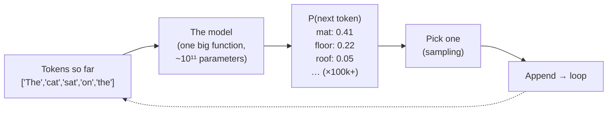
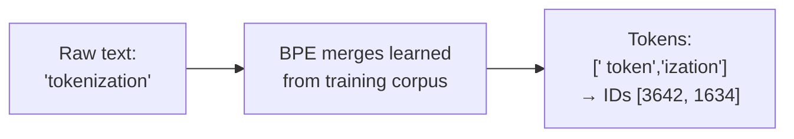
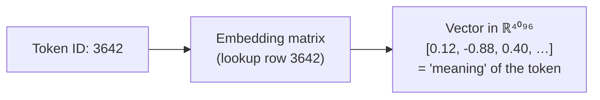
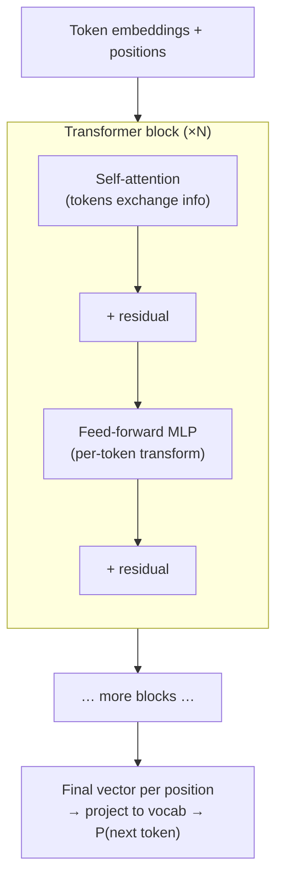
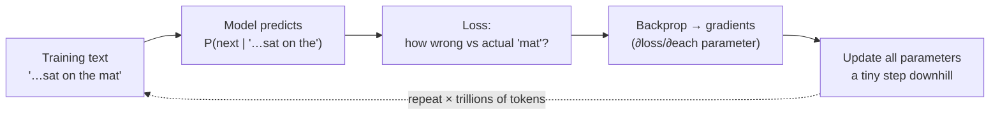
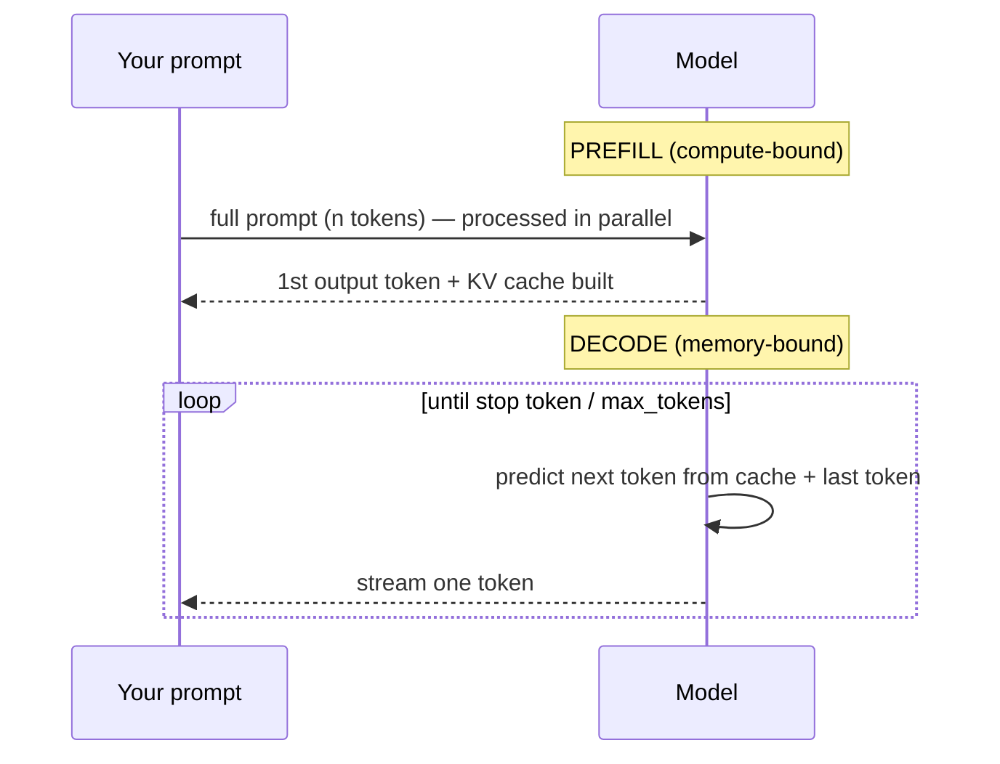
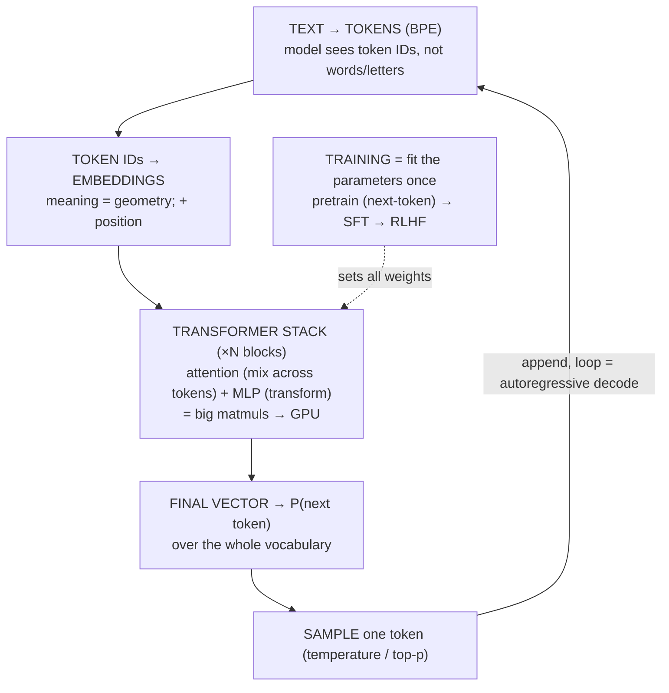

# M12 · Ch1 · §1 — How Modern Models Work: Tokens, Transformers, Training vs Inference

> **Module:** The Model Landscape
> **Chapter:** How modern models work (conceptually)
> **Section:** The end-to-end mental model — what an LLM *is*, how text becomes tokens becomes vectors,
> what the transformer actually computes, and how training differs from the inference you call every day.
> **Status:** 🔵 draft 2026-06-10 — opens the AI thread in Phase 1. Concept-first; no math you don't
> need. We'll Q&A, then finalize to fit how you actually think.

**Estimated study time:** 2.5–3 hours including reflection.
**Prerequisites:** none formal. But you arrive with strong tailwind: M01 Ch1 §3 (the datapath, SIMD,
GPU memory hierarchy) and your GPU-energy reading (arithmetic intensity, memory-bound vs compute-bound)
are *exactly* the lens that makes this section click. We'll lean on them.

---

## Why this section exists (for *you*)

You build with LLMs every day — multi-provider routing, structured JSON, guardrails, a framework-less
graph-lite pipeline. You are an expert *user* of the model as a black box. This section opens the box.

Not to make you train models — that's not your goal. The point is **judgment**: once you know what a
token actually is, why a context window has a hard wall, why the first token is slow but the rest are
fast, why decode is memory-bound (you already met this from the GPU side), and what "temperature" is
really doing — you stop guessing about reliability, latency, and cost, and start *reasoning* about them.
Every knob in your pipeline (max tokens, temperature, prompt caching, model choice) maps to a mechanism
in here.

The physics framing that should resonate: an LLM is one enormous **function** `f(x) → y` with ~10¹¹
learned parameters. Training is **fitting the function** to data (an optimization problem). Inference is
**evaluating the function** — repeatedly, one token at a time. Everything below is detail on the shape
of that function and the two regimes in which you meet it.

By the end you'll have a clean mental model of:
- what a token is, and why "tokens not words" explains half the weird LLM behavior you've seen
- how a token becomes a vector, and why "embedding" means *geometry of meaning*
- what the transformer block actually computes — attention as the one idea, in your matmul/GPU terms
- training (fitting) vs inference (evaluating), and why the autoregressive loop has the latency profile
  you've measured

---

## 1. The one-sentence model: next-token prediction

Strip away the mystique and a modern LLM does exactly one thing:

> **Given a sequence of tokens, output a probability distribution over what the next token will be.**

That's it. `f(tokens so far) → P(next token)`. The model is a function from a sequence to a vector of
probabilities, one entry per possible token (~100k–200k entries — the *vocabulary*).

Everything you experience — answering questions, writing code, translating Bahasa Indonesia — is this
single operation run in a loop: predict next token, append it, predict again. The "intelligence" is an
emergent property of doing this *extremely* well, having been fit to a large fraction of human text.

Hold onto this. Tokens (§2) are the inputs and outputs. Embeddings (§3) are how the function reads them.
The transformer (§4) is the function's internals. Training (§5) is how the function got its parameters.
Inference (§6) is the loop you call in production.

---

## 2. Tokens — the atoms the model actually sees

The model does **not** see characters, and it does **not** see words. It sees **tokens**: chunks of
text from a fixed vocabulary, typically learned by an algorithm called **Byte-Pair Encoding (BPE)**.

### What BPE does (conceptually)

Start with raw bytes. Repeatedly find the most frequent adjacent pair and merge it into a new symbol.
Do this tens of thousands of times. You end up with a vocabulary where common words are a single token
(`" the"`, `" model"`), rare words split into pieces (`" tokeniz"` + `"ation"`), and arbitrary
strings fall back to bytes. Common text → few tokens; rare text → many.

A rough rule of thumb for English: **~4 characters ≈ 1 token**, **~0.75 words ≈ 1 token**. So 1,000
tokens ≈ 750 English words.

### Why "tokens not words" explains so much weird behavior

This is the payoff — almost every LLM quirk you've hit traces back to tokenization:

- **"How many r's in strawberry?"** The model never sees letters — it sees the token(s) for
  `strawberry`. Counting characters inside an opaque token is genuinely hard for it. Not a reasoning
  failure; a *representation* limitation.
- **Non-English costs more.** BPE vocabularies are trained mostly on English-heavy corpora. Bahasa
  Indonesia, Thai, or Tamil text fragments into *many more* tokens per sentence — sometimes per byte.
  **Directly relevant to your SEA-LION / multilingual work:** the same sentence in English vs a
  low-resource SEA language can cost 2–4× the tokens → more latency, more money, and it eats your
  context window faster. This is *the* reason SEA-focused models invest in better multilingual
  tokenizers.
- **The context window is measured in tokens, not characters.** A "200k context" model means 200k
  tokens. How much *text* that is depends entirely on the language and content (code, with its many
  symbols, tokenizes differently from prose).
- **Cost and rate limits are per-token.** Your bill and your throughput ceiling are both token-counted —
  input tokens + output tokens.
- **Whitespace and formatting are tokens too.** Leading spaces are part of tokens (`"the"` vs `" the"`
  are different IDs). This is why prompt formatting can subtly change behavior.

> **Practical move for your pipeline:** when you reason about cost/latency/context, count *tokens*, not
> words or characters — and remember the count depends on the language. Provider tokenizer tools (or a
> local BPE tokenizer) let you measure exactly.

---

## 3. Embeddings — turning a token ID into geometry

A token ID like `3642` is just an index — it carries no meaning. The model's first move is to look it
up in a giant table called the **embedding matrix**: `vocab_size × d_model` (e.g. 100k × 4096). Each row
is a learned **vector** — a point in a high-dimensional space (`d_model` ≈ a few thousand dimensions).

That vector *is* the model's representation of the token's meaning. The key idea:

> **Meaning is geometry.** Tokens with similar meaning end up as nearby vectors; relationships between
> meanings show up as consistent *directions* in the space.

The classic illustration: `king − man + woman ≈ queen`. Directions encode concepts (gender, plurality,
tense). The model learns this geometry during training; nobody hand-assigns it.

Two things to file away:

1. **Position has to be added in.** The raw transformer is *order-blind* — it would treat
   "dog bites man" and "man bites dog" identically. So **positional information** is injected (modern
   models use schemes like RoPE — rotary position embeddings). You don't need the mechanism now; just
   know that "where a token sits in the sequence" is encoded alongside "what the token means."
2. **The same idea powers RAG.** Embedding models (a sibling architecture — M12 Ch2) turn a whole
   sentence/document into one vector so you can find semantically-similar text by *vector distance*.
   That's the engine under retrieval / vector DBs. The "meaning is geometry" intuition here is the same
   one you'll use in M13 Ch2 (RAG). The LLM's internal token embeddings and a standalone embedding model
   are cousins, not the same thing — but they share this core idea.

---

## 4. The transformer — one idea: attention

Between the input embeddings and the output probabilities sit a stack of identical **transformer
blocks** (GPT-style models are dozens to ~100 of these). Picture a **residual stream**: a running set of
vectors (one per token position) that flows up through the stack, and each block *reads from it, computes
something, and writes its result back*. Two sub-layers per block:

1. **Self-attention** — the one genuinely new idea. It lets each token *look at* other tokens and pull
   in relevant information. "It" looks back to find what noun it refers to; a closing bracket looks back
   to its opener; a translated word looks at the source phrase.
2. **A feed-forward network (MLP)** — a per-token mini neural net that does the "thinking"/transformation
   on the now context-enriched vector. This is where most parameters live.

### Attention in your terms: it's matmuls (Q, K, V)

Here's the mechanism without the math fog — and in the vocabulary you already own from the GPU reading.
Each token produces three vectors by multiplying its current vector against learned weight matrices:

- **Query (Q)** — "what am I looking for?"
- **Key (K)** — "what do I offer / what am I about?"
- **Value (V)** — "the information I'll hand over if attended to."

Each token's Query is compared (dot product) against *every* token's Key → a grid of relevance scores.
Softmax turns each row into weights that sum to 1. Then each token's output is the weighted sum of all
**Values**. So a token literally builds its new representation as a *weighted blend of the other tokens'
information*, where the weights are learned relevance.

Mechanically, this is **big matrix multiplications**: `Q·Kᵀ` (an `n × n` score matrix for `n` tokens),
softmax, then `scores·V`. This is why:

- **It runs on GPUs.** It's dense matmul — exactly the SIMD/tensor-core workload from M01 Ch1 §3.
- **It scales as O(n²) in sequence length.** The `n × n` score matrix is why doubling context can
  quadruple attention cost — and why long context is expensive.
- **FlashAttention exists.** Recall your reading: attention is **memory-bound** because that `n × n`
  matrix is huge and you'd waste energy/time shuttling it to and from HBM. FlashAttention computes it in
  tiles inside on-chip Shared Memory (your "software-managed scratchpad" from §3) so it never
  materializes the full matrix in DRAM. You met this from the hardware side; now you see *what* it's
  optimizing — the attention score matrix.

**Multi-head attention:** do this several times in parallel with different learned Q/K/V projections, so
different "heads" specialize (one tracks syntax, one tracks coreference, etc.), then concatenate.

> **The whole tower, in one line:** stack ~`N` blocks, each = (attention: mix info across tokens) +
> (MLP: transform each token). Out the top comes one vector per position; the last position's vector,
> projected through the vocabulary, *is* `P(next token)`.

---

## 5. Training — fitting the function (and why you don't do it)

Training is where the ~10¹¹ parameters (all those weight matrices) get their values. Three stages in a
modern chat model:

### Stage 1 — Pretraining (the expensive one)

Take a huge corpus (much of the public web, books, code). The task is dead simple: **predict the next
token**. Show the model "The cat sat on the ___", it predicts a distribution, you compare to the actual
next token (`mat`), and the gap is the **loss** (cross-entropy). Then **backpropagation + gradient
descent** nudge every parameter slightly to make the right token more likely next time. Repeat over
*trillions* of tokens.

This is the costly, energy-hungry phase — weeks to months on thousands of GPUs. (Your energy reading
applies at industrial scale here: training is overwhelmingly **compute-bound** matmul, the *most*
energy-efficient regime per FLOP — but there are an astronomical number of FLOPs.) **You will essentially
never do this.** It's the model provider's job.

A token of intuition on **scaling laws**: empirically, loss falls predictably as you grow parameters,
data, and compute together. That predictability is *why* providers keep building bigger models —
capability gains are forecastable from the curves.

### Stage 2 — Supervised fine-tuning (SFT)

A pretrained model is a brilliant autocomplete but not a helpful assistant. SFT continues training on
curated `(instruction, good response)` pairs so it learns the *format* of being helpful — following
instructions, answering rather than continuing.

### Stage 3 — Preference alignment (RLHF / RLAIF / DPO)

Humans (or another AI) rank candidate responses; the model is tuned to prefer the better ones. This is
where "helpful, harmless, honest" behavior and tone come from. (Constitutional AI is Anthropic's
variant — relevant when you reason about *why* Claude refuses or hedges.)

> **Where *you* touch training:** almost never pretraining; occasionally light fine-tuning or, far more
> commonly, you get the same effect without training at all via **prompting, structured output, and RAG**
> (M13). Knowing the three stages tells you *which problems fine-tuning even can solve* (format/style/
> domain tone) vs which it can't (giving the model facts it never saw — that's RAG's job).

---

## 6. Inference — evaluating the function, one token at a time

This is the regime you actually live in. Inference is **autoregressive**: predict one token, append it,
feed the whole sequence back in, predict the next. A loop.

This split is the key to every latency number you've ever seen:

### Prefill vs decode — the two phases (this connects straight to your GPU reading)

- **Prefill** processes your entire prompt *in parallel* (all `n` tokens at once → big matmuls →
  **compute-bound**, efficient). This is the "time to first token." Long prompts → longer prefill.
- **Decode** generates output tokens *one at a time* — each step is a tiny matmul (one token) against the
  enormous weights. You move gigabytes of weights from HBM to produce *one* token: **memory-bound**, the
  wasteful regime you flagged in your reading. This is why output tokens dominate latency and why
  per-token speed is bounded by memory bandwidth, not FLOPs.

### The KV cache — why you don't recompute the whole sequence

Naively, each decode step would re-run attention over the entire growing sequence (O(n²) again). Instead,
the **Keys and Values** for all previous tokens are *cached* in GPU memory and reused; each new token only
computes its own Q/K/V and attends to the cache. This is the trick that makes decode feasible — and it's
why long conversations consume more GPU **memory** (the KV cache grows with sequence length) and why
**prompt caching** (reusing prefill work across calls — a real cost lever in your pipeline) is even
possible.

### Sampling — what "temperature" actually does

The model outputs *probabilities*; you still must *pick* a token. That choice is sampling:

- **Greedy / temperature 0** — always take the highest-probability token. Deterministic-ish, focused.
  **Use this for your structured-JSON and extraction steps** where you want reliability.
- **Temperature > 0** — flatten (high T) or sharpen (low T) the distribution before sampling, trading
  determinism for diversity/creativity. High T = more surprising, more error-prone.
- **top-p / top-k** — only sample from the most probable tokens (the nucleus / top-k), cutting off the
  long tail of nonsense while still allowing variety.

> This is the mechanistic answer to a question your pipeline lives and dies by: *"why is the model
> non-deterministic, and how do I make it reliable?"* Lower temperature, constrain with top-p, and
> remember that even at T=0 you're not guaranteed bit-identical output across runs (floating-point
> non-associativity + batching on the provider side). Eval (M15) exists precisely because of this.

---

## 7. The whole picture on one page

**The seven things to carry:**
1. An LLM is **one function** that does **next-token prediction**; chat is that loop run fast and well.
2. The model sees **tokens (BPE)**, not words or letters — this explains spelling/counting failures,
   the per-token cost/limits, and why **multilingual (SEA) text costs more tokens**.
3. **Embedding = meaning as geometry**; the same idea underpins RAG/vector search.
4. The transformer's one idea is **attention** (Q·Kᵀ → softmax → ·V) — **dense matmul**, O(n²) in length,
   which is exactly what **FlashAttention** optimizes.
5. **Training = fitting** (pretrain → SFT → RLHF), expensive, the provider's job; **inference = evaluating**,
   your job.
6. Inference splits into **prefill (compute-bound, time-to-first-token)** and **decode (memory-bound,
   per-token speed)** — your GPU-energy reading, applied.
7. **Sampling** (temperature/top-p) is *the* reliability/creativity knob; the **KV cache** + **prompt
   caching** are *the* cost/latency levers.

---

## 8. Check your understanding

Jot a one-line answer to each before our Q&A:

1. Your SEA-LION pipeline processes a paragraph of Bahasa Indonesia and the "same" paragraph in English.
   Which costs more, and *why* — in terms of the mechanism in §2?
2. A user asks the model to count the letters in a word and it gets it wrong. Is this a reasoning failure?
   Explain in terms of what the model actually sees.
3. You measure: time-to-first-token grows with prompt length, but per-output-token speed is roughly
   constant regardless of prompt length. Map each observation to prefill vs decode, and to compute-bound
   vs memory-bound.
4. You want a step in your pipeline to emit reliable, repeatable JSON. What sampling setting do you reach
   for, and what does it do to the probability distribution? Why is "perfectly deterministic" still not
   guaranteed?
5. (Stretch) Attention is O(n²) in sequence length. Given that, explain *two* distinct costs of doubling
   the context length — one in compute and one in GPU memory (hint: the KV cache).
6. (Stretch) Your colleague says "let's fine-tune the model so it knows our internal API docs." Using the
   three training stages, argue why RAG is probably the right tool instead of fine-tuning.

---

## 9. Optional: get your hands dirty (20 min)

You don't train anything — you *observe* the mechanisms.

**Part A — see tokenization (5 min).** Paste English and a SEA-language sentence into a tokenizer
visualizer (e.g. the OpenAI tokenizer page, or run `tiktoken` locally). Compare the token counts for
roughly equal *meaning*. Measure the multilingual penalty you read about in §2 with your own text.

**Part B — feel temperature (10 min).** Call any model you use, same prompt, once at `temperature=0` and
several times at `temperature=1.0`. Observe determinism vs diversity. Then ask for strict JSON at each
and note which you'd trust in a pipeline.

**Part C — feel prefill vs decode (5 min).** Send a short prompt asking for a long answer, then a very
long prompt asking for a one-word answer. Note where the latency lives (time-to-first-token vs total
generation). Map it to §6.

Bring anything surprising — especially the SEA tokenization numbers — to our Q&A.

---

## 10. Applied — to your world (to be filled during our session)

Placeholder for the real cases we surface in Q&A. Likely threads, given your work:
- The exact token-cost multiplier you measure for SEA languages, and what it implies for your
  context-window budgeting and bill.
- Where in your graph-lite pipeline temperature should be 0 (extraction/JSON) vs >0 (generation).
- Whether prompt caching is a live lever for your repeated-prefix calls.
- How the prefill/decode split shows up in your arena's latency (ties to the cold-start concern, but
  distinct: this is *generation* latency, not Lambda spin-up).

---

## References

*(Links to be verified at finalize, per your standing rule.)*

- **["The Illustrated Transformer" — Jay Alammar](https://jalammar.github.io/illustrated-transformer/)** —
  the canonical visual explainer of attention/Q-K-V. Start here if any of §4 felt abstract.
- **["Attention Is All You Need" — Vaswani et al., 2017](https://arxiv.org/abs/1706.03762)** — the
  original transformer paper. Skim the architecture diagram; you now have the vocabulary for it.
- **[3Blue1Brown — Neural networks / transformers series](https://www.3blue1brown.com/topics/neural-networks)** —
  the best geometric intuition for embeddings and attention; matches your "meaning is geometry" instinct.
- **[Andrej Karpathy — "Let's build GPT: from scratch, in code"](https://www.youtube.com/watch?v=kCc8FmEb1nY)** —
  if you ever want to *see* the whole thing built. Optional, but the clearest end-to-end.
- **[Hugging Face LLM Course — how transformers work](https://huggingface.co/learn/llm-course/chapter1/1)** —
  practitioner-level, hands-on, ties directly to the tooling you use.
- **["FlashAttention: Fast and Memory-Efficient Exact Attention" — Dao et al.](https://arxiv.org/abs/2205.14135)** —
  the paper behind the GPU-side optimization you already met; now you know what it's optimizing.
- **[Anthropic — Constitutional AI](https://www.anthropic.com/news/claudes-constitution)** — the
  preference-alignment variant behind Claude's behavior (Stage 3 in §5).

---

### What's next

After we Q&A and finalize this, the Phase 1 options are:
- **M04 Ch1 §2 (Tracing data flow in depth)** — the queued SWE carry-over; brings the SWE thread back
  into balance.
- **M01 Ch2 (Memory: stack vs heap, GC, "out of memory")** — resumes the CS thread; pairs naturally with
  the KV-cache / GPU-memory ideas you just met here.
- **M12 Ch2 (Beyond text)** — if this section lights you up, continue the AI thread into image/diffusion,
  multimodal, audio, and embedding models.
