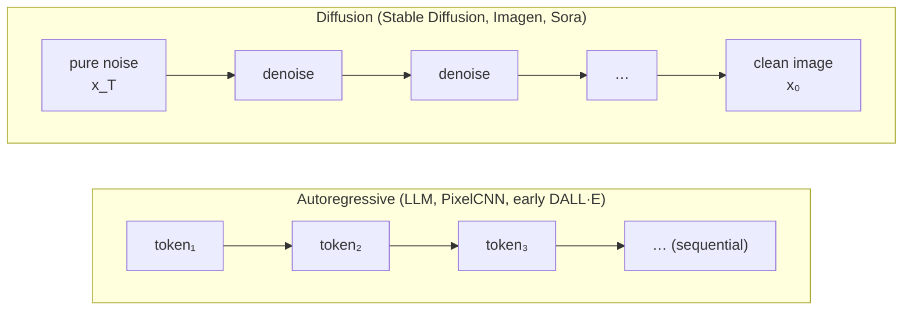
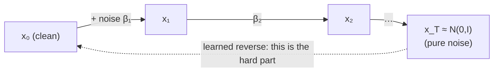
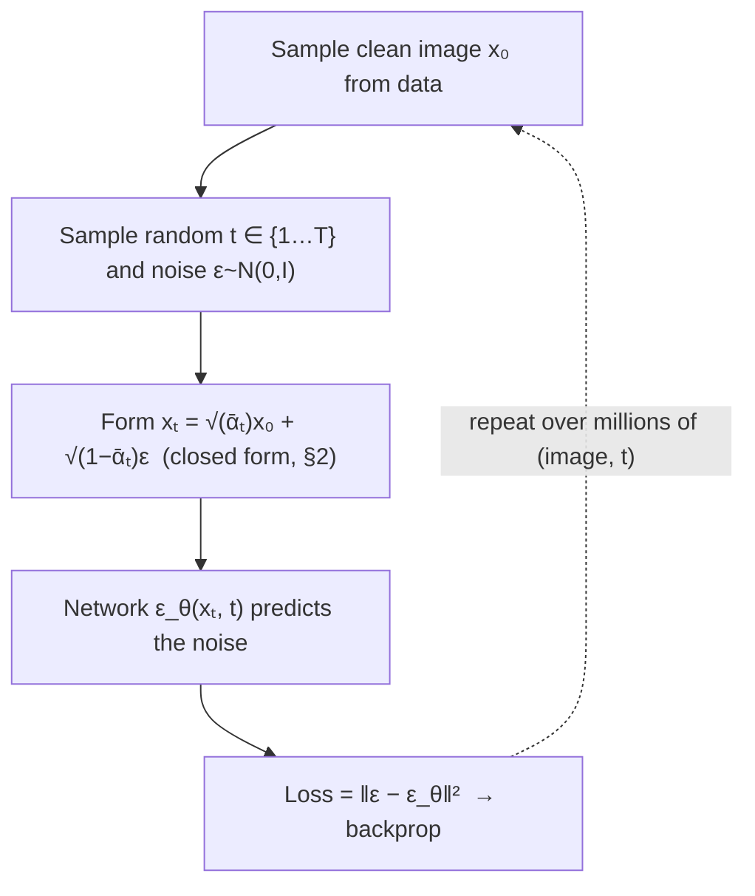
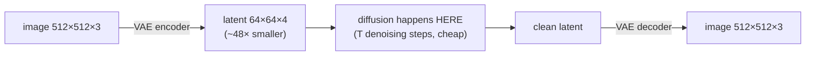
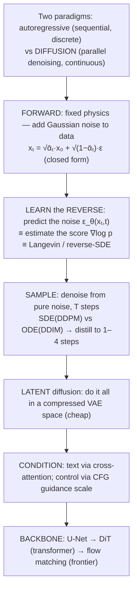

# M12 · Ch2 · §1 — Diffusion & Image Generation: The Other Generative Paradigm

> **Module:** The Model Landscape
> **Chapter:** Beyond text (image/diffusion, audio, video, TTS, multimodal)
> **Section:** How image (and, by extension, video) generation actually works — the diffusion paradigm,
> from the thermodynamic intuition through the score/SDE view to latent diffusion, guidance, and the
> DiT/flow-matching frontier.
> **Status:** 🔵 draft 2026-06-10 — recalibrated AI thread. You know LLMs cold; this is the *other*
> generative paradigm you haven't read the papers on. Pitched at your level. Q&A → finalize.

**Estimated study time:** 3 hours (paper-grounded; budget extra if you follow the citations).
**Prerequisites:** none new — your LLM/transformer knowledge transfers more than you'd expect (the modern
backbone is a transformer). Your physics is the *real* prerequisite, and you already have it.

---

## Why this section exists (for *you*)

Your two decks make it clear: on the autoregressive-LLM axis you're at frontier level — attention math,
the linear-attention↔RNN↔Titans lineage, MoE/MLA/FP8, the R1 data critique. So we skip all of that.

But you flagged the real gap honestly: **you haven't read the papers on image, video, audio, or TTS.**
This section attacks the biggest and most foundational of those — **diffusion** — because image generation
*is* diffusion, video is diffusion-with-time, and even modern TTS borrows the machinery.

Here's the hook that should make this efficient for you: **diffusion is not an ML trick, it's
physics you already own.** The forward process is literally a diffusion / Ornstein–Uhlenbeck process; the
training target is a **score function** `∇ₓ log p(x)`; sampling is **Langevin dynamics**; the whole thing
has a clean **stochastic-differential-equation** formulation with a deterministic **probability-flow ODE**
twin. Where an ML engineer memorizes the DDPM loss, you can *derive why it has that form* from
non-equilibrium statistical mechanics. We'll lean on that the whole way.

The one conceptual pivot to internalize up front:

> **An LLM generates by autoregression** — one discrete token at a time, left to right, each conditioned
> on the past. **A diffusion model generates by iterative denoising** — it starts from pure Gaussian noise
> and refines the *entire* image in parallel over many steps. Sequential-and-discrete vs
> parallel-and-continuous. Almost everything that's different downstream follows from this.

---

## 1. The two generative paradigms, side by side



| | Autoregressive | Diffusion |
|---|---|---|
| Unit | discrete tokens | continuous values (pixels / latents) |
| Order | sequential, causal | whole canvas refined in parallel |
| Steps | `n` = sequence length | `T` = denoising steps (decoupled from output size) |
| Likelihood | exact, tractable | variational bound / score-based |
| Sampling control | temperature / top-p | guidance scale (CFG) |
| Native strength | language, code, anything serializable | images, audio, video, continuous signals |

Note the resurgence caveat: **autoregressive image models are back** (token-based: VQ-GAN + transformer,
and 2024-era models). The paradigms are converging on a shared transformer backbone — but diffusion is
where the field's center of mass for images/video sits, so we start there.

---

## 2. The forward process — destroy structure with noise (your home turf)

Take a real image `x₀`. Define a **Markov chain** that adds a little Gaussian noise at each step `t = 1…T`:

```
q(xₜ | xₜ₋₁) = N(xₜ ; √(1−βₜ)·xₜ₋₁ , βₜ·I)
```

`βₜ` is the **noise schedule** (small → large). After enough steps, `x_T` is indistinguishable from pure
Gaussian noise — all structure destroyed. This is exactly a **variance-preserving diffusion process**;
the `√(1−βₜ)` keeps the variance bounded (a discretized Ornstein–Uhlenbeck process).

The property that makes it tractable (and that you can verify by composing Gaussians): you can jump to
*any* noise level in closed form, no iteration:

```
q(xₜ | x₀) = N(xₜ ; √(ᾱₜ)·x₀ , (1−ᾱₜ)·I)      where  ᾱₜ = Πₛ(1−βₛ)
```

So `xₜ = √(ᾱₜ)·x₀ + √(1−ᾱₜ)·ε`, with `ε ~ N(0, I)`. **This is the single most important equation in the
whole section** — it says any noisy version of an image is just a known blend of the clean image and a
known Gaussian noise sample. Training will exploit exactly this.



The forward process has **no learned parameters** — it's a fixed physics simulation. All the learning is
in reversing it.

---

## 3. The reverse process — and what the network actually predicts

We want `p(xₜ₋₁ | xₜ)`: given a noisier image, produce a slightly cleaner one. For small `βₜ`, this reverse
conditional is also approximately Gaussian (a result from the diffusion literature / Feller) — so a
network only needs to predict its **mean** (the variance is often fixed or a small learned correction).

The clean trick (Ho et al., **DDPM**, 2020): instead of predicting the cleaned image directly,
**predict the noise `ε` that was added.** Because `xₜ = √(ᾱₜ)x₀ + √(1−ᾱₜ)ε`, knowing `ε` is equivalent to
knowing `x₀` — but the noise-prediction target makes the loss beautifully simple:

```
L = E_{x₀, ε, t}  ‖ ε − ε_θ(xₜ, t) ‖²
```

That's it — a plain **MSE between true and predicted noise**. Training:



The model is trained to be a **denoiser at every noise level simultaneously** (`t` is fed in as a
conditioning input, usually via a sinusoidal/time embedding — yes, the same positional-encoding idea you
know). Sampling then runs the denoiser `T` times from pure noise down to a clean image.

---

## 4. The score view — where your physics pays off

Here's the reframing that, from your background, is probably *more* natural than the noise-prediction
story. Predicting the noise is — up to a known scale factor — equivalent to estimating the **score
function** of the noisy data distribution:

```
score:  s_θ(xₜ, t) ≈ ∇_{xₜ} log p_t(xₜ)        and     ε_θ ≈ −√(1−ᾱₜ) · s_θ
```

The score is the gradient of log-density — it points "toward higher-probability (more image-like)
regions." Once you have it, you can sample by **Langevin dynamics**: repeatedly step along the score and
add a little noise, exactly the overdamped Langevin equation you'd write in stat-mech:

```
x ← x + (η/2)·∇ log p(x) + √η · z ,   z ~ N(0,I)
```

Song & Ermon (**NCSN**, 2019) and Song et al. (**Score-SDE**, 2021) unify everything into a single
continuous picture. The forward noising is a **stochastic differential equation**:

```
forward SDE:   dx = f(x,t) dt + g(t) dw          (drift + Brownian motion)
reverse SDE:   dx = [f − g²·∇log p_t(x)] dt + g(t) dw̄   ← run this backward to generate
```

and — the result you'll appreciate most — there's a **deterministic probability-flow ODE** with the *same
marginals* as the SDE:

```
probability-flow ODE:   dx/dt = f(x,t) − ½ g(t)²·∇log p_t(x)
```

This ODE is why deterministic, few-step samplers exist (you're solving an ODE, so you can use a good
numerical integrator and take big steps). DDPM ≈ a particular SDE discretization; **DDIM** ≈ the ODE.
The "many steps because it's an SDE / few steps because it's an ODE" distinction maps directly onto
stochastic-vs-deterministic integration — a thing you already understand.

---

## 5. Sampling — the latency story (the part that bites in production)

Naive DDPM uses `T ≈ 1000` denoising steps → 1000 forward passes per image. That's the diffusion
analogue of the LLM **decode** problem you know: generation is an iterative loop, and each step is a full
network evaluation. The progression of fixes:

- **DDIM (2021)** — use the deterministic ODE; 20–50 steps with little quality loss.
- **DPM-Solver / higher-order ODE solvers (2022)** — exploit the ODE's structure; ~10–20 steps.
- **Distillation → consistency models (Song et al., 2023) / progressive distillation** — train a student
  to jump many steps at once → **1–4 steps**. This is the frontier of "real-time" image/video gen.

> **The mental model to carry:** diffusion trades a *single hard problem* (model `p(x)` directly, as a
> GAN or autoregressive model must) for *many easy problems* (denoise a little, `T` times). The price is
> the iterative sampling loop — and the last five years of diffusion research is largely about **paying
> down that loop** (fewer, bigger steps), exactly as LLM serving is about paying down the decode loop.

---

## 6. Latent diffusion — why Stable Diffusion is affordable

Running diffusion in **pixel space** (512×512×3) is brutally expensive — every one of `T` steps is a
full-resolution network pass. Rombach et al. (**Latent Diffusion / Stable Diffusion**, 2022) made it
practical with one move:

1. Train a **VAE** (autoencoder) to compress an image into a small **latent** (e.g. 512×512×3 → 64×64×4).
2. Run the *entire* diffusion process in that compact latent space.
3. Decode the final latent back to pixels once, at the end.



The compute saving is roughly the compression ratio — the difference between "needs a datacenter" and
"runs on your GPU." Conceptually it's the same instinct as DeepSeek's MLA you analyzed: **do the expensive
operation in a compressed space.** You already have the intuition; this is the image-domain instance.

---

## 7. Conditioning & guidance — how you actually control the output

Everything so far generates *some* plausible image. Text-to-image needs **conditioning**. Two pieces:

**(a) How the text gets in.** The prompt is encoded by a text encoder (**CLIP** text encoder, or **T5**)
into embeddings, which the denoiser attends to via **cross-attention** layers — the Query comes from the
image features, the Keys/Values from the text embeddings. This is *literally the attention mechanism you
already know*, used to let each image region "look at" the prompt. (When SD generates a "red cube on a
blue table," cross-attention is what binds "red" to the cube region.)

**(b) Classifier-free guidance (CFG)** — Ho & Salimans, 2021 — the single most important sampling knob,
and a genuinely clever trick. Train the model *both* conditioned and unconditioned (randomly drop the text
~10% of the time). At sampling, extrapolate away from the unconditioned prediction:

```
ε̂ = ε_uncond + w · (ε_cond − ε_uncond)
```

`w` is the **guidance scale**. `w=1` → normal conditional sampling; `w>1` (typically 5–15) → push harder
toward the prompt: more prompt-faithful and sharper, but too high → oversaturated, less diverse. This is
the diffusion analogue of an LLM's temperature/top-p — the **fidelity ↔ diversity** dial — and you should
file it next to those.

---

## 8. The backbone — and why your transformer knowledge transfers

What network *is* `ε_θ`? Two eras:

- **U-Net era (2020–2022):** a convolutional encoder–decoder with skip connections and a few
  self/cross-attention layers. Good inductive bias for images (locality, multi-scale).
- **Transformer era — DiT (Peebles & Xie, 2023):** replace the U-Net with a **Diffusion Transformer**.
  **Patchify** the latent into a sequence of patch tokens (exactly like ViT), add positional embeddings,
  run standard transformer blocks, condition on `t` and text via adaptive layernorm / cross-attention.
  **This is the bridge to everything you already know** — the denoiser is now a transformer, scaling laws
  return, and the same engineering (FlashAttention, etc.) applies. SD3, PixArt, and Sora are DiT-based.

So your hard-won attention/transformer expertise is *not* stranded on the LLM side — the image/video
frontier is built on the same block. The novelty is the *training objective* (denoising/score), not the
architecture.

**The current frontier — flow matching / rectified flow** (Lipman et al. 2022; Liu et al. 2022; powering
SD3 and Flux): reframe generation as learning a **velocity field** that transports noise to data along the
*straightest possible* probability path. It generalizes diffusion (recall the probability-flow ODE in §4),
and straighter paths mean fewer integration steps → faster sampling. If you read one set of papers past
this section, read these — they're where image/video generation is heading, and the ODE framing from §4 is
the prerequisite you'll already have.

---

## 9. The bridge to video (preview of §2)

Video = add a **time axis**. Modern video models (Sora, and the open ones) are **DiT over spacetime
patches**: cut the video into patches across height, width, *and* time; run a transformer with attention
spanning frames so motion is coherent; diffuse the whole clip. The "world model" claims you've seen in the
news come from the fact that to denoise video well, the model must implicitly learn object permanence,
physics, and 3D consistency. We'll do this properly in §2 — but notice the pattern: **same diffusion
machinery, one more dimension, transformer backbone.** Your physics lens on "does it actually obey
conservation laws / is the motion physically plausible" will be exactly the right critical angle there,
just as it was for the H800 analysis.

---

## 10. The one-page mental model



**The seven things to carry:**
1. Diffusion = **learn to reverse a noising process**; train a denoiser at all noise levels with a plain
   MSE-on-noise loss.
2. The closed-form `xₜ = √ᾱₜ·x₀ + √(1−ᾱₜ)·ε` is the keystone — it makes training a one-step sampling job.
3. **Noise prediction ≡ score estimation ≡ Langevin/SDE** — your stat-mech reading of it is the correct one.
4. **SDE (stochastic, many steps) vs probability-flow ODE (deterministic, few steps)** explains DDPM vs
   DDIM and the whole fast-sampler line; **distillation/consistency** gets to 1–4 steps.
5. **Latent diffusion** (compress, then diffuse) is what made it affordable — same instinct as MLA.
6. **Cross-attention** injects the prompt; **classifier-free guidance (`w`)** is the fidelity↔diversity dial
   (the temperature/top-p of image gen).
7. The backbone went **U-Net → DiT (a transformer) → flow matching** — so your transformer knowledge
   transfers directly; the *only* genuinely new idea is the denoising/score objective.

---

## 11. Check your understanding (frontier-level)

1. Why does predicting the *noise* `ε` (rather than the clean image `x₀` directly) give such a simple
   training loss? Use the closed-form forward equation in your answer.
2. You described DeepSeek's MLA as "low-rank compression to save VRAM." What is the *exact* structural
   analogue in latent diffusion, and why does it buy a roughly proportional compute saving?
3. From the SDE/ODE picture: explain — physically, not by citing the paper — why DDIM can use ~20 steps
   where DDPM wants ~1000. What are you trading away?
4. Classifier-free guidance with a high `w` makes images more prompt-faithful but oversaturated and less
   diverse. Relate this precisely to the LLM sampling knob you already use, and say what "oversaturated"
   corresponds to there.
5. A DiT and a GPT are both transformers. Name two concrete differences in *how* they're used (input,
   attention pattern, training objective, or output) that follow from autoregressive-vs-diffusion.
6. (Stretch / your edge) Sora is pitched as a "world model." From your physics background, design one
   *critical test* — in the spirit of your DeepSeek teardown — that would reveal whether a video diffusion
   model has actually learned physics versus merely memorized plausible-looking motion.

---

## 12. Optional: paper trail (you read papers — here's the efficient path)

In dependency order, skim the abstract + figures of each:
1. **DDPM** (Ho et al., 2020) — the simple-loss formulation. [arXiv:2006.11239](https://arxiv.org/abs/2006.11239)
2. **Score-SDE** (Song et al., 2021) — the unifying SDE/ODE view. [arXiv:2011.13456](https://arxiv.org/abs/2011.13456)
3. **Classifier-Free Guidance** (Ho & Salimans, 2021). [arXiv:2207.12598](https://arxiv.org/abs/2207.12598)
4. **Latent Diffusion / Stable Diffusion** (Rombach et al., 2022). [arXiv:2112.10752](https://arxiv.org/abs/2112.10752)
5. **DiT** (Peebles & Xie, 2023) — diffusion on a transformer. [arXiv:2212.09748](https://arxiv.org/abs/2212.09748)
6. **Flow Matching** (Lipman et al., 2022) + **Rectified Flow** (Liu et al., 2022) — the frontier.
   [arXiv:2210.02747](https://arxiv.org/abs/2210.02747) · [arXiv:2209.03003](https://arxiv.org/abs/2209.03003)

Bring me the one that surprised you or that you want to push past — that's how these sessions work best
for you.

---

## 13. Applied — to your world (to be filled during our session)

Placeholder for the Q&A. Likely threads given your background:
- The physics reading of score matching / Langevin — where your intuition runs *ahead* of the ML framing,
  and where the analogy breaks.
- A critical-teardown angle on a "world model" video claim (your strongest mode).
- Whether/where image or TTS generation is relevant to your SEA-LION / arena work, or purely knowledge.

---

## References

*(arXiv links above are stable; full verification of any added blog/video links at finalize, per your rule.)*

- The six papers in §12 are the spine.
- **[Lilian Weng — "What are Diffusion Models?"](https://lilianweng.github.io/posts/2021-07-11-diffusion-models/)** —
  the best single math-complete blog explainer; matches your depth preference.
- **[Sora technical report (OpenAI)](https://openai.com/index/video-generation-models-as-world-simulators/)** —
  the spacetime-patch DiT video story, for the §9 preview and your critical-test exercise.

---

### What's next

After we Q&A and finalize this, the AI thread (M12 Ch2) continues:
- **§2 — Video generation** (spacetime DiT, Sora, temporal coherence, the "world model" debate — your
  critical-thinking + physics edge applies directly).
- **§3 — Audio, speech & TTS** (neural codecs, discrete audio tokens, autoregressive vs diffusion TTS).
- **§4 — Multimodal & representation models** (CLIP, VLMs, embedding models — how modalities get fused).

Interleaved with your real-gap tracks (M01 Ch2 memory · M04 Ch1 §2 data-flow / Ch2 decomposition).
