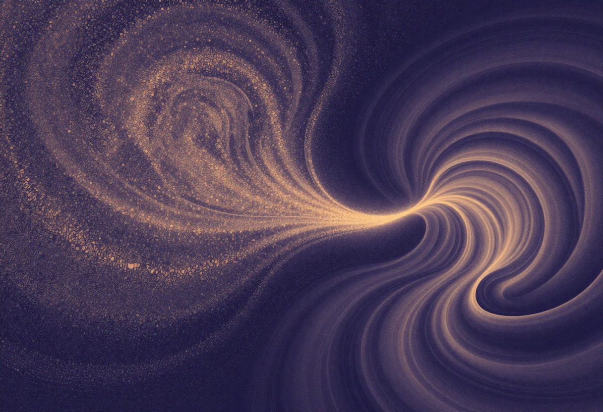
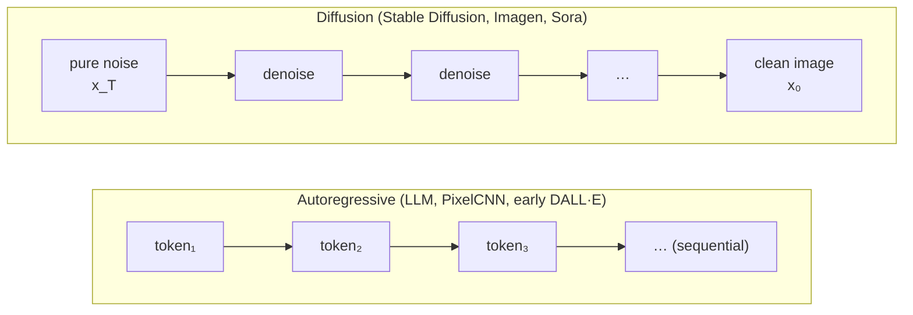
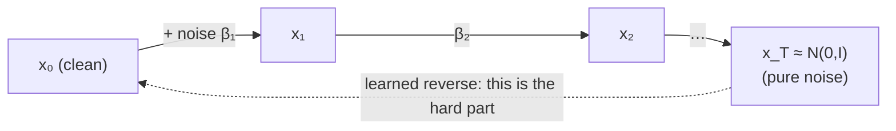
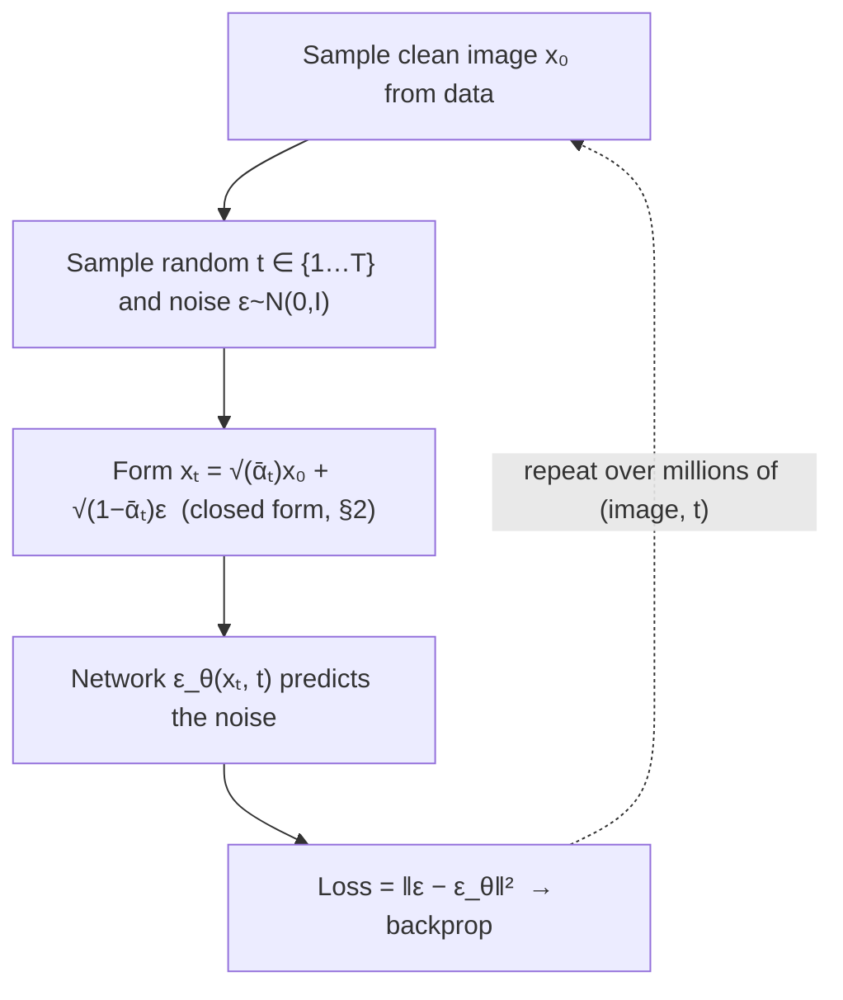
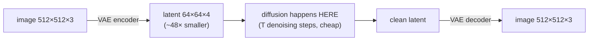
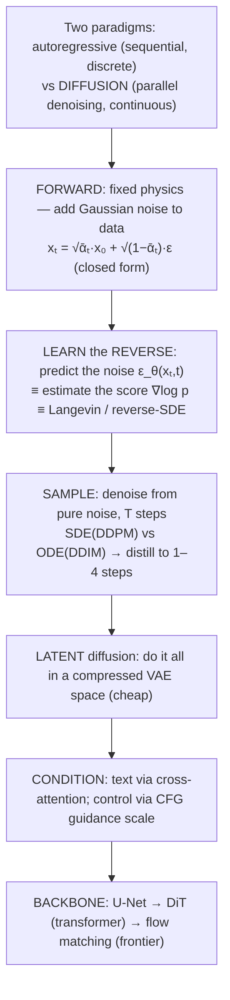

# M12 · Ch2 · §1 — Diffusion & Image Generation: The Other Generative Paradigm

> **Module:** The Model Landscape
> **Chapter:** Beyond text (image/diffusion, audio, video, TTS, multimodal)
> **Section:** How image (and, by extension, video) generation actually works — the diffusion paradigm,
> from the thermodynamic intuition through the score/SDE view to latent diffusion, guidance, and the
> DiT/flow-matching frontier.
> **Status:** ✅ finalized 2026-06-10. You'd already read the DDPM paper and built a strong
> physics-grounded mental model (signal/noise, SNR, the model as a noise filter). The session was a
> high-level Q&A that *confirmed* the parts you had right (SNR as the native axis; non-sequential
> training; coarse→fine) and corrected two mechanisms (sampling is **not** resonance/amplification →
> it's **annealed Langevin descent on a learned energy landscape**; multi-step is **not** noise adding
> detail → it's **integrating a curved trajectory**). Your editing analysis independently re-derived
> production techniques. All captured in §13.

**Estimated study time:** 3 hours (paper-grounded; budget extra if you follow the citations).
**Prerequisites:** none new — your LLM/transformer knowledge transfers more than you'd expect (the modern
backbone is a transformer). Your physics is the *real* prerequisite, and you already have it.



*Noise resolving into form — the section's whole story in one frame (annealed descent into a learned energy landscape, §4). Fittingly, this
image was itself produced by the technique the section explains. — Illustration, generated locally (ComfyUI + Z-Image Turbo).*

<details>
<summary>Image prompt (source of truth)</summary>

> Abstract generative-art illustration of a coherent flowing form emerging out of random noise: dense grainy colorful static on the left
> gradually coalescing across the frame into smooth elegant swirling structure on the right, evoking denoising and descent into an energy
> landscape with soft valleys, deep indigo and violet with warm amber highlights, luminous, atmospheric, high detail, no text, no words, no labels

</details>

---

## Why this section exists (for *you*)

Your two decks make it clear: on the autoregressive-LLM axis you're at frontier level — attention math,
the linear-attention↔RNN (recurrent neural network)↔Titans lineage, MoE (mixture-of-experts)/MLA/FP8, the R1 data critique. So we skip all of that.

But you flagged the real gap honestly: **you haven't read the papers on image, video, audio, or TTS (text-to-speech).**
This section attacks the biggest and most foundational of those — **diffusion** — because image generation
*is* diffusion, video is diffusion-with-time, and even modern TTS borrows the machinery.

Here's the hook that should make this efficient for you: **diffusion is not an ML trick, it's
physics you already own.** The forward process is literally a diffusion / Ornstein–Uhlenbeck process; the
training target is a **score function** `∇ₓ log p(x)`; sampling is **Langevin dynamics**; the whole thing
has a clean **stochastic-differential-equation** formulation with a deterministic **probability-flow ODE (ordinary differential equation)**
twin. Where an ML engineer memorizes the DDPM loss, you can *derive why it has that form* from
non-equilibrium statistical mechanics. We'll lean on that the whole way.

The one conceptual pivot to internalize up front:

> **An LLM (large language model) generates by autoregression** — one discrete token at a time, left to right, each conditioned
> on the past. **A diffusion model generates by iterative denoising** — it starts from pure Gaussian noise
> and refines the *entire* image in parallel over many steps. Sequential-and-discrete vs
> parallel-and-continuous. Almost everything that's different downstream follows from this.

---

## 1. The two generative paradigms, side by side

<details>
<summary><b>Vocabulary for this section</b> — terms, abbreviations and every symbol in the formulas (click to expand)</summary>

**Abbreviations**

| Short | Stands for | Meaning |
|---|---|---|
| **AR** | autoregressive | generating one unit at a time, each conditioned on all previous ones |
| **CFG** | classifier-free guidance | the sampling knob that trades prompt fidelity against diversity (§7) |
| **LLM** | large language model | an autoregressive transformer over text tokens |
| **VQ-GAN** | vector-quantized generative adversarial network | an image tokenizer: encodes an image to discrete codebook indices a transformer can predict |
| **top-p** | nucleus sampling | truncating the token distribution to the smallest set whose mass exceeds $p$ |

**Symbols used in the formulas**

| Symbol | Reads as | Meaning |
|---|---|---|
| $n$ | "n" | sequence length — the number of autoregressive steps |
| $T$ | "capital T" | the number of diffusion (denoising) steps |
| $x_0$ | "x-sub-zero" | the clean data sample; the subscript is the diffusion step, and zero means no noise |
| $x_T$ | "x-sub-capital-T" | the fully noised sample at the end of the forward process — pure Gaussian noise |
| $p(x)$ | "p of x" | the probability density the generative model is trying to represent |

**Terms**

| Term | Definition |
|---|---|
| **Diffusion model** | a generative model that learns to invert a fixed noising process, refining a whole canvas over $T$ steps |
| **Autoregressive model** | a generative model that factorises the joint into a product of next-unit conditionals, sampled sequentially |
| **Token** | a discrete unit from a fixed vocabulary; the native currency of AR models |
| **Latent** | a continuous vector representation of the data, usually lower-dimensional than the raw signal |
| **Causal** | attending only to positions at or before the current one |
| **Exact likelihood** | the model can evaluate $p(x)$ directly rather than bounding it |
| **Variational bound** | a tractable lower bound on the log-likelihood, optimised in place of the intractable quantity |
| **Score-based** | trained on the gradient of the log-density rather than the density itself (§4) |
| **Temperature** | the logit rescaling that sharpens or flattens an AR sampling distribution |
| **Guidance scale** | the diffusion analogue of temperature — how hard sampling is pushed toward the condition |
| **PixelCNN** | an early autoregressive image model that predicts pixels in raster order |
| **Stable Diffusion / Imagen / Sora** | production diffusion models for image (first two) and video (Sora) |
| **DALL·E** | OpenAI's text-to-image line; early versions were token-based autoregressive |

</details>

<!-- DIAGRAM:START -->


<details>
<summary>Diagram source (Mermaid)</summary>


```mermaid
flowchart LR
    subgraph AR["Autoregressive (LLM, PixelCNN, early DALL·E)"]
        direction LR
        a1["token₁"] --> a2["token₂"] --> a3["token₃"] --> a4["… (sequential)"]
    end
    subgraph DIF["Diffusion (Stable Diffusion, Imagen, Sora)"]
        direction LR
        d0["pure noise<br/>x_T"] --> d1["denoise"] --> d2["denoise"] --> d3["…"] --> d4["clean image<br/>x₀"]
    end
```

</details>
<!-- DIAGRAM:END -->

**Table 1** — autoregressive against diffusion generation, side by side.

| | Autoregressive | Diffusion |
|---|---|---|
| Unit | discrete tokens | continuous values (pixels / latents) |
| Order | sequential, causal | whole canvas refined in parallel |
| Steps | `n` = sequence length | `T` = denoising steps (decoupled from output size) |
| Likelihood | exact, tractable | variational bound / score-based |
| Sampling control | temperature / top-p | guidance scale (CFG) |
| Native strength | language, code, anything serializable | images, audio, video, continuous signals |

Note the resurgence caveat: **autoregressive image models are back** (token-based: VQ-GAN + transformer,
and 2024-era models). The paradigms are converging on a shared transformer backbone — but diffusion is
where the field's center of mass for images/video sits, so we start there.

---

## 2. The forward process — destroy structure with noise (your home turf)

<details>
<summary><b>Vocabulary for this section</b> — terms, abbreviations and every symbol in the formulas (click to expand)</summary>

**Symbols used in the formulas**

| Symbol | Reads as | Meaning |
|---|---|---|
| $t$ | "t" | the diffusion step index, running from one up to $T$; larger $t$ means more noise |
| $T$ | "capital T" | the total number of forward noising steps |
| $x_0$ | "x-sub-zero" | the clean image at the zero-noise end of the chain |
| $x_t$ | "x-sub-t" | the partially noised sample after $t$ noising steps |
| $x_{t-1}$ | "x-sub-t-minus-one" | the slightly less noisy sample one step earlier |
| $x_T$ | "x-sub-capital-T" | the endpoint: indistinguishable from pure Gaussian noise |
| $\beta_t$ | "beta-sub-t" | the noise schedule — how much variance is injected at step $t$ |
| $\bar{\alpha}_t$ | "alpha-bar-sub-t" | the cumulative product of $(1-\beta_s)$ up to step $t$; the bar denotes accumulation over all steps so far |
| $\epsilon$ | "epsilon" | a standard Gaussian noise sample drawn once and mixed into $x_0$ |
| $q(x_t \mid x_{t-1})$ | "q of x-t given x-t-minus-one" | the fixed forward transition density; the bar $\mid$ reads "conditioned on" |
| $\mathcal{N}(\mu, \Sigma)$ | "normal with mean mu and covariance Sigma" | a Gaussian distribution |
| $I$ | "identity" | the identity covariance matrix — isotropic, uncorrelated noise |
| $\prod_s$ | "product over s" | multiply the terms for every step $s$ up to $t$ |

**Terms**

| Term | Definition |
|---|---|
| **Forward process (diffusion)** | the fixed, parameter-free chain that progressively corrupts data into noise |
| **Markov chain** | a process whose next state depends only on the current one |
| **Noise schedule** | the chosen sequence of $\beta_t$ values controlling how fast structure is destroyed |
| **Gaussian noise** | noise drawn from a normal distribution |
| **Variance-preserving process** | a noising parameterisation whose marginal variance stays bounded as $t$ grows |
| **Ornstein–Uhlenbeck process** | the mean-reverting stochastic process the variance-preserving chain discretises |
| **Closed form** | a direct expression for $x_t$ given $x_0$, with no need to iterate the chain |
| **Isotropic** | identical in every direction — the noise has no preferred axis |

</details>

Take a real image `x₀`. Define a **Markov chain** that adds a little Gaussian noise at each step `t = 1…T`:

```
q(xₜ | xₜ₋₁) = N(xₜ ; √(1−βₜ)·xₜ₋₁ , βₜ·I)
```

`βₜ` is the **noise schedule** (small → large). After enough steps, `x_T` is indistinguishable from pure
Gaussian noise — all structure destroyed. This is exactly a **variance-preserving diffusion process**;
the `√(1−βₜ)` keeps the variance bounded (a discretized Ornstein–Uhlenbeck process).

The property that makes it tractable (and that you can verify by composing Gaussians): you can jump to
*any* noise level in closed form, no iteration:

```
q(xₜ | x₀) = N(xₜ ; √(ᾱₜ)·x₀ , (1−ᾱₜ)·I)      where  ᾱₜ = Πₛ(1−βₛ)
```

So `xₜ = √(ᾱₜ)·x₀ + √(1−ᾱₜ)·ε`, with `ε ~ N(0, I)`. **This is the single most important equation in the
whole section** — it says any noisy version of an image is just a known blend of the clean image and a
known Gaussian noise sample. Training will exploit exactly this.

<!-- DIAGRAM:START -->


<details>
<summary>Diagram source (Mermaid)</summary>


```mermaid
flowchart LR
    x0["x₀ (clean)"] -->|"+ noise β₁"| x1["x₁"] -->|"β₂"| x2["x₂"] -->|"…"| xT["x_T ≈ N(0,I)<br/>(pure noise)"]
    xT -.->|"learned reverse: this is the hard part"| x0
```

</details>
<!-- DIAGRAM:END -->

The forward process has **no learned parameters** — it's a fixed physics simulation. All the learning is
in reversing it.

---

## 3. The reverse process — and what the network actually predicts

<details>
<summary><b>Vocabulary for this section</b> — terms, abbreviations and every symbol in the formulas (click to expand)</summary>

**Abbreviations**

| Short | Stands for | Meaning |
|---|---|---|
| **DDPM** | denoising diffusion probabilistic models | Ho et al. 2020 — the formulation that made noise-prediction training work |
| **MSE** | mean squared error | the squared-difference loss used here between true and predicted noise |

**Symbols used in the formulas**

| Symbol | Reads as | Meaning |
|---|---|---|
| $p(x_{t-1} \mid x_t)$ | "p of x-t-minus-one given x-t" | the learned reverse transition — one denoising step |
| $\epsilon$ | "epsilon" | the true noise that was added to form $x_t$ |
| $\epsilon_\theta(x_t, t)$ | "epsilon-theta of x-t and t" | the network's prediction of that noise; the $\theta$ subscript marks it as the learned model |
| $\theta$ | "theta" | the network's parameters |
| $L$ | "L" | the training loss |
| $\mathbb{E}$ | "expectation over" | average over the quantities listed in its subscript |
| $\lVert \cdot \rVert^2$ | "squared norm" | sum of squared components — the MSE |
| $\bar{\alpha}_t$ | "alpha-bar-sub-t" | the cumulative noise factor from §2, fixing the blend of $x_0$ and $\epsilon$ in $x_t$ |
| $\beta_t$ | "beta-sub-t" | the per-step noise variance; small $\beta_t$ is what makes the reverse step near-Gaussian |

**Terms**

| Term | Definition |
|---|---|
| **Reverse process** | the learned chain that walks from noise back to data, one step at a time |
| **Reverse conditional** | the distribution of the slightly cleaner sample given the noisier one |
| **Noise prediction (epsilon-prediction)** | the training target: recover the injected noise rather than the clean image |
| **Denoiser** | the network viewed as a function that removes noise at a given noise level |
| **Time embedding** | the vector encoding of $t$ fed into the network, usually sinusoidal, so one network serves all noise levels |
| **Conditioning input** | any extra signal (here $t$) the network is given alongside $x_t$ |

</details>

We want `p(xₜ₋₁ | xₜ)`: given a noisier image, produce a slightly cleaner one. For small `βₜ`, this reverse
conditional is also approximately Gaussian (a result from the diffusion literature / Feller) — so a
network only needs to predict its **mean** (the variance is often fixed or a small learned correction).

The clean trick (Ho et al., **DDPM**, 2020): instead of predicting the cleaned image directly,
**predict the noise `ε` that was added.** Because `xₜ = √(ᾱₜ)x₀ + √(1−ᾱₜ)ε`, knowing `ε` is equivalent to
knowing `x₀` — but the noise-prediction target makes the loss beautifully simple:

```
L = E_{x₀, ε, t}  ‖ ε − ε_θ(xₜ, t) ‖²
```

That's it — a plain **MSE (mean squared error) between true and predicted noise**. Training:

<!-- DIAGRAM:START -->


<details>
<summary>Diagram source (Mermaid)</summary>


```mermaid
flowchart TD
    A["Sample clean image x₀ from data"] --> B["Sample random t ∈ {1…T} and noise ε~N(0,I)"]
    B --> C["Form xₜ = √(ᾱₜ)x₀ + √(1−ᾱₜ)ε  (closed form, §2)"]
    C --> D["Network ε_θ(xₜ, t) predicts the noise"]
    D --> E["Loss = ‖ε − ε_θ‖²  → backprop"]
    E -.->|"repeat over millions of (image, t)"| A
```

</details>
<!-- DIAGRAM:END -->

The model is trained to be a **denoiser at every noise level simultaneously** (`t` is fed in as a
conditioning input, usually via a sinusoidal/time embedding — yes, the same positional-encoding idea you
know). Sampling then runs the denoiser `T` times from pure noise down to a clean image.

---

## 4. The score view — where your physics pays off

<details>
<summary><b>Vocabulary for this section</b> — terms, abbreviations and every symbol in the formulas (click to expand)</summary>

**Abbreviations**

| Short | Stands for | Meaning |
|---|---|---|
| **SDE** | stochastic differential equation | a differential equation with a random (Brownian) driving term |
| **ODE** | ordinary differential equation | a deterministic differential equation |
| **NCSN** | noise-conditional score network | Song & Ermon 2019 — score estimation across many noise levels |
| **Score-SDE** | score-based generative modelling through SDEs | Song et al. 2021 — the continuous-time unification |
| **DDPM** | denoising diffusion probabilistic models | the discrete stochastic sampler |
| **DDIM** | denoising diffusion implicit models | the deterministic, ODE-like sampler |
| **EDM** | elucidating the design space of diffusion models | Karras et al.'s analysis of samplers, schedules and noise injection |

**Symbols used in the formulas**

| Symbol | Reads as | Meaning |
|---|---|---|
| $s_\theta(x_t, t)$ | "s-theta of x-t and t" | the learned score network; $\theta$ marks the learned parameters |
| $\nabla_{x_t} \log p_t(x_t)$ | "gradient with respect to x-t of log p-t of x-t" | the score — the direction in sample space along which log-density rises fastest |
| $p_t$ | "p-sub-t" | the data distribution after $t$ steps of noising; the subscript is the noise level, not time in a sample |
| $\epsilon_\theta$ | "epsilon-theta" | the noise-prediction network, equal to the score up to a known negative scale factor |
| $\bar{\alpha}_t$ | "alpha-bar-sub-t" | the cumulative noise factor that converts between score and noise prediction |
| $\eta$ | "eta" | the Langevin step size |
| $z$ | "z" | a fresh standard Gaussian sample added at each Langevin step |
| $f(x,t)$ | "f of x and t" | the drift term of the forward SDE |
| $g(t)$ | "g of t" | the diffusion coefficient — how strongly noise enters the SDE |
| $dw$ | "d-w" | an increment of Brownian motion (the random driver) |
| $d\bar{w}$ | "d-w-bar" | the Brownian increment of the time-reversed SDE; the bar marks reverse time |
| $dx / dt$ | "d-x by d-t" | the deterministic velocity of the probability-flow ODE |
| $\mathbb{E}[x_0 \mid x_t]$ | "expected x-zero given x-t" | the posterior mean clean image — Tweedie's optimal one-shot denoiser output |

**Terms**

| Term | Definition |
|---|---|
| **Score function** | the gradient of the log-density with respect to the sample |
| **Langevin dynamics** | sampling by repeated small steps along the score plus injected noise |
| **Probability-flow ODE** | the deterministic ODE whose marginals at every noise level match the SDE's |
| **Marginals** | the per-noise-level distributions, ignoring how a trajectory got there |
| **Drift** | the deterministic part of an SDE's motion |
| **Brownian motion** | the random, uncorrelated part of an SDE's motion |
| **Energy landscape** | the negative log-density viewed as a surface; the score is minus its gradient |
| **Basin / mode** | a local region of high probability — one family of plausible images |
| **Annealing** | lowering the noise level (the "temperature") gradually during sampling |
| **Tweedie's formula** | the identity giving the posterior mean of the clean sample from the score at a known noise level |
| **Posterior mean** | the average over all clean images consistent with the observed noisy one — blurry at high noise |
| **Seed** | the initial noise draw, which under a deterministic sampler fully determines the output |
| **Coarse-to-fine** | high-noise steps fixing layout, low-noise steps painting detail |
| **`1/f` spectrum** | the roughly inverse-frequency energy falloff of natural images, which is why layout is low-frequency and texture high-frequency |

</details>

Here's the reframing that, from your background, is probably *more* natural than the noise-prediction
story. Predicting the noise is — up to a known scale factor — equivalent to estimating the **score
function** of the noisy data distribution:

```
score:  s_θ(xₜ, t) ≈ ∇_{xₜ} log p_t(xₜ)        and     ε_θ ≈ −√(1−ᾱₜ) · s_θ
```

The score is the gradient of log-density — it points "toward higher-probability (more image-like)
regions." Once you have it, you can sample by **Langevin dynamics**: repeatedly step along the score and
add a little noise, exactly the overdamped Langevin equation you'd write in stat-mech:

```
x ← x + (η/2)·∇ log p(x) + √η · z ,   z ~ N(0,I)
```

Song & Ermon (**NCSN**, 2019) and Song et al. (**Score-SDE**, 2021) unify everything into a single
continuous picture. The forward noising is a **stochastic differential equation**:

```
forward SDE:   dx = f(x,t) dt + g(t) dw          (drift + Brownian motion)
reverse SDE:   dx = [f − g²·∇log p_t(x)] dt + g(t) dw̄   ← run this backward to generate
```

and — the result you'll appreciate most — there's a **deterministic probability-flow ODE** with the *same
marginals* as the SDE:

```
probability-flow ODE:   dx/dt = f(x,t) − ½ g(t)²·∇log p_t(x)
```

This ODE is why deterministic, few-step samplers exist (you're solving an ODE, so you can use a good
numerical integrator and take big steps). DDPM ≈ a particular SDE discretization; **DDIM** ≈ the ODE.
The "many steps because it's an SDE / few steps because it's an ODE" distinction maps directly onto
stochastic-vs-deterministic integration — a thing you already understand.

### The frame to hold: annealed descent on a learned energy landscape

Since the score is `−∇(energy)`, **sampling is noisy gradient descent down a learned energy surface,
with the noise level acting as temperature, cooled from hot to cold** — i.e. simulated annealing /
annealed Langevin dynamics, which you already own from stat-mech. Start hot → the (smoothed) landscape
`p_t` is flat and every state is reachable; cool slowly → you settle into one of many **basins**
(image modes). *Which* basin you land in is set by the trajectory — and under the deterministic ODE,
entirely by the **initial seed**. This is the rigorous replacement for "pure noise contains all
signals and the filter amplifies a subset": the seed *selects* a basin, but the image content is
**synthesized** by the learned dynamics, not linearly amplified out of frequency components sitting in
the noise. The noise schedule literally *is* the temperature schedule.

Two precise hooks worth carrying:
- **Tweedie's formula:** the optimal one-shot denoiser output is the *posterior mean* `E[x₀ | xₜ]`. At
  high noise that mean is a blurry average over all plausible images (hence "few steps → looks like a
  house but no texture"); as noise drops it collapses to one specific, detailed sample. This is the
  rigorous version of "extract the signal."
- **Coarse→fine = low-freq→high-freq.** Natural images have ~1/f spectra; high-noise steps fix
  low-frequency layout, low-noise steps paint high-frequency detail. The spectral reading of
  "structure first, detail later" is correct.

---

## 5. Sampling — the latency story (the part that bites in production)

<details>
<summary><b>Vocabulary for this section</b> — terms, abbreviations and every symbol in the formulas (click to expand)</summary>

**Abbreviations**

| Short | Stands for | Meaning |
|---|---|---|
| **DDPM** | denoising diffusion probabilistic models | the stochastic sampler needing many steps |
| **DDIM** | denoising diffusion implicit models | the deterministic ODE sampler, 20–50 steps |
| **ODE** | ordinary differential equation | the deterministic trajectory being integrated |
| **SDE** | stochastic differential equation | the noise-driven version of the same trajectory |
| **DPM-Solver** | diffusion probabilistic model solver | a higher-order ODE solver specialised to the diffusion ODE |
| **EDM** | elucidating the design space of diffusion models | the paper analysing stochastic "churn" as error correction |
| **GAN** | generative adversarial network | a generator trained against a discriminator, modelling $p(x)$ in one shot |
| **FP16 / FP32** | 16-bit / 32-bit floating point | numeric precision of the arithmetic, distinct from step-size error |

**Symbols used in the formulas**

| Symbol | Reads as | Meaning |
|---|---|---|
| $T$ | "capital T" | the number of denoising steps taken at sampling time |
| $x$ | "x" | the sample being integrated along the noise-to-data trajectory |
| $p(x)$ | "p of x" | the data density a one-shot generator would have to model directly |

**Terms**

| Term | Definition |
|---|---|
| **Denoising step** | one full network evaluation that moves the sample a little toward data |
| **Decode loop** | the iterative, sequential generation phase — the diffusion analogue of LLM token-by-token decoding |
| **Distillation** | training a student to reproduce in few steps what the teacher does in many |
| **Consistency model** | a distilled model trained so any point on a trajectory maps directly to the clean endpoint |
| **Progressive distillation** | repeatedly halving the step count by distilling two teacher steps into one student step |
| **Truncation error** | the integration error from taking a finite step along a curved path; grows with step size |
| **Curvature** | the bending of the sampling trajectory, which is what caps the usable step size |
| **Churn** | deliberate noise re-injection in a stochastic sampler, used to scrub accumulated integration error |
| **Discretisation** | the choice of how many steps and where to place them along the continuous trajectory |

</details>

Naive DDPM uses `T ≈ 1000` denoising steps → 1000 forward passes per image. That's the diffusion
analogue of the LLM **decode** problem you know: generation is an iterative loop, and each step is a full
network evaluation. The progression of fixes:

- **DDIM (2021)** — use the deterministic ODE; 20–50 steps with little quality loss.
- **DPM-Solver / higher-order ODE solvers (2022)** — exploit the ODE's structure; ~10–20 steps.
- **Distillation → consistency models (Song et al., 2023) / progressive distillation** — train a student
  to jump many steps at once → **1–4 steps**. This is the frontier of "real-time" image/video gen.

### *Why* multiple steps — the correct reason (a Q&A correction worth pinning)

It is **not** that each step re-injects noise to "add new detail." The clean disproof: the deterministic
ODE samplers (DDIM, probability-flow ODE) add **zero** noise after the seed and still produce fully
detailed images. The real reason is **numerical-integration accuracy**: the noise→data trajectory is
**curved** (the score/velocity field is nonlinear in `x` *and* the target landscape sharpens as it
cools), so one big linear step overshoots → blur/artifacts; many small steps track the curve. The
"precision" that forces many steps is **step-size / truncation error**, not floating-point bit-width
(FP16-vs-FP32 is a minor, separate effect).

The proof that *curvature* is the cause: **consistency/distillation models reach 1–4 steps by learning
the curved map directly** — if the bottleneck were noise re-injection or float precision, that couldn't
work. And the stochastic samplers that *do* re-add noise (DDPM/SDE) use it only as **error-correction**
("churn" that scrubs accumulated integration error — Karras et al.'s *EDM* analyzes exactly this); it is
optional and never a detail-source.

> **The mental model to carry:** diffusion trades a *single hard problem* (model `p(x)` directly, as a
> GAN (generative adversarial network) or autoregressive model must) for *many easy problems* (denoise a little, `T` times). The price is
> the iterative sampling loop — and the last five years of diffusion research is largely about **paying
> down that loop** (fewer, bigger steps), exactly as LLM serving is about paying down the decode loop.
> The number of *inference* steps is decoupled from the "1000" training framing — you choose the
> discretization of a continuous trajectory.

---

## 6. Latent diffusion — why Stable Diffusion is affordable

<details>
<summary><b>Vocabulary for this section</b> — terms, abbreviations and every symbol in the formulas (click to expand)</summary>

**Abbreviations**

| Short | Stands for | Meaning |
|---|---|---|
| **VAE** | variational autoencoder | the encoder–decoder pair that maps images to a compact latent and back |
| **MLA** | multi-head latent attention | DeepSeek's compressed-KV attention — the same "do the expensive work in a compressed space" move |
| **GPU** | graphics processing unit | the accelerator the reduced compute makes this fit on |

**Symbols used in the formulas**

| Symbol | Reads as | Meaning |
|---|---|---|
| $T$ | "capital T" | the number of denoising steps, each of which now runs in latent rather than pixel space |

**Terms**

| Term | Definition |
|---|---|
| **Pixel space** | operating directly on the full-resolution image tensor |
| **Latent space** | the compressed vector space the diffusion process actually runs in |
| **Latent diffusion** | running the entire forward/reverse process on VAE latents, decoding to pixels only once at the end |
| **Encoder** | the network mapping an image down to its latent |
| **Decoder** | the network mapping a latent back to pixels |
| **Compression ratio** | the factor by which the latent is smaller than the image — roughly the compute saving |

</details>

Running diffusion in **pixel space** (512×512×3) is brutally expensive — every one of `T` steps is a
full-resolution network pass. Rombach et al. (**Latent Diffusion / Stable Diffusion**, 2022) made it
practical with one move:

1. Train a **VAE** (autoencoder) to compress an image into a small **latent** (e.g. 512×512×3 → 64×64×4).
2. Run the *entire* diffusion process in that compact latent space.
3. Decode the final latent back to pixels once, at the end.

<!-- DIAGRAM:START -->


<details>
<summary>Diagram source (Mermaid)</summary>


```mermaid
flowchart LR
    IMG["image 512×512×3"] -->|"VAE encoder"| Z["latent 64×64×4<br/>(~48× smaller)"]
    Z --> DIFF["diffusion happens HERE<br/>(T denoising steps, cheap)"]
    DIFF --> Zc["clean latent"]
    Zc -->|"VAE decoder"| OUT["image 512×512×3"]
```

</details>
<!-- DIAGRAM:END -->

The compute saving is roughly the compression ratio — the difference between "needs a datacenter" and
"runs on your GPU." Conceptually it's the same instinct as DeepSeek's MLA (multi-head latent attention) you analyzed: **do the expensive
operation in a compressed space.** You already have the intuition; this is the image-domain instance.

---

## 7. Conditioning & guidance — how you actually control the output

<details>
<summary><b>Vocabulary for this section</b> — terms, abbreviations and every symbol in the formulas (click to expand)</summary>

**Abbreviations**

| Short | Stands for | Meaning |
|---|---|---|
| **CFG** | classifier-free guidance | extrapolating away from the unconditional prediction to strengthen the condition |
| **CLIP** | contrastive language–image pre-training | the image/text dual encoder whose text tower is a standard prompt encoder (§4 of the next section) |
| **T5** | text-to-text transfer transformer | a text-only encoder–decoder whose encoder is a stronger prompt encoder than CLIP's |
| **SD** | Stable Diffusion | the reference open latent-diffusion text-to-image model |

**Symbols used in the formulas**

| Symbol | Reads as | Meaning |
|---|---|---|
| $\hat{\epsilon}$ | "epsilon-hat" | the guided noise prediction actually used for the step; the hat marks a constructed, not directly predicted, quantity |
| $\epsilon_{\text{cond}}$ | "epsilon-cond" | the network's noise prediction with the text condition supplied |
| $\epsilon_{\text{uncond}}$ | "epsilon-uncond" | the same network's prediction with the condition dropped (empty prompt) |
| $w$ | "w" | the guidance scale; $w = 1$ is plain conditional sampling, larger pushes harder toward the prompt |

**Terms**

| Term | Definition |
|---|---|
| **Conditioning** | supplying the denoiser with side information (text, class, image) that steers what it generates |
| **Text encoder** | the model turning a prompt into a sequence of embedding vectors |
| **Embedding** | a vector representation of the prompt tokens |
| **Cross-attention** | attention where queries come from image features and keys/values from the text embeddings |
| **Query / Key / Value** | the three projections of attention; here Q is image-side, K and V are text-side |
| **Unconditional model** | the same weights evaluated with the condition dropped, obtained by randomly blanking the prompt during training |
| **Condition dropout** | randomly removing the text during training so one network serves both conditional and unconditional roles |
| **Fidelity–diversity trade-off** | higher guidance means more prompt-faithful but less varied and eventually oversaturated output |

</details>

Everything so far generates *some* plausible image. Text-to-image needs **conditioning**. Two pieces:

**(a) How the text gets in.** The prompt is encoded by a text encoder (**CLIP** text encoder, or **T5**)
into embeddings, which the denoiser attends to via **cross-attention** layers — the Query comes from the
image features, the Keys/Values from the text embeddings. This is *literally the attention mechanism you
already know*, used to let each image region "look at" the prompt. (When SD generates a "red cube on a
blue table," cross-attention is what binds "red" to the cube region.)

**(b) Classifier-free guidance (CFG)** — Ho & Salimans, 2021 — the single most important sampling knob,
and a genuinely clever trick. Train the model *both* conditioned and unconditioned (randomly drop the text
~10% of the time). At sampling, extrapolate away from the unconditioned prediction:

```
ε̂ = ε_uncond + w · (ε_cond − ε_uncond)
```

`w` is the **guidance scale**. `w=1` → normal conditional sampling; `w>1` (typically 5–15) → push harder
toward the prompt: more prompt-faithful and sharper, but too high → oversaturated, less diverse. This is
the diffusion analogue of an LLM's temperature/top-p — the **fidelity ↔ diversity** dial — and you should
file it next to those.

---

## 8. The backbone — and why your transformer knowledge transfers

<details>
<summary><b>Vocabulary for this section</b> — terms, abbreviations and every symbol in the formulas (click to expand)</summary>

**Abbreviations**

| Short | Stands for | Meaning |
|---|---|---|
| **DiT** | diffusion transformer | a transformer denoiser over patch tokens, replacing the U-Net |
| **ViT** | vision transformer | the patchify-then-transformer recipe DiT borrows |
| **adaLN** | adaptive layer normalisation | conditioning by predicting the norm's scale and shift from the timestep/class embedding |
| **SD3** | Stable Diffusion 3 | a DiT-based, flow-matching text-to-image model |
| **LLM** | large language model | the autoregressive text model in the unified/decoupled discussion |

**Symbols used in the formulas**

| Symbol | Reads as | Meaning |
|---|---|---|
| $\epsilon_\theta$ | "epsilon-theta" | the denoiser network — the thing whose architecture this section is about |
| $t$ | "t" | the diffusion step, supplied to the backbone as a conditioning embedding |

**Terms**

| Term | Definition |
|---|---|
| **U-Net** | a convolutional encoder–decoder with resolution-matched skip connections between the two halves |
| **Skip connection** | a direct path carrying encoder features to the matching decoder stage |
| **Inductive bias** | architectural assumptions (locality, multi-scale) that help at small scale and constrain at large scale |
| **Patchify** | cut the latent into fixed-size patches and linearly project each into a token |
| **Positional embedding** | the vector telling the transformer where a patch sits in the grid |
| **Scaling laws** | the predictable power-law relation between model/compute size and loss |
| **FlashAttention** | an IO-aware exact attention kernel; applies unchanged to a DiT |
| **Flow matching** | training a velocity field that transports noise to data along a prescribed probability path |
| **Rectified flow** | the straight-line-interpolant instance of flow matching |
| **Velocity field** | the per-point direction and speed of transport from noise toward data |
| **Probability path** | the prescribed family of intermediate distributions between noise and data |
| **Decoupled generation** | an LLM writes a prompt, a separate diffusion model renders it; no shared weights |
| **Unified generation** | one transformer carrying both an autoregressive text loss and a diffusion image loss |
| **Transfusion / Chameleon** | reference unified text-plus-image models |

</details>

What network *is* `ε_θ`? Two eras:

- **U-Net era (2020–2022):** a convolutional encoder–decoder with skip connections and a few
  self/cross-attention layers. Good inductive bias for images (locality, multi-scale).
- **Transformer era — DiT (Peebles & Xie, 2023):** replace the U-Net with a **Diffusion Transformer**.
  **Patchify** the latent into a sequence of patch tokens (exactly like ViT), add positional embeddings,
  run standard transformer blocks, condition on `t` and text via adaptive layernorm / cross-attention.
  **This is the bridge to everything you already know** — the denoiser is now a transformer, scaling laws
  return, and the same engineering (FlashAttention, etc.) applies. SD3, PixArt, and Sora are DiT-based.

So your hard-won attention/transformer expertise is *not* stranded on the LLM side — the image/video
frontier is built on the same block. The novelty is the *training objective* (denoising/score), not the
architecture.

**The current frontier — flow matching / rectified flow** (Lipman et al. 2022; Liu et al. 2022; powering
SD3 and Flux): reframe generation as learning a **velocity field** that transports noise to data along the
*straightest possible* probability path. It generalizes diffusion (recall the probability-flow ODE in §4),
and straighter paths mean fewer integration steps → faster sampling. If you read one set of papers past
this section, read these — they're where image/video generation is heading, and the ODE framing from §4 is
the prerequisite you'll already have.

### How an LLM produces images — decoupled vs unified

Two regimes, and the distinction matters:
- **Decoupled (the common production setup):** the LLM writes a rich text prompt; a *separate* diffusion
  model renders it. **DALL·E 3** works this way — GPT and the image generator are different models with
  no shared weights. The LLM is a prompt author, nothing more.
- **Unified (the frontier):** one transformer carries both an autoregressive text objective *and* a
  diffusion image objective. **Transfusion** (Zhou et al., 2024) and **Chameleon** are the reference
  points; native image generation in GPT-4o / Gemini is the productized version. This is close to the
  "one shared backbone, different generative heads" intuition — but it's the *frontier*, not how most
  shipped systems work today.

---

## 9. The bridge to video (preview of §2)

<details>
<summary><b>Vocabulary for this section</b> — terms, abbreviations and every symbol in the formulas (click to expand)</summary>

**Abbreviations**

| Short | Stands for | Meaning |
|---|---|---|
| **DiT** | diffusion transformer | the transformer denoiser, here run over spacetime patches |

**Terms**

| Term | Definition |
|---|---|
| **Spacetime patch** | a patch cut across height, width *and* time, flattened into one token |
| **Temporal axis** | the added frame dimension that turns an image tensor into a video tensor |
| **Temporal coherence** | the requirement that consecutive frames describe a physically possible trajectory |
| **Object permanence** | objects continuing to exist and stay consistent when occluded or off-frame |
| **3D consistency** | a scene's geometry holding up as the camera moves |
| **World model** | a model whose internal state tracks how a scene evolves, not merely how pixels look |

</details>

Video = add a **time axis**. Modern video models (Sora, and the open ones) are **DiT over spacetime
patches**: cut the video into patches across height, width, *and* time; run a transformer with attention
spanning frames so motion is coherent; diffuse the whole clip. The "world model" claims you've seen in the
news come from the fact that to denoise video well, the model must implicitly learn object permanence,
physics, and 3D consistency. We'll do this properly in §2 — but notice the pattern: **same diffusion
machinery, one more dimension, transformer backbone.** Your physics lens on "does it actually obey
conservation laws / is the motion physically plausible" will be exactly the right critical angle there,
just as it was for the H800 analysis.

---

## 10. The one-page mental model

<!-- DIAGRAM:START -->


<details>
<summary>Diagram source (Mermaid)</summary>


```mermaid
flowchart TD
    A["Two paradigms: autoregressive (sequential, discrete)<br/>vs DIFFUSION (parallel denoising, continuous)"]
    A --> B["FORWARD: fixed physics — add Gaussian noise to data<br/>xₜ = √ᾱₜ·x₀ + √(1−ᾱₜ)·ε (closed form)"]
    B --> C["LEARN the REVERSE: predict the noise ε_θ(xₜ,t)<br/>≡ estimate the score ∇log p ≡ Langevin / reverse-SDE"]
    C --> D["SAMPLE: denoise from pure noise, T steps<br/>SDE(DDPM) vs ODE(DDIM) → distill to 1–4 steps"]
    D --> E["LATENT diffusion: do it all in a compressed VAE space (cheap)"]
    E --> F["CONDITION: text via cross-attention; control via CFG guidance scale"]
    F --> G["BACKBONE: U-Net → DiT (transformer) → flow matching (frontier)"]
```

</details>
<!-- DIAGRAM:END -->

**The seven things to carry:**
1. Diffusion = **learn to reverse a noising process**; train a denoiser at all noise levels with a plain
   MSE-on-noise loss.
2. The closed-form `xₜ = √ᾱₜ·x₀ + √(1−ᾱₜ)·ε` is the keystone — it makes training a one-step sampling job.
3. **Noise prediction ≡ score estimation ≡ Langevin/SDE** — your stat-mech reading of it is the correct one.
4. **SDE (stochastic, many steps) vs probability-flow ODE (deterministic, few steps)** explains DDPM vs
   DDIM and the whole fast-sampler line; **distillation/consistency** gets to 1–4 steps.
5. **Latent diffusion** (compress, then diffuse) is what made it affordable — same instinct as MLA.
6. **Cross-attention** injects the prompt; **classifier-free guidance (`w`)** is the fidelity↔diversity dial
   (the temperature/top-p of image gen).
7. The backbone went **U-Net → DiT (a transformer) → flow matching** — so your transformer knowledge
   transfers directly; the *only* genuinely new idea is the denoising/score objective.

---

## 11. Check your understanding (frontier-level)

1. Why does predicting the *noise* `ε` (rather than the clean image `x₀` directly) give such a simple
   training loss? Use the closed-form forward equation in your answer.
2. You described DeepSeek's MLA as "low-rank compression to save VRAM (video random-access memory)." What is the *exact* structural
   analogue in latent diffusion, and why does it buy a roughly proportional compute saving?
3. From the SDE/ODE picture: explain — physically, not by citing the paper — why DDIM can use ~20 steps
   where DDPM wants ~1000. What are you trading away?
4. Classifier-free guidance with a high `w` makes images more prompt-faithful but oversaturated and less
   diverse. Relate this precisely to the LLM sampling knob you already use, and say what "oversaturated"
   corresponds to there.
5. A DiT and a GPT are both transformers. Name two concrete differences in *how* they're used (input,
   attention pattern, training objective, or output) that follow from autoregressive-vs-diffusion.
6. (Stretch / your edge) Sora is pitched as a "world model." From your physics background, design one
   *critical test* — in the spirit of your DeepSeek teardown — that would reveal whether a video diffusion
   model has actually learned physics versus merely memorized plausible-looking motion.

<details>
<summary>Answers</summary>

1. Because the closed form `xₜ = √(ᾱₜ)·x₀ + √(1−ᾱₜ)·ε` makes `ε` a **free, exactly-known label** (§2).
   You *drew* `ε` yourself to build `xₜ`, so the target requires no simulation and no chain — sample
   `x₀`, sample a random `t`, jump straight to that noise level, one forward pass, one MSE. And because
   the blend is invertible in `ε`, predicting `ε` is *equivalent* to predicting `x₀` — no information is
   lost. The reason to prefer `ε` is **conditioning**: `ε ~ N(0,I)` has the same unit scale at every `t`,
   whereas the `x₀` target's effective difficulty varies wildly across noise levels, so a single
   unweighted `‖ε − ε_θ‖²` is already a sensibly-balanced loss across all `t` (§3). This is also why
   training is **non-sequential** — the point you'd already worked out yourself (§13).
2. The **VAE (autoencoder) latent** is the structural analogue: encode `512×512×3 → 64×64×4` once, run
   **all `T` denoising steps inside that compressed space**, decode once at the end (§6). The saving is
   roughly proportional because sampling cost is `T × (cost of one full network pass)`, and that pass
   scales with the spatial extent it operates over — shrink the thing being denoised by \~48× and every
   one of the `T` passes shrinks with it, while the two VAE passes are amortised over the whole loop.
   The shared instinct with MLA is *do the expensive operation in a compressed space*, but note the
   difference in what's being bought: MLA compresses the key-value cache to save **memory**, latent
   diffusion compresses the signal itself to save **compute**.
3. Because DDIM integrates the **deterministic probability-flow ODE**, which has the *same marginals* as
   the reverse SDE but no Brownian term (§4). With no noise injected, the trajectory from seed to image
   is a smooth curve, and a curve can be traversed with a good numerical integrator taking big steps —
   your only error is **truncation error**, set by how curved the path is (§5). The stochastic SDE has no
   such luxury: each step carries a `√(Δt)` random kick, so the discretization must stay fine. What you
   trade away: (a) **stochasticity as error-correction** — the "churn" that scrubs accumulated
   integration error (Karras et al.'s EDM); (b) **diversity** — under the ODE the seed alone determines
   which basin you land in, so one seed gives exactly one image; (c) a little fidelity at very low step
   counts, where curvature finally bites and you get the overshoot blur of §5.
4. It is precisely the **fidelity ↔ diversity dial** — the same axis as **temperature / top-p** in LLM
   sampling (§7). Raising `w` is like lowering temperature or tightening top-p: you concentrate mass on
   the highest-probability modes *consistent with the condition*, so output gets more on-prompt and more
   "typical," at the cost of variety. "Oversaturated" corresponds to **low-temperature degeneracy** —
   the bland, repetitive, over-confident, stereotyped text you get at `temperature → 0`. One sharpening
   note: `ε̂ = ε_uncond + w·(ε_cond − ε_uncond)` with `w>1` **extrapolates past** the true conditional
   prediction, so it does not merely sharpen a valid distribution — it pushes off-manifold, which is why
   the failure mode is blown-out colour and not just a boring image.
5. Two concrete ones (§1, §3, §8): **(a) attention pattern and iteration** — GPT is **causal-masked** and
   emits one token at a time, each conditioned on the past; a DiT attends **bidirectionally over all
   patch tokens at once** because the whole canvas is refined in parallel, and it is re-run `T` times
   *over its own output* rather than over a growing prefix. **(b) objective and output type** — GPT
   outputs a categorical distribution over a discrete vocabulary, trained with cross-entropy; a DiT
   outputs a **continuous tensor the same shape as its input** (the predicted noise `ε`), trained with
   MSE. A third if you want it: a DiT takes a **noise-level input `t`** injected via adaptive layernorm,
   a conditioning channel that has no counterpart in a language model.
6. **Test extrapolation of a conserved quantity, not plausibility of a clip.** The design: prompt a
   fixed, measurable mechanical scenario — a ball thrown across frame, a pendulum, two colliding pucks —
   and then sweep a physical parameter *away* from what training video can contain: "on the Moon," "in
   water," "at one-third gravity." Track the object centroid frame by frame, fit the trajectory, and
   extract the implied `g` (or the coefficient of restitution, or momentum before/after collision).
   **The discriminator is quantitative consistency, not looks:** a model that learned physics produces a
   trajectory whose fitted `g` scales with the prompt and whose momentum balances across the collision;
   a model that memorized plausible motion produces an Earth-gravity parabola with a slow-motion filter
   on it, and loses momentum on contact. Second, cheaper probe from §9: **occlusion** — pass the object
   behind a screen at known velocity and check whether it exits at the *predicted* time and position
   rather than at a time that merely looks right. Both are falsifiable with a tracker and a curve fit,
   which is the point — the same move as demanding real numbers in the H800 teardown.

</details>

---

## 12. Optional: paper trail (you read papers — here's the efficient path)

In dependency order, skim the abstract + figures of each:
1. **DDPM** (Ho et al., 2020) — the simple-loss formulation. [arXiv:2006.11239](https://arxiv.org/abs/2006.11239)
2. **Score-SDE** (Song et al., 2021) — the unifying SDE/ODE view. [arXiv:2011.13456](https://arxiv.org/abs/2011.13456)
3. **Classifier-Free Guidance** (Ho & Salimans, 2021). [arXiv:2207.12598](https://arxiv.org/abs/2207.12598)
4. **Latent Diffusion / Stable Diffusion** (Rombach et al., 2022). [arXiv:2112.10752](https://arxiv.org/abs/2112.10752)
5. **DiT** (Peebles & Xie, 2023) — diffusion on a transformer. [arXiv:2212.09748](https://arxiv.org/abs/2212.09748)
6. **Flow Matching** (Lipman et al., 2022) + **Rectified Flow** (Liu et al., 2022) — the frontier.
   [arXiv:2210.02747](https://arxiv.org/abs/2210.02747) · [arXiv:2209.03003](https://arxiv.org/abs/2209.03003)

Bring me the one that surprised you or that you want to push past — that's how these sessions work best
for you.

---

## 13. Applied — your own mental model (from the session)

You came in having read the DDPM paper and built a physics-grounded model of diffusion. The session was
a peer-level Q&A. Recording it because the *shape* of what you got right vs wrong is the real lesson.

### What you had right (and sharper than most published explainers)

1. **"It's all about SNR (signal-to-noise ratio); the model is a noise filter that raises SNR."** Correct, and the SNR axis is
   the *native* coordinate system of the rigorous theory — Kingma et al.'s **Variational Diffusion
   Models** parameterizes the whole loss as an integral over log-SNR. Most blogs never say this.
2. **"Step-by-step noising is just a way to generate samples at different SNR; training needn't be
   sequential — i.i.d. {noisy, clean} pairs at well-distributed SNR would train the same model."**
   Correct, *and that is literally how DDPM trains* (§3): sample a random `t`, jump to that noise level
   via the closed form, one loss, backprop — no per-image chain. The Markov chain is a derivation
   device, not a training procedure. You saw through a misconception many people hold.
3. **"Few steps → looks like the category but lacks detail."** Correct — that's the posterior-mean blur
   (Tweedie) and the low-freq-first / high-freq-later spectral order. Your spectral intuition holds.

### The two mechanisms you had wrong — and the corrected versions

1. **Not "resonance / amplification of signals present in the noise" → annealed Langevin descent on a
   learned energy landscape (§4).** The denoiser is a nonlinear learned map; image content is
   *synthesized*, not linearly amplified out of the seed's frequency components. What the seed *does*
   set is which **basin** you fall into. Keep "the seed selects the sample"; drop "the filter amplifies
   pre-existing signal."
2. **Not "multi-step keeps adding noise to pick up new detail" → integrating a curved trajectory (§5).**
   You corrected this yourself mid-session: the deterministic sampler adds *no* noise; multiple steps
   are needed because the noise→data path is **curved** (nonlinear score field + an annealing target),
   so one big linear step overshoots. The forcing "precision" is step-size/truncation error, not float
   bit-width. Proof: distillation learns the curved map directly → 1–4 steps.

### Where your engineering instinct re-derived real, shipping techniques

- **"The encoder is a reusable image embedder; freeze it, repurpose it."** Real — diffusion features are
  used for discriminative tasks (**DIFT** / "Emergent Correspondence"; diffusion features for
  segmentation). Caveat: it's a *noise-conditioned* encoder, so which `t` you query matters. Correction:
  a **U-Net ≠ YOLO** architecturally (YOLO = backbone + FPN/PAN neck + detection heads, not a symmetric
  encoder–decoder); the true shared idea is "a multi-scale feature backbone is reusable across tasks."
- **"Align image embeddings with text embeddings so the LLM can consume them."** That principle *is*
  **CLIP** (contrastive image-text alignment), and it's how VLMs ingest images — though via a CLIP ViT,
  not the diffusion encoder.
- **Image-editing drift ("remove the glasses, but the hair changes too").** Your diagnosis was right:
  standard diffusion editing (**SDEdit**: noise partway, regenerate) re-samples the *whole* image with
  nothing pinning the untouched regions. And both your proposed fixes are production reality:
  - **Proposal 1 (agentic loop with deterministic editors):** a real, growing product direction; plays
    to your agent-orchestration strength.
  - **Proposal 2 (instruction → mask which features to freeze → apply as mask):** you independently
    re-derived **masked inpainting + grounded segmentation** — the dominant localized-edit pipeline.
    The "draw the boundary from the instruction" model exists: **GroundingDINO / SAM / Grounded-SAM**
    turn "the glasses" into a mask; inpainting regenerates only inside it. The attention-space cousin
    (no explicit mask, edit the cross-attention maps from §7) is **Prompt-to-Prompt**; the
    instruction-trained editor is **InstructPix2Pix** (which still drifts — *why* mask methods win).

**Signal for future sessions:** teach him non-text models **through the physics he owns** (energy
landscapes, annealing, SDE/ODE, spectra) and let him **stress-test the model until it breaks, then give
the precise why** — that's where the real learning happened here. His instinct for *system architecture*
(reusable embedders, mask-based control, agentic edit loops) runs ahead of the literature he's read.

---

## References

*(All links verified 2026-06-10. The OpenAI Sora report bot-blocks automated fetchers but resolves
normally in a browser.)*

**The spine — diffusion theory & architecture (dependency order):**
- **[Ho et al. — Denoising Diffusion Probabilistic Models (DDPM)](https://arxiv.org/abs/2006.11239)** —
  the simple noise-prediction loss.
- **[Song et al. — Score-Based Generative Modeling through SDEs](https://arxiv.org/abs/2011.13456)** —
  the unifying score / forward-SDE / reverse-SDE / probability-flow-ODE picture (§4).
- **[Ho & Salimans — Classifier-Free Diffusion Guidance](https://arxiv.org/abs/2207.12598)** — the
  guidance-scale knob (§7).
- **[Rombach et al. — High-Resolution Image Synthesis with Latent Diffusion Models](https://arxiv.org/abs/2112.10752)** —
  Stable Diffusion; diffuse in a compressed latent (§6).
- **[Peebles & Xie — Scalable Diffusion Models with Transformers (DiT)](https://arxiv.org/abs/2212.09748)** —
  the transformer backbone (§8).
- **[Lipman et al. — Flow Matching for Generative Modeling](https://arxiv.org/abs/2210.02747)** +
  **[Liu et al. — Rectified Flow](https://arxiv.org/abs/2209.03003)** — the current frontier (§8).

**The session corrections:**
- **[Kingma et al. — Variational Diffusion Models](https://arxiv.org/abs/2107.00630)** — the **SNR**
  parameterization that confirms your axis.
- **[Karras et al. — Elucidating the Design Space of Diffusion Models (EDM)](https://arxiv.org/abs/2206.00364)** —
  separates the deterministic ODE path from optional **stochastic churn** (error-correction), the precise
  version of "noise's real role" (§5).
- **[Song et al. — Consistency Models](https://arxiv.org/abs/2303.01469)** — learn the curved map directly
  → 1–4 steps; the proof that step-count is about *curvature*, not noise (§5).

**Representation reuse & multimodal (your architecture instincts):**
- **[Radford et al. — CLIP: Learning Transferable Visual Models from NL Supervision](https://arxiv.org/abs/2103.00020)** —
  image-text embedding alignment; how VLMs ingest images.
- **[Tang et al. — Emergent Correspondence from Image Diffusion (DIFT)](https://arxiv.org/abs/2306.03881)** —
  diffusion encoder features used for discriminative tasks.
- **[Zhou et al. — Transfusion: one multimodal transformer (AR text + diffusion images)](https://arxiv.org/abs/2408.11039)** —
  the "unified" generation frontier (§8).

**Editing — your two proposals, as shipping techniques:**
- **[Meng et al. — SDEdit](https://arxiv.org/abs/2108.01073)** — the noise-then-regenerate editing that
  causes the drift you diagnosed.
- **[Kirillov et al. — Segment Anything (SAM)](https://arxiv.org/abs/2304.02643)** +
  **[Liu et al. — Grounding DINO](https://arxiv.org/abs/2303.05499)** — instruction/text → mask, for
  masked inpainting (your Proposal 2).
- **[Hertz et al. — Prompt-to-Prompt (cross-attention editing)](https://arxiv.org/abs/2208.01626)** — the
  mask-free, attention-space cousin.
- **[Brooks et al. — InstructPix2Pix](https://arxiv.org/abs/2211.09800)** — the instruction-trained editor.

**Explainers / video:**
- **[Lilian Weng — "What are Diffusion Models?"](https://lilianweng.github.io/posts/2021-07-11-diffusion-models/)** —
  the best single math-complete blog explainer.
- **[Sora technical report — "Video generation models as world simulators" (OpenAI)](https://openai.com/index/video-generation-models-as-world-simulators/)** —
  the spacetime-patch DiT video story, for §9 and your critical-test exercise.

---

### What's next

After we Q&A and finalize this, the AI thread (M12 Ch2) continues:
- **§2 — Video generation** (spacetime DiT, Sora, temporal coherence, the "world model" debate — your
  critical-thinking + physics edge applies directly).
- **§3 — Audio, speech & TTS** (neural codecs, discrete audio tokens, autoregressive vs diffusion TTS).
- **§4 — Multimodal & representation models** (CLIP, VLMs, embedding models — how modalities get fused).

Interleaved with your real-gap tracks (M01 Ch2 memory · M04 Ch1 §2 data-flow / Ch2 decomposition).
