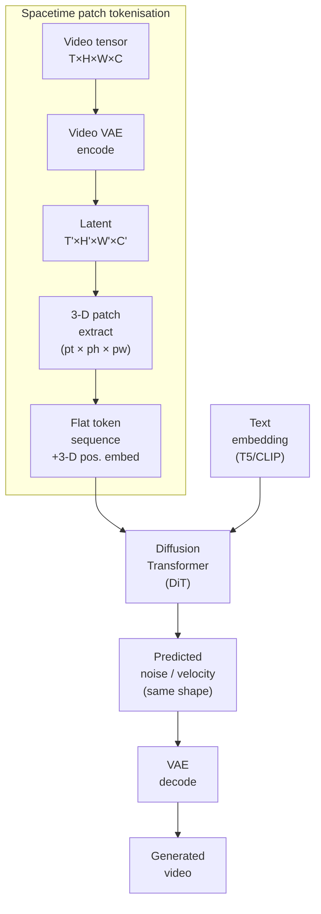
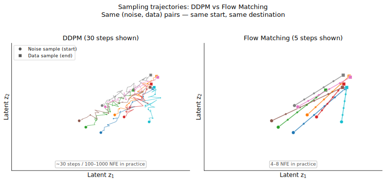
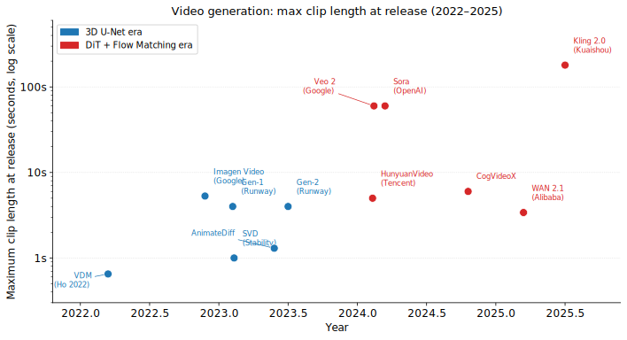

# M12 · Ch2 · §2 — Video Generation & World Models

> **Module:** The Model Landscape
> **Chapter:** Beyond text (image/diffusion, audio, video, TTS, multimodal)
> **Section:** From image diffusion to video — temporal coherence, spacetime patch tokenization
> (Sora/DiT), flow matching, the unified-model question (Transfusion), and what it means to
> call a video model a *world simulator*.
> **Status:** ✅ finalized 2026-06-25. Builds directly on §1 (diffusion, energy landscape,
> score functions, latent diffusion, DiT). Math in LaTeX; real matplotlib plots; key terms
> glossed in 中文 (大陆/台灣).

**Estimated study time:** 2.5–3 hours (frontier material; budget extra if you read the cited papers).
**Prerequisites:** §1 (DDPM, the score/SDE view, latent diffusion, classifier-free guidance, DiT
backbone). Your transformer-internals knowledge transfers directly — modern video backbones are DiTs.

---

## Why this section exists (for *you*)

§1 corrected your diffusion intuition at two points (sampling = annealed Langevin descent, not
resonance; multi-step = integrating a curved trajectory, not adding detail). Now you can build the
video story on top of that correction — because **flow matching**, the technique that replaced DDPM for
video generation, is precisely the answer to "can we make that trajectory less curved?"

Your stated goal is to understand *all* model types, and you have exactly zero paper-reading on video.
This section is where that gap closes. But it's also where your strengths are most valuable: the
energy/SDE view from §1 maps cleanly onto flow matching; your transformer architecture knowledge
transfers to the DiT backbone that Sora uses; and — most importantly — your instinct for
"this model is a simulator now, not just a filter" is exactly the right lens for the world-model
thread at the end.

---

## 1. The temporal problem: why video is not "image × frames"

The naive approach is obvious — generate each frame independently with the §1 diffusion pipeline,
concatenate, and call it a video. This fails in a way you can predict without running it.

Each independent generation seeds from a different noise sample. The §1 energy landscape has many
basins; "a dog on a beach" could land anywhere in the dog-on-beach attractor. Two independently
generated frames will be *semantically* consistent ("still a dog on a beach") but **physically
inconsistent**: the dog's fur texture changes colour between frames, its leg is in the wrong position,
the lighting direction flips. The result is called **flickering** and it's immediately visible even
without formal measurement.

The constraint video adds is **temporal coherence**: not just "each frame is plausible" but "the
sequence of frames describes a *physically possible trajectory* through the world." This is
qualitatively different from getting the scene right in each frame.

Two axes of this constraint:

| Axis | What it requires | Why it's hard |
|---|---|---|
| **Short-range coherence** | frame $t$ and frame $t+1$ are consistent | noise injection is per-step; without explicit coupling, samples are independent |
| **Long-range coherence** | frame $1$ and frame $100$ obey the same physics | a dog can't change breed mid-clip; lighting can't jump; the camera path must be smooth |

Short-range coherence is tractable with local temporal attention. Long-range coherence is the hard
problem — it requires the model to maintain a persistent "world state" across many frames, which
is exactly what makes video generation fundamentally different from image generation.

---

## 2. Generation one: inflating the U-Net to 3D

The first-generation solution was direct: extend the 2D image diffusion U-Net to handle the temporal
dimension.

### Spatial + temporal attention

A standard image U-Net operates with 2D convolutions and 2D self-attention. To add temporal
awareness:

- Replace 2D convolutions with **3D convolutions** (kernel extends over time as well as spatial
  dimensions) — or, more efficiently, decompose into 2D spatial + 1D temporal convolutions
  (*pseudo-3D*, used in Video Diffusion Models, Ho et al. 2022).
- After each spatial attention block, add a **temporal attention block** that attends across the
  time dimension. Tokens from the same spatial location at different timesteps can now exchange
  information.

This gives the model a mechanism for short-range coherence: the temporal attention head sees
adjacent frames and can enforce consistency. The cost is quadratic in the number of frames for naive
full temporal attention ($O(T^2)$ over $T$ frames), which is why many early models capped output
at 16–24 frames.

### AnimateDiff: motion modules as adapters

A clever practical insight: if you have a strong pretrained image diffusion model (Stable Diffusion),
you can add temporal coherence without retraining it.

**AnimateDiff** (Guo et al., 2023) **freezes all the spatial weights** and adds lightweight *motion
modules* — temporal attention blocks — between the existing spatial layers. Only the motion modules
are trained, on video data. At inference time, you can **swap motion modules** trained for different
styles or motion types, or remove them entirely to get back to image generation. The spatial quality
stays exactly as good as the base image model; only the temporal consistency layer is learned.

This is an early example of the modular adapter pattern: don't retrain what's already good, inject
the new capability as a learnable delta. The same design principle appears in LoRA (spatial quality
adapt) and later in video ControlNet (motion guidance).

### Cascaded video diffusion

Google's **Imagen Video** (Ho et al., 2022) and Meta's **Make-A-Video** (Singer et al., 2022) pushed
scale using the same cascaded strategy as Imagen for images: a base model generates low-resolution
short clips, then a series of spatial and temporal super-resolution models upsample them. Each stage
is a 3D U-Net or factorized equivalent.

The cascaded approach offloads temporal detail to late stages — the base model only needs temporal
consistency at low resolution, which is easier — at the cost of compounding errors across stages.

---

## 3. DiT takes over — and Sora's spacetime patches

The second-generation transition mirrors what happened in image generation: the **U-Net backbone
was replaced by a transformer** (the Diffusion Transformer, DiT, Peebles & Xie, 2023). For video,
this change is *more* significant than it was for images.

### Why transformers scale better

A U-Net has an inductive bias: it processes spatial features at multiple resolutions, with skip
connections bridging the encoder and decoder. This is a strong prior — useful for small/medium
models, but it also *caps* what the model can learn. The architecture shapes what information can
flow where.

A transformer has no such bias: every token attends to every other (globally). For images, this
doesn't matter much at small scale but unlocks at large scale (consistent with the ViT scaling
laws). For **video**, the difference is decisive, because the model needs to reason about long-range
temporal structure — a U-Net's skip connections don't help with information that's 50 frames away.

The key empirical observation (confirmed by Sora and subsequent models): **video generation quality
scales as a power law with model size and training compute**, just like LLMs, when the backbone is a
transformer. The same did not cleanly hold for 3D U-Nets.

### Spacetime patch tokenization

The architectural move that makes video DiT work is:

> **Tokenize the video as a sequence of 3D spacetime patches, then run a standard transformer on
> those tokens.**

Concretely: take a latent video tensor of shape $(T, H, W, C)$ (time × height × width × channels,
after encoding through a video VAE). Divide it into non-overlapping patches of shape
$(p_t, p_h, p_w)$. Each patch is linearly projected to a token vector, plus a 3D positional
embedding (encoding time, row, column). The result is a flat sequence of tokens — the input to a
standard bidirectional transformer.

This is **exactly** what ViT does for images ($1 \times p_h \times p_w$ patches), extended to the
temporal dimension. The critical properties that fall out:

1. **Variable-length sequences:** by choosing different patch counts, the same architecture handles
   different video durations, resolutions, and framerates. You do not need a separate architecture
   for a 5-second clip vs a 60-second clip — the sequence is just longer.
2. **No temporal inductive bias:** the transformer treats a temporal skip and a spatial skip
   identically. Long-range temporal reasoning is just global attention over the full sequence.
3. **Training diversity:** you can mix videos of wildly different shapes in the same batch (short
   low-res, long high-res) and the model learns from all of them without architecture changes.

**Sora** (OpenAI, 2024) is the first public demonstration of this at scale. The technical report
calls the tokens *visual patches* and notes that the flexibility to handle variable durations and
aspect ratios — something every prior architecture struggled with — is a direct consequence of the
tokenization choice.

<!-- DIAGRAM:START -->

Diagram source (Mermaid)

<!-- DIAGRAM:END -->

### The video VAE: temporal compression is the bottleneck

Before the DiT sees any patches, the raw video has passed through a **video VAE** that compresses
it into latents. For an image latent diffusion model (§1), the VAE compresses spatially — a
$512 \times 512$ image becomes a $64 \times 64$ latent (8× spatial compression). For video, the
VAE must also compress **temporally**.

A naive temporal compression of $8\times$ takes 24 frames → 3 latent frames: each latent frame
summarizes 8 real frames. This introduces a tension that doesn't exist for images:

- **Too little temporal compression:** the latent sequence is long → transformer computation scales
  as $O(L^2)$ in sequence length $L$ (for full attention), which becomes prohibitive at high
  framerates or long durations.
- **Too much temporal compression:** the latent discards motion information — fine-grained motion
  (lips, fingers, water ripples) is smoothed out; the VAE can no longer reconstruct it faithfully.

Getting this balance right is one of the less-publicized engineering challenges in video generation.
CogVideoX (Zhipu, 2024) uses a $4\times$ temporal / $8\times$ spatial compression; WAN 2.1 (Alibaba,
2025) uses $4\times$ temporal / $16\times$ spatial.

---

## 4. Flow matching: straighter trajectories, fewer steps

This is where the §1 correction ("multi-step = integrating a curved trajectory") pays off directly.

### Why DDPM needs many steps

Recall from §1: the DDPM reverse process is

$$\mathbf{x}_{t-1} = \frac{1}{\sqrt{\alpha_t}}\left(\mathbf{x}_t - \frac{1-\alpha_t}{\sqrt{1-\bar{\alpha}_t}}\thinspace\boldsymbol{\epsilon}_\theta(\mathbf{x}_t, t)\right) + \sigma_t\thinspace\mathbf{z}, \quad \mathbf{z}\sim\mathcal{N}(0,I).$$

Each step injects fresh stochastic noise $\sigma_t\mathbf{z}$ — that's what makes the trajectory
*curved and stochastic*. The step size must be small to keep the approximation valid: take too large
a step and you land off the manifold and the result degrades. This is why DDPMs need 100–1,000
sampling steps.

The **probability-flow ODE** (Song et al., 2021, from §1) removes the stochastic term:

$$d\mathbf{x}_t = \left[ f(\mathbf{x}_t, t) - \frac{1}{2}g(t)^2\thinspace\nabla_{\mathbf{x}}\log p_t(\mathbf{x}_t) \right] dt.$$

This is deterministic and therefore more amenable to ODE solvers that can take larger steps — down
to 20–50 steps for good quality. But the ODE still follows a *curved* path in latent space, because
the score $\nabla_{\mathbf{x}}\log p_t$ is an inherently curved field (it must curve to route the
probability mass from a Gaussian to a complicated data distribution).

### Flow matching: teach the model to go straight

**Rectified Flow** (Liu et al., 2022) and **Flow Matching** (Lipman et al., 2022) ask a different
question: what if the training target were a *straight-line* path from noise to data?

Define the interpolant:

$$\mathbf{z}_t = (1-t)\thinspace\boldsymbol{\epsilon} + t\thinspace\mathbf{x}, \qquad \boldsymbol{\epsilon}\sim\mathcal{N}(0,I),\quad \mathbf{x}\sim p_\text{data},\quad t\in[0,1].$$

This is a linear interpolation: at $t=0$ we have pure noise, at $t=1$ we have data, and the path
from one to the other is a straight line. The **conditional velocity** along this path is:

$$v^\ast(\mathbf{z}_t \mid \mathbf{x}, \boldsymbol{\epsilon}) = \mathbf{x} - \boldsymbol{\epsilon}.$$

This velocity is **constant** along each individual trajectory — it does not depend on $t$ at all.
That is the key: if the target velocity is constant, a model that learns it can take *large* steps
and still land correctly. The training loss is simply:

$$\mathcal{L}_\text{FM} = \mathbb{E}_{t,\thinspace\mathbf{x},\thinspace\boldsymbol{\epsilon}}\thinspace\left\lVert v_\theta(\mathbf{z}_t, t) - (\mathbf{x} - \boldsymbol{\epsilon}) \right\rVert^2.$$

The catch: individual trajectories are straight, but the **marginal** velocity field $v_\theta$ (the
expectation over all pairs $(\mathbf{x}, \boldsymbol{\epsilon})$ that produce the same $\mathbf{z}_t$)
is *not* straight, because trajectories from different pairs cross. The model learns an averaged
velocity that is straighter than DDPM but not perfectly straight. **Rectification** (training the
model, then re-coupling with the trained model's OT transport, and re-training) makes the paths
progressively straighter at the cost of more training compute.

In practice: flow matching requires **4–8 sampling steps** at quality comparable to 100–200 DDPM
steps. For video at 720p/24fps, this is the difference between practical and impractical.

<!-- FIGURE -->

The plot above shows sampling trajectories for the same set of (noise, data) pairs. DDPM adds
stochastic perturbations at each step; the path curves and requires many small corrections. Flow
matching targets the straight interpolant; the learned velocity is nearly constant along the path,
so a few large steps suffice.

### Is this just a better optimizer?

A natural question: the jump from DDPM's ~1,000 steps to FM's 4–8 *feels* like the speed-up from
picking a better optimizer (SGD → Adam) in training. The instinct is half right — and the half that's
wrong is the half worth pinning down.

**What's right — the shared enemy.** DDPM sampling and gradient descent are the *same kind* of
process: take a local first-order step along a path — $\mathbf{z} \leftarrow \mathbf{z} + h\thinspace v_\theta$
for the sampler, $\theta \leftarrow \theta - \eta\thinspace\nabla L$ for the optimizer. In both, the step
size is capped by **curvature**. An Euler step's error grows like $h^2\thinspace\lVert\ddot{\mathbf{z}}\rVert$,
so a bending trajectory forces small $h$; gradient descent on an ill-conditioned loss (condition
number $\kappa$ large = long, narrow, curved valleys) needs $\sim\kappa$ steps to traverse them.
*Fewer steps ⇐ less curvature* — and that lever is genuinely shared.

**What's wrong — they pull different levers.** There are two distinct ways to cut the step count of
any follow-a-path process, and these two improvements are *different ones*:

| Lever | What changes | What stays fixed | Diffusion | Optimization |
|---|---|---|---|---|
| **1. Smarter mover** | the **solver** (how you step) | the path / landscape | DDIM, DPM-Solver, Heun | SGD → **Adam**, momentum, Newton |
| **2. Straighter path** | the **problem geometry** (what you traverse) | the solver can stay dumb (Euler) | **Flow Matching** | preconditioning, natural gradient |

SGD → Adam is **Lever 1**: same loss landscape, same minimum — Adam just moves through it more cleverly.
DDPM → FM is **Lever 2**: it does *not* hand you a smarter sampler; it **reshapes the target
trajectory to a straight line** so that even plain Euler can take 4–8 huge steps. So the true diffusion
analogue of "swap SGD for Adam" is **swapping the ODE sampler** (DDIM/DPM-Solver) on the *same trained
model* — and higher-order solvers ↔ momentum/Newton, both using curvature to step bigger. Flow matching's
real optimization analogue is **preconditioning / natural gradient**: since rectification's straight
paths are the optimal-transport geodesics, "straighten the route via OT" ↔ "follow the geodesic via
natural gradient" is an exact correspondence. FM is not a better optimizer — it is a **reconditioning of
the problem** so the existing solver barely has to work.

One caveat the analogy hides: a better optimizer cuts **training** steps for free, whereas FM cuts
**inference** steps and usually *pays more training compute* (rectification re-trains the model) to do
it. Same "fewer steps" headline, opposite currencies.

### Flow matching and distillation

The straightness of FM trajectories enables aggressive **distillation**: a large FM model with 8
steps can train a student model to match its outputs in **1–4 steps**. This is how Stable Diffusion
3.5's Turbo variant and LTX-Video's fast mode work. Consistency models (Song et al., 2023) are the
extreme limit: train a model where a single step from any point on the trajectory maps directly to
$t=1$ (clean data). In practice, 1-step quality is lower but 2–4 step distilled FM is now
competitive.

---

## 5. The unified-model question: Transfusion

So far, each video system consists of at least two separate models:
1. A **text encoder** (T5, CLIP) that turns a text prompt into embeddings.
2. A **video diffusion model** that generates frames conditioned on those embeddings.

This decomposition is pragmatic, but it creates a seam: the text model and the video model are
trained separately, with different objectives. Information that the text model represents implicitly
(e.g. causal reasoning, "because A, therefore B") is not directly available to the video model in
a structured form — it must be compressed into a fixed embedding vector.

The natural question: **can a single model handle both language and image/video generation?**

### Transfusion (Zhou et al., 2024)

Transfusion's proposal: a single transformer trained simultaneously with **two objectives** on
interleaved sequences of text tokens and image/video patches:

- **Autoregressive cross-entropy loss** on text tokens (left-to-right prediction, as in a standard
  LLM).
- **Diffusion loss** on image/video patches (the FM loss from §4, conditioned on surrounding
  context).

The attention mask is asymmetric: text tokens can attend to each other causally (AR); image tokens
can attend bidirectionally to all other tokens. You can mix a text sequence, an image, another text
sequence, and another image in the same training sample.

The payoff: the text-understanding capability and the image/video-generation capability are
**entangled in the same weights**. When the model generates a video, it has access to the same
internal representations it uses for language reasoning — not a compressed bottleneck. The
demonstrated result (at 7B parameters): Transfusion matches a LLaVA-style language-image model on
text tasks and a diffusion baseline on image generation, while using half the compute per token.

### Why decoupled is still the norm

Transfusion is compelling but industrial deployments (as of mid-2025) almost universally use the
decoupled design. The reasons:

1. **Engineering independence.** The text encoder and the video model can be upgraded
   independently. Swapping T5 for a better LLM does not require retraining the video model.
2. **Training stability.** Mixing AR and diffusion losses with different token types and different
   loss scales in the same batch is tricky; the training recipe for pure diffusion models is
   well-understood.
3. **Cold start.** Decoupled design lets you initialize the video model from a pretrained image
   model (just add temporal layers), preserving spatial quality. A unified model must be trained
   from scratch.

The consensus trajectory: unified models will win at sufficient scale, because they eliminate the
bottleneck of the cross-model embedding. But the engineering overhead keeps decoupled models
dominant at deployed scale today.

---

## 6. From video generator to world model

This is where the territory changes in a way the §1 diffusion framing doesn't fully capture.

### The Sora framing

Sora's technical report is titled *"Video Generation Models as World Simulators."* The claim is
deliberate: a model trained to predict what the world looks like over time is not merely generating
aesthetically plausible pixels — it is **implicitly learning the physics and geometry of the world**
from video data alone.

The evidence: Sora produces videos with emergent behaviours that were never explicitly trained:

- **3D consistency**: objects maintain correct shape under novel camera angles, even though the
  model was trained only on 2D pixel sequences.
- **Object permanence**: an object that passes behind an occluder reappears correctly on the other
  side.
- **Gravity and contact**: a ball thrown in an arc follows a parabolic path; objects rest on
  surfaces rather than floating.
- **Lighting continuity**: shadows move consistently as the camera or light source changes.

None of these are outputs of an explicit 3D physics engine. They emerge from the statistics of the
training data, which consists of real video of the real world.

### The failure modes matter as much as the successes

Sora's technical report is unusually honest about failures, and they are diagnostic:

- **Non-physical interactions**: a person's hand passes through a glass; ice cream doesn't melt
  when licked.
- **Long-range forgetting**: over a long clip, a character's clothing style can drift; a door opened
  at the start may reappear closed with no explanation.
- **Consistency across cuts**: the model does not maintain a persistent "world state" across
  scene cuts — each segment restarts from the conditioning.

These failures have a common structure: **Sora has no explicit memory or state.** It predicts future
frames given a context window, but beyond that window, the world resets. It has not learned to
*simulate* in the sense of maintaining a state that evolves; it has learned to *synthesize* videos
that are locally coherent with a plausible world.

This is the same distinction as in LLMs: a model that predicts the next token very well is not
the same thing as a model that *reasons* about the world. The question "is Sora a world model?" is
the video-generation analogue of "does GPT-4 understand?" — it depends on what you mean by the
verb.

### Genie: action-conditioned generation

**Genie** (Bruce et al., DeepMind, 2024) takes a different route to world models. The inputs are
**unlabelled internet video** (platformer games, robot navigation, real-world scenes). The model
learns:

1. A **latent action model** that infers implicit actions from video transitions (no ground-truth
   action labels are needed).
2. A **dynamics model** that predicts the next frame given the current frame and a latent action.
3. A **video tokenizer** that compresses frames.

At inference time, a user provides a starting frame and a sequence of actions; Genie generates the
next frames. Because the latent action space is learned from the video statistics, it generalises:
a Genie model trained on human video can be prompted to generate videos of *robot* hands moving in
action-consistent ways — even though robots were not in the training data.

The key technical difference from Sora: Genie's dynamics model is **action-conditioned and
autoregressive** (one step at a time), whereas Sora generates the full clip in a single diffusion
pass. Action-conditioning enables controllable simulation; a single diffusion pass enables higher
visual quality. These are currently complementary.

### GameNGen: a game engine as a neural network

**GameNGen** (Valevski et al., Google, 2024) demonstrates an extreme form: **Doom runs entirely
inside a neural network** at 20 fps without accessing any game code. The model was trained on
gameplay data from a reinforcement-learning agent, and it generates the next frame conditioned on
the action taken.

GameNGen is not faster or more efficient than running Doom natively — it is far slower and more
compute-intensive. The point is epistemological: a neural network can implicitly learn the physics,
rendering, and game logic of a real-time 3D game well enough to simulate it faithfully at the pixel
level. The "game engine" is now in the weights.

The implication for robotics and simulation: if you can train a neural world model on real sensor
data from a robot, the model can synthesize realistic rollouts for planning and policy training —
without a hand-authored physics simulator. This is the motivation behind Google DeepMind's work on
video diffusion for robotics planning (UniSim, 2023).

---

## 7. The current landscape (mid-2025)

<!-- FIGURE -->

A brief annotated map of where things stand:

| Model | Organisation | Architecture key | Max clip at release |
|---|---|---|---|
| Video Diffusion Models | Google Brain | 3D U-Net, joint image-video | 16 frames |
| Imagen Video | Google Brain | Cascaded 3D U-Net | 128 frames, 5.3 s |
| AnimateDiff | Community | Frozen image model + motion modules | ~16–32 frames |
| Gen-2 | Runway ML | Latent video diffusion | ~4 s |
| Stable Video Diffusion | Stability AI | 3D U-Net on SD latents | 25 frames |
| Sora | OpenAI | Spacetime-patch DiT + FM | ~60 s |
| CogVideoX | Zhipu AI | 3D VAE + DiT + FM | 6 s / 49 frames |
| HunyuanVideo | Tencent | Dual-stream DiT (text + video) | 5 s |
| Veo 2 | Google DeepMind | DiT, details proprietary | ~60 s |
| WAN 2.1 | Alibaba | DiT + FM, open weights | 5 s / 81 frames |
| Kling 2.0 | Kuaishou | DiT, details proprietary | ~3 min |

**The open-source axis is real:** WAN 2.1 and CogVideoX-5B are fully open-weight and run on
consumer hardware (24 GB VRAM for WAN at standard resolution). The gap between open and proprietary
models in video narrowed dramatically in late 2024, mirroring what happened with image generation
in 2022–2023.

---

## 8. What to hold in your head

The conceptual arc of this section, compressed to six sentences:

1. **Video ≠ image × T**: temporal coherence requires explicit coupling between frames, not just
   per-frame quality.
2. **First solution — 3D U-Net**: add temporal attention to image diffusion; motion modules as
   adapters (AnimateDiff) show this scales without full retraining.
3. **Second solution — DiT + spacetime patches**: replace the U-Net backbone with a transformer
   operating on 3D patches; enables variable-length video, scales as a power law, and gives long-range
   temporal reasoning "for free" via global attention.
4. **Flow matching makes it practical**: straight-line interpolants produce nearly-constant velocity
   targets, so 4–8 sampling steps rival 100+ DDPM steps.
5. **Unified vs. decoupled**: Transfusion proves a single model can handle both language and
   image/video; decoupled architectures dominate deployments today for engineering reasons.
6. **World model = implicit physics**: models like Sora learn 3D geometry, gravity, and occlusion
   from 2D video statistics — emergent properties, not explicit programming; Genie and GameNGen push
   toward action-conditioned simulation.

The open research question that will drive the field for the next 2–3 years:
> **Can video world models be made temporally persistent** — maintaining a coherent state across
> long horizons and explicit actions — while preserving the per-frame quality of the current
> DiT/FM stack?

---

## 9. Key terms 中文对照 / 中文對照

| English | 大陆 (简体) | 台灣 (繁體) | Notes |
|---|---|---|---|
| Video generation | 视频生成 | 影片生成 | ⚠ **视频** vs **影片** — genuine difference |
| Temporal coherence | 时序一致性 | 時序一致性 | script difference only |
| Spacetime patch | 时空块 / 时空补丁 | 時空區塊 | no single consensus in CN; 区块/块 common |
| Diffusion model | 扩散模型 | 擴散模型 | script difference only |
| Flow matching | 流匹配 | 流匹配 / 流程匹配 | same characters in both; field is young |
| Velocity field | 速度场 | 速度場 | script difference only |
| Rectified flow | 整流流 | 整流流 | direct translation of "rectified flow" |
| Number of function evaluations (NFE) | 函数评估次数 | 函數評估次數 | script difference only |
| Autoregressive | 自回归 | 自迴歸 | ⚠ **回归** (regression) vs **迴歸** (return/cycle) — genuine difference |
| World model | 世界模型 | 世界模型 | identical |
| Latent space | 潜在空间 | 潛在空間 | script difference only |
| Video VAE | 视频变分自编码器 | 影片變分自編碼器 | prefix inherits 视频 vs 影片 |
| Motion module | 运动模块 | 運動模組 | ⚠ **模块** vs **模組** — common split |
| Tokenisation | 标记化 / 词元化 | 標記化 / 詞元化 | both variants used |
| Distillation | 知识蒸馏 | 知識蒸餾 | ⚠ **蒸馏** vs **蒸餾** (character variant) |

---

## 10. Applied (Q&A log)

*(Q&A session: 2026-06-25.)*

**(10a) "Is flow matching's step reduction like choosing a better optimizer?"** The session ran almost
entirely on one sharp analogy, refined in two passes. First framing: *"FM optimizes the route from
noise to data — like the optimizer in LLM training?"* Re-rank: that fuses **two optimizations on two
variables** — training (SGD/Adam over weights $\theta$, present in DDPM too, so not the distinguishing
feature) vs sampling (the ODE-integrated *route* over the latent $\mathbf{z}_t$). And FM doesn't *search*
for the route — the straight interpolant $\mathbf{z}_t=(1-t)\boldsymbol{\epsilon}+t\mathbf{x}$ is a
**prescribed** target; training is regression *matching* a known velocity, not optimization over paths.
The only genuine "route optimization" is **rectification → optimal transport**.

Second, sharper framing (his real point): *"the improvement DDPM→FM (fewer steps) feels like the
improvement SGD→Adam (faster convergence)."* This is the good version, and the re-rank became the new
**§4 callout** ("Is this just a better optimizer?"): **the shared enemy is real** — both are first-order
local steps along a path ($\mathbf{z}\leftarrow\mathbf{z}+h\thinspace v_\theta$; $\theta\leftarrow\theta-\eta\thinspace\nabla L$)
whose step size is capped by **curvature/conditioning** ($h^2\thinspace\lVert\ddot{\mathbf{z}}\rVert$;
$\kappa$), so *fewer steps ⇐ less curvature* in both. **But they pull different levers:** SGD→Adam is a
**smarter mover on a fixed path** (Lever 1; diffusion analogue = a better ODE sampler, DDIM/DPM-Solver,
on the *same* model — and higher-order solvers ↔ momentum/Newton), whereas DDPM→FM is a **straighter path
that lets a dumb Euler solver win** (Lever 2; reconditioning the problem). FM's true optimization analogue
is **preconditioning / natural gradient** — and since rectification's straight paths are the OT geodesics,
*"straighten the route via OT" ↔ "follow the geodesic via natural gradient"* is exact. Caveat he took: a
better optimizer cuts **training** steps for free; FM cuts **inference** steps and usually *pays extra
training* (rectification re-trains) to do it — same headline, opposite currencies.

**Signal:** his signature mode again — a plausible hypothesis capturing a real structural parallel
(curvature caps step count), needing the *dominant distinction* named (which lever: solver vs problem
geometry); integrated instantly. The optimization↔sampling bridge (Euler step ≈ gradient step;
solver-swap ≈ optimizer-swap; FM ≈ preconditioning) lands cleanly because it's stated in the ML
vocabulary he already owns.
