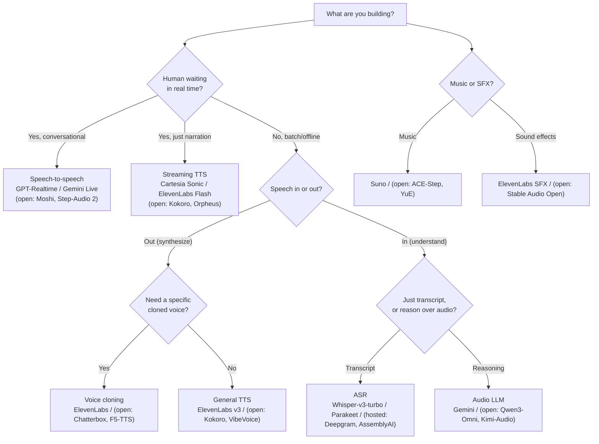

# M12 · Ch2 · §3 — Companion: Audio Model Selection Cheatsheet

> **What this is:** a practical, application-side reference for *picking* an audio model per use
> case — the SOTA/hosted option and the best open-weight option — with the trade-offs that actually
> decide the choice. Companion to [§3 (Audio, Speech & TTS)](03-audio-speech-and-tts.md), which
> explains *how* these models work. This doc is about *which one to reach for*.
>
> **⚠ Currency & health warning.** Snapshot as of **2026-07**, cross-checked against vendor pages,
> GitHub/HuggingFace, and public leaderboards. Audio moves fast — versions bump monthly, latency
> numbers shift, leaderboards churn. Treat version numbers and latency figures as "true when
> written," and re-check the linked leaderboards before committing in production. Latency figures
> marked *(vendor)* are vendor-stated, not independent benchmarks. See the **§14 successor flags**
> for what changed since a Jan-2026 view.
>
> **Self-host note.** "Consumer GPU" = a single 8–24 GB card. Your **RTX 4070 (8 GB)** is at the low
> end: most *speech* models fit; several *omni*/S2S/music models (Qwen3-Omni, Step-Audio-2, Moshi,
> YuE) want 16–24 GB — quantize or rent a bigger card. CPU-only is flagged where viable.

---

## 0. How to choose — the six axes

Model selection is almost always a projection onto **one dominant axis**. Name yours first, then the
table picks itself.

| Axis | The question | Who tends to win |
|---|---|---|
| **Quality** | Human/studio-grade output? | hosted (ElevenLabs, Suno) still edge open |
| **Latency** | Is a human waiting on the first audio chunk? | streaming specialist (Cartesia) or native speech-to-speech |
| **Cost** | High volume, thin margins? | self-hosted open weights amortize; hosted is per-second/char |
| **Privacy / control** | Can the audio leave your infra? (health, legal, on-device) | open weights, self-hosted |
| **Licensing** | Will you *sell* the output? | **check the license** — several strong open models are non-commercial |
| **Languages** | Which, and how many? | Whisper / Canary / Seamless / Gemini for breadth |

**The licensing trap (read this).** For a product that ships output commercially, license is a
*gating* filter, not a footnote. Commercial-safe (Apache/MIT): **Kokoro, Chatterbox, ACE-Step, YuE,
OpenVoice V2, Parakeet/Canary (CC-BY), Whisper (MIT)**. Non-commercial / restricted (prototypes &
internal only): **XTTS-v2 (CPML), Fish OpenAudio/S2-Pro, F5-TTS weights (CC-BY-NC via Emilia),
MusicGen/AudioGen weights (CC-BY-NC), SeamlessM4T v2 (CC-BY-NC), TangoFlux (research-only),
Audio-Flamingo/Audex (NVIDIA non-commercial), Suno/Udio lower tiers**. Always confirm on the model's
own page — several of the strongest open audio models are *code*-permissive but *weights*-non-commercial.

<!-- DIAGRAM:START -->

Diagram source (Mermaid)

<!-- DIAGRAM:END -->

---

## 1. Text-to-speech (narration, audiobooks, UI voice)

**Default hosted:** ElevenLabs v3 (quality). **Default open:** Kokoro-82M (tiny/fast/permissive);
VibeVoice for long-form multi-speaker.

| Model | Type | Consumer GPU? | When to reach for it |
|---|---|---|---|
| **[ElevenLabs v3](https://elevenlabs.io/v3)** | hosted | — | Most expressive hosted TTS (inline emotion "audio tags"), 70+ langs; GA ~Feb 2026 (⚡ supersedes Multilingual v2). *Not* the realtime model — use Flash for that |
| **[Google Gemini 3.1 Flash TTS](https://blog.google/innovation-and-ai/models-and-research/gemini-models/gemini-3-1-flash-tts/)** | hosted | — | Newest Google TTS, native multi-speaker dialogue, SynthID watermark (⚡ supersedes 2.5 TTS); [Chirp 3 HD](https://docs.cloud.google.com/text-to-speech/docs/chirp3-hd) for classic per-voice |
| **[OpenAI gpt-4o-mini-tts](https://developers.openai.com/api/docs/models/gpt-4o-mini-tts)** | hosted | — | Cheap, steerable ("instruct how to say it"), ~$0.015/min; already-on-OpenAI convenience |
| **[Azure Neural HD V3](https://learn.microsoft.com/en-us/azure/ai-services/speech-service/high-definition-voices)** | hosted | — | Enterprise scale, 700+ voices |
| **[Kokoro-82M](https://huggingface.co/hexgrad/Kokoro-82M)** | open (Apache-2.0) | ✅ (even CPU) | The open default — 82M, faster-than-real-time, 8 langs/54 voices; zero per-char cost |
| **[Microsoft VibeVoice-1.5B](https://github.com/microsoft/VibeVoice)** | open | ✅ | **Best open long-form multi-speaker** — up to ~90 min, 4 speakers; podcasts/dialogue audiobooks (Realtime-0.5B variant for streaming) |
| **[Chatterbox](https://github.com/resemble-ai/chatterbox)** | open (MIT) | ✅ | Quality + permissive license + cloning; Multilingual V3 = 23+ langs, watermark |
| **[Piper](https://github.com/rhasspy/piper)** | open (MIT) | ✅ (CPU/Pi) | Edge/offline; tiny, robotic-but-clear, many languages |
| **[Fish OpenAudio S1-mini / S2-Pro](https://huggingface.co/fishaudio/openaudio-s1-mini)** | open (⚠ non-commercial) | ✅ | Strong multilingual + emotion control (S2-Pro open-sourced Mar 2026); prototypes only |
| **[XTTS-v2](https://github.com/idiap/coqui-ai-TTS)** | open (⚠ non-commercial) | ✅ | Legacy 17-lang cloning (Coqui defunct; `idiap` community fork). Superseded for new work by Kokoro/Chatterbox/F5 |

---

## 2. Zero-shot voice cloning (mimic a voice from seconds of reference)

| Model | Type | When to reach for it |
|---|---|---|
| **[ElevenLabs](https://elevenlabs.io/v3)** (Instant / Professional) | hosted | Best fidelity **with consent/verification guardrails** — the responsible product default |
| **[Chatterbox Multilingual V3](https://github.com/resemble-ai/chatterbox)** | open (MIT) | Top open zero-shot clone **with a commercial license** + emotion-exaggeration control; watermarked |
| **[F5-TTS](https://github.com/SWivid/F5-TTS)** | open (⚠ weights CC-BY-NC) | Very realistic clone from 5–15 s (flow-matching DiT); code MIT but check weight license |
| **[OpenVoice V2](https://github.com/myshell-ai/OpenVoice)** | open (MIT) | Instant cross-lingual cloning with separate tone/style control; **commercial OK** |
| **[Hume EVI 3 / Octave](https://www.hume.ai/octave)** | hosted | Zero-shot voice capture (~30 s) with explicit prosodic/emotion steering |

> **Ethics/legal:** cloning is consent-gated and deepfake-adjacent. For any product, prefer a hosted
> API with identity verification, or enforce consent yourself. Compliance issue, not just a model
> choice. (Note: "VALL-E" is research-only — no open production model; Microsoft's public work moved
> to VibeVoice + Azure HD voices.)

---

## 3. Real-time / streaming TTS (voice agents — latency is king)

Metric is **TTFA/TTFB** (time-to-first-audio), not total render time. Voice-agent budget ≈ 800 ms
end-to-end (STT + LLM + TTS); TTS should eat ≤ ~200 ms.

| Model | Type | TTFB *(vendor / bench)* | When to reach for it |
|---|---|---|---|
| **[Cartesia Sonic-3.5](https://www.cartesia.ai/sonic)** | hosted | ~40 ms Turbo / ~90 ms *(vendor)* | Latency leader (SSM architecture); default for interruptible agents (⚡ supersedes Sonic-3) |
| **[ElevenLabs Flash v2.5](https://elevenlabs.io/docs/overview/models)** | hosted | ~135 ms e2e *(vendor)* | ElevenLabs quality at near-real-time (English strong); use Flash/Turbo — **not v3** — for agents |
| **[Deepgram Aura-2](https://deepgram.com/learn/introducing-aura-2-enterprise-text-to-speech)** | hosted | sub-200 ms *(vendor)* | Tightest STT↔TTS loop if you're already on Deepgram Nova |
| **[Rime Arcana v3](https://rime.ai/resources/arcana-v3)** | hosted | ~120 ms on-prem *(vendor)* | Conversational (phone-agent) voices, code-switching keeps identity |
| **[Orpheus 3B](https://github.com/canopyai/Orpheus-TTS)** | open (Apache-2.0 base) | ~100–200 ms | **Best open low-latency streaming** — emotion tags + zero-shot cloning; needs ~12 GB |
| **[Kokoro-82M](https://huggingface.co/hexgrad/Kokoro-82M)** | open | faster-than-real-time | Simplest self-hosted low-latency when you don't need cloning; fits 8 GB / CPU |

---

## 4. ASR / transcription (batch + streaming, multilingual)

> **"There is no catch-all model"** — the [Open ASR Leaderboard](https://huggingface.co/spaces/hf-audio/open_asr_leaderboard)'s own conclusion. Pick by *accuracy vs speed vs languages*.

| Model | Type | Consumer GPU? | When to reach for it |
|---|---|---|---|
| **[Whisper large-v3-turbo](https://huggingface.co/openai/whisper-large-v3-turbo)** | open (MIT) | ✅ (8 GB) | **Multilingual default** — 99 langs, ~6× faster than large-v3; the safe general pick (no successor as of 2026-07) |
| **[NVIDIA Canary-Qwen-2.5B](https://huggingface.co/nvidia/canary-qwen-2.5b)** | open (CC-BY) | ✅ | **Top English accuracy** on the leaderboard (~5.6% WER); SALM decoder, higher latency |
| **[NVIDIA Parakeet-tdt-0.6b-v3](https://huggingface.co/nvidia/parakeet-tdt-0.6b-v3)** | open (CC-BY) | ✅ (~2 GB) | **Speed king** (RTFx in the thousands), now 25 EU languages; batch/long-form at scale |
| **[NVIDIA Canary-1b-v2](https://huggingface.co/nvidia/canary-1b-v2)** | open (CC-BY) | ✅ | Best multilingual-European open model (25 langs + EN↔ translation) |
| **[Deepgram Nova-3 + Flux](https://developers.deepgram.com/docs/models-languages-overview)** | hosted | — | Lowest-latency agent STT with built-in end-of-turn detection (Flux Multilingual GA Apr 2026) |
| **[AssemblyAI Universal-2 / Streaming / Slam-1](https://www.assemblyai.com/universal-2)** | hosted | — | Transcript intelligence + fine-tunable speech LLM; managed |
| **[ElevenLabs Scribe v2 / Realtime](https://elevenlabs.io/blog/introducing-scribe-v2)** | hosted | — | High-accuracy multilingual STT with diarization + word timestamps (~150 ms first partial) |

---

## 5. Speaker diarization ("who spoke when")

| Model | Type | When to reach for it |
|---|---|---|
| **[pyannote community-1](https://huggingface.co/pyannote/speaker-diarization-community-1)** | open (gated) | The open default (⚡ released Jul 2026 w/ pyannote.audio 4.0; beats 3.1 across metrics); free HF token |
| **[NVIDIA Sortformer (streaming v2.1)](https://huggingface.co/nvidia/diar_streaming_sortformer_4spk-v2.1)** | open | End-to-end, overlap-aware, real-time-capable (≤4 speakers); integrates with NeMo ASR |
| **[WhisperX](https://github.com/m-bain/whisperX)** | open | Transcript **+** speaker labels **+** word alignment in one pipeline — most popular self-host combo |
| **[pyannoteAI](https://www.pyannote.ai/) / AssemblyAI / Deepgram** | hosted | Managed diarization (best-DER hosted ~11% on VoxConverse); or bundled into their STT |

---

## 6. Conversational / speech-to-speech / full-duplex voice AI

Two architectures: **cascade** (STT → LLM → TTS) vs **native speech-to-speech** (one model, audio in/out
— lower latency, keeps tone/emotion). See §7 of the main doc.

| Model | Type | Notes (2026-07) | When to reach for it |
|---|---|---|---|
| **[OpenAI GPT-Realtime-2.1](https://developers.openai.com/api/docs/models)** | hosted (S2S) | ~300–500 ms; tools, reasoning, 128k ctx; +Realtime-Translate & -Whisper siblings | Default production voice agent (⚡ supersedes gpt-4o-realtime) |
| **[Google Gemini Flash Native Audio](https://blog.google/products-and-platforms/products/gemini/gemini-audio-model-updates/)** | hosted (S2S) | ~380 ms, 90+ langs; strong function-calling | Broad language coverage / on GCP |
| **[Amazon Nova 2 Sonic](https://aws.amazon.com/bedrock/nova/)** | hosted (S2S) | On Bedrock; ~$0.27/hr input *(vendor)* | If you're on AWS |
| **[Moshi](https://github.com/kyutai-labs/moshi)** | open (S2S) | Full-duplex, ~200 ms, "inner monologue"; ~7B, wants 16–24 GB | The open full-duplex option; self-host/on-prem |
| **[Step-Audio 2 mini](https://github.com/stepfun-ai/Step-Audio2)** | open (Apache-2.0) | 8B, ~24 GB; #1 open on MMAU, beats GPT-4o-Audio on several | Self-hosted GPT-4o-class voice chat, no per-min fee |
| **[GLM-4-Voice](https://github.com/zai-org/GLM-4-Voice)** | open | ~9B, EN/ZH, low latency | Bilingual EN/ZH self-hosted voice |

> **Cascade still wins** when you need a *specific* LLM (your fine-tune), per-stage control, or cheaper
> components. **S2S wins** when latency + paralinguistics (emotion, interruption, backchannel) matter
> more than swappability.

---

## 7. Speech translation (S2T and S2S, many languages)

| Model | Type | When to reach for it |
|---|---|---|
| **[Meta SeamlessM4T v2](https://huggingface.co/facebook/seamless-m4t-v2-large)** | open (⚠ CC-BY-NC) | Unified ASR + S2TT + S2ST, ~100 langs in / ~36 out; **Streaming** & **Expressive** variants. Still Meta's latest (no v3) — but **non-commercial** |
| **[NVIDIA Canary-1b-v2](https://huggingface.co/nvidia/canary-1b-v2)** | open (CC-BY) | **Commercial-safe** bidirectional S2TT across 25 EU languages (X↔En); the open pick if you're shipping |
| **[ElevenLabs Dubbing v2](https://elevenlabs.io/blog/introducing-dubbing-v2)** | hosted | S2ST **dubbing** — 90+ langs, clones + preserves the original speaker's voice/emotion/timing (May 2026) |
| **[Google Gemini 3.5 Live Translate](https://deepmind.google/models/model-cards/gemini-3-5-audio/)** | hosted | Real-time streaming S2ST inside a conversational agent (Jun 2026, 70+ langs) |
| **[Whisper](https://huggingface.co/openai/whisper-large-v3-turbo)** (translate mode) | open (MIT) | Quick any-language → **English-only** transcription-translation (S2TT, no S2ST) |

---

## 8. Audio understanding / audio LLMs (captioning, Q&A, classification, reasoning over sound)

| Model | Type | Consumer GPU? | When to reach for it |
|---|---|---|---|
| **[Qwen3-Omni-30B-A3B](https://github.com/QwenLM/Qwen3-Omni)** | open (Apache-2.0) | needs 24 GB (quantized) | **Open SOTA** omni (audio+image+video in, text/speech out); confirmed official. (A "Qwen3.5-Omni" is *reported* Mar 2026 but the official repo is **unverified** — treat as rumor) |
| **[Qwen2.5-Omni-7B](https://huggingface.co/Qwen/Qwen2.5-Omni-7B)** | open | ✅ (4-bit) | The **consumer-GPU** omni pick — ASR, audio QA, captioning, real-time speech; GGUF/AWQ fit 8–16 GB |
| **[Kimi-Audio-7B](https://github.com/MoonshotAI/Kimi-Audio)** | open | ✅ | Unified audio foundation (ASR, QA, captioning, emotion, scene class., speech chat); 13M+ hrs |
| **[Audio Flamingo Next](https://huggingface.co/nvidia/audio-flamingo-next-hf)** | open (⚠ non-commercial) | 24 GB | Strongest open **long-audio reasoning** (30-min, temporal chain-of-thought); research only |
| **[Gemini 2.5/3.x audio](https://deepmind.google/models/gemini-audio/)** | hosted | — | Best hosted long-audio understanding (hour-long inputs) |

---

## 9. Text-to-music

> Post-lawsuit landscape: many teams self-host for **commercial rights + pipeline control**. Licenses
> bite hardest here — check carefully.

| Model | Type | Consumer GPU? | When to reach for it |
|---|---|---|---|
| **[Suno v5.5](https://suno.com/blog/v5-5)** | hosted | — | Best overall vocals + song structure; "sing in your own voice" (⚠ commercial by tier; label litigation ongoing) |
| **[ElevenLabs Music v2](https://elevenlabs.io/blog/introducing-music-v2)** | hosted | — | **Commercially cleared** (licensed training data) — the safe hosted pick if you sell output; long-form, section control, inpainting |
| **[Google Lyria 3 / RealTime](https://deepmind.google/models/lyria/)** | hosted | — | On Vertex/Gemini + Flow Music; ~3 min, multilingual vocals, SynthID; RealTime for interactive/streaming |
| **[Udio](https://www.udio.com)** | hosted | — | Realistic vocals — but ⚠ **downloads disabled since Oct 2025** (UMG settlement); verify before building on it |
| **[ACE-Step 1.5 / XL](https://github.com/ace-step/ACE-Step)** | open (MIT) | ✅ (6 GB turbo → 20 GB XL) | Open standout — MIT (commercial OK), competitive with Suno on SongEval; the self-host default |
| **[YuE 7B](https://github.com/multimodal-art-projection/YuE)** | open (Apache-2.0) | 24 GB (16 tight) | Full-length songs **with lyrics/vocals**, commercial-friendly |
| **[Stable Audio 3.0 (open variants)](https://stability.ai/news-updates/meet-stable-audio-3-the-model-family-built-for-artistic-experimentation-with-open-weight-models)** | open (Community ≤$1M) | ✅ | 3 of 4 variants open-weight; instrumental/sound-design, duration control. (⚠ **there is no "Stable Audio Open 2.0"** — this is the successor) |
| **[MusicGen (stereo)](https://github.com/facebookresearch/audiocraft)** | open (⚠ weights CC-BY-NC) | ✅ | Mature instrumental baseline — but **weights non-commercial** |

---

## 10. Text-to-sound-effects / general audio generation (foley, SFX, ambience)

| Model | Type | When to reach for it |
|---|---|---|
| **[ElevenLabs Sound Effects v2](https://elevenlabs.io/docs/overview/capabilities/sound-effects)** | hosted | Quick 48 kHz SFX from a prompt, seamless looping, video-to-SFX; commercial on paid tiers |
| **[Stable Audio Open / 3.0 Small SFX](https://huggingface.co/stabilityai/stable-audio-open-1.0)** | open (Community ≤$1M) | **Commercial-friendly** self-hosted SFX/foley/loops with duration control; on-device variants |
| **[TangoFlux](https://huggingface.co/declare-lab/TangoFlux)** | open (⚠ non-commercial) | Fast research-grade text-to-audio (up to 30 s @ 44 kHz, ~6 GB); prototypes only |
| **[AudioGen (AudioCraft)](https://github.com/facebookresearch/audiocraft)** | open (⚠ weights CC-BY-NC) | Environmental audio / foley baseline — **weights non-commercial** |

---

## 11. Voice conversion (change *identity*, keep words/prosody)

Input is *audio*, not text (dubbing, singing, live voice-changing).

| Model | Type | When to reach for it |
|---|---|---|
| **[Seed-VC](https://github.com/Plachtaa/seed-vc)** | open | **Zero-shot** VC + singing, real-time (~300 ms) from a short reference; no per-voice training |
| **[RVC v2 / Applio](https://github.com/RVC-Project/Retrieval-based-Voice-Conversion-WebUI)** | open | Highest fidelity **if you train** (~10–20 min target audio); huge community, real-time; streamer standard |
| **[so-vits-svc](https://github.com/svc-develop-team/so-vits-svc)** | open | Long-standing **singing** voice conversion; per-voice training |

---

## 12. Speech enhancement / denoising / source separation

| Task | Model | Type | When to reach for it |
|---|---|---|---|
| **Real-time voice denoise** | **[DeepFilterNet3](https://github.com/Rikorose/DeepFilterNet)** | open | Low-latency full-band (48 kHz) noise suppression; runs on CPU/edge; live-mic LADSPA plugin |
| | [Krisp](https://krisp.ai) / [NVIDIA Broadcast/Maxine](https://www.nvidia.com/en-us/geforce/broadcasting/broadcast-app/) | hosted | Turnkey real-time noise/echo suppression during live calls |
| **Speech restoration** | **[Resemble Enhance](https://github.com/resemble-ai/resemble-enhance)** | open | Denoise **+** restore distortion + bandwidth-extend to 44 kHz |
| | [Adobe Enhance Speech](https://podcast.adobe.com/enhance) / [ElevenLabs Voice Isolator](https://elevenlabs.io/docs/creative-platform/audio-tools/voice-isolator) | hosted | One-click cleanup of podcast/interview audio |
| **Enhance + separate (toolkit)** | **[ClearerVoice-Studio / MossFormer2](https://github.com/modelscope/ClearerVoice-Studio)** | open | One-stop: enhancement, speaker separation, super-res, target-speaker extraction |
| **Music stem separation** | **[Mel-Band / BS-RoFormer](https://arxiv.org/abs/2310.01809)** | open | Current best-quality stems (beats Demucs; ~12 dB SDR); used in UVR pipelines |
| | **[Demucs (htdemucs_ft)](https://github.com/facebookresearch/demucs)** | open | The standard, well-documented stem splitter (~9 dB SDR); easy to run (~3 GB) |

---

## 13. Rules of thumb (the whole doc in eight lines)

1. **Quality axis, won't self-host?** → ElevenLabs v3 (speech), Suno (music), Gemini (understanding).
2. **Latency axis (agents)?** → Cartesia Sonic (TTS) or GPT-Realtime/Gemini Live (speech-to-speech).
3. **Cost/privacy, will self-host?** → Kokoro (TTS), Whisper-turbo/Parakeet (ASR), Qwen2.5-Omni-7B (understanding), ACE-Step (music).
4. **Multilingual breadth?** → Whisper / Canary / Seamless / Gemini.
5. **Voice cloning in a product?** → hosted with consent guardrails; open = Chatterbox (commercial) / F5-TTS (non-commercial).
6. **Transcript + who-spoke-when, self-hosted?** → WhisperX (Whisper + pyannote in one).
7. **On an 8 GB RTX 4070?** → Kokoro, Whisper-turbo, Parakeet, ACE-Step, DeepFilterNet, Seed-VC, VibeVoice-1.5B fit; Qwen3-Omni-30B / Moshi / Step-Audio-2 / YuE want 16–24 GB (quantize or rent).
8. **Selling the output?** → resolve **license first**, model second. Apache/MIT (Kokoro, Chatterbox, ACE-Step, YuE, OpenVoice V2) are safe; XTTS-v2, Fish, F5 weights, and Suno's lower tiers are not.

---

## 14. Successor flags — what changed since a Jan-2026 view

Useful if you have an older mental model. Verified this pass (2026-07):

- ElevenLabs → **v3** flagship (GA ~Feb 2026); realtime stays **Flash/Turbo v2.5**.
- Cartesia Sonic-3 → **Sonic-3.5** (GA May 2026).
- Google → **Gemini 3.1 Flash TTS** (Apr 2026) + native-audio Live API.
- OpenAI realtime → **GPT-Realtime-2.1 / -mini** (Jul 2026) + Translate/Whisper siblings.
- Deepgram Nova-3 → **Flux / Flux Multilingual** (GA Apr 2026); **no Nova-4**.
- NVIDIA ASR → **Canary-Qwen-2.5B** (English top) + **Parakeet-tdt-0.6b-v3** (25 EU langs).
- pyannote 3.1 → **community-1** (Jul 10 2026, pyannote.audio 4.0); Sortformer → **streaming v2.1**.
- ElevenLabs STT → **Scribe v2 / v2 Realtime**.
- Fish Speech v1.5 → **OpenAudio S1 / S2-Pro** (S2-Pro open-sourced Mar 2026).
- Amazon Nova Sonic → **Nova 2 Sonic** (Jun 2026).
- Music: **Suno v5.5** (Mar 2026); **ElevenLabs Music v2** (May 2026, commercial-cleared); **Google Lyria 3** + Flow Music; **ACE-Step 1.5/XL**; **Stable Audio 3.0** (⚠ *there is no "Stable Audio Open 2.0"*).
- Translation: **Gemini 3.5 Live Translate** (Jun 2026) + **ElevenLabs Dubbing v2**; **SeamlessM4T v2 has no successor** and is **non-commercial**.
- **Whisper**: still **large-v3-turbo** — no v4. **DeepFilterNet**: still **DFN3** — no v4.
- **Dead/legacy:** PlayHT (shut Dec 2025, acquired by Meta); Coqui/XTTS-v2 (company gone, `idiap` fork only); Parler-TTS & MetaVoice (stale, no 2026 activity); Udio downloads disabled (Oct 2025).
- **Unverified (treat as rumor):** Qwen3.5-Omni official audio model; AssemblyAI "Universal-3.5 Pro"; "HeartMuLa" music model; Microsoft "MAI-Transcribe-1"; any "Whisper v4."

---

## Sources & leaderboards consulted (2026-07)

Living references — re-check before committing:

- **[Open ASR Leaderboard (HF)](https://huggingface.co/spaces/hf-audio/open_asr_leaderboard)** — authoritative ASR accuracy/speed board.
- TTS roundups: [Local AI Master](https://localaimaster.com/blog/best-local-tts-models) · [tryspeakeasy](https://www.tryspeakeasy.io/blog/open-source-text-to-speech-2026) · [DigitalOcean](https://www.digitalocean.com/community/tutorials/best-text-to-speech-models)
- Streaming-TTS latency: [Gradium benchmark 2026](https://gradium.ai/content/tts-latency-benchmark-2026) · [Cartesia vs ElevenLabs](https://burki.dev/blog/41-cartesia-vs-elevenlabs-tts)
- ASR roundups: [Northflank](https://northflank.com/blog/best-open-source-speech-to-text-stt-model-in-2026-benchmarks) · [Gladia](https://www.gladia.io/blog/best-open-source-speech-to-text-models) · [Parakeet vs Whisper](https://spokenly.app/blog/parakeet-vs-whisper)
- Speech-to-speech: [OpenAI Realtime docs](https://developers.openai.com/api/docs/guides/realtime) · [MarkTechPost — GPT-Realtime-2.1](https://www.marktechpost.com/2026/07/06/openai-gpt-realtime-2-1-mini-reasoning-realtime-api/)
- Diarization: [pyannote community-1](https://www.pyannote.ai/blog/community-1) · [AssemblyAI — diarization 2026](https://www.assemblyai.com/blog/top-speaker-diarization-libraries-and-apis)
- Music: [Spheron — deploy open music 2026](https://www.spheron.network/blog/deploy-open-source-ai-music-generation-gpu-cloud-2026/) · [Suno vs Udio vs Stable Audio 2026](https://www.songaifarm.com/blog/ai-music-generator-comparison-2026-suno-vs-udio-vs-stable-audio-414)
- Audio LLMs: [Qwen3-Omni](https://github.com/QwenLM/Qwen3-Omni) · [Audio Flamingo Next](https://afnext-umd-nvidia.github.io/)
- Separation/enhancement: [ClearerVoice-Studio](https://github.com/modelscope/ClearerVoice-Studio) · [Spleeter vs Demucs 2026](https://stemsplit.io/blog/spleeter-vs-demucs)
- Translation / VC: [Meta Seamless](https://github.com/facebookresearch/seamless_communication) · [Seed-VC](https://github.com/Plachtaa/seed-vc) · [Resemble — open cloning 2026](https://www.resemble.ai/resources/best-open-source-ai-voice-cloning-tools)
