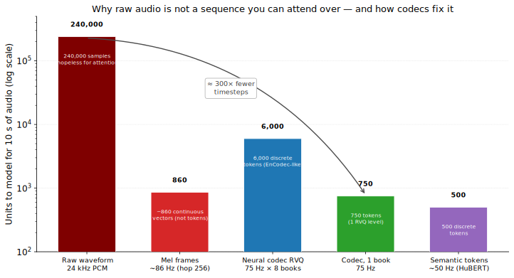
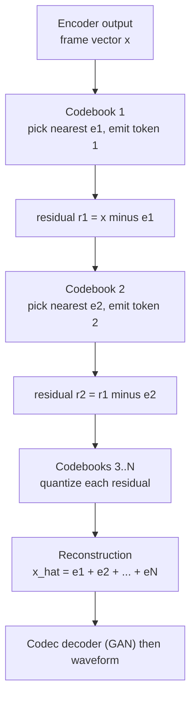
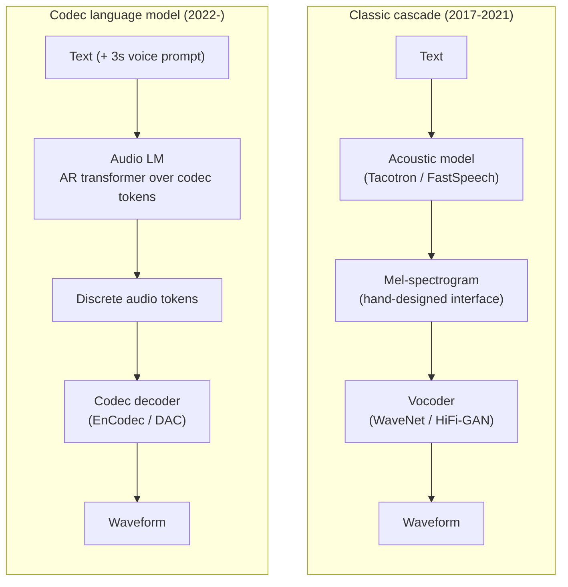

# M12 · Ch2 · §3 — Audio, Speech & TTS

> **Module:** The Model Landscape
> **Chapter:** Beyond text (image/diffusion, video, **audio/speech/TTS**, multimodal)
> **Section:** How machines represent, recognise, and generate sound — the representation
> problem (waveform → spectrogram → discrete tokens), the classic TTS cascade, neural audio
> codecs and the LLM-ification of audio, the diffusion/flow-matching branch, ASR and
> self-supervised speech, and the frontier: native audio-in/audio-out full-duplex models.
> **Status:** 🔵 prepared 2026-07-12 (awaiting Q&A → finalize). Builds on §1 (diffusion,
> score/energy view, latent diffusion) and §2 (flow matching, tokenisation, DiT). Math in
> LaTeX; real matplotlib plots; key terms glossed in 中文 (大陆/台灣).

**Estimated study time:** 2.5–3 hours (frontier material; budget extra if you read the cited papers).
**Prerequisites:** §1 (DDPM, the score/SDE view, latent diffusion), §2 (flow matching, codec-style
tokenisation, the DiT backbone). Your transformer and quantization knowledge transfers directly — the
modern audio stack is *autoregressive transformers over discrete tokens* and *flow-matching decoders*,
both of which you already understand from the LLM and diffusion sides.

---

## Why this section exists (for *you*)

You've now closed the image (§1) and video (§2) gaps. Audio is the third "beyond text" modality, and
it's the one where your **background is the biggest advantage of any section in this chapter** — audio
*is* a signal-processing domain, and Fourier analysis, sampling theory, and the time–frequency
trade-off are tools you own from physics. Where §1 leaned on energy landscapes and §2 on ODE
trajectories, this section leans on the DSP you already have.

The section is built around one organising idea that makes the whole field legible:

> **Every audio model is defined by the representation it chooses.** Raw waveform, spectrogram, or
> discrete token — that single choice determines the architecture, the cost, and the failure modes.

Once you see the representation, you can predict the model. And the punchline connects straight back
to §2: the move that unlocked modern audio generation — **neural audio codecs producing discrete
tokens** — is the audio analogue of spacetime-patch tokenisation, and the technique that made
high-quality TTS fast — **flow matching** — is the exact same one you dissected for video.

---

## 1. The representation problem

### What sound is, to a computer

Sound is a pressure wave — a continuous 1-D function of time. A microphone samples it into a
sequence of numbers by two discretisations:

- **Sampling rate** $f_{s}$ — how many amplitude readings per second. By the **Nyquist–Shannon**
  theorem, to represent frequencies up to $f_{\max}$ without aliasing you need $f_{s} \geq 2 f_{\max}$.
  Human hearing tops out near 20 kHz, so music uses $f_{s} = 44.1$ or $48$ kHz. Speech energy lives
  below ~8 kHz, so speech systems commonly use **16 kHz** (and telephony historically 8 kHz).
- **Bit depth** — how finely each amplitude is quantised. 16-bit PCM gives $2^{16} = 65{,}536$ levels;
  the classic $\mu$-law companding used by WaveNet quantises to 256 levels on a logarithmic (loudness-
  perceptual) scale.

You know Nyquist already; the point worth carrying forward is the *consequence*.

### The sequence-length problem — why raw waveform is (almost) hopeless

Ten seconds of 24 kHz audio is $240{,}000$ samples. A transformer's self-attention is $O(L^{2})$ in
sequence length $L$ (Ch1 §3 / your own LLM knowledge), so attending over raw audio is a non-starter —
that's $5.76 \times 10^{10}$ attention entries for a ten-second clip. Even a purely convolutional or
recurrent model must span enormous receptive fields to reach from one phoneme to the next (a single
phoneme is ~1,500 samples).

This is *the* constraint that shapes the whole field. Every successful audio model is, at heart, a
scheme for **shortening the sequence** — compressing 240,000 raw samples into something a neural
network can actually model, while throwing away as little perceptually relevant information as possible.

The figure previews the whole section's cast of representations, ranked by how many units the model
must process. Keep it in mind — each representation below is one bar.

### Time domain vs frequency domain: the spectrogram

The alternative to modelling raw samples is to move to the **frequency domain**. The **Short-Time
Fourier Transform (STFT)** slides a window (say 25 ms) across the signal in hops (say 10 ms) and takes
the Fourier transform of each window. The magnitude of the result is a **spectrogram**: a 2-D
time × frequency image where brightness is energy at that time and frequency.

This does two things at once:

1. **It shortens the sequence.** A 10 ms hop turns 24,000 samples/second into ~100 frames/second — a
   ~240× reduction in the temporal axis.
2. **It exposes structure.** Speech and music have clear frequency structure (harmonics, formants,
   notes) that is *implicit* in the waveform but *explicit* in the spectrogram.

> **DSP lens (this one earns its place).** The STFT window length is a genuine
> **time–frequency uncertainty** trade-off — the same Gabor/Heisenberg limit you know. A long window
> gives fine frequency resolution but smears time (you can't localise a transient); a short window
> localises time but blurs frequency. There is no window that is sharp in both. Every spectrogram is a
> point on that trade-off curve, chosen for the signal.

### The mel scale: warp frequency to perception

Human pitch perception is roughly logarithmic — we distinguish 100 Hz from 200 Hz easily but barely
hear 10,000 Hz vs 10,100 Hz. The **mel scale** warps the frequency axis to match:

$$m = 2595 \thinspace \log_{10}\left(1 + \frac{f}{700}\right).$$

A **mel-spectrogram** applies a bank of triangular filters spaced evenly on the mel scale (so densely
packed at low frequency, sparse at high) and usually takes the log of the energy. The result is a
compact ~80-channel × ~frames image that discards perceptually irrelevant detail. **The mel-spectrogram
is the single most important classical representation in speech** — it is the input to almost every
pre-2022 speech model and still ubiquitous today.

Panel (a) is the raw waveform — three "syllables" and, at ~0.47 s, a broadband **fricative** burst
(an "s"-like sound). Panel (b) is the linear spectrogram: the horizontal bands are **harmonics** of
the pitch $f_{0}$, and the fricative shows up as a vertical smear of energy across *all* frequencies.
Panel (c) is the mel version — notice the low frequencies (where the harmonics and formants live) are
stretched out, and the highs are squashed. Same information, warped to where the ear cares.

### The phase problem — why you can't just invert a spectrogram

Here is the subtlety that motivates half of this section. The spectrogram keeps only the **magnitude**
of each STFT bin and throws away the **phase**. But the waveform depends on both. To turn a
(mel-)spectrogram back into audio you must **reconstruct the missing phase** — and that is a genuinely
hard inverse problem.

The classical answer, **Griffin–Lim** (1984), iterates between the time and frequency domains guessing
a consistent phase. It works but sounds "robotic"/metallic because the reconstructed phase is only
approximately right. This lossy inverse is exactly why, when neural TTS produces a mel-spectrogram, it
needs a learned **vocoder** to render high-quality audio from it: the vocoder's real job is to
synthesise plausible phase and fine waveform detail that the mel-spectrogram doesn't contain.

> **DSP lens.** Magnitude-only spectrograms are (within a window) invariant to time-shift, which is why
> phase — the thing that encodes *precisely when* each frequency component peaks — is both discarded by
> the transform and essential to reconstruct. Getting phase wrong is audible as roughness, not as a
> pitch or loudness error.

With the representations in hand, the model families fall out naturally.

---

## 2. The classic TTS cascade (2017–2021)

Text-to-speech was, for years, a pipeline of specialised models. Understanding the cascade is worth it:
it names the sub-problems, and every "end-to-end" model since is best understood as *collapsing* one or
more of these stages.

$$\underbrace{\text{text}}_{} \quad \rightarrow \quad \underbrace{\text{acoustic model}}_{\text{text} \to \text{mel}} \quad \rightarrow \quad \underbrace{\text{mel-spectrogram}}_{} \quad \rightarrow \quad \underbrace{\text{vocoder}}_{\text{mel} \to \text{waveform}} \quad \rightarrow \quad \text{audio}.$$

### Stage 1 — the acoustic model (text → mel-spectrogram)

The hard part here is **alignment**: text has (say) 40 phonemes; the mel-spectrogram has 800 frames.
Which frames belong to which phoneme, and for how long? The two generations answer differently.

- **Tacotron 2** (Shen et al., 2018) is **autoregressive with attention** — a seq2seq model that emits
  mel frames one at a time, using an attention mechanism to softly align each frame to the input
  characters. It produced the first genuinely natural neural TTS, but inherited the failure modes of
  soft attention: **skipping** words, **repeating** them, or **babbling** on hard inputs, because
  nothing forces the alignment to be monotonic and complete.
- **FastSpeech / FastSpeech 2** (Ren et al., 2019/2020) is **non-autoregressive**. It predicts an
  explicit **duration** for each phoneme with a duration predictor, then a **length regulator** simply
  copies each phoneme's hidden state that many times to build the frame sequence — no attention, no
  autoregression. This makes it (a) **fast** (all frames in parallel) and (b) **robust** (a phoneme
  can't be skipped or repeated; the alignment is monotonic *by construction*). FastSpeech 2 adds a
  **variance adaptor** predicting pitch and energy, which the mel decoder conditions on.

This autoregressive-vs-parallel split, and the "make the alignment structural instead of learned" move,
is a theme you'll see repeated — it's the same instinct as FastSpeech's descendants in the flow-matching
branch (§5).

### Stage 2 — the vocoder (mel → waveform)

This is the phase-reconstruction problem from §1.6, solved with a learned model. Its history is a
sprint from "high quality but unusably slow" to "high quality and real-time":

- **WaveNet** (van den Oord et al., 2016) models the waveform **autoregressively, one sample at a
  time**: $p(\mathbf{x}) = \prod_{t} p(x_{t} \mid x_{<t})$, with **dilated causal convolutions**
  stacking to a huge receptive field. Superb quality — and catastrophically slow, because generating
  one second means 24,000 sequential forward passes.
- **Parallel WaveNet** (2017) distils the autoregressive teacher into a parallel student (an inverse
  autoregressive flow), buying real-time synthesis.
- **HiFi-GAN** (Kong et al., 2020) is the workhorse that won: a **GAN** vocoder whose generator is a
  stack of transposed convolutions and whose discriminators judge the waveform at multiple periods and
  scales. It is fast, small, and near-indistinguishable from real audio — and it's still a default
  vocoder in 2025.
- **Flow** (WaveGlow) and **diffusion** (DiffWave, WaveGrad) vocoders also exist; diffusion vocoders
  are highest-quality-per-effort but slower than GANs.

**The cascade's weakness** is the mel-spectrogram bottleneck in the middle: it's a hand-designed
interface, it discards phase, and errors compound across the two independently-trained stages. The rest
of the section is largely the story of **removing that bottleneck**.

---

## 3. Neural audio codecs — turning audio into discrete tokens

This is the pivotal idea of modern audio, and the one that connects the field to everything you know
about LLMs. It answers the sequence-length problem from §1 not by moving to the frequency domain, but by
**learning a discrete vocabulary for audio**.

### The VQ-VAE lineage

A neural audio codec is an autoencoder with a **quantiser** in the middle:

- an **encoder** (strided convolutions) compresses the waveform to a low-rate sequence of latent
  vectors (e.g. 75 vectors/second — a ~320× temporal reduction from 24 kHz);
- a **vector quantiser** snaps each latent vector to the nearest entry in a learned **codebook**,
  replacing it with the entry's integer index — a **token**;
- a **decoder** (a GAN, à la HiFi-GAN) reconstructs the waveform from the quantised vectors.

The whole thing is trained with a reconstruction loss + adversarial loss + the VQ commitment loss.
Now audio is a **short sequence of integers from a fixed vocabulary** — exactly the shape a language
model eats.

### Residual Vector Quantization (RVQ): the trick that makes it work

A single codebook can't capture audio at high fidelity — you'd need an astronomically large vocabulary.
**RVQ** (used in SoundStream, EnCodec, DAC) solves this with a *cascade* of codebooks, each quantising
the **residual error** left by the previous one:

<!-- DIAGRAM:START -->

Diagram source (Mermaid)

<!-- DIAGRAM:END -->

The first codebook captures the coarse structure; each subsequent one refines what's left. With $N$
codebooks of size $K$ each, you get the expressive power of $K^{N}$ combinations at the storage cost of
$N \log_{2} K$ bits — a **coarse-to-fine** decomposition that should feel familiar from your work with
block quantization on the LLM side (§ your DeepSeek deck), and from §1's coarse-to-fine diffusion.

This is a real, deployed technology twice over: **EnCodec** (Défossez et al., Meta, 2022) is a
neural codec that beats MP3 at the same bitrate, *and* its tokens are the substrate for generative
audio models. **DAC** (Descript Audio Codec, 2023) improved fidelity further.

### The catch RVQ introduces

RVQ multiplies the token count: one *frame* now costs $N$ tokens (one per codebook level). Look back at
the figure in §1 — "codec RVQ, 8 books" is 8× taller than "codec, 1 book". So a generative model over
codec tokens must decide **how to order** the $N$ codebook streams. Flatten them (fully autoregressive,
$N$× longer sequence)? Predict all $N$ in parallel per frame (fast, but they're correlated)? The
**delay/interleaving patterns** used by MusicGen (§4) are engineering answers to exactly this. It is the
audio-specific wrinkle that has no clean analogue in text.

---

## 4. The LLM-ification of audio

Once audio is discrete tokens, the entire autoregressive-transformer playbook applies. This is the
dominant paradigm of the last three years, and it collapses the §2 cascade into a single language model.

<!-- DIAGRAM:START -->

Diagram source (Mermaid)

<!-- DIAGRAM:END -->

### Semantic vs acoustic tokens — the two-level insight

**AudioLM** (Borsos et al., Google, 2022) made a key distinction that recurs everywhere:

- **Semantic tokens** — extracted from a self-supervised speech model (w2v-BERT / HuBERT, §6). They
  capture **content and phonetics** (what is said, the linguistic structure) at a low rate, but discard
  speaker identity and fine acoustic detail.
- **Acoustic tokens** — the RVQ codec tokens from §3. They capture **how it sounds** (speaker, prosody,
  recording conditions) in fine detail, but individually carry little linguistic meaning.

AudioLM generates in stages: first model the **semantic** token stream (gets the content and long-range
structure right), then generate **acoustic** tokens *conditioned on* the semantic ones (fills in a
consistent voice and fidelity). This is coarse-to-fine again, now split along a *content vs timbre* axis
— and it's why the field talks about "semantic tokens" as a first-class object.

### VALL-E: TTS as a language-modelling task

**VALL-E** (Wang et al., Microsoft, 2023) reframed TTS itself as codec-language-modelling and delivered
the headline capability of the era: **zero-shot voice cloning from a 3-second sample**. You give it the
text to speak *and* a 3-second recording of a target speaker (encoded to acoustic tokens) as a **prompt**;
it continues the token sequence in that speaker's voice. No fine-tuning — the speaker is adapted purely
by **in-context learning**, exactly the mechanism you know from LLM few-shot prompting.

VALL-E uses a hybrid: an **autoregressive** model for the first (coarse) codebook stream and a
**non-autoregressive** model for the remaining codebooks (conditioned on the first), a pragmatic answer
to the RVQ-ordering problem from §3. The capability — and its obvious misuse potential — is why voice
cloning became a deepfake and consent concern almost overnight.

### MusicGen and music generation

**MusicGen** (Copet et al., Meta, 2023) is a single-stage codec transformer for **music** from text,
and its contribution is largely the **codebook delay pattern**: instead of flattening the $N$ RVQ
streams (too long) or predicting them fully in parallel (ignores their correlation), it offsets each
codebook by one step so the model predicts codebook $i$ of frame $t$ using codebook $i-1$ of the same
frame — a clean middle ground. Music also raises the **long-range structure** problem in its sharpest
form (a song has verse/chorus structure over minutes), which is still only partly solved.

---

## 5. The diffusion / flow-matching branch

Not everyone went autoregressive. The other major branch generates audio (usually the mel-spectrogram or
a codec latent) with **diffusion or flow matching** — and this is where §2's machinery reappears
verbatim.

- **Grad-TTS** (Popov et al., 2021) put a **diffusion** model on the mel-spectrogram: score-based
  denoising (§1) conditioned on text, then a vocoder. High quality, but many sampling steps.
- **Voicebox** (Le et al., Meta, 2023) used **flow matching** (§2!) for non-autoregressive,
  text-conditioned speech *infilling* — it can edit a region of speech, do zero-shot TTS, denoise, all
  as instances of "fill in the masked audio." Flow matching gives it the few-step sampling that makes it
  practical.
- **Matcha-TTS** (Mehta et al., 2023) is conditional flow matching + a monotonic-alignment acoustic
  model — a compact, fast, high-quality open TTS.
- **E2-TTS / F5-TTS** (2024) push simplicity to the limit: **no phoneme model, no duration predictor,
  no explicit alignment**. F5-TTS pads the character sequence with filler tokens to the audio length and
  lets a flow-matching DiT (§2's backbone!) learn the alignment implicitly. It's a striking convergence:
  the video-generation architecture (DiT + flow matching) applied to speech, dropping decades of
  speech-specific machinery.
- **NaturalSpeech 2/3** (Microsoft, 2023/24) use latent diffusion over codec latents with factorised
  attributes (content, prosody, timbre, acoustic detail modelled separately) for high-fidelity,
  controllable zero-shot TTS.

> **Callback to §2.** Recall the §2 punchline: flow matching wins because straight-line interpolants
> give a nearly-constant target velocity, so 4–8 sampling steps rival 100+ DDPM steps. That's *why* the
> flow-matching TTS models (Voicebox, Matcha, F5) are fast enough to deploy. The optimizer-vs-
> preconditioning distinction you sharpened for video is the *same* distinction here — nothing new to
> learn, just a new modality wearing it.

**AR-over-codec-tokens vs flow-matching-over-latents** is the central architectural fork in audio
generation today, and it mirrors the AR-vs-diffusion tension you saw in image (§1) and video (§2). AR
models are strong on in-context adaptation (voice cloning) and streaming; flow-matching models are
strong on parallel speed and editing/infilling. The frontier (§7) increasingly blends them.

---

## 6. Recognition and representation: ASR and self-supervised speech

Generation is half the story. The **encoder** side — turning audio into text or into useful
representations — both matters on its own and *feeds* the generative side (semantic tokens come from
here).

### ASR: from HMMs to Whisper

Automatic Speech Recognition went through the same arc as the rest of ML:

- **HMM-GMM → DNN-HMM**: decades of hand-built pipelines (acoustic model + pronunciation lexicon +
  language model), aligned with Hidden Markov Models.
- **End-to-end**: **CTC** (Connectionist Temporal Classification — a loss that marginalises over all
  alignments of a label sequence to a longer frame sequence, so you don't need frame-level labels),
  **RNN-Transducer** (streaming-friendly), and **seq2seq attention** collapsed the pipeline into one
  network.
- **Whisper** (Radford et al., OpenAI, 2022) is the model worth internalising, and its lesson is
  **not architectural** — it's a fairly standard encoder-decoder transformer over log-mel input. The
  lesson is **scale of weakly-supervised data**: 680,000 hours of audio-transcript pairs scraped from
  the web, trained multitask (transcribe, translate-to-English, language-ID, timestamps) with special
  tokens marking the task. The result is **robustness** — Whisper works across accents, noise, and
  domains without fine-tuning — bought by data scale and weak labels, not clever inductive bias. It's
  the audio instance of the same "just scale (weakly-labelled) data" story you know from LLMs, and it
  connects to your reading-track thesis about training methodology.

### Self-supervised speech representations — where "semantic tokens" come from

The unlabelled-audio pretraining models are the ones that produce the semantic tokens of §4:

- **wav2vec 2.0** (Baevski et al., Meta, 2020) — mask spans of a latent audio sequence and solve a
  **contrastive** task (identify the true quantised latent among distractors). Fine-tuned with CTC on a
  *tiny* amount of labelled data, it reached strong ASR — the "BERT moment" for speech.
- **HuBERT** (Hsu et al., 2021) — instead of contrastive learning, run **offline k-means** on features
  to get discrete cluster IDs, then train the model to **predict the cluster ID of masked frames**
  (masked prediction, like BERT), iterating (re-cluster on better features, repeat). HuBERT's discrete
  units *are* a common source of semantic tokens.
- **w2v-BERT** combines contrastive + masked-prediction objectives; it's what AudioLM used.

The elegant loop to notice: **self-supervised speech models both recognise (fine-tune → ASR) and
generate (their discrete units seed generative audio LMs).** The semantic token is the shared currency
between understanding and generation.

---

## 7. The convergence: native audio LLMs and full-duplex speech

The obvious way to give an LLM a voice is a **cascade**: ASR (speech → text) → LLM (text → text) → TTS
(text → speech). It works, and it's how most "talk to your assistant" systems were built. But it has two
deep flaws:

1. **Latency.** Three models in series, and the LLM can't start until ASR finishes a full utterance —
   easily 1–2 seconds of turn-taking lag, which breaks the feel of conversation.
2. **Lost paralinguistics.** Text is a lossy bottleneck between the ears and the mouth. Emotion, tone,
   sarcasm, emphasis, laughter, who's-speaking, background sound — all of it is destroyed by the
   ASR→text step and cannot be recovered by TTS. The model literally cannot hear *how* you said
   something, only *what*.

The frontier removes the text bottleneck: **native audio-in, audio-out models** that consume and
produce audio tokens directly, with a text stream alongside for reasoning rather than as the interface.

- **GPT-4o** (OpenAI, 2024) — "omni" — is trained end-to-end across text, vision, and audio, so speech
  goes in and comes out without a text round-trip; average voice latency ~320 ms, in the range of human
  conversational turn-taking, and it can convey and perceive tone and emotion.
- **Moshi** (Défossez et al., Kyutai, 2024) is the open, architecturally explicit version and the one
  to study. It is **full-duplex**: rather than push-to-talk turn-taking, it models **two audio streams
  simultaneously** — the user's and its own — so it can listen and speak at the same time, handle
  interruptions and backchannels ("mm-hm"), and overlap naturally. Its **"inner monologue"** trick
  predicts a time-aligned text token stream jointly with the audio tokens, which both improves content
  quality and gives you a transcript for free. It runs on a neural codec (Mimi) at low latency (~160–200
  ms theoretical).
- Related: **SpiRit-LM** (Meta, 2024) interleaves text and speech tokens in one LM to preserve
  expressivity; **SeamlessM4T** (Meta, 2023) does massively-multilingual speech-to-speech translation.

**Full-duplex is the genuinely new capability** — every prior system, cascade or not, assumed strict
turns. Modelling the conversation as two concurrent token streams is the audio analogue of the shift
from request/response to a persistent bidirectional channel (Ch3 §2's async world, if you want the
systems parallel), and it's where the field is heading.

---

## 8. The current landscape (mid-2025)

| Model | Org | Type | Representation | What it's for |
|---|---|---|---|---|
| HiFi-GAN | Kakao | GAN vocoder | mel → waveform | fast, high-quality vocoding (still a default) |
| FastSpeech 2 | Microsoft | non-AR acoustic model | text → mel | fast, robust classic TTS |
| EnCodec / DAC | Meta / Descript | neural codec (RVQ) | waveform ↔ tokens | the token substrate for generative audio |
| Whisper | OpenAI | seq2seq ASR | log-mel → text | robust multilingual transcription/translation |
| wav2vec 2.0 / HuBERT | Meta | self-supervised | waveform → units | ASR fine-tuning + semantic tokens |
| VALL-E (2) | Microsoft | codec LM | text + prompt → tokens | zero-shot voice cloning |
| AudioLM | Google | codec LM | semantic + acoustic | continuation, foundation for the paradigm |
| MusicGen | Meta | codec LM | text → tokens | open text-to-music |
| Stable Audio | Stability | latent diffusion | text → latent | text-to-music/SFX with timing control |
| Voicebox / F5-TTS | Meta / open | flow matching | text → mel/latent | fast NAR TTS, infilling, editing |
| NaturalSpeech 3 | Microsoft | latent diffusion | factorised codec | high-fidelity controllable TTS |
| GPT-4o | OpenAI | native omni | audio ↔ audio | low-latency spoken assistant |
| Moshi | Kyutai | native full-duplex | audio ↔ audio | open full-duplex speech dialogue |

**The open axis is real here too:** EnCodec/DAC, Whisper, HuBERT, MusicGen, F5-TTS, and Moshi are all
open-weight and run on consumer hardware — you could run most of this stack on your RTX 4070. As with
image (2022) and video (2024), the open/proprietary gap in audio narrowed sharply through 2024–25.

---

## 9. What to hold in your head

The conceptual arc, compressed:

1. **Representation is destiny.** Raw waveform (240k units / 10 s) is too long to model directly; the
   whole field is schemes to shorten it — spectrogram, mel-spectrogram, or (the modern winner) discrete
   codec tokens.
2. **The classic cascade** (text → acoustic model → mel → vocoder) names the sub-problems: **alignment**
   (Tacotron's soft attention → FastSpeech's structural durations) and **phase reconstruction** (why a
   learned vocoder exists; HiFi-GAN is the workhorse).
3. **Neural codecs + RVQ** turn audio into a short discrete sequence, which is the hinge of the field:
   it makes audio an LLM problem. RVQ's coarse-to-fine residual codebooks are the mechanism (and their
   $N$-streams-per-frame is the new wrinkle).
4. **The LLM-ification**: AudioLM's semantic-vs-acoustic split; VALL-E's zero-shot voice cloning as pure
   in-context learning; MusicGen's codebook-delay pattern.
5. **The flow-matching branch** (Voicebox, Matcha, F5-TTS) is §2's technique applied to speech —
   straight trajectories → few-step, deployable NAR TTS; F5-TTS even reuses the DiT backbone.
6. **Recognition feeds generation**: Whisper's lesson is *scale of weak supervision, not architecture*;
   self-supervised models (wav2vec 2.0, HuBERT) both do ASR and emit the semantic tokens the generative
   side consumes.
7. **The frontier is native, full-duplex audio** (GPT-4o, Moshi): drop the ASR→text→TTS bottleneck to
   kill latency and preserve paralinguistics; model conversation as two concurrent token streams.

The open research questions that will drive the next 2–3 years:
> **Can a single model be a great listener *and* a great speaker *and* a great reasoner at once** —
> without the text bottleneck, at conversational latency, with long-range musical/narrative structure —
> and can the AR-token and flow-matching branches be unified the way image/video generation is
> converging on DiT + flow matching?

---

## 10. Key terms 中文对照 / 中文對照

| English | 大陆 (简体) | 台灣 (繁體) | Notes |
|---|---|---|---|
| Speech synthesis / TTS | 语音合成 | 語音合成 | script difference only |
| Speech recognition (ASR) | 语音识别 | 語音辨識 | ⚠ **识别** vs **辨識** — genuine word difference |
| Waveform | 波形 | 波形 | identical |
| Sampling rate | 采样率 | 取樣率 | ⚠ **采样** vs **取樣** — common split |
| Spectrogram | 声谱图 / 频谱图 | 聲譜圖 / 頻譜圖 | script difference; both 声/频 used |
| Mel-spectrogram | 梅尔频谱 | 梅爾頻譜 | transliteration 梅尔/梅爾 |
| Fourier transform | 傅里叶变换 | 傅立葉變換 | ⚠ **傅里叶** vs **傅立葉** (name) + 变换/變換 |
| Phase | 相位 | 相位 | identical |
| Vocoder | 声码器 | 聲碼器 | script difference only |
| Codec | 编解码器 | 編解碼器 | script difference only |
| Vector quantization | 矢量量化 / 向量量化 | 向量量化 | 大陆 also uses 矢量; 台灣 uses 向量 |
| Codebook | 码本 | 碼本 | script difference only |
| Token | 词元 / 标记 | 詞元 / 標記 | as in text; 令牌 also seen |
| Autoregressive | 自回归 | 自迴歸 | ⚠ **回归** vs **迴歸** — genuine difference |
| Voice cloning | 声音克隆 | 聲音複製 / 語音克隆 | ⚠ **克隆** vs **複製** — 台灣 often 複製 |
| Prosody | 韵律 | 韻律 | script difference only |
| Phoneme | 音素 | 音素 / 音位 | mostly identical |
| Full-duplex | 全双工 | 全雙工 | script difference only |
| Diffusion / flow matching | 扩散 / 流匹配 | 擴散 / 流匹配 | see §2 |

---

## 11. Applied (Q&A log)

*(Placeholder — to be filled during the Q&A session, then this section is finalized.)*
