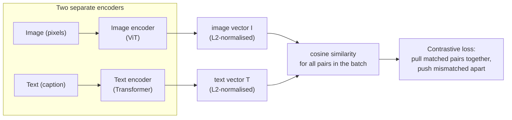
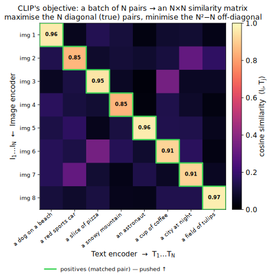
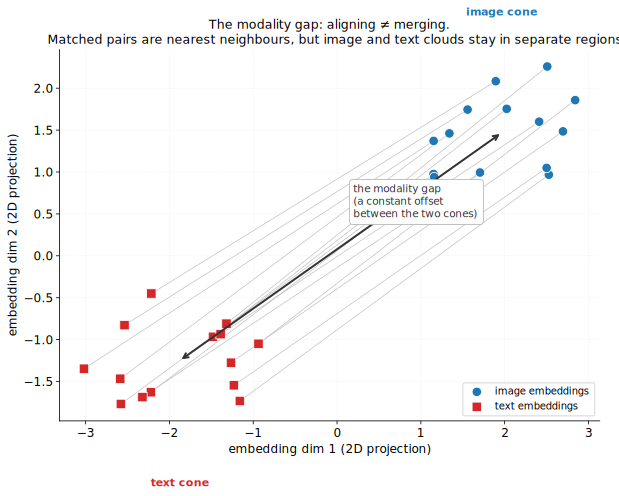
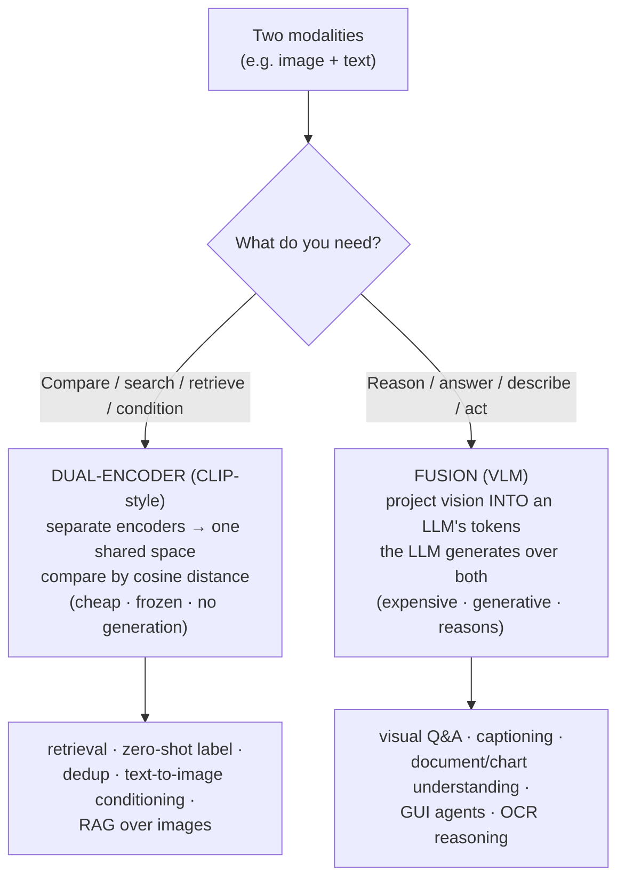
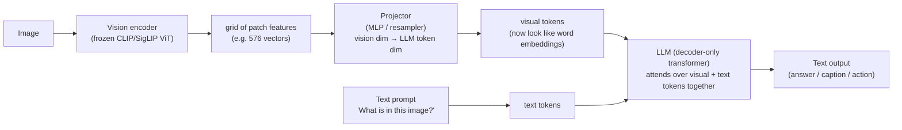
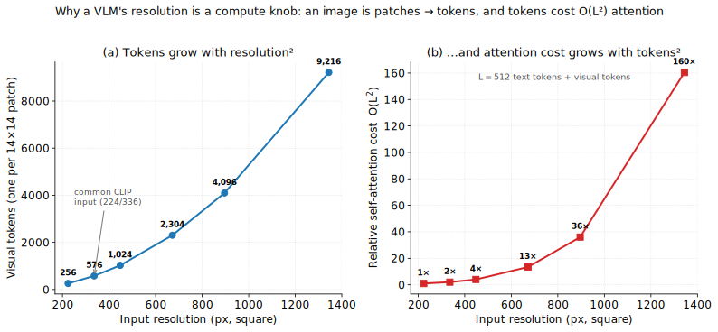

# M12 · Ch2 · §4 — Multimodal & Representation

> **Module:** The Model Landscape
> **Chapter:** Beyond text (image/diffusion, video, audio/speech/TTS, **multimodal & representation**)
> **Section:** The idea that ties the whole chapter together — **everything becomes an
> embedding.** How a model turns pixels, audio, and text into vectors in a shared space
> (CLIP and contrastive learning), the two grand strategies for going multimodal
> (dual-encoder *alignment* vs *fusion into an LLM* — the VLM), how a modern
> vision-language model is actually built, and the application layer you'll live in:
> **choosing an embedding model** for retrieval/search (the RAG substrate → M13 Ch2).
> **Plus §8 — an application-side embedding/VLM model-selection cheatsheet.**
> **Status:** 🔵 prepared 2026-07-15, awaiting Q&A. Capstone of Ch2 "Beyond text";
> builds on §1 (latent/diffusion), §2 (patch tokenisation, DiT) and §3 (discrete
> tokens, semantic vs acoustic). Math in LaTeX; real matplotlib plots; key terms
> glossed in 中文 (大陆/台灣). §9 Applied is a placeholder to fill after the session.

**Estimated study time:** 2.5–3 hours (conceptual core is frontier-level; §8 is a practical
reference you can skim and return to).
**Prerequisites:** your transformer/embedding knowledge from the LLM side transfers directly;
§1 (latent representations), §2 (patch → token, the ViT/DiT backbone), §3 (the "shorten the
sequence into discrete tokens" move). Nothing new to learn about attention — this section is
about *what goes into* it and *how the vectors are arranged*.

---

## Why this section exists (for *you*)

The first three sections of this chapter each took one modality — images (§1), video (§2), audio
(§3) — and asked *how do we generate it?* This section steps back and names the thread that runs
through all of them, and through your daily LLM work too:

> **A modern model does not "see" or "hear." It turns everything into a vector, and everything
> interesting happens in the geometry of those vectors.** Generation is *decoding* from that
> space; understanding, search, and "multimodality" are all about *arranging* it so that related
> things — a photo and its caption, a spoken word and its text — land near each other.

You already know one half of this cold: text embeddings, the $O(n^{2})$ attention that consumes
them, the KV-cache. What you have *not* built is the other half — how a vision or audio signal is
projected into the *same* space as text so that a single model can reason across them. That is the
subject here, and it splits cleanly into two architectures worth being able to tell apart on sight:

1. **The dual-encoder (CLIP family)** — two encoders trained to put matching image/text pairs
   near each other in one shared space. This is the workhorse behind *search, retrieval,
   zero-shot classification, and the text-conditioning of every diffusion model in §1–§3.*
2. **The fusion model (the VLM)** — a vision encoder bolted onto an LLM so the LLM can *read* an
   image as if it were text tokens. This is what "GPT-4o can look at a screenshot" actually is.

And because your stated stance on non-text models is **application-first for the ones you'll
*use* rather than *build*** (your audio-section signal), §8 is a practical model-selection
cheatsheet: which embedding model to reach for when you build retrieval/RAG, keyed on the axes
that actually decide it (dimension, context, multilingual, license, self-host on your RTX 4070).

---

## 1. The unifying idea: representation

Look back at what each prior section actually did, stripped to one line:

| Section | Modality | The representation it chose |
|---|---|---|
| §1 | Image | pixels → a **latent** (VAE) the diffusion model denoises |
| §2 | Video | frames → **spacetime patches** → a flat token sequence for a DiT |
| §3 | Audio | waveform → **discrete codec tokens** (RVQ) an LM can predict |
| LLM (known) | Text | subwords → **token embeddings** |

Every one of them is the same move: **take a raw signal in its native, unwieldy form and map it to
a sequence (or a single point) in a vector space where a transformer can operate.** The differences
between "an image model" and "an audio model" are mostly the *encoder* that does this mapping and
the *decoder* that inverts it. The transformer in the middle barely cares which modality it came
from — it sees vectors.

Once you internalise that, two operations define everything a model does with a representation:

- **Decode** — turn a point/sequence in the space *back into* a signal. That's **generation**
  (§1–§3): diffusion decodes a latent to pixels; a codec decodes tokens to a waveform; an LLM
  decodes embeddings to text.
- **Align / compare** — arrange the space so that *semantically related things are geometrically
  close*, then use distance to retrieve, classify, or condition. That's **understanding and
  search**, and it's what this section adds.

The rest of §1–§7 is really the story of the second operation and how, once you can *align* two
modalities in one space, you can *fuse* them into a single reasoning model.

---

## 2. What an embedding actually is (the geometry)

You use text embeddings already, so this is fast — but the *geometric* framing is what makes CLIP
and the modality gap make sense, so it's worth stating precisely.

An **embedding** is a map from an object (a word, a sentence, an image, a sound) to a vector
$\mathbf{v} \in \mathbb{R}^{d}$ (typically $d = 256$ to $4096$). The map is *learned* so that the
geometry carries meaning: **distance encodes dissimilarity, direction encodes semantics.** The
model never stores "meaning" anywhere except as *position in this space.*

The near-universal similarity measure is the **cosine similarity** — the angle between two vectors,
ignoring their length:

$$\cos(\theta) = \frac{\mathbf{u} \cdot \mathbf{v}}{\lVert\mathbf{u}\rVert \thinspace \lVert\mathbf{v}\rVert}.$$

Almost every embedding pipeline **L2-normalises** vectors to unit length first (so they live on
the unit hypersphere), after which cosine similarity is just the dot product $\mathbf{u} \cdot
\mathbf{v}$, and Euclidean distance and cosine distance rank neighbours identically. Length is
discarded on purpose: for "is this about the same thing?" the *direction* is the signal; magnitude
tends to track uninformative things like token count or frequency.

Two properties matter downstream and are easy to forget:

- **The space is dense and continuous — you can do arithmetic in it.** The classic
  `king − man + woman ≈ queen` was the first hint; today it shows up as *steering* (add a
  "formality" direction), *interpolation*, and the entire premise of retrieval (a query vector's
  neighbours are relevant documents). This is also why diffusion (§1) can condition on a text
  embedding: the text vector is a *coordinate* the image generator navigates toward.
- **The space is not isotropic.** Real embedding spaces are squeezed into a narrow **cone** rather
  than spread over the whole sphere (anisotropy), and different data types occupy different
  sub-regions. That last fact — different modalities landing in different regions *even after you
  train them to align* — is the **modality gap** of §4, and it has practical consequences for how
  you compare an image vector to a text vector.

Keep the picture concrete: **a representation is a coordinate system for meaning.** Alignment is
the act of making two different sensors agree on the coordinates.

---

## 3. CLIP: aligning image and text in one space

This is the keystone of the whole section — arguably the single most influential idea in
multimodal ML, and the direct ancestor of both the text-conditioning in your diffusion models and
the vision half of every VLM.

### The problem CLIP solved

Before 2021, image models were trained on **fixed label sets** (ImageNet's 1,000 classes). A
ResNet could tell a "Border collie" from a "Siamese cat" only because those were among its 1,000
output neurons; ask it about "a photo of a sunset over Singapore" and it had no way to even
represent the question. The supervision — one integer label per image — was the bottleneck.

**CLIP** (Contrastive Language–Image Pre-training; Radford et al., OpenAI, 2021) threw out fixed
labels and used the **caption** as the supervision signal instead. The web is full of
(image, alt-text) pairs — CLIP trained on ~400 million of them. The caption is a vastly richer
label than a class index: it's open-vocabulary, compositional, and free at internet scale.

### The mechanism: contrastive learning

CLIP has **two separate encoders** — an image encoder (a ViT or ResNet) and a text encoder (a
Transformer) — each producing one $d$-dimensional vector per input. They are trained with a single
objective: **matching image/text pairs should have high cosine similarity; mismatched pairs should
have low.**

<!-- DIAGRAM:START -->

Diagram source (Mermaid)

<!-- DIAGRAM:END -->

Concretely, for a batch of $N$ pairs you compute the $N \times N$ matrix of cosine similarities
between every image and every text (Figure 1). The $N$ entries on the **diagonal** are the true
pairs (image $i$ with its own caption $i$); the $N^{2} - N$ **off-diagonal** entries are all the
wrong pairings. The loss (a symmetric **InfoNCE** / cross-entropy over rows *and* columns) is:

$$\mathcal{L} = -\frac{1}{2N}\sum_{i=1}^{N}\left[ \log \frac{\exp(\langle \mathbf{I}_{i}, \mathbf{T}_{i}\rangle / \tau)}{\sum_{j=1}^{N}\exp(\langle \mathbf{I}_{i}, \mathbf{T}_{j}\rangle / \tau)} + \log \frac{\exp(\langle \mathbf{I}_{i}, \mathbf{T}_{i}\rangle / \tau)}{\sum_{j=1}^{N}\exp(\langle \mathbf{I}_{j}, \mathbf{T}_{i}\rangle / \tau)} \right].$$

Read it as: *for each image, do a softmax classification over the $N$ candidate texts where the
right answer is its own caption — and symmetrically for each text over the $N$ images.* The
**temperature** $\tau$ (learned) scales the logits; a small $\tau$ sharpens the distribution and
punishes near-misses harder.

The crucial features of this setup:

- **The negatives are free.** Every other caption in the batch is a negative for a given image, so
  a batch of $N$ gives you $N-1$ negatives per example at no labelling cost. This is why
  contrastive learning is *hungry for large batches* — CLIP used batch size 32,768. More negatives
  = a harder, more informative discrimination task.
- **No decoder, no generation.** CLIP only ever produces vectors and compares them. It cannot draw
  or caption; it can only say *how well* an image and a text match. That "only" is exactly what
  makes it a reusable *component*.

### The payoff: zero-shot classification and open-vocabulary retrieval

Because the text encoder is open-vocabulary, CLIP does **zero-shot classification** with no
task-specific training. To classify an image among arbitrary classes, embed each class as a
sentence — `"a photo of a {dog}"`, `"a photo of a {cat}"` — embed the image, and pick the class
whose text vector is closest. You can invent the classes at inference time. The same mechanism
gives **text-to-image retrieval** (embed a query, find nearest image vectors) and **image
deduplication/clustering** (nearest image vectors).

And critically for §1–§3: **CLIP's text encoder became the conditioning signal for generative
models.** Stable Diffusion's text prompt is a CLIP (later T5) text embedding; the image generator
navigates toward it. CLIP is the bridge that let "type a sentence, get an image" exist at all.

> **ML-lens (this one earns it).** Contrastive learning is *metric learning*: you're not learning
> to predict a label, you're learning a **distance function** in which semantically matched things
> are close. The InfoNCE loss is a lower bound on the mutual information between the two views
> (image and text) — you're maximally preserving what image and caption *share* and discarding
> what's modality-specific. That "keep the shared, drop the specific" is the same instinct as the
> semantic-vs-acoustic token split you saw in §3's AudioLM.

---

## 4. The CLIP family, and where it breaks

CLIP is a *recipe*, not a single model, and understanding its improvements and failure modes is
what separates "I've heard of CLIP" from being able to judge a system that uses it.

### The improvements worth knowing

- **SigLIP** (Zhai et al., Google, 2023) replaced the softmax/InfoNCE loss with a simple
  **sigmoid** loss: treat every one of the $N \times N$ pairs as an independent binary
  "match / no-match" classification. This removes the coupling that forced a global softmax over
  the whole batch (which needs an all-gather across GPUs), so SigLIP trains well at *smaller*
  batch sizes and scales more cheaply. **SigLIP/SigLIP 2 are now the default vision encoder** in
  many open VLMs — when you see a modern VLM, its eyes are more likely SigLIP than original CLIP.
- **Scaling & data curation** — EVA-CLIP, OpenCLIP (the open reproduction trained on LAION), and
  DFN/MetaCLIP showed the recipe scales predictably with data *quality* and model size. The
  lesson mirrors Whisper (§3): the architecture is ordinary; the **data at scale** is the moat.
- **Beyond image/text** — the same contrastive recipe binds *other* modality pairs: **CLAP**
  (audio ↔ text, the "CLIP for sound" that powers text-to-audio retrieval and captioning),
  and **SigLIP-style** encoders for documents. §7 covers the generalisation.

### The failure modes (know these — they bite in production)

- **The modality gap.** Even after training, the image vectors and the text vectors occupy **two
  separate cones** in the shared space (Figure 2). A matched image and caption are closer to each
  other than to random items — *within* their comparison — but the whole image cloud is offset from
  the whole text cloud by a roughly constant vector. Consequence: **an absolute cosine score of
  0.3 between an image and a text can be a strong match**, because image–text scores never approach
  the ~0.9 you'd see for text–text paraphrases. Never threshold cross-modal similarity with
  intuitions calibrated on same-modality scores; calibrate per modality pair.

- **Bag-of-words / weak compositionality.** CLIP is famously poor at *word order and relations*.
  "A photo of a horse riding an astronaut" and "an astronaut riding a horse" embed almost
  identically — CLIP largely encodes *which concepts are present*, not *how they relate*
  (benchmarks: ARO, Winoground). This is why early text-to-image models drew the right objects in
  the wrong relationships, and why prompt-following improved most when models moved to richer
  **T5** text encoders and captions.
- **Fine-grained blindness & resolution.** A single global vector at 224×224 throws away small
  text, counts, and fine detail — CLIP can't reliably read a label or count five sheep. This
  directly motivates the *high-resolution, multi-token* handling in modern VLMs (§6, Figure 3).
- **It inherits web bias.** Trained on uncurated internet pairs, CLIP carries the stereotypes and
  skew of alt-text; zero-shot "classification" of people is a well-documented harm and is
  discouraged.

The throughline: **CLIP gives you a cheap, reusable, open-vocabulary *comparison*, but only a
coarse, relation-blind one.** That is enough to be the eyes of a bigger model — which is exactly
how it's used next.

---

## 5. Two grand strategies for going multimodal

Here is the fork that organises the entire field. Given two modalities (say image and text), there
are two fundamentally different things you can build, and they serve different jobs:

<!-- DIAGRAM:START -->

Diagram source (Mermaid)

<!-- DIAGRAM:END -->

**Dual-encoder / alignment (§3, CLIP).** Two encoders, one shared space, compare by distance. It's
*cheap* (encode once, cache the vectors, compare with a dot product), *frozen* (no per-query
generation), and *non-generative* (it ranks and retrieves, it doesn't talk). Reach for it whenever
the task is **"find / match / rank / condition"**: semantic image search, zero-shot tagging,
deduplication, or feeding a text vector to a diffusion model. This is also the backbone of
**multimodal RAG** — embed images and text into one space, retrieve across both.

**Fusion / the VLM.** One model *ingests* the image and *generates* language about it. It's
*expensive* (full LLM forward pass per query, image included), *generative*, and it can *reason*:
answer questions, follow instructions, read a chart, drive a GUI. Reach for it whenever the task
is **"understand / answer / describe / act."**

They compose: **most VLMs use a CLIP/SigLIP dual-encoder as their vision front-end** (§6). So the
alignment idea from §3 doesn't compete with the VLM — it's a *part* of it. Learn the dual-encoder
first because it's the reusable primitive; the VLM is what you get when you plug it into an LLM.

---

## 6. How a modern VLM actually works

A **Vision-Language Model** (VLM / multimodal LLM) is the thing you mean when you say "GPT-4o can
see" or "Claude can read a screenshot." Stripped to essentials it's three parts, and the LLaVA
recipe (Liu et al., 2023) is the one to hold in your head because almost every open VLM is a
variation on it.

<!-- DIAGRAM:START -->

Diagram source (Mermaid)

<!-- DIAGRAM:END -->

1. **Vision encoder** — usually a **frozen CLIP or SigLIP ViT**. Crucially, the vision features are
   *already language-aligned* (that's what CLIP training bought), so the LLM doesn't have to learn
   to see from scratch — it just has to learn to *read* these features. The encoder outputs a grid
   of patch vectors (e.g. 24×24 = 576), not a single vector — the VLM needs spatial detail the
   global CLIP vector throws away.
2. **The projector** — the only *new* part, and often just a 2-layer **MLP** that maps each vision
   feature from the encoder's dimension into the LLM's token-embedding dimension. After the
   projector, a patch of image is, to the LLM, indistinguishable in shape from a word embedding.
   (Flamingo/Qwen use a fancier **resampler / cross-attention** here — see below.)
3. **The LLM** — a standard decoder-only transformer. It receives the visual tokens *prepended to*
   or *interleaved with* the text tokens and generates over the whole sequence. Its attention is
   the same $O(L^{2})$ you know; the image just contributed some tokens to $L$.

### The two fusion styles

The projector step has two dominant designs, and you'll see both named:

- **Projection into the token sequence (LLaVA, Qwen-VL, most open VLMs).** Visual features become
  ordinary tokens in the input sequence. Simple, and the LLM's self-attention naturally mixes vision
  and text. Cost: those tokens are *expensive* — a high-res image can be thousands of tokens
  (Figure 3), inflating context and compute.
- **Cross-attention (Flamingo, Llama 3.2 Vision).** The text stream stays as-is; interleaved
  **cross-attention** layers let text tokens *attend to* vision features without the vision
  features occupying sequence slots. This keeps the sequence short (cheaper for many images / video)
  at the cost of extra parameters and a less "native" feel.

### Training: teach the projector, then instruction-tune

A VLM is typically trained in stages that keep it cheap: **(1) alignment/pre-training** — freeze
both the vision encoder and the LLM, train *only the projector* on image-caption data so the LLM
learns to interpret visual tokens; **(2) visual instruction tuning** — unfreeze the LLM (and
sometimes the encoder), fine-tune on (image, question, answer) instruction data so it follows
visual instructions. This is why a strong open LLM + a strong CLIP encoder + a modest projector +
instruction data gets you a capable VLM without training from zero.

### Native / early-fusion multimodality (the frontier)

The LLaVA recipe *bolts* vision onto a text LLM. The frontier trend is **native multimodality**:
train one transformer on all modalities *from the start*, so images (and audio) are first-class
inputs and sometimes outputs. **Chameleon** (Meta) and **GPT-4o**, **Gemini**, and modern
frontier models are early-fusion — they can *interleave* image and text in both input and output,
and (for image-out) tie into a diffusion or token decoder (the §1–§3 machinery). Early fusion
generally reasons over modalities more tightly (no frozen bottleneck between "eyes" and "brain"),
at the cost of far more expensive training.

### The resolution / token-budget knob (a systems point you'll care about)

Because visual features *are* tokens, **image resolution is a compute knob** — and it behaves
exactly like the $O(L^{2})$ attention cost you know from the LLM side. Double the resolution,
quadruple the patches, and the attention cost over the combined sequence grows with the square of
the token count (Figure 3). Modern VLMs handle high-res images by **tiling** (AnyRes / "image
splitting": cut a big image into sub-tiles, encode each, feed all their tokens) and then fight the
resulting token blow-up with **token compression / pruning / resamplers**. When a VLM API charges
you more for a bigger image, or a document-heavy prompt blows your context budget, *this* is why —
and it's the same latency/throughput reasoning as your I/O and serving work (Ch4, and your vLLM
KV-cache experience): the image is just more tokens in the sequence.

---

## 7. The idea generalises: any modality, one space

CLIP aligned two modalities. The obvious next question — *can we put **everything** in one space?*
— has two influential answers worth knowing:

- **ImageBind** (Meta, 2023) bound **six** modalities — image, text, audio, depth, thermal, IMU
  (motion) — into a **single** shared embedding space, using **image as the hub**: train each new
  modality to align with images (image↔audio, image↔depth, …), and the modalities you *never*
  paired directly (e.g. audio↔text) turn out aligned *for free* through the shared image anchor.
  That **emergent cross-modal alignment** means you can retrieve audio with a text query, or an
  image with a sound, without ever training on that pair. It's the CLIP idea taken to its limit.
- **Any-to-any / unified models** (Meta-Transformer, Unified-IO, and the native models of §6) push
  toward one model that ingests *and generates* multiple modalities. This is where "beyond text"
  is heading: not four separate model families but one representation space with modality-specific
  encoders in and decoders out.

For your world, the practical cash-out is **multimodal embeddings for retrieval**: models that put
images, text (and increasingly PDFs/screenshots) in one space so a single vector index serves
"search my images and documents with a text query." A standout worth knowing is **ColPali**
(2024): instead of one vector per document page, it embeds the page *image* as a grid of patch
vectors and does **late interaction** (ColBERT-style token-level matching) — it retrieves over
*rendered document pages* directly, skipping the brittle OCR→layout→chunk pipeline entirely. For
document RAG this is quietly a big deal.

---

## 8. Choosing an embedding / multimodal model — an application cheatsheet

Sections 1–7 are *how it works*. This is the part you'll actually live in: when you build
retrieval, semantic search, or RAG (M13 Ch2), **which embedding model do you pick?** Written for
the application side — dominant axis first, hosted **and** best-open, license and self-host flags.

> **⚠ Currency & health warning.** Snapshot **2026-07**, cross-checked against the MTEB
> leaderboard and vendor pages. Embedding models churn less violently than generative ones, but
> versions still bump — re-check the [MTEB leaderboard](https://huggingface.co/spaces/mteb/leaderboard)
> before committing. Your **RTX 4070 (8 GB)** runs every open *text* embedder here comfortably
> (they're 0.1–7B, and you embed in batches, not autoregressively); 7B embedders (e.g.
> Qwen3-Embedding-8B, NV-Embed) want quantization or a smaller sibling.

### 8.1 How to choose — the axes that actually decide it

| Axis | The question | What it changes |
|---|---|---|
| **Quality / task** | Retrieval? clustering? classification? reranking? | pick by the right MTEB *task* column, not the overall average |
| **Dimension** | Storage & ANN-index cost per vector | 384-d vs 4096-d is a 10× index-size and query-speed difference; **Matryoshka** lets you truncate |
| **Context length** | How long are your chunks/documents? | 512-token vs 8k–32k models; long-context avoids over-chunking |
| **Multilingual** | Which languages? cross-lingual retrieval? | huge split — most English-tuned models degrade badly off-English (relevant to your SEA-LION / multilingual work) |
| **License** | Shipping commercially? | most top open embedders are Apache/MIT — but confirm (some are non-commercial or gated) |
| **Host vs self-host** | Can the text leave your infra? cost at volume? | hosted = per-token API + data egress; self-host = one GPU, no per-call cost, full privacy |

**The one mistake to avoid:** picking an embedder by its *overall MTEB average*. The average mixes
retrieval, classification, clustering, STS, and reranking — a model that tops the average can be
mediocre at *your* task. Filter the leaderboard to the **task and the language** you actually need.

### 8.2 Text embeddings (retrieval / RAG — the common case)

**Default hosted:** OpenAI `text-embedding-3-large` (convenient, Matryoshka-truncatable) or Voyage
`voyage-3` (frequently tops retrieval). **Default open/self-host:** BGE-M3 (multilingual,
multi-granularity) or a Qwen3-Embedding size that fits your GPU.

| Model | Type | Dim (native) | Notes |
|---|---|---|---|
| **[OpenAI text-embedding-3-large/small](https://platform.openai.com/docs/guides/embeddings)** | hosted | 3072 / 1536 (Matryoshka) | The convenient default; truncate dims to trade a little accuracy for cheaper indexes |
| **[Voyage voyage-3 / voyage-3-lite](https://docs.voyageai.com/docs/embeddings)** | hosted | 1024 / 512 | Strong retrieval quality, long context (32k); code/finance/law domain variants |
| **[Cohere Embed v3 / v4](https://docs.cohere.com/docs/cohere-embed)** | hosted | 1024 | Multilingual (100+ langs), built-in doc/query input types, compression-aware |
| **[Google Gemini `gemini-embedding-001`](https://ai.google.dev/gemini-api/docs/embeddings)** | hosted | up to 3072 (Matryoshka) | Top of MTEB multilingual; on Vertex/Gemini |
| **[BGE-M3](https://huggingface.co/BAAI/bge-m3)** | open (MIT) | 1024 | **The open multilingual workhorse** — 100+ langs, up to 8k ctx, and gives dense + sparse + ColBERT-style vectors in one pass; excellent self-host default |
| **[Qwen3-Embedding (0.6B/4B/8B)](https://huggingface.co/Qwen/Qwen3-Embedding-0.6B)** | open (Apache-2.0) | up to 4096 (Matryoshka) | Current open SOTA family; 0.6B fits your 4070 easily and is very strong, 8B for max quality |
| **[E5 / multilingual-e5-large](https://huggingface.co/intfloat/multilingual-e5-large)** | open (MIT) | 1024 | Reliable, well-documented; needs the `query:` / `passage:` prefixes |
| **[Nomic-embed-text-v2](https://huggingface.co/nomic-ai/nomic-embed-text-v2-moe)** | open (Apache-2.0) | 768 (Matryoshka) | Fully open (data + code), long context, MoE; good when auditability matters |
| **[Jina embeddings v3](https://huggingface.co/jinaai/jina-embeddings-v3)** | open (CC-BY-NC) | 1024 (Matryoshka) | Strong long-context (8k) multilingual — but ⚠ non-commercial weights |

### 8.3 Multimodal embeddings (search across image + text; document RAG)

| Model | Type | Notes |
|---|---|---|
| **[SigLIP 2](https://huggingface.co/google/siglip2-so400m-patch14-384)** | open | The default modern image↔text encoder; strong zero-shot + retrieval, many sizes |
| **[OpenCLIP (LAION)](https://github.com/mlfoundations/open_clip)** | open (MIT) | Open CLIP reproduction, huge model/checkpoint zoo; the reproducible baseline |
| **[Jina CLIP v2](https://huggingface.co/jinaai/jina-clip-v2)** | open (⚠ CC-BY-NC) | Multilingual image+text in one space, good for cross-lingual multimodal search |
| **[Cohere Embed v4 (multimodal)](https://docs.cohere.com/docs/cohere-embed)** | hosted | Text + image in one hosted embedding — mixed-media RAG without self-hosting |
| **[ColPali / ColQwen2](https://huggingface.co/vidore/colpali-v1.3)** | open (gated) | **Document retrieval over page *images*** (late interaction) — skips OCR/layout/chunking; top of the ViDoRe benchmark |
| **[CLAP](https://huggingface.co/laion/clap-htsat-unfused)** | open | "CLIP for audio" — text↔audio retrieval/tagging/zero-shot sound classification |

### 8.4 Rerankers (the cheap accuracy boost you should almost always add)

Bi-encoder embeddings retrieve *fast* (compare cached vectors) but *coarsely*. A **cross-encoder
reranker** reads the query and each candidate *together* (full attention) and rescores the top-k —
much more accurate, too slow for the whole corpus but perfect for re-ordering the top ~50. The
standard two-stage pattern: **embed-and-retrieve top-100 → rerank to top-5 → feed the LLM.**

| Model | Type | Notes |
|---|---|---|
| **[Cohere Rerank v3.5](https://docs.cohere.com/docs/rerank-overview)** | hosted | The convenient hosted default; big precision lift, multilingual |
| **[Voyage rerank-2](https://docs.voyageai.com/docs/reranker)** | hosted | Pairs with Voyage embeddings; strong |
| **[BGE-reranker-v2-m3 / -gemma](https://huggingface.co/BAAI/bge-reranker-v2-m3)** | open (Apache/MIT) | The open default reranker; multilingual, fits your GPU |
| **[Qwen3-Reranker (0.6B/4B/8B)](https://huggingface.co/Qwen/Qwen3-Reranker-0.6B)** | open (Apache-2.0) | Current open SOTA reranking; matches the embedding family |

### 8.5 Rules of thumb (the cheatsheet in seven lines)

1. **Building RAG, want it to just work?** → hosted: OpenAI `text-embedding-3-large` + Cohere Rerank; open: **BGE-M3 + BGE-reranker-v2-m3.**
2. **Self-hosting on the 4070?** → Qwen3-Embedding-0.6B (or BGE-M3) + BGE-reranker; all fit 8 GB and cost nothing per query.
3. **Multilingual / SEA languages?** → BGE-M3, multilingual-e5, Cohere, or Gemini embeddings — *test on your languages*, English leaders often fall off.
4. **Storage/latency-bound at scale?** → a **Matryoshka** model (OpenAI-3, Gemini, Nomic, Qwen3) truncated to 256–512 dims; re-rank to recover accuracy.
5. **Search images with text (or vice-versa)?** → SigLIP 2 (open) or Cohere Embed v4 multimodal (hosted).
6. **Document / PDF / screenshot RAG?** → **ColPali/ColQwen** over page images — skip the OCR pipeline.
7. **Always add a reranker.** It's the highest accuracy-per-effort change you can make to a retrieval system, and it decouples "retrieve cheaply" from "rank accurately."

### 8.6 Sources & leaderboards (2026-07)

Living references — re-check before committing:
[MTEB leaderboard](https://huggingface.co/spaces/mteb/leaderboard) (filter by task + language) ·
[ViDoRe (visual document retrieval)](https://huggingface.co/spaces/vidore/vidore-leaderboard) ·
[MTEB paper](https://arxiv.org/abs/2210.07316) ·
[CLIP paper](https://arxiv.org/abs/2103.00020) ·
[SigLIP](https://arxiv.org/abs/2303.15343) ·
[LLaVA](https://arxiv.org/abs/2304.08485) ·
[ImageBind](https://arxiv.org/abs/2305.05665) ·
[ColPali](https://arxiv.org/abs/2407.01449) ·
[Matryoshka Representation Learning](https://arxiv.org/abs/2205.13147)

---

## 9. Applied (Q&A log)

*(Placeholder — to be filled after the Q&A session, then this section flips to ✅ finalized.)*

---

## 10. What to hold in your head

The conceptual arc, compressed:

1. **Representation is the whole game.** Every model in this chapter maps a raw signal to vectors a
   transformer can eat; the modality lives in the *encoder/decoder*, not the transformer. Two
   operations: **decode** (generation, §1–§3) and **align/compare** (understanding, this section).
2. **An embedding is a coordinate system for meaning** — distance = dissimilarity, direction =
   semantics, compared by cosine on the unit hypersphere. Real spaces are anisotropic (cones),
   which sets up the modality gap.
3. **CLIP** aligns image and text in one space by **contrastive learning**: build the $N \times N$
   similarity matrix, push the diagonal up and the off-diagonal down (InfoNCE + temperature $\tau$),
   negatives are free so batches are huge. Payoff: **zero-shot classification, open-vocabulary
   retrieval, and the text-conditioning of every diffusion model.**
4. **CLIP's limits**: the **modality gap** (calibrate cross-modal scores separately),
   **bag-of-words** relation-blindness, fine-grained/resolution blindness. SigLIP's sigmoid loss is
   the modern, cheaper-to-scale successor and the default VLM eye.
5. **Two strategies for multimodality**: **dual-encoder** (align → compare; cheap, frozen, for
   search/retrieval/conditioning) vs **fusion / VLM** (project vision into an LLM → reason;
   expensive, generative). They compose — the VLM's eyes *are* a dual-encoder.
6. **A VLM** = frozen CLIP/SigLIP vision encoder → **projector** (the one new part) → LLM;
   train the projector first, then instruction-tune. Projection-into-tokens (LLaVA) vs
   cross-attention (Flamingo); early/native fusion (GPT-4o, Gemini) is the frontier. **Resolution
   is a token/compute knob** — an $O(L^{2})$ cost — the same serving reasoning you already own.
7. **It generalises**: ImageBind binds six modalities through image-as-hub (emergent cross-modal
   alignment); the field is converging on *one space, many encoders/decoders*. Practically, this is
   **multimodal embeddings and document-image retrieval (ColPali)** for your RAG work.
8. **Application layer (§8)**: pick embedders by **task + language**, not MTEB average; Matryoshka
   for storage/latency; **always add a reranker**; self-host BGE-M3 / Qwen3-Embedding on the 4070.

The open question that will drive the next few years:
> **Can one native, early-fusion model be a great encoder *and* a great generator across every
> modality at once — replacing the zoo of §1–§4 with a single representation space — without the
> modality gap, the relation-blindness, and the resolution tax that the bolt-on era still pays?**

This closes Ch2 "Beyond text": you now have the four modalities (image, video, audio, multimodal)
*and* the one idea underneath them all — it's embeddings all the way down.

---

## 11. Key terms 中文对照 / 中文對照

| English | 大陆 (简体) | 台灣 (繁體) | Notes |
|---|---|---|---|
| Embedding | 嵌入 / 向量表示 | 嵌入 / 向量表示 | script difference only; 嵌入向量 for "embedding vector" |
| Representation | 表示 / 表征 | 表示 / 表徵 | ⚠ **表征** vs **表徵** — genuine char difference |
| Vector space | 向量空间 | 向量空間 | script difference only |
| Cosine similarity | 余弦相似度 | 餘弦相似度 | script difference only |
| Contrastive learning | 对比学习 | 對比學習 | script difference only |
| Multimodal | 多模态 | 多模態 | ⚠ **模态** vs **模態** — genuine char difference |
| Modality | 模态 | 模態 | as above |
| Zero-shot | 零样本 | 零樣本 | ⚠ **样本** vs **樣本** (sample) |
| Vision-language model (VLM) | 视觉语言模型 | 視覺語言模型 | script difference only |
| Encoder / decoder | 编码器 / 解码器 | 編碼器 / 解碼器 | script difference only |
| Alignment | 对齐 | 對齊 | script difference only |
| Retrieval | 检索 | 檢索 | script difference only |
| Reranker | 重排序器 / 重排模型 | 重新排序器 / 重排模型 | mostly identical |
| Fine-tuning | 微调 | 微調 | script difference only |
| Anisotropy | 各向异性 | 各向異性 | script difference only (physics term you know) |
| Temperature (softmax) | 温度 | 溫度 | script difference only |
| Caption | 图注 / 标题 | 圖說 / 標題 | ⚠ **图注** vs **圖說** — genuine word difference |
| Patch (of an image) | 图块 / 补丁 | 圖塊 / 區塊 | ⚠ mild split; 补丁 also = "patch" as in software |
| Late interaction | 迟交互 / 后期交互 | 遲交互 / 後期互動 | newer term; usage still settling |
