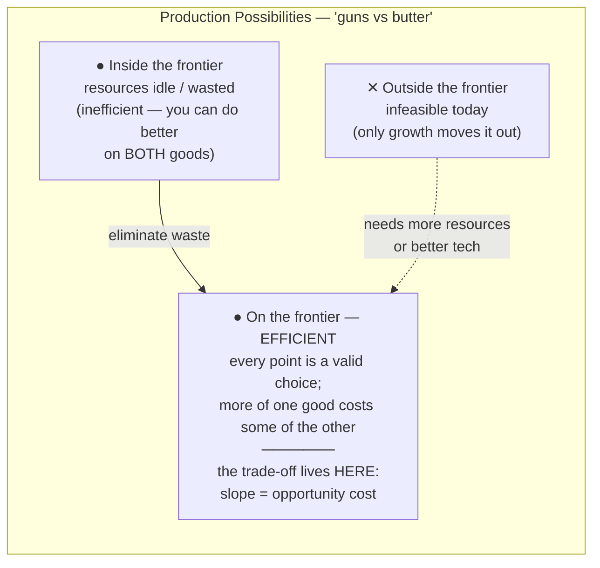
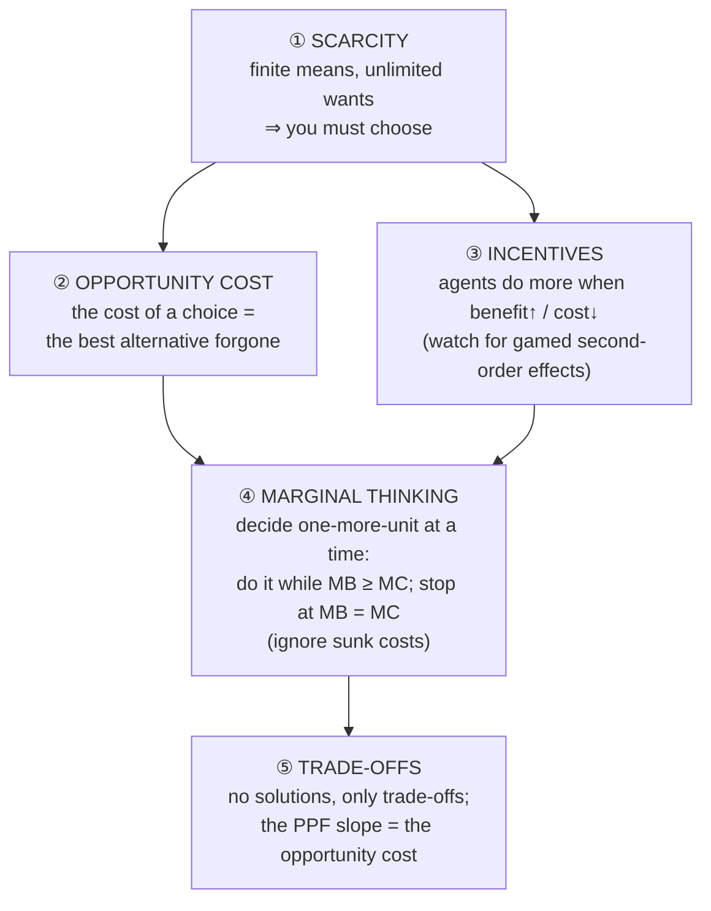

# E01 · §1 — How Economists Think

> **Subject:** Economy & Finance *(hobby track)*
> **Module:** E01 — Economic Foundations (Microeconomics)
> **Section:** Scarcity, opportunity cost, incentives, marginal thinking, trade-offs
> **Status:** 🔵 draft — study this, then we do Q&A; I'll personalize and finalize after.

**Estimated study time:** 1–1.5 hours including reflection.
**Prerequisites:** None. If you can take a derivative and picture a constrained optimization, you already
have the hard part — economics will feel like a re-skin of tools you own.

---

## Why this section exists (for *you*)

You want to read economic news, policy, and company reports and actually *judge* them. Here's the thing:
almost every economic claim you'll ever read — "the tariff will protect jobs," "the rate cut will boost
growth," "this acquisition creates value" — is an application of **five ideas**, and they're all in this
section. Economists don't have a thousand principles. They have a small toolkit they apply relentlessly,
and the discipline is mostly *learning to reach for the right tool reflexively.*

The good news for you specifically: **economics is constrained optimization with human agents.** A
physicist already thinks in terms of systems minimizing/maximizing something subject to constraints,
equilibria, and marginal (first-derivative) conditions. The economist's "rational agent maximizing utility
subject to a budget constraint" is *formally the same object* as a Lagrangian problem — the budget line is
the constraint surface, the indifference curves are level sets, the optimum is where they're tangent
(the gradients align). You will see this structure everywhere once it's named.

So this section is less "learn new facts" and more **"map a vocabulary you'll re-use for the next nine
modules onto reasoning you already do."**

A framing to hold onto: physics has a few conservation laws and least-action principles that everything
reduces to. Economics has scarcity and "people respond to incentives." This section is those founding laws.

---

## 1. The founding constraint: scarcity

**Scarcity** is the starting axiom of all economics: *wants are effectively unlimited, but the resources
to satisfy them — time, money, materials, labour, attention — are finite.* Therefore you cannot have
everything, and **every economy (and every person) must constantly choose what to do with limited means.**

That's the whole definition of the field:

> **Economics is the study of how people, firms, and societies allocate scarce resources among competing uses.**

Two things to get precise, because the everyday word is misleading:

- **"Scarce" ≠ "rare."** Diamonds are rare; air is not scarce in the economic sense (you don't have to give
  anything up to breathe). But *clean* air in a city, or *your* time, or *capital* for a project — these are
  scarce: using them one way *precludes* using them another. **Scarcity is about rival, finite means, not
  about quantity being small.**
- **Scarcity is not poverty.** Even an infinitely rich person has 24 hours a day and one life. The binding
  constraint just moves (from money to time/attention). Scarcity never disappears; it relocates.

> **Physics lens:** scarcity is the *constraint* in the optimization. Without a constraint, maximization is
> trivial and uninteresting ("have everything"). Economics, like a variational problem, only becomes a
> *problem* because of the binding constraint. No constraint → no economics, the way no boundary conditions
> → no interesting PDE.

Everything below is a consequence of scarcity.

---

## 2. The signature concept: opportunity cost

Because resources are scarce, **using them for one thing means *not* using them for the next-best thing.**
The value of that forgone next-best alternative is the **opportunity cost** of your choice.

> **The true cost of anything is what you give up to get it** — not the dollars on the price tag, the
> *alternative you sacrificed.*

This is the single most important idea in the section, and the one that separates economic reasoning from
accounting reasoning. Examples:

- **A "free" two-hour meeting** isn't free: its cost is the most valuable thing those two hours (× everyone
  in the room) could have produced instead.
- **A government that spends $1B on a stadium** hasn't just spent $1B; it has *not* spent it on schools,
  tax cuts, or debt reduction. The stadium's real cost is the best forgone use. ("There is no such thing as
  a free lunch" — TANSTAAFL — is just this idea sloganized.)
- **Holding $50k in cash** "costs" nothing in dollars but has an opportunity cost: the return you'd have
  earned investing it. (This exact idea, the *time value of money*, returns in E03 §2 and E09 §1 — it's the
  backbone of finance.)

The discipline this enforces: **always ask "compared to what?"** A choice is never good or bad in
isolation, only relative to the best alternative you passed up.

> **Physics lens:** opportunity cost is a *shadow price* — the Lagrange multiplier on the binding constraint.
> It's the marginal value of relaxing the constraint by one unit. When an economist says "the opportunity
> cost of capital is 8%," they're stating the multiplier on the capital constraint. You've computed these;
> the word is just new.

---

## 3. The behavioural engine: people respond to incentives

If scarcity forces choices, what governs *which* choices? The economist's working assumption:

> **People respond to incentives** — they tend to do more of something when the (perceived) benefit rises
> or its cost falls, and less when the reverse happens.

This is the closest thing economics has to a force law. It sounds obvious, but its *power* is in the
non-obvious, second-order consequences — incentives reshape behaviour in ways the designer didn't intend:

- **The cobra effect** (colonial Delhi): a bounty on dead cobras to reduce them → people *bred* cobras for
  the bounty → more cobras. The incentive was real; the response was not the one intended.
- **Rent control** caps rents to help tenants → reduces the incentive to build or maintain rental housing →
  long-run shortage and decay. The policy's *stated* goal and its *incentive* point in opposite directions.
- **Singapore's COE / vehicle quota and ERP congestion pricing**: instead of *banning* cars, price them — a
  certificate to own one, and a road toll that *rises with congestion*. This is incentives used as a scalpel:
  change the price, let people re-optimize. (We'll meet this as "internalizing an externality" in §3.)

The skill: when you read about a policy or a business decision, **don't ask only "what's the goal?" — ask
"what behaviour does this *reward*, and how will rational people game it?"** Most policy failures are
incentive failures, not intention failures.

> **Physics lens:** incentives are the *gradient* agents climb. A system of self-interested agents each
> climbing their local benefit gradient is exactly the kind of many-body system you're used to — and like
> those systems, the *aggregate* equilibrium (next module) can look nothing like any individual's intent.

---

## 4. The decision rule: think at the *margin*

Here is where your calculus makes you faster than most beginners. Real decisions are almost never
"all or nothing." They're **"a little bit more, or a little bit less?"** — and the right way to decide is to
compare the **marginal benefit** (the benefit of *one more* unit) against the **marginal cost** (the cost of
*one more* unit).

> **Optimal rule:** keep doing more as long as **marginal benefit ≥ marginal cost**; stop where they're equal.
> **MB = MC** is the economist's first-order optimality condition.

That's it. That's the same as setting a derivative to zero. If `MB(x) > MC(x)`, the *net* benefit `MB − MC`
is still rising, so do more; you stop exactly where `d(net benefit)/dx = 0`, i.e. `MB = MC`. The economist's
"marginal analysis" *is* `∂/∂x` of the objective.

Two famous traps this rule resolves:

- **The diamond–water paradox.** Water is essential, diamonds are frivolous — so why does water cost almost
  nothing and diamonds a fortune? Because price tracks *marginal* value, not *total* value. We have so much
  water that the value of *one more* litre is near zero; diamonds are scarce, so the value of *one more* is
  high. Total value (water) and marginal value (price) are different objects. **Markets price the margin.**
- **The sunk-cost fallacy.** A cost already paid and unrecoverable (a **sunk cost**) should *not* enter a
  forward-looking decision — only future marginal costs and benefits should. "We've already spent $10M, we
  can't stop now" is exactly backwards: the $10M is gone either way; the only question is whether the *next*
  dollar earns its keep. (You make this call when you decide whether to keep optimizing a failing service
  vs. rewrite it.)

> **Physics lens:** "decide at the margin" is "linearize around the operating point and check the
> first-order term." Totals and averages are the wrong object for an optimization — you need the local
> derivative. The diamond–water paradox is just confusing a function's *integral* (total value) with its
> *slope at the current point* (marginal value/price). Sunk costs are constants in the objective: they don't
> change the location of the optimum, so they drop out of `d/dx`.

---

## 5. The consequence: everything is a trade-off

Put scarcity + opportunity cost + the margin together and you get the economist's worldview: **there are no
solutions, only trade-offs.** You can't get more of one good thing without giving up some of another; the
honest question is never "good or bad?" but "*at what rate* do we trade, and is this trade worth it?"

The canonical picture is the **production possibilities frontier (PPF)** — the boundary of what an economy
(or firm, or person) can produce with its fixed resources:

<!-- DIAGRAM:START -->

Diagram source (Mermaid)

<!-- DIAGRAM:END -->

Read it like a feasibility boundary (because that's what it is):

- **Inside** the curve = waste (idle resources); you can get more of *both* goods → no trade-off yet.
- **On** the curve = efficient; now you've hit scarcity, and getting more of one good **requires** giving up
  some of the other. The **slope of the frontier is the opportunity cost** of one good in terms of the other.
- **Outside** = currently impossible; only *growth* (more resources or better technology) pushes the frontier
  out. This is why "economic growth" matters so much in the news — it's the frontier moving outward, letting
  you escape an existing trade-off rather than just pick a point on it.
- The frontier is usually **bowed out** (concave), not straight: resources aren't equally good at everything,
  so the *more* butter you already make, the *more* guns you sacrifice for each extra unit — **increasing
  opportunity cost**, the economic version of diminishing returns.

> **Physics lens:** the PPF is a **Pareto frontier** — the boundary of the feasible set. Points inside are
> dominated; points on it are non-dominated (can't improve one axis without hurting the other); points
> outside violate the constraint. Its slope is the *marginal rate of transformation*, i.e. the local
> opportunity cost — the trade-off ratio at that operating point. You've drawn this exact object whenever
> you've reasoned about a design's feasible region.

---

## 6. A crucial distinction for reading the news: positive vs normative

Economists sharply separate two kinds of statements, and conflating them is the #1 way commentary misleads:

| | **Positive** ("what *is*") | **Normative** ("what *ought* to be") |
|---|---|---|
| Claim type | Descriptive, falsifiable | Value judgement, not falsifiable |
| Example | "A $15 minimum wage will reduce teen employment by X%." | "We *should* raise the minimum wage." |
| Settled by | Evidence, data, models | Values, ethics, politics |

The trap: a normative conclusion ("we should do X") is often smuggled in dressed as a positive claim. When
you read economic commentary, **separate the model from the values.** Two economists can fully agree on the
positive analysis (what *will* happen) and still disagree on the policy (whether it's *worth* it) because
they weight the trade-offs differently. That disagreement is about values, not economics — and naming which
is which is half of reading the news critically.

> **Physics lens:** positive economics is the *model that predicts*; normative is the *objective function
> you choose to optimize*. Physics is almost entirely positive — nature doesn't have preferences. Economics
> is unavoidably both, because its agents (and its policymakers) have goals. Keeping the two separate is the
> discipline.

---

## 7. Health warning: the "rational agent" is a model, not a fact

Everything above leans on a simplifying assumption: people are **rational maximizers** with stable
preferences and good information. This is a *model* — a deliberately idealized one, exactly like the
frictionless plane or the ideal gas. It's powerful and often a great first approximation, and you should use
it. But know its failure modes, because the news is full of them:

- **Bounded rationality** — real people have limited time, information, and computation; they *satisfice*
  (pick "good enough") rather than optimize.
- **Behavioural biases** — loss aversion, anchoring, present bias, herding. The sunk-cost fallacy in §4 is
  itself a *violation* of the rational model — which is why we had to name it as a trap.
- **Imperfect information** — agents often *can't* see the marginal costs/benefits clearly.

A whole field, **behavioural economics**, studies these deviations (we'll meet it in E09 §4, where it
explains bubbles and crashes). For now, hold both ideas at once: *the rational model is the indispensable
baseline, and its discrepancies with reality are where a lot of the interesting action is.*

> **Physics lens:** "rational agent" is the **spherical cow** — the idealization that makes the problem
> tractable and is right to first order. You don't discard it; you know its regime of validity and add
> corrections (behavioural effects) where the idealization breaks, the way you'd add viscosity or
> non-ideal-gas terms. Models are tools rated for a range of conditions, not truths.

---

## 8. The one-page mental model

The five tools, and how they chain:

<!-- DIAGRAM:START -->

Diagram source (Mermaid)

<!-- DIAGRAM:END -->

**The five things to remember:**
1. **Scarcity** is the founding constraint — finite means vs unlimited wants force constant choice. *No
   constraint, no economics.*
2. **Opportunity cost** — the real cost of anything is the best alternative you gave up. Always ask
   "compared to what?" (It's the shadow price / Lagrange multiplier on the constraint.)
3. **Incentives** — people respond to them; the interesting failures are the *gamed second-order* responses,
   not the first-order intent.
4. **Marginal thinking** — optimize one unit at a time; **MB = MC** is the stopping rule (a derivative set to
   zero), and **sunk costs are irrelevant** to forward-looking choices.
5. **Trade-offs** — scarcity means every choice trades one good against another at some rate (the PPF slope);
   growth is what moves the whole frontier out. And keep **positive** ("what is") separate from **normative**
   ("what ought").

---

## 9. Check your understanding

Jot a one-line answer to each before our Q&A — we'll dig into whichever are fuzzy or contestable.

1. In your own words, why is *scarcity* (not money) the thing that makes economics necessary? Give an example
   where someone with unlimited money still faces scarcity.
2. A friend says "I got the concert ticket free from a radio contest, so going costs me nothing." Use
   opportunity cost to correct them in two sentences.
3. A factory has spent $4M of a planned $6M on a new line that now looks unprofitable. Walk through how a
   *marginal* thinker decides whether to spend the last $2M — and name the fallacy the "we've already spent
   $4M!" argument commits.
4. Singapore prices car ownership (COE) and road use (ERP) rather than banning or rationing cars by lottery.
   In incentive terms, what's the argument *for* pricing over a ban? What might the argument *against* be?
   (You're allowed a normative opinion here — just label it as one.)
5. Sketch a PPF for an economy producing "healthcare" and "everything else." Mark a point that's wasteful, a
   point that's efficient, and one that's currently impossible. What single thing would let the country reach
   the impossible point *without* giving up anything?

## 10. Optional: spot the five tools in the wild (15 min, no setup)

Open any business/economics headline (Bloomberg, the *FT*, *The Straits Times* business section, a central
bank statement). For one article, label:

- What **scarce** resource is being allocated?
- What's the **opportunity cost** of the decision described (what's *not* being done)?
- What **incentive** does the policy/decision create — and is there a plausible way agents *game* it?
- Is there a **marginal** choice hiding inside an "all-or-nothing" framing?
- Is the article making a **positive** claim, a **normative** one, or quietly mixing them?

Bring one article to our chat — we'll dissect it together and see how far five tools get us.

---

## References (optional, for depth)

- *Naked Economics* — Charles Wheelan. The friendliest possible tour of exactly these intuitions; chapters 1–2
  cover this section. https://wwnorton.com/books/9780393337648
- *The Economic Way of Thinking* — Heyne, Boettke & Prychitko. The whole book is "internalize these few tools."
- Khan Academy — Microeconomics, "Introduction to economics": free, short videos with the PPF and opportunity
  cost worked visually. https://www.khanacademy.org/economics-finance-domain/microeconomics
- *Freakonomics* — Levitt & Dubner. Not a textbook, but the best demonstration that "people respond to
  incentives" is a scalpel. https://freakonomics.com/books/
- Marginal Revolution University — short video on opportunity cost & the PPF: https://mru.org/courses/principles-economics-microeconomics

---

### What's next
🔵 **Draft — not yet finalized.** Study this, then bring me your answers to §9 (and an article from §10 if you
did it). We'll do the Q&A the same way as the main track; when you say *"finalize,"* I'll rewrite this to fit
how you actually reasoned about it and add an "Applied" section capturing our threads. The next section
(**§2 — supply, demand & how prices coordinate a market**) builds directly on incentives and the margin from
here: a market price is just the system-level signal that pushes every agent to their MB = MC point.
