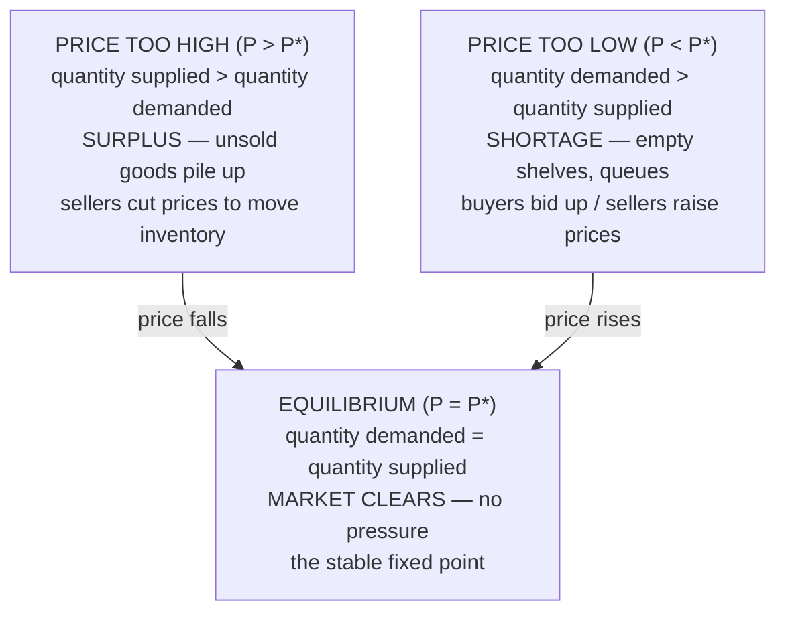
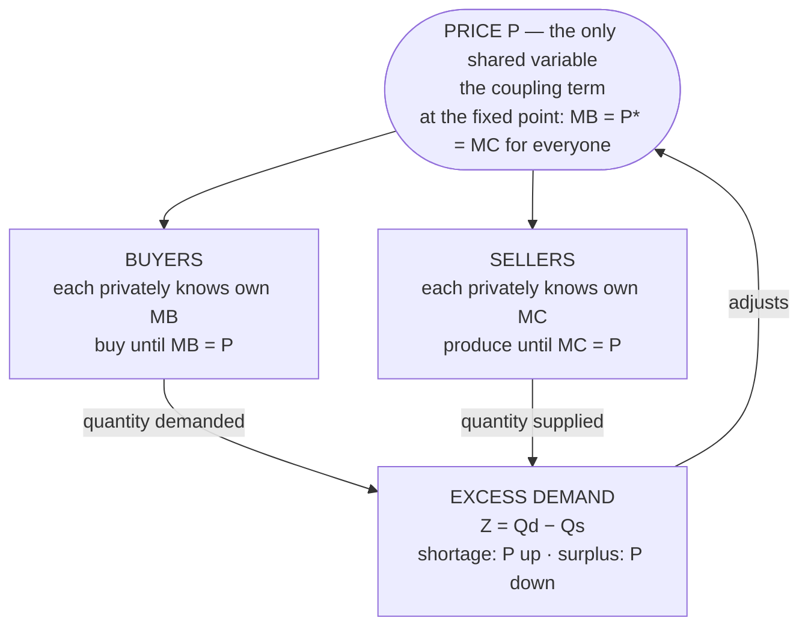
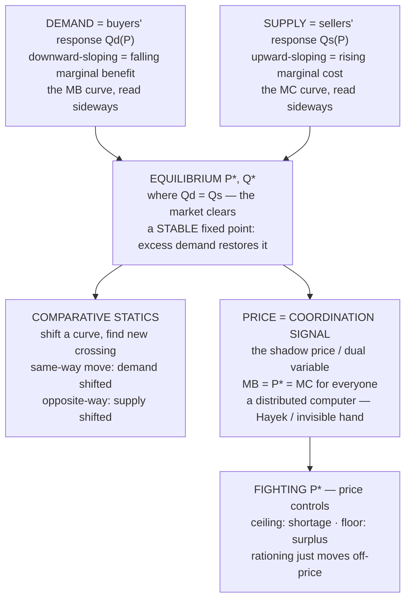

# E01 · §2 — Supply, Demand & How Prices Coordinate a Market

> **Subject:** Economy & Finance *(hobby track)*
> **Module:** E01 — Economic Foundations (Microeconomics)
> **Section:** The demand curve, the supply curve, market equilibrium, comparative statics, and the
> price as a coordination signal (with price controls as the payoff).
> **Status:** 🔵 draft ready to study — not yet finalized. Study this, then bring questions to our Q&A;
> we'll finalize afterwards and update the plan.

**Estimated study time:** 1.5–2 hours including reflection.
**Prerequisites:** §1 — specifically **incentives** (agents respond to price), **marginal thinking**
(`MB = MC`), and **opportunity cost as a shadow price**. This whole section is those three ideas turned
into a *system* of two interacting populations and a single number that couples them.

---

## Why this section exists (for *you*)

§1 gave you the tools an *individual* agent uses: maximize benefit minus cost, stop at the margin. But the
economy isn't one agent — it's millions, each solving their own little optimization, **none of them talking
to each other**. The miracle the rest of economics is built on is that a single scalar — the **price** —
silently coordinates all of them into a coherent allocation. Nobody is in charge; the price *is* the
coordination.

This is the section where economics stops being "one agent optimizes" and becomes "a coupled system finds a
fixed point." For you specifically, that reframing is the whole game:

- A **demand curve** and a **supply curve** are just two *response functions* — how much of a good the buyer
  side and the seller side each *want to transact* as a function of price.
- **Equilibrium** is the price where those two responses agree — an **intersection / fixed point**, with
  honest restoring dynamics around it (a shortage pushes price up, a surplus pushes it down).
- The equilibrium **price is the Lagrange multiplier** on the economy's scarcity constraint — the same
  shadow price you met in §1, now *discovered by the market* instead of computed by you. It is how a
  decentralized system solves the global allocation problem without anyone holding the global problem.

That last point is, in my view, the single most beautiful idea in introductory economics, and it's one a
person who has done **dual decomposition / distributed optimization** will get faster than an economist
does. We'll build to it.

> **One framing to hold:** §1 was the *objective and the first-order condition for one agent*. §2 is the
> *coupling term* — the shared variable (price) that links every agent's separate optimization into one
> system, and the *dynamics* by which the system relaxes to its fixed point.

---

## 1. Demand: the buyers' response function

**Demand** describes how much of a good buyers, *in aggregate*, are willing and able to buy at each possible
price, holding everything else fixed. Plot quantity against price and you get the **demand curve**, and it
(almost always) **slopes downward**: the higher the price, the less people buy.

Two reasons it slopes down — and the first is just §1 again:

- **Diminishing marginal benefit.** From §4 of §1: a buyer keeps buying while `MB ≥ price` and stops at
  `MB = price`. But marginal benefit *falls* as you consume more (the second coffee is worth less to you
  than the first — the diamond–water paradox in miniature). So to get someone to buy a *larger* quantity,
  the price has to *drop* to keep meeting their now-lower marginal benefit. The demand curve is literally
  the **marginal-benefit curve read sideways.**
- **Substitution + income effects.** When a good gets pricier, people switch to substitutes (tea for
  coffee), and their real purchasing power falls. Both push quantity down.

**The vocabulary trap that confuses every beginner — get it now and you're ahead:**

| | What it means | On the graph |
|---|---|---|
| **Quantity demanded** | the amount bought *at one specific price* | a single **point** on the curve |
| **Demand** | the *whole relationship* — the entire curve/function | the **curve itself** |

So:
- A change in the good's **own price** → you **move along** the curve (a change in *quantity demanded*).
- A change in *anything else* (income, the price of a substitute, tastes, expectations, population) → the
  **whole curve shifts** (a change in *demand*). Rightward shift = more demanded at *every* price.

Mixing these up is the #1 source of muddled economic commentary ("prices rose, so demand fell" — no, *quantity
demanded* fell; *demand* may not have moved at all). Keep "movement along" vs "shift of" sharp.

> **Physics lens:** the demand curve is a **response function** `Q_d(P)` — output (quantity) as a function
> of a control parameter (price), *all other parameters held fixed*. "Quantity demanded" is the function
> *evaluated at a point*; "demand" is the function *as an object*. A change in own-price moves you **along**
> the response curve; a change in a held-fixed parameter is a change in the *function itself* — the curve
> shifts. It's exactly the difference between moving along an `I–V` curve and changing the temperature that
> *defines* a new `I–V` curve. The economists' confusion is just sloppiness about "evaluate the function" vs
> "re-parameterize the function."

---

## 2. Supply: the sellers' response function

**Supply** is the mirror image: how much sellers, in aggregate, are willing to produce and sell at each
price. The **supply curve** (almost always) **slopes upward** — higher price, more produced.

Why upward? Again, it's §1:

- **Increasing marginal cost.** This is the same phenomenon as the PPF's *increasing opportunity cost* from
  §1 §5. As a firm produces more, it runs into less-suited resources, overtime, congestion — each extra unit
  costs more than the last. A profit-maximizing firm produces while `price ≥ MC` and stops at `price = MC`.
  Since `MC` rises with quantity, you need a *higher* price to justify a *larger* quantity. **The supply
  curve is the marginal-cost curve read sideways** — the perfect dual of the demand story.

The same movement-vs-shift distinction applies:
- Change in the good's **own price** → **move along** supply (change in *quantity supplied*).
- Change in *input costs, technology, number of sellers, taxes, expectations* → the **curve shifts** (change
  in *supply*). A new cheaper production technology shifts supply right (more at every price); a tax or an
  input-price spike shifts it left.

> **Physics lens:** supply is the producers' response function `Q_s(P)`, and it's the *upward-sloping* twin
> of demand because `MC` is increasing — the same convexity that bows the PPF outward in §1. Notice the
> pleasing symmetry you'll reuse forever: **demand = marginal-benefit curve, supply = marginal-cost curve**,
> both plotted in the same price–quantity plane. The whole market is just **MB and MC for the entire
> population, drawn on one set of axes.** Equilibrium will be where the population's marginal benefit meets
> its marginal cost — the §1 rule `MB = MC`, lifted from one agent to the whole system.

> **A note that will bug you (it should):** by convention economists put **price on the vertical axis** even
> though they treat it as the *independent* variable that buyers/sellers respond to. So the graphs are drawn
> "sideways" relative to how you'd plot `Q(P)`. This is a 130-year-old accident (Alfred Marshall did it in
> 1890 and it stuck). Don't fight it; just know that "downward-sloping demand" is `dQ_d/dP < 0` plotted with
> the axes flipped. Read the curves as `Q(P)` rotated, and your intuition will be right.

---

## 3. Equilibrium: the fixed point where the two responses agree

Put both curves on one graph. They cross at one point. That crossing is the **market equilibrium**:

- the **equilibrium price** `P*` (also called the *market-clearing price*), and
- the **equilibrium quantity** `Q*`,

defined by `Q_d(P*) = Q_s(P*)` — the price at which the quantity buyers want to buy exactly equals the
quantity sellers want to sell. **The market "clears": no unmet buyers, no unsold goods.**

What makes `P*` special isn't that someone chose it — it's that it's the only price with **no pressure to
change**, and the prices around it actively push back toward it:

<!-- DIAGRAM:START -->

Diagram source (Mermaid)

<!-- DIAGRAM:END -->

The key is the **excess demand** `Z(P) = Q_d(P) − Q_s(P)`:

- `Z(P) > 0` (shortage) → competition among buyers bids the price **up**.
- `Z(P) < 0` (surplus) → competition among sellers pushes the price **down**.
- `Z(P*) = 0` → equilibrium.

Price moves in the direction of excess demand. Since `Q_d` slopes down and `Q_s` slopes up, `Z(P)` is
*decreasing* in price — so the adjustment is **self-correcting (negative feedback)**: above `P*` the force
points down, below it the force points up. The equilibrium is **stable**.

> **Physics lens — three layers, each one you already own:**
>
> 1. **Equilibrium = intersection = fixed point.** `P*` solves `Q_d(P) = Q_s(P)`. Nothing chose it; it's
>    where two response functions are mutually consistent.
> 2. **Excess demand is a restoring force.** `dP/dt ∝ Z(P) = Q_d(P) − Q_s(P)`. Because `Z'(P) < 0`, this is
>    a **gradient/relaxation dynamics with a stable fixed point** — linearize and you get `dP/dt ≈ Z'(P*)·(P −
>    P*)` with `Z'(P*) < 0`, i.e. exponential decay back to `P*`. It's an overdamped system sliding to the
>    bottom of a potential well. Walras called this groping-toward-equilibrium **tâtonnement** in 1874; it's
>    a relaxation method.
> 3. **Stability is not automatic — it's a condition on the slopes.** If supply sloped *down* steeper than
>    demand, `Z'(P*) > 0` and the fixed point would be *unstable* (the force points away). In discrete time
>    with a production lag — farmers set this year's acreage off last year's price — you get the **cobweb
>    model**: the price spirals *in* (converges), orbits (limit cycle), or spirals *out* (diverges) purely
>    from the ratio of the slopes `|slope_supply| / |slope_demand|`. This is a genuine discrete dynamical
>    system, and it's your first taste of the thing you flagged in §11 — **learning/adjustment dynamics need
>    not converge to the fixed point even when the fixed point exists.** Same family as GAN training
>    oscillating around its equilibrium. (We keep the dynamics light here; the strategic version lives in the
>    Game Theory subject.)

---

## 4. Comparative statics: reading shifts (this is most of the news)

You almost never care about the *level* of `P*`; you care about **how `P*` and `Q*` move when something
changes** — a tax, a shortage, a new technology, a demand shock. That's **comparative statics**: shift a
curve, find the new intersection, compare. Four base cases, and they're worth memorizing as a reflex because
half of business news is one of them:

| What moves | `P*` | `Q*` | Real example |
|---|---|---|---|
| **Demand ↑** (curve shifts right) | ↑ | ↑ | AI boom → demand for GPUs ↑ → price ↑, quantity ↑ |
| **Demand ↓** (shifts left) | ↓ | ↓ | Recession → demand for travel ↓ → fares ↓, trips ↓ |
| **Supply ↑** (shifts right) | ↓ | ↑ | Fracking → oil supply ↑ → price ↓, quantity ↑ |
| **Supply ↓** (shifts left) | ↑ | ↓ | War cuts wheat supply → price ↑, quantity ↓ |

The reliable tell: **when price and quantity move the *same* way, demand shifted; when they move *opposite*
ways, supply shifted.** (A surging price with *falling* volume is a supply shock; a surging price with
*rising* volume is a demand boom. That one heuristic decodes a lot of headlines.)

The honest complication — and the reason §3 exists — is *by how much* each moves. That depends on the
**slopes** (how steep each curve is), which is **elasticity**, the whole subject of the next section. For now
just get the *directions* solid.

> **Physics lens:** comparative statics is **perturbation theory / linear response**. You have an implicit
> equilibrium condition `Z(P*; α) = 0` where `α` is a parameter (a tax, an input cost). Differentiate via
> the **implicit function theorem**: `dP*/dα = −(∂Z/∂α)/(∂Z/∂P)`. The denominator `∂Z/∂P = Z'(P*) < 0` is
> exactly the stability quantity from §3 — so the same slope that governs *stability* governs the *sign and
> size of the response* to a shock. Steep curves (small `|Z'|`) → large price swings for a given shock;
> flat curves → large quantity swings. That dichotomy *is* elasticity, and you've just derived why §3 is
> the natural sequel: it's the magnitude that this section's directions leave open.

---

## 5. The big idea: price as a coordination signal (the invisible hand, precisely)

Now the payoff. Step back and ask what the price *is* doing for the system as a whole.

Each buyer knows only their own marginal benefit. Each seller knows only their own marginal cost. **No one
knows the whole demand curve, the whole supply curve, or the global allocation problem** — and yet the
market lands on the allocation where the good flows to the buyers who value it most, produced by the sellers
who can make it most cheaply, in exactly the quantity where the *population's* marginal benefit equals its
marginal cost. The coordinating variable is the single number `P*`, and the mechanism is just §3's dynamics.

At equilibrium, two things are simultaneously true:
- every buyer has pushed to their own `MB = P*`, and
- every seller has pushed to their own `MC = P*`,

so across the entire economy `MB = P* = MC`. **The price equalizes everyone's margin.** A central planner
trying to maximize total surplus would have to solve the whole constrained optimization and would arrive at
the same allocation — but the market gets there with *no one holding the global problem*, each agent reading
one number off a screen.

This is **Adam Smith's "invisible hand"** stated without mysticism, and it's also the **first welfare
theorem**: a competitive equilibrium is (under assumptions) **Pareto-efficient** — you can't make anyone
better off without making someone worse off. The price is doing the work of a planner, decentrally. Friedrich
Hayek's framing (1945) is the one to carry: **the price is a sufficient statistic for a mountain of dispersed
private information.** A frost in Brazil, an AI lab's new GPU appetite, a change in your taste for coffee —
none of it has to be reported to anyone. It shows up as a price move, and everyone re-optimizes against the
new number. *The price system is a distributed computer.*

<!-- DIAGRAM:START -->

Diagram source (Mermaid)

<!-- DIAGRAM:END -->

> **Physics lens — this is the one to keep.** The price is the **Lagrange multiplier (dual variable) on the
> economy's scarcity constraint** — the very same shadow price you met in §1, now *discovered by the system*
> rather than computed by you. The market is running **dual decomposition / a distributed optimization**:
> the global problem "maximize total surplus subject to supply = demand" is separable across agents *once the
> price is fixed*, because each agent's first-order condition only involves their own margin and the shared
> price. The market iterates exactly like a dual-ascent / ADMM scheme — broadcast a price, each agent solves
> its local subproblem and reports a quantity, the *constraint violation* (excess demand `Z`) is the
> **gradient of the dual**, and the price updates `P ← P + η·Z` until the constraint is met. **Tâtonnement is
> dual ascent; the equilibrium price is the optimal multiplier.** You have implemented this pattern; the
> economy runs it as physics.
>
> And the §11a caveat still bites: the surface is **endogenous** — the price each agent optimizes against is
> *produced by* everyone's choices, so this is a coupled fixed-point problem, not descent on a fixed
> landscape. The first welfare theorem is the *clean* case (price-takers, no externalities, full
> information); §3 is where the coupling breaks the theorem.

---

## 6. The payoff in practice: what happens when you fight the price

If `P*` is the price that clears the market, what happens when a government *forbids* it? This is the most
common policy collision in the news, and the model predicts it cleanly. (It's also §1's "incentives" and
"there are no solutions, only trade-offs" cashing out.)

- **Price ceiling** — a legal *maximum* below `P*` (e.g. **rent control**, fuel price caps). At the capped
  price, quantity demanded exceeds quantity supplied → a **persistent shortage**. Because price can't ration
  the good, *something else* does: queues, waiting lists, "who you know," quality decay, black markets. Rent
  control (§1's example) is the canonical case — it helps the tenants who *have* a unit and quietly punishes
  everyone trying to *find* one, while killing the incentive to build or maintain. The shortage isn't a
  failure of the policy to work; it's the policy *working as the model predicts.*
- **Price floor** — a legal *minimum* above `P*` (e.g. a **minimum wage**, agricultural price supports). At
  the floored price, quantity supplied exceeds quantity demanded → a **persistent surplus**. In a labour
  market the "good" is labour and the surplus is **unemployment** (the disputed, and empirically subtle, case
  — real labour markets aren't perfectly competitive, which is why the minimum-wage debate is live; flag it,
  don't resolve it here).

The general lesson, and the §1 callback: a price control doesn't repeal scarcity — it just **changes the
rationing mechanism** from price to something usually worse (queues, connections, shortages, quality cuts).
The trade-off didn't disappear; it moved somewhere less visible. Whether the control is *worth it* (helping
some incumbents at the cost of a shortage) is a **normative** question — keep it separate, per §1 §6, from the
**positive** prediction that a binding ceiling causes a shortage.

> **Physics lens:** a binding price control **pins the dual variable away from its optimal value**, so the
> constraint `Q_d = Q_s` can no longer be satisfied — the system is forced off its fixed point and the
> "violation" (`Z ≠ 0`) shows up as a permanent shortage or surplus. You haven't removed the constraint by
> outlawing the multiplier that enforces it; you've just blinded the system to it, and it reroutes through a
> non-price channel.

---

## 7. The one-page mental model

<!-- DIAGRAM:START -->

Diagram source (Mermaid)

<!-- DIAGRAM:END -->

**The six things to remember:**
1. **Demand** is buyers' response `Q_d(P)`, downward-sloping because **marginal benefit falls** — it's the
   MB curve from §1 read sideways. Distinguish *quantity demanded* (a point; own-price moves *along*) from
   *demand* (the whole curve; other factors *shift* it).
2. **Supply** is sellers' response `Q_s(P)`, upward-sloping because **marginal cost rises** — the MC curve
   read sideways. Same movement-vs-shift distinction.
3. **Equilibrium** `P*` is the **fixed point** `Q_d = Q_s`; it's **stable** because excess demand acts as a
   restoring force (shortage→price up, surplus→price down). Stability is a condition on the slopes (cobweb).
4. **Comparative statics**: shift a curve, re-find the crossing. *Same-direction* P and Q ⇒ demand moved;
   *opposite* ⇒ supply moved. The *size* of the move is elasticity → §3.
5. **Price is the coordination signal** — the **shadow price / dual variable** that makes `MB = P* = MC`
   hold for everyone simultaneously, solving the global allocation problem with no one holding it. Hayek:
   a sufficient statistic for dispersed information; the price system is a distributed computer.
6. **Fighting `P*`** (ceilings/floors) doesn't repeal scarcity — it pins the multiplier away from optimum and
   forces the shortage/surplus into a worse rationing channel. Positive prediction ≠ normative verdict.

---

## 8. Check your understanding

Jot a one-line answer to each before our Q&A — we'll dig into whichever are fuzzy or contestable.

1. A news headline: "Coffee prices soared this year." Your colleague concludes "so demand for coffee must
   have risen." Using **movement-along vs shift-of** and the **same-way/opposite-way** heuristic, explain
   what *two* different stories could produce a price rise, and what extra fact (about *quantity*) would tell
   you which one happened.
2. In your own words, why does the demand curve slope *down* and the supply curve slope *up* — and how is
   each one just the §1 idea (`MB`/`MC` at the margin) in disguise?
3. A city caps rents 30% below the market-clearing level. Predict the *positive* consequences (what the model
   says *will* happen), then state — and **label as normative** — one argument for doing it anyway.
4. The market has no auctioneer, yet it lands on `P*`. Describe the *mechanism* that gets it there from a
   too-high price, in terms of excess demand as a restoring force. Then say what property of the supply and
   demand *slopes* could make that adjustment fail to settle (oscillate or diverge).
5. *(For your wheelhouse.)* I claimed the equilibrium price is "the Lagrange multiplier on the scarcity
   constraint" and that tâtonnement "is dual ascent." Pressure-test that: where does the analogy to
   dual decomposition hold tightly, and where does the **endogenous-surface / coupling** worry from §11a make
   it leakier than a textbook convex dual problem?

## 9. Optional: spot supply & demand in the wild (15 min, no setup)

Pick any market with a price in the news right now — eggs, GPUs, air fares, a specific stock, HDB resale
flats, electricity. For that market:

- Sketch (mentally) the supply and demand curves and mark roughly where you think `P*` sits.
- Identify **one recent shock** and decide: did it shift **demand** or **supply**, and which way?
- Use the **same-way / opposite-way** heuristic on the reported price *and* quantity (volume) to check
  whether your shift diagnosis is consistent with the data.
- Is there any **price control, tax, or subsidy** in this market pinning the price off `P*`? If so, where's
  the shortage/surplus showing up (queues, gluts, black markets, waiting lists)?

Bring one market to our chat — we'll run the comparative-statics and coordination story on it together.

---

## References (optional, for depth)

- *Naked Economics* — Charles Wheelan, ch. 1–3 (markets and prices, the power of the price signal). The
  friendliest version of exactly this section. https://wwnorton.com/books/9780393337648
- **Hayek, "The Use of Knowledge in Society"** (1945) — the original, short, and readable argument that the
  price is a sufficient statistic for dispersed information. The intellectual core of §5.
  https://www.econlib.org/library/Essays/hykKnw.html
- Khan Academy — Microeconomics, "Supply, demand, and market equilibrium": free, visual, with the curves and
  shifts worked step by step. https://www.khanacademy.org/economics-finance-domain/microeconomics/supply-demand-equilibrium
- Marginal Revolution University — "Supply and Demand" short videos (equilibrium, shifts, price controls):
  https://mru.org/courses/principles-economics-microeconomics
- *CORE Econ — The Economy 1.0*, Unit 8 (supply, demand, and price-taking markets) — a more rigorous, free
  online treatment if you want depth. https://www.core-econ.org/the-economy/

---

### What's next
After you study this and we run the Q&A, say **"finalize"** and I'll rewrite the section to match how you
actually reasoned about it (as in §1's §11) and mark E01 §2 ✅ in [`../plan.md`](../plan.md). The natural
sequel is **§3 — elasticity, surplus & market failure**: §4 above deliberately left *how much* `P*` and `Q*`
move to elasticity (the curve slopes), and §5's "clean case" first welfare theorem sets up *when markets
fail* (externalities, public goods, monopoly) — which is exactly where the coordination story breaks.
