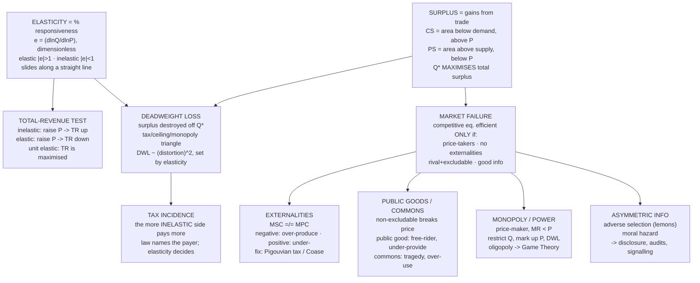

# E01 · §3 — Elasticity, Surplus & When Markets Fail

> **Subject:** Economy & Finance *(hobby track)*
> **Module:** E01 — Economic Foundations (Microeconomics)
> **Section:** The *magnitude* §2 left open (elasticity), the *welfare* the market creates (surplus),
> the *cost of pushing it off $P^*$* (deadweight loss, taxes), and the four classic ways the invisible
> hand genuinely fails (externalities, public goods, monopoly, asymmetric information).
> **Status:** 🔵 prepared 2026-06-18 — study first, then we do Q&A, then you say *"finalize"* and I
> rewrite it to fit how you actually think (and add the session's §10). Math in LaTeX, quantitative
> relationships drawn as real curves, per [`../../../agent-docs/authoring-conventions.md`](../../../agent-docs/authoring-conventions.md).

**Estimated study time:** 1.5–2 hours including reflection.
**Prerequisites:** §1 (marginal thinking, $MB$/$MC$, opportunity cost as a shadow price) and §2 (demand
and supply as response functions $Q_d(P)$, $Q_s(P)$; equilibrium $P^*$ as a fixed point; comparative
statics). §2 ended on a cliffhanger this section pays off twice: it left *how much* $P^*$ and $Q^*$ move
to **elasticity**, and it flagged that the clean "invisible hand" story holds only in a frictionless
special case — this is where we map the **failures**.

---

## Why this section exists (for *you*)

§2 gave you the *directions* — a demand shock moves price and quantity the same way, a supply shock moves
them opposite ways. But the question a trader, a policymaker, or a CFO actually asks is **"by how much?"**
That magnitude is **elasticity**, and it turns out to be the single most reused number in applied
economics: it decides who really pays a tax, whether a price hike raises or wrecks your revenue, how much
a subsidy moves anything, and how big the damage is when policy fights the price.

Then we turn the model normative. §2 was careful to separate *positive* ("a ceiling causes a shortage")
from *normative* ("is that good?"). **Surplus** is the bridge: a way to *measure* welfare on the same
supply-and-demand diagram, so "good" and "bad" stop being hand-waving. With surplus in hand, two things
fall out cleanly:

1. **Why the competitive equilibrium is special** — it *maximizes total surplus*. This is the first
   welfare theorem from §2 §5, now drawn as an area you can see and a quantity you can compute.
2. **Exactly what a distortion costs** — the **deadweight loss**, the surplus that simply vanishes when
   the market is pushed off $Q^*$ (by a tax, a price control, or market power). For you specifically there's
   a clean punchline: that loss is **second-order** in the distortion — quadratic, like the energy of a
   spring displaced from its minimum — which is why small frictions are cheap and large ones are
   disproportionately expensive.

Finally, the honest part. §2's §10a ended by conceding the real frontier of "when the model breaks" is
not the *existence* of supply and demand but **market failure** — the cases where a competitive
equilibrium forms and is still *not* efficient. There are exactly four canonical ones, and this section is
where the beautiful §2 coordination story earns its asterisks.

> **One framing to hold:** §2 proved the price *coordinates*. §3 asks two follow-ups — *how strongly*
> (elasticity), and *when the coordination is the wrong target* (market failure). The first is a number;
> the second is a list of four broken assumptions.

---

## 1. Elasticity: the magnitude that comparative statics left open

§2's comparative statics told you a demand increase raises both $P^*$ and $Q^*$. **Elasticity** tells you
the *split* — does the adjustment show up mostly as a price move or mostly as a quantity move? It is the
**responsiveness** of one variable to another, expressed as a ratio of **percentage** changes.

The headline one is the **price elasticity of demand**:

$$\varepsilon_d \;=\; \frac{\%\,\Delta Q_d}{\%\,\Delta P} \;=\; \frac{\Delta Q_d / Q_d}{\Delta P / P} \;\xrightarrow[\text{small changes}]{}\; \frac{dQ_d}{dP}\cdot\frac{P}{Q_d}.$$

Because demand slopes down, $\varepsilon_d$ is negative; by convention people usually quote its absolute
value $|\varepsilon_d|$ and talk about "how elastic" a good is. Three regimes, and they're the whole game:

| | $\lvert\varepsilon_d\rvert$ | Meaning | Examples |
|---|---|---|---|
| **Elastic** | $> 1$ | quantity responds *more* than proportionally | airline seats, branded soda, restaurant meals, most discretionary goods |
| **Unit elastic** | $= 1$ | quantity and price move proportionally | a knife-edge |
| **Inelastic** | $< 1$ | quantity responds *less* than proportionally | insulin, salt, gasoline (short run), cigarettes |

Two limiting cases anchor the ends: **perfectly inelastic** ($\varepsilon_d = 0$, a *vertical* demand
curve — quantity won't budge at any price, the textbook caricature of life-saving medicine) and **perfectly
elastic** ($\varepsilon_d = -\infty$, a *horizontal* line — the slightest price rise loses *all* buyers,
which is exactly the demand curve a single wheat farmer faces in §2's perfectly competitive market).

### Why percentages, not slope?

This is the subtlety that trips people up, and it's worth getting exactly right because it's where the
physics intuition mildly *misleads*. Elasticity is **not** the slope of the demand curve. Two reasons:

- **Units.** A slope $dQ/dP$ is "litres per dollar" or "shares per cent" — it changes if you switch from
  litres to gallons or dollars to cents, so you can't compare the slope for oil with the slope for
  airline tickets. The *percentage* ratio is **dimensionless**, so $|\varepsilon|$ for oil and for tickets
  live on the same scale and are directly comparable. That's the entire reason economists use it.
- **It slides along a straight line.** On a *linear* demand curve the slope is constant everywhere, yet
  elasticity runs from $\infty$ at the top to $0$ at the bottom — because the $P/Q$ factor changes as you
  move along it. High price / low quantity (top) is elastic; low price / high quantity (bottom) is
  inelastic; the midpoint is unit elastic.

<!-- FIGURE -->

The picture above (left panel) is the one to burn in: *same line, every elasticity*. And the contrast
with §2's "steep vs flat" intuition is reconciled this way — for two curves through the *same point*, the
flatter one **is** more elastic (below), but you cannot read elasticity off steepness *alone* without
knowing where you are on the curve.

<!-- FIGURE -->

### What makes a good elastic or inelastic

Four determinants, all common-sense once stated:

- **Substitutes.** The more (and closer) the substitutes, the more elastic. "Coca-Cola" is elastic
  (switch to Pepsi); "soft drinks as a category" is far less so. **Defining the market wider makes demand
  more inelastic** — a crucial trick antitrust lawyers and tax authorities both exploit.
- **Necessity vs luxury.** Necessities (insulin, electricity, staple food) are inelastic; luxuries
  (cruises, jewellery) are elastic.
- **Share of budget.** Goods that eat a big slice of income (housing, cars) are more elastic — you really
  notice the price; cheap incidentals (salt, matches) are inelastic.
- **Time horizon.** This is the big one and the most counter-intuitive. Demand is almost always **more
  elastic in the long run.** When petrol spikes, you can't do much this week (inelastic — you still drive
  to work), but over years you buy a smaller car, move closer, switch to transit (elastic). The 1970s oil
  shocks are the canonical case: tiny short-run quantity response, large long-run one. Forgetting this is
  how people mis-forecast the impact of an energy price move.

### The payoff you'll use constantly: the total-revenue test

Revenue is $TR = P \times Q$. Raise the price and two things fight: the higher $P$ *per unit* pulls $TR$
up, the lower $Q$ pulls it down. **Elasticity decides who wins:**

- **Inelastic demand** ($|\varepsilon| < 1$): quantity barely falls, so a price rise **raises** revenue.
  (This is why OPEC restricting oil output, or a city raising transit fares, can increase total takings —
  and why "sin taxes" on inelastic cigarettes raise lots of revenue.)
- **Elastic demand** ($|\varepsilon| > 1$): quantity falls a lot, so a price rise **lowers** revenue;
  to grow revenue you *cut* price (the logic behind discounting and loss-leaders).
- **Unit elastic** ($|\varepsilon| = 1$): revenue is at its **maximum** — the peak of the TR curve in the
  right panel of the figure above.

That single test — *"is this market elastic or inelastic right now?"* — answers a startling number of
business and policy questions. A firm that doesn't know whether it's on the elastic or inelastic side of
its demand curve is pricing blind.

### The other elasticities (one line each — you'll meet them in the news and in 10-Ks)

- **Income elasticity** $\varepsilon_Y = \%\Delta Q / \%\Delta\,\text{income}$. Positive → **normal good**;
  negative → **inferior good** (instant noodles, bus travel — demand *rises* when incomes fall, which is
  why some businesses are "recession-resistant"). Greater than 1 → **luxury** (demand grows faster than
  income — the bet behind every premium brand).
- **Cross-price elasticity** $\varepsilon_{xy} = \%\Delta Q_x / \%\Delta P_y$. Positive → **substitutes**
  (price of Pepsi up → Coke sales up); negative → **complements** (price of game consoles down → game
  sales up). This is the number that defines competitive sets and explains razor-and-blades pricing.
- **Price elasticity of supply** $\varepsilon_s = \%\Delta Q_s / \%\Delta P$. Same idea on the sell side,
  governed by how fast producers can ramp: high for a download (copy it instantly), low for beachfront
  land or a new chip fab (capacity takes years — your §2 §10b semiconductor cycle lives here).

> **Physics lens — elasticity is a logarithmic derivative.** Rewrite it as
> $\varepsilon = \dfrac{d\ln Q}{d\ln P}$. It is the dimensionless **response coefficient** of $Q$ to $P$
> on a log–log scale — precisely a *susceptibility* in the linear-response sense (how strongly does the
> output respond to a fractional change in the control field), made unit-free so different systems are
> comparable. The reason it "slides" along a straight line is that a fixed *slope* $dQ/dP$ is not a fixed
> *log-slope*: $\varepsilon = (dQ/dP)\,(P/Q)$, and $P/Q$ runs over the whole positive line as you traverse
> the curve. If a relationship is a power law $Q = AP^{\,k}$, then $\varepsilon \equiv k$ everywhere — a
> *constant-elasticity* demand curve is exactly the straight line on a log–log plot, the same way a power
> law is in physics. (Don't push the "steepness = elasticity" picture any further than two curves through
> one shared point; beyond that it's the log-slope, not the slope, that you want.)

---

## 2. Surplus: putting a number on who gains from a market

To judge a market we need a yardstick for "welfare." Economics uses **surplus** — the gap between what
something is *worth* to you and what you actually *pay or receive*. It's measurable straight off the
supply-and-demand diagram, because §2 already told us the curves *are* the marginal-benefit and
marginal-cost curves read sideways.

- **Consumer surplus (CS).** Each buyer's marginal benefit is read off the **demand curve**; they pay only
  $P^*$. The difference, summed over every unit bought, is the area **below demand and above the price** —
  the value buyers capture beyond what they hand over. (Your willingness to pay \$8 for a coffee you got
  for \$4 is \$4 of consumer surplus.)
- **Producer surplus (PS).** Symmetrically, each seller's marginal cost is read off the **supply curve**;
  they receive $P^*$. The area **above supply and below the price** is the surplus producers capture beyond
  their cost. (It is *not* profit — it ignores fixed costs — but it's the right welfare measure here.)
- **Total surplus** $= CS + PS$ — the whole area between the demand and supply curves, from $0$ to $Q^*$.
  This is the total gains-from-trade the market creates.

<!-- FIGURE -->

Now the result §2 promised. **The competitive equilibrium $Q^*$ maximizes total surplus.** Look at the
figure: at $Q^*$ the two triangles fill the *entire* region between the curves — every trade where a
buyer values the unit more than it costs to make ($MB \geq MC$) actually happens, and no trade where
$MB < MC$ does. Produce *less* than $Q^*$ and you leave profitable trades on the table (a buyer willing to
pay \$7 and a seller who'd supply at \$5 fail to meet — \$2 of surplus unrealized). Produce *more* and you
force trades that destroy value ($MC > MB$). Either way total surplus falls. **The market lands exactly on
the welfare-maximizing quantity, with no one computing the welfare.** That is the **first welfare theorem**
from §2 §5, now visible as an area.

> **Physics lens — surplus is an integral; equilibrium maximizes a potential.** Consumer surplus is
> $\int_0^{Q^*}\!\big(MB(q) - P^*\big)\,dq$ and producer surplus is $\int_0^{Q^*}\!\big(P^* - MC(q)\big)\,dq$,
> so total surplus is $W(Q) = \int_0^{Q}\!\big(MB(q) - MC(q)\big)\,dq$ — the **accumulated** gap between
> marginal benefit and marginal cost, exactly like work done is the integral of a force. Maximizing it,
> $\dfrac{dW}{dQ} = MB(Q) - MC(Q) = 0 \Rightarrow MB = MC$, recovers §1's marginal rule and §2's equilibrium
> in one line. Total surplus is the **potential the market climbs**, and $Q^*$ is its stationary point —
> the same $MB = MC$ condition, now as $\nabla W = 0$.

---

## 3. Deadweight loss: the cost of pushing the market off $Q^*$

If $Q^*$ maximizes total surplus, then **any** policy or friction that moves the traded quantity away from
$Q^*$ destroys some surplus. The chunk that vanishes — not transferred to anyone, simply *gone* because
mutually-beneficial trades no longer happen — is the **deadweight loss (DWL)**. On the diagram it is always
a **triangle** pointing at $Q^*$. We met the *mechanism* in §2's price controls; now we can measure it.

Take a **per-unit tax** $t$ — the cleanest case, and a perennial news item. The tax drives a **wedge**
between the price buyers pay ($P_b$) and the price sellers keep ($P_s = P_b - t$). The traded quantity
falls to $Q_{tax} < Q^*$:

<!-- FIGURE -->

Three regions tell the whole story:

- The **green rectangle** ($t \times Q_{tax}$) is **tax revenue** — surplus transferred from buyers and
  sellers to the government. Not destroyed, just moved; whether that's good depends on what the government
  does with it (a normative question — keep it separate, per §1 §6).
- The **grey triangle** is the **deadweight loss** — the surplus on the trades between $Q_{tax}$ and $Q^*$
  that *used* to happen ($MB > MC$) and now don't. Nobody gets it. It is the pure efficiency cost of the
  tax.

### Tax incidence: who *actually* pays is set by elasticity, not by law

Here is the result that surprises everyone and that §1 and §2 set up perfectly. **The side of the market
that is more *inelastic* bears more of the tax**, regardless of whom the law names as the payer. Intuition:
the inelastic side "can't get out of the way" — it keeps transacting even as the price moves against it,
so the price moves against it.

- **Cigarette taxes** fall mostly on **smokers** (demand is inelastic — addiction; few substitutes), which
  is also why they raise so much revenue (§1's total-revenue test) while changing quantity only modestly.
- The U.S. **1990 luxury tax on yachts** is the cautionary tale: yacht demand was *elastic* (the rich
  simply bought abroad or didn't buy), so quantity collapsed, the tax raised little, and the burden landed
  on **boat-builders and their workers** — exactly the people it wasn't aimed at. It was repealed in 1993.
- **Payroll taxes** are statutorily "split" between employer and employee, but the economic incidence is
  set by the relative elasticity of labour demand and supply — the legal split is mostly theatre.

> **Physics lens — two clean results you'll like.**
>
> 1. **Deadweight loss is second-order; incidence is an impedance match.** The DWL triangle has area
>    $\approx \tfrac12\,t\,\lvert\Delta Q\rvert$, and since $\Delta Q \propto t$ (for small $t$), the loss
>    scales as $\mathbf{DWL \propto t^2}$ — **quadratic in the distortion.** This is the *envelope theorem*
>    in disguise: at the optimum $Q^*$ the first-order change in total surplus is zero (you're at the top
>    of the potential $W$), so the leading loss is the quadratic term — exactly the energy
>    $\tfrac12 k\,(\Delta x)^2$ of a harmonic well displaced by $\Delta x$. The policy reading is real and
>    non-obvious: **doubling a tax roughly quadruples its deadweight loss**, so many small taxes beat one
>    big one, and the first small tax in an undistorted market is nearly free at the margin. The size of
>    $\lvert\Delta Q\rvert$ — hence of the whole triangle — is governed by the **elasticities** (flat,
>    elastic curves → big $\Delta Q$ → big DWL; steep, inelastic → small). Elasticity and deadweight loss
>    are the same fact seen twice.
> 2. **Incidence goes to the stiffer side.** Whichever curve is steeper (more inelastic) is the "stiffer
>    spring," and it absorbs more of the price displacement — the burden flows to the side that *can't move*,
>    precisely like a load dropping across two springs in series settles mostly on the stiffer one, or a
>    signal depositing its energy into the matched (here, *mis*-matched) impedance.

The same triangle is what a **price ceiling or floor** (§2 §6) costs: bind the price away from $P^*$,
quantity falls to the short side of the market, and a deadweight-loss triangle opens. A tax and a binding
control are the same geometry — both pin the system off its surplus-maximizing fixed point.

---

## 4. When the invisible hand fails — the four canonical breakdowns

Everything above lives inside §2's "clean case": the **first welfare theorem** says a *competitive*
equilibrium is efficient — but only under assumptions. Spell them out and the failures are just the list
of assumptions, each one broken:

> The competitive equilibrium maximizes total surplus **provided**: (i) everyone is a *price-taker* (no
> market power), (ii) there are *no externalities* (all costs and benefits land on the transacting parties),
> (iii) the good is *rival and excludable* (a normal private good), and (iv) information is *good enough*
> (no one is systematically fooled).

Break (ii) → **externalities**. Break (iii) → **public goods & common resources**. Break (i) →
**monopoly / market power**. Break (iv) → **asymmetric information**. These are the four **market
failures**, and they are where the §2 coordination story stops being automatically a *good* thing. Crucially,
this is a *narrower and more honest* claim than "markets don't work": the equilibrium still **forms** (the
curves are real, §2 §10a) — it's just no longer the welfare-maximizing one, so there's a *potential* role
for policy. (Whether real policy improves on it is a separate question — §7.)

### 4a. Externalities — costs or benefits that miss the price

An **externality** is a cost or benefit that falls on someone *not* party to the transaction, so it never
enters the price. The market optimizes **private** cost/benefit; society cares about **social** cost/benefit;
the gap is the externality.

- **Negative externality** (pollution, traffic congestion, a noisy bar): the **marginal social cost (MSC)**
  exceeds the **marginal private cost (MPC)** by the external damage. The market produces where demand meets
  *MPC*; the efficient quantity is where demand meets *MSC* — which is **smaller**. So a market with
  negative externalities **over-produces**, and the gap is a deadweight loss.

<!-- FIGURE -->

- **Positive externality** (vaccination, education, R&D, a well-kept garden): your private benefit
  understates the social benefit (your flu shot protects others too), so the market **under-produces**
  relative to the social optimum. This is the textbook justification for **subsidizing** vaccines,
  schooling, and basic research.

**Fixes — and they're a real menu, not one answer:**
- A **Pigouvian tax** equal to the marginal external damage (a **carbon tax** is the headline modern
  example) shifts private cost up to social cost, so the market's own optimization lands on $Q^*$. A
  positive externality gets a **Pigouvian subsidy**.
- **Cap-and-trade** (the EU ETS, the original U.S. acid-rain $SO_2$ program) sets the *quantity* and lets a
  market discover the price of the externality — the dual choice to a tax.
- **The Coase theorem**: if property rights are clear and bargaining is cheap, the parties can negotiate to
  the efficient outcome *without* government — whoever values the resource most ends up with it, regardless
  of who's initially assigned the right. Its real lesson is about **transaction costs**: externalities
  persist precisely where bargaining is too costly (millions of diffuse pollution victims can't negotiate
  with a power plant), which is *when* you reach for taxes or regulation instead.

> **Physics lens — the market is minimizing the wrong objective.** A negative externality means each agent
> optimizes against a private cost that **omits a term** present in the true social cost. The decentralized
> system still finds the fixed point of §2 — but it's the fixed point of the *wrong* potential, displaced
> from the social optimum by exactly the missing term. A **Pigouvian tax adds that term back into every
> agent's local objective**, realigning the private gradient with the social gradient so the same
> distributed solver now converges to the socially optimal allocation. It's constraint/objective
> *correction*, not central control — which is why economists generally prefer a price (tax) to a quantity
> mandate: keep the §2 distributed computer, just fix its objective.

### 4b. Public goods & common resources — when "rival and excludable" breaks

Two properties classify every good. **Rivalry**: does my consuming it stop you (a sandwich is rival; a
radio broadcast is not)? **Excludability**: can a seller stop non-payers from consuming it (a cinema can;
the open ocean can't)? The familiar private good is *both*. Drop either and the price mechanism stumbles.

| | **Excludable** | **Non-excludable** |
|---|---|---|
| **Rival** | **Private good** (food, clothes) — markets work | **Common resource** (fish stocks, groundwater, a congested road) |
| **Non-rival** | **Club good** (cinema, satellite TV, a toll bridge) | **Public good** (national defence, street lighting, basic research, clean air) |

- **Public goods** (non-rival, non-excludable) suffer the **free-rider problem**: since you can't be
  excluded and your use doesn't diminish anyone else's, your private incentive is to enjoy it without
  paying — so a market **under-provides** or doesn't provide it at all. National defence, basic science,
  a lighthouse, mosquito control: classic cases for **public provision funded by taxation**, or clever
  mechanisms (patents, prizes) to restore an incentive.
- **Common resources** (rival but non-excludable) suffer the **tragedy of the commons**: each user reaps
  the full private benefit of one more unit (one more fish, one more cow on the pasture, one more car on
  the road) but bears only a fraction of the shared cost (depletion, congestion), so the resource is
  **over-used** and can collapse. It is a negative externality each user imposes on all the others —
  overfished cod, drained aquifers, rush-hour gridlock, antibiotic resistance. Fixes: assign **property
  rights / quotas** (tradable fishing quotas), **price the congestion** (Singapore's ERP road pricing is a
  textbook live example), or — Elinor Ostrom's Nobel-winning point — **community governance**, where local
  users craft and enforce their own rules without either privatization or top-down control.

### 4c. Monopoly & market power — when price-taking breaks

§2 assumed every agent is a **price-taker** — too small to move the price, facing a flat demand curve.
A **monopolist** (or any firm with market power) is a **price-maker**: it faces the *entire*
downward-sloping market demand curve. That one change breaks efficiency.

The key is **marginal revenue**. To sell one more unit, a price-setting firm must lower the price — and (with
a single price) lower it on *all* the units it was already selling. So the revenue from one more unit is the
new price *minus* the loss on the inframarginal units: **marginal revenue lies below price**, $MR < P$. The
firm still maximizes profit at $MR = MC$ (§1's rule) — but that lands it at a **smaller quantity** and a
**higher price** than the competitive $P = MC$ point.

<!-- FIGURE -->

The consequences read straight off the figure:
- Output is **restricted** ($Q_m < Q_{comp}$) and price is **marked up** ($P_m > MC$).
- Part of consumer surplus is **transferred** to the monopolist as the mark-up rectangle (a distributional
  effect, not a pure loss).
- A **deadweight-loss triangle** opens — the trades between $Q_m$ and $Q_{comp}$ that are worth more than
  they cost but the monopolist suppresses to keep the price high. *That* is the efficiency cost of monopoly.

**Where market power comes from** (so you can spot it): **economies of scale** so large that one firm is
cheapest — a **natural monopoly** (water networks, the grid); **network effects** (a marketplace or social
graph is more valuable the more people use it); **patents and copyrights** (a *deliberate*, temporary
monopoly to reward innovation); control of a key input; or plain regulation/licensing.

**Monopoly isn't always simply "bad,"** and the nuance matters for reading business news:
- A **patent** trades short-run monopoly DWL for the long-run benefit of *having the innovation at all* —
  the whole pharma and tech-IP debate lives in that trade-off.
- A **natural monopoly** is genuinely cheapest as one firm; the policy response is to *regulate* it (price
  caps, public ownership) rather than fragment it.
- **Price discrimination** (charging different buyers different prices — student/airline/enterprise tiers)
  can actually *increase* output and *shrink* the DWL, while transferring more surplus from buyers to the
  firm. "Efficient" and "good for consumers" come apart here.
- Antitrust policy (blocking mergers, breaking up or constraining dominant firms) is the standard tool.

> **The honest boundary:** *one* price-maker is monopoly; *a few* interacting strategic firms is
> **oligopoly** — and there the outcome depends on how they anticipate each other (compete hard on price?
> tacitly collude? race on capacity?). That is genuinely **game theory**, and per the plan it's treated
> properly in the sibling [Game Theory](../../game-theory/plan.md) subject (Cournot, Bertrand, repeated
> games and collusion). Here we just mark the boundary: monopoly is the one-firm limit; real concentrated
> markets need the strategic tools.

### 4d. Asymmetric information — when "everyone knows enough" breaks

The fourth failure breaks assumption (iv): one side of a trade knows something the other doesn't, and the
market can unravel.
- **Adverse selection** (hidden *type*, known before the deal): Akerlof's **"market for lemons."** If buyers
  can't tell good used cars from bad, they'll only pay an average price; owners of good cars withdraw; the
  average quality falls; the price falls further — and the market can collapse to only lemons. Same logic
  drives insurance death-spirals (the sick are keenest to insure) and is why **signalling** (warranties,
  credentials, audited financials) and **screening** exist.
- **Moral hazard** (hidden *action*, after the deal): insured people take more risk; a borrower spending
  someone else's money is less careful; a manager whose downside is capped (cf. §11-style incentive
  problems) over-gambles. It's why insurance has deductibles and why **principal–agent** problems are
  central to corporate governance — a thread you'll pull hard in the financial-statements and
  company-analysis modules (E07–E08), where management knows more about the business than you, the outside
  reader, do.

This one is less a tidy triangle and more a *pervasive friction*; flag it now, because half of finance
(disclosure rules, ratings, auditing, the very existence of accounting standards) is machinery built to
fight information asymmetry.

---

## 5. The one-page mental model

<!-- DIAGRAM:START -->

Diagram source (Mermaid)

<!-- DIAGRAM:END -->

**The seven things to remember:**
1. **Elasticity** is *percentage* responsiveness — dimensionless, so it's comparable across goods, and it
   **slides** along a straight demand curve (it is *not* the slope). More elastic = more substitutes,
   more luxury, bigger budget share, longer time horizon.
2. **Total-revenue test:** inelastic → raising price raises revenue; elastic → raising price lowers it;
   unit elastic → revenue peaks. One question — *elastic or inelastic?* — answers a lot of pricing/policy.
3. **Surplus** measures welfare on the S/D diagram: CS (below demand, above price) + PS (above supply,
   below price). The competitive **$Q^*$ maximizes total surplus** — the first welfare theorem, as an area.
4. **Deadweight loss** is the surplus *destroyed* by pushing trade off $Q^*$ (tax, price control, monopoly):
   always a triangle at $Q^*$, and **quadratic** in the distortion (small frictions cheap, big ones
   disproportionately costly), with its size set by **elasticity**.
5. **Tax incidence** lands on the **more inelastic** side, whatever the law says — the side that "can't get
   out of the way" pays.
6. **Market failure** = the four broken assumptions of the welfare theorem: **externalities** (cost/benefit
   misses the price), **public goods/commons** (non-excludability → free-riding / tragedy), **monopoly**
   (price-maker restricts output), **asymmetric information** (lemons, moral hazard).
7. The market still *forms* an equilibrium under failure (§2 §10a) — it's just no longer *efficient*, which
   is the precise, limited sense in which "the invisible hand fails" and policy *might* help.

---

## 6. Check your understanding

Jot a one-line answer to each before our Q&A — we'll dig into whichever are fuzzy or contestable.

1. A transit authority is losing money and proposes **raising** fares to boost revenue. A retailer is also
   struggling and proposes a **sale** (cutting prices) to boost revenue. Using the **total-revenue test**,
   explain how *both* can be right — what must each believe about the elasticity of its own demand, and how
   would you check it from data?
2. A government puts a \$2/unit tax on a good. In words and with the triangle, explain what the tax
   *transfers* vs what it *destroys*, and why a good with very **inelastic** demand raises lots of revenue
   but causes little deadweight loss. Then state who bears the burden and why.
3. *(For your wheelhouse.)* I claimed deadweight loss is **second-order** — $\propto t^2$ — and tied it to
   the envelope theorem and a harmonic well. Reconstruct that argument: why is the *first*-order welfare
   change zero at $Q^*$, and what's the policy implication of "doubling the tax quadruples the loss"? Where
   does the quadratic approximation break down?
4. Classify each by rivalry × excludability and name the failure: (a) a public beach at low tide vs at peak
   summer; (b) a new song on streaming; (c) the stock of bluefin tuna; (d) the formula for a newly
   discovered drug. For the ones that fail, name a fix and say *which assumption* of the welfare theorem
   broke.
5. A pharma company holds a patent on a life-saving drug and prices it far above marginal cost. Identify
   the deadweight loss and the transfer on a monopoly diagram, then argue *both* sides: why the patent
   monopoly might still be the efficient policy, and what that trade-off depends on.

## 7. Optional: read a real market through this lens (15–20 min, no setup)

Pick a market in the current news where price is contested — a "sin tax" (tobacco, sugar, alcohol), a
carbon price, a congestion charge, drug pricing, a streaming price hike, a fishing-quota fight. Then:

- **Elasticity:** is demand here elastic or inelastic, and *why* (substitutes? necessity? time horizon?)?
  What does the total-revenue test predict for the proposed price change?
- **Surplus & DWL:** sketch the surplus, and mark where a tax/control/markup opens a deadweight triangle.
- **Which failure (if any)?** Is the policy *correcting* a market failure (a Pigouvian tax on an
  externality, a quota on a commons, antitrust on market power) — or *creating* a distortion in an
  otherwise-fine market? Name the assumption in play.
- **Incidence:** who actually bears the cost, given the elasticities — and is that who the policy intended?

Bring one market to our chat — we'll run the elasticity / surplus / failure story on it together, and that
will seed the §10 we add at finalize.

---

## References (optional, for depth)

- *Naked Economics* — Charles Wheelan, ch. 3–4 (incentives, externalities, the limits of markets). The
  friendliest prose version of this section. https://wwnorton.com/books/Naked-Economics
- Khan Academy — Microeconomics: the **"Elasticity"** and **"Consumer & producer surplus, market
  interventions, and efficiency"** units work the curves, triangles and tax-incidence cases step by step.
  https://www.khanacademy.org/economics-finance-domain/microeconomics
- Marginal Revolution University — short videos on **elasticity**, **taxes & subsidies / deadweight loss**,
  **externalities**, and **public goods & the tragedy of the commons**.
  https://mru.org/courses/principles-economics-microeconomics
- **Hardin, "The Tragedy of the Commons"** (1968) — the original, short and provocative.
  https://www.science.org/doi/10.1126/science.162.3859.1243
- **Akerlof, "The Market for 'Lemons'"** (1970) — the founding paper on asymmetric information; very
  readable. https://doi.org/10.2307/1879431
- *CORE Econ — The Economy 2.0*, units on **"Market successes and failures: The societal effects of private
  decisions"** and **"Economic inequality / public policy"** — a rigorous, free online treatment.
  https://books.core-econ.org/the-economy/

---

### What's next
This is **§3 prepared**, not finalized — study it, then bring questions (and ideally one real market from
§7) to our Q&A. On **"finalize"** I'll rewrite it to match how you actually think, add a **§10** capturing
the session, and tick §3 ✅ in [`../plan.md`](../plan.md). The natural sequel is **§4 — Firms, costs &
competition** (how a business actually decides what to make and charge): it opens up the *supply* side this
section treated as a given curve — where $MC$ comes from (fixed vs variable costs, economies of scale), and
the spectrum from perfect competition through monopoly that §4c only sampled. That closes Module E01 and
sets up the jump to the whole economy in E02.
