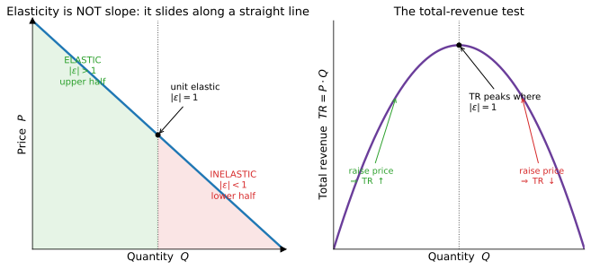
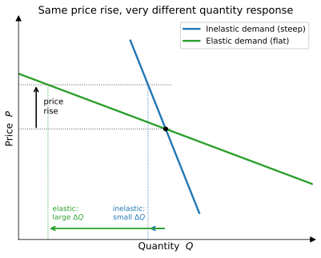
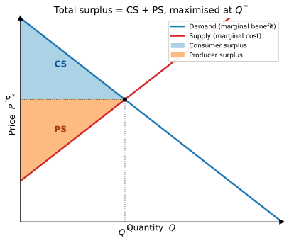
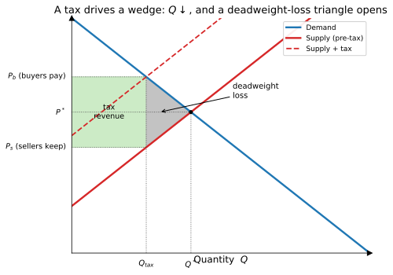
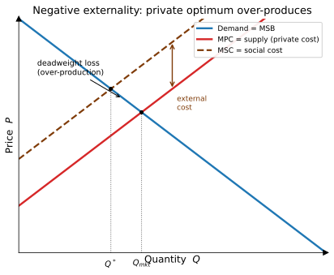
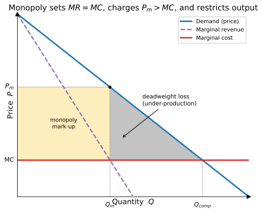
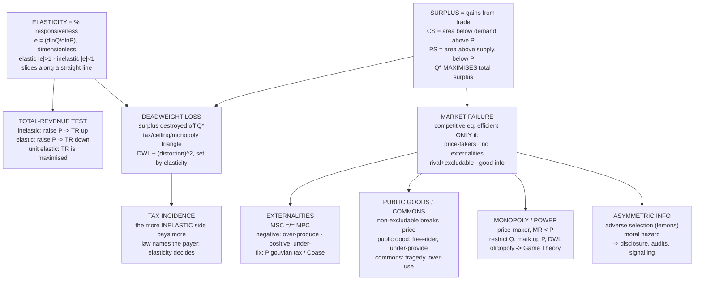

# E01 · §3 — Elasticity, Surplus & When Markets Fail

> **Subject:** Economy & Finance *(hobby track)*
> **Module:** E01 — Economic Foundations (Microeconomics)
> **Section:** The *magnitude* §2 left open (elasticity), the *welfare* the market creates (surplus),
> the *cost of pushing it off its optimum* (deadweight loss, taxes), and the four classic ways the invisible
> hand genuinely fails (externalities, public goods, monopoly, asymmetric information).
> **Status:** ✅ finalized 2026-06-20 — you studied the body, then in Q&A took it straight to a live policy:
> **Singapore's sugar-sweetened-beverage measures** (Nutri-Grade labelling vs a sugar tax). §8 captures that
> thread — the re-rank from "externality" to **information/internality**, the **shift-vs-slope** reason a
> label beats a tax under inelastic demand, and the firms' strategic versioning response. Math in LaTeX,
> quantitative relationships drawn as real curves; key terms glossed in 中文 (大陆/台灣), per
> [`../../../agent-docs/authoring-conventions.md`](../../../agent-docs/authoring-conventions.md).

**Estimated study time:** 1.5–2 hours including reflection.
**Prerequisites:** §1 (marginal thinking, $MB/MC$, opportunity cost as a shadow price) and §2 (demand
and supply as response functions $Q_d(P)$, $Q_s(P)$; equilibrium $P^\ast$ as a fixed point; comparative
statics). §2 ended on a cliffhanger this section pays off twice: it left *how much* $P^\ast$ and $Q^\ast$ move
to **elasticity**, and it flagged that the clean "invisible hand" story holds only in a frictionless
special case — this is where we map the **failures**.

---

## Why this section exists (for *you*)

§2 gave you the *directions* — a demand shock moves price and quantity the same way, a supply shock moves
them opposite ways. But the question a trader, a policymaker, or a CFO actually asks is **"by how much?"**
That magnitude is **elasticity**, and it turns out to be the single most reused number in applied
economics: it decides who really pays a tax, whether a price hike raises or wrecks your revenue, how much
a subsidy moves anything, and how big the damage is when policy fights the price.

Then we turn the model normative. §2 was careful to separate *positive* ("a ceiling causes a shortage")
from *normative* ("is that good?"). **Surplus** is the bridge: a way to *measure* welfare on the same
supply-and-demand diagram, so "good" and "bad" stop being hand-waving. With surplus in hand, two things
fall out cleanly:

1. **Why the competitive equilibrium is special** — it *maximizes total surplus*. This is the first
   welfare theorem from §2 §5, now drawn as an area you can see and a quantity you can compute.
2. **Exactly what a distortion costs** — the **deadweight loss**, the surplus that simply vanishes when
   the market is pushed off $Q^\ast$ (by a tax, a price control, or market power). For you specifically there's
   a clean punchline: that loss is **second-order** in the distortion — quadratic, like the energy of a
   spring displaced from its minimum — which is why small frictions are cheap and large ones are
   disproportionately expensive.

Finally, the honest part. §2's §10a ended by conceding the real frontier of "when the model breaks" is
not the *existence* of supply and demand but **market failure** — the cases where a competitive
equilibrium forms and is still *not* efficient. There are exactly four canonical ones, and this section is
where the beautiful §2 coordination story earns its asterisks.

> **One framing to hold:** §2 proved the price *coordinates*. §3 asks two follow-ups — *how strongly*
> (elasticity), and *when the coordination is the wrong target* (market failure). The first is a number;
> the second is a list of four broken assumptions.

---

## 1. Elasticity: the magnitude that comparative statics left open

<b>Vocabulary for this section</b> — terms, abbreviations and every symbol in the formulas (click to expand)

**Abbreviations**

| Short | Stands for | Meaning |
|---|---|---|
| **TR** | total revenue | price multiplied by quantity sold — what the seller takes in before costs |
| **OPEC** | Organization of the Petroleum Exporting Countries | the cartel of oil-producing states that restricts output to influence the oil price |
| **10-K** | (US) Form 10-K | the annual report a US-listed company files with the securities regulator |

**Symbols used in the formulas**

| Symbol | Reads as | Meaning |
|---|---|---|
| $\varepsilon$ | "epsilon" | elasticity — a ratio of percentage changes, with no units |
| $\varepsilon_d$ | "epsilon-sub-d" | price elasticity of **demand**; the subscript $d$ marks the demand side. It is negative because demand slopes down |
| $\lvert\varepsilon_d\rvert$ | "mod epsilon-d" | its absolute value — the sign dropped, which is how elasticity is usually quoted |
| $\varepsilon_s$ | "epsilon-sub-s" | price elasticity of **supply**; the subscript $s$ marks the supply side |
| $\varepsilon_Y$ | "epsilon-sub-Y" | **income** elasticity of demand; the subscript $Y$ marks income |
| $\varepsilon_{xy}$ | "epsilon-sub-x-y" | **cross-price** elasticity: how the quantity of good $x$ responds to the price of good $y$ |
| $P$ |  | the price of the good |
| $Q_d$ | "Q-sub-d" | quantity demanded |
| $Q_s$ | "Q-sub-s" | quantity supplied |
| $Q_x$, $P_y$ | "Q-sub-x", "P-sub-y" | the quantity of one good and the price of a *different* good — the pair that defines cross-price elasticity |
| $Y$ |  | income |
| $\Delta$ | "delta" | "change in" — so $\Delta P$ is the change in price |
| $\Delta Q_d / Q_d$ | "delta Q-d over Q-d" | the **percentage** change in quantity demanded |
| $\Delta P / P$ | "delta P over P" | the percentage change in price |
| $dQ_d/dP$ | "d-Q-d by d-P" | the slope of the demand curve — the change in quantity per unit change in price, in the goods' own units |
| $TR = P \times Q$ | "T-R equals P times Q" | total revenue is price multiplied by quantity |
| $\infty$ | "infinity" | unboundedly large; elasticity tends to this at the top of a straight-line demand curve |
| $d\ln Q / d\ln P$ | "d-log-Q by d-log-P" | the log-slope: elasticity written as a derivative on a log–log scale |
| $Q = AP^{k}$ | "Q equals A times P to the k" | a power-law demand curve, with $A$ a scaling constant and $k$ the exponent |
| $k$ |  | that exponent — for a power law it *is* the elasticity, the same at every point |
| $\equiv$ | "is identically equal to" | equal everywhere, not just at one point |

**Terms**

| Term | Definition |
|---|---|
| **Elasticity** | responsiveness expressed as a ratio of **percentage** changes, so it has no units and can be compared across different goods |
| **Price elasticity of demand** | the percentage change in quantity demanded per one percent change in price |
| **Elastic** | absolute elasticity above one — quantity responds *more* than proportionally |
| **Inelastic** | absolute elasticity below one — quantity responds *less* than proportionally |
| **Unit elastic** | absolute elasticity exactly one — quantity and price move proportionally; revenue is at its maximum here |
| **Perfectly inelastic** | elasticity zero: a vertical demand curve, quantity unchanged at any price |
| **Perfectly elastic** | infinite elasticity: a horizontal demand curve, where the slightest price rise loses every buyer — the demand a single price-taking farmer faces |
| **Elasticity is not slope** | slope has units and is constant along a straight line; elasticity is unit-free and varies all along that same line, because it also depends on where you are |
| **Dimensionless** | having no units, so the number means the same thing for oil and for airline seats |
| **Substitutes** | goods that can replace each other; more and closer substitutes make demand more elastic |
| **Complements** | goods used together, so cheaper consoles raise game sales |
| **Necessity** | a good bought regardless of price — inelastic; a **luxury** is the opposite |
| **Share of budget** | how much of income the good absorbs; big-ticket items get noticed and are more elastic |
| **Short run vs long run** | demand is almost always more elastic in the long run, because substitution takes time — the single most often forgotten determinant |
| **Total revenue test** | if demand is inelastic a price rise raises revenue; if elastic it lowers it; at unit elasticity revenue peaks |
| **Loss-leader** | a deliberately cheap item used to pull in buyers, which only pays when demand is elastic |
| **Sin tax** | a tax on an inelastic disfavoured good such as tobacco; it raises a lot of revenue while changing quantity only modestly |
| **Market definition** | how wide a set of goods counts as "the market"; defining it wider makes demand look more inelastic, which is why it is fought over in antitrust and tax cases |
| **Income elasticity** | the percentage change in quantity per one percent change in income |
| **Normal good** | one bought more of as income rises; an **inferior good** is bought *less* of as income rises, which is why some businesses do better in a recession |
| **Cross-price elasticity** | the percentage change in one good's quantity per one percent change in another good's price; positive means substitutes, negative means complements |
| **Price elasticity of supply** | the same responsiveness measure on the sell side; high when output can be ramped instantly, low when capacity takes years |
| **Constant-elasticity demand** | a power-law demand curve, which plots as a straight line on log–log axes and has the same elasticity everywhere |
| **Comparative statics** | signing the direction in which equilibrium price and quantity move after a shift; elasticity supplies the magnitude it leaves open |
| **Susceptibility / linear response** | the physics name for the same object: how strongly an output responds to a fractional change in a control |

§2's comparative statics told you a demand increase raises both $P^\ast$ and $Q^\ast$. **Elasticity** tells you
the *split* — does the adjustment show up mostly as a price move or mostly as a quantity move? It is the
**responsiveness** of one variable to another, expressed as a ratio of **percentage** changes.

The headline one is the **price elasticity of demand**:

$$\varepsilon_d = \frac{\Delta Q_d / Q_d}{\Delta P / P} \quad \xrightarrow{\text{small changes}} \quad \frac{dQ_d}{dP}\cdot\frac{P}{Q_d}.$$

(The numerator $\Delta Q_d / Q_d$ is the percentage change in quantity, the denominator $\Delta P / P$ the
percentage change in price — so this *is* the "ratio of percentage changes," made exact in the limit.)

Because demand slopes down, $\varepsilon_d$ is negative; by convention people usually quote its absolute
value $|\varepsilon_d|$ and talk about "how elastic" a good is. Three regimes, and they're the whole game:

| | $\lvert\varepsilon_d\rvert$ | Meaning | Examples |
|---|---|---|---|
| **Elastic** | $> 1$ | quantity responds *more* than proportionally | airline seats, branded soda, restaurant meals, most discretionary goods |
| **Unit elastic** | $= 1$ | quantity and price move proportionally | a knife-edge |
| **Inelastic** | $< 1$ | quantity responds *less* than proportionally | insulin, salt, gasoline (short run), cigarettes |

Two limiting cases anchor the ends: **perfectly inelastic** ($\varepsilon_d = 0$, a *vertical* demand
curve — quantity won't budge at any price, the textbook caricature of life-saving medicine) and **perfectly
elastic** ($\varepsilon_d = -\infty$, a *horizontal* line — the slightest price rise loses *all* buyers,
which is exactly the demand curve a single wheat farmer faces in §2's perfectly competitive market).

### Why percentages, not slope?

This is the subtlety that trips people up, and it's worth getting exactly right because it's where the
physics intuition mildly *misleads*. Elasticity is **not** the slope of the demand curve. Two reasons:

- **Units.** A slope $dQ/dP$ is "litres per dollar" or "shares per cent" — it changes if you switch from
  litres to gallons or dollars to cents, so you can't compare the slope for oil with the slope for
  airline tickets. The *percentage* ratio is **dimensionless**, so $|\varepsilon|$ for oil and for tickets
  live on the same scale and are directly comparable. That's the entire reason economists use it.
- **It slides along a straight line.** On a *linear* demand curve the slope is constant everywhere, yet
  elasticity runs from $\infty$ at the top to $0$ at the bottom — because the $P/Q$ factor changes as you
  move along it. High price / low quantity (top) is elastic; low price / high quantity (bottom) is
  inelastic; the midpoint is unit elastic.

<!-- FIGURE -->

The picture above (left panel) is the one to burn in: *same line, every elasticity*. And the contrast
with §2's "steep vs flat" intuition is reconciled this way — for two curves through the *same point*, the
flatter one **is** more elastic (below), but you cannot read elasticity off steepness *alone* without
knowing where you are on the curve.

<!-- FIGURE -->

### What makes a good elastic or inelastic

Four determinants, all common-sense once stated:

- **Substitutes.** The more (and closer) the substitutes, the more elastic. "Coca-Cola" is elastic
  (switch to Pepsi); "soft drinks as a category" is far less so. **Defining the market wider makes demand
  more inelastic** — a crucial trick antitrust lawyers and tax authorities both exploit.
- **Necessity vs luxury.** Necessities (insulin, electricity, staple food) are inelastic; luxuries
  (cruises, jewellery) are elastic.
- **Share of budget.** Goods that eat a big slice of income (housing, cars) are more elastic — you really
  notice the price; cheap incidentals (salt, matches) are inelastic.
- **Time horizon.** This is the big one and the most counter-intuitive. Demand is almost always **more
  elastic in the long run.** When petrol spikes, you can't do much this week (inelastic — you still drive
  to work), but over years you buy a smaller car, move closer, switch to transit (elastic). The 1970s oil
  shocks are the canonical case: tiny short-run quantity response, large long-run one. Forgetting this is
  how people mis-forecast the impact of an energy price move.

### The payoff you'll use constantly: the total-revenue test

Revenue is $TR = P \times Q$. Raise the price and two things fight: the higher $P$ *per unit* pulls $TR$
up, the lower $Q$ pulls it down. **Elasticity decides who wins:**

- **Inelastic demand** ($|\varepsilon| < 1$): quantity barely falls, so a price rise **raises** revenue.
  (This is why OPEC restricting oil output, or a city raising transit fares, can increase total takings —
  and why "sin taxes" on inelastic cigarettes raise lots of revenue.)
- **Elastic demand** ($|\varepsilon| > 1$): quantity falls a lot, so a price rise **lowers** revenue;
  to grow revenue you *cut* price (the logic behind discounting and loss-leaders).
- **Unit elastic** ($|\varepsilon| = 1$): revenue is at its **maximum** — the peak of the TR curve in the
  right panel of the figure above.

That single test — *"is this market elastic or inelastic right now?"* — answers a startling number of
business and policy questions. A firm that doesn't know whether it's on the elastic or inelastic side of
its demand curve is pricing blind.

### The other elasticities (one line each — you'll meet them in the news and in 10-Ks)

- **Income elasticity** $\varepsilon_Y = \dfrac{\Delta Q / Q}{\Delta Y / Y}$ (with $Y$ = income). Positive → **normal good**;
  negative → **inferior good** (instant noodles, bus travel — demand *rises* when incomes fall, which is
  why some businesses are "recession-resistant"). Greater than 1 → **luxury** (demand grows faster than
  income — the bet behind every premium brand).
- **Cross-price elasticity** $\varepsilon_{xy} = \dfrac{\Delta Q_x / Q_x}{\Delta P_y / P_y}$. Positive → **substitutes**
  (price of Pepsi up → Coke sales up); negative → **complements** (price of game consoles down → game
  sales up). This is the number that defines competitive sets and explains razor-and-blades pricing.
- **Price elasticity of supply** $\varepsilon_s = \dfrac{\Delta Q_s / Q_s}{\Delta P / P}$. Same idea on the sell side,
  governed by how fast producers can ramp: high for a download (copy it instantly), low for beachfront
  land or a new chip fab (capacity takes years — your §2 §10b semiconductor cycle lives here).

> **Physics lens — elasticity is a logarithmic derivative.** Rewrite it as
> $\varepsilon = \dfrac{d\ln Q}{d\ln P}$. It is the dimensionless **response coefficient** of $Q$ to $P$
> on a log–log scale — precisely a *susceptibility* in the linear-response sense (how strongly does the
> output respond to a fractional change in the control field), made unit-free so different systems are
> comparable. The reason it "slides" along a straight line is that a fixed *slope* $dQ/dP$ is not a fixed
> *log-slope*: $\varepsilon = (dQ/dP)\thinspace (P/Q)$, and $P/Q$ runs over the whole positive line as you traverse
> the curve. If a relationship is a power law $Q = AP^{\thinspace k}$, then $\varepsilon \equiv k$ everywhere — a
> *constant-elasticity* demand curve is exactly the straight line on a log–log plot, the same way a power
> law is in physics. (Don't push the "steepness = elasticity" picture any further than two curves through
> one shared point; beyond that it's the log-slope, not the slope, that you want.)

---

## 2. Surplus: putting a number on who gains from a market

<b>Vocabulary for this section</b> — terms, abbreviations and every symbol in the formulas (click to expand)

**Abbreviations**

| Short | Stands for | Meaning |
|---|---|---|
| **CS** | consumer surplus | the value buyers capture above what they pay *(in this section CS is **not** "computer science")* |
| **PS** | producer surplus | the value sellers capture above their cost |
| **MB** | marginal benefit | the value of one more unit to a buyer, read off the demand curve |
| **MC** | marginal cost | the cost of one more unit to a seller, read off the supply curve |

**Symbols used in the formulas**

| Symbol | Reads as | Meaning |
|---|---|---|
| $P^\ast$ | "P-star" | the equilibrium price |
| $Q^\ast$ | "Q-star" | the equilibrium quantity — the quantity that maximises total surplus |
| $q$ |  | a running index over units, from the first one produced up to $Q^\ast$ |
| $MB(q)$ | "M-B of q" | the marginal benefit of the $q$-th unit — the height of the demand curve there |
| $MC(q)$ | "M-C of q" | the marginal cost of the $q$-th unit — the height of the supply curve there |
| $W(Q)$ | "W of Q" | total surplus when quantity $Q$ is traded; $W$ stands for welfare |
| $\int_0^{Q^\ast}$ | "the integral from zero to Q-star" | add up the expression that follows over every unit from the first to $Q^\ast$ |
| $dW/dQ$ | "d-W by d-Q" | how total surplus changes with one more unit traded; setting it to zero gives $MB = MC$ |
| $\Rightarrow$ | "implies" | the statement on the left forces the one on the right |
| $\nabla W = 0$ | "grad W equals zero" | the stationary point of the welfare function — where it stops rising |

**Terms**

| Term | Definition |
|---|---|
| **Surplus** *(welfare sense)* | the gap between what something is worth to you and what you actually pay or receive — **not** the "unsold goods" surplus of the supply-and-demand chapter |
| **Consumer surplus** | the area below the demand curve and above the price: value buyers get beyond what they hand over |
| **Producer surplus** | the area above the supply curve and below the price: value sellers get beyond their cost. It is **not profit** — it ignores fixed costs |
| **Total surplus** | consumer surplus plus producer surplus — the whole gains from trade the market creates |
| **Willingness to pay** | the most a buyer would pay for a unit; the height of the demand curve at that unit |
| **Gains from trade** | the value created by the exchange itself, because the buyer values the good more than it cost to make |
| **Welfare** *(economic sense)* | total surplus — the measure used to judge whether an outcome is efficient; nothing to do with social benefits payments |
| **Demand curve as the marginal-benefit curve** | the demand curve's height at each unit *is* the marginal benefit of that unit, which is what makes surplus an area |
| **Supply curve as the marginal-cost curve** | likewise, the supply curve's height at each unit is the marginal cost of that unit |
| **First welfare theorem** | the result that the competitive equilibrium quantity maximises total surplus, with no one computing it |
| **Marginal vs total** | marginal benefit is the worth of the *next* unit; total surplus is the accumulated gap between marginal benefit and marginal cost over all units |

To judge a market we need a yardstick for "welfare." Economics uses **surplus** — the gap between what
something is *worth* to you and what you actually *pay or receive*. It's measurable straight off the
supply-and-demand diagram, because §2 already told us the curves *are* the marginal-benefit and
marginal-cost curves read sideways.

- **Consumer surplus (CS).** Each buyer's marginal benefit is read off the **demand curve**; they pay only
  $P^\ast$. The difference, summed over every unit bought, is the area **below demand and above the price** —
  the value buyers capture beyond what they hand over. (Your willingness to pay \$8 for a coffee you got
  for \$4 is \$4 of consumer surplus.)
- **Producer surplus (PS).** Symmetrically, each seller's marginal cost is read off the **supply curve**;
  they receive $P^\ast$. The area **above supply and below the price** is the surplus producers capture beyond
  their cost. (It is *not* profit — it ignores fixed costs — but it's the right welfare measure here.)
- **Total surplus** $= CS + PS$ — the whole area between the demand and supply curves, from $0$ to $Q^\ast$.
  This is the total gains-from-trade the market creates.

<!-- FIGURE -->

Now the result §2 promised. **The competitive equilibrium $Q^\ast$ maximizes total surplus.** Look at the
figure: at $Q^\ast$ the two triangles fill the *entire* region between the curves — every trade where a
buyer values the unit more than it costs to make ($MB \geq MC$) actually happens, and no trade where
$MB < MC$ does. Produce *less* than $Q^\ast$ and you leave profitable trades on the table (a buyer willing to
pay \$7 and a seller who'd supply at \$5 fail to meet — \$2 of surplus unrealized). Produce *more* and you
force trades that destroy value ($MC > MB$). Either way total surplus falls. **The market lands exactly on
the welfare-maximizing quantity, with no one computing the welfare.** That is the **first welfare theorem**
from §2 §5, now visible as an area.

> **Physics lens — surplus is an integral; equilibrium maximizes a potential.** Consumer surplus is
> $\int_0^{Q^\ast}\big(MB(q) - P^\ast\big)\thinspace dq$ and producer surplus is $\int_0^{Q^\ast}\big(P^\ast - MC(q)\big)\thinspace dq$,
> so total surplus is $W(Q) = \int_0^{Q}\big(MB(q) - MC(q)\big)\thinspace dq$ — the **accumulated** gap between
> marginal benefit and marginal cost, exactly like work done is the integral of a force. Maximizing it,
> $\dfrac{dW}{dQ} = MB(Q) - MC(Q) = 0 \Rightarrow MB = MC$, recovers §1's marginal rule and §2's equilibrium
> in one line. Total surplus is the **potential the market climbs**, and $Q^\ast$ is its stationary point —
> the same $MB = MC$ condition, now as $\nabla W = 0$.

---

## 3. Deadweight loss: the cost of pushing the market off $Q^\ast$

<b>Vocabulary for this section</b> — terms, abbreviations and every symbol in the formulas (click to expand)

**Abbreviations**

| Short | Stands for | Meaning |
|---|---|---|
| **DWL** | deadweight loss | surplus destroyed rather than transferred, because trades that were worth doing no longer happen |
| **MB** | marginal benefit | the value of one more unit to a buyer |
| **MC** | marginal cost | the cost of one more unit to a seller |

**Symbols used in the formulas**

| Symbol | Reads as | Meaning |
|---|---|---|
| $Q^\ast$ | "Q-star" | the untaxed equilibrium quantity, which maximises total surplus |
| $P^\ast$ | "P-star" | the untaxed equilibrium price |
| $t$ |  | the per-unit tax — a fixed amount charged on each unit traded |
| $P_b$ | "P-sub-b" | the price **buyers** pay, including the tax |
| $P_s$ | "P-sub-s" | the price **sellers** keep, after the tax; it equals $P_b$ minus $t$ |
| $Q_{tax}$ | "Q-sub-tax" | the quantity still traded once the tax is in place; smaller than $Q^\ast$ |
| $t \times Q_{tax}$ | "t times Q-tax" | tax revenue — the green rectangle on the figure |
| $\Delta Q$ | "delta Q" | the fall in quantity traded caused by the tax |
| $\lvert\Delta Q\rvert$ | "mod delta Q" | the size of that fall, ignoring sign |
| $\tfrac12 t \lvert\Delta Q\rvert$ | "a half t times mod delta Q" | the area of the deadweight-loss triangle |
| $t^2$ | "t squared" | the tax multiplied by itself — deadweight loss grows with the *square* of the tax, so doubling a tax roughly quadruples the loss |
| $\propto$ | "is proportional to" | grows in step with |
| $\approx$ | "is approximately equal to" | equal to a good enough approximation for small changes |
| $W$ |  | total surplus, treated as the quantity the market maximises |
| $\tfrac12 k (\Delta x)^2$ | "a half k times delta-x squared" | the energy of a spring of stiffness $k$ displaced by $\Delta x$ — the physics analogue of the triangle |

**Terms**

| Term | Definition |
|---|---|
| **Deadweight loss** | surplus that simply disappears because mutually beneficial trades stop happening; it is *not* transferred to anyone |
| **Transfer** | surplus that moves from one party to another — tax revenue is a transfer, deadweight loss is a destruction |
| **Per-unit tax** | a fixed charge per unit sold, as opposed to a percentage of the price |
| **Tax wedge** | the gap the tax opens between what buyers pay and what sellers keep |
| **Tax revenue** | the tax rate multiplied by the quantity still traded |
| **Tax incidence** | who actually bears the tax, as opposed to who the law names as the payer |
| **Statutory vs economic incidence** | statutory is whom the statute bills; economic is whose income actually falls. The law's split is largely theatre |
| **The inelastic side bears more** | whichever side of the market cannot easily get out of the way absorbs most of the tax |
| **Elastic / inelastic** | quantity responds a lot / a little to price; elastic curves mean a bigger quantity fall and so a bigger deadweight loss |
| **Luxury tax** | a tax on high-end goods; the 1990 US yacht tax is the cautionary case because yacht demand turned out to be elastic |
| **Payroll tax** | a tax on wages, statutorily split between employer and employee but economically shared according to elasticities |
| **Price ceiling / price floor** | a legal maximum or minimum price; a binding one opens the same deadweight-loss triangle a tax does |
| **Short side of the market** | whichever of quantity demanded and quantity supplied is smaller once the price is pinned away from equilibrium; it is what actually gets traded |
| **Envelope theorem** | at an optimum the first-order effect of a small perturbation is zero, so the leading loss is quadratic — why the first small tax is nearly free and a big one is not |
| **Second-order** | proportional to the square of the distortion, hence small for small distortions and disproportionately large for big ones |

If $Q^\ast$ maximizes total surplus, then **any** policy or friction that moves the traded quantity away from
$Q^\ast$ destroys some surplus. The chunk that vanishes — not transferred to anyone, simply *gone* because
mutually-beneficial trades no longer happen — is the **deadweight loss (DWL)**. On the diagram it is always
a **triangle** pointing at $Q^\ast$. We met the *mechanism* in §2's price controls; now we can measure it.

Take a **per-unit tax** $t$ — the cleanest case, and a perennial news item. The tax drives a **wedge**
between the price buyers pay ($P_b$) and the price sellers keep ($P_s = P_b - t$). The traded quantity
falls to $Q_{tax} < Q^\ast$:

<!-- FIGURE -->

Three regions tell the whole story:

- The **green rectangle** ($t \times Q_{tax}$) is **tax revenue** — surplus transferred from buyers and
  sellers to the government. Not destroyed, just moved; whether that's good depends on what the government
  does with it (a normative question — keep it separate, per §1 §6).
- The **grey triangle** is the **deadweight loss** — the surplus on the trades between $Q_{tax}$ and $Q^\ast$
  that *used* to happen ($MB > MC$) and now don't. Nobody gets it. It is the pure efficiency cost of the
  tax.

### Tax incidence: who *actually* pays is set by elasticity, not by law

Here is the result that surprises everyone and that §1 and §2 set up perfectly. **The side of the market
that is more *inelastic* bears more of the tax**, regardless of whom the law names as the payer. Intuition:
the inelastic side "can't get out of the way" — it keeps transacting even as the price moves against it,
so the price moves against it.

- **Cigarette taxes** fall mostly on **smokers** (demand is inelastic — addiction; few substitutes), which
  is also why they raise so much revenue (§1's total-revenue test) while changing quantity only modestly.
- The U.S. **1990 luxury tax on yachts** is the cautionary tale: yacht demand was *elastic* (the rich
  simply bought abroad or didn't buy), so quantity collapsed, the tax raised little, and the burden landed
  on **boat-builders and their workers** — exactly the people it wasn't aimed at. It was repealed in 1993.
- **Payroll taxes** are statutorily "split" between employer and employee, but the economic incidence is
  set by the relative elasticity of labour demand and supply — the legal split is mostly theatre.

> **Physics lens — two clean results you'll like.**
>
> 1. **Deadweight loss is second-order; incidence is an impedance match.** The DWL triangle has area
>    $\approx \tfrac12\thinspace t\thinspace \lvert\Delta Q\rvert$, and since $\Delta Q \propto t$ (for small $t$), the loss
>    scales as $\mathbf{DWL \propto t^2}$ — **quadratic in the distortion.** This is the *envelope theorem*
>    in disguise: at the optimum $Q^\ast$ the first-order change in total surplus is zero (you're at the top
>    of the potential $W$), so the leading loss is the quadratic term — exactly the energy
>    $\tfrac12 k\thinspace (\Delta x)^2$ of a harmonic well displaced by $\Delta x$. The policy reading is real and
>    non-obvious: **doubling a tax roughly quadruples its deadweight loss**, so many small taxes beat one
>    big one, and the first small tax in an undistorted market is nearly free at the margin. The size of
>    $\lvert\Delta Q\rvert$ — hence of the whole triangle — is governed by the **elasticities** (flat,
>    elastic curves → big $\Delta Q$ → big DWL; steep, inelastic → small). Elasticity and deadweight loss
>    are the same fact seen twice.
> 2. **Incidence goes to the stiffer side.** Whichever curve is steeper (more inelastic) is the "stiffer
>    spring," and it absorbs more of the price displacement — the burden flows to the side that *can't move*,
>    precisely like a load dropping across two springs in series settles mostly on the stiffer one, or a
>    signal depositing its energy into the matched (here, *mis*-matched) impedance.

The same triangle is what a **price ceiling or floor** (§2 §6) costs: bind the price away from $P^\ast$,
quantity falls to the short side of the market, and a deadweight-loss triangle opens. A tax and a binding
control are the same geometry — both pin the system off its surplus-maximizing fixed point.

---

## 4. When the invisible hand fails — the four canonical breakdowns

<b>Vocabulary for this section</b> — terms, abbreviations and every symbol in the formulas (click to expand)

**Abbreviations**

| Short | Stands for | Meaning |
|---|---|---|
| **MSC** | marginal social cost | the full cost of one more unit including what falls on third parties |
| **MPC** | marginal private cost | the cost of one more unit as borne by the producer alone *(in this section MPC is **not** "marginal propensity to consume")* |
| **MR** | marginal revenue | the extra revenue from selling one more unit |
| **MC** | marginal cost | the extra cost of producing one more unit |
| **DWL** | deadweight loss | surplus destroyed because worthwhile trades no longer happen |
| **R&D** | research and development | spending on inventing and improving products, a standard positive-externality example |
| **EU ETS** | European Union Emissions Trading System | the EU's cap-and-trade market for greenhouse-gas permits |
| **ERP** | Electronic Road Pricing | Singapore's congestion tolls, the live example of pricing a common resource |
| **IP** | intellectual property | patents, copyrights and the like — legally granted, temporary monopolies |

**Symbols used in the formulas**

| Symbol | Reads as | Meaning |
|---|---|---|
| $P$ |  | the price of one unit |
| $MR$ | "M-R" | marginal revenue — what one more unit adds to total revenue |
| $MC$ | "M-C" | marginal cost — what one more unit adds to total cost |
| $MR < P$ | "M-R is less than P" | for a price-setting firm, marginal revenue sits **below** price, because selling one more unit means cutting the price on all the earlier ones too |
| $MR = MC$ | "M-R equals M-C" | the profit-maximising condition, which for a monopolist lands at a lower quantity than the competitive one |
| $P = MC$ | "P equals M-C" | the competitive outcome, where price is driven down to the cost of the last unit |
| $Q_m$ | "Q-sub-m" | the quantity a **monopolist** chooses |
| $Q_{comp}$ | "Q-sub-comp" | the quantity a **competitive** market would produce; larger than $Q_m$ |
| $P_m$ | "P-sub-m" | the price the monopolist charges; higher than marginal cost |
| $SO_2$ | "S-O-two" | sulphur dioxide, the pollutant capped in the original US acid-rain permit market |

**Terms**

| Term | Definition |
|---|---|
| **Market failure** | a situation where the competitive equilibrium still forms but no longer maximises total surplus, because one of the welfare theorem's assumptions is broken |
| **Price-taker** | an agent too small to move the price; **price-maker** is one whose own output choice moves it |
| **Market power** | the ability to raise price above marginal cost without losing all your customers |
| **Externality** | a cost or benefit landing on someone outside the transaction, so it never enters the price |
| **Negative externality** | the external effect is a cost (pollution, congestion); the market **over-produces** |
| **Positive externality** | the external effect is a benefit (vaccination, education, research); the market **under-produces** |
| **Private vs social cost** | private cost is what the decision-maker pays; social cost adds what everyone else pays. The gap *is* the externality |
| **Pigouvian tax** | a tax set equal to the marginal external damage, so private cost is raised to social cost and the market's own optimisation lands on the efficient quantity |
| **Pigouvian subsidy** | the mirror image for a positive externality |
| **Carbon tax** | the headline modern Pigouvian tax, levied on greenhouse-gas emissions |
| **Cap-and-trade** | fixing the total *quantity* of a pollutant and letting a market discover its price — the dual of a tax, which fixes the price and lets quantity adjust |
| **Coase theorem** | with clear property rights and cheap bargaining, parties can negotiate to the efficient outcome without government, whoever holds the initial right |
| **Transaction costs** | the cost of finding, negotiating with and enforcing agreements on the other party; externalities persist exactly where these are too high |
| **Rivalry** | one person's consumption prevents another's (a sandwich); **non-rival** means it does not (a broadcast) |
| **Excludability** | non-payers can be kept out (a cinema); **non-excludable** means they cannot (the open ocean) |
| **Private good** | rival and excludable — the case ordinary markets handle well |
| **Club good** | non-rival but excludable — a cinema, satellite TV, a toll bridge |
| **Common resource** | rival but non-excludable — fish stocks, groundwater, a congested road |
| **Public good** | non-rival and non-excludable — national defence, street lighting, basic research |
| **Free-rider problem** | since non-payers cannot be excluded, each person's incentive is to enjoy a public good without paying, so markets under-provide it |
| **Tragedy of the commons** | each user of a common resource takes the full private benefit of one more unit but bears only a fraction of the shared cost, so the resource is over-used |
| **Property rights** | legally enforceable claims over a resource; assigning them clearly is one standard fix for the commons |
| **Tradable quota** | a transferable right to take a set amount, used to cap and allocate fishing and emissions |
| **Community governance** | Ostrom's finding that local users often craft and enforce workable rules themselves, without either privatisation or central control |
| **Monopoly** | a single seller facing the whole market demand curve |
| **Natural monopoly** | an industry where economies of scale are so large that one firm serving everyone is genuinely cheapest |
| **Economies of scale** | unit cost falling as output grows |
| **Network effects** | a product becoming more valuable to each user as more people use it |
| **Marginal revenue** | what one more unit adds to revenue; for a price-setter it is below price, because the price cut applies to earlier units too |
| **Inframarginal units** | the units the firm was already selling, on which a price cut also costs it revenue |
| **Mark-up** | the gap between price and marginal cost |
| **Price discrimination** | charging different buyers different prices for the same thing; it can raise output and shrink deadweight loss while transferring more surplus to the firm |
| **Antitrust / competition policy** | law and enforcement aimed at market power: blocking mergers, breaking up or constraining dominant firms |
| **Oligopoly** | a few interacting firms, whose outcome depends on how each anticipates the others — game theory, not ordinary supply and demand |
| **Asymmetric information** | one side of a trade knows something material the other does not |
| **Adverse selection** | hidden **type**, known before the deal: the worst risks are keenest to trade, which can unravel the market |
| **Market for lemons** | Akerlof's used-car model of adverse selection, where good cars withdraw and only bad ones remain |
| **Signalling** | the informed side taking a costly action that credibly conveys quality — a warranty, a credential, an audited account |
| **Screening** | the uninformed side designing the deal so that different types sort themselves out |
| **Moral hazard** | hidden **action**, after the deal: being insured or spending someone else's money changes how carefully you behave |
| **Deductible** | the portion of a loss the insured bears themselves, used to blunt moral hazard |
| **Principal–agent problem** | one party acting on another's behalf with different incentives and better information |
| **Corporate governance** | the machinery — boards, disclosure, auditing, standards — built to contain those information and incentive problems |

Everything above lives inside §2's "clean case": the **first welfare theorem** says a *competitive*
equilibrium is efficient — but only under assumptions. Spell them out and the failures are just the list
of assumptions, each one broken:

> The competitive equilibrium maximizes total surplus **provided**: (i) everyone is a *price-taker* (no
> market power), (ii) there are *no externalities* (all costs and benefits land on the transacting parties),
> (iii) the good is *rival and excludable* (a normal private good), and (iv) information is *good enough*
> (no one is systematically fooled).

Break (ii) → **externalities**. Break (iii) → **public goods & common resources**. Break (i) →
**monopoly / market power**. Break (iv) → **asymmetric information**. These are the four **market
failures**, and they are where the §2 coordination story stops being automatically a *good* thing. Crucially,
this is a *narrower and more honest* claim than "markets don't work": the equilibrium still **forms** (the
curves are real, §2 §10a) — it's just no longer the welfare-maximizing one, so there's a *potential* role
for policy. (Whether real policy improves on it is a separate question — §7.)

### 4a. Externalities — costs or benefits that miss the price

An **externality** is a cost or benefit that falls on someone *not* party to the transaction, so it never
enters the price. The market optimizes **private** cost/benefit; society cares about **social** cost/benefit;
the gap is the externality.

- **Negative externality** (pollution, traffic congestion, a noisy bar): the **marginal social cost (MSC)**
  exceeds the **marginal private cost (MPC)** by the external damage. The market produces where demand meets
  *MPC (marginal private cost)*; the efficient quantity is where demand meets *MSC* — which is **smaller**. So a market with
  negative externalities **over-produces**, and the gap is a deadweight loss.

<!-- FIGURE -->

- **Positive externality** (vaccination, education, R&D, a well-kept garden): your private benefit
  understates the social benefit (your flu shot protects others too), so the market **under-produces**
  relative to the social optimum. This is the textbook justification for **subsidizing** vaccines,
  schooling, and basic research.

**Fixes — and they're a real menu, not one answer:**
- A **Pigouvian tax** equal to the marginal external damage (a **carbon tax** is the headline modern
  example) shifts private cost up to social cost, so the market's own optimization lands on $Q^\ast$. A
  positive externality gets a **Pigouvian subsidy**.
- **Cap-and-trade** (the EU ETS, the original U.S. acid-rain $SO_2$ program) sets the *quantity* and lets a
  market discover the price of the externality — the dual choice to a tax.
- **The Coase theorem**: if property rights are clear and bargaining is cheap, the parties can negotiate to
  the efficient outcome *without* government — whoever values the resource most ends up with it, regardless
  of who's initially assigned the right. Its real lesson is about **transaction costs**: externalities
  persist precisely where bargaining is too costly (millions of diffuse pollution victims can't negotiate
  with a power plant), which is *when* you reach for taxes or regulation instead.

> **Physics lens — the market is minimizing the wrong objective.** A negative externality means each agent
> optimizes against a private cost that **omits a term** present in the true social cost. The decentralized
> system still finds the fixed point of §2 — but it's the fixed point of the *wrong* potential, displaced
> from the social optimum by exactly the missing term. A **Pigouvian tax adds that term back into every
> agent's local objective**, realigning the private gradient with the social gradient so the same
> distributed solver now converges to the socially optimal allocation. It's constraint/objective
> *correction*, not central control — which is why economists generally prefer a price (tax) to a quantity
> mandate: keep the §2 distributed computer, just fix its objective.

### 4b. Public goods & common resources — when "rival and excludable" breaks

Two properties classify every good. **Rivalry**: does my consuming it stop you (a sandwich is rival; a
radio broadcast is not)? **Excludability**: can a seller stop non-payers from consuming it (a cinema can;
the open ocean can't)? The familiar private good is *both*. Drop either and the price mechanism stumbles.

| | **Excludable** | **Non-excludable** |
|---|---|---|
| **Rival** | **Private good** (food, clothes) — markets work | **Common resource** (fish stocks, groundwater, a congested road) |
| **Non-rival** | **Club good** (cinema, satellite TV, a toll bridge) | **Public good** (national defence, street lighting, basic research, clean air) |

- **Public goods** (non-rival, non-excludable) suffer the **free-rider problem**: since you can't be
  excluded and your use doesn't diminish anyone else's, your private incentive is to enjoy it without
  paying — so a market **under-provides** or doesn't provide it at all. National defence, basic science,
  a lighthouse, mosquito control: classic cases for **public provision funded by taxation**, or clever
  mechanisms (patents, prizes) to restore an incentive.
- **Common resources** (rival but non-excludable) suffer the **tragedy of the commons**: each user reaps
  the full private benefit of one more unit (one more fish, one more cow on the pasture, one more car on
  the road) but bears only a fraction of the shared cost (depletion, congestion), so the resource is
  **over-used** and can collapse. It is a negative externality each user imposes on all the others —
  overfished cod, drained aquifers, rush-hour gridlock, antibiotic resistance. Fixes: assign **property
  rights / quotas** (tradable fishing quotas), **price the congestion** (Singapore's Electronic Road Pricing (ERP) is a
  textbook live example), or — Elinor Ostrom's Nobel-winning point — **community governance**, where local
  users craft and enforce their own rules without either privatization or top-down control.

### 4c. Monopoly & market power — when price-taking breaks

§2 assumed every agent is a **price-taker** — too small to move the price, facing a flat demand curve.
A **monopolist** (or any firm with market power) is a **price-maker**: it faces the *entire*
downward-sloping market demand curve. That one change breaks efficiency.

The key is **marginal revenue**. To sell one more unit, a price-setting firm must lower the price — and (with
a single price) lower it on *all* the units it was already selling. So the revenue from one more unit is the
new price *minus* the loss on the inframarginal units: **marginal revenue lies below price**, $MR < P$. The
firm still maximizes profit at $MR = MC$ (§1's rule) — but that lands it at a **smaller quantity** and a
**higher price** than the competitive $P = MC$ point.

<!-- FIGURE -->

The consequences read straight off the figure:
- Output is **restricted** ($Q_m < Q_{comp}$) and price is **marked up** ($P_m > MC$).
- Part of consumer surplus is **transferred** to the monopolist as the mark-up rectangle (a distributional
  effect, not a pure loss).
- A **deadweight-loss triangle** opens — the trades between $Q_m$ and $Q_{comp}$ that are worth more than
  they cost but the monopolist suppresses to keep the price high. *That* is the efficiency cost of monopoly.

**Where market power comes from** (so you can spot it): **economies of scale** so large that one firm is
cheapest — a **natural monopoly** (water networks, the grid); **network effects** (a marketplace or social
graph is more valuable the more people use it); **patents and copyrights** (a *deliberate*, temporary
monopoly to reward innovation); control of a key input; or plain regulation/licensing.

**Monopoly isn't always simply "bad,"** and the nuance matters for reading business news:
- A **patent** trades short-run monopoly DWL for the long-run benefit of *having the innovation at all* —
  the whole pharma and tech-IP debate lives in that trade-off.
- A **natural monopoly** is genuinely cheapest as one firm; the policy response is to *regulate* it (price
  caps, public ownership) rather than fragment it.
- **Price discrimination** (charging different buyers different prices — student/airline/enterprise tiers)
  can actually *increase* output and *shrink* the DWL, while transferring more surplus from buyers to the
  firm. "Efficient" and "good for consumers" come apart here.
- Antitrust policy (blocking mergers, breaking up or constraining dominant firms) is the standard tool.

> **The honest boundary:** *one* price-maker is monopoly; *a few* interacting strategic firms is
> **oligopoly** — and there the outcome depends on how they anticipate each other (compete hard on price?
> tacitly collude? race on capacity?). That is genuinely **game theory**, and per the plan it's treated
> properly in the sibling [Game Theory](../../game-theory/plan.md) subject (Cournot, Bertrand, repeated
> games and collusion). Here we just mark the boundary: monopoly is the one-firm limit; real concentrated
> markets need the strategic tools.

### 4d. Asymmetric information — when "everyone knows enough" breaks

The fourth failure breaks assumption (iv): one side of a trade knows something the other doesn't, and the
market can unravel.
- **Adverse selection** (hidden *type*, known before the deal): Akerlof's **"market for lemons."** If buyers
  can't tell good used cars from bad, they'll only pay an average price; owners of good cars withdraw; the
  average quality falls; the price falls further — and the market can collapse to only lemons. Same logic
  drives insurance death-spirals (the sick are keenest to insure) and is why **signalling** (warranties,
  credentials, audited financials) and **screening** exist.
- **Moral hazard** (hidden *action*, after the deal): insured people take more risk; a borrower spending
  someone else's money is less careful; a manager whose downside is capped (cf. §1 §3-style incentive
  problems) over-gambles. It's why insurance has deductibles and why **principal–agent** problems are
  central to corporate governance — a thread you'll pull hard in the financial-statements and
  company-analysis modules (E07–E08), where management knows more about the business than you, the outside
  reader, do.

This one is less a tidy triangle and more a *pervasive friction*; flag it now, because half of finance
(disclosure rules, ratings, auditing, the very existence of accounting standards) is machinery built to
fight information asymmetry.

---

## 5. The one-page mental model

<!-- DIAGRAM:START -->

Diagram source (Mermaid)

```mermaid
flowchart TD
    EL["ELASTICITY = % responsiveness<br/>e = (dlnQ/dlnP), dimensionless<br/>elastic |e|>1 · inelastic |e|<1<br/>slides along a straight line"]
    TR["TOTAL-REVENUE TEST<br/>inelastic: raise P -> TR up<br/>elastic: raise P -> TR down<br/>unit elastic: TR is maximised"]
    SU["SURPLUS = gains from trade<br/>CS = area below demand, above P<br/>PS = area above supply, below P<br/>Q* MAXIMISES total surplus"]
    DW["DEADWEIGHT LOSS<br/>surplus destroyed off Q*<br/>tax/ceiling/monopoly triangle<br/>DWL ~ (distortion)^2, set by elasticity"]
    INC["TAX INCIDENCE<br/>the more INELASTIC side pays more<br/>law names the payer; elasticity decides"]
    MF["MARKET FAILURE<br/>competitive eq. efficient ONLY if:<br/>price-takers · no externalities<br/>rival+excludable · good info"]
    EX["EXTERNALITIES<br/>MSC =/= MPC<br/>negative: over-produce · positive: under-<br/>fix: Pigouvian tax / Coase"]
    PG["PUBLIC GOODS / COMMONS<br/>non-excludable breaks price<br/>public good: free-rider, under-provide<br/>commons: tragedy, over-use"]
    MO["MONOPOLY / POWER<br/>price-maker, MR < P<br/>restrict Q, mark up P, DWL<br/>oligopoly -> Game Theory"]
    AI["ASYMMETRIC INFO<br/>adverse selection (lemons)<br/>moral hazard<br/>-> disclosure, audits, signalling"]
    EL --> TR
    EL --> DW
    SU --> DW
    DW --> INC
    SU --> MF
    MF --> EX
    MF --> PG
    MF --> MO
    MF --> AI
```

<!-- DIAGRAM:END -->

**The seven things to remember:**
1. **Elasticity** is *percentage* responsiveness — dimensionless, so it's comparable across goods, and it
   **slides** along a straight demand curve (it is *not* the slope). More elastic = more substitutes,
   more luxury, bigger budget share, longer time horizon.
2. **Total-revenue test:** inelastic → raising price raises revenue; elastic → raising price lowers it;
   unit elastic → revenue peaks. One question — *elastic or inelastic?* — answers a lot of pricing/policy.
3. **Surplus** measures welfare on the S/D diagram: CS (below demand, above price) + PS (above supply,
   below price). The competitive **$Q^\ast$ maximizes total surplus** — the first welfare theorem, as an area.
4. **Deadweight loss** is the surplus *destroyed* by pushing trade off $Q^\ast$ (tax, price control, monopoly):
   always a triangle at $Q^\ast$, and **quadratic** in the distortion (small frictions cheap, big ones
   disproportionately costly), with its size set by **elasticity**.
5. **Tax incidence** lands on the **more inelastic** side, whatever the law says — the side that "can't get
   out of the way" pays.
6. **Market failure** = the four broken assumptions of the welfare theorem: **externalities** (cost/benefit
   misses the price), **public goods/commons** (non-excludability → free-riding / tragedy), **monopoly**
   (price-maker restricts output), **asymmetric information** (lemons, moral hazard).
7. The market still *forms* an equilibrium under failure (§2 §10a) — it's just no longer *efficient*, which
   is the precise, limited sense in which "the invisible hand fails" and policy *might* help.

---

## 6. Check your understanding

Jot a one-line answer to each before our Q&A — we'll dig into whichever are fuzzy or contestable.

1. A transit authority is losing money and proposes **raising** fares to boost revenue. A retailer is also
   struggling and proposes a **sale** (cutting prices) to boost revenue. Using the **total-revenue test**,
   explain how *both* can be right — what must each believe about the elasticity of its own demand, and how
   would you check it from data?
2. A government puts a \$2/unit tax on a good. In words and with the triangle, explain what the tax
   *transfers* vs what it *destroys*, and why a good with very **inelastic** demand raises lots of revenue
   but causes little deadweight loss. Then state who bears the burden and why.
3. *(For your wheelhouse.)* I claimed deadweight loss is **second-order** — $\propto t^2$ — and tied it to
   the envelope theorem and a harmonic well. Reconstruct that argument: why is the *first*-order welfare
   change zero at $Q^\ast$, and what's the policy implication of "doubling the tax quadruples the loss"? Where
   does the quadratic approximation break down?
4. Classify each by rivalry × excludability and name the failure: (a) a public beach at low tide vs at peak
   summer; (b) a new song on streaming; (c) the stock of bluefin tuna; (d) the formula for a newly
   discovered drug. For the ones that fail, name a fix and say *which assumption* of the welfare theorem
   broke.
5. A pharma company holds a patent on a life-saving drug and prices it far above marginal cost. Identify
   the deadweight loss and the transfer on a monopoly diagram, then argue *both* sides: why the patent
   monopoly might still be the efficient policy, and what that trade-off depends on.

Answers

1. **Both are right if each is on the side of its demand curve it thinks it is** — the transit authority must
   believe its demand is **inelastic** ($\lvert\varepsilon_d\rvert < 1$: commuters have few substitutes, the
   trip is a necessity, and the short-run horizon leaves no time to move house or buy a car), so a fare rise
   loses little ridership and **raises** total revenue. The retailer must believe its demand is **elastic**
   ($\lvert\varepsilon_d\rvert > 1$: branded discretionary goods with close substitutes one shop away), so a
   price cut wins enough extra volume to **raise** revenue (§1's total-revenue test). Checking it from data:
   find a past price change and compute $\lvert\varepsilon\rvert$ from the percentage moves, or simply look
   at whether **revenue rose or fell the last time price moved** — revenue *is* the test, no elasticity
   estimate required. Two cautions: elasticity **slides along the curve**, so an estimate is local to the
   current price; and demand is more elastic **in the long run**, so the transit authority's revenue gain can
   erode as riders eventually re-optimize.
2. **The tax transfers the green rectangle and destroys the grey triangle.** Revenue $t \times Q_{tax}$ moves
   from buyers and sellers to the government — surplus relocated, not lost. The **deadweight loss** is the
   surplus on the trades between $Q_{tax}$ and $Q^\ast$ that used to happen because $MB > MC$ and now do not:
   nobody gets it, it simply stops existing (§3). With very **inelastic** demand the quantity barely moves,
   so $\lvert\Delta Q\rvert$ is tiny and the triangle is tiny — while the near-unchanged $Q$ times the full
   tax makes the rectangle large. That is the whole logic of sin taxes: **inelasticity means lots of revenue
   and little distortion.** Burden: **the more inelastic side bears it**, whatever the statute says (§3's
   incidence result) — it "can't get out of the way," so the price moves against it. Cigarette taxes land on
   smokers; the 1990 yacht tax landed on boat-builders.
3. **Because $Q^\ast$ is a stationary point of total surplus, the first-order term vanishes and the leading
   loss is quadratic.** Total surplus is $W(Q) = \int_0^{Q}\big(MB(q) - MC(q)\big)  dq$, so
   $dW/dQ = MB - MC$, which is **zero at $Q^\ast$** (§2) — the first units of trade you destroy were worth
   almost exactly what they cost, so they carry almost no surplus. Geometrically the triangle has area
   $\approx \tfrac12 t \lvert\Delta Q\rvert$ and $\Delta Q \propto t$ for small $t$, giving
   $DWL \propto t^2$ — the envelope theorem, and the energy $\tfrac12 k (\Delta x)^2$ of a displaced harmonic
   well. **Policy implication:** doubling a tax roughly *quadruples* its deadweight loss, so spreading a
   revenue target across **many small taxes beats one big one**, and the first small tax in an undistorted
   market is nearly free at the margin. Where the approximation breaks: (a) large $t$, where curvature
   matters and the linearization of $\Delta Q$ fails — at the limit the tax shuts the market and the triangle
   is truncated by the whole remaining surplus; (b) **a market that is already distorted**, where
   $MB \neq MC$ to begin with, so the first-order term is *not* zero — then a small tax has a **first-order**
   welfare effect, which can be negative (stacking onto an existing tax or monopoly) or *positive* (a
   Pigouvian tax on an externality, §4a). This is the theory of the second best: "small taxes are nearly
   free" is a statement about an **undistorted** starting point only.
4. (a) **A public beach at low tide is a public good** — non-rival, non-excludable — and the failure is
   under-provision via **free-riding** (assumption (iii), non-excludability, plus nobody's private incentive
   to fund upkeep); **at peak summer it becomes a common resource**, because congestion makes it **rival**
   while still non-excludable, and the failure is the **tragedy of the commons** (over-use). Fix: price the
   congestion or issue permits, i.e. restore excludability at the crowded margin. (b) **A new song on
   streaming is a club good** — non-rival (my listening costs you nothing) but excludable (the paywall).
   Markets basically work; the residual inefficiency is that price exceeds the near-zero marginal cost, which
   is the copyright-monopoly issue of §4c, not a commons problem. (c) **Bluefin tuna is a common resource**
   — rival, non-excludable — the tragedy again (assumption (iii)); fix by assigning **property rights /
   tradable fishing quotas**, or Ostrom-style community governance. (d) **The formula for a new drug is a
   public good** — non-rival and, absent law, non-excludable — so research is **under-provided**; the fix is
   to manufacture excludability with a **patent** (or to fund it directly via prizes or public research).
   Note what that fix costs: it repairs assumption (iii) by deliberately breaking assumption (i),
   price-taking — which is question 5.
5. On the monopoly diagram, the firm sets $MR = MC$, so output is restricted to $Q_m < Q_{comp}$ and price is
   marked up above marginal cost. **The transfer** is the mark-up rectangle — consumer surplus moving to the
   pharma company, a distributional effect, not a loss. **The deadweight loss** is the triangle over the
   units between $Q_m$ and $Q_{comp}$: patients whose willingness to pay exceeds the pill's marginal cost and
   who therefore go untreated (§4c). **For the patent:** the formula is a public good (question 4d), so with
   free copying the drug's enormous R&D fixed cost is never recovered, nothing is invented, and the relevant
   comparison is not "cheap drug vs expensive drug" but **"expensive drug vs no drug"** — the static
   deadweight loss buys the dynamic incentive. **Against:** on a life-saving drug the triangle is measured in
   lives rather than dollars, and the monopoly period is long. **What the trade-off depends on:** the size of
   the R&D cost relative to the deadweight loss; how **elastic innovation is with respect to expected rents**
   (if firms would have invented anyway, the monopoly is pure loss); patent length; whether **price
   discrimination** across rich and poor countries is feasible, since tiered pricing can raise output and
   *shrink* the triangle while preserving the incentive; and whether prizes, advance market commitments or
   public funding could buy the same innovation without the mark-up.

## 7. Optional: read a real market through this lens (15–20 min, no setup)

Pick a market in the current news where price is contested — a "sin tax" (tobacco, sugar, alcohol), a
carbon price, a congestion charge, drug pricing, a streaming price hike, a fishing-quota fight. Then:

- **Elasticity:** is demand here elastic or inelastic, and *why* (substitutes? necessity? time horizon?)?
  What does the total-revenue test predict for the proposed price change?
- **Surplus & DWL:** sketch the surplus, and mark where a tax/control/markup opens a deadweight triangle.
- **Which failure (if any)?** Is the policy *correcting* a market failure (a Pigouvian tax on an
  externality, a quota on a commons, antitrust on market power) — or *creating* a distortion in an
  otherwise-fine market? Name the assumption in play.
- **Incidence:** who actually bears the cost, given the elasticities — and is that who the policy intended?

Bring one market to our chat — we'll run the elasticity / surplus / failure story on it together. That's
exactly what we did with **Singapore's sugar policy**, written up in §8 below.

---

## 8. Applied — from our session Q&A (2026-06-20): Singapore's sugar policy

You took the section straight to a live policy — Singapore's push to cut sugar in soft drinks "for public
health" — and we stress-tested it end to end. The thread is worth keeping: two of your moves were the §3
toolkit working cleanly, and two needed a re-rank.

### 8a. What the policy actually is — and which failure it targets

A factual reframe first, because it changes the diagnosis. Singapore didn't *mandate* a 20% sugar cut. The
stack is a **2016 "War on Diabetes,"** a **2017 voluntary industry pledge** (≤12% sugar), and the binding
piece — **Nutri-Grade** labelling from 2022: drinks graded A–D by sugar, grade **C/D must carry the label,
grade D can't be advertised**, extended to **freshly-made drinks (bubble tea) in 2023**. A **sugar tax was
considered and deliberately rejected.**

You filed the rationale under **externality** (the public-health cost). The re-rank: a cost you impose on
**yourself** (your own future diabetes) is *not* an externality — it's an **internality**, and the gap
between what you'd choose informed vs uninformed is an **information failure** (§3's assumption (iv)). Only
the slice landing on *shared/subsidised healthcare* is a true externality. The dominant failure is
**information + behavioural internality** — which is *why the chosen tool is a label* (the matched fix for
an information failure), not a tax (the matched fix for an externality). **The tool reveals the diagnosis.**

### 8b. Demand shift vs price — and why you saw prices *rise*

You correctly read the policy as **shifting demand left** (a less-sweet / labelled / un-advertisable drink
is wanted less at each price) → lower $P^\ast$ and $Q^\ast$. One wire we uncrossed: that **direction comes
from the shift, not from elasticity.** "Soft drinks are elastic, *therefore* $P^\ast / Q^\ast$ fall" mixes
two things — elasticity sets the *magnitude split and incidence*, and for a *demand* shift the price-vs-
quantity split actually leans on the **supply** slope. Elasticity is the right lens for "consumers can flee
to substitutes," not for the *direction* of a shift.

Your real-world puzzle — *prices rose, not fell* — is the **ceteris paribus** caveat, not a falsification.
The demand-left effect was swamped by **supply-left cost-push** (2022–23 inflation, input costs, the GST [Goods and Services Tax]
rise to 9%), and branded-soda demand is **more inelastic** (habit, brand, caffeine) than "easily
substituted" suggests. The model predicts the *partial* effect; field data is *mutatis mutandis*, and other
shifts can dominate.

### 8c. Why a label beats a tax here — your strongest argument, made exact

The rigorous backbone is the **instrument-targeting (Tinbergen) rule**: use the tool that acts on the
*actual* defect — information failure → information tool. On top of that:

- **The elasticity gem (your insight, crystallized).** A **tax moves consumers *along* the demand curve**
  (price channel), so under **inelastic** demand it delivers **big revenue, little behaviour change** —
  ineffective *and* maximally resembling a revenue grab. A **label *shifts the curve itself*** (it lowers
  net willingness-to-pay by internalising a perceived health cost), which works **regardless of the slope.**
  So **price-inelasticity neuters the tax but is irrelevant to the label** — when the slope is your enemy,
  *move the curve, don't pull the price lever.* That is §3's **shift-vs-slope** distinction turned into a
  policy decision.
- **Regressivity.** A flat sugar tax is **regressive** (累退) — a larger income share from poorer,
  higher-consuming households; a label has no such effect. (The biggest real-world argument against sugar
  taxes — the one you'd initially missed.)
- **Autonomy & fiscal context.** A label is a **nudge** — it preserves choice and dodges the "nanny state"
  critique; and fiscally strong Singapore doesn't *want* the tax's revenue, so the tax is all cost, no
  valued upside. (Keep §1's split: *"a tax punishes"* is **normative**; *"voters will read it as a revenue
  grab"* is a **positive** prediction — defend the second with evidence, flag the first as a value claim.)

Two honest counterpoints that complete it: **(1)** a tax's *real* channel in practice is **producer
reformulation** (the UK 2018 levy worked that way, not via consumer price response) — but Singapore
secured reformulation through the **pledge + Nutri-Grade incentives**, capturing the tax's main benefit
without its costs; **(2)** a pure label leaves the **externality slice unpriced** (the first welfare theorem
says it persists), so the textbook first-best is *label + a small Pigouvian tax* — which is why Singapore
kept the tax option open rather than ruling it out.

### 8d. The firms' counter-move — strategy, not passivity

You spotted the **zero-sugar twin** (Coke vs Coke Zero, same price) and called it a "game." Precisely: soft
drinks are a **differentiated oligopoly** with **market power** (§4c), so firms respond strategically.
Offering both versions at one price is **product-line versioning** that **internalises substitution** — you
switch Coke→Coke Zero (the firm keeps you) instead of Coke→Pepsi/water (the firm loses you). The exact
statement of your "less elastic portfolio" instinct is **less outside-option leakage** for the firm's own
brand demand. **Same price** avoids cannibalising the regular line and signalling inferiority; and sweetener
is often cheaper than sugar, so Zero can even carry a fatter margin. A quiet bonus for incumbents: the
**grade-D advertising ban is a barrier to entry** (a newcomer can't advertise to build a brand). The
"anticipate the rival" layer is genuine **game theory** — a clean hook into that sibling subject.

Your **bubble tea** observation is good *quality-adjusted* substitution: reformulated cans got *worse*,
while bubble tea offers a **free choice of sugar level** (marginal cost of sugar ≈ 0, so the shop hands each
customer their preferred point and captures surplus). Two cautions you accepted: **correlation ≠ causation**
(rising incomes, social-media culture, and a regional franchising boom drive most of it), and the escape is
**closing** — Nutri-Grade now covers freshly-made drinks too.

### The synthesis to carry

| Your move | Verdict |
|---|---|
| The policy attacks a market failure | ✅ — but it's **information/internality**, not mainly externality (so the tool is a *label*, not a *tax*) |
| Reformulation shifts demand left → lower $P^\ast$, $Q^\ast$ | ✅ direction right; ⚠ it's the **shift** (not elasticity) that fixes the direction |
| Elastic ⇒ a tax barely cuts consumption | ✅ — and that's *why* a tax here = revenue without behaviour change |
| A label shifts demand more effectively than a tax | ✅ the gem: **shift-the-curve beats slide-along-it** under inelastic demand |
| Prices didn't fall as predicted | ✅ **ceteris paribus** — supply-side cost-push (inflation, GST) dominated |
| The zero-sugar twin is a strategic "game" | ✅ **product-line versioning** to cut outside-option leakage (market power) |
| Bubble tea is a substitute | ✅ quality-adjusted substitution; ⚠ mind causation; the escape is now closing |

One line: **diagnose the failure before you pick the tool.** Singapore read sugary drinks as mostly an
*information/internality* problem in a *price-inelastic, equity-sensitive, fiscally-strong* setting, so it
chose the instrument that **shifts the demand curve (information) over the one that slides along it
(price)** — and let firm-level **reformulation**, not consumer price-pain, do the heavy lifting. Your
**shift-vs-slope** instinct was the key that unlocked the whole case.

---

## Key terms — English · 中文（中国大陆 / 台灣）

So the concepts here carry over to Chinese-language news and reports. Most differences below are just
**simplified vs traditional script** for the *same* term — but **⚠ marks a genuine terminology difference**
between Mainland China (大陆) and Taiwan (台灣) that you'd actually trip over when reading across both.

**Elasticity & revenue**

| English | 中国大陆 (简体) | 台灣 (繁體) | Note |
|---|---|---|---|
| Elasticity | 弹性 | 彈性 | |
| Price elasticity of demand | 需求价格弹性 | 需求價格彈性 | |
| Elastic / inelastic | 富有弹性 / 缺乏弹性 | 富有彈性 / 缺乏彈性 | |
| Unit elastic | 单位弹性 | 單位彈性 | |
| Income elasticity | 收入弹性 | 所得彈性 | ⚠ income = 收入 (大陆) vs 所得 (台灣) |
| Cross-price elasticity | 交叉价格弹性 | 交叉價格彈性 | |
| Price elasticity of supply | 供给价格弹性 | 供給價格彈性 | |
| Total revenue | 总收益 / 总收入 | 總收益 | |
| Normal / inferior good | 正常品 / 劣等品 | 正常財 / 劣等財 | ⚠ good = 物品·品 (大陆) vs 財 (台灣) |
| Substitutes / complements | 替代品 / 互补品 | 替代品 / 互補品 | |

**Surplus, welfare & deadweight loss**

| English | 中国大陆 (简体) | 台灣 (繁體) | Note |
|---|---|---|---|
| Consumer / producer surplus | 消费者剩余 / 生产者剩余 | 消費者剩餘 / 生產者剩餘 | |
| Total surplus | 总剩余 | 總剩餘 | |
| Marginal benefit / cost | 边际收益 / 边际成本 | 邊際效益 / 邊際成本 | |
| (First) welfare theorem | 福利经济学第一定理 | 福利經濟學第一定理 | |
| Deadweight loss | 无谓损失（净损失）| 無謂損失（社會損失）| both also 福利损失 |
| Tax incidence | 税负归宿 | 租稅歸宿 | ⚠ tax = 税·税收 (大陆) vs 租稅·稅 (台灣) |
| Subsidy | 补贴 | 補貼 | |
| Price ceiling / floor | 价格上限 / 价格下限 | 價格上限 / 價格下限 | |

**Market failure**

| English | 中国大陆 (简体) | 台灣 (繁體) | Note |
|---|---|---|---|
| Market failure | 市场失灵 | 市場失靈 | |
| Externality (negative / positive) | 外部性（负 / 正）| 外部性（負 / 正）| 大陆 also 外部效应; 台灣 also 外部效果 |
| Pigouvian tax | 庇古税 | 皮古稅 | ⚠ Pigou = 庇古 (大陆) vs 皮古 (台灣) |
| Coase theorem | 科斯定理 | 寇斯定理 | ⚠ Coase = 科斯 (大陆) vs 寇斯 (台灣) |
| Public goods | 公共物品 | 公共財 | ⚠ 物品 (大陆) vs 財 (台灣) |
| Common resource / the commons | 公共资源（公地）| 公共資源（公地）| |
| Tragedy of the commons | 公地悲剧 | 公地悲劇 | |
| Free-rider problem | 搭便车问题 | 搭便車問題 | |
| Rivalrous / excludable | 竞争性（竞用性）/ 排他性 | 敵對性（競爭性）/ 排他性 | ⚠ rivalrous = 竞争性 (大陆) vs 敵對性 (台灣) |
| Monopoly | 垄断 | 獨占 | ⚠ 大陆 垄断 vs 台灣 獨占 |
| Oligopoly | 寡头垄断 | 寡占 | ⚠ 大陆 寡头垄断 vs 台灣 寡占 |
| Market power | 市场势力 | 市場力量 | ⚠ 大陆 市场势力 vs 台灣 市場力量 |
| Marginal revenue | 边际收益 | 邊際收益 | |
| Price maker / taker | 价格制定者 / 价格接受者 | 價格決定者 / 價格接受者 | |
| Antitrust | 反垄断 | 反托拉斯（公平交易）| ⚠ 大陆 反垄断 vs 台灣 反托拉斯 |
| Price discrimination | 价格歧视 | 差別取價（價格歧視）| ⚠ 台灣 常用 差別取價 |
| Natural monopoly / patent | 自然垄断 / 专利 | 自然獨占 / 專利 | |
| Asymmetric information | 信息不对称 | 資訊不對稱 | ⚠ information = 信息 (大陆) vs 資訊 (台灣) |
| Adverse selection / moral hazard | 逆向选择 / 道德风险 | 逆向選擇 / 道德風險 | |
| Principal–agent problem | 委托代理问题 | 委託代理問題 | |
| Market for lemons | 柠檬市场（次品市场）| 檸檬市場 | |

**Policy & the Singapore case study (§8)**

| English | 中国大陆 (简体) | 台灣 (繁體) | Note |
|---|---|---|---|
| Sugar tax | 糖税 | 糖稅 | |
| Sin tax | 罪恶税 | 罪惡稅 | 台灣 also 健康（福利）捐 for tobacco/alcohol |
| Regressive tax | 累退税 | 累退稅 | |
| Demerit / merit good | 有害品 / 有益品 | 有害財 / 有益財 | ⚠ 品 (大陆) vs 財 (台灣) |
| Nudge | 助推 | 推力 | ⚠ Thaler's *Nudge*: 大陆《助推》vs 台灣《推力》 |
| Paternalism / nanny state | 家长式作风 / 保姆国家 | 家長式（父權）/ 保姆國家 | |
| Reformulation (cut sugar) | 配方改良（减糖）| 配方調整（減糖）| |
| Nutri-Grade (SG scheme) | 营养等级标识 | 營養等級標示 | Singapore-specific A–D label |
| Artificial sweetener | 人工甜味剂 | 人工甜味劑 | |
| Product-line versioning | 产品线延伸 | 產品線延伸 | |

> The recurring genuine splits worth memorizing: **信息↔資訊** (information), **物品↔財** (goods),
> **垄断↔獨占** (monopoly), **收入↔所得** (income), **税↔租稅** (tax), and transliterated names
> (**科斯↔寇斯**, **庇古↔皮古**). These show up far beyond this section.

---

## References (optional, for depth)

- *Naked Economics* — Charles Wheelan, ch. 3–4 (incentives, externalities, the limits of markets). The
  friendliest prose version of this section. https://wwnorton.com/books/Naked-Economics
- Khan Academy — Microeconomics: the **"Elasticity"** and **"Consumer & producer surplus, market
  interventions, and efficiency"** units work the curves, triangles and tax-incidence cases step by step.
  https://www.khanacademy.org/economics-finance-domain/microeconomics
- Marginal Revolution University — short videos on **elasticity**, **taxes & subsidies / deadweight loss**,
  **externalities**, and **public goods & the tragedy of the commons**.
  https://mru.org/courses/principles-economics-microeconomics
- **Hardin, "The Tragedy of the Commons"** (1968) — the original, short and provocative.
  https://www.science.org/doi/10.1126/science.162.3859.1243
- **Akerlof, "The Market for 'Lemons'"** (1970) — the founding paper on asymmetric information; very
  readable. https://doi.org/10.2307/1879431
- *CORE Econ — The Economy 2.0*, units on **"Market successes and failures: The societal effects of private
  decisions"** and **"Economic inequality / public policy"** — a rigorous, free online treatment.
  https://books.core-econ.org/the-economy/

---

### What's next
✅ **Finalized 2026-06-20.** Marked done in [`../plan.md`](../plan.md); §8 captures the Singapore
sugar-policy thread (the externality→information re-rank, the shift-vs-slope reason a label beats a tax, and
the firms' versioning game). The natural sequel is **§4 — Firms, costs & competition** (how a business
actually decides what to make and charge): it opens up the *supply* side this section treated as a given
curve — where $MC$ comes from (fixed vs variable costs, economies of scale), and the spectrum from perfect
competition through monopoly that §4c only sampled. That closes Module E01 and sets up the jump to the whole
economy in E02. (A live hook for §4: §8d's *zero-sugar versioning* and *ad-ban-as-barrier-to-entry* are
exactly the firm-strategy questions §4 — and the Game Theory subject — take up.)
