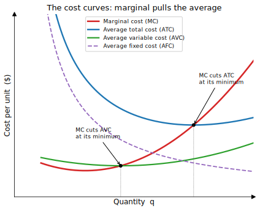
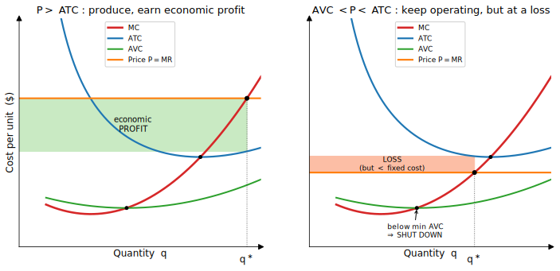
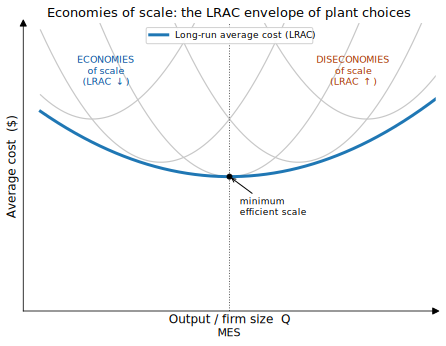
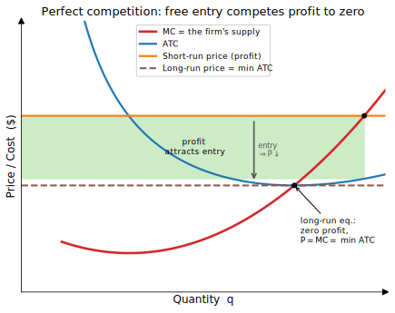
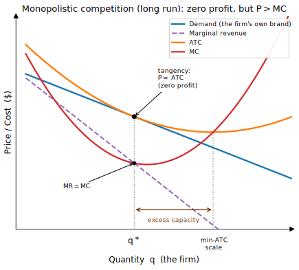
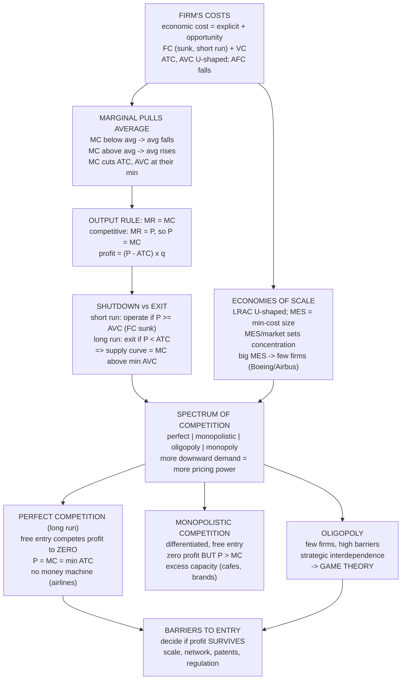

# E01 · §4 — Firms, Costs & Competition

> **Subject:** Economy & Finance *(hobby track)*
> **Module:** E01 — Economic Foundations (Microeconomics)
> **Section:** Opens up the *supply* side that §2 and §3 took as a given curve. Where does $MC$ come from
> (fixed vs variable cost, the cost curves)? How does a firm decide *whether* and *how much* to produce
> (the $MR = MC$ rule, the shutdown rule)? Why are some industries a handful of giants and others a swarm
> of small shops (economies of scale)? And the **spectrum of competition** — perfect competition →
> monopolistic competition → oligopoly → monopoly — of which §3 only sampled the two endpoints.
> **Status:** ✅ finalized 2026-06-24 — closes Module E01. You studied the body, then in Q&A took it to a
> live case: **the frontier AI labs** (OpenAI/Anthropic) that serve below AVC yet don't shut down. §9
> captures that thread — the static→dynamic shutdown re-rank, training-FC vs serving-VC, the learning curve
> as a *moving* LRAC, the race to build barriers to entry, and the failure modes. Math in LaTeX,
> quantitative relationships drawn as real curves, key terms glossed in 中文 (大陆/台灣), per
> [`../../../agent-docs/authoring-conventions.md`](../../../agent-docs/authoring-conventions.md).

**Estimated study time:** 1.5–2 hours including reflection.
**Prerequisites:** §1 (marginal thinking, $MB = MC$, opportunity cost, sunk cost), §2 (supply as a
response function $Q_s(P)$; equilibrium $P^\ast$), and §3 (surplus, deadweight loss, and especially **§4c
monopoly** — the price-maker). This section *derives* the supply curve those sections drew, and *generalizes*
§3's monopoly into a full spectrum of market structures.

---

## Why this section exists (for *you*)

Three sections in, you have a confession to call in. §2 drew a **supply curve** and said "this is how much
producers will make at each price." §3 leaned on it harder — it *was* the marginal-cost curve read
sideways, and tax incidence and deadweight loss all hung off its slope. But we never asked **where that
curve comes from.** It comes from inside the firm: from its **costs**, and from one decision rule applied
to them. This section opens the black box.

That matters for all four of your goals, but two especially:

1. **Reading business news and financial reports (Goals 1, 3).** "Gross margin," "operating leverage,"
   "fixed vs variable cost," "economies of scale," "this airline is burning cash but still flying" — these
   are *all* this section. When a 10-K or an earnings call talks about why a business does or doesn't make
   money, it is talking about the cost curves below. You cannot judge a company without them.
2. **Understanding market structure (Goal 1).** §3 gave you the two extremes — perfect competition (the
   price-*taker*) and monopoly (the price-*maker*) — and flagged that real markets live in between. This
   section fills in the middle (**monopolistic competition** and **oligopoly**) and, crucially, derives the
   long-run result §3 left out: **why competition tends to compete profit away to zero.** That single idea
   explains why some businesses are perennially marginal (airlines, restaurants) and others mint money for
   decades (a patent, a network monopoly).

> **One framing to hold:** §2–§3 used supply as an *input*. §4 produces it as an *output* — from a firm's
> costs (§§1–3) and one rule, $MR = MC$ — and then asks what changes when the firm is big enough to *set*
> the price rather than take it (§§4–5). The whole section is "the supply side, from the inside."

---

## 1. Where supply comes from: a firm's costs

A firm turns inputs (labour, materials, capital) into output. Its **costs** are what those inputs cost it —
but "cost" to an economist is broader and sharper than the accountant's version, and the gap is the first
thing to nail because it drives everything later (including, eventually, why long-run competitive profit is
*zero*).

### Economic cost = explicit + opportunity cost

§1's **opportunity cost** comes straight back. The true cost of a choice is the value of the
**next-best alternative forgone** — whether or not money changes hands.

- **Explicit (accounting) costs** are the out-of-pocket payments: wages, rent, materials, interest.
- **Implicit (opportunity) costs** are the forgone alternatives that *don't* show up on an invoice — the
  salary the founder gave up, the return the owner's capital could have earned elsewhere.

$$\text{economic cost} = \text{explicit cost} + \text{implicit (opportunity) cost}.$$

So there are two profits, and the difference is the single most important idea in this whole section:

$$\text{accounting profit} = \text{revenue} - \text{explicit cost}, \qquad \text{economic profit} = \text{revenue} - \text{economic cost}.$$

**Economic profit subtracts the opportunity cost of *everything*, including the owner's capital and time.**
A firm earning *zero economic profit* is doing exactly as well as its resources' next-best use — it is a
perfectly *healthy* business, just not an *exceptional* one. This is the meaning of "**normal profit**":
zero economic profit = a normal return on capital. Keep this distinction in your pocket; in §4 it is the
difference between "this industry is fine" and "this industry has a money machine."

> ⚠ **A failure mode worth meeting now.** People read "competitive firms make zero profit in the long run"
> and conclude those firms are *failing*. Wrong: that's zero **economic** profit. They still post healthy
> **accounting** profit — enough to pay investors the going return, no more. When you read a 10-K later
> (E07–E08), the statements show *accounting* profit; the *economic* question — "is this an above-normal
> return, and is it durable?" — is what valuation and competitive-advantage analysis are really about.

### Fixed vs variable — and the runtime that depends on it

Split costs by how they respond to output $q$:

- **Fixed cost (FC):** doesn't change with output, at least in the short run — factory lease, the chip
  fab, insurance, the core engineering team. You pay it whether you make 0 units or a million.
- **Variable cost (VC):** rises with output — raw materials, hourly labour, shipping, electricity for the
  machines.
- **Total cost** $TC = FC + VC$.

This split *is* the business model. Compare two real cost structures:

- **Software / digital goods:** enormous fixed cost (build the product once), near-zero **marginal** cost
  (ship one more copy ≈ free). This is why software has huge **operating leverage** — once you cover the
  fixed cost, almost every extra dollar of revenue is profit, and why the winner can be enormously
  profitable. (It's also the cost structure behind §3's natural-monopoly tendency in digital markets.)
- **A restaurant or airline:** high variable cost per unit (ingredients, fuel, crew). Each extra meal or
  seat costs real money, so margins are thin and scale helps less.

The **time horizon** is what makes a cost fixed or variable — and it's the same short-run/long-run split
that drove §3's elasticity story. **In the long run, *everything* is variable**: leases end, factories get
built or sold, the chip fab gets written off. "Short run" just means "the horizon over which at least one
input (usually capital) is fixed." Hold that — it's the hinge of §§2 and 4 below.

### The cost curves — and the one relationship to burn in

Divide each cost by output to get **per-unit (average)** costs, and take the slope of total cost to get
**marginal** cost:

| Curve | Definition | Shape & why |
|---|---|---|
| **AFC** — average fixed cost | $FC / q$ | Always falling — "spreading the fixed cost" over more units (a hyperbola). |
| **AVC** — average variable cost | $VC / q$ | U-shaped: efficiency gains first, then diminishing returns. |
| **ATC** — average total cost | $TC / q = \text{AFC} + \text{AVC}$ | U-shaped; the curve a firm's *unit cost* lives on. |
| **MC** — marginal cost | $\Delta TC / \Delta q = dTC/dq$ | The cost of one more unit. U-shaped, and it does something special ↓ |

<!-- FIGURE -->

The non-obvious, completely general fact in that picture: **MC passes through the minimum of both AVC and
ATC.** This isn't a quirk of the dummy numbers — it's a law about marginals and averages, and it's worth
proving to yourself because it recurs everywhere (grades, lap times, portfolio returns):

> **The marginal-average relationship (the gem).** Let $A(q) = TC(q)/q$ be the average. Differentiate:
> $$A'(q) = \frac{MC(q) - A(q)}{q}.$$
> So the average **falls** whenever the marginal is *below* it ($MC < A \Rightarrow A' < 0$), **rises**
> whenever the marginal is *above* it ($MC > A$), and is **flat — at its minimum — exactly when $MC = A$.**
> The marginal *pulls* the average toward itself. Add a test score below your GPA and your GPA drops; the
> $MC = ATC$ crossing is the same statement. The minimum of ATC is therefore the lowest unit cost the firm
> can achieve — remember it as the **break-even price**; we'll need it in §4.

The reason MC and the averages are **U-shaped** at all is **diminishing marginal returns** (§1's marginal
thinking on the input side): with capital fixed in the short run, the first extra workers add a lot
(specialization), but past a point each new worker adds less (crowding the same machines), so producing one
more unit costs progressively *more* — MC turns up, dragging the averages up after it.

---

## 2. The firm's decision: produce, how much, or shut down

Now the single rule that turns costs into a supply curve. A firm wants to maximize **profit**
$\pi(q) = TR(q) - TC(q) = P\cdot q - TC(q)$. This is just §1's marginal thinking applied to output:

> **Produce up to where marginal revenue equals marginal cost: $MR = MC$.** Below that quantity, one more
> unit adds more to revenue than to cost ($MR > MC$ → make it); above it, the last unit cost more than it
> earned ($MR < MC$ → don't). The profit-maximizing $q^\ast$ is where they meet.

For a firm in a **competitive** market, the price is given (it's a price-taker, §3), so selling one more
unit just adds $P$ to revenue: **$MR = P$.** The rule collapses to the familiar **$P = MC$** — which is
*exactly* why §2's supply curve is the marginal-cost curve. We'll generalize $MR$ for price-makers in §5.

Having chosen $q^\ast$, is the firm making money? Compare price to *average* cost at $q^\ast$:

$$\pi = (P - ATC(q^\ast)) \times q^\ast.$$

That's a **rectangle**: height = profit-per-unit $(P - ATC)$, width = quantity $q^\ast$. Three cases, and the
left panel below is profit, the right is loss:

<!-- FIGURE -->

- **$P > ATC$** → economic **profit** (green rectangle, left).
- **$P = ATC$** → exactly **break even** (zero economic profit — the minimum-ATC price from §1).
- **$P < ATC$** → a **loss**. But — and this is the subtle, genuinely useful part — a loss does *not*
  automatically mean "stop."

### The shutdown rule: why a loss-making firm keeps the lights on

Here's where §1's **sunk cost** lesson pays off with real money. In the short run the fixed cost is
**sunk** — you owe the lease whether you operate or not. So the decision to operate *this period* should
**ignore fixed cost entirely** and compare price only to **variable** cost:

> **Shutdown rule (short run): operate if $P \geq AVC$; shut down if $P < AVC$.** If the price at least
> covers your *variable* cost, every unit you sell contributes something toward the fixed cost you owe
> anyway — so operating at a loss beats shutting and eating the *whole* fixed cost. Only when price can't
> even cover variable cost ($P < AVC$, below the green curve's minimum) does producing make the loss
> *worse*, and you stop.

This is not a textbook curiosity — it's why:
- **Airlines keep flying half-empty planes in a downturn.** The plane, gates, and crew schedule are sunk
  this quarter; as long as ticket revenue beats the *marginal* cost of carrying passengers (fuel, meals),
  flying loses less money than parking the jet.
- **Shale oil wells keep pumping below their all-in cost** but shut when the price drops below their
  *operating* (variable) cost — which is why the "shut-in price" is a real, watched number.
- **A struggling restaurant stays open through a bad season** if the day's takings cover food and hourly
  staff, even though they're not covering the rent.

The distinction between the two horizons:

| Horizon | Fixed cost is… | Decision | Threshold |
|---|---|---|---|
| **Short run** | sunk (owed regardless) | **shut down** (stop producing now) | $P < AVC$ |
| **Long run** | avoidable (don't renew the lease) | **exit** (leave the industry) | $P < ATC$ |

In the long run nothing is sunk, so the firm leaves if it can't cover *total* cost ($P < ATC$). Short-run
shutdown ≠ long-run exit — confusing them is a classic analyst error.

### The payoff: this *is* §2's supply curve

Put the two rules together. The firm produces where $P = MC$, but only while $P \geq AVC$. Therefore:

> **A competitive firm's short-run supply curve is its marginal-cost curve, above the minimum of AVC.**
> Below that it supplies zero. Sum these across all firms and you get §2's upward-sloping **market supply
> curve.** That curve was never a primitive — it's the horizontal sum of a swarm of $MR = MC$ decisions.

The debt §2 ran up is now paid: supply slopes up because **marginal cost rises** (diminishing returns),
and it shifts when input prices or technology change costs — exactly the "supply shifters" §2 listed,
now with a mechanism underneath each one.

---

## 3. Scale: why some industries are giants and others are swarms

So far capital was fixed. Let the firm choose its *size* — the long run — and a new question appears: how
does cost-per-unit change as the whole operation scales up? The answer shapes how *concentrated* an
industry is, which is the bridge to market structure in §4.

The **long-run average cost (LRAC)** curve is the lower envelope of all the short-run ATC curves the firm
could pick (one per plant size). It's typically U-shaped, and the three regions each have a name and a
real-world signature:

<!-- FIGURE -->

- **Economies of scale** (LRAC falling): bigger is cheaper per unit. Sources — spreading huge fixed costs
  (a chip fab, a drug's R&D, a software codebase) over more output; bulk buying; specialization; learning
  curves. This is the engine behind §3's **natural monopoly** and behind why digital businesses tend to
  winner-take-most.
- **Constant returns** (LRAC flat): size no longer changes unit cost — the bottom of the U.
- **Diseconomies of scale** (LRAC rising): *too* big gets expensive per unit — coordination overhead,
  bureaucracy, communication breaking down, slow decisions. (The org-design failures the SWE track studies
  — giant systems no one can change, teams that can't coordinate — are diseconomies of scale wearing an
  engineering hat.)

The lowest output at which LRAC bottoms out is the **minimum efficient scale (MES)** — the smallest a firm
can be and still hit minimum unit cost. **MES relative to the size of the market decides industry
structure**, and this single ratio predicts a lot:

- **MES small vs the market** → many firms can all reach efficient scale → **fragmented, competitive**
  industries: restaurants, hair salons, plumbers, accountants, farms. (Low MES is *why* these look like
  §3's perfect competition.)
- **MES large vs the market** → only a few firms fit at efficient scale → **concentrated** industries, a
  natural **oligopoly** or **monopoly**: commercial aircraft (Boeing/Airbus — the fixed cost of designing
  a jet is so vast that the world supports ~two), semiconductor fabs (TSMC and a handful of rivals),
  telecom networks, car manufacturing. No conspiracy needed — the **cost structure** forces the
  concentration.

> **A nuance for reading the news:** economies of scale are a *barrier to entry* (§3 §4c, and §8d's
> ad-ban-as-barrier). A newcomer must enter near MES to be cost-competitive, which can mean betting
> billions before selling a unit — which is exactly why incumbents in fab-scale or network industries are
> hard to dislodge, and why antitrust regulators watch them.

---

## 4. The spectrum of competition

§3 handed you the two extremes. The real world is a spectrum, classified by **how many firms**, **how
differentiated the product**, and — the deepest axis — **how much pricing power** each firm has, which
comes down to **barriers to entry**.

| Structure | # firms | Product | Pricing power | Long-run economic profit | Barriers to entry | Real examples |
|---|---|---|---|---|---|---|
| **Perfect competition** | very many | identical | none (price-*taker*) | **zero** | none | wheat, FX spot, basic commodities |
| **Monopolistic competition** | many | *differentiated* | a little | **zero** (eroded by entry) | low | restaurants, cafés, salons, branded snacks, apps |
| **Oligopoly** | few | identical *or* differentiated | substantial, *interdependent* | can persist | high | airlines, telcos, banks, soft drinks, aircraft |
| **Monopoly** | one | unique (no close substitute) | maximal (price-*maker*) | can persist | very high | utilities, patented drug, a local network |

Two things make this table *predictive* rather than just descriptive: **pricing power rises as you go
down** (the firm faces a more steeply downward-sloping demand curve for *its own* output), and **long-run
profit survives only where barriers to entry keep new firms out.** Hold both; they're the engine of the
rest of the section.

*The **economic moat** (Buffett's term, glossed in §9): a barrier to entry is the water around the castle — the wider the moat, the longer economic profit survives before entry competes it away. — Illustration, generated locally (ComfyUI + Z-Image Turbo).*

Image prompt (source of truth)

> Stylized isometric conceptual illustration of a business as a fortified stone castle on a green hill,
> surrounded by a wide protective blue water moat; the hilltop represents a profitable market; several small
> competitor figures on the far bank unable to cross the moat; clean minimalist flat vector illustration
> style, warm stone and cool blue palette, soft volumetric lighting, sense of a durable defended competitive
> advantage, no text, no words, no labels, high detail

### Perfect competition in the long run: the zero-profit pull

This is the long-run result §3 didn't have room for, and it's the most important single mechanism in the
whole module. A perfectly competitive firm is a price-taker facing a **flat** demand curve at the market
price ($MR = P$). Suppose the market price is high enough that firms earn economic **profit** (left, below).
With **free entry** (no barriers — the defining assumption), that profit is a signal:

<!-- FIGURE -->

> **The mechanism.** Economic profit attracts **entry** → more firms → market supply shifts right (§2) →
> the price **falls**. Entry continues as long as there's profit to be had, so it stops only when economic
> profit hits **zero** — which is precisely when price has fallen to the **minimum of ATC**. Symmetrically,
> losses trigger **exit**, supply shifts left, and price rises back to min ATC. The long-run competitive
> equilibrium is **$P = MR = MC = \min ATC$**, with **zero economic profit** for everyone.

The implications are strong and not obvious:
- The long-run price is dragged to the **lowest possible unit cost** — competition is what forces firms
  onto the bottom of their cost curve and passes the savings to consumers (this is the efficiency §3's
  first welfare theorem celebrated, now with a *dynamic* story for how it's reached).
- "Zero economic profit" again ≠ failing — these firms earn a **normal** return. But there's **no money
  machine**: any edge is competed away. Warren Buffett's quip that the airline industry has, in aggregate,
  made no money for investors over its history is this theorem in the wild — low barriers, easy capacity
  entry, commoditized seats.

> **Physics lens — entry/exit is relaxation to a fixed point.** Economic profit is a *disequilibrium
> potential*: where it's positive, a "force" (entry) pushes the system in the direction that *reduces* it;
> where negative, exit pushes the other way. The system relaxes until the potential is flat — zero economic
> profit, $\partial\pi/\partial(\text{entry}) = 0$ — exactly §2's tâtonnement, but the slow variable is now
> the *number of firms* rather than the price. The long-run equilibrium is the **stable fixed point** of
> that dynamics; barriers to entry are what *pin* the potential away from zero (they block the relaxation),
> which is the precise reason barriers — not firm count — are what let profit persist.

---

## 5. The middle of the spectrum: differentiation and interdependence

### Monopolistic competition — many firms, differentiated products

Most of the consumer economy lives here: restaurants, cafés, hair salons, plumbers, branded packaged
goods, mobile apps. **Many** firms, **low** barriers — *but* each sells a slightly **differentiated**
product (your favourite café isn't a perfect substitute for the one next door). So each firm has a *little*
pricing power: it faces its own **downward-sloping** demand curve, like a tiny monopolist over its own
brand — yet free entry still applies.

Run the two forces together and you get the signature long-run picture: each firm sets $MR = MC$ (it's a
price-maker over its brand), but **entry erodes profit** until each firm's demand curve is just **tangent**
to its ATC curve — **zero economic profit**, but at a price **above** marginal cost and at a quantity
**below** minimum-ATC scale:

<!-- FIGURE -->

Two takeaways:
- **Zero economic profit, like perfect competition** (low barriers → entry competes it away), so again no
  durable money machine — just lots of cafés all scraping a normal return.
- **But $P > MC$ and firms run with "excess capacity"** (left of min ATC) — the empty tables, the
  half-used salon chairs, the slight price markup for variety. Economists debate whether this is
  "inefficient" (you could make each unit cheaper at higher volume) or simply **the price of product
  variety** — and most conclude variety is worth it. This is the honest cousin of §3's monopoly deadweight
  loss: a small markup, but bought with genuine differentiation consumers value.

This is **exactly §3 §8d's world.** "Coke vs Coke Zero at the same price," brand proliferation, the fight
to make your product *feel* non-substitutable — that's firms in monopolistic competition (shading into
oligopoly) **manufacturing differentiation to steepen their own demand curve** and claw back pricing power.
The whole game of branding, advertising, and product-line versioning is the attempt to escape the
zero-profit tangency by making entry-driven substitution weaker.

### Oligopoly — a few firms, watching each other

A **few** firms with **high** barriers (airlines, telecoms, banks, soft drinks, the Boeing/Airbus duopoly).
Here profit *can* persist (barriers block the entry that would compete it away), and the defining new
feature is **strategic interdependence**: each firm's best move depends on what it expects the *others* to
do. Cut your price and your rival may match it, starting a price war that wrecks everyone; hold price and
you may tacitly **collude** at near-monopoly levels; race on capacity and you may flood the market.

That "anticipate the rival's response" structure is no longer ordinary supply-and-demand — it is genuinely
**game theory**, and per the course plan it gets its own treatment in the sibling
[Game Theory](../../game-theory/plan.md) subject (Cournot quantity competition, Bertrand price
competition, repeated games and the sustainability of collusion, entry deterrence). Here we just mark the
boundary and the intuition: **oligopoly outcomes range from near-competitive (cutthroat price war) to
near-monopoly (successful tacit collusion), and which one you get is a strategic equilibrium, not a
mechanical one.** This is why oligopoly is the hardest structure to read from the outside — and the one
where antitrust spends most of its attention (price-fixing, merger review, cartel-busting).

> **The unifying axis.** Everything in §§4–5 is one parameter: **how downward-sloping is the demand curve
> the firm faces for its own output, and can entry flatten it back?** Perfect competition = flat demand,
> free entry, zero profit. Monopolistic competition = slightly sloped, free entry, zero profit but a
> markup. Oligopoly = sloped, blocked entry, strategic. Monopoly (§3) = the whole market demand, blocked
> entry, maximal markup. **Barriers to entry decide whether the markup *survives*; product differentiation
> decides how *big* it is.**

---

## 6. The one-page mental model

<!-- DIAGRAM:START -->

Diagram source (Mermaid)

<!-- DIAGRAM:END -->

**The eight things to remember:**
1. **Economic cost** includes **opportunity cost**, so **economic profit** subtracts the return capital
   could earn elsewhere. *Zero economic profit = a normal return = a healthy-but-unexceptional business*
   (still positive **accounting** profit). This distinction runs through everything.
2. **Cost curves:** AFC falls, AVC and ATC are U-shaped (diminishing returns), and **MC cuts AVC and ATC at
   their minima** — the marginal always pulls the average toward itself.
3. **Output rule: $MR = MC$.** For a price-taker $MR = P$, so $P = MC$ — which is *why supply is the
   marginal-cost curve.* Profit is the rectangle $(P - ATC)\times q$.
4. **Shutdown rule:** in the short run, operate while $P \geq AVC$ (fixed cost is **sunk**, so ignore it);
   in the long run, **exit** if $P < ATC$. Short-run shutdown ≠ long-run exit.
5. **The supply curve** §2 assumed is just **MC above min AVC**, summed over firms — debt repaid.
6. **Economies of scale** make LRAC U-shaped; **minimum efficient scale relative to the market** decides
   whether an industry is a swarm of small firms or a handful of giants.
7. **Spectrum of competition:** perfect → monopolistic → oligopoly → monopoly, ordered by how
   downward-sloping the firm's *own* demand curve is (its pricing power).
8. **Free entry competes economic profit to zero** (perfect & monopolistic competition); **barriers to
   entry** are what let profit *persist* (oligopoly, monopoly). Barriers decide if a markup survives;
   differentiation decides how big it is.

---

## 7. Check your understanding

Per the "verifiable beats judgeable" note in your profile, several of these are **predict-then-check**: do
the reasoning *before* looking anything up, then test it against a real number or report.

1. **Economic vs accounting profit.** You quit a \$120k job to run a startup that brings in \$400k revenue
   and pays \$350k in explicit costs; you'd also invested \$200k of savings that could earn 5% elsewhere.
   What's the accounting profit? The economic profit? Is this venture "worth it" in the economist's sense —
   and what does your answer have to do with "zero economic profit in the long run"?
2. **Shutdown, with real stakes.** An airline's flight has \$8,000 of costs that are sunk this quarter
   (aircraft lease share, gate fees) and \$3,000 of variable cost (fuel, crew, meals) per departure;
   tickets on it bring \$4,000. Should it fly the route this quarter? Next year, when the lease is up for
   renewal, should it keep the route? State the rule you used each time and why the two answers can differ.
3. **The marginal-average gem.** Reconstruct, from $A(q) = TC(q)/q$, why $MC$ must cross $ATC$ at $ATC$'s
   minimum (hint: differentiate $A$ and ask when $A' = 0$). Then give a non-economics example of the same
   law (a GPA, a running pace, a fund's average return).
4. **MES and structure — predict, then check.** Without looking it up, predict which of these is fragmented
   (many small firms) vs concentrated (a few giants), and *why*, using minimum efficient scale: (a) hair
   salons, (b) commercial-aircraft manufacturing, (c) smartphone operating systems, (d) farms growing
   wheat. Then check one against reality (e.g. count the serious players) and see if your MES reasoning held.
5. **Why no money machine?** A new café concept earns juicy profits in year one. Walk through what happens
   over the next three years and where the profit goes, naming the mechanism. Then contrast with a patented
   drug that stays hugely profitable for a decade — what's structurally different, and which word in §4's
   table is doing the work?
6. **Tie it to §3 §8d.** Coke and Coke Zero sell at the same price; the firm runs both. Using §5's
   monopolistic-competition / oligopoly lens, explain what the firm is trying to do to *its own demand
   curve*, and why "make my product feel non-substitutable" is the same thing as "escape the zero-profit
   tangency."

## 8. Optional: read a real business through this lens (15–20 min)

Pick a company or industry you can find a few numbers for — ideally one in the current news, or one whose
report you'll read in E07–E08. Then:

- **Cost structure:** is it high-fixed/low-marginal (software, airlines, fabs) or high-variable
  (restaurants, retail)? What does that imply about its **operating leverage** and how its margins move
  with volume?
- **Market structure:** where on the §4 spectrum does it sit — and *what are the barriers to entry* (scale,
  network effects, patents, regulation, brand)? Those barriers are the whole question of whether its profit
  is durable.
- **Economic vs accounting profit:** it reports accounting profit — but is it earning an *above-normal*
  (economic) return, and will competition or entry compete it away? That's the difference between a good
  business and a good *stock*, and the exact question E08 (company analysis) is built to answer.

Bring one to our chat and we'll run the cost-and-competition story on it — the way we ran the
elasticity/surplus/failure story on Singapore's sugar policy in §3.

---

## 9. Applied — from our session Q&A (2026-06-24): the frontier AI labs

You took the section straight to a business that *looks* like it breaks the rule: **frontier AI labs**
(OpenAI, Anthropic). Their structure, as you posed it: huge **FC** (R&D, model training) *and* huge **VC**
(model serving), with plan prices widely believed to sit **below per-token cost** — i.e. $P < AVC$. §4 says
that means *shut down*; they do the opposite, funded by investors betting on future profitability via
**pricing power + falling hardware cost**. Your reconstruction had the right shape; the value was in four
re-ranks and the failure modes. The headline: **nothing in §4 breaks — the labs have swapped "maximize this
period's profit on fixed curves" for "maximize multi-period NPV while *bending* the curves."**

### 9a. The core re-rank: the shutdown rule is *single-period and static*

The rule "shut down when $P < AVC$" smuggles in three assumptions the labs deliberately relax: it maximizes
**one period's** profit, on **fixed** cost/demand curves, with the firm **self-financing** each period. The
labs maximize the **net present value of a multi-period trajectory** in which *today's output moves
tomorrow's curves*, funded by **financing** cash flow (equity raises), not operating cash flow. So the rule
isn't violated — it's the wrong rule for a dynamic game. The generalization:

> **Dynamic shutdown rule:** keep operating, even at $P < AVC$ today, as long as the **discounted future
> profits the activity unlocks** exceed today's burn. Shut down only when *that* NPV turns negative — a
> forward-looking bet, not a this-quarter fact. (Capital-market access is what relaxes the self-financing
> constraint the static rule assumed; the NPV machinery itself is formalized in E08–E09.)

### 9b. Re-rank: be careful what you call "variable cost"

A chunk of the apparent paradox is a **miscategorization**, and the precision matters:

- **Training the next model is FC / R&D, not serving (variable) cost** — it builds a *future asset* (the
  model, the know-how, the data flywheel). And FC is **sunk** the moment you ask "serve today?", so by §4's
  *own* logic it doesn't enter the operate-now decision. Much of the "loss" is **investment**, not
  below-AVC operating.
- **Much "serving cost" is committed-fixed, not truly variable** — reserved GPU clusters and datacenter
  commitments are paid regardless of the next token. The *avoidable* marginal cost of one more API token
  (electricity + the GPU-second's opportunity cost) is plausibly **below** price — in which case $P >$ true
  short-run AVC and the rule says *serve*. No paradox.
- **Where you're right:** on **flat-rate consumer plans**, heavy power users very likely cost more than they
  pay — but that's a deliberate **loss leader**, not the whole business. The honest read: **unit economics
  differ by product line** — flat-rate consumer = loss-leader by design; metered API/enterprise = closer to
  or above positive gross margin. Lumping training + power-user subsidies into one "AVC" is what manufactures
  the "below cost everywhere" impression.

### 9c. Re-rank: the cost decline you described is the *learning curve* — a moving LRAC

This was the biggest enrichment, because §4's LRAC is a **snapshot** and your story is the snapshot
**moving**. Distinguish two things the course bundles loosely:

- **Economies of scale** (§3 here) — lower unit cost from being *bigger at one point in time*. Static.
- **Learning curve / experience curve (Wright's law)** — lower unit cost from *cumulative output over
  time*; each doubling of all-time volume cuts unit cost by a roughly constant fraction.

Your "technology advance + mass-production scaling lowers hardware cost" **is** the learning curve. The
right picture isn't "slide down a fixed U-shaped LRAC" — it's "**the whole LRAC shifts down each year**,"
and serving heavily today *buys the cumulative volume and engineering reps that pull next year's curve
down.* That is a genuine reason to operate below *today's* AVC: you're purchasing cost reduction you can't
get otherwise. The static cost curves simply have no time axis; this is the one-notch generalization.

### 9d. Re-rank: this is a *race to build barriers to entry* — the §4 end-state is the whole bet

Your "become a price maker, then profit" maps exactly onto §4: they are spending now to **build the
barriers to entry** that §4 says are what let economic profit *survive* — **economies of scale + huge MES**
(the Boeing/Airbus logic on compute), **network/data effects** (a §3 natural-monopoly flywheel), **switching
costs / ecosystem lock-in**, and **brand/mindshare**. The recognized name for the play is **penetration
pricing** (price below cost to take share) and its venture cousin **blitzscaling**; the canonical comp is
**Amazon** (two decades of deliberately thin profit — the patron saint of "accounting loss ≠ economic
failure"). The **free tier** is a textbook **loss leader**: a customer-acquisition funnel *and* a
data-generation engine, monetized through paid API/enterprise (the **versioning** from §3 §8d). In one
sentence: **they are burning money to manufacture a future §3-style monopoly out of a present that would
otherwise commoditize.**

### 9e. The failure modes (the part you asked for)

"Sell below cost now, recoup later" is also the exact epitaph of businesses that *died*. The bet has three
load-bearing assumptions, each able to fail:

1. **"Become a price maker" may never arrive — commoditization.** Pricing power needs *durable,
   firm-specific* differentiation (§5). If frontier models converge and **open-weight models** stay "good
   enough," nobody gets a markup and the industry lands in §4's **airline outcome**: real product, fierce
   competition, *permanent zero economic profit*, money never recouped. Credible open-weight rivals are the
   single biggest threat to this step. **MoviePass / WeWork** had the burn and never got the moat.
2. **Cost declines get *competed away*, not banked.** Pure §4 long-run logic: if the learning-curve drop is
   *industry-wide* (everyone's GPUs cheapen; algorithms diffuse in months), competition passes the savings
   to **customers**, not **profit**. Lower AVC becomes higher profit *only if the cost edge is proprietary
   and durable* — much algorithmic progress is not. "AI gets cheaper" ≠ "labs get profitable."
3. **The Red Queen race on FC.** "FC amortizes once training's done" assumes they *stop* climbing the
   frontier — competition forbids it, and each generation's training bill has been *rising*. So FC may
   **recur, larger**, every cycle. Compounded by **elastic demand** (§3: cheaper tokens → far more usage →
   serving cost balloons — a Jevons effect), "costs will fall" is not the slam-dunk it sounds.

### The synthesis to carry

| Course tool (static) | The generalization the labs are using |
|---|---|
| Shutdown: $P<AVC \Rightarrow$ stop **this period** | **NPV over many periods**; capital-market financing relaxes self-funding, so "stop" → "stop only if the discounted trajectory is negative" |
| Costs are **fixed curves**; AVC = per-token cost | Separate **training (FC, sunk)** from **serving (VC)**, and committed compute (fixed) from avoidable per-token cost; the whole **LRAC shifts down over time** via the **learning curve** |
| Market structure is **given** | A **race to build barriers to entry** (scale, network, data, brand) — penetration pricing / blitzscaling — to convert today's burn into a future §3 monopoly |

One line: **the frontier labs aren't breaking the shutdown rule — they swapped "maximize this period's
profit on fixed curves" for "maximize NPV while bending the curves," and bet borrowed money that the
industry ends in §3's monopoly (durable rents) rather than §4's airline (commoditized, zero economic
profit).** Your three precision gains: most of the "loss" is **FC / investment**, not below-AVC serving; the
cost-decline mechanism is the **learning curve** (a moving LRAC, not a slide along a fixed one); and the bet
pays *only if the resulting cost/quality edge is proprietary and durable* — otherwise §4's long-run
zero-profit pull eats all of it.

*(Numbers deliberately omitted — lab unit economics and cost-per-token decline rates are unaudited or move
fast; the structure is the durable lesson. Ask if you want current public estimates with sources.)*

---

## Key terms — English · 中文（中国大陆 / 台灣）

So the concepts here carry over to Chinese-language business news and company reports. Most differences are
just **simplified vs traditional script**; **⚠ marks a genuine terminology difference** between Mainland
China (大陆) and Taiwan (台灣) that you'd actually trip over.

**Costs & profit**

| English | 中国大陆 (简体) | 台灣 (繁體) | Note |
|---|---|---|---|
| Firm / enterprise | 企业 / 厂商 | 企業 / 廠商 | |
| Cost | 成本 | 成本 | |
| Explicit / implicit cost | 显性成本 / 隐性成本 | 顯性成本 / 隱性成本 | |
| Opportunity cost | 机会成本 | 機會成本 | |
| Fixed / variable cost | 固定成本 / 可变成本 | 固定成本 / 變動成本 | ⚠ variable = 可变 (大陆) vs 變動 (台灣) |
| Sunk cost | 沉没成本 | 沉沒成本 | |
| Total / marginal cost | 总成本 / 边际成本 | 總成本 / 邊際成本 | |
| Average total cost (ATC) | 平均总成本 | 平均總成本 | |
| Average variable / fixed cost | 平均可变成本 / 平均固定成本 | 平均變動成本 / 平均固定成本 | |
| Accounting / economic profit | 会计利润 / 经济利润 | 會計利潤 / 經濟利潤 | ⚠ profit also 大陆 利润 vs 台灣 常用 利潤/盈餘 |
| Normal profit | 正常利润 | 正常利潤 | = zero economic profit |
| Revenue | 收入 / 营收 | 收入 / 營收 | ⚠ income = 收入 (大陆) vs 所得 (台灣) |
| Diminishing returns | 边际报酬递减 | 邊際報酬遞減 | |

**Output, competition & scale**

| English | 中国大陆 (简体) | 台灣 (繁體) | Note |
|---|---|---|---|
| Marginal revenue | 边际收益 | 邊際收益 | |
| Profit maximization | 利润最大化 | 利潤最大化 | |
| Shut down / exit | 停业（停产）/ 退出 | 停業（歇業）/ 退出 | |
| Break-even point | 盈亏平衡点 | 損益兩平點 | ⚠ 大陆 盈亏平衡 vs 台灣 損益兩平 |
| Supply curve | 供给曲线 | 供給曲線 | |
| Economies / diseconomies of scale | 规模经济 / 规模不经济 | 規模經濟 / 規模不經濟 | |
| Returns to scale | 规模报酬 | 規模報酬 | |
| Minimum efficient scale (MES) | 最小有效规模 | 最小效率規模 | |
| Operating leverage | 经营杠杆 | 營運槓桿 | ⚠ 大陆 经营 vs 台灣 營運 |
| Barriers to entry | 进入壁垒 | 進入障礙 | ⚠ 大陆 壁垒 vs 台灣 障礙 |
| Perfect competition | 完全竞争 | 完全競爭 | |
| Monopolistic competition | 垄断竞争 | 獨占性競爭 | ⚠ 大陆 垄断竞争 vs 台灣 獨占性競爭 |
| Oligopoly | 寡头垄断 | 寡占 | ⚠ 大陆 寡头垄断 vs 台灣 寡占 |
| Monopoly | 垄断 | 獨占 | ⚠ 大陆 垄断 vs 台灣 獨占 |
| Price taker / maker | 价格接受者 / 价格制定者 | 價格接受者 / 價格決定者 | |
| Product differentiation | 产品差异化 | 產品差異化 | |
| Excess capacity | 过剩产能 | 過剩產能 | |
| Tacit collusion | 默契合谋 | 默契勾結 | ⚠ collusion = 合谋 (大陆) vs 勾結 (台灣) |

**Strategy & the AI-labs case study (§9)**

| English | 中国大陆 (简体) | 台灣 (繁體) | Note |
|---|---|---|---|
| Net present value (NPV) | 净现值 | 淨現值 | the multi-period objective; formalized in E08–E09 |
| Cash flow (operating / financing) | 现金流（经营 / 筹资）| 現金流（營運 / 籌資）| ⚠ 大陆 筹资 vs 台灣 籌資/融資 |
| Burn rate | 烧钱速度（现金消耗率）| 燒錢速度（現金消耗率）| |
| Penetration pricing | 渗透定价 | 滲透定價 | price below cost to take share |
| Loss leader | 亏本引流商品（引流品）| 虧本招徠品 | ⚠ 大陆 引流 vs 台灣 招徠 |
| Learning / experience curve | 学习曲线 / 经验曲线 | 學習曲線 / 經驗曲線 | Wright's law; a *moving* LRAC |
| Network effect | 网络效应 | 網路效應 | ⚠ network = 网络 (大陆) vs 網路 (台灣) |
| Switching cost | 转换成本 | 轉換成本 | |
| Economic moat | 经济护城河 | 經濟護城河 | durable competitive advantage |
| Commoditization | 商品化（同质化）| 商品化（同質化）| ⚠ 大陆 同质化 vs 台灣 同質化 |
| Open-weight model | 开放权重模型 | 開放權重模型 | |

> Recurring genuine splits to memorize (beyond §3's list): **可变↔變動** (variable),
> **进入壁垒↔進入障礙** (barriers to entry), **盈亏平衡↔損益兩平** (break-even),
> **垄断竞争↔獨占性競爭** (monopolistic competition), **经营↔營運** (operating),
> **网络↔網路** (network), **引流↔招徠** (loss-leader).

---

## References (optional, for depth)

- *Naked Economics* — Charles Wheelan, ch. 1–2 (firms, incentives, the logic of markets and profit). The
  friendliest prose version. https://wwnorton.com/books/Naked-Economics
- Khan Academy — Microeconomics: **"Production decisions and economic profit"** and **"Forms of
  competition"** units work the cost curves, the shutdown rule, and all four market structures step by
  step. https://www.khanacademy.org/economics-finance-domain/microeconomics
- Marginal Revolution University — short videos on **costs**, **profit maximization**, **competitive
  markets in the long run**, and **monopolistic competition**.
  https://mru.org/courses/principles-economics-microeconomics
- *CORE Econ — The Economy 2.0*, unit **"The firm: Owners, managers, and employees"** and **"Firms and
  markets for goods and services"** — a rigorous, free online treatment with real cost data.
  https://books.core-econ.org/the-economy/
- For the operating-leverage / cost-structure intuition applied to real companies, any introductory
  managerial-accounting treatment of **contribution margin and break-even analysis** (e.g. Khan Academy's
  finance section) — this is the direct bridge to Module E07.

---

### What's next
✅ **Finalized 2026-06-24.** §9 captures the session Q&A — fitting the **frontier AI labs** into the model
(the static→dynamic shutdown re-rank, training-FC vs serving-VC, the learning curve as a *moving* LRAC, the
race-to-build-barriers, and the commoditization/Red-Queen failure modes). This **closes Module E01 —
Economic Foundations.** You now have the full micro toolkit: how individuals and firms decide (§1), how
prices coordinate them (§2), how to measure welfare and diagnose failure (§3), and where supply itself comes
from and how market structure shapes it (§4). The
natural next step is the jump from the individual market to **the whole economy: Module E02 —
Macroeconomics**, starting with **§1 — GDP & measuring output** ("what 'the economy grew 2%' really means").
That's the pivot from *micro* to the indicators behind the headlines — straight at your Goal 1 (understand
economy/business news). A live hook already in hand: §4's economic-vs-accounting-profit and cost-structure
ideas are the seed of the financial-statements module (E07), if you'd rather jump reports-first.
