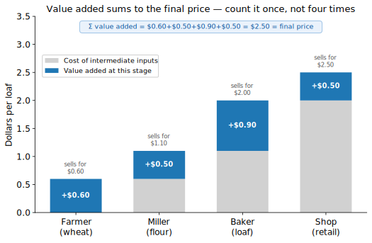
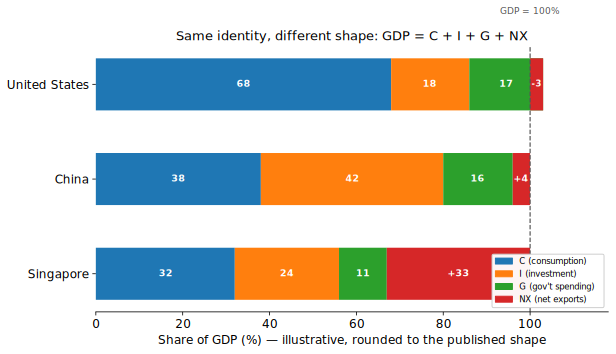
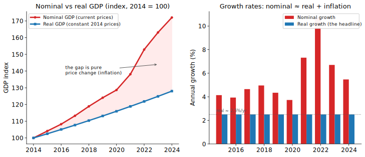
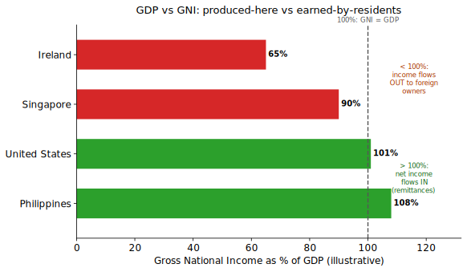
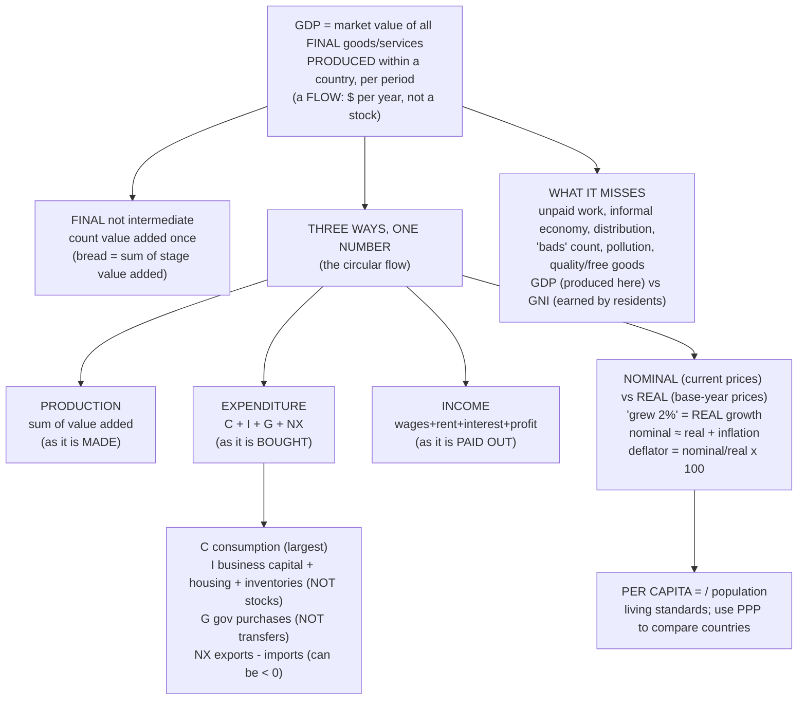

# E02 · §1 — GDP & Measuring Output

> **Subject:** Economy & Finance *(hobby track)*
> **Module:** E02 — The Whole Economy (Macroeconomics)
> **Section:** The pivot from *micro* (one market, one firm — Module E01) to *macro* (the whole economy at
> once). It builds the single most-quoted number in economic news — **Gross Domestic Product** — from the
> ground up: what it measures, the **three equivalent ways** to count it (production, expenditure, income),
> the **$GDP = C + I + G + NX$** identity you'll meet in every release, the **nominal-vs-real** distinction
> behind "the economy grew 2%," and — just as important — **what GDP misses** so you read the headline with
> the right skepticism.
> **Status:** ✅ finalized 2026-06-26. Body drafted 2026-06-24; **§9 captures the live session Q&A:**
> (a) the built-then-resold-house edge case (only new production counts; resale = capital gain + the agent's
> service margin; the wealth-vs-GDP / stock-vs-flow corollary); (b) "GDP can be easily manipulated" —
> calibrated into three tiers (definitional/rebasing, honest noise, fraud), Goodhart's-Law / reward-hacking
> framing, and the cross-checks (three-way reconciliation, nighttime lights) that keep it honest; (c) China's
> growth target is *real* (not nominal) — with the negative-deflator twist that makes nominal < real now; and
> (d) why +3% can be a crisis for China yet +1% is fine for Singapore (the break-even/treadmill growth rate,
> convergence, and China's declining potential). Math in
> LaTeX, quantitative relationships drawn as real curves, key terms glossed in 中文 (大陆/台灣), per
> [`../../../agent-docs/authoring-conventions.md`](../../../agent-docs/authoring-conventions.md).

**Estimated study time:** 1.5–2 hours including reflection.
**Prerequisites:** Module E01 — especially **§2** (markets, prices, the circular idea that one party's
spending is another's revenue) and **§4** (final vs intermediate goods, value added, the firm's revenue =
price × quantity). No new math beyond growth rates and index numbers, both built here from scratch.

---

## Why this section exists (for *you*)

Everything in Module E01 looked at **one market at a time**: the price of sugar, one firm's cost curves, one
industry's structure. That's *micro*. But when the news says "**the US economy grew 2.8% in Q3**," "**India
overtook the UK as the fifth-largest economy**," or "**Singapore's GDP rose 4.4%**," it is talking about an
entire nation's output collapsed into **one number**. Moving from "one market" to "all markets at once" is
the jump to **macroeconomics**, and the number that anchors the whole field is **Gross Domestic Product
(GDP)**.

This section is aimed squarely at your **Goal 1 — understand economy and business news.** Almost every
macro headline is, underneath, a statement about GDP or one of its close relatives (growth, recession,
GDP per capita, the deficit "as a share of GDP"). If you can build GDP from first principles — know exactly
what it counts, how it's counted three different ways, and where it lies to you — then a *huge* fraction of
economic news stops being jargon and becomes readable. It is also the foundation the *rest* of E02 stands
on: inflation (§2) is what separates *real* from *nominal* GDP; unemployment (§3) and the business cycle
(§4) are about GDP rising and falling.

> **One framing to hold:** GDP is **the total market value of everything an economy produces in a period.**
> The entire section is (a) unpacking each word of that sentence, (b) showing the three ways to add it up all
> give the same number, and (c) listing what the number quietly leaves out.

---

## 1. What GDP is — one sentence, dissected

> **Gross Domestic Product (GDP)** = the **market value** of all **final** goods and services **produced**
> **within a country** **in a given period** (a quarter or a year).

Every phrase is load-bearing. Take them one at a time, because almost every "gotcha" in reading GDP news is
hiding in one of these words.

- **"Market value"** — we add up apples and haircuts and software licences by their **dollar price**, because
  that's the only common unit. A \$30,000 car contributes 10× what a \$3,000 motorbike does. This is also the
  first limitation: things *without* a market price (unpaid housework, a free open-source library, clean air)
  mostly **don't get counted** — we return to this in §5.
- **"Final"** — only goods sold to their **end user** count. The flour a bakery buys is an **intermediate
  good**; counting both the flour *and* the bread would **double-count**. The fix is the **value-added**
  idea from E01 §4, and it's worth seeing as a picture:

<!-- FIGURE -->

  Wheat (\$0.60) → flour (\$1.10) → loaf to the shop (\$2.00) → loaf on the shelf (\$2.50). If you naïvely
  summed every sale you'd get \$6.20 for one loaf. The right answer is either **the final price (\$2.50)**
  *or, equivalently,* **the sum of value added at each stage** (\$0.60 + \$0.50 + \$0.90 + \$0.50 = \$2.50). That
  these two are equal is not a coincidence — it's the bridge to §2's "three ways to count."

- **"Produced"** — GDP counts **production**, not transactions. Three traps fall out of this, and all three
  show up in real reporting:
  - **Second-hand sales don't count.** Selling a used car just moves an *existing* asset between people; no
    new output. (The dealer's *service margin* does count — that's newly produced.)
  - **Purely financial transactions don't count.** Buying a share or a bond is swapping money for a paper
    claim; nothing was produced. (The broker's *fee* is a produced service, so it counts.) This is why
    **"investment" in GDP is not what a stock-investor means** — see §3.
  - **Transfer payments don't count.** A pension or unemployment cheque moves money around without producing
    anything; it's excluded from the government's contribution to GDP (§3).
- **"Within a country"** — GDP is **geographic**. A Toyota plant in the US adds to *US* GDP even though Toyota
  is Japanese; an Apple design centre's output counts wherever the work physically happens. The alternative —
  counting by *who owns the income* rather than *where it's produced* — is **GNI**, and the gap between them
  is large and revealing for some countries (§5).
- **"In a given period"** — GDP is a **flow**, measured *per quarter* or *per year*, not a stock you can hold.
  This distinction trips up almost everyone, so it earns the one analogy of the section:

> **Physics lens — GDP is a flow, not a stock.** GDP is a **rate**: dollars *per year*, like a current
> (charge per second) or power (energy per second), **not** a reservoir. A country's accumulated **wealth**
> (its capital stock, buildings, savings) is the *stock* — the analogue of total charge or stored energy.
> GDP is the *flow that adds to that stock each year* (net of depreciation). Saying "the US economy is
> \$28 trillion" is shorthand for "\$28 trillion **per year**." Confusing the flow with the stock is like
> confusing the wattage of a tap with the volume of the bathtub — and it's exactly the error behind muddled
> claims like "the national debt is bigger than GDP" (a *stock* compared to a *flow*; the honest comparison
> is debt to *annual* GDP, which is why it's always quoted as a **ratio**, debt-to-GDP).

---

## 2. Three ways to count the same thing

Here is the elegant part. GDP can be measured **three completely different ways**, and — by an accounting
identity, not luck — they give the **same number**. Statistical agencies compute all three and reconcile
them (the small leftover is the "statistical discrepancy").

The reason they're equal is the **circular flow** of the economy, which is really just E01 §2's insight —
*your spending is someone else's income* — drawn as a loop:

1. **The production (output / value-added) approach.** Add up the **value added** by every firm — each
   firm's sales minus what it bought from other firms. (That's the \$2.50 from Fig 1, summed across the whole
   economy.) This counts GDP as it is **made**.
2. **The expenditure approach.** Add up everything **spent** on final goods and services:
   $GDP = C + I + G + NX$. This counts GDP as it is **bought**. (The big one — §3.)
3. **The income approach.** Add up all the **income earned** producing it: wages + rent + interest + profit.
   This counts GDP as it is **paid out**.

> **Why all three are equal.** Every dollar of output is **sold** (so production = expenditure), and every
> dollar received for a sale is **paid out** to someone — as wages, rent, interest, or profit (so
> expenditure = income; profit is the residual that makes it balance exactly). Output made = output bought
> = income earned. It's the same river measured at three points on its loop.

> **Physics lens — it's a conservation law (continuity).** The three-way equality is **Kirchhoff's current
> law** for the circular flow: in steady state, the flow measured across *any* cut of a closed loop is the
> same. Production, expenditure, and income are three cuts through the one circulating flow of value, so they
> must read equal — profit is the slack variable that enforces the conservation, exactly like a Lagrange
> multiplier balancing a constraint.

The practical payoff: news draws on **all three**. "Consumer spending drove growth" is the *expenditure*
view; "corporate profits and wages rose" is the *income* view; "manufacturing output fell" is the
*production* view. They're three windows onto one number.

---

## 3. The expenditure approach: $GDP = C + I + G + NX$

This is the decomposition you'll see most, because each piece is a different *engine* of the economy and
moves for different reasons. Learn what's in each bucket — and, just as important, what is **not**.

| Term | Name | What it is | Classic confusions to avoid |
|---|---|---|---|
| $C$ | **Consumption** | Household spending: food, rent, cars, haircuts, streaming. Usually the **largest** share. | New **housing** is *not* here — it's in $I$. |
| $I$ | **Investment** | **Business** spending on new capital — factories, machines, software — **plus new housing**, **plus the change in inventories**. | **Not** buying stocks/bonds (that's a financial swap, §1). "Investment" here = *real* capital formation. |
| $G$ | **Government spending** | Government purchases of goods and services: salaries of teachers/soldiers, roads, defence kit. | **Excludes transfer payments** (pensions, welfare) — those aren't production, they're redistribution. |
| $NX$ | **Net exports** | **Exports − imports.** Adds what foreigners buy from us; subtracts the import content already inside $C$, $I$, $G$. | Can be **negative** (a trade deficit). |

The identity in one line — and the single most useful formula in macro news:

$$GDP = C + I + G + NX = C + I + G + (\text{exports} - \text{imports}).$$

**Why imports are *subtracted*.** $C$, $I$, and $G$ count *all* spending by residents and government —
including spending on **imported** goods. But an imported phone wasn't produced *here*, so it shouldn't be in
*our* GDP. Subtracting imports inside $NX$ cancels the import content that's already baked into $C/I/G$. (So
imports don't "reduce" the economy — the minus sign is just **bookkeeping** that removes what was
double-added. A common news-level error is to read a rising import bill as directly shrinking GDP; mostly
it's just being netted back out.)

The shares differ enormously across economies, and the *shape* tells you what kind of economy you're looking
at:

<!-- FIGURE -->

- **United States** — **consumption-driven** ($C$ ≈ 68%): the archetypal consumer economy, with a
  small **trade deficit** ($NX < 0$). Notice $C + I + G$ slightly *exceeds* 100% — that overshoot is exactly
  the import content that $NX$ subtracts back to 100% (the red tail past the line).
- **China** — **investment-heavy** ($I$ ≈ 42%): decades of building factories, housing, and
  infrastructure show up as an unusually large $I$ and a relatively *small* household $C$ — the statistical
  fingerprint of "the news says China needs to rebalance toward consumption."
- **Singapore** — **trade-driven** ($NX$ huge and positive): as a small, open entrepôt, exports dwarf the
  domestic economy, so net exports are a *large* slice of GDP *(your local lens — this extreme openness is
  why MAS targets the exchange rate rather than interest rates, which we'll meet in E03 §4).*

> Numbers are **illustrative, rounded to the published shape** — the point is the silhouette (who leans on
> $C$ vs $I$ vs $NX$), not the decimals, which get revised. You can pull the live figures from each country's
> statistics office (see §8).

---

## 4. Nominal vs real: what "grew 2%" actually means

Now the distinction that separates someone who *reads* GDP from someone who's fooled by it. Suppose a
country produces the **exact same** basket of goods two years running, but every price rises 10%. Measured
at **current prices**, GDP is up 10% — yet **nothing more was produced.** That rise is pure inflation, not
growth. To strip it out we split GDP two ways:

- **Nominal GDP** — output valued at **current** (this year's) prices. Moves with *both* quantity *and*
  prices.
- **Real GDP** — output valued at the prices of a fixed **base year**. Moves with **quantity only**. *This
  is the one that matters*, and **"the economy grew 2%" always means real GDP.**

<!-- FIGURE -->

The left panel shows nominal pulling away from real over time — **the entire gap is price change.** The
right panel is the relationship to memorize:

$$\text{nominal growth} \approx \text{real growth} + \text{inflation}.$$

(It's exact in logs: $\ln(1+g_{\text{nom}}) = \ln(1+g_{\text{real}}) + \ln(1+\pi)$; for small rates the
cross-term is negligible, so the simple sum is fine for reading news.) Rearranged, **real growth ≈ nominal
growth − inflation** — which is *why* you can't judge growth without knowing inflation, and why the inflation
section (§2) is the natural next stop.

**The GDP deflator.** The price index implied by the two is the **GDP deflator**:

$$\text{GDP deflator} = \frac{\text{nominal GDP}}{\text{real GDP}} \times 100.$$

It's one of the broadest inflation measures (it covers *everything* in GDP, unlike the CPI's consumer
basket — §2). When you see "the deflator rose 2.5%," that's economy-wide price growth.

**Per-capita — the one extra division that changes the story.** A country can grow just by adding people.
To measure **living standards**, divide by population:

$$\text{real GDP per capita} = \frac{\text{real GDP}}{\text{population}}.$$

This is why a country can post healthy *total* GDP growth while *per-person* income stagnates (much of
the growth was just population). **Real GDP per capita** is the closest single number to "average material
prosperity," and **growth in real GDP per capita** is the closest thing economics has to a measure of rising
living standards over the long run.

> ⚠ **Two reading-the-news traps worth burning in now.**
> 1. **Annualized quarterly growth.** US releases (BEA) report quarterly growth **annualized** — the quarter's
>    growth *compounded as if it ran a full year* (≈ 4× a small quarterly number). So "US GDP grew 2.8%" is an
>    *annualized quarterly* rate. Many other countries (and most of Asia) quote the plain **year-on-year** or
>    **quarter-on-quarter** rate instead. Same word, different arithmetic — check which before comparing
>    countries.
> 2. **Levels for size, growth for momentum, PPP for living standards.** *Nominal* GDP in a common currency
>    ranks economies by **size** (US > China > Germany > …). But to compare **living standards** across
>    countries you want **GDP per capita**, and often at **purchasing-power parity (PPP)** — adjusting for the
>    fact that a haircut or a bowl of noodles is far cheaper in some countries, so a dollar buys more there.
>    Market-exchange-rate comparisons understate poorer countries' real consumption; PPP corrects it.

---

## 5. What GDP misses — read the headline with the right skepticism

GDP is the best single summary we have, but it is a **measure of market production, not of welfare** — and
its inventor, Simon Kuznets, warned against exactly that confusion. Knowing the blind spots is what turns you
from a headline-repeater into a critical reader.

- **Non-market and household production is invisible.** Cook your own dinner, raise your own children, fix
  your own fence — **zero GDP**. Pay someone to do the identical thing — **counts.** So GDP can *rise* when
  unpaid work shifts into the market without any real change in output (a classic example: a country's
  measured GDP rises when more parents enter paid work and pay for childcare).
- **The informal / shadow economy is undercounted.** Cash-in-hand work, subsistence farming, and black
  markets are huge in many developing economies and partly missing from GDP.
- **It says nothing about distribution.** GDP per capita is an **average.** A country can post rising
  average income while the median person stagnates — the gains can pool at the top. "GDP grew" ≠ "people
  are better off."
- **"Bads" can count as "goods."** Rebuilding after a hurricane, cleaning up a disaster, longer commutes
  burning more fuel — all *add* to GDP. Destruction followed by reconstruction can *raise* measured output,
  which is why GDP is a poor proxy for well-being.
- **Externalities and depletion aren't netted out.** Pollution and resource depletion (E01 §3's
  externalities) don't subtract from GDP; the output that *caused* them is counted in full. (Hence "green GDP"
  and natural-capital accounting efforts.)
- **Quality, variety, and free digital goods are hard to capture.** A \$1,000 phone today vastly outclasses a
  \$1,000 phone a decade ago; free services (search, maps, open-source) deliver enormous value at a *zero*
  market price, so they barely register in GDP even as they transform life.

### GDP vs GNP / GNI — produced-here vs earned-by-residents

The "**within a country**" in the definition has a famous twist. Two ways to draw the boundary:

- **GDP** — output produced **inside the borders**, *whoever owns it* (a geographic measure).
- **GNI** (Gross National Income; older name **GNP**) — income earned by a country's **residents/nationals**,
  *wherever in the world* it's earned. Formally $GNI = GDP + (\text{income residents earn abroad}) -
  (\text{income foreigners earn here}).$

For most large economies the two are within a couple of percent. But where lots of production is
**foreign-owned**, or where many citizens **work abroad and send money home**, the gap is dramatic and
diagnostic:

<!-- FIGURE -->

- **Ireland** — GNI far *below* GDP: multinationals book huge profits there for tax reasons, inflating *GDP*
  while much of that income flows *out* to foreign owners. Irish economists watch a modified **GNI\*** instead
  because raw GDP is so distorted — a real, cited case of "don't trust the headline GDP."
- **Singapore** *(local lens)* — GNI somewhat *below* GDP: a lot of output comes from foreign-owned
  multinationals whose profits ultimately accrue abroad, so income earned *by residents* is less than output
  produced *on the island*.
- **United States** — GNI slightly *above* GDP: Americans earn a bit more on their foreign assets than
  foreigners earn in the US.
- **Philippines** — GNI *above* GDP: millions of Filipinos work overseas and **remit** income home, so
  national income exceeds domestic production.

The lesson for reading news: **GDP tells you where production happens; GNI tells you whose income it is.**
For a small, open, multinational-heavy economy like Singapore — or an extreme like Ireland — that distinction
is not academic.

---

## 6. The one-page mental model

<!-- DIAGRAM:START -->

Diagram source (Mermaid)

<!-- DIAGRAM:END -->

**The eight things to remember:**
1. **GDP** = market value of all **final** goods and services **produced** **within** a country **per
   period**. It's a **flow** (\$/year), not a stock of wealth.
2. **Final, not intermediate** — count **value added** once (the bread chain), or you double-count.
3. **Three ways, one number:** **production** (value added) = **expenditure** ($C+I+G+NX$) = **income**
   (wages+rent+interest+profit). Your spending is someone's income — the circular flow.
4. **$GDP = C + I + G + NX$.** $I$ is *real* capital (not stocks); $G$ *excludes* transfers; **imports are
   subtracted** as bookkeeping. The mix ($C$- vs $I$- vs $NX$-driven) characterizes an economy.
5. **Real vs nominal:** "grew 2%" always means **real** (quantity) growth. **nominal ≈ real + inflation**;
   the **deflator** = nominal/real × 100.
6. **Per capita** (÷ population) tracks living standards; use **PPP** to compare across countries; *levels*
   rank economies by **size**.
7. **Watch the arithmetic:** US quarterly growth is **annualized**; other countries often quote
   year-on-year. Don't compare different conventions.
8. **GDP ≠ welfare:** it misses unpaid work, the informal economy, distribution, environmental harm, and
   quality/free goods — and counts some "bads." **GDP** (produced here) vs **GNI** (earned by residents) can
   diverge sharply (Ireland, Singapore).

---

## 7. Check your understanding

Per the "verifiable beats judgeable" note in your profile, several of these are **predict-then-check**: do
the reasoning *before* looking anything up, then test it against a real release.

1. **Final vs intermediate.** A bakery buys \$1.10 of flour and sells \$2.50 of bread; the miller bought
   \$0.60 of wheat. How much does this chain add to GDP — and why isn't it \$0.60 + 1.10 + 2.50? State the
   two equivalent ways to get the right answer.
2. **What counts?** For each, say whether it's in this year's GDP and, if so, in which bucket ($C/I/G/NX$):
   (a) you buy a newly built flat, (b) you buy a 10-year-old resale flat, (c) Singapore exports a cargo of
   refined fuel, (d) the government pays out unemployment benefits, (e) you buy \$5,000 of Apple shares,
   (f) a factory builds up unsold inventory.
3. **Nominal vs real — predict, then check.** An economy's nominal GDP rose 7% while inflation (the deflator)
   was 5%. Roughly what was *real* growth? Now find one real release (e.g. US BEA or Singapore MTI) and
   identify the nominal figure, the real figure, and the deflator — do they line up with
   nominal ≈ real + inflation?
4. **The annualization trap.** US Q3 GDP is reported as "+2.8%." A friend says Singapore "only" grew 1.1%
   the same quarter, so the US economy is growing nearly 3× faster. What's wrong with the comparison, and what
   would you check before drawing any conclusion?
5. **Read the mix.** Without looking it up, predict whether each is consumption-driven, investment-driven, or
   trade-driven, and why: (a) the United States, (b) China, (c) Singapore. Then check one against its
   statistics office's expenditure breakdown.
6. **GDP vs welfare.** Give one way GDP could *rise* while most people are arguably *worse off*, and one way
   life could genuinely *improve* with little or no rise in measured GDP. Name the blind spot each exploits.
7. **GDP vs GNI.** Ireland's GDP is far above its GNI; the Philippines' GNI is above its GDP. Explain each in
   one sentence using "produced here" vs "earned by residents." Which measure would you trust more to gauge
   Irish residents' incomes, and why?

## 8. Optional: read a real GDP release (15–20 min)

Pick the most recent GDP release from a statistics office you care about and read it through this section's
lens:

- **Singapore — MTI / SingStat** (advance estimate quarterly): note the **headline real growth**, the
  convention used (year-on-year vs quarter-on-quarter, seasonally adjusted annualized), and the
  **sector/expenditure breakdown**. See how dominant **net exports** are. *(SingStat: data.gov.sg / singstat.gov.sg.)*
- **United States — BEA** ("Gross Domestic Product, Q_ 20__"): note that growth is **annualized**, find the
  **$C/I/G/NX$ contributions**, and locate the **GDP deflator** (or the related PCE price index) in the same
  release.

For each, answer: Is this **real or nominal**? Is the growth **annualized or year-on-year**? Which
**component** drove the change? And what is the release *not* telling you about distribution or welfare
(§5)? Bring one to our chat and we'll run the GDP story on it — the way we ran cost-and-competition on the
frontier AI labs in E01 §4.

---

## 9. Applied — from our session Q&A (2026-06-26)

Four threads from working through the section: a precise edge case on the "production, not transactions" rule
(9a), a sharp instinct about how trustworthy the number really is (9b), and two on reading China's headline
growth — what the target actually measures (9c) and why a number that's still *positive* can be a crisis (9d).

### 9a. The house that's built, then immediately resold — what does GDP get?

**Your question:** a house is built and sold new for \$1.0M, then resold the same year for \$1.1M. Is the
contribution \$1.0M or \$1.1M?

**Answer: \$1.0M, not \$1.1M.** Walk the two events through the §1 rule:

1. **Built and sold new for \$1.0M** — genuine *new production* this year. It enters GDP as **residential
   investment** (the $I$ bucket, *not* $C$). **+\$1.0M.** ✓
2. **Resold for \$1.1M** — the house is now an **existing asset**; the sale just moves it between people, so
   the \$1.1M itself adds **\$0**. The seller's \$0.1M gain is a **capital gain** — a transfer of value, not
   production.

> **The one footnote that makes it exact.** The resale isn't *entirely* invisible — but only the
> **newly-produced services** wrapped around it count, never the asset's price: the **agent's commission**,
> **legal/conveyancing fees**, mortgage origination. If the agent took 2% on the \$1.1M (≈ \$22k), that \$22k
> is in GDP. The \$1.1M is not. Same logic as a used car: the car doesn't re-count, the dealer's markup does.

> **The corollary worth keeping.** This is *why* a housing boom can make people feel far richer (rising
> **wealth** — a *stock*) while barely moving **GDP** (a *flow* of new production) — the **flow-vs-stock**
> distinction from §1's physics lens, now with money on it. Soaring resale prices inflate the value of the
> *existing* housing stock, not the year's output. Counting the \$1.1M resale would be double-counting the
> house — exactly what the final-goods / value-added rule exists to prevent.

### 9b. "GDP can be easily manipulated" — calibrating a correct instinct

You're right, and it's a sharper instinct than most — but the precise statement is: **GDP is gameable
roughly in proportion to how little institutional independence sits behind it.** Three tiers, least to most
dishonest:

1. **Legitimate-but-flattering definitional choices (no fraud, big moves).**
   - **Base-year rebasing:** **Nigeria (2014)** moved its base year 1990 → 2010 (capturing telecoms,
     Nollywood) and GDP jumped **~89% overnight** — Africa's largest economy without a single extra naira
     *that day*. India's 2015 methodology change similarly lifted its growth path and is still disputed.
   - **Scope choices:** under EU rules (ESA 2010), **Italy and the UK began counting illegal drugs and
     prostitution** in GDP (~+1% for Italy). Whether to capitalize R&D, how to impute owner-occupiers' rent —
     defensible, but each moves the headline.
2. **Honest measurement noise.** The informal economy, government output valued *at cost*, thin data — all
   *estimated*, and estimates get **revised**. The first "advance" print in the news is provisional. *Never
   trust a single GDP print too hard.*
3. **Outright gaming and fraud (your "easily").**
   - **The deflator channel — the subtle, powerful one.** Since $\text{real} = \text{nominal}/\text{deflator}$,
     **understating inflation automatically overstates real growth.** **Argentina (2007–2015)** faked its CPI
     so badly the **IMF formally censured it in 2013** (the first ever) — the GDP fraud rode in on the
     *inflation* fraud.
   - **Sub-national fabrication rewarded by promotion.** In **China**, provincial GDPs summed to *more* than
     the national total for years; **Liaoning admitted fabricating data 2011–2014.** Premier Li Keqiang
     reportedly trusted **electricity use, rail freight, and bank loans** instead (the "Li Keqiang index").
   - **Composition gaming — produce measured-but-useless output.** **Roads to nowhere and ghost cities** are
     *real* construction → *real* GDP, but no welfare. The cleanest link back to §5's **GDP ≠ welfare**.

> **The law underneath all of it — Goodhart's Law:** *"when a measure becomes a target, it ceases to be a
> good measure."* GDP is a target (elections, promotions), so it gets gamed. The Soviet nail-factory parable
> is the cartoon: reward a factory on *tonnage* → one giant useless nail; on *count* → a million tiny useless
> ones. Hit the metric, miss the point.

> **Physics/ML lens — this is reward hacking.** GDP is a **proxy reward** for national welfare; optimize hard
> against a proxy and policy diverges from the true objective — **specification gaming** in RL. Ghost cities
> are an agent maximizing measured reward (GDP) while the true objective (well-being) flatlines. Same failure
> mode you know from ML, different domain.

**Why it *isn't* trivially fakeable in good systems** (the counterweight, so you don't over-discount honest
numbers):

- **Independent statistical agencies** (US BEA, UK ONS, Eurostat, Singapore's SingStat) with legal
  independence and IMF data standards — fabrication is illegal and career-ending.
- **The three-approaches reconciliation (§2) is a built-in audit:** fake one of production/expenditure/income
  and the **statistical discrepancy balloons** — a visible tell.
- **External proxies catch liars:** economists cross-check GDP against **satellite nighttime lights**,
  electricity, freight, tax receipts. Martínez (2022) found **authoritarian regimes overstate GDP growth by
  ~35%** versus what their night-lights imply. Lights are hard to fake from orbit.

| The instinct | The calibration to carry |
|---|---|
| "GDP can be easily manipulated" | True **in proportion to the lack of institutional independence**; a *single print* from a regime *rewarded for the number* is the weakest case |
| It's just one number | It's **three numbers that must reconcile** (production = expenditure = income) — fabrication leaves a trail |
| The headline is the truth | **Cross-check the trio** (high real growth + implausibly low inflation ⇒ suspect the deflator), prefer **per-capita / GNI**, treat advance estimates as provisional, and ask **"what's the composition?"** (productive investment vs ghost cities vs disaster-rebuild) |

**One line to keep:** GDP is most trustworthy as a **trend from an independent agency, cross-checked against
physical proxies**, and least trustworthy as a **single headline print from a regime rewarded for it.**

### 9c. When China targets "around 5% growth," is that nominal or real?

**Real GDP — always.** The annual target the Premier announces in the **Government Work Report (政府工作报告)**
at the "Two Sessions" (两会) is **real, inflation-adjusted GDP growth**, reported **year-on-year (同比)**. This
is the universal convention from §4: *any* government or agency saying "GDP grew X%" means **real** growth —
nominal is essentially never the headline, because it's contaminated by inflation.

Two things make China the instructive case:

- **It's a *target*, not just a forecast** — politically set at the start of the year, and the realized number
  then tends to land suspiciously close to it. That's the §9b **Goodhart / credibility** issue in the flesh:
  read "around 5%" as *the number they intend to produce*, cross-checked against physical proxies.
- **Right now China is the rare economy where nominal < real.** Normally nominal ≈ real + inflation, and with
  positive inflation **nominal growth exceeds real.** But in **2023–24 China's GDP deflator turned slightly
  negative** (mild economy-wide deflation), so the ordering flipped:
  $$\text{nominal growth} \approx \text{real growth} + \text{(negative) deflator} \quad<\quad \text{real growth},$$
  giving roughly **5.0% real but only ~4.2% nominal** in 2024. This matters because revenues, tax receipts,
  and debt-to-GDP all track **nominal** GDP (§9b's deflator channel, §9d's debt point) — so a falling deflator
  makes the economy *feel* materially weaker than the flattering 5% real headline. A clean on-ramp to **§2
  (inflation & price indices).**

### 9d. Why is +3% a *crisis* for China when Singapore is fine at +1%?

Your instinct ("even +3% is still growth — why is it bad?") points at the single most important reframe in
growth economics: **judge growth against the rate the economy needs *just to stand still*, never against
zero.** Positive-but-below-that is a **"growth recession"** — it feels like a downturn (rising joblessness,
idle capacity) while GDP still rises.

> **The gem — the break-even (employment-stabilizing) growth rate.** An economy must grow by
> $$\text{break-even growth} \approx \text{labour-force growth} + \text{productivity growth}$$
> just to keep unemployment **flat** — it has to absorb new workers *and* offset the fact that each worker
> produces more each year (so the same output needs fewer of them). Picture a **treadmill**: break-even is the
> belt speed; you run that fast merely to stay in place.

- **China's belt runs fast (~5%):** rapid catch-up productivity gains plus (historically) a growing,
  urbanizing workforce. At **+3% China runs *below* belt speed → it slides backward → unemployment rises**,
  even with GDP up. +3% is a **2-point shortfall below trend** — the felt-equivalent of a developed economy
  going from +1% to **−1%**, an outright recession.
- **Singapore / US / Japan's belt barely moves (~0–1.5%):** flat or shrinking workforces, slow *frontier*
  productivity. So **+1% is at or above their break-even → stable employment, no crisis.** Singapore looks
  "low" only because it's already rich and at the technological frontier.

**Why China's potential is structurally high:** **convergence (catch-up) growth** — poorer economies grow
faster by copying existing technology and shifting labour out of low-productivity farming; a frontier economy
has already done that and can only grow at the slow pace of *inventing* new productivity.

**Why a shortfall becomes a *crisis* specifically in China — three amplifiers:**
1. **An investment/property-heavy model with momentum** (recall the composition figure: investment ≈ 42% of
   GDP, much of it property/construction). The model needs continuous high growth to justify continuous
   investment; when growth slows, investment *falls*, cutting growth further — a vicious circle that idles
   construction workers and craters local-government land revenue.
2. **High debt serviced from *nominal* GDP** — the **$g$ vs $r$** condition: if growth $g$ falls below the
   interest rate $r$, debt-to-GDP snowballs and defaults rise (Evergrande, LGFVs). And with the negative
   deflator (9c), *nominal* growth is even lower than the real headline, squeezing debtors harder.
3. **A social-contract redline** — rapid rising living standards in exchange for one-party rule makes high
   growth a *political* anchor. Hence a round-number redline that has stepped down over time: **"保八"
   (bǎo bā, "protect 8%")** pre-2012 → ~6.5% → ~5% now.

> **The kicker:** the redline is a **moving target.** China's *potential* growth is itself falling — a
> shrinking workforce (demographics), urbanization largely peaked, and **diminishing returns to investment**
> (only so many useful bridges before you're building §9b's ghost cities). That's *why* the line drifted
> 8% → 6% → 5%, and most economists expect it to keep falling toward developed-country rates.

**One line to keep:** it's not "+3% growth" — it's "+3% **when you need ~5% just to hold employment
steady.**" This is the heart of **§4 (the business cycle)**: potential vs actual output, the **output gap**,
and **Okun's law** linking the growth-shortfall to unemployment.

---

## Key terms — English · 中文（中国大陆 / 台灣）

So the concepts carry over to Chinese-language economic news and statistics releases. Most differences are
just **simplified vs traditional script**; **⚠ marks a genuine terminology difference** between Mainland
China (大陆) and Taiwan (台灣) that you'd actually trip over — and this section has several big ones.

**The headline aggregates**

| English | 中国大陆 (简体) | 台灣 (繁體) | Note |
|---|---|---|---|
| Gross Domestic Product (GDP) | 国内生产总值 | 國內生產毛額 | ⚠ 大陆 **总值** vs 台灣 **毛額** — a major split; both abbreviate "GDP" |
| Gross National Income (GNI) | 国民总收入 | 國民所得毛額 | ⚠ income 收入 (大陆) vs 所得 (台灣); + 总值/毛額 split |
| Gross National Product (GNP) | 国民生产总值 | 國民生產毛額 | older name for GNI |
| Macroeconomics | 宏观经济学 | 總體經濟學 | ⚠ 大陆 **宏观** vs 台灣 **總體** — you'll see both constantly |
| Microeconomics | 微观经济学 | 個體經濟學 | ⚠ 大陆 **微观** vs 台灣 **個體** |
| Economic growth | 经济增长 | 經濟成長 | ⚠ growth 增长 (大陆) vs 成長 (台灣) — load-bearing for news |
| GDP per capita | 人均GDP / 人均国内生产总值 | 每人GDP / 平均每人GDP | ⚠ 大陆 **人均** vs 台灣 **每人/平均每人** |

**Counting it three ways**

| English | 中国大陆 (简体) | 台灣 (繁體) | Note |
|---|---|---|---|
| Final goods | 最终产品 | 最終財貨 | ⚠ goods 产品/物品 (大陆) vs 財貨 (台灣) |
| Intermediate goods | 中间产品 | 中間財 | |
| Value added | 增加值 | 附加價值 | ⚠ 大陆 **增加值** vs 台灣 **附加價值** |
| Circular flow (of income) | 循环流转 | 循環流程 | |
| Output / production approach | 生产法 | 生產面（生產法） | |
| Expenditure approach | 支出法 | 支出面（支出法） | |
| Income approach | 收入法 | 所得面（所得法） | ⚠ income 收入 vs 所得 |
| Statistical discrepancy | 统计误差 | 統計誤差 | |

**The expenditure identity ($C+I+G+NX$)**

| English | 中国大陆 (简体) | 台灣 (繁體) | Note |
|---|---|---|---|
| Consumption | 消费 | 消費 | |
| Investment (capital formation) | 投资（资本形成）| 投資（資本形成）| *real* capital, not financial |
| Government spending | 政府支出 | 政府支出 | |
| Net exports | 净出口 | 淨出口 | |
| Exports / imports | 出口 / 进口 | 出口 / 進口 | |
| Trade surplus / deficit | 贸易顺差 / 逆差 | 貿易順差 / 逆差 | |
| Transfer payments | 转移支付 | 移轉性支付 | ⚠ 大陆 **转移支付** vs 台灣 **移轉性支付** |
| Inventories | 存货 | 存貨 | |

**Real vs nominal & living standards**

| English | 中国大陆 (简体) | 台灣 (繁體) | Note |
|---|---|---|---|
| Nominal GDP | 名义GDP | 名目GDP | ⚠ nominal 名义 (大陆) vs 名目 (台灣) |
| Real GDP | 实际GDP | 實質GDP | ⚠ real 实际 (大陆) vs 實質 (台灣) |
| GDP deflator | GDP平减指数 | GDP平減指數 | |
| Inflation | 通货膨胀（通胀）| 通货膨脹（通膨）| |
| Purchasing power parity (PPP) | 购买力平价 | 購買力平價 | adjusts for price-level differences |
| Depreciation (of capital) | 折旧 | 折舊 | "gross" in GDP = before this |
| Recession | 经济衰退 | 經濟衰退 | falling real GDP (E02 §4) |
| Standard of living | 生活水平 | 生活水準 | ⚠ 大陆 **水平** vs 台灣 **水準** |

**Manipulation & data quality (§9)**

| English | 中国大陆 (简体) | 台灣 (繁體) | Note |
|---|---|---|---|
| Capital gain | 资本利得（资本收益）| 資本利得 | a transfer, *not* production — excluded from GDP |
| Base-year rebasing | 基期轮换（重订基期）| 基期輪換（重訂基期）| Nigeria 2014: +~89% overnight |
| Shadow / informal economy | 影子经济 / 非正规经济 | 地下經濟 / 非正式經濟 | ⚠ 大陆 **影子/非正规** vs 台灣 **地下/非正式** |
| Statistical agency | 统计局 | 統計處（主計總處）| ⚠ TW national body = 行政院主計總處 |
| Data fabrication | 数据造假 | 數據造假 | China/Liaoning, Argentina INDEC |
| Goodhart's Law | 古德哈特定律 | 古德哈特定律 | measure becomes target → ceases to measure well |
| Nighttime lights (proxy) | 夜间灯光（卫星）| 夜間燈光（衛星）| ⚠ satellite 卫星 (大陆) vs 衛星 (台灣) |

**Growth, potential & the China case (§9c–9d)**

| English | 中国大陆 (简体) | 台灣 (繁體) | Note |
|---|---|---|---|
| Year-on-year / quarter-on-quarter | 同比 / 环比 | 年增率 / 季增率 | ⚠ 大陆 **同比/环比** vs 台灣 **年增率/季增率** |
| Government Work Report | 政府工作报告 | 政府工作報告 | where the annual real-growth target is set (两会) |
| Potential / trend growth | 潜在增长率 | 潛在成長率 | the "treadmill speed" |
| Output gap | 产出缺口 | 產出缺口 | actual − potential output |
| Growth recession | 增长型衰退 | 成長型衰退 | positive but below-trend growth |
| Convergence / catch-up growth | 趋同 / 追赶式增长 | 趨同 / 追趕式成長 | why poorer economies grow faster |
| "Protect 8% / 5%" (redline) | 保八 / 保五 | 保八 / 保五 | political growth floor over time |
| Demographic dividend | 人口红利 | 人口紅利 | its fading lowers potential growth |

> Recurring genuine splits to memorize (beyond E01's list): **总值↔毛額** (the "Gross … Product"),
> **宏观↔總體** (macro), **微观↔個體** (micro), **增长↔成長** (growth), **名义↔名目** (nominal),
> **实际↔實質** (real), **增加值↔附加價值** (value added), **收入↔所得** (income),
> **转移支付↔移轉性支付** (transfers), **水平↔水準** (level/standard).

---

## References (optional, for depth)

- *Naked Economics* — Charles Wheelan, ch. on **"Keeping score: GDP and how we measure prosperity"** (often
  ch. 6/9 depending on edition). The friendliest prose version of this whole section.
  https://wwnorton.com/books/Naked-Economics
- Khan Academy — Macroeconomics, **"GDP: Measuring national income"** unit — builds the three approaches, the
  $C+I+G+NX$ identity, value added, and real-vs-nominal step by step, with practice.
  https://www.khanacademy.org/economics-finance-domain/macroeconomics
- Marginal Revolution University — short videos on **"What is GDP?"**, **real vs nominal GDP**, and the
  **GDP deflator**. https://mru.org/courses/principles-economics-macroeconomics
- *CORE Econ — The Economy 2.0*, unit **"The nation in the world economy"** / measurement sections — a
  rigorous, free treatment with real data and the welfare critiques. https://books.core-econ.org/the-economy/
- **Primary sources to practise on:** Singapore — **SingStat / MTI** GDP releases
  (https://www.singstat.gov.sg, https://www.mti.gov.sg); United States — **BEA** GDP news release
  (https://www.bea.gov); cross-country — **World Bank** GDP, GDP-per-capita and **GNI** data
  (https://data.worldbank.org) — the source behind the GDP-vs-GNI figure.
- **On manipulation & data quality (§9):** Luis R. Martínez, *"How Much Should We Trust the Dictator's GDP
  Growth Estimates?"* (J. Political Economy, 2022) — the nighttime-lights cross-check showing authoritarian
  overstatement. https://www.journals.uchicago.edu/doi/10.1086/720458 · Background on **Goodhart's Law** and
  the **Li Keqiang index** (electricity, rail freight, bank loans) for quick orientation.

---

### What's next
✅ **Finalized 2026-06-26.** This opens **Module E02 — Macroeconomics** and goes straight at **Goal 1
(understand economy/business news):** you can now build GDP from scratch, count it three equivalent ways, read
the $C+I+G+NX$ identity, separate real from nominal growth, and name what the number hides. **§9** captures the
live session — the built-then-resold-house edge case, GDP manipulability (calibrated, not cynical), and the
two China threads (the target is *real*; why +3% can still be a crisis). Several deliberate cliffhangers feed
the rest of the module: the **deflator / real-vs-nominal** thread and the negative-deflator twist point
straight at **§2 — Inflation & price indices** (the natural next step); the **break-even / potential-growth /
output-gap / Okun's-law** material from §9d is the seed of **§4 — The business cycle**; and the
unemployment-vs-growth link opens **§3 — Unemployment & the labour market.**
