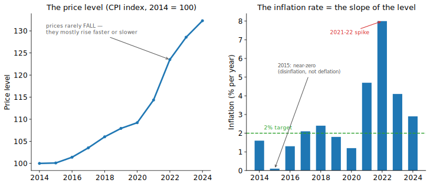
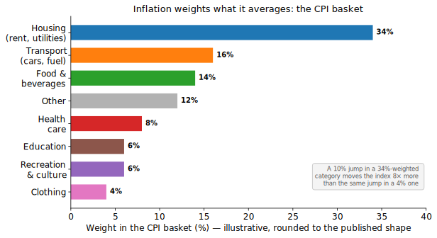
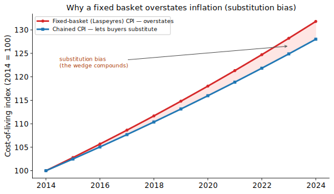
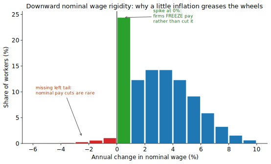
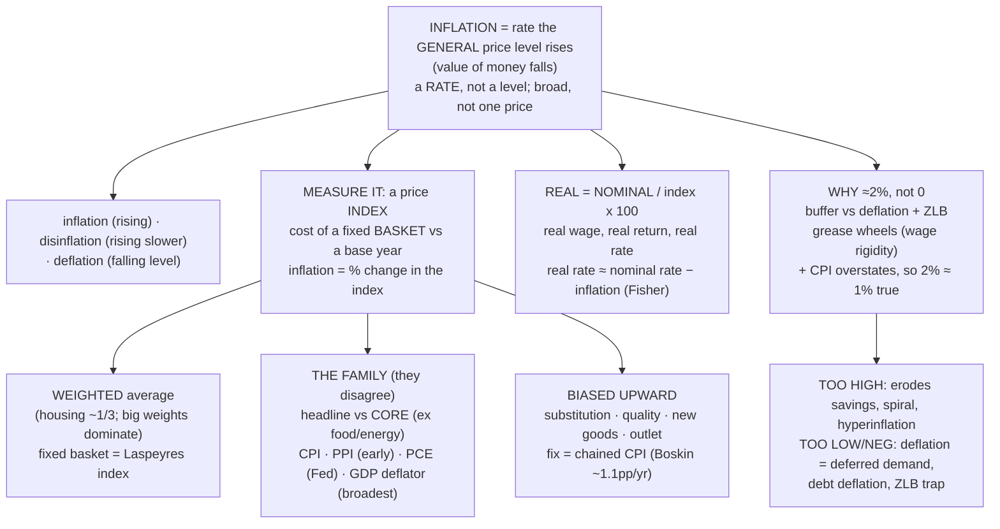

# E02 · §2 — Inflation & Price Indices

> **Subject:** Economy & Finance *(hobby track)*
> **Module:** E02 — The Whole Economy (Macroeconomics)
> **Section:** The number that turns *nominal* into *real*. §1 left two loose ends — "the economy grew 2%"
> means **real** growth, and **real ≈ nominal − inflation** — without ever saying what *inflation* is or how
> anyone measures it. This section closes that gap: what inflation actually is (a change in the **price
> level**, not in one price), how a **price index** like the **CPI** is built from a fixed **basket**, the
> **family** of indices you'll meet in the news (core CPI, PPI, PCE, the GDP deflator from §1), how to use a
> price index to deflate any nominal figure into real terms, **why every index is biased**, and the question
> that anchors all monetary policy to come: **why central banks target a little inflation (≈2%) rather than
> zero.**
> **Status:** 🔵 **draft — body complete, awaiting the live session.** Drafted 2026-06-26. **§9 is reserved**
> for the session Q&A (same pattern as §1's §9). Math in LaTeX, quantitative relationships drawn as real
> curves, key terms glossed in 中文 (大陆/台灣), per
> [`../../../agent-docs/authoring-conventions.md`](../../../agent-docs/authoring-conventions.md).

**Estimated study time:** 1.5–2 hours including reflection.
**Prerequisites:** E02 §1 — especially **nominal vs real GDP**, the **GDP deflator**
($\text{deflator} = \text{nominal}/\text{real} \times 100$), and the relation
**nominal growth ≈ real growth + inflation**. From E01: a **weighted average** and the idea of
substituting toward whatever got relatively cheaper (§3 elasticity / consumer response to price). New math
is limited to **index numbers** and **percentage changes**, both built here from scratch.

---

## Why this section exists (for *you*)

§1 kept leaning on a word it never defined. "Grew 2%" means **real** growth; the gap between **nominal** and
**real** GDP is **inflation**; the **GDP deflator** *is* an inflation measure; and China's recent
**negative deflator** flipped nominal *below* real. Every one of those sentences assumed you already knew
what inflation is and how it's measured. You don't yet — so here we build it.

This matters for all four of your goals, but three especially:

- **Goal 1 (read the news).** "CPI rose 3.1% year-on-year," "**core** inflation is sticky," "**real** wages
  fell for the 18th straight month," "the Fed's preferred **PCE** gauge cooled" — these are the most-quoted
  numbers in economics after GDP, and each is a different cut of *the same idea*.
- **Goal 2 (understand policy).** Inflation is the **target variable** of monetary policy (E03). You cannot
  understand why a central bank raises rates until you understand what the ≈2% it's defending even means —
  this section is the on-ramp to all of E03.
- **Goal 4 (investing).** Inflation is the silent tax on cash and bonds, the hurdle every **real** return
  must clear, and the reason "my savings account pays 0.5%" can mean you're *losing* purchasing power.

> **One framing to hold:** inflation is **the rate at which the general price level rises** — and the whole
> measurement problem is that "the general price level" isn't one price, it's a **weighted average of
> millions of prices** that we have to define, weight, and track. Get the *index* right and a huge slice of
> macro and finance news becomes readable.

---

## 1. What inflation is — a rate of change of the *price level*

Three precise statements, because the looseness here is where most confusion lives.

- **Inflation is about the *general* price level, not one price.** If tomatoes get dearer because of a bad
  harvest while everything else holds, that's a **relative price** change (a §1-style microeconomic signal),
  **not inflation.** Inflation is a *broad* rise across the whole basket of what people buy — it shows up as
  the **value of money falling**: each dollar buys a little less of *everything*.
- **Inflation is a *rate*, not a *level*.** "The price level" is an index number (e.g. CPI = 117). **Inflation
  is the percentage *change* in that index** over a year — writing $P_{t}$ for the price index in period $t$,
  the rate is $\pi_{t} = (P_{t} - P_{t-1}) / P_{t-1} \times 100$. This is exactly the **flow-vs-stock /
  value-vs-rate** distinction from §1's physics lens, one rung up: the price level is the position, inflation
  is the velocity.
- **Three words the news uses precisely — learn the difference:**
  - **Inflation** — the price level is *rising* (positive rate). The normal state.
  - **Disinflation** — inflation is *still positive* but **slowing** (e.g. 8% → 4%). Prices are still rising,
    just less fast. *This is what "inflation is coming down" almost always means* — a falling **rate**, not
    falling **prices**.
  - **Deflation** — the price level is actually *falling* (negative rate). Rare, and — as §6 argues —
    **more dangerous than mild inflation**, not less.

The single most useful picture in this whole section makes the level-vs-rate point unmissable:

<!-- FIGURE -->

The **left** panel is the price *level* — it climbs almost every year and essentially never falls. The
**right** panel is the inflation *rate*, which is just **the slope of the left panel**. Notice what this
means for reading headlines:

- When the rate *falls* from 8% (2022) toward 3% (2024), the **level is still rising** — just less steeply.
  "Inflation halved" does **not** mean prices fell; it means they're climbing half as fast. Prices that went
  up in the spike mostly **stay** up. This one confusion fuels endless "but everything still costs more!"
  arguments — and the public is *right*: disinflation doesn't reverse the level, it only slows the climb.
- A genuinely *falling* level (a bar below zero) is **deflation** — distinct from a *low positive* rate
  ("near-zero," like the stylized 2015 here, which is **disinflation**, not deflation).

---

## 2. How we measure it — the basket and the Consumer Price Index (CPI)

You can't average "the price of everything," so statisticians do something concrete: they fix a
**representative basket** of goods and services a typical household buys, and track **what that same basket
costs over time.** The flagship is the **Consumer Price Index (CPI)**.

**The recipe, in four steps:**

1. **Pick the basket.** Survey households to find what they actually spend on, and in what proportions —
   housing, food, transport, healthcare, recreation, and so on. Each category gets a **weight** equal to its
   share of spending.
2. **Price the basket** in a chosen **base period** (set the index to 100 there, by convention).
3. **Re-price the *same* basket** each later period at current prices.
4. **The index** is the cost of the basket now relative to the base.

Written out, with the base-period basket held fixed:

$$\text{CPI}_{t} = \frac{\text{cost of the fixed basket at period-}t\text{ prices}}{\text{cost of the fixed basket at base-period prices}} \times 100.$$

The weights are the heart of it — **inflation is a *weighted* average**, so a price jump matters in
proportion to how much of the budget that category eats:

<!-- FIGURE -->

- **Housing dominates** most developed-economy baskets (≈ a third). That's why **rents and mortgage-linked
  costs** move the headline so much, and why a spike in a small-weight category (say clothing at 4%) barely
  registers even if its *own* price doubles.
- The weights are **why two people experience different "personal inflation."** A young renter who doesn't
  own a car feels housing inflation acutely and fuel inflation not at all; a retiree's basket is
  healthcare-heavy. The CPI is one *representative* household — your mileage literally varies.

**A worked example (do this once and the formula sticks).** A toy two-good basket: 10 loaves of bread and
4 bus rides.

| | Bread (×10) | Bus (×4) | Basket cost (\$) |
|---|---|---|---|
| **Base year** prices | \$2.00 | \$1.50 | $10 \times 2.00 + 4 \times 1.50 = 26.00$ |
| **This year** prices | \$2.40 | \$1.50 | $10 \times 2.40 + 4 \times 1.50 = 30.00$ |

$$\text{CPI this year} = \frac{30.00}{26.00} \times 100 = 115.4 \quad\Rightarrow\quad \text{inflation rate} = 15.4 \text{ percent}.$$

Bread rose 20% but is ~77% of the basket by value, so it pulls the index up hard; the bus fare didn't move.
The index, **15.4%**, is the weighted blend — exactly what Fig 1 is telling you in the large.

> **Why fix the basket?** To isolate **price** change from **quantity** change. If you let the basket move
> every period you'd be mixing "prices went up" with "people bought different things" — and you couldn't say
> which. Holding quantities fixed at base-period weights is called a **Laspeyres index**, and it's the
> workhorse of CPI construction. Its great virtue (a constant yardstick) is also its central flaw — it
> assumes people *keep buying the same basket even as relative prices change*, which they don't. That flaw is
> **substitution bias**, and it gets its own section (§5).

---

## 3. The family of price indices — same idea, different lens

"Inflation" in the news is never just one number. Each index covers **different goods**, from **different
buyers**, computed **slightly differently** — and they disagree, sometimes by a lot. Knowing which is which
is most of reading inflation news correctly.

| Index | What it covers | Who uses it / why it matters |
|---|---|---|
| **Headline CPI** | The full consumer basket, incl. food & energy | The number in headlines and most **cost-of-living adjustments**; what the public *feels*. |
| **Core CPI** | CPI **excluding food & energy** | Food and energy are **volatile** (weather, oil shocks). Stripping them shows the **underlying trend** central banks care about — a §1-style signal-vs-noise filter, not a claim that you don't eat. |
| **PPI** (Producer Price Index) | Prices producers *receive* at the factory gate / wholesale | An **early-warning** gauge — cost pressure often shows up in PPI *before* it reaches consumer CPI (a leading indicator, E02 §4). |
| **PCE** (Personal Consumption Expenditures price index) | Broader consumption, weights that **update more often** | The **US Federal Reserve's preferred** gauge — it allows for substitution, so it usually reads a touch *below* CPI. When the Fed says "2% target," it means **core PCE**. |
| **GDP deflator** | **Everything in GDP** ($C+I+G+NX$) — not just consumer goods | The economy-wide measure from **§1**. Covers investment goods, government, exports; **excludes imports** (they're not domestic output). Broadest of all. |

Two distinctions worth burning in, because the news blurs them constantly:

- **Headline vs core.** When a central banker sounds calm about a scary headline number, it's usually because
  **core** is tame and the headline spike is a transient food/energy shock. When *core* is rising, that's the
  alarming one — it signals **broad, persistent** inflation. Watch core for the *trend*, headline for what
  people *experience*.
- **CPI vs the GDP deflator (the §1 link).** CPI tracks a *fixed consumer* basket including **imports**;
  the **deflator** tracks *everything produced domestically* and **excludes imports**. So they diverge
  exactly when import prices move: an oil-price spike (for an oil *importer*) lifts **CPI** far more than the
  **deflator**, because imported fuel is in the consumer basket but not in domestic output. This is *why* §1
  could call the deflator "the broadest inflation measure" while CPI stays the one you *feel*.

> **A note on construction (so the disagreement isn't mysterious).** CPI is a **Laspeyres** index (fixed
> base-period basket); a **Paasche** index uses the *current* basket; the **Fisher** index is their geometric
> mean. The PCE and the GDP deflator are closer to **chained** indices that update the basket continuously.
> Fixed-basket (Laspeyres) reads *highest*; basket-updating reads *lower*. That methodological choice — not
> any deception — explains a chunk of why CPI > PCE most years. The reason it matters is §5.

---

## 4. Real vs nominal, applied — deflating with a price index

§1 introduced real vs nominal for *GDP*. The same move works on **any** money figure: divide a **nominal**
(current-dollar) amount by the relevant price index to get a **real** (constant-purchasing-power) amount.

$$\text{real value} = \frac{\text{nominal value}}{\text{price index}} \times 100.$$

This is the single most practically useful operation in the section. Three places it bites:

- **Real wages — "are people actually better off?"** If your pay rose 4% but prices rose 5%, your **real
  wage fell ~1%** — you got a raise and got *poorer*. "Wages are rising" (nominal) and "living standards are
  falling" (real) are routinely **both true at once**, and confusing them is the most common error in
  wage-and-cost-of-living news. The honest question is always *real* wage growth = nominal wage growth −
  inflation.
- **Real returns — the investing hurdle (Goal 4).** A savings account paying 0.5% while inflation runs 3%
  delivers a **real return of about −2.5%**: your money grows in dollars but **shrinks in what it can buy.**
  Inflation is the hurdle every investment must clear just to *preserve* purchasing power — which is why
  "safe" cash can be a quiet, guaranteed loss in real terms.
- **Comparing across decades.** "A \$10,000 salary in 1980" is meaningless until you deflate it to today's
  prices. Newspapers that say "the highest-grossing film ever" usually mean *nominal* dollars; adjust for
  inflation and the ranking reshuffles entirely.

**Nominal vs real interest rates — the Fisher relation.** The same logic gives the most important single
equation linking inflation to finance, which we'll use heavily in E03:

$$\text{real interest rate} \approx \text{nominal interest rate} - \text{inflation}.$$

A bank rate (nominal) of 5% with 3% inflation is only a ~2% **real** return to the saver — and a ~2% real
*cost* to the borrower. Crucially it's **expected** inflation that matters when the loan is struck, so
**inflation expectations** become a variable in their own right (and a thing central banks fight to "anchor").
*The full time-value-of-money treatment is E03 §2; here just hold that inflation drives a wedge between the
rate you're quoted and the rate that matters.*

**Indexation — building inflation into contracts.** Once you can deflate, you can **protect** against
inflation by linking payments to a price index: **cost-of-living adjustments (COLA)** in wages and pensions,
**inflation-linked bonds** (US **TIPS**, Singapore's and the UK's linkers), and indexed tax brackets. This is
double-edged: indexation shields people from inflation, but widespread indexation can also **entrench** it —
a price rise auto-feeds into wages and back into prices, the **wage-price spiral** (§6).

---

## 5. Every index is biased — why CPI overstates the cost of living

A fixed-basket (Laspeyres) CPI has a built-in **upward bias**: it tends to **overstate** how much the cost of
*maintaining a given standard of living* actually rose. This isn't fraud — it's structural, and the famous
**Boskin Commission (1996)** estimated US CPI overstated inflation by roughly **1.1 percentage points a
year**, a huge cumulative number given how much (Social Security, tax brackets, contracts) is indexed to it.
Four sources:

- **Substitution bias (the big one).** When beef gets dearer, people **buy more chicken** — they substitute
  toward what got relatively cheaper (pure E01 §3 consumer response). But a *fixed* basket keeps pricing the
  old, beef-heavy basket, so it overstates the hit to a household that actually adapted. The wedge **compounds
  year on year**:

<!-- FIGURE -->

  The red **fixed-basket** line and the blue **chained** line start together; letting buyers substitute makes
  the chained index rise a touch slower *each* year, and the shaded wedge widens — that wedge *is* the
  substitution bias, and over a decade it's the difference between very different cumulative inflation
  numbers.
- **Quality-change bias.** This year's \$1,000 phone is far better than last year's \$1,000 phone. If the
  *price* is flat but the *product* improved, real prices arguably **fell** — but it's devilishly hard to net
  quality out (statisticians use **hedonic** adjustment, imperfectly).
- **New-goods bias.** Genuinely new products (the smartphone, GPS, GLP-1 drugs) enter the basket **years
  late**, so the index misses the enormous early value and price declines.
- **Outlet-substitution bias.** Shoppers shift to cheaper channels (discounters, e-commerce); a survey
  pinned to traditional outlets misses the saving.

> **The fix, and its politics.** The repair is a **chained CPI** (the blue line) that updates the basket
> continuously to capture substitution. The US publishes **C-CPI-U**, and switching indexation to it was
> politically explosive precisely *because* it reads lower — a lower index means **smaller** Social Security
> increases and **faster** tax-bracket creep. A measurement choice with billions of dollars riding on it: a
> live, real-world instance of **§1's Goodhart / "the measure is a target"** problem, now on the *price* side.

---

## 6. Why target a *little* inflation (≈2%) — not zero, not high

Here's the question that puzzles almost everyone, and the keystone of all monetary policy to come: nearly
every modern central bank — Fed, ECB, Bank of England, and (in its own way) MAS — aims for **about 2%**
inflation, *on purpose.* Why not **zero**? And why is **deflation** treated as a disaster, not a discount?

**The costs of *high* inflation (why not high).** These are real and rise steeply with the rate:

- **Erodes savings and fixed incomes** — anyone holding cash or a fixed pension loses purchasing power.
- **Menu costs and shoe-leather costs** — the literal cost of constantly re-pricing, plus the effort of not
  holding cash that's melting.
- **Arbitrary redistribution** — unexpected inflation **helps borrowers, hurts lenders** (debts repaid in
  cheaper dollars); it transfers wealth by accident of who held what.
- **Noise drowns the signal** — when *all* prices gallop, the **relative-price signal** that coordinates a
  market economy (E01 §2) gets lost in the inflationary roar; planning horizons collapse.
- **It can spiral.** High inflation breeds **inflation expectations** → wage demands → more inflation: the
  **wage-price spiral**. Unanchored, it can run to **hyperinflation** — Weimar Germany (1923), Hungary (1946,
  the worst ever), Zimbabwe (2008), Venezuela (2010s) — where money loses meaning and the economy reverts
  toward barter. And **stagflation** (high inflation *with* high unemployment — the 1970s) shows inflation and
  stagnation can, painfully, coexist.

**The costs of *deflation* (why not zero — the asymmetry that surprises people).** Falling prices sound
*good*, but a falling price *level* is corrosive:

- **Deferred spending → demand spiral.** If prices will be lower next month, **wait to buy**; everyone waiting
  cuts demand, which cuts output and prices further — a self-feeding slump. **Japan's "lost decades"** and the
  **1930s Depression** are the cautionary tales.
- **Debt deflation.** Deflation **raises the real value of debt** — your nominal mortgage stays fixed while
  wages and prices fall, so the *real* burden grows. Mass deleveraging deepens the slump (Irving Fisher's
  classic 1933 mechanism; recall the **$g$ vs $r$** point from §1's §9d).
- **The zero lower bound (ZLB).** Central banks fight slumps by *cutting* nominal rates, but rates can't go
  far below zero. With the **Fisher relation**, deflation makes the *real* rate **high** exactly when you need
  it low — monetary policy loses its main tool. *This is the deepest reason for a positive target,* and the
  bridge to E03's whole toolkit.

**Why ≈2% specifically — three reasons it's the sweet spot:**

1. **A buffer against deflation.** Aiming for 2% keeps a **safety margin** above zero, so an ordinary
   downturn dips inflation toward 0–1% rather than into outright deflation and the ZLB trap.
2. **"Greasing the wheels" — downward nominal wage rigidity.** Workers fiercely resist *nominal* pay **cuts**
   (it feels like an insult, and contracts/norms forbid it) but accept a *real* cut via a below-inflation
   raise. So firms almost never cut nominal pay — they **freeze** it. The empirical fingerprint is unmistakable:

<!-- FIGURE -->

   The **spike at exactly 0%** (frozen pay) and the **missing left tail** (cuts almost never happen) are one
   of the most reliable patterns in labour economics. With **2% inflation**, a firm that needs to cut a
   worker's *real* wage can simply hold nominal pay flat (or give 1%) and let inflation do the rest — the
   labour market can **adjust real wages without nominal cuts.** At **0% inflation** that escape valve is
   gone, and adjustment happens through **layoffs** instead. A little inflation is grease in the gears.
3. **Measurement bias headroom.** Since CPI **overstates** true inflation by perhaps ~1 point (§5), a measured
   2% is closer to **~1% true** — comfortably positive but genuinely low. Targeting a *measured* 0% might mean
   *actual* deflation.

> **Local lens — MAS and "core inflation."** Singapore's central bank (MAS) watches **MAS Core Inflation**,
> which strips out **accommodation (housing) and private road transport** — the two most policy-distorted,
> volatile components in the SG context (housing is heavily policy-driven; car prices swing with the **COE**
> quota system). It's the same **core-vs-headline** logic from §3, tuned to local idiosyncrasies. And because
> Singapore is a tiny, ultra-open economy where **imports dominate the basket**, MAS fights inflation not by
> setting an interest rate but by managing the **exchange rate** (a stronger Sing dollar makes imports
> cheaper) — the standout policy case we build properly in **E03 §4.** Hold the thread: *imported inflation*
> is why SG's whole monetary framework is different.

---

## 7. The one-page mental model

<!-- DIAGRAM:START -->

Diagram source (Mermaid)

<!-- DIAGRAM:END -->

**The eight things to remember:**
1. **Inflation = the rate the *general* price level rises** — a **broad** move (the value of money falling),
   a **rate** not a level. Tomatoes alone aren't inflation.
2. **Inflation vs disinflation vs deflation:** rising · rising-*slower* · *falling*. "Inflation came down"
   almost always means **disinflation** — prices still rose, just slower; they don't fall back.
3. **Measure it with a price index:** cost of a **fixed basket** vs a base year; inflation = **% change** in
   the index. It's a **weighted** average — big weights (housing ≈ ⅓) dominate.
4. **Know the family:** **headline vs core** (ex food/energy = the trend); **CPI** (what you feel), **PPI**
   (early warning), **PCE** (the Fed's gauge), **GDP deflator** (broadest, excludes imports — §1).
5. **Real = nominal ÷ index × 100.** Apply it to **wages** (a raise below inflation is a real *cut*),
   **returns** (cash can lose in real terms), and **rates** (**real ≈ nominal − inflation**, Fisher).
6. **Every index is biased *up*** — substitution, quality, new-goods, outlet — so CPI **overstates** true
   inflation (Boskin ≈ 1.1pp/yr); the fix is a **chained** index, which reads lower (and so is political).
7. **Target ≈2%, not 0:** a **buffer** above deflation/the ZLB, **grease** for the labour market (downward
   nominal wage rigidity), and **headroom** for measured-vs-true bias.
8. **Asymmetry:** *high* inflation erodes/​redistributes/​can spiral to hyperinflation; *deflation* is
   arguably **worse** — deferred demand, **debt deflation**, and the **zero-lower-bound** trap that disarms
   monetary policy.

---

## 8. Check your understanding

Per the "verifiable beats judgeable" note in your profile, several of these are **predict-then-check**: reason
it out first, then test it against a real release.

1. **Level vs rate.** A country's inflation rate falls from 8% to 3% over a year. A friend says "great, prices
   are finally coming back down." What's wrong with that, and what *actually* happened to the price level?
   Which of the three words (inflation / disinflation / deflation) applies?
2. **Build the index.** A basket is 20 units of rice and 5 bus rides. Base-year prices: rice \$1.00, bus
   \$2.00. This year: rice \$1.20, bus \$2.00. Compute the CPI (base = 100) and the inflation rate. Why does
   rice move the index more than the bus fare, even though both are in the basket?
3. **Which index?** For each, name the gauge you'd reach for and why: (a) the cost-of-living adjustment to a
   pension, (b) the inflation trend a central bank steers by, (c) an early signal that consumer prices may
   rise next quarter, (d) economy-wide price growth covering investment and exports, not just consumer goods.
4. **Real vs nominal — predict, then check.** Your salary rises 4%; CPI inflation is 5.5%. Did your purchasing
   power rise or fall, and by roughly how much? Then find one real wage-growth release (e.g. US BLS real
   earnings, or Singapore MOM) and identify the nominal figure, the inflation figure, and the real figure.
5. **The bias.** Explain substitution bias in one sentence using a beef→chicken example, and say which
   direction it pushes a fixed-basket CPI (over- or under-state). Why does switching to a chained CPI *lower*
   measured inflation — and why is that politically contentious?
6. **Why not zero?** Give the two strongest reasons a central bank targets ≈2% rather than 0%. For the
   wage-rigidity one, explain in your own words how 2% inflation lets a firm cut a worker's *real* wage
   without ever cutting *nominal* pay.
7. **Deflation.** Falling prices sound like a consumer win. Give two mechanisms by which broad deflation can
   *harm* an economy, and name the policy trap (hint: the Fisher relation and the lower bound on nominal
   rates) that makes central banks fear it more than mild inflation.

## 9. Optional: read a real CPI / inflation release (15–20 min)

Pick a recent release and read it through this section's lens:

- **Singapore — MAS / SingStat** monthly CPI: find **headline CPI** *and* **MAS Core Inflation**; note exactly
  what core *excludes* (accommodation, private transport) and why the two can diverge sharply. *(SingStat:
  singstat.gov.sg; MAS commentary: mas.gov.sg.)*
- **United States — BLS CPI** news release: locate **headline vs core** (ex food & energy), the **biggest
  contributing categories** (watch shelter's weight — Fig 1), and the **year-on-year vs month-on-month**
  figures. Then find the **Fed's** preferred gauge, **core PCE**, and note it usually reads a bit *lower* than
  core CPI (substitution, §5).

For each, answer: Is this **headline or core**? **Year-on-year or month-on-month**? Which **categories** drove
it? Is the inflation **rate** rising or falling — and is the **price level** still climbing either way (§1)?
Bring one to our chat and we'll run the inflation story on it, the way we ran GDP on the China growth target
in §1.

---

## 9 (reserved). Applied — from our session Q&A

*Reserved, to be filled after the live session — same pattern as §1's §9. This is where the threads you pull
on while working through the section get written up (the edge cases, the re-rankings, the "what's the failure
mode I haven't met" questions).*

---

## Key terms — English · 中文（中国大陆 / 台灣）

So the concepts carry over to Chinese-language economic news and statistics releases. Most differences are
just **simplified vs traditional script**; **⚠ marks a genuine terminology difference** between Mainland
China (大陆) and Taiwan (台灣) that you'd actually trip over.

**The core idea**

| English | 中国大陆 (简体) | 台灣 (繁體) | Note |
|---|---|---|---|
| Inflation | 通货膨胀（通胀）| 通貨膨脹（通膨）| the everyday short forms 通胀 / 通膨 differ |
| Deflation | 通货紧缩（通缩）| 通貨緊縮（通縮）| falling price *level* |
| Disinflation | 通胀放缓（反通胀）| 通膨趨緩 | rate falling, still positive |
| Price level | 物价水平 | 物價水準 | ⚠ 大陆 **水平** vs 台灣 **水準** |
| Stagflation | 滞胀 | 停滯性通膨 | ⚠ a big split — 大陆 **滞胀** vs 台灣 **停滯性通膨** |
| Hyperinflation | 恶性通货膨胀 | 惡性通貨膨脹 | Weimar, Zimbabwe, Venezuela |

**Measuring it**

| English | 中国大陆 (简体) | 台灣 (繁體) | Note |
|---|---|---|---|
| Consumer Price Index (CPI) | 居民消费价格指数（CPI）| 消費者物價指數（CPI）| ⚠ 大陆 **居民消费价格** vs 台灣 **消費者物價** |
| Producer Price Index (PPI) | 工业生产者出厂价格指数（PPI）| 生產者物價指數（PPI）| ⚠ naming differs; both = "PPI" |
| Core inflation | 核心通胀 | 核心通膨 | ex food & energy |
| Basket (of goods) | 一篮子商品 | 一籃子商品（財貨）| |
| Weight | 权重 | 權重 | the share of each category |
| Base period / base year | 基期 / 基年 | 基期 / 基年 | index = 100 here |
| Index number | 指数 | 指數 | |
| GDP deflator | GDP平减指数 | GDP平減指數 | broadest measure (§1) |

**Using it (real vs nominal)**

| English | 中国大陆 (简体) | 台灣 (繁體) | Note |
|---|---|---|---|
| Nominal / real | 名义 / 实际 | 名目 / 實質 | ⚠ as in §1 — 名义↔名目, 实际↔實質 |
| Real wage | 实际工资 | 實質薪資 | ⚠ wage 工资 (大陆) vs 薪資 (台灣) |
| Purchasing power | 购买力 | 購買力 | what money can buy |
| Cost of living | 生活成本 | 生活成本 | |
| Real interest rate | 实际利率 | 實質利率 | ≈ nominal − inflation (Fisher) |
| Inflation expectations | 通胀预期 | 通膨預期 | what central banks "anchor" |
| Indexation / COLA | 指数化 / 生活成本调整 | 指數化 / 生活費調整 | inflation-linked pay/pensions |
| Inflation-linked bond | 通胀挂钩债券 | 抗通膨債券 | ⚠ 大陆 **挂钩** vs 台灣 **抗通膨**; US = TIPS |

**Biases & policy**

| English | 中国大陆 (简体) | 台灣 (繁體) | Note |
|---|---|---|---|
| Substitution bias | 替代偏差（替代偏误）| 替代偏誤 | why fixed-basket CPI overstates |
| Chained index | 链式指数（连锁指数）| 連鎖指數 | the fix; reads lower |
| Money illusion | 货币幻觉 | 貨幣幻覺 | confusing nominal with real |
| Wage-price spiral | 工资-物价螺旋 | 薪資-物價螺旋 | ⚠ 工资↔薪資 again |
| Downward nominal wage rigidity | 名义工资向下刚性 | 名目薪資向下僵固性 | ⚠ 刚性 (大陆) vs 僵固性 (台灣); the "grease the wheels" reason |
| Inflation target | 通胀目标 | 通膨目標 | the ≈2% |
| Zero lower bound (ZLB) | 零利率下限 | 零利率下限 | disarms rate cuts in deflation |

> Recurring genuine splits to memorize (beyond §1's list): **物价水平↔物價水準** (price level),
> **滞胀↔停滯性通膨** (stagflation), **居民消费价格指数↔消費者物價指數** (CPI), **工资↔薪資** (wage),
> **刚性↔僵固性** (rigidity). Plus the §1 carry-overs that recur here: **名义↔名目**, **实际↔實質**.

---

## References (optional, for depth)

- *Naked Economics* — Charles Wheelan, the chapter on **money, prices, and the Federal Reserve** — the
  friendliest prose on what inflation is and why a little is healthy. https://wwnorton.com/books/Naked-Economics
- Khan Academy — Macroeconomics, **"Inflation — measuring the cost of living"** unit: builds the CPI, the
  basket, real-vs-nominal, and the index biases step by step with practice.
  https://www.khanacademy.org/economics-finance-domain/macroeconomics
- Marginal Revolution University — short videos on **"The Consumer Price Index,"** **"real vs nominal,"** and
  **"the costs of inflation."** https://mru.org/courses/principles-economics-macroeconomics
- *CORE Econ — The Economy 2.0*, unit on **inflation, unemployment and monetary policy** — rigorous, free,
  with real data and the wage-rigidity story. https://books.core-econ.org/the-economy/
- **The Boskin Commission Report (1996)** — *"Toward a More Accurate Measure of the Cost of Living"* — the
  source for the ~1.1pp/yr CPI overstatement and the index-bias taxonomy.
  https://www.ssa.gov/history/reports/boskinrpt.html
- **Primary sources to practise on:** Singapore — **SingStat CPI** and **MAS Core Inflation**
  (https://www.singstat.gov.sg, https://www.mas.gov.sg); United States — **BLS CPI** news release
  (https://www.bls.gov/cpi/) and the **BEA PCE price index** (https://www.bea.gov); cross-country inflation —
  **World Bank / IMF** data (https://data.worldbank.org).

---

### What's next
🔵 **Draft complete, awaiting session (2026-06-26).** This pays off §1's cliffhanger — you now know what
"real," the "deflator," and "nominal ≈ real + inflation" actually rest on: a **weighted basket**, a **family
of indices** that disagree by construction, the **deflate-to-real** operation, the **upward bias** every index
carries, and **why ≈2% is the deliberate target.** Deliberate cliffhangers feed the rest of the module and
E03: the **Fisher relation** (real ≈ nominal − inflation) and **inflation expectations** point straight at
**E03 §2 (interest rates & the time value of money)** and **§3 (monetary policy)**; the **zero-lower-bound**
and **wage-rigidity** material is the *why* behind the whole central-bank toolkit; the **MAS core-inflation /
imported-inflation** thread sets up **E03 §4 (the MAS exchange-rate model)**; and **unemployment** — which
just appeared via wage rigidity and layoffs-as-the-alternative-adjustment — is the subject of **§3
(unemployment & the labour market)**, with the inflation-unemployment trade-off (the Phillips curve) waiting
in **§4 (the business cycle)**.
