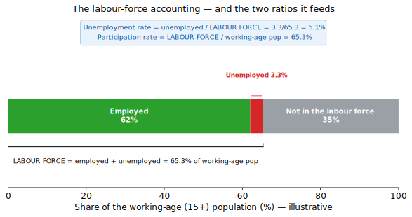
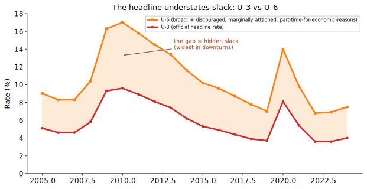
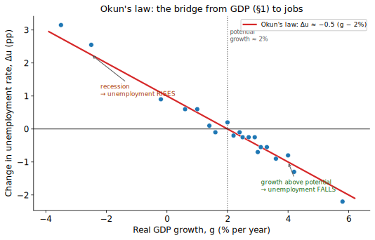
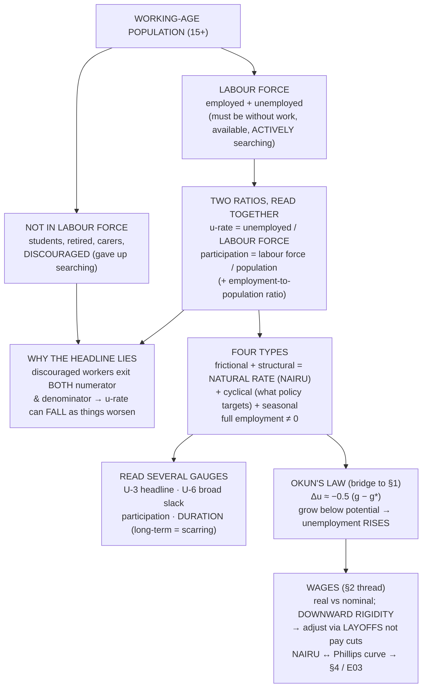

# E02 · §3 — Unemployment & the Labour Market

> **Subject:** Economy & Finance *(hobby track)*
> **Module:** E02 — The Whole Economy (Macroeconomics)
> **Section:** The third headline gauge, after **output** (§1) and **prices** (§2): **jobs.** It builds the
> unemployment rate from its precise definition (who actually counts as "unemployed"), the **labour-force
> accounting** behind it, and its indispensable companion the **participation rate** — then the parts the
> headline hides: **flows vs the stock**, the **four types** of unemployment and why **full employment isn't
> zero** (the *natural rate*), **broad measures** (U-6) that expose hidden slack, **Okun's law** (the bridge
> back to §1's GDP), and how **wages** clear — or fail to clear — this most unusual of markets, picking up
> §2's **wage rigidity** thread.
> **Status:** ✅ **finalized 2026-07-02.** Body drafted 2026-06-29; **§11 captures the live session** — a
> single mechanics question (how is potential growth $g^{\ast}$ estimated?) pulled outward into the whole
> monetary-policy chain: the unobservable number, the Fed's **reaction function** (one lever, two targets),
> **central-bank independence**, and a **researched 2026 case** (Powell → Warsh, a hike bias, inflation past
> 4%). Math in LaTeX, quantitative relationships drawn as real curves,
> key terms glossed in 中文 (大陆/台灣), per
> [`../../../agent-docs/authoring-conventions.md`](../../../agent-docs/authoring-conventions.md).

**Estimated study time:** 1.5–2 hours including reflection.
**Prerequisites:** E02 §1 (real GDP, **potential vs actual output / the output gap**, the break-even
"treadmill" from §9d — Okun's law in §6 is the formal version of that) and §2 (**real vs nominal wages**,
**downward nominal wage rigidity**, and the layoffs-as-the-alternative-adjustment point). New math is only
ratios and a single linear relationship (Okun).

---

## Why this section exists (for *you*)

You can now read two of the three numbers that define a macro headline: how much an economy **produces** (§1)
and what's happening to **prices** (§2). The third is **jobs** — "**US payrolls rose 250k**," "**unemployment
ticked up to 4.1%**," "**the labour market is cooling**," "**Singapore's resident unemployment held at
2.8%**." It's arguably the number voters *feel* most directly, and it's the variable a central bank weighs
*against* inflation when it sets policy (the dual mandate, E03).

It's aimed at your **Goal 1 (read the news)** and **Goal 2 (policy)**, and it closes loops left open earlier.
§1's §9d argued that "+3% can be a crisis" because growth has to clear a **break-even** rate just to hold
employment steady — **Okun's law** (§6) is that idea made quantitative. §2 ended on the labour market
adjusting through **layoffs** when inflation is too low to erode real wages — this section is where that
mechanism lives. And it sets up §4 (the business cycle), where unemployment and inflation are traded off
along the **Phillips curve**.

> **One framing to hold:** the unemployment rate is **not** "the share of people without a job." It is a
> ratio with a carefully drawn denominator — **the unemployed as a fraction of the *labour force*** — and
> almost every way the headline misleads comes from who is, and isn't, counted in that denominator.

---

## 1. Who counts as "unemployed" — the labour-force accounting

The word is narrower than everyday usage. To be counted **unemployed** in the official statistics, a person
must be **all three** of:

1. **Without work** (not employed, not even an hour of paid work in the reference week);
2. **Available** to start work; and
3. **Actively searching** (applied, interviewed, etc.) in the recent period — typically the past four weeks.

Fail the third and you are *not* unemployed — you are **not in the labour force (NILF)**. This is the hinge on
which everything turns: a person with no job who has *given up looking* is statistically **not unemployed**,
because the labour force counts only the employed plus the *actively job-seeking*.

The whole **working-age population** (usually 15+ or 16+) partitions cleanly:

<!-- FIGURE -->

$$\text{labour force} = \text{employed} + \text{unemployed} \qquad (\text{the job-seeking population}).$$

Everyone else of working age — students, retirees, full-time carers, the long-term sick, and **discouraged
workers** who quit searching — is **NILF**. Note what's *excluded* on purpose: children, and (in the standard
measure) the institutionalized and military. The "actively searching" gate is the subtle one, and §2's wage
discussion already hinted why it matters — it means the headline rate can move for reasons that have nothing
to do with hiring.

---

## 2. The two headline ratios — and why one is never enough

From that partition come the two numbers you must read **together**:

$$\text{unemployment rate} = \frac{\text{unemployed}}{\text{labour force}}, \qquad
\text{participation rate} = \frac{\text{labour force}}{\text{working-age population}}.$$

The unemployment rate's **denominator is the labour force, not the population** — and that is exactly why it
can lie. If a discouraged worker stops searching, they leave the *numerator* (no longer "unemployed") **and**
the *denominator* (no longer in the labour force). The unemployment rate can therefore **fall** while the
employment situation gets **worse** — people didn't find jobs, they just stopped being counted.

So you read the **participation rate** alongside it as the reality check, and often a third number, the
**employment-to-population ratio** ($\text{employed} / \text{working-age population}$), which sidesteps the
labour-force denominator entirely and so can't be flattered by discouragement.

<!-- FIGURE -->

Two readings the chart makes concrete:

- **The 2020 dip that wasn't good news.** When unemployment fell after a shock partly because participation
  *also* fell, some of the "improvement" was discouraged workers leaving, not jobs being created. The falling
  blue line is the correction the red bars don't show.
- **Slow structural drift.** Participation has a *trend* (population ageing, more schooling, shifting norms
  for women's and older workers' employment) layered under its *cyclical* wiggle. The long slide here is
  mostly demographics — retiring baby boomers — not the business cycle.

> **Local lens — read Singapore's labour numbers carefully.** Singapore reports an **overall** unemployment
> rate and a **resident** (citizen + PR) rate and a **citizen** rate — and they differ, because a large share
> of the workforce is **non-resident** (work-permit and Employment-Pass holders) who function as a
> **buffer**: in a downturn, foreign headcount is cut first, cushioning *resident* unemployment. So
> Singapore's resident rate looks remarkably low and stable (typically ~2–3%) partly by *construction*. MOM
> also publishes the **labour-force participation rate** and the **long-term** unemployment rate. When you
> read "Singapore unemployment is 2%," always ask *which* rate, and remember the non-resident buffer doing
> quiet work underneath.

---

## 3. A stock fed by flows — why *duration* matters

The unemployment rate is a **stock** (a snapshot count), but it is the result of relentless **flows**: every
month people are *hired*, *laid off*, *quit*, *retire*, and *enter* or *re-enter* the search. A given 5%
unemployment rate can mean two completely different things:

- **High-flow, short-duration** (e.g. the US): many people move *through* unemployment quickly — lose a job,
  find another within weeks. The pool is large but everyone in it leaves fast. Painful but fluid.
- **Low-flow, long-duration** (e.g. parts of Europe historically): fewer people enter unemployment, but those
  who do get **stuck** for a year or more. The same 5% hides a far worse human reality.

That's why the news watches the **long-term unemployment share** (jobless 27+ weeks) and the **median
duration** of unemployment, not just the rate. Long-duration unemployment is the dangerous kind: skills atrophy,
networks decay, and employers screen out the long-jobless, so it can become **self-perpetuating** — the
**hysteresis** mechanism from §2 (a cyclical shock leaving a permanent scar). A flow view also explains why a
healthy economy *always* has positive unemployment: even with plenty of jobs, people are perpetually *between*
them.

---

## 4. The four types — and why "full employment" isn't zero

Not all unemployment is the same animal, and the distinction is the heart of policy:

- **Frictional** — the normal churn of people **between** jobs, or new entrants searching. Short, voluntary-ish,
  and a sign of a *working* market (people matching to better fits). You can't — and shouldn't — drive it to
  zero.
- **Structural** — a **mismatch** between the skills/locations workers have and the jobs on offer. Coal miners
  in a region pivoting to software; factory workers displaced by automation. Longer-lasting; the cure is
  retraining, mobility, education — not just "more demand."
- **Cyclical** — the part that rises and falls with the **business cycle** (§4). A recession's collapse in
  spending means firms need fewer workers *everywhere at once*. **This is the kind macro policy targets** —
  the gap between the actual rate and the rate that would prevail at "full employment."
- **Seasonal** — predictable calendar swings (retail at Christmas, agriculture, tourism). Official series are
  usually **seasonally adjusted** to strip it out, so don't double-count it.

Add up the unavoidable floor — frictional **plus** structural — and you get the **natural rate of
unemployment** (the dashed line in Fig 2), the rate that persists even when the economy is at full health.
"Full employment" means **cyclical unemployment ≈ 0**, *not* a zero rate — there's always churn and mismatch.

> **The deeper name — NAIRU.** Economists often equate the natural rate with the **NAIRU** — the
> *Non-Accelerating-Inflation Rate of Unemployment*: push unemployment *below* it (an overheated labour
> market, workers scarce) and wage growth accelerates, feeding **inflation** (the §2 wage-price thread); let
> it sit *above* it and inflation eases. This is the hinge between this section and §2 — the labour market is
> where a huge part of inflation is *made* — and it's the conceptual engine of the **Phillips curve** in §4.
> The catch: the NAIRU is **unobservable and drifts** (with demographics, technology, institutions), so
> central banks are steering by a target they can't directly see — a recurring theme in policy.

---

## 5. The headline understates slack — broad measures (U-6)

Even read alongside participation, the official rate (in US parlance **U-3**) misses people who are
*economically* underused but don't fit the three-part definition. The broadest standard measure, **U-6**, adds
them back:

- **Marginally attached / discouraged workers** — want a job, available, but stopped *actively* searching
  (so U-3 calls them NILF, §1);
- **Involuntary part-timers** — working part-time only because they *can't* find full-time work
  (**underemployment** — employed, but under-utilized).

<!-- FIGURE -->

The shaded **gap is hidden slack**, and notice it **widens in downturns**: in a slump, far more people slip
into involuntary part-time and discouragement than the headline U-3 admits. Two further blind spots no single
rate captures:

- **The informal / gig economy** — cash work and platform gigs blur "employed": someone driving a few hours a
  week to survive counts as *employed*, masking deep underemployment.
- **Underemployment by skill** — the PhD driving a taxi is "employed" and invisible to every rate, yet the
  economy is wasting their training. (A measurement cousin of §1's GDP blind spots.)

The lesson mirrors §1 and §2: there isn't *one* true number. Read the **headline for the cycle**, **U-6 for
slack**, **participation for who's dropped out**, and **duration for how bad it is for those caught**.

---

## 6. Okun's law — the bridge from GDP (§1) to jobs

Why does any of this connect to output? Because producing more usually takes more workers. **Okun's law** is
the empirical regularity that ties the two headlines together — the formal version of §1's §9d "treadmill":

$$\Delta u \approx -\beta (g - g^{\ast}), \qquad \beta \approx 0.5,$$

where $\Delta u$ is the change in the unemployment rate, $g$ is real GDP growth, and $g^{\ast}$ is **potential
(trend) growth** — the break-even rate from §1. In words: **grow faster than potential and unemployment
falls; grow slower (or shrink) and it rises.** The rough US coefficient says each **1 percentage point** of
growth *above* potential pulls unemployment **down ~0.5 pp**.

<!-- FIGURE -->

This is exactly why §1 could insist "+3% can be a crisis for China." If potential growth $g^{\ast}$ is ~5%,
then $g = 3$% gives $\Delta u \approx -0.5(3 - 5) = +1$ — unemployment *rising* a point a year, despite
positive growth. Okun's law is the gear that converts a **growth shortfall** into a **jobs shortfall**, and it
runs both ways:

- It's *why* policymakers obsess over hitting potential growth — falling short shows up as lost jobs.
- It explains **"jobless recoveries"**: if output rebounds but firms meet demand by working existing staff
  harder (rising productivity) rather than hiring, employment lags — Okun's coefficient is not a constant of
  nature. (A modern wrinkle: **labour hoarding** — firms holding onto scarce workers through a mild
  downturn rather than re-hiring later — flattens it the other way.)

---

## 7. How wages clear (or don't) — the most unusual market

The labour market is a *market* — a price (the wage) balancing supply (workers) and demand (firms, who hire up
to where the wage equals the worker's marginal revenue product, the E01 §4 logic). But it is the market that
**least** resembles the textbook, for reasons §2 already set up:

- **Real vs nominal wages (the §2 lens).** What a worker cares about is the **real** wage — nominal pay
  deflated by prices. "Pay rose 3% but inflation was 5%" is a **real pay cut.** Much of labour-market news is
  really about *real* wages even when it quotes nominal ones.
- **Downward nominal wage rigidity (the §2 figure, now explained).** Wages **don't fall freely** when labour
  is in surplus — the spike-at-zero histogram from §2. Firms freeze nominal pay rather than cut it (morale,
  contracts, norms), so when demand collapses the adjustment comes through **quantities — layoffs — instead of
  prices — wage cuts.** That stickiness is a chief reason recessions produce *unemployment* rather than just
  *lower wages*, and it's why a little inflation "greases the wheels" (§6 of §2).
- **Bargaining power and monopsony.** The simple supply-and-demand picture assumes both sides are
  price-takers. Often they're not: a dominant local employer is a **monopsonist** (the mirror of the E01 §3
  monopoly — wage-*setting* power on the buyer side), which can push wages and employment *below* the
  competitive level. Unions, minimum wages, and non-compete rules all push back — which is why labour markets
  are so **institution-heavy** (very different across the US, Europe, Japan, Singapore).

> **The forward hook — the Phillips curve.** Tie §2 and §3 together and you get the central short-run
> trade-off of macro policy: **lower unemployment ↔ higher inflation.** A hot labour market (unemployment
> below the NAIRU, §4) bids wages up, feeding prices; a slack one cools them. That relationship — its shape,
> whether it still holds, and how **inflation expectations** shift it — is the spine of **§4 (the business
> cycle)** and a pillar of **E03 (monetary policy)**. For now just hold the link: *jobs and prices are two
> ends of the same lever.*

---

## 8. The one-page mental model

<!-- DIAGRAM:START -->

Diagram source (Mermaid)

<!-- DIAGRAM:END -->

**The eight things to remember:**
1. **"Unemployed" = without work + available + *actively searching*.** Drop the searching and you're **not in
   the labour force**, not unemployed.
2. **Unemployment rate = unemployed / *labour force***, not / population. The denominator is the trap.
3. **Always read participation (and employment-to-population) alongside it** — the rate can **fall as things
   worsen** when discouraged workers exit.
4. **It's a stock fed by flows; duration matters.** Same 5% can be fast-churn (mild) or long-term-stuck
   (scarring / **hysteresis**).
5. **Four types:** frictional + structural = the **natural rate (NAIRU)**; **cyclical** is what macro policy
   targets; seasonal is adjusted out. **Full employment ≠ zero.**
6. **The headline understates slack:** **U-6** adds discouraged + involuntary part-time; the gap **widens in
   downturns**; gig/skill underemployment is invisible to every rate.
7. **Okun's law** — $\Delta u \approx -0.5 (g - g^{\ast})$ — is the **bridge to GDP (§1)**: grow below
   potential → unemployment rises (why "+3% can be a crisis").
8. **Wages are sticky downward** (§2): demand shocks hit through **layoffs, not pay cuts**; the **NAIRU ↔
   Phillips-curve** link makes jobs and inflation two ends of one lever (→ §4, E03).

---

## 9. Check your understanding

Per the "verifiable beats judgeable" note in your profile, several are **predict-then-check**: reason first,
then test against a real release.

1. **The denominator trap.** In a deep recession, the reported unemployment rate *falls* for two months. Give
   a way this could happen that is **bad** news, not good, and name the two numbers you'd check to tell which
   it is.
2. **Build the ratios.** Working-age population 100; employed 60; unemployed 5; everyone else NILF. Compute
   the unemployment rate, the participation rate, and the employment-to-population ratio. Now 3 of the
   unemployed get discouraged and stop searching (no new jobs). Recompute all three — which improve, which
   worsen, and what does that tell you?
3. **Type it.** Classify each and say which (if any) macro demand policy should target: (a) a travel agent
   displaced by booking websites, (b) a software engineer between jobs for three weeks, (c) mass layoffs
   across all sectors in a recession, (d) ski-resort staff laid off in summer.
4. **Full employment.** A politician promises "zero unemployment." Explain in two sentences why that's neither
   achievable nor desirable, using the words *frictional*, *structural*, and *natural rate*.
5. **Okun — predict, then check.** Potential growth is 2% and the economy grows 0.5% this year. Using
   $\Delta u \approx -0.5 (g - g^{\ast})$, predict the change in unemployment. Then pull one country's real
   GDP-growth and unemployment-change for a recent year and see how close Okun's rule of thumb lands.
6. **Slack.** Headline (U-3) unemployment is back to its pre-recession low, but U-6 is still well above its
   own pre-recession low. What does that tell you about the *quality* of the recovery, and who is being missed?
7. **Wages.** Demand for a city's workers drops sharply. Under flexible wages, what would adjust? Given §2's
   **downward nominal wage rigidity**, what adjusts *instead* — and why is that the mechanism that turns a
   demand shock into *unemployment*?

## 10. Optional: read a real labour-market release (15–20 min)

- **United States — BLS Employment Situation** (the monthly "jobs report"): find the **U-3 headline**, the
  **U-6** broad rate, the **participation rate**, the **long-term unemployed share**, and **nonfarm payrolls**
  (a separate *establishment* survey of jobs added). Note the household survey (which gives the rate) and the
  payroll survey can disagree month to month. *(bls.gov)*
- **Singapore — MOM Labour Market Report / SingStat**: identify the **overall vs resident vs citizen**
  unemployment rates, the **participation rate**, and the **long-term** rate; note how the **non-resident**
  workforce buffers the resident figures. *(mom.gov.sg, singstat.gov.sg)*

For each: Is the rate rising or falling — and is **participation** moving with it or against it? Is the
recovery (or downturn) confirmed by **U-6** and **duration**, or only by the headline? Bring one to our chat
and we'll run the labour-market story on it, the way we ran GDP on China's growth target in §1.

---

## 11. Applied — from our session Q&A (2026-07-02)

This session started from a single mechanics question buried in §6 — *to apply Okun's law you need potential
growth $g^{\ast}$; but how is $g^{\ast}$ actually calculated?* — and then walked *outward* along the chain that
question opens: from the unobservable number, to the **central bank that has to act on it**, to the **politics
of who controls that bank**, ending on a **live 2026 case** we researched together. Four threads, each the
natural next link. Several point straight into **E03 (monetary policy & central banking)**, where this
machinery gets its own module.

### 11a. How is potential output actually measured? — the shaky number under Okun's law

**The headline you should carry:** **potential output is not measured, it is *estimated*.** Actual GDP you can
(roughly) count; **potential** — the level the economy could sustain at full employment without accelerating
inflation — is a *counterfactual*, so every value of $g^{\ast}$ you'll ever see is a model output with a
confidence band, not a fact. That's *why* Okun's threshold ("grow below $g^{\ast}$ and unemployment rises") is
fuzzier in practice than the clean line in §6 suggests. Three ways it's estimated, from most intuitive to most
used:

1. **The back-of-envelope (keep this as the intuition).** Potential growth is just the growth of what the
   economy *can supply* — how many people work times how productive each is:
   $g^{\ast} \approx \text{growth of labour supply} + \text{growth of labour productivity}$.
   This is why demographics dominate: an ageing, shrinking workforce drags $g^{\ast}$ down regardless of
   policy. It's why estimated US potential drifted from ~3.5% toward ~1.8% after 2005 — boomers retiring (the
   labour term falls) plus the post-2005 productivity slowdown (the productivity term falls).

2. **The production-function approach (what agencies publish).** Formalize step 1 with a Cobb–Douglas
   production function $Y = A \cdot K^{\alpha} L^{1 - \alpha}$, then plug in *trend* inputs: the capital stock,
   the labour force at the natural rate $u^{\ast}$ (the NAIRU from §4), and trend **total factor productivity**
   $A$. This is **growth accounting**, and it's how the **CBO** (US), **OECD**, and **IMF** build their series.
   Note the soft spot: $A$ is itself the unexplained residual — "the measure of our ignorance" — so a big chunk
   of $g^{\ast}$ rests on the least-understood term.

3. **Statistical filters (quick and atheoretical).** Just smooth the actual GDP series and call the smooth part
   "potential" — the **Hodrick–Prescott filter** is the classic. Central banks often blend this with the
   production-function estimate and with the Phillips/Okun relations in a "multivariate filter" that pins down
   potential and the NAIRU *jointly* (a Kalman filter).

> **The failure mode you asked for — and it's a big one.** Because $g^{\ast}$ is estimated, three things bite.
> **(i) Circularity:** some $g^{\ast}$ estimates *use* Okun and the Phillips curve as inputs, so "apply Okun"
> and "estimate $g^{\ast}$" can chase each other's tails (serious work solves them jointly). **(ii) The
> end-point problem:** filters are *least* reliable at the most recent data — exactly the point a policymaker
> needs *now* (Hamilton's 2018 paper is bluntly titled *"Why You Should Never Use the Hodrick–Prescott
> Filter"*). **(iii) Real-time revisions are brutal:** Orphanides showed the 1970s Fed thought the output gap
> was large and eased — but potential had actually fallen, and that real-time mismeasurement helped cause the
> **Great Inflation**; and pre-2008 potential was later revised down sharply, retroactively reclassifying how
> much of the slump was cyclical. **Upshot:** reasonable economists disagree on the *current-year* $g^{\ast}$
> by half a point or more — enough to flip the *sign* of Okun's predicted change in unemployment.

### 11b. One lever, two targets — how a central bank turns these gauges into a rate

You asked whether "the Fed sets rates on inflation and unemployment — if both are high it likely raises." The
setup: the Fed has essentially **one tool** (the policy interest rate) and a **dual mandate** — price stability
*and* maximum employment. The catch is that the one lever pushes the two targets in **opposite** directions:
raising rates cools demand, which lowers inflation *but* raises unemployment; cutting does the reverse. This is
the §3 punchline — *jobs and inflation are two ends of one lever (the NAIRU ↔ Phillips-curve link)* — with a
hand now on the lever.

"Sets rates on inflation and unemployment" has a formal name — a **reaction function**, the famous one being
the **Taylor rule**:

$$i = r^{\ast} + \pi + 0.5(\pi - \pi^{\ast}) + 0.5 \times (\text{output gap}),$$

or, written to lean explicitly on the labour market (with the output gap mapped to the unemployment gap via
Okun's law from §6):

$$i = r^{\ast} + \pi^{\ast} + a(\pi - \pi^{\ast}) - b(u - u^{\ast}), \qquad a, b > 0.$$

Read plainly: inflation above target $\pi^{\ast}$ pushes the rate **up**; unemployment above the natural rate
$u^{\ast}$ pushes it **down**. So the premise hides two very different worlds:

- **Overheating (a demand boom):** unemployment **low**, inflation **high** — both gaps say the same thing,
  *cool it down* → **clear raise.** (Your intuition works *here* — but note unemployment is low, not high.)
- **Stagflation:** inflation **and** unemployment both high — the gaps **conflict**, and one lever cannot fix
  both. This is the signature of an **adverse supply shock** (an oil or tariff spike raises prices *and* costs
  jobs) or of inflation expectations unanchoring. There is no free answer.

> **How the Fed breaks the tie — and the archetype.** When the mandates conflict, modern doctrine favors
> **inflation**, because a stable nominal anchor is the *precondition* for durable maximum employment.
> **Volcker (1979–82)** is the case: inflation ~13%, he drove the funds rate toward ~19%, *caused* a recession
> that pushed unemployment to ~10.8%, and broke inflation — raising *into* high unemployment to protect the
> anchor. The opposite risk is **"looking through"** a shock you wrongly judge temporary: the 2021 "transitory"
> bet was exactly this, and being wrong forced the abrupt 2022 hikes. **Verdict on your statement:** *partly*
> right, but not because both-high both argue for raising — high unemployment argues for *cutting*. In real
> stagflation the Fed *chooses* to prioritize inflation and sacrifice employment. The clean, unambiguous
> "raise" case is the *other* one: high inflation with **low** unemployment.

### 11c. Why the Fed resists the President — central-bank independence

The recurring news pattern — a President (Trump, in both terms) publicly demanding cuts while the Fed holds or
hikes — is a clean lens on **central-bank independence**. The two sides reason from different objectives:

- **The President's case:** cheaper borrowing means stronger growth, more jobs, higher asset prices — good
  politics, especially into an election. And a heavily indebted government has a direct fiscal motive: every
  extra point of interest on ~$36T of US debt costs *hundreds of billions* a year, so low rates slash the
  **debt-servicing bill**. Plus a genuine view that inflation is beaten and rates are needless drag.
- **The Fed's case:** its mandate is price stability and employment, *not* to finance the deficit or serve the
  White House. Cutting before inflation is durably at 2% risks re-igniting it — doubly so under a supply shock.

The deep reason independence exists is **time inconsistency** (Kydland–Prescott, Barro–Gordon): a policymaker
facing elections has a short-horizon temptation to over-stimulate, everyone anticipates it, and you end up with
higher *average* inflation and no lasting employment gain — an **inflation bias**. Delegating money to an
insulated, credibly low-inflation body fixes that; empirically, more-independent central banks have run lower
inflation. The danger it guards against has a name — **fiscal dominance**, where an indebted government leans
on the bank to hold rates down to fund itself, ending in inflation. The President's debt-servicing motive is
textbook pressure *toward* fiscal dominance.

> **The paradox, and the cautionary tale.** Pressure to cut can **backfire**: if markets doubt the Fed's
> resolve, inflation expectations and *long*-term bond yields rise — so leaning on short rates can *tighten*
> the long rates that actually drive mortgages. And the archetype of caving: Nixon pressured Chair **Arthur
> Burns** to keep money loose before the **1972** election; the Fed arguably complied, feeding the 1970s Great
> Inflation. That episode is *why* the independence norm hardened — and why chairs now guard it jealously.
> There's a fair democratic-accountability critique of unelected technocrats, but the weight of evidence sits
> firmly on independence: the times Presidents got their way are the textbook disasters.

### 11d. The live case (researched together, 2026-07-02) — Trump, Powell → Warsh, and a hike bias

We then checked the *current* state online, and it turned out to be almost a live experiment on 11c:

- **Leadership changed.** Jerome **Powell's term as Chair ended 15 May 2026**; he stayed on as a *governor*
  (two years left on that separate term). **Kevin Warsh** — **Trump's own nominee**, sold as *"someone who
  believes in lower interest rates, by a lot"* — was confirmed **54–45** and sworn in **22 May 2026** (to
  2030). So the President didn't just pressure the incumbent; he **replaced** him with an ally — the purest
  test of independence-vs-capture.
- **The twist.** At **Warsh's first meeting (17 June 2026)** the Fed did **not** cut: it **held** the target
  range at **3.50–3.75%** on a **unanimous 12–0 vote**, *flipped its dot plot to a hike bias* (median year-end
  now above today; 17 of 18 officials saw inflation risks to the upside), and **raised its 2026 inflation
  forecast** (PCE to 3.6%). With headline inflation **topping 4%**, Warsh said "price stability" a dozen times
  and pushed back on the pressure campaign, insisting independence "would not change." Notably, **Trump eased
  off** — *"we have a very good guy over there now… I'm guided by what he wants"* — because demanding cuts with
  inflation visibly at 4% is a losing hand into the November 2026 midterms.

> **What it confirms — and the honest caveat.** It's a near-textbook vindication: even a chair installed *to*
> cut held rates and steered a hike bias, because the inflation gap and the anchor's credibility dominated the
> political preference — and market talk of the Fed *raising* to satisfy the "bond vigilantes" is the
> credibility paradox made real. **But don't over-read one meeting.** Warsh's hand is essentially forced right
> now — he *can't* credibly cut into 4% inflation on day one without torching his own credibility. The real
> test comes *later*: if inflation falls back and Trump wants cuts to juice the midterm economy, does Warsh cut
> *faster than the data warrant*? That's when we'll learn whether this is genuine independence or a capture
> waiting for cover. **This is exactly the terrain E03 formalizes.**
>
> *Sources (retrieved 2026-07-02):* Fed FOMC statement 2026-06-17; CNN, StockTitan, CNBC, and PBS reporting on
> the June decision, Warsh's confirmation and swearing-in, and Trump's shift in stance.

---

## Key terms — English · 中文（中国大陆 / 台灣）

So the concepts carry over to Chinese-language economic news and statistics releases. Most differences are
just **simplified vs traditional script**; **⚠ marks a genuine terminology difference** between Mainland China
(大陆) and Taiwan (台灣) that you'd actually trip over.

**The labour-force accounting**

| English | 中国大陆 (简体) | 台灣 (繁體) | Note |
|---|---|---|---|
| Unemployment | 失业 | 失業 | |
| Unemployment rate | 失业率 | 失業率 | unemployed / labour force |
| Labour force | 劳动力 | 勞動力（勞動人口）| the job-seeking population |
| Labour-force participation rate | 劳动参与率 | 勞動參與率 | labour force / working-age pop |
| Employment-to-population ratio | 就业人口比率 | 就業人口比率 | sidesteps the LF denominator |
| Not in the labour force | 非劳动力 | 非勞動力 | students, retired, discouraged |
| Working-age population | 劳动年龄人口 | 勞動年齡人口 | usually 15+/16+ |
| Employed | 就业（者）| 就業（者）| |

**Types & the natural rate**

| English | 中国大陆 (简体) | 台灣 (繁體) | Note |
|---|---|---|---|
| Frictional unemployment | 摩擦性失业 | 摩擦性失業 | normal between-jobs churn |
| Structural unemployment | 结构性失业 | 結構性失業 | skills/location mismatch |
| Cyclical unemployment | 周期性失业 | 循環性失業 | ⚠ 大陆 **周期** vs 台灣 **循環**; what policy targets |
| Seasonal unemployment | 季节性失业 | 季節性失業 | adjusted out of series |
| Natural rate of unemployment | 自然失业率 | 自然失業率 | frictional + structural |
| NAIRU | 非加速通胀失业率 | 非加速通膨失業率 | the inflation-stable rate |
| Full employment | 充分就业 | 充分就業 | cyclical ≈ 0, not zero rate |
| Seasonally adjusted | 季节调整 | 季節調整 | |

**Slack, duration & flows**

| English | 中国大陆 (简体) | 台灣 (繁體) | Note |
|---|---|---|---|
| Discouraged worker | 气馁工人（丧失信心者）| 怯志工作者（灰心喪志者）| ⚠ different wording; left the labour force |
| Underemployment | 就业不足（不充分就业）| 低度就業（就業不足）| ⚠ 大陆 **不充分** vs 台灣 **低度**; incl. involuntary part-time |
| Long-term unemployment | 长期失业 | 長期失業 | 27+ weeks; scarring |
| Hysteresis | 滞后效应（迟滞）| 遲滯效應 | cyclical shock → permanent scar |
| Hidden unemployment | 隐性失业 | 隱性失業 | the U-6 / informal gap |
| Labour hoarding | 劳动力囤积 | 勞動力囤積 | firms keep staff through a slump |

**Wages, output & the trade-off**

| English | 中国大陆 (简体) | 台灣 (繁體) | Note |
|---|---|---|---|
| Real / nominal wage | 实际 / 名义工资 | 實質 / 名目薪資 | ⚠ 工资↔薪資, 名义↔名目, 实际↔實質 (§2) |
| Downward nominal wage rigidity | 名义工资向下刚性 | 名目薪資向下僵固性 | ⚠ 刚性↔僵固性; layoffs, not pay cuts |
| Monopsony | 买方垄断 | 買方獨占 | ⚠ 大陆 **垄断** vs 台灣 **獨占** (as in E01) |
| Okun's law | 奥肯定律 | 歐肯法則 | ⚠ transliteration 奥肯 vs 歐肯; Δu ≈ −0.5(g−g*) |
| Output gap | 产出缺口 | 產出缺口 | actual − potential (§1) |
| Phillips curve | 菲利普斯曲线 | 菲利浦曲線 | ⚠ transliteration differs; unemployment ↔ inflation |
| Minimum wage | 最低工资 | 最低工資（基本工資）| ⚠ TW commonly **基本工資** |

> Recurring genuine splits to memorize (beyond §1/§2's lists): **周期↔循環** (cyclical), **垄断↔獨占**
> (monopsony/monopoly), transliterations **奥肯↔歐肯** (Okun) and **菲利普斯↔菲利浦** (Phillips), and the
> §2 carry-overs **工资↔薪資**, **名义↔名目**, **实际↔實質**, **刚性↔僵固性**.

---

## References (optional, for depth)

- *Naked Economics* — Charles Wheelan, the chapters on the labour market and on GDP/employment — the
  friendliest prose on how the unemployment rate is built and what it hides.
  https://wwnorton.com/books/Naked-Economics
- Khan Academy — Macroeconomics, **"Unemployment"** unit: the labour-force framework, the rate vs
  participation, and the four types, with practice. https://www.khanacademy.org/economics-finance-domain/macroeconomics
- Marginal Revolution University — short videos on **the unemployment rate**, **types of unemployment**, and
  **the labour market**. https://mru.org/courses/principles-economics-macroeconomics
- *CORE Econ — The Economy 2.0*, units on **the labour market and unemployment** (and **wage-setting /
  price-setting**) — a rigorous, free treatment with real data and the institutional detail.
  https://books.core-econ.org/the-economy/
- **On Okun's law:** a clean primer is the **FRED blog / St. Louis Fed** explainer (search "Okun's law"),
  which plots the GDP-growth vs unemployment-change relationship on live US data.
- **Primary sources to practise on:** United States — **BLS Employment Situation** (https://www.bls.gov/ces/
  and https://www.bls.gov/cps/) including the **U-1…U-6** alternative measures; Singapore — **MOM Labour
  Market** reports and **SingStat** (https://www.mom.gov.sg, https://www.singstat.gov.sg); cross-country —
  **OECD** and **ILO** unemployment and participation data (https://data.oecd.org, https://ilostat.ilo.org).

---

### What's next
✅ **Finalized 2026-07-02.** This is the third macro headline after output (§1) and
prices (§2): you can now build the unemployment rate from its real definition, read it against participation
and U-6, type it (frictional/structural/cyclical/seasonal), place the **natural rate / NAIRU**, and connect it
back to GDP through **Okun's law**. The deliberate cliffhangers all converge on **§4 (the business cycle)**:
**cyclical unemployment**, the **output gap**, **Okun's law**, and the **NAIRU ↔ Phillips-curve** link are
precisely the machinery §4 assembles into a theory of booms and recessions — and the **inflation-unemployment
trade-off** is the bridge from there into **E03 (monetary policy)**, where a central bank weighs the two
against each other. The **wage-rigidity / real-wage** thread closes the loop opened in §2.
