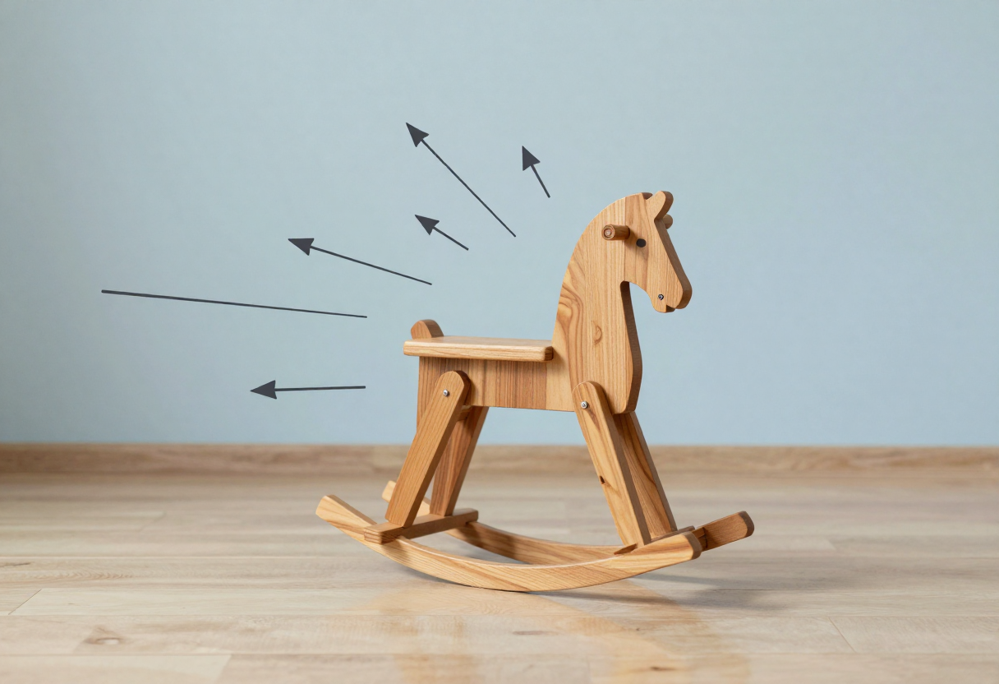
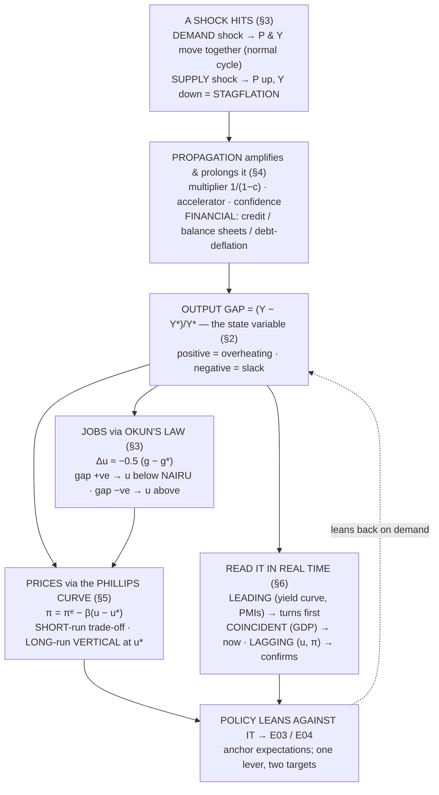

# E02 · §4 — The Business Cycle

> **Subject:** Economy & Finance *(hobby track)*
> **Module:** E02 — The Whole Economy (Macroeconomics)
> **Section:** The capstone of the macro module. §1–§3 gave you the three headline gauges — **output**,
> **prices**, **jobs** — one at a time. They do not move independently: they **co-move** in a recurring
> boom-and-bust pattern, the **business cycle**. This section assembles the pieces you already hold —
> **potential output** and the **output gap** (§1), **wage/price stickiness** (§2), and **cyclical
> unemployment / the NAIRU / Okun's law** (§3) — into one working theory of *why* economies expand and
> contract: the anatomy of a cycle, the **demand vs supply shocks** that start one, the **propagation
> mechanisms** that amplify it, the **Phillips curve** that links slack to inflation (the §3 cliffhanger,
> paid off), and the **leading / coincident / lagging indicators** the news uses to read the cycle in real
> time. It ends pointing straight at **E03 (money & central banks)** — the policy that leans against all of
> this.
> **Status:** ✅ **finalized 2026-07-07.** Body drafted 2026-07-02; **§10 captures the live session** — a
> three-thread arc that started from the section's own *damping* idea and walked outward: **(a)** what
> actually acts as a **shock absorber** in an economy (the oscillator lens pushed to its limit); **(b)** a
> **live cycle read with the toolkit** — the **AI capex boom/bubble**, researched together (mid-2026 data);
> and **(c)** the deepest question the cycle raises — **is capitalism *doomed* by it?** — Marxist crisis
> theory vs the Keynesian synthesis, where the learner supplied his own original, correct counter-arguments.
> Math in LaTeX, quantitative relationships drawn as real curves, key terms glossed in 中文 (大陆/台灣), per
> [`../../../agent-docs/authoring-conventions.md`](../../../agent-docs/authoring-conventions.md).

**Estimated study time:** 1.5–2 hours including reflection.
**Prerequisites:** E02 §1 (**real GDP**, **potential vs actual output / the output gap**, the break-even
"treadmill"), §2 (**sticky prices/wages**, **inflation expectations**, why ≈2% is the target), and §3
(**cyclical unemployment**, the **natural rate / NAIRU**, **Okun's law**, and the one-line Phillips-curve
preview). New machinery is only the **AD–AS** picture and the **Phillips curve** — both assembled from parts
you already have.

---

## Why this section exists (for *you*)

You can now read each headline number on its own. But a news cycle never reports them in isolation — it
reports a *story*: "**the expansion is long in the tooth**," "**the economy is overheating**," "**recession
risk is rising**," "**the Fed is trying to engineer a soft landing**," "**the yield curve just inverted**."
Every one of those is a claim about **where we are in the business cycle** and **which way it's turning**.
This section is what lets you judge those claims instead of absorbing them.

It serves **Goal 1 (read the news)** and **Goal 2 (policy)**, and it is deliberately the *last* macro section
because it **ties the other three together**. Three loops from earlier close here:

- §1 built **potential output** and argued "+3% can be a crisis." The gap between actual and potential —
  the **output gap** — is the state variable of the whole cycle.
- §2 built **sticky prices/wages** and **inflation expectations**. Stickiness is *why* a demand shock hits
  output and jobs instead of just prices; expectations are *why* the inflation–unemployment trade-off is
  only temporary.
- §3 built **cyclical unemployment**, the **NAIRU**, and **Okun's law**, and left one explicit cliffhanger:
  the **Phillips curve**. That curve is §5 here.

And it opens the door to the next module: once you can say *the economy is below potential with rising
unemployment and falling inflation*, the obvious question is **what does policy do about it** — which is
**E03 (monetary policy)** and **E04 (fiscal policy)**.

> **One framing to hold:** the business cycle is **not a clock**. It is a **stable system being knocked
> around by shocks.** The economy has a tendency to return toward potential (the trend), but shocks keep
> hitting it and internal feedback keeps *amplifying and prolonging* the response — so you get recurring,
> irregular waves, not a neat sine wave. Almost everything below is either *"what knocks it"* (shocks, §3)
> or *"why the knock echoes"* (propagation, §4).

---

## 1. What a business cycle actually is — the shape, not a "cycle"

Strip an economy's real GDP down and you see two things at once: a **rising long-run trend** (potential
output — population, capital, and productivity growing, §1) and **fluctuations around that trend**. The
business cycle is the *fluctuation*, and it has a standard vocabulary:

<!-- FIGURE -->

- **Expansion** — output rising, unemployment falling, usually the longest phase.
- **Peak** — the turning point where expansion tips into contraction.
- **Contraction / recession** — output falling (or growth well below potential), unemployment rising.
- **Trough** — the bottom, where contraction tips into recovery.
- **Recovery** — output climbing back, initially the flip side of expansion.

Two things the picture makes concrete, and both matter for reading the news:

- **It is a "cycle" only loosely.** Cycles vary enormously in length and depth — a short shallow dip
  (2001) versus a deep long slump (2008–09) versus a violent but brief crater (2020). There is **no fixed
  period**; calling it a cycle is a description of *shape*, not *timing*. (This is exactly why "the
  expansion is old, so a recession is due" is a **fallacy** — expansions don't die of old age, they die of
  shocks or overheating. The US 2009–2020 expansion ran ~11 years and ended only when a pandemic hit.)
- **The wave is around a *rising* trend.** A recession is often *not* an absolute fall in GDP everywhere —
  it can be growth *below potential* (the economy loses ground *relative to* where it could be). This is
  the §1 §9d point again: for a fast-potential economy like China, sub-potential growth is the "recession"
  even if the level never falls.

> **Who decides a recession has happened — and the rule of thumb that's wrong.** The popular definition is
> **"two consecutive quarters of falling real GDP."** It's a handy shorthand but **not** the official call.
> In the US the **NBER**'s Business Cycle Dating Committee declares recessions using a *basket* — depth,
> **diffusion** (is the weakness spread across sectors?), and **duration** — across income, employment,
> production, and sales, not GDP alone. That's why the call comes with a long lag (the 2020 recession was
> dated *after* it had already ended) and why 2022 — two negative GDP quarters but a booming labour market —
> was **not** ruled a recession. **Takeaway for the news:** "two negative quarters" is a heuristic; the real
> definition is *a broad-based, sustained decline in activity.*

---

## 2. The output gap — the cycle's one state variable

The shaded area in Fig 1 has a name and it is the single most useful number for locating yourself in a
cycle. The **output gap** is how far actual output sits above or below potential:

$$\text{output gap} = \frac{Y - Y^{\ast}}{Y^{\ast}} \times 100 \quad \text{(percent of potential)}.$$

where $Y$ is actual real GDP and $Y^{\ast}$ is potential output (§1). It comes in two signs, and each one
lights up the *other two* headlines in a predictable way — this is the payoff of doing §1–§3 first:

| Output gap | The economy is… | Unemployment (§3) | Inflation pressure (§2, §5) |
|---|---|---|---|
| **Positive** ($Y > Y^{\ast}$) | above potential — **overheating**, an "inflationary gap" | **below** the NAIRU (labour scarce) | **rising** — demand outstrips capacity |
| **Zero** | at potential — full employment | **at** the NAIRU | **stable** (≈ target) |
| **Negative** ($Y < Y^{\ast}$) | below potential — **slack**, a "recessionary gap" | **above** the NAIRU | **falling / disinflation** |

Read this table twice: it says the three gauges are **not** three independent stories, they are three
*read-outs of the same underlying state.* Tell me the sign of the output gap and I can predict the direction
of unemployment — via **Okun's law** (§3), $\Delta u \approx -0.5\thinspace(g - g^{\ast})$ — and of inflation
via the **Phillips curve** (§5). That coupling is the whole reason a central bank can watch jobs *and* prices and
act on one lever — and it is the coupling §5 makes explicit.

The catch is the one §1 §11 hammered: $Y^{\ast}$ is **unobservable and estimated with a wide band.** So the
output gap you read in a headline is a *model output*, not a measurement — reasonable economists disagree on
today's gap by a percent or more, which is exactly why real-time policy is hard.

---

## 3. What starts a cycle — demand shocks vs supply shocks

If the economy tends back toward potential, *something* has to knock it off. That something is a **shock**,
and the single most important distinction in this whole section is **which side of the market it hits** —
because the two kinds move prices and output in *opposite* patterns, and one is far nastier for policy.

The workhorse picture is **aggregate demand and aggregate supply (AD–AS)** — the whole-economy cousin of
the E01 supply-and-demand curves, with the **price level** (§2) on the vertical axis and **real output**
(§1) on the horizontal. **Aggregate demand** is just the $C + I + G + NX$ identity from §1 read as a curve
(it slopes down); **short-run aggregate supply** slopes up because prices/wages are sticky (§2), so firms
produce more when prices rise relative to costs.

<!-- FIGURE -->

**Demand shock (left panel) — the "normal" cycle.** Something moves one of the $C + I + G + NX$ components:
a collapse in consumer or business **confidence** (spending and investment drop), a **credit crunch**, a
fiscal tightening, a fall in export demand, or a stock-market/housing bust that destroys wealth. Aggregate
demand shifts **left**; because supply is sticky, the economy slides *down* the supply curve to **lower
output *and* lower prices**. Output and inflation move the **same direction** — and that's the *convenient*
case, because a single policy lever that props up demand (cut rates, spend) pushes *both* back toward target
at once. Most ordinary recessions are demand-driven.

**Supply shock (right panel) — the nasty one.** Something raises the cost of producing *everything* at once:
an **oil-price spike**, a broad **tariff** shock, a pandemic shutting down production, a harvest failure.
Short-run supply shifts **up/left**, and the economy moves to **lower output but *higher* prices** — output
and inflation move in **opposite** directions. This is **stagflation** (§3's word), and it is a genuine
policy trap: the one lever cannot fix both ends. Prop up demand and you feed the inflation; crush demand to
kill the inflation and you deepen the recession. (This is the §3 §11b "stagflation" case — the reaction
function has to *choose*, and modern doctrine chooses to protect the inflation anchor, à la Volcker.)

> **Why the demand-side dominates the textbook cycle.** Because a positive demand shock (a boom) and a
> negative one (a bust) move prices and output *together*, they produce the clean, familiar co-movement —
> booms are inflationary, busts are disinflationary — that makes the Phillips curve (§5) and Okun's law (§3)
> look like laws. **Supply shocks are the exceptions that break those "laws"**: the 1970s stagflation broke
> the naive Phillips curve precisely because it was a supply shock, not a demand one (§5).

---

## 4. Why one knock echoes — the propagation mechanisms

A single shock doesn't produce a one-off blip; it *reverberates*. The reason the business cycle is a
drawn-out wave rather than a spike is a set of **feedback loops** that amplify and prolong the initial
disturbance. This is the "why the knock echoes" half of the framing, and it's where several threads you've
already built resurface.

- **The multiplier (the §2 §9b loop, named).** One agent's spending is another's income — so an initial
  drop in spending cuts someone's income, who then cuts *their* spending, and so on. The total hit is a
  **geometric series**: with a **marginal propensity to consume** $c$ (the fraction of an extra dollar that
  gets spent, §2's MPC), a one-dollar shock to demand ultimately moves output by
  $\Delta Y = \frac{\Delta(\text{spending})}{1 - c}$ — the **multiplier** $1/(1-c)$. If $c = 0.6$, a shock is
  amplified $2.5\times$. This is exactly the
  **paradox of thrift** the learner reconstructed in §2 §9b — everyone saving more at once *shrinks* the
  income they're trying to save out of.

- **The accelerator.** Investment depends not on the *level* of demand but on its *change*. A firm running
  near capacity invests to expand; the moment demand growth merely *slows*, the reason to add capacity
  vanishes and investment can fall sharply even while sales are still rising. Coupling the **multiplier**
  (spending → income) with the **accelerator** (income growth → investment) gives a system that can
  *oscillate on its own* — a second-order feedback loop (Samuelson's classic multiplier–accelerator model).

- **Confidence / "animal spirits" / coordination failure.** Expectations are self-fulfilling. If everyone
  *expects* a downturn, firms delay hiring and investment and households delay big purchases — which *causes*
  the downturn. There is a "good" equilibrium (everyone confident, spending) and a "bad" one (everyone
  cautious, hoarding), and a shock can tip the economy from one to the other. This **coordination-failure**
  view is why "confidence" indices move markets and why policy spends effort on *expectations* (forward
  guidance, §5, E03), not just on interest rates.

- **Financial amplification (the §2 Minsky thread, now central).** The biggest, longest cycles run through
  **credit and balance sheets.** In a boom, rising asset prices let firms and households borrow more against
  them, which pushes asset prices higher still — a feedback loop (Minsky's *financial instability
  hypothesis*, which the learner met in §2 §9b). In a bust it runs in reverse and vicious: falling asset
  prices force **deleveraging** and fire-sales, which push prices down further — **debt-deflation** (Irving
  Fisher). This is why financial crises produce *deep, slow* recessions: you're not just waiting for demand
  to recover, you're waiting for balance sheets to heal.

- **Inventories.** A small demand wobble gets amplified up the supply chain because firms adjust *stocks* as
  well as *sales* (the "bullwhip effect"). A minor slowdown in final sales can cause a sharp cut in factory
  orders once firms decide to run down inventory rather than restock.

Two real episodes make the taxonomy concrete — note how each combines a **shock type** (§3) with a
dominant **propagation channel**:

| Episode | Trigger (shock) | Dominant propagation | Character |
|---|---|---|---|
| **2008–09 Global Financial Crisis** | housing/credit bust (demand + financial) | **balance-sheet / debt-deflation** | deep, slow recovery |
| **1970s oil crises** | oil-price spikes (**supply**) | wage–price spiral, un-anchored expectations | **stagflation** |
| **2001 dot-com** | investment/asset-bubble bust (demand) | accelerator (investment collapse) | shallow, "jobless" recovery |
| **2020 COVID** | pandemic (**supply *and* demand** at once) | forced shutdown + confidence | violent crater, fast rebound |

> **The physics lens, used once because it genuinely fits.** The reason a *stable* system produces recurring
> *irregular* waves is the classic **Frisch–Slutsky "rocking horse"** model (Ragnar Frisch, 1933): a damped
> oscillator (the economy's tendency to return to trend) continually hit by **random shocks** (impulses).
> The system's own dynamics turn each impulse into a *decaying oscillation* — its **impulse response** — and
> the stream of shocks keeps re-exciting it, so you observe persistent cycles with no fixed period. The
> multiplier–accelerator loop is literally the "horse" (a second-order linear system whose complex roots set
> the natural frequency and damping); the shocks of §3 are the "kicks." Cycles are the **impulse response of
> a shocked, damped system** — which is exactly why they recur, why they're irregular, and why bigger
> shocks or *weaker damping* (fragile balance sheets) make them worse.

*Frisch's literal image: the economy is a **rocking horse** (a damped oscillator) and the shocks of §3 are the **kicks**. The horse's own build turns each random kick into a decaying rock — so cycles recur and are irregular, with no fixed period. — Illustration, generated locally (ComfyUI + Z-Image Turbo).*

Image prompt (source of truth)

> Stylized conceptual illustration of a single wooden rocking horse mid-rock in a calm empty studio; several
> small random impulse arrows strike it from different directions like kicks; curved motion lines show it
> rocking back and forth in a decaying oscillation; clean minimalist flat vector illustration style, warm
> wood tones with cool blue accents, soft lighting, sense of a stable system knocked into recurring irregular
> waves, no text, no words, no labels, high detail

---

## 5. The Phillips curve — the inflation–unemployment trade-off (the §3 payoff)

Now the cliffhanger §3 left open. §2 and §3 together implied a link — a **hot labour market bids wages up,
feeding prices** — and that link, plotted, is the **Phillips curve**: a short-run **trade-off** between
unemployment and inflation. It is the mechanism that couples the two ends of the central bank's lever, and
its history is a cautionary tale about mistaking a *temporary* relationship for a *permanent* one.

<!-- FIGURE -->

**The short-run curve (each downward line).** In the short run, when a boom pushes unemployment **below**
the NAIRU $u^{\ast}$ (§3), labour is scarce, wages accelerate, and firms pass the cost through as **higher
inflation**. Push unemployment **above** $u^{\ast}$ and the reverse — slack cools wage and price growth.
Move *along* a curve and you appear to face a menu: **you can buy lower unemployment with higher inflation.**
For a couple of decades after Phillips's 1958 paper, policymakers believed they could just *pick a point.*

**Why the naive trade-off is a trap (Friedman–Phelps, and the 1970s).** Each short-run curve is drawn for a
**given level of expected inflation.** Try to hold unemployment permanently below $u^{\ast}$ and inflation
rises; workers and firms *notice*, revise their **inflation expectations** up (§2), and demand bigger raises
just to stand still — which shifts the **whole short-run curve upward**. You end up with the *same*
unemployment but *higher* inflation: you've slid to a worse curve. Do it again and it ratchets up again.
This is exactly the 1970s: the naive trade-off *broke*, and the economy suffered high inflation **and** high
unemployment together (stagflation, the §4 supply-shock case compounding the error).

**The punchline — no long-run trade-off.** The formal statement is the **expectations-augmented Phillips
curve**:

$$\pi = \pi^{e} - \beta\thinspace(u - u^{\ast}), \qquad \beta > 0,$$

where $\pi^{e}$ is *expected* inflation. In the long run expectations catch up to reality ($\pi^{e} = \pi$),
which forces $u = u^{\ast}$ — the **long-run Phillips curve is vertical at the natural rate** (the black line
in Fig 3). **You cannot buy permanently lower unemployment with inflation**; all you get for trying is a
higher price level. Unemployment is pinned in the long run by the *real* stuff of §3 (frictional +
structural), not by how much inflation you're willing to tolerate.

> **This is the bridge to E03, and the reason central banks obsess over expectations.** Two consequences
> fall straight out and set up the next module: **(1)** the entire game is keeping **inflation expectations
> anchored** — if $\pi^{e}$ stays put at ≈2%, the short-run curve doesn't drift and the central bank keeps a
> usable short-run trade-off to cushion demand shocks; if expectations un-anchor, the curve runs away and
> the bank must crush demand (a recession) to re-anchor them (Volcker, §3 §11). **(2)** it re-explains the
> §3 §11b doctrine: because there's no long-run unemployment gain from inflation but a very real long-run
> cost, when the mandates conflict the bank protects the inflation anchor. **The Phillips curve is why "jobs
> and prices are two ends of one lever" — and E03 is the hand on that lever.**

---

## 6. Reading the cycle in real time — leading, coincident & lagging indicators

The cruel thing about §§1–3's headline numbers is that they tell you where the economy *was*, not where it's
*going* — and the NBER only dates a recession long after it started (§1). So the news leans on a taxonomy of
indicators sorted by **when they turn relative to the cycle**:

<!-- FIGURE -->

- **Leading indicators — turn *before* the economy.** These reflect *decisions about the future* or the
  *cost of finance*: the **yield curve** (see below), **new building permits**, **new orders for capital
  goods**, **stock prices**, **consumer & business confidence**, and **purchasing-managers' indices (PMIs)**.
  The Conference Board bundles ten of them into the **Leading Economic Index (LEI)**. They're noisy —
  "the stock market has predicted nine of the last five recessions" — but they're what you watch to see a
  turn *coming*.
- **Coincident indicators — turn *with* the economy.** These *are* the cycle, roughly in real time: **real
  GDP**, **industrial production**, **employment (payrolls)**, **real income**, **retail sales**. They tell
  you where you are *now*.
- **Lagging indicators — turn *after* the economy.** These confirm a turn that already happened:
  **unemployment** (§3 — firms hoard labour into a slump and hire back late, so the u-rate keeps *rising*
  well past the trough), the **inflation rate** (§2), **unit labour costs**, and the average **duration** of
  unemployment. Useful for *confirmation*, useless for *warning*.

> **The star leading indicator — the inverted yield curve.** The single most-watched recession signal is an
> **inverted yield curve**: when short-term interest rates rise *above* long-term rates (e.g. the 10-year
> Treasury yield falls below the 2-year or the 3-month). It has preceded every US recession for decades. The
> mechanism is a preview of E03 §2: normally longer bonds pay *more* (you're locking money up for longer);
> an inversion means markets expect the central bank to *cut* rates in the future — which they only do when
> they expect a **downturn**. So the bond market is effectively *forecasting* the recession. (You'll build
> the term structure properly in **E03 §2**; for now, just know *why* the headline "the yield curve
> inverted" is treated as a warning.) A newer, jobs-based cousin is the **Sahm rule** — a recession signal
> that trips when the unemployment rate's 3-month average rises far enough above its recent low, turning
> §3's *lagging* u-rate into a fast real-time trigger.

The reading discipline mirrors §§1–3: **no single indicator is the truth.** Watch the **leading** set for a
turn coming, confirm it in the **coincident** set, and expect the **lagging** set (especially unemployment)
to keep worsening for months after the trough — which is why recoveries *feel* like recessions long after
they've technically begun.

---

## 7. The one-page mental model

<!-- DIAGRAM:START -->

Diagram source (Mermaid)

<!-- DIAGRAM:END -->

**The eight things to remember:**
1. **The cycle is a stable system knocked by shocks** — expansion → peak → recession → trough → recovery,
   around a *rising* potential trend. It's irregular; **expansions die of shocks/overheating, not old age.**
2. **"Two negative quarters" is a heuristic, not the definition.** A recession is a *broad-based, sustained*
   decline (the NBER's basket: depth, diffusion, duration).
3. The output gap $(Y - Y^{\ast})/Y^{\ast}$ is **the one state variable.** Its sign predicts unemployment
   (via Okun) and inflation (via Phillips) — the three headlines are read-outs of one state.
4. **Demand shocks** move prices and output *together* (the normal, fixable cycle); **supply shocks** move
   them *opposite* → **stagflation**, which one policy lever can't fix.
5. **Propagation is why one knock echoes:** the **multiplier** $1/(1-c)$, the **accelerator**, **confidence/
   coordination**, and — biggest of all — **financial/balance-sheet** feedback (debt-deflation).
6. **The Phillips curve:** a **short-run** trade-off (lower $u$ ↔ higher $\pi$) that **shifts up when
   expectations rise**; the long-run curve is **vertical at the natural rate** $u^{\ast}$ — *no permanent*
   trade-off. Anchor
   expectations or the curve runs away (the 1970s).
7. **Read the cycle with the indicator taxonomy:** **leading** (yield curve, PMIs, permits) turn first;
   **coincident** (GDP, payrolls) turn with; **lagging** (unemployment, inflation) confirm late.
8. **All of it sets up policy (E03/E04):** the point of knowing the gap, the shock type, and the
   expectations state is to know **what the central bank/government should do** — and why anchoring
   expectations is the whole game.

---

## 8. Check your understanding

Per the "verifiable beats judgeable" note in your profile, several are **predict-then-check**: reason first,
then test against a real series.

1. **Name the shock.** For each, say whether it's a **demand** or **supply** shock and *therefore* which way
   prices and output move together or apart: (a) a sudden tripling of oil prices; (b) a stock-market crash
   that wipes out household wealth; (c) a broad new import tariff; (d) a government slashing spending to cut
   its deficit. Which one(s) put a central bank in a genuine bind, and why?
2. **The multiplier.** The marginal propensity to consume is $c = 0.75$. A recession cuts investment
   spending by 100 billion dollars. Using $\Delta Y = \Delta(\text{spending}) / (1 - c)$, what's the total hit to
   output? Now explain in one sentence how this *is* the paradox of thrift from §2.
3. **Locate the economy.** Growth is running *above* potential, unemployment is *below* the NAIRU, and
   inflation is creeping up. What's the sign of the output gap, and — using Okun (§3) and the Phillips curve
   — what should you expect to happen next if nothing changes? What word does the news use for this state?
4. **The vertical long-run curve.** A politician promises to "permanently keep unemployment at 3% by
   accepting a little more inflation." Using the **expectations-augmented** Phillips curve, explain in two
   or three sentences why this fails — and what you actually get for the attempt.
5. **Why the 1970s broke the Phillips curve.** The naive Phillips curve suggested inflation and unemployment
   can't both be high. The 1970s had both. Give the *two* reasons from this section (one about the **type of
   shock**, one about **expectations**).
6. **Indicator timing — predict, then check.** Rank these by when they turn relative to the cycle:
   *unemployment rate, building permits, real GDP, the yield-curve spread, the inflation rate.* Then pull up
   a **FRED** chart of the **10-year minus 2-year Treasury spread** with recession bars and check: did the
   spread go negative *before* each recession band?
7. **Why recoveries feel bad.** The NBER says a recession ended a year ago, but people still say "it feels
   like a recession." Using the **lagging** nature of unemployment (§3) and the leading/coincident/lagging
   split, explain why the *feeling* lags the *fact*.

---

## 9. Optional: read the cycle on live data (15–20 min)

- **FRED recession bars.** On [FRED](https://fred.stlouisfed.org), plot **real GDP** (`GDPC1`) and the
  **unemployment rate** (`UNRATE`); FRED shades US recessions automatically. Watch unemployment keep
  *rising* into the grey bands and peak *after* they end — the lagging behaviour of §3/§6.
- **The yield curve.** Plot the **10-year minus 2-year Treasury spread** (`T10Y2Y`) with recession bars, and
  see the inversions (spread below zero) *precede* the bands. This is the E03 §2 preview.
- **The Conference Board LEI** and a **PMI** (ISM Manufacturing/Services): find the latest release and note
  whether the *leading* set is pointing up or down right now.
- **Sahm rule.** FRED publishes the **Sahm Recession Indicator** (`SAHMREALTIME`) — see how a purely
  jobs-based rule turns the lagging u-rate into a real-time trigger.

Bring one chart to our session and we'll run the cycle story on it — where in the cycle are we *now*, what
shock (if any) is driving it, are expectations anchored, and what should policy do — the way we ran GDP on
China's growth target (§1) and the labour market on the 2026 Fed (§3).

---

## 10. Applied — from our session Q&A (2026-07-07)

This session started from the section's own throwaway idea — the cycle as a *shocked, damped oscillator* (§4)
— and walked outward in three deliberate steps: from **what damps a cycle**, to a **live cycle to read**
(the AI capital boom), to the grandest question a cycle theory can pose — **whether the cycle is
capitalism's death sentence** (Marx). Each thread reused the machinery of §§1–5 and reached back to earlier
modules; the last is squarely a *history-of-economic-thought* discussion, teed up by §4's underconsumption
propagation and §2 §9b.

### 10a. What acts as a "damper" in an economy? — the oscillator lens, pushed

The learner took the §4 **Frisch–Slutsky** framing (a cycle is the *impulse response of a shocked, damped
system*) and asked the mechanical/electrical engineer's question: a mechanical shock is damped by a dashpot,
an electrical one by an $RC$ network — so **what plays the damping role** in the economy? Writing the cycle as
$m\ddot{x} + c\dot{x} + kx = F(t)$ with $x$ the output gap, $F$ the shocks (§3), and the
**multiplier–accelerator loop** supplying the mass-plus-spring, the answer is a *stack* of dampers plus one
crucial **anti-damper**:

- **Automatic stabilizers = the passive dashpot.** Progressive taxes and transfers/unemployment insurance
  act automatically, with no decision lag, proportional to the deviation — and their precise effect is to
  **shrink the multiplier** $1/(1-c)$ by lowering the *effective* MPC (a GDP shock passes through to
  disposable income only partly). In control terms, negative feedback that cuts the loop gain.
- **Buffers and consumption smoothing = the more genuinely *velocity*-proportional damping.** Household
  precautionary savings, bank capital, inventories, and habit-driven slow consumption adjustment all resist
  the *rate* of change. *(Local lens: Singapore's reserves — drawn down in 2020 — are a national dashpot,
  the buffer that lets a small open economy absorb a huge shock.)*
- **Discretionary monetary/fiscal policy = an *active* damper — with a dangerous lag.** Powerful, but unlike
  a passive dashpot it has recognition/decision/transmission lags (Friedman's "long and variable"). **A
  damper applied at the wrong phase adds energy** — mistimed stimulus can destabilize. This is the entire
  rules-vs-discretion debate and the reason automatic stabilizers are prized (no lag). The Taylor rule (§3
  §11) is literally the feedback-control law for this active damper → **E03**.
- **The anti-damper — leverage/finance (ties to §4 and §2 §9b).** The same financial system that buffers
  flips, under leverage, into **positive feedback that pumps energy into the cycle** (asset prices ↑ →
  collateral ↑ → borrow more → prices ↑; vicious in reverse → debt-deflation). In oscillator terms leverage
  is **negative damping** ($c < 0$) — a stable system's oscillations *grow* until crisis (Minsky). That
  reframes **macroprudential policy** (countercyclical capital buffers, LTV caps, margin rules) as
  *engineering damping back in* to keep $c > 0$.
- **Don't confuse the damper with the spring.** Price/wage *flexibility* is the restoring force ($kx$), not
  a damper — and §2's *stickiness* makes that spring weak and slow (why gaps persist). It can even go
  *negative*: flexible falling prices in a slump raise the real debt burden (debt-deflation). So price
  flexibility is not a reliable stabilizer either.

### 10b. AI boom or AI bubble? — a live cycle, read with the toolkit (researched 2026-07-07)

The learner posed the current debate in *exactly* the section's language: **both the supply and demand curves
are shifting rapidly** (so the price/quantity outcome is hard to predict, E01 §2), and the **hardware
price-hike (GPU/HBM) is pulling in heavy manufacturing investment → a worry of future oversupply.** We pulled
live mid-2026 data and I gave a ranked opinion. The keystone move: **it is not boom-XOR-bubble — separate
three questions with different answers:**

1. **Is AI demand real?** Yes, structurally — the datacenter market is *supply-constrained now* (~1%
   vacancy, ~92% pre-committed; 2026 HBM output pre-booked by end-2025; hyperscaler capex ≈ 600–725 billion
   dollars, +36–77% YoY). Not a demand mirage today.
2. **Is there a financial bubble in the capital structure?** Clear late-boom signals: **circular financing**
   (Nvidia funds OpenAI, which commits compute back to Nvidia/Microsoft/Oracle/CoreWeave), increasingly
   **debt-funded** capex via SPVs/private credit, and a **depreciation mismatch** (GPUs have a ~1–2yr
   economic life but are financed/depreciated over 5–6yr). Microsoft fell ~10% on a beat with no clear ROI.
3. **Will hardware supply overshoot?** Almost certainly at some point — and here the learner's own
   intuition was the right frame.

On the oversupply worry, three toolkit frames did the work:

- **It is the cobweb model** — the one the learner mapped to the *semiconductor cycle* back in E01 §2 §10b.
  Capacity has a long build lag (Micron's fab: meaningful output only mid-2027; Samsung +50% HBM in 2026,
  HBM4 ramping); everyone invests off *today's* shortage margins; supply lands *late and all at once*; if
  demand growth has merely cooled by then (a plausible **2028–29 glut** per the sources), you overshoot.
  Memory is the *canonical* cobweb/hog-cycle industry.
- **The accelerator (§4)** — investment tracks the *change* in demand, so **AI demand can keep growing and
  capex still crash**; it only takes deceleration. You don't need AI to fail.
- **The bullwhip (§4)** — GPU/HBM is *derived demand*; a small wobble in end-use becomes a big swing in
  component orders. And the **circular financing is the §10a negative damping** — the feature that inflates
  the boom and amplifies the bust.

Verdict, ranked by layer: **memory/HBM** most likely to have a textbook cyclical bust (but recovers — it's a
commodity cycle); **model labs / circularly-financed layer** most financially fragile; **Nvidia margins**
normalize (custom silicon competes them down — the E01 §4 §9 moat race); **datacenter/power** most durable
(bottleneck migrating to electricity); **applications** = where the ROI must finally appear. Bottom line:
**a real, durable technology transition financed partly by a speculative capital cycle that will have a
painful overinvestment correction** — hardware overshoots, some debt/circular players blow up, the capacity
is absorbed, the technology persists. **Telecom-fiber-2000, not tulips.** "Right about AI, wrong about the
valuations/timing." Watch the *leading* indicators (§6): capex-guidance deceleration, memory book-to-bill,
AI-debt credit spreads, vacancy > 5%, circular-deal unwinding.

> *Sources (retrieved 2026-07-07):* IEEE ComSoc & Introl on 2026 hyperscaler capex and AI-infrastructure
> debt; IEEE Spectrum, IDC, and TrendForce on the DRAM/HBM shortage and glut risk; Bloomberg and Noah Smith
> on the circular-financing structure; INSEAD Knowledge on the bubble debate.

### 10c. Is capitalism *doomed* by the cycle? — Marxist crisis theory vs the Keynesian synthesis

The learner brought his pre-graduate Chinese schooling in **马克思主义政治经济学** (Marxist political
economy): the claim that surplus value (剩余价值) concentrates wealth to capital owners until *total output
exceeds total consumption capacity*, producing an **inevitable** crisis intrinsic to capitalism. He rejected
*surplus value = exploitation* (剥削) but found the *crisis* argument hard to refute. Two sub-threads, plus
his own original counter-arguments.

**(i) On 剩余价值 = 剥削 — why rejecting it is right.** Exploitation here rests on the **labour theory of
value** (劳动价值论 — labour is the *sole* source of value). Mainstream economics abandoned the LTV at the
**marginal revolution (1870s)**: each factor is paid its **marginal product** (the E01 §4 "hire to $MRP$"
rule), so capital's return is payment for a genuinely productive contribution + deferred consumption + risk,
not pure extraction. **But** the honest steelman survives in a *different* form: under **monopsony** (§3),
employers with wage-setting power pay *below* marginal product — so the modern, testable version of
"exploitation" is bargaining-power/monopsony rents and the declining labour share, not the LTV.

**(ii) On the crisis theory — separate the mechanism (right) from the inevitability (wrong).** The mechanism
is the **underconsumptionist** demand gap: concentration → lower average MPC → $C$ falls short of $Y$ →
glut. **This is exactly the model the learner rebuilt from scratch in §2 §9b**, and mainstream macro absorbed
it — it is Keynes's *deficient effective demand*, Piketty's $r > g$, and *secular stagnation*. That is *why*
it felt hard to argue. The error is the word **inevitable**, and five things break it:

1. **The investment channel (the killer).** Output isn't only for consumption; the surplus can be *invested*,
   and $I$ is itself demand. The gap opens only when **desired saving exceeds desired investment at full
   employment** ($S > I$) — a *contingent* condition (animal spirits, returns, rates), not a mechanical
   certainty. The crude story
   smuggles its conclusion in by omitting investment.
2. **The tendency is offset-able — and the offsets are the §10a dampers.** Redistribution (progressive tax +
   transfers) raises the average MPC directly; inequality *fell* 1930s–70s and rose after ~1980, so
   concentration is a **policy variable, not a law.** The existence of a cure refutes "inevitable."
3. **The empirical scorecard.** Marx predicted immiseration + terminal collapse; reality delivered rising
   real wages and *recurrent-but-survived* crises. Right about **cyclicality**, wrong about **terminality**.
4. **Crises are multi-causal.** 2008 was financial, the 1970s and COVID were **supply shocks** — crisis with
   inflation and *shortages*, the opposite of overproduction. A monocausal glut theory can't explain them.
5. **It needs sticky prices to bite (§2)** — so the crisis is a *fixable coordination failure*, and ironically
   depends on the very Keynesian insight that also supplies its cure.

Synthesis: **Keynes is the resolution — same mechanism as Marx, opposite conclusion** (recurrent but
manageable, not terminal). The deepest irony: capitalism didn't collapse *partly because it absorbed the
critique* — the welfare state, countercyclical policy, and central banks are the **dampers** built in
response to the crises the underconsumptionists correctly warned about.

**(iii) The learner's own counter-arguments — precise about which pillar they kill.** He proposed two
original objections to the *concentration* premise, and the key was to split **Marx into two claims**: **Pillar
A** (the economic/crisis claim — concentration of the *capital share* → demand gap) and **Pillar B** (the
sociological claim — a *permanent hereditary* capitalist class vs a permanent proletariat → revolution).

- **Wealth dissipation (富不过三代).** Real mechanisms — partible inheritance, regression to the mean
  (the exact Western twin: "shirtsleeves to shirtsleeves in three generations"), creative destruction
  (创造性破坏), bankruptcy, estate taxes. **But individual/dynastic churn ≠ structural concentration:** the
  top 1% can be different people every generation while the *share* they hold still rises (Piketty's data —
  concentration up since 1980 *despite* churn). Historically the dissipation force needed **war or policy**
  to overpower $r > g$ (the 1914–70 de-concentration was world wars + Depression + high taxes, not smooth
  富不过三代). And two corrections: in a crash wealth is largely *destroyed*, not broadly redistributed to
  society (workers lose *income* via unemployment; they don't receive the rich's lost paper wealth); and
  downturns often **re-concentrate** on the recovery (2008 → QE inflated assets → top shares rose).
- **Getting rich without inherited capital (Musk).** Correctly dents Marx's owner-only model — **human
  capital** (人力资本) blurs the capital/labour line. But Musk is *skill → convert to capital → compound as
  capital* (his wealth is overwhelmingly equity, not wages), so capital is still the engine, skill is the
  entry ticket; plus **survivorship bias**, and the scalable knowledge economy's **winner-take-all** dynamic
  (the network-effect moats of E01 §4 §9) is arguably **more** concentrating at the top. The **Great Gatsby
  curve** shows measured mobility is *lower* than the folk story.

**Landing (the learner's, and I agree):** across two sessions we dismantled Marx on **two axes** — the
*inevitability of collapse* (offset-able tendency) and the *permanence of classes* (churn + human capital,
which kill Pillar B — and Pillar B *is* wrong). What survives both is the same residue: a **real but
manageable tendency** toward capital-share concentration and demand shortfall — worth genuine policy
attention, but **not a destiny in either direction.** That last point is the deepest anti-Marx conclusion of
all: concentration-vs-dissipation is a live tug-of-war *set by institutions and policy* — a **choice
variable**, not a law of history. *(Flagged for the future: whether the dissipation force is empirically
strong enough — the Great Gatsby / intergenerational-elasticity data — is the verifiable next probe.)*

---

## Key terms — English · 中文（中国大陆 / 台灣）

So the concepts carry over to Chinese-language economic news. Most differences are just **simplified vs
traditional script**; **⚠ marks a genuine terminology difference** between Mainland China (大陆) and Taiwan
(台灣) that you'd actually trip over.

**The cycle and its phases**

| English | 中国大陆 (简体) | 台灣 (繁體) | Note |
|---|---|---|---|
| Business cycle | 经济周期（商业周期）| 景氣循環 | ⚠ big split: 大陆 **经济周期** vs 台灣 **景氣循環** |
| Expansion | 扩张（扩张期）| 擴張（擴張期）| output rising |
| Boom | 繁荣 | 繁榮 | |
| Peak | 顶峰（高峰）| 高峰（頂峰）| the upper turning point |
| Recession | 衰退 | 衰退 | broad, sustained decline |
| Contraction | 收缩 | 收縮 | |
| Depression | 萧条 | 蕭條 | a severe, prolonged recession |
| Trough | 谷底 | 谷底 | the lower turning point |
| Recovery | 复苏 | 復甦 | ⚠ 苏 ↔ 甦 (both "recovery"); watch the char |
| Potential output | 潜在产出 | 潛在產出 | $Y^{\ast}$ (§1) |
| Output gap | 产出缺口 | 產出缺口 | $(Y - Y^{\ast})/Y^{\ast}$ (§2) |

**Shocks and the AD–AS picture**

| English | 中国大陆 (简体) | 台灣 (繁體) | Note |
|---|---|---|---|
| Aggregate demand | 总需求 | 總需求 | ⚠ 总 ↔ 總; the $C+I+G+NX$ curve |
| Aggregate supply | 总供给 | 總供給 | ⚠ 供给 ↔ 供給 |
| Demand shock | 需求冲击 | 需求衝擊 | ⚠ 冲 ↔ 衝; P & Y move together |
| Supply shock | 供给冲击 | 供給衝擊 | P up, Y down |
| Stagflation | 滞胀 | 停滯性通膨 | ⚠ big split: 大陆 **滞胀** vs 台灣 **停滯性通膨** |
| Soft landing | 软着陆 | 軟著陸 | cool inflation without a recession |

**Propagation**

| English | 中国大陆 (简体) | 台灣 (繁體) | Note |
|---|---|---|---|
| Multiplier effect | 乘数效应 | 乘數效果 | ⚠ 效应 ↔ 效果; $1/(1-c)$ |
| Accelerator | 加速原理（加速数）| 加速原理 | investment tracks the *change* in demand |
| Marginal propensity to consume | 边际消费倾向 | 邊際消費傾向 | the $c$ in the multiplier (§2) |
| Animal spirits | 动物精神 | 動物本能（動物精神）| ⚠ TW often **動物本能**; confidence/expectations |
| Debt-deflation | 债务通缩 | 債務通縮 | falling prices raise the real debt burden |
| Deleveraging | 去杠杆（化）| 去槓桿 | ⚠ 杠杆 ↔ 槓桿 |

**Reading the cycle & the trade-off**

| English | 中国大陆 (简体) | 台灣 (繁體) | Note |
|---|---|---|---|
| Phillips curve | 菲利普斯曲线 | 菲利浦曲線 | ⚠ transliteration differs (as in §3) |
| Inflation expectations | 通胀预期 | 通膨預期 | ⚠ 通胀 ↔ 通膨, 预期 ↔ 預期 (§2) |
| Leading indicator | 领先指标 | 領先指標 | turns before the cycle |
| Coincident indicator | 同步指标 | 同時指標 | ⚠ 同步 ↔ 同時; turns with |
| Lagging indicator | 滞后指标 | 落後指標 | ⚠ 滞后 ↔ 落後; confirms late |
| Yield curve | 收益率曲线 | 殖利率曲線 | ⚠ big split: 大陆 **收益率** vs 台灣 **殖利率** |
| (Yield-curve) inversion | 收益率曲线倒挂 | 殖利率曲線倒掛 | ⚠ 倒挂 ↔ 倒掛; the recession warning |
| NBER | 美国国家经济研究局 | 美國國家經濟研究局 | dates US recessions |

> Recurring genuine splits to memorize (beyond §§1–3's lists): **经济周期 ↔ 景氣循環** (business cycle),
> **滞胀 ↔ 停滯性通膨** (stagflation), **收益率 ↔ 殖利率** (yield), **同步 ↔ 同時** (coincident),
> **滞后 ↔ 落後** (lagging), **效应 ↔ 效果** (effect), **杠杆 ↔ 槓桿** (leverage).

**From the session (§10) — political economy & the crisis debate**

| English | 中国大陆 (简体) | 台灣 (繁體) | Note |
|---|---|---|---|
| Political economy | 政治经济学 | 政治經濟學 | Marxist-tradition framing |
| Surplus value | 剩余价值 | 剩餘價值 | the Marxist crisis premise |
| Exploitation | 剥削 | 剝削 | rests on the labour theory of value |
| Means of production | 生产资料 | 生產資料 | capital owned by the capitalist |
| Proletariat | 无产阶级 | 無產階級 | the property-less working class |
| Labour theory of value | 劳动价值论 | 勞動價值論 | abandoned at the marginal revolution |
| Marginal revolution | 边际革命 | 邊際革命 | value = marginal utility, not labour |
| Underconsumption | 消费不足 | 消費不足 | the demand-gap crisis mechanism |
| Overproduction | 生产过剩 | 生產過剩 | the "general glut" |
| Automatic stabilizer | 自动稳定器 | 自動穩定器 | the fiscal "dashpot" (§10a) |
| Macroprudential | 宏观审慎 | 總體審慎 | ⚠ 宏观 ↔ 總體 (as in §1); adds damping back |
| Creative destruction | 创造性破坏 | 創造性破壞 | Schumpeter; incumbents displaced |
| Social mobility | 社会流动性 | 社會流動性 | the 富不过三代 dissipation force |
| Human capital | 人力资本 | 人力資本 | skill as a source of wealth |
| Survivorship bias | 幸存者偏差 | 倖存者偏差 | ⚠ 幸 ↔ 倖; why "Musk" over-generalizes |
| Capital share | 资本份额 | 資本佔比（份額）| ⚠ TW often **佔比**; the r>g variable |

---

## References (optional, for depth)

- *Naked Economics* — Charles Wheelan, the chapters on the business cycle and the Fed — the friendliest
  prose on why economies boom and bust. https://wwnorton.com/books/Naked-Economics
- Khan Academy — Macroeconomics, the **"Business cycles"** and **"AD–AS model"** units (short-run
  fluctuations, the Phillips curve, expectations).
  https://www.khanacademy.org/economics-finance-domain/macroeconomics
- Marginal Revolution University — short videos on **the business cycle**, **the Phillips curve**, and
  **aggregate demand / aggregate supply**. https://mru.org/courses/principles-economics-macroeconomics
- *CORE Econ — The Economy 2.0*, units on **the business cycle**, **unemployment and fluctuations**, and
  **monetary policy** — a rigorous, free treatment with real data.
  https://www.core-econ.org/the-economy/
- **On dating recessions:** the **NBER Business Cycle Dating Committee** page explains the multi-indicator
  method (and why it isn't "two quarters"). https://www.nber.org/research/business-cycle-dating
- **On the Phillips curve:** Friedman's 1968 AEA address *"The Role of Monetary Policy"* is the origin of
  the expectations-augmented / vertical-long-run argument — worth reading once for the logic.
- **Live data to practise on:** **FRED** (https://fred.stlouisfed.org) — `GDPC1`, `UNRATE`, `T10Y2Y`,
  `SAHMREALTIME`; the **Conference Board LEI** (https://www.conference-board.org); **ISM PMIs**
  (https://www.ismworld.org).

---

### What's next
✅ **Finalized 2026-07-07 — this closes Module E02 (Macroeconomics).** With output (§1), prices (§2), jobs
(§3), and now the **cycle** that ties them together, you can read a full macro headline and locate the
economy in its boom-bust arc. The live session (§10) stress-tested the whole module: the **dampers** that
tame the cycle, a **live cycle** to read (the AI capex boom), and the grand question of whether the cycle is
capitalism's *destiny* (Marx vs Keynes). The deliberate bridges all point into **E03 (money, banking &
monetary policy)** — the **Phillips curve** (§5) and the **inflation-expectations** thread hand straight to a
central bank's job of anchoring expectations; the **yield curve** (§6) and the **Taylor-rule-as-active-damper**
(§10a) are the E03 term-structure and reaction-function previews; and the **demand-vs-supply / stagflation**
distinction (§3–§5) is exactly the bind that makes monetary policy hard. **E03 §1** starts one layer deeper
still: **what money actually is, and how banks create it** — the *endogenous/credit money* thread the learner
already began reinventing in §2 §9b.
