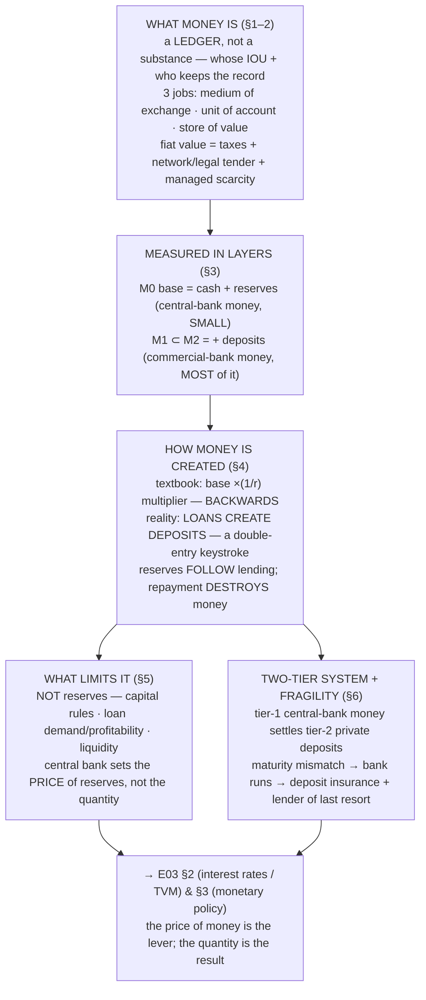

# E03 · §1 — What Money Is, and How Banks Create It

> **Subject:** Economy & Finance *(hobby track)*
> **Module:** E03 — Money, Banking & Monetary Policy
> **Section:** The opener of the module where most economic-policy news lives. Everything in E02 treated
> "the economy" in real terms — output, jobs, prices — and money mostly appeared as the *thing prices are
> measured in* (§2's price level). This section goes one layer beneath that: **what money actually is**
> (a social technology, not a thing), **the forms it has taken** and why an intrinsically worthless token
> holds value, **how we measure it** (the monetary aggregates), and — the payoff — **where money comes
> from.** The headline is the one you half-derived yourself back in E02 §2 §9b: **most money is not printed
> by the government; it is created by ordinary commercial banks, out of nothing, every time they make a
> loan.** We build the textbook "money multiplier" story first, then show *why it is backwards*, and land on
> the modern **endogenous / credit-money** picture. It ends pointing straight at **§2 (interest rates)** and
> **§3 (monetary policy)** — because once you see that banks create money by lending, the central bank's job
> becomes obvious: it doesn't ration the *quantity* of money, it sets its *price*.
> **Status:** 🔵 **body drafted 2026-07-07.** Awaiting our live session (→ §10 Applied on finalize). The
> body is written to be read on its own; bring questions and the section we'll turn it into a discussion the
> way we did E02.
> Math in LaTeX, quantitative relationships drawn as real curves, key terms glossed in 中文 (大陆/台灣), per
> [`../../../agent-docs/authoring-conventions.md`](../../../agent-docs/authoring-conventions.md).

**Estimated study time:** 1.5–2 hours including reflection.
**Prerequisites:** E02 §2 (the **price level**, inflation, real-vs-nominal, and especially your §9b thread
where you reconstructed **credit money** and the demand-gap loop from scratch — this section *is* the
mechanism under that intuition) and a nodding acquaintance with E01 §2 (supply/demand) and E02 §1 (GDP as a
*flow*, wealth as a *stock*). No new maths beyond a geometric series you've already met (the §4 multiplier).

---

## Why this section exists (for *you*)

Two reasons, one conceptual and one you flagged yourself.

**The conceptual one.** Almost every piece of economic-policy news — "the Fed hiked rates," "the ECB is
doing QE," "M2 is shrinking," "the banks are pulling back on lending," "a bank run took down SVB" — is a
statement about *money and who controls it*. You cannot judge any of it without a correct model of what
money is and how it comes into being. And the correct model is genuinely **counter-intuitive**: the thing
most people (and, embarrassingly, many older textbooks) believe about money creation is wrong in a way that
changes how you read the news. Getting this right is the single highest-leverage hour in the whole macro
half of the course.

**The one you flagged.** In E02 §2 §9b you built, unprompted, a "money-loop + steady-state" model and in
doing so **reinvented endogenous money** — the idea that money is created *inside* the private economy by
credit, not just dropped in by the state. You were right, and it's not a fringe view: it's the position the
**Bank of England** put in writing in 2014 to correct the textbooks. This section pays that off: it names
the thing you derived, shows you the balance-sheet mechanics, and then draws out the consequence you were
already circling — that if banks create money by lending, then **debt and the money supply are two sides of
one coin**, which is exactly why credit cycles (E02 §4 §10a's "negative damping") are so central to
macro-fragility.

It serves **Goal 2 (understand economic policy)** above all, and **Goal 1 (read the news)**. It is
deliberately the *first* section of E03 because interest rates (§2), the standard central-bank model (§3),
and Singapore's unusual exchange-rate model (§4) are all *operations on the thing this section defines.*

> **One framing to hold:** money is not a *substance*, it is a *ledger*. Ask not "what is this token made
> of?" but "**whose promise is it, and who keeps the record?**" Every form of money — a gold coin, a dollar
> bill, the number in your bank app — is an entry in *someone's* accounts saying *someone owes you*.
> Everything below is about *whose* IOU counts as money, and *who is allowed to write new IOUs into
> existence.*

---

## 1. What money is — three jobs, and the problem it solves

Economists don't define money by what it's made of. They define it **functionally**: money is *whatever
does these three jobs* in an economy.

1. **Medium of exchange.** It is accepted in trade, so you don't have to barter. This is the job that
   *solves a real problem* (below) and the one that makes something "money" in the first place.
2. **Unit of account.** It is the *ruler* prices are quoted in — the common denominator that lets you
   compare a coffee, a haircut, and a car on one scale. (This is the role money played all through E02: the
   price level in §2 is "how many units of account per basket.")
3. **Store of value.** It holds purchasing power over time, so you can sell today and buy later. It need not
   be a *good* store of value — inflation (§2) erodes it — only good *enough* over the horizon you hold it.

**The problem money solves: the double coincidence of wants.** In pure **barter**, a trade requires that I
have what you want *and* you have what I want, *at the same time*. A baker who wants shoes must find a
cobbler who happens to want bread — today. As the number of goods grows, the number of possible pairwise
"exchange rates" explodes (with $n$ goods there are $\frac{n(n-1)}{2}$ relative prices to keep track of),
and most desired trades simply never find a counterparty. Money dissolves this: everyone accepts money, so
every trade becomes two easy half-trades — sell your bread *for money*, buy shoes *with money* — and with
$n$ goods there are just $n$ prices, one per good in money terms. Money is, first and last, a
**coordination technology** that collapses an $O(n^{2})$ matching problem to an $O(n)$ one.

*The **double coincidence of wants**: the baker has bread and wants shoes, but the cobbler wants a chicken, not bread — so the trade dies. Money dissolves this by being what *everyone* accepts. — Illustration, generated locally (ComfyUI + Z-Image Turbo).*

Image prompt (source of truth)

> Stylized conceptual illustration of an ancient open-air barter marketplace: in the foreground a baker
> holding a loaf of bread looks frustrated facing a cobbler who holds up shoes and gestures refusal while
> pointing at a live chicken he wants instead; other traders barter assorted goods in the background stalls;
> warm earthy palette, clean minimalist flat vector illustration style, soft daylight, sense of trades that
> cannot find a matching partner, no text, no words, no labels, high detail

> **Which job is primary?** There's a genuine live debate. The textbook (and Adam Smith) story is that money
> emerged from barter to grease *exchange* — medium of exchange first. Anthropologists and the "credit
> theory of money" (Innes; later Graeber) argue the opposite: careful study finds **no evidence of a
> barter economy that then invented money** — instead early societies ran on *credit and debt records*
> (unit of account first, "you owe me three bushels" tracked on a tablet), and coins came later. You don't
> have to settle this, but it foreshadows the whole section: **money looks less like a commodity that got
> adopted and more like a ledger of who-owes-whom that got standardized.**

**A useful property list (what makes a *good* medium of exchange).** Durable, portable, divisible,
uniform/fungible, recognizable, and — the subtle one — **limited in supply** (if anyone could make it
freely it couldn't store value; §2's inflation is what happens when supply outruns this). Gold scored well
on all six for millennia, which is *why* it kept getting chosen — not magic, just a good fit to the spec.

---

## 2. The forms money has taken — and why a worthless token has value

Money has moved through three broad regimes, each a step further from "intrinsic value" and further into
"pure ledger." Reading the progression is the fastest way to understand *why* today's money works.

- **Commodity money.** The money-thing *is* a valuable commodity: gold and silver coins, but also cattle,
  salt, cowrie shells, cigarettes in a POW camp. Its value is (roughly) its value as a commodity. Clunky —
  heavy, assay-able, supply set by mining luck.
- **Representative money.** A paper claim *redeemable* for a fixed amount of the commodity — "this note is
  payable in gold on demand." The paper is convenient; the value still ultimately rests on the metal in a
  vault. The classical **gold standard** (and Bretton Woods, 1944–71, where the dollar was gold-backed and
  other currencies pegged to the dollar) worked this way.
- **Fiat money.** A token declared money **by decree** (*fiat* = "let it be"), redeemable for *nothing* —
  not gold, not anything. Every major currency today is fiat, and has been since the US closed the gold
  window in **1971** (the "Nixon shock"). A dollar bill is a promise redeemable only for… another dollar.

This raises the question that trips up almost everyone: **if a fiat dollar is backed by nothing, why is it
worth anything at all?** Three reinforcing answers, in rough order of importance:

1. **Taxes create a baseline demand (the "chartalist" / MMT-adjacent point).** The government will accept
   *its own* currency — and *only* its own currency — in payment of taxes, and it can compel you to pay
   taxes. That alone forces a standing, economy-wide demand to acquire the stuff. You need dollars because
   the tax collector needs dollars. This is the most robust leg: it doesn't rely on anyone's good opinion.
2. **Legal tender + the network effect (a self-fulfilling equilibrium).** It's declared valid for settling
   debts, and — more powerfully — **everyone else accepts it, so you accept it too.** Money's value is a
   coordination equilibrium (E01's logic): I take dollars because I'm confident the next person will. This
   is why money is *fragile in principle but stable in practice* — and why a loss of confidence
   (hyperinflation, §2) can make a currency collapse *fast*, as the equilibrium flips.
3. **Managed scarcity + institutional trust.** A credible, reasonably independent central bank that keeps
   supply from exploding (§3, and the ≈2% target of §2) preserves the store-of-value job well enough to keep
   people holding it. The value is *manufactured and maintained*, not intrinsic.

> **The reframe that makes it click (and sets up §4).** Fiat money's value doesn't come from a commodity —
> it comes from being **the top of a hierarchy of promises that everyone has agreed to settle in.** That's
> not a weakness to be embarrassed about; it's what money *is*. Which means the natural next question isn't
> "what backs it?" but "**who is allowed to issue it, and whose promises count?**" — and the surprising
> answer to *that* is §4: it isn't only the state.

---

## 3. Measuring money — the monetary aggregates

If money is "whatever does the three jobs," then *how much* money is there? The answer depends on where you
draw the line between "money" and "merely money-like," so central banks publish several **monetary
aggregates**, nested from narrowest to broadest:

- **M0 / the monetary base ("high-powered money").** The stuff the **central bank** itself issues:
  **physical currency** (notes and coins) in circulation **plus commercial banks' reserves** held at the
  central bank. This is the *only* money the state creates directly. Hold this thought — it's small.
- **M1 — narrow money.** Currency in the hands of the public **plus** the deposits you can spend
  immediately: **chequing / current accounts** and (since a 2020 US redefinition) savings accounts. This is
  "money you can pay with today."
- **M2 — broad money.** M1 **plus** less-liquid but still-money-ish balances: small time deposits,
  retail money-market funds. This is the aggregate most economists watch as "the money supply."

<!-- FIGURE -->
![A nested/stacked bar chart of the US money aggregates (approximate 2024 values). A tall bar for M2 (about 21 trillion dollars) with M1 nested inside it (about 18 trillion) and the monetary base M0 (about 5.6 trillion) shown separately and much shorter; within M0, a slice for physical currency (about 2.3 trillion) and a larger slice for bank reserves (about 3.3 trillion). An annotation highlights that only the small M0 bar is created by the central bank, while the gap between M0 and M2 — the great majority of all money — is commercial-bank deposits created by private lending](diagrams/01-money-and-bank-credit-fig1.svg)

Two facts from that picture do a lot of work:

- **The base is small; broad money is large.** Central-bank money (M0) is a *minority* of the money supply.
  The great bulk of what you and firms actually hold and spend — the M2-minus-M0 gap — is **deposits at
  commercial banks**, i.e. money the *private banking system* created. In round numbers, well over 80% of
  the money supply is bank deposits, not government cash.
- **Physical cash is a sliver.** The notes-and-coins slice of M0 is tiny next to total money. Money is
  overwhelmingly **digital ledger entries**, not paper — which is exactly what the "money is a ledger"
  framing predicts.

The ratio that connects the layers — broad money divided by the base, $M2 / M0$ — used to be called the
**money multiplier**, and the old story said the central bank controls M0 and a stable multiplier does the
rest. §4 is where we build that story and then take it apart. (Spoiler from the data: that ratio is *not*
stable — it collapsed after 2008 — which is the first clue the story is wrong.)

> **Reading the news.** When a headline says "**M2 grew 3% year-on-year**" it's talking about broad money —
> mostly bank deposits — and it's a rough read on how much lending and spending power is sloshing around.
> "**The Fed expanded its balance sheet**" (QE) is about M0/reserves — a *different* layer, and one whose
> link to M2 turns out to be much weaker than people assume. Keeping the layers straight is half of reading
> monetary-policy coverage correctly.

---

## 4. Where money comes from — the money multiplier, and why it's backwards

Here is the heart of the section. We'll tell the story the way the old textbooks do — the **money
multiplier** — because it's the story most people carry and you need to recognize it. Then we'll show why
the **causation runs the other way**, and land on the modern picture: **loans create deposits.**

### 4a. The textbook story: fractional-reserve banking and the money multiplier

Banks don't keep all your deposits in the vault; they keep a **fraction** as reserves and lend the rest out.
That's **fractional-reserve banking**. The textbook then chains it up:

Suppose the reserve ratio is $r = 0.10$ (banks keep 10% of deposits as reserves) and the central bank
injects 1000 dollars of new reserves by buying a bond from you, which you deposit at Bank A.

- Bank A keeps 100 (10%) and lends **900**. That 900 gets spent and redeposited at Bank B.
- Bank B keeps 90 and lends **810**. Redeposited at Bank C.
- Bank C keeps 81 and lends **729**. …and so on.

The total new deposits are a **geometric series** — the *same maths as the spending multiplier* you met in
E02 §4:

$$\Delta D = 1000 \times (1 + 0.9 + 0.9^{2} + 0.9^{3} + \cdots) = 1000 \times \frac{1}{1 - 0.9} = 10{,}000.$$

<!-- FIGURE -->

In general the **deposit (money) multiplier** is

$$\Delta D = \frac{\Delta R}{r}, \qquad \text{multiplier} = \frac{1}{r}.$$

With $r = 0.10$, one dollar of base becomes ten dollars of deposits. The story's punchline: the central
bank controls the base $\Delta R$, the reserve ratio $r$ is fixed by regulation, so the central bank
controls the money supply, and banks are passive intermediaries that "lend out reserves." Clean, memorable,
and **wrong as a description of how banks actually work.**

### 4b. The reveal: loans create deposits (endogenous money)

Watch what actually happens on a bank's balance sheet when it makes a loan. A bank does **not** wait to
receive your deposit and then shovel your cash to a borrower. When it approves a mortgage, it simply
**writes two new numbers into its own ledger at the same instant**:

**Bank's balance sheet — before the loan**

| Assets | Liabilities |
|---|---|
| Reserves 100 | Deposits 100 |

**Bank's balance sheet — after making a 500 loan**

| Assets | Liabilities |
|---|---|
| Reserves 100 | Deposits **600** |
| **Loan to borrower 500** | |

The borrower's new deposit of 500 (a liability — the bank owes it to the borrower) is created *by the very
act* of recording the loan (an asset — the borrower owes the bank). **No pre-existing money was moved. New
money — the 500 deposit — was created from nothing, by a double-entry keystroke.** This is the sense in
which your E02 §2 §9b intuition was exactly right: money is *credit*, conjured by lending.

<!-- FIGURE -->
![A before-and-after balance-sheet diagram of a single bank. On the left, "before": a short pair of stacked bars, assets (reserves) equal to liabilities (deposits). On the right, "after making a loan": both the asset side and the liability side have grown by the loan amount simultaneously — a new "loan" block added to assets and a new "deposit" block added to liabilities — with an arrow and caption emphasizing that both sides expand together, so new money (the deposit) is created at the moment the loan is recorded, not transferred from anywhere](diagrams/01-money-and-bank-credit-fig3.svg)

So which is right — the multiplier or "loans create deposits"? **The multiplier gets the causation
backwards.** The real sequence, confirmed by the **Bank of England** in its landmark 2014 bulletin *"Money
creation in the modern economy,"* is:

- A creditworthy borrower **demands** a loan and the bank judges it profitable → the bank makes the loan and
  **creates the deposit first**.
- The bank then acquires whatever **reserves** it needs *afterward* — from other banks in the interbank
  market, or from the central bank — to meet settlement and any reserve requirement. **Reserves follow
  lending; they don't precede it.**
- The central bank, committed to a **price** (a policy interest rate, §2/§3), supplies whatever reserves the
  system needs *at that price*. It does **not** ration the quantity of base money to control lending.

In other words the multiplier's arrow — *base → (×1/r) → deposits* — actually runs **deposits → reserves**.
The $M2/M0$ ratio is a *ratio you can compute after the fact*, not a *lever the central bank pulls*. Calling
it "the multiplier" invites you to read a mechanism into an accounting identity.

> **The single cleanest piece of evidence.** After 2008, central banks flooded the system with reserves via
> **quantitative easing** — the monetary base (M0) exploded severalfold. If the multiplier story were true,
> broad money should have exploded too and inflation with it. It didn't: M2 grew only modestly and inflation
> stayed *below* target for a decade. The mechanical link between base and broad money **simply wasn't
> there** — because banks were never "lending out reserves" in the first place. §5's Fig 4 shows the
> multiplier ratio collapsing exactly then.

### 4c. Money is destroyed, too

The symmetry matters and it's easy to miss: **when a loan is repaid, that money is destroyed.** The borrower
hands 500 of deposits back to the bank; the bank cancels the loan (asset −500) and extinguishes the deposit
(liability −500). Both sides of the balance sheet shrink; the 500 of money simply *ceases to exist*. So the
money supply is a **stock** that is constantly being topped up by new lending and drained by repayment. This
is why the money supply and the credit cycle are the *same phenomenon*: a **credit boom** *is* money being
created faster than it's destroyed; a **credit crunch / deleveraging** (E02 §4 §10a) *is* the money supply
contracting as loans are repaid and not renewed — a direct channel from finance to the demand gap you built
in E02.

---

## 5. If not reserves, what *does* limit money creation?

If a bank can create a deposit with a keystroke, why doesn't it create infinite money? Because it faces four
real, binding constraints — and understanding them is understanding what monetary policy (§3) actually
operates on. Reserve requirements are conspicuously **not** the main one (many countries — Canada, the UK,
the euro area — have **no** reserve requirement, and the US cut its to **zero in March 2020**, yet banks
didn't create infinite money).

1. **Profitability and loan demand — the real throttle.** A loan is only worth making if the interest earned
   beats the bank's cost of funding it *and* the expected default losses. So lending is limited by the
   supply of **creditworthy borrowers who want to borrow** at the going rate, and by the **price of
   funding** — which the central bank sets. Raise the policy rate (§2/§3) and fewer loans clear the
   profitability bar; lending (and money creation) slows. This is *the* transmission lever, and it's a
   **price, not a quantity.**
2. **Capital requirements (the constraint that actually bites).** A bank must fund a fraction of its assets
   with its own **equity/capital**, not debt — the Basel rules set a minimum ratio of capital to
   risk-weighted assets. Each new loan is a risk-weighted asset, so it consumes scarce capital. This, far
   more than reserves, caps how much a bank can lend. (Note the distinction you'll want to keep: **reserves**
   are an *asset* the bank holds for liquidity/settlement; **capital** is how the bank is *funded* on the
   liability/equity side, a buffer against losses. Confusing the two is the most common error in this area.)
3. **Liquidity and settlement.** When a borrower spends the new deposit, it usually flows to a *different*
   bank, and our bank must settle by transferring **reserves** to that bank. So a bank that lends far more
   aggressively than its peers will haemorrhage reserves and must borrow them (at the policy rate) or attract
   deposits. Reserves discipline lending — but as a *cost/liquidity* constraint priced by the central bank,
   not as a fixed multiplier.
4. **Solvency and prudential regulation.** Bad loans destroy capital and can trigger a run (§6). Regulators,
   internal risk limits, and the fear of insolvency all cap the pace and riskiness of lending.

> **The one-sentence version to carry into §3.** Banks create money by lending, constrained by
> **capital, profitability, and liquidity** — and the central bank steers the whole process not by
> controlling the *quantity* of money but by setting the **price of reserves (the interest rate)**, which
> changes how many loans are worth making. That is why §2 is about interest rates and §3 is about the policy
> rate: **the price of money is the lever; the quantity is the result.**

---

## 6. The two-tier system, trust, and fragility

Pulling §§2–5 together gives the actual architecture of a modern monetary system: **two tiers of money,
issued by two kinds of institution, sitting in a hierarchy of promises.**

- **Tier 1 — central-bank money (the base, M0).** The state's IOU: physical cash (a claim on the central
  bank) and **reserves** (electronic central-bank money that only banks can hold). This is the ultimate
  settlement asset — the top of the hierarchy, riskless in nominal terms because the issuer can always
  create more.
- **Tier 2 — commercial-bank money (deposits).** *Your* bank's IOU to *you*. The number in your banking app
  is **not** central-bank money and **not** cash in a vault — it is a **promise by a private company to pay
  you central-bank money on demand.** Banks make the two tiers *feel* identical by promising 1-for-1
  convertibility (an ATM turns a deposit into cash; a transfer settles in reserves), and that promise is
  what lets private IOUs circulate as money.

Here is the fragility built into that design, and it's the source of most banking drama in the news:

**Maturity transformation → bank runs.** A bank funds **long-term, illiquid** assets (a 30-year mortgage)
with **short-term, on-demand** liabilities (deposits you can withdraw anytime). This *maturity mismatch* is
useful — it's how savings get channelled into long-lived investment — but it means **no bank can honour all
its deposits at once**; the money has been lent out and can't be recalled instantly. If enough depositors
demand cash simultaneously — a **bank run** — even a solvent bank fails, because it's *illiquid*, not
necessarily broke. Worse, a run is itself a coordination failure (E01/E02 §4): the rational move, *if you
fear others will run*, is to run first. That self-fulfilling logic is why runs are fast and contagious.

Two institutions exist precisely to break that bad equilibrium — and they're monetary-policy vocabulary you
now own:

- **Deposit insurance** (the FDIC in the US, up to a cap; SDIC in Singapore) removes the *reason* for small
  depositors to run: your insured deposit is safe regardless, so you don't rush the door.
- **The lender of last resort** — the central bank lends freely against good collateral to a bank facing a
  run (Bagehot's rule: *lend freely, against good collateral, at a penalty rate*), turning illiquid assets
  into reserves so the bank can meet withdrawals. This is one of the central bank's oldest jobs, older than
  inflation targeting.

> **The live case (2023).** **Silicon Valley Bank** is the textbook made real. It had taken deposits (mostly
> **uninsured**, above the FDIC cap — tech firms with big balances) and bought long-dated bonds. When rates
> rose (§2), those bonds lost market value; when a few large depositors noticed and moved to withdraw, the
> rest — knowing they were uninsured and watching each other — ran, and *digital, instant* withdrawals made
> it the fastest run in history. SVB was arguably solvent-if-held-to-maturity but fatally **illiquid**. It
> shows every piece of this section at once: maturity transformation, the uninsured-depositor coordination
> trap, the interest-rate/bond-price link (a §2 preview), and the lender-of-last-resort response.

**The frontier debate (why this section is current).** If most money is private bank IOUs, should it be?
Three live proposals worth recognizing in the news: **central bank digital currencies (CBDCs)** — giving the
public direct access to *tier-1* digital money (China's e-CNY is the largest live experiment); **stablecoins**
— privately issued tokens promising 1-for-1 redemption in dollars, i.e. a *new* tier-2 issuer competing with
banks, and a live regulatory fight over whether they're "money," securities, or a bank in disguise; and
**narrow banking / full-reserve banking** — the proposal to *end* money creation by private banks entirely
(100% reserves), which resurfaces after every crisis. You don't need positions on these; you need to see
that they're all arguments about the *same two questions this section answered*: **whose IOU counts as
money, and who is allowed to create it.**

---

## 7. The one-page mental model

<!-- DIAGRAM:START -->

Diagram source (Mermaid)

<!-- DIAGRAM:END -->

**The eight things to remember:**
1. **Money is a ledger of promises, not a substance** — the question is always *whose IOU is it, and who
   keeps the record?* Its three jobs: medium of exchange, unit of account, store of value.
2. **Money solves the double-coincidence-of-wants problem** — it collapses barter's $O(n^{2})$ matching to
   $O(n)$ prices. It's a coordination technology.
3. **Fiat money has value** from **taxes** (you must pay them in it), the **network/legal-tender**
   equilibrium (everyone accepts it), and **managed scarcity** (a credible central bank) — *not* from any
   backing commodity.
4. **Money comes in nested layers:** M0 (base = cash + reserves, central-bank money, *small*) ⊂ M1 ⊂ M2
   (broad money, *mostly commercial-bank deposits*). Over 80% of money is private bank deposits.
5. **The money multiplier is backwards.** Banks don't lend out reserves; **loans create deposits** — new
   money conjured by a double-entry keystroke (Bank of England, 2014). Reserves *follow* lending. Repaying a
   loan *destroys* money.
6. **Reserves are not the binding constraint** (many countries require zero). Lending is limited by
   **capital requirements, loan demand/profitability, and liquidity** — and steered by the **price** of
   reserves, the interest rate.
7. **Two-tier system:** tier-1 central-bank money settles tier-2 private deposits; the 1-for-1 convertibility
   promise is what lets private IOUs circulate as money.
8. **Maturity transformation makes banks fragile** — no bank can pay all deposits at once, so **bank runs**
   (a coordination failure) are always possible; **deposit insurance** and the **lender of last resort**
   exist to break that bad equilibrium (SVB 2023).

---

## 8. Check your understanding

Reason first, then check against a source where noted.

1. **Barter vs money.** In a village with 6 goods and no money, how many distinct relative prices ("how much
   of X per Y") must everyone track? With money? Write the general formula and say in one sentence what job
   of money this illustrates.
2. **Why is a dollar worth anything?** A friend says "the dollar is backed by nothing, so it's basically a
   confidence trick that could collapse any day." Give the *strongest* correction using the three sources of
   fiat value — and identify which of the three is *least* dependent on other people's opinions.
3. **The multiplier, and why it misleads.** With a reserve ratio of $r = 0.05$, what is the textbook money
   multiplier, and how much broad money does a 200-dollar reserve injection "create" in the old story? Then
   state, in two sentences, *why* this calculation describes an accounting ratio rather than the actual
   causal mechanism.
4. **Loans create deposits — the T-account.** A bank with reserves 200 and deposits 200 makes a new
   1,000 business loan. Write its balance sheet immediately after. Where did the 1,000 of new money come
   from, and what happens to the money supply when the firm eventually repays?
5. **The QE puzzle — predict then check.** After 2008 the Fed's balance sheet (the monetary base) grew
   several-fold, yet inflation stayed below 2% for years. Explain why, using §4b. Then look up a **FRED**
   chart of `M2SL` divided by `BOGMBASE` (the money multiplier ratio) and confirm what happened to it after
   2008.
6. **Reserves vs capital.** In one or two sentences each, distinguish a bank's **reserves** from its
   **capital**, and say which one is the tighter constraint on how much a bank can lend today — and why the
   fact that the US reserve requirement is *zero* (since 2020) supports your answer.
7. **Anatomy of a run.** Explain why even a *solvent* bank can be killed by a bank run, using the phrase
   "maturity transformation." Then name the two institutions that exist to prevent runs and, for each, say
   *which part* of the run's logic it defeats. Bonus: what made SVB 2023 especially run-prone?
8. **Money destruction.** True or false, with reasoning: "If every loan in the economy were repaid tomorrow
   and no new loans made, the broad money supply would shrink dramatically." What does this tell you about
   the relationship between debt and money?

---

## 9. Optional: see the two-tier system on live data (15–20 min)

- **The aggregates and the multiplier.** On [FRED](https://fred.stlouisfed.org), plot **M2** (`M2SL`) and
  the **monetary base** (`BOGMBASE`) on the same chart, then plot their **ratio** (`M2SL/BOGMBASE`). Watch
  the ratio — the "money multiplier" — *collapse* after 2008 and again in 2020. That collapse is §4b's
  central evidence that banks don't mechanically lend out reserves.
- **How much money is cash?** Plot **currency in circulation** (`CURRCIR`) against **M2**. The gap is how
  much of "money" is bank deposits rather than physical cash — the §3 point, live.
- **Bank credit = money creation.** Plot **bank credit / loans and leases** (`TOTLL` or `TOTBKCR`) alongside
  M2. When banks lend more, broad money rises — the §4 mechanism visible in the data.
- **A run, in one series.** Look up **SVB March 2023**: FRED's `DPSACBW027SBOG` (deposits at commercial
  banks) shows the system-wide deposit wobble; pair it with the Fed's emergency **BTFP** facility (the
  lender-of-last-resort response, §6).

Bring one chart to our session and we'll run the money story on it — is broad money expanding or
contracting, is that lending or base, and what would that imply the central bank should do — the way we ran
the labour market on the 2026 Fed (E02 §3) and the cycle on the AI capex boom (E02 §4).

---

## Key terms — English · 中文（中国大陆 / 台灣）

So the concepts carry over to Chinese-language economic news. Most differences are just **simplified vs
traditional script**; **⚠ marks a genuine terminology difference** between Mainland China (大陆) and Taiwan
(台灣) that you'd actually trip over.

**What money is**

| English | 中国大陆 (简体) | 台灣 (繁體) | Note |
|---|---|---|---|
| Money | 货币 | 貨幣 | the general term (not 钱, which is colloquial "cash/money") |
| Medium of exchange | 交换媒介 | 交換媒介 | the job that solves barter |
| Unit of account | 记账单位 | 計價單位（記帳單位）| ⚠ TW often **計價單位**; the price ruler |
| Store of value | 价值储藏 | 價值儲藏 | holds purchasing power over time |
| Barter | 物物交换 | 以物易物 | ⚠ 大陆 **物物交换** vs 台灣 **以物易物** |
| Fiat money | 法定货币（法币）| 法定貨幣（法幣）| value by decree, backed by nothing |
| Commodity money | 商品货币 | 商品貨幣 | value = its commodity value |
| Gold standard | 金本位 | 金本位 | representative money, redeemable in gold |
| Legal tender | 法定货币（法偿）| 法定貨幣（法償）| ⚠ 偿 ↔ 償; valid to settle debts |

**Measuring & creating money**

| English | 中国大陆 (简体) | 台灣 (繁體) | Note |
|---|---|---|---|
| Money supply | 货币供应量 | 貨幣供給（額）| ⚠ 供应 ↔ 供給; M1/M2 etc. |
| Monetary base | 基础货币 | 基礎貨幣（準備貨幣）| M0; cash + reserves |
| Broad money | 广义货币 | 廣義貨幣 | M2 |
| Narrow money | 狭义货币 | 狹義貨幣 | M1 |
| Bank reserves | （银行）准备金 | （銀行）準備金 | central-bank money banks hold |
| Reserve ratio | 存款准备金率 | 存款準備率 | the $r$ in the multiplier |
| Fractional-reserve banking | 部分准备金银行制度 | 部分準備金制度 | keep a fraction, lend the rest |
| Money multiplier | 货币乘数 | 貨幣乘數 | ⚠ 乘数 ↔ 乘數; the (backwards) $1/r$ |
| Deposit | 存款 | 存款 | a bank's IOU to you |
| Loan / credit | 贷款／信贷 | 貸款／信用 | ⚠ 信贷 ↔ 信用; loans create deposits |
| Endogenous money | 内生货币 | 內生貨幣 | money created inside the economy by credit |

**Banking system & fragility**

| English | 中国大陆 (简体) | 台灣 (繁體) | Note |
|---|---|---|---|
| Central bank | 中央银行（央行）| 中央銀行（央行）| issuer of tier-1 money |
| Commercial bank | 商业银行 | 商業銀行 | issuer of tier-2 deposit money |
| Balance sheet | 资产负债表 | 資產負債表 | assets = liabilities + equity |
| Assets / liabilities | 资产／负债 | 資產／負債 | a loan is an asset, a deposit a liability |
| Capital (equity) | 资本（权益）| 資本（權益）| the binding constraint, not reserves |
| Maturity transformation | 期限转换 | 期限轉換 | long assets funded by short deposits |
| Bank run | 银行挤兑 | 銀行擠兌 | ⚠ 挤兑 ↔ 擠兌; the coordination failure |
| Deposit insurance | 存款保险 | 存款保險 | removes the reason to run |
| Lender of last resort | 最后贷款人 | 最後貸款人 | central bank lends against collateral |
| Quantitative easing (QE) | 量化宽松 | 量化寬鬆 | ⚠ 宽松 ↔ 寬鬆; base ballooned, M2 didn't |
| Central bank digital currency | 央行数字货币 | 央行數位貨幣 | ⚠ 数字 ↔ 數位 (digital); e.g. e-CNY |
| Stablecoin | 稳定币 | 穩定幣 | a private tier-2 competitor |

> Recurring genuine splits to memorize: **供应 ↔ 供給** (supply), **信贷 ↔ 信用** (credit), **挤兑 ↔ 擠兌**
> (bank run), **宽松 ↔ 寬鬆** (easing), **数字 ↔ 數位** (digital), **物物交换 ↔ 以物易物** (barter).

---

## References (optional, for depth)

- **The one to actually read:** Bank of England Quarterly Bulletin 2014 Q1, **"Money creation in the modern
  economy"** — the central bank itself laying out *loans-create-deposits* and dismantling the money
  multiplier, in plain English. The single best source for this section.
  https://www.bankofengland.co.uk/quarterly-bulletin/2014/q1/money-creation-in-the-modern-economy
- Bank of England, **"Money in the modern economy: an introduction"** (2014 Q1) — the companion piece on
  *what money is* (the three functions, the two tiers).
  https://www.bankofengland.co.uk/quarterly-bulletin/2014/q1/money-in-the-modern-economy-an-introduction
- *Naked Economics* — Charles Wheelan, the chapters on money and the Federal Reserve — the friendliest prose.
  https://wwnorton.com/books/Naked-Economics
- Khan Academy — Macroeconomics, the **"Financial sector"** unit (banking, the money supply, the multiplier —
  note it still teaches the multiplier as causal; read it *against* the BoE piece).
  https://www.khanacademy.org/economics-finance-domain/macroeconomics
- *CORE Econ — The Economy 2.0*, **Unit 10 "Banks, money, and the credit market"** — a rigorous, free
  treatment that gets the endogenous-money story right, with real data.
  https://www.core-econ.org/the-economy/
- **On what money is (the deep version):** Felix Martin, *Money: The Unauthorised Biography* — the "money is
  a social technology / ledger" thesis, very readable. And for the credit-theory-of-money origin debate,
  David Graeber, *Debt: The First 5,000 Years*.
- **Live data to practise on:** **FRED** (https://fred.stlouisfed.org) — `M2SL`, `BOGMBASE`, `CURRCIR`,
  `TOTLL`; and search **"Silicon Valley Bank"** for the 2023 run and the **BTFP** facility.

---

### What's next
🔵 **Body drafted 2026-07-07 — opens Module E03 (Money, Banking & Monetary Policy).** With money defined (a
ledger of promises), measured (the nested aggregates), and — the payoff — *created by bank lending* rather
than printed by the state, you now hold the object that all of monetary policy operates on. The deliberate
bridges point straight ahead: because banks create money by lending and the central bank steers it by
**price**, the natural next question is *how that price is set and what it means* — which is **E03 §2
(interest rates & the time value of money)**, where the "penalty rate," the "policy rate," and the **yield
curve** (the E02 §4 §6 recession signal) all get built properly; then **E03 §3** puts the central bank's hand
on that lever (rate-setting, inflation targeting, QE — now that you know *why* QE didn't do what the
multiplier predicted); and **E03 §4** contrasts it all with Singapore's unusual exchange-rate-based model.
After our live session this section gets its **§10 Applied** and flips to ✅.
