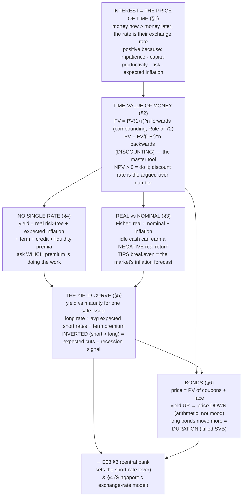

# E03 · §2 — Interest Rates & the Time Value of Money

> **Subject:** Economy & Finance *(hobby track)*
> **Module:** E03 — Money, Banking & Monetary Policy
> **Section:** The second section of the module. §1 ended on a promise: banks create money by lending, and
> the central bank does not ration the *quantity* of money — it sets its **price**. This section is about
> that price. We build the idea that **interest is the price of time** (money now is worth more than the
> same money later), turn it into the single most useful quantitative tool in all of finance — the **time
> value of money** (present value, discounting, compounding) — and then use it to understand the things you
> actually meet in the news: **real vs nominal rates** (the Fisher equation), why there is **no single
> interest rate** but a whole structure of them, the **yield curve** and why its *inversion* is the market's
> favourite recession signal (the cliffhanger from E02 §4 §6), and why **bond prices fall when yields rise**
> (the mechanism that killed SVB in §1 §6). It sets up **§3** (the central bank's hand on the short-rate
> lever) and **§4** (Singapore's exchange-rate model).
> **Status:** 🔵 **body drafted 2026-07-21.** Awaiting our live session → a **§10 Applied** will be added on
> finalize (as in every prior section).
> Math in LaTeX, quantitative relationships drawn as real curves, key terms glossed in 中文 (大陆/台灣), per
> [`../../../agent-docs/authoring-conventions.md`](../../../agent-docs/authoring-conventions.md).

**Estimated study time:** 1.5–2 hours including reflection.
**Prerequisites:** E03 §1 (money as a ledger; the central bank sets the *price* of reserves, not the
quantity), E02 §2 (the **price level** and inflation — you will need real-vs-nominal again here), E02 §4 §6
(the yield curve was flagged there as a **leading indicator** — this section explains *why*), and a comfort
with the geometric series and the exponential $e^{x}$ (you have both). No new maths, just one formula used
relentlessly.

---

## Why this section exists (for *you*)

Interest rates are the **most-watched number in the economy**, and for a reason that §1 made precise: since
banks create money by lending and the central bank steers the system by **price**, the interest rate *is*
the throttle on money, credit, and spending. "The Fed hiked 25 basis points," "mortgage rates hit 7%," "the
yield curve inverted," "bond markets sold off" — every one of these is a statement about *the price of
time*, and you cannot read them without the toolkit below.

But the deeper reason is that the **time value of money is the load-bearing idea of all of finance**, and
it serves **three of your four goals at once**:

- **Goal 3 (digest financial reports)** and **Goal 4 (investing):** every valuation — a stock, a bond, a
  project, a company — is ultimately "what are its future cash flows *worth today*?" That is one operation,
  **discounting**, applied over and over. Master it here and the later modules (E06 bonds, E08 valuation,
  E09 compounding) are variations on a theme you already own.
- **Goal 2 (policy)** and **Goal 1 (news):** the *structure* of rates — short vs long, safe vs risky, real
  vs nominal — is how the market prices its collective forecast of growth, inflation, and risk. The **yield
  curve** is that forecast made visible, which is why an *inverted* one has preceded almost every US
  recession.

One framing to carry the whole way through:

> **Interest is a price, and time is the good being priced.** A dollar today and a dollar next year are
> *different goods* — like coffee-today and coffee-next-year — and the interest rate is their exchange rate.
> Everything below (discounting, the yield curve, bond prices) is just working out the consequences of that
> one sentence. It is the same "price coordinates a market" logic from E01 §2, applied across *time* instead
> of across *goods*.

---

## 1. Interest: the price of time

Offer someone 1000 dollars now or 1000 dollars in a year, and everyone takes it now. So to persuade you to
*wait*, a borrower must pay you extra — that extra is **interest**, and the **interest rate** is the extra
expressed as a fraction per period. A 5% annual rate means 1000 dollars lent today is repaid as 1050 a year
later. Interest is simply **the price a borrower pays for the use of money over time** — equivalently, the
reward a lender earns for *not* spending now.

Why is that price (almost always) **positive**? Four reinforcing reasons, worth separating because they map
onto the four premia in §4:

1. **Pure time preference (impatience).** People prefer consumption now to the same consumption later — a
   real, measurable psychological discount. Waiting has to be compensated.
2. **The productivity of capital / opportunity cost.** Money now can be *put to work* — invested in a
   business, a machine, a bond — and grow. Lending it to you means giving up that alternative return (an
   **opportunity cost**, straight from E01 §1). The lender must at least match what the money could have
   earned elsewhere.
3. **Risk.** You might not repay. The lender needs compensation for the chance of **default**, and the
   riskier the borrower, the higher the rate (this becomes the *credit spread* in §4).
4. **Expected inflation.** If prices will rise 3% over the year (E02 §2), then 1050 dollars next year buys
   less than 1050 today. The lender needs *extra* just to break even in purchasing power — which is the
   whole point of the real-vs-nominal distinction in §3.

Hold onto the intuition from E01: **a price is a signal, and the interest rate is the price that coordinates
choices across time.** A high rate says "the future is expensive — save, don't borrow"; a low rate says "the
future is cheap — borrow and build." When the central bank moves the policy rate (§3), it is deliberately
changing this price to speed up or slow down the whole intertemporal economy.

> **The physics lens, used once and put away.** If you want it: the interest rate plays the role of a
> **discount / decay constant**, and present value is the "money now" that a future payment decays *to* — a
> future cash flow is worth $e^{-rt}$ of its face value under continuous compounding, exactly the form of an
> exponential decay with rate $r$. That is the entire content of §2. You do not need the analogy to follow
> it, so we will not lean on it further.

---

## 2. The time value of money — the one formula you actually need

If money now is worth more than money later, we need a way to convert between the two. That converter is the
**time value of money (TVM)**, and it is one formula run in two directions.

### 2a. Future value: compounding forwards

Invest $PV$ (a *present value*) at rate $r$ per period. After one period you have $PV \times (1+r)$; that
whole amount earns interest next period, so after $n$ periods:

$$FV = PV \times (1+r)^{n}.$$

The engine is **compounding** — earning interest *on your interest*. It is the same geometric growth you saw
in the money multiplier (§1 §4), and it is why "start early" is the entire game in investing: the curve is
exponential, so the last few years dwarf the first.

A field-tested shortcut, the **Rule of 72**: money doubles in roughly $72 / R$ years, where $R$ is the rate
in percent. At 6% money doubles about every 12 years; at 9%, every 8; at 3%, every 24. (The 72 is a
convenient stand-in for $100 \times \ln 2 \approx 69.3$, nudged up because it factors cleanly.)

### 2b. Present value: discounting backwards

Now run it the other way — the direction finance actually cares about. What is a payment of $FV$, arriving
$n$ periods from now, worth **today**? Rearrange:

$$PV = \frac{FV}{(1+r)^{n}} = FV \times \frac{1}{(1+r)^{n}}.$$

This is **discounting**, and the rate $r$ used here is the **discount rate**. The factor
$\dfrac{1}{(1+r)^{n}}$ is the **discount factor** — the price *today* of one dollar delivered at time $n$.
The higher the discount rate and the further away the payment, the less it is worth now.

Read that figure slowly, because it is the whole of valuation in one picture: **a dollar far in the future,
discounted at a high rate, is worth almost nothing today.** A 1000-dollar payment 30 years out is worth 552
dollars at a 2% discount rate but only 57 dollars at 10%. This is why the discount rate is the single most
consequential — and most argued-over — number in any valuation: nudge it up and distant cash flows collapse.
(It is exactly the Stern-vs-Nordhaus climate fight you met in E02 §2 §9a: the *same* far-future damages are
"act now" catastrophic at a 1.4% discount rate and "manageable" at 4.5%. The disagreement was never about
the damages; it was about $r$.)

### 2c. Building blocks you will reuse

Two special cases collapse the sum-of-discounted-cash-flows into a one-liner, and both recur in E06/E08:

- **Perpetuity** — a fixed payment $C$ forever. The infinite discounted series collapses to just
  $PV = C / r$. A bond that pays 50 dollars a year forever, at a 5% discount rate, is worth 1000. (This is
  why "price equals earnings divided by a rate" shows up everywhere.)
- **Growing perpetuity** — a payment starting at $C$ and growing at rate $g$ forever is worth
  $PV = C / (r - g)$, valid when $r > g$. This is the **Gordon growth model**, the backbone of
  dividend-based stock valuation (E08 §3). Notice what happens as $g \to r$: the denominator goes to zero
  and the value explodes. That single term is why a small change in assumed growth swings a "fair value"
  wildly, and why bubbles cluster in fast-growth stories.

### 2d. From PV to a decision: net present value

Put it together and you have the rule for *any* investment. A project throws off cash flows
$C_{1}, C_{2}, \ldots, C_{n}$ and costs $C_{0}$ today. Its **net present value** is

$$NPV = -C_{0} + \sum_{t=1}^{n} \frac{C_{t}}{(1+r)^{t}}.$$

Do it if $NPV > 0$ — the discounted future cash is worth more than the upfront cost. The discount rate you
compare against is your **cost of capital** (the return you could get elsewhere at similar risk — the
opportunity cost of §1). The rate at which $NPV = 0$ is the **internal rate of return (IRR)**, the
project's own break-even yield. This is the exact machinery behind the "serve below cost now for a bigger
payoff later" logic you built for the AI labs in E01 §4 §9 — *static single-period* thinking says shut down;
*dynamic NPV* thinking says keep going if the discounted future profits clear the bar.

---

## 3. Real vs nominal — the Fisher equation

The interest rate a bank quotes you is a **nominal** rate — dollars next year per dollar now. But dollars
next year buy less if there is inflation (E02 §2). What you actually care about is the **real** rate: the
growth in *purchasing power*, not in dollar count.

The exact relationship (the **Fisher equation**, after Irving Fisher) multiplies the two effects:

$$(1 + i) = (1 + r)(1 + \pi),$$

where $i$ is the nominal rate, $r$ the real rate, and $\pi$ the inflation rate. For the small numbers of
everyday economics this simplifies to the version you will actually use:

$$r \approx i - \pi, \qquad \text{real} \approx \text{nominal} - \text{inflation}.$$

A savings account paying 4% while inflation runs 3% earns you only about **1% in real terms** — your money
grows, your *buying power* barely does. If inflation were 5%, that same 4% account would have a **negative
real return**: you are going backwards while the balance rises. This is the precise sense in which
"inflation punishes idle cash" (the moral thread from E02 §2 §9a): it is a tax on the *nominal* rate.

Two refinements that matter for reading the news:

- **Ex-ante vs ex-post.** When you lend, you can only subtract *expected* inflation $\pi^{e}$ — the real
  rate you *think* you are getting. The real rate you *actually* got is known only afterward, once realized
  inflation is in. Unexpected inflation transfers wealth from lenders to borrowers (the loan is repaid in
  cheaper dollars) — one reason surprise inflation is politically explosive.
- **You can observe the real rate directly.** Governments issue **inflation-protected bonds** (US **TIPS**,
  UK linkers) whose payments rise with the price index, so their quoted yield *is* a real yield. The gap
  between an ordinary Treasury yield and the matching TIPS yield is the **breakeven inflation rate** — the
  market's live forecast of average inflation over that horizon. That is a genuinely useful number: it is
  the bond market telling you what it expects §2's price level to do.

---

## 4. There is no single "interest rate" — the anatomy of a yield

News anchors say "*the* interest rate" as if there were one. There are thousands, and they differ in
understandable ways. Any given rate is built up as a **base plus a stack of premia**, each one compensating
the lender for a specific thing they give up or risk:

$$\underbrace{i}_{\text{quoted nominal yield}} = \underbrace{r^{\ast}}_{\text{real risk-free}} + \underbrace{\pi^{e}}_{\text{expected inflation}} + \underbrace{\text{term}}_{\text{waiting longer}} + \underbrace{\text{credit}}_{\text{default risk}} + \underbrace{\text{liquidity}}_{\text{hard to sell}}.$$

- **The real risk-free rate $r^{\ast}$.** What a perfectly safe loan earns in purchasing-power terms — the
  economy's baseline "price of time." Its long-run level is tied to expected growth and demographics; when
  economists talk about the **neutral rate** (**r-star**), this is close to what they mean, and it is the
  anchor the central bank aims around in §3.
- **+ Expected inflation $\pi^{e}$.** Fisher (§3): add expected inflation to get a *nominal* risk-free rate.
  Real risk-free plus expected inflation is roughly the yield on a short **Treasury bill** — the closest
  thing to a truly risk-free rate, because a government that issues its own currency can always repay in it
  (§1's fiat point).
- **+ Term premium.** Extra yield for lending *longer* — locking your money up and bearing more
  interest-rate risk along the way. This is what usually makes long bonds yield more than short ones (§5).
- **+ Credit / default spread.** Extra yield for the chance the borrower *doesn't pay*. A blue-chip firm
  pays a little over Treasuries (**investment grade**); a shaky one pays a lot (**high yield** / "junk").
  Watching credit spreads *widen* is one of the market's clearest stress signals.
- **+ Liquidity premium.** Extra yield for holding something *hard to sell quickly* without a price hit. A
  thinly traded bond must pay you for the inconvenience; the most liquid Treasuries pay the least.

The single most useful habit this gives you: when a rate looks high, **ask which premium is doing the
work.** A 9% yield that is mostly *credit spread* (a risky borrower) is a completely different signal from a
9% yield that is mostly *expected inflation* (a currency losing value). Same number, opposite meaning — the
exact "same number, opposite meaning" reflex you used on M2 in §1.

---

## 5. The yield curve — the market's forecast, drawn as a line

Take one issuer with no default risk — the government — and plot its yield against **maturity** (3 months,
2 years, 10 years, 30 years). That line is the **yield curve** (or **term structure of interest rates**),
and it is the single richest picture in macro-finance because it strips out credit risk and shows you *only*
the price of time at each horizon.

**Why it usually slopes up.** Two forces, and telling them apart is the whole game:

- **Expectations.** A long rate is, roughly, the average of the short rates the market expects over the
  bond's life (the **expectations hypothesis**). Lending for 10 years should pay about the same as rolling
  over ten 1-year loans — so today's 10-year yield encodes the market's forecast of *future* short rates.
  If people expect the central bank to *raise* rates, long yields sit above short ones.
- **Term premium.** On top of that, lenders demand the §4 term premium for the extra risk of going long.
  This alone tilts the curve upward even when no rate change is expected.

So a **normal, upward-sloping** curve is the resting state: some expected tightening plus a positive term
premium. A **flat** curve says the market expects little change. And an **inverted** curve — short yields
*above* long yields — is the strange and important one.

### The inversion signal (the E02 §4 §6 payoff)

An inverted curve means the market expects **short rates to fall** — and short rates fall when the central
bank *cuts*, which it does when it is fighting a **slowdown**. So inversion is the bond market collectively
betting that the economy will weaken enough to force rate cuts. Empirically, in the US, this has been the
single most reliable **leading indicator** of recession — the "leading" indicator E02 §4 §6 promised to
explain. The spread between the 10-year and 2-year Treasury yield going *negative* has preceded essentially
every US recession since the 1970s, typically by 6–18 months.

Three cautions that keep you from over-reading it — the honest-indicator discipline from E02 §4 §6:

- **It leads by a long, variable lag.** Inversion is not a "sell tomorrow" signal; the recession can be a
  year or more away, and markets can rise in the interim.
- **"It predicted nine of the last five recessions."** It gives false positives, and the mechanism can
  weaken — heavy central-bank bond-buying (QE, §1) *compresses the term premium* and can distort the curve's
  message.
- **The 2022–24 episode is a live case study.** The curve inverted deeply in 2022 and stayed inverted into
  2024 — the longest, deepest inversion in decades — driven by the Fed hiking hard against post-COVID
  inflation (the story you traced through E02 §3 §11 and §4 §10). Whether the "soft landing" that followed
  makes this the famous exception, or just a longer-than-usual lag, is exactly the kind of live debate this
  toolkit lets you follow rather than merely nod along to.

---

## 6. Bonds: price and yield move inversely

The last piece connects TVM (§2) to the instrument where you will meet it most — the **bond** — and explains
a fact that trips up everyone at first: **when interest rates rise, bond prices fall.** This is not a market
mood; it is arithmetic, and §2 already gave you all of it.

A plain bond is a stream of fixed cash flows: a **coupon** $C$ each period plus the **face value** $F$
returned at maturity. Its price is just the present value of that stream, discounted at the market yield $y$
(the **yield to maturity**, YTM — the single rate that makes the discounted cash flows equal the price):

$$P = \sum_{t=1}^{n} \frac{C}{(1+y)^{t}} + \frac{F}{(1+y)^{n}}.$$

The cash flows are *fixed* (that is what "fixed income" means). So if the market yield $y$ **rises**, every
term is divided by a bigger number — the price $P$ **falls**. And vice versa. Price and yield are two ways
of quoting the same thing, moving in opposite directions, locked together by that formula. When the coupon
rate equals the yield, the bond trades **at par** (price equals face); a higher yield than coupon means it
trades at a **discount**, a lower yield at a **premium**.

![Bond price as a function of yield to maturity for two bonds, a 2-year and a 30-year, both with a 5 percent coupon and 1000 dollar face value. Both curves slope downward and are convex: price falls as yield rises. They cross at par — a price of 1000 dollars when the yield equals the 5 percent coupon. The 30-year curve is far steeper: when the yield rises from 5 to 7 percent the short bond loses about 36 dollars but the long bond loses about 248 dollars, illustrating that long-maturity bonds are much more sensitive to yield changes — this is duration.](diagrams/02-interest-rates-and-time-value-fig6.svg)

The figure adds the crucial second fact: **long bonds move much more than short bonds** for the same yield
change. Raise the yield from 5% to 7% and a 2-year bond barely flinches (down ~36 on a 1000 face) while a
30-year bond drops hard (down ~248). The reason is pure §2: a long bond's value is concentrated in cash
flows *far in the future*, and those are exactly the ones discounting hits hardest (the steep right end of
the fig-1 discount curve). This sensitivity has a name — **duration** — and to a good approximation

$$\frac{\Delta P}{P} \approx -D \times \Delta y,$$

where $D$ is the (modified) duration in years. A bond with duration 15 loses about 15% of its value if
yields rise one percentage point. Duration *is* the interest-rate risk of a bond, and it is why the term
premium (§4) exists — you are being paid to bear it.

> **SVB, finished (the §1 §6 callback).** Now the 2023 Silicon Valley Bank failure is fully legible. SVB had
> parked deposits in **long-dated** bonds. When the Fed hiked through 2022 (§5's inversion), yields rose, and
> by the formula above the *market value* of those long bonds fell sharply — a large paper loss precisely
> because their **duration** was high. The bonds would still pay face *if held to maturity*, so SVB was
> arguably solvent-on-paper; but when depositors ran (§1 §6's coordination trap), it had to *sell* them at
> the depressed price, realizing the loss and going under. Every piece — maturity transformation (§1),
> duration (§6), the rate-hike cycle (§5) — is one story. That is the payoff of doing §1 and §2 together.

---

## 7. The one-page mental model

<!-- DIAGRAM:START -->

Diagram source (Mermaid)

<!-- DIAGRAM:END -->

**The nine things to remember:**
1. **Interest is the price of time.** Money now is worth more than money later; the rate is the exchange
   rate between them, positive because of impatience, capital productivity, risk, and expected inflation.
2. **One formula, both directions.** $FV = PV(1+r)^{n}$ (compounding forwards) and
   $PV = FV / (1+r)^{n}$ (discounting backwards). The Rule of 72 gives the doubling time, $\approx 72 / R$.
3. **Discounting is the heart of valuation.** A far-future dollar at a high rate is worth almost nothing
   today, so the **discount rate is the most consequential number** in any valuation (Stern vs Nordhaus).
4. **NPV decides.** Discount an investment's future cash flows at your cost of capital; do it if the total
   beats the upfront cost. This is the dynamic-thinking upgrade over static single-period rules.
5. **Real $\approx$ nominal $-$ inflation (Fisher).** What matters is purchasing power; idle cash can earn a
   *negative real* return. TIPS let you read the market's inflation forecast directly (breakeven).
6. **There is no single interest rate.** Every yield = real risk-free + expected inflation + term + credit +
   liquidity premia. When a rate looks high, ask *which premium* is doing the work.
7. **The yield curve is the market's forecast.** Long rate $\approx$ average expected short rates + a term
   premium; a normal curve slopes up.
8. **An inverted curve is the recession signal** (the E02 §4 §6 leading indicator): short above long means
   the market expects *cuts*, i.e. a slowdown — reliable in the US, but with a long, variable lag and false
   positives.
9. **Bond price and yield move inversely**, by arithmetic; **long bonds move more (duration)** — the
   mechanism behind SVB 2023.

---

## 8. Check your understanding

Reason first; check against a source where noted.

1. **The two directions.** You are promised 5000 dollars in 8 years. At a 6% discount rate, roughly what is
   it worth today — and use the Rule of 72 to sanity-check your answer without a calculator. (Hint: at 6%,
   what does money do in ~12 years?)
2. **The discount rate is everything.** Explain, using the fig-1 shape, why a 30-year cash flow is "worth
   almost nothing today" at a 10% discount rate but substantial at 2%. Then connect it in one sentence to
   the Stern-vs-Nordhaus climate argument from E02 §2 §9a.
3. **Real vs nominal.** Your savings account pays 4.5%; inflation is 3.5%. What is your approximate real
   return? If inflation jumps to 6% and the bank keeps paying 4.5%, what happens to your purchasing power,
   and who *benefits* from that surprise — savers or borrowers?
4. **Which premium?** Bond A yields 8% and is issued by a government that prints its own currency but has
   high expected inflation; bond B yields 8% and is issued by a struggling company in a low-inflation
   economy. Decompose each 8% using §4 and explain why the *same number* carries opposite information.
5. **Reading a curve.** The 3-month yield is 5.3% and the 10-year is 4.1%. Is the curve normal or inverted,
   what is the market implicitly forecasting about future short rates, and what does that usually say about
   the economy? Name one reason the signal could be a false alarm this time.
6. **Price and yield.** A 10-year bond has a 3% coupon and face 1000; market yields for its risk rise to 5%.
   Without computing the exact price, say whether it now trades above or below par and why — then explain,
   using duration, whether a 2-year 3% bond or this 10-year bond loses more value.
7. **The SVB chain.** In three sentences, connect *maturity transformation* (§1 §6), *duration* (§6), and
   the *2022 rate-hike cycle* (§5) into the single story of why SVB failed — and why it could be
   "solvent on paper but dead in practice."
8. **Live check.** On [FRED](https://fred.stlouisfed.org), pull `T10Y2Y` (the 10y–2y spread) and
   `T10YIE` (the 10-year breakeven inflation rate). Is the curve currently inverted? What is the market's
   current 10-year inflation forecast, and how does it compare to the central bank's ~2% target (E02 §2)?

---

## 9. Optional: see the price of time on live data (15–20 min)

- **The yield curve, today.** The US Treasury publishes the **daily par yield curve**; or on FRED plot the
  3-month (`DGS3MO`), 2-year (`DGS2`), and 10-year (`DGS10`) on one chart. Is it upward-sloping, flat, or
  inverted right now?
- **The recession signal.** Plot **`T10Y2Y`** (10y minus 2y) and switch on FRED's recession shading. Find
  each time it went negative and see what followed — this is fig-5 with the *real* numbers.
- **The market's inflation forecast.** Plot **`T10YIE`** (10-year breakeven) — the gap between nominal and
  TIPS yields, i.e. the bond market's live read on §2's price level. Compare it to the ~2% target.
- **The real rate directly.** Plot **`DFII10`** (10-year TIPS yield) — a real yield you can watch move.
  When it goes from negative to clearly positive (as it did in 2022–23), the "price of time" in real terms
  has genuinely risen — with consequences for stocks, housing, and everything valued by discounting.

Bring one chart to our session and we will read the price of time off it — is the curve pricing cuts or
hikes, is the real rate loose or tight, what is the market forecasting for inflation — the way we ran the
labour market on the 2026 Fed (E02 §3) and the money story on the aggregates (E03 §1).

---

## Key terms — English · 中文（中国大陆 / 台灣）

So the concepts carry over to Chinese-language economic news. Most differences are just **simplified vs
traditional script**; **⚠ marks a genuine terminology difference** between Mainland China (大陆) and Taiwan
(台灣) that you would actually trip over.

**Interest & the time value of money**

| English | 中国大陆 (简体) | 台灣 (繁體) | Note |
|---|---|---|---|
| Interest | 利息 | 利息 | the payment |
| Interest rate | 利率 | 利率 | the price of money over time |
| Principal | 本金 | 本金 | the amount lent/borrowed |
| Compound interest | 复利 | 複利 | interest on interest |
| Simple interest | 单利 | 單利 | interest on principal only |
| Time value of money | 货币时间价值 | 貨幣時間價值 | money now > money later |
| Present value (PV) | 现值 | 現值（現在價值）| what a future sum is worth today |
| Future value (FV) | 终值（未来值）| 終值（未來值）| what a sum grows to |
| Discounting | 贴现／折现 | 折現 | ⚠ 大陆 also **贴现**; TW **折現** |
| Discount rate | 贴现率／折现率 | 折現率 | the rate used to discount |
| Net present value (NPV) | 净现值 | 淨現值 | ⚠ 净 ↔ 淨; the investment rule |
| Internal rate of return (IRR) | 内部收益率 | 內部報酬率 | ⚠ 收益率 ↔ 報酬率; break-even yield |
| Rate of return | 收益率／回报率 | 報酬率 | ⚠ 收益/回报 ↔ 報酬 |

**Real vs nominal, and the structure of rates**

| English | 中国大陆 (简体) | 台灣 (繁體) | Note |
|---|---|---|---|
| Nominal rate | 名义利率 | 名目利率 | ⚠ 名义 ↔ 名目; in dollar terms |
| Real rate | 实际利率 | 實質利率 | ⚠ 实际 ↔ 實質; in purchasing-power terms |
| Fisher equation | 费雪方程 | 費雪方程式 | real ≈ nominal − inflation |
| Inflation-protected bond (TIPS) | 通胀保值债券 | 抗通膨債券 | ⚠ 通胀 ↔ 通膨; a real-yield bond |
| Breakeven inflation | 盈亏平衡通胀率 | 損益兩平通膨率 | market's inflation forecast |
| Risk-free rate | 无风险利率 | 無風險利率 | the base; a T-bill |
| Term premium | 期限溢价 | 期限溢酬 | ⚠ 溢价 ↔ 溢酬; pay for going long |
| Credit / default spread | 信用利差 | 信用利差 | pay for default risk |
| Liquidity premium | 流动性溢价 | 流動性溢酬 | ⚠ 溢价 ↔ 溢酬; pay for illiquidity |
| Neutral rate (r-star) | 中性利率 | 中性利率 | the anchor for policy (§3) |
| Basis point | 基点 | 基點（基本點）| ⚠ 基点 ↔ 基點; 1bp = 0.01% |

**The yield curve & bonds**

| English | 中国大陆 (简体) | 台灣 (繁體) | Note |
|---|---|---|---|
| Yield | 收益率 | 殖利率 | ⚠ **收益率 ↔ 殖利率** — a classic CN/TW split |
| Yield to maturity (YTM) | 到期收益率 | 到期殖利率 | ⚠ as above; the bond's one rate |
| Yield curve | 收益率曲线 | 殖利率曲線 | ⚠ as above; yield vs maturity |
| Term structure | 利率期限结构 | 利率期限結構 | the same object, formal name |
| Inverted yield curve | 收益率曲线倒挂 | 殖利率曲線倒掛 | ⚠ 倒挂 ↔ 倒掛; the recession signal |
| Maturity | 期限／到期 | 到期（期限）| how long until repaid |
| Coupon | 票息／息票 | 票息 | the bond's periodic payment |
| Face / par value | 面值／票面价值 | 面值／票面價值 | repaid at maturity |
| Bond | 债券 | 債券 | ⚠ 债 ↔ 債; a tradable loan |
| Duration | 久期 | 存續期間 | ⚠ **久期 ↔ 存續期間** — genuinely different |
| Fixed income | 固定收益 | 固定收益 | bonds as an asset class |
| Government / Treasury bond | 国债 | 公債／國債 | the risk-free benchmark issuer |

> Recurring genuine splits to memorize: **收益率 ↔ 殖利率** (yield — the big one), **久期 ↔ 存續期間**
> (duration), **名义 ↔ 名目** (nominal), **实际 ↔ 實質** (real), **溢价 ↔ 溢酬** (premium),
> **通胀 ↔ 通膨** (inflation), **倒挂 ↔ 倒掛** (inversion).

---

## References (optional, for depth)

- **The friendliest start:** Khan Academy — **"Interest and debt"** and the **"Time value of money"** lessons
  (present value, compounding, NPV worked slowly).
  https://www.khanacademy.org/economics-finance-domain/core-finance/interest-tutorial
- **The yield curve, explained by the people who watch it:** the New York Fed's **"The Yield Curve as a
  Leading Indicator"** page — the model, the data, and the recession-probability series.
  https://www.newyorkfed.org/research/capital_markets/ycfaq
- **On the real rate and TIPS:** FRED's **10-Year Breakeven Inflation Rate** page — read the definition, then
  plot it. https://fred.stlouisfed.org/series/T10YIE
- **Investopedia** — clear reference entries for **Time Value of Money**, **Yield to Maturity**, **Duration**,
  and **Inverted Yield Curve** (good for the worked formulas and examples).
  https://www.investopedia.com/terms/t/timevalueofmoney.asp
- **The classic textbook treatment (if you want rigour):** *CORE Econ — The Economy 2.0*, the material on
  borrowing, lending, and the interest rate as an intertemporal price.
  https://www.core-econ.org/the-economy/
- **Live data to practise on:** **FRED** (https://fred.stlouisfed.org) — `T10Y2Y`, `T10YIE`, `DFII10`,
  `DGS3MO`/`DGS2`/`DGS10`; and the US Treasury **daily par yield curve**.

---

### What's next
🔵 **Body drafted 2026-07-21 — awaiting our live session.** With interest understood as *the price of time*
and the time-value machinery in hand, you can now value any future cash flow, read the difference between
real and nominal rates, decompose any yield into its premia, read the yield curve as the market's forecast
(and its inversion as the recession signal E02 §4 §6 promised), and see exactly why bond prices fall when
rates rise — the SVB mechanism from §1. The deliberate bridges point straight ahead: this section defined
*the price*; **§3 puts the central bank's hand on it** — how the Fed actually sets the short-term policy rate,
the transmission mechanism from that one rate out to the whole curve and the economy, and how inflation
targeting and QE work (now that §1 told you *why* QE didn't do what the multiplier predicted). Then **§4**
contrasts the whole standard model with Singapore's unusual **exchange-rate-based** monetary policy — where
the MAS steers the currency, not the interest rate, and the price it manages is a different one entirely.
On finalize, a **§10 Applied** will capture whatever thread our session pulls on.
